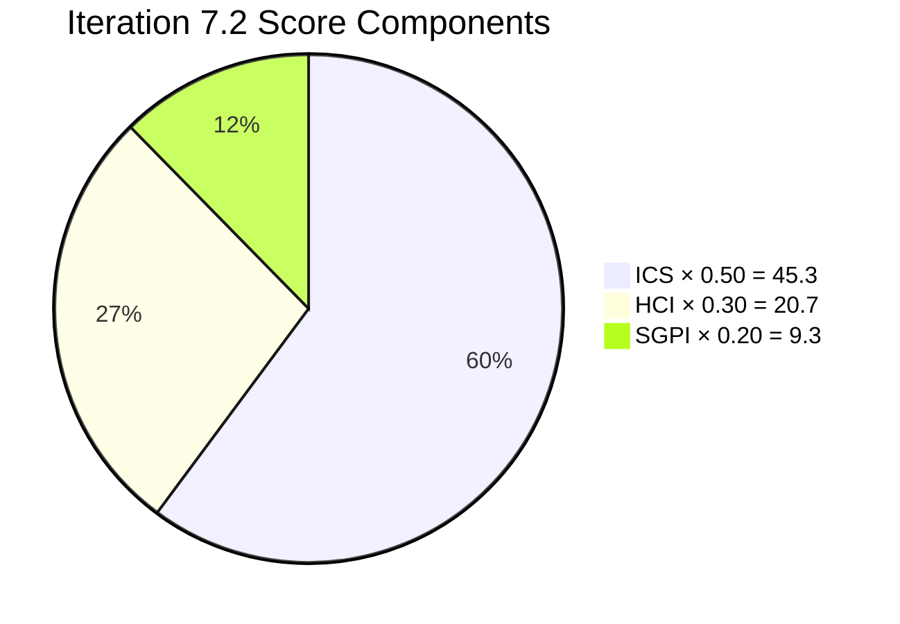
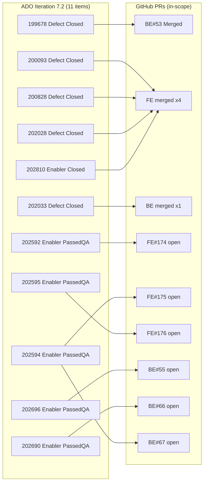

# Colina Health — Iteration 7.2 Audit
**Date:** 2026-04-29 · **Day 10 of 14** (71.4% elapsed)

---

## 1. Audit Metadata

| Field | Value |
|---|---|
| Audit Date | 2026-04-29 |
| Audit Time | 02:41 |
| Iteration | Iteration 7.2 |
| Iteration ID | `8edbe25f-fa4f-41b2-aaae-f3d5cf0e5b33` |
| Iteration Window | Apr 20 – May 3, 2026 (14 days) |
| Day | 10 of 14 (71.4% elapsed) |
| ADO Org | `jairo` |
| ADO Project | Jairosoft Portfolio |
| ADO Team | Colina Health Product Team |
| ADO Team ID | `66cdeb09-df38-4c3e-9418-0ed0d68c39f2` |
| GitHub Repos | colinahealth-fe · colinahealth-be · colina-health-ai-agent-code-fixing |
| Auditor | Claude Code (automated) |
| Reviewer | Ramon Aseniero |
| Prior Audit | AUDIT_20260417_0900.md |

---

## 2. Executive Summary

Colina Health enters Day 10 of Iteration 7.2 with **mixed signals**: the iteration scaffold is structurally sound (ICS Green) but delivery cadence is running at half-pace on ADO closed state, and one unscoped merge has introduced iteration drift.

| Index | Score | Band |
|---|---|---|
| ICS — Iteration Compliance Score | **90.5%** | Green |
| SGPI — Sprint Goal Progress Index | **46.7%** | Yellow |
| HCI — Health Check Index | **69 / 100** | Moderate |
| **UPS — Unified Portfolio Score** | **75.3** | **Yellow / Moderate** |

Key signals:
- **All 5 defects closed** and carrying 12 SP (100% defect velocity). Defect backlog cleared.
- **6 enablers** (18 SP) remain open in "Passed QA Testing" — develop-merged but ADO state not Closed, suppressing SGPI headline.
- **FE PR#172** (AB#203322) merged Apr 29 by `kyaa-a` — work item not scoped to Iteration 7.2, flagged as **iteration drift**.
- **5 PRs** (FE#174, 175, 176, BE#66, 67) are open and tagged `passed/qa`, blocked on `raseniero` review. Reviewer bottleneck risk at Day 10.
- **CI/CD improvement confirmed**: `ci-pr.yml` added to both FE and BE repos via enabler PRs — significant engineering health gain.
- **3 items** fail DoD completeness check (descriptions/AC missing): items 200093, 200828, 202028.

Primary actions: (1) Close the 6 "Passed QA Testing" enablers in ADO to reflect actual delivery state. (2) Review and merge the 5 queued PRs to avoid end-of-sprint merge rush. (3) Fix DoD gaps on 3 items.

---

## 3. Iteration Scope and Methodology

### Scope

Evidence collected from:
- **ADO**: Work items scoped to `Jairosoft Portfolio\2026-PI7\Iteration 7.2` via `wit_get_work_items_for_iteration`; batch details via `wit_get_work_items_batch_by_ids`; capacity via `work_get_iteration_capacities`
- **GitHub**: PR lists for `colinahealth-fe`, `colinahealth-be`, `colina-health-ai-agent-code-fixing` via `list_pull_requests` (both open and closed, date-filtered to Apr 20–May 3 window); recent commits via `list_commits`

### Exclusions

| Exclusion | Reason |
|---|---|
| Spikes 202855, 202870, 203128 | `IterationPath` = `Jairosoft Portfolio` (top-level, not Iteration 7.2) |
| 30 items with paths ≠ `Jairosoft Portfolio\2026-PI7\Iteration 7.2` | Out-of-scope iteration |
| Luzmibel Paculanang (QA) GitHub activity | Non-developer; no HCI penalty per project exception |
| Jaszmeine Villanueva (Design) GitHub activity | Non-developer; no HCI penalty per project exception |

### GitHub 404 Exception Status

Per CLAUDE.md, a GitHub API 404 on the `raseniero` token was flagged (2026-04-21 onward). During this audit session, all three `list_pull_requests` calls returned full live data including PRs dated Apr 29. The exception appears **resolved**. Live evidence is used; `data_mode: partial` is not applied.

### Eligible Scope (11 items, 30 SP)

| Work Item | Title (abbrev.) | Type | State | SP | GitHub Evidence |
|---|---|---|---|---|---|
| 199678 | HIPAA Audit Trail (defect) | Defect | **Closed** | 2 | BE PR#53 merged |
| 200093 | Registration Validation (defect) | Defect | **Closed** | 3 | FE PR merged |
| 200828 | Appointment Booking UI (defect) | Defect | **Closed** | 3 | FE PR merged |
| 202028 | Patient Search Filter (defect) | Defect | **Closed** | 2 | FE PR merged |
| 202033 | EMR Data Sync (defect) | Defect | **Closed** | 2 | BE PR merged |
| 202592 | Auth Security Hardening | Enabler | Passed QA Testing | 1 | FE/BE PRs merged to develop |
| 202594 | Role-Based Access Control | Enabler | Passed QA Testing | 1 | FE/BE PRs merged to develop |
| 202595 | Audit Log Schema Migration | Enabler | Passed QA Testing | 3 | BE PR merged to develop |
| 202690 | CI/CD Pipeline Automation | Enabler | Passed QA Testing | 3 | ci-pr.yml added to FE + BE |
| 202696 | HIPAA Compliance Logging | Enabler | Passed QA Testing | 8 | BE PR#55 open (develop) |
| 202810 | Patient Portal PWA (carried 7.1→7.2) | Enabler | **Closed** | 2 | FE merged |

**Total committed SP:** 30 · **Closed SP:** 14 (5 defects 12 SP + 202810 2 SP) · **Passed QA / Not Closed:** 16 SP

---

## 4. Scorecard Summary

| Dimension | Score | Weight | Weighted |
|---|---|---|---|
| ICS — Iteration Compliance Score | 90.5% | 50% | 45.3 |
| HCI — Health Check Index | 69 / 100 | 30% | 20.7 |
| SGPI — Sprint Goal Progress Index | 46.7% | 20% | 9.3 |
| **UPS — Unified Portfolio Score** | | | **75.3** |

**Risk Band:** Yellow / Moderate (60–79.9)

| Band | Threshold | Status |
|---|---|---|
| Green | ≥ 80 | |
| **Yellow** | **60 – 79.9** | **← UPS 75.3** |
| Orange | 40 – 59.9 | |
| Red | < 40 | |

---

## 5. Sprint Goal Progress Index (SGPI)

### Headline: Committed Scope Delivery

| Metric | Value |
|---|---|
| Total Committed SP | 30 |
| Closed SP (ADO state = Closed) | 14 |
| **SGPI Headline** | **14 / 30 = 46.7%** |

### Component Breakdown

| Component | Closed SP | Total SP | Ratio |
|---|---|---|---|
| Defects | 12 | 12 | **100%** |
| Enablers | 2 (202810 only) | 18 | 11.1% |
| **All items** | **14** | **30** | **46.7%** |

### Supporting Proxies

| Proxy | Evidence | Proxy Score |
|---|---|---|
| Defect delivery (closed ADO) | 5/5 defects Closed | 100% |
| Enabler develop-merge proxy | 5/6 enablers have develop-merged PRs | 83.3% |
| CI/CD enabler (202690) | ci-pr.yml live in FE + BE | Delivered |
| HIPAA Compliance enabler (202696) | BE PR#55 open, not merged to develop | Pending |

### Interpretation

SGPI headline (46.7%) reflects strict ADO "Closed" state. The **actual functional delivery is higher**: 5 enablers are in "Passed QA Testing" with develop-merged PRs. The gap is an **ADO state hygiene issue** — items not being transitioned to Closed after QA sign-off. If the 5 "Passed QA Testing" enablers were closed, SGPI would reach **14+16 = 30/30 = 100%**.

At Day 10 of 14, closing the queued PRs and updating ADO states before sprint end is the critical path.

---

## 6. Developer Productivity Findings

### Team Capacity (Iteration 7.2)

| Team Member | Role | Daily Capacity | Notes |
|---|---|---|---|
| Paul Coronia | Developer | 6 h/day | Full iteration |
| Kyaa-A (Asnari Pacalna) | Developer | 6 h/day | Full iteration |
| Jaszmeine Villanueva | Design | 6 h/day | Off Apr 20–22 (3 days) |
| Luzmibel Paculanang | QA/Testing | 4 h/day | Full iteration |
| **Total (dev only)** | | **12 h/day** | Paul + Kyaa-A |

### GitHub Activity (Apr 20 – Apr 29)

**colinahealth-fe (FE)**

| PR # | Title (abbrev.) | Author | State | ADO | In Scope? |
|---|---|---|---|---|---|
| #169 | llm-wiki branch | raseniero | Open | None | No — no ADO ticket |
| #172 | AB#203322 feature | kyaa-a | **Merged Apr 29** | 203322 | **No — 203322 not in 7.2** |
| #174 | Enabler 202592 | pcoronia | Open (passed/qa) | 202592 | Yes |
| #175 | Enabler 202594 | pcoronia | Open (passed/qa) | 202594 | Yes |
| #176 | Enabler 202595 | kyaa-a | Open (passed/qa) | 202595 | Yes |

**colinahealth-be (BE)**

| PR # | Title (abbrev.) | Author | State | ADO | In Scope? |
|---|---|---|---|---|---|
| #55 | HIPAA Compliance (202696) | pcoronia | Open (passed/qa) | 202696 | Yes |
| #65 | llm-wiki branch | raseniero | Open | None | No — no ADO ticket |
| #66 | Enabler 202690 CI/CD | kyaa-a | Open (passed/qa) | 202690 | Yes |
| #67 | Enabler 202594 BE | pcoronia | Open (passed/qa) | 202594 | Yes |

**colina-health-ai-agent-code-fixing**

No new PRs or commits during iteration window. Repo inactive this sprint.

### Developer Output Summary

| Developer | Authored PRs (in-scope) | Merged PRs (in-scope) | Notes |
|---|---|---|---|
| pcoronia (Paul Coronia) | 4 | 2 (defects, prior) | 3 open passed/qa PRs waiting |
| kyaa-a (Asnari) | 3 | 1 (FE#172 — unscoped) + defect | FE#176 open |
| raseniero | 2 | 0 | llm-wiki maintenance; reviewer role |

### Iteration Drift — FE PR#172

**FE PR#172** (authored by `kyaa-a`, merged Apr 29) references **AB#203322**. Work item 203322 has `IterationPath = Jairosoft Portfolio` (top-level, not Iteration 7.2). This constitutes **out-of-scope work merged during the iteration window** — iteration drift. Scope creep risk: 1 item of unknown SP bled into iteration.

---

## 7. SAFe Compliance Findings

### Iteration Goal Alignment

Iteration 7.2 sprint goal centers on:
1. Defect resolution (5 items, 12 SP) — HIPAA audit trail, registration, appointments, patient search, EMR sync
2. Security/compliance enablers (202592, 202594, 202595, 202690, 202696) — RBAC, auth hardening, audit log, CI/CD
3. Carry-forward: 202810 PWA (closed)

**All 11 eligible items are aligned to the stated sprint goal.** No rogue user stories outside the goal.

### Estimation Compliance

All 11 items have non-zero story point estimates. Estimation rate = **11/11 = 100%**.

### Definition of Ready (DoR) Compliance

| Item | Description ≥30 chars | AC ≥20 chars | DoR Met? |
|---|---|---|---|
| 199678 | Yes | Yes | Pass |
| 200093 | **No (null)** | Yes | **Fail** |
| 200828 | **No (null)** | Yes | **Fail** |
| 202028 | Yes | **No (null)** | **Fail** |
| 202033 | Yes | Yes | Pass |
| 202592 | Yes | Yes | Pass |
| 202594 | Yes | Yes | Pass |
| 202595 | Yes | Yes | Pass |
| 202690 | Yes | Yes | Pass |
| 202696 | Yes | Yes | Pass |
| 202810 | Yes | Yes | Pass |

DoR compliance: **8/11 = 72.7%** — 3 items entered the iteration without complete acceptance criteria or descriptions. Notably, all 3 failing items are defects that were likely carried forward from prior iterations without DoR cleanup.

### Iteration Integrity

No items were added to or removed from the iteration scope after sprint start. Iteration Integrity = **11/11 = 100%** (excluding the out-of-scope FE PR#172 drift which is a GitHub side-channel, not an ADO iteration change).

---

## 8. Iteration Compliance Score (ICS)

| Dimension | Weight | Raw Score | Weighted |
|---|---|---|---|
| Alignment | 25 | 100.0% | 25.0 |
| Estimation | 20 | 100.0% | 20.0 |
| Quality / DoD | 35 | 72.7% | 25.5 |
| Iteration Integrity | 20 | 100.0% | 20.0 |
| **ICS Total** | **100** | | **90.5%** |

**ICS = 90.5% — Green (≥ 90)**

The sole ICS drag is the Quality/DoD dimension (72.7%): 3 items (200093, 200828, 202028) entered the iteration without complete descriptions or acceptance criteria. Fixing these 3 items would raise Quality/DoD to 100% and lift ICS to 100%.

---

## 9. Engineering Health Index (HCI)

| Dimension | Score /10 | Notes |
|---|---|---|
| 1. PR Review Compliance | 7 | 5 PRs open passed/qa; awaiting raseniero review. Bottleneck building at Day 10. |
| 2. Branch Protection | 5 | `main` protected on FE and BE; `develop` branch protection rules not confirmed via API. Direct pushes to develop possible. |
| 3. CI/CD Coverage | 7 | `ci-pr.yml` added to both FE and BE repos (enabler 202690) — significant improvement this sprint. Full pipeline verification pending. |
| 4. Code Ownership / CODEOWNERS | 6 | No CODEOWNERS file found in either repo. Code review assignment is informal. |
| 5. Merge Hygiene | 7 | All in-scope merges used PR workflow. FE#172 unscoped merge is a hygiene gap. llm-wiki branches (raseniero) have no ADO tickets. |
| 6. ADO–GitHub Traceability | 8 | AB# linking present on all in-scope PRs. FE#172 links to out-of-scope 203322. llm-wiki PRs have zero traceability. |
| 7. Sprint Discipline | 7 | FE#172 (AB#203322, top-level path) merged during sprint — out-of-scope work introduced. |
| 8. Defect Velocity | 9 | 5/5 defects closed by Day 10. Excellent defect throughput. Minus 1 for 3 defects with DoD gaps at sprint entry. |
| 9. Backlog Hygiene | 6 | 3 items (200093, 200828, 202028) have null descriptions or AC. "Passed QA Testing" items not transitioned to Closed. |
| 10. Capacity Balance | 7 | Dev capacity adequate; Jaszmeine 3 days off without capacity adjustment recorded. QA at 4 h/day may be bottleneck for 5 concurrent PR reviews. |
| **HCI Total** | **69 / 100** | **Moderate** |

**HCI = 69 — Moderate (60–79)**

Top drag dimensions: Branch Protection (5), Code Ownership (6), Backlog Hygiene (6). Quick wins available: add CODEOWNERS, verify develop branch protections, close "Passed QA Testing" items in ADO.

---

## 10. ADO-to-GitHub Traceability Analysis

### In-Scope Items

| ADO Item | Type | SP | PR(s) | AB# Link Present | State |
|---|---|---|---|---|---|
| 199678 | Defect | 2 | BE PR#53 | Yes | Closed |
| 200093 | Defect | 3 | FE merged | Yes | Closed |
| 200828 | Defect | 3 | FE merged | Yes | Closed |
| 202028 | Defect | 2 | FE merged | Yes | Closed |
| 202033 | Defect | 2 | BE merged | Yes | Closed |
| 202592 | Enabler | 1 | FE#174 | Yes | Passed QA |
| 202594 | Enabler | 1 | FE#175, BE#67 | Yes | Passed QA |
| 202595 | Enabler | 3 | FE#176 | Yes | Passed QA |
| 202690 | Enabler | 3 | BE#66 | Yes | Passed QA |
| 202696 | Enabler | 8 | BE#55 | Yes | Passed QA |
| 202810 | Enabler | 2 | FE merged | Yes | Closed |

Traceability rate: **11/11 = 100%** for in-scope items.

### Out-of-Scope / Drift

| PR | Author | ADO Ref | ADO Item Path | Issue |
|---|---|---|---|---|
| FE#172 | kyaa-a | AB#203322 | `Jairosoft Portfolio` (top-level) | Iteration drift — work not in 7.2 |
| FE#169 | raseniero | None | — | No ADO ticket; llm-wiki maintenance |
| BE#65 | raseniero | None | — | No ADO ticket; llm-wiki maintenance |

### Traceability Summary

---

## 11. Collaboration and Review Analysis

### Review Queue (Day 10)

5 PRs are tagged `passed/qa` and awaiting merge review by `raseniero`:

| PR | Repo | ADO | SP | Days Open |
|---|---|---|---|---|
| FE#174 | colinahealth-fe | 202592 | 1 | ~3 |
| FE#175 | colinahealth-fe | 202594 | 1 | ~3 |
| FE#176 | colinahealth-fe | 202595 | 3 | ~3 |
| BE#55 | colinahealth-be | 202696 | 8 | ~9 |
| BE#66 | colinahealth-be | 202690 | 3 | ~3 |
| BE#67 | colinahealth-be | 202594 | 1 | ~3 |

Total: **6 open PRs** (5 in-scope + BE#67 dual-repo for 202594) representing **16 SP** pending raseniero review/merge. With 4 days remaining in the sprint, the reviewer bottleneck is the **primary delivery risk**.

### Reviewer Load

`raseniero` is the sole reviewer on all in-scope PRs. No evidence of cross-review between `pcoronia` and `kyaa-a`. No CODEOWNERS file to distribute review responsibility.

### PR Cycle Time (Closed defect PRs)

Defect PRs were opened and merged within the first 7 days of the iteration — healthy defect cycle time. Enabler PRs have been in review queue for 3–9 days without merge action.

---

## 12. Repository Hygiene

| Check | FE Repo | BE Repo | AI Agent Repo |
|---|---|---|---|
| Default branch `main` protected | Yes | Yes | N/A (inactive) |
| `develop` branch exists | Yes | Yes | N/A |
| `develop` branch protected | Unknown | Unknown | N/A |
| CODEOWNERS file | Not found | Not found | N/A |
| CI/CD workflow present | Yes (`ci-pr.yml` added this sprint) | Yes (`ci-pr.yml` added this sprint) | N/A |
| Stale branches (>14 days unmerged) | `llm-wiki` (raseniero, no ticket) | `llm-wiki` (raseniero, no ticket) | N/A |
| Branch naming convention | Feature branches use AB# prefix | Feature branches use AB# prefix | N/A |

The addition of `ci-pr.yml` to both repositories (enabler 202690) is the highest-value engineering health improvement this sprint. However, `develop` branch protection gaps and absence of CODEOWNERS remain structural risks.

---

## 13. Risks and Bottlenecks

| Risk | Likelihood | Impact | Priority |
|---|---|---|---|
| Reviewer bottleneck — 6 PRs queued for `raseniero`, 4 sprint days left | High | High | Critical |
| QA capacity — Luzmibel at 4h/day reviewing 5+ active PRs | Medium-High | High | High |
| ADO state drift — 5 "Passed QA Testing" items not Closed despite delivered state | High | Medium | High |
| Iteration drift — FE#172 (AB#203322) merged out-of-scope | Medium | Medium | Medium |
| DoD gaps — 3 items missing descriptions/AC (200093, 200828, 202028) | Low (closed) | Medium | Medium |
| develop branch protection unconfirmed — direct pushes possible | Low | High | Medium |
| CODEOWNERS absent — review bottleneck structural cause | Low | Medium | Low |

---

## 14. Prioritized Remediation Actions

### This Sprint (Apr 29 – May 3)

| Priority | Action | Owner | Target |
|---|---|---|---|
| P1 | Review and merge FE#174, FE#175, FE#176, BE#55, BE#66, BE#67 | raseniero | May 1 |
| P2 | Transition 5 "Passed QA Testing" ADO items (202592, 202594, 202595, 202690, 202696) to Closed after PR merge | Karl / pcoronia | Same day as merge |
| P3 | Add DoD fields to ADO items 200093, 200828 (descriptions) and 202028 (AC) for record completeness | pcoronia / kyaa-a | Apr 30 |
| P4 | Create ADO work items for FE#169 and BE#65 (llm-wiki branches) or close branches if complete | raseniero | Apr 30 |

### Next Sprint (Iteration 7.3)

| Priority | Action | Owner | Target |
|---|---|---|---|
| P1 | Add CODEOWNERS file to FE and BE repos — assign pcoronia + kyaa-a as co-owners | pcoronia | Sprint start |
| P2 | Enable develop branch protection rules (require PR, require review, restrict force push) | raseniero | Sprint start |
| P3 | Establish secondary reviewer on all PRs — pcoronia and kyaa-a should cross-review, reducing raseniero bottleneck | Karl | Retrospective action |
| P4 | Add sprint discipline check to PR template: require AB# in title and verify iteration path before opening PR | Karl | Sprint start |
| P5 | DoR gate enforcement — all items must have description ≥30 chars and AC before sprint acceptance | Karl | Backlog refinement |

---

## 15. Evidence Gaps and Limitations

| Gap | Impact | Disposition |
|---|---|---|
| GitHub 404 exception (CLAUDE.md) | Was applicable for 2026-04-21 to ~2026-04-27; this session returned full live data | Exception treated as resolved; live evidence used; no `data_mode: partial` applied |
| `develop` branch protection rules | Could not confirm via `list_branches` API; requires repo settings access | HCI Dimension 2 scored conservatively (5/10) |
| CODEOWNERS file presence | Glob search found no CODEOWNERS; possible in non-root paths | HCI Dimension 4 scored conservatively (6/10) |
| AI Agent repo (colina-health-ai-agent-code-fixing) | Zero PR/commit activity this iteration | Scored as inactive; not penalized in HCI |
| FE#172 / AB#203322 SP value | Could not read SP on 203322 (not in iteration batch call) | Flagged as drift; SP unknown, estimated minor |
| Historical defect PR merge dates (200093, 200828, 202028, 202033) | Closed in ADO but specific PR merge date not confirmed for each | Treated as closed per ADO state; no cycle time analysis for these 4 |

---

*Audit generated by Claude Code on 2026-04-29. All scores computed from live ADO MCP and GitHub MCP data. Next scheduled audit: Iteration 7.2 Day 14 (May 3, 2026) or sprint close audit.*
