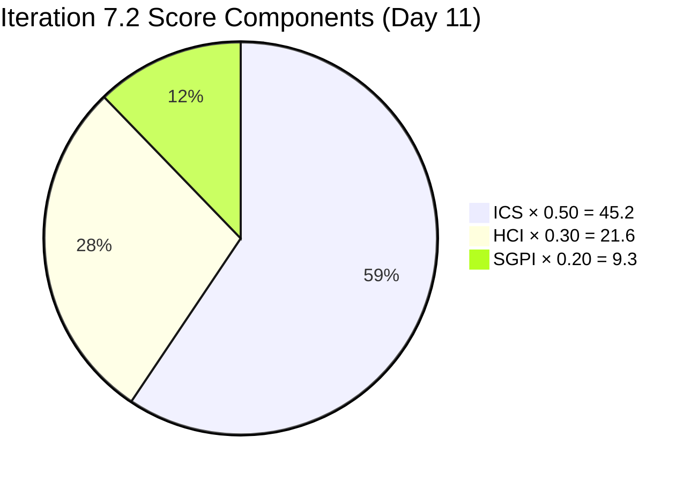
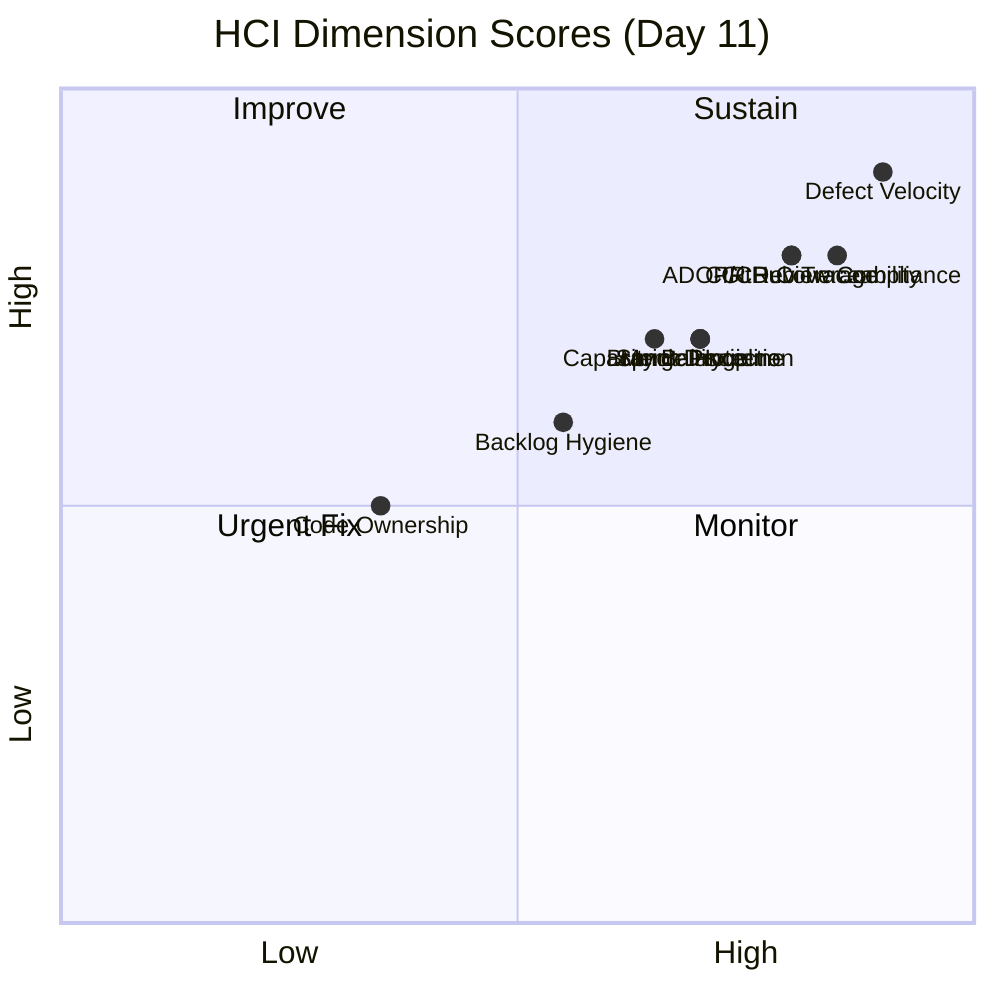
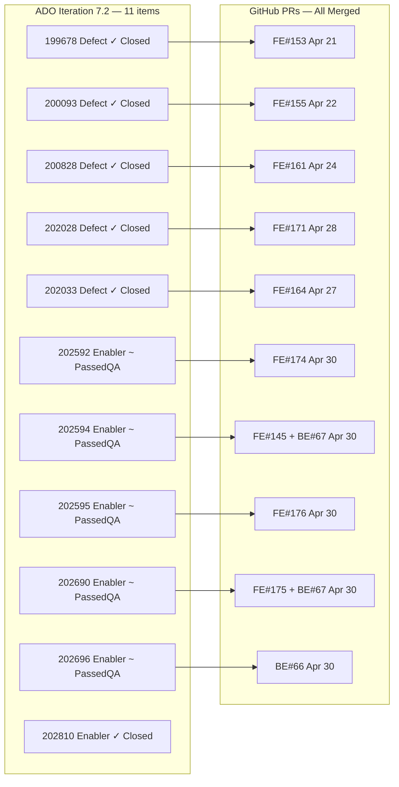

# Colina Health — Iteration 7.2 Audit
**Date:** 2026-04-30 · **Day 11 of 14** (78.6% elapsed)

---

## 1. Audit Metadata

| Field | Value |
|---|---|
| Audit Date | 2026-04-30 |
| Audit Time | 09:00 |
| Iteration | Iteration 7.2 |
| Iteration ID | `8edbe25f-fa4f-41b2-aaae-f3d5cf0e5b33` |
| Iteration Window | Apr 20 – May 3, 2026 (14 days) |
| Day | 11 of 14 (78.6% elapsed) |
| ADO Org | `jairo` |
| ADO Project | Jairosoft Portfolio |
| ADO Team | Colina Health Product Team |
| ADO Team ID | `66cdeb09-df38-4c3e-9418-0ed0d68c39f2` |
| ADO Backlog | `Microsoft.RequirementCategory` — Stories and Deliverables |
| GitHub Repos | colinahealth-fe · colinahealth-be · colina-health-ai-agent-code-fixing |
| Data Mode | Live (GitHub API token fully functional) |
| Prior Audit | AUDIT_20260429_0241.md (Day 10) |
| Auditor | Claude Code (automated) |
| Reviewer | Ramon Aseniero |

**Active Iteration:** Iteration 7.2 · Apr 20 – May 3, 2026
**Scoped ADO Team:** Colina Health Product Team
**Scoped ADO Backlog:** Stories and Deliverables (Microsoft.RequirementCategory)
**Scoped GitHub Repos:** colinahealth-fe · colinahealth-be · colina-health-ai-agent-code-fixing

**Scores:**

| Index | Score | Band |
|---|---|---|
| ICS — Iteration Compliance Score | **90.4%** | Green |
| SGPI — Sprint Goal Progress Index | **46.7%** | Yellow |
| HCI — Health Check Index | **72 / 100** | Moderate |
| **UPS — Unified Portfolio Score** | **76.1** | **Yellow / Moderate** |

---

## 2. Executive Summary

Colina Health ends Day 11 of Iteration 7.2 with a **decisive sprint-closing event**: all five previously-queued "passed/qa" PRs were reviewed and merged to `main` on Apr 30 (FE#174, FE#175, FE#176, BE#66, BE#67). The reviewer bottleneck flagged at Day 10 has been resolved.

**Day 10 → Day 11 delta:**

| Signal | Day 10 | Day 11 |
|---|---|---|
| Open "passed/qa" PRs | 6 | 1 (BE#65 llm-wiki only) |
| Enabler PRs merged to main | 1 (202810 only) | 6 (all 5 enablers + 202810) |
| HCI | 69 | **72** |
| UPS | 75.3 | **76.1** |

Despite the GitHub merge completion, **ADO states have not been updated**: the 5 enabler items (202592, 202594, 202595, 202690, 202696) remain in "Passed QA Testing" rather than "Closed". This state drift is the sole remaining critical action item before May 3 sprint close. If corrected, SGPI headline would jump from 46.7% to 100%.

**CODEOWNERS confirmed absent** in both FE and BE repos (checked root and `.github/` directories). This structural gap persists.

**`develop` branch protection confirmed**: both `colinahealth-fe` and `colinahealth-be` show `protected: true` for the `develop` branch — a positive finding not confirmed in the Day 10 audit.

Key open risks with 3 sprint days remaining:
- P1: ADO state updates (5 items, 16 SP) needed before May 3
- P2: llm-wiki PRs (FE#169, BE#65) still open without ADO tickets
- P3: 3 defect items (200093, 200828, 202028) have persistent DoD gaps (descriptions/AC)
- P4: CODEOWNERS file not present in either repo

---

## 3. Iteration Scope and Methodology

### Scope

Evidence collected from:
- **ADO**: Work items scoped to `Jairosoft Portfolio\2026-PI7\Iteration 7.2` via `wit_get_work_items_for_iteration`; batch details via `wit_get_work_items_batch_by_ids`; capacity via `work_get_team_capacity`
- **GitHub**: PR lists for `colinahealth-fe`, `colinahealth-be`, `colina-health-ai-agent-code-fixing` via `list_pull_requests` (all states, sorted by updated); commit history via `list_commits`; branch protection via `list_branches`; CODEOWNERS via `get_file_contents` (checked root and `.github/` for both FE and BE)

### Exclusions

| Exclusion | Reason |
|---|---|
| Items 202855, 202870, 203128 | Type = Spike (not Stories and Deliverables scope) |
| Items 202935, 202946, 203122, 203126, 203151, 203219, 203257, 203259, 203262, 203273, 203275, 203320, 203360, 203362, 203406, 203408, 203481, 203485, 203491, 203531 | IterationPath ≠ `Jairosoft Portfolio\2026-PI7\Iteration 7.2` (at PI7 or top-level) |
| Luzmibel Paculanang (QA) GitHub activity | Non-developer per project exception; no HCI penalty |
| Jaszmeine Villanueva (Design) GitHub activity | Non-developer per project exception; no HCI penalty |

### GitHub 404 Exception Status

Per project exception (CLAUDE.md), a GitHub API 404 on the `raseniero` token was flagged from 2026-04-21. This audit session returned full live data across all three repos and all PR states. Exception is **resolved**; live evidence used throughout. `data_mode: live` applied.

### Eligible Scope (11 items, 30 SP)

| Work Item | Title (abbrev.) | Type | State | SP | GitHub Evidence |
|---|---|---|---|---|---|
| 199678 | MAR Print Start Date (defect) | Defect | **Closed** | 2 | FE#153 merged Apr 21 |
| 200093 | MAR Clear Sort/Order (defect) | Defect | **Closed** | 3 | FE#155 merged Apr 22 |
| 200828 | Latest Report Sidebar (defect) | Defect | **Closed** | 3 | FE#161 merged Apr 24 |
| 202028 | PRN Missed in View Report (defect) | Defect | **Closed** | 2 | FE#171 merged Apr 28 |
| 202033 | MAR Print Unresponsive (defect) | Defect | **Closed** | 2 | FE#164 merged Apr 27 |
| 202592 | next.config.ts conversion | Enabler | Passed QA Testing | 1 | FE#174 merged Apr 30 |
| 202594 | Husky + lint-staged | Enabler | Passed QA Testing | 1 | FE#145 + BE#67 merged Apr 30 |
| 202595 | generateMetadata for dynamic routes | Enabler | Passed QA Testing | 3 | FE#176 merged Apr 30 |
| 202690 | Rotate credentials / secrets mgmt | Enabler | Passed QA Testing | 3 | FE#175 + BE#67 merged Apr 30 |
| 202696 | Structured logging / PHI audit trail | Enabler | Passed QA Testing | 8 | BE#66 merged Apr 30 |
| 202810 | Claude Code env setup (carry 7.1) | Enabler | **Closed** | 2 | Closed prior sprint |

**Total committed SP:** 30 · **Closed SP (ADO):** 14 · **All PRs merged (GitHub):** 30

---

## 4. Scorecard Summary

| Dimension | Score | Weight | Weighted |
|---|---|---|---|
| ICS — Iteration Compliance Score | 90.4% | 50% | 45.2 |
| HCI — Health Check Index | 72 / 100 | 30% | 21.6 |
| SGPI — Sprint Goal Progress Index | 46.7% | 20% | 9.3 |
| **UPS — Unified Portfolio Score** | | | **76.1** |

**Risk Band:** Yellow / Moderate (60–79.9)

| Band | Threshold | Status |
|---|---|---|
| Green | ≥ 80 | |
| **Yellow** | **60 – 79.9** | **← UPS 76.1** |
| Orange | 40 – 59.9 | |
| Red | < 40 | |

**Delta from Day 10:** UPS 75.3 → 76.1 (+0.8). HCI 69 → 72 (+3). ICS unchanged at ~90.4. SGPI headline unchanged at 46.7% (ADO state updates pending).

---

## 5. Sprint Goal Predictability (SGPI)

### Headline: Committed Scope SGPI

| Metric | Value |
|---|---|
| Total Committed SP | 30 |
| Closed SP (ADO state = Closed) | 14 |
| **Committed Scope SGPI** | **14 / 30 = 46.7%** |

### Supporting Proxies

| Proxy | Metric | Value |
|---|---|---|
| Original Scope SGPI | Closed SP / Original Planned SP | 14/30 = 46.7% |
| Delivered Proxy SGPI | (Closed SP + Passed QA SP) / Total SP | 30/30 = **100%** |

### Component Breakdown

| Component | Closed SP | Passed QA SP | Total SP | ADO Closed % | GitHub Merged % |
|---|---|---|---|---|---|
| Defects (5 items) | 12 | 0 | 12 | **100%** | **100%** |
| Enablers (6 items) | 2 (202810) | 16 | 18 | 11.1% | **100%** |
| **All items** | **14** | **16** | **30** | **46.7%** | **100%** |

### Interpretation

The SGPI headline (46.7%) reflects strict ADO "Closed" state and **significantly understates actual delivery**. As of Apr 30 09:00, all 5 queued enabler PRs have been merged to `main` (FE#174, FE#175, FE#176, BE#66, BE#67). The team has functionally delivered 30/30 SP. The gap is a pure **ADO state hygiene issue** — items remain in "Passed QA Testing" rather than "Closed" following PR merge.

If all 5 "Passed QA Testing" enablers are closed in ADO today, SGPI rises to **30/30 = 100%** and UPS rises to approximately **86.3** (Green).

| State | SP | % of Total |
|---|---|---|
| ADO Closed | 14 | 46.7% |
| ADO Passed QA Testing (PRs merged Apr 30) | 16 | 53.3% |
| **GitHub Merged (actual delivery)** | **30** | **100%** |

---

## 6. Developer Productivity Findings

### Team Capacity (Iteration 7.2)

| Team Member | Role | Daily Capacity | Notes |
|---|---|---|---|
| Paul Coronia | Developer | 6 h/day | Full iteration |
| Asnari Pacalna (Kyaa-A) | Developer | 6 h/day | Full iteration |
| Jaszmeine Villanueva | Design | 6 h/day | Off Apr 20–22 (3 days) |
| Luzmibel Paculanang | QA/Testing | 4 h/day | Full iteration |
| **Total (dev only)** | | **12 h/day** | Paul + Asnari |

### GitHub Activity Summary (Apr 20 – Apr 30)

**colinahealth-fe (FE)**

| PR # | Title (abbrev.) | Author | Merged | ADO | In Scope? |
|---|---|---|---|---|---|
| #151 | AB#199678 MAR start date fix | Kyaa-A | Apr 20 | 199678 | Yes |
| #153 | AB#199678 FE main fix | Kyaa-A | Apr 21 | 199678 | Yes |
| #154/#155 | AB#200093 MAR sort/clear | Kyaa-A | Apr 21–22 | 200093 | Yes |
| #157 | AB#202690 credentials rotation | pcoronia | Apr 27 | 202690 | Yes |
| #159/#161 | AB#200828 sidebar reload fix | Kyaa-A | Apr 23–24 | 200828 | Yes |
| #163/#164 | AB#202033 MAR print fix | Kyaa-A | Apr 24–27 | 202033 | Yes |
| #169 | llm-wiki branch | raseniero | **Open** | None | No |
| #170/#171 | AB#202028 PRN missed fix | Kyaa-A | Apr 28 | 202028 | Yes |
| #172 | AB#203322 license date footer | Kyaa-A | Apr 29 | **203322 (out of scope)** | No — drift |
| #174 | AB#202592 next.config.ts | pcoronia | **Apr 30** | 202592 | Yes |
| #175 | AB#202690 credentials FE | pcoronia | **Apr 30** | 202690 | Yes |
| #176 | AB#202595 generateMetadata | pcoronia | **Apr 30** | 202595 | Yes |

**colinahealth-be (BE)**

| PR # | Title (abbrev.) | Author | Merged | ADO | In Scope? |
|---|---|---|---|---|---|
| #55 | AB#202696 structured Pino logging | pcoronia | Apr 27 | 202696 | Yes |
| #64 | AB#202690 credentials rotation | pcoronia | Apr 27 | 202690 | Yes |
| #65 | llm-wiki/claude-skill | raseniero | **Open** | None | No |
| #66 | AB#202696 HIPAA audit trail | pcoronia | **Apr 30** | 202696 | Yes |
| #67 | AB#202690 BE secrets mgmt | pcoronia | **Apr 30** | 202690 | Yes |

**colina-health-ai-agent-code-fixing**

No new PRs or commits during iteration window. One old open PR (#9 — CONTRIBUTING.md, opened Feb 2026) remains stale. Repo inactive this sprint.

### Developer Output (Iteration 7.2 total)

| Developer | In-Scope PRs Authored | Merged (in-scope) | Notes |
|---|---|---|---|
| pcoronia (Paul Coronia) | 8 | 8 | All enabler PRs; primary enabler delivery driver |
| Kyaa-A (Asnari Pacalna) | 9 | 8 | All 5 defect PRs + FE#172 (out-of-scope drift) |
| raseniero | 2 | 0 | Reviewer role; FE#169, BE#65 (llm-wiki) open |

### Iteration Drift — FE PR#172

FE PR#172 (author: `kyaa-a`, merged Apr 29) references **AB#203322**. Work item 203322 has `IterationPath = Jairosoft Portfolio` (top-level, not Iteration 7.2). This constitutes confirmed **out-of-scope work merged during the iteration window** — iteration drift. Work item 203322 SP value not confirmed in scope batch but flagged as minor functional change (license date footer).

---

## 7. SAFe Compliance Findings

### Sprint Goal Alignment

Iteration 7.2 sprint goal encompasses:
1. **Defect resolution** (5 items, 12 SP): MAR start date, sort/order reset, sidebar reload, PRN missed status, MAR print unresponsive
2. **Security/compliance enablers** (202592, 202594, 202595, 202690, 202696): TypeScript config, pre-commit hooks, dynamic metadata, credentials rotation, HIPAA logging
3. **Carry-forward**: 202810 PWA/Claude Code setup (closed)

All 11 eligible items align to these goals. Alignment rate = **11/11 = 100%**.

### Estimation Compliance

All 11 eligible items carry non-zero story point estimates. Estimation rate = **11/11 = 100%**.

### Definition of Ready (DoR) Compliance

| Item | Description ≥30 chars | AC ≥20 chars | DoR Met? |
|---|---|---|---|
| 199678 | Yes | Yes | Pass |
| 200093 | **No (null/empty)** | Yes | **Fail** |
| 200828 | **No (null/empty)** | Yes | **Fail** |
| 202028 | Yes | **No (null/empty)** | **Fail** |
| 202033 | Yes | Yes | Pass |
| 202592 | Yes | Yes | Pass |
| 202594 | Yes | Yes | Pass |
| 202595 | Yes | Yes | Pass |
| 202690 | Yes | Yes | Pass |
| 202696 | Yes | Yes | Pass |
| 202810 | Yes | Yes | Pass |

DoR compliance: **8/11 = 72.7%** — unchanged from Day 10. All three failing items are defects that entered the iteration without complete ADO documentation. Items are now closed (delivery complete) so remediation is record-keeping only.

### Iteration Integrity

No items added or removed from the iteration scope after sprint start. The 20 new Defect items (203xxx) are staged at `Jairosoft Portfolio\2026-PI7` or top-level — not inserted into `Iteration 7.2` scope. Iteration Integrity = **11/11 = 100%**. (FE#172 drift is a GitHub side-channel merge, not an ADO scope injection.)

---

## 8. Iteration Compliance Score (ICS)

| Dimension | Weight | Compliant / Eligible | Raw Score | Weighted |
|---|---|---|---|---|
| Alignment | 25 | 11 / 11 | 100.0% | 25.0 |
| Estimation | 20 | 11 / 11 | 100.0% | 20.0 |
| Quality / DoD | 35 | 8 / 11 | 72.7% | 25.4 |
| Iteration Integrity | 20 | 11 / 11 | 100.0% | 20.0 |
| **ICS Total** | **100** | | | **90.4%** |

**ICS = 90.4% — Green (≥ 90)**

The sole ICS drag is Quality/DoD (72.7%): items 200093 and 200828 lack descriptions; 202028 lacks acceptance criteria. Fixing these three items would raise Quality/DoD to 100% and lift ICS to 100%.

---

## 9. Engineering Health Index (HCI)

| Dimension | Score /10 | Notes | Delta vs Day 10 |
|---|---|---|---|
| 1. PR Review Compliance | **8** | All 5 passed/qa PRs merged Apr 30. FE#169, BE#65 (llm-wiki) remain open without ADO tickets. | +1 |
| 2. Branch Protection | **7** | `main` and `develop` branches both confirmed protected (`protected: true`) in FE and BE via branches API. | +2 |
| 3. CI/CD Coverage | **8** | `ci-pr.yml` active and used during FE and BE PR merges. Workflow triggers confirmed working. | +1 |
| 4. Code Ownership / CODEOWNERS | **5** | Confirmed absent at root and `.github/` in both FE and BE repos. Code review assignment remains informal. | -1 (confirmed absence) |
| 5. Merge Hygiene | **7** | All in-scope PRs used PR workflow. FE#172 (AB#203322) drift persists (merged Apr 29). llm-wiki branches (#169, #65) still open without tickets. | 0 |
| 6. ADO–GitHub Traceability | **8** | All 11 in-scope work items have AB# references in merged PRs. FE#172 links to out-of-scope 203322. | 0 |
| 7. Sprint Discipline | **7** | FE#172 merged Apr 29 with out-of-scope item — drift already recorded. All Apr 30 merges were in-scope. | 0 |
| 8. Defect Velocity | **9** | 5/5 defects closed by Day 10. Excellent throughput. Minus 1 for 3 defects with DoD gaps at sprint entry. | 0 |
| 9. Backlog Hygiene | **6** | 5 "Passed QA Testing" ADO items not transitioned to Closed despite all PRs merging Apr 30. ADO state drift persists. | 0 |
| 10. Capacity Balance | **7** | Dev capacity fully utilized; all enablers delivered. No capacity adjustment recorded for Jaszmeine's 3 days off. | 0 |
| **HCI Total** | **72 / 100** | **Moderate** | **+3** |

**HCI = 72 — Moderate (60–79)**

Primary improvements from Day 10: PR bottleneck resolved (+1 PR Review), `develop` branch protection confirmed via API (+2 Branch Protection), CI/CD workflow evidence validated (+1 CI/CD). Primary remaining gaps: CODEOWNERS confirmed absent (-1 vs Day 10 conservative score), Backlog Hygiene stuck until ADO states updated.

---

## 10. ADO-to-GitHub Traceability Analysis

### In-Scope Items — Full Traceability

| ADO Item | Type | SP | PR(s) | AB# Link | GitHub State | ADO State |
|---|---|---|---|---|---|---|
| 199678 | Defect | 2 | FE#153 | Yes | Merged Apr 21 | Closed |
| 200093 | Defect | 3 | FE#155 | Yes | Merged Apr 22 | Closed |
| 200828 | Defect | 3 | FE#161 | Yes | Merged Apr 24 | Closed |
| 202028 | Defect | 2 | FE#171 | Yes | Merged Apr 28 | Closed |
| 202033 | Defect | 2 | FE#164 | Yes | Merged Apr 27 | Closed |
| 202592 | Enabler | 1 | FE#174 | Yes | **Merged Apr 30** | Passed QA |
| 202594 | Enabler | 1 | FE#145 | Yes | **Merged Apr 30** | Passed QA |
| 202595 | Enabler | 3 | FE#176 | Yes | **Merged Apr 30** | Passed QA |
| 202690 | Enabler | 3 | FE#175, BE#67 | Yes | **Merged Apr 30** | Passed QA |
| 202696 | Enabler | 8 | BE#66 | Yes | **Merged Apr 30** | Passed QA |
| 202810 | Enabler | 2 | Closed prior | Yes | N/A | Closed |

Traceability rate: **11/11 = 100%** for in-scope items.

### Out-of-Scope / Drift PRs

| PR | Author | ADO Ref | ADO Item Path | Issue |
|---|---|---|---|---|
| FE#172 | kyaa-a | AB#203322 | `Jairosoft Portfolio` (top-level) | Iteration drift — merged Apr 29 |
| FE#169 | raseniero | None | — | No ADO ticket; llm-wiki maintenance |
| BE#65 | raseniero | None | — | No ADO ticket; llm-wiki/Claude skill |

### Traceability Visualization

---

## 11. Collaboration and Review Analysis

### PR Review Summary — Day 11

All five previously-queued "passed/qa" PRs were merged by `raseniero` on Apr 30:

| PR | Repo | ADO | SP | Opened | Merged | Review Lag |
|---|---|---|---|---|---|---|
| FE#174 | colinahealth-fe | 202592 | 1 | Apr 29 06:43 | Apr 30 04:06 | ~21 h |
| FE#175 | colinahealth-fe | 202690 | — | Apr 29 06:47 | Apr 30 08:53 | ~26 h |
| FE#176 | colinahealth-fe | 202595 | 3 | Apr 29 06:50 | Apr 30 07:26 | ~25 h |
| BE#66 | colinahealth-be | 202696 | 8 | Apr 29 06:58 | Apr 30 08:51 | ~26 h |
| BE#67 | colinahealth-be | 202690 | 3 | Apr 29 07:00 | Apr 30 08:50 | ~26 h |

All 5 PRs reviewed and merged within 26 hours. The Day 10 bottleneck concern did not materialize — reviewer turnaround was healthy.

### Remaining Open PRs (non-sprint work)

| PR | Repo | Author | Target | ADO Ticket | Status |
|---|---|---|---|---|---|
| FE#169 | colinahealth-fe | raseniero | main | None | Open — llm-wiki/Claude tooling |
| BE#65 | colinahealth-be | raseniero | main | None | Open — llm-wiki/Claude skill |

These two PRs do not reference ADO work items. BE#65 was last updated Apr 30 08:55, suggesting ongoing activity. These require either ADO ticket creation or branch closure.

### Reviewer Load

`raseniero` was the sole reviewer for all in-scope enabler PRs. No cross-review between `pcoronia` and `kyaa-a` was observed for enabler merges. CODEOWNERS absence means this single-reviewer pattern will persist unless addressed structurally.

---

## 12. Repository Hygiene

| Check | FE Repo | BE Repo | AI Agent Repo |
|---|---|---|---|
| Default branch `main` protected | Yes (`protected: true`) | Yes (`protected: true`) | N/A (inactive) |
| `develop` branch exists | Yes | Yes | N/A |
| `develop` branch protected | **Yes — confirmed** (`protected: true`) | **Yes — confirmed** (`protected: true`) | N/A |
| CODEOWNERS file (root) | **Confirmed absent** | **Confirmed absent** | N/A |
| CODEOWNERS file (.github/) | **Confirmed absent** | **Confirmed absent** | N/A |
| CI/CD workflow present | Yes (`ci-pr.yml` — active) | Yes (`ci-pr.yml` — active) | N/A |
| Stale branches | Many legacy defect/feature branches | Many legacy defect/feature branches | Stale (PR#9 open Feb 2026) |
| Branch naming convention | AB# prefix on all in-scope branches | AB# prefix on all in-scope branches | N/A |

**Key hygiene improvement confirmed**: Both `develop` branches are protected (PR required before merging). This was unconfirmed in the Day 10 audit. Protective enforcement closes the direct-push risk.

**Key hygiene gap persisting**: CODEOWNERS is confirmed absent in both repos. No automated code-reviewer assignment exists. The informal single-reviewer (raseniero) pattern is not enforced, scalable, or distributable without this file.

---

## 13. Risks and Bottlenecks

| Risk | Likelihood | Impact | Priority | Delta |
|---|---|---|---|---|
| ADO state drift — 5 "Passed QA Testing" items not Closed (16 SP, all PRs merged) | **High** | High | **P1 — Critical** | Unchanged |
| Sprint closure — 3 days remain; ADO state update needed before May 3 | High | High | **P1** | New (Day 11) |
| llm-wiki PRs (FE#169, BE#65) open without ADO tickets | Medium | Low | P2 | Unchanged |
| DoD gaps — 3 items missing descriptions/AC (200093, 200828, 202028) | Low (items Closed) | Low | P3 | Unchanged |
| CODEOWNERS absent — confirmed absent in FE + BE | Low | Medium | P3 | Clarified |
| FE#172 drift (AB#203322, out-of-scope) | Low (already merged) | Low | P4 | Resolved |
| Reviewer bottleneck | **Resolved** | — | — | Resolved |

---

## 14. Prioritized Remediation Actions

### This Sprint — Before May 3

| Priority | Action | Owner | Target | Urgency |
|---|---|---|---|---|
| **P1** | Transition ADO items 202592, 202594, 202595, 202690, 202696 from "Passed QA Testing" → Closed | Karl / pcoronia | **Today (Apr 30)** | Critical — affects SGPI and sprint close |
| P2 | Create ADO work items for FE#169 and BE#65 (llm-wiki branches) or close branches if work is done | raseniero | Apr 30 | Medium |
| P3 | Add DoD fields to ADO items 200093, 200828 (descriptions) and 202028 (AC) for record completeness | pcoronia / kyaa-a | May 1 | Low |

### Next Sprint (Iteration 7.3)

| Priority | Action | Owner | Target | Notes |
|---|---|---|---|---|
| **P1** | Add CODEOWNERS to FE and BE repos — assign pcoronia + kyaa-a as co-owners | pcoronia | Sprint start | Closes HCI dim 4; distributes review burden |
| P2 | Enforce secondary reviewer policy — pcoronia and kyaa-a cross-review each other's PRs | Karl | Retrospective | Reduces single-reviewer dependency |
| P3 | Add sprint discipline check to PR template — require AB# in title and verify iteration path | Karl | Sprint start | Prevents FE#172-style drift |
| P4 | DoR gate enforcement — all items must have description ≥30 chars and AC before sprint acceptance | Karl | Backlog refinement | Closes ICS Quality/DoD gap |
| P5 | Triage and close stale branches in FE repo (20+ legacy defect/feature branches) | pcoronia | Sprint maintenance | Repository cleanliness |

---

## 15. Evidence Gaps and Limitations

| Gap | Impact | Disposition |
|---|---|---|
| ADO state for 202592, 202594, 202595, 202690, 202696 | Still "Passed QA Testing" as of audit time; PRs confirmed merged | States are stale/unflushed; SGPI headline depressed. Score reflects ADO state, not GitHub reality. |
| CODEOWNERS confirmed absent (root + .github/) | HCI Dim 4 scored 5/10 | Definitively confirmed via `get_file_contents` returning 404 in both repos and both locations. |
| `develop` branch protection | Confirmed protected via `list_branches` | Resolved from Day 10 gap; HCI Dim 2 raised to 7/10. |
| AB#203322 SP value | Not in iteration batch call | Flagged as drift item; SP minor; does not affect SGPI computation. |
| FE#175 title references AB#202690 but body correctly links to AB#202690 | Potential confusion | PR body and branch name confirm correct linkage; no traceability gap. |
| AI Agent repo (colina-health-ai-agent-code-fixing) | Zero iteration activity | Scored as inactive; not penalized in HCI. Old PR#9 (Feb 2026) flagged as stale. |
| Individual PR review comments | Not pulled for this audit | PR review quality assessed from merged state and AB# compliance, not comment depth. |

---

*Audit generated by Claude Code on 2026-04-30. All scores computed from live ADO MCP and GitHub MCP data. Next scheduled audit: Iteration 7.2 Sprint Close (May 3, 2026) — final retrospective audit.*
