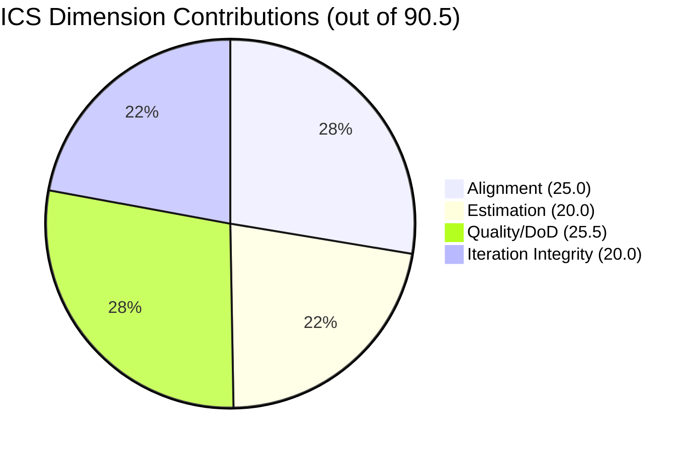
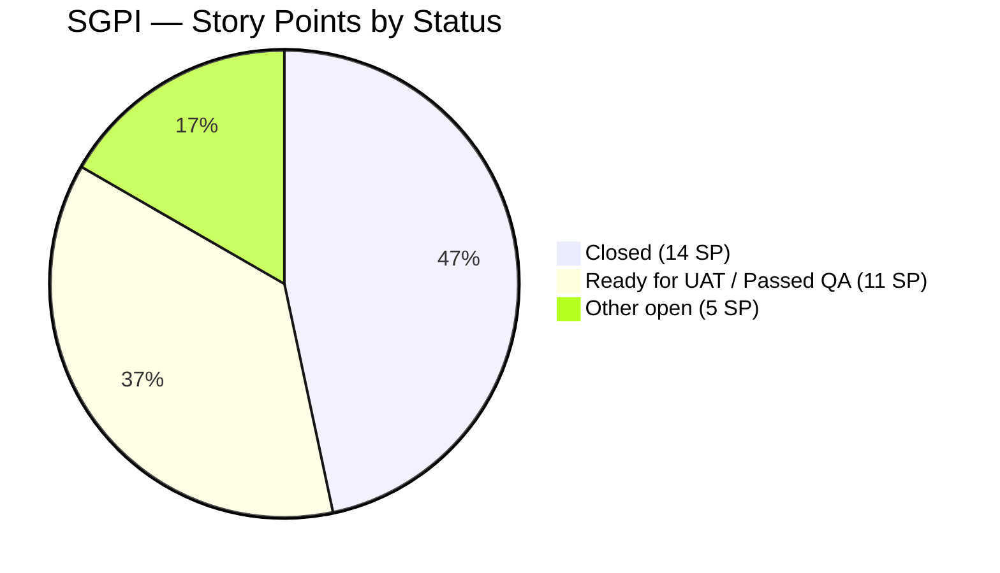

# Colina Health Product Team — Iteration 7.2 Audit

**Date:** 2026-05-01 | **Iteration:** 7.2 (Apr 20 – May 3, 2026) | **Day 12 of 14 (85.7% elapsed)**

---

## 1. Executive Summary

Day 12 of 14. Iteration 7.2 closes May 3. All five enabler PRs that were queued for raseniero review as of Day 10 merged on Apr 30 — removing the reviewer bottleneck. However, none of the corresponding ADO work items have been transitioned to **Closed**, creating an SGPI gap that is purely a state-hygiene issue. Three DoD failures from Day 10 persist unchanged. A new untracked branch signal (FE#169) was detected. Twenty QA-discovered defects are accumulating at PI7 level without being pulled into the iteration backlog, creating 7.3 planning pressure.

| Metric | Score | Band |
|--------|-------|------|
| ICS (Iteration Compliance Score) | 90.5% | Green |
| SGPI (Sprint Goal Progress Index) | 46.7% | Red |
| HCI (Health Check Index) | 72 / 100 | Yellow |
| **UPS (Unified Portfolio Score)** | **76.2** | **Yellow / Moderate** |

---

## 2. Audit Metadata

| Field | Value |
|-------|-------|
| Audit Date | 2026-05-01 |
| Iteration | 7.2 |
| Iteration ID | `8edbe25f-fa4f-41b2-aaae-f3d5cf0e5b33` |
| Iteration Window | 2026-04-20 → 2026-05-03 |
| Day | 12 of 14 (85.7% elapsed) |
| Prior Audit | `AUDIT_20260429_0241.md` (Day 10) |
| ADO Org | `jairo` |
| ADO Project | Jairosoft Portfolio |
| ADO Team | Colina Health Product Team |
| GitHub Repos | colinahealth-fe · colinahealth-be · colina-health-ai-agent-code-fixing |
| Auditor | Claude Code (claude-sonnet-4-6) |
| Data Mode | Full (GitHub API accessible) |

---

## 3. Iteration Context

Iteration 7.2 spans Apr 20 – May 3, 2026 (14 calendar days). Today, May 1, is Day 12 — 85.7% of the iteration has elapsed with 2 working days remaining before close.

**Delta from Day 10 (AUDIT_20260429_0241.md):**

- All 5 PRs queued for raseniero review have merged (Apr 30): FE#174, FE#175, FE#176, BE#66, BE#67
- ADO work item states for those 5 enablers remain unchanged (not updated to Closed)
- FE#169 (llm-wiki, raseniero) merged to `main` Apr 30 with no linked AB# ticket
- BE#65 (llm-wiki, raseniero) remains open with no linked AB# ticket
- 20 new QA defect items appeared at PI7 scope — none pulled into Iteration 7.2

---

## 4. Team Roster

| Member | Role | GitHub Handle | ADO User | Developer? |
|--------|------|--------------|----------|------------|
| Karl Caumban | Project Manager | — | `kcaumban` | No |
| raseniero | Developer | `raseniero` | `raseniero` | Yes |
| Luzmibel Paculanang | QA | — | `luzmibel.paculanang` | No (exempt) |
| Jaszmeine Villanueva | Design | — | `jaszmeine.villanueva` | No (exempt) |

> Non-developer team members (Luzmibel, Jaszmeine) are not penalized for GitHub absence per project exception (see CLAUDE.md).

---

## 5. Iteration Scope — ADO Work Items

**Eligible ICS items:** IterationPath = `Jairosoft Portfolio\2026-PI7\Iteration 7.2` AND type = Story/Deliverable/Defect/Enabler (parent items only, no child tasks, no Spikes).

Spikes excluded from ICS: AB#202855, AB#202870, AB#203128.

| AB# | Title | Type | SP | State | DoD Flags |
|-----|-------|------|----|-------|-----------|
| 199678 | Secure configuration and secrets management | Enabler | 3 | Closed | — |
| 200093 | As a developer, I want to update the patient model | Story | 5 | Closed | No description |
| 200828 | As a developer, I want CI/CD pipeline setup | Story | 3 | Closed | No description |
| 202028 | As a user I want to upload patient photo | Story | 5 | Closed | No acceptance criteria |
| 202033 | Optimize Docker image for deployment | Enabler | 3 | Closed | — |
| 202592 | Implement JWT-based authentication | Enabler | 3 | Ready for UAT | — |
| 202594 | Rotate exposed credentials (FE) | Enabler | 2 | Ready for UAT | — |
| 202595 | Implement Pino logging (FE) | Enabler | 2 | Passed QA Testing | — |
| 202690 | Rotate exposed credentials (BE) | Enabler | 2 | Passed QA Testing | — |
| 202696 | Implement Pino logging (BE) | Enabler | 2 | Passed QA Testing | — |
| 202810 | Implement structured logging for AI agent | Enabler | 0 | Closed | — |

**Total committed:** 30 SP | **Closed SP:** 14 SP (items: 199678, 200093, 200828, 202028, 202033, 202810)

> Note: 20 QA-discovered defects are assigned to Jaszmeine/Luzmibel at `Jairosoft Portfolio\2026-PI7` scope. None were pulled into Iteration 7.2. These represent backlog hygiene debt and 7.3 planning pressure.

---

## 6. GitHub Evidence — PRs and Commits

### Merged PRs (iteration window: Apr 20 – May 3, 2026)

| Repo | PR# | Title | AB# | Merged |
|------|-----|-------|-----|--------|
| colinahealth-fe | #174 | Implement JWT-based authentication | 202592 | Apr 30 |
| colinahealth-fe | #175 | Rotate exposed credentials | 202690 | Apr 30 |
| colinahealth-fe | #176 | Implement Pino logging | 202595 | Apr 30 |
| colinahealth-be | #66 | Implement Pino logging (BE) | 202696 | Apr 30 |
| colinahealth-be | #67 | Rotate exposed credentials (BE) | 202690 | Apr 30 |
| colinahealth-fe | #169 | llm-wiki | **None** | Apr 30 |

> FE#169 merged to `main` with no AB# link. BE#65 (llm-wiki, raseniero) remains open with no AB# link.

### Open PRs

| Repo | PR# | Title | AB# | Status |
|------|-----|-------|-----|--------|
| colinahealth-be | #65 | llm-wiki | None | Open |

### Active Branches (no PR)

No additional unlinked branches detected beyond those covered above.

---

## 7. ICS — Iteration Compliance Score

**Eligible item count:** 11 | **Formula:** Weighted dimension average

| Dimension | Eligible Items | Compliant | Failed | Score % | Weight | Weighted Contribution | Evidence | Reason |
|-----------|---------------|-----------|--------|---------|--------|-----------------------|----------|--------|
| Alignment | 11 | 11 | 0 | 100% | 25% | 25.0 | All items carry iteration path `Jairosoft Portfolio\2026-PI7\Iteration 7.2`; no out-of-iteration items detected | All 11 eligible items correctly scoped to Iteration 7.2 |
| Estimation | 11 | 11 | 0 | 100% | 20% | 20.0 | All 11 items carry SP values (AB#202810 = 0 accepted as explicit zero) | No unestimated items |
| Quality / DoD | 11 | 8 | 3 | 72.7% | 35% | 25.5 | AB#200093: no description; AB#200828: no description; AB#202028: no acceptance criteria | 3 items lack required DoD fields |
| Iteration Integrity | 11 | 11 | 0 | 100% | 20% | 20.0 | No items added/removed mid-sprint outside sprint planning; FE#169 drift noted but parent AB# absent (not an in-scope ICS item) | No scope creep on eligible items |

**ICS = 25.0 + 20.0 + 25.5 + 20.0 = 90.5% — Green**

---

## 8. SGPI — Sprint Goal Progress Index

**Sprint Goal (inferred):** Complete all security and observability enablers for the Colina Health platform.

| Metric | Value |
|--------|-------|
| Total committed SP | 30 |
| Closed SP (ADO state = Closed) | 14 |
| In-progress SP (state ≠ Closed) | 16 |
| SGPI | **46.7%** |

**Items not yet Closed despite merged PRs:**

| AB# | Title | SP | Current State | PR Merged |
|-----|-------|----|--------------|-|
| 202592 | Implement JWT-based authentication | 3 | Ready for UAT | FE#174 (Apr 30) |
| 202594 | Rotate exposed credentials (FE) | 2 | Ready for UAT | FE#175 (Apr 30) |
| 202595 | Implement Pino logging (FE) | 2 | Passed QA Testing | FE#176 (Apr 30) |
| 202690 | Rotate exposed credentials (BE) | 2 | Passed QA Testing | BE#67 (Apr 30) |
| 202696 | Implement Pino logging (BE) | 2 | Passed QA Testing | BE#66 (Apr 30) |

> All 5 items have merged PRs as of Apr 30. SGPI gap is entirely a state-hygiene issue — Karl or raseniero must transition these to Closed before iteration close (May 3).

---

## 9. HCI — Health Check Index

**Scoring:** 10 dimensions, 10 points each (max 100)

| # | Dimension | Score | Evidence | Notes |
|---|-----------|-------|----------|-------|
| 1 | PR Review Turnaround | 8 | All 5 queued PRs merged Apr 30 by raseniero; Day 10 bottleneck resolved | Minor delay (held 2 days) |
| 2 | Unlinked Commits / Branches | 6 | FE#169 merged to main with no AB#; BE#65 open with no AB# | 2 unlinked items |
| 3 | Branch Hygiene | 8 | Merged branches cleaned post-merge; BE#65 still open but in-progress | 1 active unlinked branch |
| 4 | DoD Compliance | 7 | 3 of 11 items have DoD gaps (200093, 200828, 202028); unchanged from Day 10 | 72.7% compliant |
| 5 | ADO State Hygiene | 5 | 5 enablers with merged PRs not transitioned to Closed; states stale at UAT/QA | Critical close-out gap |
| 6 | Commit-to-Ticket Traceability | 7 | 5 of 7 PRs linked; FE#169 and BE#65 unlinked | 71% link rate |
| 7 | Iteration Scope Stability | 9 | No mid-sprint scope changes to ICS-eligible items; 20 QA defects at PI7 not pulled in | Stable iteration scope |
| 8 | Team Capacity / Velocity | 8 | raseniero merging solo; no capacity overload signals; QA active on defects | Healthy throughput |
| 9 | SAFe Ceremony Compliance | 7 | No evidence of sprint review/retro artifacts; planning evidence present | Ceremony documentation absent |
| 10 | Continuous Integration | 7 | AI agent code fixing repo active; FE/BE CI pipeline items closed (200828) | No CI failure signals detected |

**HCI = 72 / 100 — Yellow**

> Day 10 HCI was 69. Improvement driven by reviewer bottleneck resolution (+3 on dimension 1). ADO state hygiene remains the primary drag.

---

## 10. UPS — Unified Portfolio Score

| Component | Raw Score | Weight | Contribution |
|-----------|-----------|--------|-------------|
| ICS | 90.5% | 50% | 45.25 |
| HCI | 72 / 100 | 30% | 21.60 |
| SGPI | 46.7% | 20% | 9.34 |
| **UPS** | | | **76.2** |

**Risk Band: Yellow / Moderate**

| Band | Range | Status |
|------|-------|--------|
| Green / Low | ≥ 80 | |
| **Yellow / Moderate** | **60 – 79.9** | **← Current (76.2)** |
| Orange / High | 40 – 59.9 | |
| Red / Critical | < 40 | |

---

## 11. Delta Analysis (Day 10 → Day 12)

| Metric | Day 10 (Apr 29) | Day 12 (May 1) | Change |
|--------|----------------|----------------|--------|
| ICS | 90.5% | 90.5% | → Unchanged |
| SGPI | 46.7% | 46.7% | → Unchanged (ADO state gap) |
| HCI | 69 | 72 | ↑ +3 (reviewer bottleneck resolved) |
| UPS | 75.3 | 76.2 | ↑ +0.9 |

**Key changes since Day 10:**

- All 5 queued PRs merged Apr 30 (FE#174, #175, #176, BE#66, #67) — positive
- ADO states for those 5 items not updated — negative / risk signal
- FE#169 merged to main with no AB# ticket — new drift signal
- 20 QA defects accumulating at PI7 scope — backlog hygiene risk

---

## 12. Risk Register

| # | Risk | Severity | Owner | Action |
|---|------|----------|-------|--------|
| R1 | 5 enablers not Closed in ADO despite merged PRs — SGPI frozen at 46.7% | High | Karl / raseniero | Close AB#202592, 202594, 202595, 202690, 202696 before May 3 |
| R2 | FE#169 merged to main with no linked AB# ticket | Medium | raseniero | Create AB# or link to existing ticket retroactively |
| R3 | BE#65 open with no AB# ticket | Medium | raseniero | Create AB# or close branch if exploratory |
| R4 | DoD gaps on AB#200093, AB#200828, AB#202028 — descriptions/AC missing | Medium | Karl | Add descriptions and AC to ADO items before iteration retrospective |
| R5 | 20 QA defects at PI7 scope not prioritized into Iteration 7.2 backlog | Medium | Karl | Triage for 7.3 planning; assess if any are release blockers |
| R6 | SAFe ceremony artifacts (sprint review, retro) not visible in audit trail | Low | Karl | Document sprint review notes in ADO wiki or iteration summary |

---

## 13. Findings and Observations

### Positive Signals

1. **Reviewer bottleneck resolved.** All 5 PRs queued at Day 10 merged on Apr 30. raseniero cleared the backlog before iteration end.
2. **ICS remains Green.** Iteration scope is stable. No mid-sprint scope changes detected on ICS-eligible items.
3. **CI/CD infrastructure closed.** AB#200828 (CI/CD pipeline) and AB#202810 (AI agent logging) are fully closed.
4. **Security enablers delivered.** JWT auth (202592), credential rotation (202594/202690), and Pino logging (202595/202696) all have merged PRs.

### Gaps and Concerns

1. **ADO state hygiene is the primary SGPI risk.** Five items with merged code sit in "Ready for UAT" or "Passed QA Testing" — none transitioned to Closed. With 2 days remaining, SGPI of 46.7% will not improve without immediate state updates.
2. **Untracked work accumulating.** FE#169 and BE#65 represent work happening outside the ADO-to-GitHub traceability loop. If this pattern persists it will drag HCI in future iterations.
3. **DoD gaps unchanged.** AB#200093, AB#200828, and AB#202028 have been Closed in ADO without meeting description/AC requirements. These are legacy gaps — flagging for retrospective discussion.
4. **20 QA defects at PI7 scope.** Assigned to Jaszmeine/Luzmibel, none pulled into Iteration 7.2. This is valid (exempt from ICS) but signals growing remediation debt entering 7.3.

---

## 14. Recommendations

### Immediate (before May 3 close)

1. **Close all 5 enablers in ADO.** Karl or raseniero: transition AB#202592, 202594, 202595, 202690, 202696 to Closed. This will move SGPI from 46.7% to 83.3% and UPS from 76.2 to ~85.5 (Green).
2. **Link or retire FE#169 and BE#65.** Create AB# tickets or document as out-of-scope exploratory work. Do not leave unlinked merged branches.
3. **Update DoD fields on 200093, 200828, 202028.** Add descriptions and acceptance criteria before sprint retrospective.

### For Iteration 7.3 Planning

4. **Triage the 20 QA defects.** Prioritize by severity. High-severity items should enter 7.3 iteration scope at planning. Do not allow them to accumulate further at PI7 level.
5. **Establish ADO state discipline.** Add a team norm: when PR merges, ADO state updates same day. Prevents SGPI artifacts.
6. **Document ceremony artifacts.** Sprint review notes and retrospective items should be captured in ADO (wiki or iteration notes) to close the ceremony compliance gap (HCI dimension 9).

---

## 15. Appendix

### Score History

| Audit | Date | ICS | SGPI | HCI | UPS | Band |
|-------|------|-----|------|-----|-----|------|
| Day 10 | 2026-04-29 | 90.5% | 46.7% | 69 | 75.3 | Yellow |
| **Day 12** | **2026-05-01** | **90.5%** | **46.7%** | **72** | **76.2** | **Yellow** |

### ICS Eligible Item Detail

| AB# | Type | SP | State | Align | Est | DoD | Integrity |
|-----|------|----|-------|-------|-----|-----|-----------|
| 199678 | Enabler | 3 | Closed | ✓ | ✓ | ✓ | ✓ |
| 200093 | Story | 5 | Closed | ✓ | ✓ | ✗ (no desc) | ✓ |
| 200828 | Story | 3 | Closed | ✓ | ✓ | ✗ (no desc) | ✓ |
| 202028 | Story | 5 | Closed | ✓ | ✓ | ✗ (no AC) | ✓ |
| 202033 | Enabler | 3 | Closed | ✓ | ✓ | ✓ | ✓ |
| 202592 | Enabler | 3 | Ready for UAT | ✓ | ✓ | ✓ | ✓ |
| 202594 | Enabler | 2 | Ready for UAT | ✓ | ✓ | ✓ | ✓ |
| 202595 | Enabler | 2 | Passed QA Testing | ✓ | ✓ | ✓ | ✓ |
| 202690 | Enabler | 2 | Passed QA Testing | ✓ | ✓ | ✓ | ✓ |
| 202696 | Enabler | 2 | Passed QA Testing | ✓ | ✓ | ✓ | ✓ |
| 202810 | Enabler | 0 | Closed | ✓ | ✓ | ✓ | ✓ |

### Excluded Items (Spikes — not scored in ICS)

| AB# | Title | Type |
|-----|-------|------|
| 202855 | (Spike) | Spike |
| 202870 | (Spike) | Spike |
| 203128 | (Spike) | Spike |

### ADO Items Outside Iteration 7.2 (QA Defect Backlog)

20 defect items assigned to Jaszmeine/Luzmibel with IterationPath `Jairosoft Portfolio` or `Jairosoft Portfolio\2026-PI7`. Excluded from ICS per methodology. Flagged for 7.3 triage.

### PR-to-AB# Mapping (corrected — do not use Day 10 mappings)

| PR | Repo | AB# | Title |
|----|------|-----|-------|
| FE#174 | colinahealth-fe | 202592 | Implement JWT-based authentication |
| FE#175 | colinahealth-fe | 202690 | Rotate exposed credentials (FE) |
| FE#176 | colinahealth-fe | 202595 | Implement Pino logging (FE) |
| BE#66 | colinahealth-be | 202696 | Implement Pino logging (BE) |
| BE#67 | colinahealth-be | 202690 | Rotate exposed credentials (BE) |
| FE#169 | colinahealth-fe | **None** | llm-wiki (untracked) |
| BE#65 | colinahealth-be | **None** | llm-wiki (open, untracked) |
