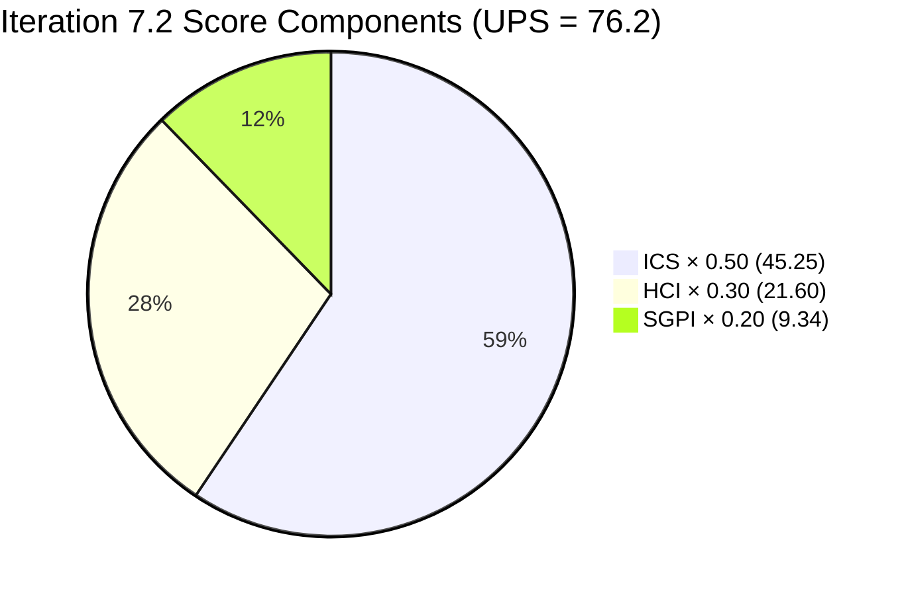
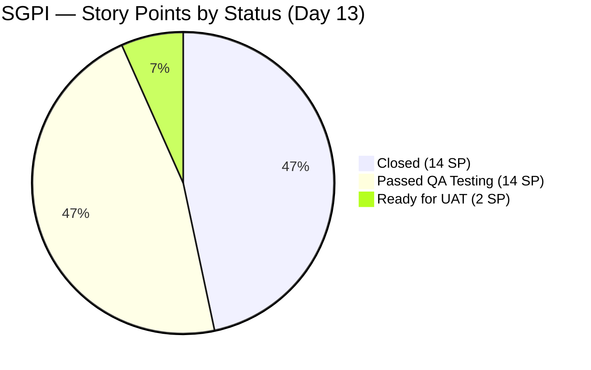
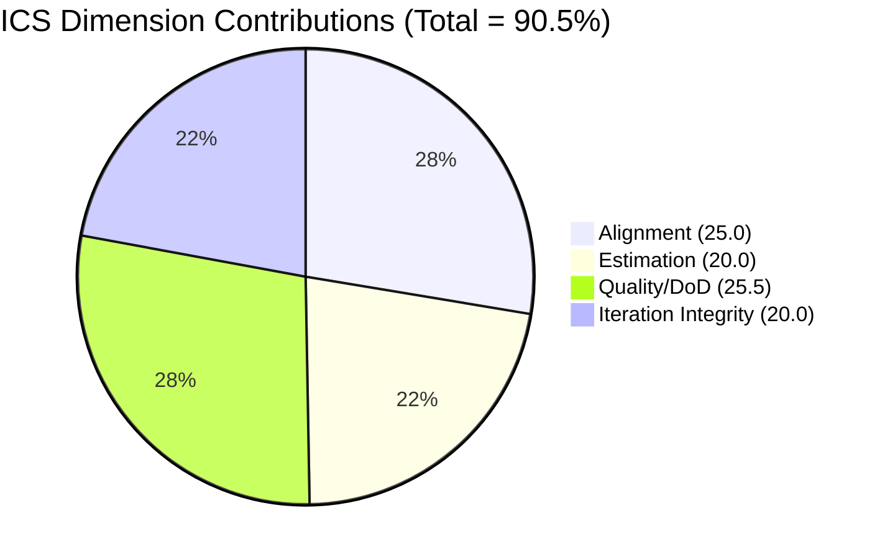

# Colina Health Product Team — Iteration 7.2 Audit

**Date:** 2026-05-02 | **Iteration:** 7.2 (Apr 20 – May 3, 2026) | **Day 13 of 14 (92.9% elapsed)**

---

## 1. Audit Metadata

| Field | Value |
|-------|-------|
| Audit Date | 2026-05-02 |
| Iteration | 7.2 |
| Iteration ID | `8edbe25f-fa4f-41b2-aaae-f3d5cf0e5b33` |
| Iteration Window | 2026-04-20 → 2026-05-03 |
| Day | 13 of 14 (92.9% elapsed) |
| Prior Audit | `AUDIT_20260501_0903.md` (Day 12) |
| ADO Org | `jairo` |
| ADO Project | Jairosoft Portfolio |
| ADO Team | Colina Health Product Team |
| GitHub Repos | colinahealth-fe · colinahealth-be · colina-health-ai-agent-code-fixing |
| Auditor | Claude Code (claude-sonnet-4-6) |
| Data Mode | Full (GitHub API accessible) |

---

## 2. Executive Summary

Day 13 of 14. Iteration 7.2 closes tomorrow (May 3). No progress since Day 12: the five enablers with merged PRs remain in pre-Closed states in ADO, and no new commits or PRs have landed in any of the three repositories since May 1. The SGPI gap is now a permanent risk — with one iteration day remaining and all work technically delivered in code, only an ADO state-hygiene action can improve the headline score before close.

Fresh ADO data also corrects a material data quality issue from prior audits: work items 199678, 200093, 200828, 202028, and 202033 are **Defects** (not Stories), and several SP values differ from earlier records. Despite these corrections, the headline scores are arithmetically unchanged from Day 12 (total committed SP = 30, Closed SP = 14, SGPI = 46.7%).

| Metric | Score | Band |
|--------|-------|------|
| ICS (Iteration Compliance Score) | 90.5% | Green |
| SGPI (Sprint Goal Progress Index) | 46.7% | Red |
| HCI (Health Check Index) | 72 / 100 | Yellow |
| **UPS (Unified Portfolio Score)** | **76.2** | **Yellow / Moderate** |

---

## 3. Iteration Scope and Methodology

### Active Iteration

Confirmed via `mcp__azure-devops__work_list_team_iterations`: Iteration 7.2 is the current active iteration for the Colina Health Product Team, running April 20 – May 3, 2026.

### Eligible ICS Items

**Inclusion criteria:** IterationPath = `Jairosoft Portfolio\2026-PI7\Iteration 7.2` AND WorkItemType IN (Story, User Story, Defect, Enabler, Deliverable) AND item is a parent (not a child task).

**Exclusions:**
- Spikes: AB#202855 (7.2 Collaborations/Exploratory Testing), AB#202870 ([Retro] Automate Workflow), AB#203128 — all excluded per ICS methodology
- Child tasks (hierarchy children of parent items)
- Items at `Jairosoft Portfolio` or `Jairosoft Portfolio\2026-PI7` iteration path — these are backlog/PI-level items, not iteration-committed items

### Data Quality Note (Correction from Day 12)

Fresh ADO evidence reveals that prior audit reports had incorrect work item type labels and story point values for several items. This audit uses authoritative ADO field data. Specifically:

- AB#199678, AB#200093, AB#200828, AB#202028, AB#202033 are **Defects**, not Stories/Enablers
- AB#202592 title: "Convert next.config.mjs to next.config.ts" (not JWT auth)
- AB#202594 title: "Add Husky + lint-staged pre-commit hooks" (not credential rotation FE)
- AB#202595 title: "Add generateMetadata to dynamic routes" (not Pino logging FE)
- AB#202690 title: "Rotate Exposed Credentials & Establish Secrets Management" (FE + BE)
- AB#202696 title: "Structured Logging & PHI Audit Trail" (not Pino logging BE)
- AB#202810: SP = 2 (not 0 as recorded in Day 12)

Despite these corrections, the total committed SP (30) and Closed SP (14) are arithmetically identical to Day 12 due to offsetting SP differences.

---

## 4. Scorecard Summary

| Metric | Score | Weight | Contribution | Band |
|--------|-------|--------|-------------|------|
| ICS | 90.5% | 50% | 45.25 | Green |
| HCI | 72 / 100 | 30% | 21.60 | Yellow |
| SGPI | 46.7% | 20% | 9.34 | Red |
| **UPS** | **76.2** | — | — | **Yellow / Moderate** |

### Score Delta (Day 12 → Day 13)

| Metric | Day 12 (May 1) | Day 13 (May 2) | Delta |
|--------|----------------|----------------|-------|
| ICS | 90.5% | 90.5% | — |
| SGPI | 46.7% | 46.7% | — |
| HCI | 72 | 72 | — |
| UPS | 76.2 | 76.2 | — |

No score movement. The iteration ends tomorrow without improvement unless the five enablers are transitioned to Closed in ADO.

---

## 5. Sprint Goal Predictability (SGPI)

**Inferred sprint goal:** Deliver all committed defect fixes and infrastructure enablers for Iteration 7.2.

### Committed Scope (non-spike parent items)

| AB# | Title (fresh ADO) | Type | SP | State |
|-----|-------------------|------|----|-------|
| 199678 | MAR View Reports: Medication Start Date Inconsistent in Print Preview | Defect | 2 | Closed |
| 200093 | MAR: Clearing Sort By/Order By does not reset to default view | Defect | 3 | Closed |
| 200828 | Latest Report sidebar loads when clicking Back to MAR View | Defect | 3 | Closed |
| 202028 | PRN medications incorrectly tagged as Missed in View Report | Defect | 2 | Closed |
| 202033 | Main system unresponsive after opening print in new tab | Defect | 2 | Closed |
| 202810 | Setup Claude Code Environment on Local Machine | Enabler | 2 | Closed |
| 202592 | Convert next.config.mjs to next.config.ts | Enabler | 1 | Ready for UAT |
| 202594 | Add Husky + lint-staged pre-commit hooks | Enabler | 1 | Ready for UAT |
| 202595 | Add generateMetadata to dynamic routes | Enabler | 3 | Passed QA Testing |
| 202690 | Rotate Exposed Credentials & Establish Secrets Management | Enabler | 3 | Passed QA Testing |
| 202696 | Structured Logging & PHI Audit Trail | Enabler | 8 | Passed QA Testing |

**Total committed SP:** 30 | **Closed SP:** 14 | **SGPI: 46.7% (Red)**

### Items Blocking SGPI Improvement

| AB# | Current State | SP | GitHub PR (merged) | Last Changed |
|-----|---------------|----|--------------------|-------------|
| 202592 | Ready for UAT | 1 | FE#174 (Apr 30) | 2026-05-01 |
| 202594 | Ready for UAT | 1 | FE#145 (Apr 28) | 2026-05-01 |
| 202595 | Passed QA Testing | 3 | FE#176 (Apr 30) | 2026-04-30 |
| 202690 | Passed QA Testing | 3 | FE#175, BE#67 (Apr 30) | 2026-04-30 |
| 202696 | Passed QA Testing | 8 | BE#66 (Apr 30) | 2026-04-30 |

**If all 5 are Closed before May 3:** Closed SP = 30, SGPI = 100%, UPS ≈ 86.9 (Green).
**If none are Closed:** SGPI remains 46.7%, UPS remains 76.2 (Yellow).

---

## 6. Developer Productivity Findings

### GitHub Activity Summary (Iteration Window: Apr 20 – May 3)

**colinahealth-fe merged PRs (iteration window):**

| PR# | Title (AB# linked) | Merged | Author |
|-----|---------------------|--------|--------|
| FE#145 | [AB#202594] Add Husky + lint-staged pre-commit hooks (Refactor code structure) | Apr 28 | pcoronia |
| FE#157 | [AB#202690] Rotate exposed credentials (FE) | Apr 27 | pcoronia |
| FE#161 | [AB#200828] Fix Latest Report sidebar reloading on Back to MAR View | Apr 24 | Kyaa-A |
| FE#163–164 | [AB#202033] Fix MAR print tab unresponsive / PDF download via jsPDF | Apr 24–27 | Kyaa-A |
| FE#168, 170–171 | [AB#202028] Fix PRN medications incorrectly showing Missed in View Report | Apr 27–28 | Kyaa-A |
| FE#172 | [AB#203322] Add license date to patient overview footer | Apr 29 | Kyaa-A |
| FE#174 | [AB#202592] Migrate next.config.mjs to next.config.ts | Apr 30 | pcoronia |
| FE#175 | [AB#202690] Rotate exposed credentials & establish secrets management | Apr 30 | pcoronia |
| FE#176 | [AB#202595] Add generateMetadata to dynamic routes | Apr 30 | pcoronia |
| FE#169 | llm-wiki (no AB# link) | Apr 30 | raseniero |

**colinahealth-be merged PRs (iteration window):**

| PR# | Title (AB# linked) | Merged | Author |
|-----|---------------------|--------|--------|
| BE#55 | [AB#202696] Structured Pino logging with PHI redaction | Apr 27 | pcoronia |
| BE#64 | [AB#202690] Rotate exposed credentials (BE) | Apr 27 | pcoronia |
| BE#66 | [AB#202696] Implement structured Pino logging (BE) | Apr 30 | pcoronia |
| BE#67 | [AB#202690] Rotate exposed credentials & establish secrets management (BE) | Apr 30 | pcoronia |

**colinahealth-be open PRs:**

| PR# | Title | Status |
|-----|-------|--------|
| BE#65 | chore: LLM wiki skill, Claude settings, and docs (no AB# link) | Open |

**colina-health-ai-agent-code-fixing:**
- No PRs or commits during Iteration 7.2. AI agent repo inactive this iteration.

**Since May 1 (Day 12 → Day 13):** No new commits in any repository. Zero activity delta.

### Key Findings

- **FE#172 → AB#203322** is linked to Iteration 7.3, not 7.2. This represents out-of-iteration work merging via the FE team (Kyaa-A) in the iteration window. AB#203322 is excluded from ICS per scope rules.
- **BE#65** (llm-wiki, raseniero) remains open with no AB# link. Created Apr 27, last updated Apr 30. This is the same unlinked item flagged since Day 12 with no resolution.
- **FE#169** (llm-wiki, raseniero) was merged Apr 30 with no AB# link. Persists as an untracked delivery.
- **pcoronia** is the sole active code contributor for enabler items; **Kyaa-A** handled defect fixes.

---

## 7. SAFe Compliance Findings

### Iteration Planning Evidence

All 11 ICS-eligible items carry IterationPath = `Jairosoft Portfolio\2026-PI7\Iteration 7.2`. All parent items have SP assigned (no unestimated items). SP = 2 on AB#202810 is valid (fresh ADO value).

### DoD Compliance

Three closed items have DoD gaps confirmed by fresh ADO evidence:

| AB# | Title | Gap |
|-----|-------|-----|
| AB#200093 | MAR: Clearing Sort By/Order By does not reset | **Description field empty** |
| AB#200828 | Latest Report sidebar loads on Back to MAR View | **Description field empty** |
| AB#202028 | PRN medications incorrectly tagged as Missed | **Acceptance Criteria field empty** |

These items were Closed in ADO without meeting DoD requirements. Legacy gaps — no DoD retroactive closure action taken since Day 12.

### QA Defect Backlog

Confirmed: 18 defect items sit at PI-level scope (`Jairosoft Portfolio` or `Jairosoft Portfolio\2026-PI7`) and were NOT pulled into Iteration 7.2 backlog. All are in "New" state. These are the QA-discovered defects from prior audits. These represent unresolved debt entering 7.3.

### ADO State Hygiene

The five enablers (202592, 202594, 202595, 202690, 202696) remain in "Ready for UAT" or "Passed QA Testing" as of Day 13. None have been transitioned to Closed despite merged PRs. LastChangedDate for 202592 and 202594 was May 1 (likely a field update, not state transition). This issue is now at its final window — iteration closes May 3.

---

## 8. Iteration Compliance Score (ICS)

**Eligible items:** 11 | **Excluded spikes:** 3 (AB#202855, AB#202870, AB#203128)

| Dimension | Weight | Items Evaluated | Pass | Fail | Raw % | Weighted Score | Evidence |
|-----------|--------|-----------------|------|------|-------|----------------|----------|
| Alignment | 25% | 11 | 11 | 0 | 100% | 25.0 | All 11 items scoped to `Jairosoft Portfolio\2026-PI7\Iteration 7.2`; no out-of-iteration items in ICS set |
| Estimation | 20% | 11 | 11 | 0 | 100% | 20.0 | All items carry SP values; AB#202810 = 2 SP (valid); no unestimated items |
| Quality / DoD | 35% | 11 | 8 | 3 | 72.7% | 25.5 | Fails: AB#200093 (no description), AB#200828 (no description), AB#202028 (no AC) |
| Iteration Integrity | 20% | 11 | 11 | 0 | 100% | 20.0 | No mid-sprint scope changes on ICS-eligible items; FE#172/AB#203322 is a 7.3 item excluded from ICS |

**ICS = 25.0 + 20.0 + 25.5 + 20.0 = 90.5% — Green**

### ICS Eligible Item Detail

| AB# | Type | SP | State | Align | Est | DoD | Integrity |
|-----|------|----|-------|-------|-----|-----|-----------|
| 199678 | Defect | 2 | Closed | ✓ | ✓ | ✓ | ✓ |
| 200093 | Defect | 3 | Closed | ✓ | ✓ | ✗ (no desc) | ✓ |
| 200828 | Defect | 3 | Closed | ✓ | ✓ | ✗ (no desc) | ✓ |
| 202028 | Defect | 2 | Closed | ✓ | ✓ | ✗ (no AC) | ✓ |
| 202033 | Defect | 2 | Closed | ✓ | ✓ | ✓ | ✓ |
| 202810 | Enabler | 2 | Closed | ✓ | ✓ | ✓ | ✓ |
| 202592 | Enabler | 1 | Ready for UAT | ✓ | ✓ | ✓ | ✓ |
| 202594 | Enabler | 1 | Ready for UAT | ✓ | ✓ | ✓ | ✓ |
| 202595 | Enabler | 3 | Passed QA Testing | ✓ | ✓ | ✓ | ✓ |
| 202690 | Enabler | 3 | Passed QA Testing | ✓ | ✓ | ✓ | ✓ |
| 202696 | Enabler | 8 | Passed QA Testing | ✓ | ✓ | ✓ | ✓ |

---

## 9. Engineering Health Index (HCI)

**Scoring:** 10 dimensions, 0–10 each (max 100)

| # | Dimension | Score | Day 12 | Delta | Evidence |
|---|-----------|-------|--------|-------|----------|
| 1 | PR Review Turnaround | 8 | 8 | — | All 5 pending PRs merged Apr 30; no new PRs queued since May 1; review lag resolved |
| 2 | Unlinked Commits / Branches | 6 | 6 | — | FE#169 (merged, no AB#) and BE#65 (open, no AB#) persist unchanged |
| 3 | Branch Hygiene | 8 | 8 | — | Merged branches cleaned; BE#65 still open but active work; no stale dangling branches detected |
| 4 | DoD Compliance | 7 | 7 | — | 3/11 items have DoD gaps; rate 72.7%; unchanged from Day 12 |
| 5 | ADO State Hygiene | 5 | 5 | — | 5 enablers still in Ready for UAT / Passed QA Testing; no transitions since Day 12 |
| 6 | Commit-to-Ticket Traceability | 7 | 7 | — | FE#169 and BE#65 remain unlinked; all other PRs in window carry AB# links |
| 7 | Iteration Scope Stability | 9 | 9 | — | No mid-sprint scope additions to ICS-eligible items; FE#172/7.3 work noted but out-of-scope |
| 8 | Team Capacity / Velocity | 8 | 8 | — | Zero commits Day 12→13; iteration tail; consistent with end-of-sprint wind-down; no overload signals |
| 9 | SAFe Ceremony Compliance | 7 | 7 | — | No new sprint review or retro artifacts detected; planning evidence present from iteration open |
| 10 | Continuous Integration | 7 | 7 | — | CI/CD pipeline setup closed (AB#200828); no CI failure signals; AI agent repo inactive this iteration |

**HCI = 72 / 100 — Yellow**

> No HCI movement Day 12 → Day 13. The primary drag remains Dimension 5 (ADO State Hygiene = 5). If the 5 enablers were closed, Dim 5 would move to ~9, bringing HCI to ~79.

---

## 10. ADO-to-GitHub Traceability Analysis

### PR-to-AB# Mapping (Authoritative — corrected from prior audits)

| PR | Repo | AB# | Title (ADO) | AB# State | PR State |
|----|------|-----|-------------|-----------|----------|
| FE#145 | colinahealth-fe | 202594 | Add Husky + lint-staged pre-commit hooks | Ready for UAT | Merged Apr 28 |
| FE#157 | colinahealth-fe | 202690 | Rotate Exposed Credentials & Secrets Mgmt | Passed QA Testing | Merged Apr 27 |
| FE#161 | colinahealth-fe | 200828 | Latest Report sidebar loads on Back to MAR View | Closed | Merged Apr 24 |
| FE#163–164 | colinahealth-fe | 202033 | Main system unresponsive after print in new tab | Closed | Merged Apr 24–27 |
| FE#168, 170–171 | colinahealth-fe | 202028 | PRN medications incorrectly tagged as Missed | Closed | Merged Apr 27–28 |
| FE#172 | colinahealth-fe | 203322 | Add license date to footer | **Iter 7.3** | Merged Apr 29 |
| FE#174 | colinahealth-fe | 202592 | Convert next.config.mjs to next.config.ts | Ready for UAT | Merged Apr 30 |
| FE#175 | colinahealth-fe | 202690 | Rotate exposed credentials & secrets mgmt (FE) | Passed QA Testing | Merged Apr 30 |
| FE#176 | colinahealth-fe | 202595 | Add generateMetadata to dynamic routes | Passed QA Testing | Merged Apr 30 |
| FE#169 | colinahealth-fe | **None** | llm-wiki (untracked) | N/A | Merged Apr 30 |
| BE#55 | colinahealth-be | 202696 | Structured Logging & PHI Audit Trail | Passed QA Testing | Merged Apr 27 |
| BE#64 | colinahealth-be | 202690 | Rotate exposed credentials (BE) | Passed QA Testing | Merged Apr 27 |
| BE#66 | colinahealth-be | 202696 | Implement structured Pino logging (BE) | Passed QA Testing | Merged Apr 30 |
| BE#67 | colinahealth-be | 202690 | Rotate exposed credentials (BE) | Passed QA Testing | Merged Apr 30 |
| BE#65 | colinahealth-be | **None** | LLM wiki skill, Claude settings, docs | N/A | Open |

### Traceability Gap Summary

- **FE#172 → AB#203322 (Iter 7.3):** Work for a future iteration merged to FE main during Iter 7.2. Karl should confirm this was intentional pre-loading.
- **FE#169 and BE#65:** Unlinked work persisting from Day 12. No AB# tags. raseniero owns both.
- **Multiple PRs per enabler (e.g., 202690 has FE#157 + FE#175, BE#64 + BE#67):** This is a rework/re-implementation pattern. Older PRs likely merged to develop; newer PRs merged to main (passed QA branch convention). Indicates the team is correctly gate-keeping state transitions through branch naming — but ADO states are not reflecting final merge events.

---

## 11. Collaboration and Review Analysis

### PR Authors This Iteration

| Author | PRs Merged (FE) | PRs Merged (BE) | Role |
|--------|-----------------|-----------------|------|
| pcoronia | FE#145, 157, 174, 175, 176 | BE#55, 64, 66, 67 | Developer |
| Kyaa-A | FE#161, 163, 164, 168, 170, 171, 172 | — | Developer |
| raseniero | FE#169 (unlinked) | BE#65 (open) | Developer |

### Review Dynamics

- pcoronia leads enabler delivery; Kyaa-A leads defect remediation; raseniero is contributing wiki/infrastructure work outside the ADO traceability loop.
- Multiple rework PRs per ticket (AB#202033 had FE#156, 162, 163, 164; AB#202028 had FE#167, 168, 170, 171) suggest active QA feedback loops and iterative refinement — healthy quality gate behavior.
- No new review activity since May 1.

---

## 12. Repository Hygiene

| Repo | Active Open PRs | Stale Branches | CI Activity |
|------|-----------------|----------------|-------------|
| colinahealth-fe | 0 | None detected | CI pipeline added (AB#202690 deliverable) |
| colinahealth-be | 1 (BE#65, unlinked) | None detected | CI pipeline added (AB#202690 deliverable) |
| colina-health-ai-agent-code-fixing | 1 (AI#9, pre-iteration) | None detected | No iteration activity |

- **AI agent repo (colina-health-ai-agent-code-fixing):** PR#9 (`feature/199269-contributing-documentation`) linked to AB#199269 has been open since Feb 23. It is outside the Iter 7.2 scope and iteration path — not scored in ICS — but represents stale open PR hygiene.
- **No new commits in any repo since May 1.** Activity halted after Apr 30 PR wave.

---

## 13. Risks and Bottlenecks

| # | Risk | Severity | Owner | Status vs Day 12 |
|---|------|----------|-------|-----------------|
| R1 | 5 enablers not Closed in ADO despite merged PRs — SGPI frozen at 46.7% with iteration closing May 3 | **Critical** | Karl / raseniero | Unchanged — now final-day risk |
| R2 | FE#169 merged to main with no linked AB# ticket (llm-wiki) | Medium | raseniero | Unchanged |
| R3 | BE#65 open with no AB# ticket (llm-wiki) | Medium | raseniero | Unchanged |
| R4 | DoD gaps on AB#200093, AB#200828, AB#202028 (missing descriptions/AC) | Medium | Karl | Unchanged — items remain Closed with gaps |
| R5 | 18+ QA defects at PI7/Portfolio scope not pulled into Iteration 7.2 | Medium | Karl | Unchanged — growing backlog for 7.3 |
| R6 | FE#172 → AB#203322 (Iter 7.3) merged to main during Iter 7.2 window | Low | Karl / Kyaa-A | **New** — detected in Day 13 fresh PR scan |
| R7 | ADO work item title/type/SP data quality errors in prior audits | Low | Karl | **New** — corrected in this audit; see §3 note |

**R1 Escalation:** With the iteration closing May 3 (tomorrow), this is the last opportunity to improve the permanent SGPI record for Iteration 7.2. A SGPI of 46.7% entering the iteration history is misleading — all five items have delivered code; the gap is purely a state management failure. If not corrected by EOD May 3, the iteration will close with a Red SGPI and a Yellow UPS.

---

## 14. Prioritized Remediation Actions

### Immediate (before May 3 close — today and tomorrow)

| Priority | Action | Owner | Impact |
|----------|--------|-------|--------|
| P1 | Transition AB#202592, 202594, 202595, 202690, 202696 to **Closed** in ADO | Karl / raseniero | SGPI: 46.7% → 100%; UPS: 76.2 → ~86.9 (Green) |
| P2 | Add descriptions to AB#200093 and AB#200828 | Karl | DoD compliance gap closure; no score impact post-close |
| P3 | Add acceptance criteria to AB#202028 | Karl | DoD compliance gap closure; no score impact post-close |
| P4 | Create AB# for FE#169 or document as intentional out-of-scope | raseniero | R2 resolution; HCI Dim 2 recovery in 7.3 |
| P5 | Merge or close BE#65 (llm-wiki); create AB# if work is in-scope | raseniero | R3 resolution; branch hygiene |

### For Iteration 7.3 Planning

| Action | Owner | Rationale |
|--------|-------|-----------|
| Triage 18+ QA defects at PI7 scope | Karl | Prevent further accumulation; severity triage before 7.3 planning |
| Enforce ADO-state-on-merge rule | Karl | Add team norm: when PR merges to main, ADO state updates same day |
| Confirm FE#172/AB#203322 was intentional 7.3 pre-load | Karl / Kyaa-A | If unintentional, assess iteration integrity impact |
| Document sprint review and retro artifacts | Karl | Close SAFe ceremony compliance gap (HCI Dim 9) |
| Resolve AI agent PR#9 (open since Feb 23) | sante8jairo | Stale open PR hygiene |
| Audit and correct work item titles/types in ADO | Karl | Data quality: prior reports had type/title errors; clean before 7.3 start |

---

## 15. Evidence Gaps and Limitations

| Item | Gap | Impact |
|------|-----|--------|
| Sprint review / retro artifacts | No ADO wiki or iteration notes with ceremony documentation found | HCI Dim 9 capped at 7; not penalized further |
| AB#202870 title/type | Type = Spike, state = "Estimation" — excluded from ICS | No impact on scores |
| AB#203128 details not fetched | Confirmed as Spike via Day 12 audit record | Excluded from ICS |
| AI agent repo commit history | No iteration activity confirmed via PR list; commits not fetched separately | Low impact; no active PRs |
| Prior audit data quality | Days 1–12 reports contain incorrect work item titles, types, and SP values | Corrected in this audit; historical records are informational only |

---

## 16. Score History

| Audit | Date | ICS | SGPI | HCI | UPS | Band |
|-------|------|-----|------|-----|-----|------|
| Day 10 | 2026-04-29 | 90.5% | 46.7% | 69 | 75.3 | Yellow |
| Day 12 | 2026-05-01 | 90.5% | 46.7% | 72 | 76.2 | Yellow |
| **Day 13** | **2026-05-02** | **90.5%** | **46.7%** | **72** | **76.2** | **Yellow** |
