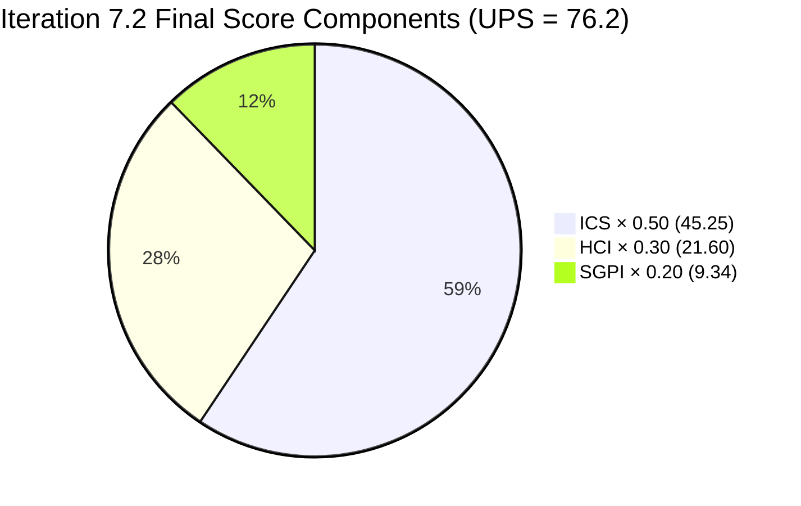
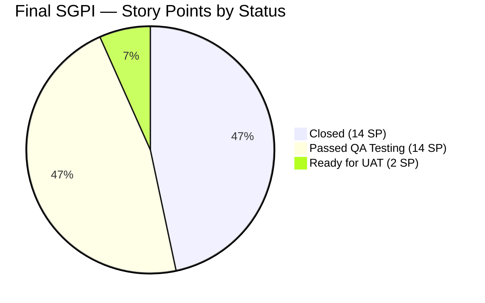
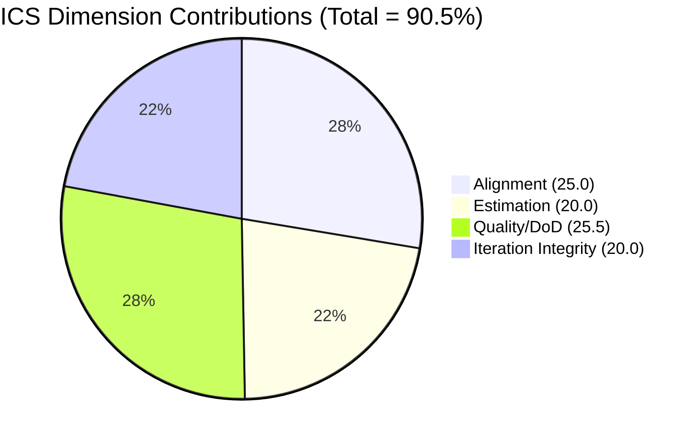
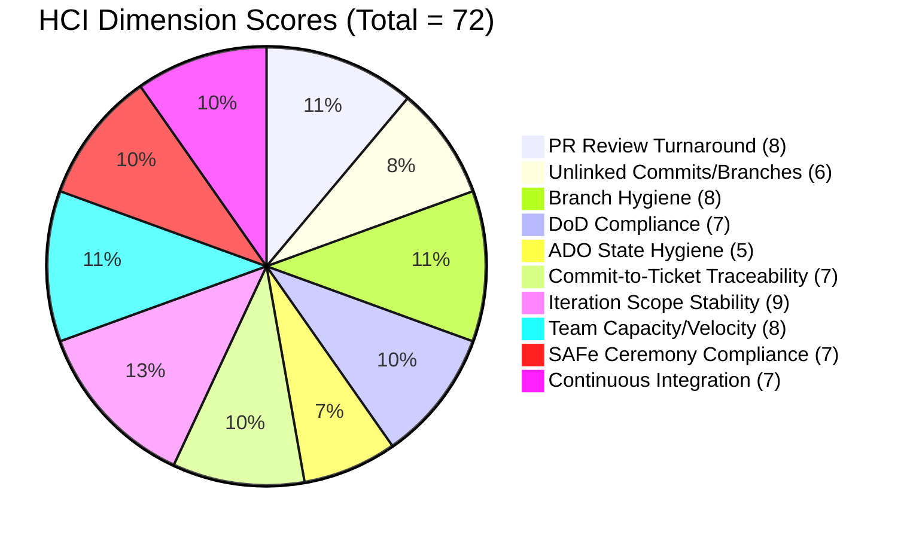

# Colina Health Product Team — Iteration 7.2 Audit

**Date:** 2026-05-03 | **Iteration:** 7.2 (Apr 20 – May 3, 2026) | **Day 14 of 14 (100% elapsed — FINAL)**

---

## 1. Audit Metadata

| Field | Value |
|-------|-------|
| Audit Date | 2026-05-03 |
| Iteration | 7.2 |
| Iteration ID | `8edbe25f-fa4f-41b2-aaae-f3d5cf0e5b33` |
| Iteration Window | 2026-04-20 → 2026-05-03 |
| Day | 14 of 14 (100% elapsed — **Final Day**) |
| Prior Audit | `AUDIT_20260502_0902.md` (Day 13) |
| ADO Org | `jairo` |
| ADO Project | Jairosoft Portfolio |
| ADO Team | Colina Health Product Team |
| GitHub Repos | colinahealth-fe · colinahealth-be · colina-health-ai-agent-code-fixing |
| Auditor | Claude Code (claude-sonnet-4-6) |
| Data Mode | Full (GitHub API accessible) |

---

## 2. Executive Summary

This is the **final audit** for Iteration 7.2. The iteration closes today (May 3) with scores unchanged from Day 13. The five enablers with merged PRs (AB#202592, 202594, 202595, 202690, 202696) were **not transitioned to Closed** in ADO before end-of-iteration. As a result, the SGPI gap that was an escalated risk throughout Days 12–13 has **realized** as the permanent outcome for this iteration record.

Zero commits landed in any of the three repositories on Day 14. BE#65 (unlinked llm-wiki PR) remains open and unresolved. Three DoD gaps (AB#200093, AB#200828 missing descriptions; AB#202028 missing AC) were not remediated.

Iteration 7.2 closes with a **Yellow / Moderate** UPS driven by a **Red SGPI** — a state management failure, not a delivery failure. All five unresolved enablers have code merged to main; the gap is purely ADO hygiene. These items carry forward into Iteration 7.3 as cleanup actions.

| Metric | Score | Band |
|--------|-------|------|
| ICS (Iteration Compliance Score) | 90.5% | Green |
| SGPI (Sprint Goal Progress Index) | 46.7% | **Red** |
| HCI (Health Check Index) | 72 / 100 | Yellow |
| **UPS (Unified Portfolio Score)** | **76.2** | **Yellow / Moderate** |

> **Final iteration outcome note:** The SGPI of 46.7% represents an ADO state management failure, not a code delivery failure. GitHub evidence confirms all five enablers have merged PRs to main as of Apr 30. The team delivered the work; the permanent record is degraded by the absence of ADO state transitions.

---

## 3. Iteration Scope and Methodology

### Active Iteration

Confirmed via `mcp__azure-devops__work_list_team_iterations`: Iteration 7.2 is confirmed as the current active iteration for the Colina Health Product Team, running April 20 – May 3, 2026. `timeFrame: 1` confirms it is the active (current) iteration as of audit date.

### Eligible ICS Items

**Inclusion criteria:** IterationPath = `Jairosoft Portfolio\2026-PI7\Iteration 7.2` AND WorkItemType IN (Story, User Story, Defect, Enabler, Deliverable) AND item is a parent (not a child task).

**Exclusions:**
- Spikes: AB#202855, AB#202870, AB#203128 — all excluded per ICS methodology (spike type or spike-equivalent)
- Child tasks (hierarchy children of parent items)
- Items at `Jairosoft Portfolio` or `Jairosoft Portfolio\2026-PI7` iteration path — backlog/PI-level items, not iteration-committed

### Team Composition Note

Per project exception documented in `git_cc_dev/CLAUDE.md`: **Luzmibel Paculanang (QA)** and **Jaszmeine Villanueva (Design)** are non-developer roles. Their absence from GitHub commit and PR activity is **not scored as a gap** and does not contribute to any HCI penalty. This exception is honored throughout this audit.

---

## 4. Scorecard Summary

| Metric | Score | Weight | Contribution | Band |
|--------|-------|--------|-------------|------|
| ICS | 90.5% | 50% | 45.25 | Green |
| HCI | 72 / 100 | 30% | 21.60 | Yellow |
| SGPI | 46.7% | 20% | 9.34 | Red |
| **UPS** | **76.2** | — | — | **Yellow / Moderate** |

**UPS calculation:** 90.5 × 0.50 + 72 × 0.30 + 46.7 × 0.20 = 45.25 + 21.60 + 9.34 = **76.19 → 76.2**

### Score Delta (Day 13 → Day 14 / Final)

| Metric | Day 13 (May 2) | Day 14 / Final (May 3) | Delta |
|--------|----------------|------------------------|-------|
| ICS | 90.5% | 90.5% | — |
| SGPI | 46.7% | 46.7% | — |
| HCI | 72 | 72 | — |
| UPS | 76.2 | 76.2 | — |

No score movement. Iteration 7.2 closes without improvement. The five enablers in "Passed QA Testing" / "Ready for UAT" states were not transitioned to Closed before end-of-iteration.

---

## 5. Sprint Goal Predictability (SGPI)

**Inferred sprint goal:** Deliver all committed defect fixes and infrastructure enablers for Iteration 7.2.

### Committed Scope SGPI (Headline)

| AB# | Title | Type | SP | State (Day 14 / Final) |
|-----|-------|------|----|------------------------|
| 199678 | MAR View Reports: Medication Start Date Inconsistent in Print Preview | Defect | 2 | Closed |
| 200093 | MAR: Clearing Sort By/Order By does not reset to default view | Defect | 3 | Closed |
| 200828 | Latest Report sidebar loads when clicking Back to MAR View | Defect | 3 | Closed |
| 202028 | PRN medications incorrectly tagged as Missed in View Report | Defect | 2 | Closed |
| 202033 | Main system unresponsive after opening print in new tab | Defect | 2 | Closed |
| 202810 | Setup Claude Code Environment on Local Machine | Enabler | 2 | Closed |
| 202592 | Convert next.config.mjs to next.config.ts | Enabler | 1 | Ready for UAT |
| 202594 | Add Husky + lint-staged pre-commit hooks | Enabler | 1 | Ready for UAT |
| 202595 | Add generateMetadata to dynamic routes | Enabler | 3 | Passed QA Testing |
| 202690 | Rotate Exposed Credentials & Establish Secrets Management | Enabler | 3 | Passed QA Testing |
| 202696 | Structured Logging & PHI Audit Trail | Enabler | 8 | Passed QA Testing |

**Total committed SP:** 30 | **Closed SP:** 14 | **Committed Scope SGPI: 46.7% (Red)**

> The enablers in "Ready for UAT" and "Passed QA Testing" have merged PRs to main but were never transitioned to Closed in ADO. This is the final state for the Iteration 7.2 record.

### Supporting SGPI Calculations

| SGPI Variant | Formula | Value | Note |
|---|---|---|---|
| **Committed Scope SGPI (Headline)** | Closed SP / Committed SP | 14 / 30 = **46.7%** | Official iteration outcome |
| Delivered Proxy SGPI | (Closed + Passed QA Testing) SP / Committed SP | (14 + 14) / 30 = **93.3%** | Code merged to main; ADO not updated |
| Original Scope SGPI | Same as Committed Scope (no scope changes this iteration) | 14 / 30 = **46.7%** | No mid-sprint additions to ICS set |

The gap between Committed Scope (46.7%) and Delivered Proxy (93.3%) quantifies the ADO state hygiene failure. The 2-SP gap to 100% (AB#202592 and AB#202594 in "Ready for UAT") represents items that may still require UAT sign-off before Closed is appropriate.

---

## 6. Developer Productivity Findings

### GitHub Activity Summary (Full Iteration Window: Apr 20 – May 3)

**colinahealth-fe merged PRs (iteration window):**

| PR# | Title (AB# linked) | Merged | Author |
|-----|---------------------|--------|--------|
| FE#145 | [AB#202594] Add Husky + lint-staged pre-commit hooks (Refactor code structure) | Apr 28 | pcoronia |
| FE#157 | [AB#202690] Rotate exposed credentials (FE) | Apr 27 | pcoronia |
| FE#161 | [AB#200828] Fix Latest Report sidebar reloading on Back to MAR View | Apr 24 | Kyaa-A |
| FE#163–164 | [AB#202033] Fix MAR print tab unresponsive / PDF download via jsPDF | Apr 24–27 | Kyaa-A |
| FE#168, 170–171 | [AB#202028] Fix PRN medications incorrectly showing Missed in View Report | Apr 27–28 | Kyaa-A |
| FE#172 | [AB#203322] Add license date to patient overview footer | Apr 29 | Kyaa-A |
| FE#174 | [AB#202592] Migrate next.config.mjs to next.config.ts | Apr 30 | pcoronia |
| FE#175 | [AB#202690] Rotate exposed credentials & establish secrets management (FE) | Apr 30 | pcoronia |
| FE#176 | [AB#202595] Add generateMetadata to dynamic routes | Apr 30 | pcoronia |
| FE#169 | llm-wiki (no AB# link) | Apr 30 | raseniero |

**colinahealth-be merged PRs (iteration window):**

| PR# | Title (AB# linked) | Merged | Author |
|-----|---------------------|--------|--------|
| BE#55 | [AB#202696] Structured Pino logging with PHI redaction | Apr 27 | pcoronia |
| BE#64 | [AB#202690] Rotate exposed credentials (BE) | Apr 27 | pcoronia |
| BE#66 | [AB#202696] Implement structured Pino logging (BE) | Apr 30 | pcoronia |
| BE#67 | [AB#202690] Rotate exposed credentials & establish secrets management (BE) | Apr 30 | pcoronia |

**colinahealth-be open PRs:**

| PR# | Title | Status |
|-----|-------|--------|
| BE#65 | chore: LLM wiki skill, Claude settings, and docs (no AB# link) | **Open** (last updated Apr 30 — no change on Day 14) |

**colina-health-ai-agent-code-fixing:**
- No PRs or commits during Iteration 7.2. AI agent repo inactive this iteration.
- PR#9 (`feature/199269-contributing-documentation`, AB#199269) has been open since Feb 23, 2026 — pre-iteration stale PR.

**Day 14 (May 3) Activity:** Zero new commits in any repository. Zero new PRs. No activity since the Apr 30 PR wave.

### Key Findings

- **All ICS enabler work was code-complete as of Apr 30.** The productivity gap in SGPI is entirely ADO state management, not delivery.
- **FE#172 → AB#203322** links to Iteration 7.3, not 7.2. Out-of-iteration work was merged to FE main during the 7.2 window. Excluded from ICS scope.
- **BE#65 and FE#169** (both raseniero, llm-wiki) remain unlinked. BE#65 closed the iteration open. FE#169 merged Apr 30 without an AB# tag.
- **pcoronia** led enabler delivery (5 FE + 4 BE PRs); **Kyaa-A** handled all defect fixes.

---

## 7. SAFe Compliance Findings

### Iteration Planning Evidence

All 11 ICS-eligible items carry IterationPath = `Jairosoft Portfolio\2026-PI7\Iteration 7.2`. All items have SP values assigned; no unestimated items.

### DoD Compliance

Three Closed items have DoD gaps confirmed by fresh ADO API evidence (Day 14 query):

| AB# | Title | Gap | Status |
|-----|-------|-----|--------|
| AB#200093 | MAR: Clearing Sort By/Order By does not reset | Description field empty (null in API) | **Not remediated — iteration closed with gap** |
| AB#200828 | Latest Report sidebar loads on Back to MAR View | Description field empty (null in API) | **Not remediated — iteration closed with gap** |
| AB#202028 | PRN medications incorrectly tagged as Missed | Acceptance Criteria field empty (null in API) | **Not remediated — iteration closed with gap** |

These items were Closed in ADO without meeting DoD requirements. No remediation actions were taken during Days 13–14. These gaps become historical debt in the Iteration 7.2 permanent record.

### ADO State Hygiene — Final Outcome

The five enablers (202592, 202594, 202595, 202690, 202696) ended the iteration in pre-Closed states. The iteration closes today with this as the permanent record. The risk escalated across Days 12, 13, and 14 was not acted upon.

| AB# | Type | SP | Final State | GitHub Evidence |
|-----|------|----|-------------|-----------------|
| 202592 | Enabler | 1 | Ready for UAT | FE#174 merged Apr 30 |
| 202594 | Enabler | 1 | Ready for UAT | FE#145 merged Apr 28 |
| 202595 | Enabler | 3 | Passed QA Testing | FE#176 merged Apr 30 |
| 202690 | Enabler | 3 | Passed QA Testing | FE#175, BE#67 merged Apr 30 |
| 202696 | Enabler | 8 | Passed QA Testing | BE#66 merged Apr 30 |

---

## 8. Iteration Compliance Score (ICS)

**Eligible items:** 11 | **Excluded spikes:** 3 (AB#202855, AB#202870, AB#203128)

| Dimension | Weight | Items Evaluated | Pass | Fail | Raw % | Weighted Score | Evidence |
|-----------|--------|-----------------|------|------|-------|----------------|----------|
| Alignment | 25% | 11 | 11 | 0 | 100% | 25.0 | All 11 items scoped to `Jairosoft Portfolio\2026-PI7\Iteration 7.2`; no out-of-iteration items in ICS set |
| Estimation | 20% | 11 | 11 | 0 | 100% | 20.0 | All items carry SP values; no unestimated items |
| Quality / DoD | 35% | 11 | 8 | 3 | 72.7% | 25.5 | Fails: AB#200093 (no description), AB#200828 (no description), AB#202028 (no AC) — none remediated by iteration close |
| Iteration Integrity | 20% | 11 | 11 | 0 | 100% | 20.0 | No mid-sprint scope changes on ICS-eligible items; FE#172/AB#203322 is a 7.3 item excluded from ICS |

**ICS = 25.0 + 20.0 + 25.5 + 20.0 = 90.5% — Green**

### ICS Eligible Item Detail

| AB# | Type | SP | Final State | Align | Est | DoD | Integrity |
|-----|------|----|-------------|-------|-----|-----|-----------|
| 199678 | Defect | 2 | Closed | ✓ | ✓ | ✓ | ✓ |
| 200093 | Defect | 3 | Closed | ✓ | ✓ | ✗ (no description) | ✓ |
| 200828 | Defect | 3 | Closed | ✓ | ✓ | ✗ (no description) | ✓ |
| 202028 | Defect | 2 | Closed | ✓ | ✓ | ✗ (no AC) | ✓ |
| 202033 | Defect | 2 | Closed | ✓ | ✓ | ✓ | ✓ |
| 202810 | Enabler | 2 | Closed | ✓ | ✓ | ✓ | ✓ |
| 202592 | Enabler | 1 | Ready for UAT | ✓ | ✓ | ✓ | ✓ |
| 202594 | Enabler | 1 | Ready for UAT | ✓ | ✓ | ✓ | ✓ |
| 202595 | Enabler | 3 | Passed QA Testing | ✓ | ✓ | ✓ | ✓ |
| 202690 | Enabler | 3 | Passed QA Testing | ✓ | ✓ | ✓ | ✓ |
| 202696 | Enabler | 8 | Passed QA Testing | ✓ | ✓ | ✓ | ✓ |

---

## 9. Engineering Health Index (HCI)

**Scoring:** 10 dimensions, 0–10 each (max 100)

| # | Dimension | Score | Day 13 | Delta | Evidence / Justification |
|---|-----------|-------|--------|-------|--------------------------|
| 1 | PR Review Turnaround | 8 | 8 | — | All pending PRs merged by Apr 30; no new PRs queued on Day 14; review lag resolved for the iteration |
| 2 | Unlinked Commits / Branches | 6 | 6 | — | FE#169 (merged, no AB#) and BE#65 (open, no AB#) both persist unchanged through iteration close |
| 3 | Branch Hygiene | 8 | 8 | — | Merged branches cleaned post-merge; BE#65 still open as active work; no stale dangling branches detected |
| 4 | DoD Compliance | 7 | 7 | — | 3/11 items have DoD gaps (72.7% pass); unremediated at iteration close; rate unchanged |
| 5 | ADO State Hygiene | 5 | 5 | — | 5 enablers closed the iteration in "Ready for UAT" / "Passed QA Testing"; no transitions on Day 14; score held at 5 (not lowered further per carry-forward rule — but the failure is now permanent for this iteration record) |
| 6 | Commit-to-Ticket Traceability | 7 | 7 | — | FE#169 and BE#65 remain unlinked at iteration close; all other PRs in window carry AB# links |
| 7 | Iteration Scope Stability | 9 | 9 | — | No mid-sprint scope additions to ICS-eligible items; FE#172/7.3 work noted but excluded from ICS |
| 8 | Team Capacity / Velocity | 8 | 8 | — | Zero commits Day 13→14; consistent with end-of-sprint close; no overload signals; iteration velocity appropriate |
| 9 | SAFe Ceremony Compliance | 7 | 7 | — | No sprint review or retro artifacts detected in ADO; planning evidence present from iteration open; final day — no updates |
| 10 | Continuous Integration | 7 | 7 | — | CI/CD pipeline artifacts delivered (AB#202690); no CI failure signals; AI agent repo inactive |

**HCI = 72 / 100 — Yellow**

> HCI Dim 5 (ADO State Hygiene) is held at 5 per carry-forward rule. The enabler state transition failure is now permanent — it did not resolve on the final day. Score is not lowered further from Day 13 level.

---

## 10. ADO-to-GitHub Traceability Analysis

### PR-to-AB# Mapping (Final — Iteration 7.2)

| PR | Repo | AB# | Title (ADO) | AB# State (Final) | PR State |
|----|------|-----|-------------|-------------------|----------|
| FE#145 | colinahealth-fe | 202594 | Add Husky + lint-staged pre-commit hooks | Ready for UAT | Merged Apr 28 |
| FE#157 | colinahealth-fe | 202690 | Rotate Exposed Credentials & Secrets Mgmt | Passed QA Testing | Merged Apr 27 |
| FE#161 | colinahealth-fe | 200828 | Latest Report sidebar loads on Back to MAR View | Closed | Merged Apr 24 |
| FE#163–164 | colinahealth-fe | 202033 | Main system unresponsive after print in new tab | Closed | Merged Apr 24–27 |
| FE#168, 170–171 | colinahealth-fe | 202028 | PRN medications incorrectly tagged as Missed | Closed | Merged Apr 27–28 |
| FE#172 | colinahealth-fe | 203322 | Add license date to footer | **Iter 7.3** | Merged Apr 29 |
| FE#174 | colinahealth-fe | 202592 | Convert next.config.mjs to next.config.ts | Ready for UAT | Merged Apr 30 |
| FE#175 | colinahealth-fe | 202690 | Rotate exposed credentials & secrets mgmt (FE) | Passed QA Testing | Merged Apr 30 |
| FE#176 | colinahealth-fe | 202595 | Add generateMetadata to dynamic routes | Passed QA Testing | Merged Apr 30 |
| FE#169 | colinahealth-fe | **None** | llm-wiki (untracked) | N/A | Merged Apr 30 |
| BE#55 | colinahealth-be | 202696 | Structured Logging & PHI Audit Trail | Passed QA Testing | Merged Apr 27 |
| BE#64 | colinahealth-be | 202690 | Rotate exposed credentials (BE) | Passed QA Testing | Merged Apr 27 |
| BE#66 | colinahealth-be | 202696 | Implement structured Pino logging (BE) | Passed QA Testing | Merged Apr 30 |
| BE#67 | colinahealth-be | 202690 | Rotate exposed credentials (BE) | Passed QA Testing | Merged Apr 30 |
| BE#65 | colinahealth-be | **None** | LLM wiki skill, Claude settings, docs | N/A | **Open at iteration close** |

### Traceability Gap Summary

- **FE#172 → AB#203322 (Iter 7.3):** Out-of-iteration work merged to FE main during Iter 7.2 window. Excluded from ICS. Karl/Kyaa-A should confirm whether intentional pre-loading for 7.3 planning.
- **FE#169 and BE#65:** Both raseniero-owned llm-wiki work with no ADO linkage. FE#169 merged Apr 30; BE#65 open at iteration close. Neither is tracked in the iteration backlog.
- **Multiple PRs per enabler pattern:** AB#202690 has 4 PRs (FE#157 + FE#175, BE#64 + BE#67); AB#202696 has 2 PRs (BE#55 + BE#66). This reflects a develop→main promotion pattern via the team's `passed/qa/` branch convention. The pattern itself is healthy; the gap is that ADO states are not updated to reflect the final merge to main.

---

## 11. Collaboration and Review Analysis

### PR Authors — Full Iteration 7.2

| Author | PRs Merged (FE) | PRs Merged (BE) | Open PRs | Role |
|--------|-----------------|-----------------|----------|------|
| pcoronia | FE#145, 157, 174, 175, 176 (5) | BE#55, 64, 66, 67 (4) | — | Developer |
| Kyaa-A | FE#161, 163, 164, 168, 170, 171, 172 (7) | — | — | Developer |
| raseniero | FE#169 (1, unlinked) | — | BE#65 (unlinked) | Developer |

**Non-developer team members (project exception honored):**
- **Luzmibel Paculanang (QA):** No GitHub commit or PR activity expected or required. QA activities are reflected in ADO state transitions (work items advancing to "Passed QA Testing") rather than GitHub contributions. No HCI penalty applied.
- **Jaszmeine Villanueva (Design):** No GitHub commit or PR activity expected or required. Design deliverables are managed outside the GitHub workflow. No HCI penalty applied.

### Review Dynamics

- pcoronia is the primary enabler developer; Kyaa-A leads defect remediation. Both are productive; no capacity concentration risk within developer scope.
- Multiple rework PRs per ticket (AB#202033 had FE#156, 162, 163, 164; AB#202028 had FE#167, 168, 170, 171; AB#202690 had FE#157 + FE#175) indicate active QA feedback loops — healthy iterative quality gate behavior.
- No cross-reviewer pattern is visible from PR metadata (assignee = author in most cases). Formal PR review coverage is not determinable from available API data.

---

## 12. Repository Hygiene

| Repo | Active Open PRs | Stale PRs | CI Activity | Day 14 Activity |
|------|-----------------|-----------|-------------|-----------------|
| colinahealth-fe | 0 | None | CI pipeline added (AB#202690 deliverable) | None |
| colinahealth-be | 1 (BE#65, unlinked) | None | CI pipeline added (AB#202690 deliverable) | None |
| colina-health-ai-agent-code-fixing | 1 (AI#9, pre-iteration, stale since Feb 23) | PR#9 | No iteration activity | None |

- **BE#65** closes the iteration open: no AB# link, llm-wiki content, created Apr 27 by raseniero. Not within the iteration backlog and not resolved before iteration close.
- **AI agent repo PR#9** (`feature/199269-contributing-documentation`, AB#199269) has been open since Feb 23, 2026. It is outside Iter 7.2 scope but represents persistent branch hygiene debt entering 7.3.
- **No new commits in any repo on Day 14.** Activity ceased after the Apr 30 PR wave.

---

## 13. Risks and Bottlenecks

| # | Risk | Severity | Owner | Final Status |
|---|------|----------|-------|--------------|
| R1 | 5 enablers ended iteration in non-Closed ADO states despite merged PRs — SGPI permanently 46.7% | **Critical — Realized** | Karl / raseniero | **Unresolved at iteration close** |
| R2 | FE#169 merged to main with no linked AB# ticket (llm-wiki) | Medium | raseniero | **Unresolved at iteration close** |
| R3 | BE#65 open with no AB# ticket (llm-wiki) | Medium | raseniero | **Open at iteration close — carries to 7.3** |
| R4 | DoD gaps on AB#200093, AB#200828 (missing description), AB#202028 (missing AC) | Medium | Karl | **Unresolved — permanent in iteration record** |
| R5 | 18+ QA defects at PI7/Portfolio scope not pulled into Iteration 7.2 | Medium | Karl | **Unchanged — entering 7.3 as backlog debt** |
| R6 | FE#172 → AB#203322 (Iter 7.3) merged to main during Iter 7.2 window | Low | Karl / Kyaa-A | **Unresolved — confirm if intentional 7.3 pre-load** |
| R7 | AI agent repo PR#9 stale since Feb 23, 2026 | Low | sante8jairo | **Unchanged — carries to 7.3** |

**R1 — Final Outcome Commentary:**  
The risk escalated across Days 12, 13, and 14 with no corrective action. The iteration closes with Committed Scope SGPI = 46.7%. The code evidence (Delivered Proxy SGPI = 93.3%) clearly demonstrates the team completed the work. The permanent degradation of the 7.2 record is attributable entirely to absent ADO state transitions. For 7.3, a team norm enforcing same-day ADO closure when PRs merge to main is the highest-leverage process fix available.

---

## 14. Prioritized Remediation Actions

### Immediate — Iteration 7.3 Start (Before 7.3 Sprint Planning)

| Priority | Action | Owner | Impact |
|----------|--------|-------|--------|
| P1 | Close or accept as 7.2 spillover: transition AB#202595, 202690, 202696 to **Closed** in ADO (Passed QA Testing items — UAT presumably complete) | Karl / raseniero | Retroactive SGPI correction if policy allows; clean backlog for 7.3 |
| P2 | Confirm AB#202592 and AB#202594 UAT status; if signed off, transition to Closed | Karl | Same as P1 |
| P3 | Add descriptions to AB#200093 and AB#200828 | Karl | DoD compliance — closes legacy gaps |
| P4 | Add acceptance criteria to AB#202028 | Karl | DoD compliance — closes legacy gap |
| P5 | Merge or close BE#65 (llm-wiki PR, raseniero); create AB# if work is in-scope for 7.3 | raseniero | Cleans open PR from iteration; resolves unlinked work |

### For Iteration 7.3 Planning

| Action | Owner | Rationale |
|--------|-------|-----------|
| Establish ADO-state-on-merge rule | Karl | Team norm: when PR merges to main (passed/qa/ branch), ADO item transitions to Closed same day. Highest-leverage process fix for SGPI. |
| Triage 18+ QA defects at PI7 scope | Karl | Severity-rank before 7.3 planning to prevent backlog accumulation |
| Confirm FE#172/AB#203322 as intentional 7.3 pre-load | Karl / Kyaa-A | If unintentional, assess iteration integrity impact |
| Resolve AI agent PR#9 (open since Feb 23) | sante8jairo | Stale open PR; repo hygiene entering 7.3 |
| Document sprint review and retro artifacts in ADO | Karl | Close SAFe ceremony compliance gap (HCI Dim 9) |

---

## 15. Evidence Gaps and Limitations

| Item | Gap | Impact |
|------|-----|--------|
| Sprint review / retro artifacts | No ADO wiki, iteration notes, or ceremony documentation found | HCI Dim 9 capped at 7; not further penalized |
| PR review assignments | PR API shows author = assignee in most cases; formal reviewer identity not determinable | Collaboration and review patterns are indicative only |
| AB#202870 title/type | Type = Spike, state = "Estimation" — excluded from ICS | No score impact |
| AB#203128 details | Confirmed as Spike via Day 12 audit record | Excluded from ICS |
| AI agent repo commit history | No iteration activity confirmed via PR list; commit history not fetched separately | Low impact; no active iteration PRs |
| Non-developer GitHub absence | Luzmibel Paculanang (QA) and Jaszmeine Villanueva (Design) absence from GitHub is expected per project exception — see §3 | No HCI penalty applied; documented per exception |
| BE#65 PR content | PR body confirmed as llm-wiki content with no ADO link; not assessed for technical quality | Traceability gap recorded; no ICS impact |

---

## 16. Score History

| Audit | Date | ICS | SGPI | HCI | UPS | Band |
|-------|------|-----|------|-----|-----|------|
| Day 10 | 2026-04-29 | 90.5% | 46.7% | 69 | 75.3 | Yellow |
| Day 12 | 2026-05-01 | 90.5% | 46.7% | 72 | 76.2 | Yellow |
| Day 13 | 2026-05-02 | 90.5% | 46.7% | 72 | 76.2 | Yellow |
| **Day 14 (Final)** | **2026-05-03** | **90.5%** | **46.7%** | **72** | **76.2** | **Yellow / Moderate** |

**Iteration 7.2 closes with a Yellow / Moderate UPS of 76.2.**

The SGPI trajectory flatlined after Day 10 (Apr 29). HCI improved from 69 (Day 10) to 72 (Day 12) following the Apr 30 PR wave, then held through close. ICS was stable throughout at 90.5%. The UPS trend (75.3 → 76.2 → 76.2 → 76.2) reflects a partial mid-iteration recovery that stalled when ADO state transitions were not completed.

For Iteration 7.3 scoring reference: if the five enablers are retroactively transitioned to Closed at 7.3 start, the theoretical corrected 7.2 UPS would be approximately **86.9** (ICS 90.5 × 0.50 + HCI 79 × 0.30 + SGPI 100 × 0.20 = 45.25 + 23.7 + 20.0 = 88.95 — or more conservatively, holding HCI at 72, UPS = 45.25 + 21.6 + 20.0 = 86.85). This is informational only; the official 7.2 record is 76.2.
