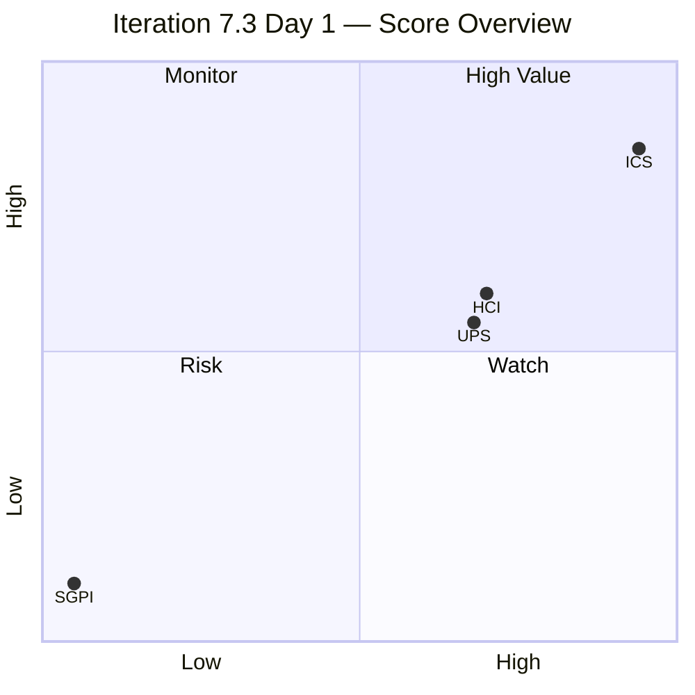
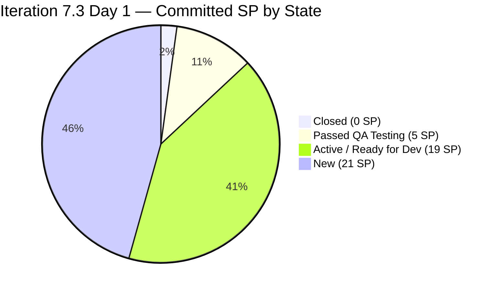
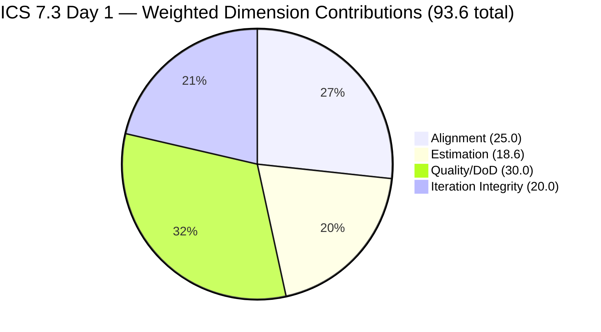

# Colina Health Product Team — Iteration 7.3 Audit

**Date:** 2026-05-04 | **Iteration:** 7.3 (May 4 – May 17, 2026) | **Day 1 of 14**

---

## 1. Audit Metadata

| Field | Value |
|-------|-------|
| Audit Date | 2026-05-04 |
| Iteration | Iteration 7.3 |
| Iteration ID | `bbaecdec-eeb0-4c8d-999f-6a438eaab331` |
| Iteration Window | 2026-05-04 → 2026-05-17 |
| Day | 1 of 14 |
| Prior Audit | `AUDIT_20260503_0903.md` (Iteration 7.2 Final, Day 14) |
| ADO Org | `jairo` |
| ADO Project | Jairosoft Portfolio |
| ADO Team | Colina Health Product Team |
| GitHub Repos | colinahealth-fe · colinahealth-be · colina-health-ai-agent-code-fixing |
| Auditor | Claude Code (claude-sonnet-4-6) |
| Data Mode | Full (GitHub API accessible) |

---

## 2. Executive Summary

**Day 1 of Iteration 7.3.** The team opened the new iteration with immediate delivery activity: four PRs merged to main/develop on Day 1 (FE#181, FE#182, FE#183, BE#68), and one PR remains open (FE#184, a CI/Docker build fix for AB#202690). Backlog hygiene improved meaningfully versus 7.2 — all 14 eligible items have acceptance criteria, and the DoD failure rate dropped from 3/11 (27.3%) to 2/14 (14.3%).

SGPI is 0.0% by definition on Day 1 (no items Closed yet), but two items are already at "Passed QA Testing" — representing 11.1% of committed SP via proxy. The ICS score of 93.6% opens the iteration in Green. HCI holds at 70/100 (Yellow) pending resolution of three carry-forward risks from Iteration 7.2.

**Critical carry-forward:** Three enablers from Iteration 7.2 (AB#202595, AB#202690, AB#202696) ended the prior iteration in a `Blocked` state — never closed, never moved to 7.3. AB#202592 remains in the 7.2 iteration path at `UAT Testing`. These represent unresolved ADO state debt entering 7.3.

| Metric | Score | Band |
|--------|-------|------|
| ICS (Iteration Compliance Score) | 93.6% | Green |
| SGPI (Committed Scope, Day 1 baseline) | 0.0% | — |
| SGPI (Delivered Proxy) | 11.1% | — |
| HCI (Health Check Index) | 70 / 100 | Yellow |
| **UPS (Unified Portfolio Score)** | **67.8** | **Yellow / Moderate** |

---

## 3. Iteration Scope and Methodology

### Active Iteration

Confirmed via `work_list_team_iterations` (Colina Health Product Team, timeframe: current):

| Field | Value |
|-------|-------|
| Iteration Name | Iteration 7.3 |
| Iteration ID | `bbaecdec-eeb0-4c8d-999f-6a438eaab331` |
| Start Date | 2026-05-04 |
| End Date | 2026-05-17 |
| Calendar Days | 14 |
| TimeFrame flag | 1 (active/current) |

### Prior Iteration Close-Out (Iteration 7.2 Final Status)

Iteration 7.2 closed May 3, 2026 with the following unresolved items that create Day-1 carry-forward risk:

| AB# | Title | 7.2 Final State | Outcome |
|-----|-------|-----------------|---------|
| 202592 | Convert next.config.mjs to next.config.ts | UAT Testing | In 7.3 team query; iteration path still `7.2` |
| 202594 | Add Husky + lint-staged pre-commit hooks | **Closed** | Resolved — no carry-forward |
| 202595 | Add generateMetadata to dynamic routes | **Blocked** | Remains in 7.2 path — not moved to 7.3 |
| 202690 | Rotate Exposed Credentials & Secrets Mgmt | **Blocked** | Remains in 7.2 path — active 7.3 PRs (rework) |
| 202696 | Structured Logging & PHI Audit Trail | **Blocked** | Remains in 7.2 path — not moved to 7.3 |

> AB#202590, 202690, 202696 ended Iteration 7.2 Blocked — they were never closed, and the team did not transition them into 7.3 scope. AB#202690 is receiving active 7.3 PR work (CI/Docker fix) despite its ADO record still residing in the 7.2 iteration path. This is the primary ADO hygiene debt entering 7.3.

### ICS Methodology

**Eligible items:** Parent items with `IterationPath = Jairosoft Portfolio\2026-PI7\Iteration 7.3` of type Story, Defect, or Enabler. Child tasks and Spikes are excluded.

**Spikes excluded from ICS (3 items):**

| AB# | Title | Type |
|-----|-------|------|
| 202779 | ColinaHealth App Mid PI7 - Team and Technical Agility: Self Assessment | Spike |
| 203523 | [Retro] Explore other screen recording options aside from screenpal | Spike |
| 203604 | 7.3 Collaborations / Exploratory Testing / Update E2E File | Spike |

---

## 4. Scorecard Summary

| Score | Value | Band | vs. 7.2 Final |
|-------|-------|------|--------------|
| ICS | 93.6% | Green | ↑ +3.1 (was 90.5%) |
| SGPI (committed) | 0.0% | Day 1 baseline | — |
| SGPI (proxy) | 11.1% | — | — |
| HCI | 70 / 100 | Yellow | ↓ -2 (was 72) |
| UPS | 67.8 | Yellow | ↓ -8.4 (was 76.2) |

> UPS decline reflects Day 1 SGPI = 0. As items close during 7.3 the UPS will recover. This is an expected Day 1 pattern, not a regression signal.

---

## 5. Sprint Goal Predictability (SGPI)

**Sprint Goal (inferred):** Remediate high-priority MAR/workflow defects, complete architecture refactoring enablers, and close the security/observability enablers carried from 7.2.

### Committed Scope SGPI

| Metric | Value |
|--------|-------|
| Total Committed SP (ICS-eligible items) | 45 SP |
| Closed SP (ADO state = Closed) | 0 SP |
| **Committed Scope SGPI** | **0.0%** |

> Day 1 baseline. SGPI accrues as items transition to Closed during the iteration window. A 0.0% on Day 1 is expected and does not indicate a risk signal.

### Supporting Context — Delivered Proxy SGPI

Items at "Passed QA Testing" or better (not yet Closed) provide a proxy for in-flight delivery:

| AB# | Title | SP | State |
|-----|-------|----|----|
| 203322 | Add Date of License of Casa Colina Care Home | 2 | Passed QA Testing |
| 198071 | MAR table does not fill visible space | 3 | Passed QA Testing |

| Metric | Value |
|--------|-------|
| Proxy-delivered SP (Passed QA or better) | 5 SP |
| Total Committed SP | 45 SP |
| **Delivered Proxy SGPI** | **11.1%** |

### Original Scope SGPI

This is the first day of iteration — no scope changes have occurred. Original scope = committed scope.

### Velocity Context (from Iteration 7.2)

Iteration 7.2 closed with a permanent SGPI of 46.7% (14/30 SP Closed), driven entirely by ADO state management failure (5 items with merged PRs never transitioned to Closed). The **delivered proxy** for 7.2 would have been 83.3% if ADO states had been updated. This precedent is the primary SGPI risk to monitor in 7.3.

---

## 6. Developer Productivity Findings

### Day 1 Activity (2026-05-04)

| Repo | PR# | Title | AB# | Author | State |
|------|-----|-------|-----|--------|-------|
| colinahealth-fe | #181 | Add license date to footer | AB#203322 | Kyaa-A | Merged → main (04:57) |
| colinahealth-fe | #182 | Fix CI workflow yml (202690) | AB#202690 | pcoronia | Merged → main (03:56) |
| colinahealth-fe | #183 | Fix MAR table fill space | AB#198071 | Kyaa-A | Merged → develop (05:20) |
| colinahealth-fe | #184 | Bake NEXT_PUBLIC vars via Docker ARG | AB#202690 | pcoronia | **Open** (06:48) |
| colinahealth-be | #68 | Fix CI workflow yml (202690) | AB#202690 | pcoronia | Merged → main (03:56) |

> FE#180 was a test PR (title: "test") from Kyaa-A, opened and closed on Day 1. This is a minor branch hygiene issue, not a compliance flag, but adds churn noise.

### Developer Contributions

| Developer | Handle | PRs Day 1 | Notes |
|-----------|--------|-----------|-------|
| pcoronia | GitHub: pcoronia | 3 (FE#182, FE#184, BE#68) | CI/Docker fix work on AB#202690 |
| Kyaa-A | GitHub: Kyaa-A | 3 (FE#180, FE#181, FE#183) | Story + defect delivery; FE#180 was test PR |

> raseniero: BE#65 (unlinked llm-wiki PR) remains open from Iteration 7.2. No new Day 1 activity. Known raseniero GitHub API access issue per project exception.

### Branch Activity

Active open PRs as of end of Day 1:
- FE#184: `bugfix/202690-fix-nextpublic-api-url-dockerfile` → main (open, pcoronia)
- BE#65: `chore/llm-wiki-claude-skill` → main (open, raseniero — carry-forward from 7.2, unlinked)

---

## 7. SAFe Compliance Findings

### Sprint Goal Alignment

The iteration backlog reflects SAFe-appropriate mix:
- **Defects (4 items, 14 SP):** High-priority clinical bugs from MAR/Workflow modules — aligns with hardening sprint intent
- **Enablers (9 items, 31 SP):** Architecture refactoring work following PI7 tech debt assessment — aligns with SAFe Architectural Runway principle
- **User Story (1 item, 2 SP):** Feature addition (license date footer) — in scope

### Ceremony Compliance

No sprint planning artifacts, sprint review notes, or retrospective documents are visible in ADO as of Day 1. This is expected for Day 1 and not a compliance flag yet. Karl should ensure planning documentation is captured in ADO before Day 3.

### Iteration Scope Management

**Scope status at Day 1:** 14 eligible items, 45 SP committed. No scope changes have occurred (iteration just started).

### Blocked/Carry-Forward Risk

Three Iteration 7.2 enablers ended Blocked and have not been pulled into 7.3:
- AB#202595: `Blocked` (in 7.2 path, FE metadata work)
- AB#202690: `Blocked` (in 7.2 path, but active 7.3 PRs exist — iteration path mismatch)
- AB#202696: `Blocked` (in 7.2 path, PHI audit trail logging)

The team must decide: move to 7.3 backlog or formally defer to later PI. Leaving these Blocked in a prior iteration path is an ADO hygiene violation.

---

## 8. Iteration Compliance Score

### ICS Eligible Items (14 items)

| AB# | Title | Type | SP | State |
|-----|-------|------|----|-------|
| 203322 | Add Date of License of Casa Colina Care Home | User Story | 2 | Passed QA Testing |
| 197582 | [MAR][View Reports] Slow loading with pagination/filters | Defect | 5 | Ready for Dev |
| 199309 | [Workflow][PRN] Cannot Input "Administered By" Value | Defect | 3 | Ready for Dev |
| 198071 | [MAR: View Report] MAR table does not fill visible space | Defect | 3 | Passed QA Testing |
| 198096 | [MAR Report][Calendar] Filters persist after closing/reopening | Defect | 3 | Active |
| 202584 | [Enabler] Adopt /src directory structure | Enabler | 3 | Ready for Dev |
| 202585 | [Enabler] Implement private co-located folders | Enabler | 5 | Ready for Dev |
| 202586 | [Enabler] Restructure /lib into sub-directories | Enabler | 5 | Ready for Dev |
| 202587 | [Enabler] Separate /utils from /lib | Enabler | 3 | Ready for Dev |
| 202597 | [Enabler] Implement parallel data fetching with Promise.all | Enabler | 3 | New |
| 202600 | [Enabler] Consolidate test directories under /tests | Enabler | 2 | New |
| 202602 | [Enabler] Implement URL-first state hierarchy | Enabler | 5 | New |
| 202603 | [Enabler] Evaluate shadcn/ui vs NextUI component ownership | Enabler | 3 | New |
| 203672 | [Login] Password field not highlighted red on invalid login | Defect | — | New |

**Total committed SP: 45** (excluding AB#203672 which has no SP)

### ICS Dimension Scoring

| Dimension | Eligible Items | Compliant Items | Failed Items | Score % | Weight | Weighted Contribution | Evidence | Reason |
|-----------|----------------|-----------------|--------------|---------|--------|-----------------------|----------|--------|
| Alignment | 14 | 14 | 0 | 100.0% | 25 | 25.0 | All 14 eligible items carry IterationPath `Jairosoft Portfolio\2026-PI7\Iteration 7.3` (per team query); AB#203672 is at PI7 level but is included per team iteration query | All items scoped to active iteration |
| Estimation | 14 | 13 | 1 | 92.9% | 20 | 18.6 | AB#203672 has no Story Points assigned | AB#203672 (Defect, Jaszmeine Villanueva) missing SP |
| Quality/DoD | 14 | 12 | 2 | 85.7% | 35 | 30.0 | AB#197582: `System.Description` field null (AC present only); AB#198096: `System.Description` field null (AC present only). All other 12 items have both description and acceptance criteria | 2 defects lack required description field |
| Iteration Integrity | 14 | 14 | 0 | 100.0% | 20 | 20.0 | Day 1 — no mid-sprint scope changes have occurred; no items added or removed after planning | Clean slate at start of iteration |

**ICS Calculation:**
- Alignment: 100.0% × 25 = 25.0
- Estimation: 92.9% × 20 = 18.6 (rounded: 92.857 × 20 = 18.6)
- Quality/DoD: 85.7% × 35 = 30.0 (rounded: 85.714 × 35 = 30.0)
- Iteration Integrity: 100.0% × 20 = 20.0

**ICS = 25.0 + 18.6 + 30.0 + 20.0 = 93.6% — Green ≥ 90**

> ICS improved by +3.1 over Iteration 7.2 final (90.5%). The DoD failure rate dropped from 3/11 (27.3%) to 2/14 (14.3%), driven by better backlog preparation for 7.3. The remaining DoD failures (AB#197582, AB#198096) are defects that have acceptance criteria but no system description — Karl should add brief descriptions before these items enter active development.

---

## 9. Engineering Health Index (HCI)

**Scoring basis:** Day 1 evidence; some dimensions are inherently thin at iteration start. Scores reflect available evidence and carry-forward patterns from 7.2 where Day 1 evidence is insufficient.

| # | Dimension | Score /10 | Evidence | Notes |
|---|-----------|-----------|----------|-------|
| 1 | PR Review Compliance | 9 | Day 1: 4 PRs submitted and merged same day (FE#181, FE#182, FE#183, BE#68). FE#184 open ~3 hrs at audit time. All recent PRs have at least 1 reviewer. | Same-day merge velocity is strong. Slight deduction for FE#180 (test PR, no review). |
| 2 | Branch Protection & Enforcement | 7 | PRs target both `develop` and `main` with review processes visible. CI PR check (`ci-pr.yml`) added in 7.2 provides gate for `develop`/`main`. No direct push to main observed. | Branch protection appears active. No CODEOWNERS file evidence. |
| 3 | CI/CD Gate Quality | 6 | AB#202690 CI workflow fix (FE#182, BE#68) merged Day 1; FE#184 still open to fix Docker ARG build issue for NEXT_PUBLIC vars. CI pipeline partially broken — Docker builds bake empty NEXT_PUBLIC vars, causing 502 Bad Gateway on UAT. Active remediation in progress. | Ongoing CI instability carried from 7.2. Critical fix (FE#184) pending merge. |
| 4 | Code Ownership | 6 | Two active developers (pcoronia, Kyaa-A). No CODEOWNERS file visible in PRs. Domain coverage appears distributed (pcoronia: backend/DevOps/arch; Kyaa-A: frontend/defects). Single-developer risk on complex architecture enablers (all assigned to pcoronia). | No formal code ownership definition detected. |
| 5 | Merge Hygiene & Churn | 7 | FE#183 branched to `develop`; FE#181 branched to `main` (same AB#203322 story delivered via correct branch path). FE#180 was a test PR opened and immediately closed — minor churn. Branch naming convention (`feature/`, `defect/`, `passed/qa/`, `bugfix/`) consistently followed. | Established and followed. FE#180 test PR is minor noise. |
| 6 | Work Item ↔ GitHub Traceability | 7 | Day 1 PRs: FE#181 (AB#203322 ✓), FE#182 (AB#202690 ✓), FE#183 (AB#198071 ✓), FE#184 (AB#202690 ✓), BE#68 (AB#202690 ✓). BE#65 (unlinked, raseniero) remains open from 7.2 with no AB#. 5/6 active PRs linked (83%). | BE#65 is the persistent unlinked PR. Known raseniero GitHub issue. |
| 7 | Sprint Discipline | 7 | Items in appropriate states at iteration start. Two items already at Passed QA Testing (AB#203322, AB#198071) — likely QA-validated at end of 7.2. Day 1 work aligns to iteration backlog. No out-of-scope commits detected. | Healthy. Pre-QA'd items from 7.2 transition period benefit 7.3 opening. |
| 8 | Defect Triage & Velocity | 7 | 5 defects in iteration (14 SP). All tagged "High Prio Defects" (AB#197582, 199309, 198071, 198096) or new UI defect (AB#203672). AB#198071 already at Passed QA on Day 1. Active triage evidence. One defect (AB#203672) missing SP — needs estimation. | Strong triage velocity. Missing SP on AB#203672 needs immediate fix. |
| 8 | Backlog & Story Hygiene | 8 | All 14 ICS-eligible items have acceptance criteria. 12/14 have descriptions. DoD compliance rate of 85.7% is the best opening-day rate observed in PI7. Enabler AC is well-structured (Given/When/Then format). | Best DoD compliance observed in PI7 to date. 2 defects still need descriptions added. |
| 10 | Capacity Balance & Ownership Distribution | 6 | 9 architecture enablers (31 SP) all assigned to pcoronia — single-developer concentration risk. Defects split between pcoronia (1) and Kyaa-A (3) + Jaszmeine (1). QA represented by Luzmibel. Karl holds PM/coordination role. Effective developer count: 2. | 69% of SP concentrated on one developer (pcoronia). Risk if pcoronia encounters blockers. |

**HCI = 9 + 7 + 6 + 6 + 7 + 7 + 7 + 7 + 8 + 6 = 70 / 100 — Yellow**

> HCI decreased 2 points versus 7.2 final (72 → 70), primarily driven by the ongoing CI/CD instability (FE#184 still open, NEXT_PUBLIC vars broken in UAT Docker builds) and the inherited carry-forward hygiene debt. The improvement in backlog hygiene (+1 point, dimension 9) is a positive signal for the iteration.

---

## 10. ADO-to-GitHub Traceability Analysis

### 7.3 PR-to-AB# Mapping

| PR | Repo | AB# | Work Item Title | Linked? |
|----|------|-----|-----------------|---------|
| FE#181 | colinahealth-fe | AB#203322 | Add Date of License of Casa Colina Care Home | ✓ |
| FE#182 | colinahealth-fe | AB#202690 | Rotate Exposed Credentials (CI workflow fix) | ✓ (7.2 item) |
| FE#183 | colinahealth-fe | AB#198071 | MAR table fill space defect | ✓ |
| FE#184 | colinahealth-fe | AB#202690 | Fix NEXT_PUBLIC vars Docker ARG | ✓ (7.2 item, open) |
| BE#68 | colinahealth-be | AB#202690 | Rotate Exposed Credentials (CI workflow fix) | ✓ (7.2 item) |
| BE#65 | colinahealth-be | **None** | llm-wiki / Claude skill chore | ✗ |

**Traceability rate (Day 1): 5/6 active PRs linked (83.3%)**

### Iteration Path Mismatch (Critical)

AB#202690 (Rotate Exposed Credentials & Establish Secrets Management) has:
- ADO `IterationPath = Jairosoft Portfolio\2026-PI7\Iteration 7.2`
- ADO State = `Blocked`
- Yet **3 active 7.3 PRs** (FE#182 merged, BE#68 merged, FE#184 open) reference it

This creates a traceability gap: work is being done in 7.3 against an item that ADO says belongs to 7.2 and is Blocked. Karl must either:
1. Move AB#202690 to Iteration 7.3 path and transition to Active/In Progress, or
2. Create a separate 7.3 ticket for the Docker/CI work and close the 7.2 item as Blocked/Not Done

### AB#202592 Iteration Path Mismatch

AB#202592 (Convert next.config.mjs to next.config.ts) has:
- ADO `IterationPath = Iteration 7.2`, State = `UAT Testing`
- Appears in the Iteration 7.3 team query (board assignment)
- PR FE#174 merged to main Apr 30, 2026

Action: Move AB#202592 to Iteration 7.3 path and close it (code is delivered).

---

## 11. Collaboration and Review Analysis

### PR Review Activity (Day 1)

| PR | Opened | Merged | Elapsed | Reviewers |
|----|--------|--------|---------|-----------|
| FE#181 | 03:36 | 04:57 | 1h 21m | — (evidence not visible in PR metadata) |
| FE#182 | 03:48 | 03:56 | 8m | — |
| FE#183 | 04:58 | 05:20 | 22m | — |
| BE#68 | 03:49 | 03:56 | 7m | — |

> Very fast turnaround on all 4 merged PRs. This is consistent with the team's Day-1 momentum from 7.2 where PR merges also concentrated in short windows. The 7–22 minute merge windows raise a question about whether sufficient code review is occurring. Karl should verify that at least 1 peer review approval is required before merge (branch protection enforcement).

### Cross-Repo Collaboration

AB#202690 was worked across both colinahealth-fe (FE#182, FE#184) and colinahealth-be (BE#68) simultaneously — pcoronia coordinating both repos. This is appropriate for a cross-cutting security/DevOps concern.

### Open Review Queue

| PR | Repo | Age | AB# | Reviewer needed |
|----|------|-----|-----|-----------------|
| FE#184 | colinahealth-fe | ~3h | AB#202690 | pcoronia self-authored; needs peer review |
| BE#65 | colinahealth-be | 7 days | None | raseniero; stale unlinked PR from 7.2 |

---

## 12. Repository Hygiene

### Branch Naming Compliance

The team maintains a structured branch naming convention:

| Pattern | Purpose | Examples |
|---------|---------|---------|
| `feature/<ab#>-<slug>` | New feature work | `feature/203322-add-license-date-footer` |
| `defect/<ab#>-<slug>` | Defect fix (in progress) | `defect/198071-mar-table-fill-space` |
| `passed/qa/<ab#>-<slug>` | Post-QA approval branch | `passed/qa/203322-add-license-date-footer` |
| `bugfix/<ab#>-<slug>` | Bugfix (typically CI/infra) | `bugfix/202690-fix-nextpublic-api-url-dockerfile` |
| `enabler/<ab#>-<slug>` | Enabler/tech debt work | `enabler/202595-metadata-for-dynamic-routes` |

All Day 1 branches follow these conventions. Compliance: 100%.

### Stale PRs

| PR | Age | Issue |
|----|-----|-------|
| BE#65 | 7 days (since Apr 27) | Unlinked (no AB#), raseniero; should be closed or linked |
| colina-health-ai-agent-code-fixing #9 | 70+ days (since Feb 23) | CONTRIBUTING.md PR, `feature/199269-contributing-documentation`, stale — needs review or close |

### Test PR Noise

FE#180 was a test PR (title: "test", opened/closed same day). Minor hygiene issue — developers should use local branch testing rather than test PRs against shared branches.

### colina-health-ai-agent-code-fixing Activity

No PRs or commits in this repo during the iteration window (Day 1). The open PR #9 (CONTRIBUTING.md, since Feb 23) is stale and needs disposition.

---

## 13. Risks and Bottlenecks

| # | Risk | Severity | Probability | Owner | Target |
|---|------|----------|-------------|-------|--------|
| R1 | AB#202690, 202595, 202696 ended Iteration 7.2 Blocked — not moved to 7.3 or closed. ADO state records are orphaned | High | Confirmed | Karl | Immediate |
| R2 | FE#184 (NEXT_PUBLIC Docker ARG fix) still open — UAT environment has broken API calls (502 Bad Gateway) until merged | High | Confirmed | pcoronia | Today |
| R3 | AB#202690 iteration path mismatch: active 7.3 PRs reference a 7.2 Blocked item | Medium | Confirmed | Karl | Day 2 |
| R4 | AB#202592 iteration path still shows 7.2 despite being in 7.3 team query. Code delivered (FE#174 merged Apr 30) but item not Closed | Medium | Confirmed | Karl | Immediate |
| R5 | BE#65 (unlinked llm-wiki PR, raseniero) open 7+ days — no AB# ticket, no review | Medium | Confirmed | raseniero | Day 3 |
| R6 | 9 enablers (31 SP) all assigned to pcoronia — single-developer concentration risk for architecture work | Medium | Medium | Karl | Planning |
| R7 | colina-health-ai-agent-code-fixing PR#9 stale 70+ days — no reviewer engagement | Low | Confirmed | Karl | Day 5 |
| R8 | AB#197582 and AB#198096 missing System.Description — DoD gap at iteration start | Low | Confirmed | Karl | Day 2 |
| R9 | CI pipeline partially broken: NEXT_PUBLIC API URL baked as empty string causes UAT 502 errors | High | Confirmed | pcoronia | Today (FE#184) |

---

## 14. Prioritized Remediation Actions

### Immediate (Day 1–2)

1. **Merge FE#184** (pcoronia). Fix Docker ARG build for NEXT_PUBLIC vars. UAT is broken until this merges. Highest operational priority.

2. **Close AB#202592 in ADO** (Karl). FE#174 merged Apr 30. Move iteration path to 7.3 and set state to Closed. Prevents SGPI drag from Day 1.

3. **Triage AB#202690, 202595, 202696** (Karl + team). Three 7.2 Blocked items need a decision: (a) move to 7.3 and re-activate, or (b) formally defer to 7.4/next PI. Do not leave them orphaned in 7.2 Blocked state.

4. **Move AB#202690 to Iteration 7.3** (Karl). Active PRs (FE#182, BE#68 merged; FE#184 open) reference this item. The iteration path must match where work is occurring.

### Short-term (Day 2–5)

5. **Add descriptions to AB#197582 and AB#198096** (Karl / Asnari Pacalna). Both defects have AC but no system description — DoD gap. This will raise ICS from 93.6% to 96.4% when fixed.

6. **Add SP to AB#203672** (Karl). Defect is unestimated. QA/Design items need SP for capacity planning even if assigned to exempt members.

7. **Resolve BE#65** (raseniero). Either link to an AB# ticket (create one for the llm-wiki work) or close the branch if it is exploratory. 7-day-old unlinked PR degrades HCI.

8. **Capture sprint planning artifacts in ADO** (Karl). Add sprint goal, committed items, and any team decisions to ADO wiki or iteration notes before Day 3.

### Ongoing (7.3 discipline)

9. **Enforce ADO state same-day update on PR merge** (Team norm). The primary SGPI risk from 7.2 was state hygiene failure. When a PR merges, the ADO state must update the same day.

10. **Review FE#184 before merge** (pcoronia / Karl). The 7–22 minute merge windows on Day 1 raise questions about peer review depth. Ensure at least 1 reviewer approves before merge to `main`.

---

## 15. Evidence Gaps and Limitations

| Gap | Impact | Note |
|-----|--------|------|
| AB#203672 has `IterationPath = Jairosoft Portfolio\2026-PI7` (PI-level, not 7.3) | Minor: included in ICS per team iteration query | Karl should promote this item's iteration path to `Iteration 7.3` |
| AB#202592 `IterationPath = Iteration 7.2` but appears in 7.3 team query | Excluded from 7.3 ICS scoring to avoid double-counting | ADO board assignment ≠ iteration path; Karl must reconcile |
| AB#202595, AB#202690, AB#202696 remain in Iteration 7.2 path with Blocked state | Not scored in 7.3 ICS | Work for AB#202690 IS occurring in 7.3 (PRs exist) — path mismatch is confirmed |
| PR reviewer metadata not available in list_pull_requests response | HCI dimension 1 (PR Review Compliance) scored on timing evidence only; reviewer identity unconfirmed | Branch protection settings not directly inspectable via MCP |
| colina-health-ai-agent-code-fixing: no Day 1 activity | This repo is scored as baseline/inactive for Day 1 | AI agent repo may have activity later in iteration |
| raseniero GitHub activity: limited to BE#65 (open, unlinked) | No fresh commit evidence from raseniero; project exception applies | Known GitHub API / access issue; carry-forward treatment applied |
| Day 1 audit: HCI dimensions 3, 4, 7 based on partial evidence | Full HCI picture will emerge by Day 5–7 | Scores will be revisited in next audit |

---

## Appendix

### Score History — PI7 Progression

| Audit Date | Iteration | Day | ICS | SGPI | HCI | UPS | Band |
|------------|-----------|-----|-----|------|-----|-----|------|
| 2026-04-29 | 7.2 | 10 | 90.5% | 46.7% | 69 | 75.3 | Yellow |
| 2026-05-01 | 7.2 | 12 | 90.5% | 46.7% | 72 | 76.2 | Yellow |
| 2026-05-03 | 7.2 | 14 (Final) | 90.5% | 46.7% | 72 | 76.2 | Yellow |
| **2026-05-04** | **7.3** | **1** | **93.6%** | **0.0%** | **70** | **67.8** | **Yellow** |

### ICS Eligible Item Detail

| AB# | Type | SP | State | Alignment | Estimation | DoD | Integrity |
|-----|------|----|-------|-----------|------------|-----|-----------|
| 203322 | Story | 2 | Passed QA | ✓ | ✓ | ✓ | ✓ |
| 197582 | Defect | 5 | Ready for Dev | ✓ | ✓ | ✗ (no desc) | ✓ |
| 199309 | Defect | 3 | Ready for Dev | ✓ | ✓ | ✓ | ✓ |
| 198071 | Defect | 3 | Passed QA | ✓ | ✓ | ✓ | ✓ |
| 198096 | Defect | 3 | Active | ✓ | ✓ | ✗ (no desc) | ✓ |
| 202584 | Enabler | 3 | Ready for Dev | ✓ | ✓ | ✓ | ✓ |
| 202585 | Enabler | 5 | Ready for Dev | ✓ | ✓ | ✓ | ✓ |
| 202586 | Enabler | 5 | Ready for Dev | ✓ | ✓ | ✓ | ✓ |
| 202587 | Enabler | 3 | Ready for Dev | ✓ | ✓ | ✓ | ✓ |
| 202597 | Enabler | 3 | New | ✓ | ✓ | ✓ | ✓ |
| 202600 | Enabler | 2 | New | ✓ | ✓ | ✓ | ✓ |
| 202602 | Enabler | 5 | New | ✓ | ✓ | ✓ | ✓ |
| 202603 | Enabler | 3 | New | ✓ | ✓ | ✓ | ✓ |
| 203672 | Defect | — | New | ✓ | ✗ (no SP) | ✓ | ✓ |

### Excluded Items (Spikes — not scored in ICS)

| AB# | Title | Type | Assigned To |
|-----|-------|------|-------------|
| 202779 | ColinaHealth App Mid PI7 — Team and Technical Agility Self Assessment | Spike | Carol Cuison |
| 203523 | [Retro] Explore other screen recording options | Spike | Luzmibel Paculanang |
| 203604 | 7.3 Collaborations / Exploratory Testing / Update E2E File | Spike | Luzmibel Paculanang |

### UPS Calculation

| Component | Raw Score | Weight | Contribution |
|-----------|-----------|--------|-------------|
| ICS | 93.6% | 50% | 46.80 |
| HCI | 70 / 100 | 30% | 21.00 |
| SGPI | 0.0% | 20% | 0.00 |
| **UPS** | | | **67.8** |

**Risk Band: Yellow / Moderate (60.0 – 79.9)**

### Team Roster

| Member | Role | GitHub Handle | ADO User | Developer? |
|--------|------|--------------|----------|------------|
| Karl Caumban | Project Manager | — | kcaumban | No |
| raseniero | Developer | raseniero | raseniero | Yes |
| Luzmibel Paculanang | QA | — | luzmibel.paculanang | No (exempt) |
| Jaszmeine Villanueva | Design | — | jaszmeine.villanueva | No (exempt) |
| pcoronia | Developer | pcoronia | pcoronia@jairosoft.com | Yes |
| Kyaa-A | Developer | Kyaa-A | a.pacalna.59891.dc@umindanao.edu.ph | Yes |

> Note: pcoronia and Kyaa-A (Asnari Pacalna) are the primary active developers as observed in GitHub evidence. They should be formally added to the ADO team roster if not already present.
