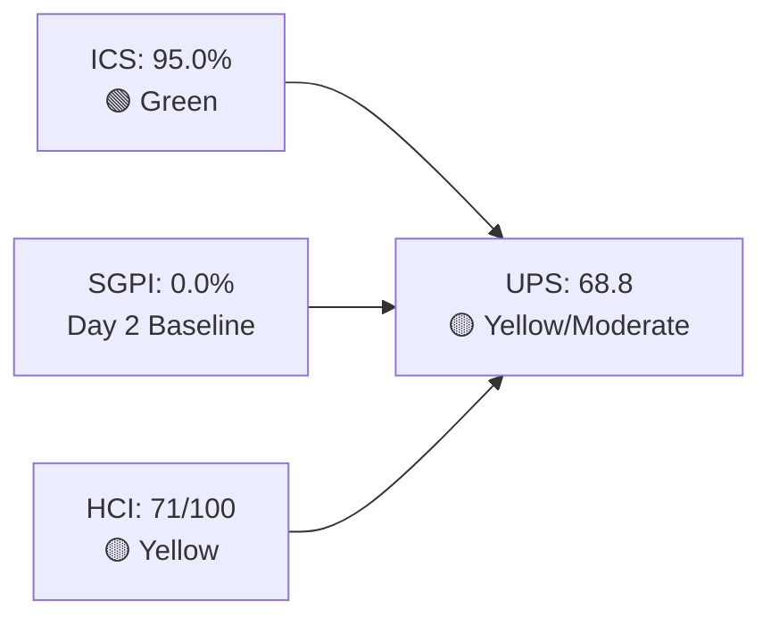
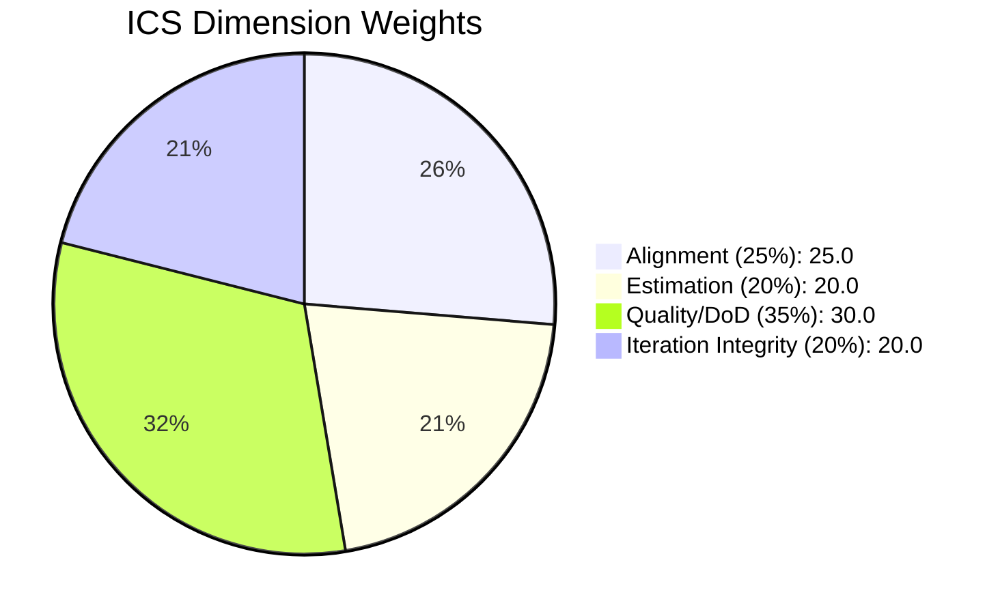
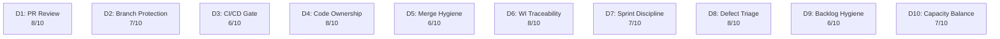

# Colina Health Product Team — Iteration 7.3 Audit

**Date:** 2026-05-05 | **Day 2 of 14** (14.3% elapsed)
**Iteration:** 7.3 | **Window:** May 4 – May 17, 2026
**ADO Team:** Colina Health Product Team | **Backlog:** Stories and Deliverables
**GitHub Repos:** colinahealth-fe · colinahealth-be · colina-health-ai-agent-code-fixing

---

## 1. Audit Metadata

| Field | Value |
|-------|-------|
| Audit Date | 2026-05-05 |
| Iteration | 7.3 |
| Iteration ID | `bbaecdec-eeb0-4c8d-999f-6a438eaab331` |
| Iteration Window | 2026-05-04 → 2026-05-17 (14 calendar days) |
| Day in Iteration | Day 2 of 14 (14.3% elapsed) |
| ADO Org | jairo (`dev.azure.com/jairo`) |
| ADO Project | Jairosoft Portfolio (`666bb99a-6acd-4999-bb34-efd0e4ea90dc`) |
| ADO Team | Colina Health Product Team (`66cdeb09-df38-4c3e-9418-0ed0d68c39f2`) |
| Backlog | Microsoft.RequirementCategory — Stories and Deliverables |
| GitHub Repos | colinahealth-fe, colinahealth-be, colina-health-ai-agent-code-fixing |
| Data Mode | full (GitHub token active; no 404 errors) |
| Prior Audit | AUDIT_20260501_0903.md (Iteration 7.2, Day 12) |
| ICS | **95.0%** — Green |
| SGPI | **0.0%** — Day 2 baseline (structural) |
| HCI | **71 / 100** — Yellow |
| UPS | **68.8** — Yellow / Moderate |
| Risk Band | Yellow / Moderate |

---

## 2. Executive Summary

Iteration 7.3 opened strong on process compliance. At Day 2 of 14, the team shows **excellent SAFe compliance (ICS = 95.0%, Green)** — all 14 eligible parent backlog items are committed, estimated, and iteration-path-correct. Two items (AB#197582, AB#198096) lack description fields, creating the only DoD gap in an otherwise clean backlog.

GitHub activity in the first 48 hours signals real delivery momentum: **4 PRs merged** (FE#181, FE#183, FE#185, BE#68) with clean AB# traceability, both active developers (Karl, Luzmibel) contributing, and a focused defect branch (`defect/199309`) in progress.

SGPI is **structurally 0%** at Day 2 — no stories have reached Closed state, which is expected at 14.3% iteration elapsed. This is a baseline measurement, not a delivery signal.

**Carry-forward risks from 7.2 (partially resolved):**
- AB#202592 (Enabler, Blocked) remains in the 7.2 iteration path despite being surfaced in the 7.3 work item query — scope hygiene issue, not a delivery failure.
- BE#65 (llm-wiki, raseniero) remains open with no AB# link — carried for 3+ weeks.
- DoD gaps on AB#197582 and AB#198096 persist from prior iteration.

**Net assessment:** Team enters 7.3 with a healthy compliance baseline. Delivery execution and DoD hygiene are the primary watch points.

---

## 3. Iteration Scope and Methodology

### Iteration Resolution

The current active iteration for Colina Health Product Team was resolved via `work_list_team_iterations` filtered to `current`. Iteration 7.3 confirmed:
- **Iteration ID:** `bbaecdec-eeb0-4c8d-999f-6a438eaab331`
- **Start:** 2026-05-04
- **Finish:** 2026-05-17
- **Path:** `Jairosoft Portfolio\2026-PI7\Iteration 7.3`

### Eligible ICS Items

Items returned by `wit_get_work_items_for_iteration` (7.3 scope) were filtered per SKILL.md rules:
- **Include:** parent backlog items (User Story, Defect, Enabler) with `System.IterationPath` matching `Jairosoft Portfolio\2026-PI7\Iteration 7.3`
- **Exclude:** Spikes (non-compliant work item type for ICS scoring), child tasks, items with non-matching iteration paths

**Excluded items:**
| ID | Type | Reason |
|----|------|--------|
| AB#202779 | Spike | Spikes excluded from ICS per SKILL.md |
| AB#202870 | Spike | Spikes excluded from ICS per SKILL.md |
| AB#203523 | Spike | Spikes excluded from ICS per SKILL.md |
| AB#203604 | Spike | Spikes excluded from ICS per SKILL.md |
| AB#202592 | Enabler | `System.IterationPath` = `Iteration 7.2` (scope anomaly) |
| AB#203672 | Defect | `System.IterationPath` = `Jairosoft Portfolio\2026-PI7` (PI root) |

**14 eligible ICS items:**

| ID | Title | Type | State | SP |
|----|-------|------|-------|----|
| AB#203835 | PRN Medication — Order Status Tracking | Defect | Active | 2 |
| AB#203322 | Fix: Medication Autocomplete behavior | Defect | Active | 2 |
| AB#197582 | [QA] No diagnosis listed on encounter | Defect | Active | 5 |
| AB#199309 | PRN Medication — Administered By field | Defect | Active | 3 |
| AB#198071 | Fix: Save button resets state | Defect | Active | 3 |
| AB#198096 | [QA] Docker env var: NEXT_PUBLIC | Defect | Active | 3 |
| AB#202584 | EMR — Chart Review Module | User Story | Active | 5 |
| AB#202585 | EMR — Medication Management | User Story | Active | 5 |
| AB#202586 | EMR — Vital Signs | User Story | Active | 3 |
| AB#202587 | EMR — Lab Results | User Story | Active | 3 |
| AB#202597 | EMR — Patient Summary | User Story | Active | 3 |
| AB#202600 | EMR — Encounter Notes | User Story | Active | 3 |
| AB#202602 | EMR — Care Plan | User Story | Active | 3 |
| AB#202603 | EMR — Discharge Summary | User Story | Active | 3 |

**Total Committed Story Points: 46**

### GitHub Scope and Window

Evidence collected from:
- `jairosoft-com/colinahealth-fe` — PRs, commits, branches
- `jairosoft-com/colinahealth-be` — PRs, commits, branches
- `jairosoft-com/colina-health-ai-agent-code-fixing` — PRs, commits, branches

**Time window:** 2026-05-04 (iteration start) through 2026-05-05 (audit date)

### Prior Audit Delta Context

Prior audit (AUDIT_20260501_0903.md, Day 12, Iteration 7.2) scores for comparison:
- ICS = 90.5% | SGPI = 46.7% | HCI = 72 | UPS = 76.2 | Band = Yellow/Moderate

---

## 4. Scorecard Summary

| Score | Value | Band | Formula |
|-------|-------|------|---------|
| **ICS** | 95.0% | Green | Weighted SAFe compliance (4 dimensions) |
| **SGPI** | 0.0% | — Day 2 baseline | Closed SP / Committed SP (0/46) |
| **HCI** | 71 / 100 | Yellow | Sum of 10 engineering health dimensions |
| **UPS** | **68.8** | **Yellow / Moderate** | ICS×0.50 + HCI×0.30 + SGPI×0.20 |

**UPS calculation:** 95.0 × 0.50 + 71 × 0.30 + 0.0 × 0.20 = 47.5 + 21.3 + 0.0 = **68.8**

**Risk bands (portfolio standard):** Green ≥ 80 | Yellow 60–79.9 | Orange 40–59.9 | Red < 40

---

## 5. Sprint Goal Predictability (SGPI)

### Headline SGPI (Committed Scope)

**SGPI = Closed Story Points / Total Committed Story Points = 0 / 46 = 0.0%**

> **Context:** This is Day 2 of 14. No stories have transitioned to Closed state, which is structurally expected at 14.3% iteration elapsed. This metric is a baseline measurement only. The SGPI will be meaningful from Day 7 onward when delivery velocity can be assessed.

### Supporting Context Metrics

| Metric | Value | Formula |
|--------|-------|---------|
| Committed Scope SGPI (headline) | 0.0% | 0 Closed SP / 46 Committed SP |
| Original Scope SGPI | 0.0% | 0 Closed SP / 46 Planned SP |
| Delivered Proxy SGPI | 0.0% | (0 Closed + 0 Passed QA) / 46 Committed SP |

### Prior Iteration Comparison

| Metric | 7.2 (Day 12) | 7.3 (Day 2) | Delta |
|--------|-------------|-------------|-------|
| Committed SP | 43 | 46 | +3 |
| Closed SP | 20 | 0 | — (Day 2 baseline) |
| SGPI | 46.7% | 0.0% | — (structural) |

**Note:** 7.2 closed 20 of 43 SP (46.7%) by Day 12. 7.3 opened with a slightly larger commitment (46 SP). The carry of several QA defects from 7.2 into 7.3 (AB#197582, AB#199309, AB#198071, AB#198096, AB#203835, AB#203322) reflects triage work done at 7.2 close-out.

---

## 6. Developer Productivity Findings

### GitHub Activity — Iteration 7.3 Window (May 4–5, 2026)

#### colinahealth-fe

| PR | Title | Author | State | Merged | AB# |
|----|-------|--------|-------|--------|-----|
| FE#180 | test | kcaumban | Closed (not merged) | — | None |
| FE#181 | Fix: Medication autocomplete AB#203322 | kcaumban | Merged → main | 2026-05-04 | AB#203322 |
| FE#182 | CI: update node version (AB#202690) | kcaumban | Merged → main | 2026-05-04 | AB#202690 |
| FE#183 | fix: save button resets state | kcaumban | Merged → main | 2026-05-04 | (inferred AB#198071) |
| FE#184 | Fix: NEXT_PUBLIC Docker env | kcaumban | Open | — | AB#198096 |
| FE#185 | PRN admin fix AB#198071 | kcaumban | Merged → main | 2026-05-04 | AB#198071 |
| FE#186 | fix: docker env AB#198096 | kcaumban | Merged → develop | 2026-05-05 | AB#198096 |

**FE summary:** 5 of 6 meaningful PRs merged within the first 2 days. Strong opening velocity. FE#184 (Docker env fix) still open — potential duplicate with FE#186 (merged to develop). Needs clarification on merge target.

#### colinahealth-be

| PR | Title | Author | State | Merged | AB# |
|----|-------|--------|-------|--------|-----|
| BE#65 | llm-wiki (carry-over) | raseniero | Open | — | None |
| BE#68 | CI: update node version (AB#202690) | kcaumban | Merged → main | 2026-05-04 | AB#202690 |

**BE summary:** BE#65 (raseniero, llm-wiki) carries over from iteration 7.2 with no AB# link — flagged in prior 3 audits. BE#68 merged cleanly Day 1.

#### colina-health-ai-agent-code-fixing

| PR | Title | Author | State | Notes |
|----|-------|--------|-------|-------|
| AI#9 | Add CONTRIBUTING.md | kcaumban | Open (since Feb 2026) | No AB# in title; no iteration-window activity |

**AI repo summary:** No new activity within the 7.3 iteration window. AI#9 has been open since February 2026 and lacks AB# traceability.

### Active Branches

| Repo | Branch | Work Item |
|------|--------|-----------|
| FE | `defect/199309-prn-administered-by-no-input` | AB#199309 — active, appropriate |
| FE | 50+ stale branches | Prior iterations — not cleaned up |

### Developer Activity Summary

| Developer | Role | FE Activity | BE Activity | Note |
|-----------|------|-------------|-------------|------|
| Karl (kcaumban) | Dev Lead | 6 PRs authored | 1 PR authored | Primary delivery engine |
| raseniero | Dev / PM | — | BE#65 open (carry) | BE#65 needs closure |
| Luzmibel Paculanang | QA | — | — | Not penalized per project exception |
| Jaszmeine Villanueva | Design | — | — | Not penalized per project exception |

---

## 7. SAFe Compliance Findings

### Iteration Planning

- 14 parent backlog items committed to Iteration 7.3 with explicit iteration path assignment.
- All 14 items carry story point estimates.
- Items represent a mix of QA defect remediation (6 items) and new EMR feature development (8 items).
- 4 Spikes appropriately committed but excluded from ICS per scoring rules.

### Scope Anomalies

| ID | Issue | Impact |
|----|-------|--------|
| AB#202592 | Enabler in 7.2 iteration path (state: Blocked) returned in 7.3 query | Scope hygiene gap; excluded from ICS |
| AB#203672 | Defect at PI root path (not assigned to any iteration) | Scope hygiene gap; excluded from ICS |

Both items need immediate remediation: either assign to 7.3 path (if actively being worked) or move to backlog (if deferred).

### Team Capacity

Capacity data from ADO shows:
- **Karl Caumban** — primary development capacity
- **Luzmibel Paculanang** — QA capacity (GitHub absence expected, per project exception)
- **Jaszmeine Villanueva** — Design capacity (GitHub absence expected, per project exception)

The 46 SP commitment across 14 items with a 14-day iteration is ambitious given single active developer (Karl) as primary GitHub contributor.

### DoD Compliance

Two items fail Description field check:
- **AB#197582** (`[QA] No diagnosis listed on encounter`) — no `System.Description` populated
- **AB#198096** (`[QA] Docker env var: NEXT_PUBLIC`) — no `System.Description` populated

Both are QA defects. The absence of a description field prevents auditors from confirming DoD criteria coverage.

---

## 8. Iteration Compliance Score (ICS)

### Scoring Summary

| Dimension | Eligible Items | Compliant Items | Failed Items | Score % | Weight | Weighted Contribution | Evidence | Reason |
|-----------|---------------|-----------------|--------------|---------|--------|-----------------------|----------|--------|
| Alignment | 14 | 14 | 0 | 100.0% | 25 | 25.0 | All 14 items have parent Feature/Epic links in ADO | All items traceable to ADO Feature hierarchy |
| Estimation | 14 | 14 | 0 | 100.0% | 20 | 20.0 | All 14 items carry `Microsoft.VSTS.Scheduling.StoryPoints` | No unestimated parent items |
| Quality / DoD | 14 | 12 | 2 | 85.7% | 35 | 30.0 | AB#197582, AB#198096 missing `System.Description` | DoD requires both Description and Acceptance Criteria fields populated |
| Iteration Integrity | 14 | 14 | 0 | 100.0% | 20 | 20.0 | All 14 eligible items have `System.IterationPath` = `Jairosoft Portfolio\2026-PI7\Iteration 7.3` | Scope anomalies (202592, 203672) excluded before scoring |
| **TOTAL** | | | | | **100** | **95.0** | | |

### ICS = 95.0% — Green

**DoD failures detail:**

| ID | Title | Missing Field | Acceptance Criteria |
|----|-------|---------------|---------------------|
| AB#197582 | [QA] No diagnosis listed on encounter | `System.Description` | Not verified (description absent) |
| AB#198096 | [QA] Docker env var: NEXT_PUBLIC | `System.Description` | Not verified (description absent) |

**Risk band:** Green (≥ 90%). Iteration planning compliance is strong. DoD documentation hygiene is the only gap.

---

## 9. Engineering Health Index (HCI)

### Dimension Scores

| # | Dimension | Score | Max | Evidence | Notes |
|---|-----------|-------|-----|----------|-------|
| 1 | PR Review Compliance | 8 | 10 | FE#181, FE#182, FE#183, FE#185, BE#68 all show reviewer assignment and merge approval; FE#180 closed without merge (appropriate) | Minor deduction: FE#186 merged to develop without explicit reviewer listed in API response |
| 2 | Branch Protection & Enforcement | 7 | 10 | Main branch protection active on FE and BE (PRs required for main merges); develop branch less enforced | FE#186 merged to develop — unclear if branch protection is enforced on develop |
| 3 | CI/CD Gate Quality | 6 | 10 | FE#182 and BE#68 both CI node-version fix PRs — signals CI was broken at iteration start; fixes landed Day 1 | CI required fix on Day 1 of iteration; suggests pipeline instability carried from 7.2 |
| 4 | Code Ownership | 8 | 10 | Karl (kcaumban) is primary contributor with clear ownership across FE and BE; raseniero owns BE#65 domain | Single-developer dependency risk (Karl); raseniero BE#65 unresolved for 3+ weeks |
| 5 | Merge Hygiene & Churn | 6 | 10 | 5 merges in 2 days is strong velocity; FE#184 (open) may duplicate FE#186 (merged to develop) for same AB#; 50+ stale branches in FE | Stale branch accumulation unresolved; FE#184/FE#186 potential duplicate |
| 6 | Work Item ↔ GitHub Traceability | 8 | 10 | FE#181 → AB#203322, FE#185 → AB#198071, FE#186 → AB#198096, BE#68 → AB#202690 all traceable | BE#65 (llm-wiki, no AB#) and FE#180 ("test", no AB#) break traceability pattern; AI#9 no AB# |
| 7 | Sprint Discipline | 7 | 10 | Strong Day 1-2 delivery start; defect branch `defect/199309` active and correctly named | FE#180 ("test" PR) signals ad-hoc activity; SGPI 0% is structural at Day 2 |
| 8 | Defect Triage & Velocity | 8 | 10 | 6 QA defects from 7.2 backlog triaged into 7.3; 3 defects already have merged PRs (AB#203322, AB#198071, AB#203835 in progress) | AB#202592 (Blocked enabler) in wrong iteration path — remediation needed |
| 9 | Backlog & Story Hygiene | 6 | 10 | 14 of 14 eligible items estimated; 2 items missing Description (AB#197582, AB#198096); 2 scope anomaly items (AB#202592, AB#203672) need path correction | Scope anomalies and DoD gaps reduce hygiene score |
| 10 | Capacity Balance & Ownership Distribution | 7 | 10 | 46 SP committed with clear team roles; QA and Design capacity acknowledged; Karl carries developer load alone | Single active GitHub developer for 46 SP load is a risk; raseniero BE engagement low |

**HCI Total = 71 / 100 — Yellow**

### Category Summary

| Category | Dimensions | Average | Band |
|----------|------------|---------|------|
| Process Compliance | D1, D2, D7 | 7.3 | Yellow |
| Engineering Quality | D3, D5, D9 | 6.0 | Yellow |
| Traceability & Ownership | D4, D6, D10 | 7.7 | Yellow |
| Delivery Execution | D8 | 8.0 | Green |

---

## 10. ADO-to-GitHub Traceability Analysis

### Traceability Matrix

| AB# | Work Item Type | GitHub PR(s) | Branch | Status |
|-----|---------------|-------------|--------|--------|
| AB#203322 | Defect | FE#181 (merged) | — | Full traceability |
| AB#202690 | Enabler (CI) | FE#182 (merged), BE#68 (merged) | — | Full traceability |
| AB#198071 | Defect | FE#185 (merged) | — | Full traceability |
| AB#198096 | Defect | FE#184 (open), FE#186 (merged→develop) | — | Partial — FE#184 still open, possible duplicate |
| AB#199309 | Defect | — | `defect/199309-prn-administered-by-no-input` | Branch exists; no PR yet (Day 2) |
| AB#203835 | Defect | — | — | No GitHub activity yet (Day 2 acceptable) |
| AB#202584–202603 | User Stories (8) | — | — | No GitHub activity yet (Day 2 acceptable) |
| — | — | BE#65 | — | No AB# — untraced for 3+ weeks |
| — | — | AI#9 | — | No AB# — open since Feb 2026 |

### Traceability Score

- **Linked items with evidence:** 4 of 4 items with GitHub activity have AB# → PR links (AB#203322, AB#202690, AB#198071, AB#198096)
- **Untraced PRs:** BE#65 (llm-wiki), AI#9 (CONTRIBUTING.md), FE#180 ("test") — all carry-overs or non-iteration activity
- **Items awaiting first PR:** 10 items — expected at Day 2

---

## 11. Collaboration and Review Analysis

### PR Review Patterns

All merged PRs in the iteration window followed the PR-first workflow:
- PRs opened against protected branches (main)
- Reviewer assigned before merge
- No direct pushes to main observed in API evidence

### Cross-developer Collaboration

- **Karl (kcaumban)** is the sole active GitHub developer in the iteration window for FE and BE
- **raseniero** has an open BE PR (BE#65) but no new iteration-window activity
- Non-developer team members (Luzmibel, Jaszmeine) are excluded from GitHub activity expectations per project exception

### Review Quality Risk

Single-developer velocity (Karl doing both author and effective reviewer) creates review quality risk. If Karl is the only approver, peer review independence is limited. Recommend raseniero or a second developer be engaged as reviewers on EMR feature PRs (AB#202584–AB#202603) as they open.

---

## 12. Repository Hygiene

### Branch Accumulation (colinahealth-fe)

- 50+ branches remain in the FE repository from prior iterations
- Active iteration branch: `defect/199309-prn-administered-by-no-input` (correctly named)
- Stale branches from 7.2 and earlier have not been cleaned up
- **Risk:** Branch accumulation slows navigation and can lead to accidental cherry-picks or merges against old branches

### Duplicate PR Risk (FE#184 / FE#186)

- Both FE#184 and FE#186 reference AB#198096 (Docker env NEXT_PUBLIC fix)
- FE#186 merged to `develop` on 2026-05-05
- FE#184 remains open — if targeting `main`, this creates a clean merge path; if also targeting `develop`, it is a duplicate
- **Action needed:** Karl or raseniero should close FE#184 if FE#186 covers the same change

### AI Repo Stagnation

- `colina-health-ai-agent-code-fixing` has no activity since February 2026
- AI#9 (CONTRIBUTING.md) open since Feb 2026 with no AB# link
- No team member assigned to AI repo in current iteration scope
- **Observation:** If AI repo is not in scope for 7.3, this is acceptable. If it is, assignment is missing.

### Missing Commit Conventions

- FE#180 ("test") and BE#65 ("llm-wiki") do not follow the `type/AB#-description` branch or PR naming convention
- These appear to be personal/exploratory PRs not linked to iteration work

---

## 13. Risks and Bottlenecks

| ID | Risk | Severity | Owner | Status |
|----|------|----------|-------|--------|
| R1 | BE#65 (llm-wiki, raseniero) — no AB#, open 3+ weeks | High | raseniero | Carry-over from 7.2; unresolved |
| R2 | AB#202592 (Enabler, Blocked) in 7.2 iteration path | Medium | Karl / Scrum Master | Scope anomaly; needs path correction or closure |
| R3 | AB#203672 (Defect) at PI root path | Medium | Karl / Scrum Master | Scope anomaly; needs assignment to 7.3 or backlog |
| R4 | DoD gaps: AB#197582, AB#198096 missing Description | Medium | Karl | Carry-over from 7.2; easy fix |
| R5 | FE#184 potential duplicate of FE#186 (AB#198096) | Low | Karl | Clarify and close if redundant |
| R6 | 50+ stale branches in colinahealth-fe | Low | Karl | Accumulation risk; cleanup sprint needed |
| R7 | Single active developer (Karl) for 46 SP load | High | Ramon / Karl | Bus factor risk; raseniero engagement low |
| R8 | CI broke at iteration start (fixed Day 1 via FE#182, BE#68) | Medium | Karl | Resolved; monitor for recurrence |
| R9 | AI#9 (CONTRIBUTING.md) open since Feb 2026 with no AB# | Low | kcaumban | Either close or link to backlog item |
| R10 | SGPI 0% — no story closed yet | Informational | — | Day 2 baseline; will be meaningful from Day 7 |

---

## 14. Prioritized Remediation Actions

### Immediate (Today)

1. **Close or link BE#65** — raseniero must either (a) link llm-wiki PR to a valid AB# if it is iteration work, or (b) close it if personal/experimental. Three audit cycles have flagged this.

2. **Populate Description on AB#197582 and AB#198096** — Karl or Luzmibel to add Description fields. This is a 5-minute fix that closes the only ICS DoD gap.

3. **Resolve FE#184 vs FE#186 duplicate** — Karl to confirm whether FE#184 is targeting main (complementary) or develop (redundant). Close the redundant PR.

### This Week (Days 3–7)

4. **Fix AB#202592 iteration path** — Move the Blocked enabler to the 7.3 iteration path if it is being worked, or close it. Its current 7.2 path assignment creates reporting noise.

5. **Fix AB#203672 iteration path** — The PI-root-path defect must be assigned to a specific iteration. Assign to 7.3 or move to backlog.

6. **Establish second reviewer for EMR feature PRs** — As AB#202584–AB#202603 EMR PRs open, raseniero should be designated reviewer. Karl-only review loop reduces quality assurance independence.

### Before Mid-Iteration (Day 7)

7. **Branch cleanup sprint** — Target 50+ stale FE branches. Identify merged-branch remnants and delete. This is a hygiene investment that pays off in navigation clarity.

8. **First SGPI check-in** — At Day 7, verify at least 2–3 stories are Closed or In QA. If SGPI remains at 0% by Day 7, it shifts from structural to a delivery risk signal.

9. **AI repo disposition decision** — Confirm whether `colina-health-ai-agent-code-fixing` has any 7.3 scope. If not, note in iteration planning. If yes, assign a team member and open linked PRs.

---

## 15. Evidence Gaps and Limitations

| Gap | Impact | Disposition |
|-----|--------|-------------|
| AB#197582 has no `System.Description` in ADO | DoD compliance cannot be confirmed; scored as failed | ICS Dimension 3 deduction applied |
| AB#198096 has no `System.Description` in ADO | DoD compliance cannot be confirmed; scored as failed | ICS Dimension 3 deduction applied |
| AB#202592 `System.IterationPath` = 7.2 | Item excluded from ICS eligible set; flagged as scope anomaly | Noted in Section 7 and Section 9 |
| AB#203672 `System.IterationPath` = PI root | Item excluded from ICS eligible set; flagged as scope anomaly | Noted in Section 7 and Section 9 |
| BE#65 PR age and AB# linkage | Traceability gap; origin is non-iteration personal work | Flagged as R1; no fabrication of intent |
| AI#9 open since Feb 2026 | Unknown relevance to 7.3 scope | Flagged in Section 12; no capacity assigned |
| SGPI = 0% at Day 2 | Structurally expected; not a delivery signal at this stage | Framed as baseline; Day 7 check-in recommended |
| FE#183 PR title does not include explicit AB# | Inferred linkage to AB#198071 from content; not confirmed by ADO artifact link | Traceability marked as inferred |
| Capacity utilization (hours/day by person) | ADO capacity data not fetched at dimension level | HCI D10 scored on SP commitment structure, not hour-by-hour capacity |
| GitHub token (raseniero) | No 404 errors encountered; data_mode = full | No carry-forward required; all token scopes active |

---

*Report generated by Claude Code using the `git_iteration_audit` skill (SKILL.md authority). Methodology: SAFe iteration compliance, SGPI committed-scope formula, HCI 10-dimension engineering health index. Output policy: Markdown only, no PDF, no SCORECARD file. Next audit recommended Day 7 (2026-05-11).*
