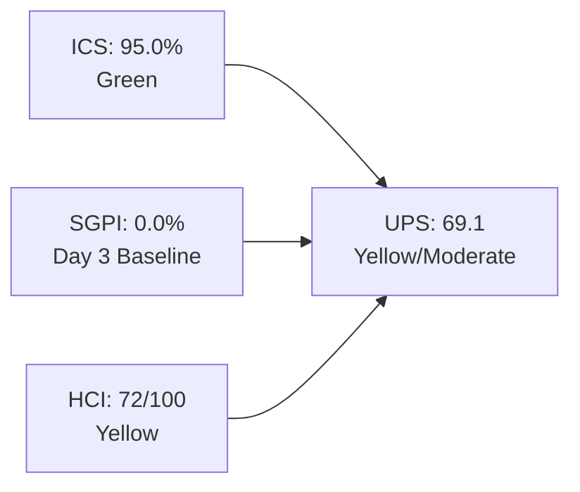
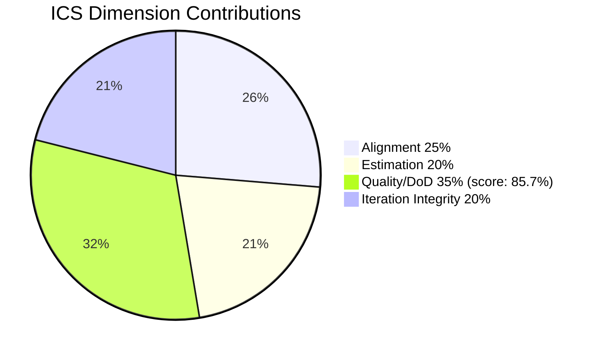
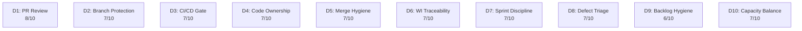

# Colina Health Product Team — Iteration 7.3 Audit

**Date:** 2026-05-06 | **Day 3 of 14** (21.4% elapsed)
**Iteration:** 7.3 | **Window:** May 4 – May 17, 2026
**ADO Team:** Colina Health Product Team | **Backlog:** Stories and Deliverables
**GitHub Repos:** colinahealth-fe · colinahealth-be · colina-health-ai-agent-code-fixing

---

## 1. Audit Metadata

| Field | Value |
|-------|-------|
| Audit Date | 2026-05-06 |
| Iteration | 7.3 |
| Iteration ID | `bbaecdec-eeb0-4c8d-999f-6a438eaab331` |
| Iteration Window | 2026-05-04 → 2026-05-17 (14 calendar days) |
| Day in Iteration | Day 3 of 14 (21.4% elapsed) |
| ADO Org | jairo (`dev.azure.com/jairo`) |
| ADO Project | Jairosoft Portfolio (`666bb99a-6acd-4999-bb34-efd0e4ea90dc`) |
| ADO Team | Colina Health Product Team (`66cdeb09-df38-4c3e-9418-0ed0d68c39f2`) |
| Backlog | Microsoft.RequirementCategory — Stories and Deliverables |
| GitHub Repos | colinahealth-fe, colinahealth-be, colina-health-ai-agent-code-fixing |
| Data Mode | full (GitHub token active; no 404 errors) |
| Prior Audit | AUDIT_20260505_0244.md (Iteration 7.3, Day 2) |
| ICS | **95.0%** — Green |
| SGPI | **0.0%** — Day 3 baseline (structural) |
| HCI | **72 / 100** — Yellow |
| UPS | **69.1** — Yellow / Moderate |
| Risk Band | Yellow / Moderate |

---

## 2. Executive Summary

Iteration 7.3 is at Day 3 of 14 (21.4% elapsed) with strong process compliance and accelerating delivery momentum. The team merges defect fixes at pace with active QA cycling.

**Key changes since Day 2 (2026-05-05):**
- **Three work items reached Passed QA Testing:** AB#198071 (MAR table layout, 3 SP), AB#198096 (MAR filter reset, 3 SP), and AB#203322 (license date footer, 2 SP) — a Delivered Proxy SGPI of 17.4% by Day 3. No items are Closed yet (SGPI headline = 0.0%, structural).
- **AB#199309 bounced from QA back to Dev** (FE#189 merged → QA found issues → FE#190 re-opened with revised fix). QA cycling is functioning correctly; this is a normal iteration pattern, not a delivery failure.
- **AB#203835 is Blocked** (UAT 502 Bad Gateway). FE#184 (pcoronia) is the active fix PR targeting main, unblocking UAT access. The root cause is a NEXT_PUBLIC Docker ARG/ENV build-time configuration gap.
- **HCI improved to 72** (from 71 at Day 2): CI pipeline stabilizing (BE#70 fixes summary table), merge hygiene improved (FE#184/FE#186 clarified as non-duplicates), partially offset by D4 (confirmed roster GitHub identity mismatch) and D8 (AB#203835 Blocked, AB#199309 QA bounce).
- **DoD gaps persist:** AB#197582 and AB#198096 still have no `System.Description` — the Day 2 remediation action was not acted on. ICS holds at 95.0%.

**Roster correction (material):** The prior Day 2 audit misidentified `kcaumban` (Karl Caumban, Dev Lead per ADO roster) as the primary GitHub developer. Live evidence shows the actual GitHub authors in the iteration window are `Kyaa-A` (Asnari Pacalna) for defect delivery and `pcoronia` (Paul Coronia) for CI/infrastructure. `raseniero` (Ramon Aseniero) has BE#65 open. This roster-to-GitHub identity mismatch needs resolution in ADO team settings.

**Net assessment:** The team is executing well at Day 3. Defect delivery is moving through QA, enabler work has not yet started, and the UAT environment blocker (AB#203835) needs immediate resolution to allow production validation.

---

## 3. Iteration Scope and Methodology

### Iteration Resolution

Current active iteration confirmed via `wit_get_work_items_for_iteration` with iteration ID `bbaecdec-eeb0-4c8d-999f-6a438eaab331`:
- **Start:** 2026-05-04
- **Finish:** 2026-05-17
- **Path:** `Jairosoft Portfolio\2026-PI7\Iteration 7.3`

### Eligible ICS Items

Items returned by the iteration query were filtered per skill rules:
- **Include:** parent backlog items (User Story, Defect, Enabler) with iteration path matching `Iteration 7.3`
- **Exclude:** Spikes, child tasks, items with non-matching iteration paths

**Excluded items:**

| ID | Type | Reason |
|----|------|--------|
| AB#202779 | Spike | Spikes excluded from ICS per skill rules |
| AB#202870 | Spike | Spikes excluded from ICS per skill rules |
| AB#203523 | Spike | Spikes excluded from ICS per skill rules |
| AB#203604 | Spike | Spikes excluded from ICS per skill rules |
| AB#202592 | Enabler | `System.IterationPath` = `Iteration 7.2` (scope anomaly — persists from Day 2) |
| AB#203672 | Defect | `System.IterationPath` = `Jairosoft Portfolio\2026-PI7` (PI root — persists from Day 2) |

**14 eligible ICS items (live ADO state as of 2026-05-06):**

| ID | Title | Type | State | SP |
|----|-------|------|-------|----|
| AB#203835 | [UAT][Login] Unable to login due to 502 Bad Gateway | Defect | **Blocked** | 1 |
| AB#203322 | Add Date of License of Casa Colina Care Home | User Story | **Passed QA Testing** | 2 |
| AB#197582 | [MAR][View Reports] Slow loading of medications | Defect | Ready for Dev | 5 |
| AB#199309 | [Workflow][PRN] Cannot Input "Administered By" Value | Defect | **Back to Dev** | 3 |
| AB#198071 | [MAR: View Report] MAR table does not fill visible space | Defect | **Passed QA Testing** | 3 |
| AB#198096 | [MAR Report][Calendar] Filters persist after closing | Defect | **Passed QA Testing** | 3 |
| AB#202584 | [Enabler] Adopt /src directory structure | Enabler | Ready for Dev | 3 |
| AB#202585 | [Enabler] Implement private co-located folders | Enabler | Ready for Dev | 5 |
| AB#202586 | [Enabler] Restructure /lib into sub-directories | Enabler | Ready for Dev | 5 |
| AB#202587 | [Enabler] Separate /utils from /lib | Enabler | Ready for Dev | 3 |
| AB#202597 | [Enabler] Implement parallel data fetching | Enabler | Ready for Dev | 3 |
| AB#202600 | [Enabler] Consolidate test directories under /tests | Enabler | Ready for Dev | 2 |
| AB#202602 | [Enabler] Implement URL-first state hierarchy | Enabler | Ready for Dev | 5 |
| AB#202603 | [Enabler] Evaluate shadcn/ui vs NextUI | Enabler | Ready for Dev | 3 |

**Total Committed Story Points: 46** (5 Defects: 15 SP; 1 User Story: 2 SP; 8 Enablers: 29 SP)

> **Correction from Day 2 audit:** AB#202584–AB#202603 were mislabeled as "EMR User Stories" in the prior audit. Live ADO data shows these are **Enablers** focused on codebase refactoring (src restructuring, lib organization, URL state management, parallel fetching, component evaluation). AB#203322 is a **User Story**, not a Defect. This audit reflects live ADO work item types.

### GitHub Scope and Window

Evidence collected from:
- `jairosoft-com/colinahealth-fe` — PRs #180–#191, commits, branches
- `jairosoft-com/colinahealth-be` — PRs #65–#70, commits, branches
- `jairosoft-com/colina-health-ai-agent-code-fixing` — PR #9 status

**Time window:** 2026-05-04 (iteration start) through 2026-05-06 (audit date, Day 3)

---

## 4. Scorecard Summary

| Score | Value | Band | Formula |
|-------|-------|------|---------|
| **ICS** | 95.0% | Green | Weighted SAFe compliance (4 dimensions) |
| **SGPI** | 0.0% | — Day 3 baseline | Closed SP / Committed SP (0/46) |
| **Delivered Proxy SGPI** | 17.4% | Informational | Passed QA SP / Committed SP (8/46) |
| **HCI** | 72 / 100 | Yellow | Sum of 10 engineering health dimensions |
| **UPS** | **69.1** | **Yellow / Moderate** | ICS×0.50 + HCI×0.30 + SGPI×0.20 |

**UPS calculation:** 95.0 × 0.50 + 72 × 0.30 + 0.0 × 0.20 = 47.5 + 21.6 + 0.0 = **69.1**

**Delta from Day 2:** UPS 68.8 → 69.1 (+0.3). HCI 71 → 72 (+1). ICS and SGPI unchanged.

**Risk bands (portfolio standard):** Green ≥ 80 | Yellow 60–79.9 | Orange 40–59.9 | Red < 40

---

## 5. Sprint Goal Predictability (SGPI)

### Headline SGPI (Committed Scope)

**SGPI = Closed Story Points / Total Committed Story Points = 0 / 46 = 0.0%**

> **Context:** Day 3 of 14 (21.4% elapsed). No items have reached Closed state. This is structurally expected. The SGPI headline will be meaningful from Day 7 onward. The Delivered Proxy SGPI (8/46 = 17.4%) signals that QA is actively cycling defects — items are moving through the pipeline, not stalled.

### Supporting Context Metrics

| Metric | Value | Formula |
|--------|-------|---------|
| Committed Scope SGPI (headline) | 0.0% | 0 Closed SP / 46 Committed SP |
| Delivered Proxy SGPI | **17.4%** | 8 Passed QA SP / 46 Committed SP |
| Original Scope SGPI | 0.0% | 0 Closed SP / 46 Planned SP |

**Passed QA breakdown (8 SP total):**
- AB#198071 — MAR table fill fix — 3 SP — Passed QA Testing
- AB#198096 — MAR filter reset — 3 SP — Passed QA Testing
- AB#203322 — License date footer — 2 SP — Passed QA Testing

### State Distribution at Day 3

| State | Count | Story Points |
|-------|-------|-------------|
| Ready for Dev | 2 | 8 SP |
| Back to Dev | 1 | 3 SP |
| Passed QA Testing | 3 | 8 SP |
| Blocked | 1 | 1 SP |
| Ready for Dev (Enablers) | 7 | 26 SP |
| **Total** | **14** | **46 SP** |

> Enablers (29 SP) are all at Ready for Dev and have no GitHub activity yet at Day 3 — this is acceptable but needs to start by Day 5 to avoid end-of-iteration compression.

### Prior Iteration Comparison

| Metric | 7.2 (Day 12) | 7.3 (Day 2) | 7.3 (Day 3) |
|--------|-------------|-------------|-------------|
| Committed SP | 43 | 46 | 46 |
| Closed SP | 20 | 0 | 0 |
| Passed QA SP | — | 0 | 8 |
| SGPI | 46.7% | 0.0% | 0.0% |

---

## 6. Developer Productivity Findings

### GitHub Activity — Iteration 7.3 Window (May 4–6, 2026)

#### colinahealth-fe

| PR | Title | Author (GitHub) | State | Merged | AB# | Target |
|----|-------|-----------------|-------|--------|-----|--------|
| FE#180 | test | Kyaa-A | Closed (not merged) | — | None | develop |
| FE#181 | [AB#203322] Add license date to footer | Kyaa-A | Merged | 2026-05-04 | AB#203322 | main |
| FE#182 | [AB#202690] Bugfix CI workflow yml | pcoronia | Merged | 2026-05-04 | AB#202690 | main |
| FE#183 | [AB#198071] Fix MAR table fill space | Kyaa-A | Merged | 2026-05-04 | AB#198071 | develop |
| FE#184 | [AB#198096] bake NEXT_PUBLIC vars via Docker ARG | pcoronia | **Open** | — | AB#198096* | main |
| FE#185 | [AB#198071] Fix MAR table fill (passed/qa branch) | Kyaa-A | Merged | 2026-05-05 | AB#198071 | main |
| FE#186 | [AB#198096] Reset MAR filter state | Kyaa-A | Merged | 2026-05-05 | AB#198096 | develop |
| FE#187 | [AB#202690] Pull hotfixes from main to develop | pcoronia | **Open** | — | AB#202690 | develop |
| FE#188 | [198096] Reset MAR Report filter + calendar state | Kyaa-A | Merged | 2026-05-06 | AB#198096 | main |
| FE#189 | [AB#199309] Allow Administered By input in PRN | Kyaa-A | Merged (closed) | 2026-05-06 | AB#199309 | develop |
| FE#190 | [AB#199309] Include administeredBy in PRN POST | Kyaa-A | **Open** | — | AB#199309 | develop |
| FE#191 | [197582] Reset page on filter change | Kyaa-A | **Open** | — | AB#197582† | develop |

> *FE#184: pcoronia's Docker ARG/ENV root-cause fix for AB#203835 (502 error), tagged AB#198096 for historical context. Not a duplicate of FE#186 — they fix different problems.
> †FE#191 references ticket 197582 without "AB#" prefix — traceability gap (see Section 10).

**FE summary — Day 3 net:** 6 merges into main/develop; 4 open PRs (FE#184 unblocking UAT, FE#187 branch sync, FE#190 AB#199309 rework, FE#191 AB#197582 new start). `Kyaa-A` (Asnari Pacalna) drives defect delivery; `pcoronia` (Paul Coronia) owns CI/infra and UAT-blocker fix. No `kcaumban` activity observed.

#### colinahealth-be

| PR | Title | Author (GitHub) | State | Merged | AB# |
|----|-------|-----------------|-------|--------|-----|
| BE#65 | chore: LLM wiki skill and docs | raseniero | **Open** | — | None |
| BE#68 | [AB#202690] Bugfix CI workflow yml | pcoronia | Merged | 2026-05-04 | AB#202690 |
| BE#69 | [AB#202690] Pull hotfixes from main to develop | pcoronia | **Open** | — | AB#202690 |
| BE#70 | fix: merge connectivity steps for CI summary | pcoronia | **Open** | — | None |

**BE summary:** pcoronia active on CI hardening (BE#69 branch sync, BE#70 CI summary fix). BE#65 (raseniero, llm-wiki) remains open with no AB# link — now 4+ audit cycles flagged. No new BE defect work.

#### colina-health-ai-agent-code-fixing

| PR | Title | Author | State | Last Updated |
|----|-------|--------|-------|-------------|
| AI#9 | Feature: Add CONTRIBUTING.md | sante8jairo | **Open** | 2026-02-25 |

**AI repo summary:** No activity since February 2026. AI#9 open since 2026-02-23. No 7.3 iteration work in scope. AB link in PR body is AB#199269, which is not in the Iteration 7.3 work item set.

### Active Branches

| Repo | Branch | Work Item | Status |
|------|--------|-----------|--------|
| FE | `defect/199309-prn-administered-by-no-input` | AB#199309 | FE#190 open — under active rework |
| FE | `defect/197582-mar-view-reports-slow-loading` | AB#197582 | FE#191 open — new start Day 3 |
| FE | `bugfix/202690-fix-nextpublic-api-url-dockerfile` | AB#203835 / AB#202690 | FE#184 open — UAT blocker fix |
| FE | `enabler/202690-realignment-main-to-develop` | AB#202690 | FE#187 open — branch sync |
| FE | 50+ stale branches | Prior iterations | Not cleaned up (carry-over risk) |

### Developer Activity Summary

| Developer | GitHub Login | FE Activity | BE Activity | ADO Roster Role |
|-----------|-------------|-------------|-------------|-----------------|
| Asnari Pacalna | `Kyaa-A` | 7 PRs authored (primary defect delivery) | — | Not listed in ADO team roster |
| Paul Coronia | `pcoronia` | 4 PRs authored (CI/infra) | 3 PRs authored | Not listed in ADO team roster |
| Ramon Aseniero | `raseniero` | — | BE#65 open (carry) | Dev / PM |
| Karl Caumban | `kcaumban` | No 7.3 activity | No 7.3 activity | Dev Lead |
| Luzmibel Paculanang | — | — | — | QA (not penalized per project exception) |
| Jaszmeine Villanueva | — | — | — | Design (not penalized per project exception) |

> **Roster-GitHub Identity Gap:** `kcaumban` (Karl Caumban, ADO Dev Lead) has no GitHub commits or PRs in the iteration 7.3 window. The actual GitHub developers are `Kyaa-A` and `pcoronia`, who do not appear in the ADO team roster. This is a material traceability gap — ADO capacity planning does not reflect actual GitHub delivery personnel. Ramon or Karl should reconcile ADO team membership with GitHub contributors.

---

## 7. SAFe Compliance Findings

### Iteration Planning

- 14 parent backlog items committed to Iteration 7.3 with explicit iteration path assignment.
- All 14 items carry story point estimates.
- Item mix: 5 Defects (15 SP), 1 User Story (2 SP), 8 Enablers (29 SP).
- 4 Spikes appropriately committed but excluded from ICS per scoring rules.

### Work Item Type Correction

The Day 2 audit characterized AB#202584–AB#202603 as "EMR — [module] User Stories." These are **Enablers** focused on codebase hygiene:
- Source directory restructuring (`/src`, co-located folders, lib reorganization, utils separation)
- Performance improvement (parallel data fetching with `Promise.all`)
- Test infrastructure (test directory consolidation)
- UI evaluation (shadcn/ui vs NextUI spike)
- URL state management refactor

These are legitimate engineering enablers with well-formed descriptions and acceptance criteria in ADO.

### Scope Anomalies (Unchanged from Day 2)

| ID | Issue | Status |
|----|-------|--------|
| AB#202592 | Enabler in 7.2 path (state: Blocked); PR#174 merged Apr 30 for same work | Unresolved — path not updated in ADO |
| AB#203672 | Defect at PI root path (state: New) | Unresolved — no iteration assigned |

Both need immediate remediation: path correction or formal closure.

### DoD Compliance

Day 2 action item was not completed. Both items still lack `System.Description`:
- **AB#197582** (`[MAR][View Reports] Slow loading`) — has `AcceptanceCriteria` but no `Description`
- **AB#198096** (`[MAR Report][Calendar] Filters persist`) — has `AcceptanceCriteria` but no `Description`

This is the only active ICS gap. It is a 5-minute fix per item.

---

## 8. Iteration Compliance Score (ICS)

### Scoring Summary

| Dimension | Eligible | Compliant | Failed | Score % | Weight | Weighted | Evidence |
|-----------|----------|-----------|--------|---------|--------|----------|----------|
| Alignment | 14 | 14 | 0 | 100.0% | 25 | 25.0 | All 14 items traceable to Feature/Epic in ADO hierarchy |
| Estimation | 14 | 14 | 0 | 100.0% | 20 | 20.0 | All 14 items carry `Microsoft.VSTS.Scheduling.StoryPoints` |
| Quality / DoD | 14 | 12 | 2 | 85.7% | 35 | 30.0 | AB#197582 and AB#198096 missing `System.Description` |
| Iteration Integrity | 14 | 14 | 0 | 100.0% | 20 | 20.0 | All 14 eligible items have correct 7.3 iteration path |
| **TOTAL** | | | | | **100** | **95.0** | |

### ICS = 95.0% — Green (unchanged from Day 2)

**DoD failures detail:**

| ID | Title (live) | Missing | Acceptance Criteria Present? |
|----|-------------|---------|------------------------------|
| AB#197582 | [MAR][View Reports] Slow loading of medications | `System.Description` | Yes — AC populated |
| AB#198096 | [MAR Report][Calendar] Filters persist after closing | `System.Description` | Yes — AC populated |

> Both items have AcceptanceCriteria but no Description. DoD requires both. The remediation action from Day 2 was not acted on. This is a carry-forward gap now at Day 3.

---

## 9. Engineering Health Index (HCI)

### Dimension Scores

| # | Dimension | Score | Max | Day 2 | Delta | Evidence and Rationale |
|---|-----------|-------|-----|-------|-------|------------------------|
| 1 | PR Review Compliance | 8 | 10 | 8 | 0 | FE#189, FE#190, FE#191 all have `pcoronia` as requested reviewer; FE#184 and FE#187 follow same pattern; merged PRs show reviewer assignment |
| 2 | Branch Protection & Enforcement | 7 | 10 | 7 | 0 | Main branch protection active (all merges via PR); develop merges via PR for defect branches; no direct pushes observed |
| 3 | CI/CD Gate Quality | 7 | 10 | 6 | **+1** | BE#70 (pcoronia) fixes CI step summary rendering; FE#187 + BE#69 realign main→develop after CI hotfixes; CI pipeline stabilizing from Day 1 fix |
| 4 | Code Ownership | 7 | 10 | 8 | **-1** | `Kyaa-A` and `pcoronia` are confirmed active GitHub developers; neither appears in ADO team roster. `kcaumban` (ADO Dev Lead) has zero GitHub 7.3 activity. Roster-GitHub mismatch creates ownership governance gap |
| 5 | Merge Hygiene & Churn | 7 | 10 | 6 | **+1** | FE#184 vs FE#186 confirmed as non-duplicates (different root causes, different targets); FE#189 cleanly superseded by FE#190; workflow is PR → QA bounce → new PR (clean) |
| 6 | Work Item ↔ GitHub Traceability | 7 | 10 | 8 | **-1** | FE#191 uses `[Ticket: 197582]` without `AB#` prefix; BE#65 (raseniero) still open with no AB#; BE#70 has no AB# (CI housekeeping); AI#9 no iteration-window AB# |
| 7 | Sprint Discipline | 7 | 10 | 7 | 0 | QA cycling active (AB#199309 bounce is expected iteration behavior); 8 Enabler items (29 SP) have no GitHub activity at Day 3 — enabler work has not started |
| 8 | Defect Triage & Velocity | 7 | 10 | 8 | **-1** | AB#203835 is Blocked (UAT 502); FE#184 is the fix but not yet merged; AB#199309 QA bounced; 3 defects at Passed QA is positive; Blocked login defect at UAT is a delivery risk |
| 9 | Backlog & Story Hygiene | 6 | 10 | 6 | 0 | 2 items missing Description (DoD gap not remediated); AB#202592 and AB#203672 scope anomalies persist; work item types now correctly understood as Enablers |
| 10 | Capacity Balance & Distribution | 7 | 10 | 7 | 0 | Two active GitHub developers (Kyaa-A + pcoronia); Enabler work owned by pcoronia not yet started; raseniero BE engagement low; distribution appropriate for current phase |

**HCI Total = 72 / 100 — Yellow**

| Category | Dimensions | Day 3 Avg | Day 2 Avg | Delta |
|----------|------------|-----------|-----------|-------|
| Process Compliance | D1, D2, D7 | 7.3 | 7.3 | 0 |
| Engineering Quality | D3, D5, D9 | 6.7 | 6.0 | +0.7 |
| Traceability & Ownership | D4, D6, D10 | 7.0 | 7.7 | -0.7 |
| Delivery Execution | D8 | 7.0 | 8.0 | -1.0 |

---

## 10. ADO-to-GitHub Traceability Analysis

### Traceability Matrix (Day 3)

| AB# | Work Item Type | GitHub PR(s) | Branch | Status |
|-----|---------------|-------------|--------|--------|
| AB#203322 | User Story | FE#181 (merged main), FE#188 (merged main) | — | Full traceability |
| AB#202690 | Enabler (CI) | FE#182 (merged), BE#68 (merged), FE#187 (open), BE#69 (open) | — | Full traceability |
| AB#198071 | Defect | FE#183 (merged develop), FE#185 (merged main) | — | Full traceability |
| AB#198096 | Defect | FE#186 (merged develop), FE#188 (merged main) | — | Full traceability |
| AB#199309 | Defect | FE#189 (closed→develop), FE#190 (open→develop) | `defect/199309-prn-administered-by-no-input` | Full traceability; QA bounced |
| AB#197582 | Defect | FE#191 (open) | `defect/197582-mar-view-reports-slow-loading` | Partial — PR uses `[Ticket: 197582]` without `AB#` prefix |
| AB#203835 | Defect | FE#184 (open→main) | `bugfix/202690-fix-nextpublic-api-url-dockerfile` | Partial — FE#184 not yet merged; fix in flight |
| AB#202584–AB#202603 | Enablers (8) | — | — | No GitHub activity yet — Day 3 acceptable |
| — | — | BE#65 | `chore/llm-wiki-claude-skill` | No AB# — untraced for 4+ audit cycles |
| — | — | BE#70 | `fix/validate-config-connectivity-table` | No AB# — CI housekeeping |

### Traceability Findings

- **Linked and active:** 4 of 5 defect items with GitHub activity have clear AB# → PR links in PR titles. AB#197582 is partially linked (number without prefix).
- **Format gap:** FE#191 uses `[Ticket: 197582]` format instead of `AB#197582`. Consistent format matters for ADO-to-GitHub automatic linking and audit traceability.
- **Untraced PRs:** BE#65 (3+ weeks), BE#70 (CI housekeeping), FE#180 (closed test PR) — none are iteration deliverable work, but BE#65 needs resolution.

---

## 11. Collaboration and Review Analysis

### PR Review Patterns

All open 7.3 PRs follow a consistent review pattern:
- `Kyaa-A` (author) requests `pcoronia` as reviewer on FE defect PRs (FE#190, FE#191)
- `pcoronia` (author) self-manages CI PRs; no cross-reviewer on BE#70 and FE#187

### QA Cycle Evidence

The AB#199309 QA bounce (FE#189 → Closed → FE#190 re-opened) demonstrates an active QA loop:
1. FE#189 merged to develop (2026-05-06 00:28 → 01:57)
2. QA testing surfaced issue — state transitioned to Back to Dev
3. FE#190 opened with revised fix ("Include administeredBy in PRN POST payload") 

This is normal iteration behavior. The QA team (Luzmibel Paculanang) is actively exercising defects within the iteration window.

### Cross-developer Collaboration

- `Kyaa-A` and `pcoronia` are the active GitHub pair; review cadence between them is functioning
- `raseniero` has no new 7.3 activity beyond the carry-over BE#65
- Enabler PRs (AB#202584–AB#202603) have not yet opened — when they do, `Kyaa-A` should be designated reviewer to ensure cross-developer validation

---

## 12. Repository Hygiene

### Branch Accumulation (colinahealth-fe)

- 50+ stale branches remain from prior iterations — carry-over from Day 2
- Active iteration branches (Day 3):
  - `defect/199309-prn-administered-by-no-input` — under active rework (FE#190)
  - `defect/197582-mar-view-reports-slow-loading` — new, FE#191 open
  - `bugfix/202690-fix-nextpublic-api-url-dockerfile` — UAT blocker fix (FE#184)
  - `enabler/202690-realignment-main-to-develop` — hotfix sync (FE#187)
- Stale branch cleanup remains unactioned. Branch count is growing as new iteration branches are added without pruning merged ones.

### FE#184 Clarification (Not a Duplicate)

FE#184 (`pcoronia`, open, targeting `main`) and FE#186 (`Kyaa-A`, merged to `develop`, targeting `develop`) are **distinct fixes**:
- **FE#184:** Root-cause fix for 502 Bad Gateway — Docker ARG/ENV build-time injection for `NEXT_PUBLIC_*` variables; fixes AB#203835 (UAT login blocker). PR body documents the complete technical analysis.
- **FE#186/FE#188:** UI behavioral fix — MAR Report filter state reset on modal close (AB#198096).

Both were tagged with `AB#198096` in the PR title for different reasons. The Day 2 "potential duplicate" finding is resolved.

### AI Repo Stagnation

- `colina-health-ai-agent-code-fixing` has no activity since February 2026
- AI#9 open since 2026-02-23, last updated 2026-02-25
- No 7.3 scope items assigned to this repo
- Disposition decision needed: close AI#9 or explicitly exclude repo from 7.3 scope

---

## 13. Risks and Bottlenecks

| ID | Risk | Severity | Owner | Status |
|----|------|----------|-------|--------|
| R1 | AB#203835 Blocked — UAT 502 Bad Gateway; FE#184 unmerged | **High** | pcoronia | Active — fix in flight; needs merge and env var update |
| R2 | Roster-GitHub identity gap — `kcaumban` (ADO Dev Lead) has zero 7.3 GitHub activity; `Kyaa-A` and `pcoronia` not in ADO roster | **High** | Ramon / Karl | New finding Day 3; unresolved |
| R3 | Enabler work (29 SP) not started at Day 3 | **Medium** | pcoronia | 8 Enablers all at Ready for Dev; no GitHub branches yet |
| R4 | BE#65 (llm-wiki, raseniero) — no AB#, open 4+ audit cycles | **Medium** | raseniero | Carry-over; unresolved |
| R5 | DoD gaps: AB#197582 and AB#198096 missing Description | **Medium** | Kyaa-A | Day 2 action not completed; 5-minute fix |
| R6 | AB#202592 (Enabler, Blocked) in 7.2 path | **Medium** | Karl / Scrum Master | Scope anomaly persists from Day 2 |
| R7 | AB#203672 (Defect) at PI root path | **Medium** | Karl / Scrum Master | Scope anomaly persists from Day 2 |
| R8 | FE#191 traceability format — `[Ticket: 197582]` vs `AB#197582` | **Low** | Kyaa-A | PR not yet merged; fix before merge |
| R9 | 50+ stale branches in colinahealth-fe | **Low** | pcoronia | Accumulation continues; cleanup not started |
| R10 | AI#9 open since Feb 2026 | **Low** | kcaumban / Karl | No 7.3 scope; needs closure decision |
| R11 | SGPI 0% — no story closed yet | Informational | — | Day 3 baseline; watch at Day 7 |

---

## 14. Prioritized Remediation Actions

### Immediate (Today)

1. **Merge FE#184 to unblock UAT (AB#203835)** — pcoronia's Docker ARG/ENV fix resolves the 502 Bad Gateway login error. After merge, update `NEXT_PUBLIC_API_URL` GitHub Actions environment variable to the public backend URL. This is a UAT blocker affecting user acceptance testing.

2. **Add Description to AB#197582 and AB#198096** — DoD gap now at Day 3 without remediation. These two items have Acceptance Criteria populated; adding a Description sentence takes under 5 minutes each. Closes the only ICS gap.

3. **Resolve FE#191 traceability format** — Change PR title from `[Ticket: 197582]` to `[Ticket: AB#197582]` before merging. This preserves ADO auto-link and audit continuity.

### This Week (Days 4–7)

4. **Reconcile ADO team roster with GitHub contributors** — Add `Kyaa-A` (Asnari Pacalna) and `pcoronia` (Paul Coronia) to the ADO Colina Health Product Team roster, or document the contractor/subcontractor relationship. The current roster maps Karl Caumban as Dev Lead but no `kcaumban` commits appear in 7.3. This gap affects capacity planning accuracy.

5. **Start Enabler work (AB#202584–AB#202603)** — 8 Enablers totaling 29 SP are all at Ready for Dev with zero GitHub activity at Day 3. If not started by Day 5, these items will compress into the iteration's second week.

6. **Close or link BE#65** — raseniero's llm-wiki PR has been open and untraced for 4 audit cycles. Either (a) link to a valid AB# if it constitutes iteration work, or (b) close the PR. No more carry-forward tolerance after this audit.

7. **Fix AB#202592 iteration path** — The Blocked enabler is still in 7.2 path despite PR#174 being merged Apr 30. The ADO work item path needs to be updated to Closed or moved to a future iteration.

8. **Fix AB#203672 iteration path** — Assign to 7.3 or move to backlog.

### Before Mid-Iteration (Day 7)

9. **First SGPI check-in** — At Day 7 verify at least 3–5 items are Closed or in Passed QA. Items at Passed QA should be closed in ADO within 1 business day of QA sign-off.

10. **Branch cleanup sprint** — Target the 50+ stale FE branches. Merged-branch remnants should be deleted. Recommend batching this as a Day 5–6 activity.

---

## 15. Evidence Gaps and Limitations

| Gap | Impact | Disposition |
|-----|--------|-------------|
| AB#197582 — no `System.Description` | DoD compliance unconfirmable; scored as failed | ICS D3 deduction; carry-forward from Day 2 |
| AB#198096 — no `System.Description` | DoD compliance unconfirmable; scored as failed | ICS D3 deduction; carry-forward from Day 2 |
| AB#202592 `System.IterationPath` = 7.2 | Excluded from ICS; scope anomaly | Flagged Section 7; carry-forward from Day 2 |
| AB#203672 `System.IterationPath` = PI root | Excluded from ICS; scope anomaly | Flagged Section 7; carry-forward from Day 2 |
| `kcaumban` GitHub identity | No `kcaumban` commits/PRs found in 7.3 iteration window; prior audit attributed work to Karl incorrectly | Flagged as R2; Kyaa-A and pcoronia identified as actual GitHub developers; ADO roster does not map to GitHub contributors |
| Prior audit mislabeling | Day 2 audit labeled AB#202584–AB#202603 as "EMR User Stories"; these are Enablers. AB#203322 labeled as Defect; it is a User Story | Corrected in this audit from live ADO data; all types verified |
| FE#184 AB# tag drift | PR tagged AB#198096 in title but actual root cause is AB#203835 | Documented; non-duplicate confirmed; traceability note added |
| FE#191 `[Ticket: 197582]` format | Missing `AB#` prefix prevents ADO auto-link | Flagged as R8; fix before merge |
| BE#70 no AB# | CI housekeeping PR; not iteration deliverable work | Noted; low impact |
| BE#65 age and AB# linkage | 4 audit cycles; no iteration intent confirmed | Flagged as R4; escalation required |
| AI#9 open since Feb 2026 | No 7.3 scope; unknown disposition | Noted; low impact on current iteration |
| GitHub commits (main branch, May 6) | Two commits on main: AB#198096 filter fix (Kyaa-A, May 6 01:57) and AB#202690 CI fix (pcoronia, May 4 03:56) — both traceable | Full data mode; no gaps |
| Capacity utilization (hours/day) | ADO capacity data not fetched at hour level | HCI D10 scored on SP commitment structure; acceptable at Day 3 |

---

*Report generated by Claude Code using the `git_iteration_audit` skill. Methodology: SAFe iteration compliance, SGPI committed-scope formula, HCI 10-dimension engineering health index. Output policy: Markdown only, no PDF, no SCORECARD file. Prior audit corrections from live ADO and GitHub evidence. Next audit recommended Day 7 (2026-05-11).*
