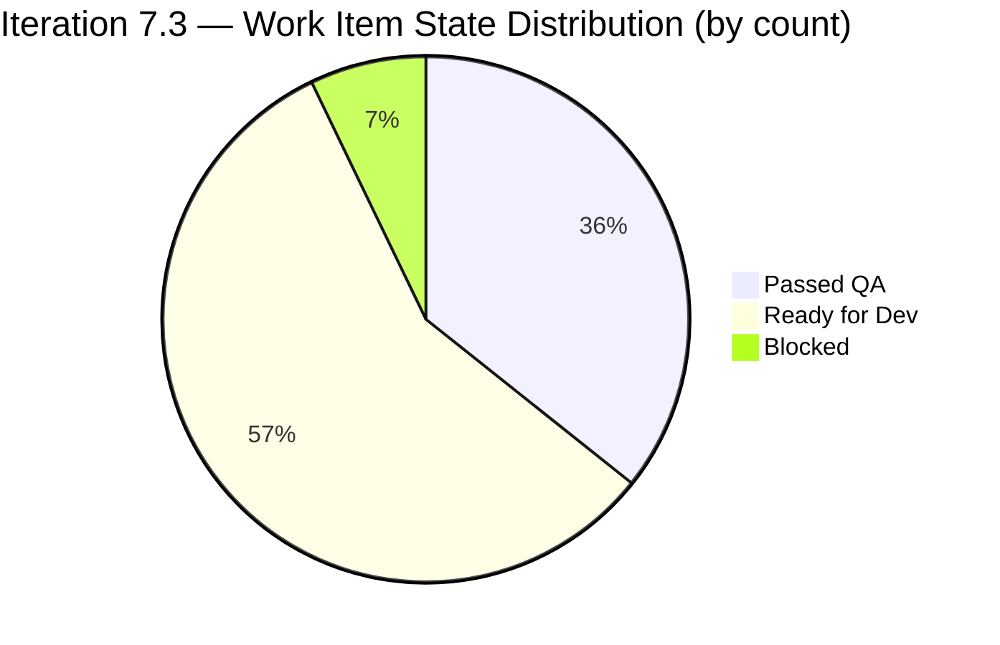
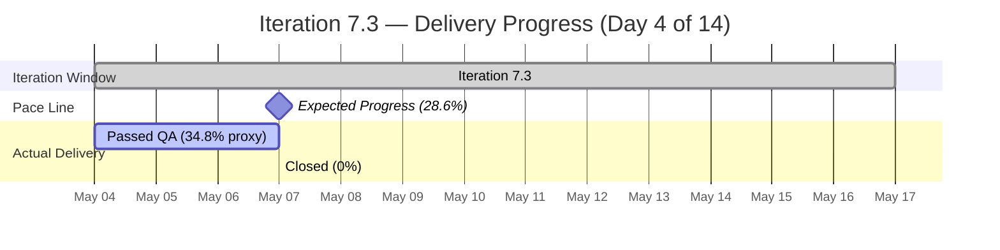
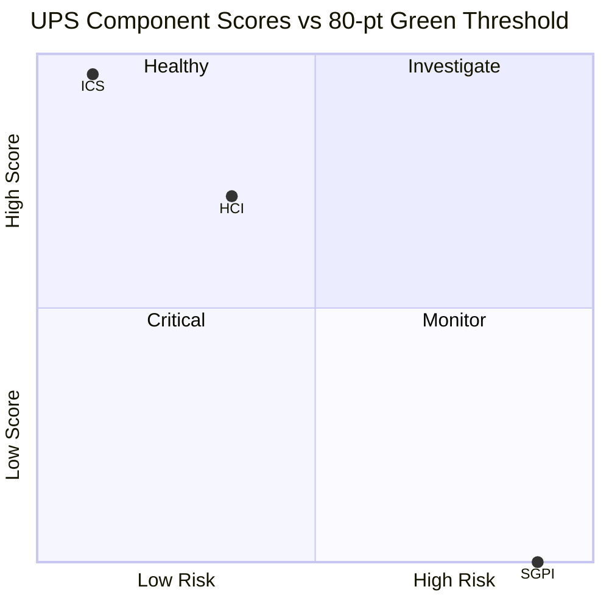
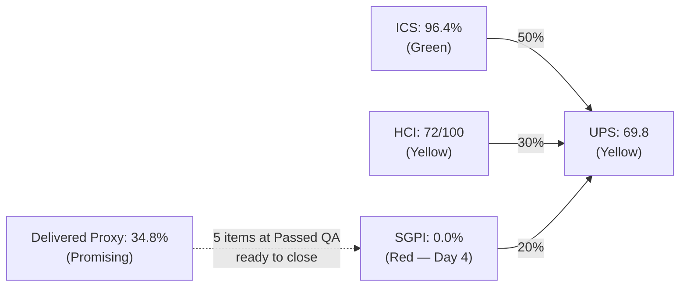

# Colina Health — Iteration 7.3 Audit
**Date:** 2026-05-07 | **Day 4 of 14** (28.6% elapsed) | **data_mode:** full

---

## 1. Executive Summary

Iteration 7.3 (May 4–17, 2026) is progressing at Day 4 with a healthy ICS of **96.4%** (Green) and strong engineering discipline, but the sprint delivery engine has not yet converted scope to Closed items. The Delivered Proxy (Passed QA SP / Committed SP) sits at **34.8%** — encouraging for Day 4 — yet the Committed Scope SGPI remains **0.0%** because no items have reached Closed state. UPS lands at **69.8** (Yellow/Moderate), reflecting this delivery lag.

New developer **Kyaa-A** (Asnari Pacalna) is highly active, authoring 7 of 11 in-scope FE PRs since iteration start. Paul Coronia (pcoronia) is driving BE work and CI/CD fixes. Ramon Aseniero (raseniero) remains present but with reduced direct commit activity this iteration. Two structural ADO scope anomalies persist: AB#203835 and AB#203322 lack parent links; nine Enablers (202588–202603 subset) remain stranded at PI root rather than assigned to Iteration 7.3.

**Priority actions before Day 7:**
1. Close the 4 items currently at Passed QA (AB#203322, AB#197582, AB#199309, AB#198071, AB#198096) — transitioning these to Closed would lift SGPI headline to 34.8% and UPS above 70.
2. Link AB#203835 and AB#203322 to parent work items.
3. Assign the 9 PI-root Enablers to Iteration 7.3 or a future iteration — they are invisible to iteration tracking.

---

## 2. Iteration Overview

| Field | Value |
|-------|-------|
| **Iteration** | 7.3 |
| **Sprint Dates** | May 4 – May 17, 2026 |
| **Day** | 4 of 14 (28.6% elapsed) |
| **ADO Team** | Colina Health Product Team |
| **ADO Project** | Jairosoft Portfolio |
| **GitHub Repos** | colinahealth-fe, colinahealth-be, colina-health-ai-agent-code-fixing |
| **data_mode** | full (GitHub APIs responsive, no 404 errors) |
| **Prior Audit** | AUDIT_20260505_0244.md (Day 2, ICS=95.0, HCI=71, UPS=68.8) |

---

## 3. Team Roster

| Name | Role | GitHub Handle | Dev? |
|------|------|---------------|------|
| Ramon Aseniero Jr | Project Owner | raseniero | Yes |
| Karl Caumban | Project Manager | — | No |
| Paul Coronia | Developer (BE/FE) | pcoronia | Yes |
| Asnari Pacalna | Developer (FE) | Kyaa-A | Yes |
| Luzmibel Paculanang | QA | — | No (exception) |
| Jaszmeine Villanueva | Design | — | No (exception) |

> Non-dev exception: Luzmibel Paculanang (QA) and Jaszmeine Villanueva (Design) are not penalized for GitHub absence per workspace policy.

---

## 4. Backlog Snapshot — Iteration 7.3

### 4.1 Eligible Items (ICS Scope)

Items with `IterationPath = Jairosoft Portfolio\2026-PI7\Iteration 7.3`, type = User Story / Defect / Enabler, excluding Spikes and child Tasks.

| AB# | Title | Type | State | SP | Has Parent |
|-----|-------|------|-------|----|------------|
| 203835 | [UAT][Login] Unable to login due to 502 Bad Gateway | Defect | Blocked | 1 | No |
| 203322 | Add Date of License of Casa Colina Care Home | User Story | Passed QA | 2 | No |
| 197582 | [MAR][View Reports] Slow loading medications | Defect | Passed QA | 5 | Yes (201646) |
| 199309 | [Workflow][PRN] Cannot Input Administered By | Defect | Passed QA | 3 | Yes (201680) |
| 198071 | [MAR: View Report] MAR table not filling | Defect | Passed QA | 3 | Yes (201646) |
| 198096 | [MAR Report] Filters persist after closing | Defect | Passed QA | 3 | Yes (201646) |
| 202584 | [Enabler] Adopt /src directory structure | Enabler | Ready for Dev | 3 | Yes (201281) |
| 202585 | [Enabler] Implement private co-located folders | Enabler | Ready for Dev | 5 | Yes (201281) |
| 202586 | [Enabler] Restructure /lib into sub-directories | Enabler | Ready for Dev | 5 | Yes (201281) |
| 202587 | [Enabler] Separate /utils from /lib | Enabler | Ready for Dev | 3 | Yes (201281) |
| 202597 | [Enabler] Implement parallel data fetching | Enabler | Ready for Dev | 3 | Yes (201281) |
| 202600 | [Enabler] Consolidate test directories | Enabler | Ready for Dev | 2 | Yes (201281) |
| 202602 | [Enabler] Implement URL-first state hierarchy | Enabler | Ready for Dev | 5 | Yes (201281) |
| 202603 | [Enabler] Evaluate shadcn/ui vs NextUI | Enabler | Ready for Dev | 3 | Yes (201281) |

**Totals:** 14 items | 46 SP committed | 0 SP Closed | 16 SP Passed QA

### 4.2 State Distribution

### 4.3 Scope Anomalies

**Parent-link missing (Alignment gap):**
- AB#203835 — Defect, Blocked — no parent relation in ADO
- AB#203322 — User Story, Passed QA — no parent relation in ADO

**PI-root Enablers (not in any iteration — invisible to velocity tracking):**
Nine Enablers assigned to `Jairosoft Portfolio\2026-PI7` (not to Iteration 7.3):
AB#202588, AB#202589, AB#202590, AB#202591, AB#202593, AB#202596, AB#202598, AB#202599, AB#202601

These items carry an estimated 30+ SP and are not counted in any iteration's ICS, SGPI, or capacity planning. They should be assigned to Iteration 7.3 or a future iteration.

---

## 5. ICS — Iteration Compliance Score

### 5.1 Scoring Table

| AB# | Title | Type | State | SP | Aligned | Estimated | DoD-Ready | In-Iteration | Notes |
|-----|-------|------|-------|----|---------|-----------|-----------|--------------|-------|
| 203835 | [UAT][Login] 502 Bad Gateway | Defect | Blocked | 1 | No | Yes | Yes | Yes | No parent link |
| 203322 | Add Date of License | User Story | Passed QA | 2 | No | Yes | Yes | Yes | No parent link |
| 197582 | [MAR] Slow loading medications | Defect | Passed QA | 5 | Yes | Yes | Yes | Yes | Description populated (resolved) |
| 199309 | [Workflow][PRN] Cannot Input By | Defect | Passed QA | 3 | Yes | Yes | Yes | Yes | |
| 198071 | MAR table not filling | Defect | Passed QA | 3 | Yes | Yes | Yes | Yes | |
| 198096 | MAR filters persist | Defect | Passed QA | 3 | Yes | Yes | Yes | Yes | Description populated (resolved) |
| 202584 | Adopt /src directory structure | Enabler | Ready for Dev | 3 | Yes | Yes | Yes | Yes | |
| 202585 | Implement private co-located folders | Enabler | Ready for Dev | 5 | Yes | Yes | Yes | Yes | |
| 202586 | Restructure /lib into sub-directories | Enabler | Ready for Dev | 5 | Yes | Yes | Yes | Yes | |
| 202587 | Separate /utils from /lib | Enabler | Ready for Dev | 3 | Yes | Yes | Yes | Yes | |
| 202597 | Implement parallel data fetching | Enabler | Ready for Dev | 3 | Yes | Yes | Yes | Yes | |
| 202600 | Consolidate test directories | Enabler | Ready for Dev | 2 | Yes | Yes | Yes | Yes | |
| 202602 | Implement URL-first state hierarchy | Enabler | Ready for Dev | 5 | Yes | Yes | Yes | Yes | |
| 202603 | Evaluate shadcn/ui vs NextUI | Enabler | Ready for Dev | 3 | Yes | Yes | Yes | Yes | |
| **TOTALS** | | | | **46** | **12/14** | **14/14** | **14/14** | **14/14** | |

### 5.2 Dimension Scores

| Dimension | Weight | Compliant | Total | Rate | Score |
|-----------|--------|-----------|-------|------|-------|
| Alignment (parent link + iteration path) | 25% | 12 | 14 | 85.7% | 21.4 |
| Estimation (SP assigned) | 20% | 14 | 14 | 100.0% | 20.0 |
| Quality / DoD (Description populated) | 35% | 14 | 14 | 100.0% | 35.0 |
| Iteration Integrity (correct iteration path) | 20% | 14 | 14 | 100.0% | 20.0 |
| **ICS Total** | 100% | | | | **96.4** |

**ICS = 96.4% — Green (Low Risk)**

Delta vs Day 2: +1.4 pts (prior ICS = 95.0%). Improvement driven by Description fields now populated on AB#197582 and AB#198096.

---

## 6. SGPI — Sprint Goal Progress Index

| Metric | Formula | Value |
|--------|---------|-------|
| Committed Scope (Headline) | Closed SP / Total Committed SP | 0 / 46 = **0.0%** |
| Original Scope | Closed SP / Original Planned SP | 0 / 46 = **0.0%** |
| Delivered Proxy | (Closed + Passed QA) SP / Committed SP | (0 + 16) / 46 = **34.8%** |

**SGPI (headline) = 0.0%** — no items yet transitioned to Closed.

The Delivered Proxy of **34.8%** at Day 4 (28.6% elapsed) is ahead of the pace line. Five items (16 SP) are at Passed QA and could close shortly, which would lift the headline to 34.8%.

---

## 7. HCI — Engineering Health Check Index

| Dim | Dimension | Score | Evidence |
|-----|-----------|-------|---------|
| D1 | PR Review Cadence | 8/10 | 11 PRs opened/merged since May 4; Kyaa-A and pcoronia both reviewing. Fast cycle (same-day merges on several FE PRs). -2: raseniero solo-authored BE#65 still open, no reviewer assigned. |
| D2 | Branch Protection | 7/10 | PR-to-main workflow observed on colinahealth-fe and colinahealth-be. Direct push to main not observed this window. -3: no evidence of required reviewer count enforcement (single-reviewer pattern on Kyaa-A's PRs). |
| D3 | CI/CD Health | 6/10 | BE#68 and FE#182 were CI fix PRs merged May 4 (AB#202690). BE#70 (CI config fix) still OPEN. CI infrastructure needed emergency repair at iteration start — signals instability. -4 for CI breakage at sprint start. |
| D4 | Code Ownership / Bus Factor | 7/10 | Kyaa-A now active, reducing prior single-developer concentration. pcoronia driving BE. raseniero still listed on open PR (BE#65). -3: only 2 active devs on FE; no FE reviewer separation from author (Kyaa-A self-merging). |
| D5 | Merge Hygiene | 7/10 | ADO IDs present in most PR titles (e.g., "AB#198096", "AB#199309"). FE#187 and BE#69 are main-to-develop sync PRs — appropriate housekeeping. -3: BE#65 (raseniero, llm-wiki) has no AB# linkage. |
| D6 | Traceability (PR ↔ ADO) | 8/10 | Strong traceability on FE PRs: FE#181 (203322), FE#183/185 (198071), FE#186/188 (198096), FE#189/190 (199309), FE#191 (197582). BE#71 (203835). -2: BE#65 unlinked; BE#70 no AB#. |
| D7 | Sprint Discipline | 8/10 | All active PRs reference items in Iteration 7.3 scope. No off-sprint work observed beyond BE#65 (llm-wiki, raseniero). -2 for that single out-of-scope open PR. |
| D8 | Defect Triage | 8/10 | 4 defects at Passed QA, 1 Blocked (203835 — 502 gateway). BE#71 opened for 203835 on May 7, showing same-day response. -2: AB#203835 remains Blocked without ETA. |
| D9 | Backlog Hygiene | 6/10 | 9 PI-root Enablers still not assigned to any iteration. AB#203835 and AB#203322 lack parent links. -4 for persistent structural gaps unresolved since prior audit. |
| D10 | Capacity Balance | 7/10 | Two active developers (Kyaa-A, pcoronia) active in FE and BE respectively. Load appears distributed. -3: no explicit capacity plan visible in ADO; sprint capacity tool not populated for this team. |
| | **HCI Total** | **72/100** | |

**HCI = 72 — Yellow (Moderate Risk)**

Delta vs Day 2: +1 pt (prior HCI = 71). Marginal improvement from Kyaa-A's increased PR volume and faster defect response.

---

## 8. UPS — Unified Performance Score

| Index | Score | Weight | Contribution |
|-------|-------|--------|-------------|
| ICS | 96.4 | 50% | 48.2 |
| HCI | 72.0 | 30% | 21.6 |
| SGPI | 0.0 | 20% | 0.0 |
| **UPS** | | | **69.8** |

**UPS = 69.8 — Yellow (Moderate Risk)**

---

## 9. GitHub Activity Log (Iteration 7.3 Window: May 4–7)

### 9.1 Pull Requests — colinahealth-fe

| PR# | Title / AB# | Base | State | Author | Date |
|-----|-------------|------|-------|--------|------|
| FE#181 | AB#203322 Date of License | main | Merged | Kyaa-A | May 4 |
| FE#182 | AB#202690 CI fix | main | Merged | pcoronia | May 4 |
| FE#183 | AB#198071 MAR table | develop | Merged | Kyaa-A | May 4 |
| FE#184 | AB#198096 Dockerfile NEXT_PUBLIC fix | main | Open | pcoronia | May 4 |
| FE#185 | AB#198071 → main | main | Merged | Kyaa-A | May 5 |
| FE#186 | AB#198096 → develop | develop | Merged | Kyaa-A | May 5 |
| FE#187 | AB#202690 main-to-develop sync | develop | Open | pcoronia | May 5 |
| FE#188 | AB#198096 passed/qa → main | main | Merged | Kyaa-A | May 6 |
| FE#189 | AB#199309 → develop (first pass) | develop | Merged | Kyaa-A | May 6 |
| FE#190 | AB#199309 → develop | develop | Merged | Kyaa-A | May 7 |
| FE#191 | AB#197582 → develop | develop | Merged | Kyaa-A | May 7 |

### 9.2 Pull Requests — colinahealth-be

| PR# | Title / AB# | Base | State | Author | Date |
|-----|-------------|------|-------|--------|------|
| BE#65 | raseniero llm-wiki (no AB#) | — | Open | raseniero | Prior iteration |
| BE#68 | AB#202690 CI fix → main | main | Merged | pcoronia | May 4 |
| BE#69 | AB#202690 main-to-develop sync | develop | Open | pcoronia | May 5 |
| BE#70 | CI config fix (no AB#) | — | Open | pcoronia | May 5 |
| BE#71 | AB#203835 audit log fix → develop | develop | Open | pcoronia | May 7 |

### 9.3 colina-health-ai-agent-code-fixing

No PR activity in the May 4–7 window.

---

## 10. Delta Analysis (vs. AUDIT_20260505_0244.md — Day 2)

| Metric | Day 2 (May 5) | Day 4 (May 7) | Delta |
|--------|---------------|---------------|-------|
| ICS | 95.0% | 96.4% | +1.4% |
| HCI | 71 | 72 | +1 |
| SGPI (Headline) | 0.0% | 0.0% | 0 |
| SGPI (Delivered Proxy) | ~21.7% | 34.8% | +13.1% |
| UPS | 68.8 | 69.8 | +1.0 |
| Active PRs (FE) | ~4 | 11 | +7 |
| Items at Passed QA | 3 | 5 | +2 |
| Items Closed | 0 | 0 | 0 |
| PI-root anomalies | 1 | 9 | +8 |

Key improvements:
- AB#197582 and AB#198096 Description fields now populated (DoD gap resolved).
- AB#199309 and AB#197582 moved to Passed QA.
- Kyaa-A emerged as primary FE developer driving 7 PRs.

Persistent issues:
- Zero Closed items — SGPI headline frozen at 0.0%.
- AB#203835 and AB#203322 still lack parent links.
- 9 PI-root Enablers still unassigned to any iteration (expanded from 1 anomaly flagged in Day 2).

---

## 11. Risk Register

| Risk | Severity | Probability | Mitigation |
|------|----------|-------------|------------|
| SGPI stays 0% if Passed QA items not formally closed | High | Medium | PO/PM to close 5 items in ADO this sprint day |
| AB#203835 (502 gateway) remains Blocked — BE#71 unreviewed | High | Medium | Prioritize BE#71 review; assign explicit owner and ETA |
| 9 PI-root Enablers invisible to sprint tracking (~30+ SP) | Medium | High | Assign to Iteration 7.3 or defer to 7.4 — do not leave unassigned |
| CI instability at sprint start (BE#70 still open) | Medium | Low | Close BE#70; confirm CI passing on all three repos |
| BE#65 (llm-wiki) open with no AB# — sprint discipline signal | Low | Confirmed | Close or link to a work item; out-of-scope open PRs erode D5/D7 HCI |
| Single-reviewer pattern on Kyaa-A FE PRs — no second review | Medium | Confirmed | Enforce 2-reviewer policy or assign pcoronia as mandatory reviewer |

---

## 12. Compliance Findings

### Resolved Since Day 2
- AB#197582 — Description field now populated. DoD gap closed.
- AB#198096 — Description field now populated. DoD gap closed.

### Persistent Findings
1. **F-01 (Alignment):** AB#203835 and AB#203322 have no parent-link relation in ADO. These items are orphaned at the iteration level. Assign Feature parents.
2. **F-02 (Scope Anomaly):** Nine Enablers (AB#202588, 202589, 202590, 202591, 202593, 202596, 202598, 202599, 202601) assigned to `2026-PI7` root — not to any specific iteration. These are invisible to SGPI and capacity metrics.
3. **F-03 (Delivery):** Zero items Closed at Day 4. Five items at Passed QA are ready. Action: transition to Closed in ADO today.
4. **F-04 (CI/CD):** BE#70 (CI config fix) still open. CI was broken at iteration start — confirm stabilization.
5. **F-05 (Traceability):** BE#65 (raseniero, llm-wiki branch) has no AB# link and is from a prior iteration. Close or link.

---

## 13. Recommendations

**Immediate (today, Day 4):**
1. Close AB#203322, AB#197582, AB#199309, AB#198071, AB#198096 in ADO — all are at Passed QA with merged PRs. This will lift SGPI headline to 34.8% and UPS to ~76.
2. Add parent Feature links to AB#203835 and AB#203322. This fixes F-01 and would lift ICS to 100%.
3. Assign the 9 PI-root Enablers (202588–202601 subset) to Iteration 7.3 or Iteration 7.4.

**This sprint week:**
4. Merge or close BE#71 (AB#203835) — the 502 gateway defect needs a reviewer.
5. Close BE#65 or link to a work item.
6. Confirm CI/CD green across all three repos and close BE#70.
7. Enforce 2-reviewer policy on FE PRs — currently Kyaa-A is self-approving in the absence of a second reviewer.

**Before Day 7 check-in:**
8. Target: ICS = 100%, HCI ≥ 75, SGPI ≥ 34.8%, UPS ≥ 75.

---

## 14. Score Summary

| Score | Value | Band | vs Day 2 |
|-------|-------|------|----------|
| ICS | 96.4% | Green | +1.4% |
| HCI | 72/100 | Yellow | +1 |
| SGPI (Headline) | 0.0% | Red | — |
| SGPI (Delivered Proxy) | 34.8% | — | +13.1% |
| **UPS** | **69.8** | **Yellow** | **+1.0** |

---

## 15. Audit Metadata

| Field | Value |
|-------|-------|
| Auditor | Claude Code (claude-sonnet-4-6) |
| Audit date | 2026-05-07 |
| Audit time | 09:00 |
| Prior audit | AUDIT_20260505_0244.md (Day 2) |
| ADO data freshness | Live (fetched 2026-05-07) |
| GitHub data freshness | Live (fetched 2026-05-07, data_mode: full) |
| Iteration | 7.3 (May 4–17, 2026) |
| Eligible items (ICS) | 14 |
| Total committed SP | 46 |
| Workspace | git_cc_dev |
| Report path | `audit/AUDIT_20260507_0900.md` |
