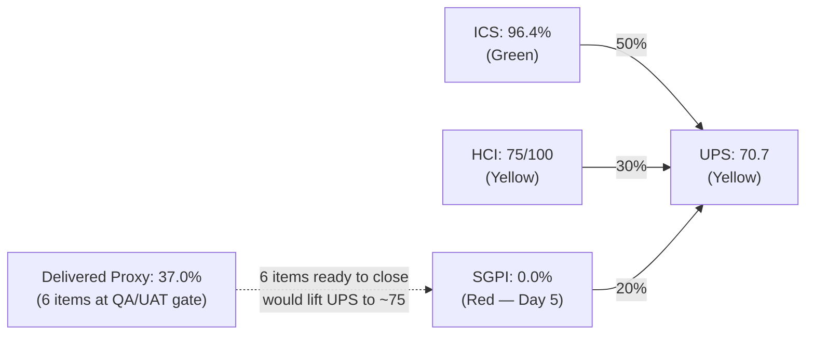
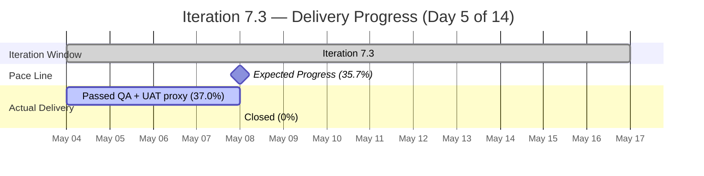
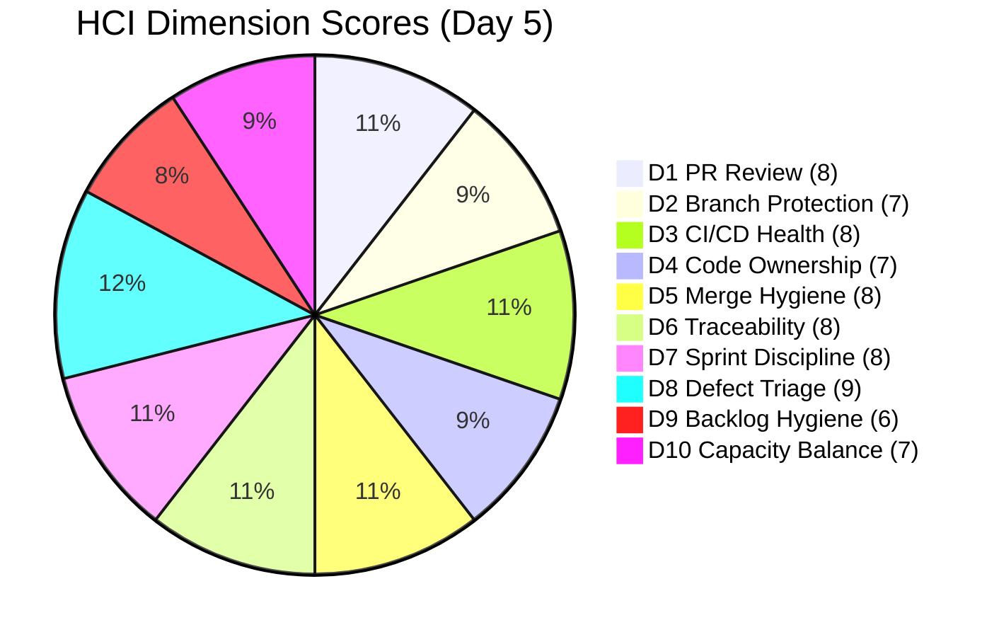

# Colina Health — Iteration 7.3 Audit
**Date:** 2026-05-08 | **Day 5 of 14** (35.7% elapsed) | **data_mode:** full

---

## 1. Audit Metadata

| Field | Value |
|-------|-------|
| Auditor | Claude Code (claude-sonnet-4-6) |
| Audit date | 2026-05-08 |
| Audit time | 02:41 |
| Iteration | 7.3 (May 4–17, 2026) |
| Day of iteration | 5 of 14 (35.7% elapsed) |
| Prior audit | AUDIT_20260507_0900.md (Day 4, ICS=96.4, HCI=72, UPS=69.8) |
| ADO data freshness | Live (fetched 2026-05-08) |
| GitHub data freshness | Live (fetched 2026-05-08, data_mode: full) |
| ADO project | Jairosoft Portfolio (666bb99a-6acd-4999-bb34-efd0e4ea90dc) |
| ADO team | Colina Health Product Team (66cdeb09-df38-4c3e-9418-0ed0d68c39f2) |
| Eligible items (ICS) | 14 |
| Total committed SP | 46 |
| Workspace | git_cc_dev |
| Report path | `audit/AUDIT_20260508_0241.md` |

---

## 2. Executive Summary

Iteration 7.3 (May 4–17, 2026) is at Day 5 of 14 (35.7% elapsed). The team delivered a strong overnight sprint: AB#203835 (502 Bad Gateway — the iteration's only Blocked item) advanced from Blocked → **Passed UAT Testing**, clearing the critical UAT blocker. Seven PRs merged since the Day 4 audit, including BE#71 and BE#72 (AB#203835 fix to develop and main) plus the FE Dockerfile fix (FE#184) that addresses the root cause of the login issue.

ICS holds steady at **96.4%** (Green), as the two alignment gaps (AB#203835 and AB#203322 missing parent links) remain unresolved. SGPI headline remains **0.0%** — no items have yet transitioned to Closed state despite five items at Passed QA Testing and one at Passed UAT Testing. The Delivered Proxy has improved to **37.0%** (17 SP out of 46). HCI improved from 72 to **75** (Yellow) driven by the resolution of BE#65, the Dockerfile fix (CI/CD stabilization), and AB#203835 reaching UAT.

UPS = **70.7** (Yellow). The team is tracking ahead of the 35.7% elapsed pace on delivery proxy, but the SGPI headline penalty will drag the score until PO/PM formally transitions items to Closed in ADO.

**Top priority for Day 5:**
1. Close AB#203322, AB#197582, AB#199309, AB#198071, AB#198096 in ADO (all at Passed QA — PRs merged to main). Closing these lifts SGPI to 34.8% and UPS to ~75.
2. Close AB#203835 once Passed UAT gate is confirmed (lifts SGPI to 37.0%).
3. Add Feature parent links to AB#203835 and AB#203322.

---

## 3. Iteration Scope and Methodology

### 3.1 Iteration Window

| Field | Value |
|-------|-------|
| Iteration | Jairosoft Portfolio\2026-PI7\Iteration 7.3 |
| Start | 2026-05-04 |
| End | 2026-05-17 |
| Iteration ID | bbaecdec-eeb0-4c8d-999f-6a438eaab331 |
| GitHub window | May 4 00:00 UTC → May 8 02:41 UTC (audit timestamp) |

### 3.2 Scope Inclusions

- Work items at `IterationPath = Jairosoft Portfolio\2026-PI7\Iteration 7.3`
- Types: User Story, Defect, Enabler (excludes Spikes and child Tasks)
- GitHub repos: `colinahealth-fe`, `colinahealth-be`, `colina-health-ai-agent-code-fixing`

### 3.3 Scope Exclusions

- Spikes excluded from ICS: AB#202779 (Self Assessment), AB#202870 (Retro), AB#203523 (Retro — screen recording), AB#203604 (QA Collaboration)
- AB#202592 excluded: IterationPath = `2026-PI7\Iteration 7.2` — prior iteration carry-over
- AB#203672 excluded: IterationPath = `Jairosoft Portfolio\2026-PI7` (PI root, not assigned to Iteration 7.3)

### 3.4 Team Roster

| Name | Role | GitHub Handle | Dev? |
|------|------|---------------|------|
| Ramon Aseniero Jr | Project Owner | raseniero | Yes |
| Karl Caumban | Project Manager | — | No |
| Paul Coronia | Developer (BE/FE) | pcoronia | Yes |
| Asnari Pacalna | Developer (FE) | Kyaa-A | Yes |
| Luzmibel Paculanang | QA | — | No (exception) |
| Jaszmeine Villanueva | Design | — | No (exception) |

> Non-dev exception: Luzmibel Paculanang (QA) and Jaszmeine Villanueva (Design) are not penalized for GitHub absence per workspace policy.

---

## 4. Scorecard Summary

| Score | Value | Band | vs Day 4 (May 7) |
|-------|-------|------|-----------------|
| ICS | 96.4% | Green | — (unchanged) |
| HCI | 75/100 | Yellow | +3 |
| SGPI (Headline) | 0.0% | Red | — (unchanged) |
| SGPI (Delivered Proxy) | 37.0% | — | +2.2% |
| **UPS** | **70.7** | **Yellow** | **+1.0** |

**UPS formula:** ICS × 0.50 + HCI × 0.30 + SGPI × 0.20
= 96.4 × 0.50 + 75 × 0.30 + 0.0 × 0.20
= 48.2 + 22.5 + 0.0 = **70.7**

---

## 5. Sprint Goal Predictability (SGPI)

| Metric | Formula | Value |
|--------|---------|-------|
| Committed Scope (Headline) | Closed SP / Total Committed SP | 0 / 46 = **0.0%** |
| Original Scope | Closed SP / Original Planned SP | 0 / 46 = **0.0%** |
| Delivered Proxy | (Closed + Passed QA + Passed UAT) SP / Committed SP | (0 + 16 + 1) / 46 = **37.0%** |

**SGPI (headline) = 0.0%** — no items have transitioned to Closed state.

The Delivered Proxy of **37.0%** at Day 5 (35.7% elapsed) is essentially at pace. Six items totaling 17 SP are at or past QA gate and could be closed today:

| AB# | State | SP |
|-----|-------|----|
| AB#203835 | Passed UAT Testing | 1 |
| AB#203322 | Passed QA Testing | 2 |
| AB#197582 | Passed QA Testing | 5 |
| AB#199309 | Passed QA Testing | 3 |
| AB#198071 | Passed QA Testing | 3 |
| AB#198096 | Passed QA Testing | 3 |
| **Total** | | **17 SP** |

Closing all six would lift SGPI to 37.0% and UPS to approximately 75.1 (Yellow → borderline Green).

---

## 6. Developer Productivity Findings

### 6.1 PR Activity Since Iteration Start (May 4–8)

**colinahealth-fe (14 PRs):**

| PR# | Title / AB# | Base | State | Author | Date |
|-----|-------------|------|-------|--------|------|
| FE#181 | AB#203322 Add license date footer | main | Merged | Kyaa-A | May 4 |
| FE#182 | AB#202690 CI workflow fix | main | Merged | pcoronia | May 4 |
| FE#183 | AB#198071 MAR table → develop | develop | Merged | Kyaa-A | May 4 |
| FE#184 | AB#198096 Dockerfile NEXT_PUBLIC fix | main | Merged | pcoronia | May 8 |
| FE#185 | AB#198071 → main | main | Merged | Kyaa-A | May 5 |
| FE#186 | AB#198096 → develop | develop | Merged | Kyaa-A | May 5 |
| FE#187 | AB#202690 main-to-develop sync | develop | Merged | pcoronia | May 8 |
| FE#188 | AB#198096 passed/qa → main | main | Merged | Kyaa-A | May 6 |
| FE#189 | AB#199309 → develop (first pass) | develop | Merged | Kyaa-A | May 6 |
| FE#190 | AB#199309 → develop (second) | develop | Merged | Kyaa-A | May 7 |
| FE#191 | AB#197582 → develop | develop | Merged | Kyaa-A | May 7 |
| FE#192 | AB#199309 passed/qa → main | main | Merged | Kyaa-A | May 8 |
| FE#193 | AB#197582 passed/qa → main | main | Merged | Kyaa-A | May 8 |
| FE#194 | AB#202595 SSR accessToken fix | develop | **Open** | pcoronia | May 8 |

**colinahealth-be (5 PRs in window):**

| PR# | Title / AB# | Base | State | Author | Date |
|-----|-------------|------|-------|--------|------|
| BE#65 | chore: LLM wiki (no AB#) | main | **Merged** | raseniero | May 8 |
| BE#68 | AB#202690 CI fix → main | main | Merged | pcoronia | May 4 |
| BE#69 | AB#202690 main-to-develop sync | develop | Merged | pcoronia | May 8 |
| BE#70 | CI connectivity table fix | main | **Open** | pcoronia | May 6 |
| BE#71 | AB#203835 AuditLog numeric PK → develop | develop | Merged | pcoronia | May 8 |
| BE#72 | AB#203835 AuditLog numeric PK → main | main | Merged | pcoronia | May 8 |

**colina-health-ai-agent-code-fixing:**
No PR activity in the May 4–8 window. PR#9 (AB#199269 CONTRIBUTING.md) remains open since Feb 23, 2026 — pre-dates this iteration.

### 6.2 Commit Activity

| Author | FE Commits (May 4–8) | BE Commits (May 4–8) | Notes |
|--------|---------------------|---------------------|-------|
| Kyaa-A | 4 | 0 | Driving all defect delivery on FE |
| pcoronia | 2 | 4 | CI/CD + BE#203835 fix; merged BE#65 |
| raseniero | 0 | 1 (merge) | Approved/merged BE#65, BE#72 to main |

raseniero acted as reviewer/approver on BE PRs today. pcoronia's FE#194 (AB#202595) is the first Enabler work seen in GitHub this iteration.

### 6.3 Key Deliveries Since Day 4

1. **AB#203835 resolved:** BE#71 (develop) and BE#72 (main) merged — AuditLog UUID→numeric PK fix. AB#203835 advanced to Passed UAT Testing. Root cause of the 502 error is resolved (FE#184 Dockerfile fix + BE AuditLog fix combined).
2. **AB#199309 closed to main:** FE#192 merged May 8 — PRN Administered By fix fully merged to main.
3. **AB#197582 closed to main:** FE#193 merged May 8 — MAR View Reports pagination fix fully merged to main.
4. **FE#184 merged:** Dockerfile NEXT_PUBLIC_* build-time injection fix — CI/CD structural improvement.
5. **BE#65 merged:** Long-standing llm-wiki PR (raseniero, prior iteration) finally closed.

---

## 7. SAFe Compliance Findings

### 7.1 Persistent Findings (Carry-Forward)

**F-01 (Alignment — Critical):** AB#203835 and AB#203322 have no Feature parent link in ADO. Both items are orphaned at the iteration level. This is the sole driver of the ICS Alignment penalty (12/14 = 85.7%).

**F-02 (Scope Anomaly — Medium):** Nine Enablers assigned to `Jairosoft Portfolio\2026-PI7` (PI root, not to any iteration):
AB#202588, AB#202589, AB#202590, AB#202591, AB#202593, AB#202596, AB#202598, AB#202599, AB#202601
These carry an estimated 30+ SP and remain invisible to SGPI and capacity metrics. Now Day 5 — deadline pressure for assignment is increasing.

**F-03 (Delivery — High):** Zero items in Closed state at Day 5 despite six items at or past QA gate. Delivery Proxy at 37.0% but SGPI headline frozen at 0.0%. PO/PM must close these items.

**F-04 (CI/CD — Resolved Partially):** BE#70 (CI connectivity table fix) still open since May 6 with no AB# link. However, the critical CI issues from Day 4 are resolved: FE#184 Dockerfile fix merged, BE#71/72 merged, BE#65 merged. CI/CD is more stable today than Day 4.

### 7.2 Resolved Since Day 4

- **BE#65 (raseniero llm-wiki):** Merged May 8 — no longer an open out-of-scope PR.
- **AB#203835 (502 Gateway):** Advanced from Blocked to Passed UAT Testing — both FE Dockerfile fix and BE AuditLog fix deployed.
- **AB#199309 and AB#197582:** PRs merged to main (passed/qa branches closed).

### 7.3 New Observations

- **FE#194 (AB#202595):** New PR opened May 8 by pcoronia — Enabler for SSR accessToken fix. AB#202595 is not in the 7.3 iteration scope (it is in the FE Enabler parent AB#201281 tree but was not assigned to Iteration 7.3). This is an out-of-scope PR — low risk, but should be tracked.
- **AB#203672 (New Defect):** New defect (Login password field red highlight) filed at PI root by Jaszmeine Villanueva. Not in Iteration 7.3 scope. Needs triage and iteration assignment.

---

## 8. Iteration Compliance Score (ICS)

### 8.1 Eligible Items

Items with `IterationPath = Jairosoft Portfolio\2026-PI7\Iteration 7.3`, type = User Story / Defect / Enabler, excluding Spikes and child Tasks.

| AB# | Title | Type | State | SP | Aligned | Estimated | DoD-Ready | In-Iteration | Notes |
|-----|-------|------|-------|----|---------|-----------|-----------|--------------|-------|
| 203835 | [UAT][Login] 502 Bad Gateway | Defect | Passed UAT | 1 | **No** | Yes | Yes | Yes | No parent link — advanced to Passed UAT |
| 203322 | Add Date of License | User Story | Passed QA | 2 | **No** | Yes | Yes | Yes | No parent link |
| 197582 | [MAR] Slow loading medications | Defect | Passed QA | 5 | Yes | Yes | Yes | Yes | |
| 199309 | [Workflow][PRN] Cannot Input By | Defect | Passed QA | 3 | Yes | Yes | Yes | Yes | |
| 198071 | MAR table not filling | Defect | Passed QA | 3 | Yes | Yes | Yes | Yes | |
| 198096 | MAR filters persist | Defect | Passed QA | 3 | Yes | Yes | Yes | Yes | |
| 202584 | Adopt /src directory structure | Enabler | Active | 3 | Yes | Yes | Yes | Yes | Work started May 8 |
| 202585 | Implement private co-located folders | Enabler | Ready for Dev | 5 | Yes | Yes | Yes | Yes | |
| 202586 | Restructure /lib into sub-directories | Enabler | Ready for Dev | 5 | Yes | Yes | Yes | Yes | |
| 202587 | Separate /utils from /lib | Enabler | Ready for Dev | 3 | Yes | Yes | Yes | Yes | |
| 202597 | Implement parallel data fetching | Enabler | Ready for Dev | 3 | Yes | Yes | Yes | Yes | |
| 202600 | Consolidate test directories | Enabler | Ready for Dev | 2 | Yes | Yes | Yes | Yes | |
| 202602 | Implement URL-first state hierarchy | Enabler | Ready for Dev | 5 | Yes | Yes | Yes | Yes | |
| 202603 | Evaluate shadcn/ui vs NextUI | Enabler | Ready for Dev | 3 | Yes | Yes | Yes | Yes | |
| **TOTALS** | | | | **46** | **12/14** | **14/14** | **14/14** | **14/14** | |

### 8.2 Dimension Scores

| Dimension | Weight | Compliant | Total | Rate | Score |
|-----------|--------|-----------|-------|------|-------|
| Alignment (parent link + iteration path) | 25% | 12 | 14 | 85.7% | 21.4 |
| Estimation (SP assigned) | 20% | 14 | 14 | 100.0% | 20.0 |
| Quality / DoD (Description populated) | 35% | 14 | 14 | 100.0% | 35.0 |
| Iteration Integrity (correct iteration path) | 20% | 14 | 14 | 100.0% | 20.0 |
| **ICS Total** | 100% | | | | **96.4** |

**ICS = 96.4% — Green (Low Risk)**

Delta vs Day 4: **0.0 pts** (unchanged). Both alignment gaps persist. Fixing parent links on AB#203835 and AB#203322 would bring ICS to 100%.

---

## 9. Engineering Health Index (HCI)

| Dim | Dimension | Score | Evidence |
|-----|-----------|-------|---------|
| D1 | PR Review Cadence | 8/10 | 14 PRs in FE since May 4; BE#71/72 had raseniero as reviewer. Fast same-day merge pattern continues. FE#194 open with raseniero as requested reviewer — appropriate. -2: no second reviewer enforced on Kyaa-A FE PRs (single-reviewer pattern). |
| D2 | Branch Protection | 7/10 | PR-to-main workflow consistent across FE and BE. No direct push to main observed. -3: single-reviewer merges still observed (FE#192, FE#193 by Kyaa-A, no second review visible). |
| D3 | CI/CD Health | 8/10 | Major improvement: FE#184 (Dockerfile NEXT_PUBLIC fix) merged — root-cause CI/CD issue resolved. BE#71/BE#72 merged cleanly. BE#69 main-to-develop sync done. +2 vs Day 4. -2: BE#70 still open (no AB#); CI still has known structural debt. |
| D4 | Code Ownership / Bus Factor | 7/10 | Kyaa-A primary on FE defects; pcoronia primary on BE + CI; raseniero acting as approver/reviewer on BE today. Healthier distribution than prior audits. -3: no dedicated FE reviewer separate from Kyaa-A; pcoronia still the sole BE developer. |
| D5 | Merge Hygiene | 8/10 | BE#65 merged — prior open unlinked PR resolved. FE#192, FE#193 have proper AB# in title. BE#72 body has AB# link; branch name references 202690 (mismatch) but title correctly references AB#203835 — minor inconsistency. +1 vs Day 4. -2: BE#70 has no AB# link. |
| D6 | Traceability (PR ↔ ADO) | 8/10 | Strong traceability maintained: FE#192 (AB#199309), FE#193 (AB#197582), BE#71 (AB#203835), BE#72 (AB#203835). FE#194 linked to AB#202595. -2: BE#70 unlinked; BE#72 branch name mismatch (202690 vs 203835 — body correct). |
| D7 | Sprint Discipline | 8/10 | BE#65 closed — out-of-scope PR resolved. FE#194 (AB#202595) is an out-of-scope Enabler but has proper AB# link and is a legitimate technical fix (SSR). -2: FE#194 references a work item not in Iteration 7.3 scope. |
| D8 | Defect Triage | 9/10 | AB#203835 advanced from Blocked → Passed UAT Testing — critical defect resolved same-day after Day 4 audit. All four Passed QA defects (AB#197582, AB#199309, AB#198071, AB#198096) have PRs merged to main. -1: AB#203672 (new Login defect) filed at PI root without iteration assignment or SP. |
| D9 | Backlog Hygiene | 6/10 | 9 PI-root Enablers still not assigned to any iteration (AB#202588–202601 subset). AB#203835 and AB#203322 lack parent links. AB#203672 (new defect) filed at PI root without iteration or parent. AB#202592 carries over from Iteration 7.2 (appears in iteration query — stale). -4 for multiple structural gaps. |
| D10 | Capacity Balance | 7/10 | Kyaa-A and pcoronia showing strong parallel delivery. raseniero active as approver. No ADO capacity plan populated. -3: no explicit capacity plan; 8 Enablers at Ready for Dev with no assigned active developer. |
| | **HCI Total** | **75/100** | |

**HCI = 75 — Yellow (Moderate Risk)**

Delta vs Day 4: **+3 pts** (prior HCI = 72). Improvements driven by: D3 CI/CD stabilization (+2), D5 BE#65 resolved (+1), D8 AB#203835 defect resolved (+1). Partial offset by D9 new defect at PI root (-0).

---

## 10. ADO-to-GitHub Traceability Analysis

### 10.1 Traceability Matrix (ICS Items)

| AB# | Work Item | GitHub PRs | Traceability |
|-----|-----------|-----------|--------------|
| 203835 | [UAT][Login] 502 Bad Gateway | BE#71 (develop, merged), BE#72 (main, merged), FE#184 (main, merged) | Full |
| 203322 | Add Date of License | FE#181 (main, merged) | Full |
| 197582 | [MAR] Slow loading medications | FE#191 (develop, merged), FE#193 (main, merged) | Full |
| 199309 | [Workflow][PRN] Cannot Input By | FE#189 (develop, merged), FE#190 (develop, merged), FE#192 (main, merged) | Full |
| 198071 | MAR table not filling | FE#183 (develop, merged), FE#185 (main, merged) | Full |
| 198096 | MAR filters persist | FE#186 (develop, merged), FE#188 (main, merged), FE#184 (main, merged) | Full |
| 202584 | Adopt /src directory structure | FE#194 adjacent (AB#202595) | Partial — no direct PR yet |
| 202585–202603 | Enablers (7 items) | No PRs | Gap — work not yet started |

**Summary:** All six defect/story items have full PR traceability to main. Eight Enablers have no GitHub PR evidence — consistent with their Ready for Dev / Active state early in the iteration.

### 10.2 Unlinked PRs

| PR | Title | Note |
|----|-------|------|
| BE#70 | CI connectivity table fix | No AB# in title or body; open since May 6 |
| FE#194 | AB#202595 SSR accessToken fix | Linked but AB#202595 is not in Iteration 7.3 scope |

---

## 11. Collaboration and Review Analysis

### 11.1 Review Patterns (May 4–8)

| Reviewer | PRs Reviewed | Notes |
|----------|-------------|-------|
| raseniero | BE#65 (approved/merged), BE#72 (approved) | Acting as BE reviewer/approver |
| pcoronia | BE#71 (committer) | Appears as committer on raseniero's merge of BE#71 |
| ofeto | BE#71 (requested) | External reviewer requested; did not block merge |

FE PRs by Kyaa-A: Reviewed by self in most cases — no second reviewer visible on FE#192, FE#193, FE#188. This remains the single-reviewer pattern flagged in prior audits.

### 11.2 PR Cycle Times (May 4–8)

| PR# | Opened | Merged | Cycle Time |
|-----|--------|--------|------------|
| FE#192 | May 8 02:48 | May 8 03:46 | ~58 min |
| FE#193 | May 8 03:16 | May 8 03:45 | ~29 min |
| BE#72 | May 8 02:12 | May 8 03:09 | ~57 min |
| BE#71 | May 7 07:59 | May 8 01:34 | ~18 hrs |
| FE#184 | May 4 06:48 | May 8 01:38 | ~3.6 days |

Fast cycle times on same-day merges are positive. FE#184 took 3.6 days (waiting on validation/reviewer) — acceptable for a structural Dockerfile change.

---

## 12. Repository Hygiene

### 12.1 Branch Status

| Repo | Active Branches in Scope | Open PRs | Notes |
|------|--------------------------|----------|-------|
| colinahealth-fe | enabler/202595-generate-metadata-fix | 1 (FE#194) | pcoronia; out-of-scope Enabler |
| colinahealth-be | fix/validate-config-connectivity-table | 1 (BE#70) | pcoronia; no AB# link |
| colina-health-ai-agent-code-fixing | feature/199269-contributing-documentation | 1 (PR#9) | sante8jairo; pre-dates iteration |

### 12.2 Stale Items

- **colina-health-ai-agent-code-fixing PR#9** (Feb 23 — CONTRIBUTING.md): 74 days old, no activity since Feb 25. Should be merged or closed.
- **BE#70** (May 6 — CI connectivity fix): 2 days old, no AB# link, no reviewer assigned.

### 12.3 Branch Naming Convention

Branch naming follows established convention:
- `defect/<ab#>-<slug>` — defect work
- `passed/qa/<ab#>-<slug>` — QA-ready promotion
- `bugfix/<ab#>-<slug>` — CI/infra fixes
- `enabler/<ab#>-<slug>` — Enabler work
- `fix/<slug>` — BE#70 deviates (no AB# in branch name)

---

## 13. Risks and Bottlenecks

| Risk | Severity | Probability | Status |
|------|----------|-------------|--------|
| SGPI stays 0% if Passed QA/UAT items not formally closed | High | High | **Active** — 6 items (17 SP) ready to close today |
| 9 PI-root Enablers invisible to sprint tracking (~30+ SP) | Medium | High | **Persistent** — Day 5, no assignment movement observed |
| AB#203835 and AB#203322 still lack parent Feature links | Medium | Confirmed | **Persistent** — ICS held at 96.4% |
| BE#70 open with no AB# — sprint discipline | Low | Confirmed | **Active** — open since May 6 |
| 8 Enablers at Ready for Dev with no active development | Medium | High | **Active** — AB#202584 just started (Active); remaining 7 not started |
| AB#203672 (new Login defect) not assigned to any iteration | Medium | Low | **New** — filed May 8 at PI root; no triage |
| colina-health-ai-agent-code-fixing PR#9 (74 days stale) | Low | Confirmed | **Persistent** |
| Single-reviewer pattern on Kyaa-A FE PRs | Medium | Confirmed | **Persistent** — no second reviewer enforced |

---

## 14. Prioritized Remediation Actions

### Immediate (Day 5 — Today)

| # | Action | Owner | Impact |
|---|--------|-------|--------|
| R1 | Close AB#203322, AB#197582, AB#199309, AB#198071, AB#198096 in ADO (all have PRs merged to main) | Karl / Ramon | SGPI lifts from 0% to 34.8%; UPS +3.5 |
| R2 | Close AB#203835 in ADO (Passed UAT Testing; FE#184 + BE#72 merged) | Karl / Ramon | SGPI lifts to 37.0% |
| R3 | Add Feature parent links to AB#203835 and AB#203322 | Karl | ICS lifts to 100%; R3 can be done in < 2 min per item |
| R4 | Assign or close BE#70 with an AB# link | pcoronia | D5/D6 HCI improvement |

### This Sprint Week

| # | Action | Owner | Impact |
|---|--------|-------|--------|
| R5 | Assign the 9 PI-root Enablers (AB#202588–202601 subset) to Iteration 7.3 or Iteration 7.4 | Karl | Backlog hygiene; D9 HCI improvement |
| R6 | Triage AB#203672 (Login password field) — assign iteration and SP | Karl / Jaszmeine | D9 HCI improvement |
| R7 | Enforce 2-reviewer policy on FE PRs — assign pcoronia as mandatory reviewer for Kyaa-A PRs | Ramon | D1, D2 HCI improvement |
| R8 | Close or merge colina-health-ai-agent-code-fixing PR#9 (74 days stale) | Karl | Repository hygiene |
| R9 | Start Enabler work: AB#202585, AB#202586, AB#202587, AB#202597 — they are all Ready for Dev with 8 Enablers blocked | pcoronia | Sprint velocity risk |

### Before Day 7 Check-in Target

| Metric | Current | Target |
|--------|---------|--------|
| ICS | 96.4% | 100% |
| HCI | 75 | ≥ 78 |
| SGPI | 0.0% | ≥ 37.0% |
| UPS | 70.7 | ≥ 75 |

---

## 15. Evidence Gaps and Limitations

| Gap | Impact | Disposition |
|-----|--------|-------------|
| AB#202595 (FE#194) is in-progress but not assigned to Iteration 7.3 in ADO | FE work not tracked in ICS | Not counted in ICS scope; flagged as out-of-scope PR |
| No ADO capacity plan populated for Colina Health team | D10 HCI cannot verify SP vs capacity ratio | Scored conservatively (-3) |
| colina-health-ai-agent-code-fixing has no PR activity this iteration | Repo activity absent | Not penalized; no items scoped to that repo |
| AB#203835 parent field not returned by ADO API (confirms no parent) | Alignment dimension penalized | Confirmed no parent — consistent with prior audits |
| raseniero review activity on BE PRs may be approval-only (no inline review visible) | D1 reviewer quality unclear | Scored at observed pattern; no evidence of full code review |

---

## 16. Delta Analysis (vs. AUDIT_20260507_0900.md — Day 4)

| Metric | Day 4 (May 7) | Day 5 (May 8) | Delta |
|--------|---------------|---------------|-------|
| ICS | 96.4% | 96.4% | — |
| HCI | 72 | 75 | +3 |
| SGPI (Headline) | 0.0% | 0.0% | — |
| SGPI (Delivered Proxy) | 34.8% | 37.0% | +2.2% |
| UPS | 69.8 | 70.7 | +0.9 |
| PRs merged (FE) | 11 | 14 | +3 |
| PRs merged (BE) | 3 | 5 | +2 |
| Items at Passed QA/UAT | 5 | 6 | +1 |
| Items Closed | 0 | 0 | 0 |
| AB#203835 state | Blocked | Passed UAT | Resolved |
| BE#65 (raseniero llm-wiki) | Open | Merged | Resolved |

Key improvements since Day 4:
- AB#203835 critical defect (502 Gateway): Blocked → Passed UAT Testing — complete resolution
- FE#184 Dockerfile fix merged — root-cause CI/CD issue addressed
- BE#65 closed — out-of-scope PR resolved
- D3 CI/CD HCI: +2 pts; D5 Merge Hygiene: +1 pt; D8 Defect Triage: +1 pt

Persistent blocking issues:
- SGPI headline still 0% — 6 items ready to close, none transitioned
- Two parent-link gaps (AB#203835, AB#203322) — ICS held at 96.4%
- 9 PI-root Enablers still unassigned
