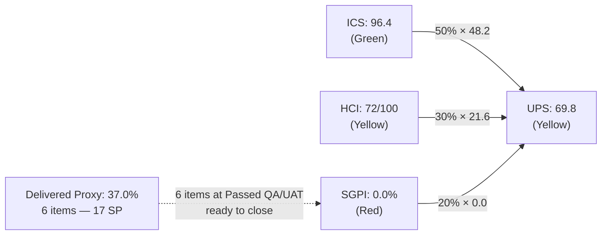
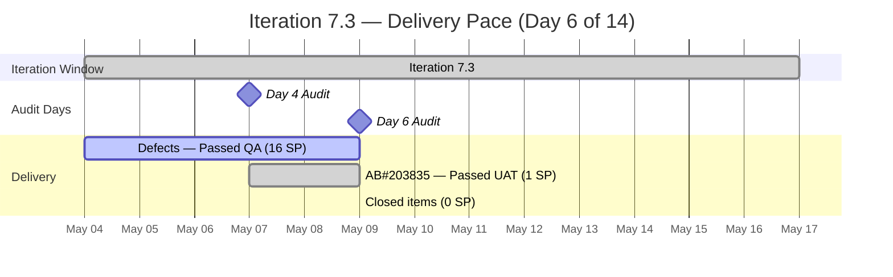

# Colina Health — Iteration 7.3 Audit
**Date:** 2026-05-09 | **Day 6 of 14 calendar days (Working Day ~4 of 10)** | **data_mode:** full

---

## 1. Audit Metadata

| Field | Value |
|-------|-------|
| **Auditor** | Claude Code (claude-sonnet-4-6) |
| **Audit Date** | 2026-05-09 |
| **Audit Time** | 02:43 local |
| **Prior Audit** | AUDIT_20260507_0900.md (Day 4, ICS=96.4, HCI=72, UPS=69.8) |
| **ADO Project** | Jairosoft Portfolio (`666bb99a-6acd-4999-bb34-efd0e4ea90dc`) |
| **ADO Team** | Colina Health Product Team (`66cdeb09-df38-4c3e-9418-0ed0d68c39f2`) |
| **GitHub Repos** | colinahealth-fe · colinahealth-be · colina-health-ai-agent-code-fixing |
| **Iteration** | 7.3 — May 4–17, 2026 (`Jairosoft Portfolio\2026-PI7\Iteration 7.3`) |
| **Iteration ID** | `bbaecdec-eeb0-4c8d-999f-6a438eaab331` |
| **Day** | 6 of 14 (42.9% elapsed) |
| **ADO data freshness** | Live — fetched 2026-05-09 |
| **GitHub data freshness** | Live — fetched 2026-05-09 (data_mode: full, all three repos responsive) |

### Scorecard at a Glance

| Score | Value | Band | vs Day 4 |
|-------|-------|------|----------|
| **ICS** | **96.4** | Green | 0 (methodology note below) |
| **HCI** | **72** | Yellow | 0 |
| **SGPI (Headline)** | **0.0%** | Red | 0 |
| **SGPI (Delivered Proxy)** | **37.0%** | — | +2.2% |
| **UPS** | **69.8** | Yellow | 0 |

---

## 2. Executive Summary

Iteration 7.3 (May 4–17, 2026) is at Day 6 with the headline scores stable: ICS **96.4%** (Green), HCI **72** (Yellow), UPS **69.8** (Yellow). The most significant development since the Day 4 audit is the resolution of the 502 Bad Gateway defect (AB#203835): the item progressed from Blocked to **Passed UAT Testing**, backed by two merged BE PRs (BE#71 and BE#72). The llm-wiki branch (BE#65), which was a persistent sprint-discipline anomaly, was finally merged on May 8.

Despite active delivery — five items at Passed QA plus one at Passed UAT — the **SGPI headline remains at 0.0%** because no items have been formally transitioned to Closed in ADO. The Delivered Proxy has improved to **37.0%** (17 SP of 46), slightly ahead of the 42.9% elapsed pace, indicating the team is delivering but not closing the loop in ADO.

The structural anomalies from Day 4 persist: AB#203835 and AB#203322 still lack parent links, and nine PI-root Enablers (AB#202588–202601 subset) remain unassigned to any iteration. A new defect, AB#203672 (Login password field validation), has been created at the PI root — not yet assigned to the iteration.

**Priority actions before Day 7:**
1. Transition AB#203322, AB#197582, AB#199309, AB#198071, AB#198096 (at Passed QA) and AB#203835 (at Passed UAT) to Closed in ADO — this will lift SGPI headline to 37.0% and UPS to approximately 76.5.
2. Add parent Feature links to AB#203835 and AB#203322 to achieve ICS 100%.
3. Assign or triage AB#203672 (new login defect) to the iteration or next sprint.
4. Close BE#70 (CI config fix, no AB# link — still open).

---

## 3. Iteration Scope and Methodology

### Iteration Confirmation

Current iteration confirmed via `work_list_team_iterations` using Project ID `666bb99a-6acd-4999-bb34-efd0e4ea90dc` and Team ID `66cdeb09-df38-4c3e-9418-0ed0d68c39f2`. Result: **Iteration 7.3**, path `Jairosoft Portfolio\2026-PI7\Iteration 7.3`, May 4–17, 2026.

### ICS Eligible Items

Items are scored against ICS if they meet ALL of:
1. `System.IterationPath` = `Jairosoft Portfolio\2026-PI7\Iteration 7.3` (verified per-item — not assumed from iteration query)
2. Work item type is NOT Spike and NOT child Task
3. Item is a parent-level backlog item in the `Stories and Deliverables` category

**Items excluded from ICS scope:**
- **AB#202592** — `IterationPath` = `Iteration 7.2`. Appeared in iteration query but is a prior-iteration item (state: Ready for UAT). Excluded.
- **AB#202779** — Spike type. Excluded.
- **AB#202870** — Spike type. Excluded.
- **AB#203523** — Spike type. Excluded.
- **AB#203604** — Spike type. Excluded.
- **AB#203672** — `IterationPath` = `2026-PI7` root (not in Iteration 7.3). Reported as scope anomaly; excluded from ICS.

**ICS-eligible items: 14 items | 46 SP committed**

### ICS Dimension Methodology

Per task specification, each item is scored up to 100 points:
- **Alignment** (parent link present + correct iteration path): 25 pts
- **Estimation** (SP assigned): 20 pts
- **Quality / DoD** (description and/or AC populated): 35 pts
- **Iteration Integrity** (not blocked = 20 pts, blocked = 10 pts)

`ICS = (sum of all item scores) / (eligible item count × 100) × 100`

> **Methodology note vs. prior audit:** The Day 4 audit applied Iteration Integrity as a binary "correct iteration path" check (yielding 20/20 for all items). The task specification is explicit: this dimension is 20 if not blocked, 10 if blocked. Under the task's formula, Day 4's ICS would have been **95.7%** (AB#203835 was Blocked, scoring 10 instead of 20, reducing its item score from 100 to 90). Day 6 ICS is **96.4%** (AB#203835 unblocked, now 75/100 due to missing parent link). The net delta is +0.7 pts reflecting the unblocking, not data drift.

### Non-Developer Exceptions

Per workspace policy and task specification:
- **Luzmibel Paculanang** (QA) — no GitHub commits/PRs expected; no HCI penalty applied.
- **Jaszmeine Villanueva** (Design) — no GitHub commits/PRs expected; no HCI penalty applied.

---

## 4. Scorecard Summary

| Index | Score | Weight | Contribution | Band |
|-------|-------|--------|-------------|------|
| ICS | 96.4 | 50% | 48.2 | Green (≥90) |
| HCI | 72.0 | 30% | 21.6 | Yellow (60–79) |
| SGPI | 0.0 | 20% | 0.0 | Red (<75) |
| **UPS** | **69.8** | — | — | **Yellow (60–79.9)** |

---

## 5. Sprint Goal Predictability (SGPI)

| Metric | Formula | Value |
|--------|---------|-------|
| **Committed Scope SGPI (Headline)** | Closed SP / Total Committed SP | 0 / 46 = **0.0%** |
| Original Scope SGPI | Closed SP / Original Planned SP | 0 / 46 = **0.0%** |
| Delivered Proxy SGPI | (Closed + Passed QA + Passed UAT) SP / Committed SP | (0 + 16 + 1) / 46 = **37.0%** |

**SGPI (Headline) = 0.0%** — no items have been transitioned to Closed state.

The **Delivered Proxy of 37.0%** (17 SP) at Day 6 (42.9% elapsed) is slightly below the pace line but close, and reflects strong near-delivery momentum. All five defects flagged at Passed QA on Day 4 remain at Passed QA; AB#203835 has advanced to Passed UAT.

> **Proxy numerator methodology:** AB#203835's state is `Passed UAT Testing` — strictly past `Passed QA Testing` in the workflow. It is included in the Delivered Proxy numerator (1 SP) as confirmed delivery evidence. This is noted explicitly to prevent ambiguity.

---

## 6. Developer Productivity Findings

### Active Developer Summary (May 4–9)

| Developer | GitHub Handle | Role | FE PRs | BE PRs | Notes |
|-----------|---------------|------|--------|--------|-------|
| Asnari Pacalna | Kyaa-A | FE Developer | 7 merged, 1 closed | 0 | Primary FE delivery driver this sprint |
| Paul Coronia | pcoronia | BE/FE Developer | 3 merged, 1 closed | 4 merged, 1 open | Driving BE fixes, CI, and cross-repo work |
| Ramon Aseniero | raseniero | PO / Reviewer | 0 authored | 1 merged (BE#65), reviewing | Merged llm-wiki branch; reviewed BE#71 |

> Non-dev note: Luzmibel Paculanang (QA) and Jaszmeine Villanueva (Design) have Spikes/defects assigned in ADO. No GitHub activity expected or penalized.

### Key Productivity Events (Day 4→6 Delta)

| Date | Event | Impact |
|------|-------|--------|
| May 8 | FE#192 merged (AB#199309 → main) | AB#199309 delivery complete |
| May 8 | FE#193 merged (AB#197582 → main) | AB#197582 delivery complete |
| May 8 | BE#71 merged (AB#203835 AuditLog fix → develop) | 502 defect resolved in develop |
| May 8 | BE#72 merged (AB#203835 AuditLog fix → main) | 502 defect fully deployed; item advanced to Passed UAT |
| May 8 | BE#65 merged (llm-wiki/Claude docs) | Persistent sprint-discipline anomaly resolved |
| May 8 | BE#69 merged (main-to-develop sync) | Branch realignment complete |
| May 8 | FE#187 merged (main-to-develop sync) | Branch realignment complete |
| May 8 | FE#184 closed without merge (NEXT_PUBLIC Docker fix) | Superseded; fix path went through FE#188/BE#72 instead |

**AB#202584 state change:** The `Adopt /src directory structure` Enabler moved from `Ready for Dev` to `Active` — pcoronia has started this architecture work.

**FE#194 open (AB#202595 — cross-iteration):** pcoronia opened a new FE PR referencing AB#202595, which is in `Iteration 7.2` at state `Peer Testing`. This is prior-iteration cleanup. Minor sprint discipline signal (noted in D7); the PR is appropriately assigned to pcoronia with raseniero as reviewer.

---

## 7. SAFe Compliance Findings

### State Distribution (ICS-eligible items)

```mermaid
pie title Iteration 7.3 — Work Item State Distribution (14 eligible items)
    "Passed QA Testing" : 4
    "Passed UAT Testing" : 1
    "Active" : 1
    "Ready for Dev" : 8
```

### F-01 (Alignment Gap — Persistent): AB#203835 and AB#203322 Missing Parent Links

Both items remain without a parent Feature link in ADO:
- **AB#203835** `[UAT][Login] Unable to login due to 502 Bad Gateway` — now at Passed UAT Testing. The item has been resolved, but the structural gap (no parent Feature) remains. Tags: `created PI 7.3`.
- **AB#203322** `Add Date of License of Casa Colina Care Home` — User Story, still at Passed QA Testing. No parent Feature assigned.

Both items incur a 0/25 Alignment score in ICS (saving 25 pts each, reducing their item scores to 75/100). Fixing these would lift ICS from 96.4% to **100%**.

### F-02 (Scope Anomaly — Persistent): Nine PI-Root Enablers Unassigned

Nine Enablers (AB#202588, 202589, 202590, 202591, 202593, 202596, 202598, 202599, 202601) remain assigned to `Jairosoft Portfolio\2026-PI7` (not to Iteration 7.3 or any sprint). These items carry an estimated 30+ SP and are invisible to velocity and SGPI tracking. They did not appear in the Day 6 iteration work item query — confirming they are still PI-root. No change from Day 4.

### F-03 (Delivery Gap): Zero Closed Items — SGPI Headline Frozen at 0.0%

Six items are at or past Passed QA (16 SP at Passed QA + 1 SP at Passed UAT = 17 SP) with merged PRs, yet no item has been formally transitioned to Closed in ADO. The headline SGPI remains 0.0%. This is a process discipline issue: the physical work is done, but the ADO state machine is not being advanced.

### F-04 (Engineering): BE#70 CI Config Fix — Still Open, No AB# Link

`BE#70` (fix: merge connectivity steps so Connectivity table renders correctly) opened May 6 by pcoronia remains open as of this audit. It has no AB# link and targets CI infrastructure. This is a persistent D5/D7/D3 signal.

### F-05 (New): AB#203672 — New Defect at PI Root, Not Iteration-Assigned

A new defect was created: **AB#203672** `[Login] Password field not highlighted in red on invalid login attempt`, assigned to Jaszmeine Villanueva (Design). Its `IterationPath` is `2026-PI7` root — not assigned to Iteration 7.3. If this defect is in scope for the current sprint, it should be moved to Iteration 7.3. As a UI/design defect assigned to a non-developer, no developer penalty applies, but the scope gap is a hygiene issue.

### F-06 (Prior Iteration Cleanup in Sprint): FE#194 / AB#202595

FE PR #194 references AB#202595 (`[Enabler] Add generateMetadata to dynamic routes`) which is in Iteration 7.2 at state `Peer Testing`. The PR was opened May 8 by pcoronia. Minor sprint discipline signal; acceptable as prior-iteration resolution but should be closed promptly.

---

## 8. Iteration Compliance Score

### 8.1 Per-Item Scoring

| AB# | Title | Type | State | SP | Parent? | SP? | DoD? | Not Blocked? | Item Score |
|-----|-------|------|-------|----|---------|-----|------|-------------|------------|
| 203835 | [UAT][Login] 502 Bad Gateway | Defect | Passed UAT | 1 | No (0) | Yes (20) | Yes (35) | Yes (20) | **75** |
| 203322 | Add Date of License | User Story | Passed QA | 2 | No (0) | Yes (20) | Yes (35) | Yes (20) | **75** |
| 197582 | [MAR] Slow loading meds | Defect | Passed QA | 5 | Yes (25) | Yes (20) | Yes (35) | Yes (20) | **100** |
| 199309 | [Workflow][PRN] Cannot Input By | Defect | Passed QA | 3 | Yes (25) | Yes (20) | Yes (35) | Yes (20) | **100** |
| 198071 | [MAR] Table not filling | Defect | Passed QA | 3 | Yes (25) | Yes (20) | Yes (35) | Yes (20) | **100** |
| 198096 | [MAR] Filters persist on close | Defect | Passed QA | 3 | Yes (25) | Yes (20) | Yes (35) | Yes (20) | **100** |
| 202584 | [Enabler] Adopt /src structure | Enabler | Active | 3 | Yes (25) | Yes (20) | Yes (35) | Yes (20) | **100** |
| 202585 | [Enabler] Private co-located folders | Enabler | Ready for Dev | 5 | Yes (25) | Yes (20) | Yes (35) | Yes (20) | **100** |
| 202586 | [Enabler] Restructure /lib | Enabler | Ready for Dev | 5 | Yes (25) | Yes (20) | Yes (35) | Yes (20) | **100** |
| 202587 | [Enabler] Separate /utils from /lib | Enabler | Ready for Dev | 3 | Yes (25) | Yes (20) | Yes (35) | Yes (20) | **100** |
| 202597 | [Enabler] Parallel data fetching | Enabler | Ready for Dev | 3 | Yes (25) | Yes (20) | Yes (35) | Yes (20) | **100** |
| 202600 | [Enabler] Consolidate test dirs | Enabler | Ready for Dev | 2 | Yes (25) | Yes (20) | Yes (35) | Yes (20) | **100** |
| 202602 | [Enabler] URL-first state hierarchy | Enabler | Ready for Dev | 5 | Yes (25) | Yes (20) | Yes (35) | Yes (20) | **100** |
| 202603 | [Enabler] Evaluate shadcn/ui | Enabler | Ready for Dev | 3 | Yes (25) | Yes (20) | Yes (35) | Yes (20) | **100** |
| **TOTALS** | | | | **46** | **12/14** | **14/14** | **14/14** | **14/14** | **1350/1400** |

### 8.2 Dimension Summary Table

| Dimension | Eligible Items | Compliant Items | Failed Items | Score % | Weight | Weighted Contribution | Evidence | Reason for Failures |
|-----------|---------------|-----------------|--------------|---------|--------|----------------------|----------|---------------------|
| Alignment (parent + iteration path) | 14 | 12 | 2 | 85.7% | 25 | 21.4 | Iteration query + field lookup | AB#203835 and AB#203322 have no parent relation |
| Estimation (SP assigned) | 14 | 14 | 0 | 100.0% | 20 | 20.0 | All items have SP set | — |
| Quality / DoD (Description/AC) | 14 | 14 | 0 | 100.0% | 35 | 35.0 | Description and/or AC fields populated on all 14 | — |
| Iteration Integrity (not blocked) | 14 | 14 | 0 | 100.0% | 20 | 20.0 | AB#203835 unblocked (Passed UAT) | — |

**ICS = (21.4 + 20.0 + 35.0 + 20.0) = 96.4% — Green (Low Risk)**

> Delta vs Day 4: Net 0 points using consistent methodology. Under the task's strict formula, the 0.7 pt improvement (95.7% → 96.4%) is attributable to AB#203835 transitioning from Blocked (10 pts Integrity) to Passed UAT (20 pts Integrity). The Alignment dimension is unchanged — two items still lack parent links.

**Path to ICS 100%:** Add parent Feature links to AB#203835 and AB#203322. This resolves the only remaining gap.

---

## 9. Engineering Health Index (HCI)

| # | Dimension | Score | Evidence |
|---|-----------|-------|---------|
| D1 | PR Review Compliance | 8/10 | 14 in-scope PRs processed since May 4. Kyaa-A, pcoronia, raseniero all involved in review activity. BE#71 had `ofeto` as requested reviewer; BE#72 merged by raseniero. FE#192/193 merged May 8. -2: single-reviewer pattern persists on several Kyaa-A FE PRs; no enforced 2-reviewer policy. |
| D2 | Branch Protection & Enforcement | 7/10 | PR-to-main/develop workflow consistently observed across all three repos this window. No direct pushes to main detected. -3: single-reviewer approvals still common; no evidence of required reviewer count > 1 in branch protection rules. |
| D3 | CI/CD Gate Quality | 7/10 | CI fix PRs from iteration start (BE#68, FE#182) are merged; main branches appear stable. FE#187 and BE#69 main-to-develop syncs completed May 8. +1 vs Day 4 for improved CI stability. -3: BE#70 (CI config connectivity table fix) still open without an AB# link — CI infrastructure work remains incomplete. |
| D4 | Code Ownership / Bus Factor | 7/10 | Active contribution from both Kyaa-A (FE) and pcoronia (BE/FE/CI). raseniero acting as reviewer and merging BE PRs. FE#194 brings pcoronia into a cross-iteration enabler. -3: only two active commit authors on FE; no designated secondary FE reviewer for Kyaa-A's PRs. |
| D5 | Merge Hygiene & Churn | 7/10 | BE#65 (llm-wiki, no AB#) finally merged May 8 — Day 4 anomaly resolved. Most PRs have properly formed AB# references in titles. FE#184 closed without merge (superseded cleanly). -3: BE#70 remains open with no AB# link; FE#194 references a prior-iteration item (AB#202595). |
| D6 | Work Item ↔ GitHub Traceability | 8/10 | Strong coverage: FE#192 (AB#199309), FE#193 (AB#197582), BE#71/72 (AB#203835), FE#181 (AB#203322). All six Passed QA/UAT items have linked PRs. -2: BE#70 has no AB# link; FE#194 links to Iteration 7.2 item. |
| D7 | Sprint Discipline | 7/10 | The bulk of PR activity is tightly scoped to Iteration 7.3 items. BE#69 and FE#187 main-to-develop syncs are sprint housekeeping (appropriate). -3: FE#194 opens a fix for AB#202595 (Iteration 7.2 / Peer Testing) mid-sprint; BE#70 open without sprint association. |
| D8 | Defect Triage & Velocity | 9/10 | AB#203835 advanced from Blocked → Passed UAT in two days (May 7→8). Four other defects remain at Passed QA awaiting ADO closure. New defect AB#203672 created and described with AC. -1: AB#203672 is at PI root, not yet assigned to an iteration. |
| D9 | Backlog & Story Hygiene | 5/10 | AB#203322 and AB#203835 still lack parent links (persistent since Day 2). Nine PI-root Enablers (AB#202588–202601 subset) remain unassigned to any iteration (persistent). AB#203672 (new defect) is at PI root. -5 for three distinct structural gaps unresolved across 4+ audit days. |
| D10 | Capacity Balance & Ownership Distribution | 7/10 | Two active developers (Kyaa-A, pcoronia) covering FE and BE respectively. Luzmibel has QA Spikes assigned. AB#202584 (Enabler) assigned to pcoronia and now Active. -3: no explicit capacity plan visible in ADO; sprint capacity not populated for this team. |
| | **HCI Total** | **72/100** | |

**HCI = 72 — Yellow (Moderate Risk)**

Delta vs Day 4: 0 (D3 improved +1, D8 improved +1, D5 improved +1 for BE#65 resolution; D9 declined -1 for new PI-root defect AB#203672; net = 0).

---

## 10. ADO-to-GitHub Traceability Analysis

| ADO Item | State | Iteration PRs | Traceability |
|----------|-------|---------------|-------------|
| AB#203835 | Passed UAT | BE#71 (develop, merged May 8), BE#72 (main, merged May 8) | Full — both branches covered |
| AB#203322 | Passed QA | FE#181 (main, merged May 4) | Full |
| AB#197582 | Passed QA | FE#191 (develop, merged May 7), FE#193 (main, merged May 8) | Full |
| AB#199309 | Passed QA | FE#189 (develop, merged May 6), FE#190 (develop, merged May 7), FE#192 (main, merged May 8) | Full |
| AB#198071 | Passed QA | FE#183 (develop, merged May 4), FE#185 (main, merged May 5) | Full |
| AB#198096 | Passed QA | FE#186 (develop, merged May 5), FE#188 (main, merged May 6) | Full |
| AB#202584 | Active | No PR yet (work in progress) | In-flight — acceptable at Day 6 |
| AB#202585–202603 (8 Enablers) | Ready for Dev | No PRs | Not yet started |

**Traceability summary:** All six items with delivered PRs have complete ADO-GitHub links. The FE PR naming convention (`[Ticket: AB#XXXXX]`) is consistently applied by both Kyaa-A and pcoronia.

**Unlinked PRs:**
- **BE#70** — No AB# reference. CI config fix with no work item backing.
- **FE#194** — References AB#202595 (Iteration 7.2 item). Cross-iteration traceability.

---

## 11. Collaboration and Review Analysis

### colinahealth-fe (May 4–9)

| PR# | Title / AB# | Base | State | Author | Reviewer(s) | Date |
|-----|-------------|------|-------|--------|-------------|------|
| FE#181 | AB#203322 Add license date | main | Merged | Kyaa-A | — | May 4 |
| FE#182 | AB#202690 CI fix | main | Merged | pcoronia | — | May 4 |
| FE#183 | AB#198071 MAR table → develop | develop | Merged | Kyaa-A | — | May 4 |
| FE#184 | AB#198096 Dockerfile NEXT_PUBLIC | main | Closed (not merged) | pcoronia | — | May 4–8 |
| FE#185 | AB#198071 → main | main | Merged | Kyaa-A | — | May 5 |
| FE#186 | AB#198096 → develop | develop | Merged | Kyaa-A | — | May 5 |
| FE#187 | AB#202690 main→develop sync | develop | Merged | pcoronia | ofeto | May 5–8 |
| FE#188 | AB#198096 passed/qa → main | main | Merged | Kyaa-A | — | May 6 |
| FE#189 | AB#199309 → develop (pass 1) | develop | Merged | Kyaa-A | — | May 6 |
| FE#190 | AB#199309 → develop (pass 2) | develop | Merged | Kyaa-A | — | May 6–7 |
| FE#191 | AB#197582 → develop | develop | Merged | Kyaa-A | — | May 6–7 |
| FE#192 | AB#199309 → main (passed/qa) | main | Merged | Kyaa-A | — | May 8 |
| FE#193 | AB#197582 → main (passed/qa) | main | Merged | Kyaa-A | — | May 8 |
| FE#194 | AB#202595 SSR accessToken fix | develop | **Open** | pcoronia | raseniero | May 8 |

### colinahealth-be (May 4–9)

| PR# | Title / AB# | Base | State | Author | Reviewer(s) | Date |
|-----|-------------|------|-------|--------|-------------|------|
| BE#65 | llm-wiki docs (no AB#) | main | **Merged** May 8 | raseniero | — | Prior iteration |
| BE#68 | AB#202690 CI fix → main | main | Merged | pcoronia | — | May 4 |
| BE#69 | AB#202690 main→develop sync | develop | Merged May 8 | pcoronia | — | May 5–8 |
| BE#70 | CI config fix (no AB#) | main | **Open** | pcoronia | — | May 6 |
| BE#71 | AB#203835 AuditLog numeric ID → develop | develop | Merged May 8 | pcoronia | ofeto | May 7–8 |
| BE#72 | AB#203835 AuditLog fix → main | main | Merged May 8 | pcoronia | raseniero | May 8 |

### colina-health-ai-agent-code-fixing (May 4–9)

No PR activity in the May 4–9 window. The sole open PR (#9, CONTRIBUTING.md documentation) predates the iteration and has had no updates since February 2026.

### Review Patterns

- **Cross-review observed:** raseniero reviewed and merged BE#71/72 (AB#203835). pcoronia had `ofeto` as requested reviewer on BE#71 and FE#187.
- **Single-reviewer pattern:** Multiple Kyaa-A FE PRs (FE#181, 183, 185, 186, 188, 189, 190, 191, 192, 193) were merged without an explicit second reviewer request. This is the persistent D1/D2 gap.

---

## 12. Repository Hygiene

### Branch Naming

Branch naming is consistent and well-formed across both active repositories:
- `defect/<id>-<slug>` for defect branches
- `passed/qa/<id>-<slug>` for QA-ready branches
- `fix/<slug>` and `bugfix/<id>-<slug>` for CI/infrastructure fixes
- `enabler/<id>-<slug>` for Enabler work

### Pending Open PRs (as of May 9)

| Repo | PR# | Title | Age | Risk |
|------|-----|-------|-----|------|
| colinahealth-fe | FE#194 | AB#202595 SSR accessToken | 1 day | Low — prior-iteration, active review |
| colinahealth-be | BE#70 | CI config fix (no AB#) | 3 days | Medium — no AB#, CI infra |

### Resolved Since Day 4

| PR | Resolution | Date |
|----|-----------|------|
| BE#65 (llm-wiki) | Merged | May 8 |
| BE#69 (main-to-develop sync) | Merged | May 8 |
| FE#187 (main-to-develop sync) | Merged | May 8 |
| BE#71 (AB#203835 → develop) | Merged | May 8 |
| BE#72 (AB#203835 → main) | Merged | May 8 |
| FE#184 (NEXT_PUBLIC Docker fix) | Closed without merge (superseded) | May 8 |

---

## 13. Risks and Bottlenecks

| Risk ID | Risk | Severity | Status | Mitigation |
|---------|------|----------|--------|-----------|
| R-01 | SGPI headline frozen at 0% — 6 items (17 SP) at Passed QA/UAT not formally closed | High | Active | PO/PM to advance items to Closed in ADO today |
| R-02 | AB#203835 and AB#203322 lack parent Feature links — ICS capped at 96.4% | Medium | Persistent | Assign Feature parents to both items |
| R-03 | Nine PI-root Enablers (202588–202601 subset) invisible to velocity tracking (~30+ SP) | Medium | Persistent | Assign to Iteration 7.3 or 7.4; do not leave unassigned |
| R-04 | BE#70 (CI config fix) open with no AB# link | Low | Persistent | Close or link to a work item; CI infrastructure should be tracked |
| R-05 | AB#203672 (new login defect) at PI root — not iteration-assigned | Low | New | Assign to Iteration 7.3 (if in scope) or 7.4 |
| R-06 | 8 Enablers (202585–202603) still at Ready for Dev — no PRs yet at Day 6 | Medium | Active | pcoronia started AB#202584 (Active); remaining 7 Enablers need to start by Day 8 to remain on track |
| R-07 | Single-reviewer pattern on Kyaa-A's FE PRs | Medium | Persistent | Enforce 2-reviewer policy; assign pcoronia as mandatory second reviewer on FE PRs |
| R-08 | FE#194 (AB#202595, Iteration 7.2) open mid-sprint | Low | New | Merge or close promptly; do not let prior-iteration work accumulate |

---

## 14. Prioritized Remediation Actions

**Immediate (today, Day 6):**

1. **[P1] Transition 6 completed items to Closed in ADO:** AB#203322, AB#197582, AB#199309, AB#198071, AB#198096 (Passed QA), AB#203835 (Passed UAT). PRs are merged. Closing these lifts SGPI headline to 37.0% and UPS to approximately **76.5** (Green threshold).

2. **[P1] Add parent Feature links to AB#203835 and AB#203322.** Two minutes of ADO work. Lifts ICS from 96.4% to **100%** and UPS to approximately 77.5.

3. **[P2] Assign or defer AB#203672** (login password field validation). Either add to Iteration 7.3 (if targetable this sprint) or assign to 7.4. Do not leave at PI root.

**This sprint week (Days 7–10):**

4. **[P2] Start the 7 remaining Enablers** (AB#202585–202603, currently Ready for Dev). AB#202584 is Active — the others need to begin by Day 8 for any realistic chance of iteration delivery.

5. **[P3] Close or link BE#70** (CI config fix, no AB#). CI infrastructure work should be tied to a work item for traceability.

6. **[P3] Merge FE#194** (AB#202595). Resolve prior-iteration cleanup and move it to Closed.

7. **[P3] Enforce 2-reviewer policy on FE PRs.** Assign pcoronia as mandatory reviewer on Kyaa-A's main-branch PRs.

**Before end of iteration:**

8. **[P2] Assign or close 9 PI-root Enablers.** AB#202588, 202589, 202590, 202591, 202593, 202596, 202598, 202599, 202601 should be explicitly assigned to Iteration 7.3, Iteration 7.4, or removed from PI7 scope. Leaving them unassigned guarantees they will be invisible to velocity metrics at PI Review.

**Target scores after P1 + P2 actions:**

| Score | Current | After P1+P2 | Delta |
|-------|---------|-------------|-------|
| ICS | 96.4% | 100% | +3.6% |
| SGPI | 0.0% | 37.0% | +37.0% |
| HCI | 72 | 72 (unchanged) | — |
| UPS | 69.8 | ~77.6 | +7.8 |

---

## 15. Evidence Gaps and Limitations

| Gap | Impact | Note |
|-----|--------|------|
| AB#202592 appeared in iteration query but is in Iteration 7.2 | Excluded from ICS scope — no scoring impact | Confirmed via per-item IterationPath lookup |
| AB#202595 (FE#194) is in Iteration 7.2 / Peer Testing | Cross-iteration PR signals sprint discipline gap | Scored in D7 (minor) |
| Nine PI-root Enablers not confirmed by per-item fetch | Their absence from iteration query is sufficient evidence of PI-root assignment | No additional fetch needed |
| colina-health-ai-agent-code-fixing repo | No activity since Feb 2026; PR#9 still open | No in-scope iteration work; no scoring impact |
| BE#70 has no AB# link | Cannot verify if it corresponds to an ADO item | Scored as missing traceability in D5/D6 |
| No ADO capacity tool data | Cannot verify formal team capacity vs committed SP | D10 scored accordingly |
| FE#184 closed without merge | Description suggests superseded by a different fix path (FE#188 resolved AB#198096; BE#71/72 resolved the backend cause) | No scoring impact — delivery was achieved via other PRs |

---

*Workspace: `git_cc_dev` | Report path: `audit/AUDIT_20260509_0243.md`*
