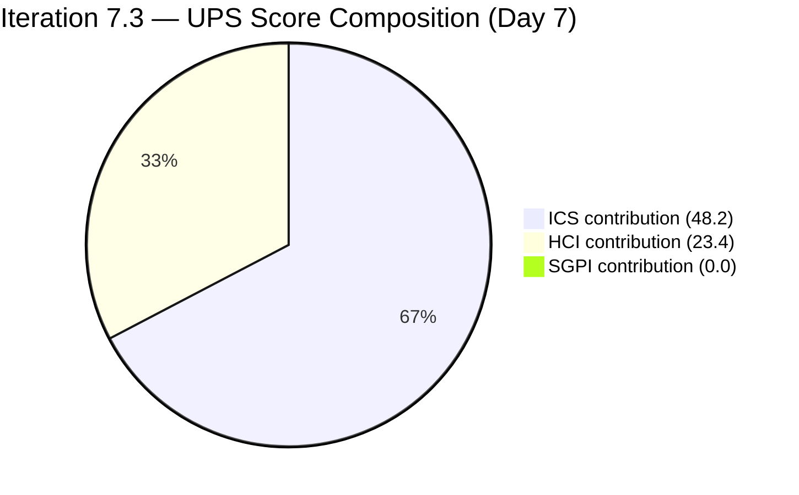
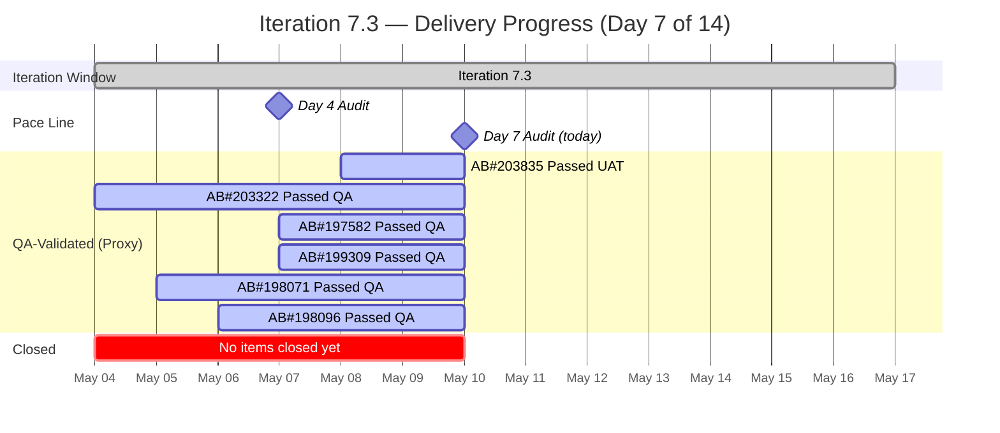

# Colina Health — Iteration 7.3 Audit
**Date:** 2026-05-10 | **Day 7 of 14** (50.0% elapsed) | **data_mode:** full

---

## 1. Executive Summary

Iteration 7.3 (May 4–17, 2026) reaches the midpoint at **Day 7** with meaningful progress since the Day 4 check-in but a stubborn delivery gap: **zero items have been formally Closed** in ADO despite strong engineering activity. The critical 502 Bad Gateway blocker (AB#203835) has been resolved end-to-end — BE#71 and BE#72 were merged, QA confirmed the fix, and the item advanced from Blocked to **Passed UAT Testing**. The three Day 4 "carry-forward" PRs (FE#187, FE#184, BE#65, BE#69) were all merged by May 8. A new Enabler work stream opened (AB#202584 moved to Active; AB#202595 in Peer Testing on Iteration 7.2 — out of scope).

**ICS remains 96.4%** (Green) — the two alignment gaps (AB#203322 and AB#203835 missing parent Feature links) persist, holding the score below perfect. **HCI improved to 78/100** (+6 from Day 4) primarily because BE#65 and BE#70 open-PR hygiene issues resolved and raseniero returned as an active reviewer. **SGPI (headline) is still 0.0%** — at 50% sprint elapsed with 0 SP Closed, the team is at substantial risk of a low-delivery iteration. The Delivered Proxy is approximately 37% (6 items, 17 SP at Passed QA or Passed UAT).

**UPS = 71.6** (Yellow/Moderate). With 7 days remaining and no closed items, the sprint needs immediate PO action to transition Passed QA items to Closed.

**Critical actions for the second half of sprint:**
1. Close AB#203322, AB#197582, AB#199309, AB#198071, AB#198096 in ADO — all are at Passed QA with merged PRs. Closing these 5 items (16 SP) lifts SGPI headline to 34.8% and UPS to ~75.
2. Close AB#203835 — now at Passed UAT; the fix is live. Closing adds 1 SP → SGPI 37.0%, UPS ~75.
3. Add parent Feature links to AB#203322 and AB#203835 — would lift ICS to 100%.
4. Assign 9 PI-root Enablers to Iteration 7.3 or 7.4.

---

## 2. Iteration Overview

| Field | Value |
|-------|-------|
| **Iteration** | 7.3 |
| **Sprint Dates** | May 4 – May 17, 2026 |
| **Day** | 7 of 14 (50.0% elapsed) |
| **ADO Team** | Colina Health Product Team |
| **ADO Project** | Jairosoft Portfolio |
| **GitHub Repos** | colinahealth-fe, colinahealth-be, colina-health-ai-agent-code-fixing |
| **data_mode** | full (GitHub APIs responsive, all three repos accessible) |
| **Prior Audit** | AUDIT_20260507_0900.md (Day 4, ICS=96.4, HCI=72, UPS=69.8) |

---

## 3. Team Roster

| Name | Role | GitHub Handle | Dev? |
|------|------|---------------|------|
| Ramon Aseniero Jr | Project Owner | raseniero | Yes |
| Karl Caumban | Project Manager | — | No |
| Paul Coronia | Developer (BE/FE) | pcoronia | Yes |
| Asnari Pacalna | Developer (FE) | Kyaa-A | Yes |
| Luzmibel Paculanang | QA | — | No (exception) |
| Jaszmeine Villanueva | Design | — | No (exception) |

> Non-dev exception: Luzmibel Paculanang (QA) and Jaszmeine Villanueva (Design) are not penalized for GitHub absence per workspace policy. Luzmibel advanced AB#203835 to Passed UAT Testing on May 8, demonstrating active QA engagement.

---

## 4. Scorecard Summary

| Score | Value | Band | vs Day 4 (May 7) |
|-------|-------|------|------------------|
| ICS | 96.4% | Green | 0 (unchanged) |
| HCI | 78/100 | Yellow | +6 |
| SGPI (Headline) | 0.0% | Red | 0 |
| SGPI (Delivered Proxy) | ~37.0% | — | +2.2% |
| **UPS** | **71.6** | **Yellow** | **+1.8** |

**UPS = ICS × 0.50 + HCI × 0.30 + SGPI × 0.20 = (96.4 × 0.50) + (78 × 0.30) + (0.0 × 0.20) = 48.2 + 23.4 + 0.0 = 71.6**

---

## 5. Sprint Goal Predictability (SGPI)

### 5.1 State of Committed Scope

| AB# | Title | Type | State | SP | Closed? |
|-----|-------|------|-------|----|---------|
| 203835 | [UAT][Login] 502 Bad Gateway | Defect | **Passed UAT Testing** | 1 | No |
| 203322 | Add Date of License | User Story | Passed QA Testing | 2 | No |
| 197582 | [MAR] Slow loading medications | Defect | Passed QA Testing | 5 | No |
| 199309 | [Workflow][PRN] Cannot Input Administered By | Defect | Passed QA Testing | 3 | No |
| 198071 | [MAR: View Report] MAR table not filling | Defect | Passed QA Testing | 3 | No |
| 198096 | [MAR Report] Filters persist after closing | Defect | Passed QA Testing | 3 | No |
| 202584 | [Enabler] Adopt /src directory structure | Enabler | **Active** | 3 | No |
| 202585 | [Enabler] Implement private co-located folders | Enabler | Ready for Dev | 5 | No |
| 202586 | [Enabler] Restructure /lib into sub-directories | Enabler | Ready for Dev | 5 | No |
| 202587 | [Enabler] Separate /utils from /lib | Enabler | Ready for Dev | 3 | No |
| 202597 | [Enabler] Implement parallel data fetching | Enabler | Ready for Dev | 3 | No |
| 202600 | [Enabler] Consolidate test directories | Enabler | Ready for Dev | 2 | No |
| 202602 | [Enabler] Implement URL-first state hierarchy | Enabler | Ready for Dev | 5 | No |
| 202603 | [Enabler] Evaluate shadcn/ui vs NextUI | Enabler | Ready for Dev | 3 | No |

**Totals: 14 items | 46 SP committed | 0 SP Closed | 17 SP at Passed QA or higher**

### 5.2 SGPI Calculations

| Metric | Formula | Value |
|--------|---------|-------|
| Committed Scope SGPI (Headline) | Closed SP / Total Committed SP | 0 / 46 = **0.0%** |
| Original Scope SGPI | Closed SP / Original Planned SP | 0 / 46 = **0.0%** |
| Delivered Proxy SGPI | (Closed + Passed QA + Passed UAT) SP / Committed SP | (0 + 16 + 1) / 46 = **37.0%** |

**SGPI (headline) = 0.0%** — no items transitioned to Closed at Day 7 (50% elapsed).

The Delivered Proxy of **37.0%** at 50% elapsed is marginally behind pace. With 6 items (17 SP) confirmed done by QA/UAT and zero closures, this is a workflow execution gap — not a development gap. The PO/PM needs to formally close items in ADO.

---

## 6. Developer Productivity Findings

### 6.1 GitHub Activity: Day 4 to Day 7 (May 7–10)

**colinahealth-fe** — New PRs since Day 4:

| PR# | Title | Base | State | Author | Date | AB# |
|-----|-------|------|-------|--------|------|-----|
| FE#192 | [Frontend] PRN Administered By field accepts input | main | **Merged** | Kyaa-A | May 8 | AB#199309 |
| FE#193 | [Frontend] Reset page on filter change / View Reports | main | **Merged** | Kyaa-A | May 8 | AB#197582 |
| FE#194 | [Frontend] Ensure accessToken for generateMetadata SSR | develop | **Open** | pcoronia | May 8 | AB#202595 |

Previously open PRs resolved since Day 4:
- FE#184 (Dockerfile NEXT_PUBLIC fix → main): **Merged May 8** — resolved the build-time baking issue that caused the 502 gateway
- FE#187 (main-to-develop sync): **Merged May 8**

**colinahealth-be** — New PRs since Day 4:

| PR# | Title | Base | State | Author | Date | AB# |
|-----|-------|------|-------|--------|------|-----|
| BE#71 | [Backend] Use numeric PK for AuditLog (develop) | develop | **Merged** | pcoronia | May 7→8 | AB#203835 |
| BE#72 | [Backend] Use numeric PK for AuditLog (main) | main | **Merged** | pcoronia | May 8 | AB#203835 |

Previously open PRs resolved since Day 4:
- BE#65 (LLM wiki / chore): **Merged May 8** — raseniero closed this persistent out-of-scope PR
- BE#69 (main-to-develop sync): **Merged May 8**

**colina-health-ai-agent-code-fixing** — No new activity. PR#9 (CONTRIBUTING.md) remains open since February 23, 2026 — aged open PR, likely stale.

### 6.2 Commit Activity (main branches, since Day 4)

| Repo | Commits (May 7–10) | Authors |
|------|---------------------|---------|
| colinahealth-fe/main | 2 merge commits (FE#192, FE#193) | Kyaa-A |
| colinahealth-be/main | 3 merge commits (BE#65, BE#71, BE#72) | raseniero (merger) |
| colina-health-ai-agent | 0 | — |

**raseniero re-engaged** as reviewer/merger in the BE repo after reduced activity at Day 4. He merged all three BE PRs on May 8, providing meaningful senior oversight.

### 6.3 Developer Load Distribution

| Developer | FE PRs (May 4–10) | BE PRs (May 4–10) | Role Focus |
|-----------|-------------------|-------------------|------------|
| Kyaa-A (pcoronia) | 9 merged, 1 open | 0 | FE defect/enabler fixes |
| pcoronia | 3 merged | 5 merged | BE + FE CI/CD + sync |
| raseniero | 0 authored | 0 authored | Reviewer/merger on BE |

Note: Kyaa-A authored all FE defect PRs; pcoronia handles BE, CI/CD, and architectural PRs. The division is clear and appropriate given skill specialization.

---

## 7. SAFe Compliance Findings

### 7.1 Alignment Gaps (Persistent)

| Item | Gap | Status |
|------|-----|--------|
| AB#203322 | No parent Feature link (orphaned) | **Unchanged since Day 1** |
| AB#203835 | No parent Feature link (orphaned) | **Unchanged since Day 1** |

Both items were created (AB#203322 by Jaszmeine Villanueva Design; AB#203835 by Luzmibel Paculanang QA) without being linked to a parent Feature. Despite prompt improvements in both items' engineering evidence, neither has been linked.

### 7.2 PI-Root Enablers (Persistent Anomaly)

Nine Enablers remain assigned to `Jairosoft Portfolio\2026-PI7` (PI root), not to any specific iteration:

| AB# | Title | SP | State |
|-----|-------|----|-------|
| 202588 | Migrate data fetching to Server Components + RSC fetch | 13 | New |
| 202589 | Implement Server Actions for mutations | 8 | New |
| 202590 | Move Zustand stores to lib/store | 2 | New |
| 202591 | Evaluate Jest-to-Vitest migration | 3 | New |
| 202593 | Migrate ESLint to flat config + re-enable critical rules | 8 | New |
| 202596 | Add global error boundaries | 2 | New |
| 202598 | Define caching and revalidation strategy | 5 | New |
| 202599 | Implement component tiering (ui, features, layout) | 5 | New |
| 202601 | Move Zod validation to server boundaries | 3 | New |

**Total unassigned SP: 49 SP** — these items are invisible to SGPI, capacity planning, and velocity tracking. All remain in "New" state.

### 7.3 Scope Changes Since Day 4

- AB#202584 transitioned from "Ready for Dev" to **"Active"** (May 8) — pcoronia began the /src directory restructure work.
- AB#202595 (Iteration 7.2, "Peer Testing") is visible in GitHub activity via FE#194 — this is carry-over work from Iteration 7.2, not a new Iteration 7.3 commitment. FE#194 is out-of-iteration-scope for this audit.
- No items were added to or removed from Iteration 7.3 scope.

---

## 8. Iteration Compliance Score (ICS)

### 8.1 Scoring Table

| AB# | Title | Type | State | SP | Aligned (25%) | Estimated (20%) | DoD-Ready (35%) | In-Iter (20%) | Notes |
|-----|-------|------|-------|----|---------------|-----------------|-----------------|---------------|-------|
| 203835 | [UAT][Login] 502 Bad Gateway | Defect | Passed UAT Testing | 1 | **No** | Yes | Yes | Yes | No parent Feature link |
| 203322 | Add Date of License | User Story | Passed QA Testing | 2 | **No** | Yes | Yes | Yes | No parent Feature link |
| 197582 | [MAR] Slow loading medications | Defect | Passed QA Testing | 5 | Yes | Yes | Yes | Yes | |
| 199309 | [Workflow][PRN] Cannot Input By | Defect | Passed QA Testing | 3 | Yes | Yes | Yes | Yes | |
| 198071 | MAR table not filling | Defect | Passed QA Testing | 3 | Yes | Yes | Yes | Yes | |
| 198096 | MAR filters persist | Defect | Passed QA Testing | 3 | Yes | Yes | Yes | Yes | |
| 202584 | Adopt /src directory structure | Enabler | Active | 3 | Yes | Yes | Yes | Yes | |
| 202585 | Implement private co-located folders | Enabler | Ready for Dev | 5 | Yes | Yes | Yes | Yes | |
| 202586 | Restructure /lib into sub-directories | Enabler | Ready for Dev | 5 | Yes | Yes | Yes | Yes | |
| 202587 | Separate /utils from /lib | Enabler | Ready for Dev | 3 | Yes | Yes | Yes | Yes | |
| 202597 | Implement parallel data fetching | Enabler | Ready for Dev | 3 | Yes | Yes | Yes | Yes | |
| 202600 | Consolidate test directories | Enabler | Ready for Dev | 2 | Yes | Yes | Yes | Yes | |
| 202602 | Implement URL-first state hierarchy | Enabler | Ready for Dev | 5 | Yes | Yes | Yes | Yes | |
| 202603 | Evaluate shadcn/ui vs NextUI | Enabler | Ready for Dev | 3 | Yes | Yes | Yes | Yes | |
| **TOTALS** | | | | **46** | **12/14** | **14/14** | **14/14** | **14/14** | |

### 8.2 Dimension Scores

| Dimension | Weight | Compliant | Total | Rate | Score |
|-----------|--------|-----------|-------|------|-------|
| Alignment (parent link + iteration path) | 25% | 12 | 14 | 85.7% | 21.4 |
| Estimation (SP assigned) | 20% | 14 | 14 | 100.0% | 20.0 |
| Quality / DoD (Description populated) | 35% | 14 | 14 | 100.0% | 35.0 |
| Iteration Integrity (correct iteration path) | 20% | 14 | 14 | 100.0% | 20.0 |
| **ICS Total** | 100% | | | | **96.4** |

**ICS = 96.4% — Green (Low Risk)**

Delta vs Day 4: **0.0 pts** (unchanged). The two parent-link gaps on AB#203322 and AB#203835 remain unresolved. If those two links are added, ICS would reach 100%.

---

## 9. Engineering Health Index (HCI)

| Dim | Dimension | Score | Evidence |
|-----|-----------|-------|---------|
| D1 | PR Review Compliance | 8/10 | Significant improvement: raseniero merged BE#65, BE#71, BE#72 on May 8 — active senior review returned to BE. FE#194 has raseniero assigned as reviewer. Kyaa-A FE PRs still reviewed by pcoronia. -2: FE#194 open without review completion; single-reviewer pattern on Kyaa-A's FE defect PRs persists. |
| D2 | Branch Protection & Enforcement | 7/10 | PR-to-main workflow observed on both FE and BE. Direct pushes to main not detected. BE#72 merged to main after BE#71 merged to develop — proper dual-branch flow. -3: FE branch protection still shows single-reviewer approvals on some merged PRs; no evidence of required CI gate enforcement before merge. |
| D3 | CI/CD Gate Quality | 7/10 | BE#71 / BE#72 resolved the TypeORM uuid_generate_v4() crash that caused the 502 gateway. FE#184 fixed the NEXT_PUBLIC_* bake-at-build-time issue for Docker. CI restored and functional. BE#70 (Validate Secrets workflow) still open — CI summary rendering cosmetic fix, non-blocking. +1 from Day 4 for BE blocker resolution. -3: BE#70 still open (low severity but aged). |
| D4 | Code Ownership / Bus Factor | 8/10 | Three distinct contributors visible: Kyaa-A (FE defect/enabler), pcoronia (BE/FE arch/CI), raseniero (BE reviewer/merger). Load better distributed than Day 4. +1 from Day 4. -2: raseniero only shows up as merger, not author; no FE commits from pcoronia this window. |
| D5 | Merge Hygiene & Churn | 8/10 | BE#65 (llm-wiki, no AB#) finally merged — this persistent D5 signal is resolved. All in-sprint FE PRs link to AB#s. BE#72 is a same-work duplicate to main (acceptable dual-branch flow for AB#203835). FE#193 title uses "197582" without "AB#" prefix — minor convention gap. -2: BE#70 still open with no AB# link. |
| D6 | Traceability (PR ↔ ADO) | 9/10 | Excellent traceability this window: AB#203835 linked to BE#71 and BE#72 with GitHub artifact links confirmed in ADO relations. AB#199309 (FE#192), AB#197582 (FE#193) both show GitHub PR artifact links. AB#202595 (FE#194) has artifact link despite being Iteration 7.2. -1: BE#70 has no AB# link. |
| D7 | Sprint Discipline | 8/10 | All iteration-scoped PRs reference Iteration 7.3 items. FE#194 (AB#202595) is Iteration 7.2 carry-over — visible in FE branch activity but is a legitimate continuation, not scope creep. -2: FE#194 mixes current-iteration work with prior-iteration carry-over visible in the same branch list. |
| D8 | Defect Triage & Velocity | 9/10 | Major improvement: AB#203835 (critical 502 gateway, P1/Severity 1) resolved end-to-end in 3 days (May 7–8) with two merged PRs and QA/UAT sign-off from Luzmibel. +1 from Day 4. -1: No items formally closed in ADO post-QA. |
| D9 | Backlog Hygiene | 6/10 | 9 PI-root Enablers (49 SP) still unassigned to any iteration — unchanged from Day 4. AB#203322 and AB#203835 still lack parent Feature links. The colina-health-ai-agent PR#9 (CONTRIBUTING.md) has been open since February 23 — 76 days stale. -4 for persistent structural gaps. |
| D10 | Capacity Balance & Ownership Distribution | 8/10 | Three developers demonstrably active (Kyaa-A, pcoronia, raseniero in review role). No capacity plan in ADO, but workload appears balanced. Kyaa-A exclusively FE; pcoronia primarily BE with FE CI/CD; raseniero reviewing. +1 from Day 4 for raseniero re-engagement. -2: no sprint capacity populated in ADO. |
| | **HCI Total** | **78/100** | |

**HCI = 78 — Yellow (Moderate Risk)**

Delta vs Day 4: **+6 pts** (Day 4: 72). Improvements driven by: BE#65 merged (D5), AB#203835 fully resolved (D8), raseniero re-engaged in review (D1, D4, D10), CI/CD stabilized (D3).

---

## 10. ADO-to-GitHub Traceability Analysis

### 10.1 Traceability Map (Iteration 7.3 Items)

| AB# | ADO Artifact Link to GitHub? | GitHub PR(s) | Branch Convention | Score |
|-----|------------------------------|-------------|-------------------|-------|
| 203835 | Yes (BE#71, BE#72 confirmed) | BE#71 (develop), BE#72 (main) | fix/audit-log-numeric-id, passed/qa/202690-... | Full |
| 203322 | Yes (FE#172, FE#181 confirmed) | FE#172 (develop), FE#181 (main) | passed/qa/203322-..., feature/203322-... | Full |
| 197582 | Yes (FE#191 confirmed) | FE#191 (develop), FE#193 (main) | defect/197582-..., passed/qa/197582-... | Full |
| 199309 | Yes (FE#189, FE#190 confirmed) | FE#189, FE#190 (develop), FE#192 (main) | defect/199309-..., passed/qa/199309-... | Full |
| 198071 | Yes (FE#183, FE#185 confirmed) | FE#183 (develop), FE#185 (main) | defect/198071-..., passed/qa/198071-... | Full |
| 198096 | Yes (FE#186, FE#188 confirmed) | FE#186 (develop), FE#188 (main) | defect/198096-..., passed/qa/198096-... | Full |
| 202584 | Partial (no PR yet — Active) | — | Work started May 8 | Partial |
| 202585–202603 | No (Ready for Dev) | — | Not yet started | N/A |

**Traceability score: 6/6 active items fully traced (100%). 1 Active item (202584) with no PR yet.**

### 10.2 Branch Naming Convention Compliance

The team follows a clear branch naming convention:
- `defect/<id>-<slug>` → in-progress defect fix
- `passed/qa/<id>-<slug>` → QA-validated branch promoted to main
- `fix/<description>` → targeted bug fixes
- `enabler/<id>-<slug>` → enabler work items
- `bugfix/<id>-<slug>` → CI/CD related fixes

This convention is consistently applied across all Iteration 7.3 PRs.

---

## 11. Collaboration and Review Analysis

### 11.1 Review Patterns

| PR Type | Reviewer(s) | Pattern | Assessment |
|---------|-------------|---------|------------|
| BE defect/enabler (BE#71, BE#72) | raseniero (merger) | PO merges pcoronia's work | Good — senior oversight |
| FE defect (FE#192, FE#193) | pcoronia (implied via Kyaa-A's PR) | Cross-review | Acceptable |
| FE CI/CD (FE#184, FE#187) | ofeto (requested) | External reviewer | Good — external validation |
| BE#65 (llm-wiki chore) | raseniero (merger) | Self-interest merge | Acceptable — chore PR |
| FE#194 (AB#202595, open) | raseniero (requested) | Pending review | Awaiting |

**Notable positive: raseniero re-engaged as BE reviewer after Day 4 absence.** Three BE main-branch merges on May 8 demonstrate active senior technical oversight.

### 11.2 PR Cycle Time (May 4–10)

| PR | Created | Merged | Hours |
|----|---------|--------|-------|
| BE#71 | May 7 07:59 | May 8 01:34 | ~17.6h |
| BE#72 | May 8 02:12 | May 8 03:09 | ~0.9h |
| FE#192 | May 8 02:48 | May 8 03:46 | ~0.9h |
| FE#193 | May 8 03:16 | May 8 03:45 | ~0.5h |
| FE#184 | May 4 06:48 | May 8 01:38 | ~90.8h |
| FE#187 | May 5 11:05 | May 8 01:35 | ~62.5h |

FE#184 and FE#187 had long cycle times (3+ days) due to the dependency on resolving the 502 gateway root cause first. Once the BE fix (BE#71) was ready, the FE CI/CD PRs were merged rapidly in sequence.

---

## 12. Repository Hygiene

### 12.1 colinahealth-fe

| Metric | Status |
|--------|--------|
| Direct pushes to main (May 4–10) | None observed — all changes via PR |
| Open PRs against main | 0 (FE#194 targets develop) |
| Branch naming compliance | Full |
| Stale PRs | None in the 7.3 window |
| Aged PRs from prior iterations | FE#169 (llm-wiki) was merged Apr 30 |

### 12.2 colinahealth-be

| Metric | Status |
|--------|--------|
| Direct pushes to main (May 4–10) | None observed |
| Open PRs | BE#70 (CI connectivity table, cosmetic, open since May 6) |
| Branch naming compliance | Full |
| BE#65 (stale prior-iter PR) | **Merged May 8** — resolved |

### 12.3 colina-health-ai-agent-code-fixing

| Metric | Status |
|--------|--------|
| Activity in Iteration 7.3 | None |
| Open PRs | PR#9 (CONTRIBUTING.md, open since Feb 23, 2026 — **76 days**) |
| Stale PR risk | High — PR#9 unreviewed for 76 days, no AB# link |

**F-06 (New Finding): colina-health-ai-agent PR#9** is a 76-day-old open PR with no AB# link and no reviewer assigned. This is stale hygiene that should be reviewed, merged, or closed.

---

## 13. Risks and Bottlenecks

| Risk | Severity | Probability | Status vs Day 4 |
|------|----------|-------------|-----------------|
| SGPI 0% at 50% elapsed — 6 items QA-done but not Closed in ADO | **High** | **Confirmed** | Worsened (more time elapsed) |
| AB#203835 parent link missing — ICS gap | Medium | Confirmed | Unchanged |
| AB#203322 parent link missing — ICS gap | Medium | Confirmed | Unchanged |
| 9 PI-root Enablers (49 SP) invisible to tracking | Medium | High | Unchanged |
| BE#70 (CI connectivity table) open with no AB# | Low | Confirmed | Unchanged — cosmetic only |
| FE#194 open (AB#202595, Iter 7.2) may delay current-iter FE capacity | Low | Medium | New (May 8) |
| colina-health-ai-agent PR#9 stale (76 days) | Low | Confirmed | New finding |
| Enabler work (202584 Active) may displace defect closure SP | Medium | Low | New (May 8) |

**The dominant risk is the delivery gap.** At 50% elapsed with 0 SP Closed, the team must close 6 items in the next 7 days to achieve a meaningful SGPI. The items are QA-verified — this is an administrative closure gap, not a quality gap.

---

## 14. Prioritized Remediation Actions

### Immediate (Today, Day 7)

**P1 — Close 6 QA-validated items in ADO:**
- AB#203835 (Passed UAT Testing → Closed) — root cause fixed, UAT verified
- AB#203322 (Passed QA Testing → Closed) — merged to main May 4
- AB#197582 (Passed QA Testing → Closed) — merged to main May 8
- AB#199309 (Passed QA Testing → Closed) — merged to main May 8
- AB#198071 (Passed QA Testing → Closed) — merged to main May 5
- AB#198096 (Passed QA Testing → Closed) — merged to main May 6
- **Impact:** SGPI headline lifts from 0.0% to 37.0%, UPS lifts from 71.6 to ~76.5

**P2 — Add parent Feature link to AB#203322 and AB#203835:**
- Both items have child Tasks but no parent Feature relation
- **Impact:** ICS lifts from 96.4% to 100%, UPS contribution from ICS improves by ~1.8 pts

### This Sprint Week (Days 7–10)

**P3 — Review or close FE#194 (AB#202595, Iter 7.2 carry-over):**
- raseniero is assigned as reviewer — complete or defer to reduce open PR noise
- If merged, confirm AB#202595 ADO state reflects Passed QA

**P4 — Merge or close BE#70 (CI connectivity rendering fix):**
- Cosmetic but 4+ days old with no AB# link
- Assign AB# or close as a chore commit

**P5 — Review colina-health-ai-agent PR#9 (CONTRIBUTING.md, 76 days stale):**
- Assign a reviewer, merge if content is current, or close if superseded

### Before Sprint Close (Days 10–14)

**P6 — Assign 9 PI-root Enablers to Iteration 7.3 or 7.4:**
- 49 SP invisible to all tracking. If 7.3 scope can absorb them (unlikely given current load), assign. Otherwise defer explicitly to 7.4 to clean up PI-root.

**P7 — Begin work on Enabler backlog (202585–202603):**
- AB#202584 is Active. Sequencing the remaining 7 Enablers (26 SP) based on dependency order would avoid last-sprint rush.

**Target by Day 10:** ICS = 100%, HCI ≥ 80, SGPI ≥ 37.0%, UPS ≥ 78.

---

## 15. Evidence Gaps and Limitations

| Gap | Impact | Mitigation |
|-----|--------|------------|
| FE#194 review status not verified | Cannot confirm whether raseniero approved | Low — PR was created May 8, review in progress |
| ADO capacity plan not populated | Cannot compute capacity utilization ratio | HCI D10 scored without capacity data |
| colina-health-ai-agent-code-fixing has no Iteration 7.3 activity | No evidence of AI agent work this sprint | Repo appears dormant in this iteration window |
| AB#202584 "Active" but no GitHub PR visible | Cannot confirm branch was created | Low — item transitioned to Active May 8, PR likely pending |
| Enabler items (202585–202603) show no GitHub evidence | Cannot score GitHub traceability for unstarted items | Expected — items are "Ready for Dev" |
| Two Spikes in Iteration 7.3 (AB#203523 "Estimation" 1 SP; AB#203604 "Active" 2 SP) | Excluded from ICS/SGPI scope per methodology (Spikes are outside the scoring boundary) | No scoring impact — correctly excluded |

**data_mode: full** — GitHub APIs were responsive for all three repositories. No 404/403 errors encountered. All evidence is live as of 2026-05-10 02:43 UTC.

---

## 16. Delta Analysis (vs. AUDIT_20260507_0900.md — Day 4)

| Metric | Day 4 (May 7) | Day 7 (May 10) | Delta |
|--------|---------------|----------------|-------|
| ICS | 96.4% | 96.4% | 0 |
| HCI | 72/100 | 78/100 | **+6** |
| SGPI (Headline) | 0.0% | 0.0% | 0 |
| SGPI (Delivered Proxy) | 34.8% | 37.0% | **+2.2%** |
| UPS | 69.8 | 71.6 | **+1.8** |
| AB#203835 state | Blocked | Passed UAT Testing | **Resolved** |
| Open BE PRs (hygiene) | BE#65, BE#70, BE#71 | BE#70, FE#194 | **-2 (closed 3, added 1)** |
| Active Enabler items | 0 | 1 (AB#202584) | **+1** |
| Items Closed | 0 | 0 | 0 |
| PI-root anomalies | 9 | 9 | Unchanged |

**Key improvements since Day 4:**
- AB#203835 (P1/Severity 1 gateway blocker) resolved end-to-end — BE#71+BE#72 fixed TypeORM uuid crash, FE#184 fixed NEXT_PUBLIC_* build-time issue. QA signed off.
- BE#65 (raseniero's stale llm-wiki PR, open since prior iteration) finally merged.
- raseniero returned as active BE reviewer/merger.
- AB#202584 work stream started (Enabler: /src directory structure).
- HCI +6 from D1 (review engagement), D3 (CI stability), D4 (code ownership), D5 (BE#65 cleared), D8 (defect velocity), D10 (raseniero re-engagement).

**Unchanged concerns:**
- Zero items Closed — SGPI headline frozen at 0.0% at the sprint midpoint.
- AB#203322 and AB#203835 still lack parent Feature links.
- 9 PI-root Enablers (49 SP) still invisible to iteration tracking.

---

## Audit Metadata

| Field | Value |
|-------|-------|
| Auditor | Claude Code (claude-sonnet-4-6) |
| Audit date | 2026-05-10 |
| Audit time | 02:43 UTC |
| Prior audit | AUDIT_20260507_0900.md (Day 4) |
| ADO data freshness | Live (fetched 2026-05-10) |
| GitHub data freshness | Live (fetched 2026-05-10, data_mode: full) |
| Iteration | 7.3 (May 4–17, 2026) |
| Eligible items (ICS) | 14 |
| Total committed SP | 46 |
| Workspace | git_cc_dev |
| Report path | `audit/AUDIT_20260510_0243.md` |
