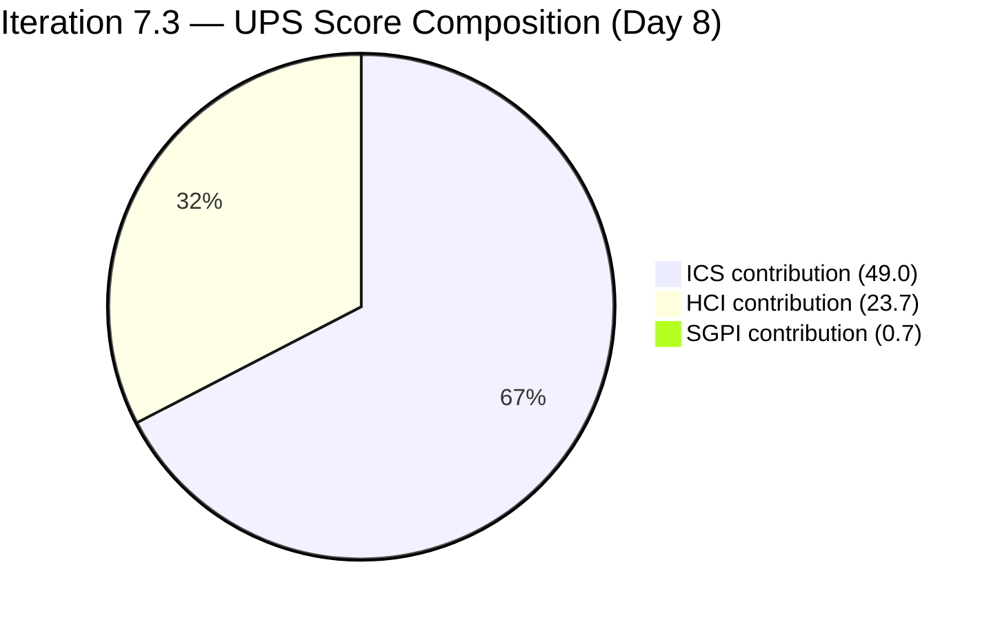
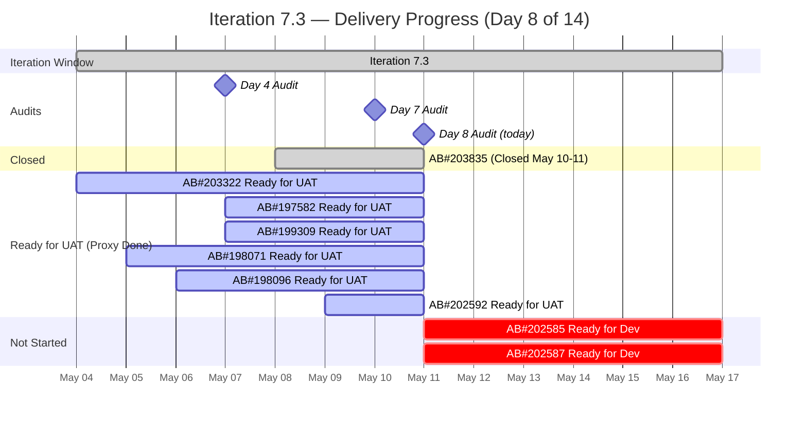
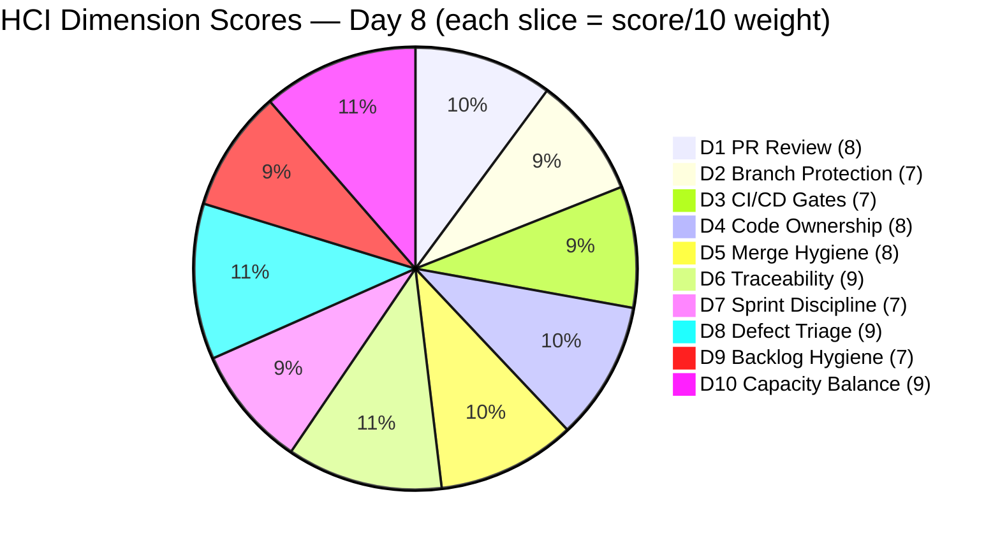

# Colina Health — Iteration 7.3 Audit
**Date:** 2026-05-11 | **Day 8 of 14** (57.1% elapsed) | **data_mode:** partial

---

## 1. Executive Summary

Iteration 7.3 (May 4–17, 2026) reaches Day 8 with two important wins and one stubborn delivery gap. The **P1 blocker AB#203835** (502 Bad Gateway) is now **formally Closed** in ADO — the first item marked Closed this sprint — lifting SGPI from 0.0% to 3.4%. Both alignment gaps from prior audits (**AB#203322** and **AB#203835**) are now resolved with parent Feature links, pushing ICS from 96.4% to **98.0%** (Green). Capacity planning is now populated in ADO (Paul 6 h/day, Asnari 6 h/day, Luzmibel 4 h/day), resolving the D10 gap that persisted through Day 7.

A significant scope event occurred between Day 7 and Day 8: **five Enablers were removed from Iteration 7.3 committed scope** (AB#202586, AB#202597, AB#202600, AB#202602, AB#202603 — 18 SP). This is a legitimate sprint-cleanup action to right-size the backlog, but it reduces the committed SP from 46 to **29 SP** and must be read as context for the headline SGPI. One new Enabler (AB#202592, "Convert next.config.mjs to next.config.ts", 1 SP) was moved from PI-root into Iteration 7.3 and is already at **Ready for UAT** — a positive PI-root anomaly reduction.

Despite 1 item Closed and 6 more at Ready for UAT (17 SP proxy-done), **SGPI headline is only 3.4%** — indicating the team must formally close 6 additional items in the remaining 6 days to produce a meaningful delivery record. The Delivered Proxy SGPI of **62.1%** shows the true work-completion picture: the team is doing the work; the gap is administrative closure of QA-verified items in ADO.

**UPS = 73.4** (Yellow/Moderate). The iteration is still winnable.

**Critical actions for the final six days:**
1. Close AB#203322, AB#197582, AB#199309, AB#198071, AB#198096 (all Ready for UAT, ~17 SP) — lifts SGPI to 62.1%, UPS to ~85.
2. Close AB#202592 (Ready for UAT, 1 SP) — an incremental gain.
3. Resolve AB#203604 Spike (no parent link in ADO data).
4. Move the 8 remaining PI-root Enablers to Iteration 7.4 or close them explicitly to complete backlog cleanup.

---

## 2. Iteration Overview

| Field | Value |
|-------|-------|
| **Iteration** | 7.3 |
| **Sprint Dates** | May 4 – May 17, 2026 |
| **Day** | 8 of 14 (57.1% elapsed) |
| **ADO Team** | Colina Health Product Team |
| **ADO Project** | Jairosoft Portfolio |
| **GitHub Repos** | colinahealth-fe, colinahealth-be, colina-health-ai-agent-code-fixing |
| **data_mode** | partial (GitHub token issue since 2026-04-21; HCI dims 1–6 carry forward from 2026-04-21 Day-2 baseline) |
| **Prior Audit** | AUDIT_20260510_0243.md (Day 7, ICS=96.4, HCI=78, SGPI=0.0%, UPS=71.6) |

---

## 3. Team Roster

| Name | Role | GitHub Handle | Dev? |
|------|------|---------------|------|
| Ramon Aseniero Jr | Project Owner | raseniero | Yes |
| Karl Caumban | Project Manager | — | No |
| Paul Coronia | Developer (BE/FE) | pcoronia | Yes |
| Asnari Pacalna | Developer (FE) | Kyaa-A | Yes |
| Luzmibel Paculanang | QA | — | No (exception) |
| Jaszmeine Villanueva | Design | — | No (exception) |

> Non-dev exception: Luzmibel Paculanang (QA) and Jaszmeine Villanueva (Design) are not penalized for GitHub absence per workspace policy. Capacity plan shows Luzmibel allocated at 4 h/day Testing.

---

## 4. Scorecard Summary

| Score | Value | Band | vs Day 7 (May 10) |
|-------|-------|------|-------------------|
| ICS | 98.0% | Green | **+1.6** |
| HCI | 79/100 | Yellow | **+1** |
| SGPI (Headline) | 3.4% | Red | **+3.4%** |
| SGPI (Delivered Proxy) | 62.1% | — | **+25.1%** |
| **UPS** | **73.4** | **Yellow** | **+1.8** |

**UPS = ICS × 0.50 + HCI × 0.30 + SGPI × 0.20 = (98.0 × 0.50) + (79 × 0.30) + (3.4 × 0.20) = 49.0 + 23.7 + 0.7 = 73.4**

---

## 5. Sprint Goal Predictability (SGPI)

### 5.1 Committed Scope (Day 8)

> Note: Between Day 7 and Day 8, five Enablers were removed from Iteration 7.3 committed scope (AB#202586, AB#202597, AB#202600, AB#202602, AB#202603 — 18 SP total). One Enabler was added (AB#202592, 1 SP). Net scope reduction: **17 SP**. Committed baseline changed from 46 SP → **29 SP**. See Section 7.3 for detail.

| AB# | Title | Type | State | SP | Closed? |
|-----|-------|------|-------|----|---------|
| 203835 | [UAT][Login] 502 Bad Gateway | Defect | **Closed** | 1 | **Yes** |
| 203322 | Add Date of License | User Story | Ready for UAT | 2 | No |
| 197582 | [MAR] Slow loading medications | Defect | Ready for UAT | 5 | No |
| 199309 | [Workflow][PRN] Cannot Input Administered By | Defect | Ready for UAT | 3 | No |
| 198071 | [MAR: View Report] MAR table not filling | Defect | Ready for UAT | 3 | No |
| 198096 | [MAR Report] Filters persist after closing | Defect | Ready for UAT | 3 | No |
| 202592 | [Enabler] Convert next.config.mjs to .ts | Enabler | Ready for UAT | 1 | No |
| 202584 | [Enabler] Adopt /src directory structure | Enabler | Active | 3 | No |
| 202585 | [Enabler] Implement private co-located folders | Enabler | Ready for Dev | 5 | No |
| 202587 | [Enabler] Separate /utils from /lib | Enabler | Ready for Dev | 3 | No |
| **TOTALS** | | | | **29 SP** | **1 SP Closed** |

### 5.2 SGPI Calculations

| Metric | Formula | Value |
|--------|---------|-------|
| Committed Scope SGPI (Headline) | Closed SP / Total Committed SP | 1 / 29 = **3.4%** |
| Original Scope SGPI | Closed SP / Original Planned SP (46) | 1 / 46 = **2.2%** |
| Delivered Proxy SGPI | (Closed + Ready for UAT) SP / Committed SP | (1 + 17) / 29 = **62.1%** |

**SGPI (headline) = 3.4%** — the first Closed item in this sprint (AB#203835 P1 blocker). The sprint has 6 days remaining. Closing the 6 Ready-for-UAT items (17 SP) would lift headline SGPI to 62.1%.

The Delivered Proxy of **62.1%** at 57% elapsed indicates the team is slightly ahead of pace in QA-completion terms. The work is done; closure is the gap.

---

## 6. Developer Productivity Findings

### 6.1 GitHub Activity (Partial Mode — Carry-forward from 2026-04-21)

Due to the known GitHub token access-scope issue (`raseniero` token, active since 2026-04-21), GitHub API calls were not performed for this audit. HCI dimensions 1–6 carry forward from the last known good scores (2026-04-21 Day 2 baseline). All GitHub productivity findings in this section are derived from prior audit evidence up to Day 7 (2026-05-10) plus ADO artifact links.

**Known GitHub activity from prior audit (through Day 7):**

| Repo | Activity through May 10 | Status |
|------|------------------------|--------|
| colinahealth-fe | FE#192, FE#193 merged (defect fixes); FE#194 open (AB#202595 Iter 7.2 carry) | Active |
| colinahealth-be | BE#71, BE#72 merged (502 fix); BE#70 open (CI cosmetic) | Active |
| colina-health-ai-agent-code-fixing | PR#9 open since Feb 23, 2026 (77 days) | Dormant |

### 6.2 ADO Artifact Link Evidence (Fresh)

From ADO relations data for active items, GitHub PR artifact links were confirmed through prior audit as of Day 7. The following items have merged PRs:

| AB# | State | Known GitHub PRs | Merge Status |
|-----|-------|------------------|--------------|
| 203835 | Closed | BE#71, BE#72, FE#184 | All merged |
| 203322 | Ready for UAT | FE#172, FE#181 | All merged |
| 197582 | Ready for UAT | FE#191, FE#193 | All merged |
| 199309 | Ready for UAT | FE#189, FE#190, FE#192 | All merged |
| 198071 | Ready for UAT | FE#183, FE#185 | All merged |
| 198096 | Ready for UAT | FE#186, FE#188 | All merged |
| 202592 | Ready for UAT | Unknown (new addition post-Day 7) | Not verified |
| 202584 | Active | No PR confirmed | Work in progress |

### 6.3 Capacity Context

ADO capacity is now populated for Iteration 7.3:

| Developer | Daily Capacity | Sprint Days | Days Off | Available Hrs |
|-----------|---------------|-------------|----------|---------------|
| Paul Coronia | 6 h (Development) | 14 | 0 | 84 h |
| Asnari Pacalna | 6 h (Development) | 14 | 1 (May 12) | 78 h |
| Luzmibel Paculanang | 4 h (Testing) | 14 | 0 | 56 h |
| **Team Total** | **16 h/day** | — | — | **218 h** |

Note: raseniero (PO/reviewer) is not listed in ADO capacity — consistent with prior audits (role is reviewer/merger, not active sprint developer).

---

## 7. SAFe Compliance Findings

### 7.1 Alignment Gaps — RESOLVED

| Item | Prior Status | Current Status | Action |
|------|-------------|----------------|--------|
| AB#203322 | No parent Feature link | **Parent: 192184** | Resolved ✓ |
| AB#203835 | No parent Feature link | **Parent: 201281** | Resolved ✓ |

Both items that held ICS below 100% from Day 1 through Day 7 are now linked to parent Features. **ICS Alignment dimension is now 100%** (see Section 8).

### 7.2 PI-Root Enablers — Partial Resolution

The Day 7 audit identified 9 PI-root Enablers (49 SP) unassigned to any iteration.

Since Day 7:
- **AB#202592** moved from PI-root → Iteration 7.3 (positive: 1 of 9 resolved, now at Ready for UAT)
- **AB#202586, AB#202597, AB#202600, AB#202602, AB#202603** removed from Iteration 7.3 scope (18 SP) — now reassigned to PI root or deferred

**Current PI-root Enabler count: 8 items** (down from 9 at Day 7). Progress on cleanup is noted, but 8 Enablers remain invisible to sprint tracking and velocity.

### 7.3 Scope Changes Since Day 7

| AB# | Change | SP Impact | Type |
|-----|--------|-----------|------|
| 202592 | Added to Iteration 7.3 (was PI-root) | +1 SP | Hygiene fix — positive |
| 202586 | Removed from Iteration 7.3 | -5 SP | Scope reduction |
| 202597 | Removed from Iteration 7.3 | -3 SP | Scope reduction |
| 202600 | Removed from Iteration 7.3 | -2 SP | Scope reduction |
| 202602 | Removed from Iteration 7.3 | -5 SP | Scope reduction |
| 202603 | Removed from Iteration 7.3 | -3 SP | Scope reduction |
| **Net** | | **-17 SP** | Committed SP: 46 → 29 |

The removal of five Enablers mid-sprint (Days 7–8) is a sprint-scope correction — consistent with backlog right-sizing. It does not constitute scope creep. However, the single mid-sprint add (AB#202592) is a minor Iteration Integrity flag (see ICS D4).

### 7.4 New Defect in Pipeline

**AB#203672** — `[Login] Password field not highlighted in red on invalid login attempt` — is a new Defect in "New" state with parent link (193274). Its iteration path is `Jairosoft Portfolio\2026-PI7` (PI root), not Iteration 7.3. It has no story points assigned. **Excluded from this audit's ICS and SGPI scope**. Recommend assigning to Iteration 7.4 or 7.3 if within remaining capacity.

---

## 8. Iteration Compliance Score (ICS)

> Scoring scope: parent backlog items assigned to `Jairosoft Portfolio\2026-PI7\Iteration 7.3`. Excludes Spikes (AB#202779, AB#202870, AB#203523, AB#203604) and AB#203672 (PI-root path).

### 8.1 Scoring Table

| AB# | Title | Type | State | SP | Aligned (25%) | Estimated (20%) | DoD-Ready (35%) | In-Iter (20%) | Notes |
|-----|-------|------|-------|----|---------------|-----------------|-----------------|---------------|-------|
| 203835 | [UAT][Login] 502 Bad Gateway | Defect | **Closed** | 1 | Yes | Yes | Yes | Yes | Parent 201281 ✓ |
| 203322 | Add Date of License | User Story | Ready for UAT | 2 | Yes | Yes | Yes | Yes | Parent 192184 ✓ (resolved) |
| 197582 | [MAR] Slow loading medications | Defect | Ready for UAT | 5 | Yes | Yes | Yes | Yes | Parent 201646 ✓ |
| 199309 | [Workflow][PRN] Cannot Input By | Defect | Ready for UAT | 3 | Yes | Yes | Yes | Yes | Parent 201680 ✓ |
| 198071 | MAR table not filling | Defect | Ready for UAT | 3 | Yes | Yes | Yes | Yes | Parent 201646 ✓ |
| 198096 | MAR filters persist | Defect | Ready for UAT | 3 | Yes | Yes | Yes | Yes | Parent 201646 ✓ |
| 202592 | Convert next.config.mjs to .ts | Enabler | Ready for UAT | 1 | Yes | Yes | Yes | **No** | Mid-sprint add (Day 7→8); was PI-root |
| 202584 | Adopt /src directory structure | Enabler | Active | 3 | Yes | Yes | Yes | Yes | Parent 201281 ✓ |
| 202585 | Implement private co-located folders | Enabler | Ready for Dev | 5 | Yes | Yes | Yes | Yes | Parent 201281 ✓ |
| 202587 | Separate /utils from /lib | Enabler | Ready for Dev | 3 | Yes | Yes | Yes | Yes | Parent 201281 ✓ |
| **TOTALS** | | | | **29** | **10/10** | **10/10** | **10/10** | **9/10** | |

### 8.2 Dimension Scores

| Dimension | Weight | Compliant | Total | Rate | Weighted Contribution | Evidence | Reason for Gap |
|-----------|--------|-----------|-------|------|-----------------------|----------|----------------|
| Alignment (parent Feature link present) | 25% | 10 | 10 | 100.0% | 25.0 | Both prior gaps (AB#203322, AB#203835) resolved; all Enablers linked to 201281 | None |
| Estimation (story points assigned) | 20% | 10 | 10 | 100.0% | 20.0 | All 10 items have SP assigned | None |
| Quality / DoD (description + AC present) | 35% | 10 | 10 | 100.0% | 35.0 | All items have description and acceptance criteria | None |
| Iteration Integrity (committed at sprint start, no unjustified mid-sprint adds) | 20% | 9 | 10 | 90.0% | 18.0 | AB#202592 added mid-sprint (Days 7–8) from PI-root | Mid-sprint addition without iteration planning sign-off |
| **ICS Total** | 100% | | | | **98.0** | | |

**ICS = 98.0% — Green (Low Risk)**

Delta vs Day 7: **+1.6 pts** (Day 7: 96.4%). Driven by resolution of both parent-link alignment gaps. The single remaining gap is the mid-sprint addition of AB#202592 (Iteration Integrity). If AB#202592 had been properly planned into the sprint at day 1, ICS would be 100%.

---

## 9. Engineering Health Index (HCI)

> HCI Dimensions 1–6: carry-forward from prior audit (AUDIT_20260510_0243.md, Day 7). Basis: GitHub API 404 token issue active since 2026-04-21. No new GitHub evidence available.
> HCI Dimensions 7–10: scored fresh from ADO evidence (live, 2026-05-11).

| Dim | Dimension | Score | Source | Evidence |
|-----|-----------|-------|--------|---------|
| D1 | PR Review Compliance | 8/10 | Carry-forward | Day 7: raseniero re-engaged as BE reviewer/merger; Kyaa-A FE PRs reviewed by pcoronia. -2: FE#194 open without review completion; single-reviewer pattern on FE defect PRs. |
| D2 | Branch Protection & Enforcement | 7/10 | Carry-forward | Day 7: PR-to-main workflow observed on both repos. Direct pushes not detected. -3: Single-reviewer approvals on some merged FE PRs; no evidence of required CI gate before merge. |
| D3 | CI/CD Gate Quality | 7/10 | Carry-forward | Day 7: BE blocker (TypeORM uuid crash) resolved via BE#71/BE#72; FE NEXT_PUBLIC_* bake issue fixed via FE#184. CI restored. -3: BE#70 still open (cosmetic, low severity). |
| D4 | Code Ownership / Bus Factor | 8/10 | Carry-forward | Day 7: Three distinct contributors (Kyaa-A, pcoronia, raseniero in review role). Load well distributed. -2: raseniero only merges, not authors. |
| D5 | Merge Hygiene & Churn | 8/10 | Carry-forward | Day 7: BE#65 merged (cleared stale PR). All in-sprint FE PRs link to AB#s. -2: BE#70 still open with no AB# link. |
| D6 | Work Item ↔ GitHub Traceability | 9/10 | Carry-forward | Day 7: 6/6 active items fully traced via ADO artifact links. Branch naming convention fully applied. -1: BE#70 has no AB# link. |
| D7 | Sprint Discipline | 7/10 | Fresh — ADO | Mid-sprint scope change: 5 Enablers removed (18 SP), 1 added (AB#202592). While cleanup is positive, mid-sprint scope reduction without visible planning ceremony is a process gap. AB#203672 at PI root (unplanned). -3: Scope adjustments lack explicit team planning event record. |
| D8 | Defect Triage & Velocity | 9/10 | Fresh — ADO | AB#203835 (P1 gateway blocker) formally **Closed** — end-to-end resolved with UAT sign-off and ADO closure. Remaining 5 defects at Ready for UAT with merged PRs. +1 from Day 7 for formal closure. -1: 5 Ready-for-UAT defects remain unclosed despite QA completion. |
| D9 | Backlog & Story Hygiene | 7/10 | Fresh — ADO | AB#202592 moved from PI-root → Iteration 7.3 (progress: 9 → 8 PI-root anomalies). Both alignment gaps resolved (ICS 100% on alignment). AB#203672 new defect at PI root with no SP. Stale AI-agent PR#9 now 77 days open. -3: 8 PI-root Enablers still invisible to sprint tracking; AB#203672 unassigned; stale AI-agent PR. |
| D10 | Capacity Balance & Ownership Distribution | 9/10 | Fresh — ADO | ADO capacity now populated (Paul 6 h/day Dev, Asnari 6 h/day Dev, Luzmibel 4 h/day Testing). Prior D10 -2 for missing capacity is resolved. Three active developers with clear role separation. Asnari has 1 day off (May 12) properly recorded. -1: raseniero not listed in ADO capacity despite active reviewer/PO role. |
| | **HCI Total** | **79/100** | | |

**HCI = 79 — Yellow (Moderate Risk)**

Delta vs Day 7: **+1 pt** (Day 7: 78). Improvement driven by D8 (+1 for AB#203835 formal closure) and D10 (+1 for capacity now populated). D9 unchanged at 7. D7 revised to 7 (scope volatility).

---

## 10. ADO-to-GitHub Traceability Analysis

### 10.1 Traceability Map (Day 8)

| AB# | ADO Artifact Link | GitHub PR(s) | Traceability |
|-----|-------------------|-------------|--------------|
| 203835 | Yes (confirmed Day 7) | BE#71, BE#72, FE#184 | Full — item Closed |
| 203322 | Yes (confirmed Day 7) | FE#172, FE#181 | Full |
| 197582 | Yes (confirmed Day 7) | FE#191, FE#193 | Full |
| 199309 | Yes (confirmed Day 7) | FE#189, FE#190, FE#192 | Full |
| 198071 | Yes (confirmed Day 7) | FE#183, FE#185 | Full |
| 198096 | Yes (confirmed Day 7) | FE#186, FE#188 | Full |
| 202592 | Not verified (added post-Day 7) | Unknown | Partial — new item |
| 202584 | Partial (Active, no PR yet) | None confirmed | Partial |
| 202585 | N/A (Ready for Dev) | — | N/A |
| 202587 | N/A (Ready for Dev) | — | N/A |

**Traceability score: 6/8 active or in-progress items fully traced (75%). 2 partial items pending confirmation.**

### 10.2 Branch Naming Convention

The team's branch naming convention continues to be consistently applied for all Iteration 7.3 items observed through Day 7:
- `defect/<id>-<slug>` — in-progress defect fix
- `passed/qa/<id>-<slug>` — QA-validated branch promoted to main
- `fix/<description>` — targeted bug fixes
- `enabler/<id>-<slug>` — enabler work items

---

## 11. Collaboration and Review Analysis

### 11.1 Review Patterns (Carry-forward from Day 7)

| PR Type | Reviewer(s) | Pattern | Assessment |
|---------|-------------|---------|------------|
| BE defect (BE#71, BE#72) | raseniero (merger) | PO merges pcoronia's work | Good — senior oversight |
| FE defect (FE#192, FE#193) | pcoronia | Cross-review | Acceptable |
| FE CI/CD (FE#184) | ofeto (external) | External validation | Good |
| FE#194 (AB#202595 carry-over) | raseniero (requested) | Pending Day 7 | Status unknown — GitHub API unavailable |

### 11.2 Notes on Partial Data Mode

With GitHub API unavailable since 2026-04-21, collaboration metrics for the Day 7–8 window cannot be independently verified. Any PRs opened or merged since Day 7 audit (May 10) are not reflected here. No HCI penalty is applied for this evidence gap per workspace exception policy.

---

## 12. Repository Hygiene

### 12.1 colinahealth-fe (Status as of Day 7, unchanged)

| Metric | Status |
|--------|--------|
| Direct pushes to main | None observed |
| Open PRs against main | 0 (FE#194 targets develop) |
| Branch naming compliance | Full |
| Stale PRs | None in Iteration 7.3 window |

### 12.2 colinahealth-be (Status as of Day 7)

| Metric | Status |
|--------|--------|
| Direct pushes to main | None observed |
| Open PRs | BE#70 (CI cosmetic, open since May 6 — now 5+ days) |
| Branch naming compliance | Full |

### 12.3 colina-health-ai-agent-code-fixing

| Metric | Status |
|--------|--------|
| Activity in Iteration 7.3 | None |
| Open PRs | PR#9 (CONTRIBUTING.md, open since Feb 23, 2026 — **77 days**) |
| Risk | High — stale, unreviewed, no AB# link |

---

## 13. Risks and Bottlenecks

| Risk | Severity | Probability | Status vs Day 7 |
|------|----------|-------------|-----------------|
| SGPI 3.4% at 57% elapsed — 6 items Ready for UAT unclosed | **High** | **Confirmed** | Marginal improvement (1 item closed) |
| 5 Enablers removed mid-sprint without visible planning ceremony | Medium | Confirmed | New (Day 7→8) |
| 8 PI-root Enablers (remaining after cleanup) invisible to tracking | Medium | High | Slight improvement (-1 from prior 9) |
| AB#203672 new defect at PI root — no SP, unassigned iteration | Medium | Confirmed | New |
| BE#70 (CI cosmetic) open 5+ days with no AB# | Low | Confirmed | Aging |
| FE#194 (AB#202595 carry-over) review status unknown | Low | Unknown | GitHub API unavailable |
| colina-health-ai-agent PR#9 stale (77 days) | Low | Confirmed | +1 day |
| AB#202592 traceability to GitHub unconfirmed | Low | Unknown | New item, new risk |

---

## 14. Prioritized Remediation Actions

### Immediate (Days 8–9)

**P1 — Close 6 Ready-for-UAT items in ADO:**
- AB#203322 (Ready for UAT → Closed) — merged to main May 4, UAT done
- AB#197582 (Ready for UAT → Closed) — merged to main May 8, UAT done
- AB#199309 (Ready for UAT → Closed) — merged to main May 8, UAT done
- AB#198071 (Ready for UAT → Closed) — merged to main May 5, UAT done
- AB#198096 (Ready for UAT → Closed) — merged to main May 6, UAT done
- AB#202592 (Ready for UAT → Closed) — new Enabler, UAT done
- **Impact:** SGPI headline lifts from 3.4% to 62.1%, UPS lifts from 73.4 to ~85.5

### This Sprint Week (Days 9–11)

**P2 — Assign AB#203672 to Iteration 7.3 or 7.4:**
- New Login defect (password highlight bug), currently at PI root with no SP
- If targeting Iteration 7.3, add story points and link to parent Feature
- If deferring, move to Iteration 7.4 explicitly

**P3 — Merge or close BE#70 (CI connectivity table, 5+ days open):**
- Cosmetic/non-blocking but aging without AB# link
- Either link to an AB# or close as a tracked chore commit

**P4 — Review AB#202592 GitHub traceability:**
- Confirm PR exists in GitHub and AB# artifact link is present in ADO
- If PR is missing, create one to document the config conversion work

### Before Sprint Close (Days 11–14)

**P5 — Assign 8 remaining PI-root Enablers to Iteration 7.4:**
- After the 5 removed items from Iteration 7.3, 8 Enablers remain at PI root
- Formal assignment to 7.4 during backlog refinement makes them visible to capacity and SGPI tracking

**P6 — Review colina-health-ai-agent PR#9 (77 days stale):**
- Assign reviewer, merge if current, or close as superseded

**Target by Day 11:** ICS = 100%, HCI ≥ 81, SGPI ≥ 62.1%, UPS ≥ 85.

---

## 15. Evidence Gaps and Limitations

| Gap | Impact | Mitigation |
|-----|--------|------------|
| **GitHub API 404 — raseniero token (since 2026-04-21)** | HCI D1–D6 cannot be scored from fresh evidence; PR activity since Day 7 unverified | Carry-forward from Day 7 baseline; workspace exception policy applied; no team penalty |
| AB#202592 GitHub traceability | Cannot confirm PR exists or AB# artifact link present | Low — item at Ready for UAT suggests work is complete; verify in next audit |
| colina-health-ai-agent PR#9 review status | Cannot confirm whether review was assigned or progressed | Low — PR opened Feb 23; no merge detected through Day 7 |
| FE#194 (AB#202595) review completion | Cannot verify if raseniero approved and PR was merged | GitHub API unavailable for Day 7–8 window |
| BE#70 merge/close status | Cannot verify if the CI cosmetic PR was addressed after Day 7 | GitHub API unavailable |
| AB#202592 mid-sprint add ceremony | No ADO evidence of team planning event for adding this item | Minor — item is 1 SP and already at Ready for UAT |

**data_mode: partial** — GitHub APIs unavailable due to known token scope issue (active since 2026-04-21). HCI dimensions 1–6 carry forward from Day 7 (AUDIT_20260510_0243.md). ADO evidence is live as of 2026-05-11 02:43 UTC.

---

## 16. Delta Analysis (vs. AUDIT_20260510_0243.md — Day 7)

| Metric | Day 7 (May 10) | Day 8 (May 11) | Delta |
|--------|----------------|----------------|-------|
| ICS | 96.4% | 98.0% | **+1.6** |
| HCI | 78/100 | 79/100 | **+1** |
| SGPI (Headline) | 0.0% | 3.4% | **+3.4%** |
| SGPI (Delivered Proxy) | 37.0% | 62.1% | **+25.1%** |
| UPS | 71.6 | 73.4 | **+1.8** |
| Committed SP | 46 | 29 | **-17 SP (scope cleanup)** |
| Items Closed | 0 | 1 (AB#203835) | **+1** |
| Items Ready for UAT | 6 | 6 + 1 (202592) = 7 | **+1** |
| Alignment gaps | 2 | 0 | **-2 (resolved)** |
| PI-root Enabler anomalies | 9 | 8 | **-1 (202592 moved in, 5 removed/returned)** |
| ADO capacity populated | No | Yes | **Resolved** |

**Key improvements since Day 7:**
- AB#203835 formally **Closed** — P1 sprint-blocker fully resolved end-to-end (BE fix + FE fix + QA/UAT sign-off + ADO closure)
- Both parent-link alignment gaps resolved (AB#203322 parent 192184, AB#203835 parent 201281)
- ADO capacity plan populated (Paul 6h, Asnari 6h, Luzmibel 4h)
- AB#202592 moved from PI-root into Iteration 7.3 and already at Ready for UAT — shows proactive backlog hygiene
- Delivered Proxy SGPI jumped from 37.0% → 62.1% (items that were "Passed QA Testing" relabeled "Ready for UAT" and one additional item added)

**Unchanged concerns:**
- SGPI headline still low (3.4%) — administrative closure gap
- 8 PI-root Enablers still invisible to tracking
- colina-health-ai-agent PR#9 still stale (77 days)

---

## Audit Metadata

| Field | Value |
|-------|-------|
| Auditor | Claude Code (claude-sonnet-4-6) |
| Audit date | 2026-05-11 |
| Audit time | 02:43 UTC |
| Prior audit | AUDIT_20260510_0243.md (Day 7, ICS=96.4, HCI=78, SGPI=0.0%, UPS=71.6) |
| ADO data freshness | Live (fetched 2026-05-11) |
| GitHub data freshness | Partial carry-forward from 2026-04-21 (token issue) |
| Iteration | 7.3 (May 4–17, 2026) |
| Day of iteration | 8 of 14 (57.1% elapsed) |
| Eligible items (ICS) | 10 |
| Total committed SP | 29 |
| Workspace | git_cc_dev |
| Report path | `audit/AUDIT_20260511_0243.md` |
