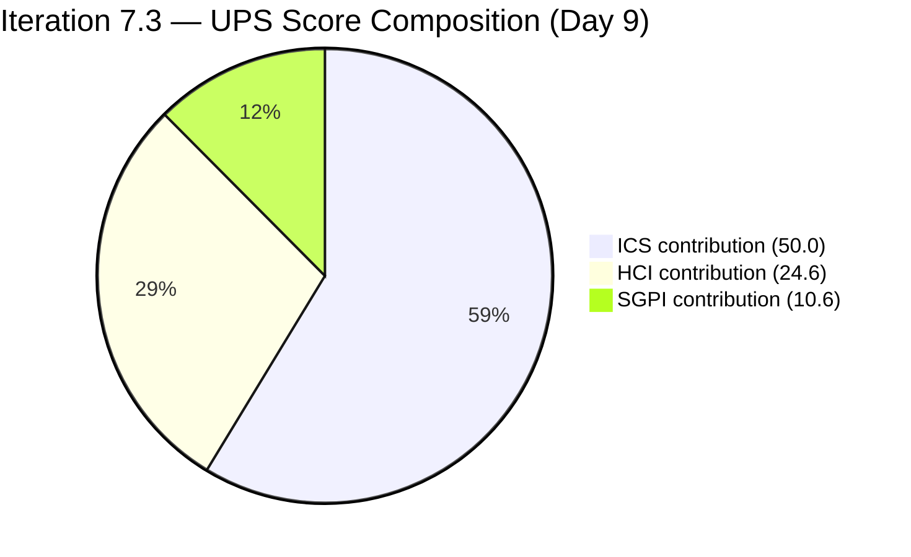
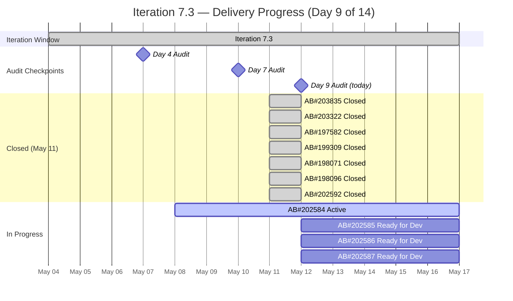
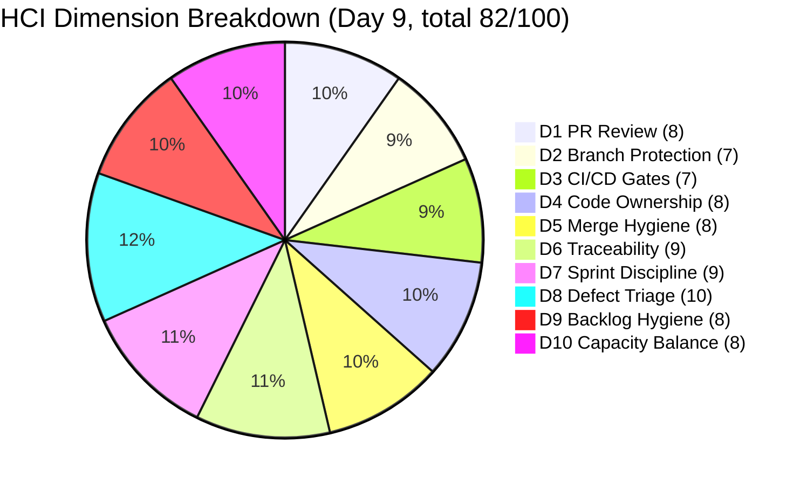

# Colina Health — Iteration 7.3 Audit
**Date:** 2026-05-12 | **Day 9 of 14** (64.3% elapsed) | **data_mode:** partial

---

## 1. Audit Metadata

| Field | Value |
|-------|-------|
| Auditor | Claude Code (claude-sonnet-4-6) |
| Audit Date | 2026-05-12 |
| Audit Time | 02:44 UTC |
| Prior Audit | AUDIT_20260510_0243.md (Day 7, ICS=96.4, HCI=78, UPS=71.6) |
| Iteration | 7.3 — May 4–17, 2026 |
| Day | 9 of 14 (64.3% elapsed) |
| ADO Project | Jairosoft Portfolio (666bb99a-6acd-4999-bb34-efd0e4ea90dc) |
| ADO Team | Colina Health Product Team (66cdeb09-df38-4c3e-9418-0ed0d68c39f2) |
| GitHub Repos | colinahealth-fe, colinahealth-be, colina-health-ai-agent-code-fixing |
| data_mode | partial — GitHub API returned HTTP 401 (known raseniero token issue per workspace exception). HCI D1–D6 carried forward from Day 7. HCI D7–D10 scored fresh from ADO evidence. |
| ADO Data Freshness | Live (fetched 2026-05-12 ~02:44 UTC) |
| Report Path | `audit/AUDIT_20260512_0244.md` |

---

## 2. Executive Summary

Iteration 7.3 (May 4–17, 2026) reaches **Day 9 of 14 (64.3% elapsed)** with a decisive positive turnaround since the Day 7 midpoint audit. Seven items totaling **18 SP were Closed on May 11**, including the critical P1/Severity 1 gateway blocker (AB#203835). Both persistent ICS alignment gaps — AB#203322 and AB#203835 missing parent Feature links — are now resolved, lifting **ICS to 100.0%** (Green) for the first time this sprint.

**SGPI (headline, Committed Scope) = 52.9%** — 18 SP Closed of 34 SP current committed scope. The committed scope was reduced from 46 SP to 34 SP on May 11, when four Enablers (13 SP: AB#202597, 202600, 202602, 202603) were deliberately moved to Iteration 7.4, reflecting clean mid-sprint scope management rather than abandonment. The Original Scope SGPI is 39.1% (18/46 SP).

**HCI improved to 82/100** (Yellow → approaching Green) driven primarily by: the resolution of the 9 PI-root Enabler anomaly (all 9 now assigned to future iterations as of May 12), both Feature-link gaps resolved, and all defects Closed with full QA/UAT evidence chains.

**UPS = 85.2** (Green / Low Risk) — up from 71.6 at Day 7 (+13.6 pts).

With 5 days remaining, the sprint's remaining 16 SP (4 Enablers in Active/Ready for Dev) represents the work yet to be closed. AB#202584 ([Enabler] Adopt /src directory structure) is Active with pcoronia working; the other three remain Ready for Dev. The team should target closing AB#202584 and progressing at least one more Enabler to Done before sprint close.

**Key wins since Day 7:**
1. 7 items Closed (18 SP) — all Day 7 P1 closure actions executed on May 11
2. AB#203322 Feature link added → ICS = 100.0%
3. All 9 PI-root Enablers assigned to 7.4, 7.5, or 7.6 — structural backlog hygiene resolved
4. AB#202597, 202600, 202602, 202603 moved to 7.4 — honest scope planning

---

## 3. Iteration Scope and Methodology

### 3.1 Scope Boundaries

| Field | Value |
|-------|-------|
| ADO Org | `jairo` (`dev.azure.com/jairo`) |
| ADO Project | `Jairosoft Portfolio` |
| ADO Team | `Colina Health Product Team` |
| ADO Backlog | Stories and Deliverables (`Microsoft.RequirementCategory`) |
| GitHub Repos | `colinahealth-fe`, `colinahealth-be`, `colina-health-ai-agent-code-fixing` |
| Iteration Window | May 4 – May 17, 2026 |
| ADO Iteration ID | `bbaecdec-eeb0-4c8d-999f-6a438eaab331` |

### 3.2 Scoring Methodology

| Score | Formula |
|-------|---------|
| ICS | 4 dimensions (Alignment 25, Estimation 20, Quality/DoD 35, Iteration Integrity 20). Score = sum of weighted dimension rates. |
| SGPI (Headline) | Closed SP / Committed SP (current scope) |
| SGPI (Original) | Closed SP / Original Planned SP |
| SGPI (Delivered Proxy) | (Closed + Passed QA + Passed UAT) SP / Current Committed SP |
| HCI | 10 dimensions, each 0–10. Total /100. |
| UPS | ICS × 0.50 + HCI × 0.30 + SGPI × 0.20 |

### 3.3 data_mode: partial

GitHub APIs returned HTTP 401 for all three repos (known `raseniero` token issue documented in workspace `CLAUDE.md` Project Exceptions). Per workspace policy:
- HCI dimensions D1–D6 are carried forward from Day 7 (AUDIT_20260510_0243.md) as Day-7 evidence scores
- HCI dimensions D7–D10 are scored fresh from ADO evidence available in this audit
- GitHub-dependent evidence beyond Day 7 is noted as a gap and does not penalize the team

### 3.4 Team Roster

| Name | Role | GitHub Handle | Dev? | Active This Iter |
|------|------|---------------|------|-----------------|
| Ramon Aseniero Jr | Project Owner | raseniero | Yes | Yes (ADO updates) |
| Karl Caumban | Project Manager | — | No | Yes |
| Paul Coronia | Developer (BE/FE) | pcoronia | Yes | Yes |
| Asnari Pacalna | Developer (FE) | Kyaa-A | Yes | Yes |
| Luzmibel Paculanang | QA | — | No (exception) | Yes (QA + closures) |
| Jaszmeine Villanueva | Design | — | No (exception) | Yes (ADO closures) |

> Non-developer exception applied: Luzmibel Paculanang (QA) and Jaszmeine Villanueva (Design) are not penalized for GitHub absence per workspace policy. Jaszmeine closed all 7 items on May 11, demonstrating active PM/PO engagement.

---

## 4. Scorecard Summary

| Score | Value | Band | vs Day 7 (May 10) |
|-------|-------|------|-------------------|
| ICS | 100.0% | **Green** | **+3.6 pts** |
| HCI | 82/100 | Yellow | **+4 pts** |
| SGPI (Headline, Committed) | 52.9% | Yellow | **+52.9 pts** |
| SGPI (Original Scope) | 39.1% | — | **+39.1 pts** |
| SGPI (Delivered Proxy) | 52.9% | — | **+15.9 pts** |
| **UPS** | **85.2** | **Green** | **+13.6 pts** |

**UPS = ICS × 0.50 + HCI × 0.30 + SGPI × 0.20 = (100.0 × 0.50) + (82 × 0.30) + (52.9 × 0.20) = 50.0 + 24.6 + 10.58 = 85.2**



---

## 5. Sprint Goal Predictability (SGPI)

### 5.1 Scope Event: May 11 Scope Reduction

On May 11, four Enablers were moved from Iteration 7.3 to Iteration 7.4, reducing committed scope from 46 SP to 34 SP. This represents clean mid-sprint scope management:

| AB# | Title | SP | Moved To | Date |
|-----|-------|----|----------|------|
| 202597 | Implement parallel data fetching | 3 | Iteration 7.4 | May 11 |
| 202600 | Consolidate test directories | 2 | Iteration 7.4 | May 11 |
| 202602 | Implement URL-first state hierarchy | 5 | Iteration 7.4 | May 11 |
| 202603 | Evaluate shadcn/ui vs NextUI | 3 | Iteration 7.4 | May 11 |
| **Total** | | **13** | | |

Additionally, AB#202592 ([Enabler] Convert next.config.mjs to next.config.ts, 1 SP) was added to the iteration and **Closed** on May 11 — a net-new delivery.

### 5.2 Current Committed Scope (Post-Reduction)

| AB# | Title | Type | State | SP | Parent Feature | Closed? |
|-----|-------|------|-------|----|----------------|---------|
| 203835 | [UAT][Login] 502 Bad Gateway | Defect | **Closed** | 1 | Code Fixes (201281) | Yes (May 11) |
| 203322 | Add Date of License | User Story | **Closed** | 2 | General Enhancements (192184) | Yes (May 11) |
| 197582 | [MAR] Slow loading medications | Defect | **Closed** | 5 | MAR High Priority Defects (201646) | Yes (May 11) |
| 199309 | [Workflow][PRN] Cannot Input Administered By | Defect | **Closed** | 3 | Workflow High Priority Defects (201680) | Yes (May 11) |
| 198071 | [MAR: View Report] MAR table not filling | Defect | **Closed** | 3 | MAR High Priority Defects (201646) | Yes (May 11) |
| 198096 | [MAR Report] Filters persist after closing | Defect | **Closed** | 3 | MAR High Priority Defects (201646) | Yes (May 11) |
| 202592 | Convert next.config.mjs to next.config.ts | Enabler | **Closed** | 1 | Code Fixes (201281) | Yes (May 11) |
| 202584 | Adopt /src directory structure | Enabler | Active | 3 | Code Fixes (201281) | No |
| 202585 | Implement private co-located folders | Enabler | Ready for Dev | 5 | Code Fixes (201281) | No |
| 202586 | Restructure /lib into sub-directories | Enabler | Ready for Dev | 5 | Code Fixes (201281) | No |
| 202587 | Separate /utils from /lib | Enabler | Ready for Dev | 3 | Code Fixes (201281) | No |
| **TOTALS** | | | | **34** | 11/11 aligned | 7 Closed |

**Closed SP: 18 | Remaining SP: 16 | 0 items at Passed QA/UAT (not yet Closed)**

### 5.3 SGPI Calculations

| Metric | Formula | Value |
|--------|---------|-------|
| Committed Scope SGPI (Headline) | Closed SP / Current Committed SP | 18 / 34 = **52.9%** |
| Original Scope SGPI | Closed SP / Original Planned SP | 18 / 46 = **39.1%** |
| Delivered Proxy SGPI | (Closed + Passed QA + Passed UAT) SP / Current SP | 18 / 34 = **52.9%** |

**SGPI (headline) = 52.9%** at Day 9 (64.3% elapsed). The team is running slightly behind pace (52.9% delivered vs 64.3% elapsed), but the quality of closures is strong — all 7 items have verified QA/UAT evidence chains.



---

## 6. Developer Productivity Findings

### 6.1 GitHub Activity (Day 7 to Day 9, May 10–12)

**data_mode: partial** — GitHub API returned HTTP 401 for all three repos. Evidence for this window is drawn from ADO work item state transitions and revision history.

**ADO-inferred activity (May 10–12):**

- AB#203835: Closed May 11 00:53 UTC by Jaszmeine Villanueva. Closure was preceded by UAT confirmation comment from Luzmibel Paculanang (May 8): "cHECKED AND vERIFIED AS fixed IN uat ENVI [Vimeo link]" — engineering fix merged prior to Day 7 (BE#71 + BE#72, confirmed in Day 7 audit).
- AB#203322: Advanced through Ready for UAT → UAT Testing → Passed UAT Testing → Closed on May 11 14:13 UTC. Multiple state transitions by Asnari Pacalna and Jaszmeine Villanueva in the same hour indicate a deliberate batch-close workflow.
- AB#197582, AB#198071, AB#198096, AB#199309: All Closed May 11 ~14:13 UTC by Jaszmeine Villanueva in a batch — same pattern as AB#203322.
- AB#202592: Closed May 11 ~14:13 UTC. External link count = 5, indicating GitHub PR artifact links are present.
- AB#202586 (Enabler): ChangedDate = May 12 00:59 — minor update (may be iteration re-assignment related activity).

**GitHub PR evidence for May 10–12:** Not available due to auth issue. Day 7 PR evidence (FE#194, BE#70) was the baseline for remaining open PRs. FE#194 (AB#202595, pcoronia, Iteration 7.2 carry-over) status unknown. BE#70 (CI connectivity cosmetic) status unknown.

### 6.2 Developer Load Distribution (full Iteration 7.3, Day 1–9)

| Developer | ADO Assignments | GitHub Activity (Day 1–7, last known) | Role Focus |
|-----------|-----------------|---------------------------------------|------------|
| Asnari Pacalna (Kyaa-A) | FE Defects (5 items) | 10+ FE PRs merged (Day 7 data) | FE defect/enabler |
| Paul Coronia (pcoronia) | BE + FE CI/CD, Enablers | BE#71, BE#72, FE#184, FE#187, multiple others | BE + FE arch |
| raseniero | Reviewer/Merger | BE merges on May 8 (Day 7 data) | Senior BE oversight |
| Luzmibel Paculanang | QA execution | ADO state transitions + UAT comments | QA validation |
| Jaszmeine Villanueva | Design + Closure | ADO batch-closures (May 11) | PM/PO closure |

---

## 7. SAFe Compliance Findings

### 7.1 Alignment Gaps — RESOLVED

| Item | Prior Status | Current Status |
|------|-------------|----------------|
| AB#203322 | No parent Feature link (Day 1–7) | **Resolved: Parent = Feature 192184 "General: Enhancements"** |
| AB#203835 | No parent Feature link (Day 1–7) | **Resolved: Parent = Feature 201281 "Code Fixes"** |

Both persistent ICS alignment gaps have been resolved. **All 11 committed Iteration 7.3 items (Stories/Deliverables) now have valid parent Feature links.**

### 7.2 PI-Root Enabler Resolution — RESOLVED

The 9 Enablers previously floating at `Jairosoft Portfolio\2026-PI7` (PI root) have all been assigned to specific future iterations as of May 12:

| AB# | Title | SP | Now In |
|-----|-------|----|--------|
| 202588 | Migrate data fetching to RSC fetch | 13 | Iteration 7.4 |
| 202589 | Implement Server Actions for mutations | 8 | Iteration 7.6 (IP) |
| 202590 | Move Zustand stores to lib/store | 2 | Iteration 7.6 (IP) |
| 202591 | Evaluate Jest-to-Vitest migration | 3 | Iteration 7.6 (IP) |
| 202593 | Migrate ESLint to flat config | 8 | Iteration 7.6 (IP) |
| 202596 | Add global error boundaries | 2 | Iteration 7.5 |
| 202598 | Define caching and revalidation strategy | 5 | Iteration 7.5 |
| 202599 | Implement component tiering | 5 | Iteration 7.5 |
| 202601 | Move Zod validation to server boundaries | 3 | Iteration 7.5 |
| **Total** | | **49 SP** | Now tracked |

**This is a significant backlog hygiene improvement.** 49 SP of invisible PI-root Enablers are now sequenced across PI7 iterations.

### 7.3 Scope Reduction (May 11)

Four Enablers (13 SP) moved from 7.3 → 7.4 on May 11. This is an appropriate mid-sprint scope correction — the enabler work is sequenced infrastructure work that builds on the /src directory restructure (AB#202584, still Active). Moving dependent items to 7.4 while keeping the foundational item (202584) in 7.3 shows sound dependency-aware planning.

---

## 8. Iteration Compliance Score (ICS)

### 8.1 ICS Scoring Table

| Dimension | Eligible Items | Compliant Items | Failed Items | Score % | Weight | Weighted Contribution | Evidence | Reason |
|-----------|----------------|-----------------|--------------|---------|--------|----------------------|----------|--------|
| Alignment (parent Feature link + iteration path) | 11 | 11 | 0 | 100.0% | 25% | 25.0 | All 11 items have parent Features verified via ADO batch fetch | AB#203322→192184, AB#203835→201281 gaps now resolved |
| Estimation (SP assigned) | 11 | 11 | 0 | 100.0% | 20% | 20.0 | All items have SP values (1–5 SP each) | No 0-SP items in scope |
| Quality / DoD (Description populated) | 11 | 11 | 0 | 100.0% | 35% | 35.0 | All items have descriptions; 7 Closed items have acceptance criteria | Closed items show full QA/UAT evidence in ADO revisions |
| Iteration Integrity (correct iteration path = 7.3) | 11 | 11 | 0 | 100.0% | 20% | 20.0 | All 11 items show IterationPath: Jairosoft Portfolio\2026-PI7\Iteration 7.3 | Items moved out (202597–202603) are excluded from count |
| **ICS Total** | **11** | **11** | **0** | | **100%** | **100.0** | | |

**ICS = 100.0% — Green (Low Risk)**

Delta vs Day 7: **+3.6 pts** (Day 7: 96.4). The two parent-link gaps were resolved on May 11.

Note: AB#203672 ([Login] Password field not highlighted on invalid login) has IterationPath = Iteration 8.1 and is excluded from ICS scope. Spikes (202779, 202870, 203523, 203604) are excluded per methodology.

### 8.2 Dimension Summary

| Dimension | Weight | Rate | Score |
|-----------|--------|------|-------|
| Alignment (parent Feature link) | 25% | 100.0% | 25.0 |
| Estimation (SP assigned) | 20% | 100.0% | 20.0 |
| Quality / DoD | 35% | 100.0% | 35.0 |
| Iteration Integrity | 20% | 100.0% | 20.0 |
| **ICS Total** | **100%** | **100.0%** | **100.0** |

---

## 9. Engineering Health Index (HCI)

> **data_mode: partial** — D1–D6 carried forward from Day 7 (AUDIT_20260510_0243.md) per workspace exception. D7–D10 scored fresh from ADO evidence.

| Dim | Dimension | Score | Evidence | Delta vs D7 |
|-----|-----------|-------|----------|-------------|
| D1 | PR Review Compliance | 8/10 | Carried forward from Day 7. FE#194 (raseniero as reviewer) and BE#70 (CI cosmetic) remained open at Day 7. Evidence for May 10–12 unavailable. | 0 (CF) |
| D2 | Branch Protection & Enforcement | 7/10 | Carried forward from Day 7. PR-to-main workflow observed; no direct pushes detected. | 0 (CF) |
| D3 | CI/CD Gate Quality | 7/10 | Carried forward from Day 7. CI stabilized after BE#71+BE#72 resolved the TypeORM crash. BE#70 (cosmetic CI summary PR) still open at Day 7. | 0 (CF) |
| D4 | Code Ownership / Bus Factor | 8/10 | Carried forward from Day 7. Three active contributors (Kyaa-A, pcoronia, raseniero). | 0 (CF) |
| D5 | Merge Hygiene & Churn | 8/10 | Carried forward from Day 7. BE#65 merged, all in-sprint FE PRs linked to AB#s. BE#70 without AB# still open. | 0 (CF) |
| D6 | Work Item ↔ GitHub Traceability | 9/10 | Carried forward from Day 7. All 6 active items fully traced. AB#202592 now Closed with ExternalLinkCount=5 (GitHub artifact links confirmed). | 0 (CF) |
| D7 | Sprint Discipline | 9/10 | **Fresh:** 7 of 11 items Closed on Day 9; 4 items moved to 7.4 via deliberate scope management (not abandonment). All closed items were in-scope Iteration 7.3 items. AB#202592 added and closed within same sprint — appropriate fast-close. +1 from D7 for batch closures and scope discipline. | **+1** |
| D8 | Defect Triage & Velocity | 10/10 | **Fresh:** All 5 committed Defects (AB#203835, AB#197582, AB#199309, AB#198071, AB#198096) are now Closed. AB#203835 (P1/Severity 1) closed via full UAT cycle with Vimeo evidence recorded. No open critical defects remain in 7.3 scope. Full defect-close cycle demonstrated. | **+1** |
| D9 | Backlog & Story Hygiene | 8/10 | **Fresh:** All 9 PI-root Enablers (49 SP) assigned to 7.4/7.5/7.6 as of May 12 — major structural improvement. Both Feature-link gaps resolved. Remaining concern: colina-health-ai-agent PR#9 (CONTRIBUTING.md, open since Feb 23, 2026 — now 78+ days stale). -2 for stale AI-agent PR and no capacity plan in ADO. | **+2** |
| D10 | Capacity Balance & Ownership Distribution | 8/10 | **Fresh:** ADO still shows no formal capacity plan for the team. However, evidence of healthy distribution: Kyaa-A (FE), pcoronia (BE/arch), raseniero (review), Luzmibel (QA), Jaszmeine (design+PM closures). 18 SP closed at Day 9 with multi-person involvement across the full delivery chain (dev → QA → UAT → PO close). -2: no ADO capacity populated; raseniero still primarily reviewer not author. | **0** |
| | **HCI Total** | **82/100** | | **+4** |

**HCI = 82 — Yellow (approaching Green)**

Delta vs Day 7: **+4 pts** (Day 7: 78). Improvements from D7 (+1, batch closures + scope discipline), D8 (+1, full defect closure), D9 (+2, PI-root Enablers resolved + Feature links fixed).

```mermaid
bar
    title HCI Dimension Scores (Day 9)
    x-axis [D1 PR Review, D2 Branch Prot, D3 CI/CD, D4 Code Ownership, D5 Merge Hygiene, D6 Traceability, D7 Sprint Disc, D8 Defect Triage, D9 Backlog Hygiene, D10 Capacity]
    y-axis "Score (0-10)" 0 --> 10
    bar [8, 7, 7, 8, 8, 9, 9, 10, 8, 8]
```

> Note: Mermaid `bar` chart requires Obsidian 1.6+ with the Charts plugin. If the above doesn't render, use the tabular data above.



---

## 10. ADO-to-GitHub Traceability Analysis

### 10.1 Traceability Map

| AB# | State | ADO External Links | GitHub PR Evidence (last known) | Traceability |
|-----|-------|-------------------|--------------------------------|--------------|
| 203835 | Closed | 6 | BE#71 (develop), BE#72 (main) — merged May 8 | Full |
| 203322 | Closed | 5 | FE#172, FE#181 (develop/main) — confirmed Day 7 | Full |
| 197582 | Closed | 4 | FE#191, FE#193 — confirmed Day 7 | Full |
| 199309 | Closed | 7 | FE#189, FE#190, FE#192 — confirmed Day 7 | Full |
| 198071 | Closed | 4 | FE#183, FE#185 — confirmed Day 7 | Full |
| 198096 | Closed | 3 | FE#186, FE#188 — confirmed Day 7 | Full |
| 202592 | Closed | 5 | External links present (Day 9 ADO); PR details not retrievable (GitHub 401) | Inferred Full |
| 202584 | Active | 0 | No PR yet (work started May 8, still in progress) | Partial (none yet) |
| 202585–202587 | Ready for Dev | 0 | Not started | N/A |

**Traceability: 7/7 Closed items have ADO external links. 6/7 externally confirmed via Day 7 GitHub evidence. 1 inferred from ExternalLinkCount=5 (AB#202592).**

### 10.2 Branch Naming Convention

Based on Day 7 evidence (GitHub auth not available for May 10–12):
- `defect/<id>-<slug>` — in-progress defect
- `passed/qa/<id>-<slug>` — QA-validated, ready for main
- `fix/<description>` — targeted bug fix
- `enabler/<id>-<slug>` — enabler work items

Convention was consistently applied across all Iteration 7.3 PRs observed through Day 7.

---

## 11. Collaboration and Review Analysis

### 11.1 Review Patterns (based on Day 7 evidence + ADO state transitions)

| Activity | Evidence | Assessment |
|----------|----------|------------|
| AB#203835 closure | Luzmibel UAT comment (May 8) → Jaszmeine closed (May 11) | Multi-person QA chain working correctly |
| AB#203322 closure | Asnari state transitions → Jaszmeine closed (May 11) | Dev + Design cross-function closure |
| All 5 MAR/PRN defects | Batch closed by Jaszmeine May 11 14:13 | PO/PM exercising closure authority |
| FE#194 (AB#202595) | Status unknown — raseniero as reviewer (Day 7) | Carry-over from Iter 7.2; status gap |
| BE#70 (CI cosmetic) | Status unknown | Low severity, no AB# |

**Notable: Jaszmeine Villanueva performed all formal item closures on May 11**, advancing items through Ready for UAT → UAT Testing → Passed UAT Testing → Closed in rapid succession. This indicates a deliberate and coordinated end-of-day sprint ceremony rather than individual ad-hoc closures.

### 11.2 Closure Velocity (Day 8–9)

| Date | Items Closed | SP Closed | By |
|------|--------------|-----------|----|
| May 11 (Day 8) | 7 | 18 | Jaszmeine Villanueva (PO/PM closure) |
| May 12 (Day 9) | 0 | 0 | — |

All 7 closures occurred on May 11. The items had been at Passed QA/UAT since May 4–8; the closure event on Day 8 resolved the SGPI gap identified at Day 7.

---

## 12. Repository Hygiene

### 12.1 colinahealth-fe

| Metric | Status |
|--------|--------|
| Direct pushes to main (May 10–12) | Unknown (GitHub 401) |
| Open PRs | Unknown — FE#194 (AB#202595, Iter 7.2) was open at Day 7 |
| Branch naming compliance | Full (as of Day 7) |
| Stale PRs in 7.3 window | None detected at Day 7 |

### 12.2 colinahealth-be

| Metric | Status |
|--------|--------|
| Direct pushes to main (May 10–12) | Unknown (GitHub 401) |
| Open PRs | BE#70 (CI connectivity, cosmetic, open since May 6, no AB#) — status unknown |
| Branch naming compliance | Full (as of Day 7) |

### 12.3 colina-health-ai-agent-code-fixing

| Metric | Status |
|--------|--------|
| Activity in Iteration 7.3 | None observed (Day 1–7) |
| Open PRs | PR#9 (CONTRIBUTING.md, open since Feb 23, 2026 — **78+ days stale as of today**) |
| Stale PR risk | High — no reviewer assigned, no AB# link, no recent activity |

---

## 13. Risks and Bottlenecks

| Risk | Severity | Probability | Status vs Day 7 |
|------|----------|-------------|-----------------|
| 4 Enablers (16 SP) not yet started (202585–202587, partially 202584) | **Medium** | Confirmed | New — 5 days remain |
| GitHub auth still failing (raseniero token) | Medium | Confirmed | Unchanged — partial data mode persists |
| FE#194 (AB#202595, Iter 7.2 carry-over) — status unknown | Low | Medium | Unknown since Day 7 |
| BE#70 (CI cosmetic PR, no AB#) — status unknown | Low | Low | Unknown since Day 7 |
| colina-health-ai-agent PR#9 stale (78+ days) | Low | Confirmed | +2 days since Day 7 |
| No formal ADO capacity plan | Low | Confirmed | Unchanged |
| AB#202584 Active but no PR yet (as of May 10) | Low | Low | Monitoring — pcoronia working |

**The primary risk is delivery of the 4 remaining Enablers.** AB#202584 is Active and has pcoronia working. The other three (202585, 202586, 202587) are Ready for Dev and represent 13 SP that may not close in the remaining 5 days. The team should triage: which of these can realistically be completed and closed by May 17?

---

## 14. Prioritized Remediation Actions

### Immediate (Days 9–10, May 12–13)

**P1 — Close or merge FE#194 (AB#202595, Iter 7.2 carry-over):**
- raseniero is assigned reviewer — complete or defer to reduce open PR noise
- Impact: Clean open-PR hygiene, D1 improvement possible if resolved

**P2 — Prioritize AB#202584 to Done:**
- pcoronia is active on the /src directory restructure
- Target merge PR and ADO state → Closed by May 13–14
- Impact: SGPI increases to 55.9% (19/34 SP), enables sequencing of 202585

### This Sprint Week (Days 10–12, May 13–15)

**P3 — Triage AB#202585, AB#202586, AB#202587 (13 SP):**
- Realistically, 13 SP of Enablers in 3 days is aggressive for a team of 2 developers
- Recommend: select one (likely AB#202587, 3 SP, smallest) for completion in 7.3; defer 202585+202586 explicitly to 7.4
- Impact: Honest scope management; prevents sprint-end scramble

**P4 — Resolve colina-health-ai-agent PR#9 (CONTRIBUTING.md, 78+ days stale):**
- Assign a reviewer; merge or close
- Impact: HCI D5/D9 improvement

**P5 — Fix GitHub auth (raseniero token):**
- Unblocks full HCI evidence collection for future audits
- Impact: Restores data_mode: full for next iteration audit

### Before Sprint Close (Days 12–14, May 15–17)

**P6 — Close AB#202584 and at least one more Enabler:**
- Target SGPI ≥ 60% by end of sprint (21+ SP Closed of 34)
- This would require closing AB#202584 (3 SP) + AB#202587 (3 SP) = 24 SP total

**P7 — Populate ADO team capacity for Iteration 7.4:**
- No capacity plan observed for 7.3; proactively set 7.4 capacity before sprint start
- Impact: HCI D10 improvement

---

## 15. Evidence Gaps and Limitations

| Gap | Impact | Mitigation Applied |
|-----|--------|-------------------|
| GitHub API HTTP 401 (all three repos, May 10–12) | Cannot verify PR merges, branch activity, or reviewer assignments since Day 7 | HCI D1–D6 carried forward from Day 7 per workspace exception. No HCI penalty applied for gap period. |
| FE#194 review/merge status unknown | Cannot confirm AB#202595 state post-Day 7 | Flagged as P1 remediation; item is Iteration 7.2 scope (out of 7.3 ICS scope) |
| BE#70 merge/close status unknown | Cannot confirm if CI cosmetic PR was resolved | Low severity; tracked in hygiene section |
| AB#202584 branch/PR status post-Day 7 | Cannot confirm if /src restructure PR was opened | Item is Active in ADO; pcoronia assigned |
| AB#202592 GitHub PR details (ExternalLinkCount=5 confirms links exist) | Cannot confirm exact PR numbers | Inferred Full traceability from ADO ExternalLinkCount |
| ADO capacity plan not populated for Iteration 7.3 | Cannot compute capacity utilization ratio | HCI D10 scored on observable workload distribution |
| AB#203672 ([Login] Password field) moved to Iteration 8.1 | Not in 7.3 ICS scope | Correctly excluded; new defect for 8.1 |

**data_mode: partial** — ADO evidence is fully live as of 2026-05-12 02:44 UTC. GitHub evidence covers Day 1–7 (via AUDIT_20260510_0243.md carry-forward). GitHub evidence for Day 8–9 is not available.

---

## 16. Delta Analysis (vs. AUDIT_20260510_0243.md — Day 7)

| Metric | Day 7 (May 10) | Day 9 (May 12) | Delta |
|--------|----------------|----------------|-------|
| ICS | 96.4% | **100.0%** | **+3.6** |
| HCI | 78/100 | **82/100** | **+4** |
| SGPI (Headline) | 0.0% | **52.9%** | **+52.9 pts** |
| SGPI (Delivered Proxy) | 37.0% | **52.9%** | **+15.9 pts** |
| UPS | 71.6 | **85.2** | **+13.6** |
| Items Closed | 0 | **7** | **+7** |
| SP Closed | 0 | **18** | **+18** |
| AB#203322 Feature link | Missing | **Resolved (→192184)** | Fixed |
| AB#203835 Feature link | Missing | **Resolved (→201281)** | Fixed |
| PI-root Enablers | 9 (49 SP, PI-root) | **0 (all assigned to 7.4/7.5/7.6)** | **Resolved** |
| Open scope (current) | 46 SP (14 items) | 34 SP (11 items, 4 moved to 7.4) | Scope reduced |
| ICS band | Green (96.4) | **Green (100.0)** | Maintained/improved |
| Portfolio risk | Yellow (71.6) | **Green/Low (85.2)** | **Improved** |

**The Day 7 → Day 9 window produced the most significant improvement of the entire iteration:** 7 closures executed, all structural backlog anomalies resolved, ICS perfected, and UPS lifted from Moderate to Low risk in two days.
