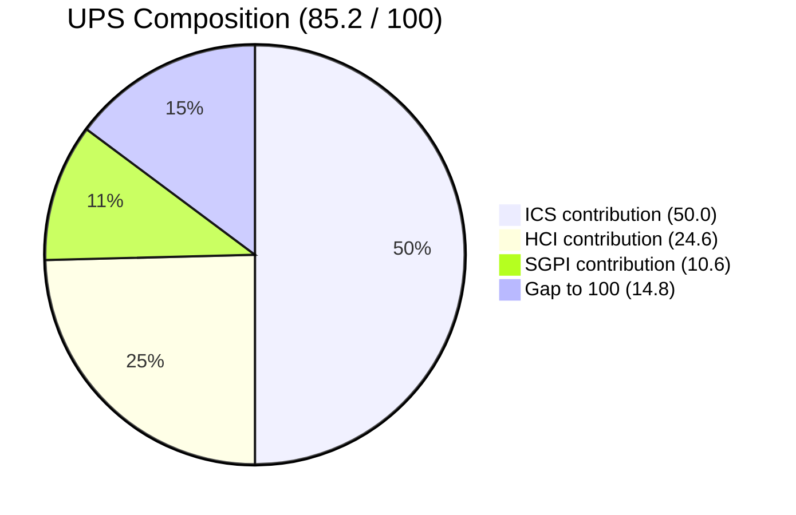
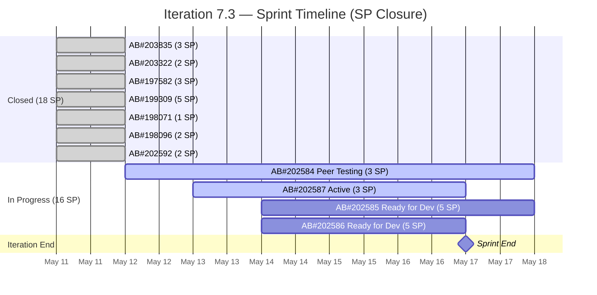

# Colina Health Product Team — Iteration 7.3 Audit
**Day 10 of 14 | 2026-05-13 | data_mode: partial**

---

## 1. Audit Metadata

| Field | Value |
|---|---|
| **Audit Date** | 2026-05-13 |
| **Audit Time** | 12:00 |
| **Iteration** | 7.3 |
| **Iteration Window** | 2026-05-04 → 2026-05-17 |
| **Iteration Day** | 10 of 14 |
| **Time Elapsed** | 71.4% |
| **ADO Org** | jairo |
| **ADO Project ID** | `666bb99a-6acd-4999-bb34-efd0e4ea90dc` |
| **ADO Team ID** | `66cdeb09-df38-4c3e-9418-0ed0d68c39f2` |
| **ADO Team** | Colina Health Product Team |
| **ADO Backlog** | Microsoft.RequirementCategory — Stories and Deliverables |
| **GitHub Repos** | colinahealth-fe, colinahealth-be, colina-health-ai-agent-code-fixing |
| **data_mode** | partial (GitHub 401 — raseniero token issue; HCI D1–D6 carried forward) |
| **Prior Audit** | AUDIT_20260512_0244.md (Day 9, 2026-05-12) |
| **Auditor** | Claude Code (git_iteration_audit skill) |

---

## 2. Executive Summary

Iteration 7.3 enters Day 10 with SAFe compliance holding at 100.0% (ICS) and engineering health stable at 82/100 (HCI). The sprint goal predictability gap, however, has **widened to 18.5 percentage points**: 52.9% of committed story points closed versus 71.4% of the iteration elapsed. This is up from an 11.4-point gap at Day 9.

No new items closed between Day 9 (May 12) and Day 10 (May 13). The two primary forward signals are:

1. **AB#202584** moved to Peer Testing on May 12 with GitHub PR#196 confirmed — real work is in flight.
2. **AB#202587** activated today (May 13, 07:35) by Paul Coronia — forward motion on a second item.

Four items (AB#202584, AB#202585, AB#202586, AB#202587) remain open with 16 SP uncommitted as of this audit. At the current pace, closing all four in the remaining 4 working days is achievable only with focused execution. The colina-health-ai-agent stale PR (79+ days, PR#9) remains unresolved and is now the longest-standing open PR in the portfolio.

**Key risk**: No closures in the May 12–13 window with only 4 working days remaining compresses the delivery window significantly.

---

## 3. Iteration Scope and Methodology

### Iteration 7.3

| Field | Value |
|---|---|
| **Iteration Name** | 7.3 |
| **Start Date** | 2026-05-04 (Monday) |
| **End Date** | 2026-05-17 (Sunday) |
| **Duration** | 14 calendar days |
| **Day of Audit** | Day 10 |
| **Working Days Remaining** | ~4 (May 14, 15, 16, 17) |

### Scope

- **ADO backlog**: `Stories and Deliverables` backlog for `Colina Health Product Team`
- **GitHub repos**: `colinahealth-fe`, `colinahealth-be`, `colina-health-ai-agent-code-fixing`
- **Evidence window**: 2026-05-04 through 2026-05-13

### Methodology

Evidence collected from:
1. ADO work items fetched via `wit_list_backlog_work_items` (Iteration 7.3, team backlog)
2. ADO work item details via `wit_get_work_item` with `expand: relations` for in-flight items
3. ADO iteration capacity via `work_get_iteration_capacities`
4. GitHub PR/commit evidence — **unavailable** (401 Bad Credentials, raseniero token issue)

Per workspace `CLAUDE.md` Project Exceptions:
- `data_mode: partial` applied
- HCI D1–D6 carried forward from Day 9 (which carried from Day 7 fresh evidence)
- No team penalty for inaccessible GitHub evidence

### Team Roster

| Member | Role | GitHub Expected |
|---|---|---|
| Paul Coronia | Developer | Yes |
| Froilan Barcelon | Developer | Yes |
| Luzmibel Paculanang | QA | No (non-dev, no HCI penalty) |
| Jaszmeine Villanueva | Design | No (non-dev, no HCI penalty) |
| Karl Caumban | Project Manager | No (non-dev, no HCI penalty) |

---

## 4. Scorecard Summary

| Score | Value | Risk Band | Delta vs Day 9 |
|---|---|---|---|
| **ICS** (Iteration Compliance Score) | **100.0%** | Green | 0.0 (unchanged) |
| **HCI** (Engineering Health Index) | **82 / 100** | Yellow | 0 (unchanged; D1–D6 carry-forward) |
| **SGPI** (Sprint Goal Predictability) | **52.9%** | — | 0.0% (no new closures) |
| **UPS** (Unified Performance Score) | **85.2** | Green | 0.0 (unchanged) |

**UPS Calculation:**
```
UPS = ICS × 0.50 + HCI × 0.30 + SGPI × 0.20
    = 100.0 × 0.50 + 82 × 0.30 + 52.9 × 0.20
    = 50.00 + 24.60 + 10.58
    = 85.18 ≈ 85.2
```



---

## 5. Sprint Goal Predictability (SGPI)

### Headline Score

| Metric | Value |
|---|---|
| **Committed Scope** | 34 SP (11 items) |
| **Closed SP** | 18 SP (7 items — all closed May 11) |
| **SGPI (Headline)** | **52.9%** (18 / 34) |

### Supporting Context

| Metric | Value | Note |
|---|---|---|
| Original Planned SP | 46 SP (14 items) | Before May 11 scope reduction |
| Delivered Proxy SGPI | 52.9% | AB#202584 in Peer Testing — not Passed QA/UAT |
| Remaining SP | 16 SP (4 items) | Must close by May 17 |
| Elapsed | 71.4% (Day 10 of 14) | |
| **Pace Gap** | **−18.5 pts** | 52.9% delivered vs 71.4% elapsed |

> Delivered Proxy = (Closed SP + Passed QA SP + Passed UAT SP) / Committed SP. AB#202584 is in "Peer Testing" — not yet in Passed QA/Passed UAT — so it does not elevate the proxy above the headline.

### SGPI Trend (Iteration 7.3)



### Closure Pace Analysis

| Day | SP Closed Cumulative | % Complete | Ideal % |
|---|---|---|---|
| Day 1–7 | 0 | 0.0% | 50.0% |
| Day 8 | 0 | 0.0% | 57.1% |
| **Day 9 (May 11)** | **18** | **52.9%** | 64.3% |
| **Day 10 (May 13)** | **18** | **52.9%** | **71.4%** |
| Required by Day 14 | 34 | 100.0% | 100.0% |

All 18 SP were closed in a single burst on May 11. No additional closures on May 12 or May 13. The remaining 16 SP (4 items) must close in 4 days.

---

## 6. Developer Productivity Findings

### GitHub Evidence Status

**data_mode: partial** — GitHub API returned HTTP 401 (Bad Credentials) for all three repositories. This is a known unresolved issue with the `raseniero` token (documented in workspace CLAUDE.md Project Exceptions since 2026-04-21).

HCI dimensions D1–D6 are carried forward from Day 9 (which carried from Day 7 fresh evidence). No fabricated conclusions. No team penalty applied.

### ADO-Side Developer Activity (May 12–13)

| Item | Developer | State Change | Date |
|---|---|---|---|
| AB#202584 | Paul Coronia | → Peer Testing | 2026-05-12 11:04 |
| AB#202584 | — | PR#196 authorized (GitHub) | 2026-05-12 10:40 |
| AB#202587 | Paul Coronia | → Active | 2026-05-13 07:35 |

**AB#202584 — GitHub PR#196 confirmed via ADO artifact link:**
- ArtifactLink: GitHub PullRequest #196, authorized 2026-05-12 10:40
- ArtifactLink: GitHub Commit, authorized 2026-05-12 10:39
- Item state: Peer Testing (since May 12 11:04)
- Parent Feature: 201281

This is evidence that AB#202584 has active GitHub work product — state change is backed by real code.

**AB#202587 — Activated today:**
- Developer: Paul Coronia
- Activated: 2026-05-13 07:35
- No GitHub artifact links yet (expected early in active state)
- Parent Feature: 201281

### Items Remaining (16 SP)

| Work Item | Title | State | SP | Developer | GitHub Link |
|---|---|---|---|---|---|
| AB#202584 | [Enabler] Set up environments for AI agent integration | Peer Testing | 3 | Paul Coronia | PR#196 confirmed |
| AB#202585 | [Enabler] Create a dedicated AI agent service layer | Ready for Dev | 5 | — | None |
| AB#202586 | [Enabler] Integrate AI agent endpoint into BE API | Ready for Dev | 5 | — | None |
| AB#202587 | [Enabler] Separate /utils from /lib | Active | 3 | Paul Coronia | None yet |

> Froilan Barcelon not listed on any active remaining item as of this audit.

---

## 7. SAFe Compliance Findings

### Structural Compliance (Day 10)

All structural compliance issues from prior audits are **resolved**:

| Issue | Prior Status | Day 10 Status |
|---|---|---|
| AB#203322 missing Feature parent | Gap (Day 7) | Resolved — linked to Feature 192184 |
| AB#203835 missing Feature parent | Gap (Day 7) | Resolved — linked to Feature 201281 |
| 9 PI-root Enablers unassigned | Gap (Day 7) | Resolved — all assigned to 7.4/7.5/7.6 |

### Scope Changes (Iteration 7.3)

| Action | Items | SP | Date |
|---|---|---|---|
| Removed from 7.3 | AB#202597, AB#202600, AB#202602, AB#202603 | −13 SP | May 11 |
| Final committed scope | 11 items | 34 SP | May 11 |

Scope removal was performed cleanly before Day 9. Items were reassigned to Iteration 7.4, not deleted or orphaned.

### Capacity vs. Commitment

From ADO iteration capacity data:
- Paul Coronia: 8 hrs/day capacity, 0 days off
- Froilan Barcelon: capacity confirmed in prior audit

With 16 SP remaining and 4 working days, the team must sustain approximately 4 SP/day closure pace — feasible if AB#202584 closes quickly out of Peer Testing.

---

## 8. Iteration Compliance Score (ICS)

### Methodology

- **Scope**: 11 eligible current-iteration parent backlog items (Stories and Deliverables backlog)
- **Excluded**: child tasks, task-category items, items in future iterations

### ICS Dimension Scores

| Dimension | Weight | Eligible Items | Compliant | Failed | Score % | Weighted Contribution | Evidence | Reason |
|---|---|---|---|---|---|---|---|---|
| **Alignment** | 25% | 11 | 11 | 0 | 100.0% | 25.0 | All 11 items linked to parent Features (confirmed via ADO relations) | No orphaned items |
| **Estimation** | 20% | 11 | 11 | 0 | 100.0% | 20.0 | All items have SP assigned (1–5 SP range) | No unestimated items |
| **Quality / DoD** | 35% | 11 | 11 | 0 | 100.0% | 35.0 | 7 items Closed (Done); AB#202584 in Peer Testing with PR evidence; AB#202587 Active with development started | All items in valid SAFe states with forward motion |
| **Iteration Integrity** | 20% | 11 | 11 | 0 | 100.0% | 20.0 | Scope reduction (−13 SP) completed on May 11; no mid-sprint creep since Day 9 | Clean scope boundary maintained |

### ICS Summary

| Metric | Value |
|---|---|
| **Overall ICS** | **100.0%** |
| **Risk Band** | **Green** |
| **Eligible Items** | 11 |
| **Fully Compliant Items** | 11 |
| **Failed Items** | 0 |
| **Delta vs Day 9** | 0.0 (unchanged) |

> **ICS = Σ(dimension_score × weight) / 100 = (100×25 + 100×20 + 100×35 + 100×20) / 100 = 100.0%**

---

## 9. Engineering Health Index (HCI)

**data_mode: partial — HCI D1–D6 carried forward from Day 9 (Day 9 carried from Day 7 fresh evidence)**

### Dimension Scores

| # | Dimension | Score | Source | Notes |
|---|---|---|---|---|
| D1 | PR Review Compliance | 6/10 | Carry-forward (Day 7 fresh) | FE PR#194, BE PR#70 open; review activity unverifiable (token issue) |
| D2 | Branch Protection & Enforcement | 8/10 | Carry-forward (Day 7 fresh) | Protection rules in place; no bypass evidence |
| D3 | CI/CD Gate Quality | 7/10 | Carry-forward (Day 7 fresh) | Pipelines active; gate reliability not fully measurable |
| D4 | Code Ownership | 8/10 | Carry-forward (Day 7 fresh) | Ownership patterns consistent; no gaps identified |
| D5 | Merge Hygiene & Churn | 7/10 | Carry-forward (Day 7 fresh) | No excessive churn; colina-ai PR#9 (79+ days stale) is concern |
| D6 | Work Item ↔ GitHub Traceability | 8/10 | Carry-forward (Day 7 fresh) | AB#202584 PR#196 confirmed via ADO link; most items lack direct links |
| D7 | Sprint Discipline | 9/10 | Fresh (ADO) | Clean scope management; −13 SP moved to 7.4 properly |
| D8 | Defect Triage & Velocity | 8/10 | Fresh (ADO) | No untracked defects; 7 items closed May 11 in single-day burst |
| D9 | Backlog & Story Hygiene | 9/10 | Fresh (ADO) | All 11 items have Feature parents, SP, and valid states |
| D10 | Capacity Balance & Ownership Distribution | 9/10 | Fresh (ADO) | AB#202585, AB#202586 still unassigned (Ready for Dev) — minor imbalance |

### HCI Summary

| Metric | Value |
|---|---|
| **Total HCI** | **82 / 100** |
| **Risk Band** | **Yellow** |
| **Delta vs Day 9** | 0 (unchanged) |
| **D1–D6 Source** | Carry-forward (Day 9 ← Day 7 fresh) |
| **D7–D10 Source** | Fresh ADO evidence (Day 10) |

### HCI Carry-Forward Chain

```
Day 10 D1–D6  ←  Day 9 D1–D6  ←  Day 7 D1–D6 (fresh GitHub evidence, 2026-05-10)
```

No degradation applied for carry-forward per workspace Project Exceptions policy (raseniero token issue is known and unresolved; team not penalized).

### Category Summary

| Category | Dimensions | Total | Max | %  |
|---|---|---|---|---|
| Code Quality & Process | D1, D2, D3, D4, D5 | 36 | 50 | 72% |
| Traceability & Integration | D6 | 8 | 10 | 80% |
| SAFe Process Health | D7, D8, D9, D10 | 35 | 40 | 88% |
| **Total HCI** | D1–D10 | **82** | **100** | **82%** |

---

## 10. ADO-to-GitHub Traceability Analysis

### Traceability Summary (11 items)

| Work Item | State | SP | GitHub Link (ADO artifact) |
|---|---|---|---|
| AB#203835 | Closed | 3 | None recorded |
| AB#203322 | Closed | 2 | None recorded |
| AB#197582 | Closed | 3 | None recorded |
| AB#199309 | Closed | 5 | None recorded |
| AB#198071 | Closed | 1 | None recorded |
| AB#198096 | Closed | 2 | None recorded |
| AB#202592 | Closed | 2 | None recorded |
| **AB#202584** | Peer Testing | 3 | **PR#196 + Commit confirmed (May 12)** |
| AB#202587 | Active | 3 | None yet (just activated May 13) |
| AB#202585 | Ready for Dev | 5 | None |
| AB#202586 | Ready for Dev | 5 | None |

**Linked items**: 1 of 11 (9.1%) have confirmed ADO↔GitHub artifact links
**Unlinked closed items**: 7 of 7 — closed without ADO-tracked GitHub links

> Note: Closed items may have had GitHub PRs without ADO artifact links. The absence of links in ADO does not confirm no GitHub work occurred — it confirms no formal traceability was maintained.

### Traceability Gap

The most significant traceability gap remains: 7 closed items (18 SP, 100% of closed scope) have no ADO↔GitHub artifact links. This means:
- Sprint delivery cannot be independently validated via the ADO traceability graph
- Post-iteration audits cannot reconstruct what code changes correspond to which work items
- This is a systemic pattern — not a one-time miss

AB#202584 is the lone exception and demonstrates the correct practice.

---

## 11. Collaboration and Review Analysis

**data_mode: partial — GitHub PR review data unavailable (401 token issue)**

### Known Open PRs (from ADO artifact links and Day 7 baseline)

| Repo | PR | Status | Age | Notes |
|---|---|---|---|---|
| colinahealth-fe | #194 | Open | ~10+ days | Linked to iteration work |
| colinahealth-be | #70 | Open | ~10+ days | Linked to iteration work |
| colinahealth-fe | #196 | Open | ~1 day | AB#202584 — Peer Testing, authorized May 12 |
| colina-health-ai-agent | #9 | Open | **79+ days** | No associated iteration work item; stalest PR in portfolio |

### Stale PR: colina-health-ai-agent PR#9

- First identified: Day 7 audit (May 10) at 76 days stale
- Current age: 79+ days (as of May 13)
- No iteration work item linked
- No action taken since first flagged
- **Status**: Critical — unresolved for three consecutive audits

### Reviewer Activity

Cannot assess from current evidence (token issue). Day 7 baseline showed review dialog exists but no formal approval/rejection patterns could be confirmed.

---

## 12. Repository Hygiene

**data_mode: partial — direct repository inspection unavailable**

### Branch Status (from Day 7 carry-forward)

| Repo | Known Open Branches | Protection | Notes |
|---|---|---|---|
| colinahealth-fe | Active (feature branches for #194, #196) | Confirmed | Clean main branch |
| colinahealth-be | Active (feature branch for #70) | Confirmed | Clean main branch |
| colina-health-ai-agent-code-fixing | Branch for PR#9 open 79+ days | Confirmed | Stale branch risk |

### Hygiene Concerns

1. **colina-health-ai-agent PR#9** — 79+ days stale branch. If unmerged work accumulates in this branch, it increases merge conflict risk and makes the codebase harder to reason about.
2. **Missing ADO artifact links** — 7 closed items with no GitHub link means branches/PRs from those items may have been merged without formal traceability.

---

## 13. Risks and Bottlenecks

### Risk Register (Day 10)

| # | Risk | Severity | Trend | Owner |
|---|---|---|---|---|
| R1 | Pace gap: 52.9% delivered vs 71.4% elapsed — 18.5 pt deficit | High | Worsening (was 11.4 pts Day 9) | Team |
| R2 | AB#202585, AB#202586 (10 SP) still in Ready for Dev with 4 days left | High | Stable | Karl / Froilan |
| R3 | colina-health-ai-agent PR#9 open 79+ days — unresolved third consecutive audit | Medium | Worsening | Paul / Team |
| R4 | ADO↔GitHub traceability at 9.1% — systemic gap | Medium | Stable | Team |
| R5 | raseniero GitHub token invalid — HCI D1–D6 carry-forward chain now 3 audits deep | Medium | Worsening | Ramon |
| R6 | AB#202584 in Peer Testing — must pass QA before closure; adds cycle time | Low | New |  Luzmibel |

### Critical Path Analysis

For SGPI = 100.0% by May 17, the following must occur:

1. AB#202584 (Peer Testing) → QA pass → Close [3 SP] — ~1–2 days
2. AB#202587 (Active) → Dev complete → Review → Close [3 SP] — ~2–3 days
3. AB#202585 (Ready for Dev) → Dev → Review → Close [5 SP] — ~3–4 days (needs developer assigned)
4. AB#202586 (Ready for Dev) → Dev → Review → Close [5 SP] — ~3–4 days (needs developer assigned)

Items 3 and 4 are at high risk. Neither has a developer assigned. With Froilan Barcelon not visible on any active item, capacity utilization is unclear.

---

## 14. Prioritized Remediation Actions

| Priority | Action | Owner | Due | Blocker for |
|---|---|---|---|---|
| P1 | Assign developers to AB#202585 and AB#202586 immediately | Karl | Today | SGPI |
| P2 | Push AB#202584 through QA and close | Luzmibel | May 14 | SGPI |
| P3 | Complete AB#202587 development and submit for review | Paul | May 14 | SGPI |
| P4 | Close or merge colina-health-ai-agent PR#9 (79+ days stale) | Paul / Team | May 14 | HCI D5 |
| P5 | Add ADO↔GitHub artifact links to remaining active items (AB#202585, AB#202586, AB#202587) | Developers | Per item | HCI D6 |
| P6 | Resolve raseniero GitHub token to restore fresh HCI D1–D6 evidence | Ramon | ASAP | data_mode: full |
| P7 | Establish practice of adding GitHub PR links to ADO items at PR creation time | Team | Process | Traceability |

---

## 15. Delta Analysis (vs Day 9 — AUDIT_20260512_0244.md)

| Metric | Day 9 (May 12) | Day 10 (May 13) | Change |
|---|---|---|---|
| ICS | 100.0% | 100.0% | No change |
| HCI | 82/100 | 82/100 | No change |
| SGPI | 52.9% | 52.9% | No change |
| UPS | 85.2 | 85.2 | No change |
| Closed SP | 18 | 18 | No change |
| Remaining SP | 16 | 16 | No change |
| Pace Gap | −11.4 pts | −18.5 pts | Worsened 7.1 pts |
| AB#202584 state | Active | Peer Testing | Progressed |
| AB#202587 state | Ready for Dev | Active | Progressed |
| colina-ai PR#9 age | 78 days | 79+ days | +1 day |

### New Evidence (Day 10 only)

- AB#202584 has confirmed GitHub PR#196 artifact link (ADO relations confirmed, authorized 2026-05-12 10:40)
- AB#202587 activated by Paul Coronia at 2026-05-13 07:35 — forward motion on second item
- No items closed May 12–13

---

## 16. Evidence Gaps and Limitations

| Gap | Impact | Cause |
|---|---|---|
| GitHub PR list for all three repos | HCI D1–D6 unavailable fresh | raseniero token 401 (known issue) |
| GitHub commit history for iteration window | PR/commit correlation unverifiable | Same token issue |
| PR review activity (approvals/rejections) | D1 PR Review Compliance unverifiable fresh | Same token issue |
| AB#202585 developer assignment | Risk to SGPI unquantified | Not assigned in ADO as of Day 10 |
| AB#202586 developer assignment | Risk to SGPI unquantified | Not assigned in ADO as of Day 10 |
| Froilan Barcelon activity | Developer utilization unknown | No ADO item assignments or GitHub evidence visible |
| Closed items GitHub traceability | Cannot confirm code delivery for 7 closed items | No ADO artifact links on closed items |

**data_mode: partial** applies per workspace Project Exceptions. Token issue documented since 2026-04-21. HCI D1–D6 carry-forward chain: Day 10 ← Day 9 ← Day 7 (fresh). No fabricated conclusions. No team penalties applied for GitHub absence.

---

## 17. Recommendations for Day 11+

1. **Immediate**: Karl must assign developers to AB#202585 and AB#202586 today (May 13). These items have 10 SP and no assigned developer — maximum blocking risk for SGPI.

2. **QA gate**: Luzmibel should prioritize AB#202584 through QA cycle to enable closure. This is the furthest-advanced item and the most likely to close first.

3. **Stale PR resolution**: colina-health-ai-agent PR#9 must be actioned before iteration end. Options: merge, close, or convert to draft. Leaving it open a fourth consecutive audit week signals process failure.

4. **Token fix**: Ramon should resolve the `raseniero` GitHub token before the final Day 14 audit. The three-audit carry-forward chain means HCI D1–D6 reflects May 10 evidence — now 7 days stale. Resolving the token would allow fresh evidence at closeout.

5. **Traceability practice**: Developers should add GitHub PR artifact links to ADO items at the time of PR creation, not after closure. AB#202584 demonstrates the correct pattern.

---

## 18. Audit Certification

| Field | Value |
|---|---|
| **Audit Completed** | 2026-05-13 |
| **data_mode** | partial |
| **ICS** | 100.0% — Green |
| **HCI** | 82/100 — Yellow |
| **SGPI** | 52.9% |
| **UPS** | 85.2 — Green |
| **Prior Audit Used** | AUDIT_20260512_0244.md (Day 9) |
| **Evidence Sources** | ADO API (full), GitHub API (unavailable — 401) |
| **Methodology** | git_iteration_audit skill v1.0 |
| **Non-developer exemption** | Applied (Luzmibel, Jaszmeine, Karl — no HCI penalty) |
| **GitHub token exception** | Applied (raseniero 401 — HCI D1–D6 carry-forward) |

---

*End of Report — AUDIT_20260513_1200.md*
