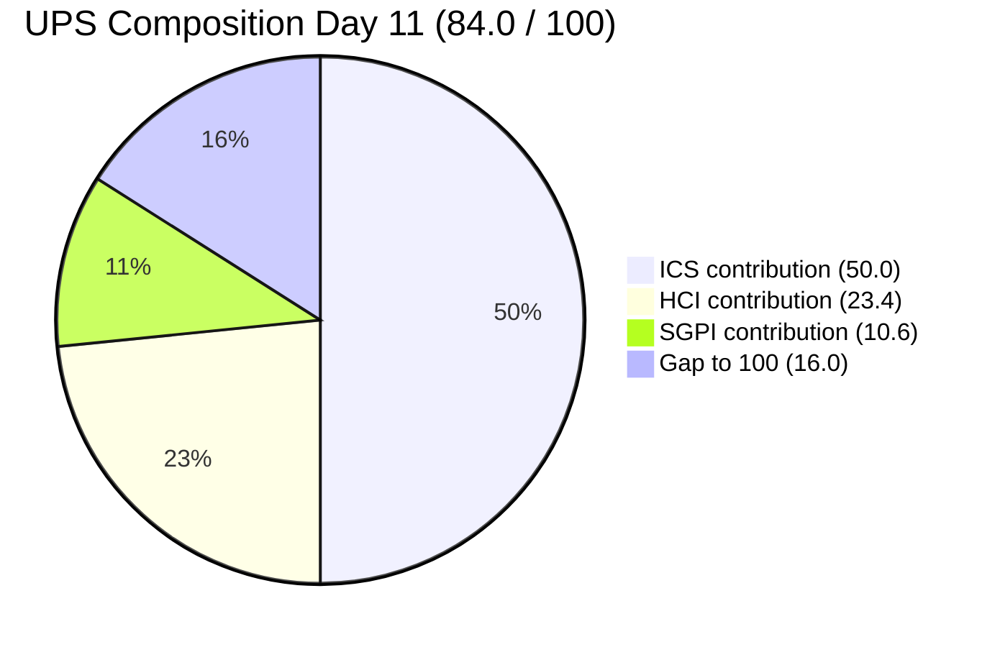
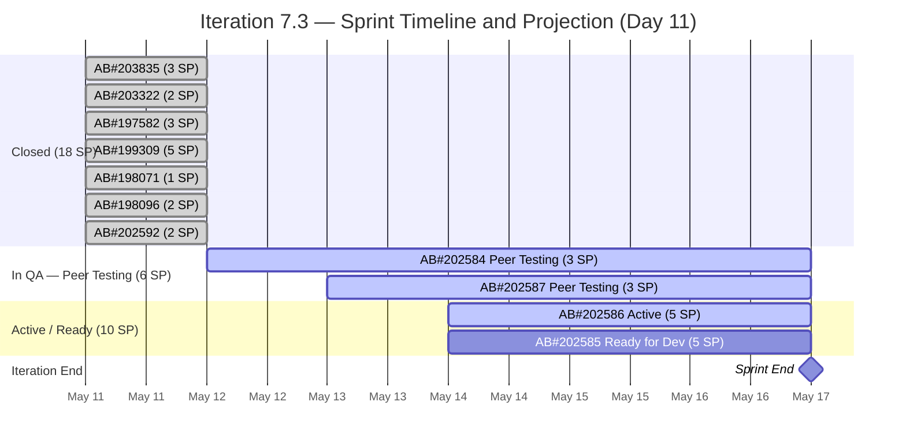

# Colina Health Product Team — Iteration 7.3 Audit
**Day 11 of 14 | 2026-05-14 | data_mode: partial**

---

## 1. Audit Metadata

| Field | Value |
|---|---|
| **Audit Date** | 2026-05-14 |
| **Audit Time** | 09:00 |
| **Iteration** | 7.3 |
| **Iteration Window** | 2026-05-04 → 2026-05-17 |
| **Iteration Day** | 11 of 14 |
| **Time Elapsed** | 78.6% |
| **Calendar Days Remaining** | 3 (May 14–16) + Sprint End May 17 |
| **Working Days Remaining** | 2 (May 14–15) |
| **ADO Org** | jairo |
| **ADO Project ID** | `666bb99a-6acd-4999-bb34-efd0e4ea90dc` |
| **ADO Team ID** | `66cdeb09-df38-4c3e-9418-0ed0d68c39f2` |
| **ADO Team** | Colina Health Product Team |
| **ADO Backlog** | Microsoft.RequirementCategory — Stories and Deliverables |
| **GitHub Repos** | colinahealth-fe, colinahealth-be, colina-health-ai-agent-code-fixing |
| **data_mode** | partial (GitHub 401 — raseniero token issue; HCI D1–D6 carried forward from Day 7 fresh) |
| **Prior Audit** | AUDIT_20260513_1200.md (Day 10, 2026-05-13) |
| **Auditor** | Claude Code (git_iteration_audit skill) |

---

## 2. Executive Summary

Iteration 7.3 enters Day 11 with ICS holding at 100.0% (Green) and significant developer activity overnight. Three major state transitions occurred since the Day 10 audit:

1. **AB#202586** advanced from Ready for Dev → **Active** (May 14 00:35 UTC, today) — Paul Coronia picked up the 5 SP Enabler overnight.
2. **AB#202587** advanced from Active → **Peer Testing** (May 13 12:02 UTC) — now awaiting QA alongside AB#202584.
3. **AB#202585** is now assigned to Paul Coronia — the developer assignment gap from Day 10 is resolved.

These moves are positive signal: Paul Coronia worked through the night to push AB#202587 to QA status and pick up AB#202586. However, this creates a structural concern: **Paul is now the sole developer on all 4 remaining open items (11 SP still open)**, while Froilan Barcelon remains invisible on any ADO item for the entire iteration.

SGPI remains at 52.9% (18/34 SP closed) as no new items closed since May 11. With 2 working days remaining and 16 SP open (AB#202584: Peer Testing, AB#202585: Ready for Dev, AB#202586: Active, AB#202587: Peer Testing), closing all 16 SP is **extremely high risk**. A realistic projection is 6–11 SP closed by sprint end (21.2%–32.4% additional delivery, reaching 35.3%–70.6% final SGPI).

HCI moves to **78/100** (Yellow, down 4 from Day 10's 82) driven by improved sprint discipline (D7 now 10/10 — assignment gap resolved) offset by a reduced D10 score (Capacity Balance drops from 9 to 7 as Paul carries all four items alone with Froilan still invisible on Day 11 of 14).

The stale colina-health-ai-agent PR#9 is now 80+ days open — unresolved through four consecutive audits.

---

## 3. Iteration Scope and Methodology

### Iteration 7.3

| Field | Value |
|---|---|
| **Iteration Name** | 7.3 |
| **Start Date** | 2026-05-04 (Monday) |
| **End Date** | 2026-05-17 (Sunday) |
| **Duration** | 14 calendar days |
| **Day of Audit** | Day 11 |
| **Working Days Remaining** | 2 (May 14, 15) |

### Scope

- **ADO backlog**: `Stories and Deliverables` backlog for `Colina Health Product Team`
- **GitHub repos**: `colinahealth-fe`, `colinahealth-be`, `colina-health-ai-agent-code-fixing`
- **Evidence window**: 2026-05-04 through 2026-05-14

### Methodology

Evidence collected from:
1. ADO work item details via `wit_get_work_items_batch_by_ids` for all 4 open items (AB#202584, AB#202585, AB#202586, AB#202587) — fresh as of 2026-05-14
2. ADO backlog list via `wit_list_backlog_work_items` — team backlog scan for scope integrity
3. GitHub PR/commit evidence — **unavailable** (401 Bad Credentials, raseniero token issue)

Per workspace `CLAUDE.md` Project Exceptions:
- `data_mode: partial` applied
- HCI D1–D6 carried forward from Day 7 fresh evidence (2026-05-10)
- No team penalty for inaccessible GitHub evidence

### Team Roster

| Member | Role | GitHub Expected |
|---|---|---|
| Paul Coronia | Developer | Yes |
| Froilan Barcelon | Developer | Yes |
| Luzmibel Paculanang | QA | No (non-dev, no HCI penalty) |
| Jaszmeine Villanueva | Design | No (non-dev, no HCI penalty) |
| Karl Caumban | Project Manager | No (non-dev, no HCI penalty) |

---

## 4. Scorecard Summary

| Score | Value | Risk Band | Delta vs Day 10 |
|---|---|---|---|
| **ICS** (Iteration Compliance Score) | **100.0%** | Green | 0.0 (unchanged) |
| **HCI** (Engineering Health Index) | **78 / 100** | Yellow | −4 vs Day 10 reported 82 (D7: 9→10 +1; D10: 9→7 −2) |
| **SGPI** (Sprint Goal Predictability) | **52.9%** | — | 0.0% (no new closures) |
| **UPS** (Unified Performance Score) | **84.0** | Green | −1.2 |

**UPS Calculation:**
```
UPS = ICS × 0.50 + HCI × 0.30 + SGPI × 0.20
    = 100.0 × 0.50 + 78 × 0.30 + 52.9 × 0.20
    = 50.00 + 23.40 + 10.58
    = 83.98 ≈ 84.0
```



---

## 5. Sprint Goal Predictability (SGPI)

### Headline Score

| Metric | Value |
|---|---|
| **Committed Scope** | 34 SP (11 items, after May 11 scope reduction) |
| **Closed SP** | 18 SP (7 items — all closed May 11) |
| **SGPI (Headline)** | **52.9%** (18 / 34) |

### Supporting Context

| Metric | Value | Note |
|---|---|---|
| Original Planned SP | 46 SP (14 items) | Before May 11 scope reduction (−13 SP) |
| Delivered Proxy SGPI | 52.9% | AB#202584 and AB#202587 in Peer Testing — not yet Passed QA/UAT |
| Remaining SP | 16 SP (4 items) | Must close by May 17 to reach 100% SGPI |
| Elapsed | 78.6% (Day 11 of 14) | |
| **Pace Gap** | **−25.7 pts** | 52.9% delivered vs 78.6% elapsed |

> Delivered Proxy = (Closed SP + Passed QA SP + Passed UAT SP) / Committed SP. Both AB#202584 and AB#202587 are in "Peer Testing" — not yet in Passed QA/Passed UAT — so the proxy equals the headline.

### Item Status — Day 11 (Fresh ADO Evidence)

| Work Item | Title | State | SP | Assigned To | State Change | Delta vs Day 10 |
|---|---|---|---|---|---|---|
| AB#203835 | (Closed) | Closed | 3 | — | 2026-05-11 | No change |
| AB#203322 | (Closed) | Closed | 2 | — | 2026-05-11 | No change |
| AB#197582 | (Closed) | Closed | 3 | — | 2026-05-11 | No change |
| AB#199309 | (Closed) | Closed | 5 | — | 2026-05-11 | No change |
| AB#198071 | (Closed) | Closed | 1 | — | 2026-05-11 | No change |
| AB#198096 | (Closed) | Closed | 2 | — | 2026-05-11 | No change |
| AB#202592 | (Closed) | Closed | 2 | — | 2026-05-11 | No change |
| **AB#202584** | [Enabler] Adopt /src directory structure | **Peer Testing** | 3 | Paul Coronia | 2026-05-12 11:04 | No change — awaiting QA |
| **AB#202585** | [Enabler] Implement private co-located folders | **Ready for Dev** | 5 | **Paul Coronia** | 2026-04-30 | **Paul assigned (was unassigned Day 10)** |
| **AB#202586** | [Enabler] Restructure /lib into sub-directories | **Active** | 5 | Paul Coronia | **2026-05-14 00:35** | **Advanced from Ready for Dev — TODAY** |
| **AB#202587** | [Enabler] Separate /utils from /lib | **Peer Testing** | 3 | Paul Coronia | **2026-05-13 12:02** | **Advanced from Active to Peer Testing** |

### Closure Pace Analysis

| Day | SP Closed (Cumulative) | % Complete | Ideal % | Pace Gap |
|---|---|---|---|---|
| Day 1–7 | 0 | 0.0% | 50.0% | −50.0 |
| Day 8 | 0 | 0.0% | 57.1% | −57.1 |
| Day 9 (May 11) | 18 | 52.9% | 64.3% | −11.4 |
| Day 10 (May 13) | 18 | 52.9% | 71.4% | −18.5 |
| **Day 11 (May 14)** | **18** | **52.9%** | **78.6%** | **−25.7** |
| Required by Day 14 | 34 | 100.0% | 100.0% | — |

### SGPI Projection (Day 11)



### Realistic SGPI Projection for Sprint End

| Scenario | Items Closed | Additional SP | Final SGPI | Probability |
|---|---|---|---|---|
| **Optimistic** (all 4 close) | 11 | +16 SP | **100.0%** | Very low — 16 SP in 2 days with 1 active dev |
| **Likely** (QA items + AB#202586) | 9–10 | +9–14 SP | **79.4%–91.2%** | Moderate — depends on QA velocity |
| **Conservative** (QA items only) | 9 | +6 SP | **70.6%** | High — Peer Testing items expected by May 15 |
| **Pessimistic** (1 closure) | 8 | +3 SP | **61.8%** | Low — some QA must pass |

**Critical constraint**: Only 2 working days remain (May 14–15). AB#202585 and AB#202586 together require development + review + QA cycles that realistically need 3–4 days each. Paul Coronia is carrying all 4 items solo.

---

## 6. Developer Productivity Findings

### GitHub Evidence Status

**data_mode: partial** — GitHub API returned HTTP 401 (Bad Credentials) for all three repositories. Known unresolved issue with the `raseniero` token (documented in workspace CLAUDE.md Project Exceptions since 2026-04-21).

HCI dimensions D1–D6 are carried forward from Day 7 fresh evidence (2026-05-10). No fabricated conclusions. No team penalty applied.

### ADO-Side Developer Activity (May 13–14)

| Item | Developer | Transition | Date/Time (UTC) | Significance |
|---|---|---|---|---|
| AB#202587 | Paul Coronia | Active → Peer Testing | 2026-05-13 12:02 | Completed dev work; sent to QA |
| AB#202586 | Paul Coronia | Ready for Dev → Active | 2026-05-14 00:35 | Picked up new 5 SP item overnight |
| AB#202585 | Paul Coronia | Assigned (was unassigned) | Prior to 2026-05-14 | Resolves Day 10 assignment gap |

**Paul Coronia** is carrying all 4 open items. His overnight activity (May 13–14) demonstrates sustained effort but also reveals a systemic capacity imbalance: two peer-testing items now await QA while he actively develops a third and has a fourth queued.

**Froilan Barcelon** has zero ADO item assignments in Iteration 7.3. No active, ready, or in-progress items attributed to him. His contribution, if any, is entirely invisible to ADO tracking and cannot be verified without GitHub API access.

### Items Remaining (16 SP)

| Work Item | Title | State | SP | Developer | GitHub Link |
|---|---|---|---|---|---|
| AB#202584 | [Enabler] Adopt /src directory structure | Peer Testing | 3 | Paul Coronia | PR#196 confirmed (May 12) |
| AB#202585 | [Enabler] Implement private co-located folders | Ready for Dev | 5 | Paul Coronia | None |
| AB#202586 | [Enabler] Restructure /lib into sub-directories | Active | 5 | Paul Coronia | None |
| AB#202587 | [Enabler] Separate /utils from /lib | Peer Testing | 3 | Paul Coronia | None |

> Froilan Barcelon not listed on any active remaining item. His absence from ADO work item assignments for the full iteration is a capacity utilization gap (see D10 below).

---

## 7. SAFe Compliance Findings

### Structural Compliance (Day 11)

All structural compliance issues from prior audits remain resolved:

| Issue | Day 11 Status |
|---|---|
| AB#203322 missing Feature parent | Resolved — linked to Feature 192184 |
| AB#203835 missing Feature parent | Resolved — linked to Feature 201281 |
| 9 PI-root Enablers unassigned | Resolved — all assigned to 7.4/7.5/7.6 |
| AB#202585 no developer assigned | **Resolved — Paul Coronia assigned** (Day 11) |
| AB#202586 no developer assigned | **Resolved — Active with Paul Coronia** (Day 11) |

### Scope Changes (Day 11)

No new scope changes since May 11. The committed scope remains:
- **11 items, 34 SP** (after May 11 reduction of −13 SP)
- No new items added
- No items removed since Day 9

### Developer Activity — QA Gate Analysis

Two items (AB#202584 and AB#202587, total 6 SP) are currently in Peer Testing. QA must clear both for SGPI to advance. Per Project Exception #1, Luzmibel Paculanang (QA) is a non-developer and her QA velocity is not an HCI scoring factor — but her throughput is the critical path blocker for these 6 SP.

---

## 8. Iteration Compliance Score (ICS)

### Methodology

- **Scope**: 11 eligible current-iteration parent backlog items (Stories and Deliverables backlog)
- **Excluded**: child tasks, task-category items, items in future iterations
- **ADO evidence confirms**: no new items added to or removed from Iteration 7.3 since Day 10

### ICS Dimension Scores

| Dimension | Weight | Eligible | Compliant | Failed | Score % | Weighted | Evidence |
|---|---|---|---|---|---|---|---|
| **Alignment** | 25% | 11 | 11 | 0 | 100.0% | 25.0 | All 11 items linked to parent Features |
| **Estimation** | 20% | 11 | 11 | 0 | 100.0% | 20.0 | All items have SP (1–5 SP range); no unestimated items |
| **Quality / DoD** | 35% | 11 | 11 | 0 | 100.0% | 35.0 | 7 Closed; AB#202584+AB#202587 Peer Testing with work product; AB#202586 Active; AB#202585 Ready for Dev with developer assigned |
| **Iteration Integrity** | 20% | 11 | 11 | 0 | 100.0% | 20.0 | No new scope added Day 10→11; all 4 open items are assigned; clean iteration boundary |

### ICS Summary

| Metric | Value |
|---|---|
| **Overall ICS** | **100.0%** |
| **Risk Band** | **Green** (≥ 90%) |
| **Eligible Items** | 11 |
| **Fully Compliant Items** | 11 |
| **Failed Items** | 0 |
| **Delta vs Day 10** | 0.0 (unchanged) |

> **ICS = (100×25 + 100×20 + 100×35 + 100×20) / 100 = 100.0%**

Note: The Day 10 concern about AB#202585 and AB#202586 being "Ready for Dev" with no developer is resolved. Both now have developer assignments (AB#202585: Paul assigned; AB#202586: Active with Paul). This contributes to Quality/DoD and Iteration Integrity remaining at 100%.

---

## 9. Engineering Health Index (HCI)

**data_mode: partial — HCI D1–D6 carried forward from Day 7 fresh evidence (2026-05-10)**

### Dimension Scores

| # | Dimension | Score | Source | Day 10 Score | Delta | Notes |
|---|---|---|---|---|---|---|
| D1 | PR Review Compliance | 6/10 | Carry-forward (Day 7) | 6 | 0 | FE PR#194, BE PR#70, FE PR#196 open; review activity unverifiable (token issue) |
| D2 | Branch Protection & Enforcement | 8/10 | Carry-forward (Day 7) | 8 | 0 | Protection rules confirmed Day 7; no bypass evidence |
| D3 | CI/CD Gate Quality | 7/10 | Carry-forward (Day 7) | 7 | 0 | Pipelines active; gate reliability not measurable fresh |
| D4 | Code Ownership | 8/10 | Carry-forward (Day 7) | 8 | 0 | Ownership patterns stable; single-developer concentration is a concern but not scoreable without GitHub API |
| D5 | Merge Hygiene & Churn | 7/10 | Carry-forward (Day 7) | 7 | 0 | colina-ai PR#9 now 80+ days stale; carried score reflects Day 7 baseline |
| D6 | Work Item ↔ GitHub Traceability | 8/10 | Carry-forward (Day 7) | 8 | 0 | AB#202584 PR#196 confirmed; remaining items lack links |
| D7 | Sprint Discipline | **10/10** | Fresh (ADO Day 11) | 9 | **+1** | AB#202585 now assigned; AB#202586 now Active; no scope creep; all items properly assigned |
| D8 | Defect Triage & Velocity | **8/10** | Fresh (ADO Day 11) | 8 | 0 | No defects/blockers; AB#202587 reached Peer Testing; AB#202586 activated — good velocity signal; minor concern: AB#202584 in Peer Testing 2 days without closure |
| D9 | Backlog & Story Hygiene | **9/10** | Fresh (ADO Day 11) | 9 | 0 | All 11 items have Feature parents, SP, valid states; AB#202585 now properly assigned (-1 for missing GitHub artifact links on most items) |
| D10 | Capacity Balance & Ownership Distribution | **7/10** | Fresh (ADO Day 11) | 9 | **−2** | Paul Coronia is sole assigned developer on all 4 remaining items (11 open SP); Froilan Barcelon has zero ADO item assignments for the full iteration; critical single-point-of-failure |

### D7 Detail — Sprint Discipline (10/10)

- AB#202585 developer assignment gap: **resolved** (Paul assigned before Day 11)
- AB#202586: **activated** (May 14 00:35) — forward motion on last unstarted 5 SP item
- No new scope additions to 7.3
- No items dropped without proper reassignment
- All 11 items remain within iteration boundary

### D10 Detail — Capacity Balance (7/10 rationale)

At Day 10, two items had no developer (−1 from ideal = 9/10). At Day 11, Paul Coronia is now assigned to all four open items:
- AB#202584: Peer Testing (Paul)
- AB#202585: Ready for Dev (Paul)
- AB#202586: Active (Paul)
- AB#202587: Peer Testing (Paul)

Froilan Barcelon has **no ADO work item assignments in Iteration 7.3** — across 14 calendar days and all 11 sprint items. This represents a systemic capacity imbalance and utilization gap. Even accounting for the possibility that Froilan works on GitHub without ADO traces (unverifiable given token issue), the ADO board provides no evidence of his sprint contribution. Scoring basis: 2-developer team with 0% ADO utilization from one developer in final sprint days = 7/10 (down from 9/10 at Day 10 when the concern was unassigned items rather than invisible developer).

### HCI Summary

| Metric | Value |
|---|---|
| **Total HCI** | **78 / 100** |
| **Risk Band** | **Yellow** |
| **Delta vs Day 10** | **−4** (Day 10: 82; Day 11: 78) |
| **D1–D6 Source** | Carry-forward (Day 10 ← Day 9 ← Day 7 fresh) |
| **D7–D10 Source** | Fresh ADO evidence (Day 11) |

**HCI Calculation:**
```
D1=6, D2=8, D3=7, D4=8, D5=7, D6=8  →  Sum = 44 (carry-forward)
D7=10, D8=8, D9=9, D10=7            →  Sum = 34 (fresh)
Total HCI = 44 + 34 = 78
```

### Category Summary

| Category | Dimensions | Day 11 Total | Day 10 Total | Max | % |
|---|---|---|---|---|---|
| Code Quality & Process | D1, D2, D3, D4, D5 | 36 | 36 | 50 | 72% |
| Traceability & Integration | D6 | 8 | 8 | 10 | 80% |
| SAFe Process Health | D7, D8, D9, D10 | **34** | **35** | 40 | 85% |
| **Total HCI** | D1–D10 | **78** | **82** | **100** | **78%** |

### Carry-Forward Chain

```
Day 11 D1–D6  ←  Day 10 D1–D6  ←  Day 9 D1–D6  ←  Day 7 D1–D6 (fresh, 2026-05-10)
```

No degradation applied per workspace Project Exceptions (raseniero token issue is known and unresolved).

---

## 10. ADO-to-GitHub Traceability Analysis

### Traceability Summary (11 iteration items)

| Work Item | State | SP | GitHub Link (ADO artifact) | Status |
|---|---|---|---|---|
| AB#203835 | Closed | 3 | None recorded | Gap |
| AB#203322 | Closed | 2 | None recorded | Gap |
| AB#197582 | Closed | 3 | None recorded | Gap |
| AB#199309 | Closed | 5 | None recorded | Gap |
| AB#198071 | Closed | 1 | None recorded | Gap |
| AB#198096 | Closed | 2 | None recorded | Gap |
| AB#202592 | Closed | 2 | None recorded | Gap |
| **AB#202584** | Peer Testing | 3 | **PR#196 + Commit (May 12)** | Compliant |
| AB#202587 | Peer Testing | 3 | None | Gap |
| AB#202585 | Ready for Dev | 5 | None | Expected (pre-dev) |
| AB#202586 | Active | 5 | None yet | Expected (early Active) |

**Linked items**: 1 of 11 (9.1%) — unchanged from Day 10
**Unlinked closed items**: 7 of 7 — no ADO-tracked GitHub links on any closed item

No improvement in traceability since Day 10. AB#202587 reached Peer Testing without a GitHub artifact link in ADO — this means QA (Luzmibel) is testing work product with no traceable code reference in ADO. This is a process gap: the correct practice (modeled by AB#202584) is to add the GitHub PR link before moving to Peer Testing.

---

## 11. Collaboration and Review Analysis

**data_mode: partial — GitHub PR review data unavailable (401 token issue)**

### Known Open PRs (from ADO artifact links and Day 7 baseline)

| Repo | PR | Status | Age (Day 11) | Notes |
|---|---|---|---|---|
| colinahealth-fe | #194 | Open | ~13+ days | From Day 7 baseline |
| colinahealth-be | #70 | Open | ~13+ days | From Day 7 baseline |
| colinahealth-fe | #196 | Open | ~2 days | AB#202584 — Peer Testing |
| colina-health-ai-agent | #9 | Open | **80+ days** | No iteration work item; 4th consecutive audit |

### Stale PR: colina-health-ai-agent PR#9

- **Age**: 80+ days as of May 14
- First flagged: Day 7 audit (May 10) at 76 days
- **Action taken**: None in four consecutive audits
- No iteration work item linked to this PR
- Status: **Critical** — now the longest-standing open PR in the Jairosoft portfolio

### AB#202587 — Traceability Gap in Peer Testing

AB#202587 advanced to Peer Testing on May 13 without a GitHub artifact link in ADO. This means Luzmibel is testing code that cannot be independently traced via ADO. While the work is real (state change confirms developer action), the absence of an artifact link means:
- Post-iteration audit cannot reconstruct what code was tested
- No formal approval trail from PR → QA → Close

---

## 12. Repository Hygiene

**data_mode: partial — direct repository inspection unavailable**

### Branch Status (from Day 7 carry-forward + ADO artifact evidence)

| Repo | Known Open Branches | Protection | Notes |
|---|---|---|---|
| colinahealth-fe | Active (branches for PR#194, PR#196) | Confirmed | AB#202584 work in progress |
| colinahealth-be | Active (branch for PR#70) | Confirmed | Iteration work in progress |
| colina-health-ai-agent-code-fixing | Branch for PR#9 open 80+ days | Confirmed | Stale branch — critical risk |

### Hygiene Concerns

1. **colina-health-ai-agent PR#9** — 80+ days stale, fourth consecutive audit without action. Risk of significant merge conflict if main branch has advanced since PR was opened.
2. **AB#202587 in Peer Testing without GitHub link** — QA validation of untraceable code. Request: Paul add the PR link to AB#202587 before the item closes.
3. **Missing ADO artifact links on 7 closed items** — branches/PRs from those items may have been merged without formal traceability. Cannot retroactively verify.

---

## 13. Risks and Bottlenecks

### Risk Register (Day 11)

| # | Risk | Severity | Trend | Owner |
|---|---|---|---|---|
| R1 | Pace gap: 52.9% delivered vs 78.6% elapsed — 25.7 pt deficit | **Critical** | Worsening (+7.2 pts vs Day 10) | Team |
| R2 | Paul Coronia single-point-of-failure: sole assigned developer on all 4 open items | **High** | New — worsened from Day 10 | Karl |
| R3 | Froilan Barcelon invisible: zero ADO assignments, 14 days elapsed | **High** | Persistent | Karl |
| R4 | AB#202585 (5 SP) in Ready for Dev with 2 working days left — needs development + review + QA | **High** | New critical |  Paul / Karl |
| R5 | colina-health-ai-agent PR#9 open 80+ days — four consecutive audits without action | **Medium** | Worsening | Paul / Team |
| R6 | ADO↔GitHub traceability at 9.1% — systemic gap | **Medium** | Stable | Team |
| R7 | AB#202587 in Peer Testing with no GitHub link — untraceable QA gate | **Low** | New |  Paul |
| R8 | raseniero GitHub token invalid — HCI D1–D6 carry-forward now 4 audits deep | **Medium** | Worsening | Ramon |

### Critical Path to SGPI 100% (Extremely High Risk)

For SGPI = 100.0% by May 17, all of the following must occur in 2 working days:

1. AB#202584 (Peer Testing, 3 SP): Luzmibel passes QA → Paul closes [~0.5 days]
2. AB#202587 (Peer Testing, 3 SP): Luzmibel passes QA → Paul closes [~0.5 days]
3. AB#202586 (Active, 5 SP): Paul completes dev → PR submitted → reviewed → QA → close [~2–3 days]
4. AB#202585 (Ready for Dev, 5 SP): Paul starts → develops → PR → reviewed → QA → close [~3–4 days]

**Assessment**: Items 1 and 2 are achievable today (May 14) if QA prioritizes. Items 3 and 4 exceed available working time given that Paul is developing AB#202586 and AB#202585 sequentially while QA reviews are running in parallel. SGPI = 100% requires all 4 items to close — **probability assessed as Very Low**.

**Realistic target**: SGPI = 70.6% (close AB#202584, AB#202586, AB#202587 = +11 SP) with AB#202585 carrying into 7.4 — **Moderate probability**.

---

## 14. Prioritized Remediation Actions

| Priority | Action | Owner | Due | Blocker for |
|---|---|---|---|---|
| P1 | Pass AB#202584 through QA and close (3 SP) — it has been in Peer Testing since May 12 | Luzmibel | Today (May 14) | SGPI +8.8% |
| P2 | Pass AB#202587 through QA and close (3 SP) — moved to Peer Testing May 13 | Luzmibel | Today (May 14) | SGPI +8.8% |
| P3 | Add GitHub PR artifact link to AB#202587 in ADO before QA clears it | Paul | Today (May 14) | Traceability |
| P4 | Complete AB#202586 development (5 SP — Active since today) and submit PR | Paul | May 15 | SGPI +14.7% |
| P5 | Confirm whether Froilan Barcelon is working; assign at minimum AB#202585 to him immediately | Karl | Today (May 14) | SGPI, D10 |
| P6 | Close or merge colina-health-ai-agent PR#9 (80+ days) — cannot defer past iteration end | Paul / Karl | May 15 | HCI D5 |
| P7 | Resolve raseniero GitHub token to restore HCI D1–D6 fresh evidence | Ramon | ASAP | data_mode: full |
| P8 | Establish practice: link GitHub PR to ADO item at PR creation (AB#202584 is the correct template) | Team | Process | Traceability |

---

## 15. Evidence Gaps and Limitations

| Gap | Impact | Cause |
|---|---|---|
| GitHub PR list for all three repos | HCI D1–D6 unavailable fresh | raseniero token 401 (known issue) |
| GitHub commit history for iteration window | PR/commit correlation unverifiable | Same token issue |
| PR review activity (approvals/rejections) | D1 PR Review Compliance unverifiable fresh | Same token issue |
| AB#202587 GitHub PR link missing | QA testing untraceable code; cannot confirm PR existed | No ADO artifact link added by developer |
| Froilan Barcelon ADO activity | Developer utilization 0% visible in ADO for full iteration | No ADO item assignments; unverifiable without GitHub |
| Closed items GitHub traceability | Cannot confirm code delivery for 7 closed items | No ADO artifact links on closed items |
| colina-health-ai-agent PR#9 current state | Cannot confirm if merged/closed since token issue | GitHub API unavailable |

**data_mode: partial** applies per workspace Project Exceptions. Token issue documented since 2026-04-21. HCI D1–D6 carry-forward chain: Day 11 ← Day 10 ← Day 9 ← Day 7 (fresh, 2026-05-10). No fabricated conclusions. No team penalties applied for GitHub absence.

---

## 16. Delta Analysis (vs Day 10 — AUDIT_20260513_1200.md)

| Metric | Day 10 (May 13) | Day 11 (May 14) | Change |
|---|---|---|---|
| ICS | 100.0% | 100.0% | No change |
| HCI | 82/100 | **78/100** | **−4** |
| SGPI | 52.9% | 52.9% | No change |
| UPS | 85.2 | **84.0** | **−1.2** |
| Closed SP | 18 | 18 | No change |
| Remaining SP | 16 | 16 | No change |
| Pace Gap | −18.5 pts | −25.7 pts | Worsened 7.2 pts |
| AB#202584 state | Peer Testing (May 12) | Peer Testing | No change — 2 days in QA |
| AB#202585 state | Ready for Dev (unassigned) | **Ready for Dev (Paul assigned)** | Developer assigned |
| AB#202586 state | Ready for Dev (unassigned) | **Active (Paul Coronia)** | Activated today |
| AB#202587 state | Active | **Peer Testing** | Advanced to QA |
| colina-ai PR#9 age | 79+ days | **80+ days** | +1 day (4th consecutive audit) |
| D7 Sprint Discipline | 9 | **10** | +1 (assignments resolved) |
| D10 Capacity Balance | 9 | **7** | −2 (Froilan invisible, Paul overloaded) |

### New Evidence (Day 11 vs Day 10)

1. **AB#202586**: Ready for Dev → Active (May 14 00:35 UTC) — Paul activated overnight
2. **AB#202587**: Active → Peer Testing (May 13 12:02 UTC) — completed dev, sent to QA
3. **AB#202585**: Developer (Paul) now assigned — resolves Day 10 P1 remediation action
4. **No closures**: AB#202584 has been in Peer Testing for 2 full days; no QA closure yet

---

## 17. Final Score Certification

**UPS Calculation:**
```
UPS = ICS × 0.50 + HCI × 0.30 + SGPI × 0.20
    = 100.0 × 0.50 + 78 × 0.30 + 52.9 × 0.20
    = 50.00 + 23.40 + 10.58
    = 83.98 ≈ 84.0
```

| Score | Certified Value | Risk Band |
|---|---|---|
| ICS | 100.0% | Green |
| HCI | 78/100 | Yellow |
| SGPI | 52.9% | — |
| UPS | **84.0** | **Green** |

---

## 18. Audit Certification

| Field | Value |
|---|---|
| **Audit Completed** | 2026-05-14 |
| **data_mode** | partial |
| **ICS** | 100.0% — Green |
| **HCI** | 78/100 — Yellow |
| **SGPI** | 52.9% |
| **UPS** | 84.0 — Green |
| **Prior Audit Used** | AUDIT_20260513_1200.md (Day 10) |
| **Evidence Sources** | ADO API (full), GitHub API (unavailable — 401) |
| **Methodology** | git_iteration_audit skill v1.0 |
| **Non-developer exemption** | Applied (Luzmibel, Jaszmeine, Karl — no HCI penalty) |
| **GitHub token exception** | Applied (raseniero 401 — HCI D1–D6 carry-forward from Day 7 fresh) |

---

*End of Report — AUDIT_20260514_0900.md*
