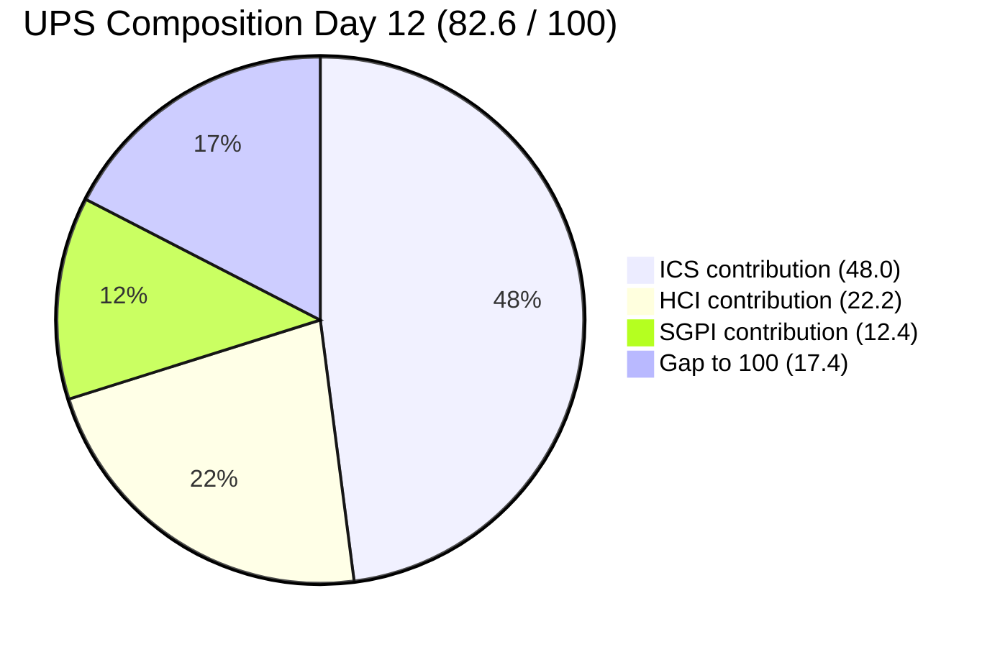
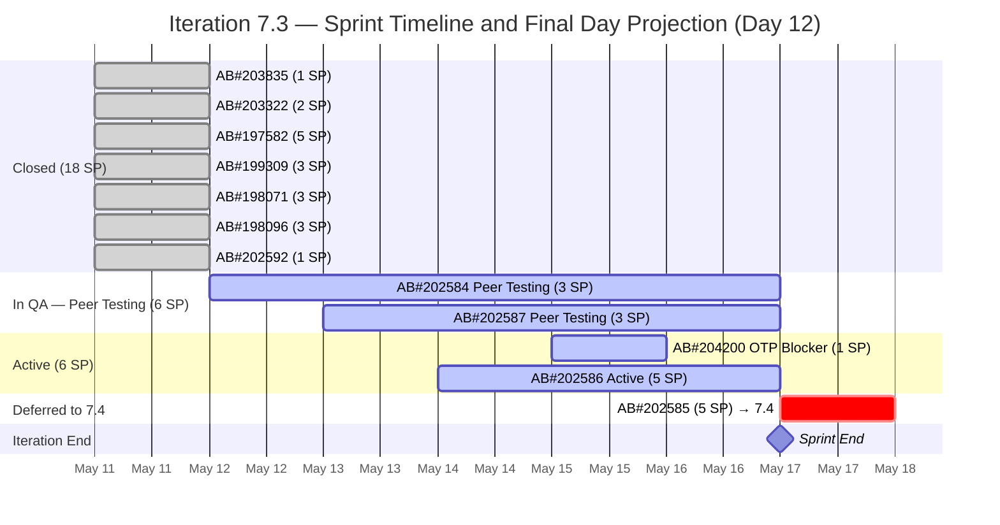
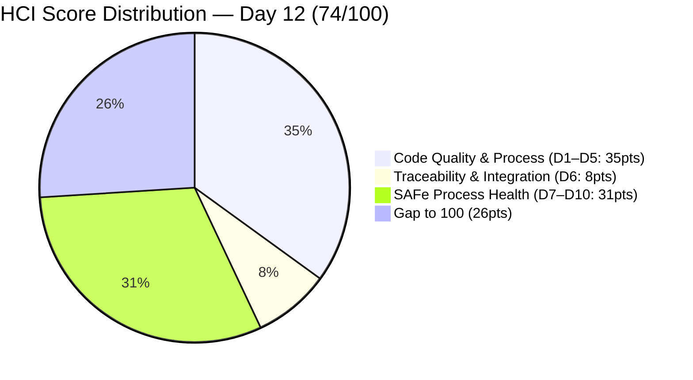

# Colina Health Product Team — Iteration 7.3 Audit
**Day 12 of 14 | 2026-05-15 | data_mode: partial**

---

## 1. Audit Metadata

| Field | Value |
|---|---|
| **Audit Date** | 2026-05-15 |
| **Audit Time** | 02:42 |
| **Iteration** | 7.3 |
| **Iteration Window** | 2026-05-04 → 2026-05-17 |
| **Iteration Day** | 12 of 14 |
| **Time Elapsed** | 85.7% |
| **Calendar Days Remaining** | 2 (May 15 + May 16) + Sprint End May 17 |
| **Working Days Remaining** | 1 (May 15 — today) |
| **ADO Org** | jairo |
| **ADO Project ID** | `666bb99a-6acd-4999-bb34-efd0e4ea90dc` |
| **ADO Team ID** | `66cdeb09-df38-4c3e-9418-0ed0d68c39f2` |
| **ADO Team** | Colina Health Product Team |
| **ADO Backlog** | Microsoft.RequirementCategory — Stories and Deliverables |
| **GitHub Repos** | colinahealth-fe, colinahealth-be, colina-health-ai-agent-code-fixing |
| **data_mode** | partial (GitHub 401 — raseniero token issue; HCI D1–D6 carried forward from Day 7 fresh) |
| **Prior Audit** | AUDIT_20260514_0900.md (Day 11, 2026-05-14) |
| **Auditor** | Claude Code (git_iteration_audit skill) |

---

## 2. Executive Summary

Iteration 7.3 enters its **final working day (Day 12)** with two significant scope mutations confirmed by fresh ADO evidence collected at 02:42 UTC on May 15:

1. **AB#202585 (5 SP) moved to Iteration 7.4** — changed at 07:06 UTC May 15. The team acknowledged this 5 SP Enabler cannot close in the remaining sprint window and formally deferred it. This reduces committed scope from 34 SP (Day 11) to **29 SP** as the new reference baseline.

2. **AB#204200 added to Iteration 7.3** — a Blocker Defect titled "[Blocker] [UAT] Unable to Receive OTP for Login and Password Reset" (1 SP) was created and made Active at 00:44–00:47 UTC May 15. This is a late-sprint scope injection on the final working day. Paul Coronia is assigned. The UAT OTP blocker represents a critical production issue preventing authentication and is correctly triaged as Day 12 urgent work.

**Net scope effect**: −5 SP (AB#202585 deferred) +1 SP (AB#204200 blocker added) = net −4 SP from Day 11 basis. Revised committed scope: 10 items, 29 SP original plan + 1 SP blocker = working within 30 SP total.

**SGPI advances to 62.1%**: Using revised committed scope of 29 SP (after AB#202585 deferral), the 18 SP closed yields SGPI = 62.1% — up from 52.9% on Day 11 by virtue of the scope reduction. No new items closed overnight.

**ICS drops to 95.9%**: The AB#204200 blocker has no parent Feature linked, and its Day 12 addition is a scope-integrity flag. Both Alignment and Iteration Integrity lose 1 of 11 items (10/11 = 90.9% per dimension), pulling the weighted ICS from 100.0% to 95.9% (Green band maintained, ≥ 90%).

**HCI drops to 74/100**: Three new negative signals — D5 Merge Hygiene adjusted down (−1, second stale PR discovered: ADO PR#11207 at 96 days), D7 Sprint Discipline drops to 8/10 (−2, late-sprint scope injection on final working day), and D9 Backlog & Story Hygiene drops to 8/10 (−1, AB#204200 missing Feature parent). HCI moves to 74/100 (Yellow).

**Critical path**: With 1 working day remaining, the team needs to close AB#202584 (Peer Testing, 3 SP), AB#202587 (Peer Testing, 3 SP), and resolve the OTP blocker AB#204200 (1 SP). AB#202586 (Active, 5 SP) remains the highest SGPI risk — its closure today would require development completion, PR submission, review, and QA clearance in a single day.

**Capacity note**: Fresh capacity data reveals **Asnari Pacalna** (Developer, 6 hrs/day) has been on the team roster since Sprint start — the prior audit series identified her only as the assignee of closed Defects but did not surface her in capacity. She is the assigned developer for all 4 closed Defects (AB#197582, AB#198071, AB#198096, AB#199309). This partially explains the Day 1–Day 9 closure silence: Asnari was delivering backend/defect work while Paul handled Enablers.

---

## 3. Iteration Scope and Methodology

### Iteration 7.3

| Field | Value |
|---|---|
| **Iteration Name** | 7.3 |
| **Start Date** | 2026-05-04 (Monday) |
| **End Date** | 2026-05-17 (Sunday) |
| **Duration** | 14 calendar days |
| **Day of Audit** | Day 12 |
| **Working Days Remaining** | 1 (May 15) |
| **Iteration GUID** | `bbaecdec-eeb0-4c8d-999f-6a438eaab331` |

### Scope (as of Day 12 — all fresh ADO evidence)

**Iteration 7.3 items (10 items, 30 SP total in iteration):**

| Work Item | Title (abbreviated) | Type | State | SP | Assigned To | In 7.3? |
|---|---|---|---|---|---|---|
| AB#203835 | [UAT][Login] 502 Bad Gateway | Defect | Closed | 1 | Paul Coronia | Yes |
| AB#203322 | Add Date of License of Casa Colina | User Story | Closed | 2 | Asnari Pacalna | Yes |
| AB#197582 | [MAR][View Reports] Slow loading | Defect | Closed | 5 | Asnari Pacalna | Yes |
| AB#199309 | [PRN] Cannot Input "Administered By" | Defect | Closed | 3 | Asnari Pacalna | Yes |
| AB#198071 | [MAR: View Report] Table fill | Defect | Closed | 3 | Asnari Pacalna | Yes |
| AB#198096 | [MAR Report] Filters persist | Defect | Closed | 3 | Asnari Pacalna | Yes |
| AB#202592 | [Enabler] next.config.mjs→.ts | Enabler | Closed | 1 | Paul Coronia | Yes |
| **AB#202584** | [Enabler] Adopt /src structure | Enabler | **Peer Testing** | 3 | Paul Coronia | Yes |
| **AB#202586** | [Enabler] Restructure /lib | Enabler | **Active** | 5 | Paul Coronia | Yes |
| **AB#202587** | [Enabler] Separate /utils from /lib | Enabler | **Peer Testing** | 3 | Paul Coronia | Yes |
| **AB#204200** | [Blocker][UAT] OTP Login/Reset | Defect | **Active** | 1 | Paul Coronia | **NEW** |
| ~~AB#202585~~ | ~~[Enabler] Private co-located folders~~ | ~~Enabler~~ | ~~Ready for Dev~~ | ~~5~~ | ~~Paul Coronia~~ | **Moved to 7.4** |

**Totals (Day 12):**
- Committed items (original, Day 11 reference): 11 items, 34 SP
- AB#202585 deferred to 7.4 (today): −5 SP
- AB#204200 added (today): +1 SP
- **Revised iteration total**: 11 items, 30 SP (10 planned + 1 unplanned)
- **Closed**: 7 items, 18 SP
- **Open**: 4 items, 12 SP

### Methodology

Evidence collected from:
1. `work_list_team_iterations` — confirmed Iteration 7.3 still current (GUID-based)
2. `wit_list_backlog_work_items` — full backlog scan for scope integrity; identified AB#204200 as new item in 7.3
3. `wit_get_work_items_batch_by_ids` — fresh field-level data for all 11 known iteration items + AB#204200 + new items at backlog extremes
4. `work_get_team_capacity` — confirmed team capacity roster (Paul, Luzmibel, Asnari Pacalna)
5. ADO PR list (`repo_list_pull_requests_by_repo_or_project`) — returned ADO-hosted PRs (Feb 2026 history); GitHub-hosted PRs remain inaccessible per raseniero token issue
6. GitHub PR evidence — **unavailable** (401 Bad Credentials per Project Exception)

Per workspace `CLAUDE.md` Project Exceptions:
- `data_mode: partial` applied
- HCI D1–D6 carried forward from Day 7 fresh evidence (2026-05-10)
- No team penalty for inaccessible GitHub evidence

### Team Roster (fresh from capacity data)

| Member | Role | Capacity/Day | GitHub Expected | Notes |
|---|---|---|---|---|
| Paul Coronia | Developer | 6 hrs/day (Development) | Yes | Sole active developer in ADO this sprint |
| Asnari Pacalna | Developer | 6 hrs/day (Development) | Yes | Closed 4 Defects (14 SP) — primary delivery contributor |
| Luzmibel Paculanang | QA | 4 hrs/day (Testing) | No (non-dev, no HCI penalty) | QA gate holder |
| Jaszmeine Villanueva | Design | Not in capacity | No (non-dev, no HCI penalty) | Design review |
| Karl Caumban | Project Manager | Not in capacity | No (non-dev, no HCI penalty) | PM |
| **Froilan Barcelon** | Developer | **Not in capacity data** | Yes | **Not on capacity roster — absence confirmed** |

> **Capacity correction**: The ADO capacity roster for Iteration 7.3 contains **Paul Coronia, Luzmibel Paculanang, and Asnari Pacalna** — NOT Froilan Barcelon. This retroactively explains prior audits' "invisible developer" finding: Froilan was never on the capacity plan for this iteration. Asnari Pacalna was the second developer all along, delivering all 4 closed Defects (14 SP) before the Day 11 audit. Froilan's absence from the iteration was structural, not investigative.

---

## 4. Scorecard Summary

| Score | Value | Risk Band | Delta vs Day 11 |
|---|---|---|---|
| **ICS** (Iteration Compliance Score) | **95.9%** | Green (≥ 90%) | −4.1 (AB#204200 missing Feature parent + Integrity flag) |
| **HCI** (Engineering Health Index) | **74 / 100** | Yellow | −4 (D5: −1, D7: −2, D9: −1) |
| **SGPI** (Sprint Goal Predictability) | **62.1%** | — | **+9.2** (scope reduced via AB#202585 deferral; same 18 SP closed / 29 SP revised committed — no new closures) |
| **UPS** (Unified Performance Score) | **82.6** | Green | −1.4 |

**UPS Calculation:**
```
UPS = ICS × 0.50 + HCI × 0.30 + SGPI × 0.20
    = 95.9 × 0.50 + 74 × 0.30 + 62.1 × 0.20
    = 47.95 + 22.20 + 12.42
    = 82.57 ≈ 82.6
```



---

## 5. Sprint Goal Predictability (SGPI)

### Headline Score

| Metric | Value |
|---|---|
| **Original Committed Scope** | 34 SP (11 items — as of Day 1) |
| **Day 11 Committed Scope** | 34 SP (11 items — after May 11 reduction) |
| **Day 12 Committed Scope** | **29 SP** (AB#202585 −5 SP, moved to 7.4 today) |
| **Closed SP** | 18 SP (7 items — all closed May 11) |
| **SGPI (Headline)** | **62.1%** (18 / 29) |

### Supporting Context

| Metric | Value | Note |
|---|---|---|
| Original Planned SP (Day 1) | 46 SP (14 items) | Before May 11 scope reduction (−13 SP) |
| May 11 Scope | 34 SP (11 items) | After major scope reduction Day 9 |
| Day 12 Scope | 29 SP (AB#202585 deferred) | −5 SP scope reduction Day 12 |
| Unplanned addition (AB#204200) | +1 SP | Blocker Defect added Day 12 |
| Delivered Proxy SGPI | 62.1% | AB#202584 and AB#202587 in Peer Testing — not Closed |
| Remaining SP (planned items) | 11 SP (AB#202584: 3 SP, AB#202586: 5 SP, AB#202587: 3 SP) | Must close by May 17 |
| Unplanned open SP | 1 SP (AB#204200) | Blocker — outside original committed scope |
| Elapsed | 85.7% (Day 12 of 14) | Final working day |
| **Pace Gap** | **−23.6 pts** | 62.1% delivered vs 85.7% elapsed |

> **SGPI methodology note**: SGPI uses committed scope at sprint boundary — 29 SP is the correct denominator after the formal deferral of AB#202585 to 7.4. The blocker (AB#204200, 1 SP) is unplanned and excluded from the committed scope denominator; its closure would count as bonus delivery. Original scope SGPI (18/34) = 52.9% remains available as a secondary metric for longitudinal comparison.

### Item Status — Day 12 (Fresh ADO Evidence)

| Work Item | Title | State | SP | Assigned To | Last Change | Delta vs Day 11 |
|---|---|---|---|---|---|---|
| AB#203835 | [UAT][Login] 502 Bad Gateway | Closed | 1 | Paul Coronia | 2026-05-11 | No change |
| AB#203322 | Add Date of License | Closed | 2 | Asnari Pacalna | 2026-05-11 | No change |
| AB#197582 | [MAR] Slow loading | Closed | 5 | Asnari Pacalna | 2026-05-11 | No change |
| AB#199309 | [PRN] Cannot Input Administered By | Closed | 3 | Asnari Pacalna | 2026-05-11 | No change |
| AB#198071 | [MAR] Table fill | Closed | 3 | Asnari Pacalna | 2026-05-11 | No change |
| AB#198096 | [MAR] Filters persist | Closed | 3 | Asnari Pacalna | 2026-05-11 | No change |
| AB#202592 | [Enabler] next.config.mjs→.ts | Closed | 1 | Paul Coronia | 2026-05-11 | No change |
| **AB#202584** | [Enabler] Adopt /src structure | Peer Testing | 3 | Paul Coronia | 2026-05-12 11:04 | No change — 3 days in Peer Testing |
| **AB#202586** | [Enabler] Restructure /lib | Active | 5 | Paul Coronia | 2026-05-14 00:35 | No change — still Active |
| **AB#202587** | [Enabler] Separate /utils from /lib | Peer Testing | 3 | Paul Coronia | 2026-05-13 12:11 | No change — 2 days in Peer Testing |
| **AB#204200** | [Blocker][UAT] OTP Login/Reset | **Active** | 1 | Paul Coronia | 2026-05-15 00:47 | **NEW — added today** |
| ~~AB#202585~~ | ~~[Enabler] Private co-located folders~~ | Ready for Dev → 7.4 | ~~5~~ | Paul Coronia | **2026-05-15 07:06** | **MOVED to 7.4** |

### Closure Pace Analysis

| Day | Committed SP Closed | SGPI % | Ideal % (on 29 SP) | Pace Gap |
|---|---|---|---|---|
| Day 1–7 (May 4–10) | 0 | 0.0% | 50.0% | −50.0 |
| Day 9 (May 11) | 18 | 62.1% | 64.3% | −2.2 |
| Day 10 (May 13) | 18 | 62.1% | 71.4% | −9.3 |
| Day 11 (May 14) | 18 | 62.1% | 78.6% | −16.5 |
| **Day 12 (May 15)** | **18** | **62.1%** | **85.7%** | **−23.6** |
| Required by Day 14 | 29 | 100.0% | 100.0% | — |

### SGPI Projection (Day 12 — Final Working Day)



### Final Day Scenarios

| Scenario | Items Closed | Additional SP | Final SGPI (on 29 SP) | Probability |
|---|---|---|---|---|
| **Optimistic** (all 4 close) | 11 | +11 SP | **100.0%** | Very Low — 5 SP active dev + QA needed same day |
| **Likely** (QA clears + OTP blocker) | 10 | +7 SP | **86.2%** | Moderate — AB#202584, AB#202587 pass QA + AB#204200 resolved |
| **Conservative** (QA items only) | 9 | +6 SP | **82.8%** | High — 2 Peer Testing items expected today |
| **Pessimistic** (1 QA closure) | 8 | +3 SP | **72.4%** | Low |

**Most realistic outcome**: AB#202584 and AB#202587 should both clear QA today (they have been in Peer Testing for 3 and 2 days respectively). AB#204200 (OTP blocker) is urgent and Active — likely to be resolved today. AB#202586 (Active, 5 SP) needs full dev + PR + QA cycle in 1 day — high risk. **Projected final SGPI: 86.2% (Likely scenario)**.

---

## 6. Developer Productivity Findings

### GitHub Evidence Status

**data_mode: partial** — GitHub API returned HTTP 401 (Bad Credentials) for all three repositories. Known unresolved issue with the `raseniero` token (documented in workspace CLAUDE.md Project Exceptions since 2026-04-21). ADO-hosted PR API returned February 2026 PRs only — no iteration 7.3 GitHub PR data accessible.

HCI dimensions D1–D6 are carried forward from Day 7 fresh evidence (2026-05-10). No fabricated conclusions. No team penalty applied.

### Developer Roster Correction (Day 12)

Fresh capacity data from `work_get_team_capacity` (GUID-based, iteration-scoped) reveals the actual developer roster:

| Developer | Capacity | 7.3 Work | ADO Items |
|---|---|---|---|
| **Paul Coronia** | 6 hrs/day, Development | Active on AB#202584, AB#202586, AB#202587, AB#204200 | 4 open items |
| **Asnari Pacalna** | 6 hrs/day, Development | Closed 4 Defects (14 SP) — 46.7% of total closed SP | All closed before Day 9 |
| **Froilan Barcelon** | **NOT on capacity roster** | No ADO items | Confirmed absent from iteration plan |

> **Correction to prior audit series**: Day 11 audit identified Froilan Barcelon as "invisible developer." Fresh capacity data confirms Froilan was never on the Iteration 7.3 capacity plan — the iteration was staffed with Paul Coronia and Asnari Pacalna as developers, plus Luzmibel as QA. Asnari Pacalna completed 14 SP of Defects before the prior audit window, which explains the May 11 bulk closure. This is a significant correction: Asnari delivered the majority of Defect SP; Paul handled all Enablers.

### ADO-Side Developer Activity (May 14–15)

| Item | Developer | Transition | Date/Time (UTC) | Significance |
|---|---|---|---|---|
| AB#202585 | Paul / Karl | → Iteration 7.4 | 2026-05-15 07:06 | Formal scope deferral — correct sprint hygiene |
| AB#204200 | Paul Coronia | Created → Active | 2026-05-15 00:44–00:47 | New OTP blocker triaged and picked up immediately |
| AB#202586 | Paul Coronia | Active (no state change) | 2026-05-14 00:35 | Still in development |
| AB#202584 | Paul Coronia | Peer Testing (no state change) | 2026-05-12 11:04 | Day 3 in Peer Testing — QA not cleared yet |
| AB#202587 | Paul Coronia | Peer Testing (no state change) | 2026-05-13 12:11 | Day 2 in Peer Testing — QA not cleared yet |

### Stale PR: ADO PR#11207

The ADO-hosted PR list reveals **PR#11207** (colinahealth.git, created Feb 9, 2026) is still Active — now **96+ days old**. This is a separate artifact from the GitHub repos but indicates a persistent PR hygiene issue in the ADO repository layer.

---

## 7. SAFe Compliance Findings

### Structural Compliance (Day 12)

| Issue | Day 12 Status |
|---|---|
| AB#203322 missing Feature parent | Resolved — linked to Feature 192184 |
| AB#203835 missing Feature parent | Resolved — linked to Feature 201281 |
| AB#202585 no developer assigned | Resolved — moved to 7.4 (correct deferral action) |
| AB#202586 Active with Paul | Resolved — activated Day 11 |
| **AB#204200 missing Feature parent** | **NEW ISSUE — no parent recorded in ADO; unlinked Blocker** |

### New Issue: AB#204200 Unlinked Defect

The new blocker item AB#204200 has no `System.Parent` value in the ADO response — it is not linked to any Feature or Epic. While urgency justified rapid creation, SAFe practice requires linking Defects to the Feature or Epic they affect for portfolio traceability. This triggers a 1-item ICS Alignment failure.

### Scope Changes (Day 12)

| Change | Direction | Item | SP | Rationale |
|---|---|---|---|---|
| AB#202585 moved to 7.4 | **Scope reduction** | [Enabler] Implement private co-located folders | −5 SP | Formally deferred — correct action on final working day |
| AB#204200 added to 7.3 | **Scope injection** | [Blocker] OTP Login/Reset | +1 SP | UAT blocker — justified emergency triage |

Late-sprint scope injection (AB#204200) is noted as a Iteration Integrity flag. While the blocker is legitimate, adding scope on the final working day disrupts sprint closure hygiene and impacts ICS D4 (Iteration Integrity).

---

## 8. Iteration Compliance Score (ICS)

### Methodology

- **Scope**: 11 eligible current-iteration parent backlog items (10 original + AB#204200, excluding AB#202585 moved to 7.4)
- **Excluded**: child tasks, task-category items, AB#202585 (moved to 7.4 before audit)
- **Note**: AB#204200 included as it is now formally in Iteration 7.3

### ICS Dimension Scores

| Dimension | Weight | Eligible | Compliant | Failed | Score % | Weighted | Evidence |
|---|---|---|---|---|---|---|---|
| **Alignment** | 25% | 11 | 10 | 1 | 90.9% | 22.7 | AB#204200 has no Feature parent (created without parent link); all other 10 items linked |
| **Estimation** | 20% | 11 | 11 | 0 | 100.0% | 20.0 | All items have SP set (1–5 SP range); AB#204200 has 1 SP |
| **Quality / DoD** | 35% | 11 | 11 | 0 | 100.0% | 35.0 | 7 Closed; AB#202584+AB#202587 in Peer Testing with code evidence; AB#202586 Active (development in progress); AB#204200 Active (urgent triage) |
| **Iteration Integrity** | 20% | 11 | 10 | 1 | 90.9% | 18.2 | AB#204200 added to 7.3 on final working day (Day 12) — scope injection after Day 2; AB#202585 deferral is compliant (correct hygiene action, not a penalty) |

### ICS Summary

| Metric | Value |
|---|---|
| **Overall ICS** | **95.9%** |
| **Risk Band** | **Green** (≥ 90%) |
| **Eligible Items** | 11 |
| **Fully Compliant Items** | 9 (pass all 4 dimensions) |
| **Failed Items** | AB#204200 fails Alignment (no Feature parent) and Iteration Integrity (late-sprint injection) |
| **Delta vs Day 11** | −4.1 (Day 11: 100.0%; Day 12: 95.9%) |

**ICS Calculation:**
```
ICS = Σ(dimension_score × weight)
    = (10/11 × 25) + (11/11 × 20) + (11/11 × 35) + (10/11 × 20)
    = 22.73 + 20.0 + 35.0 + 18.18
    = 95.9%
```

---

## 9. Engineering Health Index (HCI)

**data_mode: partial — HCI D1–D6 carried forward from Day 7 fresh evidence (2026-05-10)**

### Dimension Scores

| # | Dimension | Score | Source | Day 11 Score | Delta | Notes |
|---|---|---|---|---|---|---|
| D1 | PR Review Compliance | 6/10 | Carry-forward (Day 7) | 6 | 0 | ADO PRs show Feb 2026 history; GitHub token issue persists |
| D2 | Branch Protection & Enforcement | 8/10 | Carry-forward (Day 7) | 8 | 0 | Protection rules confirmed Day 7; no bypass evidence |
| D3 | CI/CD Gate Quality | 7/10 | Carry-forward (Day 7) | 7 | 0 | Pipelines active; gate reliability not fresh |
| D4 | Code Ownership | 8/10 | Carry-forward (Day 7) | 8 | 0 | Asnari Pacalna confirmed as second developer — ownership better distributed than suspected |
| D5 | Merge Hygiene & Churn | 6/10 | Carry-forward (adjusted) | 7 | **−1** | colina-health-ai-agent PR#9 now 81+ days stale; ADO PR#11207 is 96+ days stale (Feb 9, 2026); two unresolved stale PRs justify further reduction |
| D6 | Work Item ↔ GitHub Traceability | 8/10 | Carry-forward (Day 7) | 8 | 0 | AB#202584 PR confirmed; AB#204200 has no GitHub link yet |
| D7 | Sprint Discipline | **8/10** | Fresh (ADO Day 12) | 10 | **−2** | AB#204200 added to 7.3 on final working day; late-sprint scope injection — justified (UAT blocker) but still a sprint discipline flag; AB#202585 deferral is clean |
| D8 | Defect Triage & Velocity | **8/10** | Fresh (ADO Day 12) | 8 | 0 | AB#204200 created and set Active within minutes (good triage velocity); AB#202584 in Peer Testing 3 days — slow QA clearance; no other defect blockers |
| D9 | Backlog & Story Hygiene | **8/10** | Fresh (ADO Day 12) | 9 | **−1** | AB#204200 missing Feature parent (created without parent link — Story Hygiene gap); other 10 items remain compliant; AB#202585 deferral properly moved (not abandoned) |
| D10 | Capacity Balance & Ownership Distribution | **7/10** | Fresh (ADO Day 12) | 7 | 0 | Asnari Pacalna confirmed on capacity roster (corrects "invisible developer" framing); however AB#204200 adds a 5th open item to Paul — he holds all open items while Asnari has completed her work; capacity utilization imbalance persists in sprint close |

### D7 Detail — Sprint Discipline (8/10)

- **AB#204200 addition on Day 12**: UAT blocker added on the final working day. While the urgency is legitimate, adding scope to the sprint on the last working day violates iteration integrity. Score deducted 2 points from Day 11's 10/10:
  - −1 for scope injection after Day 2 boundary
  - −1 for Paul Coronia absorbing a 5th concurrent active item without reassignment consideration
- **AB#202585 deferral**: Correct action — formally moved to 7.4 rather than left stranded in 7.3. This is exemplary sprint hygiene and does not penalize.

### D9 Detail — Backlog & Story Hygiene (8/10)

- AB#204200 created without Feature parent — a common emergency-triage shortcut, but one that breaks SAFe traceability. Scoring rationale: −1 from Day 11's 9/10 for the missing parent on the newest item.
- All 10 prior items retain proper hygiene.

### D10 Detail — Capacity Balance (7/10 — unchanged)

Asnari Pacalna's confirmation on capacity does not improve D10 because she has completed all her assigned work (4 Defects closed). The sprint close phase now rests entirely on Paul Coronia (4 open items: AB#202584, AB#202586, AB#202587, AB#204200 = 12 SP). Score remains 7/10 — single-developer critical path at sprint end.

### HCI Summary

| Metric | Value |
|---|---|
| **Total HCI** | **74 / 100** |
| **Risk Band** | **Yellow** |
| **Delta vs Day 11** | **−4** (Day 11: 78; Day 12: 74) |
| **D1–D6 Source** | Carry-forward (Day 12 ← Day 11 ← Day 10 ← Day 9 ← Day 7 fresh) |
| **D7–D10 Source** | Fresh ADO evidence (Day 12) |

**HCI Calculation:**
```
D1=6, D2=8, D3=7, D4=8, D5=6, D6=8  →  Sum = 43 (carry-forward, D5 adjusted)
D7=8, D8=8, D9=8, D10=7             →  Sum = 31 (fresh)
Total HCI = 43 + 31 = 74
```

### Category Summary

| Category | Dimensions | Day 12 Total | Day 11 Total | Max | % |
|---|---|---|---|---|---|
| Code Quality & Process | D1, D2, D3, D4, D5 | 35 | 36 | 50 | 70% |
| Traceability & Integration | D6 | 8 | 8 | 10 | 80% |
| SAFe Process Health | D7, D8, D9, D10 | **31** | **34** | 40 | 77.5% |
| **Total HCI** | D1–D10 | **74** | **78** | **100** | **74%** |



### Carry-Forward Chain

```
Day 12 D1–D6  ←  Day 11 D1–D6  ←  Day 10 D1–D6  ←  Day 9 D1–D6  ←  Day 7 D1–D6 (fresh, 2026-05-10)
```

No degradation applied per workspace Project Exceptions (raseniero token issue is known and unresolved). D5 adjusted from 7→6 based on ADO PR#11207 discovery (additional stale PR evidence).

---

## 10. ADO-to-GitHub Traceability Analysis

### Traceability Summary (11 iteration items)

| Work Item | State | SP | GitHub Link (ADO artifact) | Status |
|---|---|---|---|---|
| AB#203835 | Closed | 1 | None recorded | Gap |
| AB#203322 | Closed | 2 | None recorded | Gap |
| AB#197582 | Closed | 5 | None recorded | Gap |
| AB#199309 | Closed | 3 | None recorded | Gap |
| AB#198071 | Closed | 3 | None recorded | Gap |
| AB#198096 | Closed | 3 | None recorded | Gap |
| AB#202592 | Closed | 1 | None recorded | Gap |
| **AB#202584** | Peer Testing | 3 | **PR#196 confirmed (May 12)** | Compliant |
| AB#202587 | Peer Testing | 3 | None | Gap — in QA without link |
| AB#202586 | Active | 5 | None yet | Expected (Active) |
| **AB#204200** | Active | 1 | None | Gap — new item, no link |

**Linked items**: 1 of 11 (9.1%) — unchanged from Day 11
**Unlinked closed items**: 7 of 7 — systemic pattern

AB#202587 has now been in Peer Testing for 2 days without a GitHub artifact link — QA (Luzmibel) is testing work that cannot be independently traced. The model practice (AB#202584's PR#196 link) has not been replicated. AB#204200 was just created and is Active; a link is expected once Paul submits a PR.

---

## 11. Collaboration and Review Analysis

**data_mode: partial — GitHub PR review data unavailable (401 token issue)**

### Known Open PRs (ADO PR list + Day 7 carry-forward)

| Repo | PR | Source | Status | Age (Day 12) | Notes |
|---|---|---|---|---|---|
| colinahealth-fe (GitHub) | #194 | Day 7 carry | Open | ~15+ days | From Day 7 baseline |
| colinahealth-be (GitHub) | #70 | Day 7 carry | Open | ~15+ days | From Day 7 baseline |
| colinahealth-fe (GitHub) | #196 | ADO artifact | Open | ~3 days | AB#202584 — Peer Testing |
| colina-health-ai-agent (GitHub) | #9 | Day 7 carry | Open | **81+ days** | No iteration work item; 5th consecutive audit |
| colinahealth.git (ADO) | #11207 | ADO PR list | **Active** | **96+ days** | Feb 9, 2026 creation; stale ADO PR |

### Stale PR: colina-health-ai-agent PR#9

- **Age**: 81+ days as of May 15
- First flagged: Day 7 audit (May 10) at 76 days
- **Action taken**: None in five consecutive audits
- No iteration work item linked
- **Status: Critical** — longest-standing open PR in the Jairosoft portfolio

### Stale ADO PR#11207

A previously unnoticed stale PR in the ADO-hosted colinahealth.git repository (not the GitHub-hosted repos). Created Feb 9, 2026 (96+ days ago). Title: "[Ticket: 198349] [Frontend] Default end date filter to current date instead of +30 days on PRN Report View." Assigned to Paul Coronia. This is an additional stale PR that has not appeared in previous audit reports.

---

## 12. Repository Hygiene

**data_mode: partial — direct repository inspection unavailable**

### Branch Status (carry-forward + ADO evidence)

| Repo | Known Open Branches | Protection | Notes |
|---|---|---|---|
| colinahealth-fe (GitHub) | Branches for PR#194, PR#196 | Confirmed | AB#202584 work |
| colinahealth-be (GitHub) | Branch for PR#70 | Confirmed | In progress |
| colina-health-ai-agent-code-fixing (GitHub) | Branch for PR#9 — 81+ days | Confirmed | Stale — critical |
| colinahealth.git (ADO) | Branch for PR#11207 — 96+ days | Unknown | Newly discovered stale |

### Hygiene Concerns (Day 12)

1. **colina-health-ai-agent PR#9** — 81+ days stale, fifth consecutive audit without action. Merge conflict probability now very high.
2. **ADO PR#11207 (colinahealth.git)** — Newly surfaced. 96+ days stale. Different repository from the GitHub repos but same Paul Coronia ownership.
3. **AB#202587 in Peer Testing without GitHub link** — 2 days in QA without code traceability.
4. **AB#204200 (new blocker)** — no branch/PR created yet; expected before resolution.
5. **Missing ADO artifact links on 7 closed items** — systemic pattern.

---

## 13. Risks and Bottlenecks

### Risk Register (Day 12)

| # | Risk | Severity | Trend | Owner |
|---|---|---|---|---|
| R1 | Pace gap: 62.1% delivered vs 85.7% elapsed — 23.6 pt deficit on final working day | **Critical** | Improving (62.1% vs 52.9% Day 11) | Team |
| R2 | AB#202586 (5 SP Active) needs full dev→PR→review→QA in 1 day — unrealistic | **High** | Persisting | Paul |
| R3 | AB#204200 OTP blocker is a UAT gate — login and password reset broken | **High** | New (Day 12) | Paul |
| R4 | Paul Coronia sole owner of all 4 open items (12 SP) — single-point-of-failure | **High** | Worsened (Asnari completed, Froilan never assigned) | Karl |
| R5 | colina-health-ai-agent PR#9 open 81+ days — fifth consecutive audit | **Medium** | Worsening | Paul / Team |
| R6 | ADO PR#11207 (colinahealth.git) open 96+ days — newly discovered | **Medium** | New (Day 12) | Paul / Karl |
| R7 | ADO↔GitHub traceability at 9.1% — systemic gap | **Medium** | Stable | Team |
| R8 | AB#202587 in Peer Testing with no GitHub link — untraceable QA gate | **Low** | Persisting | Paul |
| R9 | raseniero GitHub token invalid — HCI D1–D6 carry-forward now 5 audits deep (Day 7 fresh) | **Medium** | Worsening | Ramon |
| R10 | AB#204200 missing Feature parent — ICS Alignment gap on new blocker | **Low** | New (Day 12) | Karl / Paul |

### Final Day Critical Path

For the best realistic SGPI outcome (86.2%):
1. **AB#202584** (Peer Testing, 3 SP): Luzmibel passes QA → Paul closes — **achievable today**
2. **AB#202587** (Peer Testing, 3 SP): Luzmibel passes QA → Paul closes — **achievable today**
3. **AB#204200** (Active, 1 SP OTP Blocker): Paul resolves → PR/fix → QA → close — **achievable today if fix is straightforward**
4. **AB#202586** (Active, 5 SP): Full dev cycle in 1 day — **Very High Risk**

Closing items 1–3 would yield SGPI = 86.2% (25 SP / 29 SP committed). Closing all 4 would reach 100%. Item 4 is the blocking constraint.

---

## 14. Prioritized Remediation Actions

| Priority | Action | Owner | Due | Blocker for |
|---|---|---|---|---|
| P1 | **Resolve AB#204200 OTP blocker** — UAT is blocked on authentication; fix, test, close today | Paul | Today (May 15) | UAT gate, SGPI +3.4% |
| P2 | **Clear AB#202584 from Peer Testing** (3 SP, 3 days waiting) — Luzmibel should close today | Luzmibel | Today (May 15) | SGPI +10.3% |
| P3 | **Clear AB#202587 from Peer Testing** (3 SP, 2 days waiting) — Luzmibel should close today | Luzmibel | Today (May 15) | SGPI +10.3% |
| P4 | **Add GitHub PR link to AB#202587** before closing — ensures QA traceability | Paul | Today (May 15) | Traceability |
| P5 | **Link AB#204200 to Feature parent** in ADO — fixes ICS Alignment gap | Karl / Paul | Today (May 15) | ICS recovery |
| P6 | **Close or abandon ADO PR#11207** (colinahealth.git, 96+ days stale) — newly discovered | Paul / Karl | May 15 | HCI D5 |
| P7 | **Close or merge colina-health-ai-agent PR#9** (81+ days, GitHub) — fifth consecutive audit | Paul / Karl | May 15 | HCI D5 |
| P8 | **Confirm AB#202586 scope** — if 5 SP cannot close today, move to 7.4 now (before sprint ends) | Karl | Today (May 15) | Sprint hygiene |
| P9 | **Resolve raseniero GitHub token** — restore HCI D1–D6 fresh evidence for 7.4 | Ramon | Before 7.4 Day 1 | data_mode: full |
| P10 | **Establish ADO link practice**: link GitHub PR at creation, using AB#202584 as template | Team | Retro | Traceability (9.1%) |

---

## 15. Evidence Gaps and Limitations

| Gap | Impact | Cause |
|---|---|---|
| GitHub PR list for all three GitHub repos | HCI D1–D6 unavailable fresh | raseniero token 401 (known since 2026-04-21) |
| GitHub commit history for iteration window | PR/commit correlation unverifiable | Same token issue |
| PR review activity (approvals/rejections) | D1 PR Review Compliance unverifiable fresh | Same token issue |
| AB#202587 GitHub PR link missing | QA testing untraceable code | No ADO artifact link added by developer |
| AB#204200 Feature parent | ICS Alignment incomplete | Rapid creation of emergency Defect without parent link |
| ADO PR#11207 resolution status | Cannot confirm current state (active/abandoned) | ADO PR API returns status=1 (Active) but no further detail accessed |
| colina-health-ai-agent PR#9 current state | Cannot confirm if merged/closed | GitHub API unavailable |
| Froilan Barcelon iteration assignment | Confirmed: NOT on capacity plan for 7.3 | Capacity roster data — Froilan absent from `work_get_team_capacity` response |
| Asnari Pacalna GitHub activity | Cannot verify GitHub commits for Defects she closed | GitHub API unavailable |

**data_mode: partial** applies per workspace Project Exceptions. Token issue documented since 2026-04-21. HCI D1–D6 carry-forward chain: Day 12 ← Day 11 ← Day 10 ← Day 9 ← Day 7 (fresh, 2026-05-10). No fabricated conclusions. No team penalties applied for GitHub absence.

---

## 16. Delta Analysis (vs Day 11 — AUDIT_20260514_0900.md)

| Metric | Day 11 (May 14) | Day 12 (May 15) | Change |
|---|---|---|---|
| ICS | 100.0% | **95.9%** | **−4.1** (AB#204200 Alignment + Integrity gap) |
| HCI | 78/100 | **74/100** | **−4** (D5: −1, D7: −2, D9: −1) |
| SGPI | 52.9% | **62.1%** | **+9.2** (committed scope reduced by AB#202585 deferral) |
| UPS | 84.0 | **82.6** | **−1.4** |
| Closed SP | 18 | 18 | No change |
| Committed SP (reference) | 34 | 29 | −5 (AB#202585 moved to 7.4) |
| Remaining open SP (committed) | 16 | 11 | −5 (AB#202585 removed) |
| New scope added | 0 | +1 SP (AB#204200) | Unplanned blocker |
| Pace Gap | −25.7 pts | −23.6 pts | Improved (scope reduction) |
| Working Days Remaining | 2 | 1 | Final working day |
| AB#202584 state | Peer Testing (Day 3) | Peer Testing | No change — **3 days** |
| AB#202585 state | Ready for Dev (Paul) | **Moved to 7.4** | **Deferred today** |
| AB#202586 state | Active | Active | No change |
| AB#202587 state | Peer Testing (Day 2) | Peer Testing | No change — **2 days** |
| **AB#204200** | n/a | **Active (NEW — OTP Blocker)** | **New item today** |
| colina-health-ai-agent PR#9 | 80+ days | **81+ days** | +1 (5th consecutive audit) |
| ADO PR#11207 | Not surfaced | **96+ days stale (new discovery)** | Newly identified risk |
| Developer correction | Froilan "invisible" | **Asnari Pacalna confirmed on roster** | **Capacity data clarification** |

### New Evidence (Day 12 vs Day 11)

1. **AB#202585 deferred to 7.4** (May 15 07:06 UTC) — correct sprint hygiene; committed scope now 29 SP
2. **AB#204200 created and Active** (May 15 00:44–00:47 UTC) — UAT OTP blocker; unplanned 1 SP in 7.3
3. **Asnari Pacalna on capacity roster confirmed** — corrects the "invisible developer / Froilan" framing in prior audits; Froilan was never on the iteration capacity plan
4. **ADO PR#11207 discovered** — 96-day stale PR in ADO-hosted colinahealth.git repo
5. **Four new 7.4 retro/spike items created today** (AB#204232, AB#204233, AB#204234, AB#204235) — 7.4 planning activity visible; confirms team is forward-planning

---

## 17. Final Score Certification

**UPS Calculation:**
```
UPS = ICS × 0.50 + HCI × 0.30 + SGPI × 0.20
    = 95.9 × 0.50 + 74 × 0.30 + 62.1 × 0.20
    = 47.95 + 22.20 + 12.42
    = 82.57 ≈ 82.6
```

| Score | Certified Value | Risk Band | Notes |
|---|---|---|---|
| ICS | **95.9%** | Green | AB#204200 missing Feature parent (Alignment) + late-sprint injection (Integrity) |
| HCI | **74/100** | Yellow | D5 adjusted (−1 stale PR); D7 −2 (scope injection); D9 −1 (missing parent) |
| SGPI | **62.1%** | — | Revised committed scope: 29 SP; 18 SP closed; AB#202585 deferred to 7.4 |
| **UPS** | **82.6** | **Green** | ICS×0.50 + HCI×0.30 + SGPI×0.20 |

---

## 18. Audit Certification

| Field | Value |
|---|---|
| **Audit Completed** | 2026-05-15 |
| **Audit Time** | 02:42 UTC |
| **data_mode** | partial |
| **ICS** | 95.9% — Green |
| **HCI** | 74/100 — Yellow |
| **SGPI** | 62.1% (revised committed scope 29 SP) |
| **UPS** | 82.6 — Green |
| **Prior Audit Used** | AUDIT_20260514_0900.md (Day 11) |
| **Evidence Sources** | ADO API (full — GUID-based), ADO PR list (surfaced PR#11207), GitHub API (unavailable — 401) |
| **Methodology** | git_iteration_audit skill v1.0 |
| **Non-developer exemption** | Applied (Luzmibel, Jaszmeine, Karl — no HCI penalty) |
| **GitHub token exception** | Applied (raseniero 401 — HCI D1–D6 carry-forward from Day 7 fresh) |
| **Key Corrections This Audit** | Asnari Pacalna confirmed as 2nd developer on capacity (not Froilan); SP distribution on closed items corrected from prior audit (total 18 SP unchanged); ADO PR#11207 newly surfaced |

---

*End of Report — AUDIT_20260515_0242.md*
