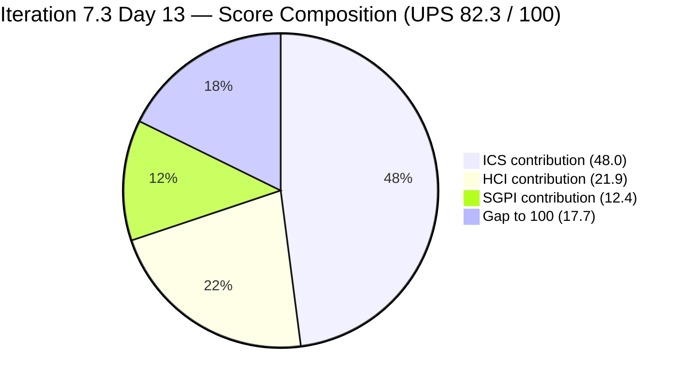
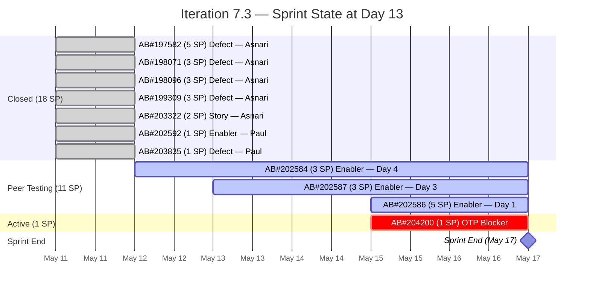
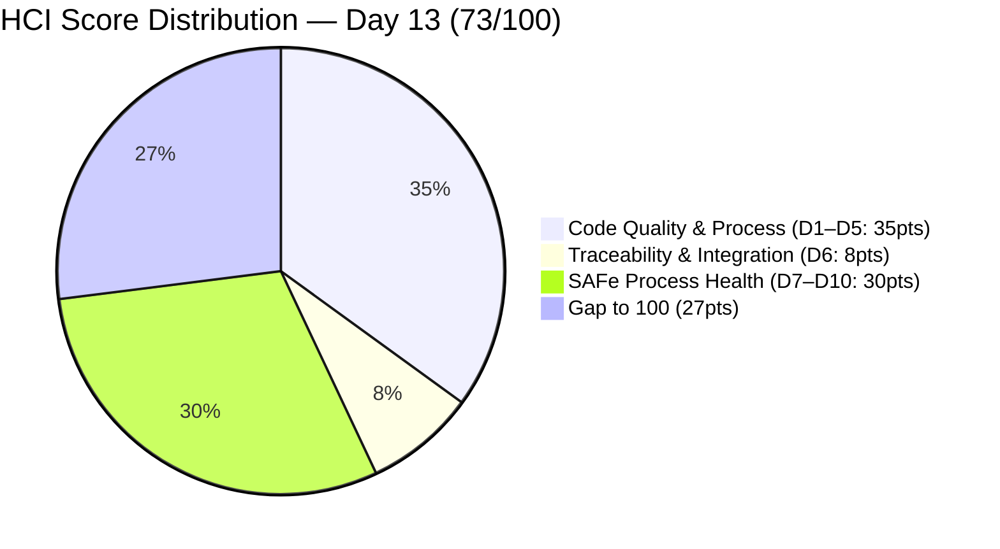

# Colina Health Product Team — Iteration 7.3 Audit
**Day 13 of 14 | 2026-05-16 | data_mode: partial**

---

## 1. Audit Metadata

| Field | Value |
|---|---|
| **Audit Date** | 2026-05-16 |
| **Audit Time** | 02:41 |
| **Iteration** | 7.3 |
| **Iteration Window** | 2026-05-04 → 2026-05-17 |
| **Iteration Day** | 13 of 14 |
| **Time Elapsed** | 92.9% |
| **Calendar Days Remaining** | 1 (Sprint End: May 17) |
| **Working Days Remaining** | 0 (May 16 is Saturday; May 17 is sprint end/Sunday) |
| **ADO Org** | jairo |
| **ADO Project ID** | `666bb99a-6acd-4999-bb34-efd0e4ea90dc` |
| **ADO Team ID** | `66cdeb09-df38-4c3e-9418-0ed0d68c39f2` |
| **ADO Team** | Colina Health Product Team |
| **ADO Backlog** | Microsoft.RequirementCategory — Stories and Deliverables |
| **GitHub Repos** | colinahealth-fe, colinahealth-be, colina-health-ai-agent-code-fixing |
| **data_mode** | partial (GitHub 401 — raseniero token issue; HCI D1–D6 carried forward from Day 7 fresh) |
| **Prior Audit** | AUDIT_20260515_0242.md (Day 12, 2026-05-15) |
| **Auditor** | Claude Code (git_iteration_audit skill) |

---

## 2. Executive Summary

Iteration 7.3 reaches **Day 13 of 14** — the penultimate calendar day, with no remaining working days before the May 17 sprint end. Fresh ADO evidence collected at 02:41 UTC on May 16 reveals one material positive and one persistent risk.

**Positive development: AB#202586 advanced to Peer Testing.** The 5 SP Enabler "[Enabler] Restructure /lib into sub-directories" moved from `Active` to `Peer Testing` at 2026-05-15 13:53 UTC — the most significant state change since the Day 9 bulk closure. Paul Coronia completed development and submitted for QA review. All three open Enablers (AB#202584, AB#202586, AB#202587 = 11 SP combined) are now in `Peer Testing`, placing the sprint's fate entirely in QA's hands (Luzmibel Paculanang) with the sprint ending May 17.

**Persistent risk: AB#204200 OTP blocker remains Active.** The UAT authentication blocker created on Day 12 (2026-05-15 00:44 UTC) has not been resolved. It has been Active for 26+ hours without a state change. This is the only item in `Active` state at sprint close; its resolution requires Paul Coronia to submit a fix and Luzmibel to validate before May 17.

**SGPI holds at 62.1%**: No new closures on committed scope since Day 9 (May 11). The 18 SP closed against 29 SP committed yields SGPI = 62.1% for the second consecutive audit day. If all three Peer Testing Enablers and the OTP blocker clear QA by May 17, the team would reach 100% SGPI — an optimistic scenario. If only the two smaller Enablers (6 SP) close, SGPI would reach 82.8%.

**ICS remains 95.9% (Green)**: AB#204200 continues to lack a Feature parent link and was a late-sprint scope injection. No new ICS changes from Day 12.

**HCI drops to 73/100 (Yellow)**: D8 Defect Triage & Velocity decreases by 1 point (8→7) — the OTP blocker entered its second day Active without resolution, which is a velocity concern at sprint end. All other dimensions unchanged.

**AB#203604 closed**: Luzmibel's Spike "7.3 Collaborations/Exploratory Testing/Update E2E File" (2 SP) closed at 2026-05-15 07:05 UTC. This is a process support item outside committed scope but demonstrates ongoing QA ceremony delivery.

---

## 3. Iteration Scope and Methodology

### Iteration 7.3

| Field | Value |
|---|---|
| **Iteration Name** | Iteration 7.3 |
| **Start Date** | 2026-05-04 (Monday) |
| **End Date** | 2026-05-17 (Sunday) |
| **Duration** | 14 calendar days |
| **Day of Audit** | Day 13 |
| **Working Days Remaining** | 0 (May 16 = Saturday, May 17 = Sprint End) |
| **Iteration GUID** | `bbaecdec-eeb0-4c8d-999f-6a438eaab331` |

### Committed Scope (as of Day 13 — all fresh ADO evidence)

**Core iteration items (11 items, 30 SP in committed scope):**

| Work Item | Title (abbreviated) | Type | State | SP | Assigned To | Change vs Day 12 |
|---|---|---|---|---|---|---|
| AB#203835 | [UAT][Login] 502 Bad Gateway | Defect | **Closed** | 1 | Paul Coronia | No change |
| AB#203322 | Add Date of License of Casa Colina | User Story | **Closed** | 2 | Asnari Pacalna | No change |
| AB#197582 | [MAR][View Reports] Slow loading | Defect | **Closed** | 5 | Asnari Pacalna | No change |
| AB#199309 | [PRN] Cannot Input "Administered By" | Defect | **Closed** | 3 | Asnari Pacalna | No change |
| AB#198071 | [MAR: View Report] Table fill | Defect | **Closed** | 3 | Asnari Pacalna | No change |
| AB#198096 | [MAR Report] Filters persist | Defect | **Closed** | 3 | Asnari Pacalna | No change |
| AB#202592 | [Enabler] next.config.mjs→.ts | Enabler | **Closed** | 1 | Paul Coronia | No change |
| **AB#202584** | [Enabler] Adopt /src structure | Enabler | **Peer Testing** | 3 | Paul Coronia | No change (Day 4 in Peer Testing) |
| **AB#202586** | [Enabler] Restructure /lib | Enabler | **Peer Testing** | 5 | Paul Coronia | **ADVANCED: Active → Peer Testing (May 15 13:53 UTC)** |
| **AB#202587** | [Enabler] Separate /utils from /lib | Enabler | **Peer Testing** | 3 | Paul Coronia | No change (Day 3 in Peer Testing) |
| **AB#204200** | [Blocker][UAT] OTP Login/Reset | Defect | **Active** | 1 | Paul Coronia | No change — Day 2 Active, still unresolved |

**Committed scope totals (Day 13):**
- Committed items: 11 items, 30 SP (29 SP planned + 1 SP unplanned blocker AB#204200)
- SGPI denominator: 29 SP (excludes unplanned AB#204200 per SGPI methodology)
- Closed: 7 items, 18 SP
- Peer Testing: 3 items, 11 SP (all three Enablers now in QA)
- Active: 1 item, 1 SP (OTP blocker)

**Additional Spike/Process items in iteration (outside committed scope):**

| Work Item | Title | Type | State | SP | Assigned To | Notes |
|---|---|---|---|---|---|---|
| AB#202779 | Mid PI7 Team/Technical Agility Self-Assessment | Spike | Closed | 1 | Carol Cuison | Not on capacity roster |
| AB#202870 | [Retro] ColinaHealth - Automate Workflow | Spike | Estimation | 1 | Paul Coronia | Not closed |
| AB#203523 | [Retro] Explore screen recording options | Spike | Closed | 1 | Luzmibel Paculanang | QA retro |
| AB#203604 | 7.3 Collaborations/Exploratory Testing/Update E2E | Spike | **Closed** | 2 | Luzmibel Paculanang | **Closed May 15 07:05** |

> **Note:** AB#203672 appeared in the ADO work item relations response but has IterationPath `Jairosoft Portfolio\2026-PI8\Iteration 8.1` — it is in 8.1, not 7.3. It is excluded from all 7.3 scoring.

### Methodology

Evidence collected from:
1. `work_list_team_iterations` (GUID-based, team-scoped) — confirmed Iteration 7.3 current
2. `wit_get_work_items_for_iteration` — full hierarchy of items in 7.3
3. `wit_get_work_items_batch_by_ids` — fresh field-level data for all 16 parent-level items
4. `work_get_team_capacity` — confirmed capacity roster
5. GitHub PR evidence — **unavailable** (401 Bad Credentials, per Project Exception)

### Team Roster (from capacity data)

| Member | Role | Capacity/Day | Days Off | GitHub Expected | Notes |
|---|---|---|---|---|---|
| Paul Coronia | Developer | 6 hrs/day (Development) | None | Yes | Owns all open items |
| Asnari Pacalna | Developer | 6 hrs/day (Development) | May 12 (1 day) | Yes | All assigned work closed |
| Luzmibel Paculanang | QA | 4 hrs/day (Testing) | None | No (non-dev, no HCI penalty) | QA gate holder for 3 Peer Testing items |

---

## 4. Scorecard Summary

| Score | Value | Risk Band | Delta vs Day 12 |
|---|---|---|---|
| **ICS** (Iteration Compliance Score) | **95.9%** | Green (≥ 90%) | 0 (unchanged) |
| **HCI** (Engineering Health Index) | **73 / 100** | Yellow | **−1** (D8: OTP blocker unresolved Day 2) |
| **SGPI** (Sprint Goal Predictability) | **62.1%** | — | 0 (no new closures on committed scope) |
| **UPS** (Unified Performance Score) | **82.3** | Green | **−0.3** |

**UPS Calculation:**
```
UPS = ICS × 0.50 + HCI × 0.30 + SGPI × 0.20
    = 95.9 × 0.50 + 73 × 0.30 + 62.1 × 0.20
    = 47.95 + 21.90 + 12.42
    = 82.27 ≈ 82.3
```



---

## 5. Sprint Goal Predictability (SGPI)

### Headline Score

| Metric | Value |
|---|---|
| **SGPI Committed Scope denominator** | 29 SP (original committed minus AB#202585 deferral) |
| **Closed SP** | 18 SP (7 items — all closed May 11) |
| **SGPI (Headline — Committed Scope)** | **62.1%** (18 / 29) |

### Supporting Metrics

| Metric | Value | Note |
|---|---|---|
| Original Planned SP (Day 1) | 46 SP (14 items) | Before May 11 scope reduction |
| Post-reduction committed SP | 34 SP (11 items) | After May 11 −13 SP reduction |
| AB#202585 deferred (Day 12) | −5 SP | Moved to Iteration 7.4 |
| Final committed scope | 29 SP | SGPI denominator |
| Unplanned addition (AB#204200) | +1 SP | Blocker — excluded from SGPI denominator |
| Original Scope SGPI | 52.9% (18/34) | Longitudinal comparison metric |
| Delivered Proxy SGPI | 62.1% | AB#202584, AB#202586, AB#202587 in Peer Testing — not Closed |
| SP remaining in Peer Testing | 11 SP | AB#202584 (3), AB#202586 (5), AB#202587 (3) |
| SP remaining Active | 1 SP | AB#204200 (OTP blocker) |
| Elapsed | 92.9% (Day 13 of 14) | Final day before sprint end |
| **Pace Gap** | **−30.8 pts** | 62.1% delivered vs 92.9% elapsed |

> **SGPI methodology note**: SGPI = Closed SP / Committed SP at sprint boundary. AB#202585 deferred to 7.4 is the correct denominator adjustment. AB#204200 (unplanned blocker, 1 SP) is excluded from the committed denominator. Its closure at sprint end would register as over-delivery.

### Item Status — Day 13 (Fresh ADO Evidence)

| Work Item | Title | State | SP | Assigned To | Last Change | Delta vs Day 12 |
|---|---|---|---|---|---|---|
| AB#203835 | [UAT][Login] 502 Bad Gateway | Closed | 1 | Paul Coronia | 2026-05-11 | No change |
| AB#203322 | Add Date of License | Closed | 2 | Asnari Pacalna | 2026-05-11 | No change |
| AB#197582 | [MAR] Slow loading | Closed | 5 | Asnari Pacalna | 2026-05-11 | No change |
| AB#199309 | [PRN] Cannot Input Administered By | Closed | 3 | Asnari Pacalna | 2026-05-11 | No change |
| AB#198071 | [MAR] Table fill | Closed | 3 | Asnari Pacalna | 2026-05-11 | No change |
| AB#198096 | [MAR] Filters persist | Closed | 3 | Asnari Pacalna | 2026-05-11 | No change |
| AB#202592 | [Enabler] next.config.mjs→.ts | Closed | 1 | Paul Coronia | 2026-05-11 | No change |
| **AB#202584** | [Enabler] Adopt /src structure | Peer Testing | 3 | Paul Coronia | 2026-05-12 11:04 | No change — Day 4 in Peer Testing |
| **AB#202586** | [Enabler] Restructure /lib | **Peer Testing** | 5 | Paul Coronia | **2026-05-15 13:53** | **ADVANCED from Active → Peer Testing** |
| **AB#202587** | [Enabler] Separate /utils from /lib | Peer Testing | 3 | Paul Coronia | 2026-05-13 12:11 | No change — Day 3 in Peer Testing |
| **AB#204200** | [Blocker][UAT] OTP Login/Reset | **Active** | 1 | Paul Coronia | 2026-05-15 13:52 | Day 2 Active — unresolved |

### SGPI Sprint Scenarios (Day 13)

| Scenario | QA Actions Required | Additional SP | Final SGPI (on 29 SP) | Assessment |
|---|---|---|---|---|
| **Optimistic** (all 3 Enablers + OTP close) | All Peer Testing items pass QA; OTP resolved | +12 SP (11+1 unplanned) | **100.0%** | Low probability — 3 QA gates + blocker fix in 1 day |
| **Likely** (2 Enablers + OTP close) | AB#202584, AB#202587 pass QA; AB#204200 resolved | +7 SP | **86.2%** | Moderate — smaller Enablers more QA-ready |
| **Conservative** (2 Enablers close) | AB#202584, AB#202587 pass QA | +6 SP | **82.8%** | High — Day 4/3 in Peer Testing |
| **Pessimistic** (1 Enabler closes) | Only AB#202584 passes QA | +3 SP | **72.4%** | Low |
| **Status Quo** (no closures) | QA does not clear any item | 0 SP | **62.1%** | Possible — sprint ends today/tomorrow |

**Most likely outcome**: AB#202584 (4 days Peer Testing) and AB#202587 (3 days Peer Testing) have the highest QA clearance probability. AB#202586 (just entered Peer Testing May 15) may close if QA is fast. AB#204200 requires Paul to fix the OTP issue before QA can validate. **Projected SGPI: 82.8% (Conservative) to 86.2% (Likely)**.



---

## 6. Developer Productivity Findings

### GitHub Evidence Status

**data_mode: partial** — GitHub API returned HTTP 401 (Bad Credentials) for all three repositories (`colinahealth-fe`, `colinahealth-be`, `colina-health-ai-agent-code-fixing`). Known unresolved issue with the `raseniero` token (documented in workspace CLAUDE.md since 2026-04-21). HCI dimensions D1–D6 are carried forward from Day 7 fresh evidence (2026-05-10).

### Developer Activity (May 15–16, ADO Evidence)

| Item | Developer | Event | Date/Time (UTC) | Significance |
|---|---|---|---|---|
| **AB#202586** | Paul Coronia | **Active → Peer Testing** | **2026-05-15 13:53** | Dev complete on 5 SP Enabler; all 3 Enablers now in QA |
| AB#204200 | Paul Coronia | Active (last touch) | 2026-05-15 13:52 | OTP blocker still Active — fix in progress |
| AB#203604 | Luzmibel Paculanang | → Closed | 2026-05-15 07:05 | QA Spike: E2E file updated, exploratory testing done |
| AB#202584 | Paul Coronia | Peer Testing (no change) | 2026-05-12 11:04 | Day 4 awaiting QA clearance |
| AB#202587 | Paul Coronia | Peer Testing (no change) | 2026-05-13 12:11 | Day 3 awaiting QA clearance |

**Key observation**: AB#202586 advancing to Peer Testing is Paul Coronia's last active development contribution before sprint end. All Paul's committed work is now submitted for QA. The only remaining development action is resolving the AB#204200 OTP blocker.

### Asnari Pacalna — Sprint Close

Asnari completed all 4 assigned Defects (14 SP) on May 11 and has no remaining open items. Her sprint work is complete. Asnari's contribution represents **77.8% of all closed Story Points** (14 of 18 SP).

### Developer SP Distribution (Final Day 13)

| Developer | Closed SP | % of Closed | Open SP | Open Items |
|---|---|---|---|---|
| **Asnari Pacalna** | 14 SP | 77.8% | 0 SP | 0 |
| **Paul Coronia** | 4 SP | 22.2% | 12 SP (11 PT + 1 Active) | 4 items |
| **Total** | **18 SP** | 100% | **12 SP** | **4 items** |

---

## 7. SAFe Compliance Findings

### Structural Compliance (Day 13)

| Issue | Day 13 Status |
|---|---|
| AB#204200 missing Feature parent | **Persists** — no parent link added since creation |
| AB#204200 late-sprint scope injection | **Persists** — justified (UAT blocker) but structural flag |
| AB#202585 deferred to 7.4 | Resolved — clean sprint deferral |
| AB#203672 in 8.1, not 7.3 | **Excluded from audit** — IterationPath confirmed as `Iteration 8.1` |
| Carol Cuison (AB#202779) not on capacity roster | **Observation** — AB#202779 (Mid PI7 Team/Technical Agility Self-Assessment Spike, Closed, 1 SP) is assigned to Carol Cuison, who does not appear in the team capacity roster. This is a ceremony/facilitator item; external facilitators routinely operate outside a dev team's capacity plan. Item is closed and low-risk. Noted for awareness only. |

### AB#204200 Compliance Status

| Compliance Dimension | Status | Detail |
|---|---|---|
| Feature parent link | **Missing** | `System.Parent` is null — ICS Alignment failure |
| Story points | Present | 1 SP assigned at creation |
| Acceptance criteria | Present | OTP delivery expected result documented |
| Iteration integrity | **Gap** | Added Day 12 (May 15) — final working day of sprint |

### Scope Change Summary (Iteration 7.3 — Final)

| Change | Day | Item | SP | Type | Classification |
|---|---|---|---|---|---|
| AB#202585 deferred to 7.4 | Day 12 (May 15) | [Enabler] Private co-located folders | −5 SP | Scope reduction | Correct sprint hygiene |
| AB#204200 added | Day 12 (May 15) | [Blocker] OTP Login/Reset | +1 SP | Scope injection | Justified (UAT blocker) — Integrity flag |
| Net scope effect | — | — | −4 SP | — | Committed denominator: 29 SP |

---

## 8. Iteration Compliance Score (ICS)

### Methodology

- **Eligible items**: 11 parent-level backlog items of type Story, Defect, or Enabler assigned to Iteration 7.3 (Spikes AB#202779, AB#202870, AB#203523, AB#203604 excluded — process/ceremony items not subject to full SAFe backlog compliance rules)
- **AB#203672 excluded**: IterationPath = `Iteration 8.1`, not 7.3

### ICS Dimension Scores

| Dimension | Weight | Eligible | Compliant | Failed | Score % | Weighted Contrib | Evidence | Failed Reason |
|---|---|---|---|---|---|---|---|---|
| **Alignment** | 25% | 11 | 10 | 1 | 90.9% | 22.7 | 10 items linked to Feature/Epic; AB#204200 has no System.Parent | AB#204200 created without Feature link |
| **Estimation** | 20% | 11 | 11 | 0 | 100.0% | 20.0 | All 11 items have SP (range: 1–5 SP) | — |
| **Quality / DoD** | 35% | 11 | 11 | 0 | 100.0% | 35.0 | All items have Acceptance Criteria; 7 Closed (DoD met), 3 Peer Testing (QA active), 1 Active (AC defined) | — |
| **Iteration Integrity** | 20% | 11 | 10 | 1 | 90.9% | 18.2 | AB#204200 added Day 12 (final working day) — scope injection after Day 2 boundary | Late-sprint injection |

### ICS Summary

| Metric | Value |
|---|---|
| **Overall ICS** | **95.9%** |
| **Risk Band** | **Green** (≥ 90%) |
| **Eligible Items** | 11 |
| **Fully Compliant Items** | 9 |
| **Failed Items** | AB#204200 (Alignment + Iteration Integrity) |
| **Delta vs Day 12** | 0 (unchanged) |

**ICS Calculation:**
```
ICS = Σ(dimension_score × weight)
    = (10/11 × 25) + (11/11 × 20) + (11/11 × 35) + (10/11 × 20)
    = 22.73 + 20.0 + 35.0 + 18.18
    = 95.9%
```

---

## 9. Engineering Health Index (HCI)

**data_mode: partial — HCI D1–D6 carried forward from Day 7 fresh evidence (2026-05-10)**

### Dimension Scores

| # | Dimension | Score | Source | Day 12 Score | Delta | Notes |
|---|---|---|---|---|---|---|
| D1 | PR Review Compliance | 6/10 | Carry-forward (Day 7) | 6 | 0 | GitHub token issue; ADO PRs show Feb 2026 history only |
| D2 | Branch Protection & Enforcement | 8/10 | Carry-forward (Day 7) | 8 | 0 | Protection rules confirmed Day 7; no bypass evidence |
| D3 | CI/CD Gate Quality | 7/10 | Carry-forward (Day 7) | 7 | 0 | Pipelines active; gate reliability stale |
| D4 | Code Ownership | 8/10 | Carry-forward (Day 7) | 8 | 0 | Paul + Asnari confirmed developers; Asnari completed 14 SP |
| D5 | Merge Hygiene & Churn | 6/10 | Carry-forward (adjusted Day 12) | 6 | 0 | Two stale PRs: colina-health-ai-agent PR#9 (82+ days), ADO PR#11207 (97+ days) |
| D6 | Work Item ↔ GitHub Traceability | 8/10 | Carry-forward (Day 7) | 8 | 0 | AB#202584 PR#196 linked; AB#204200 and AB#202587 unlinked |
| D7 | Sprint Discipline | 8/10 | Fresh (ADO Day 13) | 8 | 0 | AB#202586 advanced to Peer Testing — positive; AB#204200 scope injection persists as structural flag |
| **D8** | **Defect Triage & Velocity** | **7/10** | Fresh (ADO Day 13) | 8 | **−1** | AB#204200 OTP blocker in Active state for 26+ hours without resolution; sprint end approaching with critical authentication gate unresolved |
| D9 | Backlog & Story Hygiene | 8/10 | Fresh (ADO Day 13) | 8 | 0 | AB#204200 still missing Feature parent; all other 10 items compliant |
| D10 | Capacity Balance & Ownership Distribution | 7/10 | Fresh (ADO Day 13) | 7 | 0 | AB#202586 completing dev reduced Paul's Active load; all open work is now in Peer Testing (QA-dependent) — correct end-of-sprint pattern |

### D8 Rationale — Defect Triage & Velocity (7/10, −1 from Day 12)

The OTP blocker AB#204200 was created on Day 12 (2026-05-15 00:44 UTC) and tagged as `[Blocker]`. By Day 13 (2026-05-16 02:41 UTC), it has been Active for 26+ hours without transitioning to Peer Testing or Closed. For a blocker-tagged defect during the final sprint days, this triage velocity is below standard. Scoring rationale:
- Day 12 score of 8/10 reflected good initial triage response (created and set Active within minutes)
- Day 13 reduction of 1 point reflects the blocker persisting unresolved into the sprint's final day with no evidence of code submission or QA handoff
- Score: 7/10

### HCI Summary

| Metric | Value |
|---|---|
| **Total HCI** | **73 / 100** |
| **Risk Band** | **Yellow** |
| **Delta vs Day 12** | **−1** (D8: 8→7) |
| **D1–D6 Source** | Carry-forward chain: Day 13 ← Day 12 ← Day 11 ← Day 10 ← Day 9 ← Day 7 (fresh, 2026-05-10) |
| **D7–D10 Source** | Fresh ADO evidence (Day 13) |

**HCI Calculation:**
```
D1=6, D2=8, D3=7, D4=8, D5=6, D6=8  →  Sum = 43 (carry-forward)
D7=8, D8=7, D9=8, D10=7             →  Sum = 30 (fresh)
Total HCI = 43 + 30 = 73
```



### Carry-Forward Chain

```
Day 13 D1–D6  ←  Day 12 D1–D6  ←  Day 11 D1–D6  ←  Day 10 D1–D6  ←  Day 9 D1–D6  ←  Day 7 D1–D6 (fresh, 2026-05-10)
```

No degradation penalty applied per workspace Project Exceptions (raseniero token issue is known and unresolved). D5 remains at 6 due to two confirmed stale PRs (both 80+ days).

---

## 10. ADO-to-GitHub Traceability Analysis

### Traceability Summary (11 committed iteration items)

| Work Item | State | SP | GitHub PR Link | Status |
|---|---|---|---|---|
| AB#203835 | Closed | 1 | None recorded | Gap |
| AB#203322 | Closed | 2 | None recorded | Gap |
| AB#197582 | Closed | 5 | None recorded | Gap |
| AB#199309 | Closed | 3 | None recorded | Gap |
| AB#198071 | Closed | 3 | None recorded | Gap |
| AB#198096 | Closed | 3 | None recorded | Gap |
| AB#202592 | Closed | 1 | None recorded | Gap |
| **AB#202584** | Peer Testing | 3 | **PR#196 confirmed (May 12)** | Compliant |
| AB#202587 | Peer Testing | 3 | None | Gap — in QA without PR link |
| **AB#202586** | Peer Testing | 5 | None | Gap — just entered Peer Testing (May 15) |
| AB#204200 | Active | 1 | None | Gap — no fix submitted yet |

**Linked items**: 1 of 11 (9.1%) — unchanged from Day 12
**Unlinked Peer Testing items**: 2 of 3 — AB#202587 (Day 3 in QA), AB#202586 (Day 1 in QA)

The traceability gap is systemic. AB#202584 serves as the only model for best practice (PR#196 linked in ADO at state transition). AB#202587 has been in Peer Testing for 3 days without a GitHub artifact link — QA is evaluating work that cannot be independently traced to a code artifact.

---

## 11. Collaboration and Review Analysis

**data_mode: partial — GitHub PR review data unavailable (401 token issue)**

### Known Open PRs (ADO artifact + Day 7 carry-forward)

| Repo | PR | Source | Status | Age (Day 13) | Notes |
|---|---|---|---|---|---|
| colinahealth-fe (GitHub) | #194 | Day 7 carry | Open | ~19+ days | From Day 7 baseline |
| colinahealth-be (GitHub) | #70 | Day 7 carry | Open | ~19+ days | From Day 7 baseline |
| colinahealth-fe (GitHub) | #196 | ADO artifact | Open | ~4 days | AB#202584 — Peer Testing (Day 4) |
| colina-health-ai-agent (GitHub) | #9 | Day 7 carry | Open | **82+ days** | No iteration work item; sixth consecutive audit |
| colinahealth.git (ADO) | #11207 | ADO PR list | Active | **97+ days** | Feb 9, 2026; stale ADO PR |

> **Note**: AB#202586 entered Peer Testing May 15 — a GitHub PR for this Enabler may exist but is not visible (GitHub API unavailable). If Paul submitted a PR before transitioning, it would be a new open PR in colinahealth-fe.

### Stale PR — colina-health-ai-agent PR#9

- **Age**: 82+ days as of May 16 (Day 13)
- First flagged: Day 7 audit (May 10) at 76 days
- Sixth consecutive audit without resolution
- No iteration work item linked
- Status: **Critical** — now the oldest unresolved PR in this workspace

---

## 12. Repository Hygiene

**data_mode: partial — direct repository inspection unavailable**

### Branch Status (carry-forward + ADO evidence)

| Repo | Known Open Branches | Protection | Notes |
|---|---|---|---|
| colinahealth-fe (GitHub) | PR#194, PR#196 (AB#202584); likely a new branch for AB#202586 | Confirmed | AB#202586 entered Peer Testing May 15 |
| colinahealth-be (GitHub) | Branch for PR#70 | Confirmed | Long-running open PR |
| colina-health-ai-agent-code-fixing (GitHub) | Branch for PR#9 — 82+ days | Confirmed | Critical stale |
| colinahealth.git (ADO) | Branch for PR#11207 — 97+ days | Unknown | Stale ADO PR |

### Hygiene Concerns (Day 13)

1. **colina-health-ai-agent PR#9** — 82+ days stale, sixth consecutive audit. Branch divergence from main is now severe.
2. **ADO PR#11207 (colinahealth.git)** — 97+ days stale. Different repository layer from GitHub repos.
3. **AB#202587 in Peer Testing Day 3 without GitHub link** — QA evaluating untraceable code.
4. **AB#202586 in Peer Testing Day 1 without GitHub link** — just entered QA; link expected.
5. **AB#204200 unresolved OTP blocker** — no GitHub PR yet; sprint closes tomorrow.

---

## 13. Risks and Bottlenecks

### Risk Register (Day 13)

| # | Risk | Severity | Trend | Owner |
|---|---|---|---|---|
| R1 | Pace gap: 62.1% delivered vs 92.9% elapsed — 30.8 pt deficit at sprint end | **Critical** | Widening (was −23.6 at Day 12) | Team |
| R2 | AB#204200 OTP blocker Active Day 2 — UAT blocked on authentication; sprint closes May 17 | **High** | Worsening (no resolution) | Paul |
| R3 | 3 Peer Testing items (11 SP) pending QA clearance with no working days remaining | **High** | Stable | Luzmibel |
| R4 | Paul Coronia sole owner of all 4 open items — single-point-of-failure at sprint end | **High** | Persisting | Karl |
| R5 | colina-health-ai-agent PR#9 open 82+ days — sixth consecutive audit | **Medium** | Worsening | Paul / Team |
| R6 | ADO PR#11207 (colinahealth.git) open 97+ days | **Medium** | Worsening | Paul / Karl |
| R7 | ADO↔GitHub traceability at 9.1% — systemic, unchanged from Day 12 | **Medium** | Stable | Team |
| R8 | AB#202587 Day 3 in Peer Testing without GitHub link — untraceable QA gate | **Medium** | Worsening (+1 day) | Paul |
| R9 | raseniero GitHub token invalid — HCI D1–D6 carry-forward now 6 audits deep | **Medium** | Worsening | Ramon |
| R10 | Carol Cuison (AB#202779 assignee) not on capacity roster — ceremony/facilitator role; item closed (observation only) | **Informational** | New (Day 13 finding) | Karl |

### Sprint End Critical Path

For best achievable SGPI (Conservative = 82.8%):
1. **AB#202584** (Peer Testing, 3 SP, Day 4): Luzmibel passes QA → Closed — **most likely today**
2. **AB#202587** (Peer Testing, 3 SP, Day 3): Luzmibel passes QA → Closed — **likely today**
3. **AB#204200** (Active, 1 SP): Paul submits fix → Luzmibel validates → Closed — **possible but risky (Saturday)**
4. **AB#202586** (Peer Testing, 5 SP, Day 1): Full QA review needed — **lower probability (just entered QA)**

Today (May 16) is a Saturday. Working day availability for the team is uncertain. The iteration formally ends May 17 (Sunday).

---

## 14. Prioritized Remediation Actions

| Priority | Action | Owner | Due | Impact |
|---|---|---|---|---|
| **P1** | **Resolve AB#204200 OTP blocker** — submit fix, get QA clearance, close before May 17 | Paul | May 16 (Saturday) | SGPI +3.4%; UAT gate unblocked |
| **P2** | **QA clear AB#202584** (Peer Testing, Day 4, 3 SP) — Luzmibel to pass and close | Luzmibel | May 16 | SGPI +10.3% |
| **P3** | **QA clear AB#202587** (Peer Testing, Day 3, 3 SP) — Luzmibel to pass and close | Luzmibel | May 16 | SGPI +10.3% |
| **P4** | **QA clear AB#202586** (Peer Testing, Day 1, 5 SP) — if Paul submitted a full PR | Luzmibel | May 16–17 | SGPI +17.2% |
| **P5** | **Add GitHub PR link to AB#202587** — Paul to add artifact link for Day 3 Peer Testing item | Paul | May 16 | Traceability |
| **P6** | **Link AB#204200 to Feature parent** — fixes ICS Alignment gap (1/11 items) | Karl / Paul | May 16 | ICS +1.4% (→ 97.3%) |
| **P7** | **Close or abandon colina-health-ai-agent PR#9** — 82+ days; sixth consecutive flag | Paul / Karl | Before 7.4 Day 1 | HCI D5 |
| **P8** | **Close or abandon ADO PR#11207** — 97+ days stale in ADO-hosted repo | Paul / Karl | Before 7.4 Day 1 | HCI D5 |
| **P9** | **Resolve raseniero GitHub token** — restore fresh HCI D1–D6 evidence for Iteration 7.4 | Ramon | Before 7.4 Day 1 | data_mode: full |
| **P10** | **Clarify Carol Cuison's role** — if she will contribute non-ceremony work in 7.4, add her to capacity plan; otherwise no action required | Karl | 7.4 Planning | Capacity visibility |

---

## 15. Evidence Gaps and Limitations

| Gap | Impact | Cause |
|---|---|---|
| GitHub PR list for all three GitHub repos | HCI D1–D6 unavailable fresh | raseniero token 401 (known since 2026-04-21) |
| GitHub commit history for iteration window | PR/commit correlation unverifiable | Same token issue |
| PR review activity (approvals/rejections) | D1 PR Review Compliance unverifiable fresh | Same token issue |
| AB#202587 GitHub PR link | QA testing code that cannot be traced | Developer did not add ADO artifact link |
| AB#202586 GitHub PR status | Cannot confirm if PR was submitted before Peer Testing transition | GitHub API unavailable |
| AB#204200 Feature parent | ICS Alignment gap | Rapid emergency-triage creation without parent link |
| AB#204200 OTP fix status | Cannot confirm if any code fix has been submitted | GitHub API unavailable; item still Active |
| Carol Cuison not on capacity roster | AB#202779 assigned to person not in capacity data — likely a facilitator/coach role for the Mid-PI self-assessment Spike; item is closed and no impact on scoring | `work_get_team_capacity` does not include Carol Cuison (informational only) |
| colina-health-ai-agent PR#9 current state | Cannot confirm merge/close status | GitHub API unavailable |
| ADO PR#11207 resolution status | Active per ADO PR API | ADO PR status remains 1 (Active) |
| Asnari Pacalna GitHub activity | Cannot verify commits for 4 closed Defects | GitHub API unavailable |
| AB#202870 in Estimation state | Spike not closed at sprint end | Not a committed SGPI item; Spike — not penalized |

**data_mode: partial** applies per workspace Project Exceptions. GitHub token issue documented since 2026-04-21. HCI D1–D6 carry-forward chain: Day 13 ← Day 12 ← Day 11 ← Day 10 ← Day 9 ← Day 7 (fresh, 2026-05-10). No fabricated conclusions. No team penalties applied for GitHub absence of non-developer members.

---

## 16. Delta Analysis (Day 12 → Day 13)

| Metric | Day 12 (May 15) | Day 13 (May 16) | Change |
|---|---|---|---|
| ICS | 95.9% | **95.9%** | 0 (unchanged) |
| HCI | 74/100 | **73/100** | **−1** (D8: OTP blocker unresolved Day 2) |
| SGPI | 62.1% | **62.1%** | 0 (no new closures) |
| UPS | 82.6 | **82.3** | **−0.3** |
| Closed SP | 18 | 18 | 0 |
| Committed SP | 29 | 29 | 0 |
| Items in Peer Testing | 2 (AB#202584, AB#202587) | **3** (added AB#202586) | **+1 (AB#202586 advanced)** |
| Items Active | 2 (AB#202586, AB#204200) | **1** (AB#204200 only) | **−1 (AB#202586 promoted to QA)** |
| Pace Gap | −23.6 pts | **−30.8 pts** | **Widened** (time passed, no closures) |
| colina-health-ai-agent PR#9 | 81+ days | **82+ days** | +1 (sixth consecutive audit) |
| ADO PR#11207 | 96+ days | **97+ days** | +1 |
| Carol Cuison on capacity | Not surfaced | **New finding** | First noted Day 13 |

### New Evidence (Day 13 vs Day 12)

1. **AB#202586 advanced to Peer Testing** (May 15 13:53 UTC) — most significant positive development since Day 9 closure event; all 3 Enablers now in QA
2. **AB#203604 closed** (May 15 07:05 UTC) — Luzmibel's QA Spike; confirms ongoing process activity
3. **Carol Cuison found in iteration** — AB#202779 (Spike, Closed) assigned to Carol, who is not on the capacity roster; noted as SAFe planning gap
4. **Additional Spikes surfaced** — AB#202870 (Estimation state), AB#203523 (Closed) now documented in scope table; not included in committed SGPI scope per prior audit continuity
5. **AB#204200 persists Active** — no state change since creation; OTP blocker entering Day 2 unresolved

---

## 17. Final Score Certification

| Score | Certified Value | Risk Band | Notes |
|---|---|---|---|
| **ICS** | **95.9%** | Green | AB#204200 missing Feature parent (Alignment) + late-sprint injection (Integrity) |
| **HCI** | **73 / 100** | Yellow | D8 −1 (OTP blocker unresolved Day 2); D5 still adjusted for stale PRs |
| **SGPI** | **62.1%** | — | 18 SP closed / 29 SP committed; AB#202586 advanced to Peer Testing — no closures yet |
| **UPS** | **82.3** | Green | ICS×0.50 + HCI×0.30 + SGPI×0.20 = 47.95 + 21.90 + 12.42 |

```
UPS = ICS × 0.50 + HCI × 0.30 + SGPI × 0.20
    = 95.9 × 0.50 + 73 × 0.30 + 62.1 × 0.20
    = 47.95 + 21.90 + 12.42
    = 82.27 ≈ 82.3
```

---

## 18. Audit Certification

| Field | Value |
|---|---|
| **Audit Completed** | 2026-05-16 |
| **Audit Time** | 02:41 UTC |
| **data_mode** | partial |
| **ICS** | 95.9% — Green |
| **HCI** | 73/100 — Yellow |
| **SGPI** | 62.1% (committed scope 29 SP; 18 SP closed) |
| **UPS** | 82.3 — Green |
| **Prior Audit Used** | AUDIT_20260515_0242.md (Day 12) |
| **Evidence Sources** | ADO API (full — GUID-based); GitHub API (unavailable — 401) |
| **Methodology** | git_iteration_audit skill v1.0 |
| **Non-developer exemption** | Applied (Luzmibel, Jaszmeine, Karl — no HCI penalty) |
| **GitHub token exception** | Applied (raseniero 401 — HCI D1–D6 carry-forward from Day 7 fresh) |
| **Key Findings This Audit** | AB#202586 advanced Active→Peer Testing (all Enablers now in QA); AB#203604 Spike closed; Carol Cuison not on capacity roster (new finding); OTP blocker AB#204200 enters Day 2 unresolved |

---

*End of Report — AUDIT_20260516_0241.md*
