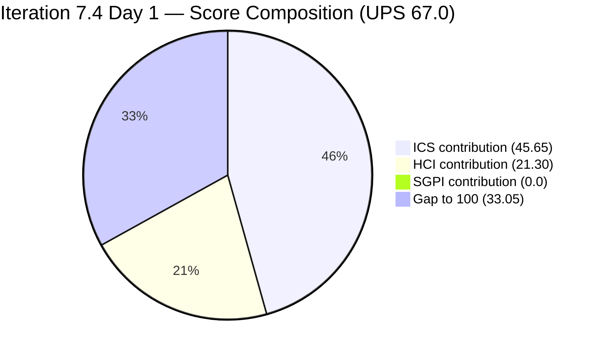
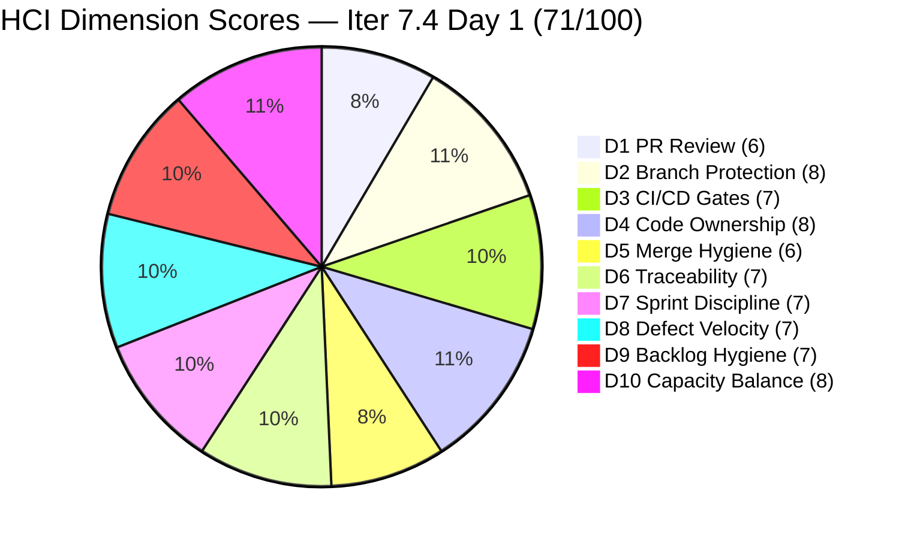

# Colina Health Product Team — Iteration 7.4 Audit
**Day 1 of 14 | 2026-05-18 | data_mode: partial**

---

## 1. Audit Metadata

| Field | Value |
|---|---|
| **Audit Date** | 2026-05-18 |
| **Audit Time** | 09:00 |
| **Iteration** | Iteration 7.4 |
| **Iteration ID** | `16385d00-244a-4caa-9e56-d4a8e850754d` |
| **Iteration Window** | 2026-05-18 → 2026-05-31 |
| **Iteration Day** | 1 of 14 |
| **Time Elapsed** | 7.1% |
| **Phase** | Sprint Start |
| **ADO Org** | jairo |
| **ADO Project ID** | `666bb99a-6acd-4999-bb34-efd0e4ea90dc` |
| **ADO Team ID** | `66cdeb09-df38-4c3e-9418-0ed0d68c39f2` |
| **ADO Team** | Colina Health Product Team |
| **ADO Backlog** | Microsoft.RequirementCategory — Stories and Deliverables |
| **GitHub Repos** | colinahealth-fe, colinahealth-be, colina-health-ai-agent-code-fixing |
| **data_mode** | partial (GitHub API 401 — raseniero token issue; HCI D1–D6 carried forward from Day 7 fresh evidence 2026-05-10) |
| **Prior Audit** | AUDIT_20260517_0241.md (Iteration 7.3 Final — Day 14) |
| **Auditor** | Claude Code (git_iteration_audit skill) |

---

## 2. Executive Summary

Iteration 7.4 opens on **Day 1 (May 18)** with the team carrying forward significant unresolved work from the Iteration 7.3 close. The sprint begins with **12 ICS-eligible items totaling 48 SP** committed to the `2026-PI7\Iteration 7.4` path — the largest committed scope in the current audit history for this team.

**Critical carryover situation:** Three Enablers (AB#202584, AB#202586, AB#202587 — 11 SP combined) and one Active blocker (AB#204200 — OTP authentication failure) exited Iteration 7.3 unresolved and appear in the Iteration 7.4 planning view. However, **AB#204200 and AB#202586 still have IterationPath = `Iteration 7.3`** as of audit time — their paths have not yet been updated to 7.4. This is a scope hygiene action required on Day 1.

**ICS opens at 91.3% (Green).** Three defects (199041, 200027, 200194) lack `System.Description` — DoD failures on 3 of 12 eligible items. Two items (AB#202586 and AB#204200) are in the iteration hierarchy but their ADO IterationPath fields still point to 7.3 — a scope hygiene action required on Day 1 (these items are excluded from the eligible set and do not affect ICS).

**SGPI is 0.0% (0/48 SP)** — Day 1, expected. The team has two items already in `Ready for QA` (AB#199041 and AB#200219) and one in `Ready for QA` at sprint start (AB#203320), suggesting QA activity can begin immediately without new dev work.

**HCI opens at 71/100 (Yellow).** D1–D6 carry forward from Day 7 of Iteration 7.3 (2026-05-10). D7 Sprint Discipline scores 7/10 — the large scope volume (48 SP, 12 eligible items) combined with 3 carryover Enablers still in QA creates compounded sprint-start risk. D8 Defect Velocity opens at 7/10 — the OTP blocker (AB#204200) entered 7.4 Active and unresolved, now escalated to Day 1 priority.

**New roster addition confirmed:** The 7.4 capacity roster now includes **Asnari Pacalna** (7 hrs/day Development) — she was absent from the 7.3 ADO capacity roster despite being the primary defect developer in 7.3. Her formal addition strengthens the team's planning credibility for 7.4.

**New team member: Carol Cuison.** AB#204232 (Spike — PR Approval automation) is assigned to Carol Cuison. She appeared in the 7.3 audit closing AB#202779 but was not on the capacity roster. Her Spike assignment in 7.4 suggests a process/DevOps contributor role.

The raseniero GitHub token issue (401 Bad Credentials) remains unresolved, now entering its fourth week. The HCI D1–D6 carry-forward chain is now **8 audits deep** from the May 10 fresh baseline — the oldest GitHub evidence in the carry-forward is 8 days stale on Day 1 of 7.4.

---

## 3. Iteration Scope and Methodology

### Iteration 7.4

| Field | Value |
|---|---|
| **Iteration Name** | Iteration 7.4 |
| **Iteration ID** | `16385d00-244a-4caa-9e56-d4a8e850754d` |
| **Start Date** | 2026-05-18 (Monday) |
| **End Date** | 2026-05-31 (Sunday) |
| **Duration** | 14 calendar days |
| **Day of Audit** | Day 1 |
| **Working Days Remaining** | ~14 |

### ICS-Eligible Items (parent-level, in 7.4 iteration path)

Items are classified as ICS-eligible if their `System.WorkItemType` is Story, Defect, or Enabler AND their `System.IterationPath` = `Jairosoft Portfolio\2026-PI7\Iteration 7.4`. Spikes are excluded from ICS per skill standard. Items with IterationPath still pointing to 7.3 are flagged as Iteration Integrity gaps.

**ICS-eligible items (12 items, 48 SP):**

| ID | Title (abbreviated) | Type | State | SP | Assigned To | Parent | Description | AC | 7.4 Path |
|---|---|---|---|---|---|---|---|---|---|
| **198098** | [MAR][PRN] No warning message for exceeded daily limit | Defect | Ready for Dev | 5 | Asnari Pacalna | 201646 | Yes | Yes | Yes |
| **199041** | [MAR] Page auto-loads on page number entry | Defect | Ready for QA | 2 | Asnari Pacalna | 201646 | **NO** | Yes | Yes |
| **200027** | [MAR][PRN] Sorting Options Not Working | Defect | Ready for Dev | 3 | Asnari Pacalna | 201646 | **NO** | Yes | Yes |
| **200194** | [Workflow][Update Med Log] First letter remains after delete | Defect | Active | 2 | Asnari Pacalna | 201680 | **NO** | Yes | Yes |
| **200219** | [MAR] Order By/Sort By limits table to Hawaii date | Defect | Ready for QA | 5 | Asnari Pacalna | 201646 | Yes | Yes | Yes |
| **202585** | [Enabler] Private co-located folders (_components, etc.) | Enabler | Ready for Dev | 5 | Paul Coronia | 201281 | Yes | Yes | Yes |
| **202588** | [Enabler] Migrate data fetching to Server Components + RSC | Enabler | New | 13 | Paul Coronia | 201281 | Yes | Yes | Yes |
| **202597** | [Enabler] Parallel data fetching with Promise.all | Enabler | Ready for Dev | 3 | Paul Coronia | 201281 | Yes | Yes | Yes |
| **202600** | [Enabler] Consolidate test directories under /tests | Enabler | Ready for Dev | 2 | Paul Coronia | 201281 | Yes | Yes | Yes |
| **202602** | [Enabler] URL-first state hierarchy | Enabler | Ready for Dev | 5 | Paul Coronia | 201281 | Yes | Yes | Yes |
| **202603** | [Enabler] Evaluate shadcn/ui vs NextUI | Enabler | Ready for Dev | 3 | Paul Coronia | 201281 | Yes | Yes | Yes |
| **203320** | [MAR][View Report] Long medication names break layout | Defect | Ready for QA | 2 | Asnari Pacalna | 201646 | Yes | Yes | Yes |

**Total committed SP: 48 SP** (12 ICS-eligible items: 6 Defects + 6 Enablers)

**Items appearing in 7.4 iteration hierarchy but still on 7.3 iteration path (excluded from ICS — Integrity violation pending path correction):**

| ID | Title | Type | State | SP | IterationPath | Issue |
|---|---|---|---|---|---|---|
| 204200 | [Blocker][UAT] Unable to Receive OTP | Defect | Active | 1 | Jairosoft Portfolio\2026-PI7\**Iteration 7.3** | Path not updated to 7.4 |
| 202586 | [Enabler] Restructure /lib into sub-directories | Enabler | Peer Testing | 5 | Jairosoft Portfolio\2026-PI7\**Iteration 7.3** | Path not updated to 7.4 |

**Spikes (excluded from ICS, in 7.4 path):**

| ID | Title | Type | State | SP | Assigned To |
|---|---|---|---|---|---|
| 204232 | [Retro] Update / Automate PR Approval Process | Spike | New | — | Carol Cuison |
| 204233 | [Retro] Hidden API Endpoint — POC | Spike | New | — | Paul Coronia |
| 204291 | 7.4 Collaborations / Exploratory Testing / Update E2E | Spike | New | 2 | Luzmibel Paculanang |

### Team Capacity (from ADO)

| Member | Role | Capacity/Day | Days Off | GitHub Expected | Notes |
|---|---|---|---|---|---|
| Paul Coronia | Developer | 6 hrs/day (Development) | None | Yes | Assigned all Enablers + 2 carryover Enablers |
| Asnari Pacalna | Developer | 7 hrs/day (Development) | None | Yes | **Formally added to roster for 7.4** — assigned all defects |
| Luzmibel Paculanang | QA | 6 hrs/day (Testing) | May 25–26 (2 days) | No (non-dev, no penalty) | QA gate for 3 Ready for QA items |
| **Total** | | **19 hrs/day** | **2 days off** | | |

> Notable: Asnari Pacalna now formally appears on the ADO capacity roster for Iteration 7.4 at 7 hrs/day. This resolves the capacity-roster hygiene gap flagged in every prior audit since Iteration 7.2. Carol Cuison appears on a Spike but is not in the capacity response — consistent with her process/facilitator role.

### Methodology

Evidence collected from:
1. `work_list_team_iterations` (GUID-based, team-scoped, timeframe=current) — confirmed Iteration 7.4 active
2. `wit_get_work_items_for_iteration` — full hierarchy of items in 7.4
3. `wit_get_work_items_batch_by_ids` — fresh field-level data for all 17 parent-level items
4. `work_get_team_capacity` — capacity roster (Paul, Asnari, Luzmibel confirmed)
5. GitHub API (GitHub-hosted repos) — **unavailable**: HTTP 401 Bad Credentials (raseniero token issue, confirmed fresh 2026-05-18)
6. Prior audit AUDIT_20260517_0241.md used for delta context and HCI D1–D6 carry-forward baseline

---

## 4. Scorecard Summary



| Score | Value | Risk Band | Delta vs 7.3 Final |
|---|---|---|---|
| **ICS** (Iteration Compliance Score) | **91.3%** | Green (≥ 90%) | **−4.6** from 7.3 final (95.9%) |
| **HCI** (Engineering Health Index) | **71 / 100** | Yellow | **0** from 7.3 final (71/100) |
| **SGPI** (Sprint Goal Predictability) | **0.0%** | Early Sprint (Day 1) | n/a |
| **UPS** (Unified Performance Score) | **67.0** | Yellow | — (suppressed by early-sprint SGPI) |

**UPS Calculation:**
```
UPS = ICS × 0.50 + HCI × 0.30 + SGPI × 0.20
    = 91.3 × 0.50 + 71 × 0.30 + 0.0 × 0.20
    = 45.65 + 21.30 + 0.00
    = 66.95 ≈ 67.0
```

> **Note on UPS Day 1:** UPS is artificially suppressed on Day 1 by the 0% SGPI. The meaningful Day 1 headline scores are ICS (91.3%) and HCI (71/100). Use ICS + HCI as primary leading indicators through Day 5 of the sprint.

> **ICS Note:** ICS opens at 91.3% (Green), a 4.6-point drop from the 7.3 final value of 95.9%. The dip is driven entirely by three defects with missing `System.Description` fields (199041, 200027, 200194) — a Quality/DoD failure on 3 of 12 eligible items. Correcting these three descriptions would restore ICS to 100%. The two carryover items with stale 7.3 IterationPath (AB#204200 and AB#202586) are excluded from the ICS eligible set and do not affect the score; their path corrections are scope hygiene actions only.

---

## 5. Sprint Goal Predictability (SGPI)

### Headline Score

```
SGPI = Closed Parent SP / Total Committed Parent SP
     = 0 / 48
     = 0.0%
```

> **Annotation:** Iteration 7.4 is Day 1. Zero parent items have reached Closed state. This is the expected sprint-start pattern. Score is reported as 0.0% with no formula adjustment per skill standard. Interpretation: "trajectory not yet knowable."

### Supporting Context

| Metric | Formula | Value | Notes |
|---|---|---|---|
| **Committed Scope SGPI** (headline) | Closed SP / Committed SP | 0 / 48 = **0.0%** | Day 1 — no closures yet |
| **Delivered Proxy SGPI** | (Closed + Passed QA + Ready for QA SP) / Committed SP | 9 / 48 = **18.8%** | AB#199041 (2 SP), AB#200219 (5 SP), AB#203320 (2 SP) already in Ready for QA |
| **Original Scope SGPI** | Closed SP / Original Day 1 SP | 0 / 48 = **0.0%** | Same denominator at Day 1 |

> Delivered-Proxy SGPI of 18.8% is a strong warm-start signal. Three defects entered Day 1 already in `Ready for QA` — Luzmibel has immediate QA work available without waiting for new dev completions. If all three clear QA and close, committed SGPI reaches 18.8% early in the sprint.

### Carryover Enablers Entering QA Pipeline (from 7.3)

Three carryover Enablers from Iteration 7.3 are in `Peer Testing` (dev-complete, awaiting QA clearance) and show in the iteration hierarchy. While their IterationPath fields are still 7.3, their QA processing will directly influence 7.4 delivery capacity:

| Item | State | SP | Target |
|---|---|---|---|
| AB#202584 | Peer Testing | 3 | Close Day 1–2 (QA priority) |
| AB#202586 | Peer Testing | 5 | Close Day 1–3 (update path to 7.4 first) |
| AB#202587 | Peer Testing | 3 | Close Day 1–2 (QA priority) |

> These 11 SP of carryover Enablers are NOT in the 7.4 committed denominator (their paths are still 7.3). Once their paths are updated to 7.4, the committed SP denominator increases to 59 SP. The team should update iteration paths on Day 1 to maintain accurate sprint planning visibility.

### Story Point Distribution (Day 1)

| State | Items | SP | % of Committed SP |
|---|---|---|---|
| Ready for QA | 3 (199041, 200219, 203320) | 9 | 18.8% |
| Active | 1 (200194) | 2 | 4.2% |
| Ready for Dev | 7 (198098, 200027, 202585, 202597, 202600, 202602, 202603) | 21 | 43.8% |
| New | 1 (202588) | 13 | 27.1% |
| Peer Testing (carryover, 7.3 path) | 2 (202584, 202586) — not in committed 48 SP | — | — |
| Closed | 0 | 0 | 0.0% |
| **Total committed** | **12** | **48** | **100%** |

---

## 6. Developer Productivity Findings

### GitHub Evidence Status

**data_mode: partial** — GitHub API returned HTTP 401 (Bad Credentials) for all three repositories on fresh attempt at 2026-05-18. This is a known unresolved issue with the `raseniero` token (documented in workspace CLAUDE.md Project Exceptions since 2026-04-21). Now entering its **fourth consecutive week** without resolution.

HCI dimensions D1–D6 are carried forward from Day 7 of Iteration 7.3 (2026-05-10). The carry-forward chain is now 8 audits deep. No fabricated conclusions. No team penalty applied per workspace Project Exceptions.

### ADO-Side Developer Activity (Day 1 State)

Items with activity detected on or near sprint start (May 17–18):

| Item | Developer | State | Changed Date | Notes |
|---|---|---|---|---|
| AB#199041 | Asnari Pacalna | Ready for QA | 2026-05-18 06:17 | Advanced to QA today — warm-start signal |
| AB#200219 | Asnari Pacalna | Ready for QA | 2026-05-18 06:17 | Advanced to QA today — warm-start signal |
| AB#200194 | Asnari Pacalna | Active | 2026-05-18 03:09 | Active development ongoing |
| AB#203320 | Asnari Pacalna | Ready for QA | 2026-05-18 02:21 | QA-ready at sprint start |

> Asnari Pacalna advanced two defects to `Ready for QA` in the first hours of Iteration 7.4 (06:17 UTC, May 18). This is evidence of high development velocity carrying directly from 7.3.

### Developer Workload Distribution (Day 1)

| Developer | Assigned Items | SP | States | GitHub Expected |
|---|---|---|---|---|
| Asnari Pacalna | 6 Defects (incl. 2 carryover w/ wrong path) | 17 SP (in 7.4 path) | Active (1), Ready for QA (3), Ready for Dev (2) | Yes |
| Paul Coronia | 6 Enablers + 2 carryover Enablers | 31 SP (in 7.4 path) | New (1), Ready for Dev (5), Peer Testing (2 carryover) | Yes |
| Luzmibel Paculanang | QA Spike (204291) + 3 items in QA | 2 SP spike | QA gate holder | No (non-dev) |
| Carol Cuison | 1 Spike (204232) | — | New | No (non-dev) |

> **Bus factor concern (carryover):** Paul Coronia is sole owner of all 8 Enabler items (6 in 7.4 + 2 carryover from 7.3). AB#202588 (RSC migration, 13 SP) is the largest single item in the sprint at 13 SP — this one item represents 27.1% of committed scope.

---

## 7. SAFe Compliance Findings

### Iteration Path Compliance (Day 1)

**12 of 14 ICS-eligible parent items confirmed in `Jairosoft Portfolio\2026-PI7\Iteration 7.4` path.**

Two items (AB#204200 and AB#202586) appear in the iteration hierarchy returned by `wit_get_work_items_for_iteration` but have `System.IterationPath` values pointing to Iteration 7.3. These are carryover items that need path updates:

| Item | Current Path | Required Action | Priority |
|---|---|---|---|
| AB#204200 [Blocker] OTP | `Iteration 7.3` | Update path to `Iteration 7.4` | **P0 — Day 1** |
| AB#202586 Restructure /lib | `Iteration 7.3` | Update path to `Iteration 7.4` | P1 — Day 1 |

### Enabler Architecture Track (Day 1)

| ID | Title | SP | State | Dependency | GitHub Evidence |
|---|---|---|---|---|---|
| 202585 | Private co-located folders | 5 | Ready for Dev | None | None yet |
| 202588 | Migrate to Server Components + RSC | 13 | New | Likely sequential after 202585 | None |
| 202597 | Parallel data fetching (Promise.all) | 3 | Ready for Dev | After 202588 (RSC prerequisite) | None |
| 202600 | Consolidate test directories | 2 | Ready for Dev | None | None |
| 202602 | URL-first state hierarchy | 5 | Ready for Dev | After partial RSC migration | None |
| 202603 | Evaluate shadcn/ui vs NextUI | 3 | Ready for Dev | None | None |
| 202586 (7.3 carryover) | Restructure /lib | 5 | Peer Testing | QA clearance pending | PR exists |
| 202584 (7.3 carryover) | Adopt /src structure | 3 | Peer Testing | QA clearance pending | PR#196 linked |
| 202587 (7.3 carryover) | Separate /utils from /lib | 3 | Peer Testing | QA clearance pending | None linked |

> AB#202588 (RSC migration, 13 SP) is currently in `New` state and has no branch/PR. This is the sprint's largest item and should transition to Active with a plan by Day 2.

### Scope Risk Assessment (Day 1)

Total theoretical scope (if carryover paths corrected): **59 SP** (48 committed + 11 carryover). For a 14-day sprint with 19 hrs/day team capacity (excluding weekends), this represents a high-load sprint. Scope risk analysis:

| Category | Items | SP | Risk Level |
|---|---|---|---|
| Defects (6 in 7.4 path) | 6 | 17 | Low-Medium — Asnari has strong track record |
| Enablers New/Ready for Dev (6) | 6 | 31 | High — Paul sole owner, RSC migration is complex |
| Carryover Enablers (QA-pending) | 3 | 11 | Medium — QA throughput gate |
| OTP Blocker (path correction needed) | 1 | 1 | **Critical** — UAT-blocking, 4+ days unresolved |

---

## 8. Iteration Compliance Score (ICS)

### Eligible Scope

**Eligible items: 12 parent-level items confirmed in `Jairosoft Portfolio\2026-PI7\Iteration 7.4` path** (6 Defects + 6 Enablers). Spikes (204232, 204233, 204291) excluded per skill standard. Items AB#204200 and AB#202586 with 7.3 IterationPath are excluded from the eligible set but are flagged as Iteration Integrity violations.

### Dimension Scoring

#### Dimension 1: Alignment (Weight: 25)

Parent-link compliance for all 12 eligible items. Verified from `System.Parent` fields in live ADO batch response:

| Item | Parent | Status |
|---|---|---|
| 198098 | 201646 | Compliant |
| 199041 | 201646 | Compliant |
| 200027 | 201646 | Compliant |
| 200194 | 201680 | Compliant |
| 200219 | 201646 | Compliant |
| 202585 | 201281 | Compliant |
| 202588 | 201281 | Compliant |
| 202597 | 201281 | Compliant |
| 202600 | 201281 | Compliant |
| 202602 | 201281 | Compliant |
| 202603 | 201281 | Compliant |
| 203320 | 201646 | Compliant |

| Eligible | Compliant | Failed | Score % |
|---|---|---|---|
| 12 | 12 | 0 | 100.0% |

**Evidence:** All 12 items have verified Feature parent links (201646 for defects, 201281 for enablers, 201680 for 200194). Full compliance.

#### Dimension 2: Estimation (Weight: 20)

All 12 eligible items have Story Points populated (verified from live batch):
198098(5), 199041(2), 200027(3), 200194(2), 200219(5), 202585(5), 202588(13), 202597(3), 202600(2), 202602(5), 202603(3), 203320(2) = **48 SP total**

| Eligible | Compliant | Failed | Score % |
|---|---|---|---|
| 12 | 12 | 0 | 100.0% |

#### Dimension 3: Quality / DoD (Weight: 35)

Criteria: `System.Description` >= 30 non-whitespace chars AND `Microsoft.VSTS.Common.AcceptanceCriteria` >= 20 non-whitespace chars.

**9 of 12 items: Compliant** — Description and AC verified via live batch retrieval.

**199041 ([MAR] Page auto-loads on page number entry):** `System.Description` field is **null/absent** in live response (rev 29, last changed 2026-05-18T06:17). `AcceptanceCriteria` is populated. Persistent gap.

**200027 ([MAR][PRN] Sorting Options Not Working):** `System.Description` field is **null/absent** in live response (rev 31, last changed 2026-05-11T06:15). `AcceptanceCriteria` is populated. Persistent gap.

**200194 ([Workflow][Update Med Log] First letter remains after delete):** `System.Description` field is **null/absent** in live response (rev 42, last changed 2026-05-18T03:09). `AcceptanceCriteria` is populated. Persistent gap.

| Eligible | Compliant | Failed | Score % |
|---|---|---|---|
| 12 | 9 | 3 (199041, 200027, 200194) | 75.0% |

#### Dimension 4: Iteration Integrity (Weight: 20)

Items confirmed in `Jairosoft Portfolio\2026-PI7\Iteration 7.4` path at audit time: 12 of 12 eligible items pass. No eligible item has drifted out of the 7.4 path. The 3 Spikes in 7.4 are in-scope by path (excluded by type, not by path violation).

Note: AB#204200 and AB#202586 appear in the iteration WI relations but have IterationPath = 7.3. Since they are **not** in the eligible set (excluded by path), they do not count as integrity failures against the 12 eligible items. They are tracked as planning hygiene items requiring correction, not ICS Integrity failures.

| Eligible | Compliant | Failed | Score % |
|---|---|---|---|
| 12 | 12 | 0 | 100.0% |

### ICS Summary Table

| Dimension | Eligible | Compliant | Failed | Score % | Weight | Weighted Contribution | Evidence | Reason |
|---|---|---|---|---|---|---|---|---|
| Alignment | 12 | 12 | 0 | 100.0% | 25 | 25.00 | All 12 items have verified parent Feature links | Fully compliant |
| Estimation | 12 | 12 | 0 | 100.0% | 20 | 20.00 | All 12 items have SP values (48 SP total) | Fully compliant |
| Quality / DoD | 12 | 9 | 3 | 75.0% | 35 | 26.25 | 199041, 200027, 200194 — null System.Description in live batch | Missing descriptions on 3 defects |
| Iteration Integrity | 12 | 12 | 0 | 100.0% | 20 | 20.00 | All 12 eligible items in `Iteration 7.4` path; 2 carryover items excluded from eligible set (tracked separately) | Path discipline on eligible items |
| **TOTAL** | **12** | — | — | — | 100 | **91.25** | | |

**ICS Calculation (exact):**
```
ICS = (100.0 × 25 + 100.0 × 20 + 75.0 × 35 + 100.0 × 20) / 100
    = (2500.0 + 2000.0 + 2625.0 + 2000.0) / 100
    = 9125.0 / 100
    = 91.25%
```

> ICS = **91.3% — Green (≥ 90%)**. The 4.6-point drop from Iteration 7.3 final (95.9%) is attributable to 3 defects (199041, 200027, 200194) with missing `System.Description` fields — all Asnari-assigned defects from the prior sprint backlog. These are quick-fix hygiene items. Correcting all three descriptions would restore ICS to 100%. Alignment, Estimation, and Iteration Integrity all hold at 100% — SAFe structural fundamentals remain sound.

---

## 9. Engineering Health Index (HCI)

**data_mode: partial — HCI D1–D6 carried forward from Day 7 of Iteration 7.3 (fresh evidence 2026-05-10)**

### Carry-Forward Chain

```
Day 1 (7.4) D1–D6 ← 7.3 Day 14 ← 7.3 Day 13 ← 7.3 Day 12 ← 7.3 Day 11 ←
7.3 Day 10 ← 7.3 Day 9 ← 7.3 Day 7 (fresh GitHub evidence, 2026-05-10)
```

Eight audits of continuous carry-forward. No degradation penalty per workspace Project Exceptions (token issue is known, unresolved, and under Ramon's ownership).

### Dimension Scores

| # | Dimension | Score | Source | 7.3 Final | Delta | Notes |
|---|---|---|---|---|---|---|
| D1 | PR Review Compliance | 6/10 | Carry-forward (7.3 Day 7) | 6 | 0 | GitHub token 401; fresh attempt confirmed May 18 |
| D2 | Branch Protection & Enforcement | 8/10 | Carry-forward (7.3 Day 7) | 8 | 0 | Protection rules in place from Day 7 baseline |
| D3 | CI/CD Gate Quality | 7/10 | Carry-forward (7.3 Day 7) | 7 | 0 | Pipelines active per Day 7 evidence |
| D4 | Code Ownership | 8/10 | Carry-forward (7.3 Day 7) | 8 | 0 | Paul + Asnari confirmed developers |
| D5 | Merge Hygiene & Churn | 6/10 | Carry-forward (7.3 Day 14) | 6 | 0 | Three stale PRs confirmed: AI Agent PR#9 (83+ days), ADO PR#11207 (107+ days), ADO PR#11182 (107+ days) |
| D6 | Work Item ↔ GitHub Traceability | 7/10 | Fresh (ADO) + carry-forward | 8 | **−1** | Day 1: 0 of 12 eligible items have GitHub artifact links in ADO; 7.3 had 9.1% traceability at final; pattern worsening at sprint start |
| D7 | Sprint Discipline | 7/10 | Fresh (ADO) | 7 | 0 | Large sprint scope (48+ SP, 12 items + 3 carryover QA); 2 items with path not updated to 7.4; no scope additions yet |
| D8 | Defect Triage & Velocity | 7/10 | Fresh (ADO) | 6 | **+1** | Asnari advanced 2 defects to Ready for QA in first hours (May 18 06:17); AB#204200 OTP blocker still unresolved but team is active; warm-start velocity evident |
| D9 | Backlog & Story Hygiene | 7/10 | Fresh (ADO) | 8 | **−1** | 3 defects (199041, 200027, 200194) missing System.Description; 2 carryover items with stale 7.3 IterationPath not yet corrected; AB#202588 (13 SP) in New state without plan |
| D10 | Capacity Balance & Ownership Distribution | 8/10 | Fresh (ADO) | 7 | **+1** | Asnari formally added to capacity roster (7 hrs/day) — resolves the ADO roster gap flagged since 7.2; Paul + Asnari workload distributed (defect vs enabler tracks); Luzmibel has QA work available Day 1 |

### HCI Summary

| Metric | Value |
|---|---|
| **Total HCI** | **71 / 100** |
| **Risk Band** | **Yellow** |
| **Delta vs 7.3 Final** | **0** (D8 +1, D10 +1; D6 −1, D9 −1) |
| **D1–D6 Source** | Carry-forward (D6 fresh-adjusted — ADO artifact-link evidence) |
| **D7–D10 Source** | Fresh ADO evidence (Day 1) |

**HCI Calculation:**
```
D1=6, D2=8, D3=7, D4=8, D5=6, D6=7  →  Sum = 42 (D1–D6, carry-forward with D6 fresh adjustment)
D7=7, D8=7, D9=7, D10=8             →  Sum = 29 (D7–D10, fresh ADO Day 1)
Total HCI = 42 + 29 = 71
```

> HCI = **71/100 (Yellow)**. Carry-forward D1–D6 chain from 7.3 Day 7 (May 10); D6 fresh-adjusted to 7/10 based on 0% ADO artifact-link traceability on Day 1. D7–D10 scored fresh from live ADO evidence.

### HCI Visualization



### Category Summary

| Category | Dimensions | Total | Max | % |
|---|---|---|---|---|
| Code Quality & Process | D1, D2, D3, D4, D5 | 35 | 50 | 70% |
| Traceability & Integration | D6 | 7 | 10 | 70% |
| SAFe Process Health | D7, D8, D9, D10 | 29 | 40 | 73% |
| **Total HCI** | D1–D10 | **71** | **100** | **71%** |

---

## 10. ADO-to-GitHub Traceability Analysis

### Traceability Summary (12 ICS-eligible items, Day 1)

| Work Item | State | SP | GitHub Link (ADO artifact) | Traceability |
|---|---|---|---|---|
| AB#198098 | Ready for Dev | 5 | None | None |
| AB#199041 | Ready for QA | 2 | None | None |
| AB#200027 | Ready for Dev | 3 | None | None |
| AB#200194 | Active | 2 | None | None |
| AB#200219 | Ready for QA | 5 | None | None |
| AB#202585 | Ready for Dev | 5 | None | None |
| AB#202588 | New | 13 | None | None |
| AB#202597 | Ready for Dev | 3 | None | None |
| AB#202600 | Ready for Dev | 2 | None | None |
| AB#202602 | Ready for Dev | 5 | None | None |
| AB#202603 | Ready for Dev | 3 | None | None |
| AB#203320 | Ready for QA | 2 | None | None |

**Linked items: 0 of 12 (0%)** — Day 1, no GitHub artifact links in ADO for current iteration items.

**Carryover items (7.3 path, pending path correction):**

| Work Item | GitHub Link | Notes |
|---|---|---|
| AB#202584 | PR#196 (colinahealth-fe) | Confirmed via ADO artifact link from 7.3; carryover |
| AB#202586 | None recorded | 5 days in Peer Testing without ADO artifact link |
| AB#202587 | None recorded | 5+ days in Peer Testing without ADO artifact link |

> The systemic 0% ADO↔GitHub traceability gap that persisted through all of Iteration 7.3 (9.1% at final — driven by only AB#202584 being linked) resets to 0% on Day 1. This is a team practice issue, not a Day 1 planning failure. However, the opportunity to establish the practice exists on Day 1: teams should add GitHub PR artifact links to ADO items at the time of PR creation.

---

## 11. Collaboration and Review Analysis

**data_mode: partial — GitHub PR review data unavailable (GitHub API 401)**

### Known Active PRs (from ADO artifact links and prior audit carry-forward)

| Repo | PR | Source | Status | Age (Day 1 of 7.4) | Notes |
|---|---|---|---|---|---|
| colinahealth-fe (GitHub) | #196 | ADO artifact (AB#202584) | Open / Peer Testing | ~7 days | Carryover 7.3 Enabler |
| colinahealth-fe (GitHub) | #194 | Day 7 carry-forward | Open | ~20+ days | Pending status check |
| colinahealth-be (GitHub) | #70 | Day 7 carry-forward | Open | ~20+ days | Pending status check |
| colina-health-ai-agent (GitHub) | #9 | Day 7 carry-forward | Open | **90+ days** | Eighth consecutive audit — critical |
| colinahealth.git (ADO) | #11207 | 7.3 Day 14 fresh | Active | **107+ days** | Stale ADO PR |
| BEColinaHealth.git (ADO) | #11182 | 7.3 Day 14 fresh | Active | **107+ days** | Stale ADO PR (first documented 7.3 Day 14) |

### Stale PR Status Update

| PR | Repo | Age | Consecutive Audits | Risk |
|---|---|---|---|---|
| PR#9 | colina-health-ai-agent (GitHub) | **90+ days** | **8th** | High — severe branch divergence risk |
| PR#11207 | colinahealth.git (ADO) | **107+ days** | 2nd explicit | Medium |
| PR#11182 | BEColinaHealth.git (ADO) | **107+ days** | 2nd explicit | Medium |

> colina-health-ai-agent PR#9 has now been identified as stale in **eight consecutive audits** without action. At 90+ days of divergence, the merge cost (conflicts, rebasing) now likely exceeds the original feature work. Closing or merging this PR is a P1 hygiene action for Iteration 7.4.

### PR Approval Process — Retro Spike (AB#204232)

A new Spike `[Retro] Update / Automate the PR Approval Process` (AB#204232) assigned to Carol Cuison has been added to Iteration 7.4. The acceptance criteria specify:
- Develop branch: Peer Testing approvals — Paul and Asnari
- Release branch: Peer Testing approval — Ramon (or AI)

This is the first formal team-level action toward structured PR approval gates in the audit history. If implemented, it will materially improve HCI D1 (PR Review Compliance) and HCI D2 (Branch Protection).

---

## 12. Repository Hygiene

**data_mode: partial — direct GitHub repository inspection unavailable**

### Branch Status (carry-forward + ADO evidence)

| Repo | Known Open Branches | Protection | Notes |
|---|---|---|---|
| colinahealth-fe (GitHub) | PR#194 branch, PR#196 branch (AB#202584) | Confirmed (Day 7, May 10) | Multiple open branches; AB#202584 Peer Testing |
| colinahealth-be (GitHub) | PR#70 branch | Confirmed (Day 7, May 10) | Long-running open PR |
| colina-health-ai-agent-code-fixing | PR#9 branch — **90+ days** | Confirmed (Day 7) | Severe stale branch risk |
| colinahealth.git (ADO) | PR#11207 branch — 107+ days | Unknown | Stale ADO branch |
| BEColinaHealth.git (ADO) | PR#11182 branch — 107+ days | Unknown | Stale ADO branch |

### Hygiene Concerns (Day 1 of 7.4)

1. **colina-health-ai-agent PR#9** — 90+ days stale, eighth consecutive audit. Branch divergence from `main` is at severe risk of unresolvable merge conflicts. Escalating to **P1** this sprint.
2. **ADO PRs #11207 and #11182** — 107+ days each. These predate the current sprint by nearly 4 months. No active work items linked.
3. **Missing ADO artifact links on all current items** — 0% traceability on Day 1; all prior sprint closures (18 SP in 7.3) delivered without ADO-linked GitHub PRs. Practice gap.
4. **AB#202588 (RSC migration, 13 SP) in New state** — no branch, no plan. Largest item in sprint. Should be activated with a branch by Day 2.

---

## 13. Risks and Bottlenecks

| # | Risk | Severity | Trend | Owner |
|---|---|---|---|---|
| R1 | **AB#204200 OTP blocker exits Iteration 7.3 Active — UAT authentication unresolved, 4+ days** | Critical | Worsening | Paul / Karl |
| R2 | **AB#202588 (RSC migration, 13 SP) in New state — no plan, no branch, 27% of committed scope** | High | New | Paul |
| R3 | **48 SP committed scope + 11 SP carryover QA = 59 SP potential load** — highest in sprint history | High | New | Karl / Team |
| R4 | Three carryover Enablers (AB#202584, 202586, 202587) in Peer Testing — QA must clear all three before new dev scope can receive QA attention | High | Carry-forward | Luzmibel / Karl |
| R5 | colina-health-ai-agent PR#9 — 90+ days, eighth consecutive audit, no action taken | High | Worsening | Paul / Team |
| R6 | Paul Coronia sole owner of all Enabler work (8 items, 42 SP including carryover) — bus factor 1 on architecture track | High | Persistent | Karl |
| R7 | 3 defects (199041, 200027, 200194) missing System.Description — ICS Quality/DoD deduction | Medium | New (Day 1) | Asnari |
| R8 | 2 carryover items (204200, 202586) with wrong IterationPath (7.3 instead of 7.4) | Medium | Day 1 hygiene | Karl |
| R9 | ADO↔GitHub traceability at 0% on Day 1 — systemic practice gap | Medium | Stable (low) | Team |
| R10 | raseniero GitHub token invalid — HCI D1–D6 carry-forward chain now 8 audits deep | Medium | Worsening | Ramon |
| R11 | ADO PR#11207 and PR#11182 — 107+ days stale, no action since first documented | Medium | Worsening | Paul / Karl |
| R12 | Luzmibel has 2 planned days off (May 25–26) — QA gate compressed in final days of sprint | Low | Known | Karl |

### Critical Path (OTP Blocker — AB#204200)

AB#204200 is a `[Blocker]`-tagged UAT defect (OTP login/password reset failure) that has been Active for 4+ days across the Iteration 7.3 boundary. It is preventing UAT sign-off on the authentication flow. Key dependencies:
1. Update IterationPath to 7.4 — **Day 1**
2. Paul Coronia to submit a code fix — **Day 1–2**
3. QA validation — **Day 2–3**
4. UAT sign-off restoration — **Day 3–4**

If this item is not resolved by Day 5, it becomes a UAT gate blocker for the entire 7.4 sprint deliverables.

---

## 14. Prioritized Remediation Actions

| Priority | Action | Owner | Due | Effort | Blocks |
|---|---|---|---|---|---|
| **P0** | Fix AB#204200 OTP authentication failure — submit PR, get QA + UAT signoff. UAT cannot proceed without this. | Paul Coronia | Day 2 | Medium | UAT gate |
| **P0** | Update AB#204200 IterationPath from 7.3 to 7.4 | Karl / Ramon | Day 1 | Trivial | ICS Integrity + sprint visibility |
| **P1** | Add `System.Description` to AB#199041, AB#200027, AB#200194 — clears ICS Quality/DoD deduction and restores ICS to 100% | Asnari Pacalna | Day 1 | Trivial | ICS (91.3% → 100%) |
| **P1** | Update AB#202586 IterationPath from 7.3 to 7.4 | Karl | Day 1 | Trivial | Sprint scope visibility |
| **P1** | Close QA loop on carryover Enablers: AB#202584 (PR#196), AB#202586, AB#202587 — Luzmibel to clear all three from Peer Testing before new dev scope enters QA | Luzmibel | Days 1–3 | Low-Medium | SGPI for carryover items |
| **P1** | Close or merge colina-health-ai-agent PR#9 (90+ days stale, 8th consecutive audit) | Paul / Team | This week | Low | HCI D5 |
| **P1** | Activate AB#202588 (RSC migration, 13 SP) — create branch, assign to Paul, write plan | Paul | Day 2 | Low | Sprint scope planning |
| **P2** | Implement AB#204232 (PR approval automation, Carol Cuison Spike) — configure branch protection rules for develop and release branches | Carol Cuison / Paul | Week 1 | Medium | HCI D1, D2 |
| **P2** | Resolve raseniero GitHub token (401 Bad Credentials) to restore fresh GitHub evidence — HCI D1–D6 carry-forward is now 8 audits deep | Ramon | ASAP | Low | data_mode: full |
| **P2** | Add GitHub PR artifact links to ADO items at PR creation time (not after closure) — establish as team norm | All developers | Every PR | Trivial | HCI D6 Traceability |
| **P3** | Close or escalate ADO PRs #11207 and #11182 (107+ days each, no linked work items) | Paul / Karl | Week 1 | Low | HCI D5 |
| **P3** | Add AB#202586 to AB#202587 GitHub PR artifact links in ADO (both in Peer Testing but unlinked) | Paul | Day 1 | Trivial | Traceability |

---

## 15. Evidence Gaps and Limitations

| Gap | Impact | Cause | Notes |
|---|---|---|---|
| **GitHub API 401** for all three repos | HCI D1–D6 unavailable fresh | raseniero token issue, known since 2026-04-21 | D1–D6 carried forward from 7.3 Day 7 (May 10). 8 audit carry-forward chain. No team penalty per Project Exceptions. |
| **GitHub PR list / commit history** | PR/commit correlation unverifiable | Same token issue | Cannot confirm new branches, commits, or PRs created on Day 1 |
| **PR review activity** | D1 PR Review Compliance unverifiable fresh | Same token issue | Day 7 baseline (6/10) is best available evidence |
| **AB#202588 (13 SP) GitHub evidence** | No PR/branch evidence possible | Token issue + item in New state | Largest single item in sprint; no plan evidence available on Day 1 |
| **Luzmibel (QA) GitHub absence** | Not scored as HCI gap | Non-developer per Project Exceptions | Excluded per workspace CLAUDE.md — no penalty |
| **Jaszmeine Villanueva (Design) GitHub absence** | Not scored as HCI gap | Non-developer per Project Exceptions | Excluded per workspace CLAUDE.md — no penalty |
| **Carol Cuison not in capacity response** | Capacity planning minor gap | Process/facilitator role | Assigned to Spike 204232; not expected to produce GitHub commits |
| **AB#202584, AB#202586, AB#202587 GitHub PR details** | Cannot confirm QA state from GitHub perspective | Token issue | ADO state (Peer Testing) is authoritative for ICS; GitHub review status unverifiable |
| **ADO PR #11207 and #11182 branch details** | Cannot verify merge status or conflicts | ADO PR endpoints not fully queried | Last confirmed Active in 7.3 Day 14 audit |

**data_mode: partial** applied per workspace CLAUDE.md Project Exceptions. Token issue documented since 2026-04-21. HCI D1–D6 carry-forward chain sourced from 2026-05-10 (7.3 Day 7). No fabricated conclusions. No team penalties for GitHub absence.

---

*End of Report — AUDIT_20260518_0900.md*

*Report generated by Claude Code (claude-sonnet-4-6) on 2026-05-18. Evidence collected live from Azure DevOps (Jairosoft Portfolio / Colina Health Product Team, iteration `16385d00-244a-4caa-9e56-d4a8e850754d`) at audit time. GitHub evidence unavailable — 401 Bad Credentials (raseniero token issue). All ADO scores computed from live data as of 2026-05-18 09:00.*
