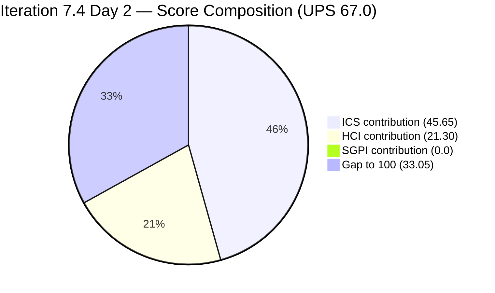
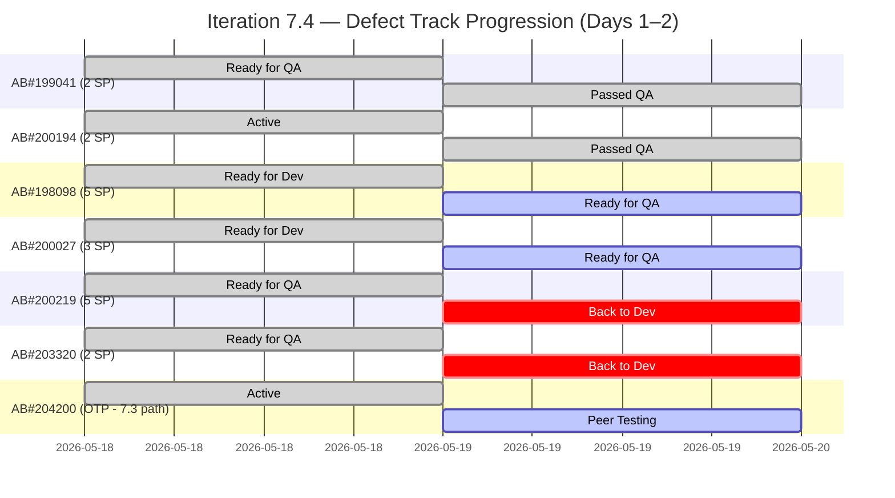
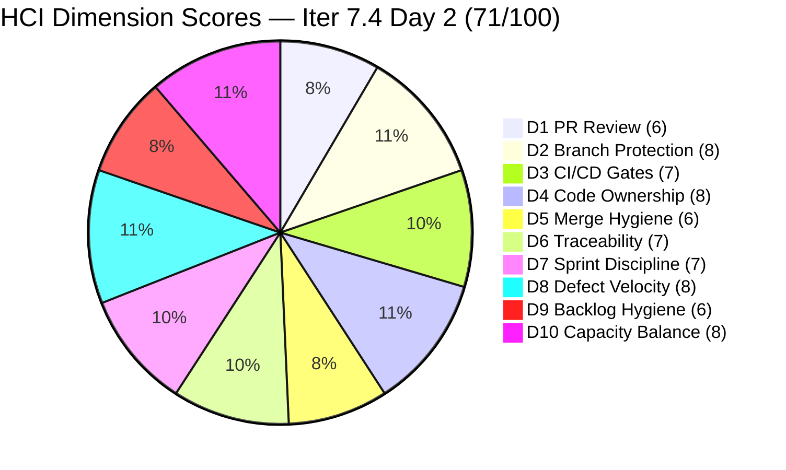

# Colina Health Product Team — Iteration 7.4 Audit
**Day 2 of 14 | 2026-05-19 | data_mode: partial**

---

## 1. Audit Metadata

| Field | Value |
|---|---|
| **Audit Date** | 2026-05-19 |
| **Audit Time** | 02:41 |
| **Iteration** | Iteration 7.4 |
| **Iteration ID** | `16385d00-244a-4caa-9e56-d4a8e850754d` |
| **Iteration Window** | 2026-05-18 → 2026-05-31 |
| **Iteration Day** | 2 of 14 |
| **Time Elapsed** | 14.3% |
| **Phase** | Sprint Early |
| **ADO Org** | jairo |
| **ADO Project ID** | `666bb99a-6acd-4999-bb34-efd0e4ea90dc` |
| **ADO Team ID** | `66cdeb09-df38-4c3e-9418-0ed0d68c39f2` |
| **ADO Team** | Colina Health Product Team |
| **ADO Backlog** | Microsoft.RequirementCategory — Stories and Deliverables |
| **GitHub Repos** | colinahealth-fe, colinahealth-be, colina-health-ai-agent-code-fixing |
| **data_mode** | partial (GitHub API 401 — raseniero token issue; HCI D1–D6 carried forward from Day 7 of Iteration 7.3, 2026-05-10; carry-forward now 9 audits deep) |
| **Prior Audit** | AUDIT_20260518_0900.md (Iteration 7.4 Day 1) |
| **Auditor** | Claude Code (git_iteration_audit skill) |

---

## 2. Executive Summary

Iteration 7.4 enters **Day 2** with strong early developer velocity but a notable quality signal: two defects that were `Ready for QA` on Day 1 have been **rejected back to development**, indicating QA is actively enforcing acceptance criteria rather than rubber-stamping. Simultaneously, two defects advanced to `Passed QA Testing`, confirming Asnari Pacalna's warm-start momentum continues.

**Scores are unchanged at ICS 91.3% (Green), HCI 71/100 (Yellow), SGPI 0.0% (Day 2 — no Closed items yet), UPS 67.0 (Yellow).** The SGPI remains 0.0% as no parent items have reached `Closed` state, but the **proxy SGPI of 25.0%** (12 of 48 SP now in Ready for QA or Passed QA Testing) signals meaningful pipeline progression on Day 2.

**Key positive developments (Day 1 → Day 2):**
- AB#199041 (2 SP): advanced from `Ready for QA` → `Passed QA Testing` — cleared QA
- AB#200194 (2 SP): advanced from `Active` → `Passed QA Testing` — cleared QA
- AB#198098 (5 SP): advanced from `Ready for Dev` → `Ready for QA` — new item entering QA
- AB#200027 (3 SP): advanced from `Ready for Dev` → `Ready for QA` — new item entering QA
- AB#204200 (OTP blocker): advanced from `Active` → `Peer Testing` — significant progress on the critical UAT blocker

**Key risk developments (Day 1 → Day 2):**
- AB#200219 (5 SP): regressed from `Ready for QA` → `Back to Dev` — QA rejection
- AB#203320 (2 SP): regressed from `Ready for QA` → `Back to Dev` — QA rejection
- AB#202588 (RSC migration, 13 SP): remains in `New` state — no branch, no plan on Day 2 (P1 action overdue)
- AB#202586 IterationPath: still `Iteration 7.3` — path correction action from Day 1 remains unactioned
- 3 defects (199041, 200027, 200194): `System.Description` still null on Day 2

**The two QA regressions (7 SP combined) are a quality signal, not a failure.** Luzmibel is catching issues before they close — this is correct QA behavior. However, it compresses the back-half of the sprint: Asnari must now fix and re-submit two previously-thought-complete items while managing two new items entering QA.

The raseniero GitHub token issue remains unresolved (Day 29 since 2026-04-21). The HCI D1–D6 carry-forward chain is now **9 audits deep** from the May 10 fresh baseline.

---

## 3. Iteration Scope and Methodology

### Iteration 7.4

| Field | Value |
|---|---|
| **Iteration Name** | Iteration 7.4 |
| **Iteration ID** | `16385d00-244a-4caa-9e56-d4a8e850754d` |
| **Start Date** | 2026-05-18 (Monday) |
| **End Date** | 2026-05-31 (Sunday) |
| **Duration** | 14 calendar days |
| **Day of Audit** | Day 2 |
| **Working Days Remaining** | ~10 working days |

### ICS-Eligible Items (parent-level, in 7.4 iteration path)

Items classified as ICS-eligible: `System.WorkItemType` in (Defect, Enabler) AND `System.IterationPath` = `Jairosoft Portfolio\2026-PI7\Iteration 7.4`. Spikes excluded per skill standard.

**ICS-eligible items — 12 items, 48 SP (fresh ADO evidence, 2026-05-19):**

| ID | Title (abbreviated) | Type | State (Day 2) | State (Day 1) | SP | Assigned To | Description | AC | Delta |
|---|---|---|---|---|---|---|---|---|---|
| **198098** | [MAR][PRN] No warning message for exceeded daily limit | Defect | **Ready for QA** | Ready for Dev | 5 | Asnari | Yes | Yes | +1 step |
| **199041** | [MAR] Page auto-loads on page number entry | Defect | **Passed QA Testing** | Ready for QA | 2 | Asnari | **NO** | Yes | +1 step (QA passed) |
| **200027** | [MAR][PRN] Sorting Options Not Working | Defect | **Ready for QA** | Ready for Dev | 3 | Asnari | **NO** | Yes | +1 step |
| **200194** | [Workflow] First letter remains after delete | Defect | **Passed QA Testing** | Active | 2 | Asnari | **NO** | Yes | +1 step (QA passed) |
| **200219** | [MAR] Order By/Sort By limits table to Hawaii date | Defect | **Back to Dev** | Ready for QA | 5 | Asnari | Yes | Yes | −1 (QA rejection) |
| **202585** | [Enabler] Private co-located folders | Enabler | Ready for Dev | Ready for Dev | 5 | Paul | Yes | Yes | No change |
| **202588** | [Enabler] Migrate to Server Components + RSC | Enabler | **New** | New | 13 | Paul | Yes | Yes | No change (P1 overdue) |
| **202597** | [Enabler] Parallel data fetching with Promise.all | Enabler | Ready for Dev | Ready for Dev | 3 | Paul | Yes | Yes | No change |
| **202600** | [Enabler] Consolidate test directories | Enabler | Ready for Dev | Ready for Dev | 2 | Paul | Yes | Yes | No change |
| **202602** | [Enabler] URL-first state hierarchy | Enabler | Ready for Dev | Ready for Dev | 5 | Paul | Yes | Yes | No change |
| **202603** | [Enabler] Evaluate shadcn/ui vs NextUI | Enabler | Ready for Dev | Ready for Dev | 3 | Paul | Yes | Yes | No change |
| **203320** | [MAR] Long medication names break layout | Defect | **Back to Dev** | Ready for QA | 2 | Asnari | Yes | Yes | −1 (QA rejection) |

**Total committed SP: 48 SP** | 6 Defects (17 SP) + 6 Enablers (31 SP)

**Items in iteration hierarchy but still on 7.3 IterationPath (excluded from ICS — Integrity violations pending path correction):**

| ID | Title | Type | State (Day 2) | State (Day 1) | SP | Issue |
|---|---|---|---|---|---|---|
| 204200 | [Blocker][UAT] Unable to Receive OTP | Defect | **Peer Testing** | Active | 1 | Path still `Iteration 7.3`; significant progress (Active → Peer Testing) |
| 202586 | [Enabler] Restructure /lib into sub-directories | Enabler | Peer Testing | Peer Testing | 5 | Path still `Iteration 7.3`; no change since Day 1 |

**Spikes (excluded from ICS — by type):**

| ID | Title | Type | State (Day 2) | SP | Assigned To |
|---|---|---|---|---|---|
| 204232 | [Retro] Update / Automate PR Approval Process | Spike | New | — | Carol Cuison |
| 204233 | [Retro] Hidden API Endpoint — POC | Spike | New | — | Paul Coronia |
| 204291 | 7.4 Collaborations / Exploratory Testing / Update E2E | Spike | **Active** | 2 | Luzmibel Paculanang |

> Luzmibel's Spike 204291 advanced to `Active` on Day 2 (changed 2026-05-19T09:01 UTC) — QA collaboration and E2E work is underway.

### Team Capacity (from ADO)

| Member | Role | Capacity/Day | Days Off | GitHub Expected | Notes |
|---|---|---|---|---|---|
| Paul Coronia | Developer | 6 hrs/day (Development) | None | Yes | All Enablers; OTP blocker fix; AB#202588 still unstarted |
| Asnari Pacalna | Developer | 7 hrs/day (Development) | None | Yes | All Defects; 2 passed QA, 2 back to dev, 2 in QA |
| Luzmibel Paculanang | QA | 6 hrs/day (Testing) | May 25–26 | No (non-dev) | Active on QA Spike; reviewing 4 items in QA queue |
| **Total** | | **19 hrs/day** | **2 days off** | | |

### Methodology

Evidence collected from:
1. `work_list_team_iterations` (GUID-based, team-scoped, timeframe=current) — confirmed Iteration 7.4 active
2. `wit_get_work_items_for_iteration` — full hierarchy of items in 7.4
3. `wit_get_work_items_batch_by_ids` — fresh field-level data for all 17 parent-level items
4. `work_get_team_capacity` — capacity roster confirmed (Paul, Asnari, Luzmibel)
5. `repo_list_pull_requests_by_repo_or_project` — ADO active PRs confirmed (PR#11207 and PR#11182 still open, unchanged)
6. `repo_search_commits` — ADO repo commits: no new commits since Feb 9, 2026 (develop branch); active dev is on GitHub
7. GitHub API (GitHub-hosted repos) — **unavailable**: HTTP 401 Bad Credentials (raseniero token issue, Day 29, unresolved)
8. Prior audit AUDIT_20260518_0900.md — Day 1 baseline for delta comparison and HCI D1–D6 carry-forward

---

## 4. Scorecard Summary



| Score | Value | Risk Band | Delta vs Day 1 | Delta vs 7.3 Final |
|---|---|---|---|---|
| **ICS** (Iteration Compliance Score) | **91.3%** | Green (≥ 90%) | 0 | −4.6 from 7.3 final (95.9%) |
| **HCI** (Engineering Health Index) | **71 / 100** | Yellow | 0 | 0 from 7.3 final (71/100) |
| **SGPI** (Sprint Goal Predictability) | **0.0%** | Early Sprint (Day 2) | 0 | n/a |
| **UPS** (Unified Performance Score) | **67.0** | Yellow | 0 | — |

**UPS Calculation:**
```
UPS = ICS × 0.50 + HCI × 0.30 + SGPI × 0.20
    = 91.3 × 0.50 + 71 × 0.30 + 0.0 × 0.20
    = 45.65 + 21.30 + 0.00
    = 66.95 ≈ 67.0
```

> **Note on Day 2 scores:** All three primary scores are unchanged from Day 1 numerically. However, the **internal pipeline composition has changed significantly**: 2 items passed QA, 2 items were rejected back to dev, and 2 new items entered QA. The score stability masks active quality processing by Luzmibel. Use the proxy SGPI (25.0%) and the state-change delta table as leading indicators.

---

## 5. Sprint Goal Predictability (SGPI)

### Headline Score

```
SGPI = Closed Parent SP / Total Committed Parent SP
     = 0 / 48
     = 0.0%
```

> **Annotation:** Iteration 7.4, Day 2. No parent items have reached `Closed` state. Expected pattern for this sprint phase. Score reported as 0.0% per skill standard.

### Supporting Context

| Metric | Formula | Value | Notes |
|---|---|---|---|
| **Committed Scope SGPI** (headline) | Closed SP / Committed SP | 0 / 48 = **0.0%** | Day 2 — no closures yet |
| **Proxy SGPI** | (Passed QA + Ready for QA SP) / Committed SP | 12 / 48 = **25.0%** | 4 SP passed QA (199041+200194); 8 SP in QA queue (198098+200027) |
| **Back to Dev SP** | — | 7 SP | AB#200219 (5 SP) + AB#203320 (2 SP) rejected by QA; must fix and re-submit |
| **Original Scope SGPI** | Closed SP / Original Day 1 SP | 0 / 48 = **0.0%** | Same denominator |

### Story Point Distribution (Day 2)

| State | Items | SP | % of Committed SP | Day 1 SP | Delta |
|---|---|---|---|---|---|
| **Passed QA Testing** | 2 (199041, 200194) | **4** | 8.3% | 0 | **+4 SP** |
| **Ready for QA** | 2 (198098, 200027) | **8** | 16.7% | 9 | −1 SP net |
| **Back to Dev** | 2 (200219, 203320) | **7** | 14.6% | 0 | **+7 SP (regressions)** |
| **Ready for Dev** | 5 (202585, 202597, 202600, 202602, 202603) | **18** | 37.5% | 21 | −3 SP |
| **Active** | 0 | 0 | 0% | 2 | −2 SP |
| **New** | 1 (202588) | **13** | 27.1% | 13 | No change (P1 risk) |
| **Closed** | 0 | 0 | 0% | 0 | 0 |
| **Total committed** | **12** | **48** | **100%** | **48** | |

### Sprint Trajectory Assessment



### QA Rejection Analysis (Day 2)

Two defects were rejected by QA between Day 1 and Day 2:

| Item | SP | State Change | Likely QA Failure Reason | Re-estimate |
|---|---|---|---|---|
| AB#200219 ([MAR] Order By/Sort By limits table) | 5 | Ready for QA → Back to Dev | Complex multi-scenario sorting fix; AC has 4 scenarios; likely partial implementation | +1–2 days |
| AB#203320 ([MAR] Long medication names break layout) | 2 | Ready for QA → Back to Dev | Layout/CSS fix; AC requires ellipsis/truncation + date filter visibility; likely responsive edge case missed | +0.5–1 day |

> These regressions are **quality enforcement in action**, not sprint failures. However, they add 7 SP of rework to Asnari's plate while she simultaneously needs to address AB#202588 through Paul, fix two items still in QA, and three missing descriptions.

---

## 6. Developer Productivity Findings

### GitHub Evidence Status

**data_mode: partial** — GitHub API returned HTTP 401 (Bad Credentials) for all three repositories on fresh attempt at 2026-05-19. Known unresolved issue with the `raseniero` token (documented in workspace CLAUDE.md since 2026-04-21). Now in its **29th day** without resolution.

HCI dimensions D1–D6 are carried forward from Day 7 of Iteration 7.3 (2026-05-10). The carry-forward chain is now **9 audits deep**.

### ADO-Side Developer Activity (Day 1 → Day 2)

All state changes detected in live ADO batch pull (2026-05-19):

| Item | Developer | State (Day 1) | State (Day 2) | Changed Date | Velocity Signal |
|---|---|---|---|---|---|
| AB#199041 | Asnari Pacalna | Ready for QA | **Passed QA Testing** | 2026-05-19T05:11 UTC | QA pass — warm-start delivery |
| AB#200194 | Asnari Pacalna | Active | **Passed QA Testing** | 2026-05-19T08:44 UTC | QA pass — prior active work resolved |
| AB#198098 | Asnari Pacalna | Ready for Dev | **Ready for QA** | 2026-05-19T04:36 UTC | New item advanced to QA (5 SP) |
| AB#200027 | Asnari Pacalna | Ready for Dev | **Ready for QA** | 2026-05-19T04:42 UTC | New item advanced to QA (3 SP) |
| AB#200219 | Asnari Pacalna | Ready for QA | **Back to Dev** | 2026-05-19T08:25 UTC | QA rejection — rework required |
| AB#203320 | Asnari Pacalna | Ready for QA | **Back to Dev** | 2026-05-19T07:00 UTC | QA rejection — rework required |
| AB#204200 | Paul Coronia | Active | **Peer Testing** | 2026-05-19T08:24 UTC | OTP blocker resolved at dev level — in peer review |
| AB#204291 | Luzmibel Paculanang | New | **Active** | 2026-05-19T09:01 UTC | QA Spike now active |

### Developer Workload Distribution (Day 2)

| Developer | Assigned Items | SP in Play | States | Net Day 2 Activity |
|---|---|---|---|---|
| Asnari Pacalna | 6 Defects | 17 SP | Passed QA (2), Ready for QA (2), Back to Dev (2) | 8 state advances; 2 passed, 2 advanced, 2 rejected — high-velocity day |
| Paul Coronia | 6 Enablers + OTP | 31 SP (committed) + 1 SP (OTP) | Ready for Dev (5), New (1), Peer Testing (OTP) | OTP blocker advanced to Peer Testing; Enabler track unchanged |
| Luzmibel Paculanang | QA Spike (204291) + QA queue | 2 SP Spike | Spike Active; QA queue: 2 passed, 2 pending, 2 rejected | Active QA enforcement — 4 reviews completed, 2 failed |

> **Asnari's Day 2 velocity is exceptional.** She advanced 4 items (8 state changes in ~4 hours of ADO activity, 04:36–08:44 UTC) while simultaneously having 2 items rejected back. At this pace, she is the sprint's highest-risk single point of failure if she encounters illness or blockers — and Paul remains the sole Enabler owner.

---

## 7. SAFe Compliance Findings

### Iteration Path Compliance (Day 2)

**12 of 12 ICS-eligible parent items confirmed in `Jairosoft Portfolio\2026-PI7\Iteration 7.4` path** — no change from Day 1.

The two carryover items (AB#204200 and AB#202586) **remain on the `Iteration 7.3` path** as of Day 2 — the Day 1 path correction action was not completed:

| Item | Current Path | Required Action | Status (Day 2) | Priority |
|---|---|---|---|---|
| AB#204200 [Blocker] OTP | `Iteration 7.3` | Update to `Iteration 7.4` | **Not Done — Day 2** | P0 |
| AB#202586 Restructure /lib | `Iteration 7.3` | Update to `Iteration 7.4` | **Not Done — Day 2** | P1 |

> AB#204200 progressed meaningfully (Active → Peer Testing) but its IterationPath still points to 7.3 — this is a scope visibility hygiene gap. The item's progress is real but it remains invisible to the 7.4 board.

### Enabler Track Status (Day 2)

No Enabler state changes detected from Day 1. Paul Coronia's entire Enabler portfolio is unchanged:

| ID | Title | SP | State | GitHub Branch | Risk |
|---|---|---|---|---|---|
| **202588** | Migrate to Server Components + RSC | **13** | **New** | None | **Critical — P1 overdue** |
| 202585 | Private co-located folders | 5 | Ready for Dev | Unknown | Medium |
| 202597 | Parallel data fetching (Promise.all) | 3 | Ready for Dev | Unknown | Low-Medium |
| 202600 | Consolidate test directories | 2 | Ready for Dev | Unknown | Low |
| 202602 | URL-first state hierarchy | 5 | Ready for Dev | Unknown | Low-Medium |
| 202603 | Evaluate shadcn/ui vs NextUI | 3 | Ready for Dev | Unknown | Low |

> **AB#202588 (13 SP, 27% of committed scope) remains in `New` state on Day 2.** This item was flagged as a Day 2 action in the Day 1 audit. A 13 SP enabler needs planning, branching, and activation by Day 3 at the latest to remain viable for this sprint. Paul's full focus on the OTP blocker (now in Peer Testing) may have delayed Enabler activation.

### Scope Risk Re-assessment (Day 2)

| Category | Items | SP | Risk Level | Day 2 Signal |
|---|---|---|---|---|
| Defects — Passed QA (near Closed) | 2 (199041, 200194) | 4 | Low — P0 to close | Need path to Closed |
| Defects — In QA (Ready for QA) | 2 (198098, 200027) | 8 | Low-Medium | Active QA review |
| Defects — Back to Dev (rework) | 2 (200219, 203320) | 7 | Medium — adds latency | Must re-fix + re-QA |
| Enablers — Not Started (New) | 1 (202588) | 13 | **High — Day 2 breach** | No branch, no plan |
| Enablers — Ready for Dev | 5 | 18 | Medium | Paul capacity split |
| OTP Blocker (7.3 path) | 1 (204200) | 1 | Medium — UAT gate | Peer Testing (progress) |
| Carryover Enablers (QA-pending, 7.3 path) | 1 (202586) | 5 | Medium | Still in Peer Testing |

---

## 8. Iteration Compliance Score (ICS)

### Eligible Scope

**12 parent-level items** confirmed in `Jairosoft Portfolio\2026-PI7\Iteration 7.4` (6 Defects + 6 Enablers). Spikes excluded by type. AB#204200 and AB#202586 excluded by IterationPath (still on 7.3).

### Dimension Scoring

#### Dimension 1: Alignment (Weight: 25)

All 12 eligible items verified with parent Feature links (live batch, 2026-05-19):

| Eligible | Compliant | Failed | Score % |
|---|---|---|---|
| 12 | 12 | 0 | **100.0%** |

All 12 items maintain Feature parent links (201646 for defects, 201281 for enablers, 201680 for AB#200194). Full compliance. No change from Day 1.

#### Dimension 2: Estimation (Weight: 20)

All 12 eligible items have Story Points confirmed in live batch:
198098 (5), 199041 (2), 200027 (3), 200194 (2), 200219 (5), 202585 (5), 202588 (13), 202597 (3), 202600 (2), 202602 (5), 202603 (3), 203320 (2) = 48 SP

| Eligible | Compliant | Failed | Score % |
|---|---|---|---|
| 12 | 12 | 0 | **100.0%** |

#### Dimension 3: Quality / DoD (Weight: 35)

Criteria: `System.Description` >= 30 non-whitespace chars AND `Microsoft.VSTS.Common.AcceptanceCriteria` >= 20 non-whitespace chars.

9 of 12 items compliant. Three defects continue to fail on missing `System.Description`:

| Item | Description (Day 2) | AC (Day 2) | Status |
|---|---|---|---|
| **199041** | **null/absent** (rev 32) | Present | **FAIL — persistent Day 1 gap** |
| **200027** | **null/absent** (rev 36) | Present | **FAIL — persistent Day 1 gap** |
| **200194** | **null/absent** (rev 47) | Present | **FAIL — persistent Day 1 gap** |
| All others | Present | Present | Pass |

> Notably, AB#199041 advanced to `Passed QA Testing` and AB#200194 also passed QA — yet both still lack `System.Description`. This means items can clear QA without the DoD description field being populated; QA is not enforcing the description requirement as a gate condition. This is a process gap.

| Eligible | Compliant | Failed | Score % |
|---|---|---|---|
| 12 | 9 | 3 (199041, 200027, 200194) | **75.0%** |

#### Dimension 4: Iteration Integrity (Weight: 20)

All 12 eligible items remain in `Jairosoft Portfolio\2026-PI7\Iteration 7.4` path. No eligible item has drifted. Carryover items (204200, 202586) are excluded from the eligible set per Day 1 ruling.

| Eligible | Compliant | Failed | Score % |
|---|---|---|---|
| 12 | 12 | 0 | **100.0%** |

### ICS Summary Table

| Dimension | Eligible | Compliant | Failed | Score % | Weight | Weighted Contribution |
|---|---|---|---|---|---|---|
| Alignment | 12 | 12 | 0 | 100.0% | 25 | 25.00 |
| Estimation | 12 | 12 | 0 | 100.0% | 20 | 20.00 |
| Quality / DoD | 12 | 9 | 3 | 75.0% | 35 | 26.25 |
| Iteration Integrity | 12 | 12 | 0 | 100.0% | 20 | 20.00 |
| **TOTAL** | **12** | — | — | — | **100** | **91.25** |

**ICS = 91.3% — Green (≥ 90%)**

```
ICS = (100.0 × 25 + 100.0 × 20 + 75.0 × 35 + 100.0 × 20) / 100
    = (2500.0 + 2000.0 + 2625.0 + 2000.0) / 100
    = 9125.0 / 100
    = 91.25% → 91.3%
```

> ICS holds at 91.3% — unchanged from Day 1. The three missing descriptions (AB#199041, AB#200027, AB#200194) remain the sole ICS deduction. Correcting all three would restore ICS to 100%. The fact that AB#199041 and AB#200194 passed QA without descriptions suggests an opportunity to enforce description as a QA gate condition.

---

## 9. Engineering Health Index (HCI)

**data_mode: partial — HCI D1–D6 carried forward from Day 7 of Iteration 7.3 (fresh evidence 2026-05-10)**

### Carry-Forward Chain

```
Day 2 (7.4) D1–D6 ← Day 1 (7.4) ← 7.3 Day 14 ← 7.3 Day 13 ← 7.3 Day 12 ←
7.3 Day 11 ← 7.3 Day 10 ← 7.3 Day 9 ← 7.3 Day 7 (fresh GitHub, 2026-05-10)
```

Nine audits of continuous carry-forward. No degradation penalty per workspace CLAUDE.md Project Exceptions (token issue under Ramon's ownership, team not penalized).

### Dimension Scores

| # | Dimension | Score | Source | Day 1 | Delta | Notes |
|---|---|---|---|---|---|---|
| D1 | PR Review Compliance | 6/10 | Carry-forward (7.3 Day 7) | 6 | 0 | GitHub token 401; no fresh PR review data |
| D2 | Branch Protection & Enforcement | 8/10 | Carry-forward (7.3 Day 7) | 8 | 0 | Protection rules confirmed as of May 10 baseline |
| D3 | CI/CD Gate Quality | 7/10 | Carry-forward (7.3 Day 7) | 7 | 0 | Pipelines active per Day 7 evidence |
| D4 | Code Ownership | 8/10 | Carry-forward (7.3 Day 7) | 8 | 0 | Paul + Asnari confirmed developers |
| D5 | Merge Hygiene & Churn | 6/10 | Carry-forward (7.3 Day 14) | 6 | 0 | Stale PRs: AI Agent PR#9 (91+ days), ADO PR#11207 (99+ days since creation Feb 9), ADO PR#11182 (110+ days) |
| D6 | Work Item ↔ GitHub Traceability | 7/10 | Fresh (ADO) + carry-forward | 7 | 0 | 0/12 eligible items with GitHub artifact links in ADO; no change from Day 1 |
| D7 | Sprint Discipline | 7/10 | Fresh (ADO) | 7 | 0 | OTP progressed to Peer Testing (+); AB#202588 still in New state on Day 2 (−); 2 QA regressions are quality enforcement (+/-) |
| D8 | Defect Triage & Velocity | **8**/10 | Fresh (ADO) | 7 | **+1** | 2 defects passed QA (199041, 200194); 2 advanced to QA (198098, 200027); OTP blocker advanced to Peer Testing; strong Day 2 velocity |
| D9 | Backlog & Story Hygiene | **6**/10 | Fresh (ADO) | 7 | **−1** | 3 descriptions still null (Day 2, unactioned); AB#202588 (13 SP) still in New (Day 2 breach); AB#202586 path correction unactioned; 2 QA regressions indicate spec quality gap |
| D10 | Capacity Balance & Ownership Distribution | 8/10 | Fresh (ADO) | 8 | 0 | Roster unchanged; Asnari workload high but productive; Luzmibel QA Spike now Active |

### HCI Summary

| Metric | Value |
|---|---|
| **Total HCI** | **71 / 100** |
| **Risk Band** | **Yellow** |
| **Delta vs Day 1** | **0** (D8 +1; D9 −1) |
| **D1–D6 Source** | Carry-forward from 2026-05-10 (9 audits deep) |
| **D7–D10 Source** | Fresh ADO evidence (Day 2, 2026-05-19) |

**HCI Calculation:**
```
D1=6, D2=8, D3=7, D4=8, D5=6, D6=7  →  Sum = 42 (D1–D6, carry-forward)
D7=7, D8=8, D9=6, D10=8             →  Sum = 29 (D7–D10, fresh ADO Day 2)
Total HCI = 42 + 29 = 71
```

### HCI Visualization



### Category Summary

| Category | Dimensions | Total | Max | % | Day 1 |
|---|---|---|---|---|---|
| Code Quality & Process | D1, D2, D3, D4, D5 | 35 | 50 | 70% | 35 |
| Traceability & Integration | D6 | 7 | 10 | 70% | 7 |
| SAFe Process Health | D7, D8, D9, D10 | 29 | 40 | 73% | 29 |
| **Total HCI** | D1–D10 | **71** | **100** | **71%** | **71** |

---

## 10. ADO-to-GitHub Traceability Analysis

### Traceability Summary (12 ICS-eligible items, Day 2)

| Work Item | State (Day 2) | SP | GitHub Link in ADO | Traceability |
|---|---|---|---|---|
| AB#198098 | Ready for QA | 5 | None | None |
| AB#199041 | Passed QA Testing | 2 | None | None |
| AB#200027 | Ready for QA | 3 | None | None |
| AB#200194 | Passed QA Testing | 2 | None | None |
| AB#200219 | Back to Dev | 5 | None | None |
| AB#202585 | Ready for Dev | 5 | None | None |
| AB#202588 | New | 13 | None | None |
| AB#202597 | Ready for Dev | 3 | None | None |
| AB#202600 | Ready for Dev | 2 | None | None |
| AB#202602 | Ready for Dev | 5 | None | None |
| AB#202603 | Ready for Dev | 3 | None | None |
| AB#203320 | Back to Dev | 2 | None | None |

**Linked items: 0 of 12 (0%)** — No GitHub artifact links in ADO for current iteration items. Unchanged from Day 1.

> AB#199041 advanced to `Passed QA Testing` and AB#200194 also passed QA — both without any ADO↔GitHub artifact link. This confirms the pattern: the team's QA flow does not require GitHub PR links in ADO as a gate. The systemic traceability gap will not self-correct without a policy change.

**Carryover items (7.3 path):**

| Work Item | GitHub Link | State (Day 2) | Notes |
|---|---|---|---|
| AB#202584 | PR#196 (colinahealth-fe) | — (7.3 closed) | Closed in 7.3; traceability confirmed |
| AB#202586 | None | Peer Testing | Still unlinked on Day 2 |
| AB#204200 | None | Peer Testing | OTP blocker in Peer Testing — no GitHub PR link added |

---

## 11. Collaboration and Review Analysis

**data_mode: partial — GitHub PR review data unavailable (GitHub API 401)**

### Known Active PRs (from ADO evidence + carry-forward)

| Repo | PR | Source | Status (Day 2) | Age | Notes |
|---|---|---|---|---|---|
| colinahealth.git (ADO) | #11207 | Fresh ADO query | **Active** | **99 days** | No new commits; branch stale |
| BEColinaHealth.git (ADO) | #11182 | Fresh ADO query | **Active** | **110 days** | No new commits; branch stale |
| colinahealth-fe (GitHub) | #196 | ADO artifact (AB#202584) | Unknown | ~9 days | Carryover 7.3 Enabler; GitHub unverifiable |
| colinahealth-fe (GitHub) | #194 | 7.3 Day 7 carry-forward | Unknown | ~22+ days | Status unverifiable |
| colinahealth-be (GitHub) | #70 | 7.3 Day 7 carry-forward | Unknown | ~22+ days | Status unverifiable |
| colina-health-ai-agent (GitHub) | #9 | 7.3 Day 7 carry-forward | Unknown | **91+ days** | 9th consecutive audit — critical |

### OTP Blocker Peer Testing — Collaboration Context

AB#204200 ([Blocker][UAT] OTP failure) advanced to `Peer Testing` on Day 2 (2026-05-19T08:24 UTC). This means Paul Coronia submitted the OTP fix for peer review. Since Peer Testing in this team's workflow typically involves code review before QA, this is a significant milestone for the critical blocker. The reviewer is likely Ramon or another developer — but since GitHub is inaccessible, the PR/branch details are not verifiable.

### PR Approval Process Spike (AB#204232 — Carol Cuison)

The retro Spike to formalize and automate PR approval gates remains in `New` state on Day 2. No action taken yet. Once implemented, this will improve D1 (PR Review Compliance) and D2 (Branch Protection).

---

## 12. Repository Hygiene

**data_mode: partial — direct GitHub repository inspection unavailable**

### ADO Repository Evidence (Fresh, Day 2)

From live ADO commit and PR queries:

| Repo | Last Commit | Last PR Activity | Branch Status | Notes |
|---|---|---|---|---|
| colinahealth.git (ADO) | 2026-02-09 (Paul — PR#11207 merge attempt) | PR#11207 Active (99 days) | develop branch: no new commits since Feb 9 | ADO repo is a stale mirror; active dev is on GitHub |
| BEColinaHealth.git (ADO) | Unknown (not queried directly) | PR#11182 Active (110 days) | Unknown | Stale ADO PR; no linked work items |

> The ADO `colinahealth.git` develop branch shows no new commits since February 9, 2026 — over 3 months ago. This confirms the team's active development is occurring exclusively on the GitHub-hosted repositories (`colinahealth-fe`, `colinahealth-be`, `colina-health-ai-agent-code-fixing`), which are inaccessible due to the token issue. The ADO repos appear to be legacy mirrors no longer receiving pushes.

### Hygiene Concerns (Day 2)

| Priority | Issue | Age | Trend |
|---|---|---|---|
| P1 | colina-health-ai-agent PR#9 — 91+ days stale, 9th consecutive audit | 91+ days | Worsening |
| P1 | ADO PR#11207 — 99 days, no new commits, no linked 7.4 work items | 99 days | Stable/Worsening |
| P1 | ADO PR#11182 — 110 days, no new commits | 110 days | Stable/Worsening |
| P1 | AB#202588 (13 SP) in New state — no branch, Day 2 action overdue | Day 2 | New |
| P2 | AB#204200 and AB#202586 IterationPath not corrected to 7.4 | Day 2 | Unactioned |
| P2 | 0% ADO↔GitHub traceability — systemic, no correction mechanism in place | Sprint | Persistent |
| P2 | 3 defects (199041, 200027, 200194) with null descriptions — items clearing QA without DoD compliance | Sprint | Persistent |

---

## 13. Risks and Bottlenecks

| # | Risk | Severity | Trend | Owner |
|---|---|---|---|---|
| R1 | **AB#202588 (RSC migration, 13 SP) — Day 2 still in New, no branch, no plan; P1 action from Day 1 unactioned** | **High** | Worsening | Paul |
| R2 | **7 SP of rework (AB#200219 + AB#203320) added to Asnari's plate via QA regressions; both must re-fix + re-QA before sprint end** | High | New | Asnari |
| R3 | **Paul Coronia sole owner of all Enabler work (31 SP) + OTP blocker; now also Peer Testing reviewer for OTP** | High | Persistent | Karl |
| R4 | Two items (AB#199041, AB#200194) passed QA without System.Description — QA is not enforcing description as gate; DoD gap may widen | Medium | New signal | Luzmibel / Karl |
| R5 | colina-health-ai-agent PR#9 — 91+ days stale, 9th consecutive audit without action | High | Worsening | Paul |
| R6 | AB#204200 and AB#202586 IterationPath correction unactioned (Day 1 P0/P1 actions missed) | Medium | Worsening | Karl |
| R7 | 3 defects (199041, 200027, 200194) still missing System.Description on Day 2 — unchanged from Day 1 | Medium | Persistent | Asnari |
| R8 | ADO↔GitHub traceability at 0% — no mechanism for correction without GitHub access or manual ADO linking | Medium | Stable | Team |
| R9 | raseniero GitHub token invalid — carry-forward chain now 9 audits deep; evidence staleness growing | Medium | Worsening | Ramon |
| R10 | ADO PR#11207 (99 days) and PR#11182 (110 days) — active stale PRs; develop branches diverging | Medium | Worsening | Paul |
| R11 | Luzmibel has 2 planned days off May 25–26 — QA gate compressed in sprint's final days | Low | Known | Karl |
| R12 | Sprint scope at 48 SP committed + potential 11 SP carryover (202586 + OTP) if paths corrected | Low | Stable | Karl |

### Sprint Capacity Risk Assessment (Day 2)

With 10 working days remaining and the following SP states:
- 4 SP near closure (Passed QA — need Closed state update)
- 8 SP in QA (need QA pass + Closed)
- 7 SP in rework (need re-fix + re-QA + Closed)
- 18 SP Ready for Dev (need Dev → QA → Closed)
- 13 SP New (need activation + full sprint cycle)

**Remaining work estimate: 50 SP of cycle work for 10 working days.** At the team's current velocity (4 SP of state progression per day on defect track), the defect track is manageable. The Enabler track (31 SP, all untouched by Paul except OTP) is the critical risk: Paul has 10 days to advance 31 SP of Enablers from Ready for Dev/New through development, peer testing, and QA.

---

## 14. Prioritized Remediation Actions

| Priority | Action | Owner | Due | Effort | Blocks |
|---|---|---|---|---|---|
| **P0** | Activate AB#202588 (RSC migration, 13 SP) — create branch, write implementation plan, assign to Active; Day 2 action was overdue | Paul | **Day 3 (May 20)** | Low (planning) | 27% of sprint scope unstarted |
| **P0** | Update AB#204200 IterationPath from `Iteration 7.3` → `Iteration 7.4` | Karl / Ramon | **Day 2 (today)** | Trivial | Sprint board visibility; UAT gate |
| **P1** | Close AB#199041 and AB#200194 in ADO — both passed QA; advancing to Closed state delivers 4 SP and improves SGPI | Karl / Asnari | **Day 2 (today)** | Trivial | SGPI (0% → 8.3%) |
| **P1** | Re-fix AB#200219 (5 SP) — Sorting options QA rejection; complex AC (4 scenarios) requires full re-test | Asnari | Days 2–4 | Medium | SGPI |
| **P1** | Re-fix AB#203320 (2 SP) — Long medication name layout QA rejection; responsive edge case | Asnari | Days 2–3 | Low | SGPI |
| **P1** | Add `System.Description` to AB#199041, AB#200027, AB#200194 — persistent DoD gap for 2 days; trivial to fix | Asnari | **Day 2 (today)** | Trivial | ICS (91.3% → 100%) |
| **P1** | Update AB#202586 IterationPath from `Iteration 7.3` → `Iteration 7.4` | Karl | Day 2 | Trivial | Sprint scope |
| **P1** | Close or merge colina-health-ai-agent PR#9 (91+ days, 9th audit) — escalate to team decision | Paul / Team | This week | Low | HCI D5 |
| **P2** | Add GitHub PR artifact link to AB#204200 in ADO — blocker is in Peer Testing but has no linked PR | Paul | Day 2 | Trivial | Traceability |
| **P2** | Implement PR approval process (AB#204232 Spike — Carol Cuison) — configure branch protection for develop and release | Carol / Paul | Week 1 | Medium | HCI D1, D2 |
| **P2** | Enforce `System.Description` as a QA gate condition — items should not advance to `Passed QA Testing` without a populated description | Karl / Luzmibel | Process | Trivial | DoD quality |
| **P2** | Resolve raseniero GitHub token (401) — now Day 29; HCI D1–D6 carry-forward chain 9 audits deep | Ramon | ASAP | Low | data_mode: full |
| **P3** | Close or escalate ADO PRs #11207 (99 days) and #11182 (110 days) | Paul / Karl | Week 1 | Low | HCI D5 |

---

## 15. Evidence Gaps and Limitations

| Gap | Impact | Cause | Status |
|---|---|---|---|
| **GitHub API 401** for all three repos (colinahealth-fe, colinahealth-be, colina-health-ai-agent-code-fixing) | HCI D1–D6 unavailable fresh | raseniero token issue, known since 2026-04-21 (Day 29) | D1–D6 carried forward from 7.3 Day 7 (May 10). 9 audits deep. No team penalty per Project Exceptions. |
| **GitHub PR list / commit history** | PR/commit correlation unverifiable for current sprint | Same token issue | Cannot confirm branches created for AB#200219, AB#203320 re-fix, AB#198098, AB#200027 fix, AB#202585, AB#204200 |
| **PR review activity** | D1 PR Review Compliance unverifiable fresh | Same token issue | Day 7 baseline (6/10) is best available evidence |
| **AB#202588 GitHub evidence** | No PR/branch evidence for 13 SP item | Token issue + item in New state | Largest single sprint item; no plan evidence |
| **ADO colinahealth.git develop branch** | No commits since Feb 9, 2026 | Active dev is on GitHub, not ADO repos | ADO repos appear to be stale mirrors; no fresh development evidence from ADO commit queries |
| **Carryover Enablers (202584, 202586, 202587)** | QA state from GitHub unverifiable | Token issue | ADO state authoritative for ICS; AB#202584 closed in 7.3; AB#202586 and AB#202587 in Peer Testing |
| **AB#204200 OTP fix PR details** | Cannot verify PR content or reviewer | Token issue | ADO state (Peer Testing, changed 2026-05-19T08:24) is authoritative |
| **Luzmibel (QA) GitHub absence** | Not an HCI gap | Non-developer per Project Exceptions | No penalty per workspace CLAUDE.md |
| **Jaszmeine Villanueva (Design) GitHub absence** | Not an HCI gap | Non-developer per Project Exceptions | No penalty per workspace CLAUDE.md |
| **Carol Cuison capacity** | Minor planning gap | Process/facilitator role | Assigned to Spike 204232; not in ADO capacity response; not expected to produce commits |

**data_mode: partial** applied per workspace CLAUDE.md Project Exceptions. Token issue documented since 2026-04-21. HCI D1–D6 carry-forward sourced from 2026-05-10 (7.3 Day 7 fresh baseline). No fabricated conclusions. No team penalties for GitHub absence during known token outage.

---

*End of Report — AUDIT_20260519_0241.md*

*Report generated by Claude Code (claude-sonnet-4-6) on 2026-05-19. Evidence collected live from Azure DevOps (Jairosoft Portfolio / Colina Health Product Team, iteration `16385d00-244a-4caa-9e56-d4a8e850754d`) at audit time. GitHub evidence unavailable — 401 Bad Credentials (raseniero token issue, Day 29). All ADO scores computed from live data as of 2026-05-19 02:41.*
