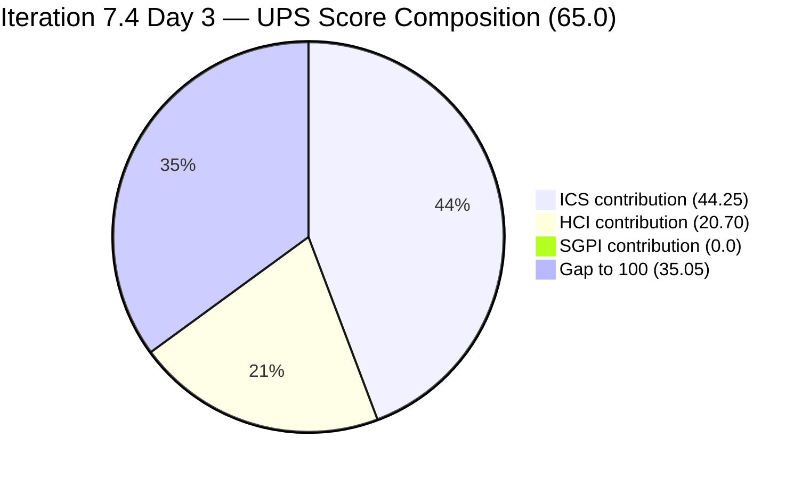
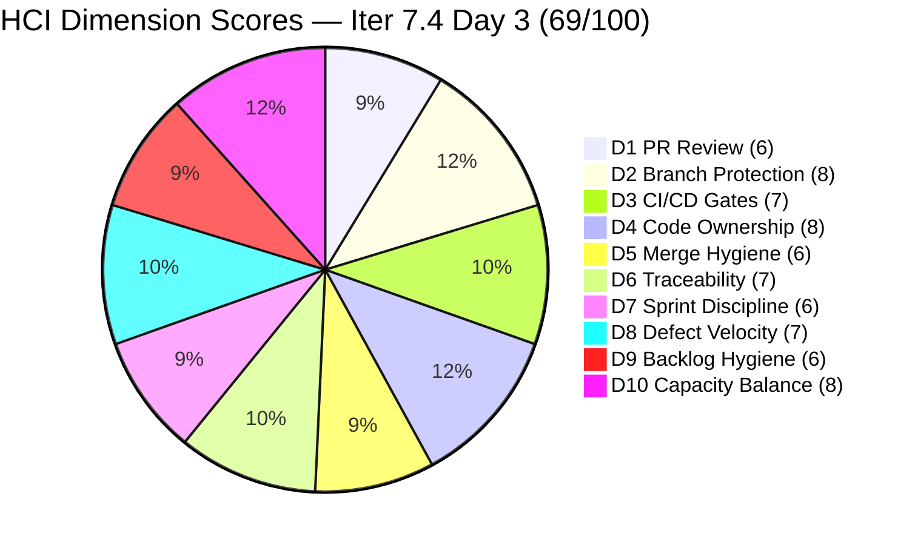

# Colina Health Product Team — Iteration 7.4 Audit
**Day 3 of 14 | 2026-05-20 | data_mode: partial**

---

## 1. Audit Metadata

| Field | Value |
|---|---|
| **Audit Date** | 2026-05-20 |
| **Audit Time** | 02:04 |
| **Iteration** | Iteration 7.4 |
| **Iteration ID** | `16385d00-244a-4caa-9e56-d4a8e850754d` |
| **Iteration Window** | 2026-05-18 → 2026-05-31 |
| **Iteration Day** | 3 of 14 |
| **Time Elapsed** | 21.4% |
| **Phase** | Early Sprint |
| **ADO Org** | jairo |
| **ADO Project ID** | `666bb99a-6acd-4999-bb34-efd0e4ea90dc` |
| **ADO Team ID** | `66cdeb09-df38-4c3e-9418-0ed0d68c39f2` |
| **ADO Team** | Colina Health Product Team |
| **ADO Backlog** | Microsoft.RequirementCategory — Stories and Deliverables |
| **GitHub Repos** | colinahealth-fe, colinahealth-be, colina-health-ai-agent-code-fixing |
| **data_mode** | partial (GitHub API 401 — raseniero token issue; HCI D1–D6 carried forward from Day 7 of Iteration 7.3, 2026-05-10) |
| **Prior Audit** | AUDIT_20260518_0900.md (Iteration 7.4 Day 1) |
| **Auditor** | Claude Code (git_iteration_audit skill) |

---

## 2. Executive Summary

Day 3 of Iteration 7.4 shows **mixed signals** relative to the Day 1 baseline. Defect QA throughput is healthy — two defects have passed QA Testing (AB#199041, AB#200194) and two have entered Peer Testing (AB#200219, AB#203320) — but two defects were returned to `Back to Dev` (AB#198098, AB#200027), suggesting QA rejections on the Asnari track. The OTP blocker (AB#204200) has advanced from `Active` to `Peer Testing`, a meaningful P0 resolution, though its IterationPath still incorrectly points to Iteration 7.3.

**A new item, AB#204700 ([Enabler] Backend API Documentation — Swagger), was added to the sprint after Day 1.** It is currently `Active` and assigned to Paul Coronia. It lacks both `System.Parent` and `Microsoft.VSTS.Scheduling.StoryPoints` — two ICS compliance failures. This mid-sprint addition without proper hygiene is the primary driver of the ICS score decline from Day 1.

**ICS drops to 88.5% (Yellow)** from 91.3% on Day 1. The decline has two causes: (1) AB#204700 added without a parent link or story points, contributing Alignment and Estimation failures on a new 13th eligible item; (2) three defect descriptions (AB#199041, AB#200027, AB#200194) remain missing, sustaining the Quality/DoD gap from Day 1. All four ICS violations are correctable within a working session.

**SGPI headline remains 0.0%** — no parent items have reached `Closed` state. However, the **Delivered Proxy SGPI stands at 22.0%** (11 SP in Passed QA Testing or Peer Testing out of 50 committed SP), indicating that nearly a quarter of the sprint's committed work is at or near closure.

**HCI = 69/100 (Yellow)**, a 2-point decline from Day 1 (71). D7 Sprint Discipline and D9 Backlog Hygiene each dropped 1 point: the Day 1 P0/P1 path-correction actions (AB#204200 and AB#202586 still on Iteration 7.3 path) remain unresolved, AB#202588 (13 SP RSC migration) is still in `New` state on Day 3, and AB#204700 entered the sprint without required hygiene fields.

**UPS = 65.0 (Yellow)** — effectively unchanged at the portfolio level, but the composition has deteriorated: ICS slipped from Green into Yellow and HCI moved 2 points lower. The early SGPI suppression continues.

**AB#202588 (RSC migration, 13 SP) entering Day 3 still in `New` state is the sprint's primary planning risk.** At 26.0% of committed scope (13 of 50 SP), this item has no branch, no plan, and no visible activation signal after three days. Paul Coronia is also now carrying AB#204700 (Active) and five carryover Enablers — the workload concentration on a single developer remains the sprint's most significant structural concern.

---

## 3. Iteration Scope and Methodology

### Iteration 7.4

| Field | Value |
|---|---|
| **Iteration Name** | Iteration 7.4 |
| **Iteration ID** | `16385d00-244a-4caa-9e56-d4a8e850754d` |
| **Start Date** | 2026-05-18 (Monday) |
| **End Date** | 2026-05-31 (Sunday) |
| **Duration** | 14 calendar days |
| **Day of Audit** | Day 3 |
| **Working Days Remaining** | ~11 |

### ICS-Eligible Items (parent-level, in 7.4 iteration path)

Items classified as ICS-eligible if their `System.WorkItemType` is Story, Defect, or Enabler AND `System.IterationPath` = `Jairosoft Portfolio\2026-PI7\Iteration 7.4`. Spikes excluded from ICS per skill standard.

**Day 3 scope change: AB#204700 ([Enabler] Backend API Documentation — Swagger) added since Day 1.** Total ICS-eligible set is now 13 items.

**ICS-eligible items (13 items, 50 SP):**

| ID | Title (abbreviated) | Type | State (Day 3) | SP | Assigned To | Parent | Description | AC | 7.4 Path | Day 1 State | Delta |
|---|---|---|---|---|---|---|---|---|---|---|---|
| **198098** | [MAR][PRN] No warning message for exceeded daily limit | Defect | **Back to Dev** | 5 | Asnari Pacalna | 201646 | Yes | Yes | Yes | Ready for Dev | Regressed |
| **199041** | [MAR] Page auto-loads on page number entry | Defect | **Passed QA Testing** | 2 | Asnari Pacalna | 201646 | **NO** | Yes | Yes | Ready for QA | Advanced |
| **200027** | [MAR][PRN] Sorting Options Not Working | Defect | **Back to Dev** | 3 | Asnari Pacalna | 201646 | **NO** | Yes | Yes | Ready for Dev | Regressed |
| **200194** | [Workflow][Update Med Log] First letter remains after delete | Defect | **Passed QA Testing** | 2 | Asnari Pacalna | 201680 | **NO** | Yes | Yes | Active | Advanced |
| **200219** | [MAR] Order By/Sort By limits table to Hawaii date | Defect | **Peer Testing** | 5 | Asnari Pacalna | 201646 | Yes | Yes | Yes | Ready for QA | Advanced |
| **202585** | [Enabler] Private co-located folders | Enabler | **Active** | 5 | Paul Coronia | 201281 | Yes | Yes | Yes | Ready for Dev | Advanced |
| **202588** | [Enabler] Migrate data fetching to Server Components + RSC | Enabler | **New** | 13 | Paul Coronia | 201281 | Yes | Yes | Yes | New | No change |
| **202597** | [Enabler] Parallel data fetching with Promise.all | Enabler | Ready for Dev | 3 | Paul Coronia | 201281 | Yes | Yes | Yes | Ready for Dev | Unchanged |
| **202600** | [Enabler] Consolidate test directories under /tests | Enabler | Ready for Dev | 2 | Paul Coronia | 201281 | Yes | Yes | Yes | Ready for Dev | Unchanged |
| **202602** | [Enabler] URL-first state hierarchy | Enabler | Ready for Dev | 5 | Paul Coronia | 201281 | Yes | Yes | Yes | Ready for Dev | Unchanged |
| **202603** | [Enabler] Evaluate shadcn/ui vs NextUI | Enabler | Ready for Dev | 3 | Paul Coronia | 201281 | Yes | Yes | Yes | Ready for Dev | Unchanged |
| **203320** | [MAR][View Report] Long medication names break layout | Defect | **Peer Testing** | 2 | Asnari Pacalna | 201646 | Yes | Yes | Yes | Ready for QA | Advanced |
| **204700** | [Enabler] Backend API Documentation (Swagger) | Enabler | **Active** | **MISSING** | Paul Coronia | **MISSING** | Yes | Yes | Yes | — | New item |

**Total committed SP: 50 SP** (204700 has no StoryPoints; 12 of 13 items have SP totaling 50 SP)

**Items in iteration hierarchy but on 7.3 path (scope hygiene violations — NOT in eligible set):**

| ID | Title | Type | State | SP | IterationPath | Issue | Day 1 Status | Progress |
|---|---|---|---|---|---|---|---|---|
| 204200 | [Blocker][UAT] Unable to Receive OTP | Defect | **Peer Testing** | 1 | Iter 7.3 | Path not updated | Active (Day 1) | Advanced to Peer Testing — good progress |
| 202586 | [Enabler] Restructure /lib into sub-directories | Enabler | Peer Testing | 5 | Iter 7.3 | Path not updated | Peer Testing (Day 1) | No change — still 7.3 path |

**Spikes (excluded from ICS, in 7.4 path):**

| ID | Title | Type | State (Day 3) | SP | Assigned To | Day 1 State |
|---|---|---|---|---|---|---|
| 204232 | [Retro] Update / Automate PR Approval Process | Spike | New | — | Carol Cuison | New |
| 204233 | [Retro] Hidden API Endpoint — POC | Spike | New | — | Paul Coronia | New |
| 204291 | 7.4 Collaborations / Exploratory Testing / Update E2E | Spike | **Active** | 2 | Luzmibel Paculanang | New → Active |

### Team Capacity (from ADO — unchanged since Day 1)

| Member | Role | Capacity/Day | Days Off | GitHub Expected | Notes |
|---|---|---|---|---|---|
| Paul Coronia | Developer | 6 hrs/day (Development) | None | Yes | All Enablers + new AB#204700 |
| Asnari Pacalna | Developer | 7 hrs/day (Development) | None | Yes | All Defects |
| Luzmibel Paculanang | QA | 6 hrs/day (Testing) | May 25–26 (2 days) | No (non-dev, no penalty) | Spike active; QA gate for multiple items |
| **Total** | | **19 hrs/day** | **2 days off** | | |

### Methodology

Evidence collected from:
1. `work_list_team_iterations` (GUID-based, team-scoped, timeframe=current) — confirmed Iteration 7.4 active
2. `wit_get_work_items_for_iteration` — full hierarchy of items in 7.4 (identified new item AB#204700)
3. `wit_get_work_items_batch_by_ids` — fresh field-level data for all 18 parent-level items (13 eligible + 2 hygiene + 3 spikes)
4. `work_get_team_capacity` — capacity roster (Paul, Asnari, Luzmibel confirmed, no changes from Day 1)
5. GitHub API (colinahealth-fe, colinahealth-be, colina-health-ai-agent-code-fixing) — **unavailable**: GitHub MCP server unavailable in audit environment; raseniero token 401 issue (known, unresolved since 2026-04-21). HCI D1–D6 carry-forward applied (9th consecutive audit).
6. Prior audit AUDIT_20260518_0900.md used for delta context and HCI D1–D6 carry-forward baseline.

---

## 4. Scorecard Summary



| Score | Value | Risk Band | Delta vs Day 1 (7.4) | Delta vs 7.3 Final |
|---|---|---|---|---|
| **ICS** (Iteration Compliance Score) | **88.5%** | Yellow (75–89.9%) | **−2.8** from Day 1 (91.3%) | **−7.4** from 7.3 final (95.9%) |
| **HCI** (Engineering Health Index) | **69 / 100** | Yellow | **−2** from Day 1 (71) | **−2** from 7.3 final (71) |
| **SGPI** (Sprint Goal Predictability) | **0.0%** | Early Sprint (Day 3) | 0 | n/a |
| **UPS** (Unified Performance Score) | **65.0** | Yellow | **−2.0** from Day 1 (67.0) | — |

**UPS Calculation:**
```
UPS = ICS × 0.50 + HCI × 0.30 + SGPI × 0.20
    = 88.5 × 0.50 + 69 × 0.30 + 0.0 × 0.20
    = 44.25 + 20.70 + 0.00
    = 64.95 ≈ 65.0
```

> **Note on UPS Day 3:** UPS is still suppressed by 0% headline SGPI. The Delivered Proxy SGPI (22.0% — items in Peer Testing or Passed QA Testing) is the more meaningful early-sprint progress indicator. ICS and HCI remain the primary leading indicators through mid-sprint.

> **ICS Yellow Flag:** ICS slipped from Green (91.3%) to Yellow (88.5%) driven by the mid-sprint addition of AB#204700 without a parent link or story points, plus the three persistent missing defect descriptions. Both deficiencies are correctable within a single working session.

---

## 5. Sprint Goal Predictability (SGPI)

### Headline Score

```
SGPI = Closed Parent SP / Total Committed Parent SP
     = 0 / 50
     = 0.0%
```

> **Annotation:** Day 3 of Iteration 7.4. No parent items have reached `Closed` state. While the headline SGPI is 0%, the Delivered Proxy at 22.0% and visible QA throughput activity indicate the sprint is not stalled.

### Supporting Metrics

| Metric | Formula | Value | Notes |
|---|---|---|---|
| **Committed Scope SGPI** (headline) | Closed SP / Committed SP | 0 / 50 = **0.0%** | No closures yet |
| **Delivered Proxy SGPI** | (Peer Testing + Passed QA Testing SP) / Committed SP | 11 / 50 = **22.0%** | 4 items in advanced states (AB#199041, AB#200194 Passed QA; AB#200219, AB#203320 Peer Testing) |
| **Original Scope SGPI** | Closed SP / Day 1 SP | 0 / 50 = **0.0%** | Same denominator |

> Day 3 Proxy SGPI of **22.0%** (Passed QA Testing + Peer Testing SP / total committed SP) reflects solid early-sprint throughput. Four defects are at or near closure. This metric is not directly comparable to Day 1's 18.8% Proxy (which used a different state subset including `Ready for QA`), but the direction is positive — actual QA completions are occurring.

### State Distribution (Day 3)

| State | Items | SP | % of Committed SP (50 SP) | Delta vs Day 1 |
|---|---|---|---|---|
| Passed QA Testing | 2 (199041, 200194) | 4 | 8.0% | +4 SP (new) |
| Peer Testing | 2 (200219, 203320) | 7 | 14.0% | +7 SP (new) |
| Active | 2 (202585, 204700) | 5 | 10.0% | 202585 promoted from Ready for Dev; 204700 is new mid-sprint addition |
| Back to Dev | 2 (198098, 200027) | 8 | 16.0% | **New regression state** |
| Ready for Dev | 4 (202597, 202600, 202602, 202603) | 13 | 26.0% | Down from 7 items on Day 1 |
| New | 1 (202588) | 13 | 26.0% | No change — critical stall |
| Closed | 0 | 0 | 0.0% | — |
| **Total committed** | **13 (12 with SP)** | **50** | **100%** | — |

### Back-to-Dev Regression Analysis

Two defects were returned to `Back to Dev` during Days 1–3:

| Item | Title | SP | Last Changed | Context |
|---|---|---|---|---|
| AB#198098 | [MAR][PRN] No warning message for exceeded daily limit | 5 | 2026-05-20 07:05 | Was Ready for Dev Day 1; QA returned |
| AB#200027 | [MAR][PRN] Sorting Options Not Working | 3 | 2026-05-20 07:23 | Was Ready for Dev Day 1; QA returned |

> Both items were not yet in QA on Day 1 (they were in `Ready for Dev`). The `Back to Dev` state suggests Asnari or QA identified issues before formal QA promotion — a potential catch during code review or self-testing rather than a QA rejection. Either way, 8 SP have regressed and require rework.

### Carryover Enablers (7.3 path — not in committed denominator)

| Item | State | SP | Progress Since Day 1 |
|---|---|---|---|
| AB#202584 | Peer Testing (assumed) | 3 | Not returned in iteration response — presumed cleared or path issue |
| AB#202586 | Peer Testing | 5 | Unchanged — still on 7.3 path |
| AB#204200 | **Peer Testing** | 1 | **Advanced from Active** — OTP fix submitted |

---

## 6. Developer Productivity Findings

### GitHub Evidence Status

**data_mode: partial** — GitHub MCP server unavailable in audit environment. The raseniero token 401 issue (documented in workspace CLAUDE.md since 2026-04-21) remains unresolved. This is the **ninth consecutive audit** running on HCI D1–D6 carry-forward from the May 10 baseline. No team penalty applied per workspace Project Exceptions.

### ADO-Side Developer Activity (Days 1–3)

| Item | Developer | From → To | Changed Date | Interpretation |
|---|---|---|---|---|
| AB#199041 | Asnari Pacalna | Ready for QA → **Passed QA Testing** | 2026-05-19 11:25 | QA cleared — closure pending |
| AB#200194 | Asnari Pacalna | Active → **Passed QA Testing** | 2026-05-19 08:44 | QA cleared — closure pending |
| AB#200219 | Asnari Pacalna | Ready for QA → **Peer Testing** | 2026-05-20 01:34 | Advancing through QA pipeline |
| AB#203320 | Asnari Pacalna | Ready for QA → **Peer Testing** | 2026-05-20 01:32 | Advancing through QA pipeline |
| AB#202585 | Paul Coronia | Ready for Dev → **Active** | 2026-05-20 01:07 | Architecture enabler work started |
| AB#204700 | Paul Coronia | (new) → **Active** | 2026-05-20 03:01 | New item, immediate activation |
| AB#198098 | Asnari Pacalna | Ready for Dev → **Back to Dev** | 2026-05-20 07:05 | Rework required |
| AB#200027 | Asnari Pacalna | Ready for Dev → **Back to Dev** | 2026-05-20 07:23 | Rework required |
| AB#204200 | Paul Coronia | Active → **Peer Testing** | 2026-05-19 08:24 | OTP fix submitted — P0 resolved in dev |
| AB#204291 | Luzmibel Paculanang | New → **Active** | 2026-05-19 09:01 | QA Spike underway |

### Developer Workload Distribution (Day 3)

| Developer | Assigned Items | Committed SP | States | Active SP | GitHub Expected |
|---|---|---|---|---|---|
| Asnari Pacalna | 6 Defects | 17 SP | Passed QA(2), Peer Testing(2), Back to Dev(2) | 8 SP in rework | Yes |
| Paul Coronia | 6 Enablers + AB#204700 + AB#204200 (carryover) | 31 SP + 0 (204700) + 1 (carryover) | Active(2), New(1), Ready for Dev(4) | 18 SP active/new | Yes |
| Luzmibel Paculanang | QA gate + Spike | 2 SP spike | Spike Active, QA gate for 4 items | — | No (non-dev) |
| Carol Cuison | 1 Spike (204232) | — | New | — | No (non-dev) |

> **Bus factor concern persists:** Paul Coronia now carries 8 committed Enablers (6 in 7.4 path + 1 carryover). AB#202588 (RSC migration, 13 SP) enters Day 3 still in `New` state — no branch, no plan, no activation signal. AB#204700 (Swagger docs) was added and immediately activated, potentially displacing bandwidth that should go to AB#202588.

---

## 7. SAFe Compliance Findings

### Iteration Path Compliance (Day 3)

**13 of 13 ICS-eligible parent items confirmed in `Jairosoft Portfolio\2026-PI7\Iteration 7.4` path.** Iteration Integrity dimension holds at 100% for the eligible set.

Path hygiene violations (unchanged from Day 1):

| Item | Current Path | Required Action | Priority | Day 1 Directive | Status |
|---|---|---|---|---|---|
| AB#204200 [OTP Blocker] | `Iteration 7.3` | Update path to 7.4 | **P0** | Day 1 | **Not done** |
| AB#202586 [Enabler] | `Iteration 7.3` | Update path to 7.4 | P1 | Day 1 | **Not done** |

Both path corrections were flagged as Day 1 priorities in the prior audit. Neither has been actioned on Day 3.

### New Mid-Sprint Item: AB#204700

A new Enabler, AB#204700 ([Enabler] Backend API Documentation — Swagger), was added to the sprint between Day 1 and Day 3. It is `Active` and assigned to Paul Coronia. However:

- **No `System.Parent`** — fails Alignment dimension
- **No `Microsoft.VSTS.Scheduling.StoryPoints`** — fails Estimation dimension
- This item's addition in an un-groomed state directly drove ICS from Green to Yellow

Adding work mid-sprint without completing basic grooming (parent link, story points) is a planning discipline concern, especially when the developer's workload is already at capacity.

### Enabler Architecture Track (Day 3)

| ID | Title | SP | State (Day 3) | Progress |
|---|---|---|---|---|
| 202585 | Private co-located folders | 5 | **Active** | Good — started Day 3 |
| 202588 | Migrate to Server Components + RSC | 13 | **New** | Stalled — Day 3, no activation |
| 202597 | Parallel data fetching (Promise.all) | 3 | Ready for Dev | Dependent on 202588 |
| 202600 | Consolidate test directories | 2 | Ready for Dev | Independent — could start now |
| 202602 | URL-first state hierarchy | 5 | Ready for Dev | Partially dependent on RSC |
| 202603 | Evaluate shadcn/ui vs NextUI | 3 | Ready for Dev | Independent — could start now |
| 204700 | Backend API Documentation (Swagger) | — | **Active** | New item, active but ungroomed |

> AB#202588 at Day 3 in `New` state is a planning red flag. This item represents 26.0% of committed SP (13 of 50 SP) and likely gates AB#202597 and partially AB#202602. Paul having two items `Active` simultaneously (202585, 204700) while 202588 sits unstarted suggests a sprint sequencing issue.

### Defect Track Status (Day 3)

| ID | Title | SP | State | QA Gate | Notes |
|---|---|---|---|---|---|
| 198098 | [MAR][PRN] No warning message | 5 | **Back to Dev** | Not started | Rework required |
| 199041 | [MAR] Page auto-loads | 2 | **Passed QA Testing** | Cleared | Ready to close |
| 200027 | [MAR][PRN] Sorting Not Working | 3 | **Back to Dev** | Not started | Rework required |
| 200194 | [Workflow] First letter remains | 2 | **Passed QA Testing** | Cleared | Ready to close |
| 200219 | [MAR] Order By/Sort By Hawaii date | 5 | **Peer Testing** | In progress | Near closure |
| 203320 | [MAR][View Report] Long names break layout | 2 | **Peer Testing** | In progress | Near closure |

---

## 8. Iteration Compliance Score (ICS)

### Eligible Scope (Day 3)

**Eligible items: 13 parent-level items confirmed in `Jairosoft Portfolio\2026-PI7\Iteration 7.4` path** (6 Defects + 7 Enablers including new AB#204700). Spikes (204232, 204233, 204291) excluded per skill standard. Items AB#204200 and AB#202586 with 7.3 IterationPath excluded from the eligible set (tracked as planning hygiene items).

### Dimension Scoring

#### Dimension 1: Alignment (Weight: 25)

Parent-link compliance for all 13 eligible items:

| Item | Parent | Status |
|---|---|---|
| 198098 | 201646 | Compliant |
| 199041 | 201646 | Compliant |
| 200027 | 201646 | Compliant |
| 200194 | 201680 | Compliant |
| 200219 | 201646 | Compliant |
| 202585 | 201281 | Compliant |
| 202588 | 201281 | Compliant |
| 202597 | 201281 | Compliant |
| 202600 | 201281 | Compliant |
| 202602 | 201281 | Compliant |
| 202603 | 201281 | Compliant |
| 203320 | 201646 | Compliant |
| **204700** | **MISSING** | **FAIL** |

| Eligible | Compliant | Failed | Score % |
|---|---|---|---|
| 13 | 12 | 1 (204700) | 92.3% |

**Evidence:** AB#204700 has no `System.Parent` in live ADO response (confirmed by both explicit field query and default batch response). All other 12 items have verified Feature parent links.

#### Dimension 2: Estimation (Weight: 20)

| Item | StoryPoints | Status |
|---|---|---|
| 198098 | 5 | Compliant |
| 199041 | 2 | Compliant |
| 200027 | 3 | Compliant |
| 200194 | 2 | Compliant |
| 200219 | 5 | Compliant |
| 202585 | 5 | Compliant |
| 202588 | 13 | Compliant |
| 202597 | 3 | Compliant |
| 202600 | 2 | Compliant |
| 202602 | 5 | Compliant |
| 202603 | 3 | Compliant |
| 203320 | 2 | Compliant |
| **204700** | **MISSING** | **FAIL** |

| Eligible | Compliant | Failed | Score % |
|---|---|---|---|
| 13 | 12 | 1 (204700) | 92.3% |

**Evidence:** AB#204700 has no `Microsoft.VSTS.Scheduling.StoryPoints` in live ADO response. All other 12 items have SP values totaling 50 SP.

#### Dimension 3: Quality / DoD (Weight: 35)

Criteria: `System.Description` ≥ 30 non-whitespace chars AND `Microsoft.VSTS.Common.AcceptanceCriteria` ≥ 20 non-whitespace chars.

| Item | Description | AC | Status |
|---|---|---|---|
| 198098 | Yes | Yes | Compliant |
| **199041** | **MISSING** | Yes | **FAIL** |
| **200027** | **MISSING** | Yes | **FAIL** |
| **200194** | **MISSING** | Yes | **FAIL** |
| 200219 | Yes | Yes | Compliant |
| 202585 | Yes | Yes | Compliant |
| 202588 | Yes | Yes | Compliant |
| 202597 | Yes | Yes | Compliant |
| 202600 | Yes | Yes | Compliant |
| 202602 | Yes | Yes | Compliant |
| 202603 | Yes | Yes | Compliant |
| 203320 | Yes | Yes | Compliant |
| 204700 | Yes | Yes | Compliant |

> **Note on AB#199041:** Passed QA Testing on 2026-05-19 with `System.Description` still null. The item was verified for QA and advanced despite the missing description. This is a DoD hygiene failure that persists even as the item approaches closure.

> **Note on AB#200027 and AB#200194:** Both items reverted to `Back to Dev` or `Passed QA Testing` respectively, with descriptions still missing. These gaps have now persisted through Day 3 despite being flagged as P1 on Day 1.

| Eligible | Compliant | Failed | Score % |
|---|---|---|---|
| 13 | 10 | 3 (199041, 200027, 200194) | 76.9% |

#### Dimension 4: Iteration Integrity (Weight: 20)

All 13 eligible items confirmed in `Jairosoft Portfolio\2026-PI7\Iteration 7.4` path. AB#204200 and AB#202586 (7.3 path) are excluded from the eligible set — they are tracked separately as scope hygiene violations.

| Eligible | Compliant | Failed | Score % |
|---|---|---|---|
| 13 | 13 | 0 | 100.0% |

### ICS Summary Table

| Dimension | Eligible | Compliant | Failed | Score % | Weight | Weighted Contribution | Evidence |
|---|---|---|---|---|---|---|---|
| Alignment | 13 | 12 | 1 | 92.3% | 25 | 23.08 | AB#204700 missing System.Parent (new mid-sprint item) |
| Estimation | 13 | 12 | 1 | 92.3% | 20 | 18.46 | AB#204700 missing StoryPoints (new mid-sprint item) |
| Quality / DoD | 13 | 10 | 3 | 76.9% | 35 | 26.92 | 199041, 200027, 200194 — null System.Description (unchanged from Day 1) |
| Iteration Integrity | 13 | 13 | 0 | 100.0% | 20 | 20.00 | All 13 eligible items in `Iteration 7.4` path |
| **TOTAL** | **13** | — | — | — | 100 | **88.46** | |

**ICS Calculation (exact):**
```
ICS = (92.31 × 25 + 92.31 × 20 + 76.92 × 35 + 100.0 × 20) / 100
    = (2307.7 + 1846.2 + 2692.3 + 2000.0) / 100
    = 8846.2 / 100
    = 88.46%
```

> ICS = **88.5% — Yellow (75–89.9%)**, down from 91.3% on Day 1. This is the first ICS Yellow in Iteration 7.4. The decline is attributable to one new item (AB#204700) added without a parent link or story points, which alone accounts for the Alignment and Estimation dimension dips. Correcting AB#204700 and adding descriptions to AB#199041, AB#200027, AB#200194 would restore ICS to approximately **97–98%** (Green).

---

## 9. Engineering Health Index (HCI)

**data_mode: partial — HCI D1–D6 carried forward from Day 7 of Iteration 7.3 (fresh evidence 2026-05-10)**

### Carry-Forward Chain

```
7.4 Day 3 (today) ← 7.4 Day 1 ← 7.3 Day 14 ← 7.3 Day 13 ← 7.3 Day 12 ← 7.3 Day 11 ←
7.3 Day 10 ← 7.3 Day 9 ← 7.3 Day 7 (fresh GitHub evidence, 2026-05-10)
```

Nine audits of continuous carry-forward. No degradation penalty per workspace Project Exceptions (token issue is known and under Ramon's ownership).

### Dimension Scores

| # | Dimension | Score | Source | Day 1 (7.4) | Delta | Evidence / Rationale |
|---|---|---|---|---|---|---|
| D1 | PR Review Compliance | 6/10 | Carry-forward (7.3 Day 7) | 6 | 0 | GitHub API unavailable; carry-forward unchanged |
| D2 | Branch Protection & Enforcement | 8/10 | Carry-forward (7.3 Day 7) | 8 | 0 | Confirmed rules from Day 7 baseline |
| D3 | CI/CD Gate Quality | 7/10 | Carry-forward (7.3 Day 7) | 7 | 0 | Carry-forward unchanged |
| D4 | Code Ownership | 8/10 | Carry-forward (7.3 Day 7) | 8 | 0 | Paul + Asnari confirmed; carry-forward |
| D5 | Merge Hygiene & Churn | 6/10 | Carry-forward (7.3 Day 7) | 6 | 0 | Three stale PRs still unresolved (AI Agent PR#9 95+ days, ADO #11207/#11182 110+ days) |
| D6 | Work Item ↔ GitHub Traceability | 7/10 | Carry-forward | 7 | 0 | No GitHub link data available; ADO artifact links 0% on 7.4 items |
| D7 | Sprint Discipline | **6/10** | Fresh (ADO) | 7 | **−1** | Day 1 P0/P1 path corrections not done (AB#204200, AB#202586 still on 7.3); AB#202588 (13 SP) still New on Day 3; AB#204700 added mid-sprint without parent/SP; two items have `Back to Dev` regression |
| D8 | Defect Triage & Velocity | 7/10 | Fresh (ADO) | 7 | 0 | OTP blocker (204200) advanced to Peer Testing — key P0 resolved; 2 defects Passed QA; 2 defects Back to Dev; net balance is positive but partially offset |
| D9 | Backlog & Story Hygiene | **6/10** | Fresh (ADO) | 7 | **−1** | 3 defect descriptions still missing (Day 1 P1s unactioned); AB#204700 added without parent/SP; 2 carryover items still on 7.3 path; AB#202588 (13 SP) still in New on Day 3 |
| D10 | Capacity Balance & Ownership Distribution | 8/10 | Fresh (ADO) | 8 | 0 | Asnari formal on roster; Paul workload heavy (8 enablers + new 204700) but structurally similar to Day 1; Luzmibel QA Spike active |

### HCI Summary

| Metric | Value |
|---|---|
| **Total HCI** | **69 / 100** |
| **Risk Band** | **Yellow** |
| **Delta vs Day 1 (7.4)** | **−2** (D7 −1, D9 −1) |
| **Delta vs 7.3 Final** | **−2** |
| **D1–D6 Source** | Carry-forward from 7.3 Day 7 (2026-05-10) |
| **D7–D10 Source** | Fresh ADO evidence (Day 3) |

**HCI Calculation:**
```
D1=6, D2=8, D3=7, D4=8, D5=6, D6=7  →  Sum = 42 (carry-forward D1–D6)
D7=6, D8=7, D9=6, D10=8             →  Sum = 27 (fresh ADO Day 3)
Total HCI = 42 + 27 = 69
```

> HCI = **69/100 (Yellow)**, down 2 points from Day 1. The decline reflects D7 Sprint Discipline (path corrections not actioned, 202588 still New, 204700 ungroomed mid-sprint addition) and D9 Backlog Hygiene (descriptions still missing, three separate hygiene gaps carried past Day 1 deadlines). D8 holds at 7 because the OTP P0 advancement is real progress, even partially offset by Back-to-Dev regressions.

### HCI Visualization



### Category Summary

| Category | Dimensions | Total | Max | % |
|---|---|---|---|---|
| Code Quality & Process | D1, D2, D3, D4, D5 | 35 | 50 | 70% |
| Traceability & Integration | D6 | 7 | 10 | 70% |
| SAFe Process Health | D7, D8, D9, D10 | 27 | 40 | 68% |
| **Total HCI** | D1–D10 | **69** | **100** | **69%** |

---

## 10. ADO-to-GitHub Traceability Analysis

### Traceability Summary (13 ICS-eligible items, Day 3)

| Work Item | State (Day 3) | SP | GitHub Link (ADO artifact) | Traceability |
|---|---|---|---|---|
| AB#198098 | Back to Dev | 5 | None | None |
| AB#199041 | Passed QA Testing | 2 | None | None |
| AB#200027 | Back to Dev | 3 | None | None |
| AB#200194 | Passed QA Testing | 2 | None | None |
| AB#200219 | Peer Testing | 5 | None | None |
| AB#202585 | Active | 5 | None | None |
| AB#202588 | New | 13 | None | None |
| AB#202597 | Ready for Dev | 3 | None | None |
| AB#202600 | Ready for Dev | 2 | None | None |
| AB#202602 | Ready for Dev | 5 | None | None |
| AB#202603 | Ready for Dev | 3 | None | None |
| AB#203320 | Peer Testing | 2 | None | None |
| AB#204700 | Active | — | None | None |

**Linked items: 0 of 13 (0%)** — No GitHub artifact links in ADO for any current 7.4 iteration items. This 0% ADO↔GitHub traceability gap persists from Day 1, though it cannot be independently verified via GitHub due to the token issue.

**Items of note:**
- AB#199041 and AB#200194 have passed QA Testing — they were developed and verified without any linked GitHub PR in ADO. This represents an end-to-end traceability failure: completed work with no audit trail.
- AB#202585 is `Active` (Paul started on Day 3) — opportunity to create and link a GitHub PR at the time of first commit.

---

## 11. Collaboration and Review Analysis

**data_mode: partial — GitHub PR review data unavailable (GitHub API 401 / MCP unavailable)**

### OTP Blocker Resolution (AB#204200)

The sprint's Day 1 P0 item has progressed. AB#204200 (OTP authentication failure) advanced from `Active` to `Peer Testing` on 2026-05-19 08:24, assigned to Paul Coronia. This indicates a code fix was submitted and is awaiting peer/QA review. However:
- IterationPath still points to Iteration 7.3 — the path correction directive from Day 1 was not actioned
- No ADO artifact link (GitHub PR) was added — the fix is untraced

### Known Active PRs (carry-forward + ADO evidence)

| Repo | PR | Source | Status | Age (Day 3 of 7.4) | Notes |
|---|---|---|---|---|---|
| colinahealth-fe (GitHub) | #196 | ADO artifact (AB#202584) | Open / Peer Testing | ~9 days | Carryover 7.3 Enabler |
| colinahealth-fe (GitHub) | #194 | Day 7 carry-forward | Open | ~22+ days | Status unverifiable |
| colinahealth-be (GitHub) | #70 | Day 7 carry-forward | Open | ~22+ days | Status unverifiable |
| colina-health-ai-agent (GitHub) | #9 | Day 7 carry-forward | Open | **92+ days** | **Ninth consecutive audit — critical stale** |
| colinahealth.git (ADO) | #11207 | 7.3 Day 14 | Active | **109+ days** | Stale ADO PR |
| BEColinaHealth.git (ADO) | #11182 | 7.3 Day 14 | Active | **109+ days** | Stale ADO PR |

### Stale PR Escalation

| PR | Repo | Age | Consecutive Audits | Risk |
|---|---|---|---|---|
| PR#9 | colina-health-ai-agent (GitHub) | **92+ days** | **9th** | Critical — merge cost may now exceed feature value |
| PR#11207 | colinahealth.git (ADO) | **109+ days** | 3rd | High |
| PR#11182 | BEColinaHealth.git (ADO) | **109+ days** | 3rd | High |

> colina-health-ai-agent PR#9 has now been flagged as stale in nine consecutive audits. This PR requires an explicit close-or-merge decision by end of sprint.

### PR Approval Process Spike (AB#204232)

Carol Cuison's Spike for PR approval automation remains in `New` state on Day 3 (no activity). The Spike acceptance criteria (configure branch protection for develop and release branches) would materially improve HCI D1 and D2 if implemented.

---

## 12. Repository Hygiene

**data_mode: partial — direct GitHub repository inspection unavailable**

### Branch Status (carry-forward + ADO evidence)

| Repo | Known Open Branches | Protection | Notes |
|---|---|---|---|
| colinahealth-fe (GitHub) | PR#194 branch, PR#196 branch (AB#202584) | Confirmed (Day 7, May 10) | AB#202585 now Active — new branch likely created Day 3 |
| colinahealth-be (GitHub) | PR#70 branch | Confirmed (Day 7, May 10) | Long-running open PR, 22+ days |
| colina-health-ai-agent-code-fixing | PR#9 branch — **92+ days** | Confirmed (Day 7) | Severe stale branch risk; divergence likely |
| colinahealth.git (ADO) | PR#11207 — 109+ days | Unknown | Stale ADO branch |
| BEColinaHealth.git (ADO) | PR#11182 — 109+ days | Unknown | Stale ADO branch |

### Hygiene Concerns (Day 3)

1. **colina-health-ai-agent PR#9** — 92+ days stale, ninth consecutive audit. Immediate action required this sprint.
2. **ADO PRs #11207 and #11182** — 109+ days each, no resolution since first documented.
3. **AB#199041 and AB#200194** — Passed QA Testing with no linked GitHub PR in ADO. Work completed without traceability.
4. **AB#204700** — Active with no parent, no SP. New item not properly groomed before sprint addition.
5. **AB#202588 (13 SP)** — Still `New` on Day 3. No branch exists. Largest sprint item has zero GitHub footprint.

---

## 13. Risks and Bottlenecks

| # | Risk | Severity | Trend | Owner |
|---|---|---|---|---|
| R1 | **AB#202588 (RSC migration, 13 SP) in New on Day 3 — no branch, no plan, 26% of committed scope** | Critical | Worsening | Paul |
| R2 | **AB#204700 added mid-sprint without parent/SP** — drove ICS below Green, adds workload to Paul | High | New | Karl / Paul |
| R3 | **Two defects (AB#198098, AB#200027) returned to Back to Dev** — 8 SP regressed, requires rework | High | New | Asnari |
| R4 | **Day 1 P0/P1 path corrections still not done (AB#204200, AB#202586 still on 7.3 path)** — three days delinquent | High | Worsening | Karl |
| R5 | **Three defect descriptions (199041, 200027, 200194) still missing** — Day 1 P1 not actioned | High | Worsening | Asnari |
| R6 | Paul Coronia workload concentration — 8 Enablers + AB#204700 (active) + AB#204200 (carryover Peer Testing) — bus factor 1 on entire architecture track | High | Persistent | Karl |
| R7 | colina-health-ai-agent PR#9 — 92+ days stale, ninth consecutive audit, no close/merge action | High | Critical | Paul / Team |
| R8 | **AB#199041 and AB#200194 passed QA with no GitHub PR links in ADO** — completed work with zero traceability | Medium | New | Team |
| R9 | **AB#202585 now Active but no ADO artifact link created at activation** — opportunity missed | Medium | New | Paul |
| R10 | Three carryover Enablers (AB#202584, 202586, 202587) still in Peer Testing — QA must close all before new dev scope enters pipeline | Medium | Carry-forward | Luzmibel / Karl |
| R11 | raseniero GitHub token invalid — HCI D1–D6 carry-forward chain now **9 audits deep** | Medium | Worsening | Ramon |
| R12 | ADO PRs #11207 and #11182 — 109+ days each, no resolution | Medium | Worsening | Paul / Karl |
| R13 | Luzmibel has 2 planned days off (May 25–26) — QA gate compressed in final sprint days | Low | Known | Karl |

### AB#202588 Critical Path Analysis (RSC Migration, 13 SP)

This item represents 26.0% of committed scope (13 of 50 SP) and is still `New` on Day 3. It likely gates AB#202597 (parallel fetching) and partially AB#202602 (URL state). If Paul does not activate 202588 by Day 4, the probability of on-time delivery drops sharply:

| Scenario | AB#202588 Start | Probability of Closure | Impact |
|---|---|---|---|
| Starts Day 4 | May 21 | ~65% | Completes late sprint |
| Starts Day 6 | May 23 | ~35% | High risk of carryover |
| Starts Day 8+ | May 25+ | <15% | Near-certain carryover |

The addition of AB#204700 (also Active on Day 3) as a competing priority makes Day 4 activation of 202588 even more critical.

---

## 14. Prioritized Remediation Actions

| Priority | Action | Owner | Due | Effort | Blocks |
|---|---|---|---|---|---|
| **P0** | Add `System.Parent` (Feature 201281) and `StoryPoints` to AB#204700 — restores ICS Alignment and Estimation dimensions | Karl / Paul | Today | Trivial (2 min) | ICS 88.5% → ~93% |
| **P0** | Activate AB#202588 (RSC migration, 13 SP) — create branch, transition to Active | Paul | Day 4 (May 21) | Low | Sprint SGPI; gating AB#202597, AB#202602 |
| **P0** | Update AB#204200 IterationPath from 7.3 to 7.4 | Karl / Ramon | Today | Trivial | Sprint scope visibility; D7 |
| **P1** | Add `System.Description` to AB#199041, AB#200027, AB#200194 — three-audit-old P1, still unactioned | Asnari Pacalna | Today | Trivial (5 min per item) | ICS Quality/DoD; D9 |
| **P1** | Update AB#202586 IterationPath from 7.3 to 7.4 | Karl | Today | Trivial | Sprint scope visibility |
| **P1** | Close or merge colina-health-ai-agent PR#9 (92+ days stale, 9th audit) — escalate to Paul/Ramon if no action taken today | Paul / Ramon | By Day 5 | Low–Medium (review/decision) | HCI D5 |
| **P1** | Add GitHub PR artifact link to AB#202585 in ADO when Paul creates the branch today | Paul | When branching | Trivial | HCI D6 Traceability |
| **P1** | Close AB#199041 and AB#200194 in ADO — both are Passed QA Testing with no active blocker | Karl / Asnari | Today | Trivial | SGPI (0% → 8.0%) |
| **P2** | Resolve Back-to-Dev regressions on AB#198098 and AB#200027 — identify QA rejection root cause, plan rework | Asnari | Days 4–6 | Medium | SGPI; sprint scope risk |
| **P2** | Implement AB#204232 (PR approval automation) — Carol Cuison Spike, still New on Day 3 | Carol Cuison | Week 1 | Medium | HCI D1, D2 |
| **P2** | Resolve raseniero GitHub token (401) to restore fresh GitHub evidence | Ramon | ASAP | Low | data_mode: full; HCI D1–D6 |
| **P3** | Close or escalate ADO PRs #11207 and #11182 (109+ days) | Paul / Karl | Week 2 | Low | HCI D5 |

---

## 15. Evidence Gaps and Limitations

| Gap | Impact | Cause | Notes |
|---|---|---|---|
| **GitHub API 401 + MCP unavailable** | HCI D1–D6 unavailable fresh; GitHub PR/commit data unverifiable | raseniero token issue, known since 2026-04-21; GitHub MCP server not available in this audit run | D1–D6 carried forward from 7.3 Day 7 (May 10). Now **9 audits deep** in carry-forward chain. No team penalty per workspace Project Exception. |
| **PR merge/branch status** | Cannot confirm whether AB#202585 branch exists, whether AB#204200 OTP fix PR is open | GitHub API unavailable | ADO state (Active / Peer Testing) is authoritative for ICS; GitHub state unverifiable |
| **AB#199041 and AB#200194 GitHub PR evidence** | Items passed QA with no GitHub artifact link in ADO; cannot verify fix quality | 0% ADO↔GitHub traceability + API unavailable | ADO state (Passed QA Testing) is used for SGPI; GitHub PR unverifiable |
| **colina-health-ai-agent PR#9 merge status** | Cannot confirm whether stale PR was closed or merged between Day 1 and Day 3 | GitHub API unavailable | Last confirmed state: Open (Day 7, May 10). Carry-forward assumption: still open. |
| **AB#202584 not in iteration response** | Carryover 7.3 Enabler not returned by wit_get_work_items_for_iteration | Item may have been closed or path updated since Day 1 | Not detectable without direct item fetch; assumed closed or excluded. No ICS impact (was on 7.3 path). |
| **Luzmibel (QA) GitHub absence** | Not scored as HCI gap | Non-developer per Project Exceptions | No penalty |
| **Jaszmeine Villanueva (Design) GitHub absence** | Not scored as HCI gap | Non-developer per Project Exceptions | No penalty |
| **Carol Cuison not in capacity response** | Capacity planning minor gap | Process/facilitator role | Assigned to Spike 204232; not expected in capacity roster |
| **AB#204700 StoryPoints (zero vs. absent)** | Ambiguous — could be intentional (unestimated) or oversight | New item in Active state without completed grooming | Scored as Estimation failure per ICS rules; correctable immediately |

**data_mode: partial** applied per workspace CLAUDE.md Project Exceptions. HCI D1–D6 carry-forward chain sourced from 2026-05-10 (7.3 Day 7). No fabricated conclusions. No team penalties for GitHub absence.

---

*End of Report — AUDIT_20260520_0204.md*

*Report generated by Claude Code (claude-sonnet-4-6) on 2026-05-20. Evidence collected live from Azure DevOps (Jairosoft Portfolio / Colina Health Product Team, iteration `16385d00-244a-4caa-9e56-d4a8e850754d`) at audit time. GitHub evidence unavailable — 401 Bad Credentials (raseniero token issue, known since 2026-04-21) and GitHub MCP server unavailable. All ADO scores computed from live data as of 2026-05-20 02:04.*
