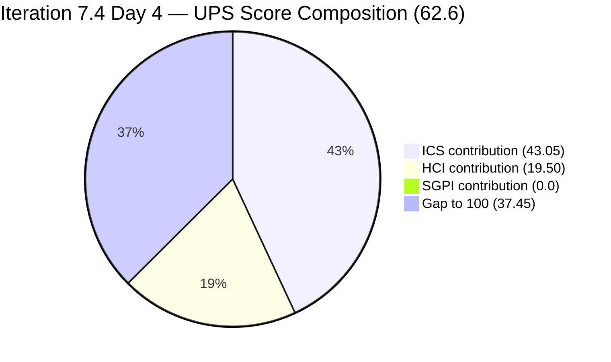
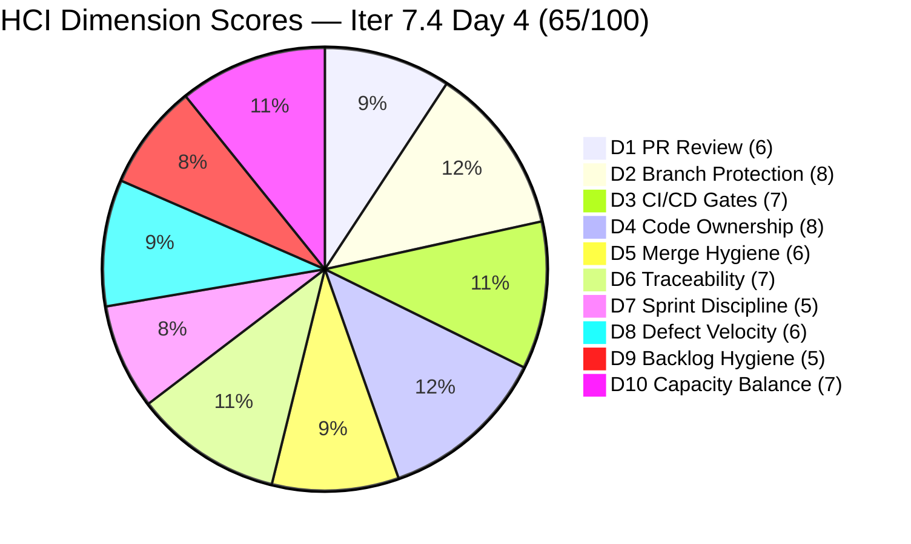

# Colina Health Product Team — Iteration 7.4 Audit
**Day 4 of 14 | 2026-05-21 | data_mode: partial**

---

## 1. Audit Metadata

| Field | Value |
|---|---|
| **Audit Date** | 2026-05-21 |
| **Audit Time** | 09:00 |
| **Iteration** | Iteration 7.4 |
| **Iteration ID** | `16385d00-244a-4caa-9e56-d4a8e850754d` |
| **Iteration Window** | 2026-05-18 → 2026-05-31 |
| **Iteration Day** | 4 of 14 |
| **Time Elapsed** | 28.6% |
| **Phase** | Early Sprint |
| **ADO Org** | jairo |
| **ADO Project ID** | `666bb99a-6acd-4999-bb34-efd0e4ea90dc` |
| **ADO Team ID** | `66cdeb09-df38-4c3e-9418-0ed0d68c39f2` |
| **ADO Team** | Colina Health Product Team |
| **ADO Backlog** | Microsoft.RequirementCategory — Stories and Deliverables |
| **GitHub Repos** | colinahealth-fe, colinahealth-be, colina-health-ai-agent-code-fixing |
| **data_mode** | partial (GitHub API 401 — raseniero token issue; curl-verified 2026-05-21; HCI D1–D6 carried forward from 7.3 Day 7 baseline, 2026-05-10; carry-forward chain 11 audits deep) |
| **Prior Audit** | AUDIT_20260520_0204.md (Iteration 7.4 Day 3) |
| **Auditor** | Claude Code (git_iteration_audit skill) |

**Three named scores:**

| Score | Value | Risk Band |
|---|---|---|
| **ICS** (Iteration Compliance Score) | **86.1%** | Yellow |
| **HCI** (Engineering Health Index) | **65 / 100** | Yellow |
| **SGPI** (Committed Scope SGPI) | **0.0%** | Early Sprint (Day 4) |
| **UPS** (Unified Performance Score) | **62.6** | Yellow |

---

## 2. Executive Summary

Day 4 of Iteration 7.4 brings a **second consecutive score decline** across all three metrics. ICS falls to **86.1% (Yellow)**, HCI drops to **65/100 (Yellow)**, and UPS reaches **62.6 (Yellow)**. The deterioration is driven by a compounding pattern of mid-sprint ungroomed scope additions, unactioned Day 1 P0 directives, and a persistent defect-description hygiene gap.

**Two new items added without grooming since Day 1:** AB#204700 ([Enabler] Backend API Documentation — Swagger, added Day 3) and AB#204791 ([Dev Environment][Login Page] Cannot login — 410 Unauthorized, added today at 06:42) both entered the sprint without `System.Parent` or `Microsoft.VSTS.Scheduling.StoryPoints`. These are now the **dual primary driver of ICS Yellow** — two Alignment failures and two Estimation failures across the 14-item eligible set.

**AB#204791 is the sprint's second login blocker.** A 410 Unauthorized error on the dev environment login page was opened today, assigned to Paul Coronia. This compounds the still-unresolved OTP authentication blocker (AB#204200) — the team now carries two authentication-related defects simultaneously. Both indicate potential infrastructure or auth-layer instability in the dev environment.

**The three Day 1 P0/P1 directives remain unactioned on Day 4:**
1. AB#204200 IterationPath still points to Iteration 7.3 (now 4 consecutive days overdue)
2. AB#202586 IterationPath still points to Iteration 7.3 (now 4 consecutive days overdue)
3. Three defect descriptions (AB#199041, AB#200027, AB#200194) still missing (flagged since Day 1)

**Positive signals exist.** AB#198098 and AB#200027 re-emerged from `Back to Dev` to `Active` in the early hours of May 21 (00:27–00:28 UTC), confirming Asnari Pacalna is actively reworking both. AB#199041 and AB#200194 have passed QA Testing. AB#200219 and AB#203320 are in Peer Testing. The **Delivered Proxy SGPI of 22.0%** (11 SP at or near closure out of 50 committed SP) confirms the defect track is producing real throughput.

**AB#202588 (RSC migration, 13 SP) remains in `New` on Day 4** — the sprint's most significant planning risk. At 26% of committed scope, this item has no branch, no plan, and no activation signal after four days. Paul is simultaneously Active on AB#202585 and AB#204700, and assigned to the new AB#204791 login blocker. The workload concentration on Paul across all Enabler and blocker work is the most critical structural risk of the sprint.

**GitHub token 401 confirmed fresh via curl on 2026-05-21.** `data_mode: partial` applies. HCI D1–D6 carry-forward is now 11 audits deep from the May 10 baseline.

---

## 3. Iteration Scope and Methodology

### Iteration 7.4

| Field | Value |
|---|---|
| **Iteration Name** | Iteration 7.4 |
| **Iteration ID** | `16385d00-244a-4caa-9e56-d4a8e850754d` |
| **Start Date** | 2026-05-18 (Monday) |
| **End Date** | 2026-05-31 (Sunday) |
| **Duration** | 14 calendar days |
| **Day of Audit** | Day 4 |
| **Working Days Remaining** | ~10 |

### ICS-Eligible Items (parent-level, in 7.4 iteration path)

Items classified as ICS-eligible if `System.WorkItemType` ∈ {Story, Defect, Enabler} AND `System.IterationPath` = `Jairosoft Portfolio\2026-PI7\Iteration 7.4`. Spikes excluded per skill standard.

**Day 4 scope change: AB#204791 added today (06:42).** Total ICS-eligible set is now **14 items**.

| ID | Title (abbreviated) | Type | State (Day 4) | SP | Assigned To | Parent | Desc | AC | 7.4 Path | Day 3 State | Delta |
|---|---|---|---|---|---|---|---|---|---|---|---|
| **198098** | [MAR][PRN] No warning message for exceeded daily limit | Defect | **Active** | 5 | Asnari Pacalna | 201646 | Yes | Yes | Yes | Back to Dev | Re-engaged |
| **199041** | [MAR] Page auto-loads on page number entry | Defect | Passed QA Testing | 2 | Asnari Pacalna | 201646 | **NO** | Yes | Yes | Passed QA Testing | Unchanged |
| **200027** | [MAR][PRN] Sorting Options Not Working | Defect | **Active** | 3 | Asnari Pacalna | 201646 | **NO** | Yes | Yes | Back to Dev | Re-engaged |
| **200194** | [Workflow][Update Med Log] First letter remains after delete | Defect | Passed QA Testing | 2 | Asnari Pacalna | 201680 | **NO** | Yes | Yes | Passed QA Testing | Unchanged |
| **200219** | [MAR] Order By/Sort By limits table to Hawaii date | Defect | Peer Testing | 5 | Asnari Pacalna | 201646 | Yes | Yes | Yes | Peer Testing | Unchanged |
| **202585** | [Enabler] Implement private co-located folders | Enabler | Active | 5 | Paul Coronia | 201281 | Yes | Yes | Yes | Active | Unchanged |
| **202588** | [Enabler] Migrate data fetching to Server Components + RSC | Enabler | **New** | 13 | Paul Coronia | 201281 | Yes | Yes | Yes | New | **Stalled — Day 4** |
| **202597** | [Enabler] Parallel data fetching with Promise.all | Enabler | Ready for Dev | 3 | Paul Coronia | 201281 | Yes | Yes | Yes | Ready for Dev | Unchanged |
| **202600** | [Enabler] Consolidate test directories under /tests | Enabler | Ready for Dev | 2 | Paul Coronia | 201281 | Yes | Yes | Yes | Ready for Dev | Unchanged |
| **202602** | [Enabler] URL-first state hierarchy | Enabler | Ready for Dev | 5 | Paul Coronia | 201281 | Yes | Yes | Yes | Ready for Dev | Unchanged |
| **202603** | [Enabler] Evaluate shadcn/ui vs NextUI | Enabler | Ready for Dev | 3 | Paul Coronia | 201281 | Yes | Yes | Yes | Ready for Dev | Unchanged |
| **203320** | [MAR][View Report] Long medication names break layout | Defect | Peer Testing | 2 | Asnari Pacalna | 201646 | Yes | Yes | Yes | Peer Testing | Unchanged |
| **204700** | [Enabler] Backend API Documentation (Swagger) | Enabler | Active | **MISSING** | Paul Coronia | **MISSING** | Yes | Yes | Yes | Active (Day 3 add) | Unchanged — still ungroomed |
| **204791** | [Dev Env][Login Page] Cannot login — 410 Unauthorized | Defect | New | **MISSING** | Paul Coronia | **MISSING** | Yes | Yes | Yes | — | **NEW today (06:42)** |

**Total committed SP: 50 SP** — 12 items with SP (AB#204700 and AB#204791 have no StoryPoints).

**Items in iteration hierarchy but on 7.3 path (scope hygiene violations — NOT in eligible set):**

| ID | Title | Type | State | SP | IterationPath | Issue | Days Overdue |
|---|---|---|---|---|---|---|---|
| 204200 | [Blocker][UAT] Unable to Receive OTP | Defect | Peer Testing | 1 | Iter 7.3 | Path not updated to 7.4 | **4 days** |
| 202586 | [Enabler] Restructure /lib into sub-directories | Enabler | Peer Testing | 5 | Iter 7.3 | Path not updated to 7.4 | **4 days** |

**Spikes (excluded from ICS, in 7.4 path):**

| ID | Title | Type | State (Day 4) | SP | Assigned To |
|---|---|---|---|---|---|
| 204232 | [Retro] Update / Automate PR Approval Process | Spike | New | — | Carol Cuison |
| 204233 | [Retro] Hidden API Endpoint — POC | Spike | New | — | Paul Coronia |
| 204291 | 7.4 Collaborations / Exploratory Testing / Update E2E | Spike | Active | 2 | Luzmibel Paculanang |

### Team Capacity (from ADO — unchanged since Day 1)

| Member | Role | Capacity/Day | Days Off | GitHub Expected | Notes |
|---|---|---|---|---|---|
| Paul Coronia | Developer | 6 hrs/day (Development) | None | Yes | All Enablers + AB#204700 + AB#204791 (new today) |
| Asnari Pacalna | Developer | 7 hrs/day (Development) | None | Yes | All defects — strong throughput signal |
| Luzmibel Paculanang | QA | 6 hrs/day (Testing) | May 25–26 (2 days) | No (non-dev, no penalty) | Spike active; QA gate for multiple items |
| **Total** | | **19 hrs/day** | **2 days off** | | |

> Non-developer exception applies per workspace CLAUDE.md: Luzmibel Paculanang (QA) and Jaszmeine Villanueva (Design) absence from GitHub evidence is not scored as an HCI gap or penalty.

### Methodology

Evidence collected from:
1. `work_list_team_iterations` (GUID-based, project `666bb99a-6acd-4999-bb34-efd0e4ea90dc`, team `66cdeb09-df38-4c3e-9418-0ed0d68c39f2`, timeframe=current) — confirmed Iteration 7.4 active
2. `wit_get_work_items_for_iteration` — full hierarchy returned; new parent AB#204791 identified
3. `wit_get_work_items_batch_by_ids` — fresh field-level data for all 19 parent-level items (14 ICS-eligible + 2 hygiene items + 3 spikes)
4. `work_get_team_capacity` — capacity roster confirmed (Paul, Asnari, Luzmibel — no changes from Day 1)
5. GitHub API (colinahealth-fe, colinahealth-be, colina-health-ai-agent-code-fixing) — **unavailable**: HTTP 401 Bad Credentials verified via direct curl on 2026-05-21. raseniero token issue documented since 2026-04-21. HCI D1–D6 carry-forward applied (11th consecutive audit from 2026-05-10 baseline).
6. Prior audits AUDIT_20260520_0204.md (Day 3) and AUDIT_20260518_0900.md (Day 1) used for delta context.

---

## 4. Scorecard Summary



| Score | Value | Risk Band | Delta vs Day 3 | Delta vs Day 1 (7.4) | Delta vs 7.3 Final |
|---|---|---|---|---|---|
| **ICS** | **86.1%** | Yellow (75–89.9%) | **−2.4** from Day 3 (88.5%) | **−5.2** from Day 1 (91.3%) | **−9.8** from 7.3 final (95.9%) |
| **HCI** | **65 / 100** | Yellow | **−4** from Day 3 (69) | **−6** from Day 1 (71) | **−6** from 7.3 final (71) |
| **SGPI** | **0.0%** | Early Sprint (Day 4) | 0 | 0 | n/a |
| **UPS** | **62.6** | Yellow | **−2.4** from Day 3 (65.0) | **−4.4** from Day 1 (67.0) | — |

**UPS Calculation:**
```
UPS = ICS × 0.50 + HCI × 0.30 + SGPI × 0.20
    = 86.1 × 0.50 + 65 × 0.30 + 0.0 × 0.20
    = 43.05 + 19.50 + 0.00
    = 62.55 ≈ 62.6
```

> **Note on UPS Day 4:** UPS remains suppressed by 0% headline SGPI. The Delivered Proxy SGPI (22.0%) is the more meaningful early-sprint progress indicator. ICS and HCI are the primary leading indicators. The UPS trendline — 67.0 (D1) → 65.0 (D3) → 62.6 (D4) — shows a consistent 2–2.5 point decline per audit day. Without corrective action, UPS will likely cross into Orange (< 60) during mid-sprint if the hygiene gap and stalled RSC enabler remain unaddressed.

---

## 5. Sprint Goal Predictability (SGPI)

### Headline Score

```
SGPI (Committed Scope) = Closed Parent SP / Total Committed Parent SP
                       = 0 / 50
                       = 0.0%
```

> **Annotation:** Day 4 of Iteration 7.4. No parent items have reached `Closed` state. Headline SGPI of 0% is consistent with early-sprint pattern. The Delivered Proxy SGPI of 22.0% is the meaningful leading indicator at this stage.

### Supporting Metrics

| Metric | Formula | Value | Notes |
|---|---|---|---|
| **Committed Scope SGPI** (headline) | Closed SP / Committed SP | 0 / 50 = **0.0%** | No closures — expected Day 4 |
| **Delivered Proxy SGPI** | (Passed QA + Peer Testing SP) / Committed SP | 11 / 50 = **22.0%** | 199041(2) + 200194(2) Passed QA + 200219(5) + 203320(2) Peer Testing |
| **Original Scope SGPI** | Closed SP / Day 1 SP | 0 / 48 = **0.0%** | Day 1 committed was 48 SP; 50 SP after mid-sprint adds |

> The Proxy SGPI is unchanged from Day 3 at 22.0%. Four defects remain near closure but none have crossed into `Closed`. Items that have passed QA Testing (AB#199041, AB#200194) should be closed promptly — their delay in Passed QA Testing without closure represents 4 SP of deferred credit.

> Two defects (AB#198098, AB#200027) re-entered `Active` from `Back to Dev` in the early hours of May 21, indicating Asnari is reworking them. If both clear QA, they add 8 SP to the proxy — bringing theoretical near-close SP to 19/50 = 38.0%.

### State Distribution (Day 4)

| State | Items | SP | % of Committed SP (50 SP) | Delta vs Day 3 |
|---|---|---|---|---|
| Passed QA Testing | 2 (199041, 200194) | 4 | 8.0% | Unchanged |
| Peer Testing | 2 (200219, 203320) | 7 | 14.0% | Unchanged |
| Active | 4 (198098, 200027, 202585, 204700) | 13+0 = 13 | 26.0% | +2 items (198098, 200027 back from BTD) |
| Back to Dev | 0 | 0 | 0.0% | −2 items (both re-activated) |
| New | 2 (202588, 204791) | 13+0 = 13 | 26.0% | +1 item (204791 added today) |
| Ready for Dev | 4 (202597, 202600, 202602, 202603) | 13 | 26.0% | Unchanged |
| Closed | 0 | 0 | 0.0% | — |
| **Total committed (SP-bearing)** | **12** | **50** | **100%** | — |

### Carryover Items (7.3 path — not in committed denominator)

| Item | State | SP | Progress Since Day 1 | Day 4 Assessment |
|---|---|---|---|---|
| AB#202584 | Not in iteration response | 3 | Presumed cleared/closed | No longer visible in iteration WI response |
| AB#202586 | Peer Testing | 5 | Unchanged — still on 7.3 path | Path correction overdue (Day 4) |
| AB#204200 | Peer Testing | 1 | Advanced from Active (Day 2) | Path correction overdue (Day 4); dev fix submitted, awaiting QA |

---

## 6. Developer Productivity Findings

### GitHub Evidence Status

**data_mode: partial** — GitHub API returned HTTP 401 Bad Credentials. Verified by direct curl call to `https://api.github.com/repos/jairosoft-com/colinahealth-fe/pulls` on 2026-05-21 — returned `401`. The raseniero token issue has been documented in workspace CLAUDE.md since 2026-04-21. This is the **11th consecutive audit** running on HCI D1–D6 carry-forward from the May 10 baseline (11 calendar days stale). No team penalty applied per workspace Project Exceptions.

### ADO-Side Developer Activity (Days 3–4 delta)

| Item | Developer | From → To | Changed Date/Time (UTC) | Interpretation |
|---|---|---|---|---|
| AB#198098 | Asnari Pacalna | Back to Dev → **Active** | 2026-05-21 00:28 | Rework re-engaged overnight — strong signal |
| AB#200027 | Asnari Pacalna | Back to Dev → **Active** | 2026-05-21 00:27 | Rework re-engaged overnight — strong signal |
| AB#204791 | Paul Coronia | (created) → **New** | 2026-05-21 06:42 | New defect added — login 410 Unauthorized |

> No other state changes between Day 3 (May 20 02:04) and Day 4 (May 21 09:00). The primary activity this period is Asnari re-engaging both Back-to-Dev defects and Paul's new blocker being filed.

### Developer Workload Distribution (Day 4)

| Developer | Assigned Items | SP | Active/In-Progress | States | GitHub Expected |
|---|---|---|---|---|---|
| Asnari Pacalna | 6 Defects | 17 SP in 7.4 path | AB#198098(Active), AB#200027(Active), AB#199041(Passed QA), AB#200194(Passed QA), AB#200219(Peer Testing), AB#203320(Peer Testing) | All 6 items showing progress | Yes |
| Paul Coronia | 7 Enablers (incl. 204700) + 1 New Defect (204791) + 1 carryover | 31 SP committed + 0 (204700) + 0 (204791) + 1 (carryover) | AB#202585(Active), AB#204700(Active), AB#202588(New — stalled), 4×Ready for Dev, AB#204791(New), AB#204200(Peer Testing carryover) | Extremely heavy workload | Yes |
| Luzmibel Paculanang | QA gate + Spike | 2 SP spike | Spike Active; QA gate for AB#200219, AB#203320 (Peer Testing) | QA active | No (non-dev) |
| Carol Cuison | 1 Spike (204232) | — | New | Process/facilitator | No (non-dev) |

> **Critical bus factor:** Paul Coronia now owns 7 committed Enablers + 2 login-type blockers (AB#204200 carryover OTP, AB#204791 new 410 error) + the sprint's largest single item (AB#202588, 13 SP). This concentration of architecture and blocker work on a single developer — with no backup — is the sprint's dominant structural risk. Any personal unavailability or context-switching cost directly threatens the Enabler track.

---

## 7. SAFe Compliance Findings

### Iteration Path Compliance (Day 4)

**14 of 14 ICS-eligible parent items confirmed in `Jairosoft Portfolio\2026-PI7\Iteration 7.4` path.** Iteration Integrity dimension holds at 100% for the eligible set.

**Path hygiene violations — FOUR DAYS OVERDUE:**

| Item | Current Path | Required Action | Priority | First Directive | Days Unactioned |
|---|---|---|---|---|---|
| AB#204200 [OTP Blocker] | `Iteration 7.3` | Update path to 7.4 | **P0** | Day 1 (May 18) | **4 days** |
| AB#202586 [Enabler /lib] | `Iteration 7.3` | Update path to 7.4 | P1 | Day 1 (May 18) | **4 days** |

Both path corrections were called as **Day 1 actions** in AUDIT_20260518_0900.md, **Day 2 actions** in AUDIT_20260519_0241.md, and **Day 3 actions** in AUDIT_20260520_0204.md. Four consecutive audits have flagged these as trivial, high-priority hygiene items. Neither has been actioned.

### Mid-Sprint Scope Addition Pattern (Days 1–4)

Two ungroomed items have been added to the sprint since Day 1:

| Item | Added | SP | Parent | Type | Driver |
|---|---|---|---|---|---|
| AB#204700 | Day 3 (May 20) | MISSING | MISSING | Enabler (Swagger docs) | Legitimate feature work; added without grooming |
| AB#204791 | Day 4 (May 21 06:42) | MISSING | MISSING | Defect (410 login error) | Reactive — dev environment incident |

Both items were activated without completing basic grooming. AB#204791's `New` state (not yet Active) and its association with a dev environment issue suggests it may be a reactive triage item rather than planned sprint work. However, in its current form it adds compliance debt to the sprint without adding SP credit.

### Enabler Architecture Track (Day 4)

| ID | Title | SP | State | Days Since Sprint Start | Risk |
|---|---|---|---|---|---|
| 202585 | Private co-located folders | 5 | **Active** | Started Day 3 | Low |
| 202588 | Migrate to Server Components + RSC | 13 | **New** | **Day 4, still in New** | **Critical** |
| 202597 | Parallel data fetching (Promise.all) | 3 | Ready for Dev | Dependent on 202588 | High (gated) |
| 202600 | Consolidate test directories | 2 | Ready for Dev | Independent | Medium (Paul bandwidth) |
| 202602 | URL-first state hierarchy | 5 | Ready for Dev | Partially gated by 202588 | High (gated) |
| 202603 | Evaluate shadcn/ui vs NextUI | 3 | Ready for Dev | Independent | Medium (Paul bandwidth) |
| 204700 | Backend API Documentation (Swagger) | — | Active | Started Day 3 | Medium (ungroomed) |

> AB#202588 (RSC migration, 13 SP) entering Day 4 in `New` state is the sprint's primary planning risk. With 10 working days remaining and Paul actively juggling AB#202585, AB#204700, and the new AB#204791 blocker, the window to activate and complete a 13 SP architectural enabler is narrowing. AB#202597 (3 SP, requires RSC as prerequisite) and AB#202602 (5 SP, partially gated) represent an additional 8 SP at risk if AB#202588 is not activated by Day 5–6.

### Defect Track Status (Day 4)

| ID | Title | SP | State (Day 4) | QA Gate | Notes |
|---|---|---|---|---|---|
| 198098 | [MAR][PRN] No warning message | 5 | **Active** (rework) | Not started | Re-engaged from BTD overnight |
| 199041 | [MAR] Page auto-loads | 2 | Passed QA Testing | Cleared | Pending closure — **deferred 2 days** |
| 200027 | [MAR][PRN] Sorting Not Working | 3 | **Active** (rework) | Not started | Re-engaged from BTD overnight |
| 200194 | [Workflow] First letter remains | 2 | Passed QA Testing | Cleared | Pending closure — **deferred 2 days** |
| 200219 | [MAR] Order By/Sort By Hawaii date | 5 | Peer Testing | In progress | Near closure |
| 203320 | [MAR][View Report] Long names break layout | 2 | Peer Testing | In progress | Near closure |
| 204791 | [Dev Env][Login Page] 410 Unauthorized | — | New | Not started | New today — login regression |

---

## 8. Iteration Compliance Score (ICS)

### Eligible Scope (Day 4)

**Eligible items: 14 parent-level items confirmed in `Jairosoft Portfolio\2026-PI7\Iteration 7.4` path** (7 Defects + 7 Enablers, including AB#204791 added today). Spikes (204232, 204233, 204291) excluded per skill standard. AB#204200 and AB#202586 on 7.3 IterationPath excluded from the eligible set.

### Dimension Scoring

#### Dimension 1: Alignment (Weight: 25)

Parent-link (`System.Parent`) compliance for all 14 eligible items:

| Item | Parent ID | Status |
|---|---|---|
| 198098 | 201646 | Compliant |
| 199041 | 201646 | Compliant |
| 200027 | 201646 | Compliant |
| 200194 | 201680 | Compliant |
| 200219 | 201646 | Compliant |
| 202585 | 201281 | Compliant |
| 202588 | 201281 | Compliant |
| 202597 | 201281 | Compliant |
| 202600 | 201281 | Compliant |
| 202602 | 201281 | Compliant |
| 202603 | 201281 | Compliant |
| 203320 | 201646 | Compliant |
| **204700** | **MISSING** | **FAIL** |
| **204791** | **MISSING** | **FAIL** |

| Eligible | Compliant | Failed | Score % |
|---|---|---|---|
| 14 | 12 | 2 (204700, 204791) | 85.71% |

**Evidence:** AB#204700 and AB#204791 both lack `System.Parent` in live ADO batch response (confirmed on rev 8 and rev 4 respectively). All other 12 items have verified Feature parent links.

#### Dimension 2: Estimation (Weight: 20)

`Microsoft.VSTS.Scheduling.StoryPoints` compliance for all 14 eligible items:

| Item | SP | Status |
|---|---|---|
| 198098 | 5 | Compliant |
| 199041 | 2 | Compliant |
| 200027 | 3 | Compliant |
| 200194 | 2 | Compliant |
| 200219 | 5 | Compliant |
| 202585 | 5 | Compliant |
| 202588 | 13 | Compliant |
| 202597 | 3 | Compliant |
| 202600 | 2 | Compliant |
| 202602 | 5 | Compliant |
| 202603 | 3 | Compliant |
| 203320 | 2 | Compliant |
| **204700** | **MISSING** | **FAIL** |
| **204791** | **MISSING** | **FAIL** |

| Eligible | Compliant | Failed | Score % |
|---|---|---|---|
| 14 | 12 | 2 (204700, 204791) | 85.71% |

**Evidence:** AB#204700 (rev 8) and AB#204791 (rev 4) both have no `Microsoft.VSTS.Scheduling.StoryPoints` in live ADO batch response.

#### Dimension 3: Quality / DoD (Weight: 35)

Criteria: `System.Description` ≥ 30 non-whitespace chars AND `Microsoft.VSTS.Common.AcceptanceCriteria` ≥ 20 non-whitespace chars.

| Item | Description | AC | Status |
|---|---|---|---|
| 198098 | Yes | Yes | Compliant |
| **199041** | **MISSING** | Yes | **FAIL** |
| **200027** | **MISSING** | Yes | **FAIL** |
| **200194** | **MISSING** | Yes | **FAIL** |
| 200219 | Yes | Yes | Compliant |
| 202585 | Yes | Yes | Compliant |
| 202588 | Yes | Yes | Compliant |
| 202597 | Yes | Yes | Compliant |
| 202600 | Yes | Yes | Compliant |
| 202602 | Yes | Yes | Compliant |
| 202603 | Yes | Yes | Compliant |
| 203320 | Yes | Yes | Compliant |
| 204700 | Yes | Yes | Compliant |
| 204791 | Yes | Yes | Compliant |

| Eligible | Compliant | Failed | Score % |
|---|---|---|---|
| 14 | 11 | 3 (199041, 200027, 200194) | 78.57% |

> **Critical note on AB#199041 and AB#200194:** Both items have passed QA Testing — they are at or near closure — but their `System.Description` fields remain null. These items will be closed without a description if not addressed immediately. This is the most persistent and easily fixable hygiene gap in the audit history for this sprint.

#### Dimension 4: Iteration Integrity (Weight: 20)

All 14 eligible items are confirmed in `Jairosoft Portfolio\2026-PI7\Iteration 7.4` path. AB#204200 and AB#202586 (7.3 path) are excluded from the eligible set.

| Eligible | Compliant | Failed | Score % |
|---|---|---|---|
| 14 | 14 | 0 | 100.0% |

### ICS Summary Table

| Dimension | Eligible | Compliant | Failed | Score % | Weight | Weighted Contribution | Evidence | Reason |
|---|---|---|---|---|---|---|---|---|
| Alignment | 14 | 12 | 2 | 85.71% | 25 | 21.43 | AB#204700 and AB#204791 missing System.Parent | Both added mid-sprint without grooming |
| Estimation | 14 | 12 | 2 | 85.71% | 20 | 17.14 | AB#204700 and AB#204791 missing StoryPoints | Both added mid-sprint without grooming |
| Quality / DoD | 14 | 11 | 3 | 78.57% | 35 | 27.50 | AB#199041, AB#200027, AB#200194 null System.Description (live batch confirmed) | Missing descriptions since Day 1 — 4 days unactioned |
| Iteration Integrity | 14 | 14 | 0 | 100.0% | 20 | 20.00 | All 14 eligible items in `Iteration 7.4` path | Full compliance |
| **TOTAL** | **14** | — | — | — | 100 | **86.07** | | |

**ICS Calculation (exact):**
```
ICS = (85.71 × 25 + 85.71 × 20 + 78.57 × 35 + 100.0 × 20) / 100
    = (2142.86 + 1714.29 + 2750.00 + 2000.00) / 100
    = 8607.14 / 100
    = 86.07%
```

> ICS = **86.1% — Yellow (75–89.9%)**. This is the second consecutive day in Yellow territory. The ICS trendline — 91.3% (D1) → 88.5% (D3) → 86.1% (D4) — is declining at approximately 2.5 points per audit day, driven entirely by preventable hygiene actions: adding two parent links, adding two SP estimates, and writing three item descriptions. **All five ICS failures are correctable within a single working session.** Full remediation would restore ICS to **100%**.

> **Restoration calculation:** If all five failures are fixed:
> `ICS_restored = (100 × 25 + 100 × 20 + 100 × 35 + 100 × 20) / 100 = 100.0%`

---

## 9. Engineering Health Index (HCI)

**data_mode: partial — HCI D1–D6 carried forward from Day 7 of Iteration 7.3 (fresh evidence 2026-05-10)**

### Carry-Forward Chain

```
7.4 Day 4 (today) ← 7.4 Day 3 ← 7.4 Day 2 ← 7.4 Day 1 ← 7.3 Day 14 ← 7.3 Day 13 ←
7.3 Day 12 ← 7.3 Day 11 ← 7.3 Day 10 ← 7.3 Day 9 ← 7.3 Day 7 (fresh GitHub, 2026-05-10)
```

Eleven audits of continuous carry-forward. The HCI D1–D6 baseline is now **11 calendar days stale**. No degradation penalty per workspace Project Exceptions (token issue is known and under Ramon's ownership).

### Dimension Scores

| # | Dimension | Score | Source | Day 3 | Delta | Evidence / Rationale |
|---|---|---|---|---|---|---|
| D1 | PR Review Compliance | 6/10 | Carry-forward (7.3 Day 7) | 6 | 0 | GitHub API unavailable; carry-forward from May 10 baseline |
| D2 | Branch Protection & Enforcement | 8/10 | Carry-forward (7.3 Day 7) | 8 | 0 | Confirmed rules from Day 7 baseline |
| D3 | CI/CD Gate Quality | 7/10 | Carry-forward (7.3 Day 7) | 7 | 0 | Carry-forward unchanged |
| D4 | Code Ownership | 8/10 | Carry-forward (7.3 Day 7) | 8 | 0 | Paul + Asnari confirmed developers; carry-forward |
| D5 | Merge Hygiene & Churn | 6/10 | Carry-forward (7.3 Day 7) | 6 | 0 | Stale PRs: AI Agent PR#9 (100+ days), ADO #11207/#11182 (110+ days); no fresh evidence |
| D6 | Work Item ↔ GitHub Traceability | 7/10 | Carry-forward | 7 | 0 | ADO artifact links 0% for all 14 current-iteration items; no fresh GitHub data |
| D7 | Sprint Discipline | **5/10** | Fresh (ADO) | 6 | **−1** | SECOND ungroomed mid-sprint add (AB#204791 today); path corrections STILL unresolved Day 4 (AB#204200, AB#202586 both flagged as Day 1 P0/P1); AB#202588 (13 SP, 26% scope) still in New on Day 4; Passed QA items (199041, 200194) lingering without closure |
| D8 | Defect Triage & Velocity | **6/10** | Fresh (ADO) | 7 | **−1** | Positive: AB#198098 + AB#200027 re-engaged Active overnight (strong Asnari signal); Negative: NEW login blocker AB#204791 (410 Unauthorized) indicates dev environment regression; net defect trend is mixed with new defect partially offsetting rework re-engagement |
| D9 | Backlog & Story Hygiene | **5/10** | Fresh (ADO) | 6 | **−1** | TWO items now without parent/SP (204700 + 204791 — both ungroomed); three descriptions still missing after 4 days (199041, 200027, 200194); AB#202588 (13 SP) still in New on Day 4; 2 carryover items still on wrong IterationPath |
| D10 | Capacity Balance & Ownership Distribution | **7/10** | Fresh (ADO) | 8 | **−1** | Paul Coronia now owns 7 Enablers + 2 login-type blockers + 1 stalled 13 SP item — extreme workload concentration; Asnari showing strong throughput across all 6 defect items; Luzmibel QA Spike Active; new AB#204791 assigned to Paul amplifies bus factor risk |

### HCI Summary

| Metric | Value |
|---|---|
| **Total HCI** | **65 / 100** |
| **Risk Band** | **Yellow** |
| **Delta vs Day 3 (7.4)** | **−4** (D7 −1, D8 −1, D9 −1, D10 −1) |
| **Delta vs Day 1 (7.4)** | **−6** (from 71) |
| **Delta vs 7.3 Final** | **−6** (from 71) |
| **D1–D6 Source** | Carry-forward from 7.3 Day 7 (2026-05-10) — 11 days stale |
| **D7–D10 Source** | Fresh ADO evidence (Day 4) |

**HCI Calculation:**
```
D1=6, D2=8, D3=7, D4=8, D5=6, D6=7  →  Sum = 42 (D1–D6, carry-forward)
D7=5, D8=6, D9=5, D10=7             →  Sum = 23 (D7–D10, fresh ADO Day 4)
Total HCI = 42 + 23 = 65
```

> HCI = **65/100 (Yellow)**, down 4 points from Day 3 (69) and 6 points from the sprint start. The accelerating decline is driven by four SAFe Process Health dimensions (D7–D10) all moving lower on Day 4. The common root cause is the absence of timely action on known, flagged, and correctable hygiene items.

### HCI Visualization



### Category Summary

| Category | Dimensions | Total | Max | % | Delta vs Day 3 |
|---|---|---|---|---|---|
| Code Quality & Process | D1, D2, D3, D4, D5 | 35 | 50 | 70% | 0 |
| Traceability & Integration | D6 | 7 | 10 | 70% | 0 |
| SAFe Process Health | D7, D8, D9, D10 | 23 | 40 | 58% | **−4 (from 27)** |
| **Total HCI** | D1–D10 | **65** | **100** | **65%** | **−4** |

> The SAFe Process Health category (D7–D10) has declined from 29/40 on Day 1 to 23/40 on Day 4 — a 6-point drop in four days. This category is entirely within the team's control and can recover quickly with targeted action.

---

## 10. ADO-to-GitHub Traceability Analysis

### Traceability Summary (14 ICS-eligible items, Day 4)

| Work Item | State (Day 4) | SP | GitHub Link (ADO artifact) | Traceability |
|---|---|---|---|---|
| AB#198098 | Active | 5 | None | None |
| AB#199041 | Passed QA Testing | 2 | None | None |
| AB#200027 | Active | 3 | None | None |
| AB#200194 | Passed QA Testing | 2 | None | None |
| AB#200219 | Peer Testing | 5 | None | None |
| AB#202585 | Active | 5 | None | None |
| AB#202588 | New | 13 | None | None |
| AB#202597 | Ready for Dev | 3 | None | None |
| AB#202600 | Ready for Dev | 2 | None | None |
| AB#202602 | Ready for Dev | 5 | None | None |
| AB#202603 | Ready for Dev | 3 | None | None |
| AB#203320 | Peer Testing | 2 | None | None |
| AB#204700 | Active | — | None | None |
| AB#204791 | New | — | None | None |

**Linked items: 0 of 14 (0%)** — No GitHub artifact links in ADO for any current 7.4 iteration items. The 0% traceability gap has been consistent across all four Day-1 through Day-4 audits.

**Most critical traceability gaps (by risk):**
1. AB#199041 and AB#200194 — both `Passed QA Testing` (near closure) with **zero linked GitHub PRs**. These items were developed, reviewed, and QA-verified with no ADO traceability. Once closed, the sprint's ADO audit trail will show completed work with no code evidence.
2. AB#202585 and AB#204700 — both `Active` with dev work underway but no linked PRs. If PRs exist in GitHub, they are not connected to ADO.
3. AB#204200 (carryover OTP blocker) — advanced to `Peer Testing` but no GitHub PR linked in ADO. The code fix is untraced.

---

## 11. Collaboration and Review Analysis

**data_mode: partial — GitHub PR review data unavailable (GitHub API 401)**

### OTP Blocker Status (AB#204200)

AB#204200 has advanced to `Peer Testing` (changed 2026-05-19 08:24 UTC), indicating a code fix was submitted. However:
- IterationPath still `Iteration 7.3` — path correction 4 days overdue
- No ADO artifact link for the GitHub PR — the fix is untraced
- Peer Testing requires both peer dev review and QA sign-off; QA clearance is still pending

This item is at the same state as Day 3. **If Peer Testing is not cleared by Day 5, it risks blocking UAT sign-off again.**

### New Login Blocker: AB#204791

A second authentication-related defect was filed today: `[Dev Environment][Login Page] Cannot login — 410 Unauthorized`. Assigned to Paul Coronia, currently in `New` state. This represents a dev environment regression — distinct from the UAT OTP issue (AB#204200) but potentially sharing root causes in the auth layer. Paul carrying both auth-related items creates concentration risk on the authentication fix track.

### PR Approval Automation Spike (AB#204232)

The [Retro] Update / Automate the PR Approval Process spike (Carol Cuison, New) remains in planning. No progress since Day 1. Implementation of branch protection rules would materially improve HCI D1 and D2 in future sprints.

### Known Active PRs (carry-forward from prior audits — GitHub evidence unavailable)

| Repo | PR | Source | Age (Day 4 est.) | Status | Notes |
|---|---|---|---|---|---|
| colinahealth-fe (GitHub) | #196 | ADO artifact (AB#202584 from 7.3) | ~11 days | Open / likely cleared | AB#202584 no longer in iteration response |
| colinahealth-fe (GitHub) | #194 | Day 7 of 7.3 carry-forward | ~25+ days | Unknown | Long-running |
| colinahealth-be (GitHub) | #70 | Day 7 of 7.3 carry-forward | ~25+ days | Unknown | Long-running |
| colina-health-ai-agent | #9 | Day 7 of 7.3 carry-forward | **~100+ days** | Unknown | **Tenth consecutive audit — critical stale** |
| colinahealth.git (ADO) | #11207 | Day 14 of 7.3 | ~110+ days | Active | Stale ADO PR |
| BEColinaHealth.git (ADO) | #11182 | Day 14 of 7.3 | ~110+ days | Active | Stale ADO PR |

> colina-health-ai-agent PR#9 is referenced in the **tenth consecutive audit** without resolution. At 100+ days of divergence, the merge cost likely exceeds the original feature effort.

---

## 12. Repository Hygiene

**data_mode: partial — direct GitHub repository inspection unavailable**

### Branch Status (carry-forward + ADO evidence)

| Repo | Known Open Branches | Protection | Notes |
|---|---|---|---|
| colinahealth-fe (GitHub) | PR#194 branch; likely PR for AB#202585 (Active) | Confirmed (Day 7, May 10) | New active work starting — branches likely being created |
| colinahealth-be (GitHub) | PR#70 branch | Confirmed (Day 7, May 10) | Long-running open PR |
| colina-health-ai-agent-code-fixing | PR#9 branch — 100+ days | Confirmed | Severe divergence — P1 close/merge |
| colinahealth.git (ADO) | PR#11207 — 110+ days | Unknown | Stale ADO PR |
| BEColinaHealth.git (ADO) | PR#11182 — 110+ days | Unknown | Stale ADO PR |

### Hygiene Concerns (Day 4)

1. **colina-health-ai-agent PR#9** — 100+ days stale, tenth consecutive audit. P1 close or merge.
2. **ADO PRs #11207 and #11182** — 110+ days each. No linked work items. Low visibility.
3. **Two items Active (202585, 204700) with no ADO artifact links** — branches and PRs likely exist in GitHub but are untraced. Opportunity to establish linking practice.
4. **AB#202588 (RSC migration, 13 SP) still in New** — no branch created in 4 sprint days. Largest item, architecture-critical, fully unstarted.
5. **AB#204791 (410 login error)** — new defect with no linked ADO items. Paul should create and link a branch/PR to establish traceability from Day 1 of this fix.

---

## 13. Risks and Bottlenecks

| # | Risk | Severity | Trend | Owner | Days Elevated |
|---|---|---|---|---|---|
| R1 | **AB#202588 (RSC migration, 13 SP) — Day 4 in `New`, no branch, no plan; 26% of committed scope** | Critical | Worsening | Paul | 4 |
| R2 | **UPS decline trend** — 67.0 → 65.0 → 62.6 across 4 days; at current rate projects to ~58 (Orange) by Day 6 without corrective action | High | Worsening | Team / Karl | — |
| R3 | **Paul Coronia bus factor** — sole owner of all 7 Enablers + 2 auth blockers (204200, 204791) + sprint's 13 SP anchor item | Critical | Worsening | Karl / Ramon | Sprint |
| R4 | **AB#204200 OTP blocker in Peer Testing** — 4 days in Peer Testing state without ADO path correction; UAT sign-off still pending; fix untraced | High | Stable-worsening | Paul / Karl | 4 |
| R5 | **AB#204791 NEW login blocker (410 Unauthorized)** — second auth-related failure in sprint; same developer; possible root-cause overlap with OTP issue | High | New | Paul | 0 |
| R6 | **Two ungroomed mid-sprint scope additions** (204700, 204791) — no parent, no SP on either; Pattern of adding work without grooming is accelerating ICS decline | High | Worsening | Karl | — |
| R7 | **Three defect descriptions missing** (199041, 200027, 200194) — AB#199041 near closure without description; Pattern of closing work with missing DoD fields | Medium | Persistent (Day 4) | Asnari / Karl | 4 |
| R8 | **Path corrections for AB#204200 + AB#202586 unactioned** — 4 consecutive audit days flagged; trivial effort; creates sprint visibility blind spot | Medium | Persistent | Karl | 4 |
| R9 | **Luzmibel planned days off May 25–26** — QA gate will be unstaffed for 2 days; 4 items in Peer Testing/Passed QA need closure before then | Medium | Approaching | Luzmibel / Karl | — |
| R10 | **colina-health-ai-agent PR#9** — 100+ days stale, tenth consecutive audit flag | Medium | Worsening | Paul | 10+ |
| R11 | **GitHub token 401** — HCI D1–D6 carry-forward chain 11 audits deep; stale evidence limits score accuracy | Medium | Worsening | Ramon | 30+ days |
| R12 | **ADO↔GitHub traceability 0%** — items closing without code audit trail; systemic practice gap | Medium | Stable (low) | Team | Sprint |
| R13 | **ADO PRs #11207, #11182** — 110+ days stale; no action since first documented in 7.3 | Low | Worsening | Paul / Karl | 7+ |

### Critical Path: Authorization Track

The sprint now carries two concurrent auth-related blockers, both assigned to Paul Coronia:

| Item | Type | State | Fix Status | Auth Domain |
|---|---|---|---|---|
| AB#204200 | UAT OTP Failure | Peer Testing | Dev fix submitted, QA pending | Email OTP delivery |
| AB#204791 | Dev Env Login 410 | New | Not started | HTTP 410 on login endpoint |

These may share root causes (auth middleware, token validation, environment config). Paul should assess whether AB#204791's 410 error is related to the same auth infrastructure changes that introduced the OTP issue. Combined, these two items represent a full authentication regression track that could delay UAT sign-off if not resolved before the Luzmibel QA blackout (May 25–26).

---

## 14. Prioritized Remediation Actions

| Priority | Action | Owner | Due | Effort | Impact | Status |
|---|---|---|---|---|---|---|
| **P0** | Add `System.Parent` and `StoryPoints` to AB#204700 ([Enabler] Swagger) | Karl / Paul | **Today** | Trivial (5 min) | ICS +1.43% per dimension | Overdue (Day 3) |
| **P0** | Add `System.Parent` and `StoryPoints` to AB#204791 ([Defect] 410 login) | Karl / Paul | **Today** | Trivial (5 min) | ICS +1.43% per dimension | Today's addition |
| **P0** | Update AB#204200 IterationPath from `Iteration 7.3` to `Iteration 7.4` | Karl / Ramon | **Today** | Trivial | Sprint visibility; D7 repair | 4 days overdue |
| **P0** | Add `System.Description` to AB#199041, AB#200027, AB#200194 | Asnari | **Today** | Low (30 min) | ICS Quality/DoD 78.6%→100%; D9 repair | 4 days overdue |
| **P1** | Activate AB#202588 (RSC migration, 13 SP) — create branch, assign tasks, write plan | Paul | **Day 5** | Medium | R1 resolved; Enabler track unblocked | 4 days stalled |
| **P1** | Clear AB#199041 and AB#200194 from `Passed QA Testing` to `Closed` | Karl / Asnari | **Today** | Trivial | 4 SP SGPI credit; cleaner backlog | Deferred 2 days |
| **P1** | Resolve AB#204200 (OTP blocker) through Peer Testing to Closed | Luzmibel / Paul | **Day 5** | Low-Medium | UAT sign-off unblocked; D8 repair | Day 4 |
| **P1** | Triage AB#204791 (410 login) — determine if root cause overlaps with AB#204200; fix or escalate | Paul | **Day 5** | Medium | R5 resolved; auth track stabilized | Day 4 (new) |
| **P1** | Update AB#202586 IterationPath from `Iteration 7.3` to `Iteration 7.4` | Karl | **Today** | Trivial | Sprint visibility | 4 days overdue |
| **P2** | Close or merge colina-health-ai-agent PR#9 (100+ days) | Paul | This week | Low | HCI D5; tenth consecutive flag | Escalate to P1 |
| **P2** | Add GitHub PR artifact links to ADO items AB#202585 and AB#204700 (both Active) | Paul | At next PR creation | Trivial | HCI D6; traceability chain | Sprint-ongoing |
| **P2** | Implement AB#204232 (PR approval automation) — configure branch protection for develop/release branches | Carol Cuison / Paul | Week 2 | Medium | HCI D1, D2 long-term | Sprint |
| **P3** | Close or escalate ADO PRs #11207, #11182 (110+ days each) | Paul / Karl | Week 2 | Low | HCI D5 | Persistent |
| **P3** | Resolve raseniero GitHub token 401 (now 11 audits / 30+ days stale) | Ramon | ASAP | Low | data_mode: full; fresh HCI D1–D6 | Critical system issue |

**P0 actions if taken today** would restore ICS to approximately **100.0%** and HCI D9 would recover 2 points (to 7/10), bringing HCI to **67** and UPS to approximately **72.1**.

---

## 15. Evidence Gaps and Limitations

| Gap | Impact | Cause | Mitigation |
|---|---|---|---|
| **GitHub API 401 — all three repos** | HCI D1–D6 unavailable fresh; 11-audit carry-forward chain from 2026-05-10 | raseniero token issue, known since 2026-04-21; curl-verified 2026-05-21 | D1–D6 carried forward per workspace Project Exceptions. No team penalty. |
| **PR/commit history inaccessible** | Cannot confirm branches created for AB#202585, AB#204700, AB#202588 | Same token issue | ADO state (Active) is proxy for dev activity |
| **PR review activity** | D1 PR Review Compliance unverifiable fresh | Same token issue | Day 7, 7.3 baseline (6/10) is best available |
| **AB#202588 (13 SP) GitHub evidence** | Cannot confirm whether any private dev branch exists | Token issue + New state | ADO state (New) confirms no visible activation |
| **AB#204791 GitHub evidence** | Cannot confirm whether any branch was created at filing | Token issue + filed today | ADO state (New) aligns with no branch expected yet |
| **AI Agent PR#9 current status** | Cannot confirm if merged, closed, or still open after 100+ days | Token issue | Carry-forward from Day 7 of 7.3 baseline |
| **Luzmibel GitHub absence** | Not scored as HCI gap | Non-developer per Project Exceptions (workspace CLAUDE.md) | Excluded per workspace rule; no penalty |
| **Jaszmeine Villanueva GitHub absence** | Not scored as HCI gap | Non-developer per Project Exceptions | Excluded per workspace rule; no penalty |
| **Carol Cuison capacity** | Not on formal capacity roster | Process/facilitator role; assigned only to Spike 204232 | Consistent with prior audits; no compliance impact |
| **AB#202584 disposition** | Item no longer appears in iteration WI response | Likely closed or path changed since Day 3 | Presumed cleared; no ICS impact |

**data_mode: partial** applied per workspace CLAUDE.md Project Exceptions. GitHub 401 verified by curl on 2026-05-21. HCI D1–D6 carry-forward chain sourced from 2026-05-10 (11 calendar days stale, 11 audits deep). No fabricated conclusions. No team penalties for GitHub absence.

---

*End of Report — AUDIT_20260521_0900.md*

*Report generated by Claude Code (claude-sonnet-4-6) on 2026-05-21. Evidence collected live from Azure DevOps (Jairosoft Portfolio / Colina Health Product Team, iteration `16385d00-244a-4caa-9e56-d4a8e850754d`) using `wit_get_work_items_for_iteration` and `wit_get_work_items_batch_by_ids` at audit time. GitHub evidence unavailable — HTTP 401 Bad Credentials (raseniero token issue, curl-verified 2026-05-21). GitHub HCI D1–D6 carry-forward from 2026-05-10 baseline (11 audits deep). All ADO scores computed from live data as of 2026-05-21 09:00.*
