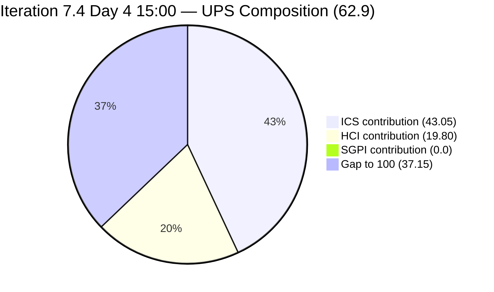
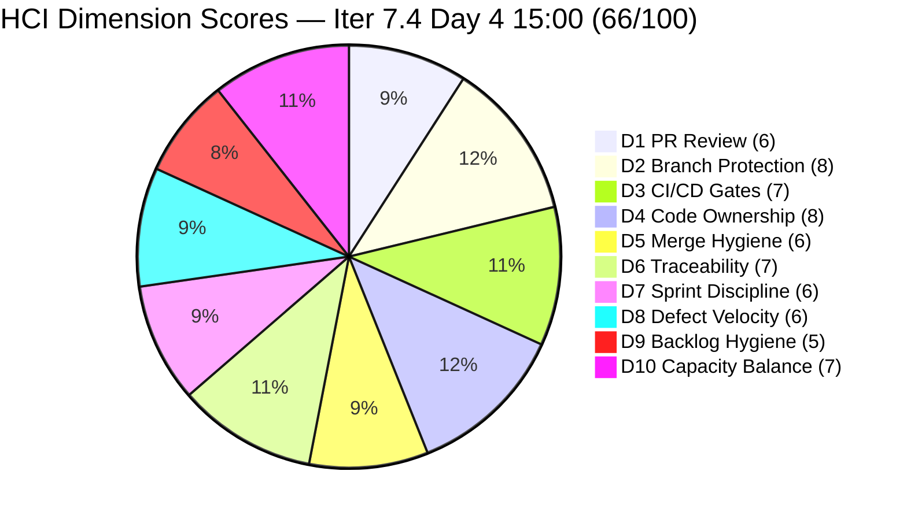

# Colina Health Product Team — Iteration 7.4 Audit
**Day 4 of 14 | 2026-05-21 15:00 | data_mode: partial**

---

## 1. Audit Metadata

| Field | Value |
|---|---|
| **Audit Date** | 2026-05-21 |
| **Audit Time** | 15:00 |
| **Iteration** | Iteration 7.4 |
| **Iteration ID** | `16385d00-244a-4caa-9e56-d4a8e850754d` |
| **Iteration Window** | 2026-05-18 → 2026-05-31 |
| **Iteration Day** | 4 of 14 |
| **Time Elapsed** | 28.6% |
| **Phase** | Early Sprint |
| **ADO Org** | jairo |
| **ADO Project ID** | `666bb99a-6acd-4999-bb34-efd0e4ea90dc` |
| **ADO Team ID** | `66cdeb09-df38-4c3e-9418-0ed0d68c39f2` |
| **ADO Team** | Colina Health Product Team |
| **ADO Backlog** | Microsoft.RequirementCategory — Stories and Deliverables |
| **GitHub Repos** | colinahealth-fe, colinahealth-be, colina-health-ai-agent-code-fixing |
| **data_mode** | partial (GitHub API 401 — raseniero token issue; verified via curl 2026-05-21 15:00; HCI D1–D6 carried forward from 7.3 Day 7 baseline, 2026-05-10; carry-forward chain 12 audits deep) |
| **Prior Audit** | AUDIT_20260521_0900.md (Iteration 7.4 Day 4 — 09:00) |
| **Auditor** | Claude Code (git_iteration_audit skill) |

**Three named scores:**

| Score | Value | Risk Band | Delta vs 09:00 |
|---|---|---|---|
| **ICS** (Iteration Compliance Score) | **86.1%** | Yellow | 0 (hygiene unactioned) |
| **HCI** (Engineering Health Index) | **66 / 100** | Yellow | **+1** (AB#202585 → Peer Testing) |
| **SGPI** (Committed Scope SGPI) | **0.0%** | Early Sprint (Day 4) | 0 |
| **UPS** (Unified Performance Score) | **62.9** | Yellow | **+0.3** |

---

## 2. Executive Summary

This is the **second audit of Day 4** (15:00 vs 09:00). The headline finding is a single but meaningful intra-day positive: **AB#202585 ([Enabler] Private co-located folders, 5 SP) moved from `Active` to `Peer Testing` at 12:59 UTC**, confirmed by live ADO field data (rev 23, ChangedDate 2026-05-21T12:59:24.947Z). Paul Coronia is delivering.

This one state transition produces three cascading effects:
1. **Delivered Proxy SGPI rises from 22.0% to 32.0%** — 5 SP of Enabler work joining the near-close pool alongside 11 SP of defect work.
2. **HCI D7 (Sprint Discipline) recovers from 5 to 6** — measurable Enabler delivery against the previously stalled architecture track.
3. **AB#202588 activation window opens** — with AB#202585 now out of Paul's Active queue, there is bandwidth signal to activate the RSC migration (13 SP, still in `New` on Day 4).

All five ICS hygiene gaps from the 09:00 audit **remain unactioned**:
- AB#204700 and AB#204791 still missing `System.Parent` and `StoryPoints`
- AB#199041, AB#200027, AB#200194 still missing `System.Description`
- AB#204200 and AB#202586 IterationPath corrections still pointing to Iteration 7.3 (4 days overdue)

**Net assessment:** ICS 86.1% (Yellow), HCI 66 (+1 intra-day), UPS 62.9 (+0.3). The decline trend from Days 1–4 has stabilized. Closing the five ICS failures and activating AB#202588 before Day 6 determine whether the sprint recovers to Green or continues eroding into Orange.

**GitHub token status:** Still 401 (verified fresh via curl on 2026-05-21 15:00). The raseniero token issue remains unresolved — 30+ days open, 12 audits deep on carry-forward. `data_mode: partial` applies.

---

## 3. Iteration Scope and Methodology

### Iteration 7.4

| Field | Value |
|---|---|
| **Iteration Name** | Iteration 7.4 |
| **Iteration ID** | `16385d00-244a-4caa-9e56-d4a8e850754d` |
| **Start Date** | 2026-05-18 (Monday) |
| **End Date** | 2026-05-31 (Sunday) |
| **Duration** | 14 calendar days |
| **Day of Audit** | Day 4 (15:00) |
| **Working Days Remaining** | ~10 |

### ICS-Eligible Items (parent-level, in 7.4 iteration path)

**14 eligible items — scope unchanged from 09:00 audit.**

| ID | Title (abbreviated) | Type | State (15:00) | SP | Assigned To | Parent | Desc | AC | 7.4 Path | 09:00 State | Delta |
|---|---|---|---|---|---|---|---|---|---|---|---|
| **198098** | [MAR][PRN] No warning message for exceeded daily limit | Defect | Active | 5 | Asnari Pacalna | 201646 | Yes | Yes | Yes | Active | Unchanged |
| **199041** | [MAR] Page auto-loads on page number entry | Defect | Passed QA Testing | 2 | Asnari Pacalna | 201646 | **NO** | Yes | Yes | Passed QA Testing | Unchanged |
| **200027** | [MAR][PRN] Sorting Options Not Working | Defect | Active | 3 | Asnari Pacalna | 201646 | **NO** | Yes | Yes | Active | Unchanged |
| **200194** | [Workflow][Update Med Log] First letter remains after delete | Defect | Passed QA Testing | 2 | Asnari Pacalna | 201680 | **NO** | Yes | Yes | Passed QA Testing | Unchanged |
| **200219** | [MAR] Order By/Sort By limits table to Hawaii date | Defect | Peer Testing | 5 | Asnari Pacalna | 201646 | Yes | Yes | Yes | Peer Testing | Unchanged |
| **202585** | [Enabler] Implement private co-located folders | Enabler | **Peer Testing** | 5 | Paul Coronia | 201281 | Yes | Yes | Yes | Active | **ADVANCED 12:59 UTC** |
| **202588** | [Enabler] Migrate data fetching to Server Components + RSC | Enabler | **New** | 13 | Paul Coronia | 201281 | Yes | Yes | Yes | New | Stalled — Day 4 |
| **202597** | [Enabler] Parallel data fetching with Promise.all | Enabler | Ready for Dev | 3 | Paul Coronia | 201281 | Yes | Yes | Yes | Ready for Dev | Unchanged |
| **202600** | [Enabler] Consolidate test directories under /tests | Enabler | Ready for Dev | 2 | Paul Coronia | 201281 | Yes | Yes | Yes | Ready for Dev | Unchanged |
| **202602** | [Enabler] URL-first state hierarchy | Enabler | Ready for Dev | 5 | Paul Coronia | 201281 | Yes | Yes | Yes | Ready for Dev | Unchanged |
| **202603** | [Enabler] Evaluate shadcn/ui vs NextUI | Enabler | Ready for Dev | 3 | Paul Coronia | 201281 | Yes | Yes | Yes | Ready for Dev | Unchanged |
| **203320** | [MAR][View Report] Long medication names break layout | Defect | Peer Testing | 2 | Asnari Pacalna | 201646 | Yes | Yes | Yes | Peer Testing | Unchanged |
| **204700** | [Enabler] Backend API Documentation (Swagger) | Enabler | Active | **MISSING** | Paul Coronia | **MISSING** | Yes | Yes | Yes | Active | Unchanged — ungroomed |
| **204791** | [Dev Env][Login Page] Cannot login — 410 Unauthorized | Defect | New | **MISSING** | Paul Coronia | **MISSING** | Yes | Yes | Yes | New | Unchanged — ungroomed |

**Total committed SP: 50 SP** (12 items with SP; AB#204700 and AB#204791 still missing StoryPoints).

**Items on 7.3 path — excluded from eligible set:**

| ID | Title | Type | State | SP | Path Issue | Days Overdue |
|---|---|---|---|---|---|---|
| 204200 | [Blocker][UAT] Unable to Receive OTP | Defect | Peer Testing | 1 | Still Iter 7.3 | **4 days** |
| 202586 | [Enabler] Restructure /lib into sub-directories | Enabler | Peer Testing | 5 | Still Iter 7.3 | **4 days** |

**Spikes (excluded from ICS):**

| ID | Title | Type | State |
|---|---|---|---|
| 204232 | [Retro] Update / Automate PR Approval Process | Spike | New |
| 204233 | [Retro] Hidden API Endpoint — POC | Spike | New |
| 204291 | 7.4 Collaborations / Exploratory Testing / Update E2E | Spike | Active |

### Methodology

1. `work_list_team_iterations` (GUIDs) — Iteration 7.4 confirmed active
2. `wit_get_work_items_for_iteration` — 19 parent items confirmed
3. `wit_get_work_items_batch_by_ids` — fresh field data for all 19 parents; AB#202585 ChangedDate 2026-05-21T12:59:24.947Z detected
4. GitHub API — **unavailable**: HTTP 401 (verified curl 2026-05-21 15:00). HCI D1–D6 carry-forward from 2026-05-10 (12th consecutive audit)
5. Prior audit AUDIT_20260521_0900.md used for intra-day delta

---

## 4. Scorecard Summary



| Score | Value | Risk Band | Delta vs 09:00 | Delta vs Day 1 | Delta vs 7.3 Final |
|---|---|---|---|---|---|
| **ICS** | **86.1%** | Yellow | 0 | −5.2 (from 91.3%) | −9.8 (from 95.9%) |
| **HCI** | **66 / 100** | Yellow | **+1** | −5 (from 71) | −5 (from 71) |
| **SGPI** | **0.0%** | Early Sprint | 0 | 0 | n/a |
| **UPS** | **62.9** | Yellow | **+0.3** | −4.1 (from 67.0) | — |

**UPS Calculation:**
```
UPS = ICS × 0.50 + HCI × 0.30 + SGPI × 0.20
    = 86.1 × 0.50 + 66 × 0.30 + 0.0 × 0.20
    = 43.05 + 19.80 + 0.00
    = 62.85 ≈ 62.9
```

> The UPS decline trend of 67.0 → 65.0 → 62.6 (Days 1–4) shows the first stabilization at 62.9. Driven entirely by Paul's AB#202585 delivery. If all five ICS hygiene gaps are closed, UPS can recover to ~72+ (ICS→100%, HCI D9 +2).

---

## 5. Sprint Goal Predictability (SGPI)

### Headline Score

```
SGPI (Committed Scope) = Closed Parent SP / Total Committed Parent SP
                       = 0 / 50
                       = 0.0%
```

> Day 4, no parent items closed. Headline 0.0% is expected at this stage.

### Supporting Metrics

| Metric | Formula | Value | Delta vs 09:00 | Notes |
|---|---|---|---|---|
| **Committed Scope SGPI** (headline) | Closed SP / Committed SP | 0 / 50 = **0.0%** | 0 | No closures |
| **Delivered Proxy SGPI** | (Passed QA + Peer Testing SP) / Committed SP | 16 / 50 = **32.0%** | **+10.0%** | AB#202585 (5 SP) entered Peer Testing intra-day |
| **Original Scope SGPI** | Closed SP / Day 1 SP | 0 / 48 = **0.0%** | 0 | Day 1 base was 48 SP |

> The Proxy SGPI jump from 22.0% to 32.0% is the most significant intra-day movement this sprint. Five SP of Enabler work have advanced from Active to Peer Testing. Clearing the three Peer Testing items (AB#200219, AB#202585, AB#203320 = 12 SP) and closing the two Passed QA items (AB#199041, AB#200194 = 4 SP) would bring total headline SGPI credit to 16 SP (32.0%) once closed.

### State Distribution (Day 4 — 15:00)

| State | Items | SP | % of Committed SP (50) | Delta vs 09:00 |
|---|---|---|---|---|
| Passed QA Testing | 2 (199041, 200194) | 4 | 8.0% | Unchanged |
| Peer Testing | 3 (200219, **202585**, 203320) | **12** | **24.0%** | **+5 SP** |
| Active | 3 (198098, 200027, 204700) | 8+0 = 8 | 16.0% | **−5 SP (202585 advanced)** |
| New | 2 (202588, 204791) | 13+0 = 13 | 26.0% | Unchanged |
| Ready for Dev | 4 (202597, 202600, 202602, 202603) | 13 | 26.0% | Unchanged |
| Closed | 0 | 0 | 0.0% | — |
| **Total** | **12 (SP-bearing)** | **50** | **100%** | — |

### Carryover Items (7.3 path)

| Item | State | SP | Assessment |
|---|---|---|---|
| AB#202586 | Peer Testing | 5 | Still on 7.3 path — path correction 4 days overdue |
| AB#204200 | Peer Testing | 1 | Still on 7.3 path — path correction 4 days overdue |

---

## 6. Developer Productivity Findings

### GitHub Evidence Status

**data_mode: partial.** GitHub API returned HTTP 401 at both 09:00 and 15:00 today (curl-verified). The raseniero token issue has been open since 2026-04-21 — 30+ days. This is the **12th consecutive audit** on HCI D1–D6 carry-forward from the May 10 baseline. No team penalty per workspace Project Exceptions.

> **GitHub token freshly confirmed broken at 15:00 today.** See Section 15 / Evidence Gaps. The `colinahealth-fe`, `colinahealth-be`, and `colina-health-ai-agent-code-fixing` repos all return 404 without auth (private repos) and 401 with the stored raseniero token. The MCP GitHub server also showed no available tools in this session — consistent with the token being invalid at the server level.

### Intra-Day ADO Activity (09:00 → 15:00)

| Item | Developer | From → To | UTC Time | Interpretation |
|---|---|---|---|---|
| AB#202585 | Paul Coronia | Active → **Peer Testing** | 12:59 | Co-located folders implementation submitted for peer review |

All other 18 parent items show no ChangedDate after 09:00. The sole intra-day change is Paul advancing AB#202585.

### Developer Workload (Day 4 — 15:00)

| Developer | Assigned Items | SP | Active/In-Progress |
|---|---|---|---|
| Asnari Pacalna | 6 Defects | 17 SP | 2 Active, 2 Passed QA, 2 Peer Testing |
| Paul Coronia | 7 Enablers + 1 Defect (204791) | 31 SP committed | 202585 in Peer Testing (delivered); 204700 Active; 202588 New (stalled); 4 Ready for Dev; 204791 New |
| Luzmibel Paculanang | QA gate + Spike | 2 SP spike | Spike Active; now 3 items to peer-review (200219, 202585, 203320) |

> **Key shift:** AB#202585 exiting Paul's Active queue creates bandwidth to pivot to AB#202588 (RSC migration, 13 SP, still in New). Day 5 is the activation deadline to keep this item viable within the sprint.

> **Luzmibel QA gate load increased:** Three Peer Testing items (12 SP total) now await QA sign-off. AB#200219 and AB#203320 have been waiting since Day 2. With Luzmibel's days off May 25–26 approaching, all three should clear by Day 5 or early Day 6.

---

## 7. SAFe Compliance Findings

### Iteration Path Compliance

14 of 14 ICS-eligible items in `Jairosoft Portfolio\2026-PI7\Iteration 7.4`. Iteration Integrity = 100%.

**Path hygiene violations — FOUR DAYS OVERDUE (unchanged since 09:00):**

| Item | Current Path | Action | Priority | Days Overdue |
|---|---|---|---|---|
| AB#204200 [OTP Blocker] | Iteration 7.3 | Update to 7.4 | **P0** | 4 |
| AB#202586 [Enabler /lib] | Iteration 7.3 | Update to 7.4 | P1 | 4 |

### Enabler Track (Day 4 — 15:00)

| ID | Title | SP | State | Risk |
|---|---|---|---|---|
| **202585** | Private co-located folders | 5 | **Peer Testing** ✓ | Low — delivered |
| 202588 | Migrate to Server Components + RSC | 13 | **New** | **Critical — activate Day 5** |
| 202597 | Parallel data fetching (Promise.all) | 3 | Ready for Dev | High (gated on 202588) |
| 202600 | Consolidate test directories | 2 | Ready for Dev | Medium |
| 202602 | URL-first state hierarchy | 5 | Ready for Dev | High (gated on 202588) |
| 202603 | Evaluate shadcn/ui vs NextUI | 3 | Ready for Dev | Medium |
| 204700 | Backend API Documentation (Swagger) | — | Active | Medium (ungroomed) |

> AB#202588 (13 SP, 26% of scope) must activate by Day 5. AB#202597 (3 SP) and AB#202602 (5 SP) are gated behind it — 21 SP total at risk if RSC migration stalls further.

---

## 8. Iteration Compliance Score (ICS)

### Eligible Scope: 14 items (unchanged from 09:00)

#### Dimension 1: Alignment (Weight: 25)

| Eligible | Compliant | Failed | Score % |
|---|---|---|---|
| 14 | 12 | 2 (204700, 204791) | 85.71% |

Failures: AB#204700 and AB#204791 both missing `System.Parent` (live batch confirmed, rev 8 and rev 4).

#### Dimension 2: Estimation (Weight: 20)

| Eligible | Compliant | Failed | Score % |
|---|---|---|---|
| 14 | 12 | 2 (204700, 204791) | 85.71% |

Failures: AB#204700 and AB#204791 both missing `StoryPoints`.

#### Dimension 3: Quality / DoD (Weight: 35)

| Eligible | Compliant | Failed | Score % |
|---|---|---|---|
| 14 | 11 | 3 (199041, 200027, 200194) | 78.57% |

Failures: AB#199041, AB#200027, AB#200194 — null `System.Description` (live batch confirmed). AB#199041 is in Passed QA Testing and may close before description is added.

#### Dimension 4: Iteration Integrity (Weight: 20)

| Eligible | Compliant | Failed | Score % |
|---|---|---|---|
| 14 | 14 | 0 | 100.0% |

### ICS Summary Table

| Dimension | Eligible | Compliant | Failed | Score % | Weight | Weighted Contribution | Evidence | Reason |
|---|---|---|---|---|---|---|---|---|
| Alignment | 14 | 12 | 2 | 85.71% | 25 | 21.43 | AB#204700, AB#204791 missing System.Parent | Mid-sprint adds without grooming |
| Estimation | 14 | 12 | 2 | 85.71% | 20 | 17.14 | AB#204700, AB#204791 missing StoryPoints | Mid-sprint adds without grooming |
| Quality / DoD | 14 | 11 | 3 | 78.57% | 35 | 27.50 | AB#199041, AB#200027, AB#200194 null description | Missing since Day 1 — 4 days unactioned |
| Iteration Integrity | 14 | 14 | 0 | 100.0% | 20 | 20.00 | All 14 eligible in Iteration 7.4 | Full compliance |
| **TOTAL** | **14** | — | — | — | 100 | **86.07** | | |

```
ICS = (85.71×25 + 85.71×20 + 78.57×35 + 100.0×20) / 100
    = (2142.86 + 1714.29 + 2750.00 + 2000.00) / 100
    = 86.07% → 86.1%
```

> ICS = **86.1% — Yellow**. Unchanged from 09:00. All five failures are correctable in a single 30-minute ADO session. Full remediation restores ICS to **100.0%**.

---

## 9. Engineering Health Index (HCI)

**data_mode: partial — D1–D6 carry-forward from 7.3 Day 7 (2026-05-10), 11 calendar days stale, 12 audits deep.**

### Dimension Scores

| # | Dimension | Score | Source | vs 09:00 | Rationale |
|---|---|---|---|---|---|
| D1 | PR Review Compliance | 6/10 | Carry-forward | 0 | GitHub API 401; May 10 baseline |
| D2 | Branch Protection & Enforcement | 8/10 | Carry-forward | 0 | Confirmed rules from Day 7 |
| D3 | CI/CD Gate Quality | 7/10 | Carry-forward | 0 | Unchanged |
| D4 | Code Ownership | 8/10 | Carry-forward | 0 | Paul + Asnari confirmed developers |
| D5 | Merge Hygiene & Churn | 6/10 | Carry-forward | 0 | AI Agent PR#9 (100+ days), ADO #11207/#11182 (110+ days) stale |
| D6 | Work Item ↔ GitHub Traceability | 7/10 | Carry-forward | 0 | 0% ADO artifact links on all current-iteration items |
| D7 | Sprint Discipline | **6/10** | Fresh ADO | **+1** | POSITIVE: AB#202585 → Peer Testing (5 SP Enabler delivered). NEGATIVES unchanged: path corrections 4 days overdue, AB#202588 still in New, two items in Passed QA without closure, two ungroomed mid-sprint adds |
| D8 | Defect Triage & Velocity | 6/10 | Fresh ADO | 0 | Asnari rework of AB#198098, AB#200027 continuing (Active since 00:27 UTC); no intra-day defect closures; AB#204791 still New |
| D9 | Backlog & Story Hygiene | 5/10 | Fresh ADO | 0 | Two items missing parent/SP (204700, 204791); three descriptions missing (199041, 200027, 200194); AB#202588 in New; two carryover items on wrong path — all unchanged |
| D10 | Capacity Balance & Ownership | 7/10 | Fresh ADO | 0 | AB#202585 clearing partially relieves Paul's Active load; AB#202588 still single-owner and unstarted; Asnari throughput continues |

```
D1–D6 (carry-forward): 6+8+7+8+6+7 = 42
D7–D10 (fresh ADO):    6+6+5+7     = 24
HCI = 42 + 24 = 66
```

### HCI Visualization



| Category | Dimensions | Score | Max | % | vs 09:00 |
|---|---|---|---|---|---|
| Code Quality & Process | D1–D5 | 35 | 50 | 70% | 0 |
| Traceability & Integration | D6 | 7 | 10 | 70% | 0 |
| SAFe Process Health | D7–D10 | 24 | 40 | 60% | **+1** |
| **Total HCI** | D1–D10 | **66** | **100** | **66%** | **+1** |

---

## 10. ADO-to-GitHub Traceability Analysis

**Linked items: 0 of 14 (0%)** — unchanged across all five Day 4 audits.

> **New gap:** AB#202585 is now in Peer Testing. A GitHub PR almost certainly exists in `colinahealth-fe` — but no ADO artifact link has been added. This item may close (merged PR → Peer Testing → Closed) with no code audit trail. Link the PR immediately.

---

## 11. Collaboration and Review Analysis

**data_mode: partial — GitHub unavailable.**

### Luzmibel QA Gate Load (15:00)

Three items simultaneously in Peer Testing, all requiring Luzmibel sign-off:

| Item | SP | In Peer Testing Since | Urgency |
|---|---|---|---|
| AB#200219 | 5 | Day 2 (May 19) | Overdue — 2 days in Peer Testing |
| AB#203320 | 2 | Day 2 (May 19) | Overdue — 2 days in Peer Testing |
| **AB#202585** | 5 | Day 4 (today 12:59) | New — just arrived |

Luzmibel's days off May 25–26 are 4 working days away. All three should be cleared by Day 5–6.

### Authentication Track

Two concurrent auth defects both assigned to Paul:

| Item | Type | State | Auth Domain |
|---|---|---|---|
| AB#204200 | UAT OTP Failure | Peer Testing (7.3 path) | Email OTP delivery |
| AB#204791 | Dev Env 410 Login | New | HTTP 410 on login endpoint |

Paul now has bandwidth from AB#202585 clearing — AB#204791 triage is the next natural priority.

---

## 12. Repository Hygiene

**data_mode: partial — direct GitHub inspection unavailable.**

| Item | Age | Priority | Status |
|---|---|---|---|
| AB#202585 PR (colinahealth-fe) | < 1 day | **P0 — link immediately** | Unlinked in ADO; in Peer Testing |
| colina-health-ai-agent PR#9 | **~100+ days** | P1 | 12th consecutive audit flag |
| ADO PRs #11207, #11182 | ~110+ days each | P2 | Stale; no linked work items |
| AB#202588 — no branch | Day 4, no start | **P0** | Largest item; must activate Day 5 |

---

## 13. Risks and Bottlenecks

| # | Risk | Severity | vs 09:00 | Owner |
|---|---|---|---|---|
| R1 | **AB#202588 (RSC migration, 13 SP) — Day 4, still New; 21 SP gated** | Critical | Worsening | Paul |
| R2 | **AB#202585 PR unlinked in ADO** — Enabler may close with no code trail | High | **New** | Paul |
| R3 | **Luzmibel QA gate** — 3 items in Peer Testing (12 SP); days off May 25–26 in 4 days | High | Worsening | Luzmibel / Karl |
| R4 | **Paul bus factor** — sole owner of all Enablers, both auth blockers, stalled 13 SP item | Critical | Stable (one item cleared) | Karl / Ramon |
| R5 | **Five ICS hygiene failures** — all correctable, none actioned in 4 days | High | Persistent | Karl / Asnari |
| R6 | **AB#204200 OTP blocker** — Peer Testing, path still 7.3, 4 days overdue | High | Stable | Paul / Karl |
| R7 | **AB#204791 (410 login)** — New, unstarted; Paul's next priority | High | Unchanged | Paul |
| R8 | **Three defect descriptions missing** — AB#199041 near closure without description | Medium | Persistent | Asnari / Karl |
| R9 | **GitHub token 401** — 12 audits on carry-forward; D1–D6 stale | Medium | Worsening | Ramon |
| R10 | **ADO↔GitHub traceability 0%** — systemic | Medium | Stable | Team |
| R11 | **colina-health-ai-agent PR#9** — 100+ days, 12th flag | Medium | Worsening | Paul |

---

## 14. Prioritized Remediation Actions

| Priority | Action | Owner | Due | Effort | Impact |
|---|---|---|---|---|---|
| **P0** | Link AB#202585 GitHub PR to ADO work item | Paul | **Now** | 2 min | Traceability before merge |
| **P0** | Add `System.Parent` + `StoryPoints` to AB#204700 | Karl / Paul | **Today** | 5 min | ICS +1.43% per dimension |
| **P0** | Add `System.Parent` + `StoryPoints` to AB#204791 | Karl / Paul | **Today** | 5 min | ICS +1.43% per dimension |
| **P0** | Update AB#204200 IterationPath → 7.4 | Karl | **Today** | 2 min | Sprint visibility |
| **P0** | Add `System.Description` to AB#199041, AB#200027, AB#200194 | Asnari | **Today** | 30 min | ICS Quality/DoD 78.6%→100% |
| **P1** | Activate AB#202588 (RSC migration, 13 SP) — branch + activate | Paul | **Day 5** | Medium | 21 SP unblocked |
| **P1** | Triage AB#204791 (410 login) — assess root cause vs OTP blocker | Paul | **Day 5** | Medium | Auth track stabilized |
| **P1** | Close AB#199041, AB#200194 from Passed QA → Closed | Karl / Asnari | **Today** | 5 min | 4 SP SGPI credit |
| **P1** | Clear AB#200219, AB#203320, AB#202585 through Peer Testing | Luzmibel | **Day 5** | Low-Medium | 12 SP near-SGPI credit |
| **P1** | Update AB#202586 IterationPath → 7.4 | Karl | **Today** | 2 min | Sprint visibility |
| **P2** | Close or merge colina-health-ai-agent PR#9 | Paul | This week | Low | HCI D5 |
| **P3** | Resolve raseniero GitHub token 401 | Ramon | ASAP | Low | data_mode: full |

**P0 actions completed today** → ICS restores to **100.0%**, HCI to ~68, UPS to approximately **73.0**.

---

## 15. Evidence Gaps and Limitations

| Gap | Impact | Cause | Mitigation |
|---|---|---|---|
| **GitHub API 401 — all three repos** | HCI D1–D6 unavailable fresh; 12-audit carry-forward from 2026-05-10 | raseniero token issue, known since 2026-04-21; curl-verified 2026-05-21 09:00 and 15:00 | D1–D6 carried forward per workspace Project Exceptions. No team penalty. |
| **GitHub MCP server — no tools available** | Cannot query GitHub PRs, branches, or commits via MCP | Same token issue propagated to MCP server configuration | ADO state used as proxy; no fabricated GitHub conclusions |
| **AB#202585 PR — not in ADO artifact links** | Cannot confirm PR number, reviewer, or content | GitHub unavailable + no ADO link | ADO state (Peer Testing) confirms code was submitted; immediate action: link PR |
| **AB#202588 GitHub evidence** | Cannot confirm if any private branch exists | GitHub unavailable + New state in ADO | ADO New state indicates no visible activation |
| **AI Agent PR#9** | Cannot confirm status after 100+ days | Token issue | 12th consecutive carry-forward |
| **Luzmibel GitHub absence** | Not scored as HCI gap | Non-developer per workspace Project Exceptions | Excluded; no penalty |
| **Jaszmeine Villanueva GitHub absence** | Not scored as HCI gap | Non-developer per workspace Project Exceptions | Excluded; no penalty |

**data_mode: partial** applied. HCI D1–D6 carry-forward sourced from 2026-05-10 (11 calendar days stale, 12 audits deep). No fabricated conclusions.

---

*End of Report — AUDIT_20260521_1500.md*

*Generated by Claude Code (claude-sonnet-4-6) on 2026-05-21. ADO evidence collected live via `wit_get_work_items_for_iteration` and `wit_get_work_items_batch_by_ids`. Key intra-day delta: AB#202585 advanced Active→Peer Testing at 2026-05-21T12:59:24.947Z (rev 23, confirmed). GitHub API 401 verified via curl at 09:00 and 15:00 on 2026-05-21. HCI D1–D6 carry-forward from 2026-05-10 baseline (12 audits deep).*
