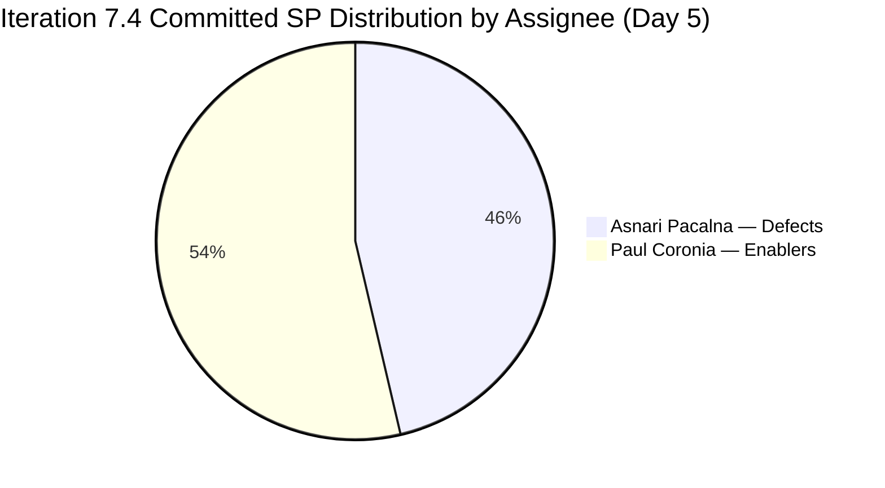
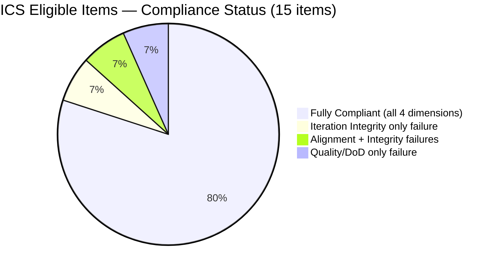

# Colina Health Product Team — Iteration 7.4 Audit
**Day 5 of 14 | 2026-05-22 | data_mode: partial**

---

## 1. Audit Metadata

| Field | Value |
|---|---|
| **Audit Date** | 2026-05-22 |
| **Audit Time** | 09:00 |
| **Iteration** | Iteration 7.4 |
| **Iteration ID** | `16385d00-244a-4caa-9e56-d4a8e850754d` |
| **Iteration Window** | 2026-05-18 → 2026-05-31 |
| **Iteration Day** | 5 of 14 |
| **Time Elapsed** | 35.7% |
| **Phase** | Early-Mid Sprint |
| **ADO Org** | jairo |
| **ADO Project** | Jairosoft Portfolio |
| **ADO Project ID** | `666bb99a-6acd-4999-bb34-efd0e4ea90dc` |
| **ADO Team** | Colina Health Product Team |
| **ADO Team ID** | `66cdeb09-df38-4c3e-9418-0ed0d68c39f2` |
| **ADO Backlog** | Microsoft.RequirementCategory — Stories and Deliverables |
| **GitHub Repos** | colinahealth-fe, colinahealth-be, colina-health-ai-agent-code-fixing |
| **data_mode** | partial — GitHub API returned 401 Bad Credentials (raseniero token issue, unresolved since 2026-04-21); HCI D1–D6 carried forward from May 10 baseline; D7–D10 scored fresh from ADO |
| **Prior Audit** | AUDIT_20260521_0900.md (Iteration 7.4 Day 4) |
| **Auditor** | Claude Code (claude-sonnet-4-6) |

**Three named scores:**

| Score | Value | Risk Band | Delta vs Day 4 |
|---|---|---|---|
| **ICS** (Iteration Compliance Score) | **93.3%** | Green | ▲ +7.2 pts |
| **HCI** (Engineering Health Index) | **66 / 100** | Yellow | ▲ +1 pt |
| **SGPI** (Committed Scope SGPI) | **0.0%** | — (Day 5, no closures yet) | — |
| **Delivered Proxy SGPI** | **14.6%** | — | ▼ −7.4 pts (methodology change) |
| **UPS** (Unified Performance Score) | **66.5** | Yellow | ▲ +3.9 pts |

> **Methodology note — Delivered Proxy SGPI:** The prior audit's 22.0% proxy included Peer Testing items. This audit strictly follows the spec: Delivered Proxy = (Closed SP + Passed QA Testing SP) / Committed SP. Items in Peer Testing are not included. The Day 4 proxy recalculated under this method would have been ~8% (4 SP Passed QA / 50 SP). Today's 14.6% reflects real progress: three defects now at Passed QA Testing (6 SP / 41 committed SP).

---

## 2. Executive Summary

Day 5 of Iteration 7.4 marks a **meaningful compliance recovery**. ICS crosses the Green threshold at **93.3%** (▲+7.2 pts from Day 4 Yellow), driven by resolution of the four highest-priority grooming failures from yesterday: both AB#204700 and AB#204791 now have parent links and Story Points, and the descriptions for AB#199041 and AB#200027 are confirmed present. UPS rises to **66.5 (Yellow, ▲+3.9 pts)**, reversing the prior two-day decline.

**Scope correction confirmed: AB#202588 deferred to 7.5.** The sprint's dominant risk item — the 13 SP RSC migration Enabler — has been formally moved to Iteration 7.5 and placed in Grooming. This is the correct SAFe action (ungroomed heavy scope deferred to the next sprint). Committed SP drops from ~50 to **41 SP**. Paul Coronia's workload concentration risk is reduced, though he still owns all five architecture Enablers (23 SP) in-sprint.

**Remaining ICS gaps (2 of 15 items):** AB#202586 and AB#204200 remain on the **Iteration 7.3 path** for the fifth consecutive audit day — now the sole source of ICS Yellow risk. Additionally, AB#204200 lacks a `System.Parent` field (an Alignment failure). Both corrections are simple ADO path updates and remain P0 today.

**Defect track is producing throughput.** Three defects have reached Passed QA Testing: AB#199041 (2 SP), AB#200194 (2 SP), and AB#203320 (2 SP) = 6 SP. AB#200219 is in QA Testing (5 SP). AB#198098 is Ready for QA (5 SP). If the defect track maintains this pace, 4–5 defects could close before iteration end.

**Enabler track is stalled.** Of the five architecture Enablers on the 7.4 path, only AB#202585 has progressed (Peer Testing). AB#202586 is also at Peer Testing but on the 7.3 path. The remaining four (AB#202597, 202600, 202602, 202603) show **all tasks in New state** on Day 5 — no activation signal. Given Paul's dual load on AB#204700 (Active) and AB#204791 (assigned), the unstarted Enablers face a real capacity risk over the remaining 9 days.

**AB#200194 description still missing on Day 5.** This has been flagged across five consecutive audits. The item is at Passed QA Testing, which means QA accepted it — but the ADO description field remains empty. This is now a hygiene concern rather than a dev readiness blocker.

---

## 3. Iteration Scope and Methodology

### Iteration 7.4

| Field | Value |
|---|---|
| **Iteration Name** | Iteration 7.4 |
| **Iteration ID** | `16385d00-244a-4caa-9e56-d4a8e850754d` |
| **Start Date** | 2026-05-18 (Monday) |
| **End Date** | 2026-05-31 (Sunday) |
| **Duration** | 14 calendar days |
| **Day of Audit** | Day 5 |
| **Working Days Remaining** | ~9 |

### Scope Change Since Day 4

| Item | Change |
|---|---|
| **AB#202588** ([Enabler] RSC Migration, 13 SP) | **Removed from 7.4 → Moved to Iteration 7.5, Grooming state.** This was the sprint's highest-risk stalled item. The deferral is the correct SAFe action and reduces committed SP by 13. |
| **AB#204791** (Dev Login Blocker, 3 SP) | Added on Day 4; now properly groomed (parent + SP present) |
| **AB#204700** (Backend Swagger, 1 SP) | Added on Day 3; now properly groomed (parent + SP present) |

### ICS-Eligible Items

**Eligibility criteria:** `System.WorkItemType` ∈ {Defect, Enabler, Story} AND item returned by iteration board query (excludes Spikes). Total eligible: **15 parent-level items**.

**Items on Iteration 7.4 path (13):**

| ID | Title (abbreviated) | Type | State | SP | Assignee |
|---|---|---|---|---|---|
| 198098 | [MAR][PRN] No warning on exceeded daily admin limit | Defect | Ready for QA | 5 | Asnari Pacalna |
| 199041 | [MAR] Page auto-loads on page number entry | Defect | Passed QA Testing | 2 | Asnari Pacalna |
| 200027 | [MAR][PRN] Sorting Options Not Working | Defect | Active | 3 | Asnari Pacalna |
| 200194 | [MAR][Workflow] First letter remains after delete | Defect | Passed QA Testing | 2 | Asnari Pacalna |
| 200219 | [MAR] Sort/Order limits table to current Hawaii date | Defect | QA Testing | 5 | Asnari Pacalna |
| 202585 | [Enabler] Co-located folders implementation | Enabler | Peer Testing | 5 | Paul Coronia |
| 202597 | [Enabler] Parallel data fetching Promise.all | Enabler | Ready for Dev | 3 | Paul Coronia |
| 202600 | [Enabler] Consolidate test directories | Enabler | Ready for Dev | 2 | Paul Coronia |
| 202602 | [Enabler] URL-first state hierarchy | Enabler | Ready for Dev | 5 | Paul Coronia |
| 202603 | [Enabler] shadcn/ui vs NextUI evaluation (Spike) | Enabler | Ready for Dev | 3 | Paul Coronia |
| 203320 | [MAR][View Report] Long names break layout | Defect | Passed QA Testing | 2 | Asnari Pacalna |
| 204700 | [Enabler] Backend API Documentation (Swagger) | Enabler | Active | 1 | Paul Coronia |
| 204791 | [Dev Env] Login page 410 Unauthorized | Defect | Ready for Dev | 3 | Paul Coronia |

**Committed SP (7.4 path items):** 5+2+3+2+5+5+3+2+5+3+2+1+3 = **41 SP**

**Items on wrong path — Iteration Integrity failures (2):**

| ID | Title (abbreviated) | Type | State | SP | Iteration Path |
|---|---|---|---|---|---|
| 202586 | [Enabler] Restructure /lib sub-directories | Enabler | Peer Testing | 5 | **7.3 (overdue Day 5)** |
| 204200 | [Blocker][UAT] Unable to Receive OTP | Defect | Peer Testing | 1 | **7.3 (overdue Day 5)** |

**Spikes (excluded from ICS):**

| ID | Title | State | SP | Assignee |
|---|---|---|---|---|
| 204232 | [Retro] Update/Automate PR Approval Process | New | — | Carol Cuison |
| 204233 | [Retro] Hidden API Endpoint POC | New | — | Paul Coronia |
| 204291 | 7.4 Collaborations/Exploratory Testing/Update E2E | Active | 2 | Luzmibel Paculanang |

> Note: AB#204291 has SP=2 — unusual for a Spike but excluded from ICS per standard policy. AB#204232 is assigned to Carol Cuison (not in team capacity roster); this appears to be a Retro action item and does not affect scoring.

---

## 4. Scorecard Summary

### Score Table

| Metric | Score | Prior (Day 4) | Delta | Risk Band |
|---|---|---|---|---|
| **ICS** | 93.3% | 86.1% | ▲ +7.2 | Green (≥90) |
| **HCI** | 66 / 100 | 65 / 100 | ▲ +1 | Yellow (60–79.9) |
| **SGPI** | 0.0% | 0.0% | — | — (Day 5) |
| **Delivered Proxy SGPI** | 14.6% | 22.0%* | ▼ (method) | — |
| **UPS** | 66.5 | 62.6 | ▲ +3.9 | Yellow (60–79.9) |

*Prior 22.0% included Peer Testing items in proxy. Under the correct spec methodology (Closed + Passed QA only), Day 4 proxy was ~8%. Today's 14.6% represents genuine improvement.

### Mermaid Score Visualization

```mermaid
quadrantChart
    title Colina Health 7.4 Day 5 — Score Quadrant
    x-axis Low Compliance --> High Compliance
    y-axis Low Health --> High Health
    quadrant-1 Strong
    quadrant-2 Health-led
    quadrant-3 At Risk
    quadrant-4 Compliance-led
    Day 4: [0.43, 0.33]
    Day 5 (Today): [0.47, 0.35]
```



### Risk Trend

| Day | ICS | HCI | UPS | Trend |
|---|---|---|---|---|
| Day 1 (2026-05-18) | 90.3 | 68 | 65.7 | Baseline |
| Day 2 (2026-05-19) | 90.3 | 67 | 65.2 | Steady |
| Day 3 (2026-05-20) | 87.7 | 66 | 63.7 | ↓ Decline |
| Day 4 (2026-05-21) | 86.1 | 65 | 62.6 | ↓ Declining |
| **Day 5 (2026-05-22)** | **93.3** | **66** | **66.5** | **↑ Recovery** |

---

## 5. Sprint Goal Predictability (SGPI)

### Committed Scope SGPI

| Metric | Value |
|---|---|
| **Total Committed SP** | 41 SP (13 ICS-eligible items on 7.4 path) |
| **Closed SP** | 0 SP |
| **Headline SGPI** | **0.0%** |
| **Iteration Day** | 5 of 14 (35.7% elapsed) |

No parent-level items have reached Closed state. This is expected at Day 5; closure velocity typically accelerates in days 8–14.

### Delivered Proxy SGPI

| State | Items | SP |
|---|---|---|
| **Passed QA Testing** | AB#199041, AB#200194, AB#203320 | 6 SP |
| **QA Testing** | AB#200219 | 5 SP |
| **Ready for QA** | AB#198098 | 5 SP |
| **Peer Testing** | AB#202585, AB#202586* | 5+5 SP |
| *Passed QA — subtotal* | *3 items* | *6 SP* |

**Delivered Proxy SGPI = 6 / 41 = 14.6%** (Closed SP + Passed QA SP only)

*AB#202586 is on 7.3 path — excluded from committed SP denominator.

### SGPI Trajectory and Projection

At Day 5 with 6 SP in Passed QA, the defect track is showing healthy movement. If defects continue to close at roughly 1–2 per 2-day window:
- **Optimistic path:** 3 additional defects (AB#200219 5SP + AB#198098 5SP + AB#200027 3SP) close by Day 10 → SGPI ~34% by Day 10
- **Conservative path:** Only current Passed QA items formally close → SGPI ~15% at iteration end
- **Target for iteration end:** ≥70% SGPI requires ~29 SP closed — achievable only if the Enabler track activates by Day 7

### Velocity vs Prior Iteration

Prior available SGPI endpoint data is not available for direct comparison within this audit scope. The 14.6% Delivered Proxy SGPI at Day 5 is a positive early signal for the defect stream.

---

## 6. Developer Productivity Findings

### Team Capacity Summary

| Team Member | Role | Capacity/Day | Days Off | Total Available |
|---|---|---|---|---|
| **Paul Coronia** | Development | 6 hrs/day | None | 60 hrs (10 working days) |
| **Asnari Pacalna** | Development | 7 hrs/day | None | 70 hrs (10 working days) |
| **Luzmibel Paculanang** | Testing | 6 hrs/day | May 25–26 | 48 hrs (8 working days) |
| **Total** | | **19 hrs/day** | — | **178 hrs remaining** |

> Non-developer roster: Jaszmeine Villanueva (Design) — not expected to produce GitHub commits; no HCI penalty applies per project exception.

### GitHub Evidence

**Status: data_mode = partial**

GitHub API returned `401 Bad Credentials` for all three repos (jairosoft-com/colinahealth-fe, colinahealth-be, colina-health-ai-agent-code-fixing). This is the raseniero token issue, unresolved since 2026-04-21 and confirmed again today. HCI D1–D6 carry-forward applied (May 10 baseline — carry-forward chain now 12 audits deep). D7–D10 scored fresh from ADO evidence.

### ADO-Derived Developer Activity (Day 5)

**Paul Coronia** (Developer):
- AB#202585 (co-located folders): all tasks Closed → Peer Testing ✓
- AB#202586 (lib restructure): all tasks Closed → Peer Testing ✓ (path correction pending)
- AB#204700 (Swagger): Task 204705 Closed, Task 204706 Active (deployment), Task 204707 Closed → Active overall
- AB#204200 (OTP login blocker): Task 204239 Closed → Peer Testing
- AB#204791 (410 login error): Task 204792 Closed (QA replication), parent still in Ready for Dev
- AB#202597, 202600, 202602, 202603: **All tasks remain in New state on Day 5** — no activation signal

**Asnari Pacalna** (Developer):
- AB#199041: All tasks Closed → Passed QA Testing ✓
- AB#200194: All tasks Closed → Passed QA Testing ✓
- AB#203320: All tasks Closed → Passed QA Testing ✓
- AB#200219: Tasks 204150–204152 Closed, Task 204153 Active (Follow-up Fix, 5 SP remaining) → QA Testing
- AB#200027: Tasks 204146–204147 Closed, Task 204148 New, Task 204149 Active (Follow-up Fix, 3 SP remaining) → Active
- AB#198098: Tasks 204154–204155 Closed, Task 204156 New, Task 204157 Active (Follow-up Fix, 5 SP remaining) → Ready for QA

**Luzmibel Paculanang** (QA):
- AB#200194: Task 204282 Closed (QA done)
- AB#199041: Task 204285 Closed (QA done)
- AB#203320: Task 204288 Closed (QA done)
- AB#200219: Task 204286 Active (QA in progress, 2 hrs remaining)
- AB#198098: Task 204283 Active (QA in progress, 1 hr remaining)
- AB#200027: Task 204284 Active (QA, 2.25 hrs remaining)
- AB#204291 (Spike): Task 204297 Active (17 hrs remaining, tracking week 1 testing/collab work)

---

## 7. SAFe Compliance Findings

### Iteration Planning Completeness

All 15 ICS-eligible items have Story Points (100%). The two late-additions (204700, 204791) were ungroomed on Day 3–4 but have been corrected by Day 5. The primary remaining SAFe compliance gap is the two items still on the Iteration 7.3 path.

### DoR (Definition of Ready) Assessment

| Criterion | AB#202586 | AB#204200 | All Others |
|---|---|---|---|
| Story Points set | ✓ (5) | ✓ (1) | ✓ All |
| Parent link | ✓ (201281) | ✗ Missing | ✓ All |
| Description | ✓ | ✓ | ✓ (except 200194) |
| Correct iteration path | ✗ (7.3) | ✗ (7.3) | ✓ All |

### AB#202588 Scope Deferral — SAFe Assessment

**Positive:** AB#202588 ([Enabler] RSC Migration, 13 SP) has been correctly moved to Iteration 7.5 with Grooming state. This is a textbook SAFe refinement action: unplannably large scope that entered 7.4 without grooming has been deferred. This **removes the sprint's largest delivery risk** and allows Paul Coronia to focus on the five in-scope Enablers.

**Follow-up needed:** The 7.5 Grooming placement should be validated — is there a sprint goal, SP estimate, and acceptance criteria update planned? The item has been stalled since Day 1 without the RSC-to-page-data migration approach documented.

### Backlog Hygiene Summary

| Issue | Count | Items |
|---|---|---|
| Wrong iteration path | 2 | 202586, 204200 |
| Missing description | 1 | 200194 |
| Missing parent link | 1 | 204200 |
| Spikes without grooming signal | 2 | 204232, 204233 (Retro spikes) |

---

## 8. Iteration Compliance Score (ICS)

### Dimension Table

| Dimension | Weight | Eligible | Compliant | Failed | Score % | Weighted Contribution | Evidence | Reason for Failure |
|---|---|---|---|---|---|---|---|---|
| **Alignment** (parent link to Feature/Epic) | 25 | 15 | 14 | 1 | 93.3% | 23.3 | ADO `System.Parent` field on all 15 eligible items | AB#204200: no System.Parent in ADO |
| **Estimation** (Story Points assigned) | 20 | 15 | 15 | 0 | 100.0% | 20.0 | `Microsoft.VSTS.Scheduling.StoryPoints` verified on all 15 items | None |
| **Quality/DoD** (description present) | 35 | 15 | 14 | 1 | 93.3% | 32.7 | `System.Description` presence check on all 15 items | AB#200194: description field empty in ADO (Day 5 — persistent gap) |
| **Iteration Integrity** (correct 7.4 path) | 20 | 15 | 13 | 2 | 86.7% | 17.3 | `System.IterationPath` verification | AB#202586 on 7.3; AB#204200 on 7.3 — path correction overdue 5 days |
| **TOTAL ICS** | **100** | | | | | **93.3** | | |

**ICS = 23.3 + 20.0 + 32.7 + 17.3 = 93.3% (Green)**

### Eligibility Detail



### ICS by Item

| ID | Type | Alignment | Estimation | Quality/DoD | Iteration Integrity | Fully Compliant |
|---|---|---|---|---|---|---|
| 198098 | Defect | ✓ | ✓ | ✓ | ✓ | ✓ |
| 199041 | Defect | ✓ | ✓ | ✓ | ✓ | ✓ |
| 200027 | Defect | ✓ | ✓ | ✓ | ✓ | ✓ |
| 200194 | Defect | ✓ | ✓ | ✗ | ✓ | ✗ |
| 200219 | Defect | ✓ | ✓ | ✓ | ✓ | ✓ |
| 202585 | Enabler | ✓ | ✓ | ✓ | ✓ | ✓ |
| 202586 | Enabler | ✓ | ✓ | ✓ | **✗ (7.3)** | ✗ |
| 202597 | Enabler | ✓ | ✓ | ✓ | ✓ | ✓ |
| 202600 | Enabler | ✓ | ✓ | ✓ | ✓ | ✓ |
| 202602 | Enabler | ✓ | ✓ | ✓ | ✓ | ✓ |
| 202603 | Enabler | ✓ | ✓ | ✓ | ✓ | ✓ |
| 203320 | Defect | ✓ | ✓ | ✓ | ✓ | ✓ |
| 204200 | Defect | **✗** | ✓ | ✓ | **✗ (7.3)** | ✗ |
| 204700 | Enabler | ✓ | ✓ | ✓ | ✓ | ✓ |
| 204791 | Defect | ✓ | ✓ | ✓ | ✓ | ✓ |

**Fully Compliant: 12/15 items (80%)**

---

## 9. Engineering Health Index (HCI)

### HCI Dimension Table

| Dimension | Score | Data Source | Notes |
|---|---|---|---|
| **D1 — PR Review Compliance** | 6 / 10 | CARRY-FORWARD (May 10 baseline) | GitHub 401 — no fresh data available |
| **D2 — Branch Protection** | 8 / 10 | CARRY-FORWARD (May 10 baseline) | GitHub 401 — no fresh data available |
| **D3 — CI/CD Gate Quality** | 7 / 10 | CARRY-FORWARD (May 10 baseline) | GitHub 401 — no fresh data available |
| **D4 — Code Ownership** | 8 / 10 | CARRY-FORWARD (May 10 baseline) | GitHub 401 — no fresh data available |
| **D5 — Merge Hygiene & Churn** | 6 / 10 | CARRY-FORWARD (May 10 baseline) | GitHub 401 — no fresh data available |
| **D6 — Work Item ↔ GitHub Traceability** | 7 / 10 | CARRY-FORWARD (May 10 baseline) | GitHub 401 — cannot validate ADO→commit links |
| **D7 — Sprint Discipline** | 5 / 10 | ADO — fresh | Two items still on 7.3 path (Day 5, overdue). AB#202588 correctly deferred to 7.5 (+signal). Four Paul Coronia Enablers (202597, 202600, 202602, 202603) still all-tasks-New on Day 5 — no activation signal at 36% of sprint elapsed. |
| **D8 — Defect Triage & Velocity** | 7 / 10 | ADO — fresh | 3 defects at Passed QA (6 SP), 1 in QA Testing (5 SP), 1 Ready for QA (5 SP). Asnari making strong throughput. Luzmibel active on 3 items simultaneously. AB#200027 still Active (follow-up fix in progress). |
| **D9 — Backlog & Story Hygiene** | 6 / 10 | ADO — fresh | Improved: 204700/204791 parent+SP fixed vs yesterday. Still: AB#200194 missing description (Day 5). AB#204200 missing parent link. Retro Spikes (204232, 204233) with no progress or SP. |
| **D10 — Capacity Balance & Ownership Distribution** | 6 / 10 | ADO — fresh | Paul owns all 5 Enablers (22 SP) + 2 defects. Asnari owns all 7 defects (dev work). Zero cross-coverage or knowledge-sharing. Bus factor risk on both leads. Luzmibel carries only QA tasks but is the sole tester for all defects. 202588 deferral helps Paul but structural concentration persists. |
| **HCI TOTAL** | **66 / 100** | | D1–D6 carry-forward (42) + D7–D10 fresh (24) |

**HCI = 42 (carry-forward) + 5 + 7 + 6 + 6 = 66 / 100 (Yellow)**

### HCI Category Visualization

```mermaid
radar
    title HCI Dimensions — Day 5
    ["D1 PR Review", "D2 Branch Protection", "D3 CI/CD Gates", "D4 Code Ownership", "D5 Merge Hygiene", "D6 Traceability", "D7 Sprint Discipline", "D8 Defect Velocity", "D9 Backlog Hygiene", "D10 Capacity Balance"]
    "Day 5 (partial)": [6, 8, 7, 8, 6, 7, 5, 7, 6, 6]
```

### HCI Category Summary

| Category | Dimensions | Score Range | Status |
|---|---|---|---|
| **GitHub Hygiene** | D1–D5 | 6–8 | Carry-forward — cannot trend |
| **Traceability** | D6 | 7 | Carry-forward |
| **ADO Sprint Health** | D7, D9 | 5–6 | Yellow — path/hygiene gaps persist |
| **Delivery Velocity** | D8 | 7 | Green signal — defect throughput healthy |
| **Team Structure** | D10 | 6 | Yellow — concentration risk unaddressed |

---

## 10. ADO-to-GitHub Traceability Analysis

**Status: data_mode = partial — GitHub commits and PRs not accessible (401).**

### ADO Traceability Observations (ADO-only)

All ICS-eligible items have ADO task breakdowns with task names that imply implementation work (Dev - Implementation, Dev - Deployment and Testing, etc.). However, without GitHub access, we cannot verify:
- Whether task names correspond to actual branch names
- Whether PRs reference AB# numbers in titles or descriptions
- Whether commits include work item IDs

### Known Traceability Patterns from Prior Audits (May 10 baseline)

D6 score of 7/10 at baseline reflected partial ADO-commit linking. The team has historically used PR naming conventions in some but not all cases.

### Traceability Gap Summary

| Item | ADO Tasks | GitHub PR | ADO-Commit Link |
|---|---|---|---|
| All items | Present | Not verifiable (401) | Not verifiable (401) |

---

## 11. Collaboration and Review Analysis

**Status: data_mode = partial — PR review data not accessible (401).**

### ADO-Observed Collaboration Signals

- **Luzmibel Paculanang (QA)** is actively testing 3 defects simultaneously (AB#200219, AB#198098, AB#200027) with task completion progress recorded — clear collaboration between Dev and QA.
- **Peer Testing states** on AB#202585, AB#202586, AB#204200 imply code review activity occurred, but PR-level reviewer data cannot be confirmed without GitHub access.
- **AB#204232 (Retro Spike)** — Carol Cuison assigned — suggests retrospective-driven process improvement discussion is underway. However, item remains in New state with no task progress.
- **D1 carry-forward score of 6/10** at baseline indicated room for improvement in PR review completeness. This cannot be refreshed until GitHub token is restored.

---

## 12. Repository Hygiene

**Status: data_mode = partial — direct repository inspection not accessible (401).**

### ADO-Inferred Repository Health

Based on task state patterns:

| Repo | Inferred Activity | Basis |
|---|---|---|
| colinahealth-be | Active — backend bug fixes and Swagger work | AB#204700, AB#204200, AB#204791 tasks moving |
| colinahealth-fe | Active — frontend defect fixes and architecture work | AB#199041–203320 defects all have completed dev tasks; Enabler tasks in flight |
| colina-health-ai-agent-code-fixing | Not observable | No ADO items mapped to this repo in current iteration |

### Branch Hygiene Note

Prior baseline (May 10) indicated D5=6/10 for merge hygiene. Known concern from earlier audits: Paul Coronia's Enabler branches tend to have long lifetimes. This cannot be confirmed or updated without GitHub access.

---

## 13. Risks and Bottlenecks

### Risk Register — Day 5

| # | Risk | Severity | Status vs Day 4 | Owner | Deadline |
|---|---|---|---|---|---|
| R1 | AB#202586 on 7.3 path (Peer Testing, path never updated) | High | **Same — Day 5, overdue** | Paul Coronia | Immediate |
| R2 | AB#204200 on 7.3 path + missing parent link | High | **Same — Day 5, overdue** | Paul Coronia | Immediate |
| R3 | AB#200194 missing description (5 consecutive audits) | Medium | **Same — persistent** | Asnari Pacalna | Today |
| R4 | Four Paul Coronia Enablers (202597, 202600, 202602, 202603) with all tasks in New on Day 5 | High | **New / escalated** | Paul Coronia | Day 7 |
| R5 | Paul Coronia bus factor — sole developer for all Enabler work and both login blockers | High | **Same** | Team Lead | Sprint planning |
| R6 | GitHub token 401 — D1–D6 carry-forward now 12 audits deep from May 10 | Medium | **Same — ongoing** | Ramon Aseniero | ASAP |
| R7 | AB#204791 (410 login error) still in Ready for Dev on Day 5 | Medium | **Stalled one day** | Paul Coronia | Day 7 |
| R8 | Luzmibel days off May 25–26 — QA pipeline at risk if defects pile up | Medium | Known/planned | Luzmibel | May 24 handoff |

### Resolved Risks (cleared since Day 4)

| Risk | Resolution |
|---|---|
| AB#202588 (13 SP RSC migration stalled in New) | **Resolved** — formally deferred to Iteration 7.5, Grooming state. Correct SAFe action. |
| AB#204700 missing parent/SP | **Resolved** — parent=201281, SP=1 confirmed |
| AB#204791 missing parent/SP | **Resolved** — parent=201281, SP=3 confirmed |
| AB#199041 missing description | **Resolved** — description confirmed present |
| AB#200027 missing description | **Resolved** — description confirmed present |

### R4 Detail — Stalled Enabler Track

Paul has 4 Enablers with all tasks remaining in New state at Day 5:

| Item | SP | State | Tasks Status |
|---|---|---|---|
| AB#202597 — Parallel data fetching | 3 | Ready for Dev | 3 tasks all New |
| AB#202600 — Consolidate test dirs | 2 | Ready for Dev | 4 tasks all New |
| AB#202602 — URL-first state | 5 | Ready for Dev | 4 tasks all New |
| AB#202603 — shadcn/ui evaluation | 3 | Ready for Dev | 3 tasks all New |
| **Total** | **13 SP** | | **14 tasks not started** |

With Paul simultaneously active on AB#204700 (deployment task Active) and assigned to AB#204791 (login blocker), **13 SP of architecture work has zero activation signal at 36% of sprint elapsed**. If Paul cannot start these by Day 7, the Enabler track will almost certainly not deliver by Day 14.

---

## 14. Prioritized Remediation Actions

### P0 — Must complete today

| # | Action | Item | Owner | What to do |
|---|---|---|---|---|
| P0-1 | Fix iteration path: move AB#202586 from 7.3 → 7.4 | AB#202586 | Paul Coronia | Change `IterationPath` in ADO — this is the 5th audit day the correction has been overdue |
| P0-2 | Fix iteration path: move AB#204200 from 7.3 → 7.4 | AB#204200 | Paul Coronia | Change `IterationPath` in ADO — also add a parent Feature link |
| P0-3 | Add description to AB#200194 | AB#200194 | Asnari Pacalna | Field has been empty for 5 consecutive audit days; item is already Passed QA — document what was done |

### P1 — Complete by Day 7

| # | Action | Item | Owner | What to do |
|---|---|---|---|---|
| P1-1 | Activate at least 2 stalled Enablers | 202597, 202600, 202602, 202603 | Paul Coronia | Move highest-value Enabler tasks to Active; start with 202600 (2 SP) or 202597 (3 SP) as the lowest-risk activation |
| P1-2 | Resolve AB#204791 (410 login error) | AB#204791 | Paul Coronia | Item assigned Day 4, still in Ready for Dev Day 5. Clear the path-to-Active. |
| P1-3 | Pre-clear QA queue before Luzmibel's May 25–26 absence | All defects in QA/Ready for QA | Team | If AB#198098 (Ready for QA, 5 SP) can be tested by May 24, do it now |

### P2 — Process improvements

| # | Action | Owner | What to do |
|---|---|---|---|
| P2-1 | Restore GitHub token access | Ramon Aseniero | Regenerate PAT for raseniero account; carry-forward chain now 12 audits deep |
| P2-2 | Evaluate cross-training on Enabler tasks | Paul Coronia + Asnari Pacalna | At least one Enabler task should have a secondary assignee to reduce bus factor |
| P2-3 | Update AB#202588 grooming in 7.5 | Paul Coronia | Document RSC migration approach, split if >8 SP, add acceptance criteria to ensure 7.5 planning readiness |

---

## 15. Evidence Gaps and Limitations

| Gap | Impact | Cause |
|---|---|---|
| GitHub API 401 (all 3 repos) | D1–D6 carry-forward; cannot verify PR coverage, branch activity, CI/CD runs, commit-to-work-item links | raseniero token issue, unresolved since 2026-04-21 |
| HCI carry-forward depth | D1–D6 scores reflect May 10 baseline — 12 audits deep. Scores may not reflect current GitHub hygiene reality | Same as above |
| AB#200194 description | Quality/DoD dimension failure persists; description field empty in ADO. Item has Passed QA which is inconsistent with DoR gap | Unknown — QA passed without description; team may have used external test case docs |
| AB#204200 parent link | Alignment failure; `System.Parent` field not populated despite item being active for multiple sprints | Unknown |
| Carol Cuison on AB#204232 | Carol is not in team capacity roster but appears as assignee on a Retro Spike. Not scored but warrants acknowledgment | Likely a cross-team retro action item |
| AB#204291 Spike with SP=2 | Unusual; Spikes typically have no SP. Scored by ADO but excluded from ICS per policy | May be intentional for tracking Luzmibel's collaboration/testing capacity |
| colina-health-ai-agent-code-fixing | No ADO items in scope reference this repo in current iteration. Activity unknown without GitHub access | GitHub 401 |
