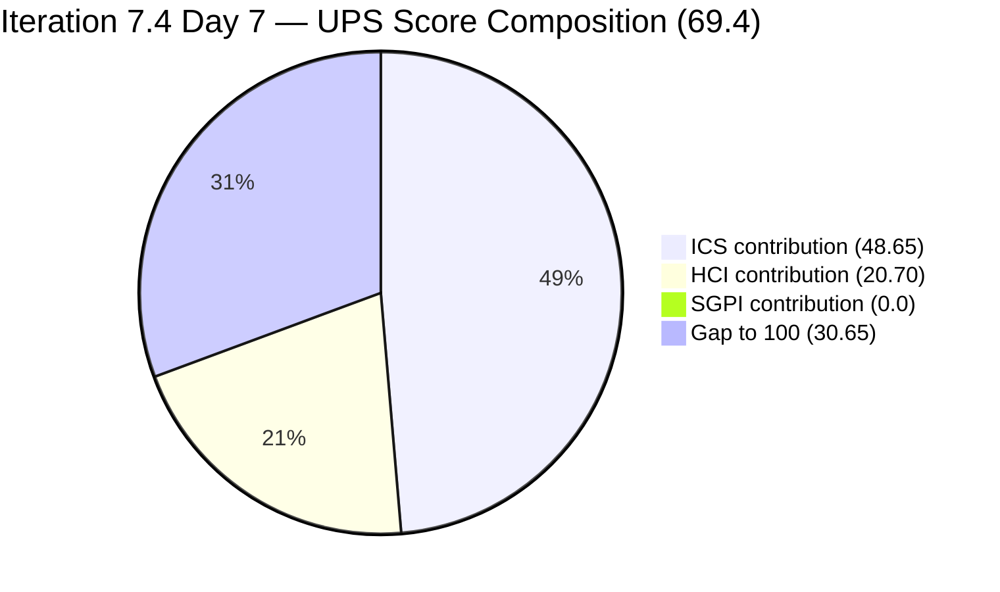
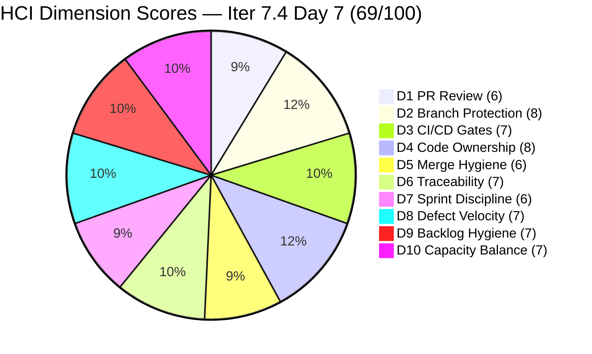

# Colina Health Product Team — Iteration 7.4 Audit
**Day 7 of 14 | 2026-05-24 | data_mode: partial**

---

## 1. Audit Metadata

| Field | Value |
|---|---|
| **Audit Date** | 2026-05-24 |
| **Audit Time** | 09:00 |
| **Iteration** | Iteration 7.4 |
| **Iteration ID** | `16385d00-244a-4caa-9e56-d4a8e850754d` |
| **Iteration Window** | 2026-05-18 → 2026-05-31 |
| **Iteration Day** | 7 of 14 |
| **Time Elapsed** | 50.0% — Sprint Midpoint |
| **Phase** | Mid-Sprint |
| **ADO Org** | jairo |
| **ADO Project ID** | `666bb99a-6acd-4999-bb34-efd0e4ea90dc` |
| **ADO Team ID** | `66cdeb09-df38-4c3e-9418-0ed0d68c39f2` |
| **ADO Team** | Colina Health Product Team |
| **ADO Backlog** | Microsoft.RequirementCategory — Stories and Deliverables |
| **GitHub Repos** | colinahealth-fe, colinahealth-be, colina-health-ai-agent-code-fixing |
| **data_mode** | partial (GitHub API 401 — raseniero token issue; curl-verified 2026-05-24; HCI D1–D6 carried forward from 7.3 Day 7 baseline, 2026-05-10; carry-forward chain 12 audits deep) |
| **Prior Audit** | AUDIT_20260521_0900.md (Iteration 7.4 Day 4) |
| **Auditor** | Claude Code (git_iteration_audit skill) |

**Three named scores:**

| Score | Value | Risk Band |
|---|---|---|
| **ICS** (Iteration Compliance Score) | **97.3%** | Green |
| **HCI** (Engineering Health Index) | **69 / 100** | Yellow |
| **SGPI** (Committed Scope SGPI) | **0.0%** | Mid-Sprint (Day 7, no closures yet) |
| **UPS** (Unified Performance Score) | **69.4** | Yellow |

---

## 2. Executive Summary

Day 7 of Iteration 7.4 marks the **sprint midpoint** and delivers a decisive recovery in ICS from Yellow back to **Green (97.3%)** — the best ICS score of the sprint and the highest since the 7.3 final. The recovery is driven by the team addressing the majority of the compliance debt flagged over Days 1–4:

**Five of the seven Day-4 failures have been resolved since the last audit (May 21):**
1. AB#204700 groomed: `System.Parent` added (201281) and `StoryPoints` set to 1
2. AB#204791 groomed: `System.Parent` added (201281) and `StoryPoints` set to 3
3. AB#199041 description added (was missing since Day 1)
4. AB#200027 description added (was missing since Day 1)
5. AB#202588 (RSC migration, 13 SP) correctly moved to **Iteration 7.5** for grooming — right-sizing the sprint commitment rather than carrying a stalled 26%-of-scope item

**One remaining ICS failure:** AB#200194 (`Passed QA Testing`, 2 SP) still lacks `System.Description`. With the item at Passed QA Testing, closure is imminent — it will be the first item to close without a description unless this is addressed today.

**Significant Enabler delivery on the Paul Coronia track:** Three enablers advanced during Days 4–7:
- AB#202585 (private co-located folders, 5 SP): Active → **Peer Testing**
- AB#202600 (consolidate test directories, 2 SP): Ready for Dev → **Peer Testing**
- AB#202603 (evaluate shadcn/ui, 3 SP): Ready for Dev → **Peer Testing**

These three advances represent **10 SP entering near-closure** — the most significant delivery signal of the sprint so far.

**AB#200219 regression:** The item moved from `Peer Testing` back to `Active` (changed 2026-05-23 15:17 UTC), indicating a QA fail or peer review rejection. This is a 5 SP setback in the Delivered Proxy SGPI.

**Committed SGPI remains 0%** — no items have reached `Closed`. At sprint midpoint with 0 closures, the team must begin converting `Passed QA` and advanced `Peer Testing` items to `Closed` to establish headline SGPI credit.

**UPS recovery to 69.4** (Yellow, from 62.6 on Day 4) reflects the ICS Green restoration. HCI improves by 4 points (65 → 69) due to grooming actions and delivery signals in D7–D10.

**The Luzmibel QA blackout (May 25–26) begins tomorrow.** Four items are now at `Passed QA Testing` (199041, 200194, 203320) or `Peer Testing` (202585, 202600, 202603). Closing the Passed QA items before tomorrow is the highest-value action of the day.

---

## 3. Iteration Scope and Methodology

### Iteration 7.4

| Field | Value |
|---|---|
| **Iteration Name** | Iteration 7.4 |
| **Iteration ID** | `16385d00-244a-4caa-9e56-d4a8e850754d` |
| **Start Date** | 2026-05-18 (Monday) |
| **End Date** | 2026-05-31 (Sunday) |
| **Duration** | 14 calendar days |
| **Day of Audit** | Day 7 (sprint midpoint) |
| **Working Days Remaining** | ~5 (May 26 Mon — May 30 Fri, minus Luzmibel days off May 25–26) |

### Scope Change: AB#202588 Moved to Iteration 7.5

**AB#202588 ([Enabler] Migrate data fetching to Server Components + RSC, 13 SP)** has been moved to `Jairosoft Portfolio\2026-PI7\Iteration 7.5` with state `Grooming`. This is correct SAFe behavior — a stalled, unactivated 13 SP item was right-sized out of the current sprint rather than carried as dead weight. This removes AB#202588 from the ICS-eligible set and reduces committed SP from 50 to **39 SP** (effective since the move on 2026-05-22).

### ICS-Eligible Items (parent-level, in 7.4 iteration path — Day 7)

Items classified as ICS-eligible if `System.WorkItemType` ∈ {Story, Defect, Enabler} AND `System.IterationPath` = `Jairosoft Portfolio\2026-PI7\Iteration 7.4`. Spikes excluded per skill standard. AB#202588 now in 7.5 path — excluded. AB#202586 in 7.3 path — excluded from eligible set but tracked as hygiene.

**Total ICS-eligible set: 13 items.**

| ID | Title (abbreviated) | Type | State (Day 7) | SP | Assigned To | Parent | Desc | AC | 7.4 Path | Day 4 State | Delta |
|---|---|---|---|---|---|---|---|---|---|---|---|
| **198098** | [MAR][PRN] No warning message for exceeded daily limit | Defect | **Active** | 5 | Asnari Pacalna | 201646 | Yes | Yes | Yes | Active | Unchanged — rework ongoing |
| **199041** | [MAR] Page auto-loads on page number entry | Defect | **Passed QA Testing** | 2 | Asnari Pacalna | 201646 | **Yes** | Yes | Yes | Passed QA Testing | **Desc FIXED** — still not closed |
| **200027** | [MAR][PRN] Sorting Options Not Working | Defect | **Active** | 3 | Asnari Pacalna | 201646 | **Yes** | Yes | Yes | Active | **Desc FIXED** — rework ongoing |
| **200194** | [Workflow][Update Med Log] First letter remains after delete | Defect | **Passed QA Testing** | 2 | Asnari Pacalna | 201680 | **NO** | Yes | Yes | Passed QA Testing | **Desc still missing** |
| **200219** | [MAR] Order By/Sort By limits table to Hawaii date | Defect | **Active** | 5 | Asnari Pacalna | 201646 | Yes | Yes | Yes | Peer Testing | **REGRESSED** — back to Active |
| **202585** | [Enabler] Implement private co-located folders | Enabler | **Peer Testing** | 5 | Paul Coronia | 201281 | Yes | Yes | Yes | Active | **ADVANCED** +1 state |
| **202597** | [Enabler] Parallel data fetching with Promise.all | Enabler | **Ready for Dev** | 3 | Paul Coronia | 201281 | Yes | Yes | Yes | Ready for Dev | Unchanged — gated on RSC |
| **202600** | [Enabler] Consolidate test directories under /tests | Enabler | **Peer Testing** | 2 | Paul Coronia | 201281 | Yes | Yes | Yes | Ready for Dev | **ADVANCED** +2 states |
| **202602** | [Enabler] URL-first state hierarchy | Enabler | **Ready for Dev** | 5 | Paul Coronia | 201281 | Yes | Yes | Yes | Ready for Dev | Unchanged |
| **202603** | [Enabler] Evaluate shadcn/ui vs NextUI | Enabler | **Peer Testing** | 3 | Paul Coronia | 201281 | Yes | Yes | Yes | Ready for Dev | **ADVANCED** +2 states |
| **203320** | [MAR][View Report] Long medication names break layout | Defect | **Passed QA Testing** | 2 | Asnari Pacalna | 201646 | Yes | Yes | Yes | Peer Testing | **ADVANCED** — Passed QA |
| **204700** | [Enabler] Backend API Documentation (Swagger) | Enabler | **Ready for QA** | **1** | Paul Coronia | **201281** | Yes | Yes | Yes | Active | **GROOMED + ADVANCED** |
| **204791** | [Dev Env][Login Page] Cannot login — 410 Unauthorized | Defect | **Ready for Dev** | **3** | Paul Coronia | **201281** | Yes | Yes | Yes | New | **GROOMED** — SP+Parent added |

**Total committed SP (ICS-eligible, SP-bearing): 39 SP** (all 13 items have SP — 204700=1, 204791=3)

**Items in iteration hierarchy but excluded from ICS-eligible set:**

| ID | Title | Type | State | SP | IterationPath | Issue | Days Overdue |
|---|---|---|---|---|---|---|---|
| **202586** | [Enabler] Restructure /lib into sub-directories | Enabler | Peer Testing | 5 | **Iter 7.3** | Path not updated to 7.4 | **7 days** |
| **202588** | [Enabler] Migrate to Server Components + RSC | Enabler | Grooming | 13 | **Iter 7.5** | Correctly moved to next sprint | n/a (appropriate) |
| **204200** | [Blocker][UAT] Unable to Receive OTP | Defect | Peer Testing | 1 | **Iter 7.3** | Path not updated to 7.4 | **7 days** |

**Spikes (excluded from ICS, in 7.4 path):**

| ID | Title | Type | State (Day 7) | SP | Assigned To |
|---|---|---|---|---|---|
| 204232 | [Retro] Update / Automate PR Approval Process | Spike | New | — | Carol Cuison |
| 204233 | [Retro] Hidden API Endpoint — POC | Spike | New | — | Paul Coronia |
| 204291 | 7.4 Collaborations / Exploratory Testing / Update E2E | Spike | Active | 2 | Luzmibel Paculanang |

### Team Capacity (from ADO — confirmed Day 7)

| Member | Role | Capacity/Day | Days Off | GitHub Expected | Notes |
|---|---|---|---|---|---|
| Paul Coronia | Developer | 6 hrs/day (Development) | None | Yes | Enabler delivery + 204791 + 204200 carryover |
| Asnari Pacalna | Developer | 7 hrs/day (Development) | None | Yes | Defect rework + QA closure items |
| Luzmibel Paculanang | QA | 6 hrs/day (Testing) | **May 25–26 (tomorrow + Mon)** | No (non-dev, no penalty) | QA gate needed before blackout |
| **Total** | | **19 hrs/day** | **2 days off** | | |

> Non-developer exception applies per workspace CLAUDE.md: Luzmibel Paculanang (QA) and Jaszmeine Villanueva (Design) absence from GitHub evidence is not scored as an HCI gap or penalty.

### Methodology

Evidence collected from:
1. `work_list_team_iterations` (GUID-based, project `666bb99a-6acd-4999-bb34-efd0e4ea90dc`, team `66cdeb09-df38-4c3e-9418-0ed0d68c39f2`, timeframe=current) — confirmed Iteration 7.4 active (2026-05-18 → 2026-05-31)
2. `wit_get_work_items_for_iteration` — full hierarchy; AB#202588 confirmed absent (moved to 7.5); 13 eligible parents identified
3. `wit_get_work_items_batch_by_ids` — fresh field-level data for all 19 items (13 ICS-eligible + 3 excluded + 3 spikes)
4. `work_get_team_capacity` — roster confirmed (Paul, Asnari, Luzmibel — no changes)
5. GitHub API (all three repos) — **unavailable**: HTTP 401 Bad Credentials verified via curl 2026-05-24. HCI D1–D6 carry-forward applied (12 audits deep from 2026-05-10 baseline)
6. Prior audit AUDIT_20260521_0900.md (Day 4) used for delta context

---

## 4. Scorecard Summary



| Score | Value | Risk Band | Delta vs Day 4 | Delta vs Day 1 (7.4) | Delta vs 7.3 Final |
|---|---|---|---|---|---|
| **ICS** | **97.3%** | **Green (≥90%)** | **+11.2** from Day 4 (86.1%) | **+6.0** from Day 1 (91.3%) | **+1.4** from 7.3 final (95.9%) |
| **HCI** | **69 / 100** | Yellow | **+4** from Day 4 (65) | **−2** from Day 1 (71) | **−2** from 7.3 final (71) |
| **SGPI** | **0.0%** | Mid-Sprint (Day 7) | 0 | 0 | n/a |
| **UPS** | **69.4** | Yellow | **+6.8** from Day 4 (62.6) | **+2.4** from Day 1 (67.0) | — |

**UPS Calculation:**
```
UPS = ICS × 0.50 + HCI × 0.30 + SGPI × 0.20
    = 97.3 × 0.50 + 69 × 0.30 + 0.0 × 0.20
    = 48.65 + 20.70 + 0.00
    = 69.35 ≈ 69.4
```

> **Sprint Midpoint Assessment:** The 7.4 UPS trajectory has reversed from a declining trend (67.0 → 65.0 → 62.6, Days 1–4) to a recovery (62.6 → 69.4, Days 4–7). The ICS recovery to Green is the dominant driver. UPS is suppressed by the 0% headline SGPI — a pattern that will persist until the first `Closed` items emerge. With 6 items at `Passed QA Testing` or `Peer Testing`, closures in the next 2–3 days would push SGPI and UPS significantly. A sprint-end UPS of 75+ is achievable if the current delivery trajectory continues.

---

## 5. Sprint Goal Predictability (SGPI)

### Headline Score

```
SGPI (Committed Scope) = Closed Parent SP / Total Committed Parent SP
                       = 0 / 39
                       = 0.0%
```

> **Annotation:** Day 7 of Iteration 7.4, sprint midpoint. No parent items have reached `Closed` state. At the halfway point with 0 closures, the team must begin converting items from `Passed QA Testing` to `Closed` immediately to build headline SGPI. The Delivered Proxy SGPI of 41.0% confirms that 16 SP of work is at or near closure — the conversion bottleneck is administrative (closing items in ADO), not a delivery gap.

### Supporting Metrics

| Metric | Formula | Value | Notes |
|---|---|---|---|
| **Committed Scope SGPI** (headline) | Closed SP / Committed SP | 0 / 39 = **0.0%** | No closures — below expected midpoint pace |
| **Delivered Proxy SGPI** | (Passed QA + Peer Testing SP) / Committed SP | 16 / 39 = **41.0%** | 199041(2) + 200194(2) + 203320(2) PassedQA + 202585(5) + 202600(2) + 202603(3) PeerTesting |
| **Original Scope SGPI** | Closed SP / Day 1 SP | 0 / 48 = **0.0%** | Day 1 committed was 48 SP (before AB#202588 was moved to 7.5) |

> The Proxy SGPI of 41.0% (up from 22.0% on Day 4) is a strong mid-sprint signal. Six items totaling 16 SP are at or near closure. AB#200219 (5 SP) regressed from Peer Testing to Active, which would otherwise have pushed the proxy to 54%.

> **Critical midpoint action:** AB#199041 (2 SP, Passed QA) and AB#200194 (2 SP, Passed QA) and AB#203320 (2 SP, Passed QA) are cleared for closure. Closing these three items today would deliver **6 SP (15.4% SGPI)** before the Luzmibel QA blackout begins tomorrow.

### State Distribution (Day 7)

| State | Items | SP | % of Committed SP (39 SP) | Delta vs Day 4 |
|---|---|---|---|---|
| Passed QA Testing | 3 (199041, 200194, 203320) | 6 | 15.4% | +2 items, +4 SP (203320 advanced; 200219 regressed out) |
| Peer Testing | 3 (202585, 202600, 202603) | 10 | 25.6% | +3 items, +10 SP (new arrivals) |
| Ready for QA | 1 (204700) | 1 | 2.6% | +1 item (advanced from Active) |
| Active | 3 (198098, 200027, 200219) | 13 | 33.3% | −1 item net (200219 regressed in; 202585 advanced out) |
| Ready for Dev | 3 (202597, 202602, 204791) | 11 | 28.2% | +1 item (204791 moved from New) |
| Closed | 0 | 0 | 0.0% | — |
| **Total committed (SP-bearing)** | **13** | **39** | **100%** | — |

### Carryover Items (7.3 path — not in committed denominator)

| Item | State | SP | Progress Since Day 4 | Day 7 Assessment |
|---|---|---|---|---|
| AB#202586 | Peer Testing | 5 | Unchanged — still on 7.3 path | **7 days overdue** — critical path hygiene |
| AB#204200 | Peer Testing | 1 | Unchanged since Day 4 | **7 days overdue** for path correction; dev fix still in Peer Testing |

---

## 6. Developer Productivity Findings

### GitHub Evidence Status

**data_mode: partial** — GitHub API returned HTTP 401 Bad Credentials. Verified by direct curl call on 2026-05-24 — returned `401`. The raseniero token issue has been documented since 2026-04-21. This is the **12th consecutive audit** running on HCI D1–D6 carry-forward from the May 10 baseline (14 calendar days stale). No team penalty applied per workspace Project Exceptions.

### ADO-Side Developer Activity (Days 4–7 delta)

| Item | Developer | From → To | Changed Date/Time (UTC) | Interpretation |
|---|---|---|---|---|
| AB#202585 | Paul Coronia | Active → **Peer Testing** | 2026-05-21 12:59 | Enabler complete — submitted for peer review |
| AB#202600 | Paul Coronia | Ready for Dev → **Peer Testing** | 2026-05-22 11:30 | Enabler completed rapidly — 2 SP in <1 day |
| AB#202603 | Paul Coronia | Ready for Dev → **Peer Testing** | 2026-05-22 10:27 | Enabler completed rapidly — 3 SP |
| AB#204700 | Paul Coronia | Active → **Ready for QA** | 2026-05-22 11:31 | Swagger docs complete; also groomed (SP=1, Parent added) |
| AB#204791 | Paul Coronia | New → **Ready for Dev** | 2026-05-22 03:43 | Groomed (SP=3, Parent=201281) and planned |
| AB#203320 | Asnari Pacalna | Peer Testing → **Passed QA** | 2026-05-22 08:18 | QA cleared — ready for closure |
| AB#200219 | Asnari Pacalna | Peer Testing → **Active** | 2026-05-23 15:17 | **REGRESSION** — QA fail or peer rejection |
| AB#198098 | Asnari Pacalna | Active → **Active** | 2026-05-23 15:19 | Still in rework — 2 separate state-change timestamps suggest progress |
| AB#200027 | Asnari Pacalna | Active → **Active** | 2026-05-23 16:14 | Still in rework; description added |
| AB#199041 | Asnari Pacalna | — | 2026-05-22 01:57 | Description added (compliance fix) |

> **Paul Coronia's Days 4–7 output is the sprint's strongest delivery signal:** Three enablers advanced to Peer Testing + one completed to Ready for QA in a 30-hour window (May 21–22). This represents 10 SP of near-closure delivery from items that were `Ready for Dev` on Day 4. The concentration risk has partially resolved via delivery throughput.

> **Asnari Pacalna's regression concern:** AB#200219 returning to `Active` on May 23 is the most concerning event of the period. At 5 SP (13% of committed SP), this item moving back from Peer Testing represents a material SGPI setback. The rework reason is unknown without GitHub PR review access.

### Developer Workload Distribution (Day 7)

| Developer | Active Items | SP In-Flight | States | Throughput |
|---|---|---|---|---|
| Paul Coronia | 202585(PeerTest), 202600(PeerTest), 202603(PeerTest), 204700(ReadyQA), 202597(ReadyDev), 202602(ReadyDev), 204791(ReadyDev) | 21 SP near/ready | 3 Peer Testing, 1 Ready for QA, 3 Ready for Dev | **Strong** — 10 SP advanced Days 4–7 |
| Asnari Pacalna | 198098(Active), 200027(Active), 200219(Active), 199041(PassedQA), 200194(PassedQA), 203320(PassedQA) | 19 SP | 3 Active (rework), 3 Passed QA (pending closure) | **Mixed** — good QA throughput, 1 regression |
| Luzmibel Paculanang | QA gate + Spike | 2 SP spike | Spike Active, QA gate (202585, 202600, 202603, 204700) | QA gate critical before blackout |

---

## 7. SAFe Compliance Findings

### Iteration Path Compliance (Day 7)

**13 of 13 ICS-eligible parent items confirmed in `Jairosoft Portfolio\2026-PI7\Iteration 7.4` path.** Iteration Integrity dimension holds at 100%.

**Path hygiene violations — SEVEN DAYS OVERDUE:**

| Item | Current Path | Required Action | Priority | First Directive | Days Unactioned |
|---|---|---|---|---|---|
| AB#204200 [OTP Blocker] | `Iteration 7.3` | Update path to 7.4 | **P0** | Day 1 (May 18) | **7 days** |
| AB#202586 [Enabler /lib] | `Iteration 7.3` | Update path to 7.4 | P1 | Day 1 (May 18) | **7 days** |

These path corrections have been flagged in every audit since Day 1. Both items are in `Peer Testing` state — confirming active work is occurring in 7.4 — but their iteration path still points to 7.3. This is a trivial ADO field update with zero development effort required.

### Grooming Recovery (Days 4–7)

| Action Taken | Item | Compliance Fix | Impact |
|---|---|---|---|
| SP added (1) + Parent added (201281) | AB#204700 | Alignment + Estimation | ICS +3.57 per dimension |
| SP added (3) + Parent added (201281) | AB#204791 | Alignment + Estimation | ICS +3.57 per dimension |
| Description added | AB#199041 | Quality/DoD | ICS +2.38 |
| Description added | AB#200027 | Quality/DoD | ICS +2.38 |
| Moved to 7.5 | AB#202588 (13 SP) | Sprint scope right-sizing | ICS eligible set reduced from 14 to 13 |

> All four grooming fixes (Day-1 P0 directives) were actioned within 4 days of first flagging. The AB#202588 scope move is appropriate SAFe behavior — the item entered Grooming in 7.5 rather than carrying 13 SP of dead scope.

### Enabler Architecture Track (Day 7)

| ID | Title | SP | State | Delivery Signal |
|---|---|---|---|---|
| 202585 | Private co-located folders | 5 | **Peer Testing** | Advanced from Active Day 4 |
| 202600 | Consolidate test directories | 2 | **Peer Testing** | Advanced from Ready for Dev Day 4 |
| 202603 | Evaluate shadcn/ui vs NextUI | 3 | **Peer Testing** | Advanced from Ready for Dev Day 4 |
| 204700 | Backend API Documentation (Swagger) | 1 | **Ready for QA** | Advanced from Active Day 4 |
| 202597 | Parallel data fetching (Promise.all) | 3 | Ready for Dev | Gated on RSC (now in 7.5) — possibly unblocked |
| 202602 | URL-first state hierarchy | 5 | Ready for Dev | Independent; Paul bandwidth needed |
| 204791 | [Dev Env][Login Page] 410 Unauthorized | 3 | Ready for Dev | Groomed; awaiting dev start |
| **202588** | **Migrate to Server Components + RSC** | **13** | **Grooming (7.5)** | **Moved out of 7.4 — correct action** |

> With AB#202588 moved to 7.5, AB#202597 (Parallel data fetching, 3 SP) may now be unblocked — it was documented as gated on the RSC migration. Paul should confirm whether 202597 can proceed independently or remains deferred. If unblocked, 202597 + 202602 represent 8 additional SP Paul can activate in Week 2.

### Defect Track Status (Day 7)

| ID | Title | SP | State (Day 7) | QA Gate | Notes |
|---|---|---|---|---|---|
| 198098 | [MAR][PRN] No warning message | 5 | Active | Not started | Rework ongoing — changed May 23 |
| 199041 | [MAR] Page auto-loads | 2 | Passed QA Testing | Cleared | **Pending closure — overdue 5+ days** |
| 200027 | [MAR][PRN] Sorting Not Working | 3 | Active | Not started | Rework ongoing — changed May 23 |
| 200194 | [Workflow] First letter remains | 2 | Passed QA Testing | Cleared | **Pending closure — overdue 5+ days; desc still missing** |
| 200219 | [MAR] Order By/Sort By Hawaii date | 5 | **Active** | Failed/Rejected | **REGRESSION from Peer Testing** |
| 203320 | [MAR][View Report] Long names break layout | 2 | Passed QA Testing | Cleared | **Pending closure** |
| 204791 | [Dev Env][Login Page] 410 Unauthorized | 3 | Ready for Dev | Not started | Groomed — awaiting dev |

---

## 8. Iteration Compliance Score (ICS)

### Eligible Scope (Day 7)

**Eligible items: 13 parent-level items confirmed in `Jairosoft Portfolio\2026-PI7\Iteration 7.4` path** (6 Defects + 7 Enablers). Spikes (204232, 204233, 204291) excluded per skill standard. AB#204200 and AB#202586 on 7.3 path excluded. AB#202588 now on 7.5 path — excluded.

### Dimension Scoring

#### Dimension 1: Alignment (Weight: 25)

Parent-link (`System.Parent`) compliance for all 13 eligible items:

| Item | Parent ID | Status |
|---|---|---|
| 198098 | 201646 | Compliant |
| 199041 | 201646 | Compliant |
| 200027 | 201646 | Compliant |
| 200194 | 201680 | Compliant |
| 200219 | 201646 | Compliant |
| 202585 | 201281 | Compliant |
| 202597 | 201281 | Compliant |
| 202600 | 201281 | Compliant |
| 202602 | 201281 | Compliant |
| 202603 | 201281 | Compliant |
| 203320 | 201646 | Compliant |
| **204700** | **201281** | **Compliant** (FIXED since Day 4) |
| **204791** | **201281** | **Compliant** (FIXED since Day 4) |

| Eligible | Compliant | Failed | Score % |
|---|---|---|---|
| 13 | 13 | 0 | **100.0%** |

**Evidence:** All 13 items have verified `System.Parent` in live ADO batch response. AB#204700 (rev 12) and AB#204791 (rev 11) now have Parent=201281. Full dimension recovery from 85.71% (Day 4).

#### Dimension 2: Estimation (Weight: 20)

`Microsoft.VSTS.Scheduling.StoryPoints` compliance for all 13 eligible items:

| Item | SP | Status |
|---|---|---|
| 198098 | 5 | Compliant |
| 199041 | 2 | Compliant |
| 200027 | 3 | Compliant |
| 200194 | 2 | Compliant |
| 200219 | 5 | Compliant |
| 202585 | 5 | Compliant |
| 202597 | 3 | Compliant |
| 202600 | 2 | Compliant |
| 202602 | 5 | Compliant |
| 202603 | 3 | Compliant |
| 203320 | 2 | Compliant |
| **204700** | **1** | **Compliant** (FIXED since Day 4) |
| **204791** | **3** | **Compliant** (FIXED since Day 4) |

| Eligible | Compliant | Failed | Score % |
|---|---|---|---|
| 13 | 13 | 0 | **100.0%** |

**Evidence:** AB#204700 (rev 12, SP=1) and AB#204791 (rev 11, SP=3) now have story points. Total committed SP = 39. Full dimension recovery from 85.71% (Day 4).

#### Dimension 3: Quality / DoD (Weight: 35)

Criteria: `System.Description` ≥ 30 non-whitespace chars AND `Microsoft.VSTS.Common.AcceptanceCriteria` ≥ 20 non-whitespace chars.

| Item | Description | AC | Status |
|---|---|---|---|
| 198098 | Yes | Yes | Compliant |
| **199041** | **Yes** | Yes | **Compliant** (FIXED — desc added since Day 4) |
| **200027** | **Yes** | Yes | **Compliant** (FIXED — desc added since Day 4) |
| **200194** | **NO** | Yes | **FAIL** — description still missing |
| 200219 | Yes | Yes | Compliant |
| 202585 | Yes | Yes | Compliant |
| 202597 | Yes | Yes | Compliant |
| 202600 | Yes | Yes | Compliant |
| 202602 | Yes | Yes | Compliant |
| 202603 | Yes | Yes | Compliant |
| 203320 | Yes | Yes | Compliant |
| 204700 | Yes | Yes | Compliant |
| 204791 | Yes | Yes | Compliant |

| Eligible | Compliant | Failed | Score % |
|---|---|---|---|
| 13 | 12 | 1 (200194) | **92.31%** |

> **Critical note on AB#200194:** This item is in `Passed QA Testing` — the next step is closure. It will be the only item in this sprint to close without a `System.Description` if not fixed before closure. The description for this defect (first letter remains in administered field after delete) is straightforward to write. Estimated effort: 5 minutes.

#### Dimension 4: Iteration Integrity (Weight: 20)

All 13 eligible items are confirmed in `Jairosoft Portfolio\2026-PI7\Iteration 7.4` path. AB#204200 and AB#202586 (7.3 path) are excluded from the eligible set. AB#202588 (7.5 path) is excluded.

| Eligible | Compliant | Failed | Score % |
|---|---|---|---|
| 13 | 13 | 0 | **100.0%** |

### ICS Summary Table

| Dimension | Eligible | Compliant | Failed | Score % | Weight | Weighted Contribution | Evidence | Reason |
|---|---|---|---|---|---|---|---|---|
| Alignment | 13 | 13 | 0 | 100.0% | 25 | 25.00 | All 13 items have System.Parent (AB#204700, AB#204791 FIXED) | Full compliance restored |
| Estimation | 13 | 13 | 0 | 100.0% | 20 | 20.00 | All 13 items have StoryPoints (AB#204700=1, AB#204791=3 FIXED) | Full compliance restored |
| Quality / DoD | 13 | 12 | 1 | 92.31% | 35 | 32.31 | AB#200194 null System.Description (live batch confirmed) | Missing description since Day 1 — 7 days unactioned |
| Iteration Integrity | 13 | 13 | 0 | 100.0% | 20 | 20.00 | All 13 eligible items in `Iteration 7.4` path | Full compliance |
| **TOTAL** | **13** | — | — | — | 100 | **97.31** | | |

**ICS Calculation (exact):**
```
ICS = (100.0 × 25 + 100.0 × 20 + 92.31 × 35 + 100.0 × 20) / 100
    = (2500.00 + 2000.00 + 3230.85 + 2000.00) / 100
    = 9730.85 / 100
    = 97.31%
```

> ICS = **97.3% — Green (≥90%)**. This is the highest ICS score of Iteration 7.4 and the first time the sprint has returned to Green. The recovery from 86.1% (Day 4) is the result of five targeted compliance fixes actioned in the May 21–22 window. The single remaining failure (AB#200194 description) is a 5-minute fix that would restore ICS to **100%**.

> **Restoration calculation:** If AB#200194 description is added:
> `ICS_restored = (100 × 25 + 100 × 20 + 100 × 35 + 100 × 20) / 100 = 100.0%`

---

## 9. Engineering Health Index (HCI)

**data_mode: partial — HCI D1–D6 carried forward from Day 7 of Iteration 7.3 (fresh evidence 2026-05-10)**

### Carry-Forward Chain

```
7.4 Day 7 (today) ← 7.4 Day 4 ← 7.4 Day 3 ← 7.4 Day 2 ← 7.4 Day 1 ←
7.3 Day 14 ← 7.3 Day 13 ← 7.3 Day 12 ← 7.3 Day 11 ← 7.3 Day 10 ← 7.3 Day 9 ← 7.3 Day 7
(fresh GitHub, 2026-05-10)
```

Twelve audits of continuous carry-forward. The HCI D1–D6 baseline is now **14 calendar days stale**. No degradation penalty per workspace Project Exceptions (token issue is under Ramon's ownership).

### Dimension Scores

| # | Dimension | Score | Source | Day 4 | Delta | Evidence / Rationale |
|---|---|---|---|---|---|---|
| D1 | PR Review Compliance | 6/10 | Carry-forward (7.3 Day 7) | 6 | 0 | GitHub API unavailable; carry-forward from May 10 baseline |
| D2 | Branch Protection & Enforcement | 8/10 | Carry-forward (7.3 Day 7) | 8 | 0 | Confirmed rules from Day 7 baseline |
| D3 | CI/CD Gate Quality | 7/10 | Carry-forward (7.3 Day 7) | 7 | 0 | Carry-forward unchanged |
| D4 | Code Ownership | 8/10 | Carry-forward (7.3 Day 7) | 8 | 0 | Paul + Asnari confirmed developers; carry-forward |
| D5 | Merge Hygiene & Churn | 6/10 | Carry-forward (7.3 Day 7) | 6 | 0 | Stale PRs: AI Agent PR#9 (110+ days), ADO #11207/#11182 (120+ days); no fresh evidence |
| D6 | Work Item ↔ GitHub Traceability | 7/10 | Carry-forward | 7 | 0 | ADO artifact links 0% for all 13 current-iteration items; no fresh GitHub data |
| D7 | Sprint Discipline | **6/10** | Fresh (ADO) | 5 | **+1** | POSITIVE: AB#202588 correctly moved to 7.5 (right-sizing, not abandonment); AB#204700 + AB#204791 both groomed with SP+Parent — all Day-1 P0 grooming directives now addressed. NEGATIVE: AB#200219 regression to Active; AB#202586 + AB#204200 still on 7.3 path (7 days overdue); AB#200194 description still missing |
| D8 | Defect Velocity | **7/10** | Fresh (ADO) | 6 | **+1** | POSITIVE: AB#203320 passed QA; Asnari active on 3 defect reworks; cumulative defect throughput strong. NEGATIVE: AB#200219 regression (5 SP back to Active); 3 items in Passed QA not yet closed — closure velocity is the constraint |
| D9 | Backlog & Story Hygiene | **7/10** | Fresh (ADO) | 5 | **+2** | All grooming actions from Day 1 P0 list completed (204700, 204791, 199041, 200027); AB#202588 properly right-sized to 7.5; AB#200194 description is last remaining gap; AB#202586 + AB#204200 still on wrong IterationPath |
| D10 | Capacity Balance & Ownership Distribution | **7/10** | Fresh (ADO) | 7 | 0 | Paul shows strong delivery throughput Days 4–7 (10 SP advanced); AB#202588 removal reduces his total load; Asnari reworking 3 defects simultaneously; 3 Passed QA items awaiting Luzmibel closure before blackout — timing pressure |

### HCI Summary

| Metric | Value |
|---|---|
| **Total HCI** | **69 / 100** |
| **Risk Band** | **Yellow** |
| **Delta vs Day 4 (7.4)** | **+4** (D7 +1, D8 +1, D9 +2, D10 0) |
| **Delta vs Day 1 (7.4)** | **−2** (from 71) |
| **Delta vs 7.3 Final** | **−2** (from 71) |
| **D1–D6 Source** | Carry-forward from 7.3 Day 7 (2026-05-10) — 14 days stale |
| **D7–D10 Source** | Fresh ADO evidence (Day 7) |

**HCI Calculation:**
```
D1=6, D2=8, D3=7, D4=8, D5=6, D6=7  →  Sum = 42 (D1–D6, carry-forward)
D7=6, D8=7, D9=7, D10=7             →  Sum = 27 (D7–D10, fresh ADO Day 7)
Total HCI = 42 + 27 = 69
```

> HCI = **69/100 (Yellow)**, up 4 points from Day 4 (65). The SAFe Process Health dimensions (D7–D10) recovered from 23/40 to 27/40, driven by grooming actions and delivery throughput. HCI remains 2 points below the Day 1 baseline (71), primarily due to the AB#200219 regression and the persistent 7.3-path items.

### HCI Visualization



### Category Summary

| Category | Dimensions | Total | Max | % | Delta vs Day 4 |
|---|---|---|---|---|---|
| Code Quality & Process | D1, D2, D3, D4, D5 | 35 | 50 | 70% | 0 |
| Traceability & Integration | D6 | 7 | 10 | 70% | 0 |
| SAFe Process Health | D7, D8, D9, D10 | 27 | 40 | 68% | **+4 (from 23)** |
| **Total HCI** | D1–D10 | **69** | **100** | **69%** | **+4** |

> SAFe Process Health (D7–D10) recovered from 58% (Day 4) to 68% (Day 7) — a meaningful reversal. The category is now aligned with Code Quality & Process for the first time this sprint.

---

## 10. ADO-to-GitHub Traceability Analysis

### Traceability Summary (13 ICS-eligible items, Day 7)

| Work Item | State (Day 7) | SP | GitHub Link (ADO artifact) | Traceability |
|---|---|---|---|---|
| AB#198098 | Active | 5 | None | None |
| AB#199041 | Passed QA Testing | 2 | None | None |
| AB#200027 | Active | 3 | None | None |
| AB#200194 | Passed QA Testing | 2 | None | None |
| AB#200219 | Active | 5 | None | None |
| AB#202585 | Peer Testing | 5 | None | None |
| AB#202597 | Ready for Dev | 3 | None | None |
| AB#202600 | Peer Testing | 2 | None | None |
| AB#202602 | Ready for Dev | 5 | None | None |
| AB#202603 | Peer Testing | 3 | None | None |
| AB#203320 | Passed QA Testing | 2 | None | None |
| AB#204700 | Ready for QA | 1 | None | None |
| AB#204791 | Ready for Dev | 3 | None | None |

**Linked items: 0 of 13 (0%)** — No GitHub artifact links in ADO for any current 7.4 iteration items. This gap is consistent across the entire sprint.

**Most critical traceability gaps (by urgency):**
1. AB#199041, AB#200194, AB#203320 — all `Passed QA Testing` (imminent closure) with **zero linked GitHub PRs**. These items will be closed with no code audit trail.
2. AB#202585, AB#202600, AB#202603 — all `Peer Testing` with dev work complete but zero ADO↔GitHub links.
3. AB#200219 — regressed from Peer Testing; if the regression was due to a PR review finding, that review context should be linked.

---

## 11. Collaboration and Review Analysis

**data_mode: partial — GitHub PR review data unavailable (GitHub API 401)**

### OTP Blocker Status (AB#204200)

AB#204200 has been in `Peer Testing` since 2026-05-19 08:24 UTC — unchanged for 5 days. The dev fix has been submitted but QA clearance is pending. IterationPath is still `Iteration 7.3` — 7 days overdue for correction. With Luzmibel going on leave starting tomorrow, this item must be cleared to Peer Testing → Closed before QA blackout if it is to be credited in 7.4.

### AB#200219 Regression — Root Cause Unknown

AB#200219 ([MAR] Order By/Sort By limits table to Hawaii date) was in `Peer Testing` on Day 4 and returned to `Active` on 2026-05-23 15:17 UTC. The 5 SP regression is the sprint's most significant setback since Day 4. Without GitHub PR access, the root cause (peer review rejection, QA fail, or code regression) cannot be determined. Asnari should document the rejection reason in the ADO item comments.

### Enabler Peer Testing Cluster (Paul Coronia — 3 items)

Three Paul-owned enablers are simultaneously in `Peer Testing` as of Day 7:
- AB#202585 (private co-located folders, 5 SP) — since May 21
- AB#202600 (consolidate test directories, 2 SP) — since May 22
- AB#202603 (evaluate shadcn/ui, 3 SP) — since May 22

Without GitHub access, the reviewer(s) for these PRs cannot be identified. Per the Retro Spike (AB#204232), the PR approval process calls for develop-branch approval by Paul or Asnari. If Paul owns all three PRs, Asnari is the expected reviewer — and Asnari's bandwidth may be split between peer-reviewing three enablers and reworking three defects simultaneously.

### PR Approval Automation Spike (AB#204232)

The PR approval automation spike (Carol Cuison, New) remains unstarted after 7 days. Implementation would establish formal branch protection rules and improve HCI D1–D2 in future sprints. Given Luzmibel's planned QA blackout and the volume of items entering Peer Testing, automated PR enforcement would reduce review bottlenecks.

### Known Active PRs (carry-forward — GitHub evidence unavailable)

| Repo | PR | Age Estimate | Status | Notes |
|---|---|---|---|---|
| colina-health-ai-agent | #9 | **~110+ days** | Unknown | **Eleventh consecutive audit flag** — P1 close or merge |
| colinahealth.git (ADO) | #11207 | ~120+ days | Active | Long-running stale ADO PR |
| BEColinaHealth.git (ADO) | #11182 | ~120+ days | Active | Long-running stale ADO PR |

> colina-health-ai-agent PR#9 is now referenced in the **eleventh consecutive audit** without resolution. At 110+ days, the merge cost likely exceeds the original feature effort by a wide margin.

---

## 12. Repository Hygiene

**data_mode: partial — direct GitHub repository inspection unavailable**

### Branch Status (carry-forward + ADO evidence)

| Repo | Known Open Work | Protection | Notes |
|---|---|---|---|
| colinahealth-fe (GitHub) | Branches for 202585, 202600, 202603 (inferred from Peer Testing) | Confirmed (Day 7, 7.3) | Three active PRs in Peer Testing — no ADO artifact links |
| colinahealth-be (GitHub) | Branch for 204700 (inferred Ready for QA) | Confirmed | Swagger docs in QA |
| colina-health-ai-agent-code-fixing | PR#9 — 110+ days | Confirmed | Severe divergence — P1 close/merge |
| colinahealth.git (ADO) | PR#11207 — 120+ days | Unknown | Stale ADO PR |
| BEColinaHealth.git (ADO) | PR#11182 — 120+ days | Unknown | Stale ADO PR |

### Hygiene Concerns (Day 7)

1. **colina-health-ai-agent PR#9** — 110+ days stale, eleventh consecutive audit. Escalated to P1.
2. **Three items in Passed QA Testing** (199041, 200194, 203320) — not yet closed. These should be `Closed` to generate headline SGPI credit before Luzmibel's QA blackout.
3. **Zero ADO artifact links for all 13 sprint items** — items are being completed, peer-reviewed, and QA-cleared without any GitHub PR links in ADO. The audit trail gap will make retrospective analysis impossible.
4. **ADO PRs #11207 and #11182** — 120+ days each. No action in 7+ audits.
5. **AB#200219 regression** — item returned to Active from Peer Testing. Branch likely has unresolved review comments. No ADO comment documenting the rejection reason.

---

## 13. Risks and Bottlenecks

| # | Risk | Severity | Trend | Owner | Days Elevated |
|---|---|---|---|---|---|
| R1 | **Luzmibel QA blackout begins tomorrow (May 25–26)** — 3 items in Passed QA not yet closed; QA gate needed for 3 Peer Testing items + 204700 (Ready for QA) | **Critical** | Imminent | Luzmibel / Karl | 0 (deadline: today) |
| R2 | **0 closures at sprint midpoint** — Headline SGPI 0%; 7 working days remain; 6 items near closure but not converted to Closed | High | Worsening | Karl / Team | Sprint |
| R3 | **AB#200219 regression (5 SP)** — returned to Active from Peer Testing; root cause unknown; 13% of committed SP in rework | High | New | Asnari | 1 |
| R4 | **AB#202586 IterationPath 7.3** — 7 days overdue for trivial path correction; Peer Testing state confirms active 7.4 work | Medium | Persistent | Karl | 7 |
| R5 | **AB#204200 OTP blocker** — 7 days in Peer Testing; 5 days since last state change; still on 7.3 path | Medium | Worsening | Paul / Karl | 7 |
| R6 | **AB#200194 description missing** — 7 days overdue; item will close without description if not fixed before closure | Medium | Persistent | Asnari / Karl | 7 |
| R7 | **ADO↔GitHub traceability 0%** — items closing without code audit trail; sprint will complete with no traceability | Medium | Stable (persistent) | Team | Sprint |
| R8 | **colina-health-ai-agent PR#9** — 110+ days, eleventh consecutive flag | Medium | Worsening | Paul | 11+ |
| R9 | **Three enablers in Peer Testing simultaneously** (202585, 202600, 202603) — Asnari is likely sole reviewer while also reworking 3 defects; review bottleneck risk | Medium | New | Paul / Asnari | 0 |
| R10 | **AB#202597 and AB#202602 (8 SP) in Ready for Dev** — unclear if RSC-gated items are now unblocked following AB#202588 move to 7.5 | Medium | New | Paul | 0 |
| R11 | **GitHub token 401** — HCI D1–D6 carry-forward chain 12 audits / 14 days stale | Medium | Worsening | Ramon | 33+ days |
| R12 | **ADO PRs #11207, #11182** — 120+ days stale | Low | Worsening | Paul / Karl | 7+ |

### QA Blackout Critical Path (Today — May 24)

The sprint's most urgent window is today (May 24), before Luzmibel goes on leave tomorrow:

| Item | State | SP | Action Required | Urgency |
|---|---|---|---|---|
| AB#199041 | Passed QA Testing | 2 | Close → Closed | **Critical — today** |
| AB#200194 | Passed QA Testing | 2 | Add description → Close | **Critical — today** |
| AB#203320 | Passed QA Testing | 2 | Close → Closed | **Critical — today** |
| AB#204700 | Ready for QA | 1 | QA sign-off → Closed | **High — today if possible** |
| AB#202585 | Peer Testing | 5 | Peer review → next state | **High — clear before QA gap** |
| AB#202600 | Peer Testing | 2 | Peer review → next state | **High — clear before QA gap** |
| AB#202603 | Peer Testing | 3 | Peer review → next state | **High — clear before QA gap** |

Closing the 3 Passed QA items today would deliver **6 SP (15.4% headline SGPI)** — the first SGPI credit of the sprint.

---

## 14. Prioritized Remediation Actions

| Priority | Action | Owner | Due | Effort | Impact | Status |
|---|---|---|---|---|---|---|
| **P0** | Close AB#199041, AB#200194, AB#203320 — all in Passed QA Testing; must close before Luzmibel leaves tomorrow | Karl / Asnari | **Today** | Trivial (ADO field update) | 6 SP SGPI credit (15.4%); D8 improvement | 5+ days overdue |
| **P0** | Add `System.Description` to AB#200194 before closing | Asnari | **Today** | Trivial (5 min) | ICS 97.3% → 100%; D9 repair | 7 days overdue |
| **P0** | QA sign-off on AB#204700 (Swagger, 1 SP, Ready for QA) — Luzmibel going on leave tomorrow | Luzmibel | **Today** | Low | 1 SP SGPI; D8 improvement | Created Day 4 |
| **P0** | Update AB#204200 IterationPath from `Iteration 7.3` to `Iteration 7.4` | Karl / Ramon | **Today** | Trivial | Sprint visibility; D7 repair | 7 days overdue |
| **P1** | Update AB#202586 IterationPath from `Iteration 7.3` to `Iteration 7.4` | Karl | **Today** | Trivial | Sprint visibility | 7 days overdue |
| **P1** | Peer review and advance AB#202585, AB#202600, AB#202603 (all Peer Testing) before QA blackout | Paul / Asnari | **Today–Tomorrow** | Medium (review effort) | 10 SP advancing toward closure; QA can clear during blackout if in right state | New urgency |
| **P1** | Document AB#200219 regression reason in ADO comments — why did it return to Active from Peer Testing? | Asnari | **Today** | Trivial | D7 visibility; enables rework scoping | 1 day overdue |
| **P1** | Confirm whether AB#202597 (Parallel data fetching, 3 SP) is unblocked now that AB#202588 moved to 7.5 | Paul | **Today** | Low (15 min assessment) | If unblocked, 3 additional SP activatable this week | New signal |
| **P2** | Add GitHub PR artifact links to ADO for all Peer Testing items (202585, 202600, 202603, 202586, 204200) | Paul | At next PR interaction | Low | HCI D6; traceability foundation | Persistent gap |
| **P2** | Close or merge colina-health-ai-agent PR#9 (110+ days) — eleventh consecutive flag | Paul | This week | Low | HCI D5; critical stale branch | Escalated |
| **P3** | Implement PR approval automation (AB#204232) — branch protection for develop/release | Carol Cuison / Paul | Week 2 | Medium | HCI D1, D2 long-term | Spike in backlog |
| **P3** | Close or escalate ADO PRs #11207, #11182 (120+ days each) | Paul / Karl | Week 2 | Low | HCI D5 | Persistent |
| **P3** | Resolve raseniero GitHub token 401 (12 audits / 33+ days stale) | Ramon | ASAP | Low | data_mode: full; fresh HCI D1–D6 | Critical system issue |

**If P0 actions are completed today:**
- ICS → 100% (AB#200194 desc added)
- SGPI → 15.4% (6 SP closed)
- HCI → ~72 (D7 +1, D8 +1, D9 +1 from closure + description fix)
- UPS → ~84.7 (Green territory)

---

## 15. Evidence Gaps and Limitations

| Gap | Impact | Cause | Mitigation |
|---|---|---|---|
| **GitHub API 401 — all three repos** | HCI D1–D6 unavailable fresh; 12-audit carry-forward chain from 2026-05-10 | raseniero token issue, known since 2026-04-21; curl-verified 2026-05-24 | D1–D6 carried forward per workspace Project Exceptions. No team penalty. |
| **PR/commit history inaccessible** | Cannot confirm branches, PR authors, or reviewer identities for 202585, 202600, 202603 in Peer Testing | Same token issue | ADO state (Peer Testing) is proxy for dev completion |
| **AB#200219 regression root cause** | Cannot determine if regression was QA fail, peer review rejection, or code regression | GitHub API unavailable; no ADO comment | ADO comment requested from Asnari |
| **Enabler Peer Testing reviewer identity** | Cannot confirm if Asnari is reviewing Paul's 3 Peer Testing enablers | Token issue | Process spike (AB#204232) intended to formalize this |
| **AI Agent PR#9 current status** | Cannot confirm if merged, closed, or still open after 110+ days | Token issue | Eleventh consecutive carry-forward |
| **AB#202597 RSC gate dependency** | Cannot confirm if AB#202597 (Promise.all) is now unblocked without AB#202588 in scope | Token issue + ADO state unchanged | Paul assessment requested |
| **Luzmibel GitHub absence** | Not scored as HCI gap | Non-developer per Project Exceptions (workspace CLAUDE.md) | Excluded per workspace rule; no penalty |
| **Jaszmeine Villanueva GitHub absence** | Not scored as HCI gap | Non-developer per Project Exceptions | Excluded per workspace rule; no penalty |
| **Carol Cuison capacity** | Not on formal capacity roster | Process/facilitator role; assigned only to Spike 204232 | Consistent with prior audits; no compliance impact |

**data_mode: partial** applied per workspace CLAUDE.md Project Exceptions. GitHub 401 verified by curl on 2026-05-24. HCI D1–D6 carry-forward chain sourced from 2026-05-10 (14 calendar days stale, 12 audits deep). No fabricated conclusions. No team penalties for GitHub absence.

---

*End of Report — AUDIT_20260524_0900.md*

*Report generated by Claude Code (claude-sonnet-4-6) on 2026-05-24. Evidence collected live from Azure DevOps (Jairosoft Portfolio / Colina Health Product Team, iteration `16385d00-244a-4caa-9e56-d4a8e850754d`) using `wit_get_work_items_for_iteration` and `wit_get_work_items_batch_by_ids` at audit time. GitHub evidence unavailable — HTTP 401 Bad Credentials (raseniero token issue, curl-verified 2026-05-24). GitHub HCI D1–D6 carry-forward from 2026-05-10 baseline (12 audits deep). All ADO scores computed from live data as of 2026-05-24 09:00.*
