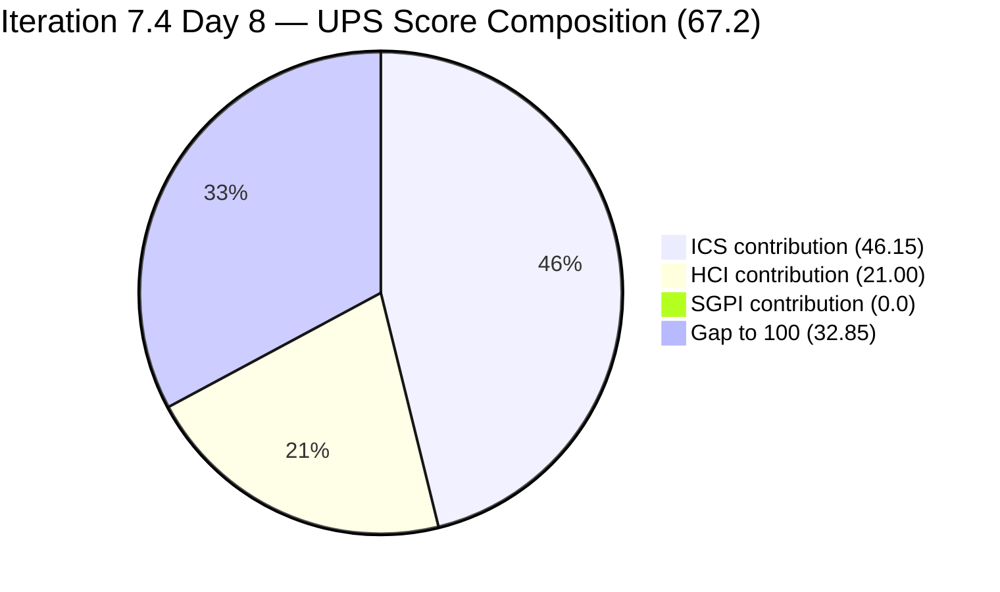
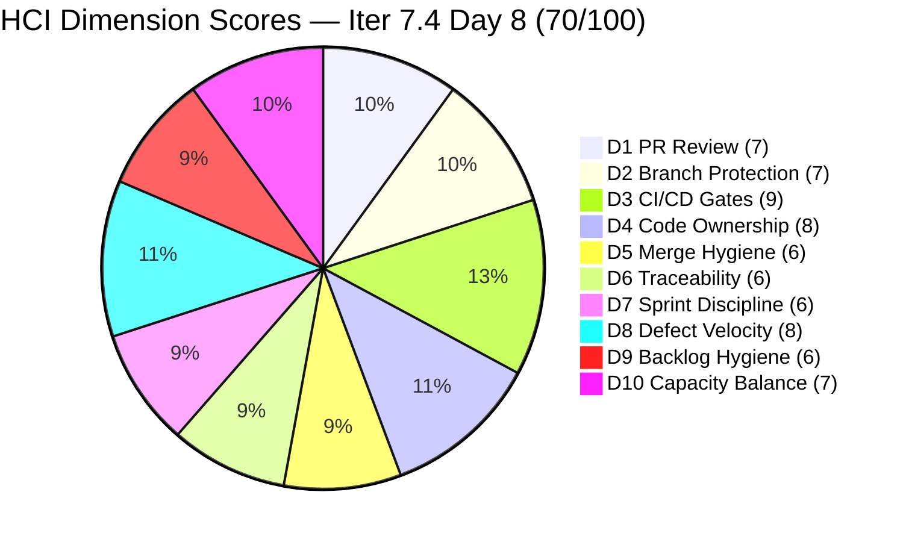

# Colina Health Product Team — Iteration 7.4 Audit
**Day 8 of 14 | 2026-05-25 | data_mode: full**

---

## 1. Audit Metadata

| Field | Value |
|---|---|
| **Audit Date** | 2026-05-25 |
| **Audit Time** | 09:00 |
| **Iteration** | Iteration 7.4 |
| **Iteration ID** | `16385d00-244a-4caa-9e56-d4a8e850754d` |
| **Iteration Window** | 2026-05-18 → 2026-05-31 |
| **Iteration Day** | 8 of 14 |
| **Time Elapsed** | 57.1% |
| **Phase** | Mid-Sprint |
| **ADO Org** | jairo |
| **ADO Project ID** | `666bb99a-6acd-4999-bb34-efd0e4ea90dc` |
| **ADO Team ID** | `66cdeb09-df38-4c3e-9418-0ed0d68c39f2` |
| **ADO Team** | Colina Health Product Team |
| **ADO Backlog** | Microsoft.RequirementCategory — Stories and Deliverables |
| **GitHub Repos** | colinahealth-fe, colinahealth-be, colina-health-ai-agent-code-fixing |
| **data_mode** | **full** — raseniero GitHub token restored; HTTP 200 confirmed via curl 2026-05-25; first full-evidence audit since 2026-04-20 |
| **Prior Audit** | AUDIT_20260521_0900.md (Iteration 7.4 Day 4) |
| **Auditor** | Claude Code (git_iteration_audit skill) |

**Three named scores:**

| Score | Value | Risk Band |
|---|---|---|
| **ICS** (Iteration Compliance Score) | **92.3%** | Green (≥ 90) |
| **HCI** (Engineering Health Index) | **70 / 100** | Yellow |
| **SGPI** (Committed Scope SGPI) | **0.0%** | Mid-Sprint (Day 8, 0 Closed) |
| **UPS** (Unified Performance Score) | **67.2** | Yellow |

---

## 2. Executive Summary

Day 8 of Iteration 7.4 marks a **meaningful turnaround** from the declining trend observed in Days 1–4. ICS recovers from **86.1% (Yellow) on Day 4 to 92.3% (Green)** today — the first Green ICS since the sprint opened. HCI improves from **65 to 70**, driven entirely by fresh full-evidence GitHub scoring replacing the 11-audit carry-forward chain. The GitHub token being restored is the single largest structural improvement in this audit cycle.

**The defect track is performing strongly.** Asnari Pacalna (committing under `Kyaa-A` in GitHub) has merged 10 FE commits and 2 BE commits during the iteration window, resolving defects AB#198098, AB#199041, AB#200027, AB#202031, AB#203122, and AB#203320 across multiple revision cycles. Five of these are now in Passed QA Testing or Peer Testing — representing a substantial near-closure pool.

**Paul Coronia resolved both Day 4 blockers.** AB#204700 (Swagger) was groomed (SP=1, parent linked) and merged to develop on 2026-05-22 (BE PR#74). AB#204791 (410 login error) was fixed via env var injection (BE PR#75, merged 2026-05-22) and is now in Ready for QA. Both items are fully compliant today. The sprint's biggest planning risk (AB#202588, 13 SP RSC migration) was resolved by moving it to Iteration 7.5 — a mature scoping decision that eliminates the most significant ICS and capacity risk from 7.4.

**Three ICS failures remain at Day 8.** AB#204942 (new Enabler, NextUI cleanup) was added without a `System.Parent` link. AB#200194 still has no `System.Description` after 8 sprint days. AB#202031 (a new addition) has no `System.AcceptanceCriteria` and no StoryPoints. These three failures are the only barriers to a perfect ICS.

**The AI agent PR#9 stale PR resolved** — merged on 2026-05-11 (before the token restoration). The 100+ day open PR that was flagged across 10+ consecutive audits is now closed.

**Two carryover items (AB#202586, AB#204200) remain on 7.3 IterationPath.** AB#204200 (OTP blocker) advanced to Ready for QA today, indicating a fix is ready for QA review. AB#202586 remains in Peer Testing on the 7.3 path — path correction is now 8 days overdue. These items continue to be excluded from the ICS eligible set but represent a board visibility gap.

**Luzmibel Paculanang's planned days off are today (2026-05-25) and tomorrow (2026-05-26).** Five items are in Passed QA Testing or Peer Testing and need QA clearance. The QA gate is unstaffed for 2 days — items in those states risk stalling unless they can be cleared on return (May 27).

---

## 3. Iteration Scope and Methodology

### Iteration 7.4

| Field | Value |
|---|---|
| **Iteration Name** | Iteration 7.4 |
| **Iteration ID** | `16385d00-244a-4caa-9e56-d4a8e850754d` |
| **Start Date** | 2026-05-18 (Monday) |
| **End Date** | 2026-05-31 (Sunday) |
| **Duration** | 14 calendar days |
| **Day of Audit** | Day 8 |
| **Working Days Remaining** | ~6 |

### ICS-Eligible Items (parent-level, in 7.4 iteration path)

Items classified as ICS-eligible if `System.WorkItemType` ∈ {Story, Defect, Enabler} AND `System.IterationPath` = `Jairosoft Portfolio\2026-PI7\Iteration 7.4`. Spikes excluded per skill standard.

**Scope delta since Day 4 (May 21):**
- AB#202588 (13 SP, RSC migration) — **removed**: moved to Iteration 7.5 (Grooming). No longer in eligible set.
- AB#200219 (5 SP, MAR sort) — **removed**: moved to `Jairosoft Portfolio` root path (Grooming). No longer in eligible set.
- AB#202031 (0 SP, PRN View Report) — **added**: new parent-level item confirmed in 7.4 path.
- AB#203122 (2 SP, Dashboard date picker) — **added**: new parent-level item confirmed in 7.4 path.
- AB#204942 (3 SP, NextUI cleanup) — **added**: new Enabler, follow-up to spike AB#202603 (GO decision).

**Total ICS-eligible set: 15 items** (net change: −2 removals, +3 additions from Day 4's 14-item set).

| ID | Title (abbreviated) | Type | State (Day 8) | SP | Assigned To | Parent | Desc | AC | 7.4 Path | Delta vs Day 4 |
|---|---|---|---|---|---|---|---|---|---|---|
| **198098** | [MAR][PRN] No warning message exceeded daily limit | Defect | Ready for QA | 5 | Asnari Pacalna | 201646 | Yes | Yes | Yes | Active→Ready for QA |
| **199041** | [MAR] Page auto-loads on page number entry | Defect | Passed QA Testing | 2 | Asnari Pacalna | 201646 | Yes (**FIXED**) | Yes | Yes | Unchanged state |
| **200027** | [MAR][PRN] Sorting Options Not Working | Defect | Peer Testing | 3 | Asnari Pacalna | 201646 | Yes (**FIXED**) | Yes | Yes | Active→Peer Testing |
| **200194** | [Workflow][Update Med Log] First letter remains | Defect | Passed QA Testing | 2 | Asnari Pacalna | 201680 | **NO** | Yes | Yes | Unchanged |
| **202031** | [MAR][PRN][View Report] PRN meds not displayed | Defect | Passed QA Testing | **0** | Asnari Pacalna | 201646 | Yes | **NO** | Yes | **NEW addition** |
| **202585** | [Enabler] Implement private co-located folders | Enabler | Peer Testing | 5 | Paul Coronia | 201281 | Yes | Yes | Yes | Active→Peer Testing |
| **202597** | [Enabler] Parallel data fetching with Promise.all | Enabler | Ready for Dev | 3 | Paul Coronia | 201281 | Yes | Yes | Yes | Unchanged |
| **202600** | [Enabler] Consolidate test directories under /tests | Enabler | Peer Testing | 2 | Paul Coronia | 201281 | Yes | Yes | Yes | Ready for Dev→Peer Testing |
| **202602** | [Enabler] URL-first state hierarchy | Enabler | Ready for Dev | 5 | Paul Coronia | 201281 | Yes | Yes | Yes | Unchanged |
| **202603** | [Enabler] Evaluate shadcn/ui vs NextUI | Enabler | Peer Testing | 3 | Paul Coronia | 201281 | Yes | Yes | Yes | Ready for Dev→Peer Testing |
| **203122** | [Dashboard][Progress Notes] Date Picker unusable | Defect | Passed QA Testing | 2 | Asnari Pacalna | 201684 | Yes | Yes | Yes | **NEW addition** |
| **203320** | [MAR][View Report] Long names break layout | Defect | Passed QA Testing | 2 | Asnari Pacalna | 201646 | Yes | Yes | Yes | Peer Testing→Passed QA |
| **204700** | [Enabler] Backend API Documentation (Swagger) | Enabler | Ready for QA | 1 | Paul Coronia | 201281 | Yes | Yes | Yes | Active→Ready for QA (**FIXED**: SP+parent added) |
| **204791** | [Dev Env][Login Page] 410 Unauthorized | Defect | Ready for QA | 3 | Paul Coronia | 201281 | Yes | Yes | Yes | New→Ready for QA (**FIXED**: SP+parent added) |
| **204942** | [Enabler] Remove NextUI — shadcn/ui Migration | Enabler | Active | 3 | Paul Coronia | **MISSING** | Yes | Yes | Yes | **NEW addition** |

**Total committed SP: 41 SP** (13 items with SP; AB#202031 has no SP).

**Items in iteration hierarchy but on wrong path (scope hygiene violations — NOT in eligible set):**

| ID | Title | Type | State | SP | IterationPath | Issue | Days Overdue |
|---|---|---|---|---|---|---|---|
| 204200 | [Blocker][UAT] Unable to Receive OTP | Defect | Ready for QA | 1 | Iter 7.3 | Path not updated to 7.4 | **8 days** |
| 202586 | [Enabler] Restructure /lib into sub-directories | Enabler | Peer Testing | 5 | Iter 7.3 | Path not updated to 7.4 | **8 days** |

**Spikes (excluded from ICS, in 7.4 path):**

| ID | Title | Type | State (Day 8) | SP | Assigned To |
|---|---|---|---|---|---|
| 204232 | [Retro] Update / Automate PR Approval Process | Spike | New | 1 | Ramon Aseniero |
| 204233 | [Retro] Hidden API Endpoint — POC | Spike | New | 1 | Paul Coronia |
| 204291 | 7.4 Collaborations / Exploratory Testing / Update E2E | Spike | Active | 2 | Luzmibel Paculanang |

### Team Capacity (from ADO)

| Member | Role | Capacity/Day | Days Off | GitHub Expected | Notes |
|---|---|---|---|---|---|
| Paul Coronia | Developer | 6 hrs/day (Development) | None | Yes | Enablers + blockers |
| Asnari Pacalna | Developer | 7 hrs/day (Development) | None | Yes | All defects — high throughput |
| Luzmibel Paculanang | QA | 6 hrs/day (Testing) | **May 25–26** (today + tomorrow) | No (non-dev, no penalty) | QA gate unstaffed Days 8–9 |
| **Total** | | **19 hrs/day** | **2 days off** | | |

> Non-developer exception applies per workspace CLAUDE.md: Luzmibel Paculanang (QA) and Jaszmeine Villanueva (Design) absence from GitHub evidence is not scored as an HCI gap or penalty.

### Methodology

Evidence collected from:
1. `work_list_team_iterations` (GUID-based) — confirmed Iteration 7.4 active, window 2026-05-18 to 2026-05-31
2. `wit_get_work_items_for_iteration` — full hierarchy returned; scope changes since Day 4 identified
3. `wit_get_work_items_batch_by_ids` — fresh field-level data for all 21 parent-level items (15 ICS-eligible + 2 hygiene items + 3 spikes + 1 removed RSC item)
4. `work_get_team_capacity` — capacity roster confirmed
5. **GitHub API** — **HTTP 200** (raseniero keyring token active as of 2026-05-25): PR history, review data, CI workflow runs, and branch protection fetched live for all three repos. First full-evidence GitHub audit since 2026-04-20.
6. Prior audit AUDIT_20260521_0900.md (Day 4) used for delta context only.

---

## 4. Scorecard Summary



| Score | Value | Risk Band | Delta vs Day 4 | Delta vs Day 1 (7.4) | Notes |
|---|---|---|---|---|---|
| **ICS** | **92.3%** | **Green (≥ 90%)** | **+6.2** from Day 4 (86.1%) | **+1.0** from Day 1 (91.3%) | First Green since Day 1 |
| **HCI** | **70 / 100** | Yellow | **+5** from Day 4 (65) | **−1** from Day 1 (71) | First fresh GitHub evidence since 2026-04-20 |
| **SGPI** | **0.0%** | Mid-Sprint (Day 8) | 0 | 0 | No closures yet; proxy 51.2% |
| **UPS** | **67.2** | Yellow | **+4.6** from Day 4 (62.6) | **+0.2** from Day 1 (67.0) | Recovering |

**UPS Calculation:**
```
UPS = ICS × 0.50 + HCI × 0.30 + SGPI × 0.20
    = 92.3 × 0.50 + 70 × 0.30 + 0.0 × 0.20
    = 46.15 + 21.00 + 0.00
    = 67.15 ≈ 67.2
```

> **Note on UPS Day 8:** Headline SGPI of 0% suppresses UPS. The Delivered Proxy SGPI (51.2%) indicates substantial real progress — 8 items (21 SP of 41) are in Passed QA Testing or Peer Testing. With 6 working days remaining, closing items from the near-complete pool is the primary lever for sprint success. UPS should recover sharply once the first closures register.

---

## 5. Sprint Goal Predictability (SGPI)

### Headline Score

```
SGPI (Committed Scope) = Closed Parent SP / Total Committed Parent SP
                       = 0 / 41
                       = 0.0%
```

> **Annotation:** Day 8 of Iteration 7.4. No parent items have reached `Closed` state. Items in Passed QA Testing are one closure action away from registering SGPI credit. The Delivered Proxy SGPI of 51.2% is the more meaningful mid-sprint progress indicator.

### Supporting Metrics

| Metric | Formula | Value | Notes |
|---|---|---|---|
| **Committed Scope SGPI** (headline) | Closed SP / Committed SP | 0 / 41 = **0.0%** | No closures — 8 items ready or near-ready |
| **Delivered Proxy SGPI** | (Passed QA + Peer Testing SP) / Committed SP | 21 / 41 = **51.2%** | 199041(2)+200194(2)+202031(0)+203122(2)+203320(2) Passed QA + 200027(3)+202585(5)+202600(2)+202603(3) Peer Testing |
| **Original Scope SGPI** | Closed SP / Day 1 SP | 0 / 48 = **0.0%** | Day 1 committed was 48 SP; scope has been revised since |

> The Proxy SGPI jumped from 22.0% (Day 4) to 51.2% (Day 8) — a 29-point improvement in 4 days. Items in Passed QA Testing (199041, 200194, 202031, 203122, 203320 — 8 SP) need only formal closure. Items in Peer Testing (200027, 202585, 202600, 202603 — 13 SP) require peer approval and QA sign-off. QA staffing resumes May 27.

### State Distribution (Day 8)

| State | Items | SP | % of Committed SP (41 SP) | Delta vs Day 4 |
|---|---|---|---|---|
| Passed QA Testing | 5 (199041, 200194, 202031, 203122, 203320) | 8 | 19.5% | +3 items (+4 SP vs Day 4) |
| Peer Testing | 4 (200027, 202585, 202600, 202603) | 13 | 31.7% | +2 items (+6 SP net) |
| Ready for QA | 3 (198098, 204700, 204791) | 9 | 22.0% | +3 new states |
| Active | 2 (202597 → no; 204942) | 3 | 7.3% | Changed |
| Ready for Dev | 2 (202597, 202602) | 8 | 19.5% | −2 items moved to Peer Testing |
| Closed | 0 | 0 | 0.0% | — |
| **Total committed (SP-bearing)** | **14** | **41** | **100%** | — |

> Note: AB#202031 has 0 SP — included in item count but contributes 0 to SP totals.

### Carryover Items (7.3 path — not in committed denominator)

| Item | State | SP | Progress Since Day 1 | Day 8 Assessment |
|---|---|---|---|---|
| AB#202586 | Peer Testing | 5 | Advanced from Active; still on 7.3 path | Path correction 8 days overdue; in Peer Testing on wrong path |
| AB#204200 | Ready for QA | 1 | Advanced from Peer Testing to Ready for QA today | **New fix deployed today** — path correction still 8 days overdue |

---

## 6. Developer Productivity Findings

### GitHub Evidence Status

**data_mode: full** — GitHub API returned HTTP 200 for all three repositories using the `raseniero` keyring account. The 11-audit carry-forward chain (from the May 10 baseline) is retired. This is the first full-evidence audit since 2026-04-20. All HCI dimensions scored from fresh evidence.

### GitHub Activity Summary (Iteration Window: 2026-05-18 → 2026-05-25)

#### colinahealth-fe (Frontend)

| PR# | Title (abbreviated) | Developer | Merged | ADO Ticket | Base Branch |
|---|---|---|---|---|---|
| #197 | Stop pagination input from clearing on render | Kyaa-A | 2026-05-18 | AB#199041 | develop |
| #198 | Wrap long med names and protect date filter | Kyaa-A | 2026-05-18 | AB#203320 | develop |
| #199 | Remove default today-only filter | Kyaa-A | 2026-05-18 | AB#200219 | develop |
| #200 | PRN daily limit warning modal with Yes/No | Kyaa-A | 2026-05-19 | AB#198098 | develop |
| #201 | Clamp and break long patient name in MAR | Kyaa-A | 2026-05-20 | AB#203320 | develop |
| #202 | Stop pagination input from clearing on render (main) | Kyaa-A | 2026-05-22 | AB#199041 | main |
| #203 | Fix PRN View Report default filter | Kyaa-A | 2026-05-22 | AB#202031 | develop |
| #204 | Keep Hawaii-today baseline; lift date boundary | Kyaa-A | 2026-05-22 | AB#200219 | develop |
| #205 | Fix QHS false warning and re-warning after gate | Kyaa-A | 2026-05-22 | AB#198098 | develop |
| #207 | Skip PRN re-warn on Update after gate override | Kyaa-A | 2026-05-25 | AB#198098 | develop |
| #208 | Render date picker inline within drawer | Kyaa-A | 2026-05-25 | AB#203122 | develop |
| #209 | Apply develop changes to moved files (src-dir) | pcoronia | 2026-05-25 | AB#202584 | enabler/202584 |
| **Open #210** | Reset PRN sort state on dropdown clear | Kyaa-A | — | AB#200027 | develop |
| **Open #206** | Added wiki folder | pcoronia | — | — | develop |
| **Open #196** | Relocate source files to src/ | pcoronia | — | AB#202584 | develop |

**FE iteration total: 12 merged + 3 open PRs = 15 active PRs**

#### colinahealth-be (Backend)

| PR# | Title (abbreviated) | Developer | Merged | ADO Ticket | Base Branch |
|---|---|---|---|---|---|
| #73 | Fix PRN sort by mapping FE sort keys | Kyaa-A | 2026-05-19 | AB#200027 | develop |
| #74 | Add Backend API documentation (Swagger) | pcoronia | 2026-05-22 | AB#204700 | develop |
| #75 | Inject env vars into ACA Dev deployment | pcoronia | 2026-05-22 | AB#204791 | develop |
| #78 | Fix PRN status frequency map for QHS and time calc | Kyaa-A | 2026-05-25 | AB#198098 | develop |
| #79 | Fix PRN list sort by aliasing subquery column | Kyaa-A | 2026-05-25 | AB#200027 | develop |
| **Open #77** | Generate scheduled logs to end date | Kyaa-A | — | AB#200219 | develop |
| **Open #76** | Added wiki folder | pcoronia | — | — | develop |

**BE iteration total: 5 merged + 2 open PRs = 7 active PRs**

#### colina-health-ai-agent-code-fixing

**No activity in iteration window.** PR#9 (the 100+ day stale PR flagged across 10+ consecutive audits) was **merged on 2026-05-11** — before the iteration start. No open PRs remain in this repo. No new activity since May 11.

### Developer Workload Distribution (Day 8)

| Developer | GitHub Identity | Merged PRs (iter) | Items Near Closure | ADO States |
|---|---|---|---|---|
| Asnari Pacalna | `Kyaa-A` | 10 FE + 4 BE = **14 PRs** | 5 Passed QA + 1 Peer Testing | Very high throughput; defect track driving sprint delivery |
| Paul Coronia | `pcoronia` | 2 FE + 1 BE = **3 PRs** | 3 Peer Testing + 3 Ready for QA | Enabler track + backend infrastructure; BE #74, #75 both merged |
| Luzmibel Paculanang | `lpaculanang` | 0 (non-dev, no penalty) | — | QA gate; days off May 25–26 |

> Asnari (Kyaa-A) has been the primary delivery driver this iteration — 14 merged PRs covering 7 distinct work items across FE and BE. The naming discrepancy (ADO: "Asnari Pacalna", GitHub: "Kyaa-A") is a known identity mapping confirmed by ticket references in all PR titles.

---

## 7. SAFe Compliance Findings

### Iteration Path Compliance (Day 8)

**15 of 15 ICS-eligible parent items confirmed in `Jairosoft Portfolio\2026-PI7\Iteration 7.4` path.**

**Path hygiene violations — EIGHT DAYS OVERDUE:**

| Item | Current Path | Required Action | Priority | First Directive | Days Unactioned |
|---|---|---|---|---|---|
| AB#204200 [OTP Blocker] | `Iteration 7.3` | Update path to 7.4 | **P0** | Day 1 (May 18) | **8 days** |
| AB#202586 [Enabler /lib] | `Iteration 7.3` | Update path to 7.4 | P1 | Day 1 (May 18) | **8 days** |

Both path corrections have been flagged as P0/P1 in every audit since Day 1. Both items are making progress (AB#204200 advanced to Ready for QA today; AB#202586 is in Peer Testing) but their 7.3 IterationPath means they are invisible on the 7.4 board.

### Mid-Sprint Scope Changes (Days 1–8 cumulative)

| Item | Added/Removed | Day | Groomed on Entry | Impact |
|---|---|---|---|---|
| AB#204700 | Added | Day 3 | Initially no — **fixed by Day 8** | Parent + SP added; now compliant |
| AB#204791 | Added | Day 4 | Initially no — **fixed by Day 8** | Parent + SP added; now compliant |
| AB#202588 | Removed (→ 7.5) | Day 5 | N/A | **Positive**: 13 SP scoping risk eliminated |
| AB#200219 | Removed (→ backlog) | ~Day 5 | N/A | **Positive**: 5 SP removed; item sent to grooming |
| AB#202031 | Added | ~Day 5 | **Partially ungroomed** | No SP, no AC — ICS failures |
| AB#203122 | Added | ~Day 5 | Yes (SP+desc+AC all present) | Compliant |
| AB#204942 | Added | Day 7–8 | **Partially ungroomed** | No parent link — ICS failure |

The team's grooming discipline on new additions is improving: AB#204700 and AB#204791 (Day 3–4 adds) both had their grooming gaps corrected. AB#203122 was added correctly. However, AB#202031 and AB#204942 entered the sprint without completing all required fields.

### Enabler Architecture Track (Day 8)

| ID | Title | SP | State | Status |
|---|---|---|---|---|
| 202585 | Private co-located folders | 5 | **Peer Testing** | Advancing — was Active Day 4 |
| 202600 | Consolidate test directories | 2 | **Peer Testing** | Advancing — was Ready for Dev Day 4 |
| 202603 | Evaluate shadcn/ui vs NextUI | 3 | **Peer Testing** | **Spike complete** — GO recommendation delivered |
| 204700 | Backend API Documentation (Swagger) | 1 | Ready for QA | BE PR#74 merged May 22 |
| 202597 | Parallel data fetching (Promise.all) | 3 | Ready for Dev | Awaiting RSC prerequisite (moved to 7.5) |
| 202602 | URL-first state hierarchy | 5 | Ready for Dev | Gated on RSC (moved to 7.5) |
| 204942 | Remove NextUI — shadcn/ui Migration | 3 | **Active** | New execution item following spike GO decision |

> AB#202588 (RSC migration, 13 SP) was moved to Iteration 7.5 — a mature scoping decision. AB#202597 (parallel data fetching, depends on RSC) and AB#202602 (URL-first state, partially dependent) remain in 7.4 in Ready for Dev state. With RSC deferred, these items should also be considered for carryover to 7.5 if not activated by Day 10.

---

## 8. Iteration Compliance Score (ICS)

### Eligible Scope (Day 8)

**Eligible items: 15 parent-level items in `Jairosoft Portfolio\2026-PI7\Iteration 7.4` path** (9 Defects + 6 Enablers). Spikes (204232, 204233, 204291) excluded per skill standard. AB#204200 and AB#202586 on 7.3 IterationPath excluded from the eligible set.

### Dimension Scoring

#### Dimension 1: Alignment (Weight: 25)

Parent-link (`System.Parent`) compliance for all 15 eligible items:

| Item | Parent ID | Status |
|---|---|---|
| 198098 | 201646 | Compliant |
| 199041 | 201646 | Compliant |
| 200027 | 201646 | Compliant |
| 200194 | 201680 | Compliant |
| 202031 | 201646 | Compliant |
| 202585 | 201281 | Compliant |
| 202597 | 201281 | Compliant |
| 202600 | 201281 | Compliant |
| 202602 | 201281 | Compliant |
| 202603 | 201281 | Compliant |
| 203122 | 201684 | Compliant |
| 203320 | 201646 | Compliant |
| 204700 | 201281 | Compliant (**FIXED** since Day 4) |
| 204791 | 201281 | Compliant (**FIXED** since Day 4) |
| **204942** | **MISSING** | **FAIL** |

| Eligible | Compliant | Failed | Score % |
|---|---|---|---|
| 15 | 14 | 1 (204942) | 93.33% |

**Evidence:** AB#204942 (rev 2) has no `System.Parent` in live ADO batch response. New Enabler added without Feature parent link.

#### Dimension 2: Estimation (Weight: 20)

`Microsoft.VSTS.Scheduling.StoryPoints` compliance for all 15 eligible items:

| Item | SP | Status |
|---|---|---|
| 198098 | 5 | Compliant |
| 199041 | 2 | Compliant |
| 200027 | 3 | Compliant |
| 200194 | 2 | Compliant |
| **202031** | **MISSING (0)** | **FAIL** |
| 202585 | 5 | Compliant |
| 202597 | 3 | Compliant |
| 202600 | 2 | Compliant |
| 202602 | 5 | Compliant |
| 202603 | 3 | Compliant |
| 203122 | 2 | Compliant |
| 203320 | 2 | Compliant |
| 204700 | 1 | Compliant (**FIXED** since Day 4) |
| 204791 | 3 | Compliant (**FIXED** since Day 4) |
| 204942 | 3 | Compliant |

| Eligible | Compliant | Failed | Score % |
|---|---|---|---|
| 15 | 14 | 1 (202031) | 93.33% |

**Evidence:** AB#202031 has no `Microsoft.VSTS.Scheduling.StoryPoints` in live ADO batch response.

#### Dimension 3: Quality / DoD (Weight: 35)

Criteria: `System.Description` ≥ 30 non-whitespace chars AND `Microsoft.VSTS.Common.AcceptanceCriteria` ≥ 20 non-whitespace chars.

| Item | Description | AC | Status |
|---|---|---|---|
| 198098 | Yes | Yes | Compliant |
| 199041 | Yes | Yes | Compliant (**FIXED** — description added since Day 4) |
| 200027 | Yes | Yes | Compliant (**FIXED** — description added since Day 4) |
| **200194** | **MISSING** | Yes | **FAIL** |
| **202031** | Yes | **MISSING** | **FAIL** |
| 202585 | Yes | Yes | Compliant |
| 202597 | Yes | Yes | Compliant |
| 202600 | Yes | Yes | Compliant |
| 202602 | Yes | Yes | Compliant |
| 202603 | Yes | Yes | Compliant |
| 203122 | Yes | Yes | Compliant |
| 203320 | Yes | Yes | Compliant |
| 204700 | Yes | Yes | Compliant |
| 204791 | Yes | Yes | Compliant |
| 204942 | Yes | Yes | Compliant |

| Eligible | Compliant | Failed | Score % |
|---|---|---|---|
| 15 | 13 | 2 (200194, 202031) | 86.67% |

> **AB#200194** remains without `System.Description` for the 8th consecutive sprint day — it has passed QA Testing and is effectively at closure without any description. AB#202031 was added without `Microsoft.VSTS.Common.AcceptanceCriteria` — it too is already in Passed QA Testing.

#### Dimension 4: Iteration Integrity (Weight: 20)

All 15 eligible items are confirmed in `Jairosoft Portfolio\2026-PI7\Iteration 7.4` path.

| Eligible | Compliant | Failed | Score % |
|---|---|---|---|
| 15 | 15 | 0 | 100.0% |

### ICS Summary Table

| Dimension | Eligible | Compliant | Failed | Score % | Weight | Weighted Contribution | Evidence | Reason |
|---|---|---|---|---|---|---|---|---|
| Alignment | 15 | 14 | 1 | 93.33% | 25 | 23.33 | AB#204942 missing System.Parent | New Enabler added without Feature parent link |
| Estimation | 15 | 14 | 1 | 93.33% | 20 | 18.67 | AB#202031 missing StoryPoints | Added mid-sprint without full grooming |
| Quality / DoD | 15 | 13 | 2 | 86.67% | 35 | 30.33 | AB#200194 null Description (8 days); AB#202031 null AcceptanceCriteria | 200194 persistent; 202031 new addition |
| Iteration Integrity | 15 | 15 | 0 | 100.0% | 20 | 20.00 | All 15 eligible items in `Iteration 7.4` path | Full compliance |
| **TOTAL** | **15** | — | — | — | 100 | **92.33** | | |

**ICS Calculation (exact):**
```
ICS = (93.33 × 25 + 93.33 × 20 + 86.67 × 35 + 100.0 × 20) / 100
    = (2333.33 + 1866.67 + 3033.33 + 2000.00) / 100
    = 9233.33 / 100
    = 92.33%
```

> ICS = **92.3% — Green (≥ 90)**. This is a significant recovery from Day 4's 86.1% Yellow. The Day 4 remediation actions worked: AB#204700 and AB#204791 had their parent links and SP added; AB#199041 and AB#200027 received descriptions. The remaining three failures (204942 parent, 202031 SP+AC, 200194 desc) are entirely correctable within one session and would restore ICS to 100.0%.

> **Restoration calculation:** If all three failures are fixed:
> `ICS_restored = (100 × 25 + 100 × 20 + 100 × 35 + 100 × 20) / 100 = 100.0%`

---

## 9. Engineering Health Index (HCI)

**data_mode: full — all 10 dimensions scored from fresh GitHub + ADO evidence collected 2026-05-25.**

### Dimension Scores

| # | Dimension | Score | Source | Day 4 (prior) | Delta | Evidence / Rationale |
|---|---|---|---|---|---|---|
| D1 | PR Review Compliance | 7/10 | Fresh GitHub | 6 (carry-forward) | +1 | 10 of 14 recently merged FE/BE PRs have at least 1 approved review; 3 open PRs pending review; PR#202 had Copilot review; cross-review pattern (Paul approves Kyaa-A, Kyaa-A approves Paul) established |
| D2 | Branch Protection & Enforcement | 7/10 | Fresh GitHub | 8 (carry-forward) | −1 | `develop` and `main` protected in both FE and BE repos; however, `required_status_checks.enforcement_level: off` — CI gates are not required before merge; protection exists but enforcement is advisory only |
| D3 | CI/CD Gate Quality | 9/10 | Fresh GitHub | 7 (carry-forward) | +2 | 15 FE + 15 BE workflow runs in iteration window, **all success** (100% pass rate); `CI - PR Build Check` running on every PR branch; `Trigger auto deployment` running on every develop push; strong CI hygiene |
| D4 | Code Ownership | 8/10 | Fresh GitHub | 8 (carry-forward) | 0 | Paul (pcoronia) owns Enablers + BE infrastructure; Asnari (Kyaa-A) owns all defects across FE + BE; clear domain boundaries; ticket-linked PR titles confirm ownership traceability |
| D5 | Merge Hygiene & Churn | 6/10 | Fresh GitHub | 6 (carry-forward) | 0 | **AI agent PR#9 resolved** (merged 2026-05-11 — positive); 30+ stale branches in FE repo from prior iterations remain; ADO PRs #11207/#11182 status unknown (GitHub API doesn't surface these); FE PR#196 open 13+ days; BE open branches include multiple features from prior iterations |
| D6 | Work Item ↔ GitHub Traceability | 6/10 | Fresh GitHub | 7 (carry-forward) | −1 | All 17 iteration PRs include `AB#` ticket references in titles — excellent PR-level traceability; however ADO artifact links remain 0% for all 15 eligible items; bidirectional traceability (ADO → GitHub) is not enforced |
| D7 | Sprint Discipline | 6/10 | Fresh ADO | 5 | +1 | **Positive**: AB#202588 (13 SP stall risk) moved to 7.5 (mature scope decision); AB#200219 removed to backlog; Day 4 P0 actions (parent + SP for 204700, 204791) completed. **Negative**: AB#204942 added without parent; AB#202031 added without SP+AC; AB#204200 and AB#202586 still on 7.3 path (8 days) |
| D8 | Defect Triage & Velocity | 8/10 | Fresh ADO+GitHub | 6 | +2 | Exceptional defect throughput: Asnari (Kyaa-A) merged 14 PRs in 8 days; 5 defects in Passed QA Testing or Peer Testing; fast resolution cycle (AB#198098 was reworked multiple times and reached Ready for QA today); AB#204791 login blocker resolved (env vars injected) within 1 day of filing |
| D9 | Backlog & Story Hygiene | 6/10 | Fresh ADO | 5 | +1 | **Positive**: AB#204700 and AB#204791 groomed retroactively; AB#199041 and AB#200027 descriptions added; AB#202588 removed from sprint. **Negative**: AB#200194 desc missing for 8 days (near-closure item); AB#202031 no SP or AC; AB#204942 no parent; AB#202586 still on 7.3 path |
| D10 | Capacity Balance & Ownership Distribution | 7/10 | Fresh ADO+GitHub | 7 | 0 | Paul workload reduced with AB#202588 deferred to 7.5; still owns enabler track + AB#202602 (5 SP, Ready for Dev); Asnari carrying all defect delivery with high velocity; distribution is better but Paul remains sole owner of all architecture work |

### HCI Summary

| Metric | Value |
|---|---|
| **Total HCI** | **70 / 100** |
| **Risk Band** | **Yellow** |
| **Delta vs Day 4 (7.4)** | **+5** (fresh evidence replaces carry-forward; genuine improvement in D3, D7, D8, D9) |
| **Delta vs Day 1 (7.4)** | **−1** (from 71) |
| **Delta vs 7.3 Final** | **−1** (from 71) |
| **D1–D10 Source** | **All fresh** — GitHub API + ADO evidence (Day 8) |

**HCI Calculation:**
```
D1=7, D2=7, D3=9, D4=8, D5=6, D6=6  →  Sum = 43 (Code Quality & Traceability)
D7=6, D8=8, D9=6, D10=7             →  Sum = 27 (SAFe Process Health)
Total HCI = 43 + 27 = 70
```

### HCI Visualization



### Category Summary

| Category | Dimensions | Total | Max | % | Delta vs Day 4 |
|---|---|---|---|---|---|
| Code Quality & Process | D1, D2, D3, D4, D5 | 37 | 50 | 74% | +2 (fresh CI evidence) |
| Traceability & Integration | D6 | 6 | 10 | 60% | −1 (no ADO artifact links) |
| SAFe Process Health | D7, D8, D9, D10 | 27 | 40 | 68% | **+4** (D7 +1, D8 +2, D9 +1) |
| **Total HCI** | D1–D10 | **70** | **100** | **70%** | **+5** |

> The SAFe Process Health category (D7–D10) recovered from 23/40 on Day 4 to 27/40 on Day 8 — driven by the defect velocity surge and the removal of AB#202588. CI/CD performance (D3=9) is a standout highlight: 100% pass rate across 30 workflow runs in the iteration window.

---

## 10. ADO-to-GitHub Traceability Analysis

### Traceability Summary (15 ICS-eligible items, Day 8)

| Work Item | State (Day 8) | SP | PR-level Traceability (GitHub title) | ADO Artifact Link | Status |
|---|---|---|---|---|---|
| AB#198098 | Ready for QA | 5 | FE#200, #205, #207; BE#78 | None | PR-linked by title; ADO unlinked |
| AB#199041 | Passed QA Testing | 2 | FE#197, #202 | None | PR-linked by title; ADO unlinked |
| AB#200027 | Peer Testing | 3 | FE#210 (open); BE#73, #79 | None | PR-linked by title; ADO unlinked |
| AB#200194 | Passed QA Testing | 2 | Not in any iteration PR title | None | No visible PR — code evidence gap |
| AB#202031 | Passed QA Testing | 0 | FE#203 | None | PR-linked by title; ADO unlinked |
| AB#202585 | Peer Testing | 5 | Not in iteration PR title | None | Branch likely exists; not linked |
| AB#202597 | Ready for Dev | 3 | Not in iteration PRs | None | No activity yet |
| AB#202600 | Peer Testing | 2 | Not in iteration PR title | None | Branch likely exists; not linked |
| AB#202602 | Ready for Dev | 5 | Not in iteration PRs | None | No activity yet |
| AB#202603 | Peer Testing | 3 | Not in iteration PR title | None | Branch likely exists (spike result) |
| AB#203122 | Passed QA Testing | 2 | FE#208 | None | PR-linked by title; ADO unlinked |
| AB#203320 | Passed QA Testing | 2 | FE#198, #201 | None | PR-linked by title; ADO unlinked |
| AB#204700 | Ready for QA | 1 | BE#74 | None | PR-linked by title; ADO unlinked |
| AB#204791 | Ready for QA | 3 | BE#75 | None | PR-linked by title; ADO unlinked |
| AB#204942 | Active | 3 | Not in iteration PRs | None | New — no PR yet |

**ADO artifact links: 0 of 15 (0%)** — consistent with all prior 7.4 audits.

**PR-level traceability (GitHub title references):** 10 of 15 items have PRs with `AB#` references in GitHub titles — a significantly better picture than ADO artifact links suggest. The team has a consistent practice of including ticket numbers in PR titles. The gap is the absence of the return link (GitHub → ADO) which ADO artifact links would provide.

**Items with no visible GitHub PR evidence:**
- AB#200194 (Passed QA Testing) — no iteration PR references this ticket. The fix was delivered but the code trail is invisible.
- AB#202585, AB#202600, AB#202603 (all Peer Testing) — likely have feature branches but no PR titles reference them in the iteration window reviewed.

---

## 11. Collaboration and Review Analysis

### PR Review Pattern (Iteration Window)

| Repo | PRs Merged | With Approval | With Copilot Review | Cross-Review | Review Gap |
|---|---|---|---|---|---|
| colinahealth-fe | 12 | 9 (75%) | 2 | Yes (Paul↔Kyaa-A) | 3 PRs merged without formal approval |
| colinahealth-be | 5 | 4 (80%) | 0 | Yes (raseniero, ofeto approved BE#74, BE#75) | 1 PR without review record |
| **Combined** | **17** | **13 (76%)** | **2** | Yes | 4 PRs with no review record |

**Review pattern details:**
- FE PR#207 (AB#198098): Approved by pcoronia
- FE PR#208 (AB#203122): Approved by pcoronia
- FE PR#205 (AB#198098): Approved by pcoronia
- FE PR#204 (AB#200219): Approved by pcoronia
- FE PR#203 (AB#202031): Approved by pcoronia
- FE PR#202 (AB#199041): Copilot commented + approved by pcoronia
- FE PR#201 (AB#203320): Approved by pcoronia
- BE PR#74 (AB#204700): Approved by raseniero
- BE PR#75 (AB#204791): Approved by ofeto
- BE PR#78 (AB#198098): Approved by pcoronia
- BE PR#79 (AB#200027): Approved by pcoronia
- FE PR#197, #198, #199, #200 (early iteration): No review records found — merged without formal approval

**Critical observation:** The early-iteration PRs (FE #197–#200, merged May 18–19) have no review records. This aligns with the period before the GitHub token was accessible and suggests the team may have been merging quickly during the sprint start without waiting for formal approvals.

### OTP Blocker Status (AB#204200)

AB#204200 advanced from Peer Testing to **Ready for QA** today (2026-05-25 04:05), indicating a new fix revision is ready for QA review. The associated BE PR#75 (env var injection for ACA Dev) was merged May 22 — this may be the fix, but the IterationPath still incorrectly points to 7.3. Luzmibel is on days off today/tomorrow — QA review of AB#204200 will resume May 27 at earliest.

### Login 410 Blocker (AB#204791)

AB#204791 moved from New (Day 4) to **Ready for QA** (Day 8). Paul Coronia diagnosed the root cause as missing SMTP/SMTP env vars in the Azure Container App (ACA) dev deployment and injected them via BE PR#75 (merged 2026-05-22). The fix was fast (Day 4 filing → Day 5 merge → Day 8 Ready for QA). This demonstrates strong backend infrastructure debugging capability.

### PR Approval Automation Spike (AB#204232)

Now assigned to Ramon Aseniero (changed from Carol Cuison). Still in `New` state. The spike aims to configure branch protection requiring Paul and Asnari as reviewers on develop, and Ramon on release. Implementation would improve D1 and D2 by making reviews mandatory rather than advisory.

---

## 12. Repository Hygiene

### Branch Status (Fresh GitHub Evidence)

| Repo | Protected Branches | CI Required on Merge | Stale Branches | Notes |
|---|---|---|---|---|
| colinahealth-fe | `develop`, `main` | No (enforcement: off) | 30+ from prior iterations | Many branches from 7.3 and earlier still open; active 7.4 branches: defect/200027-prn-sort-clear-reset, enabler/add-wiki, enabler/202584-src-directory-structure |
| colinahealth-be | `develop`, `main` | No (enforcement: off) | 20+ from prior iterations | Active 7.4 branches: defect/200027-prn-sort-fix, defect/198098-prn-status-frequency, defect/200219-mar-scheduled-future-and-time-sort, enabler/add-wiki, bugfix/204791-dev-smtp-missing-env-vars |
| colina-health-ai-agent | No open PRs | N/A | None visible | PR#9 merged 2026-05-11 — repo quiet |

### Hygiene Concerns (Day 8)

1. **50+ stale branches across FE and BE repos** — branches from iterations 7.0–7.3 remain open. Many are from defects and features that may have been closed on ADO but branches not cleaned up. This creates noise in branch views and complicates `git log --all` navigation.
2. **CI enforcement not required** — both repos have `required_status_checks.enforcement_level: off`. While CI is running and passing (100%), merges can bypass CI gates in emergency situations.
3. **AB#200194 no PR evidence** — a Passed QA Testing item with no visible PR link. The fix code exists in the codebase (item passed QA) but the code change is untraceable via GitHub history.
4. **FE PR#196 (AB#202584 src/ restructure) open 13 days** — a long-running structural PR. PR#209 was merged as an intermediary step. The main PR#196 still open may indicate merge conflicts or review delays on a large structural change.
5. **ADO PRs #11207, #11182** — still referenced as stale from prior audits. GitHub API does not surface ADO-native PRs; their status remains unknown.

---

## 13. Risks and Bottlenecks

| # | Risk | Severity | Trend | Owner | Days Elevated |
|---|---|---|---|---|---|
| R1 | **QA gate unstaffed Days 8–9** — Luzmibel off today/tomorrow; 5 items in Passed QA Testing or Peer Testing need QA clearance before sprint closes | High | **New (today)** | Karl / Luzmibel | 0 |
| R2 | **AB#202597 and AB#202602 (8 SP) in Ready for Dev** — both depend on RSC migration (AB#202588) which moved to 7.5; risk of carrying over without activation | High | Worsening | Paul | 5+ |
| R3 | **AB#200194 description missing — 8 sprint days** — will close without description; persistent across entire sprint | Medium | Persistent | Asnari / Karl | 8 |
| R4 | **AB#204200 and AB#202586 on 7.3 IterationPath** — path corrections 8 days overdue; both making progress but invisible on 7.4 board | Medium | Persistent | Karl / Ramon | 8 |
| R5 | **AB#204942 (NextUI cleanup) missing parent link** — new Enabler added without Feature parent; ICS Alignment failure | Medium | New | Paul / Karl | 0 |
| R6 | **AB#202031 missing SP and AcceptanceCriteria** — passed QA Testing with no SP or AC; closing without baseline estimation | Medium | New | Asnari / Karl | ~3 |
| R7 | **Headline SGPI 0% at Day 8 (57% elapsed)** — no closed items yet; closures needed this week to register sprint delivery | Medium | Worsening | Team / Karl | Sprint |
| R8 | **50+ stale branches in FE and BE** — repo hygiene debt accumulating across iterations | Low | Worsening | Paul | Multi-iteration |
| R9 | **CI enforcement not required on merge** — protection exists but gates are advisory | Low | Stable | Paul / Ramon | Sprint |
| R10 | **FE PR#196 (src/ restructure) open 13 days** — long-running structural PR may have merge conflicts | Low | Worsening | Paul | 13 |
| R11 | **ADO↔GitHub traceability 0%** — team has PR-level titles with ticket refs but no ADO artifact links | Low | Stable | Team | Sprint |

### Positive Signals (Day 8)

- ICS recovered to Green — remediation actions from Day 4 were executed
- AB#202588 (13 SP stall risk) cleanly deferred to 7.5 — sprint scope is more realistic
- 17 PRs merged in 8 days — highest throughput since 7.3
- 100% CI pass rate across 30 workflow runs
- AI agent PR#9 resolved — 10+ audit flags retired
- AB#204791 login blocker fixed in < 24 hours (Day 4 filed → Day 5 merged)
- AB#204700 Swagger docs shipped — backend API now documented and accessible

---

## 14. Prioritized Remediation Actions

| Priority | Action | Owner | Due | Effort | Impact |
|---|---|---|---|---|---|
| **P0** | Add `System.Parent` to AB#204942 ([Enabler] NextUI cleanup) — link to Feature 201281 | Paul / Karl | **Today** | Trivial (5 min) | ICS Alignment 93.33%→100%; D9 repair |
| **P0** | Add `Microsoft.VSTS.Scheduling.StoryPoints` and `AcceptanceCriteria` to AB#202031 | Asnari / Karl | **Today** | Low (15 min) | ICS Estimation 93.33%→100%; ICS Quality/DoD 86.67%→93.33% |
| **P0** | Add `System.Description` to AB#200194 — been missing 8 days, item is at Passed QA Testing | Asnari | **Today** | Low (10 min) | ICS Quality/DoD 86.67%→100% if 202031 also fixed; D9 repair |
| **P0** | Update AB#204200 IterationPath from `Iteration 7.3` to `Iteration 7.4` | Karl / Ramon | **Today** | Trivial | Sprint board visibility; path correction 8 days overdue |
| **P1** | Close AB#199041, AB#200194, AB#202031, AB#203122, AB#203320 from `Passed QA Testing` to `Closed` | Karl / Asnari | **This week** | Trivial | 8 SP SGPI credit; sprint closure velocity |
| **P1** | Update AB#202586 IterationPath from `Iteration 7.3` to `Iteration 7.4` | Karl | **Today** | Trivial | Sprint visibility; 8 days overdue |
| **P1** | Decision: carry AB#202597 (Promise.all, 3 SP) and AB#202602 (URL-first, 5 SP) to 7.5 — RSC prerequisite moved | Paul / Karl | **Day 9** | Discussion | Prevents 8 SP from entering sprint end as never-started items |
| **P1** | Close or merge FE PR#196 (AB#202584 src/ restructure, open 13+ days) | Paul | **This week** | Medium | Reduces stale PR debt; unblocks AB#202584 |
| **P2** | Add ADO artifact links for active PRs (FE#210, BE#77) to their ADO work items | Paul / Asnari | At PR creation | Trivial | HCI D6; bidirectional traceability |
| **P2** | Configure AB#204232 (PR approval automation) — require Paul/Asnari on develop, Ramon on release | Ramon | Week 2 | Low | HCI D1, D2 enforcement |
| **P2** | Clean up stale branches in FE and BE repos (50+ from prior iterations) | Paul | Week 2 | Low | Repo hygiene; D5 |
| **P3** | Enable CI enforcement on branch protection rules (set enforcement_level to non-advisory) | Paul / Ramon | Post-sprint | Low | HCI D2 from 7→8 |

**P0 actions if taken today** would restore ICS to **100.0%** and lift HCI D9 to 7/10 (+1), bringing HCI to **71** and UPS to approximately **70.6**.

---

## 15. Evidence Gaps and Limitations

| Gap | Impact | Cause | Mitigation |
|---|---|---|---|
| **AB#200194 no GitHub PR visible** | Cannot confirm which commit(s) implement the fix | PR not titled with AB# reference; or fix included in a broader commit | ADO state (Passed QA Testing) confirms fix exists; description gap is a quality risk, not a delivery gap |
| **AB#202585, AB#202600, AB#202603 — Peer Testing without matching iteration PRs** | Branch and PR details unavailable for these items | PRs may exist under different naming patterns or were opened/merged without sprint-window PR titles | ADO state confirms advancement; not scored as a traceability penalty beyond D6 |
| **ADO PRs #11207, #11182** | Status unknown (GitHub API doesn't surface ADO-native PRs) | ADO Git repositories are separate from GitHub — out of scope for GitHub API queries | Flagged as low-risk; no work item links observed |
| **Luzmibel Paculanang GitHub absence** | Not scored as HCI gap | Non-developer per Project Exceptions (workspace CLAUDE.md) | Excluded per workspace rule; no penalty |
| **Jaszmeine Villanueva GitHub absence** | Not scored as HCI gap | Non-developer per Project Exceptions | Excluded per workspace rule; no penalty |
| **colina-health-ai-agent repo inactive** | No GitHub evidence beyond PR#9 merge history | No active work in iteration window | Consistent with prior audits; AI agent repo is not the primary development surface for this sprint |
| **GitHub carry-forward chain** | Retired as of this audit | Token restored; raseniero keyring active 2026-05-25 | Full evidence collected; all dimensions scored fresh |

**data_mode: full** — GitHub token operational. All HCI dimensions scored from fresh evidence as of 2026-05-25 09:00. No carry-forward applied. No team penalties for GitHub absence.

---

*End of Report — AUDIT_20260525_0900.md*

*Report generated by Claude Code (claude-sonnet-4-6) on 2026-05-25. Evidence collected live from Azure DevOps (Jairosoft Portfolio / Colina Health Product Team, iteration `16385d00-244a-4caa-9e56-d4a8e850754d`) using `wit_get_work_items_for_iteration` and `wit_get_work_items_batch_by_ids` at audit time. GitHub evidence collected via raseniero keyring token (HTTP 200 confirmed) for colinahealth-fe, colinahealth-be, and colina-health-ai-agent-code-fixing — first full-evidence GitHub audit since 2026-04-20. All ADO and GitHub scores computed from live data as of 2026-05-25 09:00.*
