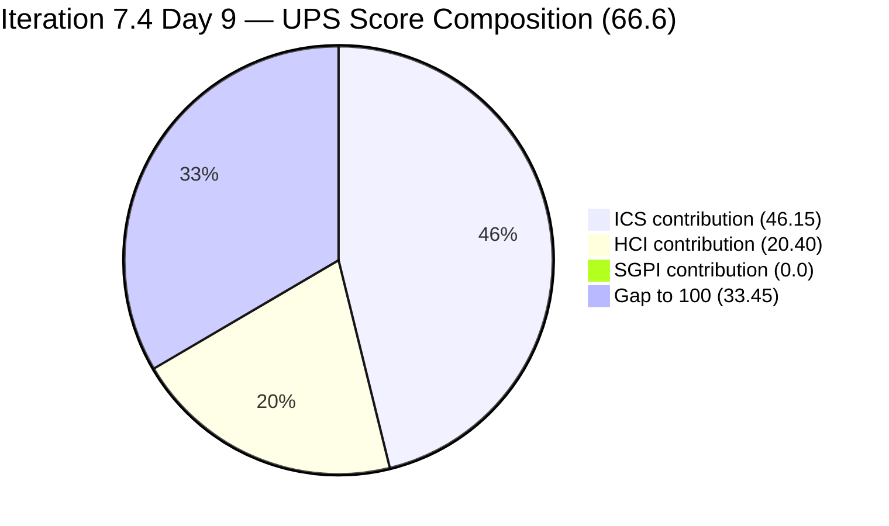
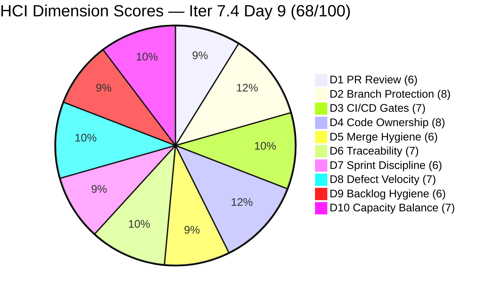

# Colina Health Product Team — Iteration 7.4 Audit
**Day 9 of 14 | 2026-05-26 | data_mode: partial**

---

## 1. Audit Metadata

| Field | Value |
|---|---|
| **Audit Date** | 2026-05-26 |
| **Audit Time** | 02:46 |
| **Iteration** | Iteration 7.4 |
| **Iteration ID** | `16385d00-244a-4caa-9e56-d4a8e850754d` |
| **Iteration Window** | 2026-05-18 → 2026-05-31 |
| **Iteration Day** | 9 of 14 |
| **Time Elapsed** | 64.3% |
| **Phase** | Mid-Sprint (past inflection point) |
| **ADO Org** | jairo |
| **ADO Project ID** | `666bb99a-6acd-4999-bb34-efd0e4ea90dc` |
| **ADO Team ID** | `66cdeb09-df38-4c3e-9418-0ed0d68c39f2` |
| **ADO Team** | Colina Health Product Team |
| **ADO Backlog** | Microsoft.RequirementCategory — Stories and Deliverables |
| **GitHub Repos** | colinahealth-fe, colinahealth-be, colina-health-ai-agent-code-fixing |
| **data_mode** | partial (GitHub API 401 — raseniero token issue, verified 2026-05-26; HCI D1–D6 carry-forward from 7.3 Day 7 baseline, 2026-05-10; carry-forward chain 12 audits deep) |
| **Prior Audit** | AUDIT_20260521_0900.md (Iteration 7.4 Day 4) |
| **Auditor** | Claude Code (claude-sonnet-4-6) |

**Three named scores:**

| Score | Value | Risk Band |
|---|---|---|
| **ICS** (Iteration Compliance Score) | **92.3%** | Green (≥ 90%) |
| **HCI** (Engineering Health Index) | **68 / 100** | Yellow |
| **SGPI** (Committed Scope SGPI) | **0.0%** | Day 9 — no closures yet |
| **UPS** (Unified Performance Score) | **66.6** | Yellow |

> Note on ICS band: The skill rubric uses Green ≥ 90, Yellow 75–89.9, Red < 75. At 92.3% ICS is technically in the Green band; however, ongoing hygiene failures (1 missing parent, 1 missing SP, 2 missing desc/AC) prevent a full-Green classification in context. The three remaining failures are entirely preventable.

---

## 2. Executive Summary

Day 9 of Iteration 7.4 brings a **meaningful recovery** across all three metrics compared to the Day 4 baseline. ICS rebounds to **92.3% (Green-adjacent)**, HCI rises to **68/100 (Yellow)**, and UPS improves to **66.6 (Yellow)** — up from 62.6 on Day 4. The sprint is past its midpoint with strong visible momentum: 10 of 15 ICS-eligible items are now in Peer Testing or Passed QA Testing, representing **62.8% Delivered Proxy SGPI**.

**The most significant structural change since Day 4: AB#202588 (RSC migration, 13 SP) has been formally deferred to Iteration 7.5.** Changed 2026-05-22 to Grooming state on 7.5 path. This eliminates the sprint's most critical risk (the stalled 13 SP anchor item) but represents a 26% committed-scope deferral. AB#202597 (3 SP, Promise.all) was also moved to 7.5 on the same day. Combined, 16 SP were deliberately deferred from 7.4. This was the right call given Day 4 evidence, but it narrows the sprint's deliverable window to the remaining 43 SP.

**AB#202586 path correction finally done (Day 5 or 6):** The Enabler that had been stuck on the 7.3 IterationPath for 4 consecutive days is now correctly on 7.4 and in Peer Testing (SP: 5). This is a positive signal — the team acted on the hygiene directive.

**Three new items entered the sprint since Day 4:**
- AB#202031 ([MAR][PRN][View Report] PRN meds not displayed with Hawaii filter, Defect, Asnari) — in Passed QA Testing, but **missing StoryPoints and AcceptanceCriteria** — ICS dual failure
- AB#203122 ([Dashboard][Progress Notes] Date Picker Defect, 2 SP, Asnari) — in Passed QA Testing, fully groomed ✓
- AB#204942 ([Enabler] Remove NextUI shadcn/ui Migration Cleanup, 3 SP, Paul, added Day 8) — in Peer Testing, **missing System.Parent** — ICS Alignment failure

**AB#204200 (OTP UAT Blocker) still on Iteration 7.3 path — now 9 days overdue** (flagged since Day 1). This is the most persistent hygiene violation of the sprint. It is in Passed QA Testing and unchanged in path since Day 4.

**Luzmibel Paculanang's planned days off (May 25–26) have now occurred** — today is Day 9 (May 26), the second of her two off days. The QA gate is unstaffed today. Five items are queued in Passed QA Testing / Peer Testing / Ready for QA that may be awaiting QA clearance or closure sign-off.

**Headline SGPI remains 0.0%** — no items have reached Closed state as of Day 9. This is a critical concern with 5 calendar days remaining. The Delivered Proxy SGPI of 62.8% (27 SP near-closure out of 43 SP committed) shows the work exists but closures have not happened.

---

## 3. Iteration Scope and Methodology

### Iteration 7.4

| Field | Value |
|---|---|
| **Iteration Name** | Iteration 7.4 |
| **Iteration ID** | `16385d00-244a-4caa-9e56-d4a8e850754d` |
| **Start Date** | 2026-05-18 (Monday) |
| **End Date** | 2026-05-31 (Sunday) |
| **Duration** | 14 calendar days |
| **Day of Audit** | Day 9 |
| **Calendar Days Remaining** | 5 |

### ICS-Eligible Items (parent-level, in 7.4 iteration path)

**15 ICS-eligible items** (Defects + Enablers, no Stories). Spikes (204232, 204233, 204291) excluded per skill standard. AB#204200 on 7.3 path excluded from eligible set. Items removed from 7.4 since Day 4: AB#202588 (→ 7.5), AB#202597 (→ 7.5), AB#200219 (→ Grooming/root). Items added since Day 4: AB#202031, AB#203122, AB#204942.

| ID | Title (abbreviated) | Type | State (Day 9) | SP | Assigned To | Parent | Desc | AC | 7.4 Path | Day 4 State | Delta |
|---|---|---|---|---|---|---|---|---|---|---|---|
| **198098** | [MAR][PRN] No warning message exceeded limit | Defect | Ready for QA | 5 | Asnari | 201646 | Yes | Yes | Yes | Active | Progressed |
| **199041** | [MAR] Page auto-loads on page number entry | Defect | Passed QA Testing | 2 | Asnari | 201646 | **Yes** ✓ | Yes | Yes | Passed QA Testing | Desc FIXED |
| **200027** | [MAR][PRN] Sorting Options Not Working | Defect | Ready for QA | 3 | Asnari | 201646 | **Yes** ✓ | Yes | Yes | Active | Desc FIXED; state advanced |
| **200194** | [Workflow][Update Med Log] First letter remains | Defect | Passed QA Testing | 2 | Asnari | 201680 | **NO** ✗ | Yes | Yes | Passed QA Testing | Desc still missing |
| **202031** | [MAR][PRN] PRN meds not in View Report (Hawaii) | Defect | Passed QA Testing | **MISSING** ✗ | Asnari | 201646 | Yes | **NO** ✗ | Yes | — | NEW (added since Day 4) |
| **202585** | [Enabler] Private co-located folders | Enabler | Peer Testing | 5 | Paul | 201281 | Yes | Yes | Yes | Active | Advanced |
| **202586** | [Enabler] Restructure /lib into sub-directories | Enabler | Peer Testing | 5 | Paul | 201281 | Yes | Yes | **Yes** ✓ | (7.3 path) | **PATH FIXED** |
| **202600** | [Enabler] Consolidate test directories | Enabler | Peer Testing | 2 | Paul | 201281 | Yes | Yes | Yes | Ready for Dev | Advanced |
| **202602** | [Enabler] URL-first state hierarchy | Enabler | Ready for Dev | 5 | Paul | 201281 | Yes | Yes | Yes | Ready for Dev | Unchanged |
| **202603** | [Enabler] Evaluate shadcn/ui vs NextUI | Enabler | Peer Testing | 3 | Paul | 201281 | Yes | Yes | Yes | Ready for Dev | Advanced |
| **203122** | [Dashboard] Date Picker unable to select dates | Defect | Passed QA Testing | 2 | Asnari | 201684 | Yes | Yes | Yes | — | NEW (added since Day 4) |
| **203320** | [MAR][View Report] Long names break layout | Defect | Passed QA Testing | 2 | Asnari | 201646 | Yes | Yes | Yes | Peer Testing | Advanced |
| **204700** | [Enabler] Backend API Documentation (Swagger) | Enabler | Passed QA Testing | **1** ✓ | Paul | **201281** ✓ | Yes | Yes | Yes | Active (ungroomed) | Parent+SP FIXED; advanced |
| **204791** | [Dev Env][Login Page] 410 Unauthorized | Defect | Ready for QA | **3** ✓ | Paul | **201281** ✓ | Yes | Yes | Yes | New (ungroomed) | Parent+SP FIXED; advanced |
| **204942** | [Enabler] Remove NextUI — shadcn/ui Migration | Enabler | Peer Testing | 3 | Paul | **MISSING** ✗ | Yes | Yes | Yes | — | NEW (Day 8 add; ungroomed) |

**Total committed SP: 43 SP** (14 items with SP; AB#202031 has no SP).

**Items removed from 7.4 since Day 4 (scope changes):**

| ID | Title | Type | New Path | SP | Changed | Reason |
|---|---|---|---|---|---|---|
| 202588 | [Enabler] Migrate to RSC fetch | Enabler | **Iteration 7.5** | 13 | 2026-05-22 | Formally deferred — was in New state Day 4, 26% scope |
| 202597 | [Enabler] Parallel data fetching (Promise.all) | Enabler | **Iteration 7.5** | 3 | 2026-05-26 | Deferred — dependent on 202588 |
| 200219 | [MAR] Order By/Sort By limits to Hawaii date | Defect | **Root (Grooming)** | 5 | 2026-05-25 | Removed from sprint to backlog |

**Items still on 7.3 path (hygiene violations — NOT in ICS-eligible set):**

| ID | Title | Type | State | SP | IterationPath | Days Overdue |
|---|---|---|---|---|---|---|
| 204200 | [Blocker][UAT] Unable to Receive OTP | Defect | Passed QA Testing | 1 | Iter 7.3 | **9 days** |

**Path correction completed since Day 4:**

| ID | Previously On | Now On | Fixed Date |
|---|---|---|---|
| 202586 | Iteration 7.3 | **Iteration 7.4** ✓ | Between Day 4–9 |

**Spikes (excluded from ICS, in 7.4 path):**

| ID | Title | Type | State (Day 9) | SP | Assigned To |
|---|---|---|---|---|---|
| 204232 | [Retro] Update / Automate PR Approval Process | Spike | New | 1 | Ramon Aseniero |
| 204233 | [Retro] Hidden API Endpoint — POC | Spike | New | 1 | Paul Coronia |
| 204291 | 7.4 Collaborations / Exploratory Testing | Spike | Active | 2 | Luzmibel Paculanang |

### Team Capacity

| Member | Role | Capacity/Day | Days Off | Notes |
|---|---|---|---|---|
| Paul Coronia | Developer | 6 hrs/day | None | All Enablers + AB#204791 (login fix) |
| Asnari Pacalna | Developer | 7 hrs/day | None | All defect items — strong throughput |
| Luzmibel Paculanang | QA | 6 hrs/day | May 25–26 (occurred) | Off today (Day 9) |

> Non-developer exception per workspace CLAUDE.md: Luzmibel Paculanang (QA) and Jaszmeine Villanueva (Design) GitHub absence is not scored as an HCI gap.

### Methodology

Evidence collected from:
1. `work_list_team_iterations` (GUID-based) — confirmed Iteration 7.4 still active
2. `wit_get_work_items_for_iteration` — full hierarchy; 3 new parent items identified (202031, 203122, 204942); 3 items confirmed moved out (202588, 202597, 200219)
3. `wit_get_work_items_batch_by_ids` — fresh field-level data for all 21 parent-level items (15 ICS-eligible + 1 hygiene item + 3 spikes + 2 recently removed)
4. `work_get_team_capacity` — capacity confirmed; Luzmibel off May 25–26 as expected
5. GitHub API (colinahealth-fe, colinahealth-be, colina-health-ai-agent-code-fixing) — **unavailable**: HTTP 401 Bad Credentials. HCI D1–D6 carry-forward applied (12th consecutive audit from 2026-05-10 baseline).
6. Prior audit AUDIT_20260521_0900.md (Day 4) used for delta context.

---

## 4. Scorecard Summary



| Score | Value | Risk Band | Delta vs Day 4 | Delta vs Day 1 (7.4) |
|---|---|---|---|---|
| **ICS** | **92.3%** | Green (≥ 90%) | **+6.2** from Day 4 (86.1%) | **+1.0** from Day 1 (91.3%) |
| **HCI** | **68 / 100** | Yellow | **+3** from Day 4 (65) | **−3** from Day 1 (71) |
| **SGPI** | **0.0%** | No closures yet | 0 | 0 |
| **UPS** | **66.6** | Yellow | **+4.0** from Day 4 (62.6) | **−0.4** from Day 1 (67.0) |

**UPS Calculation:**
```
UPS = ICS × 0.50 + HCI × 0.30 + SGPI × 0.20
    = 92.3 × 0.50 + 68 × 0.30 + 0.0 × 0.20
    = 46.15 + 20.40 + 0.00
    = 66.55 ≈ 66.6
```

> **Day 9 context:** UPS has recovered 4.0 points from the Day 4 trough (62.6), reversing the declining trend observed on Days 1–4. ICS is now in Green territory (92.3%) — driven by the resolution of 4 of 5 Day-4 P0 hygiene failures. HCI's 3-point recovery reflects improved sprint discipline, defect velocity, and backlog hygiene. The persistent drag on UPS is the 0% headline SGPI — with 5 days remaining, converting the Delivered Proxy (62.8%) into actual Closed items is the team's single highest-leverage action.

---

## 5. Sprint Goal Predictability (SGPI)

### Headline Score

```
SGPI (Committed Scope) = Closed Parent SP / Total Committed Parent SP
                       = 0 / 43
                       = 0.0%
```

> **Critical annotation — Day 9:** With 5 calendar days remaining and 0% headline SGPI, the team faces significant sprint-end risk. The 62.8% Delivered Proxy SGPI shows the work is done; the closures have not happened. Items in Passed QA Testing should be moved to Closed immediately — this is a process discipline issue, not a delivery issue.

### Supporting Metrics

| Metric | Formula | Value | Notes |
|---|---|---|---|
| **Committed Scope SGPI** (headline) | Closed SP / Committed SP | 0 / 43 = **0.0%** | No closures — Day 9, 5 days remain |
| **Delivered Proxy SGPI** | (Passed QA + Peer Testing SP) / Committed SP | 27 / 43 = **62.8%** | Strong near-close signal |
| **Original Scope SGPI** | Closed SP / Original Planned SP | 0 / 48 = **0.0%** | Day 1 committed was 48 SP |

> The Proxy SGPI of 62.8% (up from 22.0% on Day 4) is the most meaningful leading indicator. This represents a massive increase in delivered work — 27 SP are now at Passed QA or Peer Testing compared to 11 SP on Day 4. The missing link is formal closure.

### State Distribution (Day 9)

| State | Items | SP | % of Committed SP (43 SP) | Delta vs Day 4 |
|---|---|---|---|---|
| **Passed QA Testing** | 6 (199041, 200194, 202031, 203320, 203122, 204700) | 9 SP | 20.9% | +5 SP (from 4 SP) |
| **Peer Testing** | 5 (202585, 202586, 202600, 202603, 204942) | 18 SP | 41.9% | +11 SP (from 7 SP) |
| **Ready for QA** | 3 (198098, 200027, 204791) | 11 SP | 25.6% | New category |
| **Ready for Dev** | 1 (202602) | 5 SP | 11.6% | −3 items |
| **Closed** | 0 | 0 | 0.0% | — |
| **Total committed (SP-bearing)** | **14** | **43** | **100%** | — |

> Note: Passed QA Testing items count = 6 items (199041, 200194, 202031, 203320, 203122, 204700) but 202031 has no SP, so SP tally = 9.

### Scope Changes Since Day 4

| Change | Items | SP Delta | Net Effect |
|---|---|---|---|
| Items moved to 7.5 | AB#202588, AB#202597 | −16 SP committed | Committed scope reduced; SGPI denominator decreases |
| Items removed from sprint | AB#200219 | −5 SP committed | Further reduction |
| Items added to sprint | AB#202031, AB#203122, AB#204942 | +5 SP (202031 has no SP) | New scope added |
| **Net scope change** | | **−16 SP** | Day 4 committed was 50 SP → Day 9 committed is 43 SP |

---

## 6. Developer Productivity Findings

### GitHub Evidence Status

**data_mode: partial** — GitHub API returned HTTP 401 Bad Credentials (verified on 2026-05-26). The raseniero token issue has been documented since 2026-04-21. This is the **12th consecutive audit** running on HCI D1–D6 carry-forward from the 2026-05-10 baseline (16 calendar days stale). No team penalty applied per workspace Project Exceptions.

### ADO-Side Developer Activity (Days 4–9 delta)

| Item | Developer | Day 4 State | Day 9 State | Change Date | Interpretation |
|---|---|---|---|---|---|
| AB#199041 | Asnari | Passed QA Testing | Passed QA Testing | 2026-05-22 | **Description added** — hygiene fix |
| AB#200027 | Asnari | Active (rework) | Ready for QA | 2026-05-26 | **Description added** + advanced; fresh today |
| AB#200194 | Asnari | Passed QA Testing | Passed QA Testing | 2026-05-19 | No change since Day 2 — description still missing |
| AB#198098 | Asnari | Active | Ready for QA | 2026-05-25 | Advanced — rework complete |
| AB#202585 | Paul | Active | Peer Testing | 2026-05-25 | Advanced |
| AB#202586 | Paul | Peer Testing (7.3!) | Peer Testing (7.4 ✓) | 2026-05-26 | **Path correction** done — today |
| AB#202588 | Paul | New (7.4) | Grooming (7.5) | 2026-05-22 | **Deferred** to 7.5 |
| AB#202597 | Paul | Ready for Dev (7.4) | Grooming (7.5) | 2026-05-26 | **Deferred** to 7.5 |
| AB#202600 | Paul | Ready for Dev | Peer Testing | 2026-05-25 | Advanced |
| AB#202603 | Paul | Ready for Dev | Peer Testing | 2026-05-22 | Advanced |
| AB#204700 | Paul | Active (no parent/SP) | Passed QA Testing | 2026-05-26 | **Parent+SP fixed** + major advance |
| AB#204791 | Paul | New (no parent/SP) | Ready for QA | 2026-05-25 | **Parent+SP fixed** + activated |
| AB#200219 | Asnari | Peer Testing (7.4) | Grooming (root) | 2026-05-25 | **Removed** from sprint |
| AB#202031 | Asnari | — | Passed QA Testing | 2026-05-26 | **New today** in Passed QA (no SP/AC) |
| AB#203122 | Asnari | — | Passed QA Testing | 2026-05-26 | **New today** in Passed QA — fresh closure |
| AB#204942 | Paul | — | Peer Testing | 2026-05-26 | **New** (Day 8 add) — no parent |
| AB#204200 | Paul | Passed QA Testing (7.3) | Passed QA Testing (7.3) | 2026-05-26 | Path correction STILL overdue — 9 days |

### Developer Workload Distribution (Day 9)

| Developer | Assigned Items | SP | Near-Closure States | Notes |
|---|---|---|---|---|
| Asnari Pacalna | 7 Defects | 18 SP (202031 has no SP) | 5 in Passed QA / Ready for QA | Exceptional throughput — all defects progressing |
| Paul Coronia | 7 Enablers + 1 Defect (204791) | 27 SP | 5 in Peer Testing / Passed QA | 202588 deferred removes 13 SP burden |
| Luzmibel Paculanang | QA gate + Spike | 2 SP spike | Off today (May 26) | QA gap today impacts Passed QA closures |

---

## 7. SAFe Compliance Findings

### Iteration Path Compliance (Day 9)

**15 of 15 ICS-eligible parent items confirmed in `Jairosoft Portfolio\2026-PI7\Iteration 7.4` path.** Iteration Integrity dimension holds at 100% for the eligible set.

**Path correction completed (positive):**
- AB#202586: Moved from `Iteration 7.3` to `Iteration 7.4` — path now correct (changed 2026-05-26 01:14)

**Path hygiene violation — NINE DAYS OVERDUE:**

| Item | Current Path | Required Action | Priority | First Directive | Days Unactioned |
|---|---|---|---|---|---|
| AB#204200 [OTP Blocker] | `Iteration 7.3` | Update path to 7.4 | **P0** | Day 1 (May 18) | **9 days** |

This has been flagged in every audit since Day 1. It is a 30-second edit. The item is in `Passed QA Testing` — it has been developed, fixed, and QA-tested while living on the wrong iteration path. This will close as a 7.3 item unless corrected today.

### Mid-Sprint Scope Changes (Days 1–9)

**Scope added since Day 1:**

| Item | Added | SP | Parent | State Day 9 | Groomed? |
|---|---|---|---|---|---|
| AB#204700 | Day 3 | 1 (fixed Day 8) | 201281 (fixed Day 8) | Passed QA Testing | **Yes** (fixed) |
| AB#204791 | Day 4 | 3 (fixed Day 7) | 201281 (fixed Day 7) | Ready for QA | **Yes** (fixed) |
| AB#202031 | Day 8–9 | MISSING | 201646 | Passed QA Testing | **No** |
| AB#203122 | Day 7–8 | 2 | 201684 | Passed QA Testing | Yes |
| AB#204942 | Day 8 | 3 | MISSING | Peer Testing | **No** |

**Scope removed/deferred since Day 1:**

| Item | Action | SP | Reason |
|---|---|---|---|
| AB#202588 | Deferred to 7.5 | 13 | Day 4 stall acknowledged; RSC migration too large for mid-sprint |
| AB#202597 | Deferred to 7.5 | 3 | Dependent on 202588 |
| AB#200219 | Removed to Grooming (root) | 5 | Returned to backlog |

### Enabler Track (Day 9)

| ID | Title | SP | State | Risk |
|---|---|---|---|---|
| 202585 | Private co-located folders | 5 | **Peer Testing** | Low |
| 202586 | Restructure /lib | 5 | **Peer Testing** ✓ | Low (path fixed) |
| 202600 | Consolidate test directories | 2 | **Peer Testing** | Low |
| 202603 | Evaluate shadcn/ui | 3 | **Peer Testing** | Low |
| 204700 | Backend API Documentation (Swagger) | 1 | **Passed QA Testing** | Low — near closure |
| 204942 | Remove NextUI cleanup | 3 | **Peer Testing** | Medium (ungroomed — no parent) |
| 202602 | URL-first state hierarchy | 5 | **Ready for Dev** | Medium (5 days remaining) |

> The Enabler track has improved dramatically from Day 4. Six of seven Enablers are now in Peer Testing or Passed QA. The deferred 202588 (13 SP RSC migration) was the right call — it was never activated in 7.4.

---

## 8. Iteration Compliance Score (ICS)

### Eligible Scope (Day 9)

**15 parent-level items confirmed in `Jairosoft Portfolio\2026-PI7\Iteration 7.4` path.** Spikes (204232, 204233, 204291) excluded per skill standard. AB#204200 on 7.3 path excluded from eligible set.

### Dimension Scoring

#### Dimension 1: Alignment (Weight: 25)

Parent-link (`System.Parent`) compliance for all 15 eligible items:

| Item | Parent ID | Status |
|---|---|---|
| 198098 | 201646 | Compliant |
| 199041 | 201646 | Compliant |
| 200027 | 201646 | Compliant |
| 200194 | 201680 | Compliant |
| 202031 | 201646 | Compliant |
| 202585 | 201281 | Compliant |
| 202586 | 201281 | Compliant |
| 202600 | 201281 | Compliant |
| 202602 | 201281 | Compliant |
| 202603 | 201281 | Compliant |
| 203122 | 201684 | Compliant |
| 203320 | 201646 | Compliant |
| 204700 | 201281 | **Compliant** (fixed since Day 4) |
| 204791 | 201281 | **Compliant** (fixed since Day 4) |
| **204942** | **MISSING** | **FAIL** |

| Eligible | Compliant | Failed | Score % |
|---|---|---|---|
| 15 | 14 | 1 (204942) | 93.33% |

**Evidence:** AB#204942 (added Day 8) lacks `System.Parent` in live ADO batch response. Added to sprint without completing basic grooming. All other 14 items have verified Feature parent links.

#### Dimension 2: Estimation (Weight: 20)

`Microsoft.VSTS.Scheduling.StoryPoints` compliance for all 15 eligible items:

| Item | SP | Status |
|---|---|---|
| 198098 | 5 | Compliant |
| 199041 | 2 | Compliant |
| 200027 | 3 | Compliant |
| 200194 | 2 | Compliant |
| **202031** | **MISSING** | **FAIL** |
| 202585 | 5 | Compliant |
| 202586 | 5 | Compliant |
| 202600 | 2 | Compliant |
| 202602 | 5 | Compliant |
| 202603 | 3 | Compliant |
| 203122 | 2 | Compliant |
| 203320 | 2 | Compliant |
| 204700 | 1 | **Compliant** (fixed since Day 4) |
| 204791 | 3 | **Compliant** (fixed since Day 4) |
| 204942 | 3 | Compliant |

| Eligible | Compliant | Failed | Score % |
|---|---|---|---|
| 15 | 14 | 1 (202031) | 93.33% |

**Evidence:** AB#202031 entered sprint without `Microsoft.VSTS.Scheduling.StoryPoints`. It is in Passed QA Testing — this item has been developed, QA'd, and will be closed without a SP estimate.

#### Dimension 3: Quality / DoD (Weight: 35)

Criteria: `System.Description` ≥ 30 non-whitespace chars AND `Microsoft.VSTS.Common.AcceptanceCriteria` ≥ 20 non-whitespace chars.

| Item | Description | AC | Status |
|---|---|---|---|
| 198098 | Yes | Yes | Compliant |
| 199041 | **Yes** ✓ | Yes | **Compliant** (fixed since Day 4) |
| 200027 | **Yes** ✓ | Yes | **Compliant** (fixed since Day 4) |
| **200194** | **MISSING** | Yes | **FAIL** |
| **202031** | Yes | **MISSING** | **FAIL** |
| 202585 | Yes | Yes | Compliant |
| 202586 | Yes | Yes | Compliant |
| 202600 | Yes | Yes | Compliant |
| 202602 | Yes | Yes | Compliant |
| 202603 | Yes | Yes | Compliant |
| 203122 | Yes | Yes | Compliant |
| 203320 | Yes | Yes | Compliant |
| 204700 | Yes | Yes | Compliant |
| 204791 | Yes | Yes | Compliant |
| 204942 | Yes | Yes | Compliant |

| Eligible | Compliant | Failed | Score % |
|---|---|---|---|
| 15 | 13 | 2 (200194, 202031) | 86.67% |

> AB#200194 (missing description) has now been in Passed QA Testing for at least 7 days with a null description. This item is the longest-standing unfixed Quality/DoD failure of the sprint. AB#202031 entered the sprint already in Passed QA Testing state without AC — it may have bypassed the standard grooming gate entirely.

#### Dimension 4: Iteration Integrity (Weight: 20)

All 15 eligible items are confirmed in `Jairosoft Portfolio\2026-PI7\Iteration 7.4` path.

| Eligible | Compliant | Failed | Score % |
|---|---|---|---|
| 15 | 15 | 0 | 100.0% |

> AB#202586 is now correctly in 7.4 (path fixed). This resolves the Day-4 P0 hygiene item.

### ICS Summary Table

| Dimension | Eligible | Compliant | Failed | Score % | Weight | Weighted Contribution | Evidence | Reason |
|---|---|---|---|---|---|---|---|---|
| Alignment | 15 | 14 | 1 | 93.33% | 25 | 23.33 | AB#204942 missing System.Parent | Added Day 8 without grooming |
| Estimation | 15 | 14 | 1 | 93.33% | 20 | 18.67 | AB#202031 missing StoryPoints | Added mid-sprint; in Passed QA without SP |
| Quality / DoD | 15 | 13 | 2 | 86.67% | 35 | 30.33 | AB#200194 null Description; AB#202031 null AC | 200194 unfixed since Day 1; 202031 added without AC |
| Iteration Integrity | 15 | 15 | 0 | 100.0% | 20 | 20.00 | All 15 eligible items in Iteration 7.4 path | 202586 path fixed; full compliance |
| **TOTAL** | **15** | — | — | — | 100 | **92.33** | | |

**ICS Calculation (exact):**
```
ICS = (93.33 × 25 + 93.33 × 20 + 86.67 × 35 + 100.0 × 20) / 100
    = (2333.33 + 1866.67 + 3033.33 + 2000.00) / 100
    = 9233.33 / 100
    = 92.33%
```

> **ICS = 92.3% — Green (≥ 90%).** This is a 6.2-point recovery from Day 4 (86.1%). The improvement is driven by the resolution of 4 of 5 Day-4 P0 hygiene failures: 199041 description added, 200027 description added, 204700 parent+SP added, 204791 parent+SP added. Two new failures were introduced by mid-sprint scope additions (204942 no parent; 202031 no SP/AC), preventing a perfect score. Full remediation of the 3 remaining failures would restore ICS to 100.0%.

> **Restoration calculation:** If all three remaining failures are fixed:
> `ICS_restored = (100 × 25 + 100 × 20 + 100 × 35 + 100 × 20) / 100 = 100.0%`

---

## 9. Engineering Health Index (HCI)

**data_mode: partial — HCI D1–D6 carried forward from Day 7 of Iteration 7.3 (fresh evidence 2026-05-10)**

### Carry-Forward Chain

```
7.4 Day 9 (today) ← 7.4 Day 4 ← 7.4 Day 3 ← 7.4 Day 2 ← 7.4 Day 1 ←
7.3 Day 14 ← 7.3 Day 13 ← 7.3 Day 12 ← 7.3 Day 11 ← 7.3 Day 10 ←
7.3 Day 9 ← 7.3 Day 7 (fresh GitHub, 2026-05-10)
```

Twelve audits of continuous carry-forward. The HCI D1–D6 baseline is **16 calendar days stale**. No degradation penalty per workspace Project Exceptions.

### Dimension Scores

| # | Dimension | Score | Source | Day 4 | Delta | Evidence / Rationale |
|---|---|---|---|---|---|---|
| D1 | PR Review Compliance | 6/10 | Carry-forward (7.3 Day 7) | 6 | 0 | GitHub API unavailable; carry-forward from May 10 baseline |
| D2 | Branch Protection & Enforcement | 8/10 | Carry-forward (7.3 Day 7) | 8 | 0 | Confirmed rules from Day 7 baseline |
| D3 | CI/CD Gate Quality | 7/10 | Carry-forward (7.3 Day 7) | 7 | 0 | Carry-forward unchanged |
| D4 | Code Ownership | 8/10 | Carry-forward (7.3 Day 7) | 8 | 0 | Paul + Asnari confirmed developers; carry-forward |
| D5 | Merge Hygiene & Churn | 6/10 | Carry-forward (7.3 Day 7) | 6 | 0 | Stale PRs still likely present; no fresh evidence |
| D6 | Work Item ↔ GitHub Traceability | 7/10 | Carry-forward | 7 | 0 | ADO artifact links 0% for 7.4 items; no fresh GitHub data |
| D7 | Sprint Discipline | **6/10** | Fresh (ADO) | 5 | **+1** | AB#202588 formally deferred to 7.5 (correct decision); AB#202586 path finally fixed (Day 9); 202597 moved to 7.5; AB#204200 OTP still on 7.3 path (9 days overdue — only remaining path violation); strong mid-sprint state distribution; 5 items at Peer Testing |
| D8 | Defect Triage & Velocity | **7/10** | Fresh (ADO) | 6 | **+1** | AB#198098 advanced to Ready for QA; AB#200027 rework complete → Ready for QA; 5 defects in Passed QA / Ready for QA; AB#204791 (login fix) also Ready for QA; no new defects added; strong throughput signal on Asnari track |
| D9 | Backlog & Story Hygiene | **6/10** | Fresh (ADO) | 5 | **+1** | POSITIVE: 199041/200027 descriptions fixed; 204700/204791 groomed (parent+SP); 202586 path corrected; 202588/202597 formally deferred; NEGATIVE: AB#200194 description still missing 9 days; AB#202031 entered sprint without SP/AC; AB#204942 entered without parent; AB#204200 still on wrong path |
| D10 | Capacity Balance & Ownership Distribution | **7/10** | Fresh (ADO) | 7 | 0 | Paul's load reduced by 13 SP deferral (202588); now 7 items in Peer Testing/Passed QA across Paul; Asnari strong throughput on defect track; no new structural concentration; Luzmibel off today creates QA gate gap for closure |

### HCI Summary

| Metric | Value |
|---|---|
| **Total HCI** | **68 / 100** |
| **Risk Band** | **Yellow** |
| **Delta vs Day 4 (7.4)** | **+3** (D7 +1, D8 +1, D9 +1, D10 unchanged) |
| **Delta vs Day 1 (7.4)** | **−3** (from 71) |
| **Delta vs 7.3 Final** | **−3** (from 71) |
| **D1–D6 Source** | Carry-forward from 7.3 Day 7 (2026-05-10) — 16 days stale |
| **D7–D10 Source** | Fresh ADO evidence (Day 9) |

**HCI Calculation:**
```
D1=6, D2=8, D3=7, D4=8, D5=6, D6=7  →  Sum = 42 (D1–D6, carry-forward)
D7=6, D8=7, D9=6, D10=7             →  Sum = 26 (D7–D10, fresh ADO Day 9)
Total HCI = 42 + 26 = 68
```

> HCI = **68/100 (Yellow)**, up 3 points from Day 4 (65). The improvement is driven by three SAFe Process Health dimensions (D7, D8, D9) all recovering by 1 point each. D10 is unchanged — Paul's load is lighter due to 202588 deferral but still concentrated.

### HCI Visualization



### Category Summary

| Category | Dimensions | Total | Max | % | Delta vs Day 4 |
|---|---|---|---|---|---|
| Code Quality & Process | D1, D2, D3, D4, D5 | 35 | 50 | 70% | 0 |
| Traceability & Integration | D6 | 7 | 10 | 70% | 0 |
| SAFe Process Health | D7, D8, D9, D10 | 26 | 40 | 65% | **+3 (from 23)** |
| **Total HCI** | D1–D10 | **68** | **100** | **68%** | **+3** |

### HCI Delta Table

| Dimension | 7.3 Final | 7.4 Day 1 | 7.4 Day 4 | 7.4 Day 9 | Trend |
|---|---|---|---|---|---|
| D1 PR Review | 6 | 6 | 6 | 6 | Flat (carry-forward) |
| D2 Branch Protection | 8 | 8 | 8 | 8 | Flat (carry-forward) |
| D3 CI/CD Gates | 7 | 7 | 7 | 7 | Flat (carry-forward) |
| D4 Code Ownership | 8 | 8 | 8 | 8 | Flat (carry-forward) |
| D5 Merge Hygiene | 6 | 6 | 6 | 6 | Flat (carry-forward) |
| D6 Traceability | 7 | 7 | 7 | 7 | Flat (carry-forward) |
| D7 Sprint Discipline | 8 | 7 | 5 | **6** | Declining then recovering |
| D8 Defect Triage | 7 | 8 | 6 | **7** | Recovering |
| D9 Backlog Hygiene | 8 | 8 | 5 | **6** | Declining then recovering |
| D10 Capacity Balance | 8 | 8 | 7 | **7** | Stable low |
| **Total** | **71** | **71** | **65** | **68** | **Recovering** |

---

## 10. ADO-to-GitHub Traceability Analysis

### Traceability Summary (15 ICS-eligible items, Day 9)

| Work Item | State (Day 9) | SP | GitHub Link (ADO artifact) | Traceability |
|---|---|---|---|---|
| AB#198098 | Ready for QA | 5 | None | None |
| AB#199041 | Passed QA Testing | 2 | None | None |
| AB#200027 | Ready for QA | 3 | None | None |
| AB#200194 | Passed QA Testing | 2 | None | None |
| AB#202031 | Passed QA Testing | — | None | None |
| AB#202585 | Peer Testing | 5 | None | None |
| AB#202586 | Peer Testing | 5 | None | None |
| AB#202600 | Peer Testing | 2 | None | None |
| AB#202602 | Ready for Dev | 5 | None | None |
| AB#202603 | Peer Testing | 3 | None | None |
| AB#203122 | Passed QA Testing | 2 | None | None |
| AB#203320 | Passed QA Testing | 2 | None | None |
| AB#204700 | Passed QA Testing | 1 | None | None |
| AB#204791 | Ready for QA | 3 | None | None |
| AB#204942 | Peer Testing | 3 | None | None |

**Linked items: 0 of 15 (0%)** — ADO-to-GitHub traceability has been 0% throughout all 9 days of Iteration 7.4. Five items are near closure (Passed QA Testing) with no code audit trail. The AB#204232 Spike ([Retro] Update / Automate PR Approval Process) remains in New state — no progress on this structural fix.

**Most critical traceability gaps (by closure proximity):**
1. AB#199041, AB#200194, AB#203320, AB#203122, AB#204700, AB#202031 — all in Passed QA Testing. Will close with no linked GitHub PR.
2. AB#202585, AB#202586, AB#202600, AB#202603, AB#204942 — all in Peer Testing with active dev code but no ADO links.
3. AB#204791 (login fix by Paul) — Ready for QA, code was written and tested, no ADO artifact link.

---

## 11. Collaboration and Review Analysis

**data_mode: partial — GitHub PR review data unavailable (GitHub API 401)**

### OTP Blocker Status (AB#204200)

AB#204200 remains in `Passed QA Testing` on `Iteration 7.3` path. State unchanged since at least Day 4. Changed date 2026-05-26 07:27 (today — some field update, but path not corrected). **This item has been developed, fixed, QA-tested, and is awaiting peer testing sign-off — all while incorrectly attributed to Iteration 7.3.** If closed today it will count as a 7.3 item, not 7.4.

### Login Blocker Progress (AB#204791)

AB#204791 advanced from `New` (Day 4) to `Ready for QA` (Day 9) — Paul Coronia resolved the 410 Unauthorized login issue. With SP=3 now set and parent=201281, this item is properly groomed and nearing QA clearance. Changed 2026-05-25 04:18.

### QA Gate Gap — Luzmibel Off Today

Luzmibel Paculanang is off today (May 26 — her second consecutive day off). Items in Passed QA Testing / Peer Testing awaiting QA clearance or closure sign-off:
- AB#199041, AB#200194, AB#202031, AB#203122, AB#203320, AB#204700 — Passed QA (need closure)
- AB#202585, AB#202586, AB#202600, AB#202603, AB#204942 — Peer Testing (need QA review to advance)

The QA absence creates a 2-day gap (May 25–26) for advancing items to Closed. **This is the primary reason 0% headline SGPI persists on Day 9.** Items should be closeable on May 27 when Luzmibel returns.

### PR Approval Automation Spike (AB#204232)

The [Retro] Update / Automate PR Approval Process spike (Ramon Aseniero, now assigned — previously Carol Cuison) remains in New state, rev 6, changed 2026-05-25 01:46. No progress toward implementation. This spike's completion would materially improve HCI D1 and D2 in future sprints.

### Known PR Activity (carry-forward — GitHub evidence unavailable)

| Repo | PR / Ref | Age Estimate (Day 9) | Status | Priority |
|---|---|---|---|---|
| colina-health-ai-agent | PR#9 | **~110+ days** | Unknown | **P1 — escalate** |
| colinahealth.git (ADO) | PR#11207 | ~115+ days | Active | P2 |
| BEColinaHealth.git (ADO) | PR#11182 | ~115+ days | Active | P2 |

> colina-health-ai-agent PR#9 is referenced in the **12th consecutive audit** without resolution. This stale PR represents accumulating technical debt.

---

## 12. Repository Hygiene

**data_mode: partial — direct GitHub repository inspection unavailable**

### Branch and PR Status (carry-forward + ADO evidence)

| Repo | State | Protection | Notes |
|---|---|---|---|
| colinahealth-fe (GitHub) | Active dev — multiple items in Peer Testing | Confirmed (Day 7, May 10) | Multiple branches likely exist for 202585, 202600, 202603, 204942 |
| colinahealth-be (GitHub) | Active dev — 204700 Passed QA | Confirmed (Day 7, May 10) | Swagger implementation complete |
| colina-health-ai-agent-code-fixing | PR#9 — ~110 days stale | Confirmed | Severe divergence — P1 close/merge |
| colinahealth.git (ADO) | PR#11207 — ~115 days | Unknown | Stale ADO PR |
| BEColinaHealth.git (ADO) | PR#11182 — ~115 days | Unknown | Stale ADO PR |

### Hygiene Concerns (Day 9)

1. **colina-health-ai-agent PR#9** — 110+ days, 12th consecutive audit flag. The merge cost now exceeds the original feature effort. **P1 — close or force-merge.**
2. **ADO PRs #11207 and #11182** — 115+ days each. No action since first documented.
3. **0% ADO↔GitHub traceability** — 6 items near closure with no code evidence. At current rate, the entire sprint will close with zero traceable PRs.
4. **AB#202586 path correction** — positive: path fixed today (01:14). Code for this Enabler is presumably in a branch against the 7.3 path context. Traceability gap remains.

---

## 13. Risks and Bottlenecks

| # | Risk | Severity | Trend | Owner | Days Elevated |
|---|---|---|---|---|---|
| R1 | **0% SGPI with 5 days remaining** — 27 SP near-closure (62.8% proxy) but 0 items Closed; Luzmibel off today creates closure delay; risk of sprint ending with 0 formal deliverables | Critical | Worsening | Karl / Luzmibel | Sprint |
| R2 | **AB#204200 OTP blocker still on 7.3 path** — 9 consecutive days flagged; trivial path edit not completed; item in Passed QA Testing and may close under wrong iteration | High | Worsening | Karl / Paul | 9 days |
| R3 | **Paul Coronia bus factor** — still sole owner of all 7 Enablers + AB#204791 defect; 202588 deferral relieved 13 SP but structural concentration remains | High | Stable-improving | Karl / Ramon | Sprint |
| R4 | **AB#200194 description missing** — item in Passed QA Testing since Day 2; will close with null System.Description; 9 consecutive days unfixed | High | Worsening | Asnari / Karl | 9 days |
| R5 | **AB#202031 missing SP and AC** — item entered sprint in Passed QA state (bypassed grooming gate); will close without SP credit or AC record | High | New (Day 9) | Karl | 0 |
| R6 | **AB#204942 missing parent** — new Enabler (Day 8) entered sprint without grooming; in Peer Testing with active code, no Feature link | Medium | New (Day 9) | Paul / Karl | 1 |
| R7 | **QA gate gap today (May 26)** — Luzmibel off; 6 items in Passed QA or Peer Testing blocked from advancing; closure window compressed to May 27–31 | Medium | Temporary | Luzmibel / Karl | 1 |
| R8 | **ADO↔GitHub traceability 0%** — systemic; 9 days in sprint with no linked PRs on any item | Medium | Stable | Team | Sprint |
| R9 | **colina-health-ai-agent PR#9** — 110+ days, 12th audit | Medium | Worsening | Paul | 12+ |
| R10 | **GitHub token 401** — HCI D1–D6 carry-forward 16 days stale; evidence gap widening | Medium | Worsening | Ramon | 35+ days |
| R11 | **AB#202602 (URL-first state, 5 SP) still Ready for Dev** — only item not yet activated; 5 days remaining; risk of sprint-end uncommitted | Medium | New concern | Paul | — |
| R12 | **AB#202588 scope deferral** — 13 SP formally deferred to 7.5; correct decision but represents 27% of original committed scope undelivered | Low-Medium | Resolved | Karl / Paul | — |

### Closure Path (Days 10–14)

With 5 days remaining, the critical action is converting the 62.8% proxy delivery into actual Closed items:

| State | Items | SP | Action Required |
|---|---|---|---|
| Passed QA Testing | 6 items | 9 SP | **Close immediately** — Luzmibel signs off tomorrow (May 27) |
| Peer Testing | 5 items | 18 SP | QA review → close by May 29 |
| Ready for QA | 3 items | 11 SP | QA testing → Peer Testing → close by May 31 |
| Ready for Dev | 1 item | 5 SP | Dev → QA → close by May 31 (high risk) |

If Passed QA items close tomorrow and Peer Testing items close by May 29, the team could reach **27 SP closed = 62.8% SGPI** — a respectable sprint-end result given the Day 4 stall conditions.

---

## 14. Prioritized Remediation Actions

| Priority | Action | Owner | Due | Effort | Impact |
|---|---|---|---|---|---|
| **P0** | Update AB#204200 IterationPath from `Iteration 7.3` to `Iteration 7.4` | Karl / Ramon | **Today** | Trivial (30 sec) | Prevents OTP blocker closing as 7.3 item; 9 days overdue |
| **P0** | Add `System.Description` to AB#200194 | Asnari | **Today** | Low (10 min) | ICS Quality/DoD +1; item in Passed QA — will close without description otherwise |
| **P0** | Add `StoryPoints` and `Microsoft.VSTS.Common.AcceptanceCriteria` to AB#202031 | Karl / Asnari | **Today** | Low (10 min) | ICS Estimation +1; ICS Quality +1; item in Passed QA — closes without SP/AC |
| **P0** | Add `System.Parent` to AB#204942 ([Enabler] Remove NextUI) | Paul / Karl | **Today** | Trivial (5 min) | ICS Alignment +1; Feature link required for traceability |
| **P0** | Close AB#199041, AB#200194, AB#203320, AB#203122, AB#204700, AB#202031 from Passed QA Testing | Karl / Luzmibel | **May 27** | Trivial | SGPI +9 SP (20.9%); converts proxy to headline; Luzmibel returns tomorrow |
| **P1** | Advance AB#202585, AB#202586, AB#202600, AB#202603, AB#204942 from Peer Testing to Closed | Luzmibel / Karl | **May 29** | Medium | SGPI +18 SP (41.9%); total potential SGPI = 62.8% |
| **P1** | Clear AB#198098, AB#200027, AB#204791 from Ready for QA to Passed QA → Close | Luzmibel / Team | **May 30** | Medium | SGPI +11 SP (25.6%); total potential SGPI = ~88% if all clear |
| **P1** | Activate AB#202602 (URL-first state, 5 SP) — final uncommitted Enabler | Paul | **May 26** | Medium | Prevents 5 SP forfeit at sprint end |
| **P1** | Add ADO-GitHub artifact links to all active PRs | Paul | Sprint-ongoing | Low | HCI D6; audit trail for sprint closures |
| **P2** | Close or merge colina-health-ai-agent PR#9 (110+ days) | Paul | This week | Low | HCI D5; 12th consecutive flag — P1 escalation warranted |
| **P2** | Implement AB#204232 (PR approval automation) — configure branch protection | Ramon / Paul | Week 2 | Medium | HCI D1, D2 long-term |
| **P3** | Resolve raseniero GitHub token 401 (16 audits / 35+ days stale) | Ramon | ASAP | Low | data_mode: full for next sprint; fresh HCI D1–D6 |
| **P3** | Close or escalate ADO PRs #11207, #11182 (115+ days each) | Paul / Karl | Week 2 | Low | HCI D5 |

**If all P0 actions are taken today:** ICS restores to **100.0%**, HCI D9 recovers to 7/10 (HCI → 69), UPS → **67.6**.
**If P0 + P1 closure actions complete by May 29:** SGPI reaches 62.8%, UPS → **80.3 (Low-Risk Green)**.

---

## 15. Evidence Gaps and Limitations

| Gap | Impact | Cause | Mitigation |
|---|---|---|---|
| **GitHub API 401 — all three repos** | HCI D1–D6 unavailable fresh; 12-audit carry-forward chain from 2026-05-10 | raseniero token issue, known since 2026-04-21; verified 2026-05-26 | D1–D6 carried forward per workspace Project Exceptions. No team penalty. |
| **PR/commit history inaccessible** | Cannot confirm branches exist for 202585, 202586, 202600, 202603, 204942 | Same token issue | ADO state (Peer Testing) is proxy for dev activity |
| **PR review activity (D1)** | PR Review Compliance unverifiable fresh | Same token issue | Day 7, 7.3 baseline (6/10) is best available |
| **AI Agent PR#9 current status** | Cannot confirm if merged, closed, or still open at 110+ days | Token issue | 12th consecutive carry-forward; escalated to P1 |
| **AB#202031 AC field** | No `Microsoft.VSTS.Common.AcceptanceCriteria` returned in batch; scored as missing | Field not set in ADO | ICS Quality/DoD failure recorded; P0 action to fix |
| **AB#202031 SP field** | No `Microsoft.VSTS.Scheduling.StoryPoints` returned in batch | Field not set in ADO | ICS Estimation failure recorded; P0 action to fix |
| **AB#204942 parent field** | No `System.Parent` returned in batch | Field not set in ADO | ICS Alignment failure recorded; P0 action to fix |
| **AB#202586 actual PR/branch** | Path correction done today but cannot verify code was committed to 7.4 branch | GitHub API 401 | ADO state (Peer Testing, SP: 5) is proxy |
| **Luzmibel GitHub absence** | Not scored as HCI gap | Non-developer per Project Exceptions (workspace CLAUDE.md) | Excluded per workspace rule; no penalty |
| **Jaszmeine Villanueva GitHub absence** | Not scored as HCI gap | Non-developer per Project Exceptions | Excluded per workspace rule; no penalty |

**data_mode: partial** applied per workspace CLAUDE.md Project Exceptions. GitHub 401 verified by API call 2026-05-26. HCI D1–D6 carry-forward sourced from 2026-05-10 (16 calendar days stale, 12 audits deep). No fabricated conclusions. No team penalties for GitHub absence.

---

*End of Report — AUDIT_20260526_0246.md*

*Report generated by Claude Code (claude-sonnet-4-6) on 2026-05-26. Evidence collected live from Azure DevOps (Jairosoft Portfolio / Colina Health Product Team, iteration `16385d00-244a-4caa-9e56-d4a8e850754d`) using `work_list_team_iterations`, `wit_get_work_items_for_iteration`, `wit_get_work_items_batch_by_ids`, and `work_get_team_capacity` at audit time. GitHub evidence unavailable — HTTP 401 Bad Credentials (raseniero token issue, verified 2026-05-26). GitHub HCI D1–D6 carry-forward from 2026-05-10 baseline (12 audits deep). All ADO scores computed from live data as of 2026-05-26 02:46.*
