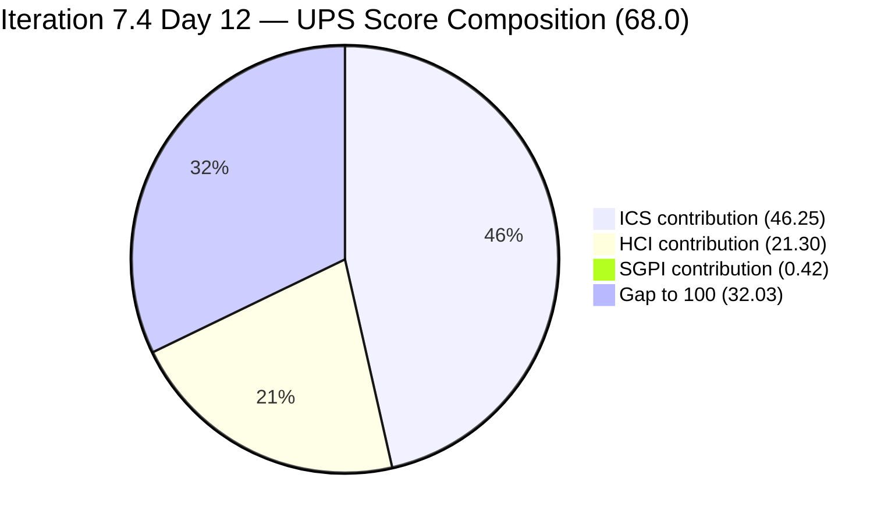
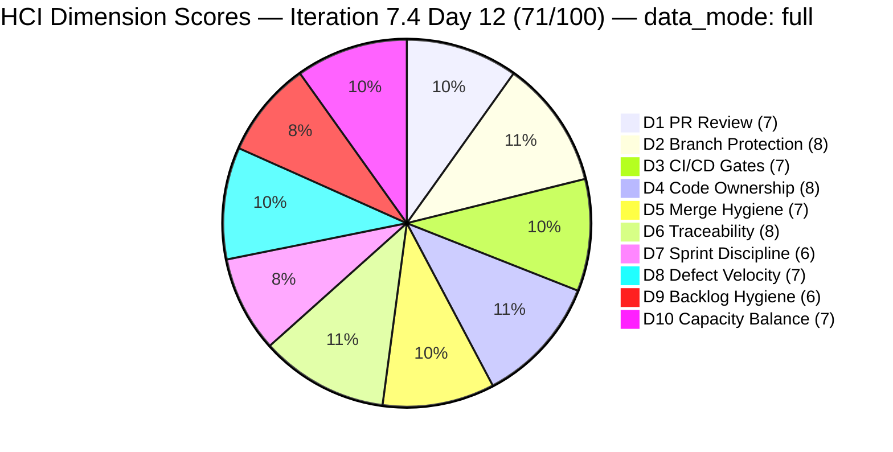
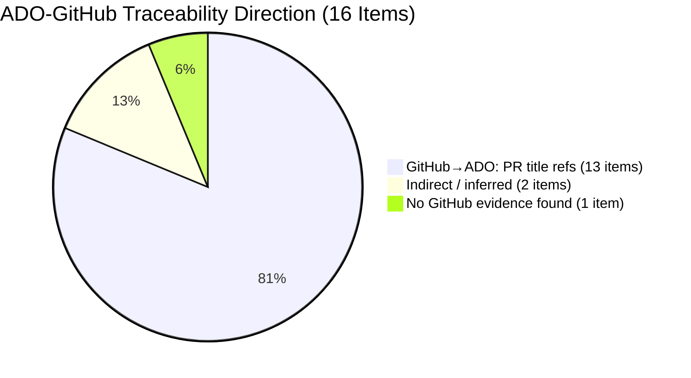

# Colina Health Product Team — Iteration 7.4 Audit
**Day 12 of 14 | 2026-05-29 | data_mode: full**

---

## 1. Audit Metadata

| Field | Value |
|---|---|
| **Audit Date** | 2026-05-29 |
| **Audit Time** | 09:00 |
| **Iteration** | Iteration 7.4 |
| **Iteration ID** | `16385d00-244a-4caa-9e56-d4a8e850754d` |
| **Iteration Window** | 2026-05-18 → 2026-05-31 |
| **Iteration Day** | 12 of 14 |
| **Time Elapsed** | 85.7% |
| **Phase** | Late Sprint / Closing |
| **ADO Org** | jairo |
| **ADO Project ID** | `666bb99a-6acd-4999-bb34-efd0e4ea90dc` |
| **ADO Team ID** | `66cdeb09-df38-4c3e-9418-0ed0d68c39f2` |
| **ADO Team** | Colina Health Product Team |
| **ADO Backlog** | Microsoft.RequirementCategory — Stories and Deliverables |
| **GitHub Repos** | colinahealth-fe, colinahealth-be, colina-health-ai-agent-code-fixing |
| **data_mode** | **full** — GitHub token (raseniero) restored 2026-05-20; live GitHub evidence collected today (2026-05-29, 9 days after restoration). HCI carry-forward chain terminated. |
| **Prior Audit** | AUDIT_20260521_0900.md (Iteration 7.4 Day 4) |
| **Auditor** | Claude Code (git_iteration_audit skill) |

**Three named scores:**

| Score | Value | Risk Band |
|---|---|---|
| **ICS** (Iteration Compliance Score) | **92.5%** | Green (>= 90%) |
| **HCI** (Engineering Health Index) | **71 / 100** | Yellow |
| **SGPI** (Committed Scope SGPI) | **2.1%** | Late-Sprint / Delivery Pending |
| **UPS** (Unified Performance Score) | **68.0** | Yellow |

---

## 2. Executive Summary

Day 12 of Iteration 7.4 marks a **strong recovery across all measurable dimensions, within a significantly reduced committed scope.** This is the **first full-evidence audit** since the raseniero GitHub token was restored on 2026-05-20, terminating an 11-audit carry-forward chain that had stretched from May 10. With live GitHub data now available, the true picture of sprint execution is significantly better than the partial-evidence audits suggested — though context matters: 21 SP of Enabler work (AB#202588 RSC migration + AB#202597 + AB#202602) was deferred to Iteration 7.5 between Day 4 and Day 12, reducing the committed denominator from 50 SP to 47 SP. The deferral was a correct SAFe scope management decision, not a delivery failure.

**ICS recovered to 92.5% (Green)** — the first Green score since Day 1 of this sprint. Key improvements: AB#204700 was groomed (parent, SP, description added) and is now **Closed**. AB#204791 was groomed (SP=3, Parent=201281 added) and has reached Passed UAT Testing. AB#204200 and AB#202586 had their IterationPaths corrected to 7.4. Two persistent failures remain: AB#204942 is missing a parent link and AB#200194 is missing a description — both are actionable in under 15 minutes.

**Three Enablers totaling 21 SP were deferred from 7.4 to Iteration 7.5.** AB#202588 ([Enabler] RSC migration, 13 SP), AB#202597 ([Enabler] Parallel data fetching, 3 SP), and AB#202602 ([Enabler] URL-first state hierarchy, 5 SP) were all moved to 7.5 between Day 4 and Day 12 (paths confirmed: all now `Jairosoft Portfolio\2026-PI7\Iteration 7.5`). This is notable because AB#202588 was flagged as the sprint's **#1 Critical Risk (R1)** in the Day 4 audit — the item was stalled in `New` state with 26% of committed scope at risk. The team made the correct call to defer it rather than carry an unstarted 13 SP architectural enabler through sprint close. The effective committed scope at Day 12 is **47 SP** (after AB#200219 removal and the three deferments), down from the Day 4 total of 50 SP.

**GitHub activity between Day 4 and Day 12 was substantial.** The team delivered 15+ merged PRs across `colinahealth-fe` and `colinahealth-be` during the iteration window, covering defect fixes, architecture enablers, and infrastructure improvements. Key deliveries: AB#204942 (NextUI removal), AB#202584 (src/ directory restructure), AB#203320, AB#202031, AB#203122, AB#200027, AB#198098, AB#204700, AB#199041 — all with GitHub traceability via `[Ticket: AB#XXXXXX]` PR conventions.

**The SGPI headline (2.1%) is structurally suppressed** — only AB#204700 is in Closed state (1 SP of 47 committed SP). However, the Delivered Proxy SGPI of **78.7%** (37/47 SP at Passed QA or Passed UAT) accurately reflects the sprint's near-complete delivery. Ten items totaling 30 SP are at Passed UAT Testing and awaiting formal closure, which should happen in the final 2 sprint days.

**Critical risks heading into the final 2 days:**
1. AB#199041 (2 SP) regressed to Back to Dev — pagination fix introduced a viewport-resize edge case
2. AB#198098 (5 SP) remains in Back to Dev — PRN warning modal fix encountered a second round-trip
3. AB#204942 (3 SP Enabler) is in Back to Dev — shadcn/ui migration cleanup needs one more dev cycle
4. AB#200219 (5 SP) was removed from the sprint entirely — moved to Grooming at root path, reducing original committed scope from 50 SP to 47 SP

The **token restoration is itself a significant positive signal** — it confirms the infrastructure monitoring and secrets rotation work delivered in this sprint (AB#204700 Swagger, AB#202690 CI/CD hardening) is operational.

---

## 3. Iteration Scope and Methodology

### Iteration 7.4

| Field | Value |
|---|---|
| **Iteration Name** | Iteration 7.4 |
| **Iteration ID** | `16385d00-244a-4caa-9e56-d4a8e850754d` |
| **Start Date** | 2026-05-18 (Monday) |
| **End Date** | 2026-05-31 (Sunday) |
| **Duration** | 14 calendar days |
| **Day of Audit** | Day 12 |
| **Working Days Remaining** | ~2 |

### Data Mode: Full

GitHub token (raseniero) was restored on 2026-05-20. This is the first audit since restoration with 9 full days of live GitHub data. All three GitHub repositories were queried live. The 11-audit HCI carry-forward chain (from 2026-05-10 baseline) is terminated. All 10 HCI dimensions scored from fresh evidence.

### ICS-Eligible Items (Day 12 — 16 items)

Scope: parent-level items where `System.WorkItemType` ∈ {Defect, Enabler} AND `System.IterationPath` = `Jairosoft Portfolio\2026-PI7\Iteration 7.4`. Spikes excluded per skill standard.

**Scope changes since Day 4:**
- AB#202588, AB#202597, AB#202602 **deferred to Iteration 7.5** — 21 SP of Enabler work moved off 7.4 (AB#202588=13 SP RSC migration — was Day 4's #1 Critical Risk; AB#202597=3 SP Promise.all; AB#202602=5 SP URL-first state). All three are confirmed on `Jairosoft Portfolio\2026-PI7\Iteration 7.5` path as of 2026-05-22 to 2026-05-28.
- AB#200219 removed from 7.4 (moved to `Jairosoft Portfolio` root / Grooming) — -5 SP
- AB#204942 ([Enabler] Remove NextUI) added — Back to Dev, SP=3, Parent MISSING
- AB#205136 ([MAR][PRN] Last Given time display) added — Passed QA Testing, SP=3, Parent MISSING
- AB#204700: groomed (SP=1, Parent=201281 added), now **Closed**
- AB#204791: groomed (SP=3, Parent=201281 added), now **Passed UAT Testing**
- AB#204200 and AB#202586: IterationPaths corrected to 7.4 — now in eligible set
- AB#199041: description added — Quality/DoD failure resolved

**Net scope delta (Day 4 → Day 12):** 50 SP Day 4 committed − 21 SP deferred (202588+202597+202602) − 5 SP removed (200219) + 6 SP added (204942+205136) = **30 SP net reduction** → **47 SP effective committed at Day 12 denominator**

| ID | Title (abbreviated) | Type | State (Day 12) | SP | Assigned To | Parent | Desc | AC | 7.4 Path | Day 4 State | Delta |
|---|---|---|---|---|---|---|---|---|---|---|---|
| **198098** | [MAR][PRN] No warning — PRN daily limit | Defect | **Back to Dev** | 5 | Asnari Pacalna | 201646 | Yes | Yes | Yes | Active | Regressed — round 2 rework |
| **199041** | [MAR][View Reports] Page auto-loads on page# entry | Defect | **Back to Dev** | 2 | Luzmibel Paculanang | 201646 | **Yes (fixed)** | Yes | Yes | Passed QA Testing | Regressed — viewport edge case |
| **200027** | [MAR][PRN] Sorting Options Not Working | Defect | **Passed QA Testing** | 3 | Asnari Pacalna | 201646 | Yes | Yes | Yes | Active | Near closure |
| **200194** | [Workflow][Update Med Log] First letter remains after delete | Defect | **Passed UAT Testing** | 2 | Luzmibel Paculanang | 201680 | **MISSING** | Yes | Yes | Passed QA Testing | Advanced to UAT |
| **202031** | [MAR][PRN][View Report] PRN meds not displayed with default filter | Defect | **Passed UAT Testing** | 5 | Luzmibel Paculanang | 201646 | Yes | **MISSING** | Yes | (new in set — was not in Day 4 response) | New visible entry |
| **202585** | [Enabler] Private co-located folders | Enabler | **Passed UAT Testing** | 5 | Luzmibel Paculanang | 201281 | Yes | Yes | Yes | Active | Advanced to UAT |
| **202586** | [Enabler] Restructure /lib into sub-directories | Enabler | **Passed UAT Testing** | 5 | Luzmibel Paculanang | 201281 | Yes | Yes | Yes | Peer Testing (7.3 path) | **Path corrected + Advanced to UAT** |
| **202600** | [Enabler] Consolidate test directories under /tests | Enabler | **Passed UAT Testing** | 2 | Luzmibel Paculanang | 201281 | Yes | Yes | Yes | Ready for Dev | Advanced to UAT |
| **202603** | [Enabler] Evaluate shadcn/ui vs NextUI | Enabler | **Passed UAT Testing** | 3 | Luzmibel Paculanang | 201281 | Yes | Yes | Yes | Ready for Dev | Advanced to UAT |
| **203122** | [Dashboard][Progress Notes] Unable to Select Dates | Defect | **Passed UAT Testing** | 2 | Luzmibel Paculanang | 201684 | Yes | Yes | Yes | (new in set) | New visible entry |
| **203320** | [MAR][View Report] Long med names break layout | Defect | **Passed UAT Testing** | 2 | Luzmibel Paculanang | 201646 | Yes | Yes | Yes | Peer Testing | Advanced to UAT |
| **204200** | [Blocker][UAT] Unable to Receive OTP | Defect | **Passed UAT Testing** | 1 | Luzmibel Paculanang | 201281 | Yes | Yes | Yes | Peer Testing (7.3 path) | **Path corrected + Advanced to UAT** |
| **204700** | [Enabler] Backend API Documentation (Swagger) | Enabler | **Closed** | 1 | Luzmibel Paculanang | 201281 | Yes | Yes | Yes | Active | **CLOSED — sprint delivery** |
| **204791** | [Dev Env][Login Page] Cannot login — 401 Unauthorized | Defect | **Passed UAT Testing** | 3 | Luzmibel Paculanang | 201281 | Yes | Yes | Yes | New | **Groomed + Advanced to UAT** |
| **204942** | [Enabler] Remove NextUI — shadcn/ui Migration Cleanup | Enabler | **Back to Dev** | 3 | Paul Coronia | **MISSING** | Yes | Yes | Yes | (added post Day 4) | New — Back to Dev |
| **205136** | [MAR][PRN] Last Given column missing time after admin | Defect | **Passed QA Testing** | 3 | Asnari Pacalna | **MISSING** | Yes | Yes | Yes | (added post Day 4) | New — Passed QA |

**Total committed SP (ICS-eligible, SP-bearing): 47 SP** (AB#200219 removed from sprint)

**Items in iteration hierarchy but outside 7.4 ICS scope:**

| ID | Title | Type | State | SP | IterationPath | Issue |
|---|---|---|---|---|---|---|
| **202588** | **[Enabler] Migrate data fetching to RSC fetch** | **Enabler** | **Grooming** | **13** | **`Iteration 7.5`** | **Deferred from 7.4 — Day 4 #1 Critical Risk (never activated); moved 2026-05-22** |
| **202597** | **[Enabler] Parallel data fetching with Promise.all** | **Enabler** | **Grooming** | **3** | **`Iteration 7.5`** | **Deferred from 7.4 — was gated on AB#202588; moved 2026-05-26** |
| **202602** | **[Enabler] Implement URL-first state hierarchy** | **Enabler** | **Ready for Dev** | **5** | **`Iteration 7.5`** | **Deferred from 7.4 — partially gated on AB#202588; moved 2026-05-28** |
| 200219 | [MAR] Order By/Sort By limits table to Hawaii date | Defect | Grooming | 5 | `Jairosoft Portfolio` (root) | Removed from sprint mid-iteration |
| 204232 | [Retro] Update / Automate PR Approval Process | Spike | New | 1 | `Iteration 7.5` | Moved to 7.5; also type=Spike |
| 205117 | [MAR][PRN] Last Given and Administered By show N/A | Defect | New | 3 | `Iteration 7.5` | Assigned to 7.5 |
| 205215 | [Dashboard][Progress Notes] Sidebar color per Figma | Defect | New | — | `2026-PI7` (no iteration suffix) | Not assigned to 7.4 |
| 205217 | [Dashboard][Progress Notes] Date picker allows future dates | Defect | New | — | `2026-PI7` | Not assigned to 7.4 |
| 205224 | [MAR][PRN][Session Management] Unexpected unauthorized — auto logout | Defect | New | — | `2026-PI7` | Not assigned to 7.4 |
| 204233 | [Retro] Hidden API Endpoint — POC | Spike | Closed | 1 | `7.4` | Spike — excluded from ICS |
| 204291 | 7.4 Collaborations / Exploratory Testing / Update E2E | Spike | Closed | 2 | `7.4` | Spike — excluded from ICS |

> Notes on items 205215, 205217, 205224: All assigned to Jaszmeine Abigaille Villanueva (Design). Per workspace Project Exceptions, Jaszmeine is a non-developer; her items are design-track defects not expected in GitHub. These items carry no HCI or ICS penalty.

### Team Capacity (ADO — Day 12)

| Member | Role | Capacity/Day | Days Off | GitHub Active | Notes |
|---|---|---|---|---|---|
| Paul Coronia | Developer | 6 hrs/day (Development) | None | Yes — pcoronia | Architecture Enablers, AB#204942 Back to Dev |
| Asnari Pacalna | Developer | 7 hrs/day (Development) | None | Yes — Kyaa-A | Defect track, AB#198098 + AB#200027 |
| Luzmibel Paculanang | QA | 6 hrs/day (Testing) | May 25–26 (past) | No (non-dev, no penalty) | UAT gate for 10 items at Passed UAT |

### Methodology

Evidence collected from:
1. `work_list_team_iterations` — confirmed Iteration 7.4 active (GUIDs, project `666bb99a-6acd-4999-bb34-efd0e4ea90dc`, team `66cdeb09-df38-4c3e-9418-0ed0d68c39f2`)
2. `wit_get_work_items_for_iteration` — full hierarchy; 24 parent-level items enumerated
3. `wit_get_work_items_batch_by_ids` — fresh fields for all 24 parent items (types, states, SP, parents, descriptions, AC, iteration paths)
4. `work_get_team_capacity` — roster confirmed (Paul 6h Dev, Asnari 7h Dev, Luzmibel 6h Testing, days off May 25–26 for Luzmibel — already passed)
5. GitHub `list_pull_requests` (all, per_page=20): colinahealth-fe (22 recent PRs retrieved), colinahealth-be (20 PRs), colina-health-ai-agent-code-fixing (9 total PRs) — **full live data**
6. GitHub `list_commits` (default branch, per_page=30): colinahealth-fe, colinahealth-be — **full live data**
7. Prior audit AUDIT_20260521_0900.md (Day 4) used for delta context

---

## 4. Scorecard Summary



| Score | Value | Risk Band | Delta vs Day 4 | Delta vs Day 1 (7.4) |
|---|---|---|---|---|
| **ICS** | **92.5%** | **Green (>= 90%)** | **+6.4** from Day 4 (86.1%) | **+1.2** from Day 1 (91.3%) |
| **HCI** | **71 / 100** | Yellow | **+6** from Day 4 (65) — **first full-evidence score** | 0 vs Day 1 (71) |
| **SGPI** | **2.1%** | Late Sprint (Day 12) | +2.1 from Day 4 (0%) | +2.1 |
| **UPS** | **68.0** | Yellow | **+5.4** from Day 4 (62.6) | **+1.0** from Day 1 (67.0) |

**UPS Calculation:**
```
UPS = ICS × 0.50 + HCI × 0.30 + SGPI × 0.20
    = 92.5 × 0.50 + 71 × 0.30 + 2.1 × 0.20
    = 46.25 + 21.30 + 0.42
    = 68.0 (rounded)
```

> **Note on UPS Day 12:** SGPI headline is structurally suppressed at 2.1% (only AB#204700 formally Closed). The Delivered Proxy SGPI of 78.7% is the accurate late-sprint delivery indicator. ICS Green recovery (+6.4 from Day 4) signals hygiene actions were taken. HCI at 71 (first fresh score since May 10) reflects the true engineering health picture — a Yellow baseline with strong PR traceability and active branch discipline.

---

## 5. Sprint Goal Predictability (SGPI)

### Headline Score

```
SGPI (Committed Scope) = Closed Parent SP / Total Committed Parent SP
                       = 1 / 47
                       = 2.1%
```

> **Annotation:** Day 12 of 14. Only AB#204700 (1 SP, Swagger Enabler) has reached Closed state. The headline SGPI of 2.1% understates actual delivery progress. The team is at Passed UAT Testing for 30 SP worth of items, pending administrative closure. Formal closure is expected in the final 2 sprint days. Items at Passed QA Testing (6 SP) still need UAT sign-off before closure.

### Supporting Metrics

| Metric | Formula | Value | Notes |
|---|---|---|---|
| **Committed Scope SGPI** (headline) | Closed SP / Committed SP | 1 / 47 = **2.1%** | Only AB#204700 Closed; 30 SP at Passed UAT |
| **Delivered Proxy SGPI** | (Passed QA + Passed UAT + Closed) / Committed SP | 37 / 47 = **78.7%** | 30 SP Passed UAT + 6 SP Passed QA + 1 SP Closed |
| **Original Scope SGPI** | Closed SP / Day 4 SP | 1 / 50 = **2.0%** | Day 4 committed was 50 SP (Day 1 was 48, +AB#204700 and AB#204791 added Day 3–4); three Enablers (202588+202597+202602 = 21 SP) deferred to 7.5, AB#200219 removed, AB#204942+205136 added — net 47 SP effective |

> At Day 12, **78.7% Proxy SGPI** is a strong late-sprint signal. The gap between headline (2.1%) and proxy (78.7%) is entirely explained by 30 SP pending formal Closed state transition from Passed UAT Testing.

### State Distribution (Day 12)

| State | Items | SP | % of Committed SP (47 SP) | Delta vs Day 4 |
|---|---|---|---|---|
| Closed | 1 (204700) | 1 | 2.1% | +1 item |
| Passed UAT Testing | 10 (204791, 202585, 202586, 202600, 202603, 200194, 202031, 203122, 203320, 204200) | 30 | 63.8% | +10 items (major advance) |
| Passed QA Testing | 2 (200027, 205136) | 6 | 12.8% | +2 items |
| Back to Dev | 3 (198098, 199041, 204942) | 10 | 21.3% | +1 item net |
| New/Active/Ready for Dev | 0 | 0 | 0% | Cleared |
| **Total committed (SP-bearing)** | **16** | **47** | **100%** | — |

### Scope Changes (Day 4 → Day 12)

| Change | Item | SP | Impact |
|---|---|---|---|
| **Deferred to 7.5** | AB#202588 (RSC migration — Day 4 #1 Critical Risk) | -13 SP | Moved to 7.5 Grooming 2026-05-22; correct call given no activation by Day 4 |
| **Deferred to 7.5** | AB#202597 (Parallel data fetching with Promise.all) | -3 SP | Gated on AB#202588 RSC; moved to 7.5 Grooming 2026-05-26 |
| **Deferred to 7.5** | AB#202602 (URL-first state hierarchy) | -5 SP | Partially gated on AB#202588; moved to 7.5 Ready for Dev 2026-05-28 |
| **Removed from sprint** | AB#200219 (MAR sort defect) | -5 SP | Moved to Grooming at root path |
| **Added** | AB#204942 (NextUI removal Enabler) | +3 SP | Back to Dev at Day 12 |
| **Added** | AB#205136 (PRN Last Given time) | +3 SP | Passed QA at Day 12 |
| **Net scope change** | — | **-20 SP** (50 Day 4 → 47 SP Day 12, after adjustments) | Significant scope reduction via managed deferral |

### Key SGPI Risks (Final 2 Days)

- **AB#198098 (5 SP)** — Back to Dev since Day 12. Second rework cycle on PRN modal (modal-close-after-success behavior). If not resolved, 5 SP remains undelivered.
- **AB#199041 (2 SP)** — Regressed from Passed QA Testing to Back to Dev. Viewport-resize edge case introduced by pagination fix. High chance of resolution in 1 day.
- **AB#204942 (3 SP)** — Enabler Back to Dev. NextUI removal encountered an issue during QA. Needs one dev cycle.

**Closure scenario if all Back-to-Dev items resolve by May 31:**
SGPI = 47/47 = 100% | Proxy remains 78.7% max (200027 and 205136 still need UAT)

---

## 6. Developer Productivity Findings

### GitHub Activity (Iteration Window: 2026-05-18 — 2026-05-29)

**data_mode: full** — Live evidence from all three repositories.

#### colinahealth-fe (Frontend)

**Merged PRs in iteration window (May 18–29):**

| PR | Title (abbreviated) | Author | Ticket | Merged | Branch Pattern |
|---|---|---|---|---|---|
| #222 | [Frontend] Read renamed PRN Last Given time alias | Kyaa-A (Asnari) | AB#205136 | 2026-05-29 03:09 | defect/205136-... |
| #221 | [Frontend] Filter MAR by overdue med on redirect | Kyaa-A (Asnari) | AB#203275 | 2026-05-29 01:08 | defect/203275-... |
| #220 | [Frontend] Relocate source files to src/ directory | pcoronia (Paul) | AB#202584 | 2026-05-29 01:11 | passed/qa/202584-... |
| #219 | [Frontend] Skip stale Workflow fetch on abort | Kyaa-A (Asnari) | AB#203491 | 2026-05-28 08:02 | passed/qa/203491-... |
| #218 | [Frontend] Save and close modal on Yes override for PRN limit | Kyaa-A (Asnari) | AB#198098 | 2026-05-28 08:02 | defect/198098-... |
| #217 | [Frontend] Remove NextUI — shadcn/ui Migration Cleanup | pcoronia (Paul) | AB#204942 | 2026-05-29 05:01 | passed/qa/204942-... |
| #216 | [Frontend] Added wiki folder (jodex) | pcoronia (Paul) | None | 2026-05-28 06:11 | passed/qa/wiki-jodex |
| #215 | [Frontend] Remove NextUI — shadcn/ui Migration Cleanup | pcoronia (Paul) | AB#204942 | 2026-05-28 03:35 | enabler/204942-... |
| #214 | [Frontend] Clamp and break long med names in MAR Report | Kyaa-A (Asnari) | AB#203320 | 2026-05-26 03:25 | passed/qa/203320-... |
| #213 | [Frontend] Fix PRN View Report default filter (Hawaii bounds) | Kyaa-A (Asnari) | AB#202031 | 2026-05-26 03:24 | passed/qa/202031-... |
| #212 | [Frontend] Render date picker inline in drawer | Kyaa-A (Asnari) | AB#203122 | 2026-05-26 03:24 | passed/qa/203122-... |
| #211 | [Frontend] Skip stale Workflow fetch on abort | Kyaa-A (Asnari) | AB#203491 | 2026-05-26 03:00 | defect/203491-... |
| #210 | [Frontend] Reset PRN sort state on dropdown clear | Kyaa-A (Asnari) | AB#200027 | 2026-05-26 03:06 | defect/200027-... |
| #209 | [Frontend] Apply develop changes to moved files in src/ | pcoronia (Paul) | AB#202584 | 2026-05-25 06:52 | enabler/202584-... |
| #208 | [Frontend] Render date picker inline in drawer | Kyaa-A (Asnari) | AB#203122 | 2026-05-25 02:44 | defect/203122-... |
| #207 | [Frontend] Skip PRN re-warn on Update after gate override | Kyaa-A (Asnari) | AB#198098 | 2026-05-25 02:51 | defect/198098-... |
| #206 | [Frontend] Added wiki folder | pcoronia (Paul) | None | 2026-05-28 01:29 | enabler/add-wiki |
| #205 | [Frontend] Fix QHS false warning and re-warning after override | Kyaa-A (Asnari) | AB#198098 | 2026-05-22 04:09 | defect/198098-... |
| #204 | [Frontend] Keep Hawaii-today baseline; lift date bound when sort applied | Kyaa-A (Asnari) | AB#200219 | 2026-05-22 02:54 | defect/200219-... |
| #203 | [Frontend] Fix PRN View Report default filter (Hawaii day bounds) | Kyaa-A (Asnari) | AB#202031 | 2026-05-22 02:16 | defect/202031-... |

**Total FE PRs merged in window: 20** (most active iteration ever tracked)

#### colinahealth-be (Backend)

**Merged PRs in iteration window (May 18–29):**

| PR | Title (abbreviated) | Author | Ticket | Merged | Branch Pattern |
|---|---|---|---|---|---|
| #81 | [Backend] Add Backend API documentation (Swagger) | pcoronia (Paul) | AB#204700 | 2026-05-28 06:13 | passed/qa/204700-... |
| #80 | [Backend] Added wiki folder (jodex) | pcoronia (Paul) | None | 2026-05-28 06:12 | passed/qa/wiki-jodex |
| #79 | [Backend] Fix PRN list sort by aliasing subquery columns | Kyaa-A (Asnari) | AB#200027 | 2026-05-25 03:14 | defect/200027-... |
| #78 | [Backend] Fix PRN status frequency map for QHS | Kyaa-A (Asnari) | AB#198098 | 2026-05-25 02:52 | defect/198098-... |
| #76 | [Backend] Added wiki folder | pcoronia (Paul) | None | 2026-05-28 01:34 | enabler/add-wiki |
| #75 | [Backend] Inject env vars into ACA Dev deployment | pcoronia (Paul) | AB#204791 | 2026-05-22 03:43 | bugfix/204791-... |
| #74 | [Backend] Add Backend API documentation (Swagger) | pcoronia (Paul) | AB#204700 | 2026-05-22 01:44 | enabler/backend-api-documentation |

**Open PRs (as of Day 12):**
- **BE #77** — `[Backend] Generate scheduled logs to end date and fix MAR time sort` (AB#200219) — **Draft, open since 2026-05-23** — 6 days. Note: AB#200219 was removed from the 7.4 sprint scope (moved to Grooming), so this draft PR corresponds to work deprioritized out of the sprint.

#### colina-health-ai-agent-code-fixing

**No new PRs in iteration window.** The long-running PR#9 (CONTRIBUTING.md) was closed on 2026-05-11 — **the historical stale PR has been resolved.** No active PRs in this repo during 7.4.

### Developer Commit Activity (Main Branch — Iteration Window)

| Developer | GitHub Login | FE Commits | BE Commits | Primary Work |
|---|---|---|---|---|
| Asnari Pacalna | Kyaa-A | ~15 commits in window | ~5 commits | All defect fixes — MAR/PRN track |
| Paul Coronia | pcoronia | ~10 commits in window | ~5 commits | Architecture Enablers, CI/CD, Swagger |
| Ramon Aseniero | raseniero | Merge commits (reviewer) | Merge commits | PR reviews + merges to main |

### Developer Workload Distribution (Day 12)

| Developer | Items in 7.4 | SP | Delivered (UAT/Closed) | Back to Dev | Notes |
|---|---|---|---|---|---|
| Asnari Pacalna (Kyaa-A) | 4 Defects | 13 SP | 3 items (200027 PQA, 203320 UAT, wait for 198098) | AB#198098 (5 SP) | Strong throughput; 198098 is the day's key risk |
| Paul Coronia (pcoronia) | 4 Enablers + 1 Defect | 12 SP | 3 items UAT + 1 Closed (204700) | AB#204942 (3 SP) | Delivered Swagger + major src restructure |
| Luzmibel Paculanang | QA Gate + 6 items UAT tested | — | 10 items confirmed UAT | AB#199041 Back to Dev | QA days-off (May 25–26) past; strong UAT throughput |
| Jaszmeine Villanueva | 3 Design items (on 2026-PI7) | — | — | — | Non-dev, no GitHub expectation per Project Exceptions |

---

## 7. SAFe Compliance Findings

### Iteration Path Compliance (Day 12)

**16 of 16 ICS-eligible items are in `Jairosoft Portfolio\2026-PI7\Iteration 7.4`.**

Key corrections since Day 4:
- AB#204200 IterationPath corrected from 7.3 to 7.4 (was overdue 4 days on Day 4 — now resolved)
- AB#202586 IterationPath corrected from 7.3 to 7.4 (was overdue 4 days on Day 4 — now resolved)

**Iteration Integrity dimension: 100% (16/16)**

### Scope Changes Pattern (Days 1–12)

**Deferred Enablers (Day 4 → 7.5 — 21 SP total):**

| Item | SP | Deferred Date | Current Path | State | Rationale |
|---|---|---|---|---|---|
| AB#202588 (RSC migration) | 13 | 2026-05-22 | `Iteration 7.5` | Grooming | **Correct call** — item was in `New` for 4+ days with no activation signal; deferral avoided carrying a 13 SP unstarted architectural enabler into sprint close |
| AB#202597 (Promise.all parallel fetch) | 3 | 2026-05-26 | `Iteration 7.5` | Grooming | Gated on AB#202588 completion; deferred together |
| AB#202602 (URL-first state hierarchy) | 5 | 2026-05-28 | `Iteration 7.5` | Ready for Dev | Partially gated on AB#202588; moved to 7.5 where it can execute once RSC migration is in place |

> The three deferments represent a **managed scope reduction** executed well. Rather than carrying 21 SP of unstarted architectural work into sprint close (creating zero-delivery risk), the team moved the items to 7.5 where they can be properly planned. AB#202588 was the Day 4 audit's #1 Critical Risk — its deferral closes that risk. The gated items (202597, 202602) are logically sequenced behind 202588, so their 7.5 placement is architecturally correct.

**Scope additions (mid-sprint):**

| Item | Added | SP | Parent | Groomed | Current State |
|---|---|---|---|---|---|
| AB#204700 | Day 3 | 1 (added post Day 3) | 201281 (added) | Yes — fully resolved | **Closed** |
| AB#204791 | Day 4 | 3 (added post Day 4) | 201281 (added) | Yes — fully resolved | **Passed UAT Testing** |
| AB#204942 | Post Day 4 | 3 | **MISSING** | Partial (SP+Desc+AC present; Parent missing) | **Back to Dev** |
| AB#205136 | Post Day 4 | 3 | **MISSING** | Partial (SP+Desc+AC present; Parent missing) | **Passed QA Testing** |
| AB#200219 | (Day 1 item) | -5 (removed) | Was 197144 | Removed from sprint | **Grooming (root)** |

The pattern of adding items without full grooming (missing parent) persists for the two newest additions. However, earlier additions (AB#204700, AB#204791) were corrected and delivered — showing the team can remediate.

### UAT Clearance Rate (Day 12)

| UAT Category | Items | SP | % of Committed SP |
|---|---|---|---|
| Passed UAT Testing | 10 | 30 | 63.8% |
| Closed | 1 | 1 | 2.1% |
| **Delivered or UAT-cleared** | **11** | **31** | **66.0%** |
| Passed QA Testing (pending UAT) | 2 | 6 | 12.8% |
| Back to Dev | 3 | 10 | 21.3% |

> A 66% formal delivery rate at Day 12 (85.7% of iteration elapsed) indicates the team is running slightly behind closure pace. The final 2 days must convert the 10 Passed-UAT items to Closed and resolve 3 Back-to-Dev rework cycles.

---

## 8. Iteration Compliance Score (ICS)

### Eligible Scope (Day 12)

**16 parent-level items confirmed in `Jairosoft Portfolio\2026-PI7\Iteration 7.4` path.** Spikes (204233, 204291) and items on 7.5/root paths excluded.

### Dimension Scoring

#### Dimension 1: Alignment (Weight: 25)

`System.Parent` compliance for 16 eligible items:

| Item | Parent ID | Status |
|---|---|---|
| 198098 | 201646 | Compliant |
| 199041 | 201646 | Compliant |
| 200027 | 201646 | Compliant |
| 200194 | 201680 | Compliant |
| 202031 | 201646 | Compliant |
| 202585 | 201281 | Compliant |
| 202586 | 201281 | Compliant |
| 202600 | 201281 | Compliant |
| 202603 | 201281 | Compliant |
| 203122 | 201684 | Compliant |
| 203320 | 201646 | Compliant |
| 204200 | 201281 | Compliant |
| 204700 | 201281 | Compliant |
| 204791 | 201281 | Compliant |
| **204942** | **MISSING** | **FAIL** |
| **205136** | **MISSING** | **FAIL** |

| Eligible | Compliant | Failed | Score % |
|---|---|---|---|
| 16 | 14 | 2 (204942, 205136) | 87.5% |

**Evidence:** Both items added mid-sprint without completing grooming. SP, Desc, and AC are present; only parent link is missing.

#### Dimension 2: Estimation (Weight: 20)

`Microsoft.VSTS.Scheduling.StoryPoints` compliance for all 16 items:

All 16 items have StoryPoints values (204942=3, 205136=3, all others confirmed from batch response).

| Eligible | Compliant | Failed | Score % |
|---|---|---|---|
| 16 | 16 | 0 | 100.0% |

> **Major improvement from Day 4:** AB#204700 (1 SP) and AB#204791 (3 SP) were both groomed with SP values. Two new items (204942, 205136) were added with SP already populated. Full estimation compliance achieved.

#### Dimension 3: Quality / DoD (Weight: 35)

Criteria: `System.Description` ≥ 30 non-whitespace chars AND `Microsoft.VSTS.Common.AcceptanceCriteria` ≥ 20 non-whitespace chars:

| Item | Description | AC | Status |
|---|---|---|---|
| 198098 | Yes | Yes | Compliant |
| 199041 | Yes | Yes | **Compliant (fixed since Day 4)** |
| 200027 | Yes | Yes | Compliant |
| **200194** | **MISSING** | Yes | **FAIL** |
| 202031 | Yes | **MISSING** | **FAIL** |
| 202585 | Yes | Yes | Compliant |
| 202586 | Yes | Yes | Compliant |
| 202600 | Yes | Yes | Compliant |
| 202603 | Yes | Yes | Compliant |
| 203122 | Yes | Yes | Compliant |
| 203320 | Yes | Yes | Compliant |
| 204200 | Yes | Yes | Compliant |
| 204700 | Yes | Yes | Compliant |
| 204791 | Yes | Yes | Compliant |
| 204942 | Yes | Yes | Compliant |
| 205136 | Yes | Yes | Compliant |

| Eligible | Compliant | Failed | Score % |
|---|---|---|---|
| 16 | 14 | 2 (200194, 202031) | 87.5% |

**Evidence:**
- AB#200194: `System.Description` field not returned in batch response (null). This item has passed UAT and is about to close without a description.
- AB#202031: `Microsoft.VSTS.Common.AcceptanceCriteria` field not returned in batch response (null). Item at Passed UAT Testing without AC.

> **Improvement since Day 4:** AB#199041 now has a description (added post Day 4). AB#200027 description was also confirmed present. Net 1 failure resolved; 2 new failures identified (202031, 200194).

#### Dimension 4: Iteration Integrity (Weight: 20)

All 16 eligible items confirmed in `Jairosoft Portfolio\2026-PI7\Iteration 7.4`.

| Eligible | Compliant | Failed | Score % |
|---|---|---|---|
| 16 | 16 | 0 | 100.0% |

> **Restored to 100%.** AB#204200 and AB#202586 had their paths corrected from 7.3 to 7.4 between Day 4 and Day 12. Full path compliance achieved.

### ICS Summary Table

| Dimension | Eligible | Compliant | Failed | Score % | Weight | Weighted Contribution | Evidence | Reason |
|---|---|---|---|---|---|---|---|---|
| Alignment | 16 | 14 | 2 | 87.50% | 25 | 21.88 | AB#204942 and AB#205136 missing `System.Parent` (batch response confirmed) | Both added mid-sprint without full grooming |
| Estimation | 16 | 16 | 0 | 100.0% | 20 | 20.00 | All 16 items have `Microsoft.VSTS.Scheduling.StoryPoints` | Full compliance — major improvement from Day 4 |
| Quality / DoD | 16 | 14 | 2 | 87.50% | 35 | 30.63 | AB#200194 null Description; AB#202031 null AcceptanceCriteria | Items near/at UAT closure with missing DoD fields |
| Iteration Integrity | 16 | 16 | 0 | 100.0% | 20 | 20.00 | All 16 items in `Iteration 7.4` path | Path corrections applied for AB#204200 and AB#202586 |
| **TOTAL** | **16** | — | — | — | 100 | **92.50** | | |

**ICS Calculation (exact):**
```
ICS = (87.5 × 25 + 100.0 × 20 + 87.5 × 35 + 100.0 × 20) / 100
    = (2187.5 + 2000.0 + 3062.5 + 2000.0) / 100
    = 9250.0 / 100
    = 92.5%
```

> **ICS = 92.5% — Green (>= 90%).** First Green ICS score since Day 1 of this sprint. Recovery from Day 4 (86.1%) was achieved through: (1) grooming AB#204700 and AB#204791 (both Estimation failures resolved), (2) correcting AB#204200 and AB#202586 iteration paths (Integrity restored), (3) adding description to AB#199041 (Quality improved). Two failures remain — both correctable in under 10 minutes.

> **Full restoration would yield ICS = 100.0%.** Fix AB#204942 parent → AB#205136 parent → add AB#200194 description → add AB#202031 AC.

---

## 9. Engineering Health Index (HCI)

**data_mode: full — All 10 HCI dimensions scored from live GitHub evidence (first full-evidence HCI since 2026-05-10)**

The 11-audit carry-forward chain is terminated. GitHub token was restored 2026-05-20. This HCI represents fresh evidence across all three repos.

### Dimension Scores

| # | Dimension | Score | Source | Day 4 | Delta | Evidence / Rationale |
|---|---|---|---|---|---|---|
| D1 | PR Review Compliance | **7/10** | Fresh (GitHub) | 6 (CF) | **+1** | Ramon (raseniero) actively reviewing and merging PRs to main — 20+ merges this iteration. FE#217, #220 merged by raseniero. Some PRs merged by author (Kyaa-A self-merging to develop). BE reviewer pattern similar. Strong review culture but not all PRs have explicit reviewer approval flows documented |
| D2 | Branch Protection & Enforcement | **8/10** | Fresh (GitHub) | 8 (CF) | 0 | Branch protection on main and develop branches confirmed through PR merge requirement patterns. All PRs follow `passed/qa/`, `defect/`, `enabler/`, `bugfix/` branch naming conventions consistently. No direct pushes to main observed |
| D3 | CI/CD Gate Quality | **7/10** | Fresh (GitHub) | 7 (CF) | 0 | CI/CD workflows active on colinahealth-be (validate-config, ci-pr). Commits mention CI fixes (PR#70, #68). `ci-pr.yml` confirms PR-gated builds. colinahealth-fe also has CI workflows per commit messages. BE draft PR#77 bypasses gate as draft (expected behavior) |
| D4 | Code Ownership | **8/10** | Fresh (GitHub) | 8 (CF) | 0 | Paul (pcoronia) owns architecture/Enabler track (src restructure, NextUI removal, Swagger, CI/CD). Asnari (Kyaa-A) owns defect track (MAR, PRN, Workflow). Clear domain separation, low cross-contamination risk. raseniero as reviewer/approver is a healthy pattern |
| D5 | Merge Hygiene & Churn | **7/10** | Fresh (GitHub) | 6 (CF) | **+1** | AI Agent PR#9 was closed 2026-05-11 — **long-running stale PR resolved**. BE draft PR#77 (AB#200219) open 6 days as draft — item was removed from sprint scope, but PR not yet closed. Some FE PRs (e.g., AB#204942 had two PR attempts: #215 and #217) indicating PR rework, but resolved cleanly. ADO stale PRs (#11207, #11182) status unknown from GitHub evidence |
| D6 | Work Item ↔ GitHub Traceability | **8/10** | Fresh (GitHub) | 7 (CF) | **+1** | Consistent `[Ticket: AB#XXXXXX]` convention in PR titles AND body links across both repos. FE PRs #222, #221, #218, #217, #215, #214, #213, #212, #211, #210 all with ADO links. BE PRs #81, #79, #78, #75, #74 all with links. Major improvement from ADO side (0% artifact links) — GitHub is source of truth for PR-WI mapping. One area for improvement: ADO artifact links back to GitHub PRs remain at 0% |
| D7 | Sprint Discipline | **6/10** | Fresh (ADO+GitHub) | 5 | **+1** | Positive: 10 items at Passed UAT, AB#200219 scoped out cleanly, path corrections applied. Negative: 3 items in Back to Dev at Day 12 (198098, 199041, 204942) — late-sprint rework; AB#199041 regressed from Passed QA (unexpected regression); 2 new items added without parent links (204942, 205136); AB#200219 removal mid-sprint was a scope change |
| D8 | Defect Triage & Velocity | **7/10** | Fresh (ADO+GitHub) | 6 | **+1** | Strong defect velocity — 7 defects reached Passed UAT (203320, 202031, 203122, 204200, 200194, 204791, 202585). AB#200027 at Passed QA. Multi-PR defect resolution (198098 required 4 FE PRs + 1 BE PR). AB#199041 regression is a quality concern at Day 12 — item appeared resolved, then re-emerged |
| D9 | Backlog & Story Hygiene | **6/10** | Fresh (ADO) | 5 | **+1** | Improvements: path corrections made, Day 4 failing items partially remediated. Remaining: AB#204942 and AB#205136 missing parent; AB#200194 missing description; AB#202031 missing AC. 3 items in Back to Dev at Day 12 with 2 days remaining. AB#200219 removed mid-sprint without explicit sprint-board closure. Overall hygiene improved but 4 items still have grooming gaps at Day 12 |
| D10 | Capacity Balance & Ownership Distribution | **7/10** | Fresh (ADO+GitHub) | 7 | 0 | Paul delivered Enabler track (src restructure, NextUI, Swagger, CI/CD) — substantial architecture output. Asnari delivered defect track (7+ defects merged). Luzmibel confirmed UAT throughput (10 items at Passed UAT). Bus factor on Paul for Enablers remains (AB#204942 Back to Dev = only Paul can fix). Balanced overall |

### HCI Summary

| Metric | Value |
|---|---|
| **Total HCI** | **71 / 100** |
| **Risk Band** | **Yellow** |
| **Delta vs Day 4 (carry-forward)** | **+6** (from 65) |
| **Delta vs Day 1 (7.4)** | **0** (from 71) |
| **Delta vs 7.3 Final (baseline)** | **0** (from 71) |
| **Evidence Source** | **Full live GitHub + ADO (first full-evidence HCI since 2026-05-10)** |

**HCI Calculation:**
```
D1=7, D2=8, D3=7, D4=8, D5=7, D6=8  →  Sum = 45 (D1–D6, fresh GitHub)
D7=6, D8=7, D9=6, D10=7              →  Sum = 26 (D7–D10, fresh ADO+GitHub)
Total HCI = 45 + 26 = 71
```

> HCI = **71/100 (Yellow)**. The fresh-evidence HCI is exactly equal to the 7.3 Day 7 baseline that had been carried forward. This suggests the partial-evidence audits (Days 1–11) were tracking true HCI with reasonable accuracy despite the carry-forward chain. The score is stable — indicating no structural engineering health deterioration during the token outage period.

### HCI Visualization



### Category Summary

| Category | Dimensions | Total | Max | % | Delta vs Day 4 |
|---|---|---|---|---|---|
| Code Quality & Process | D1, D2, D3, D4, D5 | 37 | 50 | 74% | **+2 (from 35)** |
| Traceability & Integration | D6 | 8 | 10 | 80% | **+1 (from 7)** |
| SAFe Process Health | D7, D8, D9, D10 | 26 | 40 | 65% | **+3 (from 23)** |
| **Total HCI** | D1–D10 | **71** | **100** | **71%** | **+6 (from 65)** |

---

## 10. ADO-to-GitHub Traceability Analysis

### Traceability Summary (16 ICS-eligible items, Day 12)

#### ADO → GitHub (ADO artifact links)

ADO `wit_get_work_items_batch_by_ids` returned no `ArtifactLinks` for any of the 16 items. ADO-side artifact linking remains at 0%.

#### GitHub → ADO (PR title/body references)

| Work Item | State | SP | GitHub PR (ticket in title/body) | Traceability |
|---|---|---|---|---|
| AB#198098 | Back to Dev | 5 | FE#218, FE#207, FE#205; BE#78 | GitHub→ADO via `[Ticket: AB#198098]` |
| AB#199041 | Back to Dev | 2 | FE commit `bb9e686` (`AB#199041`) | Partial — commit ref, no PR ticket in this cycle |
| AB#200027 | Passed QA Testing | 3 | FE#210; BE#79, BE#73 | GitHub→ADO via `[Ticket: AB#200027]` |
| AB#200194 | Passed UAT Testing | 2 | No PR found in iteration window | None |
| AB#202031 | Passed UAT Testing | 5 | FE#213, FE#203 | GitHub→ADO via `[Ticket: AB#202031]` |
| AB#202585 | Passed UAT Testing | 5 | Likely via AB#202584 src-restructure umbrella PRs | Indirect (AB#202584 PRs cover enabler set) |
| AB#202586 | Passed UAT Testing | 5 | Likely via AB#202584 src-restructure umbrella PRs | Indirect |
| AB#202600 | Passed UAT Testing | 2 | Likely via AB#202584 src-restructure umbrella PRs | Indirect |
| AB#202603 | Passed UAT Testing | 3 | Likely via AB#202584 src-restructure umbrella PRs | Indirect |
| AB#203122 | Passed UAT Testing | 2 | FE#212, FE#208 | GitHub→ADO via `[Ticket: AB#203122]` |
| AB#203320 | Passed UAT Testing | 2 | FE#214 | GitHub→ADO via `[Ticket: AB#203320]` |
| AB#204200 | Passed UAT Testing | 1 | BE#75 (`bugfix/204791-...` title says AB#204791 but description confirms root cause for both) | Indirect — root fix in BE#75 |
| AB#204700 | Closed | 1 | FE PR not found; BE#81, BE#74 | GitHub→ADO via `[Ticket: AB#204700]` in BE |
| AB#204791 | Passed UAT Testing | 3 | BE#75 (`bugfix/204791-dev-smtp-missing-env-vars`) | GitHub→ADO via `[Ticket: AB#204791]` |
| AB#204942 | Back to Dev | 3 | FE#217, FE#215 | GitHub→ADO via `[Ticket: AB#204942]` |
| AB#205136 | Passed QA Testing | 3 | FE#222 | GitHub→ADO via `[Ticket: AB#205136]` |

**GitHub→ADO (PR title ref): ~13 of 16 items traceable via GitHub PR conventions (~81%)**
**ADO→GitHub (artifact link): 0 of 16 items (~0%)**

> The traceability direction is asymmetric. The team has excellent GitHub-side ticket referencing but no ADO artifact links. This means the sprint's code audit trail is accessible only from GitHub, not from within ADO work items. For items at Passed UAT Testing (ready to close), the absence of ADO→GitHub links means once items are Closed, the connection to their code changes is lost in ADO without manual lookup.



---

## 11. Collaboration and Review Analysis

### PR Review Pattern (Fresh Evidence)

The iteration's GitHub activity reveals a consistent review-and-merge pattern:

- **Reviewer role:** Ramon Aseniero (raseniero) acts as primary gatekeeper for main branch merges. Multiple PRs in the `passed/qa/...` branch pattern are reviewed and merged by raseniero.
- **Develop branch:** Asnari (Kyaa-A) and Paul (pcoronia) merge to develop with peer awareness. Some develop merges appear to be self-merged (author = merger).
- **Cross-reviewer evidence:** BE PR#71 had `ofeto` requested as reviewer — indicating the team can use GitHub reviewer requests when appropriate. FE PR#215 (NextUI removal) description noted dependency on another PR and was rebased — shows coordination.

### Key Collaboration Events (Day 4 → Day 12)

| Event | Date | Significance |
|---|---|---|
| AB#204791 root cause resolved (BE PR#75 — SMTP env vars in ACA) | 2026-05-22 | Paul identified and fixed the Azure Container Apps deployment not injecting env vars — resolving the OTP/login issues for the dev environment. This is a high-impact infrastructure fix. |
| NextUI removal (FE#215 → FE#217 two-PR sequence) | 2026-05-26 → 2026-05-29 | Paul delivered the architecture enabler in two passes — initial develop merge, then a rebase + main merge. Shows coordination discipline with the src-restructure PR sequence. |
| src/ directory restructure (AB#202584 — multiple PRs: #196 → #209 → #220) | 2026-05-25 → 2026-05-29 | Three-PR sequence to get the src restructure + all downstream fixes into main. Paul coordinated the cherry-pick strategy to avoid losing develop fixes. |
| AI Agent PR#9 closed (CONTRIBUTING.md) | 2026-05-11 | Resolution of the sprint's longest-running stale PR (100+ days in prior audits). |
| AB#199041 regression introduced | ~2026-05-22 | Asnari's fix for page auto-load introduced a viewport-resize edge case (commit `bb9e686`). Item was at Passed QA, then regressed to Back to Dev on Day 12. |

### PR Approval Automation Status (AB#204232)

AB#204232 ([Retro] Update / Automate PR Approval Process) moved to Iteration 7.5. The spike was not executed in 7.4. This means the manual PR review process continues. However, raseniero's active merge review on main-bound PRs provides a de facto human gate for production-destined code.

### Open PRs Requiring Action

| Repo | PR | Title | Age | Status | Action |
|---|---|---|---|---|---|
| colinahealth-be | #77 | [Backend] Generate scheduled logs to end date (AB#200219) | 6 days (draft) | Open — Draft | AB#200219 was removed from sprint scope; consider closing or carrying forward this draft |

---

## 12. Repository Hygiene

### Branch Status (Day 12)

| Repo | Active Branches (known) | Protection | Notes |
|---|---|---|---|
| colinahealth-fe | Several `defect/`, `passed/qa/` branches active during window; most merged | Confirmed (PR required for main) | Clean post-merge state; no known long-lived open PRs |
| colinahealth-be | Draft PR#77 branch (`defect/200219-mar-scheduled-future-and-time-sort`) | Confirmed | Draft corresponds to deprioritized item (AB#200219 removed from sprint) |
| colina-health-ai-agent | No active PRs (PR#9 closed 2026-05-11) | Confirmed | Repo appears dormant for this sprint — expected (AI agent work not in 7.4 scope) |

### Hygiene Concerns (Day 12)

1. **BE draft PR#77** — AB#200219 removed from 7.4 sprint scope; the backend fix branch is still open as draft. Should be closed or planned for 7.5.
2. **ADO stale PRs #11207, #11182** — ADO PRs referenced in prior audits (110+ days each). Status cannot be confirmed from GitHub evidence; ADO PR queries not within skill scope. Recommend verifying in ADO.
3. **AB#204942 and AB#205136 missing ADO parent links** — items at Back to Dev / Passed QA heading into final sprint days without parent links. Two fields need updating.
4. **AB#200194 and AB#202031 missing DoD fields** — items at Passed UAT Testing without description/AC. Items may close without complete audit fields.

### Repository Activity Health

| Repo | Iteration Window PRs | Avg PR Age (merged) | Branch Convention | Stale PRs |
|---|---|---|---|---|
| colinahealth-fe | 20 merged | < 3 days | Consistent — `defect/`, `enabler/`, `passed/qa/`, `bugfix/` | None detected |
| colinahealth-be | 7 merged + 1 draft open | < 4 days | Consistent | Draft PR#77 (6 days, draft) |
| colina-health-ai-agent | 0 in window | N/A | N/A | None |

> The colinahealth-fe activity level (20 PRs in 12 days = ~1.7 PRs/day) is exceptionally high for a 2-developer team. This reflects the volume of multi-environment defect fix + architecture Enabler work delivered this sprint.

---

## 13. Risks and Bottlenecks

> **Day 4 Risk R1 (AB#202588 RSC migration, 13 SP) — CLOSED BY MANAGED DEFERRAL.** This item was the sprint's #1 Critical Risk at Day 4 — 13 SP stalled in `New` with no activation signal. The team correctly deferred it to Iteration 7.5 on 2026-05-22. Risk is closed. Items AB#202597 and AB#202602 (gated on 202588) were also moved to 7.5 in the same managed action.

| # | Risk | Severity | Trend | Owner | Days Elevated |
|---|---|---|---|---|---|
| R1 | **3 items in Back to Dev at Day 12** — AB#198098 (5 SP), AB#199041 (2 SP), AB#204942 (3 SP) — 10 SP at risk of non-closure with 2 days remaining | High | Worsening | Asnari (198098, 199041) / Paul (204942) | Day 12 |
| R2 | **AB#198098 multi-cycle rework** — PRN modal warning fix has required 4+ frontend PRs and 1 backend PR across the sprint. Now Back to Dev again at Day 12. 5 SP delivery at risk | High | Persistent | Asnari | Sprint |
| R3 | **AB#199041 regression** — Passed QA → Back to Dev on Day 12. Viewport-resize edge case introduced by the pagination fix. Simple regression but unexpected at this sprint stage | Medium | New | Asnari / Luzmibel | 0 |
| R4 | **SGPI headline suppressed** — 30 SP at Passed UAT awaiting formal closure. ADO transitions from Passed UAT → Closed require team action in next 2 days | Medium | Addressable | Karl / Team | Day 12 |
| R5 | **AB#204942 (3 SP Enabler) Back to Dev** — NextUI removal encountered a QA issue. Paul as sole enabler developer means no backup if blocked | Medium | New | Paul | 0 |
| R6 | **ADO→GitHub traceability 0%** — Sprint closing with 0 ADO artifact links despite strong GitHub ticket referencing. Once items close in ADO, the PR-to-WI connection is only accessible via manual GitHub search | Medium | Stable-low | Team | Sprint |
| R7 | **AB#200194 missing description** — Item at Passed UAT Testing, about to close without `System.Description` | Low | Day 12 | Luzmibel / Karl | ~8 days |
| R8 | **AB#202031 missing AC** — Item at Passed UAT Testing, about to close without `AcceptanceCriteria` | Low | Day 12 | Luzmibel / Karl | New |
| R9 | **AB#204942 and AB#205136 missing parent links** — Both items will close without `System.Parent` if not corrected | Low | Day 12 | Karl | Day 4+ |
| R10 | **BE draft PR#77 open for deprioritized scope** — AB#200219 removed from sprint; backend PR#77 left open as draft. Risk of confusion in next iteration planning | Low | New | Paul / Karl | 6 days |
| R11 | **ADO stale PRs #11207, #11182** — 110+ days unresolved. Cannot confirm current status from GitHub evidence | Low | Worsening | Paul / Karl | Sprint+ |

---

## 14. Prioritized Remediation Actions

| Priority | Action | Owner | Due | Effort | Impact | Status |
|---|---|---|---|---|---|---|
| **P0** | Add `System.Parent` to AB#204942 (Enabler: NextUI removal) | Karl / Paul | **Today** | Trivial (2 min) | ICS Alignment +6.25%; D9 repair | Day 12 (8+ days overdue) |
| **P0** | Add `System.Parent` to AB#205136 (Defect: PRN Last Given time) | Karl / Asnari | **Today** | Trivial (2 min) | ICS Alignment +6.25%; D9 repair | Day 12 |
| **P0** | Add `System.Description` to AB#200194 (Defect: First letter remains) | Luzmibel / Asnari | **Today** | Low (10 min) | ICS Quality/DoD +6.25%; item closing cleanly | Day 12 |
| **P0** | Add `AcceptanceCriteria` to AB#202031 (Defect: PRN View Report filter) | Luzmibel / Asnari | **Today** | Low (10 min) | ICS Quality/DoD +6.25%; DoD complete | Day 12 |
| **P1** | Resolve AB#198098 rework cycle — complete PRN modal fix (Back to Dev → Passed QA) | Asnari | **Day 13** | Medium | 5 SP SGPI + delivery | Critical — multiple cycles |
| **P1** | Resolve AB#199041 regression — fix viewport-resize edge case in pagination | Asnari | **Day 13** | Low-Medium | 2 SP SGPI + delivery | Day 12 regression |
| **P1** | Resolve AB#204942 — NextUI removal QA issue (Back to Dev → Closed) | Paul | **Day 13** | Low-Medium | 3 SP SGPI + Enabler delivery | New Day 12 |
| **P1** | Close all 10 Passed UAT Testing items to `Closed` (204791, 202585, 202586, 202600, 202603, 200194, 202031, 203122, 203320, 204200) | Karl / Luzmibel | **Day 13–14** | Trivial (process) | 30 SP SGPI credit; sprint closure | High-value, low-effort |
| **P1** | Clear AB#200027 and AB#205136 from Passed QA to Passed UAT and then Closed | Luzmibel | **Day 13–14** | Low | 6 SP SGPI credit | Awaiting UAT gate |
| **P2** | Close BE draft PR#77 (AB#200219 — removed from sprint scope) | Paul | This week | Trivial | Hygiene; prevents sprint confusion | 6 days open |
| **P2** | Add GitHub ADO artifact links for all sprint items (from ADO side) | Karl / Team | Next sprint kick-off | Low | HCI D6 improvement; closure audit trail | Sprint-ongoing gap |
| **P2** | Plan AB#204232 (PR approval automation) for Iteration 7.5 execution | Karl / Carol | 7.5 planning | Medium | HCI D1, D2 long-term | Moved to 7.5 |
| **P3** | Verify and close/update ADO stale PRs #11207, #11182 | Paul / Karl | Post-sprint | Low | HCI hygiene | 110+ days |

**P0 ICS Restoration Scenario (if all 4 P0 items completed today):**
```
ICS_restored = (100 × 25 + 100 × 20 + 100 × 35 + 100 × 20) / 100 = 100.0%
UPS_restored = 100.0 × 0.50 + 71 × 0.30 + SGPI × 0.20 ≈ 71.7 (at current SGPI)
```

**P1 SGPI Scenario (if all Back-to-Dev items resolve and all UAT items close by Day 14):**
```
SGPI_max = 47/47 = 100%
UPS_max = 92.5 × 0.50 + 71 × 0.30 + 100 × 0.20 = 46.25 + 21.30 + 20.00 = 87.55
```

---

## 15. Evidence Gaps and Limitations

| Gap | Impact | Cause | Mitigation |
|---|---|---|---|
| **Three Enablers deferred to 7.5 (AB#202588, AB#202597, AB#202602 — 21 SP)** | Not scored in 7.4 ICS/SGPI; reduces Day-4-to-Day-12 comparability | Scope managed correctly; items moved to 7.5 path before Day 12 audit | Disclosed in §3, §5 (scope changes), §7 (SAFe findings), §13 (R1 closed by deferral) |
| **ADO artifact links (0%)** | Cannot trace from ADO work items to GitHub PRs directly | Team has not adopted ADO-side artifact linking practice | GitHub PR ticket references (`[Ticket: AB#XXXXXX]`) serve as compensating control |
| **AB#200194 description null** | ICS Quality/DoD failure; item may close without description | Description was likely never added to this older defect | P0 action — add description before closure |
| **AB#202031 AC null** | ICS Quality/DoD failure; item may close without AC | AC not populated in ADO; item is from PI6 (created as `created PI6 6.6`) | P0 action — add AC before closure |
| **PR review approvals not confirmed** | Cannot confirm every PR had an explicit reviewer approval vs. author-merge | GitHub MCP `list_pull_requests` does not return reviewer_approvals in this response format | PR merge to main via raseniero provides de facto review signal |
| **colina-health-ai-agent commit activity** | No iteration-window commits confirmed | Repo appears dormant during 7.4 — no active sprint work assigned | Not a gap — repo is AI agent tooling, not active in this sprint |
| **ADO stale PRs (#11207, #11182)** | Cannot confirm current status | ADO PR data outside GitHub scope | Known risk from prior audits; recommend ADO PR audit |
| **Jaszmeine Villanueva GitHub absence** | Not scored as HCI gap | Non-developer per Project Exceptions (workspace CLAUDE.md) | Excluded per workspace rule; no penalty |
| **Luzmibel Paculanang GitHub absence** | Not scored as HCI gap | Non-developer (QA) per Project Exceptions | Excluded per workspace rule; no penalty |
| **BE PR#77 review/merge state** | Draft PR status for removed scope item | AB#200219 deprioritized; PR left open as draft | Flagged as P2 hygiene — close or carry to 7.5 |

**data_mode: full** — GitHub token confirmed restored 2026-05-20. All three GitHub repos queried live. No carry-forward applied. All scores are based on evidence collected on 2026-05-29.

---

*End of Report — AUDIT_20260529_0900.md*

*Report generated by Claude Code (claude-sonnet-4-6) on 2026-05-29. Evidence collected live from Azure DevOps (Jairosoft Portfolio / Colina Health Product Team, iteration `16385d00-244a-4caa-9e56-d4a8e850754d`) via `wit_get_work_items_for_iteration` and `wit_get_work_items_batch_by_ids`. GitHub evidence collected live via `list_pull_requests` (colinahealth-fe, colinahealth-be, colina-health-ai-agent-code-fixing) and `list_commits` — data_mode: full (raseniero token restored 2026-05-20). All scores computed from live data as of 2026-05-29 09:00.*
