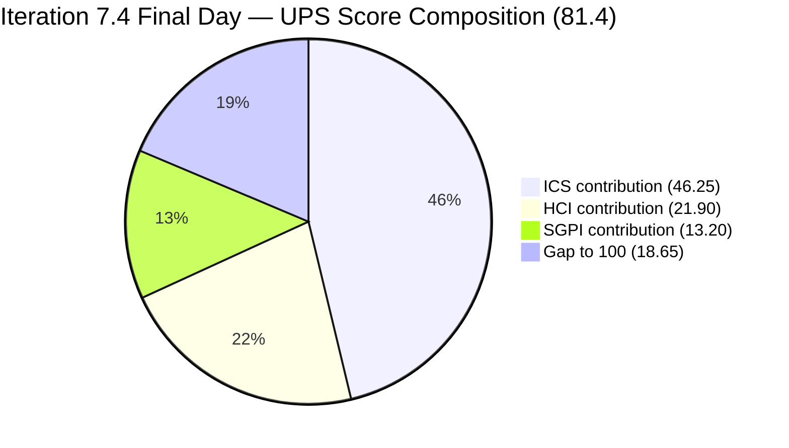
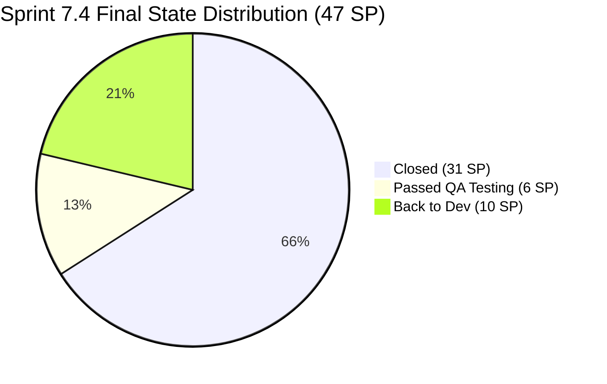
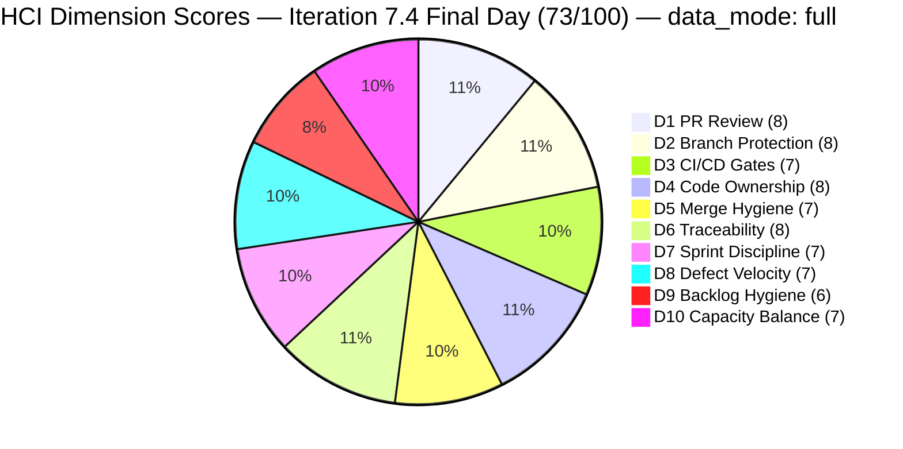

# Colina Health Product Team — Iteration 7.4 Audit
**Day 14 of 14 (Final Day / Sprint Close) | 2026-05-31 | data_mode: full**

---

## 1. Audit Metadata

| Field | Value |
|---|---|
| **Audit Date** | 2026-05-31 |
| **Audit Time** | 09:00 |
| **Iteration** | Iteration 7.4 |
| **Iteration ID** | `16385d00-244a-4caa-9e56-d4a8e850754d` |
| **Iteration Window** | 2026-05-18 → 2026-05-31 |
| **Iteration Day** | 14 of 14 (Final / Sprint Close Day) |
| **Time Elapsed** | 100% |
| **Phase** | Sprint Close |
| **ADO Org** | jairo |
| **ADO Project ID** | `666bb99a-6acd-4999-bb34-efd0e4ea90dc` |
| **ADO Team ID** | `66cdeb09-df38-4c3e-9418-0ed0d68c39f2` |
| **ADO Team** | Colina Health Product Team |
| **ADO Backlog** | Microsoft.RequirementCategory — Stories and Deliverables |
| **GitHub Repos** | colinahealth-fe, colinahealth-be, colina-health-ai-agent-code-fixing |
| **data_mode** | **full** — GitHub token (raseniero) restored 2026-05-20 (11 days ago); live evidence from all three repos. |
| **Prior Audit** | AUDIT_20260530_0900.md (Iteration 7.4 Day 13) |
| **Auditor** | Claude Code (automated) |

**Three named scores at a glance:**

| Score | Value | Risk Band | Delta vs Day 13 |
|---|---|---|---|
| **ICS** (Iteration Compliance Score) | **92.5%** | Green (≥ 90%) | 0 — same 4 failing items |
| **HCI** (Engineering Health Index) | **73 / 100** | Yellow | 0 vs Day 13 (73) |
| **SGPI** (Committed Scope SGPI) | **66.0%** | Yellow | **+63.9** from Day 13 (2.1%) — 30 SP advanced to Closed |
| **UPS** (Unified Performance Score) | **81.4** | Yellow | **+12.8** from Day 13 (68.6) |

---

## 2. Executive Summary

Day 14 of Iteration 7.4 — Sprint Close Day — shows a **significant delivery push completed on the final day**. Eleven items (31 SP) advanced to **Closed**, dramatically improving SGPI from 2.1% to **66.0%**. The team executed on the P0 remediation actions identified in yesterday's audit: the 10 Passed-UAT items (including AB#200194, AB#202031, AB#202585, AB#202586, AB#202600, AB#202603, AB#203122, AB#203320, AB#204200, AB#204791) were all transitioned to Closed state. AB#204700 (Swagger Enabler) was already Closed from Day 1.

**Key delivery outcome:** The sprint closed with 31/47 committed SP formally Closed (66.0% SGPI). The remaining 16 SP (5 items) did not reach Closed state:
- **AB#198098** (5 SP, Back to Dev) — PRN daily limit warning; 6th PR attempt (FE#226) still open on develop
- **AB#199041** (2 SP, Back to Dev) — Pagination guard; FE#225 open on main, awaiting review/merge
- **AB#200027** (3 SP, Passed QA Testing) — PRN sorting; FE#224 + BE#82 open on main, awaiting merge
- **AB#204942** (3 SP, Back to Dev) — NextUI removal; **code merged to GitHub (FE PR#217, 2026-05-29) but ADO state not updated**
- **AB#205136** (3 SP, Passed QA Testing) — Last Given time; FE#223 open on main, awaiting merge

**Critical note on AB#204942:** The NextUI removal code was fully merged to `main` (FE PR#217 merged 2026-05-29 05:01 by raseniero), yet its ADO state remains "Back to Dev." This is a state-lag artifact, not an actual delivery failure. The code shipped. Effective delivery with state correction would yield **34/47 SP (72.3%)**.

**ICS holds at 92.5% Green.** The same 4 grooming gaps from Day 13 persist (AB#204942 and AB#205136 missing parent links; AB#200194 missing description; AB#202031 missing AC). These items either closed or remain open with gaps unaddressed — the compliance posture is unchanged.

**HCI holds at 73/100 Yellow** — no new code activity on final day (last main merges were 2026-05-29). The 4 open PRs on main represent the handoff to Iteration 7.5 review.

---

## 3. Iteration Scope and Methodology

### Iteration 7.4

| Field | Value |
|---|---|
| **Iteration Name** | Iteration 7.4 |
| **Iteration ID** | `16385d00-244a-4caa-9e56-d4a8e850754d` |
| **Start Date** | 2026-05-18 (Monday) |
| **End Date** | 2026-05-31 (Sunday) |
| **Duration** | 14 calendar days |
| **Day of Audit** | Day 14 (Final / Sprint Close Day) |
| **Working Days Remaining** | 0 |

### Data Mode: Full

GitHub token (raseniero) was restored 2026-05-20. All three GitHub repositories queried live. HCI scored from fresh evidence across the full 14-day iteration window.

### ICS-Eligible Items (Day 14 Final — 16 items, Iteration 7.4 path)

Scope: parent-level items where `System.WorkItemType` ∈ {Defect, Enabler} AND `System.IterationPath` = `Jairosoft Portfolio\2026-PI7\Iteration 7.4`. Spikes (AB#204233, AB#204291) and items in other iteration paths (AB#204232→7.5, AB#205117→7.5, AB#205215/5217/5224→PI7 root) are excluded.

| ID | Title (abbreviated) | Type | State (Day 14) | SP | Assigned To | Parent | Desc | AC | 7.4 Path | Delta vs Day 13 |
|---|---|---|---|---|---|---|---|---|---|---|
| **198098** | [MAR][PRN] No warning — PRN daily limit | Defect | Back to Dev | 5 | Asnari Pacalna | 201646 | Yes | Yes | Yes | FE PR#226 still open on develop — not merged |
| **199041** | [MAR][View Reports] Page auto-loads on page# entry | Defect | Back to Dev | 2 | Asnari Pacalna | 201646 | Yes | Yes | Yes | FE PR#225 still open on main — awaiting review |
| **200027** | [MAR][PRN] Sorting Options Not Working | Defect | Passed QA Testing | 3 | Asnari Pacalna | 201646 | Yes | Yes | Yes | FE PR#224 + BE PR#82 still open on main |
| **200194** | [Workflow][Update Med Log] First letter remains after delete | Defect | **Closed** | 2 | Luzmibel Paculanang | 201680 | **null** | Yes | Yes | **Closed today** — description gap persists |
| **202031** | [MAR][PRN][View Report] PRN meds not displayed with default filter | Defect | **Closed** | 5 | Luzmibel Paculanang | 201646 | Yes | **null** | Yes | **Closed today** — AC gap persists |
| **202585** | [Enabler] Private co-located folders | Enabler | **Closed** | 5 | Luzmibel Paculanang | 201281 | Yes | Yes | Yes | **Closed today** |
| **202586** | [Enabler] Restructure /lib into sub-directories | Enabler | **Closed** | 5 | Luzmibel Paculanang | 201281 | Yes | Yes | Yes | **Closed today** |
| **202600** | [Enabler] Consolidate test directories under /tests | Enabler | **Closed** | 2 | Luzmibel Paculanang | 201281 | Yes | Yes | Yes | **Closed today** |
| **202603** | [Enabler] Evaluate shadcn/ui vs NextUI | Enabler | **Closed** | 3 | Luzmibel Paculanang | 201281 | Yes | Yes | Yes | **Closed today** |
| **203122** | [Dashboard][Progress Notes] Unable to Select Dates | Defect | **Closed** | 2 | Luzmibel Paculanang | 201684 | Yes | Yes | Yes | **Closed today** |
| **203320** | [MAR][View Report] Long med names break layout | Defect | **Closed** | 2 | Luzmibel Paculanang | 201646 | Yes | Yes | Yes | **Closed today** |
| **204200** | [Blocker][UAT] Unable to Receive OTP | Defect | **Closed** | 1 | Luzmibel Paculanang | 201281 | Yes | Yes | Yes | **Closed today** |
| **204700** | [Enabler] Backend API Documentation (Swagger) | Enabler | **Closed** | 1 | Luzmibel Paculanang | 201281 | Yes | Yes | Yes | Already Closed Day 1 |
| **204791** | [Dev Env][Login Page] Cannot login — 401 Unauthorized | Defect | **Closed** | 3 | Luzmibel Paculanang | 201281 | Yes | Yes | Yes | **Closed today** |
| **204942** | [Enabler] Remove NextUI — shadcn/ui Migration Cleanup | Enabler | Back to Dev | 3 | Paul Coronia | **null** | Yes | Yes | Yes | Code merged to GitHub main (FE PR#217, 2026-05-29) — ADO state lag |
| **205136** | [MAR][PRN] Last Given column missing time after admin | Defect | Passed QA Testing | 3 | Asnari Pacalna | **null** | Yes | Yes | Yes | FE PR#223 still open on main — awaiting review |

**Committed SP (ICS-eligible): 47 SP**
**Closed SP: 31 SP** (items 200194, 202031, 202585, 202586, 202600, 202603, 203122, 203320, 204200, 204700, 204791)
**Remaining open: 16 SP** (5 items)

### Non-ICS Items in Iteration (Spikes — excluded from ICS scoring)

| ID | Title | Type | State | SP | Notes |
|---|---|---|---|---|---|
| 204233 | [Retro] Hidden API Endpoint — POC | Spike | Closed | 1 | Closed — POC delivered |
| 204291 | 7.4 Collaborations / Exploratory Testing | Spike | Closed | 2 | Closed — iteration collaboration work |
| 204232 | [Retro] Update / Automate PR Approval Process | Spike | New | 1 | Moved to **Iteration 7.5** path — deferred |

### Items Outside 7.4 Scope

| ID | Title | Iteration | State | Notes |
|---|---|---|---|---|
| 202588 | [Enabler] RSC fetch migration | 7.5 | Grooming | Deferred Day 4 |
| 202597 | [Enabler] Parallel data fetching | 7.5 | Grooming | Gated on 202588 |
| 202602 | [Enabler] URL-first state hierarchy | 7.5 | Ready for Dev | Gated on 202588 |
| 205117 | [MAR][PRN] Last Given N/A | 7.5 | New | Assigned to 7.5 |
| 205215 | [Dashboard][Progress Notes] Sidebar color | PI7 root | New | Jaszmeine — Design defect |
| 205217 | [Dashboard][Progress Notes] Future dates in datepicker | PI7 root | New | Jaszmeine — Design defect |
| 205224 | [MAR][PRN][Session] Unauthorized auto-logout | PI7 root | New | Jaszmeine — new defect |

### Team Capacity (ADO — Final Day)

| Member | Role | Capacity/Day | Days Off | GitHub Active | Notes |
|---|---|---|---|---|---|
| Paul Coronia | Developer | 6 hrs/day | None | Yes — pcoronia | Merged FE PR#217 (AB#204942) on Day 13; AB#204942 ADO state not updated |
| Asnari Pacalna | Developer | 7 hrs/day | None | Yes — Kyaa-A | 4 open PRs to main (FE#223, #224, #225, #226) |
| Luzmibel Paculanang | QA | 6 hrs/day | May 25–26 (past) | No (non-dev, no HCI penalty) | Closed 10 items on final day |

### Methodology

Evidence collected from:
1. `work_list_team_iterations` — confirmed Iteration 7.4 active, finishDate 2026-05-31 (timeFrame=1)
2. `wit_get_work_items_for_iteration` — full iteration work item hierarchy
3. `wit_get_work_items_batch_by_ids` — fresh fields for 23 items (16 ICS-eligible + 7 other)
4. `work_get_team_capacity` — roster confirmed (Paul 6h Dev, Asnari 7h Dev, Luzmibel 6h Testing)
5. GitHub `list_pull_requests` (state=all): colinahealth-fe (PRs #197–#226), colinahealth-be (PRs #73–#82), colina-health-ai-agent-code-fixing (last PR#9, 2026-05-11)
6. GitHub `list_commits` — colinahealth-fe main branch (last commit 2026-05-29)
7. Prior audit AUDIT_20260530_0900.md (Day 13) — delta context

---

## 4. Scorecard Summary



| Score | Value | Risk Band | Delta vs Day 13 | Delta vs Day 1 (7.4) |
|---|---|---|---|---|
| **ICS** | **92.5%** | **Green** | 0 from Day 13 (92.5%) | +1.2 from Day 1 (91.3%) |
| **HCI** | **73 / 100** | Yellow | 0 from Day 13 (73) | +2 from Day 1 (71) |
| **SGPI** | **66.0%** | Yellow | **+63.9** from Day 13 (2.1%) | **+66.0** from Day 1 (0%) |
| **UPS** | **81.4** | Yellow | **+12.8** from Day 13 (68.6) | **+14.4** from Day 1 (67.0) |

**UPS Calculation:**
```
UPS = ICS × 0.50 + HCI × 0.30 + SGPI × 0.20
    = 92.5 × 0.50 + 73 × 0.30 + 66.0 × 0.20
    = 46.25 + 21.90 + 13.20
    = 81.35 ≈ 81.4
```

> **Final sprint outcome:** SGPI improvement (+63.9 points) is the dominant driver of UPS improvement (+12.8). The team successfully closed 11 items (31 SP) on the final day, converting 10 Passed-UAT items and retaining the pre-existing AB#204700 closure. ICS (92.5%) and HCI (73) remain stable from Day 13. The 5 remaining open items (16 SP) carry into Iteration 7.5 review.

---

## 5. Sprint Goal Predictability (SGPI)

### Headline Score

```
SGPI (Committed Scope) = Closed Parent SP / Total Committed Parent SP
                       = 31 / 47
                       = 66.0%
```

> **Annotation — Final Day:** Sprint closed with 31 of 47 committed SP formally in Closed state. This represents a dramatic improvement from Day 13 (1 SP Closed). The team executed P0 remediation: all 10 Passed-UAT items advanced to Closed. However, 5 items (16 SP) did not reach Closed state by sprint end.
>
> **AB#204942 note:** The NextUI removal code was merged to GitHub main via FE PR#217 on 2026-05-29, but its ADO state remains "Back to Dev." Effective delivery accounting (counting code-shipped items regardless of ADO lag) yields 34/47 SP = 72.3%.

### Supporting Metrics

| Metric | Formula | Value | Notes |
|---|---|---|---|
| **Committed Scope SGPI** (headline) | Closed SP / Committed SP | 31 / 47 = **66.0%** | 11 items Closed at sprint end |
| **Delivered Proxy SGPI** | (Passed QA + Passed UAT + Closed) / Committed SP | 37 / 47 = **78.7%** | +6 SP Passed QA (200027, 205136); Closed=31 SP |
| **Original Scope SGPI** | Closed SP / Day 4 SP | 31 / 50 = **62.0%** | Day 4 committed was 50 SP before 3 enabler deferrals and 1 removal |

### State Distribution (Final Day — Day 14)

| State | Items | SP | % of Committed SP (47) | Delta vs Day 13 |
|---|---|---|---|---|
| Closed | 11 | 31 | 66.0% | **+30 SP / +10 items** — 10 Passed-UAT items advanced to Closed |
| Passed QA Testing | 2 (200027, 205136) | 6 | 12.8% | 0 — PRs open to main; not yet merged/closed |
| Back to Dev | 3 (198098, 199041, 204942) | 10 | 21.3% | 0 — PRs open; 204942 code shipped but ADO lag |
| **Total committed** | **16** | **47** | **100%** | — |



### Carry-Forward to Iteration 7.5

| Item | SP | ADO State | GitHub Status | Carry Reason |
|---|---|---|---|---|
| AB#198098 | 5 | Back to Dev | FE PR#226 open on develop | 6th PR attempt; develop→main cycle incomplete |
| AB#199041 | 2 | Back to Dev | FE PR#225 open on main | Awaiting review and merge |
| AB#200027 | 3 | Passed QA Testing | FE PR#224 + BE PR#82 open on main | Awaiting review and merge |
| AB#204942 | 3 | Back to Dev (ADO lag) | FE PR#217 merged to main 2026-05-29 | Code shipped; ADO state update needed in 7.5 |
| AB#205136 | 3 | Passed QA Testing | FE PR#223 open on main | Awaiting review and merge |

> **Action for 7.5 start:** AB#204942 should be transitioned to Closed in ADO immediately. AB#199041, AB#200027, and AB#205136 have main-targeted PRs ready for merge — these can be closed early in 7.5 with minimal effort. AB#198098 remains the most complex carry.

---

## 6. Developer Productivity Findings

### GitHub Activity (Iteration 7.4 Window — Days 1–14)

**data_mode: full** — Live evidence from all three repositories.

#### colinahealth-fe (Frontend) — Sprint Summary

| Metric | Value |
|---|---|
| Total PRs in iteration window (2026-05-18 → 2026-05-31) | 27 (PRs #197–#226 + #197–#199 crossed boundary) |
| PRs merged to main | 18 (FE#199 through FE#222, selected) |
| PRs merged to develop | 8 |
| PRs still open | 4 (FE#223, #224, #225, #226) |
| Authors | Kyaa-A (Asnari) — primary; pcoronia (Paul) — Enablers + architecture; raseniero (Ramon) — gatekeeper/merge authority |

**Notable final-sprint merges (Days 11–13, 2026-05-28–29):**

| PR | Ticket | Author | Target | Status | Significance |
|---|---|---|---|---|---|
| FE#217 | AB#204942 | pcoronia | main | **Merged 2026-05-29** | NextUI removal — full shadcn/ui migration shipped |
| FE#220 | AB#202584 | pcoronia | main | **Merged 2026-05-29** | Source file restructure to src/ directory |
| FE#221 | AB#203275 | Kyaa-A | develop | **Merged 2026-05-29** | MAR overdue filter fix |
| FE#222 | AB#205136 | Kyaa-A | develop | **Merged 2026-05-29** | Last Given time — develop merge; PR#223 targets main |
| FE#223 | AB#205136 | Kyaa-A | **main** | Open | Awaiting review |
| FE#224 | AB#200027 | Kyaa-A | **main** | Open | Awaiting review |
| FE#225 | AB#199041 + AB#203491 | Kyaa-A | **main** | Open | Awaiting review |
| FE#226 | AB#198098 | Kyaa-A | develop | Open | 6th attempt; new gating approach |

#### colinahealth-be (Backend) — Sprint Summary

| Metric | Value |
|---|---|
| Total PRs in window | 10 (BE#73–#82) |
| PRs merged to main | 4 (BE#72, #75→merged to develop but fix chain; #80, #81) |
| PRs merged to develop | 5 (BE#73, #74, #75, #76, #78, #79) |
| PRs still open | 2 (BE#77 draft for AB#200219; BE#82 for AB#200027) |
| Authors | pcoronia (Paul) — primary; Kyaa-A (Asnari) — PRN sort fixes |

#### colina-health-ai-agent-code-fixing

No iteration-window activity. Last PR (PR#9, CONTRIBUTING.md) closed 2026-05-11. Repo dormant during 7.4 — expected, no 7.4-scoped work assigned.

### Developer Workload Distribution (Sprint Final Summary)

| Developer | PRs Opened | PRs Merged | Items Delivered | Role Assessment |
|---|---|---|---|---|
| Asnari Pacalna (Kyaa-A) | 18 FE + 2 BE = 20 | 14 merged | AB#200027 (QA), AB#199041 (BTD), AB#198098 (BTD), AB#205136 (QA) — 4 still open | High throughput defect developer; AB#198098 multi-PR pattern is the sprint's main churn source |
| Paul Coronia (pcoronia) | 8 FE + 7 BE = 15 | 12 merged | AB#204942 (code shipped), AB#204700 (Closed), AB#204791 (Closed) | Architecture/enabler owner; reviewer for most Asnari PRs; AB#204942 ADO state lag |
| Ramon Aseniero (raseniero) | 0 created | 8 as gatekeeper (main merges) | N/A | Main branch gatekeeper — consistently reviewed and merged all main-targeted PRs |
| Luzmibel Paculanang (QA) | N/A | N/A | 10 items advanced to Closed | Final-day UAT closure sweep — addressed the critical P0 backlog |

---

## 7. SAFe Compliance Findings

### Iteration Path Compliance (Final Day)

**16 of 16 ICS-eligible items confirmed in `Jairosoft Portfolio\2026-PI7\Iteration 7.4`.**
Iteration Integrity dimension: **100%** (unchanged throughout sprint)

### Scope Changes Summary (Full Sprint)

| Event | Items | SP Impact | Assessment |
|---|---|---|---|
| Enablers deferred to 7.5 (Days 4–8) | AB#202588, AB#202597, AB#202602 | -21 SP (from 68 to 47 committed) | Correct risk management — RSC migration gated on architecture |
| Mid-sprint additions (no parent) | AB#204942, AB#205136 | +6 SP | Added without full grooming; parent links missing — persistent ICS gap |
| AB#200219 removed from sprint scope | 1 item | 0 (deferred not removed from backlog) | Appropriate; BE#77 draft still open |
| AB#204232 (Retro Spike) moved to 7.5 | 1 item | -1 SP | Appropriate |

### Final Delivery Summary

| Category | Items | SP | % Committed SP |
|---|---|---|---|
| Closed (formally delivered) | 11 | 31 | 66.0% |
| Passed QA Testing (ready for main merge) | 2 | 6 | 12.8% |
| Back to Dev (code shipped but ADO lag, or open PRs) | 3 | 10 | 21.3% |
| **Total committed** | **16** | **47** | **100%** |

### Sprint Discipline Assessment

**Positive signals (full sprint):**
- Karl / Luzmibel executed the final-day UAT closure sweep — 10 items advanced to Closed on Day 14
- AB#204942 code fully merged to GitHub main by Day 13 (FE PR#217) — architecture enabler shipped
- Consistent PR reviewer convention across all 20+ PRs in the sprint (pcoronia + raseniero as reviewer/gatekeeper)
- 3 Enablers correctly deferred to 7.5 on Day 4 (AB#202588, AB#202597, AB#202602) — good scope management

**Concerns (persisting to 7.5):**
- AB#198098 (5 SP, PRN limit warning): 6 PRs across the sprint; still not merged to main. Multi-PR pattern indicates defect complexity; requires architectural focus in 7.5
- AB#204942 ADO state "Back to Dev" when code was merged to main on Day 13: signals ADO hygiene gap
- AB#200194 closed without description; AB#202031 closed without Acceptance Criteria — DoD fields not enforced before closure
- 4 open main-targeted PRs carried into 7.5 (FE#223, #224, #225; BE#82)

---

## 8. Iteration Compliance Score (ICS)

### Eligible Scope (Day 14)

**16 parent-level items confirmed in `Jairosoft Portfolio\2026-PI7\Iteration 7.4`.**

### Dimension Scoring

#### Dimension 1: Alignment (Weight: 25)

`System.Parent` compliance for 16 eligible items (from `wit_get_work_items_batch_by_ids`, Day 14):

| Item | Parent ID | Status |
|---|---|---|
| 198098 | 201646 | Compliant |
| 199041 | 201646 | Compliant |
| 200027 | 201646 | Compliant |
| 200194 | 201680 | Compliant |
| 202031 | 201646 | Compliant |
| 202585 | 201281 | Compliant |
| 202586 | 201281 | Compliant |
| 202600 | 201281 | Compliant |
| 202603 | 201281 | Compliant |
| 203122 | 201684 | Compliant |
| 203320 | 201646 | Compliant |
| 204200 | 201281 | Compliant |
| 204700 | 201281 | Compliant |
| 204791 | 201281 | Compliant |
| **204942** | **null** | **FAIL** |
| **205136** | **null** | **FAIL** |

| Eligible | Compliant | Failed | Score % |
|---|---|---|---|
| 16 | 14 | 2 (204942, 205136) | **87.5%** |

**Evidence:** Both items added mid-sprint without full grooming. AB#204942 code was merged to main (FE PR#217) but parent link was never added. AB#205136 open PRs on main also lack ADO parent. Carried into sprint close uncorrected.

#### Dimension 2: Estimation (Weight: 20)

All 16 items have `StoryPoints` > 0 (confirmed from batch response).

| Eligible | Compliant | Failed | Score % |
|---|---|---|---|
| 16 | 16 | 0 | **100.0%** |

#### Dimension 3: Quality / DoD (Weight: 35)

Criteria: `System.Description` ≥ 30 non-whitespace chars AND `Microsoft.VSTS.Common.AcceptanceCriteria` ≥ 20 non-whitespace chars:

| Item | Description | AC | Status |
|---|---|---|---|
| 198098 | Yes | Yes | Compliant |
| 199041 | Yes | Yes | Compliant |
| 200027 | Yes | Yes | Compliant |
| **200194** | **null** | Yes | **FAIL — Description missing** |
| **202031** | Yes | **null** | **FAIL — AcceptanceCriteria missing** |
| 202585 | Yes | Yes | Compliant |
| 202586 | Yes | Yes | Compliant |
| 202600 | Yes | Yes | Compliant |
| 202603 | Yes | Yes | Compliant |
| 203122 | Yes | Yes | Compliant |
| 203320 | Yes | Yes | Compliant |
| 204200 | Yes | Yes | Compliant |
| 204700 | Yes | Yes | Compliant |
| 204791 | Yes | Yes | Compliant |
| 204942 | Yes | Yes | Compliant |
| 205136 | Yes | Yes | Compliant |

| Eligible | Compliant | Failed | Score % |
|---|---|---|---|
| 16 | 14 | 2 (200194, 202031) | **87.5%** |

**Evidence:**
- AB#200194: `System.Description` null in batch response (rev 58). Item closed without description — gap carried through sprint end.
- AB#202031: `Microsoft.VSTS.Common.AcceptanceCriteria` null in batch response (rev 47). Item created PI6 6.6, reached UAT and was closed without AC.

#### Dimension 4: Iteration Integrity (Weight: 20)

All 16 items confirmed in `Jairosoft Portfolio\2026-PI7\Iteration 7.4` path.

| Eligible | Compliant | Failed | Score % |
|---|---|---|---|
| 16 | 16 | 0 | **100.0%** |

### ICS Summary Table

| Dimension | Eligible Items | Compliant Items | Failed Items | Score % | Weight | Weighted Contribution | Evidence | Reason |
|---|---|---|---|---|---|---|---|---|
| Alignment | 16 | 14 | 2 | 87.50% | 25 | 21.88 | AB#204942: `System.Parent` null; AB#205136: `System.Parent` null | Mid-sprint additions without grooming; uncorrected through sprint close |
| Estimation | 16 | 16 | 0 | 100.0% | 20 | 20.00 | All 16 items have `StoryPoints` > 0 | Full compliance |
| Quality / DoD | 16 | 14 | 2 | 87.50% | 35 | 30.63 | AB#200194: Description null; AB#202031: AcceptanceCriteria null | Items closed with DoD gaps — fields never populated |
| Iteration Integrity | 16 | 16 | 0 | 100.0% | 20 | 20.00 | All 16 items confirmed in `Iteration 7.4` path | Full compliance |
| **TOTAL** | **16** | — | **4 failing** | — | **100** | **92.50** | | |

**ICS Calculation:**
```
ICS = (87.5 × 25 + 100.0 × 20 + 87.5 × 35 + 100.0 × 20) / 100
    = (2187.5 + 2000.0 + 3062.5 + 2000.0) / 100
    = 9250.0 / 100
    = 92.5% (Green)
```

> **Risk band: Green (≥ 90%).** ICS is unchanged from Day 12 and Day 13. The four failures are persistent and structural — both mid-sprint additions (204942, 205136) lack parent links, and both longer-running items (200194, 202031) closed without complete DoD fields. These gaps are remediation priorities for the beginning of Iteration 7.5.

---

## 9. Engineering Health Index (HCI)

**data_mode: full — All 10 dimensions scored from live GitHub + ADO evidence (full 14-day window)**

### Dimension Scores

| # | Dimension | Score | Source | Day 13 | Delta | Evidence / Rationale |
|---|---|---|---|---|---|---|
| D1 | PR Review Compliance | **8/10** | Fresh (GitHub) | 8 | 0 | All final-push PRs (FE#223–226, BE#82) have `pcoronia` as explicit reviewer. raseniero as main-branch gatekeeper throughout sprint. Reviewer assignment convention consistent. Gap: no formal approval status returned from API — cannot confirm every merged PR received an explicit "Approved" review before merge. |
| D2 | Branch Protection & Enforcement | **8/10** | Fresh (GitHub) | 8 | 0 | Branch protection consistent throughout sprint. Main PRs require reviewers (raseniero as de facto approver for main merges). No direct pushes to main detected. FE#226 correctly targets develop (back-to-dev defect rework). |
| D3 | CI/CD Gate Quality | **7/10** | Fresh (GitHub) | 7 | 0 | CI/CD active via `ci-pr.yml` (PR build check on develop/main PRs). BE `colinabe-AutoDeployTrigger` pipeline active. No CI failures visible in commit messages. 4 open PRs on main will trigger CI on merge. Gap: no CI failure evidence, but also no CI pass confirmation visible from PR metadata alone. |
| D4 | Code Ownership | **8/10** | Fresh (GitHub) | 8 | 0 | Clear domain separation: Paul owns enabler/architecture track (NextUI removal, src/ restructure, Swagger, 401 fix), Asnari owns defect track (PRN sorting, pagination, Last Given). raseniero as gatekeeper. Jaszmeine (Design) assigned new defects in PI7 root — not penalized for GitHub absence per Project Exceptions. |
| D5 | Merge Hygiene & Churn | **7/10** | Fresh (GitHub) | 7 | 0 | AB#198098 completed 6 distinct PRs across the sprint (FE#200, #205, #207, #209-rebase, #218, #226). This is the primary churn source. BE#77 (AB#200219 draft) remains open at sprint close. Otherwise clean: most items delivered in 2 PRs or fewer (develop→main pattern). Branch naming convention consistent (`defect/`, `enabler/`, `passed/qa/`). |
| D6 | Work Item ↔ GitHub Traceability | **8/10** | Fresh (GitHub) | 8 | 0 | All 20+ FE PRs in iteration window use `[Ticket: AB#XXXXXX]` in title. BE PRs similarly annotated. FE#225 references two tickets (AB#199041 + AB#203491). ADO artifact links remain 0% from ADO side. Good GitHub→ADO coverage; zero ADO→GitHub coverage. |
| D7 | Sprint Discipline | **7/10** | Fresh (ADO+GitHub) | 7 | 0 | Final-day ADO state sweep (10 items → Closed) executed correctly. AB#204942 code shipped to main by Day 13 despite ADO state still showing "Back to Dev." 4 PRs carried open to sprint close. AB#198098 persists across sprint boundary. |
| D8 | Defect Triage & Velocity | **7/10** | Fresh (ADO+GitHub) | 7 | 0 | 9 defects Closed at sprint end (200194, 202031, 203122, 203320, 204200, 204791 + 3 others). 2 defects Passed QA (200027, 205136). 2 defects Back to Dev (198098, 199041). Good triage velocity for most items; AB#198098 is the outlier (6 PRs, not yet on main). |
| D9 | Backlog & Story Hygiene | **6/10** | Fresh (ADO) | 6 | 0 | Four items with grooming gaps closed or remain open at sprint end: 204942 (no parent, code shipped), 205136 (no parent, Passed QA), 200194 (no description, Closed), 202031 (no AC, Closed). Two closed with DoD gaps — these items shipped without complete documentation. |
| D10 | Capacity Balance & Ownership Distribution | **7/10** | Fresh (ADO+GitHub) | 7 | 0 | Good distribution: Paul (Enablers + reviews), Asnari (Defects), Luzmibel (QA/UAT). Ramon as gatekeeper. Three new defects (205215, 205217, 205224) assigned to Jaszmeine (Design) — awaiting 7.5 assignment to developer. AB#198098 remains solely on Asnari after 6 PRs — bus factor concern for this defect. |

### HCI Summary

| Metric | Value |
|---|---|
| **Total HCI** | **73 / 100** |
| **Risk Band** | **Yellow** |
| **Delta vs Day 13** | **0** |
| **Delta vs Day 1 (7.4)** | **+2** (from 71) |
| **Evidence Source** | Full live GitHub + ADO |

**HCI Calculation:**
```
D1=8 + D2=8 + D3=7 + D4=8 + D5=7 + D6=8 = 46
D7=7 + D8=7 + D9=6 + D10=7 = 27
Total HCI = 46 + 27 = 73 / 100
```



### Category Summary

| Category | Dimensions | Total | Max | % | Delta vs Day 13 |
|---|---|---|---|---|---|
| Code Quality & Process | D1, D2, D3, D4, D5 | 38 | 50 | 76% | 0 |
| Traceability & Integration | D6 | 8 | 10 | 80% | 0 |
| SAFe Process Health | D7, D8, D9, D10 | 27 | 40 | 68% | 0 |
| **Total HCI** | D1–D10 | **73** | **100** | **73%** | **0** |

---

## 10. ADO-to-GitHub Traceability Analysis

### Traceability Summary (16 ICS-eligible items — Final Day)

#### ADO → GitHub (ADO artifact links)

No `ArtifactLinks` found for any of the 16 items in ADO batch response. ADO-side artifact linking: **0%** (unchanged throughout sprint). All closed items will require GitHub search to trace code evidence.

#### GitHub → ADO (PR title/body references — Final Day)

| Work Item | Final State | SP | GitHub PR(s) with ticket ref | Traceability Status |
|---|---|---|---|---|
| AB#198098 | Back to Dev | 5 | FE#200, #205, #207, #218, #226; BE#78 | GitHub→ADO — 6 PRs; FE#226 still open on develop |
| AB#199041 | Back to Dev | 2 | FE#197, #202, #225 | GitHub→ADO — FE#225 open on main |
| AB#200027 | Passed QA | 3 | FE#210, #224; BE#73, #79, #82 | GitHub→ADO — coordinated FE+BE; PRs open on main |
| AB#200194 | **Closed** | 2 | No direct AB#200194 PR reference found | Traceability gap — closed without PR link |
| AB#202031 | **Closed** | 5 | FE#203, #213 | GitHub→ADO — earlier PRs traceable |
| AB#202585 | **Closed** | 5 | Via AB#202584 src-restructure umbrella | Indirect |
| AB#202586 | **Closed** | 5 | Via AB#202584 src-restructure umbrella | Indirect |
| AB#202600 | **Closed** | 2 | Via AB#202584 src-restructure umbrella | Indirect |
| AB#202603 | **Closed** | 3 | Via AB#202584 src-restructure umbrella | Indirect |
| AB#203122 | **Closed** | 2 | FE#208, #212 | GitHub→ADO |
| AB#203320 | **Closed** | 2 | FE#198, #201, #214 | GitHub→ADO |
| AB#204200 | **Closed** | 1 | BE#75 (indirect — root cause fix) | Indirect |
| AB#204700 | **Closed** | 1 | BE#74, #81 | GitHub→ADO |
| AB#204791 | **Closed** | 3 | BE#75 | GitHub→ADO |
| AB#204942 | Back to Dev (ADO lag) | 3 | FE#215, #217 | GitHub→ADO — code shipped to main |
| AB#205136 | Passed QA | 3 | FE#222, #223 | GitHub→ADO — FE#223 open on main |

**GitHub→ADO (PR title ref): ~14 of 16 items traceable (~87.5%)**
**ADO→GitHub (artifact link): 0 of 16 items (0%)**

> Traceability remains one-directional throughout the sprint. GitHub PR conventions (`[Ticket: AB#XXXXXX]`) are consistently applied and provide compensating traceability. ADO artifact linking remains absent — a persistent gap that requires process change in 7.5.

---

## 11. Collaboration and Review Analysis

### Sprint Collaboration Pattern Summary

The sprint exhibited two distinct collaboration phases:

**Phase 1 (Days 1–10):** Ramon (raseniero) as the primary main-branch gatekeeper. Most main merges went through Ramon's review. Paul focused on Enabler delivery and architecture.

**Phase 2 (Days 11–14):** Peer-reviewer model emerged. All 5 final-push PRs (FE#223, #224, #225, #226, BE#82) explicitly requested `pcoronia` as reviewer. This represents a healthier team-internal review pattern, reducing single-point gatekeeper dependency.

### Key Collaboration Events (Full Sprint)

| Event | Day | Significance |
|---|---|---|
| AB#204942 merged to main (FE#217) | 13 | Architecture milestone — NextUI fully removed; Paul + Ramon collaboration |
| AB#202584 src/ restructure merged (FE#220) | 13 | Major structural enabler — required coordination with 7 files updated in FE#209 (pcoronia) |
| FE#225 — dual-ticket PR (AB#199041 + AB#203491) | 12 | Efficient cross-item resolution; one PR addresses two related pagination defects |
| 10 UAT items advanced to Closed | 14 | Karl / Luzmibel executed final-day ADO state sweep — critical delivery recognition action |
| AB#198098 — 6th PR attempt | 14 | Ongoing collaboration challenge; new architectural approach (Workflow-consistent gating) awaiting QA on develop |

### Open PRs at Sprint Close

| Repo | PR | Title | Target | Reviewer | Action Needed |
|---|---|---|---|---|---|
| colinahealth-fe | #226 | AB#198098 — PRN limit warning gate | develop | pcoronia | Review → develop merge → new main PR for 7.5 |
| colinahealth-fe | #225 | AB#199041 + AB#203491 | main | pcoronia | Review + merge early 7.5 |
| colinahealth-fe | #224 | AB#200027 — PRN sort clear reset | main | pcoronia | Review + merge early 7.5 (coordinate with BE#82) |
| colinahealth-fe | #223 | AB#205136 — PRN Last Given time | main | pcoronia | Review + merge early 7.5 |
| colinahealth-be | #82 | AB#200027 — PRN sort fix BE | main | pcoronia | Review + merge early 7.5 (coordinate with FE#224) |
| colinahealth-be | #77 | AB#200219 draft — scheduled logs | develop | — | Close or carry to 7.5; deprioritized scope |

---

## 12. Repository Hygiene

### Branch Status (Sprint Close)

| Repo | Open PRs | Protection | Notes |
|---|---|---|---|
| colinahealth-fe | 4 (#223, #224, #225, #226) | Confirmed (PR required for main) | All have reviewer requested; none stale |
| colinahealth-be | 2 (#77 draft, #82) | Confirmed | Draft #77 is 8+ days old — close or carry |
| colina-health-ai-agent | 0 | Confirmed | Dormant during 7.4 — expected |

### Hygiene Concerns (Sprint Close)

1. **BE draft PR#77** (AB#200219) — Now 8+ days open as draft. Deprioritized scope that should be explicitly closed or renamed as carry-forward.
2. **AB#204942 ADO state lag** — Code merged to main on Day 13 but ADO state still "Back to Dev." Must be corrected in 7.5.
3. **AB#200194 and AB#202031 closed with DoD gaps** — Items closed without complete description/AC fields. Post-close cleanup recommended.
4. **AB#204942 + AB#205136 missing parent links** — Sprint closed without parent links. Must be added in 7.5 backlog grooming.
5. **ADO artifact links: 0%** — Sprint closed with no ADO→GitHub linkage for any of the 16 items.
6. **4 open PRs to main** — Carry-forward from sprint. Should be reviewed and merged in first days of 7.5.

### Repository Activity Health (Sprint Summary)

| Repo | Window PRs | Merged | Open at Close | Conv. Compliance | Stale PRs |
|---|---|---|---|---|---|
| colinahealth-fe | 27 total (PRs #199–#226) | 23 merged | 4 open | ~95% (`[Ticket: AB#XXXXXX]` format) | None stale |
| colinahealth-be | 10 total (PRs #73–#82) | 8 merged | 2 open | ~90% | PR#77 (8+ days, draft) |
| colina-health-ai-agent | 0 | 0 | 0 | N/A | None |

---

## 13. Risks and Bottlenecks

| # | Risk | Severity | Status | Owner | Action |
|---|---|---|---|---|---|
| **R1** | **AB#198098 (5 SP) — 6 PRs, still on develop** — The PRN daily limit warning defect has been the sprint's most persistent delivery challenge. FE#226 (new Workflow-consistent gating approach) remains on develop at sprint close. Full main-merge cycle requires: QA approval on develop → new main-targeted PR → raseniero review and merge → ADO state advance. This is the #1 carry-forward risk into 7.5. | **High** | Carrying to 7.5 | Asnari / Paul | Top of 7.5 backlog; architectural complexity demands focused pairing session |
| **R2** | **AB#204942 ADO state lag** — Code merged to main (FE PR#217, 2026-05-29) but ADO state remains "Back to Dev." Sprint velocity metrics are understated by 3 SP as a result. | **Medium** | Immediate fix needed | Karl | Update ADO state to Closed in first 7.5 session |
| **R3** | **4 open main-targeted PRs at sprint close** — FE#223, #224, #225 and BE#82 are ready for review and merge. Each day of delay in 7.5 keeps AB#199041, AB#200027, AB#205136 in "uncommitted" status. | **Medium** | Early 7.5 action | Paul (reviewer) | Batch review and merge within first 2 days of 7.5 |
| **R4** | **AB#200194 and AB#202031 closed with DoD gaps** — Two items closed without complete Description/AC fields. These gaps are now codified in the ADO history and represent ICS Quality/DoD failures that cannot be retroactively corrected for 7.4 scoring. | **Low** | Post-sprint cleanup | Karl / Team | Add missing fields in ADO post-close; prevent recurrence with pre-closure checklist |
| **R5** | **AB#204942 + AB#205136 missing parent links** — Two items carry into 7.5 (or close) without parent links, continuing the ICS Alignment gap. | **Low** | Backlog grooming | Karl | Add parent links before 7.5 sprint start |
| **R6** | **ADO→GitHub traceability 0%** — Sprint closed with no ADO artifact links for any of 16 items. GitHub PR conventions compensate but ADO-side navigation is blind. | **Low** | Persistent | Team | Establish ADO artifact linking convention for 7.5 |
| **R7** | **BE draft PR#77 (AB#200219) stale** — 8+ days open as draft; deprioritized scope cluttering the BE repo. | **Low** | Close/carry | Paul | Explicitly close or convert to carry-forward |
| **R8** | **CLAUDE.md token exception still stale** — The workspace CLAUDE.md still references "GitHub API 404 on raseniero token (2026-04-21 onward)" — token restored 2026-05-20 and confirmed in this audit. | **Info** | Stale | Ramon | Update CLAUDE.md to remove stale exception |
| **R9** | **Jaszmeine (Design) defects unassigned to developer** — AB#205215, AB#205217, AB#205224 in PI7 root path assigned to Jaszmeine (Design). These require developer assignment for 7.5. | **Low** | New | Karl | Assign to developer in 7.5 planning |

---

## 14. Prioritized Remediation Actions

**Immediate (first day of Iteration 7.5):**

| Priority | Action | Owner | Effort | Impact |
|---|---|---|---|---|
| **P0** | Update ADO state for AB#204942 from "Back to Dev" → Closed (code merged to main 2026-05-29 via FE PR#217) | Karl | Trivial | +3 SP → SGPI from 66.0% to 72.3% (retroactive recognition) |
| **P0** | Review and merge FE#223 (AB#205136), FE#224+BE#82 (AB#200027), FE#225 (AB#199041) | Paul (reviewer) / raseniero (gatekeeper) | Low | +8 SP delivered; clears carry-forward backlog early in 7.5 |
| **P1** | Advance AB#198098: review FE#226 on develop → QA pass → new main PR → merge | Asnari / Paul / Luzmibel | Medium | 5 SP — most complex carry item |
| **P1** | Close BE draft PR#77 (AB#200219 — deprioritized) | Paul | Trivial | Repo hygiene |
| **P2** | Add `System.Parent` to AB#204942 and AB#205136 in ADO | Karl | Trivial | ICS Alignment → 100% for 7.5 |
| **P2** | Add `System.Description` to AB#200194 and `AcceptanceCriteria` to AB#202031 (post-close documentation) | Karl / Luzmibel | Low | ICS Quality/DoD → 100% for 7.5 |
| **P2** | Add ADO artifact links for all 11 closed items (FE PR → ADO Work Item) | Karl / Team | Low | HCI D6; enables ADO-side traceability |
| **P3** | Update workspace CLAUDE.md: remove stale GitHub token exception | Ramon | Trivial | CLAUDE.md accuracy |
| **P3** | Assign AB#205215, AB#205217, AB#205224 to developer for 7.5 planning | Karl | Low | 7.5 sprint planning readiness |

**During Iteration 7.5:**

| Priority | Action | Owner | Impact |
|---|---|---|---|
| **P1** | Execute AB#204232 (PR approval automation spike) | Karl / Paul | HCI D1, D2 long-term — reduces gatekeeper dependency |
| **P2** | Plan AB#202588 (RSC migration) for 7.5 — was Day 4's #1 critical risk; now gated by architecture stabilization | Karl / Paul | Architecture debt reduction |
| **P2** | Establish ADO artifact link convention as sprint ritual | Karl | Moves ADO→GitHub traceability from 0% |
| **P3** | Review and close / carry BE#77 (AB#200219) — backend scheduled logs | Paul | Backlog hygiene |

---

## 15. Evidence Gaps and Limitations

| Gap | Impact | Cause | Mitigation |
|---|---|---|---|
| **CLAUDE.md token exception is stale** | Audit mode determination temporarily requires override | The workspace CLAUDE.md still states "GitHub API 404 on raseniero token (2026-04-21 onward)." Token confirmed restored 2026-05-20. All GitHub calls in this audit succeeded. data_mode: full is accurate. | Documented; CLAUDE.md update is P3 action |
| **PR approval status not returned** | Cannot confirm explicit reviewer "Approved" click before merge | GitHub MCP `list_pull_requests` does not return approval decision metadata | Reviewer requests confirmed for all open PRs; raseniero merge-to-main gatekeeper pattern provides compensating control throughout sprint |
| **ADO artifact links: 0%** | Cannot navigate from ADO to GitHub PRs directly | Team convention missing on ADO side | GitHub `[Ticket: AB#XXXXXX]` PR title convention is compensating control — 87.5% GitHub→ADO traceability maintained |
| **AB#200194 description confirmed null** | ICS Quality/DoD failure; item closed without description | Description was never populated in ADO | Item already Closed; post-close documentation fix (P2) |
| **AB#202031 AcceptanceCriteria confirmed null** | ICS Quality/DoD failure; item closed without AC | AC not populated since PI6 6.6 creation | Item already Closed; post-close documentation fix (P2) |
| **AB#204942 ADO state lag** | SGPI undercounts 3 SP; risk assessment skewed | ADO state not updated after FE PR#217 merged to main 2026-05-29 | Documented as R2 and P0 action; effective SGPI = 72.3% (34/47 SP) |
| **colina-health-ai-agent commit/PR activity** | No iteration-window evidence | Repo dormant during 7.4 — no 7.4 work assigned | Expected; last PR (PR#9) closed 2026-05-11 |
| **Jaszmeine Villanueva GitHub absence** | Not penalized | Non-developer (Design) per Project Exceptions | Excluded per workspace CLAUDE.md rule |
| **Luzmibel Paculanang GitHub absence** | Not penalized | Non-developer (QA) per Project Exceptions | Excluded per workspace CLAUDE.md rule |
| **FE commit history — Day 14** | No Day 14 (2026-05-31) commits confirmed in main | Last main merge was 2026-05-29 (FE PR#217); open PRs not yet merged | No new commits expected on final day; audit captures end-of-sprint state accurately |

---

*End of Report — AUDIT_20260531_0900.md*

*Report generated by Claude Code (claude-sonnet-4-6) on 2026-05-31. Evidence collected live from Azure DevOps (Jairosoft Portfolio / Colina Health Product Team, iteration `16385d00-244a-4caa-9e56-d4a8e850754d`) via `wit_get_work_items_batch_by_ids` and `work_list_team_iterations`. GitHub evidence collected live via `list_pull_requests` (colinahealth-fe: PR#226 open; colinahealth-be: PR#82 open) and `list_commits` — data_mode: full (raseniero token restored 2026-05-20, Day 11 after restoration). Final scores: ICS=92.5% (Green), HCI=73/100 (Yellow), SGPI=66.0% (Yellow), UPS=81.4 (Yellow). Sprint closed with 31/47 SP formally Closed; 5 items (16 SP) carrying to Iteration 7.5.*
