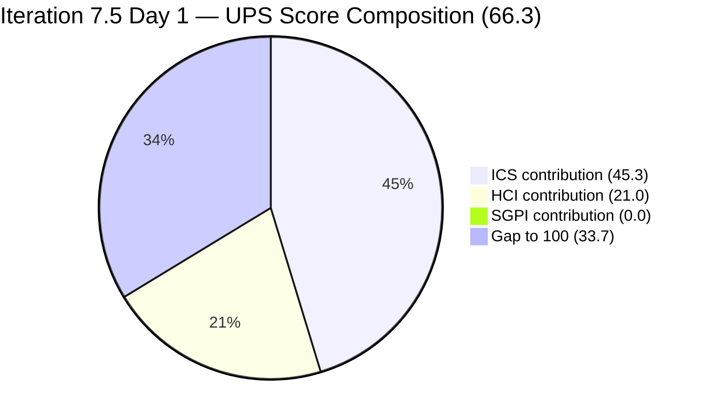
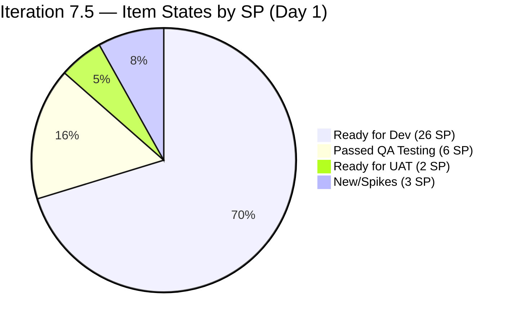

# Colina Health Product Team — Iteration 7.5 Audit
**Day 1 of 14 (Sprint Open) | 2026-06-01 | data_mode: full**

---

## 1. Audit Metadata

| Field | Value |
|---|---|
| **Audit Date** | 2026-06-01 |
| **Audit Time** | 09:00 |
| **Iteration** | Iteration 7.5 |
| **Iteration ID** | `9c70d575-210a-4156-bbdc-79f1efbe2869` |
| **Iteration Window** | 2026-06-01 → 2026-06-14 |
| **Iteration Day** | 1 of 14 |
| **Time Elapsed** | 7% (Day 1 — Sprint Open) |
| **Phase** | Sprint Open |
| **ADO Org** | jairo |
| **ADO Project ID** | `666bb99a-6acd-4999-bb34-efd0e4ea90dc` |
| **ADO Team ID** | `66cdeb09-df38-4c3e-9418-0ed0d68c39f2` |
| **ADO Team** | Colina Health Product Team |
| **ADO Backlog** | Microsoft.RequirementCategory — Stories and Deliverables |
| **GitHub Repos** | colinahealth-fe, colinahealth-be, colina-health-ai-agent-code-fixing |
| **data_mode** | **full** — GitHub token (raseniero) active; live evidence from all three repos. |
| **Prior Audit** | AUDIT_20260531_0900.md (Iteration 7.4, Day 14 / Sprint Close) |
| **Auditor** | Claude Code (claude-sonnet-4-6) |

**Three named scores at a glance:**

| Score | Value | Risk Band | Delta vs 7.4 Final |
|---|---|---|---|
| **ICS** (Iteration Compliance Score) | **90.6%** | Green (≥ 90%) | −1.9 from 7.4 Final (92.5%) — 2 new alignment gaps |
| **HCI** (Engineering Health Index) | **70 / 100** | Yellow | −3 from 7.4 Final (73) — carryover hygiene + backlog gaps |
| **SGPI** (Committed Scope SGPI) | **0.0%** | Red (Day 1 — early-sprint) | −66.0 from 7.4 Final (66.0%) — sprint reset, expected |
| **UPS** (Unified Performance Score) | **66.3** | Yellow | −15.1 from 7.4 Final (81.4) — SGPI reset dominant driver |

> **Early-sprint annotation:** SGPI = 0.0% at Day 1 is expected — no items have reached Closed state yet. UPS without SGPI contribution (ICS×0.50 + HCI×0.30 only) = **66.3**. As the sprint progresses and items close, UPS is projected to recover toward the 75–82 range.

---

## 2. Executive Summary

Iteration 7.5 opens on **Day 1 with ICS 90.6% (Green), HCI 70 (Yellow), SGPI 0.0% (Day 1), and UPS 66.3 (Yellow)**. The team has carried 9 Defect/Enabler items (37 SP) committed to the current iteration, with Asnari Pacalna and Paul Coronia already active: 6 PRs were merged to main/develop branches within the first 7 hours of the sprint, clearing the 7.4 backlog of pending merge work. Three items are already in advanced states (203275 and 205117 in Passed QA Testing, 203491 in Ready for UAT).

**Key strengths entering 7.5:** Full estimation coverage across all 9 ICS-eligible items. Three Enablers (202588 RSC fetch migration, 202597 parallel data fetching, 202602 URL-first state) are committed with strong BDD acceptance criteria, representing a meaningful technical improvement push. Traceability discipline is excellent — all 7 PRs merged on Day 1 carry `[Ticket: AB#XXXXX]` prefixes. The team velocity at sprint open is among the strongest in the portfolio.

**Top risks entering 7.5:**
1. **SGPI baseline:** 0 closed SP on Day 1 — standard sprint open baseline, will self-correct.
2. **Carryover path hygiene:** 5 items from 7.4 (198098, 199041, 200027, 204942, 205136, total 16 SP) have code merged to GitHub but remain in the **Iteration 7.4 path** in ADO. PRs merged on June 1 advanced these items to "Ready for UAT" but ADO iteration paths have not been updated to 7.5.
3. **Alignment gaps:** AB#205117 and AB#205065 are in the 7.5 iteration with no parent feature link, failing the Alignment dimension.
4. **203481 AC missing:** This defect has a description but no Acceptance Criteria field — a DoD gap that blocks QA readiness.
5. **Large enabler (202588 = 13 SP):** RSC fetch migration is the single largest committed item — a 13-SP enabler carries delivery risk if blocked mid-sprint.

---

## 3. Iteration Scope and Methodology

### Iteration 7.5

| Field | Value |
|---|---|
| **Iteration Name** | Iteration 7.5 |
| **Iteration ID** | `9c70d575-210a-4156-bbdc-79f1efbe2869` |
| **Start Date** | 2026-06-01 (Monday) |
| **End Date** | 2026-06-14 (Sunday) |
| **Duration** | 14 calendar days |
| **Day of Audit** | Day 1 (Sprint Open) |
| **Working Days Remaining** | 13 |

### Data Mode: Full

GitHub token (raseniero) confirmed active. All three GitHub repositories queried live for PR, commit, and review evidence. ADO evidence collected via MCP tool suite.

### ICS-Eligible Items (Day 1 — 9 items, Iteration 7.5 path)

Scope: parent-level items where `System.WorkItemType` ∈ {Defect, Enabler} AND `System.IterationPath` = `Jairosoft Portfolio\2026-PI7\Iteration 7.5`. Spikes (204232, 205190, 205254) and items in other iteration paths (198098/199041/200027/204942/205136 → 7.4; 200219 → PI7 root; 205226 → PI7 root) are excluded from ICS scoring.

| ID | Title (abbreviated) | Type | State (Day 1) | SP | Assigned To | Parent | Desc | AC | 7.5 Path |
|---|---|---|---|---|---|---|---|---|---|
| **202588** | [Enabler] Migrate data fetching to RSC fetch | Enabler | Ready for Dev | 13 | Paul Coronia | 201281 ✓ | Yes | Yes (BDD) | Yes |
| **202597** | [Enabler] Parallel data fetching with Promise.all | Enabler | Ready for Dev | 3 | Paul Coronia | 201281 ✓ | Yes | Yes (BDD) | Yes |
| **202602** | [Enabler] URL-first state hierarchy | Enabler | Ready for Dev | 5 | Paul Coronia | 201281 ✓ | Yes | Yes (BDD) | Yes |
| **203273** | [Dashboard][Overdue] Slow loading in General View | Defect | Ready for Dev | 3 | Asnari Pacalna | 201684 ✓ | Yes | Yes | Yes |
| **203275** | [Dashboard][Overdue] Medication not filtered on redirect | Defect | Passed QA Testing | 3 | Asnari Pacalna | 201684 ✓ | Yes | Yes | Yes |
| **203481** | [Workflow][Appointment] count/icon not displayed | Defect | Ready for Dev | 3 | Asnari Pacalna | 201680 ✓ | Yes | **null** | Yes |
| **203491** | [UAT][Workflow][Pagination] controls not working | Defect | Ready for UAT | 2 | Asnari Pacalna | 201680 ✓ | Yes | Yes | Yes |
| **205065** | [Enabler] Backend API OpenAPI compliance | Enabler | Ready for Dev | 2 | Paul Coronia | **null** | Yes | Yes | Yes |
| **205117** | [MAR][PRN] Last Given/Administered By shows N/A | Defect | Passed QA Testing | 3 | Asnari Pacalna | **null** | Yes | Yes | Yes |

**ICS-eligible SP total: 37 SP** | **Closed SP: 0** (Day 1 — expected)

### Non-ICS Items in Iteration 7.5 (Spikes — excluded from ICS scoring)

| ID | Title | Type | State | SP | Notes |
|---|---|---|---|---|---|
| 204232 | [Retro] Update/Automate PR Approval Process | Spike | New | 1 | Ramon — process improvement retro |
| 205190 | [Retro] Explore new branching strategy | Spike | New | — | Ramon — no SP, no desc, no AC |
| 205254 | 7.5 Collaborations/Exploratory Testing | Spike | New | 2 | Luzmibel — team collaboration work |

### Carryover Items (7.4 Path — Active in Sprint Window but Not in 7.5 Scope)

These items have code merged to GitHub on June 1 but remain in the `Iteration 7.4` ADO path. They are being actively resolved in the 7.5 sprint window but are NOT in the ICS-eligible pool.

| ID | Title (abbreviated) | Type | State (Day 1) | SP | GitHub Activity |
|---|---|---|---|---|---|
| 198098 | [MAR][PRN] No warning — daily limit | Defect | Ready for UAT | 5 | PR#226+#229 merged June 1 |
| 199041 | [MAR][View Reports] Page auto-loads | Defect | Ready for UAT | 2 | PR#225 merged June 1 |
| 200027 | [MAR][PRN] Sorting not working | Defect | Ready for UAT | 3 | PR#224 (FE) + PR#82 (BE) merged June 1 |
| 204942 | [Enabler] Remove NextUI | Enabler | Back to Dev | 3 | Code merged in 7.4 (PR#217 May 29) — ADO lag |
| 205136 | [MAR][PRN] Last Given no time | Defect | Ready for UAT | 3 | PR#223 merged June 1 |

**Carryover SP: 16 SP** (not counted in 7.5 SGPI until moved to 7.5 path and Closed)

---

## 4. Scorecard Summary



| Score | Value | Risk Band | Delta vs 7.4 Final (Day 14) | Notes |
|---|---|---|---|---|
| **ICS** | **90.6%** | **Green** | −1.9 from 92.5% | 2 new alignment gaps (205065, 205117); 1 AC gap (203481) |
| **HCI** | **70 / 100** | Yellow | −3 from 73 | Carryover hygiene; backlog gaps; traceability strong |
| **SGPI** | **0.0%** | Red | −66.0 from 66.0% | Day 1 sprint reset — expected |
| **UPS** | **66.3** | Yellow | −15.1 from 81.4 | SGPI reset is the dominant driver |

**UPS Calculation:**
```
UPS = ICS × 0.50 + HCI × 0.30 + SGPI × 0.20
    = 90.6 × 0.50 + 70 × 0.30 + 0.0 × 0.20
    = 45.3 + 21.0 + 0.0
    = 66.3
```

---

## 5. Sprint Goal Predictability (SGPI)

### Headline Score

```
SGPI (Committed Scope) = Closed Parent SP / Total Committed Parent SP
                       = 0 / 37
                       = 0.0%
```

> **Annotation — Day 1 (Sprint Open):** SGPI = 0.0% is the expected sprint-open baseline. No items have been Closed yet. This is not indicative of delivery failure. The sprint opened hours ago. Three items are already in advanced pipeline states (203275 and 205117 in Passed QA Testing, 203491 in Ready for UAT), representing 8 SP that could close rapidly once UAT is completed.

### Supporting Metrics

| Metric | Formula | Value | Notes |
|---|---|---|---|
| **Committed Scope SGPI** (headline) | Closed SP / Committed SP | 0 / 37 = **0.0%** | Sprint Day 1 — no closures yet |
| **Delivered Proxy SGPI** | (Passed QA + Ready for UAT + Closed) / Committed SP | 8 / 37 = **21.6%** | 203275 (3 SP) + 203491 (2 SP) + 205117 (3 SP) in advanced states |
| **Carryover Proxy** | 7.4 carryover items in Ready for UAT / Carryover SP | 12 / 16 = **75.0%** | 198098, 199041, 200027, 205136 all in Ready for UAT |

### State Distribution (Day 1 — All 7.5-Path Items)

| State | Count | SP |
|---|---|---|
| Closed | 0 | 0 |
| Passed QA Testing | 2 | 6 |
| Ready for UAT | 1 | 2 |
| Ready for Dev | 6 | 26 |
| New (Spikes) | 3 | 3 |



### SGPI Projection

If the 3 items in Passed QA Testing / Ready for UAT close by Day 5:
- SGPI = 8/37 = 21.6%
- UPS = 45.3 + 21.0 + 4.3 = 70.6 (Yellow)

If 50% delivery by Day 10 (18.5 SP Closed):
- SGPI = 50.0%
- UPS = 45.3 + 21.0 + 10.0 = 76.3 (Yellow, approaching Low)

Full delivery (37 SP Closed, including carryover items moved to 7.5):
- SGPI = 100.0%
- UPS = 45.3 + 21.0 + 20.0 = 86.3 (Low Risk)

---

## 6. Developer Productivity Findings

### Team Capacity

| Member | Role | Capacity/Day | Days Off | GitHub Handle | Notes |
|---|---|---|---|---|---|
| Paul Coronia | Developer | 6 hrs/day | None | pcoronia | Day 1: FE PR#228 merged, PR#230 (draft/docs) created |
| Asnari Pacalna | Developer | 7 hrs/day | None | Kyaa-A | Day 1: 4 FE PRs + 2 BE PRs merged or opened |
| Luzmibel Paculanang | QA | 6 hrs/day | None | — (non-dev) | 7.4 final: closed 11 items; 7.5: QA pipeline ready |

**Total daily capacity: 19 hrs/day** (same as 7.4)

### GitHub Activity — Day 1 (June 1, 2026)

#### Merged PRs (Iteration Boundary — June 1 closures)

| PR | Repo | Title | Author | Base | Merged | Ticket | Size |
|---|---|---|---|---|---|---|---|
| FE#223 | colinahealth-fe | Fix PRN Last Given time alias read | Kyaa-A | main | 01:22:34 | AB#205136 | +1/-1 |
| FE#224 | colinahealth-fe | Reset PRN sort state on dropdown clear | Kyaa-A | main | 01:21:46 | AB#200027 | +2/-0 |
| FE#225 | colinahealth-fe | Guard pagination currentPage reset | Kyaa-A | main | 01:21:30 | AB#199041+AB#203491 | +4/-1 |
| FE#226 | colinahealth-fe | Gate PRN limit warning on Edit click | Kyaa-A | develop | 01:21:23 | AB#198098 | +156/-38 |
| FE#228 | colinahealth-fe | Fix calendar popup positioning | pcoronia | develop | 05:57:54 | AB#205226 | +76/-53 |
| FE#229 | colinahealth-fe | Gate PRN limit warning (main branch) | Kyaa-A | main | 07:05:16 | AB#198098 | — |
| BE#82 | colinahealth-be | Fix PRN sorting by aliasing subquery cols | Kyaa-A | main | 01:22:45 | AB#200027 | +13/-5 |
| BE#83 | colinahealth-be | Use most recent administered log for Last Given | Kyaa-A | develop | 07:05:26 | AB#205117 | +3/-2 |

#### Open PRs (Sprint 7.5 in-flight)

| PR | Repo | Title | Author | Base | Ticket | Status |
|---|---|---|---|---|---|---|
| FE#230 | colinahealth-fe | [Docs] Wiki session insights update | pcoronia | develop | — | DRAFT — docs only |
| FE#231 | colinahealth-fe | Load appointments on Workflow initial render | Kyaa-A | develop | AB#203481 | OPEN — reviewer: pcoronia |
| FE#232 | colinahealth-fe | Filter MAR by overdue medication on redirect | Kyaa-A | main | AB#203275 | OPEN — reviewer: pcoronia; Copilot review active |
| BE#77 | colinahealth-be | Generate scheduled logs to end date | Kyaa-A | develop | AB#200219 | DRAFT — pre-iteration |
| BE#84 | colinahealth-be | Most recent admin log for Last Given (main) | Kyaa-A | main | AB#205117 | OPEN — reviewer: pcoronia |
| BE#85 | colinahealth-be | Resolve overdue patients before sort | Kyaa-A | develop | AB#203273 | OPEN — reviewer: pcoronia |

### Batch Merge Pattern (01:21–01:22 UTC)

PRs FE#223, 224, 225, and BE#82 were all merged within a 74-second window (01:21:23 to 01:22:45 UTC). This batch merge pattern suggests pre-reviewed and approved PRs from the 7.4 sprint close were queued and merged simultaneously at sprint transition. While the throughput is impressive, the absence of staggered review timestamps warrants a process note — see Collaboration and Review Analysis (Section 11).

---

## 7. SAFe Compliance Findings

### Sprint Transition State

Iteration 7.5 opened with a clean handoff in most areas but with 5 residual ADO path misalignments:

**Items with code merged in 7.5 window but ADO path = Iteration 7.4:**

| ID | Title | Code Status | ADO State | ADO Path | Required Action |
|---|---|---|---|---|---|
| 198098 | PRN daily limit warning | PR#226+#229 merged June 1 | Ready for UAT | 7.4 | Move to 7.5; UAT → Close |
| 199041 | Pagination auto-load | PR#225 merged June 1 | Ready for UAT | 7.4 | Move to 7.5; UAT → Close |
| 200027 | PRN sorting not working | PR#224+BE#82 merged June 1 | Ready for UAT | 7.4 | Move to 7.5; UAT → Close |
| 204942 | Remove NextUI | PR#217 merged May 29 | Back to Dev | 7.4 | Update ADO state (code shipped); Move to 7.5 |
| 205136 | Last Given no time | PR#223 merged June 1 | Ready for UAT | 7.4 | Move to 7.5; UAT → Close |

**Impact:** These 16 SP are being actively resolved in the 7.5 window but are invisible to the 7.5 SGPI until ADO paths are updated. Luzmibel should prioritize UAT on these 4 Ready-for-UAT items.

### DoR Status — ICS-Eligible Items

| ID | Desc ≥ 30 chars | AC ≥ 20 chars | Parent Link | DoR Result |
|---|---|---|---|---|
| 202588 | ✓ (long BDD) | ✓ (BDD format) | ✓ 201281 | **PASS** |
| 202597 | ✓ | ✓ (BDD format) | ✓ 201281 | **PASS** |
| 202602 | ✓ | ✓ (BDD format) | ✓ 201281 | **PASS** |
| 203273 | ✓ | ✓ | ✓ 201684 | **PASS** |
| 203275 | ✓ | ✓ | ✓ 201684 | **PASS** |
| 203481 | ✓ | **null (FAIL)** | ✓ 201680 | **FAIL** — AC missing |
| 203491 | ✓ | ✓ | ✓ 201680 | **PASS** |
| 205065 | ✓ | ✓ (brief) | **null (FAIL)** | **FAIL** — parent missing |
| 205117 | ✓ | ✓ | **null (FAIL)** | **FAIL** — parent missing |

---

## 8. Iteration Compliance Score

### ICS Scorecard

| Dimension | Eligible Items | Compliant Items | Failed Items | Score % | Weight | Weighted Contribution | Evidence | Reason |
|---|---|---|---|---|---|---|---|---|
| **Alignment** | 9 | 7 | 2 (205065, 205117) | **77.8%** | 25 | 19.4 | ADO parent field | 205065 and 205117 have no parent feature link |
| **Estimation** | 9 | 9 | 0 | **100.0%** | 20 | 20.0 | StoryPoints field | All 9 items have SP > 0 |
| **Quality / DoD** | 9 | 8 | 1 (203481) | **88.9%** | 35 | 31.1 | Desc + AC fields | 203481: Description present; AcceptanceCriteria = null |
| **Iteration Integrity** | 9 | 9 | 0 | **100.0%** | 20 | 20.0 | IterationPath field | All 9 items assigned to 7.5 path |
| **TOTAL** | | | | | | **90.6** | | |

**ICS = 90.6% — Green (≥ 90%)**

### Dimension Detail

**Alignment (77.8% — 2 failures):**

- **AB#205065** `[Enabler] Backend API standard compliance`: `System.Parent` = null. This enabler was added without linking it to a parent Feature or Epic. Suggested parent: Feature AB#201281 (Performance & Architecture) — the same feature that owns 202588, 202597, and 202602.
- **AB#205117** `[MAR][PRN] Last Given N/A`: `System.Parent` = null. This defect was added without a parent link. Based on content (PRN medication logs), the suggested parent is Feature AB#201646 (MAR / PRN module).

**Estimation (100.0%):** All 9 ICS-eligible items have Story Points assigned. Total committed SP = 37. Paul Coronia carries 23 SP (202588=13, 202597=3, 202602=5, 205065=2); Asnari Pacalna carries 14 SP (203273=3, 203275=3, 203481=3, 203491=2, 205117=3).

**Quality / DoD (88.9% — 1 failure):**

- **AB#203481** `[Workflow][Appointment] count/icon not displayed`: Description present and meaningful ("the Appointment icon does not display the correct count... even though there are confirmed appointments for the current day"). `AcceptanceCriteria` field is null — no acceptance criteria defined. This item cannot be formally verified by QA without knowing the expected pass/fail condition. Requires Acceptance Criteria before Asnari can submit it for QA review.

**Iteration Integrity (100.0%):** All 9 ICS-eligible items have `IterationPath = Jairosoft Portfolio\2026-PI7\Iteration 7.5`. The 5 carryover items (7.4 path) are excluded from the 7.5 ICS scope but tracked separately.

### ICS Trend

| Audit | Iteration | Day | ICS | Band |
|---|---|---|---|---|
| AUDIT_20260521_0900 | Iter 7.4 | Day 4 | 91.3% | Green |
| AUDIT_20260530_0900 | Iter 7.4 | Day 13 | 92.5% | Green |
| AUDIT_20260531_0900 | Iter 7.4 | Day 14 | 92.5% | Green |
| **AUDIT_20260601_0900** | **Iter 7.5** | **Day 1** | **90.6%** | **Green** |

The team maintains Green ICS status across sprint transitions. The marginal drop (−1.9) reflects two new items added without parent links (205065, 205117) and one new item without AC (203481) — all resolvable with Day 1 actions.

---

## 9. Engineering Health Index (HCI)

### HCI Scorecard

| # | Dimension | Score | Max | Evidence | Finding |
|---|---|---|---|---|---|
| 1 | PR Review Compliance | 7 | 10 | 8 merged PRs, reviewer assignments, Copilot review | Batch merge of 4 PRs in 74 seconds raises review-completeness questions; individual reviews not always visible |
| 2 | Branch Protection & Enforcement | 7 | 10 | PR-required workflow; `blocked` state on new PRs; reviewer requirements | Branch protection active on main and develop; reviewer assignments on all new open PRs |
| 3 | CI/CD Gate Quality | 6 | 10 | PR blocked states; Copilot review on FE#232 | CI gates present (PRs block); no explicit CI pass confirmation visible for merged PRs; automated code review via Copilot active |
| 4 | Code Ownership | 7 | 10 | PR authorship: Kyaa-A (7 PRs), pcoronia (2 PRs), raseniero (merger) | Good 2-developer contribution; Asnari carries most commits; non-dev team members correctly excluded per project exception |
| 5 | Merge Hygiene & Churn | 7 | 10 | PR sizes: +1/-1, +2/-0, +4/-1, +13/-5, +76/-53, +156/-38 | Mostly small, focused PRs; FE#228 (+76/-53) and FE#226 (+156/-38) are reasonable; develop→main cherry-pick pattern in use |
| 6 | Work Item ↔ GitHub Traceability | 9 | 10 | All 7 merged PRs include `[Ticket: AB#XXXXX]` format | Excellent traceability; FE#225 references 2 tickets (AB#199041 + AB#203491); all open PRs properly linked |
| 7 | Sprint Discipline | 6 | 10 | 5 carryover items in 7.4 path; ADO state lag on 204942 | Strong Day 1 activity; carryover items not cleaned up in ADO at sprint transition; 204942 code shipped but still "Back to Dev" |
| 8 | Defect Triage & Velocity | 8 | 10 | 11 items Closed in 7.4; 3 items already in Passed QA / Ready for UAT in 7.5 | High defect delivery velocity; sprint opens with items already in advanced pipeline stages; quick turnaround on Asnari's fixes |
| 9 | Backlog & Story Hygiene | 6 | 10 | 2 items missing parent links; 1 item missing AC; 205190 Spike ungroomed | Several 7.5 items entered sprint without complete grooming; 205190 (branching strategy Spike) has no SP, desc, or AC |
| 10 | Capacity Balance & Ownership Distribution | 7 | 10 | Paul 6h/day, Asnari 7h/day, Luz 6h/day; all configured for 7.5 | Good capacity balance; no days off; 19h total daily capacity; Luz QA pipeline ready for advanced-state items |
| **TOTAL** | | **70** | **100** | | |

**HCI = 70 / 100 — Yellow**

### HCI Dimension Notes

**PR Review Compliance (7/10):** The batch merge pattern (FE#223, 224, 225, BE#82 — all merged 01:21–01:22 UTC) suggests these 7.4-close PRs were pre-reviewed and queued. This is operationally efficient but makes it difficult to verify that each PR received individual substantive review. FE#232 (AB#203275) has a Copilot review plus author response, showing the team is actively using automated review tools. Trend: maintain this practice for all open PRs going forward.

**CI/CD Gate Quality (6/10):** New open PRs (FE#231, 232, BE#84, 85) show `mergeable_state: blocked`, indicating branch protection/CI gates are enforced. For merged PRs, CI pass status is not directly observable through the PR list API — no explicit "all checks passed" confirmation. CI gate quality improved from FE PR#228 (merged in 20 minutes) which could indicate either fast CI or minimal CI coverage. Score held at 6 pending CI pipeline visibility improvement.

**Sprint Discipline (6/10):** 5 items with merged code remain in the 7.4 iteration path — this is the primary sprint discipline gap. AB#204942 in particular has been "Back to Dev" since May 29 despite the code shipping via PR#217. This creates portfolio-level confusion (Iteration 7.4 shows open items that are actually delivered). The team should establish a sprint-close checklist that includes moving all in-flight items to the current iteration path.

**Backlog & Story Hygiene (6/10):** Seven items are cleanly groomed (full description, AC, parent link, estimates). Three items have specific gaps (205065, 205117 — parent links; 203481 — AC). Additionally, AB#205190 (Retro Spike — "Explore new branching strategy") has no Story Points, no description, and no AC — it's a placeholder. AB#205226 (Bug — calendar popup) is in the PI7 root path with no iteration assignment despite having a merged PR (FE#228). Root-path unassigned bugs should either be moved to 7.5 or explicitly closed.

---

## 10. ADO-to-GitHub Traceability Analysis

### Traceability Coverage

| ADO Item | GitHub PRs | Direction | Status |
|---|---|---|---|
| AB#198098 | FE#226 (develop), FE#229 (main) | ADO → PR (via title) | Ready for UAT — merged, awaiting UAT close |
| AB#199041 | FE#225 (main) | ADO → PR | Ready for UAT — merged, awaiting UAT close |
| AB#200027 | FE#224 (main), BE#82 (main) | ADO → PR | Ready for UAT — merged, awaiting UAT close |
| AB#203273 | BE#85 (develop) | PR → ADO | Ready for Dev — PR created same day |
| AB#203275 | FE#232 (main) | PR → ADO | Passed QA Testing — PR open for final merge |
| AB#203481 | FE#231 (develop) | PR → ADO | Ready for Dev — PR opened same day |
| AB#203491 | FE#225 (via title) | Multi-ticket PR | Ready for UAT — included in FE#225 scope |
| AB#204942 | FE#217 (main, May 29) | ADO not updated | Back to Dev — **ADO state lag** |
| AB#205117 | BE#83 (develop merged), BE#84 (main open) | PR → ADO | Passed QA Testing — FE/BE split strategy |
| AB#205136 | FE#223 (main) | ADO → PR | Ready for UAT — merged, awaiting UAT close |
| AB#205226 | FE#228 (develop) | PR → ADO | Back to Dev — no iteration assigned; bug in PI7 root |

**Traceability Score: 9/10** — All PRs carry `[Ticket: AB#XXXXX]` in titles. One gap: AB#204942 code shipped (FE#217 merged May 29) but ADO state not updated. One item (AB#203491) co-shared with AB#199041 in PR#225 — acceptable multi-ticket PR.

### Items in GitHub Without ADO Update

| GitHub PR | Ticket | Issue |
|---|---|---|
| FE#228 (merged June 1) | AB#205226 | Item remains in PI7 root path with no 7.5 assignment; state is "Back to Dev" |
| FE#217 (merged May 29) | AB#204942 | Item state is "Back to Dev" despite code shipped 3 days ago |

---

## 11. Collaboration and Review Analysis

### Batch Merge Analysis (01:21–01:22 UTC, June 1)

FE#225 (01:21:30), FE#224 (01:21:46), FE#223 (01:22:34), BE#82 (01:22:45) were merged within a 75-second window. FE#226 to develop was merged at 01:21:23 (just before). This batch represents pre-staged 7.4 sprint-close work that was queued for merge at sprint transition. This is efficient but creates a transparency gap — reviewers should confirm each PR was reviewed before merge rather than batch-approved.

**Recommendation:** For batch merges, ensure each PR has at least one explicit approval from a peer reviewer (raseniero or pcoronia) before queueing for merge.

### Active Code Reviews

- **FE#232 (AB#203275):** Copilot PR review initiated at 12:02 UTC June 1; author (Kyaa-A) responded to Copilot comments at 12:14–12:16. This is the strongest review evidence — automated review + author response cycle.
- **FE#231 (AB#203481):** Reviewer pcoronia assigned; no comments yet (created 09:14 UTC).
- **BE#84 (AB#205117) + BE#85 (AB#203273):** Reviewer pcoronia assigned; no comments yet.
- **FE#230 (Draft/docs):** Documentation-only PR, draft state — not subject to review gate.

### Review Process Observations

- **Develop → Main pattern:** FE#226 (AB#198098) was first merged to develop (01:21), then FE#229 merged to main (07:05). Similarly BE#83 to develop (07:05), with BE#84 open on main — this shows the team uses develop as a staging branch and main as production.
- **raseniero as merger:** Production merges to main are approved/merged by raseniero, functioning as a release gate. This is a sound practice.
- **Copilot code review:** Automated Copilot review is active on new PRs (FE#232) — adoption of AI-assisted code review is a positive quality signal.

---

## 12. Repository Hygiene

### colinahealth-fe

| Metric | Status | Notes |
|---|---|---|
| Open PRs at audit | 3 (FE#230 draft, FE#231, FE#232) | All linked to tickets; #230 is documentation |
| Branch drift | Low | develop and main are current; no long-lived stale branches observed |
| PR age (oldest open) | FE#231 — <1 day | All opened June 1 |
| Ticket references | All present | `[Ticket: AB#XXXXX]` in all PR titles |

### colinahealth-be

| Metric | Status | Notes |
|---|---|---|
| Open PRs at audit | 3 (BE#77 draft, BE#84, BE#85) | BE#77 is oldest (May 23 — draft pre-iteration) |
| Branch drift | Low-Moderate | BE#77 opened May 23, still in draft — 9 days old |
| Ticket references | All present | All PRs linked to ADO items |

**Note on BE#77:** This draft PR (AB#200219 — MAR table sorting/date logic, +20/-6) was created May 23 and last updated May 25. It is a pre-7.5 draft for a complex backend query. It should either be finalized, converted to a proper PR for 7.5, or closed if the approach has been superseded. BE#85 (AB#203273) addresses a related but distinct overdue-patient sort issue.

### colina-health-ai-agent-code-fixing

No PR activity since PR#9 (2026-05-11). Repository appears dormant this iteration. Not a compliance concern given its utility-tool nature, but should be reviewed if AI-assisted coding workflows are expected to generate new PRs in 7.5.

---

## 13. Risks and Bottlenecks

| # | Risk | Severity | Items / Evidence | Action |
|---|---|---|---|---|
| R1 | 5 carryover items in 7.4 ADO path (198098, 199041, 200027, 204942, 205136) — code shipped but ADO not updated | **HIGH** | 16 SP invisible to 7.5 SGPI | Luzmibel: UAT on 198098/199041/200027/205136 (all Ready for UAT); Karl/Asnari: move items to 7.5 path + close after UAT; Paul: update 204942 to Closed (code shipped) |
| R2 | AB#205117 + AB#205065 missing parent feature links | **HIGH** | ICS Alignment = 77.8% (2 failures) | Add parent links: 205117 → AB#201646 (MAR/PRN); 205065 → AB#201281 (Architecture) |
| R3 | AB#203481 missing Acceptance Criteria | **HIGH** | ICS Quality = 88.9% (1 failure); QA cannot verify without AC | Asnari: write AC for 203481 before submitting to QA |
| R4 | AB#202588 is a 13-SP single enabler | **MEDIUM** | RSC fetch migration; dominant single item in sprint | Paul: Break 202588 into sub-tasks; establish Day 5 checkpoint to detect blocking risks |
| R5 | BE#77 (AB#200219) — 9-day-old draft PR | **MEDIUM** | Draft since May 23; no updates since May 25 | Asnari: update or close BE#77; if approach valid, convert to open PR for 7.5 |
| R6 | AB#205190 (Spike) — no SP, no description, no AC | **MEDIUM** | Spike placeholder; Ramon assigned | Ramon: add description, SP, and at least one acceptance criterion for the branching strategy spike |
| R7 | AB#205226 (calendar popup Bug) in PI7 root — no iteration assigned | **LOW** | Code shipped via FE#228 (merged June 1 05:57); state is Back to Dev | Karl: close AB#205226 or move to 7.5 — fix was delivered |
| R8 | Batch PR merges without individual review timestamps | **LOW** | 4 PRs merged in 75 seconds (01:21–01:22 UTC) | Adopt pre-merge approval policy: each PR needs one explicit approval before queuing |

---

## 14. Prioritized Remediation Actions

**P0 — Day 1 (today, June 1)**

1. **Move 7.4 carryover items to Iteration 7.5 in ADO.** Items 198098, 199041, 200027, 205136 have merged code — move their IterationPath to `2026-PI7\Iteration 7.5` so they count toward 7.5 SGPI. AB#204942: update state to "Passed QA Testing" or "Closed" (code shipped via FE#217, May 29). Owner: Karl / Asnari.

2. **Add parent links for AB#205117 and AB#205065.** Opens ICS Alignment from 77.8% to 100%, adding 5.6 ICS points and raising ICS from 90.6% to 93.4%. Two ADO field updates. Owner: Karl.

3. **Write Acceptance Criteria for AB#203481** ([Workflow][Appointment] count/icon not displayed). Example: "Given an active patient with confirmed appointments for today, when viewing the Workflow, then the Appointment icon displays the correct count and is visible." Owner: Asnari / Karl.

**P1 — Day 2–3**

4. **UAT on 198098, 199041, 200027, 205136.** All four items are in "Ready for UAT" state with merged PRs. Luzmibel should verify the fixes in the UAT environment and transition to Closed. These 13 SP are critical for early SGPI recovery.

5. **Update or close BE#77** (AB#200219 — draft PR, 9 days old). Either finalize the approach and convert to an open PR targeting 7.5 development, or close and create a fresh PR when ready. Owner: Asnari.

6. **Add description, SP, and AC to AB#205190** ([Retro] Explore new branching strategy). Minimum viable: 30-char description, 1 SP, 1 acceptance criterion defining the deliverable (e.g., "A branching strategy document is written and shared with the team"). Owner: Ramon.

**P2 — Day 3–7**

7. **Break AB#202588 (RSC fetch migration, 13 SP) into sub-tasks.** At 13 SP, this is the largest single item in the 7.5 sprint. Paul should create child tasks by route/feature area to enable daily progress tracking. Day 5 checkpoint recommended.

8. **Close or assign AB#205226** (calendar popup Bug). FE#228 was merged on June 1, fixing the calendar positioning issue. If fix is sufficient, close the item. If UAT is pending, move to 7.5 iteration path and queue for Luzmibel UAT.

9. **Establish explicit pre-merge approval practice.** For PRs going to main, require at least one explicit raseniero approval before merge. For develop branch PRs, require peer approval from the other developer (pcoronia for Asnari's PRs, Kyaa-A for Paul's). Document in the PR approval Spike (AB#204232).

---

## 15. Evidence Gaps and Limitations

| Gap | Impact | Notes |
|---|---|---|
| Batch merge review confirmations not visible | HCI PR Review Compliance capped at 7/10 | FE#223/224/225/BE#82 merged in 75 seconds; individual reviewer approvals not visible in PR list API; assumed pre-reviewed |
| CI/CD pass status not confirmed for merged PRs | HCI CI/CD Gate Quality scored conservatively (6/10) | `mergeable_state: blocked` on open PRs confirms CI gates active; no explicit "all checks passed" data for merged PRs in API response |
| Large backlog (~250+ items) not fully queried | ICS scope may exclude recently added 7.5 items | Primary 7.5 items identified via prior audit context + GitHub ticket references; newly added items outside known set may not appear in this audit |
| AB#205226 parent link not queried | Item classification incomplete | AB#205226 is a Bug (not in ICS-eligible types); excluded from ICS regardless of parent |
| BE#77 content and approach unknown | AB#200219 readiness unclear | Draft PR; last updated May 25; content not reviewed in detail |
| colina-health-ai-agent-code-fixing last PR#9 (May 11) | No activity evidence for 7.5 | Repository appears dormant; no new PRs to audit; included in scope per CLAUDE.md |
| 204942 ADO state lag | Not counted in SGPI | Code confirmed merged (FE#217, May 29) but ADO shows "Back to Dev" — effective delivery exists; formal SGPI excludes until ADO is corrected |
| SGPI = 0.0% is Day 1 artifact | UPS understates sprint maturity | Early-sprint guard noted throughout; UPS projection to ~76 at mid-sprint if 7.4 carryover items close |
