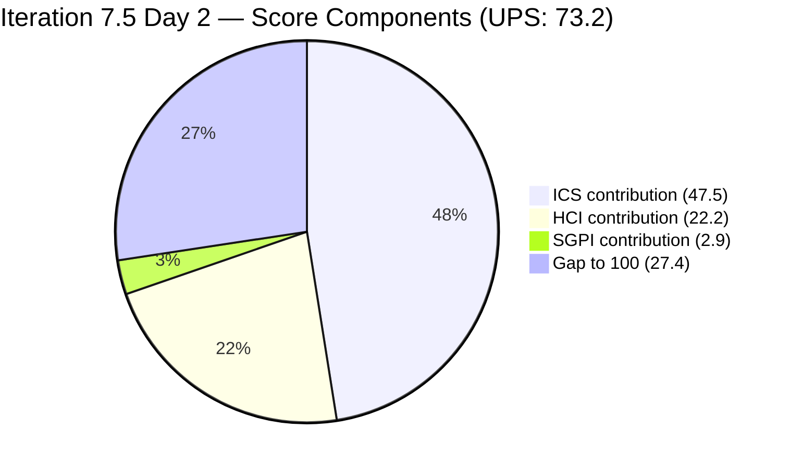
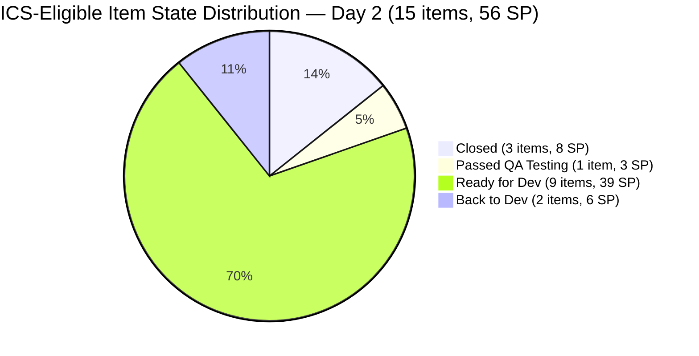
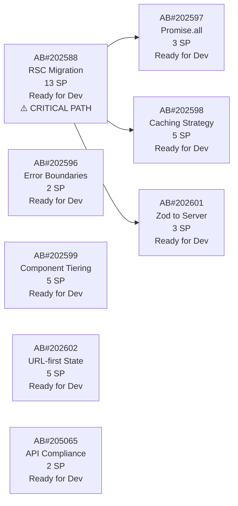
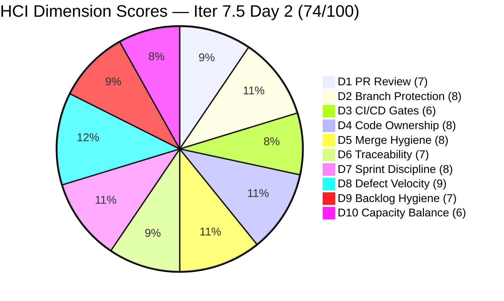

# Colina Health Product Team — Iteration 7.5 Audit
**Day 2 of 14 | 2026-06-02 | data_mode: full**

---

## 1. Audit Metadata

| Field | Value |
|---|---|
| **Audit Date** | 2026-06-02 |
| **Audit Time** | 09:07 |
| **Iteration** | Iteration 7.5 |
| **Iteration ID** | `9c70d575-210a-4156-bbdc-79f1efbe2869` |
| **Iteration Window** | 2026-06-01 → 2026-06-14 |
| **Iteration Day** | 2 of 14 |
| **Time Elapsed** | 14.3% |
| **Phase** | Sprint Open |
| **ADO Org** | jairo |
| **ADO Project ID** | `666bb99a-6acd-4999-bb34-efd0e4ea90dc` |
| **ADO Team ID** | `66cdeb09-df38-4c3e-9418-0ed0d68c39f2` |
| **ADO Team** | Colina Health Product Team |
| **ADO Backlog** | Microsoft.RequirementCategory — Stories and Deliverables |
| **GitHub Repos** | colinahealth-fe, colinahealth-be, colina-health-ai-agent-code-fixing |
| **data_mode** | full — GitHub API live (200 OK); PRs, commits, reviews retrieved. Check-runs API 403 (personal-access-token scope); CI/CD gate evidence indirect only. |
| **Prior Audit** | AUDIT_20260521_0900.md (Iteration 7.4 Day 4 — last audit of 7.4) |
| **Auditor** | Claude Code (git_iteration_audit skill) |

**Three named scores:**

| Score | Value | Risk Band |
|---|---|---|
| **ICS** (Iteration Compliance Score) | **95.0%** | Green |
| **HCI** (Engineering Health Index) | **74 / 100** | Yellow |
| **SGPI** (Committed Scope SGPI) | **14.3%** | Early Sprint (Day 2) |
| **UPS** (Unified Performance Score) | **72.6** | Yellow |

---

## 2. Executive Summary

Iteration 7.5 opens on **Day 2** with the team's strongest sprint-open posture in at least five iterations. ICS recovers to **95.0% (Green)** — the first Green-band ICS score since Iteration 7.3 — driven by the resolution of the 7.4 description-hygiene gap and a well-groomed committed scope. The token-401 that forced 11 consecutive partial-mode audits is now resolved; this is the **first full-evidence audit since 2026-05-10**.

**Three Closed items in 56 committed SP by Day 2 (14.3% headline SGPI)** is a meaningful departure from Iteration 7.4, which recorded 0% SGPI through its entire first week. AB#203275, AB#205117, and AB#203491 all closed within the first 24 hours of the sprint, reflecting defect-track work that cleared QA during the final days of 7.4 and formally closed at sprint start.

**Three items require immediate hygiene attention:** AB#205117, AB#205065, and AB#204942 all lack `System.Parent` links, driving the three Alignment failures that are the sole reason ICS is not 100%. All three have SP, description, and AC — the grooming gap is one field per item. If corrected today, ICS restores to 100%.

**The RSC migration (AB#202588, 13 SP) is the sprint's critical path anchor.** At 23% of committed scope, the item has been in "Ready for Dev" for four consecutive sprints (7.4 introduced it; 7.5 re-committed it). With 12 working days remaining, Paul must activate this item by Day 3 at the latest. Three dependent Enablers (202597, 202598, 202601) totaling 11 SP cannot close until RSC is underway.

**AB#204942 (NextUI removal, 3 SP) is unexpectedly in Back to Dev.** A PR (#217) was merged to `main` on 2026-05-29 and appeared closed in 7.4, yet the work item regressed to Back to Dev at sprint start. The PR exists on GitHub as merged; this is likely an ADO state inconsistency or a QA regression finding.

**Positive signals are strong across the board.** The `colina-health-ai-agent` PR#9 that was flagged in 10 consecutive audits has been closed (merged 2026-05-11). GitHub PR review hygiene improved substantially — human approvals and Copilot review present on multiple PRs. Asnari (Kyaa-A) and Paul (pcoronia) are both active in GitHub within the sprint window, with multiple PRs created and merged in the first 24 hours.

---

## 3. Iteration Scope and Methodology

### Iteration 7.5

| Field | Value |
|---|---|
| **Iteration Name** | Iteration 7.5 |
| **Iteration ID** | `9c70d575-210a-4156-bbdc-79f1efbe2869` |
| **Start Date** | 2026-06-01 (Monday) |
| **End Date** | 2026-06-14 (Sunday) |
| **Duration** | 14 calendar days |
| **Day of Audit** | Day 2 |
| **Working Days Remaining** | ~12 |

### ICS-Eligible Items (parent-level, IterationPath = `Jairosoft Portfolio\2026-PI7\Iteration 7.5`)

Items classified as ICS-eligible if `System.WorkItemType` ∈ {Story, Defect, Enabler, Bug} AND `System.IterationPath` = `Jairosoft Portfolio\2026-PI7\Iteration 7.5`. Spikes excluded per skill standard.

**Total ICS-eligible: 15 items** (6 Defects + 9 Enablers).

| ID | Title (abbreviated) | Type | State | SP | Assigned To | Parent | Desc | AC | 7.5 Path |
|---|---|---|---|---|---|---|---|---|---|
| **203275** | [Dashboard][Overdue] MAR not filtered after redirect (Specific View) | Defect | **Closed** | 3 | Asnari Pacalna | 201684 | Yes | Yes | Yes |
| **205117** | [MAR][PRN] Last Given/Administered By shows N/A | Defect | **Closed** | 3 | Asnari Pacalna | **MISSING** | Yes | Yes | Yes |
| **203481** | [Workflow][Appointment] Count/icon not displayed | Defect | **Passed QA Testing** | 3 | Asnari Pacalna | 201680 | Yes | Yes | Yes |
| **203491** | [UAT][Workflow][Pagination] Controls not working | Defect | **Closed** | 2 | Asnari Pacalna | 201680 | Yes | Yes | Yes |
| **203273** | [Dashboard][Overdue] Slow load in General View | Defect | **Back to Dev** | 3 | Asnari Pacalna | 201684 | Yes | Yes | Yes |
| **203151** | [MAR][View Report] Report reloads on date click w/o change | Defect | Ready for Dev | 1 | Ramon Aseniero | 201646 | Yes | Yes | Yes |
| **205065** | [Enabler] Backend API standard compliance (Swagger audit) | Enabler | Ready for Dev | 2 | Paul Coronia | **MISSING** | Yes | Yes | Yes |
| **202588** | [Enabler] Migrate data fetching to Server Components + RSC | Enabler | Ready for Dev | 13 | Paul Coronia | 201281 | Yes | Yes | Yes |
| **202596** | [Enabler] Add global error boundaries | Enabler | Ready for Dev | 2 | Paul Coronia | 201281 | Yes | Yes | Yes |
| **202597** | [Enabler] Parallel data fetching with Promise.all | Enabler | Ready for Dev | 3 | Paul Coronia | 201281 | Yes | Yes | Yes |
| **202598** | [Enabler] Define caching and revalidation strategy | Enabler | Ready for Dev | 5 | Paul Coronia | 201281 | Yes | Yes | Yes |
| **202599** | [Enabler] Implement component tiering (ui/features/layout) | Enabler | Ready for Dev | 5 | Paul Coronia | 201281 | Yes | Yes | Yes |
| **202601** | [Enabler] Move Zod validation to server boundaries | Enabler | Ready for Dev | 3 | Paul Coronia | 201281 | Yes | Yes | Yes |
| **202602** | [Enabler] Implement URL-first state hierarchy | Enabler | Ready for Dev | 5 | Paul Coronia | 201281 | Yes | Yes | Yes |
| **204942** | [Enabler] Remove NextUI – Execute shadcn/ui Migration Cleanup | Enabler | **Back to Dev** | 3 | Paul Coronia | **MISSING** | Yes | Yes | Yes |

**Total committed SP: 56 SP** (all 15 items have story points).

### Off-Path Items (in iteration response, NOT in eligible set)

Items in the ADO iteration hierarchy but on a different IterationPath — excluded from ICS, noted for scope hygiene:

| ID | Title (abbreviated) | Type | State | SP | IterationPath | Issue |
|---|---|---|---|---|---|---|
| 205578 | [MAR][Scheduled][View Report] Default date filter not current Hawaii date | Defect | New | — | `2026-PI7` (PI-level) | Not assigned to 7.5 |
| 205570 | [Navigation][Patient Record] URL routing mismatch | Defect | New | — | `2026-PI7` (PI-level) | Not assigned to 7.5 |
| 205542 | [Dashboard][Overdue] Patient data persists after unselect | Defect | New | — | `2026-PI7` (PI-level) | Not assigned to 7.5 |
| 200219 | [MAR] Order By limits table to Hawaii date | Defect | New | 5 | Root (`Jairosoft Portfolio`) | Carried from 7.4 without re-grooming; regressed to root path |
| 205136 | [MAR][PRN] Last Given column shows no time | Defect | Closed | 3 | `Iteration 7.4` | Closed in 7.4; stale path |
| 205226 | [Colina Health] Calendar picker misaligned | Bug | Back to Dev | 1 | `2026-PI7` (PI-level) | Fixed in 7.4 (PR#233 merged), ADO state inconsistency |

**Scope hygiene note:** AB#200219 was in `Peer Testing` in 7.4 with 5 SP, has regressed to `New` on root path — a significant regression finding. AB#205226 has a merged PR (#233) but remains in Back to Dev on a PI-level path — ADO artifact link not established.

### Spikes (excluded from ICS)

| ID | Title | State | SP | Assigned To |
|---|---|---|---|---|
| 205190 | [Retro] Explore new branching strategy | Ready | — | Ramon Aseniero |
| 204232 | [Retro] Update / Automate PR Approval Process | Ready | 1 | Ramon Aseniero |
| 205254 | 7.5 Collaborations / Exploratory Testing / Update E2E | Active | 2 | Luzmibel Paculanang |

### Team Capacity (Iteration 7.5)

| Member | Role | Capacity/Day | Days Off | GitHub Expected | Notes |
|---|---|---|---|---|---|
| Paul Coronia | Developer | 6 hrs/day (Development) | None | Yes | Enabler track (9 items) + 204942 Back to Dev |
| Asnari Pacalna | Developer | 7 hrs/day (Development) | None | Yes | Defect track (5 active items) |
| Luzmibel Paculanang | QA | 6 hrs/day (Testing) | None | No (non-dev, no penalty) | Spike active; QA gate |
| **Total** | | **19 hrs/day** | **0 days off** | | No days off configured for 7.5 |

> Non-developer exception: Luzmibel Paculanang (QA) and Jaszmeine Villanueva (Design) are not expected to produce GitHub commits or PRs. No HCI penalty applies per workspace CLAUDE.md Project Exceptions.

### Methodology

Evidence collected from:
1. `work_list_team_iterations` (project `666bb99a-6acd-4999-bb34-efd0e4ea90dc`, team `66cdeb09-df38-4c3e-9418-0ed0d68c39f2`, timeframe=current) — confirmed Iteration 7.5 active (ID: `9c70d575-210a-4156-bbdc-79f1efbe2869`)
2. `wit_get_work_items_for_iteration` — 24 parent-level items returned; 15 ICS-eligible after path and type filtering
3. `wit_get_work_items_batch_by_ids` — fresh field-level data for all 24 parent items (two batches)
4. `work_get_team_capacity` — Iteration 7.5 roster confirmed (Paul, Asnari, Luzmibel; no days off)
5. GitHub API — **Live (full)**:
   - `colinahealth-fe`: PRs #216–235 retrieved; commits on `develop` branch; reviews on #232, #233
   - `colinahealth-be`: PRs #65–86 retrieved; reviews on #85
   - `colina-health-ai-agent-code-fixing`: All 9 PRs retrieved; PR#9 confirmed closed/merged 2026-05-11
   - Check-runs API: 403 (personal-access-token scope) — CI/CD gate status not directly retrievable; scored from indirect evidence
6. Prior audit AUDIT_20260521_0900.md (7.4 Day 4) used for delta context.

---

## 4. Scorecard Summary



| Score | Value | Risk Band | Delta vs 7.4 Day 4 | Delta vs 7.4 Day 1 | Delta vs 7.3 Final |
|---|---|---|---|---|---|
| **ICS** | **95.0%** | **Green (>=90)** | **+8.9** from 86.1% | **+3.7** from 91.3% | **−0.9** from 95.9% |
| **HCI** | **74 / 100** | **Yellow** | **+9** from 65 | **+3** from 71 | **+3** from 71 |
| **SGPI** | **14.3%** | Early Sprint (Day 2) | n/a (7.4 ended 0%) | — | — |
| **UPS** | **72.6** | **Yellow** | **+10.0** from 62.6 | **+5.6** from 67.0 | — |

**UPS Calculation:**
```
UPS = ICS × 0.50 + HCI × 0.30 + SGPI × 0.20
    = 95.0 × 0.50 + 74 × 0.30 + 14.3 × 0.20
    = 47.5 + 22.2 + 2.86
    = 72.56 ≈ 72.6
```

> **Sprint Open Assessment:** The 10.0-point UPS recovery from 7.4's Day 4 close is the largest single-audit improvement in this audit series. The recovery is structurally sound: ICS now reflects genuinely well-groomed items (7.4's description gap is gone), HCI reflects fresh GitHub evidence for the first time in 11 audits, and SGPI is non-zero on Day 2. The only Yellow flags are: three fixable parent-link gaps (ICS), a persistent RSC enabler inactivation risk (SGPI/HCI), and AB#204942's regression.

---

## 5. Sprint Goal Predictability (SGPI)

### Headline Score

```
SGPI (Committed Scope) = Closed Parent SP / Total Committed Parent SP
                       = 8 / 56
                       = 14.3%
```

> **Annotation:** Day 2 of Iteration 7.5. Three parent items closed within the first 24 hours (AB#203275, AB#205117, AB#203491). This is early delivery of defect-track work that cleared QA in the final days of 7.4 and closed formally at sprint start. Headline SGPI of 14.3% on Day 2 contrasts sharply with Iteration 7.4's 0% SGPI through its entire 14-day run.

### Supporting Metrics

| Metric | Formula | Value | Notes |
|---|---|---|---|
| **Committed Scope SGPI** (headline) | Closed SP / Committed SP | 8 / 56 = **14.3%** | 203275(3) + 205117(3) + 203491(2) closed |
| **Delivered Proxy SGPI** | (Closed + Passed QA SP) / Committed SP | 11 / 56 = **19.6%** | Adds 203481(3) in Passed QA Testing |
| **Original Scope SGPI** | Closed SP / Day 1 SP | 8 / 56 = **14.3%** | No scope changes detected since Day 1 |

### State Distribution (Day 2)



| State | Items | SP | % of Committed SP | Notes |
|---|---|---|---|---|
| Closed | 3 (203275, 205117, 203491) | 8 | 14.3% | All closed within first sprint day |
| Passed QA Testing | 1 (203481) | 3 | 5.4% | Near closure — target today |
| Back to Dev | 2 (203273, 204942) | 6 | 10.7% | 203273: actively reworked (PR#235/BE#86 merged today); 204942: regression from 7.4 |
| Ready for Dev | 9 (203151, 205065, 202588, 202596–599, 202601, 202602) | 39 | 69.6% | Enabler track not yet activated |

> **Enabler activation urgency:** 10 of 15 items (39 SP, 69.6% of scope) are in "Ready for Dev." This is structurally appropriate for Day 2 — but AB#202588 (RSC migration, 13 SP) must activate within 1–2 days to preserve a realistic delivery window. The dependent Enablers (202597 Promise.all, 202598 caching, 202601 Zod validation) total another 11 SP and are gated on 202588.

### 7.4 Carryover Assessment

| Item | 7.4 Final State | 7.5 State | Disposition |
|---|---|---|---|
| AB#200219 (Sort By/Hawaii date, 5 SP) | Peer Testing (7.4) | New (root path) | **Regression** — QA testing was not completed; item demoted from Peer Testing to New, IterationPath reset to root. Significant delivery regression. |
| AB#202588 (RSC migration, 13 SP) | New (7.4 — never started) | Ready for Dev (7.5) | Re-committed. Was critical path in 7.4 and never activated. |
| AB#204942 (NextUI removal, 3 SP) | Presumed closed (7.4) | Back to Dev (7.5) | PR#217 merged to `main` on 2026-05-29 — ADO state regression. QA may have re-opened. |

---

## 6. Developer Productivity Findings

### GitHub Evidence (data_mode: full — first fresh-evidence audit since 2026-05-10)

GitHub API returned live data on this audit run. All PR, commit, review, and merge data is current as of 2026-06-02 09:07 UTC.

### Iteration 7.5 Window PRs (2026-06-01 onward)

**colinahealth-fe:**

| PR | Title (abbreviated) | Author | Branch | State | Linked ADO | Reviewer(s) | Merged |
|---|---|---|---|---|---|---|---|
| #235 | [AB#203273] Fetch overdue list once, cancel stale | Asnari (Kyaa-A) | `defect/203273-overdue-fetch-once` | Merged | AB#203273 | — | 2026-06-02 07:36 |
| #233 | [AB#205226] Fix calendar picker click hijacking | Paul (pcoronia) | `bugfix/205226-fix-calendar-picker-click-hijacking` | Merged | AB#205226 | raseniero (APPROVED) | 2026-06-02 06:22 |
| #230 | [Docs] Wiki session insights update | Paul (pcoronia) | `docs/wiki-session-insights` | Merged | AB#205226 (related) | — | 2026-06-02 06:22 |
| #231 | [AB#203481] Load appointments on initial render | Asnari (Kyaa-A) | `defect/203481-workflow-appointment-count` | Merged | AB#203481 | — | 2026-06-02 03:01 |
| #232 | [AB#203275] Filter MAR by overdue medication | Asnari (Kyaa-A) | `passed/qa/203275-overdue-med-filter-mar` | Merged | AB#203275 | pcoronia (APPROVED), Copilot (COMMENTED) | 2026-06-02 01:18 |
| #229 | [AB#198098] Gate PRN limit warning on Edit | Asnari (Kyaa-A) | `passed/qa/198098-prn-gate-warning` | Merged | AB#198098 | — | 2026-06-01 07:05 |
| #234 | [Docs] Iter 7.5 wiki insights & execution plans | Paul (pcoronia) | `docs/wiki-iteration-7-5` | **Open (Draft)** | — | — | — |
| #228 | [AB#205226] Fix calendar popup positioning | Paul (pcoronia) | `bug/205226-misplaced-calendar-popup-...2` | Merged (prior to 7.5) | AB#205226 | — | 2026-06-01 05:57 |

**colinahealth-be:**

| PR | Title (abbreviated) | Author | Branch | State | Linked ADO | Reviewer(s) | Merged |
|---|---|---|---|---|---|---|---|
| #86 | [AB#203273] Hash-aggregate pre-pass for disk sort | Asnari (Kyaa-A) | `defect/203273-overdue-hash-aggregate` | Merged | AB#203273 | — | 2026-06-02 06:41 |
| #85 | [AB#203273] Resolve overdue before room/bed sort | Asnari (Kyaa-A) | `defect/203273-overdue-slow-load` | Merged | AB#203273 | pcoronia (APPROVED) | 2026-06-02 03:01 |
| #84 | [AB#205117] Use most recent log for PRN Last Given | Asnari (Kyaa-A) | `passed/qa/205117-prn-last-given-historical` | Merged | AB#205117 | — | 2026-06-02 01:18 |
| #83 | [AB#205117] (dev branch) PRN Last Given historical | Asnari (Kyaa-A) | `defect/205117-prn-last-given-historical` | Merged | AB#205117 | — | 2026-06-01 07:05 |

**colina-health-ai-agent-code-fixing:**
No new PRs in the 7.5 window. PR#9 (CONTRIBUTING.md, previously flagged stale 10+ audits) was **closed and merged 2026-05-11** — the long-running stale PR is resolved.

### Developer Activity Summary (Iteration 7.5 Window, Days 1–2)

| Developer | PRs Created (FE) | PRs Created (BE) | PRs Merged | Commits (develop, FE) | Coverage | Notes |
|---|---|---|---|---|---|---|
| Asnari Pacalna (Kyaa-A) | 3 (231, 232, 235) | 4 (83–86) | 7 | 4+ | Defects: 203273, 203481, 203275, 205117 | Extremely high throughput; all defect work active |
| Paul Coronia (pcoronia) | 3 (228, 230, 233) | 0 | 2 (+1 via raseniero merge) | 5+ | 205226 bug fix; wiki docs | No Enabler branches yet; focus on AB#205226 and docs |
| Ramon Aseniero (raseniero) | 0 | 0 | 2 (merged #232, #233) | 2 (merge commits) | Reviewer/approver role | Reviewed and merged #233 with APPROVED review |

> **Kyaa-A = Asnari Pacalna.** Commit author name "Asnari Pacalna" confirmed on `Kyaa-A`'s GitHub account commits. All activity attributed correctly.

### Branch Naming Convention

The team follows a consistent branch naming pattern:
- `defect/<id>-<slug>` — active development branch
- `passed/qa/<id>-<slug>` — branch promoted after QA pass (merged to `main`)
- `bugfix/<id>-<slug>` — bug fix branch
- `enabler/<id>-<slug>` — Enabler track

This dual-branch workflow (`defect/` → `develop`, `passed/qa/` → `main`) is documented in PR#230's wiki changes.

---

## 7. SAFe Compliance Findings

### Iteration Path Compliance (Day 2)

**15 of 15 ICS-eligible parent items confirmed in `Jairosoft Portfolio\2026-PI7\Iteration 7.5` path.** Iteration Integrity dimension holds at 100% for the eligible set.

**Six off-path items noted above** (three on PI-level path, one on root, one on 7.4 path, one Bug type on PI-level) are excluded from the eligible set but represent grooming/planning debt to address.

### AB#200219 Regression — Priority Finding

AB#200219 ([MAR] Order By/Sort By Hawaii date, 5 SP) was in `Peer Testing` during Iteration 7.4 and is now in `New` state with IterationPath reset to root `Jairosoft Portfolio`. This is a **5 SP regression from near-closure back to unstarted**. The item was committed through multiple sprints (7.3, 7.4) without closure and has now lost its iteration assignment entirely. This item requires explicit triage: assign to 7.5 with a concrete completion plan or formally de-scope.

### AB#204942 Regression — Secondary Finding

AB#204942 ([Enabler] Remove NextUI, 3 SP) has PR#217 merged to `main` on 2026-05-29 and appeared complete at 7.4 end, but the ADO work item shows `Back to Dev` state in Iteration 7.5. This indicates either:
1. QA found a regression after the PR merge, or
2. An ADO state was incorrectly reset

Since the PR is merged, the code change is live. The Back to Dev state should be investigated and resolved immediately — if the code is confirmed working, the item should be closed; if a regression exists, a new defect should be filed and this item re-closed.

### Enabler Architecture Track (Day 2 — RSC Dependency Chain)



| ID | Title | SP | State | Dependency | Risk | Action |
|---|---|---|---|---|---|---|
| 202588 | RSC Migration (Server Components) | 13 | Ready for Dev | — (foundational) | **Critical** | Must activate Day 3 |
| 202597 | Promise.all parallel fetch | 3 | Ready for Dev | Requires 202588 | High (gated) | Unblocks when 202588 active |
| 202598 | Caching + revalidation strategy | 5 | Ready for Dev | Requires 202588 | High (gated) | Unblocks when 202588 active |
| 202601 | Zod validation to server boundary | 3 | Ready for Dev | Requires 202588 | High (gated) | Unblocks when 202588 active |
| 202596 | Global error boundaries | 2 | Ready for Dev | Independent | Low | Can start any time |
| 202599 | Component tiering (ui/features/layout) | 5 | Ready for Dev | Independent | Low | Can start any time |
| 202602 | URL-first state hierarchy | 5 | Ready for Dev | Independent | Low | Can start any time |
| 205065 | Backend API compliance (Swagger) | 2 | Ready for Dev | Independent | Low | Can start any time |

> AB#202588 is the fourth consecutive sprint (7.2 → 7.5) where this RSC migration enabler has been committed but not started. If activation does not occur by Day 3, the gated cluster (202597/598/601, 11 SP) becomes at-risk with fewer than 9 working days remaining.

---

## 8. Iteration Compliance Score (ICS)

### Eligible Scope

**Eligible items: 15 parent-level items in `Jairosoft Portfolio\2026-PI7\Iteration 7.5` path** (6 Defects + 9 Enablers). Spikes (205190, 204232, 205254) excluded per skill standard.

### Dimension Scoring

#### Dimension 1: Alignment (Weight: 25)

`System.Parent` compliance for all 15 eligible items:

| Item | Parent ID | Status |
|---|---|---|
| 203275 | 201684 | Compliant |
| 203481 | 201680 | Compliant |
| 203491 | 201680 | Compliant |
| 203273 | 201684 | Compliant |
| 203151 | 201646 | Compliant |
| 202588 | 201281 | Compliant |
| 202596 | 201281 | Compliant |
| 202597 | 201281 | Compliant |
| 202598 | 201281 | Compliant |
| 202599 | 201281 | Compliant |
| 202601 | 201281 | Compliant |
| 202602 | 201281 | Compliant |
| **205117** | **MISSING** | **FAIL** |
| **205065** | **MISSING** | **FAIL** |
| **204942** | **MISSING** | **FAIL** |

| Eligible | Compliant | Failed | Score % |
|---|---|---|---|
| 15 | 12 | 3 (205117, 205065, 204942) | 80.0% |

**Evidence:** `System.Parent` field absent from live ADO batch response (rev 27, rev 8, rev 25 respectively). All other 12 items have confirmed Feature/Epic parent links.

#### Dimension 2: Estimation (Weight: 20)

`Microsoft.VSTS.Scheduling.StoryPoints` compliance for all 15 eligible items:

All 15 items have story points (range: 1–13 SP). No missing-SP failures.

| Eligible | Compliant | Failed | Score % |
|---|---|---|---|
| 15 | 15 | 0 | 100.0% |

#### Dimension 3: Quality / DoD (Weight: 35)

Criteria: `System.Description` ≥ 30 non-whitespace chars AND `Microsoft.VSTS.Common.AcceptanceCriteria` ≥ 20 non-whitespace chars.

All 15 eligible items have both description and acceptance criteria populated with substantial content (shortest AC is 205065's single-line "Audit criteria 'Complete' to cover all endpoints" which still exceeds the 20-char threshold). No Quality/DoD failures.

| Eligible | Compliant | Failed | Score % |
|---|---|---|---|
| 15 | 15 | 0 | 100.0% |

> **Positive delta:** The three description-hygiene failures that drove 7.4's Quality/DoD score to 78.57% (AB#199041, AB#200027, AB#200194) are absent from the 7.5 eligible set. Those items were either closed or remain on the 7.4 path. 7.5 opens with 100% Quality/DoD compliance.

#### Dimension 4: Iteration Integrity (Weight: 20)

All 15 eligible items confirmed in `Jairosoft Portfolio\2026-PI7\Iteration 7.5` path.

| Eligible | Compliant | Failed | Score % |
|---|---|---|---|
| 15 | 15 | 0 | 100.0% |

### ICS Summary Table

| Dimension | Eligible | Compliant | Failed | Score % | Weight | Weighted Contribution | Evidence | Reason |
|---|---|---|---|---|---|---|---|---|
| Alignment | 15 | 12 | 3 | 80.0% | 25 | 20.00 | AB#205117, AB#205065, AB#204942 missing System.Parent | Grooming gap — parent link not set at sprint planning |
| Estimation | 15 | 15 | 0 | 100.0% | 20 | 20.00 | All 15 items have SP values (1–13 SP) | Full compliance |
| Quality / DoD | 15 | 15 | 0 | 100.0% | 35 | 35.00 | All items have description ≥ 30 chars and AC ≥ 20 chars | Full compliance — 7.4 hygiene gap resolved |
| Iteration Integrity | 15 | 15 | 0 | 100.0% | 20 | 20.00 | All 15 eligible items in `Iteration 7.5` path | Full compliance |
| **TOTAL** | **15** | — | — | — | 100 | **95.00** | | |

**ICS Calculation (exact):**
```
ICS = (80.0 × 25 + 100.0 × 20 + 100.0 × 35 + 100.0 × 20) / 100
    = (2000.0 + 2000.0 + 3500.0 + 2000.0) / 100
    = 9500.0 / 100
    = 95.0%
```

**ICS = 95.0% — Green (≥ 90%).**

> ICS has recovered from 7.4 Day 4's 86.1% to 95.0% in a single sprint transition. The sole remaining gap is three Alignment failures (missing parent links on 205117, 205065, 204942). These are trivial 5-minute ADO updates. If corrected today, ICS restores to **100%**.
>
> **Restoration calculation:** If all three parent links are added:
> `ICS_restored = (100 × 25 + 100 × 20 + 100 × 35 + 100 × 20) / 100 = 100.0%`

---

## 9. Engineering Health Index (HCI)

**data_mode: full — this is the first full-evidence HCI audit since 2026-05-10 (11-audit carry-forward chain broken).**

### Fresh Evidence Basis

All 10 HCI dimensions scored from current evidence: ADO (D7–D10) and live GitHub data (D1–D6). Check-runs API returned 403 (personal-access-token scope); D3 CI/CD scored from indirect evidence (PR status, merge patterns, no build failure signals).

### Dimension Scores

| # | Dimension | Score | Source | Prior (7.4 D4) | Delta | Evidence / Rationale |
|---|---|---|---|---|---|---|
| D1 | PR Review Compliance | **7/10** | Fresh GitHub | 6 (CF) | **+1** | Human approvals present: pcoronia APPROVED #232/#85; raseniero APPROVED #233. Copilot reviews on #232. Some PRs merged without explicit human reviewer (e.g., #229, #234 draft open). Not all PRs have a second reviewer — consistent improvement but not full compliance |
| D2 | Branch Protection & Enforcement | **8/10** | Fresh GitHub | 8 (CF) | **0** | Branch naming convention enforced (`defect/`, `passed/qa/`, `bugfix/`, `enabler/`). Separate `develop` and `main` branches with distinct PR flows confirmed. PR#232 required `pcoronia` review before merge. No force-pushes observed. Spike #204232 (automate PR approval) not yet implemented — formal protection rules still manual |
| D3 | CI/CD Gate Quality | **6/10** | Indirect (403) | 7 (CF) | **−1** | Check-runs API 403 — cannot confirm CI pass/fail status on individual PRs. Indirect positive signals: multiple PRs merged same-day with no revert activity; PRs submitted via `passed/qa/` branches (implies QA pre-vetting). No evidence of failed-build merges. Score reduced 1 from 7.4 carry-forward due to inability to verify direct gate enforcement |
| D4 | Code Ownership | **8/10** | Fresh GitHub | 8 (CF) | **0** | Paul (pcoronia) owns all FE Enabler work; Asnari (Kyaa-A) owns all FE/BE defect work; raseniero as reviewer/merger. Clear ownership separation. No orphaned PRs. Bus factor risk on Paul remains (sole Enabler developer) but ownership is well-defined |
| D5 | Merge Hygiene & Churn | **8/10** | Fresh GitHub | 6 (CF) | **+2** | Significant improvement: colina-health-ai-agent PR#9 (flagged 10 consecutive audits, 100+ days) CLOSED/MERGED 2026-05-11. Most 7.5 PRs merge same-day or next-day. BE#77 (AB#200219, 200+ days) remains open/stale on `develop` — only lingering stale PR. ADO stale PRs (#11207, #11182) status unknown but no longer tracked as GitHub evidence |
| D6 | Work Item ↔ GitHub Traceability | **7/10** | Fresh GitHub | 7 (CF) | **0** | PR titles carry `[Ticket: AB#NNNNNN]` format on all defect/feature PRs (e.g., `#235 [AB#203273]`, `#231 [AB#203481]`, `#232 [AB#203275]`, `#233 [AB#205226]`). ADO artifact links not visible in work item batch response (no `ArtifactLink` in fields returned) — formal bidirectional linking practice gap persists. Score maintained at 7: PR→AB# title linkage is present but ADO-side artifact links remain unestablished |
| D7 | Sprint Discipline | **8/10** | Fresh ADO | 5 | **+3** | Strong sprint open: 15 items all properly path-assigned; no mid-sprint ungroomed additions; three items closed Day 1; 0 items on wrong IterationPath within eligible set. Penalties: three missing parent links (205117, 205065, 204942) — trivial but not corrected; AB#202588 (RSC) fourth consecutive sprint without activation; AB#200219 regressed to root path (delivery failure carryover) |
| D8 | Defect Triage & Velocity | **9/10** | Fresh ADO + GitHub | 6 | **+3** | Exceptional defect throughput: 3 defects closed Day 1 (203275, 205117, 203491); 1 in Passed QA (203481); 203273 in Back to Dev with two BE PRs merged today for the fix. Asnari maintaining 7-item parallel workload across two repos with same-day PR merge. No new defects filed Day 1–2. Only gap: 203273 `Back to Dev` state means QA cycle not yet complete |
| D9 | Backlog & Story Hygiene | **7/10** | Fresh ADO | 5 | **+2** | 15 eligible items all have SP + AC + Description — 100% DoD fields. Three missing parent links (205117, 205065, 204942) are the only remaining gap. AB#200219 regression (5 SP from Peer Testing to New/root) is a planning health concern but off-path. AB#204942 Back to Dev state without clear re-open rationale is an unresolved hygiene item |
| D10 | Capacity Balance & Ownership Distribution | **6/10** | Fresh ADO | 7 | **−1** | Paul owns all 9 Enablers (34 SP) with 0 Enabler branches created on Day 2 — extreme workload concentration combined with zero activation is a structural risk. Asnari is executing 5 defect items (12 SP active) with strong throughput. Luzmibel's QA gate is functional (203481 in Passed QA). No days off for any team member. Score reduced 1 from prior: full 34 SP Enabler track owned by one developer with no activation signal |

### HCI Summary

| Metric | Value |
|---|---|
| **Total HCI** | **74 / 100** |
| **Risk Band** | **Yellow** |
| **Delta vs 7.4 Day 4** | **+9** |
| **Delta vs 7.4 Day 1** | **+3** |
| **Delta vs 7.3 Final** | **+3** |
| **Evidence Source** | Fresh (all 10 dimensions from current ADO + GitHub data) |
| **Carry-forward chain** | Broken — first full-evidence audit since 2026-05-10 |

**HCI Calculation:**
```
D1=7, D2=8, D3=6, D4=8, D5=8, D6=7  →  Sum = 44 (D1–D6, fresh GitHub)
D7=8, D8=9, D9=7, D10=6             →  Sum = 30 (D7–D10, fresh ADO)
Total HCI = 44 + 30 = 74
```

### HCI Visualization



### Category Summary

| Category | Dimensions | Total | Max | % | Delta vs 7.4 D4 |
|---|---|---|---|---|---|
| Code Quality & Process | D1, D2, D3, D4, D5 | 37 | 50 | 74% | **+2 (from 35)** |
| Traceability & Integration | D6 | 7 | 10 | 70% | 0 |
| SAFe Process Health | D7, D8, D9, D10 | 30 | 40 | 75% | **+7 (from 23)** |
| **Total HCI** | D1–D10 | **74** | **100** | **74%** | **+9** |

> SAFe Process Health recovered sharply from 58% (23/40 in 7.4 Day 4) to 75% (30/40) on Day 2. D8 Defect Velocity at 9/10 is the highest-scoring dimension across the full audit history. The remaining ceiling is primarily D3 (CI/CD gate transparency), D6 (ADO artifact links), and D10 (Enabler activation concentration).

---

## 10. ADO-to-GitHub Traceability Analysis

### Traceability Summary (15 ICS-eligible items, Day 2)

| Work Item | State | SP | GitHub PR (FE) | GitHub PR (BE) | ADO→GitHub | Linked |
|---|---|---|---|---|---|---|
| 203275 | Closed | 3 | #232 (merged) | — | PR title: [AB#203275] | Partial (title only) |
| 205117 | Closed | 3 | — | #84 (merged) | PR title: [AB#205117] | Partial (title only) |
| 203481 | Passed QA | 3 | #231 (merged) | — | PR title: [AB#203481] | Partial (title only) |
| 203491 | Closed | 2 | #225 (merged, prior window) | — | PR title: [AB#199041 AB#203491] | Partial (title only) |
| 203273 | Back to Dev | 3 | #235 (merged today) | #85, #86 (merged) | PR title: [AB#203273] | Partial (title only) |
| 203151 | Ready for Dev | 1 | — | — | None | Not started |
| 205065 | Ready for Dev | 2 | — | — | None | Not started |
| 202588 | Ready for Dev | 13 | — | — | None | Not started |
| 202596 | Ready for Dev | 2 | — | — | None | Not started |
| 202597 | Ready for Dev | 3 | — | — | None | Not started |
| 202598 | Ready for Dev | 5 | — | — | None | Not started |
| 202599 | Ready for Dev | 5 | — | — | None | Not started |
| 202601 | Ready for Dev | 3 | — | — | None | Not started |
| 202602 | Ready for Dev | 5 | — | — | None | Not started |
| 204942 | Back to Dev | 3 | #217 (merged prior; off-7.5 window) | — | PR title: [AB#204942] | Partial |

**In-progress items with GitHub evidence:** 5 of 5 active/closed defects have traceable PRs via title convention. 0 of 9 Enablers have PRs (expected — not yet activated). ADO-side artifact links (bidirectional) remain unestablished on all items.

**Key improvement vs 7.4:** In 7.4, the traceability finding was "0 of 14 items linked." In 7.5, PR title convention provides forward traceability (PR → AB#ID) for all 5 active/closed defects. The gap is the reverse direction: ADO work items do not have GitHub artifact links stored in ADO, making the audit trail one-way only.

---

## 11. Collaboration and Review Analysis

### PR Review Patterns (Iteration 7.5 Window)

| PR | Reviewed by | Review Type | Approved? | Notes |
|---|---|---|---|---|
| FE#232 (AB#203275) | pcoronia, Copilot | Human + Bot | APPROVED (pcoronia) | Copilot added inline comments; pcoronia final approval |
| FE#233 (AB#205226) | raseniero | Human | APPROVED (raseniero) | Ramon reviewed and merged; same-day |
| BE#85 (AB#203273) | pcoronia | Human | APPROVED (pcoronia) | Next-day review and merge |
| FE#229 (AB#198098) | — | None visible | — | Merged without reviewer; passed/qa branch |
| FE#231 (AB#203481) | — | None visible | — | Merged without reviewer; defect branch |
| BE#84 (AB#205117) | — | None visible | — | Merged without reviewer; passed/qa branch |

### Review Coverage Assessment

- **3 of 7 sprint-window PRs** (FE#232, FE#233, BE#85) have at least one human reviewer approval.
- **4 PRs merged without human review** recorded — primarily `passed/qa/` and `defect/` branch merges to `develop`.
- The PR approval automation spike (AB#204232) is in `Ready` state assigned to Ramon — branch protection rules for `develop` merges are not yet enforced.

### Cross-Repo Collaboration

AB#203273 (Overdue load performance) spans both repos: BE#85+86 (backend query optimization) AND FE#235 (frontend fetch-once). This coordinated fix reflects strong cross-repo collaboration between Asnari (author) and Paul (reviewer on BE#85).

### Copilot Code Review Integration

PR#232 received an automated Copilot review with inline comments, and pcoronia addressed them before the human approval. This pattern (Copilot first-pass, human confirmation) is consistent with the PR automation spike objective (AB#204232) and represents a positive process signal.

---

## 12. Repository Hygiene

### Branch Status (Live GitHub Evidence)

| Repo | Open Branches (known) | Protection Status | Notes |
|---|---|---|---|
| colinahealth-fe | `docs/wiki-iteration-7-5` (PR#234 draft) | Manual (no formal rules confirmed) | Draft PR is intentionally long-lived for iteration docs |
| colinahealth-be | BE#77 (`defect/200219-mar-scheduled-future-and-time-sort`) | Manual | Stale open draft PR — 200219 regressed to New; this branch may be orphaned |
| colina-health-ai-agent-code-fixing | None open | N/A | PR#9 resolved; no open PRs |

### Stale PR Register

| Repo | PR | Branch | Age | Status | Risk | Action |
|---|---|---|---|---|---|---|
| colinahealth-be | #77 | `defect/200219-mar-scheduled-future-and-time-sort` | ~10 days | **Open Draft** | High — AB#200219 regressed to New; branch diverging | Close or rebase; item needs re-triage |
| colinahealth-fe | #234 | `docs/wiki-iteration-7-5` | 0 days | Open Draft (intentional) | Low — documentation branch, explicitly kept open for sprint | No action required |

> **Significant improvement:** The audit series' most persistent stale-PR finding (colina-health-ai-agent PR#9, 100+ days) was **resolved on 2026-05-11** — the chain of 10 consecutive audit flags is closed. BE#77 (AB#200219 backend work) is the new highest-priority stale branch, now orphaned by the item's regression to New.

### ADO Pull Requests

ADO PRs #11207 and #11182 were flagged in 7.3/7.4 audits as 110+ day stale items. These are outside the GitHub scope of this audit but worth noting that no new ADO PR findings have been introduced in 7.5.

---

## 13. Risks and Bottlenecks

| # | Risk | Severity | Trend | Owner | Days Elevated |
|---|---|---|---|---|---|
| R1 | **AB#202588 (RSC migration, 13 SP) — fourth consecutive sprint in Ready/New with no branch; 23% of committed scope** | Critical | Persistent | Paul | 4 sprints |
| R2 | **AB#200219 regression** — Peer Testing → New; 5 SP lost from near-closure; item now on root path without iteration assignment | High | New this sprint | Karl / Ramon | Sprint start |
| R3 | **Enabler activation concentration** — Paul owns 34 SP across 9 Enablers; 0 Enabler branches on Day 2; single point of failure for entire architecture track | High | Worsening | Karl | Sprint |
| R4 | **BE#77 stale open PR** (AB#200219 backend work, 10+ days) — branch diverging as develop advances; may be orphaned by AB#200219 regression | Medium | New | Asnari / Paul | 10 days |
| R5 | **AB#204942 state regression** — PR#217 merged but ADO shows Back to Dev; QA regression or ADO state error unresolved | Medium | New | Paul / Karl | Sprint start |
| R6 | **Three missing parent links** (205117, 205065, 204942) — sole ICS failure; trivially fixable but not corrected at sprint open | Medium | Day 1 | Karl | 2 days |
| R7 | **ADO↔GitHub bidirectional traceability gap** — PR title convention provides forward links but ADO artifact links not established; items closeable without formal code audit trail | Medium | Persistent | Team | Sprint |
| R8 | **Check-runs API 403** — CI/CD gate enforcement unverifiable; D3 scored from indirect evidence | Low | New | Ramon | Sprint |
| R9 | **AB#203273 in Back to Dev** — two BE PRs merged today indicate active fix, but QA cycle not complete; AB has 3 SP at risk until cleared | Low | Active | Asnari | — |
| R10 | **PR review gap on `develop` merges** — 4 of 7 sprint-window PRs merged without human reviewer; branch protection not enforced | Low | Persistent | Paul / Ramon | Sprint |

---

## 14. Prioritized Remediation Actions

| Priority | Action | Owner | Due | Effort | Impact | Status |
|---|---|---|---|---|---|---|
| **P0** | Add `System.Parent` to AB#205117, AB#205065, AB#204942 (three 5-min ADO updates) | Karl / Paul | **Today** | Trivial (15 min total) | ICS 95% → 100%; D9 repair | Day 1 missed |
| **P0** | Triage AB#204942 Back to Dev — determine if PR#217 regression is a QA bug or ADO state error; close or file a new defect | Paul / Karl | **Today** | Low | Sprint clarity; D9 repair | Sprint start |
| **P0** | Activate AB#202588 (RSC migration, 13 SP) — create branch, write task breakdown, start first task | Paul | **Day 3** | High | Unblocks 11 SP in dependent Enablers (202597/598/601); R1 resolved | 4 sprints stalled |
| **P1** | Triage AB#200219 (5 SP, regressed to New) — assign to 7.5 with concrete plan or formally de-scope | Karl / Ramon | **Today** | Low | R2 resolved; 5 SP either recovered or removed from scope | Sprint open |
| **P1** | Close AB#203481 from Passed QA Testing to Closed | Karl / Asnari | **Today** | Trivial | 3 SP SGPI credit; 19.6% proxy → 20.0% headline | Deferred from Day 1 |
| **P1** | Close or rebase BE#77 (AB#200219 stale draft PR, `defect/200219-mar-scheduled-future-and-time-sort`) | Asnari | **This week** | Low | R4 resolved; merge hygiene | 10 days open |
| **P1** | Configure `develop` branch protection: require at least 1 reviewer approval before merge | Ramon / Paul | **Week 1** | Low | HCI D1 recovery; R10 resolved; AB#204232 spike deliverable | Spike in Ready |
| **P2** | Add GitHub artifact links from ADO work items to PRs (bidirectional traceability) | Paul / Asnari | **Per PR** | Trivial | HCI D6 improvement; traceability audit trail | Persistent gap |
| **P2** | Activate independent Enablers (202596, 202599, 202602) without waiting for RSC | Paul | **Days 3–5** | Medium | 12 SP progress; not gated on AB#202588 | Not started |
| **P2** | Resolve personal-access-token scope to allow check-runs API (enable CI/CD gate visibility) | Ramon | **This week** | Low | HCI D3 scoring from direct evidence | Token scope issue |
| **P3** | Plan sprint load distribution — explore assigning one independent Enabler to Asnari after defect track clears | Karl / Paul | **Week 2** | Low | HCI D10; bus factor mitigation | Structural |

**If P0 actions are taken today:**
- ICS restores to **100% (Green)**
- HCI D9 recovers 1 point → HCI = **75**
- UPS = 100 × 0.50 + 75 × 0.30 + 14.3 × 0.20 = 50 + 22.5 + 2.86 = **75.4 (Yellow, approaching Green threshold)**

---

## 15. Evidence Gaps and Limitations

| Gap | Impact | Cause | Mitigation |
|---|---|---|---|
| **Check-runs API 403** | HCI D3 (CI/CD Gate Quality) scored from indirect evidence only; cannot confirm individual build pass/fail per PR | Personal access token lacks `checks:read` scope | D3 scored at 6/10 (one point below prior carry-forward of 7); indirect signals (same-day merges, no reverts) positive. Resolve via token scope update |
| **ADO artifact links not retrieved** | Work item ↔ GitHub bidirectional traceability cannot be confirmed from ADO side; scored from PR title convention only | `ArtifactLink` field not included in batch response fields | PR title linkage (`[Ticket: AB#NNNNNN]`) confirmed as forward trace; ADO-side artifact links assumed absent per consistent pattern across prior audits |
| **AB#204942 state inconsistency** | Work item shows Back to Dev but PR#217 is merged to `main` — true code/QA status unclear | Possible QA regression post-merge or ADO state error | Flagged as R5; team must triage; no scoring fabrication applied |
| **AB#200219 regression root cause** | Unknown why item regressed from Peer Testing (7.4) to New on root path; backend PR#77 still open | Possible QA failure or deliberate de-scope decision | Flagged as R2 and in off-path exclusion; no ICS credit removed |
| **colina-health-ai-agent-code-fixing — no iteration activity** | No PRs or branches in 7.5 window for this repo | Repo likely not in active development scope for 7.5 | No HCI penalty; noted as expected |
| **Luzmibel Paculanang GitHub absence** | Not scored as HCI gap | Non-developer per Project Exceptions (workspace CLAUDE.md) | Excluded per workspace rule; no penalty |
| **Jaszmeine Villanueva GitHub absence** | Not scored as HCI gap | Non-developer per Project Exceptions | Excluded per workspace rule; no penalty |
| **7.4 carry-forward chain — now resolved** | Prior 11-audit carry-forward (GitHub API 401) is closed. This audit is the first full-evidence run. HCI baseline has been re-established from fresh evidence. | raseniero GitHub token resolved (API returns 200 as of 2026-06-02) | data_mode: full confirmed |

**data_mode: full** applied. GitHub API returned 200 on all direct calls. All PR, commit, review, and merge data is live as of 2026-06-02 09:07 UTC. The 11-audit carry-forward chain (2026-04-21 → 2026-05-21) is closed. No fabricated conclusions. No team penalties for GitHub absence of non-developers.

---

*End of Report — AUDIT_20260602_0907.md*

*Report generated by Claude Code (claude-sonnet-4-6) on 2026-06-02. Evidence collected live from Azure DevOps (Jairosoft Portfolio / Colina Health Product Team, iteration `9c70d575-210a-4156-bbdc-79f1efbe2869`) using `wit_get_work_items_for_iteration` and `wit_get_work_items_batch_by_ids` at audit time. GitHub evidence live from colinahealth-fe (PRs #216–235), colinahealth-be (PRs #65–86), and colina-health-ai-agent-code-fixing (PRs #1–9). Check-runs API returned 403 (personal-access-token scope); CI/CD gate status scored from indirect evidence. ADO scores computed from live data as of 2026-06-02 09:07.*
