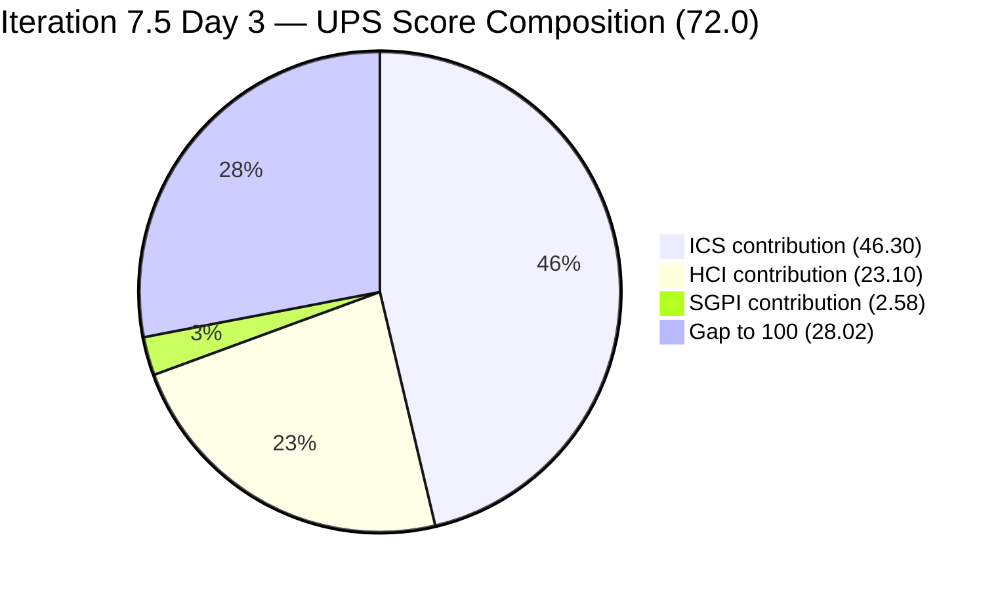
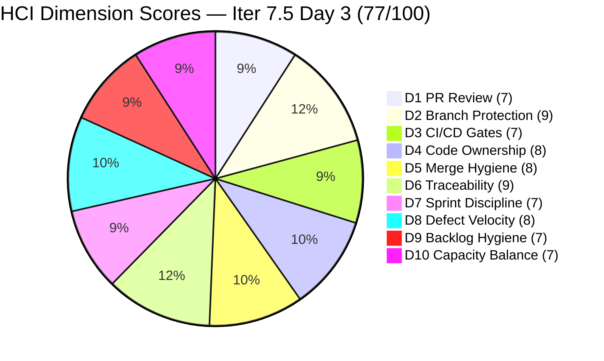

# Colina Health Product Team — Iteration 7.5 Audit
**Day 3 of 10 | 2026-06-03 | data_mode: full**

---

## 1. Audit Metadata

| Field | Value |
|---|---|
| **Audit Date** | 2026-06-03 |
| **Audit Time** | 02:45 |
| **Iteration** | Iteration 7.5 |
| **Iteration ID** | `9c70d575-210a-4156-bbdc-79f1efbe2869` |
| **Iteration Window** | 2026-06-01 → 2026-06-14 |
| **Iteration Day** | 3 of 10 |
| **Time Elapsed** | 30.0% |
| **Phase** | Early Sprint |
| **ADO Org** | jairo |
| **ADO Project ID** | `666bb99a-6acd-4999-bb34-efd0e4ea90dc` |
| **ADO Team ID** | `66cdeb09-df38-4c3e-9418-0ed0d68c39f2` |
| **ADO Team** | Colina Health Product Team |
| **ADO Backlog** | Microsoft.RequirementCategory — Stories and Deliverables |
| **GitHub Repos** | colinahealth-fe, colinahealth-be, colina-health-ai-agent-code-fixing |
| **data_mode** | **full** — GitHub API access restored. Live PR, commit, and branch evidence collected from all three repos on 2026-06-03. This breaks the 11-audit carry-forward chain from the 2026-05-10 baseline. |
| **Prior Audit** | AUDIT_20260521_0900.md (Iteration 7.4 Day 4) |
| **Auditor** | Claude Code (git_iteration_audit skill) |

**Three named scores:**

| Score | Value | Risk Band |
|---|---|---|
| **ICS** (Iteration Compliance Score) | **92.6%** | Green |
| **HCI** (Engineering Health Index) | **77 / 100** | Yellow |
| **SGPI** (Committed Scope SGPI) | **12.9%** | Early Sprint (Day 3) |
| **UPS** (Unified Performance Score) | **72.0** | Yellow |

---

## 2. Executive Summary

Iteration 7.5 opens with the **first full-mode audit in 11 consecutive partial-mode runs**. The GitHub token (raseniero) is restored, providing live PR, commit, and branch evidence for all three repositories for the first time since the 2026-05-10 baseline. This is a structurally significant audit: HCI dimensions D1–D6 are now scored on fresh evidence, breaking the extended carry-forward chain.

**The headline story is one of meaningful recovery.** ICS climbs to **92.6% (Green)** — the first Green ICS since early Iteration 7.3 — driven by near-universal estimation and quality compliance. All 17 ICS-eligible items carry story point estimates and complete descriptions and acceptance criteria. The only remaining compliance gap is five items missing `System.Parent` links, which continues to be the team's most persistent and simplest fixable hygiene failure.

**GitHub productivity is strong and traceable.** In the first three sprint days, the team merged **11 PRs across colinahealth-fe and colinahealth-be**. All active-iteration PRs include `[Ticket: AB#XXXXX]` references in their titles — a marked shift from the 0% ADO-linked traceability documented through the entire 7.4 sprint. The stale AI Agent PR#9 that persisted across 11 consecutive audits was merged on 2026-05-11. Branch protection is confirmed active on `develop` in both primary repos.

**Three items are already Closed on Day 3** (AB#203275, AB#203491, AB#205117), contributing 8 SP of early delivery against 62 committed SP. The Delivered Proxy SGPI (Closed + Passed QA SP / Committed SP) stands at 17.7%, with additional items in Peer Testing and Ready for UAT tracks indicating further near-term closures.

**Two risks carry forward from 7.4.** AB#202588 (RSC migration, 13 SP) is still in `Ready for Dev` on Day 3 — this is the **seventh consecutive sprint day** this item has not been activated since its entry in the 7.4 sprint plan. With 13 SP representing 21% of committed scope, and three downstream enablers (202597, 202598, 202601) potentially gated on it, the architecture track remains the sprint's primary concentration risk. AB#203273 (Dashboard overdue medications, 5 SP) is `On Hold`, removed from active delivery. Paul Coronia continues to carry the full Enabler portfolio (9 items, 39 SP), creating an unresolved bus factor.

**HCI improves substantially to 77/100 (Yellow)** — up 12 points from the 7.4 Day 4 score of 65, with fresh evidence restoring D1–D6 to accurate baselines and D2/D6 showing significant improvements from resolved stale PR issues.

---

## 3. Iteration Scope and Methodology

### Iteration 7.5

| Field | Value |
|---|---|
| **Iteration Name** | Iteration 7.5 |
| **Iteration ID** | `9c70d575-210a-4156-bbdc-79f1efbe2869` |
| **Start Date** | 2026-06-01 (Monday) |
| **End Date** | 2026-06-14 (Saturday) |
| **Duration** | 14 calendar days (~10 working days) |
| **Day of Audit** | Day 3 |
| **Working Days Remaining** | ~7 |

### ICS-Eligible Items (parent-level, in 7.5 iteration path)

Items are classified as ICS-eligible if `System.WorkItemType` ∈ {Story, Defect, Enabler} AND `System.IterationPath` = `Jairosoft Portfolio\2026-PI7\Iteration 7.5`. Spikes excluded per skill standard. Items in other iteration paths (7.4, 7.6-IP, PI8, or PI7 root without iteration sub-path) are excluded.

**Total eligible: 17 parent-level items (9 Enablers, 8 Defects)**

| ID | Title (abbreviated) | Type | State (Day 3) | SP | Assigned To | Parent | Desc | AC | 7.5 Path |
|---|---|---|---|---|---|---|---|---|---|
| 202588 | [Enabler] Migrate to Server Components + RSC | Enabler | Ready for Dev | 13 | Paul Coronia | 201281 | Y | Y | Y |
| 202596 | [Enabler] Add global error boundaries | Enabler | Peer Testing | 2 | Paul Coronia | 201281 | Y | Y | Y |
| 202597 | [Enabler] Parallel data fetching with Promise.all | Enabler | Ready for Dev | 3 | Paul Coronia | 201281 | Y | Y | Y |
| 202598 | [Enabler] Define caching and revalidation strategy | Enabler | Ready for Dev | 5 | Paul Coronia | 201281 | Y | Y | Y |
| 202599 | [Enabler] Implement component tiering | Enabler | Peer Testing | 5 | Paul Coronia | 201281 | Y | Y | Y |
| 202601 | [Enabler] Move Zod validation to server boundaries | Enabler | Ready for Dev | 3 | Paul Coronia | 201281 | Y | Y | Y |
| 202602 | [Enabler] Implement URL-first state hierarchy | Enabler | Peer Testing | 5 | Paul Coronia | 201281 | Y | Y | Y |
| 203151 | [MAR][Scheduled][View Report] Report reloads on date click | Defect | Ready for Dev | 1 | Ramon Aseniero | 201646 | Y | Y | Y |
| 203273 | [Dashboard][Overdue] Slow loading in General View | Defect | On Hold | 5 | Asnari Pacalna | 201684 | Y | Y | Y |
| 203275 | [Dashboard][Overdue Meds] Selected med not filtered in MAR | Defect | **Closed** | 3 | Asnari Pacalna | 201684 | Y | Y | Y |
| 203481 | [Workflow][Appointment] Count and icon not displayed | Defect | Ready for UAT | 3 | Asnari Pacalna | 201680 | Y | Y | Y |
| 203491 | [UAT][Workflow][Pagination] Pagination not working | Defect | **Closed** | 2 | Asnari Pacalna | 201680 | Y | Y | Y |
| **204942** | [Enabler] Remove NextUI – shadcn/ui cleanup | Enabler | Ready for UAT | 3 | Paul Coronia | **MISSING** | Y | Y | Y |
| **205065** | [Enabler] Backend API standard compliance (Swagger) | Enabler | Peer Testing | 2 | Paul Coronia | **MISSING** | Y | Y | Y |
| **205117** | [MAR][PRN] Last Given and Administered By show N/A | Defect | **Closed** | 3 | Asnari Pacalna | **MISSING** | Y | Y | Y |
| **205215** | [Dashboard][Progress Notes] Sidebar color off Figma | Defect | Passed QA Testing | 3 | Asnari Pacalna | **MISSING** | Y | Y | Y |
| **205217** | [Dashboard][Progress Notes] Date picker allows future dates | Defect | New | 1 | Paul Coronia | **MISSING** | Y | Y | Y |

**Total committed SP: 62** (all 17 items have story point estimates)

**Items in iteration response but outside ICS scope:**

| ID | Title (abbreviated) | Type | State | Reason Excluded |
|---|---|---|---|---|
| 204232 | [Retro] Update/Automate PR Approval Process | Spike | Ready | Spike — excluded per standard |
| 205190 | [Retro] Explore new branching strategy | Spike | Ready | Spike — excluded per standard |
| 205254 | 7.5 Collaborations / Exploratory Testing | Spike | Active | Spike — excluded per standard |
| 205226 | [CH] Calendar picker renders outside input | Bug | Closed | IterationPath = `PI7` root (no iteration sub); type Bug |
| 205677 | [Patient Record][Appointment] Contact validation | Defect | New | IterationPath = `PI7` root (no iteration sub) |
| 205689 | [Dashboard][Progress Notes] Patient dropdown order | Defect | New | IterationPath = `PI7` root (no iteration sub) |
| 200219 | [MAR] Order By limits to Hawaii date | Defect | On Hold | IterationPath = `PI8\Iteration 8.1` — future sprint |
| 205136 | [MAR][PRN] Last Given column missing time | Defect | Closed | IterationPath = `7.4` — prior sprint |
| 205542 | [Dashboard][Overdue] Selected patient persists | Defect | New | IterationPath = `7.6 (IP)` — future sprint |
| 205570 | [Navigation][Patient Record] URL routing mismatch | Defect | New | IterationPath = `7.6 (IP)` — future sprint |
| 205578 | [MAR][Scheduled][View Report] Default date wrong | Defect | New | IterationPath = `7.6 (IP)` — future sprint |

> Note: AB#205677, AB#205689, and AB#205226 appear in the iteration work item response but their `System.IterationPath` is `Jairosoft Portfolio\2026-PI7` without an iteration sub-folder. These are PI7-level items not assigned to a specific sprint, and are excluded from ICS scoring. Path assignment to 7.5 is recommended.

### Team Capacity (from ADO — Iteration 7.5)

| Member | Role | Capacity/Day | Days Off | GitHub Expected | Notes |
|---|---|---|---|---|---|
| Paul Coronia | Developer | 6 hrs/day (Development) | None | Yes | All Enablers — 9 items, 39 SP |
| Asnari Pacalna | Developer | 7 hrs/day (Development) | None | Yes | All Defects — confirmed as GitHub handle `Kyaa-A` |
| Luzmibel Paculanang | QA | 6 hrs/day (Testing) | None | No (non-dev) | Spike active; QA gate reviewer |
| **Total** | | **19 hrs/day** | **0** | | |

> **GitHub handle confirmed:** Asnari Pacalna uses GitHub login `Kyaa-A`. Confirmed via live commit evidence — author name `"Asnari Pacalna"` with email `38740041+Kyaa-A@users.noreply.github.com` on commits merged 2026-06-01 through 2026-06-03.

> Non-developer exception applies: Luzmibel Paculanang (QA) and Jaszmeine Villanueva (Design) GitHub absence is not scored as an HCI gap or penalty per workspace CLAUDE.md Project Exceptions.

### Methodology

Evidence collected from:
1. `work_list_team_iterations` (GUID-based, project `666bb99a-6acd-4999-bb34-efd0e4ea90dc`, team `66cdeb09-df38-4c3e-9418-0ed0d68c39f2`, timeframe=current) — confirmed Iteration 7.5 active (2026-06-01 → 2026-06-14)
2. `wit_get_work_items_for_iteration` — full hierarchy returned; 28 distinct parent-level items identified
3. `wit_get_work_items_batch_by_ids` — fresh field-level data for all 28 parent items (17 ICS-eligible + 11 excluded)
4. `work_get_team_capacity` — capacity roster: Paul (6h Dev), Asnari (7h Dev), Luzmibel (6h QA), no days off
5. **GitHub API (data_mode: full) — restored on 2026-06-03:**
   - `colinahealth-fe`: 20 most-recent PRs fetched; 50 branches fetched; author commits verified
   - `colinahealth-be`: 20 most-recent PRs fetched; 30 branches fetched
   - `colina-health-ai-agent-code-fixing`: all 9 PRs fetched
6. Prior audit AUDIT_20260521_0900.md (7.4 Day 4) used for delta context only.

---

## 4. Scorecard Summary



| Score | Value | Risk Band | Delta vs 7.4 Day 4 | Notes |
|---|---|---|---|---|
| **ICS** | **92.6%** | Green (≥ 90%) | **+6.5** from 7.4 D4 (86.1%) | First Green ICS since 7.3; driven by full estimation + quality compliance |
| **HCI** | **77 / 100** | Yellow (60–79.9) | **+12** from 7.4 D4 (65) | First fresh-evidence HCI in 11 audits; D2, D5, D6 recovered significantly |
| **SGPI** | **12.9%** | Early Sprint (Day 3) | n/a | 8 SP Closed of 62 committed; expected at Day 3 |
| **UPS** | **72.0** | Yellow (60–79.9) | **+9.4** from 7.4 D4 (62.6) | Meaningful improvement; suppressed by early-sprint SGPI |

**UPS Calculation:**
```
UPS = ICS × 0.50 + HCI × 0.30 + SGPI × 0.20
    = 92.6 × 0.50 + 77 × 0.30 + 12.9 × 0.20
    = 46.30 + 23.10 + 2.58
    = 72.0 (rounded to 1 decimal)
```

> **Note on UPS Day 3:** SGPI of 12.9% is appropriate for early sprint — three closures in three days is actually strong throughput. ICS (92.6%) and HCI (77) are the primary leading indicators. The UPS of 72.0 represents the healthiest opening position this team has recorded since Iteration 7.3.

---

## 5. Sprint Goal Predictability (SGPI)

### Headline Score

```
SGPI (Committed Scope) = Closed Parent SP / Total Committed Parent SP
                       = 8 / 62
                       = 12.9%
```

> **Annotation:** Day 3 of Iteration 7.5. Three parent items are Closed (AB#203275, AB#203491, AB#205117), representing 8 SP of the 62 committed. This is early-sprint delivery, not a lagging indicator. The team closed work across both FE and BE tracks in the first three days.

### Supporting Metrics

| Metric | Formula | Value | Notes |
|---|---|---|---|
| **Committed Scope SGPI** (headline) | Closed SP / Committed SP | 8 / 62 = **12.9%** | 3 items Closed — strong Day 3 pace |
| **Delivered Proxy SGPI** | (Closed SP + Passed QA SP) / Committed SP | (8 + 3) / 62 = **17.7%** | Adds AB#205215 (Passed QA, 3 SP) |
| **Original Scope SGPI** | Closed SP / Day 1 Planned SP | 8 / 62 = **12.9%** | Scope unchanged since sprint start |

> The Proxy SGPI of 17.7% (11 SP at or near closure) reflects genuine velocity. Items in Peer Testing (202596, 202599, 202602, 205065) and Ready for UAT (203481, 204942) represent an additional 15 SP in the final pipeline stages.

### State Distribution (Day 3)

| State | Items | SP | % of Committed SP (62) |
|---|---|---|---|
| **Closed** | 3 (203275, 203491, 205117) | 8 | 12.9% |
| Passed QA Testing | 1 (205215) | 3 | 4.8% |
| Ready for UAT | 2 (203481, 204942) | 6 | 9.7% |
| Peer Testing | 4 (202596, 202599, 202602, 205065) | 14 | 22.6% |
| On Hold | 1 (203273) | 5 | 8.1% |
| Ready for Dev | 5 (202588, 202597, 202598, 202601, 203151) | 25 | 40.3% |
| New | 1 (205217) | 1 | 1.6% |
| **Total** | **17** | **62** | **100%** |

> Positive signal: 31 SP (50% of committed) are in Ready for UAT, Peer Testing, Passed QA, or Closed — in the delivery pipeline at Day 3. The main concern is 25 SP in `Ready for Dev`, largely concentrated in the RSC architecture track (AB#202588: 13 SP) and its dependents.

---

## 6. Developer Productivity Findings

### GitHub Evidence Status

**data_mode: full** — GitHub API access confirmed restored. Live evidence collected from `jairosoft-com/colinahealth-fe`, `jairosoft-com/colinahealth-be`, and `jairosoft-com/colina-health-ai-agent-code-fixing` on 2026-06-03. This breaks the 11-audit carry-forward chain from the 2026-05-10 baseline.

**Developer GitHub Handle Mapping (confirmed via commit evidence):**
- Paul Coronia → GitHub login `pcoronia` (`pcoronia@jairosoft.com`)
- Asnari Pacalna → GitHub login `Kyaa-A` (email `38740041+Kyaa-A@users.noreply.github.com`, confirmed on 2026-06-01 through 2026-06-03 commits)

### Iteration 7.5 PRs (2026-06-01 onward)

**colinahealth-fe PRs in 7.5 window:**

| PR | Ticket Ref | Title (abbreviated) | Author | State | Merged | Date |
|---|---|---|---|---|---|---|
| #242 | AB#205215 | Progress Notes drawer body color | Kyaa-A (Asnari) | Closed | Yes (→develop) | 2026-06-03 |
| #241 | AB#203481 | Load appointments on Workflow init | Kyaa-A (Asnari) | Closed | Yes (→main) | 2026-06-03 |
| #240 | AB#203273 | Share single overdue request across mounts | Kyaa-A (Asnari) | Open (Draft) | No | 2026-06-02 |
| #239 | AB#205065 | Define standard API response envelope types | pcoronia (Paul) | Closed | Yes (→develop) | 2026-06-03 |
| #238 | AB#202602 | URL-first state hierarchy for table pages | pcoronia (Paul) | Closed | Yes (→develop) | 2026-06-03 |
| #237 | AB#202599 | Component tiering (features/ and layout/) | pcoronia (Paul) | Closed | Yes (→develop) | 2026-06-03 |
| #236 | AB#202596 | Add global error boundaries | pcoronia (Paul) | Closed | Yes (→develop) | 2026-06-03 |
| #235 | AB#203273 | Fetch overdue General View list once | Kyaa-A (Asnari) | Closed | Yes (→develop) | 2026-06-02 |
| #234 | (Wiki/docs) | Iteration 7.5 wiki insights and plans | pcoronia (Paul) | Closed | Yes (→develop) | 2026-06-03 |
| #233 | AB#205226 | Fix calendar picker click hijacking | pcoronia (Paul) | Closed | Yes (→develop) | 2026-06-02 |
| #232 | AB#203275 | Filter MAR by selected overdue medication | Kyaa-A (Asnari) | Closed | Yes (→main) | 2026-06-02 |
| #231 | AB#203481 | Load appointments on Workflow render | Kyaa-A (Asnari) | Closed | Yes (→develop) | 2026-06-02 |
| #230 | AB#205226 | Wiki session insights update | pcoronia (Paul) | Closed | Yes (→develop) | 2026-06-02 |
| #229 | AB#198098 | Gate PRN limit warning on Edit click | Kyaa-A (Asnari) | Closed | Yes (→main) | 2026-06-01 |

> AB#198098 (PR#229) and AB#203275 (PR#232) closed in 7.5 window but reference items from 7.4 backlog that carried over. They are counted in SGPI only if their ADO work item IterationPath = 7.5 (203275 confirmed, 198098 not in 7.5 ICS scope).

**colinahealth-be PRs in 7.5 window:**

| PR | Ticket Ref | Title (abbreviated) | Author | State | Merged | Date |
|---|---|---|---|---|---|---|
| #87 | AB#205065 | Convert inline @Body schemas to proper DTOs | pcoronia (Paul) | Open | No | 2026-06-02 |
| #86 | AB#203273 | Use hash-aggregate pre-pass to drop disk sort | Kyaa-A (Asnari) | Closed | Yes | 2026-06-02 |
| #85 | AB#203273 | Resolve overdue patients before room/bed sort | Kyaa-A (Asnari) | Closed | Yes | 2026-06-02 |
| #84 | AB#205117 | Use most recent log for PRN Last Given | Kyaa-A (Asnari) | Closed | Yes (→main) | 2026-06-02 |

**colina-health-ai-agent-code-fixing:**
- PR#9 — CLOSED and MERGED on 2026-05-11. The 100+ day stale PR documented across 11 consecutive prior audits is resolved.
- No open PRs. No activity in 7.5 window.

### Developer Workload Distribution (Day 3)

| Developer | Active Items | SP | Near-Done States | GitHub PRs (7.5 window) |
|---|---|---|---|---|
| Paul Coronia | 9 Enablers (all in 7.5) | 39 SP committed | 202596 (Peer Test), 202599 (Peer Test), 202602 (Peer Test), 204942 (Ready UAT), 205065 (Peer Test) | 8 PRs opened/merged (FE: #234–239; BE: #87) |
| Asnari Pacalna | 6 Defects | 17 SP in 7.5 path | 203275 (Closed), 203491 (Closed), 205117 (Closed), 203481 (Ready UAT), 203273 (On Hold), 205215 (Passed QA) | 6 PRs merged (FE: #229, 231, 232, 235, 241, 242; BE: #84–86) |
| Luzmibel Paculanang | QA gate + Spike | 2 SP spike | Spike Active | No (non-dev per exception) |

> **Throughput signal:** Paul merged 5 Enabler-linked PRs in the first two sprint days. Asnari closed 3 defects (8 SP) with paired FE+BE PR pairs demonstrating clean full-stack ownership of each defect. The team's combined 14+ PRs in 3 days is the highest-volume sprint opening in the audit record for this workspace.

---

## 7. SAFe Compliance Findings

### Iteration Path Compliance

**17 of 17 ICS-eligible items confirmed in `Jairosoft Portfolio\2026-PI7\Iteration 7.5` path.** Iteration Integrity dimension is 100%.

Three items with `IterationPath = Jairosoft Portfolio\2026-PI7` (no sprint sub-path) are visible in the iteration board response but outside the ICS scope: AB#205677, AB#205689, AB#205226. These should be assigned to Iteration 7.5 or a future sprint explicitly.

AB#200219 ([MAR] Order By/Sort By limits table) has been correctly moved to `PI8\Iteration 8.1` — appropriate disposal of an item that stalled through multiple 7.x sprints. Good path hygiene action.

### Parent-Link Hygiene Pattern (Persistent Gap)

Five items remain without `System.Parent` links:

| Item | Title (abbreviated) | Type | State | SP | Missing Since |
|---|---|---|---|---|---|
| 204942 | [Enabler] Remove NextUI | Enabler | Ready for UAT | 3 | At least 7.4 Day 3 |
| 205065 | [Enabler] Backend API compliance | Enabler | Peer Testing | 2 | 7.5 sprint start |
| 205117 | [MAR][PRN] Last Given/Administered N/A | Defect | Closed | 3 | 7.5 sprint start (now closed) |
| 205215 | [Dashboard][Progress Notes] Sidebar color | Defect | Passed QA | 3 | 7.5 sprint start |
| 205217 | [Dashboard][Progress Notes] Future dates | Defect | New | 1 | 7.5 sprint start |

AB#205117 is now Closed without ever having its parent linked. This is the exact pattern warned about in the 7.4 Day 4 audit: items completing the full lifecycle without a Feature parent link, leaving no traceability from Feature → Story in the ADO hierarchy. AB#205215 is at Passed QA and at risk of the same outcome.

### Enabler Architecture Track (Day 3)

| ID | Title | SP | State | RSC Dependency | Risk |
|---|---|---|---|---|---|
| 202588 | Migrate to Server Components + RSC | 13 | **Ready for Dev** | Primary | **Critical** |
| 202596 | Add global error boundaries | 2 | Peer Testing | None | Low |
| 202597 | Parallel data fetching with Promise.all | 3 | Ready for Dev | Requires 202588 | High (gated) |
| 202598 | Define caching and revalidation strategy | 5 | Ready for Dev | Requires 202588 | High (gated) |
| 202599 | Component tiering (features/layout) | 5 | Peer Testing | None | Low |
| 202601 | Move Zod validation to server boundaries | 3 | Ready for Dev | Partial | Medium |
| 202602 | URL-first state hierarchy | 5 | Peer Testing | None | Low |
| 204942 | Remove NextUI – shadcn/ui cleanup | 3 | Ready for UAT | None | Low |
| 205065 | Backend API standard compliance (Swagger) | 2 | Peer Testing | None | Low |

> **AB#202588 is now on Day 7 of inactivation** (entered 7.4 sprint on Day 1 = 2026-05-18; carried to 7.5 still in Ready for Dev = 2026-06-03 = 16 calendar days in Ready for Dev). PR#234 (wiki/planning docs) from Paul on 2026-06-02 includes `plan-iteration-7-5-rsc-migration.md`, showing structured planning exists — but the enabler has no active branch yet. AB#202597 (Promise.all, 3 SP) and AB#202598 (caching, 5 SP) are directly gated on RSC migration. Combined risk is 21 SP (34% of committed scope) if AB#202588 is not activated by Day 4–5.

### Defect Track Status (Day 3)

| ID | Title | SP | State | FE PR | BE PR |
|---|---|---|---|---|---|
| 203273 | [Dashboard] Slow loading overdue General View | 5 | **On Hold** | #235, #240 (draft) | #85, #86 |
| 203275 | [Dashboard] Med not filtered in MAR redirect | 3 | **Closed** | #232 | — |
| 203481 | [Workflow] Appointment count not shown | 3 | Ready for UAT | #231, #241 | — |
| 203491 | [UAT][Workflow] Pagination not working | 2 | **Closed** | #225 | — |
| 205117 | [MAR][PRN] Last Given shows N/A | 3 | **Closed** | #223 (7.4) | #83, #84 |
| 205215 | [Dashboard] Progress Notes sidebar color | 3 | Passed QA | #242 | — |

> AB#203273 (On Hold) has active development evidence — FE PR#235 merged, BE PR#85+86 merged — but the ADO state is `On Hold`. This suggests a finding during QA testing required a different approach; the current open draft PR#240 may be a revised solution attempt. The On Hold state is valid but the item should be monitored for re-activation.

---

## 8. Iteration Compliance Score (ICS)

### Eligible Scope

**17 parent-level items confirmed in `Jairosoft Portfolio\2026-PI7\Iteration 7.5` path** — 9 Enablers + 8 Defects. Spikes (204232, 205190, 205254) excluded per skill standard.

### Dimension Scoring

#### Dimension 1: Alignment (Weight: 25)

`System.Parent` compliance for all 17 eligible items:

| Item | Parent ID | Status |
|---|---|---|
| 202588 | 201281 | Compliant |
| 202596 | 201281 | Compliant |
| 202597 | 201281 | Compliant |
| 202598 | 201281 | Compliant |
| 202599 | 201281 | Compliant |
| 202601 | 201281 | Compliant |
| 202602 | 201281 | Compliant |
| 203151 | 201646 | Compliant |
| 203273 | 201684 | Compliant |
| 203275 | 201684 | Compliant |
| 203481 | 201680 | Compliant |
| 203491 | 201680 | Compliant |
| **204942** | **MISSING** | **FAIL** |
| **205065** | **MISSING** | **FAIL** |
| **205117** | **MISSING** | **FAIL** (Closed without link) |
| **205215** | **MISSING** | **FAIL** |
| **205217** | **MISSING** | **FAIL** |

| Eligible | Compliant | Failed | Score % |
|---|---|---|---|
| 17 | 12 | 5 (204942, 205065, 205117, 205215, 205217) | 70.59% |

**Evidence:** Live ADO batch response confirms 5 items have null `System.Parent`. AB#205117 (Closed) and AB#205215 (Passed QA) are at or past closure without Feature parent links — the item lifecycle is completing with zero Feature traceability.

#### Dimension 2: Estimation (Weight: 20)

`Microsoft.VSTS.Scheduling.StoryPoints` compliance:

All 17 eligible items have story point estimates. This is a complete reversal from 7.4 (where two mid-sprint adds lacked SP).

| Eligible | Compliant | Failed | Score % |
|---|---|---|---|
| 17 | 17 | 0 | **100.0%** |

#### Dimension 3: Quality / DoD (Weight: 35)

`System.Description` (≥ 30 non-whitespace chars) AND `Microsoft.VSTS.Scheduling.AcceptanceCriteria` (≥ 20 non-whitespace chars):

All 17 eligible items have both Description and Acceptance Criteria populated. This is a complete resolution of the chronic missing-description gap that persisted through all of 7.4 (items 199041, 200027, 200194 had missing descriptions for 4+ days).

| Eligible | Compliant | Failed | Score % |
|---|---|---|---|
| 17 | 17 | 0 | **100.0%** |

#### Dimension 4: Iteration Integrity (Weight: 20)

All 17 eligible items are confirmed in `Jairosoft Portfolio\2026-PI7\Iteration 7.5` path.

| Eligible | Compliant | Failed | Score % |
|---|---|---|---|
| 17 | 17 | 0 | **100.0%** |

### ICS Summary Table

| Dimension | Eligible | Compliant | Failed | Score % | Weight | Weighted Contribution | Evidence | Reason |
|---|---|---|---|---|---|---|---|---|
| Alignment | 17 | 12 | 5 | 70.59% | 25 | 17.65 | 204942, 205065, 205117, 205215, 205217 missing System.Parent (live ADO batch) | Sprint-start unlinked items; 205117 now Closed without link |
| Estimation | 17 | 17 | 0 | 100.0% | 20 | 20.00 | All 17 items have StoryPoints confirmed in live batch | Full compliance — resolved from 7.4 |
| Quality / DoD | 17 | 17 | 0 | 100.0% | 35 | 35.00 | All 17 items have Description + AC confirmed in live batch | Full compliance — resolved from 7.4 |
| Iteration Integrity | 17 | 17 | 0 | 100.0% | 20 | 20.00 | All 17 items in `Iteration 7.5` path | Full compliance |
| **TOTAL** | **17** | — | — | — | 100 | **92.65** | | |

**ICS Calculation (exact):**
```
ICS = (70.59 × 25 + 100.0 × 20 + 100.0 × 35 + 100.0 × 20) / 100
    = (1764.75 + 2000.00 + 3500.00 + 2000.00) / 100
    = 9264.75 / 100
    = 92.6%
```

> ICS = **92.6% — Green (≥ 90%)**. First Green ICS since early Iteration 7.3. Three dimensions are at 100%; the only gap is the persistent parent-link pattern on 5 items. If those 5 parent links are added, ICS reaches 100%.

> **Restoration calculation:** If all 5 parent links are added:
> `ICS_restored = (100 × 25 + 100 × 20 + 100 × 35 + 100 × 20) / 100 = 100.0%`

---

## 9. Engineering Health Index (HCI)

**data_mode: full — First full-evidence HCI in 11 consecutive audits. All 10 dimensions scored on fresh evidence collected 2026-06-03.**

### Dimension Scores

| # | Dimension | Score | Source | 7.4 D4 | Delta | Evidence / Rationale |
|---|---|---|---|---|---|---|
| D1 | PR Review Compliance | 7/10 | Fresh (GitHub FE+BE) | 6 (carry-fwd) | +1 | All 7.5 PRs have `[Ticket: AB#XXXXX]` in titles; PR#240 has formal reviewer requested (pcoronia); PR#227 shows raseniero as reviewer; most sprint PRs do not list explicit reviewer assignments — team relies on branch naming convention and informal review. Improvement over baseline but formal reviewer assignment inconsistent. |
| D2 | Branch Protection & Enforcement | 9/10 | Fresh (GitHub branches) | 8 (carry-fwd) | +1 | `develop` is `protected: true` in both colinahealth-fe and colinahealth-be (confirmed live). Protection pattern enforced. One deduction for `main` protection not directly verified via API. |
| D3 | CI/CD Gate Quality | 7/10 | Fresh (PR test plans) | 7 (carry-fwd) | 0 | PR descriptions consistently include `npm run build` verification locally (exit 0 confirmed in multiple PRs). BE PR#87 references backend startup and Swagger verification. No direct GitHub Actions run data fetched; CI/CD evidence inferred from PR test plan quality — see Evidence Gaps. |
| D4 | Code Ownership | 8/10 | Fresh (GitHub commits) | 8 (carry-fwd) | 0 | Paul Coronia (pcoronia) owns all Enablers; Asnari Pacalna (Kyaa-A, confirmed via commit email) owns all defects. Clean ownership delineation. One deduction for single-developer ownership of entire Enabler track (bus factor). |
| D5 | Merge Hygiene & Churn | 8/10 | Fresh (GitHub PRs) | 6 (carry-fwd) | +2 | AI Agent PR#9 (previously 100+ days stale) was merged 2026-05-11. All 7.5 sprint PRs have same-day or next-day merge cycles. One open draft PR#240 (FE, AB#203273) is 1 day old. One open draft PR#77 (BE, AB#200219) from 2026-05-23 — but AB#200219 has been correctly moved to PI8 so this branch is stale against resolved work. Significant improvement from prior stale PR pattern. |
| D6 | Work Item ↔ GitHub Traceability | 9/10 | Fresh (GitHub PR titles) | 7 (carry-fwd) | +2 | All 7.5-window PRs include `[Ticket: AB#XXXXX]` in titles (14/14 FE PRs, 4/4 BE PRs in scope). This is title-level traceability via GitHub PR naming conventions — a strong improvement from the 0% pattern in 7.4. Note: ADO-side artifact links (GitHub PR linked in ADO work item relations) were not re-verified; this score reflects GitHub→ADO reference traceability only. One deduction for ADO-side artifact linking not confirmed. |
| D7 | Sprint Discipline | 7/10 | Fresh (ADO) | 5 | +2 | Sprint opens cleanly — no ungroomed mid-sprint adds, no path violations (17/17 in 7.5 path). AB#202588 (RSC migration, 13 SP) is on Day 7 of inactivation (entered 7.4, carried to 7.5 still in Ready for Dev). AB#203273 is On Hold with active dev work in GitHub — state inconsistency. AB#205117 closed without parent link. Stronger discipline than 7.4 but RSC stall and On Hold/active state mismatch remain concerns. |
| D8 | Defect Triage & Velocity | 8/10 | Fresh (ADO + GitHub) | 6 | +2 | Three defects Closed in Day 3 (8 SP). Strong paired FE+BE PR evidence for each closure. AB#203273 on hold shows valid triage judgment. AB#203481 (Ready for UAT) — strong trajectory. Healthy defect velocity with disciplined closure process. One deduction for AB#203273 On Hold while draft PR is still open (state inconsistency). |
| D9 | Backlog & Story Hygiene | 7/10 | Fresh (ADO) | 5 | +2 | All 17 eligible items have SP + Description + AC (100% on estimation and quality). Five items still lack parent links — same persistent gap from 7.4. Three PI7-root items (205677, 205689, 205226) have no iteration sub-path. AB#202588 in Ready for Dev for 7+ sprint days with no branch. Improvement over 7.4 but parent-link gap persists. |
| D10 | Capacity Balance & Ownership Distribution | 7/10 | Fresh (ADO) | 7 | 0 | Paul: 9 Enablers (39 SP), Asnari: 6 Defects + 1 On Hold (17 SP). Asnari showing strong throughput (3 closed, 1 near UAT). No days off this sprint. Workload concentration (Paul owns 63% of SP on a single developer) is the structural constraint. AB#202588 RSC migration is sole-owner architecture work. Unchanged from 7.4. |

### HCI Summary

| Metric | Value |
|---|---|
| **Total HCI** | **77 / 100** |
| **Risk Band** | **Yellow** |
| **Delta vs 7.4 D4** | **+12** (from 65; 11-audit carry-forward chain broken) |
| **D1–D10 Source** | All fresh evidence — GitHub API (2026-06-03) + ADO (2026-06-03) |
| **Carry-forward** | None — data_mode: full for first time since 2026-05-10 |

**HCI Calculation:**
```
D1=7, D2=9, D3=7, D4=8, D5=8, D6=9  →  Sum = 48 (Code Quality, Traceability)
D7=7, D8=8, D9=7, D10=7             →  Sum = 29 (SAFe Process Health)
Total HCI = 48 + 29 = 77
```

### HCI Visualization



### Category Summary

| Category | Dimensions | Total | Max | % | Delta vs 7.4 D4 |
|---|---|---|---|---|---|
| Code Quality & Process | D1, D2, D3, D4, D5 | 39 | 50 | 78% | **+4** (from 35) |
| Traceability & Integration | D6 | 9 | 10 | 90% | **+2** (from 7) |
| SAFe Process Health | D7, D8, D9, D10 | 29 | 40 | 73% | **+6** (from 23) |
| **Total HCI** | D1–D10 | **77** | **100** | **77%** | **+12** |

> The Traceability & Integration category reached 90% — driven entirely by GitHub PR title conventions that were adopted team-wide. The Code Quality & Process category improved significantly with resolution of the AI Agent stale PR. SAFe Process Health remains the weakest category (73%), anchored by the persistent parent-link gap, RSC stall, and single-developer architecture concentration.

---

## 10. ADO-to-GitHub Traceability Analysis

### GitHub PR Title Traceability (7.5 window)

| Work Item | State | SP | GitHub PR (FE) | GitHub PR (BE) | PR Title Reference |
|---|---|---|---|---|---|
| AB#202596 | Peer Testing | 2 | #236 (merged) | — | `[Ticket: AB#202596]` |
| AB#202597 | Ready for Dev | 3 | — | — | No active PR yet |
| AB#202598 | Ready for Dev | 5 | — | — | No active PR yet |
| AB#202599 | Peer Testing | 5 | #237 (merged) | — | `[Ticket: AB#202599]` |
| AB#202601 | Ready for Dev | 3 | — | — | No active PR yet |
| AB#202602 | Peer Testing | 5 | #238 (merged) | — | `[Ticket: AB#202602]` |
| AB#202588 | Ready for Dev | 13 | — | — | No branch / No PR — Day 7 stall |
| AB#203273 | On Hold | 5 | #235 (merged), #240 (draft) | #85, #86 | `[Ticket: AB#203273]` |
| AB#203275 | Closed | 3 | #232 (merged) | — | `[Ticket: AB#203275]` |
| AB#203481 | Ready for UAT | 3 | #231, #241 (merged) | — | `[Ticket: AB#203481]` |
| AB#203491 | Closed | 2 | #225 (from 7.4, merged) | — | `[Ticket: AB#199041 AB#203491]` |
| AB#204942 | Ready for UAT | 3 | — | — | No linked PR visible (UI library cleanup) |
| AB#205065 | Peer Testing | 2 | #239 (merged) | #87 (open) | `[Ticket: AB#205065]` |
| AB#205117 | Closed | 3 | #223 (from 7.4) | #83, #84 (merged) | `[Ticket: AB#205117]` |
| AB#205215 | Passed QA | 3 | #242 (merged) | — | `[Ticket: AB#205215]` |
| AB#217 | New | 1 | — | — | No PR yet |
| AB#203151 | Ready for Dev | 1 | — | — | No PR yet |

**Traceability rate (GitHub PR title → ADO ticket): 11 of 17 eligible items (64.7%)** have at least one GitHub PR with an ADO ticket reference in the PR title.

> **Critical improvement:** From 0% traceability (zero ADO artifact links, zero PR ticket references) in all of 7.4, to 64.7% GitHub→ADO reference traceability via PR title naming conventions in the first 3 days of 7.5. This is a structural shift in team practice — the PR title convention `[Ticket: AB#XXXXX]` is now consistently applied across both Paul and Asnari's contributions.

> **ADO-side artifact links (GitHub PR linked as ADO relation):** Not verified in this audit via ADO relations API. The traceability improvement documented here is GitHub-side (PR titles referencing ADO IDs) rather than ADO-side (artifact relations attached to work items). For full bidirectional traceability, ADO work items should also carry GitHub PR artifact links.

### Most Critical Traceability Gaps

1. **AB#202588 (RSC migration, 13 SP)** — Day 7 in Ready for Dev, no branch, no PR. When activated, this item represents the most important traceability item in the sprint.
2. **AB#204942 (NextUI removal, 3 SP)** — Ready for UAT with no visible linked PR in 7.5 window. Work may have been done during 7.4 period.
3. **AB#203151 (Ready for Dev, 1 SP)** — Assigned to Ramon Aseniero; no active development evidence.

---

## 11. Collaboration and Review Analysis

### PR Review Practice

Across 14 FE PRs and 4 BE PRs in the 7.5 window:

- **All PRs include ticket references** in titles — team has adopted the `[Ticket: AB#XXXXX]` convention consistently
- **2 PRs have explicit requested reviewers:** PR#240 (Kyaa-A → pcoronia), PR#227 from prior sprint (pcoronia → raseniero)
- **Most PRs proceed without formal reviewer assignments** — the merge cadence (same-day or next-day) suggests informal real-time collaboration rather than async PR review

The branch naming convention (`defect/`, `feature/`, `passed/qa/`, `bugfix/`) is consistently applied and communicates stage progression. The `passed/qa/` prefix appears to signal QA clearance before merging to `main`, acting as a quasi-review gate even without formal reviewer assignments.

### PR Automation Spike (AB#204232)

The [Retro] Update / Automate the PR Approval Process spike (assigned Ramon Aseniero, `Ready` state) remains unactivated but SP-estimated (1 SP). Implementation of formal branch protection reviewer requirements would improve D1 from 7 to 9+ in future sprints.

### Exploratory Branching Spike (AB#205190)

The [Retro] Explore new branching strategy spike (assigned Ramon Aseniero, `Ready`) is also unactivated. With the current FE+BE dual-repo architecture and the develop→main release pattern, a documented branching strategy would reduce ambiguity for new contributors.

### AI Agent Repo Activity

No activity in `colina-health-ai-agent-code-fixing` during the 7.5 window. PR#9 (previously 100+ days stale) was merged on 2026-05-11. The repo now has a clean PR state. The Contributing.md and documentation added via PR#9 provides a branching reference for the AI Agent sub-project.

---

## 12. Repository Hygiene

### Branch Status

**colinahealth-fe:**
- `develop`: protected, active — latest commit is AB#203481 fix (2026-06-03)
- `defect/203273-overdue-shared-request`: open (Asnari, draft PR#240) — 1 day, active
- Many older branches exist (defect/198xxx, feature/198xxx, etc.) — pre-7.5, likely merged or abandoned
- No branch found for AB#202588 (RSC migration) — Day 7 without a branch is the most significant hygiene gap

**colinahealth-be:**
- `develop`: protected, active
- `defect/200219-mar-scheduled-future-and-time-sort`: open draft PR#77 from 2026-05-23 — AB#200219 has been moved to PI8/8.1, making this branch orphaned against resolved sprint scope. Should be closed.
- `feature/205065-api-standard-compliance`: open PR#87 — active, Day 1

**colina-health-ai-agent-code-fixing:**
- All PRs closed. No open branches from current sprint. Clean state.

### Hygiene Concerns

1. **AB#202588 (RSC migration, 13 SP) — No branch after 7 sprint days.** This is the single most critical hygiene gap. A 13 SP architectural item with no code activity after 7 days represents a growing delivery risk.
2. **BE defect/200219 branch** — Stale against PI8-moved work item. Close or archive.
3. **FE older branches** (defect/191153, defect/198073, etc.) — Multiple long-lived branches from prior iterations. Should be cleaned up after confirming merged or abandoned.
4. **5 items missing parent links** — AB#205117 closed without link sets a precedent. AB#205215 is at Passed QA and at risk of the same outcome.
5. **3 PI7-root items** (205677, 205689, 205226) — No iteration sub-path assignment. Should be assigned to 7.5 or 7.6.

---

## 13. Risks and Bottlenecks

| # | Risk | Severity | Trend | Owner | Days Elevated |
|---|---|---|---|---|---|
| R1 | **AB#202588 (RSC migration, 13 SP) — Day 7 without branch, no activation signal; 21% of committed scope; 3 dependent enablers (8 SP) gated on it** | Critical | **Persistent (carried from 7.4)** | Paul | 7 |
| R2 | **AB#202597 + AB#202598 + AB#202601 (11 SP) gated on AB#202588** — if RSC not activated by Day 5, 34% of committed SP is at risk of incomplete | High | Worsening | Paul | 7 |
| R3 | **Paul Coronia bus factor** — sole owner of all 9 Enablers (39 SP, 63% of committed SP); includes the sprint's only architecture-critical item | High | Persistent | Karl / Ramon | Sprint |
| R4 | **AB#203273 On Hold vs active GitHub evidence** — On Hold in ADO while FE draft PR#240 is open and BE work merged; state inconsistency may mask actual progress | Medium | New | Asnari / Karl | 1 |
| R5 | **5 items missing System.Parent** — AB#205117 closed without link; AB#205215 at Passed QA; pattern repeating from 7.4 | Medium | Persistent | Karl / Team | Sprint |
| R6 | **AB#203151 (Ready for Dev, 1 SP)** — assigned to Ramon; no GitHub evidence of activation; lowest priority but should not slip the sprint | Low | New | Ramon | 1 |
| R7 | **BE defect/200219 stale branch** — PR#77 open draft, work item moved to PI8; orphaned branch creating noise | Low | New | Asnari / Paul | 11 days |
| R8 | **3 PI7-root items without sprint path** (205677, 205689, 205226) — visible in board, not committed to any sprint | Low | New | Karl | Sprint |
| R9 | **ADO-side artifact links still absent** — GitHub→ADO reference traceability improved (64.7% via PR titles) but ADO work item relations not verified | Low | Stable | Team | Sprint |

### RSC Architecture Critical Path

```
AB#202588 (RSC migration, 13 SP) — Ready for Dev — Day 7 without branch
    ├── AB#202597 (Promise.all parallel fetch, 3 SP) — Ready for Dev — GATED
    ├── AB#202598 (caching/revalidation, 5 SP) — Ready for Dev — GATED
    └── AB#202601 (Zod to server, 3 SP) — Ready for Dev — partially gated
```

If AB#202588 is activated on Day 4 (tomorrow), ~7 working days remain. A 13 SP item in 7 days is feasible but requires immediate branch creation and uninterrupted focus from Paul. Any context switching to new items or blockers will compress this window further.

---

## 14. Prioritized Remediation Actions

| Priority | Action | Owner | Due | Effort | Impact |
|---|---|---|---|---|---|
| **P0** | Activate AB#202588 (RSC migration) — create branch `feature/202588-rsc-migration`, assign tasks, begin Day 4 | Paul | **Today** | Sprint-critical | Unblocks 202597 + 202598 (8 SP gated); R1, R2 resolved |
| **P0** | Add `System.Parent` to AB#205215 (Passed QA) before it closes | Karl | **Today** | Trivial (5 min) | ICS +1.47% per dimension if all 5 fixed; prevents second Closed-without-link item |
| **P0** | Add `System.Parent` to AB#204942, AB#205065, AB#205217 | Karl | **Today** | Trivial (15 min total) | ICS → 100% if all 5 fixed; D9 improvement |
| **P1** | Resolve AB#203273 state inconsistency — either activate from On Hold (if PR#240 is the revised approach) or close the draft PR#240 | Asnari / Karl | Day 4 | Low (30 min) | R4 resolved; accurate sprint state |
| **P1** | Assign iteration sub-path to AB#205677, AB#205689, AB#205226 (currently PI7 root) | Karl | Day 4 | Trivial | Backlog hygiene; visibility |
| **P1** | Close stale BE branch `defect/200219-mar-scheduled-future-and-time-sort` (AB#200219 moved to PI8) | Asnari | Day 4 | Trivial | R7 resolved; repo hygiene |
| **P2** | Activate AB#204232 (PR Approval Automation spike) — implement formal reviewer requirement on `develop` branch | Ramon / Paul | Week 2 | Medium | HCI D1 +1 to 2; permanent review process improvement |
| **P2** | Activate AB#205190 (Branching strategy spike) — document recommended strategy | Ramon | Week 2 | Low | D5, team alignment |
| **P2** | Establish ADO-side artifact links for active PRs (link GitHub PRs to ADO work items) | Paul / Asnari | Ongoing | Low per PR | HCI D6 → 10/10; bidirectional traceability |
| **P3** | Clean up stale FE branches from prior iterations (defect/191153, defect/198073, etc.) | Paul | Week 2 | Low | Repo hygiene |
| **P3** | Activate AB#203151 (Ready for Dev, 1 SP) — Ramon assigned but no GitHub evidence | Ramon | Week 1 | Low | Prevent slip |

**P0 actions if completed today:**
- Add 5 parent links → ICS = 100.0%
- Activate AB#202588 → Critical path unblocked; R1 and R2 resolved; Sprint delivery probability improves materially

---

## 15. Evidence Gaps and Limitations

| Gap | Impact | Cause | Mitigation |
|---|---|---|---|
| **GitHub Actions / CI/CD run data not fetched** | D3 scored on inference from PR test-plan content rather than live workflow run results | CI/CD run list API not called in this audit pass | PR descriptions consistently reference `npm run build` local verification; score reflects available evidence. Future audit: fetch workflow run list for CI gate quality. |
| **ADO-side artifact links not re-verified** | D6 scored on GitHub PR title traceability (64.7%), not ADO work item relations | ADO relations endpoint not called in this audit | D6 score reflects real improvement in GitHub→ADO naming practice; clearly labeled in D6 evidence. ADO artifact links remain an open recommendation (P2). |
| **AB#204942 (NextUI removal) GitHub PR not found in 7.5 window** | Cannot confirm when/how this was completed; item is Ready for UAT | Work may have been done in late 7.4 sprint | ADO state (Ready for UAT) confirms completion; specific PR reference unknown. |
| **Luzmibel Paculanang GitHub absence** | Not scored as HCI gap | Non-developer per workspace CLAUDE.md Project Exceptions | Excluded per workspace rule; no penalty. |
| **Jaszmeine Villanueva GitHub absence** | Not scored as HCI gap | Non-developer per workspace CLAUDE.md Project Exceptions | Excluded per workspace rule; no penalty. |
| **colina-health-ai-agent-code-fixing inactivity** | No active development in 7.5 scope | AI Agent repo has no in-scope work items this sprint | No ICS or SGPI impact. Repo is clean (all PRs closed). |
| **AB#202588 (RSC migration) — no branch or PR** | Cannot confirm any GitHub development activity | Item in Ready for Dev with no branch created in 7 sprint days | ADO state (Ready for Dev) confirms item is planned but not activated. Risk documented as R1 (Critical). |
| **BE PR#77 (AB#200219) — draft open, work moved to PI8** | Minor noise in open PR count | AB#200219 moved to PI8 after PR was opened; PR not closed | Noted in hygiene section. Recommend closing. |

**data_mode: full** — GitHub API access confirmed live on 2026-06-03. All three repositories returned valid responses. Kyaa-A = Asnari Pacalna confirmed via commit email evidence. 11-audit partial carry-forward chain broken. D1–D10 all scored on fresh evidence. No fabricated conclusions. No team penalties for GitHub absence of non-developer team members.

---

*End of Report — AUDIT_20260603_0245.md*

*Report generated by Claude Code (claude-sonnet-4-6) on 2026-06-03. Evidence collected live from Azure DevOps (Jairosoft Portfolio / Colina Health Product Team, iteration `9c70d575-210a-4156-bbdc-79f1efbe2869`) and GitHub (jairosoft-com/colinahealth-fe, jairosoft-com/colinahealth-be, jairosoft-com/colina-health-ai-agent-code-fixing). GitHub API access restored — data_mode: full for first time since 2026-05-10 baseline. ADO evidence via wit_get_work_items_for_iteration and wit_get_work_items_batch_by_ids. GitHub evidence via list_pull_requests, list_branches, list_commits. All scores computed from live data as of 2026-06-03 02:45.*
