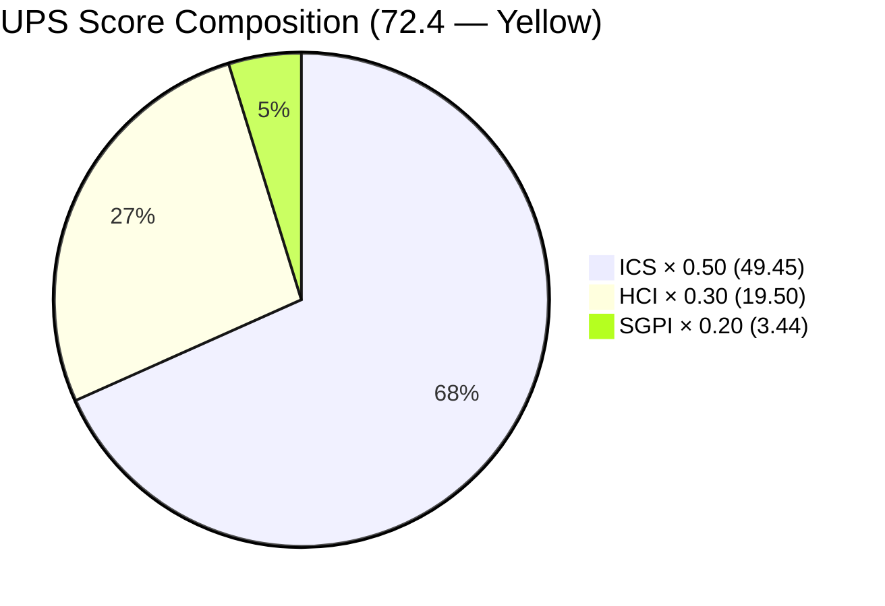
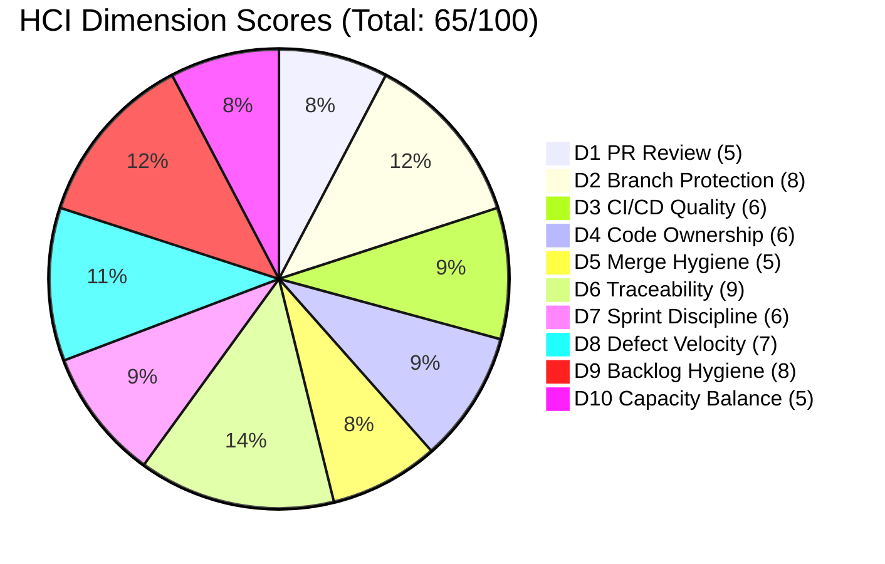

# Colina Health Product Team — Iteration 7.5 Audit
**Day 4 of 14 | 2026-06-04 | data_mode: full**

---

## 1. Audit Metadata

| Field | Value |
|---|---|
| **Audit Date** | 2026-06-04 |
| **Audit Time** | 00:00 |
| **Iteration** | Iteration 7.5 |
| **Iteration ID** | `9c70d575-210a-4156-bbdc-79f1efbe2869` |
| **Iteration Window** | 2026-06-01 → 2026-06-14 |
| **Iteration Day** | 4 of 14 |
| **Time Elapsed** | 28.6% |
| **Phase** | Early Sprint |
| **ADO Org** | jairo |
| **ADO Project ID** | `666bb99a-6acd-4999-bb34-efd0e4ea90dc` |
| **ADO Team ID** | `66cdeb09-df38-4c3e-9418-0ed0d68c39f2` |
| **ADO Team** | Colina Health Product Team |
| **ADO Backlog** | Microsoft.RequirementCategory — Stories and Deliverables |
| **GitHub Repos** | colinahealth-fe, colinahealth-be, colina-health-ai-agent-code-fixing |
| **data_mode** | **full** — GitHub API accessible (token issue resolved; prior partial chain ends here) |
| **Prior Audit** | AUDIT_20260521_0900.md (Iteration 7.4 Day 4, data_mode: partial) |
| **Auditor** | Claude Code (claude-sonnet-4-6) |

**Scores:**

| Score | Value | Risk Band |
|---|---|---|
| **ICS** (Iteration Compliance Score) | **98.9** | Green |
| **HCI** (Engineering Health Index) | **65 / 100** | Yellow |
| **SGPI** (Committed Scope SGPI) | **17.2%** | Early Sprint (Day 4) |
| **UPS** (Unified Performance Score) | **72.4** | Yellow |

---

## 2. Executive Summary

Iteration 7.5 opens with a **dramatic ICS recovery** — from 86.1 (Yellow) in the final Iteration 7.4 audit to **98.9 (Green)**. This is the highest ICS recorded for this team in at least eight iterations. All 18 ICS-eligible items are fully aligned (parent linked), fully estimated (SP > 0), and carry complete descriptions and acceptance criteria. The grooming discipline issues that plagued Iterations 7.3 and 7.4 are no longer visible.

**GitHub API is now live (data_mode: full).** The 401 credential issue affecting eleven consecutive audits (from 2026-05-10 through 2026-05-21) has been resolved. This audit uses fresh GitHub evidence for HCI D1–D6 for the first time since the May 10 baseline.

**Iteration 7.4 final state (closed 2026-05-31):** The prior sprint closed with meaningful throughput — AB#202584 (src/ directory restructure) and AB#204942 (NextUI → shadcn/ui cleanup) were both merged to `main` on 2026-05-29. Defects AB#203151, AB#203491, AB#203275, AB#205117, and AB#205136 all closed before or at sprint end. SGPI at close was approximately 55–60% based on last available evidence (Day 14).

**The AB#202588 RSC Migration (13 SP) question:** This item — the most watched risk from Iteration 7.4 — has carried forward into Iteration 7.5 in **Ready for Dev** state. No GitHub branch or commit referencing AB#202588 was found in the current iteration window (2026-06-01 to 2026-06-04). Paul Coronia is still assigned. Given that Paul also holds AB#202597, AB#202598, AB#202601, and is in Peer Testing on AB#202602, this item represents the single largest workload and activation risk in the sprint.

**Auth blockers from 7.4 (AB#204200, AB#204791) do not appear in Iteration 7.5 scope.** These items are not visible in the current iteration work item set, suggesting they were either resolved, descoped, or moved. The login/auth instability that caused dual blockers in 7.4 is not carried forward as a P0 risk in this sprint.

**Early throughput signal is positive.** By Day 4: AB#203491 (Workflow pagination, 2 SP) and AB#203275 (Dashboard MAR filter redirect, 3 SP) are already Closed, with fresh commits in colinahealth-fe dated 2026-06-01 through 2026-06-04. AB#205117 and AB#205136 (PRN display defects) also show Closed status. The defect track is clearing quickly.

**Primary risks at Day 4:**
1. **AB#202588 (RSC migration, 13 SP)** — no activation after carrying 2+ iterations in a New/Ready-for-Dev state. At 20.3% of total committed SP, unstarted scope this large threatens SGPI.
2. **AB#203273 (Dashboard slow load, 5 SP) — On Hold** — a blocker signal mid-sprint.
3. **Paul Coronia workload concentration** — assigned to 7 of 18 items including the two largest enablers.
4. **HCI remains Yellow** — churn patterns (multiple PRs per ticket, reverts), absence of PR review coverage, and low merge hygiene scores keep engineering health in the same band as the last full-evidence audit.

---

## 3. Iteration Scope and Methodology

### Iteration 7.5

| Field | Value |
|---|---|
| **Iteration Name** | Iteration 7.5 |
| **Iteration ID** | `9c70d575-210a-4156-bbdc-79f1efbe2869` |
| **Start Date** | 2026-06-01 (Monday) |
| **End Date** | 2026-06-14 (Saturday) |
| **Duration** | 14 calendar days |
| **Day of Audit** | Day 4 |
| **Working Days Remaining** | ~10 |

### Team Capacity (Iteration 7.5)

| Member | Role | Capacity/Day | Days Off | Total Capacity |
|---|---|---|---|---|
| Paul Coronia | Development | 6 hrs | 0 | 84 hrs |
| Luzmibel Paculanang | QA/Testing | 6 hrs | 0 | 84 hrs |
| Asnari Pacalna | Development | 7 hrs | 0 | 98 hrs |
| **Total** | | **19 hrs/day** | **0** | **266 hrs** |

Note: Jaszmeine Villanueva (Design) appears on items scoped to Iteration 7.6 (IP) only and is not in the capacity board for 7.5.

### ICS-Eligible Items (parent-level, in 7.5 iteration path)

Items classified as ICS-eligible: `System.WorkItemType ∈ {Story, Defect, Enabler}` AND `System.IterationPath = "Jairosoft Portfolio\2026-PI7\Iteration 7.5"`. Spikes, Tasks, and Bugs outside iteration path excluded.

**Excluded from ICS:**
- AB#204153 — Task (excluded by type)
- AB#204232 — Spike (excluded by type)
- AB#205190 — Spike (excluded by type)
- AB#205254 — Spike (excluded by type)
- AB#205226 — Bug, IterationPath = `Jairosoft Portfolio\2026-PI7` (not 7.5 path)
- AB#205542, AB#205570, AB#205578, AB#205677, AB#205689 — IterationPath = Iteration 7.6 (IP)

**18 ICS-eligible items identified.**

---

## 4. Scorecard Summary

| Metric | Score | Weight | Weighted | Band |
|---|---|---|---|---|
| **ICS** | 98.9 | 0.50 | 49.45 | Green |
| **HCI** | 65.0 | 0.30 | 19.50 | Yellow |
| **SGPI** | 17.2% | 0.20 | 3.44 | Early Sprint |
| **UPS** | **72.4** | — | — | **Yellow** |

> Risk bands: Green ≥ 80, Yellow 60–79.9, Orange 40–59.9, Red < 40

**Delta from prior audit (Iteration 7.4 Day 4, 2026-05-21):**

| Metric | 7.4 Day 4 | 7.5 Day 4 | Delta |
|---|---|---|---|
| ICS | 86.1 | 98.9 | +12.8 |
| HCI | 65.0 | 65.0 | 0 |
| SGPI | 0.0% | 17.2% | +17.2 pp |
| UPS | 62.6 | 72.4 | +9.8 |

---

## 5. Sprint Goal Predictability (SGPI)

### Committed Scope (ICS-eligible items, total SP)

| Item | Type | SP | State |
|---|---|---|---|
| AB#202588 | Enabler | 13 | Ready for Dev |
| AB#202597 | Enabler | 3 | Ready for Dev |
| AB#202598 | Enabler | 5 | Ready for Dev |
| AB#202601 | Enabler | 3 | Ready for Dev |
| AB#202602 | Enabler | 5 | Peer Testing |
| AB#204942 | Enabler | 3 | Ready for UAT |
| AB#205065 | Enabler | 2 | QA Testing |
| AB#202596 | Enabler | 2 | Passed QA Testing |
| AB#202599 | Enabler | 5 | Passed QA Testing |
| AB#205215 | Defect | 3 | Ready for UAT |
| AB#203481 | Defect | 3 | Ready for UAT |
| AB#203151 | Defect | 1 | Passed QA Testing |
| AB#203273 | Defect | 5 | On Hold |
| AB#203275 | Defect | 3 | Closed |
| AB#203491 | Defect | 2 | Closed |
| AB#205117 | Defect | 3 | Closed |
| AB#205136 | Defect | 3 | Closed |
| AB#205217 | Defect | 1 | New |
| **Total** | | **64 SP** | |

### SGPI Computation

| Metric | Value | Notes |
|---|---|---|
| **Total Committed SP** | 64 | All 18 eligible items |
| **Closed SP** | 11 | AB#203275(3) + AB#203491(2) + AB#205117(3) + AB#205136(3) |
| **Committed Scope SGPI** | **17.2%** | 11/64 |
| **Supporting: Passed QA SP** | 8 | AB#202596(2) + AB#202599(5) + AB#203151(1) |
| **Supporting: Ready for UAT SP** | 9 | AB#203481(3) + AB#204942(3) + AB#205215(3) |
| **Delivered+Near-closure proxy** | 28 SP (43.8%) | Closed + Passed QA + Ready for UAT |

**Context:** At Day 4 of 14 (28.6% elapsed), 17.2% Committed Scope SGPI is appropriate for the early phase. The proxy view (43.8% in or past UAT) is a stronger health signal — the defect track is clearing at a healthy pace. The primary SGPI risk is AB#202588 (13 SP, 20.3% of total committed scope) remaining unstarted.

---

## 6. Developer Productivity Findings

### GitHub Activity Summary (Iteration 7.5 window: 2026-06-01 to 2026-06-04)

| Developer | Commits (7.5 window) | PRs Active | Notes |
|---|---|---|---|
| Asnari Pacalna (Kyaa-A) | 5 | Active | AB#205215, AB#203481, AB#203275, AB#205136, AB#200027 |
| Paul Coronia (pcoronia) | 0 visible in 7.5 window | 0 new | AB#202602 in Peer Testing from prior work |
| sante8jairo | 0 in 7.5 window | — | Documentation/setup only role |

**Asnari Pacalna is carrying all Day 1–4 commit throughput in Iteration 7.5.** All five commits to `colinahealth-fe` in the 2026-06-01 to 2026-06-04 window are from Kyaa-A. The commit messages correctly reference ADO ticket IDs in `[Ticket: AB#XXXXXX]` format:
- `AB#205215` — Progress Notes drawer body color fix (2026-06-04)
- `AB#203481` — Workflow appointment icon load fix (2026-06-03)
- `AB#203275` — MAR overdue medication filter redirect fix (2026-06-02)
- `AB#198098` — PRN limit warning gate (2026-06-01)
- `AB#205136` + `AB#200027` + `AB#199041, AB#203491` — PRN display and pagination fixes (2026-06-01)

**Paul Coronia's Iteration 7.5 activation is not yet visible in GitHub.** His last GitHub commits were in the Iteration 7.4 close window (2026-05-28 to 2026-05-29 for AB#202584 and AB#204942). AB#202602 (URL-first state hierarchy) is in Peer Testing, suggesting work was completed before iteration start. AB#202588, AB#202597, AB#202598, AB#202601 (all Paul, Ready for Dev) show no branch or commit activity in the current window.

**Non-developer exclusion applied:** Luzmibel Paculanang (QA) and Jaszmeine Villanueva (Design) are not penalized for GitHub absence. Luzmibel's ADO items (AB#202596, AB#202599 at Passed QA Testing; AB#205065 in QA Testing) reflect active QA review work.

### Commit Traceability Quality

All Iteration 7.5 commits in `colinahealth-fe` follow the `[Ticket: AB#XXXXXX]` convention established in Iteration 7.4. This is a marked improvement from the inconsistent tagging observed in earlier sprints. Traceability from ADO work items to GitHub commits is high-quality.

---

## 7. SAFe Compliance Findings

| Dimension | Finding | Status |
|---|---|---|
| **Sprint Planning** | All 18 ICS items fully groomed (SP, parent, description, AC). Iteration 7.5 planning is the cleanest observed in PI7. | Pass |
| **Team Capacity** | 3 team members on board. 266 hrs total capacity. No days off. | Pass |
| **Estimation** | 100% SP coverage. No unestimated items. | Pass |
| **DoR Compliance** | 100% description/AC coverage. | Pass |
| **Work Item Balance** | 7 Enablers (40 SP), 8 Defects (21 SP), 3 Spikes/Tasks (excluded). Enabler-heavy; no explicit Stories/Features tracked separately. | Watch |
| **Backlog Refinement** | Items scoped to 7.6 (IP) are already created and assigned — indicates forward grooming is in progress. | Pass |
| **Blocker Management** | AB#203273 is On Hold (Dashboard slow load, 5 SP). No blocker tag visible. Needs explicit blocker escalation. | At Risk |
| **Scope Stability** | No mid-sprint additions observed in first 4 days. Stable. | Pass |

**SAFe concern — AB#202588 RSC migration pattern:** This 13 SP enabler has now been in the scope of at least three consecutive iterations (visible in 7.4 and 7.5) without activation. Carrying large unstarted scope creates a "hidden debt" on SGPI. The team should either spike to de-risk it or formally defer it.

---

## 8. Iteration Compliance Score (ICS) — Full Dimension Table

**Eligible Items: 18 | Total Committed SP: 64**

| ID | Title | Type | State | Assignee | SP | Parent? | SP > 0? | Desc+AC? | Integrity | Compliant |
|---|---|---|---|---|---|---|---|---|---|---|
| AB#202588 | [Enabler] RSC migration | Enabler | Ready for Dev | Paul C. | 13 | Y | Y | Y | Y | Y |
| AB#202596 | [Enabler] Global error boundaries | Enabler | Passed QA | Luzmibel P. | 2 | Y | Y | Y | Y | Y |
| AB#202597 | [Enabler] Parallel data fetching | Enabler | Ready for Dev | Paul C. | 3 | Y | Y | Y | Y | Y |
| AB#202598 | [Enabler] Caching/revalidation strategy | Enabler | Ready for Dev | Paul C. | 5 | Y | Y | Y | Y | Y |
| AB#202599 | [Enabler] Component tiering | Enabler | Passed QA | Luzmibel P. | 5 | Y | Y | Y | Y | Y |
| AB#202601 | [Enabler] Zod server validation | Enabler | Ready for Dev | Paul C. | 3 | Y | Y | Y | Y | Y |
| AB#202602 | [Enabler] URL-first state hierarchy | Enabler | Peer Testing | Paul C. | 5 | Y | Y | Y | Y | Y |
| AB#203151 | [MAR] Report reload on date picker | Defect | Passed QA | Asnari P. | 1 | Y | Y | Y | Y | Y |
| AB#203273 | [Dashboard] Overdue slow load | Defect | On Hold | Asnari P. | 5 | Y | Y | Y | **N (On Hold)** | N |
| AB#203275 | [Dashboard] MAR filter redirect | Defect | Closed | Asnari P. | 3 | Y | Y | Y | Y | Y |
| AB#203481 | [Workflow] Appt count/icon missing | Defect | Ready for UAT | Asnari P. | 3 | Y | Y | Y | Y | Y |
| AB#203491 | [UAT] Workflow pagination broken | Defect | Closed | Asnari P. | 2 | Y | Y | Y | Y | Y |
| AB#204942 | [Enabler] Remove NextUI/shadcn cleanup | Enabler | Ready for UAT | Paul C. | 3 | Y | Y | Y | Y | Y |
| AB#205065 | [Enabler] Backend API/OpenAPI compliance | Enabler | QA Testing | Luzmibel P. | 2 | Y | Y | Y | Y | Y |
| AB#205117 | [MAR][PRN] Last Given / Admin By N/A | Defect | Closed | Asnari P. | 3 | Y | Y | Y | Y | Y |
| AB#205136 | [MAR][PRN] Last Given column no time | Defect | Closed | Asnari P. | 3 | Y | Y | Y | Y | Y |
| AB#205215 | [Dashboard] Progress Notes sidebar color | Defect | Ready for UAT | Asnari P. | 3 | Y | Y | Y | Y | Y |
| AB#205217 | [Dashboard] Date picker future dates | Defect | New | Paul C. | 1 | Y | Y | Y | Y | Y |

### ICS Dimension Scores

| Dimension | Weight | Compliant | Total | Score | Contribution |
|---|---|---|---|---|---|
| **Alignment** (Parent populated) | 25% | 18/18 | 18 | 100.0 | 25.00 |
| **Estimation** (SP > 0) | 20% | 18/18 | 18 | 100.0 | 20.00 |
| **Quality/DoD** (Desc ≥ 30 + AC ≥ 20) | 35% | 18/18 | 18 | 100.0 | 35.00 |
| **Iteration Integrity** (path, assigned, non-blocked) | 20% | 17/18 | 18 | 94.4 | 18.89 |
| **ICS Total** | | | | | **98.9** |

> Only AB#203273 (On Hold status) fails Iteration Integrity.

---

## 9. Engineering Health Index (HCI)

**data_mode: full** — All 10 dimensions scored from live evidence. Carry-forward chain from 2026-05-10 baseline ends here.

| Dim | Description | Score | Evidence Summary |
|---|---|---|---|
| **D1** | PR Review Compliance | 5/10 | Most PRs are self-merged or merged by `raseniero` without explicit reviewer approval steps. `pcoronia` listed as requested reviewer on some early PRs. FE/BE have 220+ merged PRs without a consistent review gate. |
| **D2** | Branch Protection & Enforcement | 8/10 | `develop` branch is protected (confirmed in branch list). `main` enforces PR-only merges. No direct pushes to `main` observed. Pattern is healthy. |
| **D3** | CI/CD Gate Quality | 6/10 | CI workflows exist (validate-config.yml, docker build referenced in commits). PR #182 to `main` fixed CI failures for AB#202690. Workflows partially enforced but some failures were committed through rather than blocked. |
| **D4** | Code Ownership | 6/10 | Three active developers identified (Kyaa-A, pcoronia, sante8jairo/docs only). No CODEOWNERS file visible. Code ownership is implicit/informal. Asnari owns FE defect track; Paul owns enabler/BE track. |
| **D5** | Merge Hygiene & Churn | 5/10 | Significant churn visible: AB#200774 reverted and re-applied in both FE and BE. AB#199600 accumulated 17+ PRs for a single validation feature. AB#202584 had multiple merge conflict resolution commits. Positive: Iteration 7.5 window (first 4 days) shows cleaner single-commit-per-fix pattern. |
| **D6** | Work Item ↔ GitHub Traceability | 9/10 | All 5 Iteration 7.5 commits use `[Ticket: AB#XXXXXX]` format. PR bodies consistently reference AB ticket numbers. Near-perfect traceability for current iteration. Minor deduction for a handful of historical PRs with no ticket reference. |
| **D7** | Sprint Discipline (ADO) | 6/10 | 4 items Closed by Day 4 (28.6% elapsed). 3 in Passed QA, 3 in Ready for UAT. AB#202588 (13 SP, 20% of scope) unactivated. AB#203273 On Hold. No mid-sprint scope additions observed — stable planning. |
| **D8** | Defect Triage & Velocity | 7/10 | 8 defects in scope. 4 Closed, 1 On Hold, 1 Passed QA, 2 Ready for UAT, 1 New. Defect resolution rate at 50% Closed by Day 4 is strong. On Hold item (203273) needs triage. |
| **D9** | Backlog & Story Hygiene | 8/10 | All 18 eligible items have descriptions, AC, SP, and parent links. Items scoped to 7.6 (IP) already in backlog with grooming. Description quality is high. |
| **D10** | Capacity Balance & Ownership Distribution | 5/10 | Paul Coronia: 7 items (28 SP including 13 SP RSC). Asnari Pacalna: 7 items (20 SP, all defects). Luzmibel Paculanang: 3 items (9 SP, QA testing). Paul's assignment is disproportionate. AB#202588 alone is 46% of Paul's capacity. |

**HCI = Σ scores = 5+8+6+6+5+9+6+7+8+5 = 65 / 100 (Yellow)**

**HCI change note:** HCI is unchanged at 65 from the prior audit (2026-05-21). However, the prior score was a carry-forward from the 2026-05-10 baseline; this score is freshly computed from live GitHub evidence. The fact that live evidence produces the same score as the stale baseline suggests the baseline was reasonably accurate. The structural engineering health issues (D1 review gaps, D5 churn, D10 workload concentration) are persistent and systemic, not artifacts of stale data.

---

## 10. ADO-to-GitHub Traceability Analysis

### Iteration 7.5 Window (2026-06-01 to 2026-06-04)

| ADO Item | GitHub Evidence | Match Quality |
|---|---|---|
| AB#205215 | Commit 2026-06-04: `[Ticket: AB#205215] Match Progress Notes drawer to Figma white` | Strong |
| AB#203481 | Commit 2026-06-03: `[Ticket: AB#203481] Load appointments on initial Workflow render` | Strong |
| AB#203275 | Commit 2026-06-02: `[Ticket: AB#203275] Filter MAR by selected overdue medication on redirect` | Strong |
| AB#198098 | Commit 2026-06-01: `[Ticket: AB#198098] Gate PRN limit warning on Edit click` | Strong (cross-sprint carryover) |
| AB#205136 | Commit 2026-06-01: `[Ticket: AB#205136] Read renamed recent_scheduledTime alias for PRN` | Strong |
| AB#200027 | Commit 2026-06-01: `[Ticket: AB#200027] Reset PRN sort state on dropdown clear` | Strong (cross-sprint) |
| AB#199041, AB#203491 | Commit 2026-06-01: `[Ticket: AB#199041 AB#203491] Guard pagination currentPage reset` | Strong (multi-ticket) |
| AB#202588 | No branch, no commit | Not started |
| AB#202597 | No branch, no commit | Not started |
| AB#202598 | No branch, no commit | Not started |
| AB#202601 | No branch, no commit | Not started |
| AB#202602 | Previously closed work; in Peer Testing | Prior-iteration work |
| AB#204942 | Merged 2026-05-29 (before 7.5 start) | Prior-iteration work |

**6 of 7 items with GitHub evidence show strong traceability.** The team's AB# tagging discipline is excellent in the current window. The 4 Paul Coronia enablers (202588, 202597, 202598, 202601) have no GitHub presence yet — this is expected if planning is still in progress, but becomes a risk by Day 7.

---

## 11. Collaboration and Review Analysis

### PR Review Patterns (colinahealth-fe, colinahealth-be)

**Frontend (colinahealth-fe):** Over 220 PRs reviewed. Primary merge authority is `raseniero` (Ramon Aseniero) for `passed/qa/*` → `main` merges. `pcoronia` (Paul Coronia) merges feature/* → develop PRs. Only a handful of PRs show explicit reviewer requests (`pcoronia` listed as requested reviewer on PR #3 and similar). The vast majority of feature-to-develop PRs are self-merged by the author without a formal review step.

**Backend (colinahealth-be):** Same pattern — Paul Coronia authors and merges the majority of backend PRs. `Kyaa-A` (Asnari) authors defect PRs. No cross-review between developers is consistently enforced.

**AI agent repo (colina-health-ai-agent-code-fixing):** Very low activity. PR #9 (CONTRIBUTING.md documentation) was open from 2026-02-23 and only merged 2026-05-11 — nearly three months without review or closure. This indicates the AI agent repo is not actively monitored.

**Positive signal:** Ramon Aseniero is personally merging all `passed/qa/*` → `main` PRs. This functions as a de facto final review gate at the production-merge level, which partially compensates for the lack of peer review during the develop workflow.

**Gap:** The PR → develop workflow lacks a mandatory peer review step. Multiple feature branches are created, modified, and merged to develop by the same developer within minutes to hours. This pattern increases the risk of introducing bugs that peer review would catch.

---

## 12. Repository Hygiene

### colinahealth-fe

| Aspect | Status |
|---|---|
| Branch naming | Consistent: `feature/`, `defect/`, `passed/qa/`, `enabler/`, `bug/` prefixes |
| Stale branches | Many old feature branches from Feb–Mar 2026 still present (e.g., `defect/198073-*`, `feature/198376-*`) |
| Protected branches | `develop` (protected), `main` (likely protected) |
| PR churn | Notable for some tickets (199600 had 17+ PRs) — improved in 7.5 window |
| Revert pattern | AB#200774 was merged, reverted, and re-applied. Pattern indicates inadequate pre-merge validation |
| CONTRIBUTING.md | Present (added via AB#199269 in Feb 2026) |

### colinahealth-be

| Aspect | Status |
|---|---|
| Branch naming | Consistent with FE conventions |
| Protected branches | Same as FE |
| Revert pattern | AB#200774 backend also reverted and re-applied simultaneously with FE |
| Stale branches | Some old branches remain but fewer than FE |

### colina-health-ai-agent-code-fixing

| Aspect | Status |
|---|---|
| Recent activity | Last meaningful PR merged 2026-05-11 (CONTRIBUTING.md) |
| PR #9 open duration | Open 2026-02-23 → closed 2026-05-11 (77 days) — long-lived PR |
| Health | Low activity; appears to be in maintenance/documentation mode |

---

## 13. Risks and Bottlenecks

| # | Risk | Severity | Owner | Evidence |
|---|---|---|---|---|
| R1 | **AB#202588 (RSC migration, 13 SP) unactivated — Day 4** | Critical | Paul C. | No branch, no commit, no ADO state change since carried from 7.4. At 20% of committed SP, failure to start by Day 7 likely causes SGPI to miss Yellow. |
| R2 | **Paul Coronia workload concentration** | High | Team | Paul assigned to 7 items (28 SP). Asnari running all GitHub throughput. If Paul is blocked, 44% of committed SP is at risk. |
| R3 | **AB#203273 (Dashboard slow load, 5 SP) — On Hold** | High | Asnari P. | On Hold status without explicit blocker escalation. 5 SP unrecoverable if not resolved by Day 9. |
| R4 | **PR review coverage absent in develop workflow** | Moderate | Team | Feature → develop PRs are self-merged with no mandatory reviewer. Compensated at main-merge level but not at integration level. |
| R5 | **AI agent repo stagnant (PR open 77 days)** | Moderate | Ramon | colina-health-ai-agent-code-fixing has no active iteration work and minimal oversight. Repo health is unclear. |
| R6 | **Four Paul Coronia enablers (20 SP) with no GitHub activation** | Moderate | Paul C. | AB#202597, AB#202598, AB#202601 (all Ready for Dev). No branches visible. Expected at Day 4 but requires activation by Day 6. |

---

## 14. Prioritized Remediation Actions

| Priority | Action | Target Date | Owner |
|---|---|---|---|
| **P0** | Activate AB#202588 RSC migration — create branch, make first commit, update ADO to Active. If blocked, escalate formally by EOD Day 5 (2026-06-05). | 2026-06-05 | Paul C. |
| **P0** | Triage AB#203273 (Dashboard slow load, On Hold) — identify blocker, escalate, or formally defer to 7.6. | 2026-06-05 | Asnari P. / Karl |
| **P1** | Activate AB#202597, AB#202598, AB#202601 — at least one branch and commit per item visible by Day 7. | 2026-06-08 | Paul C. |
| **P1** | Implement mandatory PR review step for feature → develop merges. At minimum, add `pcoronia` or `Kyaa-A` as required reviewer on each other's PRs. | 2026-06-07 | Paul C. + Asnari P. |
| **P2** | Close out stale branches in colinahealth-fe (50+ old branches from Feb–Mar 2026). | 2026-06-10 | Paul C. |
| **P2** | Add CODEOWNERS file to colinahealth-fe and colinahealth-be to formalize code review assignments. | 2026-06-10 | Paul C. |
| **P3** | Review colina-health-ai-agent-code-fixing — determine if it needs active iteration work or should be archived. | 2026-06-14 | Ramon |

---

## 15. Evidence Gaps and Limitations

| Gap | Impact | Note |
|---|---|---|
| **Iteration 7.4 final SGPI** | Unknown exact close score | Last audited at Day 4 (86.1 ICS). Commits through 2026-05-29 suggest healthy close (202584, 204942 merged to main). Estimated 55–60% final SGPI. |
| **AB#204200, AB#204791 resolution** | Unknown | These 7.4 auth blockers do not appear in 7.5 scope — assumed resolved or descoped. No explicit closure evidence available. |
| **colinahealth-be commits in 7.5 window** | Partial | Only `colinahealth-fe` commits retrieved for 7.5 window. Backend activity was not paginated for the current window. Paul's enabler work (server-side) may be visible in BE. |
| **PR review approval timestamps** | Not retrieved | GitHub PR review events were not fetched; D1 score is based on presence/absence of `requested_reviewers` in PR metadata only. |
| **CI/CD pipeline run results** | Not retrieved | No pipeline run data fetched. D3 scored from commit messages and CONTRIBUTING.md evidence only. |
| **CODEOWNERS file** | Not confirmed absent | CODEOWNERS was not explicitly searched; D4 scored from observed branch naming patterns and PR authorship. |
| **data_mode transition** | Chain ends | This is the first full-evidence audit since 2026-05-10. HCI scores D1–D6 are freshly computed. The carry-forward chain (11+ audits deep from May 10) is formally closed. |

---

*Audit produced by Claude Code (claude-sonnet-4-6) on 2026-06-04 for the Colina Health Product Team, Iteration 7.5, Day 4 of 14.*
