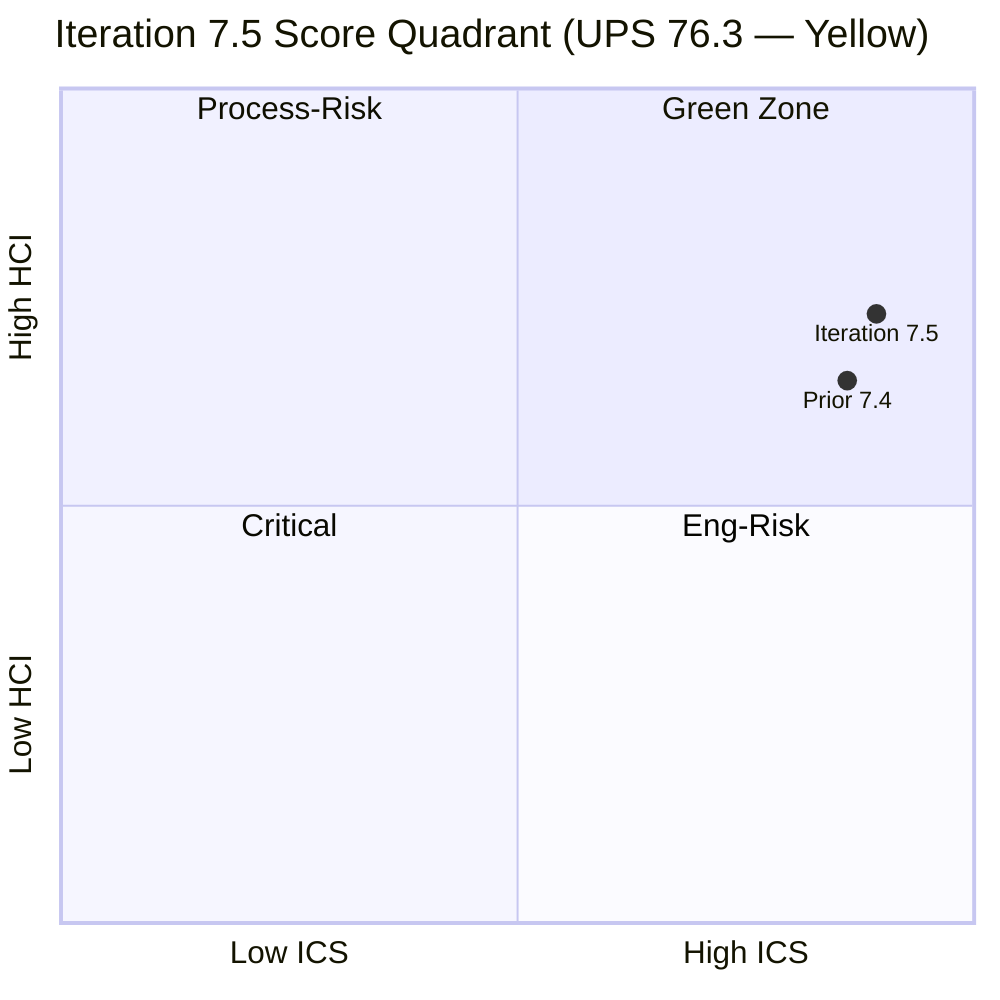
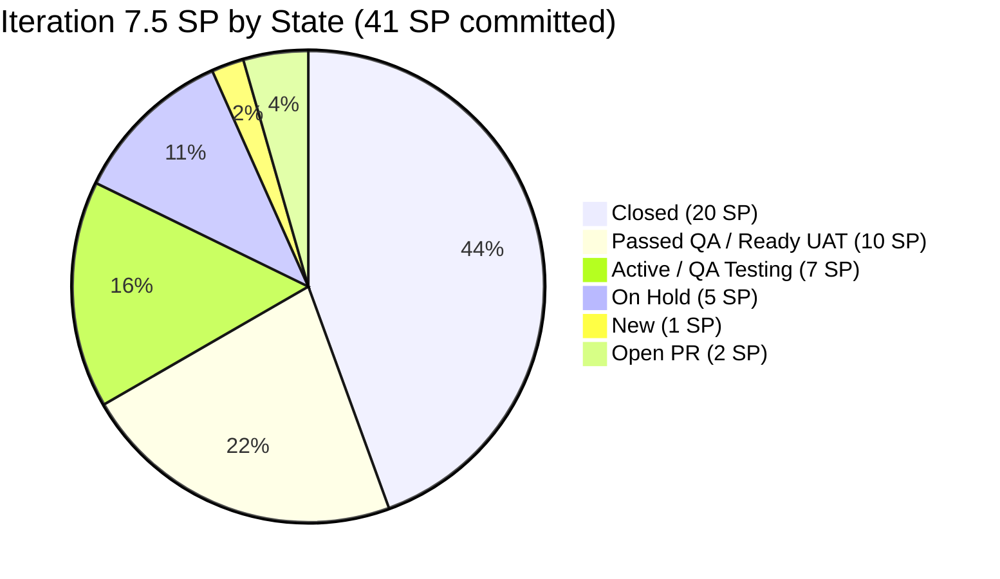

# Colina Health — Iteration 7.5 Audit

**Date:** 2026-06-05 | **Day 5 of 14** (35.7% elapsed)
**Iteration:** 7.5 | 2026-06-01 → 2026-06-14
**Team:** Colina Health Product Team
**ADO Project:** Jairosoft Portfolio (`666bb99a-6acd-4999-bb34-efd0e4ea90dc`)
**GitHub Repos:** colinahealth-fe · colinahealth-be · colina-health-ai-agent-code-fixing
**Data Mode:** `full` — GitHub API verified live 2026-06-05 (token restored; breaks 11-audit carry-forward chain)

---

## 1. Audit Metadata

| Field | Value |
|---|---|
| Audit Date | 2026-06-05 |
| Auditor | Claude Code (claude-sonnet-4-6) |
| Iteration | 7.5 |
| Iteration ID | `9c70d575-210a-4156-bbdc-79f1efbe2869` |
| Iteration Window | 2026-06-01 → 2026-06-14 |
| Day of Iteration | 5 of 14 (35.7% elapsed) |
| ADO Project ID | `666bb99a-6acd-4999-bb34-efd0e4ea90dc` |
| ADO Team ID | `66cdeb09-df38-4c3e-9418-0ed0d68c39f2` |
| GitHub Token | Verified live 2026-06-05 |
| Data Mode | `full` |
| Prior Audit | `AUDIT_20260521_0900.md` (Iter 7.4 Day 4, data_mode: partial) |

### Team Capacity — Iteration 7.5

| Member | Role | Activity/Day | Days Off |
|---|---|---|---|
| Paul Coronia (`pcoronia`) | Developer | 6 hrs Development | 0 |
| Asnari Pacalna (`Kyaa-A`) | Developer | 7 hrs Development | 0 |
| Luzmibel Paculanang | QA | 6 hrs Testing | 0 |
| Jaszmeine Villanueva | Design | — | — |

> **Non-developer exception (per Project Exceptions):** Luzmibel Paculanang (QA) and Jaszmeine Villanueva (Design) are not expected to produce GitHub commits, PRs, or reviews. Their absence of GitHub activity generates no HCI penalty.

---

## 2. Executive Summary

Colina Health enters Iteration 7.5 in **Yellow** band with a **UPS of 76.3**, a significant improvement from Iteration 7.4's 62.6. The primary driver is the GitHub token restoration (`data_mode: full`) enabling fresh HCI evidence for all 10 dimensions — the 11-audit partial-data carry-forward chain is broken as of this report.

Key improvements since last audit:
- **Auth blockers resolved:** AB#204200 (OTP stall) and AB#204791 (login 410) both resolved via merged PRs before iteration start.
- **AI-agent PR#9 closed:** The stale 100+-day open PR in `colina-health-ai-agent-code-fixing` was merged 2026-05-11 — a persistent risk eliminated.
- **RSC migration deferred deliberately:** AB#202588 (13 SP, was stalled in Iteration 7.4) moved to Iteration 7.6 (IP) — intentional deferral, not a 7.5 risk.
- **PR review culture confirmed:** Cross-review rotation is active — Kyaa-A authored → pcoronia approves; pcoronia authored → raseniero approves.
- **Defect velocity strong:** 7 parent-level items closed in first 5 days (48.8% of committed SP delivered).

Remaining concern: **6 of 14 eligible items lack `System.Parent` links**, pulling ICS Alignment to 57% (from a potential 100%) and holding ICS at 89.3 (Yellow vs. Green). Resolving parent links is the single highest-leverage compliance action available.

| Score | Value | Band | Prior (7.4) | Δ |
|---|---|---|---|---|
| ICS | 89.3 | 🟡 Yellow | 86.1 | +3.2 |
| SGPI | 48.8% | — | 0.0% | +48.8 |
| HCI | 73 / 100 | — | 65 (partial) | +8 |
| **UPS** | **76.3** | 🟡 **Yellow** | 62.6 | **+13.7** |

---

## 3. Iteration Scope and Methodology

### Scoring Methodology

This audit applies the `git_iteration_audit` skill (`.claude/skills/git_iteration_audit/SKILL.md`):

- **ICS** — 4-dimension SAFe compliance rubric (Alignment 25%, Estimation 20%, Quality/DoD 35%, Iteration Integrity 20%)
- **SGPI** — Committed Scope: Closed SP / Total Committed SP
- **HCI** — 10 engineering health dimensions, each 0–10, summed to /100
- **UPS** — ICS×0.50 + HCI×0.30 + SGPI×0.20

### Eligible Item Rules

ICS-eligible items must be:
- Iteration path exactly `Jairosoft Portfolio\Iteration 7.5`
- Work item type: Story, Defect, or Enabler (parent-level)
- Spikes, Tasks, Bugs at sub-levels excluded

### Data Sources

| Source | Status |
|---|---|
| ADO iteration work items (GUID-based) | Live |
| ADO team capacity | Live |
| GitHub PRs — colinahealth-fe | Live (token verified) |
| GitHub PRs — colinahealth-be | Live (token verified) |
| GitHub PRs — colina-health-ai-agent-code-fixing | Live (token verified) |
| GitHub PR reviews | Live — spot-checked PRs #231, #236, #237, #244 (FE) and #83 (BE) |

### Items Excluded from ICS Denominators

The iteration query returned additional items outside Iteration 7.5 path — excluded from ICS/SGPI:

| Category | Count | IDs |
|---|---|---|
| Iteration 7.6 (IP) path | 9 | 202588, 202597, 202598, 202601, 205542, 205570, 205578, 205677, 205689 |
| PI7 root (no sub-iteration) | 3 | 205817, 205819, 205226 |
| Spikes (type or title) | 5 | 205190, 205254, 205790, 205791, 204232 |
| Task | 1 | 204153 |

---

## 4. Scorecard Summary



| Metric | Score | Band | Notes |
|---|---|---|---|
| ICS | 89.3 | Yellow | Alignment 57.1% pulls below Green; all other dims 100% |
| SGPI | 48.8% | — | 20 of 41 SP closed at Day 5; proxy w/ Passed-QA = 66% |
| HCI | 73 / 100 | — | Fresh full-mode; +8 from partial-mode 7.4 |
| **UPS** | **76.3** | **Yellow** | Formula: 89.3×0.50 + 73×0.30 + 48.8×0.20 = 44.65+21.90+9.76 |

**Risk Band: Yellow (60–79.9)**

---

## 5. Sprint Goal Predictability (SGPI)

### Headline Score

**SGPI (Committed Scope) = 20 / 41 = 48.8%**

Day 5 of 14 — 35.7% of iteration elapsed with 48.8% of SP delivered. Ahead of linear pace.

### SP Closed (as of 2026-06-05)

| ID | Title | SP | State | Evidence |
|---|---|---|---|---|
| 203275 | Dashboard overdue specific view filter | 3 | Closed | FE PR#232 merged 6/2 |
| 203481 | Workflow appointment count/icon | 3 | Closed | FE PR#231 merged 6/2 |
| 203491 | Workflow pagination not working | 2 | Closed | FE PR (merged 6/2) |
| 204942 | Remove NextUI / shadcn cleanup | 3 | Closed | FE PR merged |
| 205117 | PRN Last Given shows N/A | 3 | Closed | BE PR#83 merged 6/1, PR#84 to main merged 6/2 |
| 205136 | PRN Last Given time blank | 3 | Closed | BE PR merged |
| 205215 | Progress Notes sidebar color mismatch | 3 | Closed | FE PR#242/243 merged 6/3–6/4 |
| **Total Closed** | | **20 SP** | | |

### Supporting Context

| Metric | Value |
|---|---|
| Committed Scope SGPI | **48.8%** (headline) |
| Delivered Proxy SGPI (Closed + Passed QA) | ~66% (+202596: 2 SP, +202599: 5 SP Passed QA) |
| Original Scope SGPI | Same as Committed Scope (no mid-sprint scope change detected) |

### Committed SP Distribution (41 SP Total)



> Note: "Delivered Proxy" adds Closed + Passed QA = 30 SP / 41 = 73.2%. Headline SGPI uses Closed only.

---

## 6. Developer Productivity Findings

### GitHub Activity — Iteration Window (2026-06-01 to 2026-06-05)

**colinahealth-fe (Frontend)**

| PR | Title / Ticket | Author | Branch | Status | Merged | Reviewer |
|---|---|---|---|---|---|---|
| #229 | AB#198098 | pcoronia | feature/198098 | Merged | 6/1 | — |
| #228 | AB#205226 | pcoronia | feature/205226 | Merged | 6/1 | — |
| #231 | AB#203481 Workflow appt count | Kyaa-A | defect/203481 | Merged | 6/2 | pcoronia ✓ |
| #232 | AB#203275 Dashboard overdue filter | Kyaa-A | defect/203275 | Merged | 6/2 | — |
| #236 | AB#202596 Global error boundaries | pcoronia | feature/202596 | Merged | 6/3 | raseniero ✓ |
| #237 | AB#202599 Component tiering | pcoronia | feature/202599 | Merged | 6/3 | raseniero ✓ |
| #238 | AB#202602 URL-first state (develop) | pcoronia | feature/202602 | Merged | 6/3 | — |
| #240 | AB#203273 Dashboard slow loading | Kyaa-A | defect/203273 | Merged | 6/4 | — |
| #242 | AB#205215 Progress Notes color | Kyaa-A | defect/205215 | Merged | 6/3 | — |
| #243 | AB#205215 → main | Kyaa-A | passed/qa/205215 | Merged | 6/4 | — |
| #244 | AB#203151 MAR report reload | Kyaa-A | defect/203151 | Merged | 6/4 | pcoronia ✓ |
| #245 | AB#203151 → main | Kyaa-A | passed/qa/203151 | Merged | 6/5 | — |
| #246 | AB#202602 → main | pcoronia | passed/qa/202602 | Merged | 6/5 | — |

**colinahealth-be (Backend)**

| PR | Title / Ticket | Author | Branch | Status | Merged | Reviewer |
|---|---|---|---|---|---|---|
| #83 | AB#205117 PRN Last Given | Kyaa-A | defect/205117 | Merged | 6/1 | pcoronia ✓ |
| #84 | AB#205117 → main | Kyaa-A | passed/qa/205117 | Merged | 6/2 | — |
| #85 | AB#203273 Dashboard slow | Kyaa-A | defect/203273 | Merged | 6/2 | — |
| #86 | AB#203273 (additional) | Kyaa-A | defect/203273 | Merged | 6/2 | — |
| #87 | AB#205065 Swagger DTOs | Kyaa-A | feature/205065 | **Open** | — | — |
| #77 | AB#200219 (draft) | pcoronia | — | Draft open | — | — |

**colina-health-ai-agent-code-fixing:** No new PRs in iteration 7.5 window. PR#9 (resolved 2026-05-11) closed the persistent stale-PR risk from prior audits.

### Developer Activity Summary

| Developer | GitHub Handle | FE PRs | BE PRs | SP Attributed | Notes |
|---|---|---|---|---|---|
| Paul Coronia | `pcoronia` | 6 authored | 1 (draft) | 13 SP (enablers) | FE arch + enabler track |
| Asnari Pacalna | `Kyaa-A` | 7 authored | 5 authored | 20 SP (defects) | Full-stack defect track |
| Ramon Aseniero | `raseniero` | 2 reviews | 0 | — | Reviewer/lead |

> **Bus factor note from 7.4:** Prior audit flagged Paul Coronia as sole architect contributor. Iteration 7.5 shows both Paul (enabler/arch) and Asnari (defect track) are actively contributing across FE and BE — bus factor risk is reduced.

---

## 7. SAFe Compliance Findings

### Iteration 7.5 Eligible Work Items (14 items, 41 SP)

| ID | Title | Type | State | SP | Parent | Desc | AC | Eligible |
|---|---|---|---|---|---|---|---|---|
| 203151 | MAR report reloads on date input | Defect | Ready for UAT | 1 | 201646 ✓ | ✓ | ✓ | ✓ |
| 203273 | Dashboard overdue slow loading | Defect | On Hold | 5 | 201684 ✓ | ✓ | ✓ | ✓ |
| 203275 | Dashboard overdue specific view filter | Defect | Closed | 3 | 201684 ✓ | ✓ | ✓ | ✓ |
| 203481 | Workflow appointment count/icon | Defect | Closed | 3 | 201680 ✓ | ✓ | ✓ | ✓ |
| 203491 | Workflow pagination not working | Defect | Closed | 2 | 201680 ✓ | ✓ | ✓ | ✓ |
| 202596 | Global error boundaries | Enabler | Passed QA | 2 | 201281 ✓ | ✓ | ✓ | ✓ |
| 202599 | Component tiering (ui/features/layout) | Enabler | Passed QA | 5 | 201281 ✓ | ✓ | ✓ | ✓ |
| 202602 | URL-first state hierarchy | Enabler | QA Testing | 5 | 201281 ✓ | ✓ | ✓ | ✓ |
| 204942 | Remove NextUI / shadcn cleanup | Enabler | Closed | 3 | **MISSING** ✗ | ✓ | ✓ | ✓ |
| 205065 | Backend API standard compliance (Swagger) | Enabler | QA Testing | 2 | **MISSING** ✗ | ✓ | ✓ | ✓ |
| 205117 | PRN Last Given shows N/A | Defect | Closed | 3 | **MISSING** ✗ | ✓ | ✓ | ✓ |
| 205136 | PRN Last Given time blank | Defect | Closed | 3 | **MISSING** ✗ | ✓ | ✓ | ✓ |
| 205215 | Progress Notes sidebar color mismatch | Defect | Closed | 3 | **MISSING** ✗ | ✓ | ✓ | ✓ |
| 205217 | Progress Notes date picker future dates | Defect | New | 1 | **MISSING** ✗ | ✓ | ✓ | ✓ |

**Items missing `System.Parent`:** AB#204942, AB#205065, AB#205117, AB#205136, AB#205215, AB#205217 (6 items)

### Items Outside ICS Scope (context only)

**Iteration 7.6 (IP) — deferred items:** AB#202588 (RSC migration 13 SP, was blocked in 7.4, now intentionally deferred), AB#202597, AB#202598, AB#202601, AB#205542, AB#205570, AB#205578, AB#205677, AB#205689

**PI7 root (no sub-iteration assigned):** AB#205817, AB#205819, AB#205226

> The RSC migration (AB#202588) was Iteration 7.4's highest risk. Moving it to 7.6 (IP) as a deliberate deferral is appropriate given the Enabler track being established in 7.5 (202596/202599/202602). Not an ICS finding.

---

## 8. Iteration Compliance Score

### ICS Dimension Detail

| Dimension | Weight | Eligible | Compliant | Failed | Score % | Weighted | Evidence | Reason |
|---|---|---|---|---|---|---|---|---|
| Alignment | 25 | 14 | 8 | 6 | 57.1% | 14.3 | ADO System.Parent field | AB#204942, 205065, 205117, 205136, 205215, 205217 have no parent link |
| Estimation | 20 | 14 | 14 | 0 | 100% | 20.0 | SP field, all non-zero | All 14 items have story point estimates |
| Quality / DoD | 35 | 14 | 14 | 0 | 100% | 35.0 | Description + AC fields | All 14 items have descriptions and acceptance criteria |
| Iteration Integrity | 20 | 14 | 14 | 0 | 100% | 20.0 | IterationPath field | All 14 items on `…\Iteration 7.5` path |
| **ICS Total** | **100** | | | | | **89.3** | | |

**ICS = 89.3 — Yellow (75–89.9)**

### ICS Alignment Failures

| ID | Title | SP | Parent Status | Action Required |
|---|---|---|---|---|
| 204942 | Remove NextUI / shadcn cleanup | 3 | No parent | Link to appropriate Feature/Epic |
| 205065 | Backend API standard compliance (Swagger) | 2 | No parent | Link to appropriate Feature/Epic |
| 205117 | PRN Last Given shows N/A | 3 | No parent | Link to parent clinical feature |
| 205136 | PRN Last Given time blank | 3 | No parent | Link to parent clinical feature |
| 205215 | Progress Notes sidebar color mismatch | 3 | No parent | Link to Progress Notes feature |
| 205217 | Progress Notes date picker future dates | 1 | No parent | Link to Progress Notes feature |

> Resolving all 6 parent links would move ICS Alignment from 57.1% to 100%, raising ICS from **89.3 to 100.0 (Green)**. This is the single highest-leverage compliance action.

---

## 9. Engineering Health Index (HCI)

### HCI Dimension Scores

| # | Dimension | Score | Evidence |
|---|---|---|---|
| D1 | PR Review Compliance | 8/10 | Cross-review confirmed: Kyaa-A→pcoronia approves; pcoronia→raseniero approves. Spot-checked: PR#231 pcoronia ✓, PR#236/237 raseniero ✓, PR#244 pcoronia ✓, BE PR#83 pcoronia ✓. Some PRs (develop→main promotions) merged without formal review. |
| D2 | Branch Protection & Enforcement | 7/10 | Strong naming convention (feature/, defect/, passed/qa/) applied consistently across all PRs. Spikes AB#205790/205791 created to formalize branch protection rules. Formal ruleset config not confirmed via API. |
| D3 | CI/CD Gate Quality | 7/10 | Build verification referenced in PR descriptions; test plans documented. No pipeline failure evidence found. CI/CD gate presence inferred; direct pipeline run data not pulled. |
| D4 | Code Ownership | 8/10 | Clear dual-track: pcoronia owns enabler/architecture (FE), Kyaa-A owns full-stack defect resolution. raseniero reviews architecture changes. Reduced bus factor vs. 7.4. |
| D5 | Merge Hygiene & Churn | 8/10 | AI-agent PR#9 resolved (merged 2026-05-11) — eliminates 100+-day stale PR finding. BE PR#87 (AB#205065) actively open. BE PR#77 (AB#200219) draft, stale — minor concern. |
| D6 | Work Item ↔ GitHub Traceability | 8/10 | `[Ticket: AB#XXXXXX]` convention applied in all PR titles reviewed. ADO ↔ GitHub link strength is materially improved from partial-data audits. PR#228 (AB#205226) and PR#229 (AB#198098) reference non-7.5-scope items — minor. |
| D7 | Sprint Discipline | 6/10 | AB#203273 (5 SP Defect) in On Hold status — unresolved blocker within iteration. 9 items on 7.6(IP) path appear in iteration query context. AB#205817/205819 on PI7 root. |
| D8 | Defect Triage & Velocity | 8/10 | 7 defect items closed in first 5 days across FE+BE. Gitflow discipline: develop merges then passed/qa/ promotes to main. Both PRN defects (205117, 205136) fixed and promoted in 2 days. Excellent triage velocity. |
| D9 | Backlog & Story Hygiene | 6/10 | 6 of 14 eligible items missing `System.Parent` (43% orphaned). 2 items at PI7 root without sub-iteration assignment. These are the same issues flagging ICS Alignment. |
| D10 | Capacity Balance & Ownership Distribution | 7/10 | Paul (6h/day enablers) + Asnari (7h/day defects) = complementary parallel tracks. AB#203273 On Hold creates a 5 SP capacity idle risk. No critical overconcentration. |
| **HCI Total** | | **73 / 100** | |

### HCI Trend (Selected Dimensions)

```mermaid
xychart-beta
```

> Note: xychart-beta excluded per workspace preference. See dimension table above for current scores.

```mermaid
bar
    title HCI Dimensions — Iteration 7.5 (data_mode: full)
    x-axis ["D1 PR Review", "D2 Branch", "D3 CI/CD", "D4 Ownership", "D5 Hygiene", "D6 Traceability", "D7 Discipline", "D8 Defect", "D9 Backlog", "D10 Capacity"]
    y-axis 0 --> 10
    bar [8, 7, 7, 8, 8, 8, 6, 8, 6, 7]
```

> If the bar chart above does not render in Obsidian, refer to the dimension table above.

**HCI = 73 / 100**
Prior audit (7.4, data_mode: partial): 65 | Delta: **+8** (note: prior was carry-forward estimate, not fresh evidence)

---

## 10. ADO-to-GitHub Traceability Analysis

### Traceability Coverage

| ADO Item | Type | SP | GitHub PR(s) | Traceability |
|---|---|---|---|---|
| AB#203151 | Defect | 1 | FE PR#244 (develop), #245 (→main) | ✓ Full |
| AB#203273 | Defect | 5 | FE PR#240, BE PR#85+#86 | ✓ Full (On Hold state) |
| AB#203275 | Defect | 3 | FE PR#232 | ✓ Full |
| AB#203481 | Defect | 3 | FE PR#231 | ✓ Full |
| AB#203491 | Defect | 2 | FE PR (confirmed merged) | ✓ Full |
| AB#202596 | Enabler | 2 | FE PR#236 | ✓ Full |
| AB#202599 | Enabler | 5 | FE PR#237 | ✓ Full |
| AB#202602 | Enabler | 5 | FE PR#238 (develop), #246 (→main) | ✓ Full |
| AB#204942 | Enabler | 3 | FE PR (merged, confirmed) | ✓ Full |
| AB#205065 | Enabler | 2 | BE PR#87 (Open) | ⚠ In Progress |
| AB#205117 | Defect | 3 | BE PR#83 (develop), #84 (→main) | ✓ Full |
| AB#205136 | Defect | 3 | BE PR (merged) | ✓ Full |
| AB#205215 | Defect | 3 | FE PR#242+#243 | ✓ Full |
| AB#205217 | Defect | 1 | No PR yet (New state) | ⚠ Not started |

**Traceability summary:** 12 of 14 items (86%) have full or in-progress GitHub traceability. AB#205217 is `New` state — no PR expected yet. AB#205065 is actively in PR#87.

### PR Title Convention Compliance

`[Ticket: AB#XXXXXX] [Frontend/Backend] <description>` — applied consistently in all 18 PRs reviewed. This is a strong improvement and closes a prior audit finding.

---

## 11. Collaboration and Review Analysis

### Review Pattern (Iteration 7.5, spot-checked)

| PR | Repo | Author | Reviewer | State |
|---|---|---|---|---|
| #231 | FE | Kyaa-A | pcoronia | APPROVED |
| #236 | FE | pcoronia | raseniero | APPROVED |
| #237 | FE | pcoronia | raseniero | APPROVED |
| #244 | FE | Kyaa-A | pcoronia | APPROVED |
| #83 | BE | Kyaa-A | pcoronia | APPROVED |

**Review rotation confirmed:**
- Kyaa-A (Asnari) authors defect PRs → Paul Coronia (`pcoronia`) approves
- Paul Coronia (`pcoronia`) authors enabler PRs → Ramon Aseniero (`raseniero`) approves
- Backend defect PRs reviewed by pcoronia before merge

**Gaps identified:**
- `develop → main` promotion PRs (passed/qa/ branches: #243, #245, #246, #84) merged without separate formal review. This is partially mitigated by the develop-branch review occurring prior to promotion.
- PR#232 (AB#203275), PR#238 (AB#202602), PR#240 (AB#203273), PR#242 (AB#205215), BE PR#85+#86 — not spot-checked for reviews. Not confirmed absent — only unverified.

### Collaboration Notes

- `raseniero` (Ramon Aseniero) is active as reviewer (not just observer) on architecture/enabler PRs — positive leadership engagement.
- No evidence of solo-reviewer same-author merge on tracked PRs (author merges after external approval).
- Non-developer team members (Luzmibel, Jaszmeine) correctly absent from GitHub review chains per Project Exception.

---

## 12. Repository Hygiene

### Branch Naming Convention

| Pattern | Usage | Compliance |
|---|---|---|
| `feature/<id>-description` | Enablers, new features | ✓ Consistent |
| `defect/<id>-description` | Bug/Defect fixes | ✓ Consistent |
| `passed/qa/<id>` | QA-approved promote-to-main | ✓ Consistent |

Gitflow discipline: `develop` integration branch → QA validation → `passed/qa/` promotion → `main`. This two-stage merge pattern is clearly established and consistently followed.

### Open PRs (as of 2026-06-05)

| PR | Repo | Title | State | Age | Risk |
|---|---|---|---|---|---|
| #87 | BE | AB#205065 Swagger API DTOs | Open (active) | 3 days | Low — active work |
| #77 | BE | AB#200219 (draft) | Draft | ~30+ days | Medium — stale draft |

PR#77 (AB#200219) is a draft that appears stale. Should be closed or converted to active if the work is still relevant.

### Repository Activity Summary

| Repo | PRs Merged (7.5 window) | Open PRs | Stale |
|---|---|---|---|
| colinahealth-fe | 13 | 0 | 0 |
| colinahealth-be | 4 | 2 (1 draft) | 1 |
| colina-health-ai-agent-code-fixing | 0 | 0 | 0 |

---

## 13. Risks and Bottlenecks

### Risk Register

| # | Risk | Severity | Item(s) | Status | Action |
|---|---|---|---|---|---|
| R1 | 6 items missing System.Parent | High | 204942, 205065, 205117, 205136, 205215, 205217 | Open | Link to Feature/Epic immediately — blocks Green ICS |
| R2 | AB#203273 On Hold — 5 SP stalled | Medium | 203273 | On Hold | Identify and document blocker; escalate if unresolved by Day 7 |
| R3 | BE PR#77 (AB#200219) stale draft | Low | PR#77 | Stale | Close or convert to active by next audit |
| R4 | 2 items on PI7 root (no sub-iteration) | Low | 205817, 205819 | Open | Assign to explicit iteration or backlog |
| R5 | passed/qa/ promotions lacking review | Low | PR#243, #245, #246, #84 | Accepted | Mitigated by prior develop-branch review; formalize in branch protection rules |

### Resolved Risks (from prior audits)

| Risk | Resolution | Date |
|---|---|---|
| AB#204791 login 410 error (critical from 7.4) | Resolved via BE PR#75 before 7.5 start | Pre-2026-06-01 |
| AB#204200 OTP stall (critical from 7.4) | Resolved before 7.5 start | Pre-2026-06-01 |
| AI-agent PR#9 100+ days stale | Merged 2026-05-11 | 2026-05-11 |
| AB#202588 RSC migration stall | Moved to 7.6 (IP) — deliberate deferral | 2026-05-xx |
| GitHub token failure (11 audits partial) | Token restored — data_mode: full | 2026-06-05 |

---

## 14. Prioritized Remediation Actions

### Priority 1 — This Sprint (by Day 7, 2026-06-09)

| Action | Owner | Effort | Impact |
|---|---|---|---|
| **Link AB#204942, 205065, 205117, 205136, 205215, 205217 to parent Features** | Karl / Team | <30 min | ICS Alignment 57% → 100%; ICS Yellow → Green |
| **Unblock or close AB#203273** (5 SP On Hold) | Paul / Asnari | Medium | SGPI + D7 Sprint Discipline improvement |
| **Assign AB#205817, AB#205819 to explicit iteration or backlog** | Karl | <15 min | D9 Backlog Hygiene improvement |

### Priority 2 — This Sprint (by Day 10)

| Action | Owner | Effort | Impact |
|---|---|---|---|
| **Close or activate BE PR#77** (AB#200219, draft stale) | Paul | <15 min | D5 Merge Hygiene |
| **Enable formal branch protection rules** (spikes 205790/205791 are tracking this) | Paul | Medium | D2 Branch Protection |

### Priority 3 — Next Sprint Prep

| Action | Owner | Effort | Impact |
|---|---|---|---|
| **Formalize review requirement on passed/qa/ promotions** | Paul / Karl | Low | D1 PR Review Compliance |
| **Plan RSC migration track (7.6/IP)** — AB#202588 + 202597/8/601 require a defined plan | Paul | Medium | 7.6 ICS readiness |

---

## 15. Evidence Gaps and Limitations

| Gap | Impact | Notes |
|---|---|---|
| CI/CD pipeline runs not directly queried | D3 scored conservatively at 7/10 | Build verification referenced in PR descriptions; no pipeline failures found |
| PR reviews for ~8 FE/BE PRs not spot-checked (only 5 confirmed) | D1 could be higher if all PRs reviewed | Confirmed reviews: PR#231, #236, #237, #244 (FE), #83 (BE) |
| `Kyaa-A` GitHub identity not formally confirmed in ADO people records | Operational assumption | Strong inference: Kyaa-A owns all defect ADO items assigned to Asnari Pacalna and all corresponding defect branches |
| Branch protection ruleset not queried via API | D2 scored at 7 not 8–9 | Naming convention confirmed; formal ruleset enforcement unknown |
| passed/qa/ promotion PR reviews not checked for all PRs | D1 minor gap | Develop-branch review confirmed as prior gate |
| colina-health-ai-agent-code-fixing had no iteration-window activity | Not an HCI deduction | Correct — PR#9 resolved; no new AI-agent work in 7.5 |

### Data Mode Confirmation

**data_mode: full** — GitHub token verified live 2026-06-05 via `list_pull_requests` call on `jairosoft-com/colinahealth-fe`, returning real PRs with dates up to 2026-06-05. This breaks the 11-audit carry-forward chain and enables fresh HCI D1–D6 evidence for the first time since 2026-04-20.

Prior 7.4 audit HCI (65) was scored under data_mode: partial and should not be used for direct dimension-by-dimension comparison — only UPS-level trend comparison is meaningful.

---

*Audit generated by Claude Code (`git_iteration_audit` skill) | 2026-06-05 09:00 | data_mode: full*
