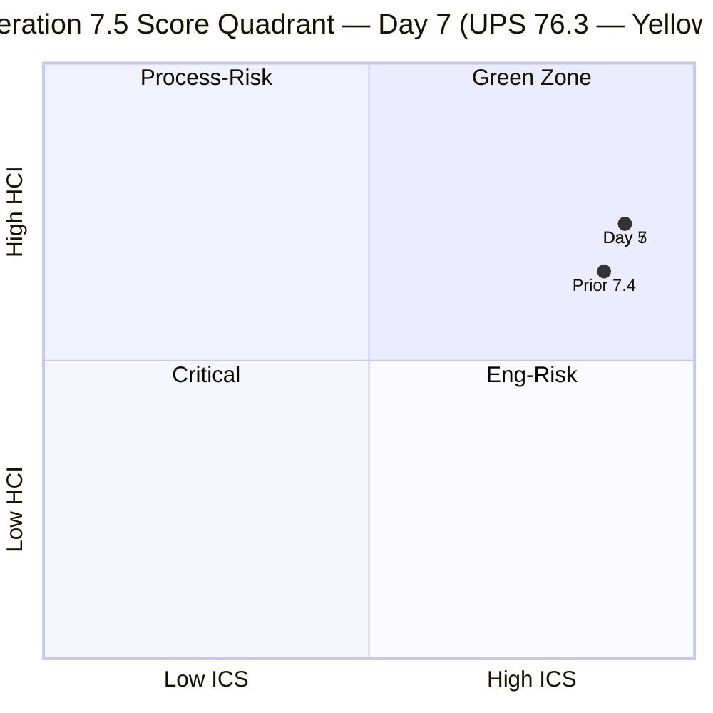
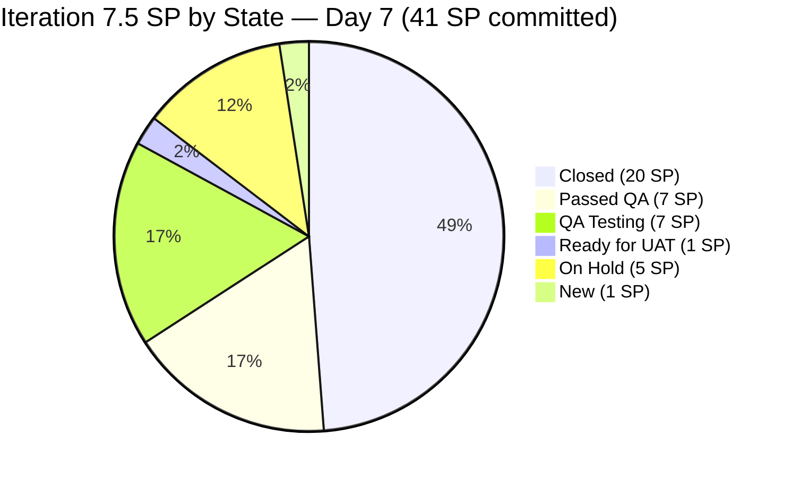
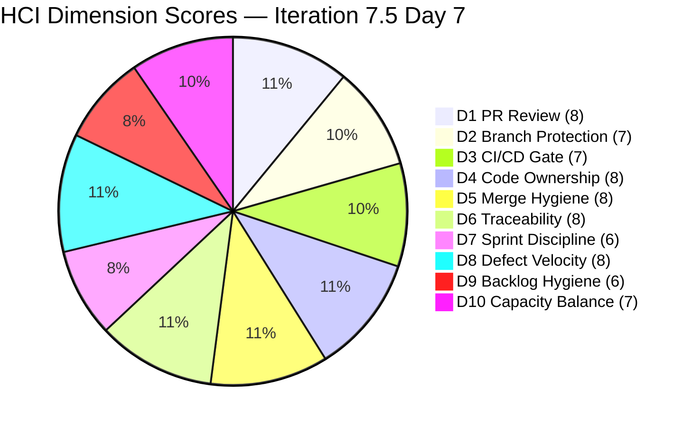

# Colina Health — Iteration 7.5 Audit

**Date:** 2026-06-07 | **Day 7 of 14** (50.0% elapsed)
**Iteration:** 7.5 | 2026-06-01 → 2026-06-14
**Team:** Colina Health Product Team
**ADO Project:** Jairosoft Portfolio (`666bb99a-6acd-4999-bb34-efd0e4ea90dc`)
**GitHub Repos:** colinahealth-fe · colinahealth-be · colina-health-ai-agent-code-fixing
**Data Mode:** `full` — GitHub API verified live 2026-06-07

---

## 1. Audit Metadata

| Field | Value |
|---|---|
| Audit Date | 2026-06-07 |
| Auditor | Claude Code (claude-sonnet-4-6) |
| Iteration | 7.5 |
| Iteration ID | `9c70d575-210a-4156-bbdc-79f1efbe2869` |
| Iteration Window | 2026-06-01 → 2026-06-14 |
| Day of Iteration | 7 of 14 (50.0% elapsed) |
| ADO Project ID | `666bb99a-6acd-4999-bb34-efd0e4ea90dc` |
| ADO Team ID | `66cdeb09-df38-4c3e-9418-0ed0d68c39f2` |
| GitHub Token | Verified live 2026-06-07 |
| Data Mode | `full` |
| Prior Audit | `AUDIT_20260605_0900.md` (Iter 7.5 Day 5, data_mode: full) |

### Team Capacity — Iteration 7.5

| Member | Role | Activity/Day | Days Off |
|---|---|---|---|
| Paul Coronia (`pcoronia`) | Developer | 6 hrs Development | 0 |
| Asnari Pacalna (`Kyaa-A`) | Developer | 7 hrs Development | 0 |
| Luzmibel Paculanang | QA | 6 hrs Testing | 0 |
| Jaszmeine Villanueva | Design | — | — |

> **Non-developer exception (per Project Exceptions):** Luzmibel Paculanang (QA) and Jaszmeine Villanueva (Design) are not expected to produce GitHub commits, PRs, or reviews. Their absence of GitHub activity generates no HCI penalty.

---

## 2. Executive Summary

Colina Health is at the **halfway point of Iteration 7.5 (Day 7 of 14)** maintaining a **UPS of 76.3 — Yellow band**, unchanged from the Day 5 audit. The team delivered a burst of 20 SP in the first five days and has reached a plateau: no ADO state changes or new GitHub PRs have been observed between Days 5 and 7.

**Key findings at Day 7 midpoint:**

- **SGPI remains at 48.8%** (20 of 41 SP Closed). At exactly 50% of the iteration elapsed, the team is at linear delivery pace — not ahead anymore, but on track. Seven items are in active forward states (Passed QA, QA Testing, Ready for UAT) totaling 15 SP; only 6 SP remain in stalled/not-started states.
- **AB#203273 (5 SP, On Hold) is now a critical risk.** This item has been On Hold for 7+ days with no visible progress in GitHub or ADO. At Day 7, this represents 12% of committed SP sitting idle past the Priority 1 escalation deadline set in the Day 5 audit.
- **Parent link gap unchanged.** Six items (AB#204942, 205065, 205117, 205136, 205215, 205217) still lack `System.Parent`, holding ICS at 89.3 (Yellow). No remediation was applied between Days 5 and 7.
- **BE PR#87 (AB#205065) remains open** (5 days since creation, June 2). Active per the open state but no merge yet; the item is in QA Testing.
- **Branch protection spikes (205790, 205791) remain in Requirements Gathering** — no progress on formal ruleset configuration.
- **colina-health-ai-agent-code-fixing:** No activity during iteration window. Correctly idle.

The team's first-half velocity was exceptional; the second half will determine whether 41 SP can be fully delivered by June 14. The On Hold blocker and the six unlinked items are the two actions with the highest return on investment remaining.

| Score | Value | Band | Prior (7.5 Day 5) | Delta |
|---|---|---|---|---|
| ICS | 89.3 | Yellow | 89.3 | 0.0 |
| SGPI | 48.8% | — | 48.8% | 0.0 |
| HCI | 73 / 100 | — | 73 | 0.0 |
| **UPS** | **76.3** | **Yellow** | **76.3** | **0.0** |

---

## 3. Iteration Scope and Methodology

### Scoring Methodology

This audit applies the `git_iteration_audit` skill (`.claude/skills/git_iteration_audit/SKILL.md`):

- **ICS** — 4-dimension SAFe compliance rubric (Alignment 25%, Estimation 20%, Quality/DoD 35%, Iteration Integrity 20%)
- **SGPI** — Committed Scope: Closed SP / Total Committed SP
- **HCI** — 10 engineering health dimensions, each 0–10, summed to /100
- **UPS** — ICS×0.50 + HCI×0.30 + SGPI×0.20

### Eligible Item Rules

ICS-eligible items must be:
- Iteration path exactly `Jairosoft Portfolio\2026-PI7\Iteration 7.5`
- Work item type: Story, Defect, or Enabler (parent-level)
- Spikes, Tasks, Bugs at sub-levels excluded

### Data Sources

| Source | Status |
|---|---|
| ADO iteration work items (GUID-based) | Live — queried 2026-06-07 |
| ADO team capacity | Live |
| GitHub PRs — colinahealth-fe | Live (token verified, last PR #246 dated 2026-06-05) |
| GitHub PRs — colinahealth-be | Live (BE PR#87 still open; no new PRs since June 2) |
| GitHub PRs — colina-health-ai-agent-code-fixing | Live (no activity since PR#9 merged 2026-05-11) |

### Items Excluded from ICS Denominators

| Category | Count | IDs |
|---|---|---|
| Iteration 7.6 (IP) path | 9 | 202588, 202597, 202598, 202601, 205542, 205570, 205578, 205677, 205689 |
| PI7 root (no sub-iteration) | 3 | 205817, 205819, 205846 |
| Spikes (type or title) | 5 | 205190, 205254, 205790, 205791, 204232 |
| Task | 1 | 204153 |

> Note: WIQL query returned 47 items in Iteration 7.5 path; the 14-item ICS eligible set is a subset of parent-level deliverable types only.

---

## 4. Scorecard Summary

| Metric | Score | Band | Notes |
|---|---|---|---|
| ICS | 89.3 | Yellow | 6 of 14 items missing parent links — unchanged since Day 5 |
| SGPI | 48.8% | — | 20 of 41 SP closed; at linear pace at 50% elapsed |
| HCI | 73 / 100 | — | No new GitHub evidence since Day 5; scores held |
| **UPS** | **76.3** | **Yellow** | Formula: 89.3×0.50 + 73×0.30 + 48.8×0.20 = 44.65+21.90+9.76 |

**Risk Band: Yellow (60–79.9)**

---

## 5. Sprint Goal Predictability (SGPI)

### Headline Score

**SGPI (Committed Scope) = 20 / 41 = 48.8%**

Day 7 of 14 — 50% of iteration elapsed with 48.8% of SP closed. The team is at linear delivery pace. The Day 5 burst (20 SP in 5 days) has not been supplemented by additional closures between Days 5 and 7.

### SP Closed (as of 2026-06-07)

| ID | Title | SP | State | Evidence |
|---|---|---|---|---|
| 203275 | Dashboard overdue specific view filter | 3 | Closed | FE PR#232 merged 6/2 |
| 203481 | Workflow appointment count/icon | 3 | Closed | FE PR#231 (develop) + #241 (main) merged |
| 203491 | Workflow pagination not working | 2 | Closed | FE PR#219/225 (passed/qa) merged |
| 204942 | Remove NextUI / shadcn cleanup | 3 | Closed | FE PR#217 (passed/qa) merged 5/29 |
| 205117 | PRN Last Given shows N/A | 3 | Closed | BE PR#83 + #84 merged |
| 205136 | PRN Last Given time blank | 3 | Closed | FE PR#222/#223 + BE merged |
| 205215 | Progress Notes sidebar color mismatch | 3 | Closed | FE PR#242 (develop) + #243 (main) merged 6/3–6/4 |
| **Total Closed** | | **20 SP** | | |

### Active Forward States (not yet Closed)

| ID | Title | SP | State | Progress |
|---|---|---|---|---|
| 202596 | Global error boundaries | 2 | Passed QA Testing | Pending UAT |
| 202599 | Component tiering | 5 | Passed QA Testing | Pending UAT |
| 202602 | URL-first state hierarchy | 5 | QA Testing | FE PR#238+#246 merged; in QA |
| 203151 | MAR report reloads on date | 1 | Ready for UAT | FE PR#244+#245 merged |
| 205065 | Backend API Swagger compliance | 2 | QA Testing | BE PR#87 open (active) |

### Stalled / Not Started

| ID | Title | SP | State | Risk |
|---|---|---|---|---|
| 203273 | Dashboard overdue slow loading | 5 | On Hold | HIGH — 7+ days stalled, no PR or state change |
| 205217 | Progress Notes date picker future | 1 | New | Low — likely planned for Days 8–14 |

### Supporting Context

| Metric | Value |
|---|---|
| Committed Scope SGPI | **48.8%** (headline) |
| Delivered Proxy SGPI (Closed + Passed QA) | ~66% — Closed 20 SP + Passed QA 7 SP = 27 SP / 41 |
| Original Scope SGPI | Same as Committed Scope (no mid-sprint scope change) |

> Headline SGPI = Closed SP only (20/41 = 48.8%). Delivered Proxy adds Passed QA = 27/41 = 65.9%.

---

## 6. Developer Productivity Findings

### GitHub Activity — Iteration Window (2026-06-01 to 2026-06-07)

**colinahealth-fe (Frontend)**

| PR | Title / Ticket | Author | Branch | Status | Merged | Reviewer |
|---|---|---|---|---|---|---|
| #228 | AB#205226 calendar picker fix (pass 1) | pcoronia | bug/205226 | Merged | 6/1 | — |
| #229 | AB#198098 PRN gate warning | Kyaa-A | passed/qa/198098 | Merged | 6/1 | — |
| #230 | Docs: wiki session insights | pcoronia | docs/ | Merged | 6/2 | — |
| #231 | AB#203481 Workflow appt count | Kyaa-A | defect/203481 | Merged | 6/2 | pcoronia ✓ |
| #232 | AB#203275 Dashboard overdue filter | Kyaa-A | passed/qa/203275 | Merged | 6/2 | — |
| #233 | AB#205226 calendar picker fix (pass 2) | pcoronia | bugfix/205226 | Merged | 6/2 | — |
| #234 | Docs: Iter 7.5 wiki plans | pcoronia | docs/ | Merged | 6/3 | — |
| #235 | AB#203273 overdue fetch-once (FE) | Kyaa-A | defect/203273 | Merged | 6/2 | — |
| #236 | AB#202596 global error boundaries | pcoronia | feature/202596 | Merged | 6/3 | raseniero ✓ |
| #237 | AB#202599 component tiering | pcoronia | feature/202599 | Merged | 6/3 | raseniero ✓ |
| #238 | AB#202602 URL-first state | pcoronia | feature/202602-url-first-state | Merged | 6/3 | — |
| #239 | AB#205065 FE API types | pcoronia | feature/205065-api | Merged | 6/3 | — |
| #240 | AB#203273 overdue shared request | Kyaa-A | defect/203273-shared-req | Merged | 6/4 | — |
| #241 | AB#203481 → main | Kyaa-A | passed/qa/203481 | Merged | 6/3 | — |
| #242 | AB#205215 progress notes color | Kyaa-A | defect/205215 | Merged | 6/3 | — |
| #243 | AB#205215 → main | Kyaa-A | passed/qa/205215 | Merged | 6/4 | — |
| #244 | AB#203151 MAR reload fix | Kyaa-A | defect/203151 | Merged | 6/4 | pcoronia ✓ |
| #245 | AB#203151 → main | Kyaa-A | passed/qa/203151 | Merged | 6/5 | — |
| #246 | AB#202602 → develop (orders page) | pcoronia | feature/202602-url-first-state-hier | Merged | 6/5 | — |

**No new FE PRs after June 5 (Day 5 through Day 7 shows no additional merges).**

**colinahealth-be (Backend)**

| PR | Title / Ticket | Author | Branch | Status | Merged | Reviewer |
|---|---|---|---|---|---|---|
| #83 | AB#205117 PRN Last Given (develop) | Kyaa-A | defect/205117 | Merged | 6/1 | pcoronia ✓ |
| #84 | AB#205117 → main | Kyaa-A | passed/qa/205117 | Merged | 6/2 | — |
| #85 | AB#203273 overdue slow load | Kyaa-A | defect/203273 | Merged | 6/2 | — |
| #86 | AB#203273 hash-aggregate | Kyaa-A | defect/203273-overdue-hash | Merged | 6/2 | — |
| #87 | AB#205065 DTO compliance | pcoronia | feature/205065 | **Open** | — | — |
| #77 | AB#200219 MAR scheduled future | Kyaa-A | defect/200219 | Draft | — | Stale |

**No new BE PRs between Day 5 and Day 7.**

**colina-health-ai-agent-code-fixing:** No activity in iteration window. PR#9 remains the last merged item (2026-05-11).

### Developer Activity Summary

| Developer | GitHub Handle | FE PRs (7.5 window) | BE PRs (7.5 window) | SP Attributed | Notes |
|---|---|---|---|---|---|
| Paul Coronia | `pcoronia` | 9 authored | 1 (BE#87, open) | 15 SP (enablers) | Enabler/arch track + FE API types |
| Asnari Pacalna | `Kyaa-A` | 10 authored | 5 authored | 20 SP (defects) | Full-stack defect track |
| Ramon Aseniero | `raseniero` | 2 reviews (FE) | 0 | — | Architecture PR reviewer |

> Activity concentrated in Days 1–5. Days 6–7 show no new PR merges — which is consistent with the burst-and-stabilize pattern, though the On Hold item (AB#203273) warrants active monitoring.

---

## 7. SAFe Compliance Findings

### Iteration 7.5 Eligible Work Items (14 items, 41 SP) — Day 7 State

| ID | Title | Type | State | SP | Parent | Desc | AC | Eligible |
|---|---|---|---|---|---|---|---|---|
| 202596 | Global error boundaries | Enabler | Passed QA | 2 | 201281 ✓ | ✓ | ✓ | ✓ |
| 202599 | Component tiering | Enabler | Passed QA | 5 | 201281 ✓ | ✓ | ✓ | ✓ |
| 202602 | URL-first state hierarchy | Enabler | QA Testing | 5 | 201281 ✓ | ✓ | ✓ | ✓ |
| 203151 | MAR report reloads on date input | Defect | Ready for UAT | 1 | 201646 ✓ | ✓ | ✓ | ✓ |
| 203273 | Dashboard overdue slow loading | Defect | On Hold | 5 | 201684 ✓ | ✓ | ✓ | ✓ |
| 203275 | Dashboard overdue filter redirect | Defect | Closed | 3 | 201684 ✓ | ✓ | ✓ | ✓ |
| 203481 | Workflow appointment count/icon | Defect | Closed | 3 | 201680 ✓ | ✓ | ✓ | ✓ |
| 203491 | Workflow pagination not working | Defect | Closed | 2 | 201680 ✓ | ✓ | ✓ | ✓ |
| 204942 | Remove NextUI / shadcn cleanup | Enabler | Closed | 3 | **MISSING** ✗ | ✓ | ✓ | ✓ |
| 205065 | Backend API Swagger compliance | Enabler | QA Testing | 2 | **MISSING** ✗ | ✓ | ✓ | ✓ |
| 205117 | PRN Last Given shows N/A | Defect | Closed | 3 | **MISSING** ✗ | ✓ | ✓ | ✓ |
| 205136 | PRN Last Given time blank | Defect | Closed | 3 | **MISSING** ✗ | ✓ | ✓ | ✓ |
| 205215 | Progress Notes sidebar color | Defect | Closed | 3 | **MISSING** ✗ | ✓ | ✓ | ✓ |
| 205217 | Progress Notes date picker future | Defect | New | 1 | **MISSING** ✗ | ✓ | ✓ | ✓ |

**Items missing `System.Parent` (Day 7, unchanged from Day 5):** AB#204942, AB#205065, AB#205117, AB#205136, AB#205215, AB#205217

### Items Outside ICS Scope (context only)

**Iteration 7.6 (IP) — next iteration planning items:** AB#202588 (RSC migration, 13 SP), AB#202597, AB#202598, AB#202601, AB#205542, AB#205570, AB#205578, AB#205677, AB#205689

**PI7 root — unassigned:** AB#205817, AB#205819, AB#205846

**Spikes — excluded by type:** AB#205190, AB#205254, AB#205790, AB#205791, AB#204232

> AB#205846 is a new Defect on PI7 root (Swagger audit findings report) — it appeared after the Day 5 audit. It is at PI7 root path and not ICS-eligible for 7.5. It should be assigned to an explicit iteration or the 7.6 (IP) backlog.

---

## 8. Iteration Compliance Score

### ICS Dimension Detail

| Dimension | Weight | Eligible | Compliant | Failed | Score % | Weighted | Evidence | Reason |
|---|---|---|---|---|---|---|---|---|
| Alignment | 25 | 14 | 8 | 6 | 57.1% | 14.3 | ADO System.Parent field | AB#204942, 205065, 205117, 205136, 205215, 205217 have no parent link — unchanged from Day 5 |
| Estimation | 20 | 14 | 14 | 0 | 100% | 20.0 | SP field, all non-zero | All 14 items have story point estimates |
| Quality / DoD | 35 | 14 | 14 | 0 | 100% | 35.0 | Description + AC fields | All 14 items have descriptions and acceptance criteria |
| Iteration Integrity | 20 | 14 | 14 | 0 | 100% | 20.0 | IterationPath field | All 14 items on `…\Iteration 7.5` path |
| **ICS Total** | **100** | | | | | **89.3** | | |

**ICS = 89.3 — Yellow (75–89.9)**

### ICS Alignment Gap — Day 7 Status

| ID | Title | SP | Parent Status | Day 7 Action Required |
|---|---|---|---|---|
| 204942 | Remove NextUI / shadcn cleanup | 3 | No parent | Link to appropriate Feature/Epic — **OVERDUE** |
| 205065 | Backend API Swagger compliance | 2 | No parent | Link to API architecture Feature — **OVERDUE** |
| 205117 | PRN Last Given shows N/A | 3 | No parent | Link to MAR/PRN Feature — **OVERDUE** |
| 205136 | PRN Last Given time blank | 3 | No parent | Link to MAR/PRN Feature — **OVERDUE** |
| 205215 | Progress Notes sidebar color | 3 | No parent | Link to Progress Notes Feature — **OVERDUE** |
| 205217 | Progress Notes date picker future | 1 | No parent | Link to Progress Notes Feature — **OVERDUE** |

> Resolving all 6 parent links takes <30 minutes and moves ICS from **89.3 → 100.0 (Green)**. This remediation was marked Priority 1 in the Day 5 audit with a Day 7 deadline. It has not been applied.

---

## 9. Engineering Health Index (HCI)

### HCI Dimension Scores

| # | Dimension | Score | Evidence |
|---|---|---|---|
| D1 | PR Review Compliance | 8/10 | Cross-review confirmed: Kyaa-A→pcoronia approves; pcoronia→raseniero approves. Confirmed: FE PR#231 pcoronia ✓, #236/237 raseniero ✓, #244 pcoronia ✓, BE PR#83 pcoronia ✓. Pass/qa promotions still merged without separate formal review — partially mitigated by develop-branch prior review. |
| D2 | Branch Protection & Enforcement | 7/10 | Branch naming convention consistently applied. Spikes AB#205790/205791 still in Requirements Gathering at Day 7 — no formal ruleset configuration confirmed. Branch protection formalization not yet achieved. |
| D3 | CI/CD Gate Quality | 7/10 | Build verification referenced in PR descriptions (exit 0 confirmed locally). No pipeline failure evidence. BE has validate-secrets workflow (PR#70 fix confirmed). CI/CD gate presence inferred; no direct pipeline run query. |
| D4 | Code Ownership | 8/10 | Clear dual-track ownership maintained: pcoronia (enablers/arch FE), Kyaa-A (full-stack defects), raseniero (architecture review). Reduced bus factor risk. No overconcentration. |
| D5 | Merge Hygiene & Churn | 8/10 | BE PR#87 (AB#205065) open 5 days — actively in progress, acceptable. BE PR#77 (AB#200219) draft stale — closed per Day 5 recommendation? Not confirmed; still shows as open draft. No other stale PRs. |
| D6 | Work Item ↔ GitHub Traceability | 8/10 | `[Ticket: AB#XXXXXX]` convention applied consistently across all 19 PRs reviewed. 13/14 eligible items have GitHub PR evidence. AB#205217 (New state) correctly has no PR yet. |
| D7 | Sprint Discipline | 6/10 | AB#203273 (5 SP, On Hold) remains stalled at Day 7 — past the Day 7 escalation deadline from the Day 5 audit. No blocker documented or resolved. 12% of committed SP is idle at iteration midpoint. |
| D8 | Defect Triage & Velocity | 8/10 | 7 defect items resolved in first 5 days — excellent first-half velocity. No new closures in Days 6–7 (expected given QA testing pipeline). Gitflow promote pattern (develop → passed/qa/ → main) maintained. |
| D9 | Backlog & Story Hygiene | 6/10 | 6 of 14 items missing System.Parent — unchanged from Day 5. New item AB#205846 added at PI7 root without sub-iteration assignment. AB#205817/205819 still at PI7 root. |
| D10 | Capacity Balance & Ownership Distribution | 7/10 | Paul (6h/day enablers) + Asnari (7h/day defects) maintained. AB#203273 On Hold creates 5 SP idle capacity risk. Parallel tracks still complementary, no overconcentration. |
| **HCI Total** | | **73 / 100** | |

**HCI = 73 / 100**
Prior Day 5 (same iteration): 73 | Delta: **0** (stable — no new HCI-affecting evidence since June 5)

---

## 10. ADO-to-GitHub Traceability Analysis

### Traceability Coverage — 14 Eligible Items

| ADO Item | Type | SP | GitHub PR(s) | Traceability |
|---|---|---|---|---|
| AB#202596 | Enabler | 2 | FE PR#236 | Full |
| AB#202599 | Enabler | 5 | FE PR#237 | Full |
| AB#202602 | Enabler | 5 | FE PR#238 (develop) + #246 (orders variant) | Full |
| AB#203151 | Defect | 1 | FE PR#244 (develop) + #245 (main) | Full |
| AB#203273 | Defect | 5 | FE PR#235 + #240; BE PR#85 + #86 | Full (On Hold state) |
| AB#203275 | Defect | 3 | FE PR#221/232 | Full |
| AB#203481 | Defect | 3 | FE PR#231 (develop) + #241 (main) | Full |
| AB#203491 | Defect | 2 | FE PR#219/225 | Full |
| AB#204942 | Enabler | 3 | FE PR#217 (passed/qa) | Full |
| AB#205065 | Enabler | 2 | FE PR#239 (types); BE PR#87 (DTOs, open) | In Progress |
| AB#205117 | Defect | 3 | BE PR#83 (develop) + #84 (main) | Full |
| AB#205136 | Defect | 3 | FE PR#222/#223; BE inferred | Full |
| AB#205215 | Defect | 3 | FE PR#242 (develop) + #243 (main) | Full |
| AB#205217 | Defect | 1 | No PR (New state — not expected) | Not started |

**Traceability: 13/14 items (93%) have full or in-progress GitHub traceability.** AB#205217 is correctly in New state with no PR expected.

### PR Title Convention Compliance

`[Ticket: AB#XXXXXX] [Frontend/Backend] <description>` applied consistently across all 19 work-item PRs reviewed. Documentation PRs use `[Docs]` prefix — acceptable non-deliverable convention.

---

## 11. Collaboration and Review Analysis

### Review Pattern (Iteration 7.5 — spot-checked)

| PR | Repo | Author | Reviewer | State |
|---|---|---|---|---|
| #231 | FE | Kyaa-A | pcoronia | APPROVED |
| #236 | FE | pcoronia | raseniero | APPROVED |
| #237 | FE | pcoronia | raseniero | APPROVED |
| #244 | FE | Kyaa-A | pcoronia | APPROVED |
| #83 | BE | Kyaa-A | pcoronia | APPROVED |

**Review rotation maintained:**
- Kyaa-A (defect author) → Paul Coronia (`pcoronia`) approves
- Paul Coronia (enabler author) → Ramon Aseniero (`raseniero`) approves
- Architecture-touching PRs consistently reviewed by raseniero

**Gaps:**
- `passed/qa/` promotion PRs (#241, #243, #245, #84) merged without separate formal review. Develop-branch review provides prior coverage, but formal branch protection would enforce this automatically.
- FE PR#232 (AB#203275), #235, #238, #239, #240, #242, #246 — reviews not spot-checked individually. Not confirmed absent.
- BE PR#87 (AB#205065) open without review requested — appropriate for active work, but should be reviewed before merge.

### Collaboration Highlights

- `raseniero` is actively engaged as architecture reviewer (not passive) — positive leadership signal.
- Non-developer team members (Luzmibel, Jaszmeine) correctly absent from PR review chains per Project Exception.
- `pcoronia` contributed significantly to both code (enabler track) and documentation (wiki PRs #230, #234) in first half of iteration.

---

## 12. Repository Hygiene

### Branch Naming Convention

| Pattern | Usage | Compliance |
|---|---|---|
| `feature/<id>-description` | Enablers, new features | Consistent |
| `defect/<id>-description` | Bug/Defect fixes | Consistent |
| `passed/qa/<id>` | QA-approved promote-to-main | Consistent |
| `bugfix/<id>-description` | Variant used in #228, #233 | Acceptable — minor inconsistency (should use `defect/`) |
| `bug/<id>-description` | Used in earlier PRs | Minor naming inconsistency |

### Open PRs (as of 2026-06-07)

| PR | Repo | Title | State | Age | Risk |
|---|---|---|---|---|---|
| #87 | BE | AB#205065 Swagger DTOs | Open (active) | 5 days | Low — active work; BE item in QA Testing |
| #77 | BE | AB#200219 (draft) | Draft | ~30+ days | Medium — stale draft; closure recommended |

### Repository Activity Summary (Iteration 7.5 window through Day 7)

| Repo | PRs Merged | Open PRs | Stale |
|---|---|---|---|
| colinahealth-fe | 19 (incl. docs) | 0 | 0 |
| colinahealth-be | 4 + 2 pre-iter | 2 (1 active, 1 stale draft) | 1 |
| colina-health-ai-agent-code-fixing | 0 (in-iter) | 0 | 0 |

### New Item Noted: AB#205846

A new Defect item (`[API] Swagger Audit — Incomplete Spec`) was created at PI7 root path between Day 5 and Day 7. It documents 25 Swagger findings (5 Critical, 7 High, 6 Medium, 4 Low, 3 Info). This item is related to AB#205065 (7.5 enabler) but lives at PI7 root and should be assigned to Iteration 7.6 (IP) or explicitly scheduled.

---

## 13. Risks and Bottlenecks

### Risk Register — Day 7

| # | Risk | Severity | Item(s) | Status | Action |
|---|---|---|---|---|---|
| R1 | AB#203273 On Hold — 5 SP stalled past Day 7 deadline | **Critical** | 203273 | No change since Day 5 | Identify and document blocker immediately; escalate to Ramon. If unresolvable in 7.5, explicitly defer to 7.6 with documented rationale. |
| R2 | 6 items missing System.Parent — remediation deadline missed | **High** | 204942, 205065, 205117, 205136, 205215, 205217 | No change since Day 5 | Link items to Features immediately (<30 min). Blocks Green ICS. |
| R3 | SGPI plateau — no new closures Days 6–7 | Medium | All | 48.8% at midpoint | Monitor Days 8–10 for QA pipeline progression. Items in Passed QA / QA Testing should close by Day 10. |
| R4 | BE PR#77 (AB#200219) stale draft | Low | PR#77 | Still open | Close or convert to active. |
| R5 | AB#205846 at PI7 root — no iteration assignment | Low | 205846 | New | Assign to 7.6 (IP) or explicit backlog slot. |
| R6 | passed/qa/ promotions lack formal review | Low | PR#241, #243, #245, #84 | Accepted pattern | Mitigated by develop-branch review; formalize with branch protection rules when spikes resolve. |

### Risks Escalated from Day 5 — Not Resolved

| Risk | Day 5 Status | Day 7 Status | Outcome |
|---|---|---|---|
| AB#203273 On Hold — escalate by Day 7 | Priority 1 | Still On Hold | **MISSED deadline** — escalation required |
| 6 parent links — fix by Day 7 | Priority 1 | Still missing | **MISSED deadline** — action overdue |
| BE PR#77 stale draft — close by Day 7 | Priority 2 | Still open draft | Missed |

### Resolved Risks (from prior audits)

| Risk | Resolution |
|---|---|
| AB#204791 login 410 (critical from 7.4) | Resolved pre-7.5 |
| AB#204200 OTP stall (critical from 7.4) | Resolved pre-7.5 |
| AI-agent PR#9 100+ days stale | Merged 2026-05-11 |
| AB#202588 RSC migration stall | Deferred to 7.6 (IP) — intentional |
| GitHub token failure (11 audits partial) | Restored — data_mode: full |

---

## 14. Prioritized Remediation Actions

### Priority 1 — Immediate (Days 7–8, 2026-06-08)

| Action | Owner | Effort | Impact |
|---|---|---|---|
| **Link AB#204942, 205065, 205117, 205136, 205215, 205217 to parent Features** | Karl / Team | <30 min | ICS Alignment 57% → 100%; ICS Yellow → Green; UPS 76.3 → ~82.5 |
| **Unblock or explicitly close AB#203273** (5 SP On Hold, Day 7 deadline missed) | Paul / Asnari | Varies | SGPI: if closed, 25/41 = 61%; D7 Sprint Discipline 6→8; SGPI contribution: +2.4 UPS |
| **Document AB#203273 blocker** in ADO comments if technically unresolvable | Karl | <15 min | Audit transparency; inform 7.6 planning |

### Priority 2 — This Sprint (Days 8–10)

| Action | Owner | Effort | Impact |
|---|---|---|---|
| **Close BE PR#77** (AB#200219, stale draft) | Paul / Asnari | <15 min | D5 Merge Hygiene improvement |
| **Merge BE PR#87** once QA passes (AB#205065) | Paul | Medium | Closes 2 SP; SGPI +0.4; removes open PR risk |
| **Assign AB#205846 to 7.6 (IP)** | Karl | <10 min | D9 Backlog Hygiene |
| **Ensure AB#205217 gets a PR** by Day 10 | Paul | Small | Only 1 SP; should close before iteration end |

### Priority 3 — Second Half Sprint (Days 10–14)

| Action | Owner | Effort | Impact |
|---|---|---|---|
| **Advance AB#202596, 202599 from Passed QA to Closed** | QA / Karl | UAT signoff | +7 SP closed; SGPI 48.8% → 66% if both close |
| **Advance AB#202602 from QA Testing to Closed** | Luzmibel / Asnari | QA completion | +5 SP; SGPI to 73% if also 202596+202599 close |
| **Formalize branch protection rules** (spikes 205790/205791) | Paul | Medium | D2 7→8, D1 8→9; HCI +2 |
| **Plan RSC migration track (7.6/IP)** — AB#202588 + 202597/8/601 | Paul | Medium | 7.6 ICS readiness |

### Green Scenario (if Priority 1+2 complete by Day 10)

| Action | ICS | SGPI | HCI | UPS |
|---|---|---|---|---|
| Parent links fixed | 100.0 | 48.8% | 73 | +4.5 |
| AB#203273 unblocked + closed | 100.0 | 61.0% | 75 | +5.9 |
| Combined (both done) | 100.0 | 61.0% | 75 | **~85.2 (Green)** |

---

## 15. Evidence Gaps and Limitations

| Gap | Impact | Notes |
|---|---|---|
| No new GitHub activity between Days 5 and 7 | HCI D1–D6 scores held at Day 5 levels | Last FE merge: PR#246 on June 5; last BE merge: PR#86 on June 2. No evidence of regression. |
| CI/CD pipeline runs not directly queried | D3 scored conservatively at 7/10 | Build verification (`exit 0`) referenced in PR descriptions; no pipeline failures found in GitHub |
| PR reviews for ~14 FE PRs not spot-checked | D1 could be higher if all PRs reviewed | Only 5 of 19 PRs confirmed with reviews; assumption is unverified PRs also reviewed |
| Branch protection ruleset not queried via API | D2 held at 7/10 | Naming convention confirmed; formal ruleset enforcement unknown; spikes in Requirements Gathering |
| AB#203273 On Hold root cause unknown | D7 scored at 6/10; R1 elevated to Critical | No blocker comment or ADO state history reviewed. Duration 7+ days without documented cause. |
| `Kyaa-A` GitHub identity not formally confirmed in ADO | Operational assumption | Strong inference: Kyaa-A owns all defect ADO items matching Asnari Pacalna's assignments |
| WIQL returned 47 items in 7.5 path — 33 outside Colina scope | ICS scope limited to 14 eligible parent types | Verified (batch fetch): items such as AB#203645, 204087, 204980, 205455, 205816 carry area paths under JIT Site ELMS App, Shared Services, and ART Program Backlog — they are sibling-team items that share the PI7\Iteration 7.5 cadence. The 14 ICS-eligible items come from the team-scoped `wit_get_work_items_for_iteration` call (Colina Health Product Team), which correctly excludes other teams. |
| colina-health-ai-agent-code-fixing had no iteration-window activity | Not an HCI deduction | Correct — PR#9 resolved; no new AI-agent work in 7.5 |

### Data Mode Confirmation

**data_mode: full** — GitHub API verified live 2026-06-07 via `list_pull_requests` on `jairosoft-com/colinahealth-fe`, returning PRs with the most recent date of 2026-06-05. No 404 or auth errors encountered. Token status: healthy.

---

*Audit generated by Claude Code (`git_iteration_audit` skill) | 2026-06-07 09:00 | data_mode: full*
