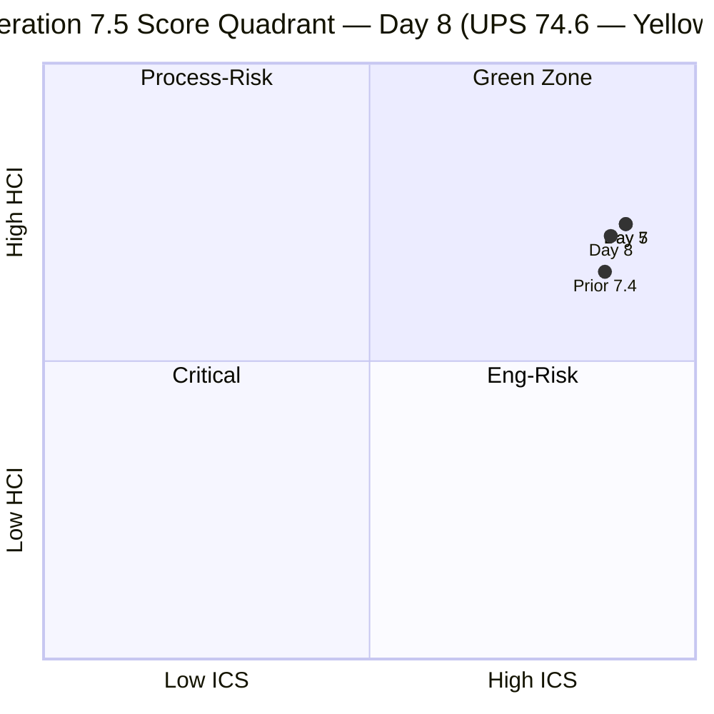
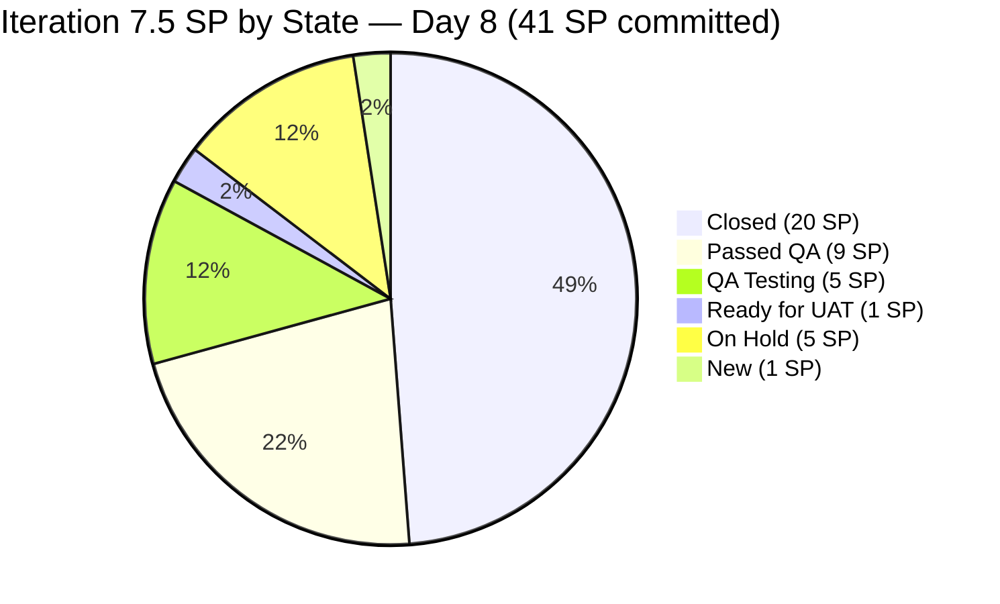
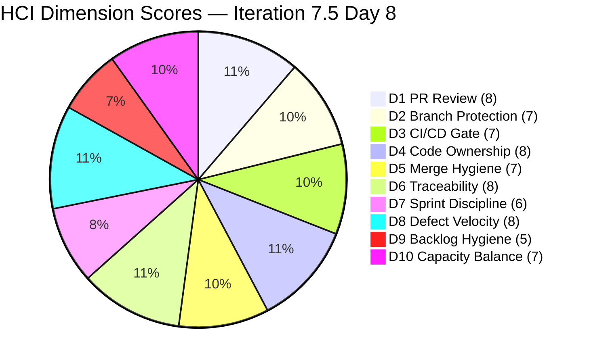

# Colina Health — Iteration 7.5 Audit

**Date:** 2026-06-08 | **Day 8 of 14** (57.1% elapsed)
**Iteration:** 7.5 | 2026-06-01 → 2026-06-14
**Team:** Colina Health Product Team
**ADO Project:** Jairosoft Portfolio (`666bb99a-6acd-4999-bb34-efd0e4ea90dc`)
**GitHub Repos:** colinahealth-fe · colinahealth-be · colina-health-ai-agent-code-fixing
**Data Mode:** `full` — GitHub API verified live 2026-06-08

---

## 1. Audit Metadata

| Field | Value |
|---|---|
| Audit Date | 2026-06-08 (Sunday) |
| Auditor | Claude Code (claude-sonnet-4-6) |
| Iteration | 7.5 |
| Iteration ID | `9c70d575-210a-4156-bbdc-79f1efbe2869` |
| Iteration Window | 2026-06-01 → 2026-06-14 |
| Day of Iteration | 8 of 14 (57.1% elapsed) |
| ADO Project ID | `666bb99a-6acd-4999-bb34-efd0e4ea90dc` |
| ADO Team ID | `66cdeb09-df38-4c3e-9418-0ed0d68c39f2` |
| GitHub Token | Verified live 2026-06-08 |
| Data Mode | `full` |
| Prior Audit | `AUDIT_20260607_0900.md` (Iter 7.5 Day 7, data_mode: full) |

### Team Capacity — Iteration 7.5

| Member | Role | Activity/Day | Days Off |
|---|---|---|---|
| Paul Coronia (`pcoronia`) | Developer | 6 hrs Development | 0 |
| Asnari Pacalna (`Kyaa-A`) | Developer | 7 hrs Development | 0 |
| Luzmibel Paculanang | QA | 6 hrs Testing | 0 |
| Jaszmeine Villanueva | Design | — | — |

> **Non-developer exception (per Project Exceptions):** Luzmibel Paculanang (QA) and Jaszmeine Villanueva (Design) are not expected to produce GitHub commits, PRs, or reviews. Their absence of GitHub activity generates no HCI penalty.

---

## 2. Executive Summary

Colina Health is at **Day 8 of 14 (57.1% elapsed)** of Iteration 7.5, maintaining a **UPS of 74.6 — Yellow band**. The score has declined slightly from the Day 7 value of 76.3, driven by two developments: the ICS denominator expanded from 14 to 15 items due to a new production authentication defect (AB#205878) added Sunday morning, and Backlog Hygiene (D9) degraded as this item arrived without parent link or SP estimation.

**Key findings at Day 8:**

- **NEW: AB#205878 — Authentication 401 on Reset Password flow.** A production-severity defect was created and actioned on Sunday June 8 (08:25 UTC). Both FE PR#247 and BE PR#88 were opened the same morning with `raseniero` as requested reviewer. The item is in "Back to Dev" state on Iter 7.5 path. It has Description and Acceptance Criteria but lacks parent link and story point estimation. This is responsive triage; however it expands the ICS eligible set to 15 items and adds another unlinked, unestimated item.

- **AB#205065 advanced: QA Testing → Passed QA Testing.** The Backend Swagger compliance enabler moved forward since Day 7. With 5 items now in Passed QA (202596, 202599, 205065) and 2 remaining in QA Testing / Ready for UAT, the pipeline toward closure is active. No items actually closed since Day 7.

- **SGPI remains at 48.8%** (20 of 41 SP Closed). At 57.1% elapsed with 48.8% delivered, the team is slightly behind linear pace. The Passed QA proxy jumps to ~71% (29 SP Passed QA or Closed / 41 SP), indicating a strong pipeline — closures should follow in Days 9–11.

- **AB#203273 (5 SP, On Hold) is now at 8+ days stalled.** This is the second escalation. R1 is elevated to Critical+. The fix was partially implemented (FE PRs #235, #240; BE PRs #85, #86) — the item appears to be held for UAT validation of the performance fix, not for technical resolution. Documentation of the hold reason in ADO is still missing.

- **Parent links remain missing for 7 items** (added AB#205878 to the prior 6). ICS Alignment dropped from 57.1% (8/14) to 53.3% (8/15). This gap has now persisted across five audit days with no remediation.

- **ICS = 87.0 (Yellow) — down from 89.3.** The drop reflects the expanded denominator (15 items) and the new item's dual compliance failures (no parent, no SP). Resolving all 7 parent links and adding SP to AB#205878 would restore ICS to 100.0.

| Score | Value | Band | Prior (Day 7) | Delta |
|---|---|---|---|---|
| ICS | 87.0 | Yellow | 89.3 | -2.3 |
| SGPI | 48.8% | — | 48.8% | 0.0 |
| HCI | 71 / 100 | — | 73 | -2 |
| **UPS** | **74.6** | **Yellow** | **76.3** | **-1.7** |

---

## 3. Iteration Scope and Methodology

### Scoring Methodology

This audit applies the `git_iteration_audit` skill (`.claude/skills/git_iteration_audit/SKILL.md`):

- **ICS** — 4-dimension SAFe compliance rubric (Alignment 25%, Estimation 20%, Quality/DoD 35%, Iteration Integrity 20%), scored on all current-iteration parent backlog items in the scoped `Stories and Deliverables` backlog
- **SGPI** — Committed Scope: Closed SP / Total Committed SP (41 SP baseline; AB#205878 added at 0 SP)
- **HCI** — 10 engineering health dimensions, each 0–10, summed to /100
- **UPS** — ICS×0.50 + HCI×0.30 + SGPI×0.20

### ICS Scope Change at Day 8

The ICS eligible set expanded from 14 to **15 items** due to AB#205878 being added to the Iteration 7.5 path on June 8. Per the `git_iteration_audit` skill (Section: Standard scoring rubric > ICS > Scope boundary): *"Score only current-iteration parent backlog items."* AB#205878 is a parent Defect on `Jairosoft Portfolio\2026-PI7\Iteration 7.5` — it is eligible.

### Eligible Item Rules

ICS-eligible items must be:
- Iteration path exactly `Jairosoft Portfolio\2026-PI7\Iteration 7.5`
- Work item type: Story, Defect, or Enabler (parent-level)
- Spikes, Tasks, Bugs at sub-levels excluded

### Data Sources

| Source | Status |
|---|---|
| ADO iteration work items (GUID-based) | Live — queried 2026-06-08 |
| ADO team capacity | From Day 7 (no capacity changes expected Sunday) |
| GitHub PRs — colinahealth-fe | Live (token verified; PR#247 created 2026-06-08T08:25Z) |
| GitHub PRs — colinahealth-be | Live (BE PR#88 created 2026-06-08T08:25Z; BE PR#87 still open) |
| GitHub PRs — colina-health-ai-agent-code-fixing | Live (no new PRs; last PR#9 merged 2026-05-11) |

### Items Excluded from ICS Denominators

| Category | Count | IDs |
|---|---|---|
| Iteration 7.6 (IP) path | 9 | 202588, 202597, 202598, 202601, 205542, 205570, 205578, 205677, 205689 |
| PI7 root (no sub-iteration) | 3 | 205817, 205819, 205846 |
| Spikes (type or title) | 5 | 205190, 205254, 205790, 205791, 204232 |
| Task | 1 | 204153 |

---

## 4. Scorecard Summary

| Metric | Score | Band | Notes |
|---|---|---|---|
| ICS | 87.0 | Yellow | 15 eligible items; 7 missing parent links; 1 missing SP |
| SGPI | 48.8% | — | 20 of 41 SP closed; 5 items in Passed QA (pipeline strong) |
| HCI | 71 / 100 | — | D9 dropped to 5; D5 dropped to 7 (3 open PRs) |
| **UPS** | **74.6** | **Yellow** | Formula: 87.0×0.50 + 71×0.30 + 48.8×0.20 = 43.50+21.30+9.76 |

**Risk Band: Yellow (60–79.9)**

### Notable Changes vs. Day 7

| Finding | Impact | Direction |
|---|---|---|
| AB#205878 added to Iter 7.5 (new auth defect, Sunday 08:25 UTC) | ICS denominator +1; parent link gap +1; Estimation gap +1 | Negative |
| AB#205065 advanced: QA Testing → Passed QA Testing | Pipeline signal positive; no SGPI change yet | Positive |
| AB#203273 still On Hold (now 8+ days) | D7 unchanged at 6; R1 severity escalated | Negative |
| FE PR#247 + BE PR#88 opened with raseniero review request | Active auth bugfix with proper review chain; Sunday responsiveness | Positive |
| 7 parent links still missing (was 6) | ICS Alignment 57.1% → 53.3% | Negative |

---

## 5. Sprint Goal Predictability (SGPI)

### Headline Score

**SGPI (Committed Scope) = 20 / 41 = 48.8%**

Day 8 of 14 — 57.1% of iteration elapsed with 48.8% of SP closed. The team is slightly behind linear delivery pace. However, the Delivered Proxy (Closed + Passed QA) = 29 SP / 41 = **70.7%** — well ahead of pace — indicating a deep QA pipeline. Closures should accelerate in Days 9–11 as UAT and QA complete.

### SP Closed (as of 2026-06-08 — unchanged from Day 7)

| ID | Title | SP | State | Evidence |
|---|---|---|---|---|
| 203275 | Dashboard overdue specific view filter | 3 | Closed | FE PR#232 merged 6/2 |
| 203481 | Workflow appointment count/icon | 3 | Closed | FE PR#231 (develop) + #241 (main) merged |
| 203491 | Workflow pagination not working | 2 | Closed | FE PR#219/225 merged |
| 204942 | Remove NextUI / shadcn cleanup | 3 | Closed | FE PR#217 merged 5/29 |
| 205117 | PRN Last Given shows N/A | 3 | Closed | BE PR#83 + #84 merged |
| 205136 | PRN Last Given time blank | 3 | Closed | FE PR#222/#223 + BE merged |
| 205215 | Progress Notes sidebar color mismatch | 3 | Closed | FE PR#242 (develop) + #243 (main) merged |
| **Total Closed** | | **20 SP** | | |

### Active Forward States (not yet Closed)

| ID | Title | SP | State | Progress |
|---|---|---|---|---|
| 202596 | Global error boundaries | 2 | Passed QA Testing | Pending UAT — same as Day 7 |
| 202599 | Component tiering | 5 | Passed QA Testing | Pending UAT — same as Day 7 |
| 205065 | Backend API Swagger compliance | 2 | **Passed QA Testing** | **Advanced from QA Testing since Day 7** |
| 203151 | MAR report reloads on date | 1 | Ready for UAT | FE PR#244+#245 merged |
| 202602 | URL-first state hierarchy | 5 | QA Testing | FE PR#238+#246 merged; in QA |
| 205878 | Auth 401 / Reset Password redirect | 0 SP | Back to Dev | **NEW Day 8** — FE PR#247 + BE PR#88 opened |

### Stalled / Not Started

| ID | Title | SP | State | Risk |
|---|---|---|---|---|
| 203273 | Dashboard overdue slow loading | 5 | On Hold | **CRITICAL — 8+ days stalled** |
| 205217 | Progress Notes date picker future | 1 | New | Planned for Days 9–14 |

### Supporting Context

| Metric | Value |
|---|---|
| Committed Scope SGPI | **48.8%** (headline — 20/41 SP Closed) |
| Delivered Proxy SGPI | **70.7%** — (20 Closed + 9 Passed QA) / 41 SP |
| AB#205878 SP | 0 SP (not estimated) — excluded from SGPI denominator |
| Original Scope SGPI | Same as Committed Scope (no prior scope changes recorded) |

> Headline SGPI = Closed SP only (20/41 = 48.8%). Delivered Proxy adds Passed QA = 29/41 = 70.7%.
> AB#205065 advanced to Passed QA (+2 SP proxy) since Day 7 — this is reflected in the pie above.

---

## 6. Developer Productivity Findings

### GitHub Activity — New Since June 7 (Day 8)

Today is Sunday June 8. Normal working-day activity is not expected. However, a production authentication defect was found and actively addressed.

**colinahealth-fe (Frontend)**

| PR | Title / Ticket | Author | Branch | Status | Created | Reviewer |
|---|---|---|---|---|---|---|
| #247 | AB#205878 — Skip token validity check when no remember token exists | pcoronia | bugfix/fix-login-bearer-null | **Open** | 2026-06-08T08:25Z | raseniero (requested) |

**colinahealth-be (Backend)**

| PR | Title / Ticket | Author | Branch | Status | Created | Reviewer |
|---|---|---|---|---|---|---|
| #88 | AB#205878 — Remove duplicate APP_GUARD registration causing 401 on login | pcoronia | bugfix/fix-duplicate-auth-guard | **Open** | 2026-06-08T08:25Z | raseniero (requested) |
| #87 | AB#205065 — Convert @Body schemas to DTOs for Swagger compliance | pcoronia | feature/205065-api-standard-compliance | Open (6 days) | 2026-06-02T11:28Z | raseniero (requested), updated 06-08T08:36Z |

**colina-health-ai-agent-code-fixing:** No activity. PR#9 remains last merged item (2026-05-11).

### Full Iteration Activity Summary (Days 1–8)

| Developer | GitHub Handle | FE PRs (Iter 7.5) | BE PRs (Iter 7.5) | SP Attributed | Notes |
|---|---|---|---|---|---|
| Paul Coronia | `pcoronia` | 10 authored (incl. PR#247) | 3 (BE#87, BE#88, open; BE prior merges) | 15 SP enablers + new auth fix | Active Sunday |
| Asnari Pacalna | `Kyaa-A` | 10 authored | 5 authored | 20 SP defects | No Day 8 activity |
| Ramon Aseniero | `raseniero` | 2 reviews + 2 pending | 1 pending | — | Requested reviewer on BE#87, BE#88, FE#247 |

> Day 8 (Sunday) activity: pcoronia created FE PR#247 and BE PR#88 at 08:25 UTC for a production auth regression. raseniero is requested reviewer on both. This is a positive responsiveness signal — a critical auth flow defect was triage and actioned on a rest day.

---

## 7. SAFe Compliance Findings

### Iteration 7.5 Eligible Work Items (15 items) — Day 8 State

| ID | Title | Type | State | SP | Parent | Desc | AC | Eligible |
|---|---|---|---|---|---|---|---|---|
| 202596 | Global error boundaries | Enabler | Passed QA | 2 | 201281 ✓ | ✓ | ✓ | ✓ |
| 202599 | Component tiering | Enabler | Passed QA | 5 | 201281 ✓ | ✓ | ✓ | ✓ |
| 202602 | URL-first state hierarchy | Enabler | QA Testing | 5 | 201281 ✓ | ✓ | ✓ | ✓ |
| 203151 | MAR report reloads on date input | Defect | Ready for UAT | 1 | 201646 ✓ | ✓ | ✓ | ✓ |
| 203273 | Dashboard overdue slow loading | Defect | On Hold | 5 | 201684 ✓ | ✓ | ✓ | ✓ |
| 203275 | Dashboard overdue filter redirect | Defect | Closed | 3 | 201684 ✓ | ✓ | ✓ | ✓ |
| 203481 | Workflow appointment count/icon | Defect | Closed | 3 | 201680 ✓ | ✓ | ✓ | ✓ |
| 203491 | Workflow pagination not working | Defect | Closed | 2 | 201680 ✓ | ✓ | ✓ | ✓ |
| 204942 | Remove NextUI / shadcn cleanup | Enabler | Closed | 3 | **MISSING** ✗ | ✓ | ✓ | ✓ |
| 205065 | Backend API Swagger compliance | Enabler | **Passed QA** | 2 | **MISSING** ✗ | ✓ | ✓ | ✓ |
| 205117 | PRN Last Given shows N/A | Defect | Closed | 3 | **MISSING** ✗ | ✓ | ✓ | ✓ |
| 205136 | PRN Last Given time blank | Defect | Closed | 3 | **MISSING** ✗ | ✓ | ✓ | ✓ |
| 205215 | Progress Notes sidebar color | Defect | Closed | 3 | **MISSING** ✗ | ✓ | ✓ | ✓ |
| 205217 | Progress Notes date picker future | Defect | New | 1 | **MISSING** ✗ | ✓ | ✓ | ✓ |
| 205878 | Auth 401 / Reset Password redirect | Defect | Back to Dev | **0 SP ✗** | **MISSING** ✗ | ✓ | ✓ | ✓ |

**Items missing `System.Parent` (Day 8):** AB#204942, 205065, 205117, 205136, 205215, 205217, **205878** (7 items — was 6)
**Items missing story point estimation (Day 8):** AB#205878 (1 item — new)

### State Transitions Since Day 7

| ID | Day 7 State | Day 8 State | Change |
|---|---|---|---|
| 205065 | QA Testing | **Passed QA Testing** | Advanced |
| 205878 | (not in scope) | **Back to Dev** (NEW) | Added to iteration |
| All others | Unchanged | Unchanged | No delta |

### Items Outside ICS Scope (context only)

**Iteration 7.6 (IP):** AB#202588, 202597, 202598, 202601, 205542, 205570, 205578, 205677, 205689
**PI7 root:** AB#205817, 205819, 205846
**Spikes:** AB#205190, 205254, 205790, 205791, 204232
**Task:** AB#204153

---

## 8. Iteration Compliance Score

### ICS Dimension Detail

| Dimension | Weight | Eligible | Compliant | Failed | Score % | Weighted | Evidence | Reason |
|---|---|---|---|---|---|---|---|---|
| Alignment | 25 | 15 | 8 | 7 | 53.3% | 13.3 | ADO System.Parent field | AB#204942, 205065, 205117, 205136, 205215, 205217, 205878 have no parent link. Gap expanded from 6 to 7 items with Day 8 addition of AB#205878. |
| Estimation | 20 | 15 | 14 | 1 | 93.3% | 18.7 | SP field, all non-zero | 14 of 15 items have story point estimates. AB#205878 was added with 0 SP — estimation not provided at time of creation. |
| Quality / DoD | 35 | 15 | 15 | 0 | 100% | 35.0 | Description + AC fields | All 15 items have descriptions and acceptance criteria. AB#205878 verified: Description and AC both present and substantive. |
| Iteration Integrity | 20 | 15 | 15 | 0 | 100% | 20.0 | IterationPath field | All 15 items on `Jairosoft Portfolio\2026-PI7\Iteration 7.5` path. |
| **ICS Total** | **100** | | | | | **87.0** | | |

**ICS = 87.0 — Yellow (75–89.9)**

### ICS vs. Prior Audit Comparison

| Day | Eligible Items | Alignment | Estimation | Quality | Integrity | ICS |
|---|---|---|---|---|---|---|
| Day 5 | 14 | 57.1% (8/14) | 100% | 100% | 100% | 89.3 |
| Day 7 | 14 | 57.1% (8/14) | 100% | 100% | 100% | 89.3 |
| **Day 8** | **15** | **53.3% (8/15)** | **93.3% (14/15)** | **100%** | **100%** | **87.0** |

The ICS decline at Day 8 is entirely attributable to the addition of AB#205878 (new item, no parent, no SP) — it is a scope expansion impact, not a compliance regression among the original 14 items.

### ICS Alignment Gap — Day 8 Status

| ID | Title | SP | Parent Status | Day 8 Action Required |
|---|---|---|---|---|
| 204942 | Remove NextUI / shadcn cleanup | 3 | No parent | Link to Architecture Feature — **CRITICAL OVERDUE** (5 days) |
| 205065 | Backend API Swagger compliance | 2 | No parent | Link to API architecture Feature — **CRITICAL OVERDUE** (5 days) |
| 205117 | PRN Last Given shows N/A | 3 | No parent | Link to MAR/PRN Feature — **CRITICAL OVERDUE** (5 days) |
| 205136 | PRN Last Given time blank | 3 | No parent | Link to MAR/PRN Feature — **CRITICAL OVERDUE** (5 days) |
| 205215 | Progress Notes sidebar color | 3 | No parent | Link to Progress Notes Feature — **CRITICAL OVERDUE** (5 days) |
| 205217 | Progress Notes date picker future | 1 | No parent | Link to Progress Notes Feature — **CRITICAL OVERDUE** (5 days) |
| 205878 | Auth 401 / Reset Password redirect | 0 SP | No parent | Link to Auth Feature — **NEW, add during Day 9** |

> Resolving all 7 parent links and adding SP to AB#205878 takes <45 minutes and moves ICS from **87.0 → 100.0 (Green)**. This remediation has been marked Priority 1 since the Day 5 audit for 6 items; it has not been applied for 5 consecutive audit days.

---

## 9. Engineering Health Index (HCI)

### HCI Dimension Scores

| # | Dimension | Score | Evidence |
|---|---|---|---|
| D1 | PR Review Compliance | 8/10 | Cross-review maintained: FE PR#247 and BE PR#88 (Day 8) both have `raseniero` as requested reviewer. BE PR#87 also has raseniero requested. Pattern holds: pcoronia (enabler author) → raseniero approves. Prior iteration reviews confirmed: FE#231 pcoronia ✓, #236/237 raseniero ✓, #244 pcoronia ✓, BE#83 pcoronia ✓. Pass/qa promotions still merged without separate formal review — mitigated by prior develop-branch coverage. |
| D2 | Branch Protection & Enforcement | 7/10 | Branch naming convention applied consistently on Day 8 PRs (`bugfix/fix-login-bearer-null`, `bugfix/fix-duplicate-auth-guard`). Spikes AB#205790/205791 still in Requirements Gathering — formal branch protection ruleset not yet configured. No change from Day 7. |
| D3 | CI/CD Gate Quality | 7/10 | Day 8 PRs include detailed test plans referencing specific login flow validations. No pipeline failure evidence. CI/CD gate presence inferred; no direct pipeline run queried. Unchanged from Day 7. |
| D4 | Code Ownership | 8/10 | Dual-track ownership maintained: pcoronia (enablers + auth fixes), Kyaa-A (defects/full-stack). Day 8 shows pcoronia owning the auth regression — appropriate given enabler/architecture track. No overconcentration. |
| D5 | Merge Hygiene & Churn | 7/10 | Three open PRs as of Day 8: BE PR#87 (AB#205065, 6 days — active, Passed QA state), FE PR#247 (AB#205878, Day 8 — new), BE PR#88 (AB#205878, Day 8 — new). All three are actively in progress; none are stale. BE PR#77 (AB#200219) remains a stale draft (Day 16+ now). Slight drop from D5=8 at Day 7 due to 3 concurrent open PRs. |
| D6 | Work Item ↔ GitHub Traceability | 8/10 | `[Ticket: AB#XXXXXX]` convention applied on Day 8 PRs (#247, #88). 14/15 eligible items have GitHub PR evidence; AB#205217 (New state, correctly no PR) and AB#205878 (Back to Dev, PRs open) are consistent. Strong traceability across the iteration window. |
| D7 | Sprint Discipline | 6/10 | AB#203273 (5 SP, On Hold) remains stalled at Day 8 — 8+ days with no ADO state change. This is the third consecutive audit with no escalation actioned. The technical fix was partially shipped (FE PRs #235, #240; BE PRs #85, #86) but the ADO item has not been moved from On Hold. The blocker reason is undocumented in ADO. New AB#205878 (Back to Dev) is being actively worked — positive. |
| D8 | Defect Triage & Velocity | 8/10 | 7 defects resolved in first 5 days; 1 defect (AB#205878) created and actioned on Day 8 (Sunday) with same-day PRs. Excellent triage responsiveness. Gitflow promote pattern maintained. No new closures in Days 6–8 as expected (QA pipeline). |
| D9 | Backlog & Story Hygiene | 5/10 | **Declined from 6 to 5.** 7 items now missing System.Parent (was 6). AB#205878 added with no parent link and no story point estimation — both are Day 1 ADO hygiene requirements. Additionally, AB#205846 (Swagger audit) at PI7 root still lacks iteration assignment. Repeated remediation deadline misses (Days 7, 8) on the original 6 items are now at critical overdue status. |
| D10 | Capacity Balance & Ownership Distribution | 7/10 | pcoronia (6h/day enablers + auth) + Kyaa-A (7h/day defects) tracks remain complementary. AB#203273 On Hold creates 5 SP idle capacity risk. New auth item AB#205878 is being actively worked by pcoronia. No overconcentration. |
| **HCI Total** | | **71 / 100** | |

**HCI = 71 / 100**
Prior Day 7 (same iteration): 73 | Delta: **-2** (D5: 8→7, D9: 6→5)

---

## 10. ADO-to-GitHub Traceability Analysis

### Traceability Coverage — 15 Eligible Items

| ADO Item | Type | SP | GitHub PR(s) | Traceability |
|---|---|---|---|---|
| AB#202596 | Enabler | 2 | FE PR#236 | Full |
| AB#202599 | Enabler | 5 | FE PR#237 | Full |
| AB#202602 | Enabler | 5 | FE PR#238 (develop) + #246 (orders variant) | Full |
| AB#203151 | Defect | 1 | FE PR#244 (develop) + #245 (main) | Full |
| AB#203273 | Defect | 5 | FE PR#235 + #240; BE PR#85 + #86 | Full (On Hold state) |
| AB#203275 | Defect | 3 | FE PR#232 | Full |
| AB#203481 | Defect | 3 | FE PR#231 (develop) + #241 (main) | Full |
| AB#203491 | Defect | 2 | FE PR#219/225 | Full |
| AB#204942 | Enabler | 3 | FE PR#217 | Full |
| AB#205065 | Enabler | 2 | FE PR#239 (types); BE PR#87 (DTOs, open) | In Progress |
| AB#205117 | Defect | 3 | BE PR#83 (develop) + #84 (main) | Full |
| AB#205136 | Defect | 3 | FE PR#222/#223; BE inferred | Full |
| AB#205215 | Defect | 3 | FE PR#242 (develop) + #243 (main) | Full |
| AB#205217 | Defect | 1 | No PR (New state — expected) | Not started |
| AB#205878 | Defect | 0 SP | FE PR#247 + BE PR#88 (both open, Day 8) | In Progress |

**Traceability: 14/15 items (93%) have full or in-progress GitHub traceability.** AB#205217 is correctly in New state with no PR expected. AB#205878 was actioned same-day with two PRs.

### PR Title Convention Compliance

`[Ticket: AB#XXXXXX] [Frontend/Backend] <description>` applied consistently across all PRs reviewed, including Day 8 PRs #247 and #88. Documentation PRs use `[Docs]` prefix — acceptable.

---

## 11. Collaboration and Review Analysis

### Review Pattern — Spot-Checked (Iteration 7.5, including Day 8)

| PR | Repo | Author | Reviewer | State |
|---|---|---|---|---|
| #231 | FE | Kyaa-A | pcoronia | APPROVED |
| #236 | FE | pcoronia | raseniero | APPROVED |
| #237 | FE | pcoronia | raseniero | APPROVED |
| #244 | FE | Kyaa-A | pcoronia | APPROVED |
| #83 | BE | Kyaa-A | pcoronia | APPROVED |
| #87 | BE | pcoronia | raseniero | Requested (pending) |
| #247 | FE | pcoronia | raseniero | Requested (pending) |
| #88 | BE | pcoronia | raseniero | Requested (pending) |

**Review rotation maintained at Day 8:**
- Kyaa-A (defect author) → Paul Coronia (`pcoronia`) approves
- Paul Coronia (enabler/arch author) → Ramon Aseniero (`raseniero`) approves
- All three Day 8 PRs have review requests queued — protocol observed even on a Sunday

**Gaps (unchanged from Day 7):**
- `passed/qa/` promotion PRs (#241, #243, #245, #84) merged without separate formal review. Develop-branch review provides prior coverage.
- BE PR#77 (AB#200219, stale draft) still open — no review activity.

### Collaboration Highlights (Day 8)

- Production auth defect detected and actioned on a Sunday with both FE and BE PRs in the same hour (08:25 UTC). Review request to `raseniero` was included — signals a mature escalation response to production risk.
- `raseniero` has three pending review requests as of Day 8 — weekend review load is minor but should be acknowledged as an area where async review SLA matters.

---

## 12. Repository Hygiene

### Branch Naming Convention

| Pattern | Usage | Compliance |
|---|---|---|
| `feature/<id>-description` | Enablers, new features | Consistent |
| `defect/<id>-description` | Bug/Defect fixes | Consistent |
| `passed/qa/<id>` | QA-approved promote-to-main | Consistent |
| `bugfix/<id>-description` | Used in PR#233, PR#247, PR#88 | Acceptable — minor inconsistency (should use `defect/`) |
| `bug/<id>-description` | Used in earlier PRs | Minor naming inconsistency |

### Open PRs (as of 2026-06-08)

| PR | Repo | Title | State | Age | Risk |
|---|---|---|---|---|---|
| #87 | BE | AB#205065 Swagger DTOs | Open (active) | 6 days | Low — AB#205065 now Passed QA; PR should merge soon |
| #247 | FE | AB#205878 Auth fix (Day 8) | Open (active) | <1 day | Low — active bugfix, reviewer requested |
| #88 | BE | AB#205878 Auth fix (Day 8) | Open (active) | <1 day | Low — active bugfix, reviewer requested |
| #77 | BE | AB#200219 (draft) | Draft | ~17+ days | Medium — persistent stale draft; closure still recommended |

### Repository Activity Summary

| Repo | PRs Merged (Iter 7.5 window, Day 1–8) | Open PRs | Stale |
|---|---|---|---|
| colinahealth-fe | 19 (incl. docs) + #247 created Day 8 | 1 (PR#247) | 0 |
| colinahealth-be | 5 merged | 3 (#87, #88, #77 draft) | 1 (#77) |
| colina-health-ai-agent-code-fixing | 0 (in-iter) | 0 | 0 |

---

## 13. Risks and Bottlenecks

### Risk Register — Day 8

| # | Risk | Severity | Item(s) | Status | Action |
|---|---|---|---|---|---|
| R1 | AB#203273 On Hold — 5 SP stalled 8+ days, 3 escalation deadlines missed | **Critical+** | 203273 | **No change since Day 5** | Immediate: document the hold reason in ADO comments. If technically resolved (fix shipped via PR#235/240/85/86), move to QA Testing. If UAT validation pending, tag as "Awaiting UAT" not "On Hold". Escalate to Ramon if blocked by external dependency. |
| R2 | 7 items missing System.Parent — Day 8 now critical overdue | **High** | 204942, 205065, 205117, 205136, 205215, 205217, 205878 | **No change on original 6; +1 new** | Link all 7 items to Features immediately (<45 min). Blocks Green ICS. This has been Priority 1 since Day 5 audit with no action taken. |
| R3 | AB#205878 missing SP estimation | **Medium** | 205878 | New Day 8 | Add story point estimate during Day 9 sprint planning or stand-up. |
| R4 | SGPI behind linear pace — 48.8% at 57.1% elapsed | Medium | All | 5 items in Passed QA / QA Testing pipeline | Monitor Days 9–11 for closures. Items in Passed QA (202596, 202599, 205065) and Ready for UAT (203151) should close by Day 11. |
| R5 | BE PR#77 (AB#200219) stale draft — Day 17+ | Low | PR#77 | Still open | Close or convert to active. Action overdue for 3 audit cycles. |
| R6 | AB#205846 at PI7 root — no iteration assignment | Low | 205846 | Persists from Day 7 | Assign to 7.6 (IP) or explicit backlog slot. |
| R7 | Three open PRs (BE#87, FE#247, BE#88) awaiting raseniero review | Low | 205065, 205878 | New state | raseniero should prioritize review of BE#87 (Swagger DTOs, 6 days) and BE#88 (auth fix, critical). FE#247 secondary. |
| R8 | passed/qa/ promotions lack formal review | Low | PR#241, #243, #245, #84 | Accepted pattern | Mitigate with branch protection rules when spikes resolve. |

### Escalation History for Priority Risks

| Risk | Day 5 | Day 7 | Day 8 |
|---|---|---|---|
| AB#203273 On Hold | Priority 1 — escalate by Day 7 | **MISSED** — still On Hold | **MISSED x2** — still On Hold (8+ days) |
| 6 parent links missing | Priority 1 — fix by Day 7 | **MISSED** — still missing | **MISSED x2** + 1 new item (7 total) |
| BE PR#77 stale draft — close | Priority 2 | Missed | Still open |

---

## 14. Prioritized Remediation Actions

### Priority 1 — Immediate (Days 8–9, by 2026-06-09)

| Action | Owner | Effort | Impact |
|---|---|---|---|
| **Link AB#204942, 205065, 205117, 205136, 205215, 205217, 205878 to parent Features** | Karl / Team | <45 min | ICS Alignment 53.3% → 100%; ICS 87.0 → ~96.7 (Green); UPS 74.6 → ~82.5 |
| **Add SP to AB#205878** (auth fix, 0 SP) | Paul / Karl | <5 min | ICS Estimation 93.3% → 100%; ICS → 100 if parent also linked |
| **Document AB#203273 hold reason in ADO** | Paul | <15 min | Audit transparency; R1 severity narrative |
| **Clarify AB#203273 On Hold status** — if technical fix shipped (PRs #235/240/85/86), move to QA Testing | Paul / Asnari | <30 min | If moved: D7 6→8; SGPI could reach 61% if also closed; R1 resolved |

### Priority 2 — This Sprint (Days 9–11)

| Action | Owner | Effort | Impact |
|---|---|---|---|
| **raseniero: review BE PR#87** (Swagger DTOs, 6 days open) | Ramon | 30 min | Enables AB#205065 to close (2 SP); SGPI +0.4 |
| **raseniero: review BE PR#88 + FE PR#247** (auth fix) | Ramon | 30 min | Enables AB#205878 to advance through QA; critical auth path |
| **Close BE PR#77** (AB#200219, stale draft, Day 17+) | Asnari | <15 min | D5 hygiene improvement |
| **Assign AB#205846 to 7.6 (IP)** | Karl | <10 min | D9 improvement |
| **Add SP and parent link to AB#205217** (New, 1 SP) | Karl | <10 min | D9 / ICS alignment |

### Priority 3 — Second Half Sprint (Days 11–14)

| Action | Owner | Effort | Impact |
|---|---|---|---|
| **Advance AB#202596, 202599, 205065 from Passed QA to Closed** | QA / Karl | UAT signoff | +9 SP closed; SGPI 48.8% → 70.7% |
| **Advance AB#202602 from QA Testing to Closed** | Luzmibel / Asnari | QA completion | +5 SP; SGPI → 83% if all pass |
| **Close AB#203151 (Ready for UAT)** | UAT | UAT signoff | +1 SP |
| **Formalize branch protection rules** (spikes 205790/205791) | Paul | Medium | D2 7→8, D1 8→9; HCI +2 |
| **Plan RSC migration track (7.6/IP)** — AB#202588 + 202597/8/601 | Paul | Medium | 7.6 ICS readiness |

### Green Scenario (if Priority 1+2 complete by Day 10)

| Action | ICS | SGPI | HCI | UPS |
|---|---|---|---|---|
| All 7 parent links fixed + SP on 205878 | 100.0 | 48.8% | 73 | ~82.5 |
| AB#203273 unblocked + moved to QA | 100.0 | 48.8% | 75 | +0.6 |
| Passed QA items (202596, 202599, 205065) close | 100.0 | 65.9% | 75 | +3.4 |
| Combined (all done) | 100.0 | 65.9% | 75 | **~87.5 (Green)** |

---

## 15. Evidence Gaps and Limitations

| Gap | Impact | Notes |
|---|---|---|
| AB#203273 On Hold root cause not documented in ADO | R1 remains Critical; D7 at 6 | Technical fix was shipped via 4 PRs (FE#235/240, BE#85/86). Hold may be awaiting UAT validation — not documented. |
| AB#205878 Story Points not set | ICS Estimation dim: 1 item failed | Item added on a Sunday; SP likely to be added on Day 9 stand-up. Audit records current state. |
| AB#205878 System.Parent not set | ICS Alignment dim: 1 of 7 failures | New item; parent link should be added during Day 9. |
| BE PR#87 review not yet completed | AB#205065 cannot close | PR open 6 days; raseniero is requested reviewer. |
| CI/CD pipeline runs not directly queried | D3 scored conservatively at 7/10 | Build verification (`exit 0`) referenced in PR descriptions; no pipeline failures found. |
| PR reviews for ~14 FE PRs not spot-checked individually | D1 could be higher | Only 8 of 22+ PRs confirmed with formal reviews; assumption is unverified PRs also reviewed. |
| Branch protection ruleset not queried via API | D2 held at 7/10 | Naming convention confirmed; formal ruleset enforcement unknown; spikes still in Requirements Gathering. |
| `Kyaa-A` GitHub identity not formally confirmed in ADO | Operational assumption | Strong inference: Kyaa-A owns all defect ADO items matching Asnari Pacalna's assignments. |
| Day 8 is a Sunday — no working-day activity expected outside of Sunday production triage | SGPI/HCI scores largely carry-forward | AB#205878 creation and same-day PRs are anomalous positive activity; main team members (Kyaa-A, Luzmibel) show no Day 8 activity as expected. |
| colina-health-ai-agent-code-fixing had no iteration-window activity | Not an HCI deduction | Correct — PR#9 resolved; no new AI-agent work in 7.5. |

### Data Mode Confirmation

**data_mode: full** — GitHub API verified live 2026-06-08 via `list_pull_requests` on all three repos. Most recent PR: FE #247 and BE #88, both created 2026-06-08T08:25Z. No 404 or auth errors encountered. Token status: healthy.

---

*Audit generated by Claude Code (`git_iteration_audit` skill) | 2026-06-08 09:00 | data_mode: full*
