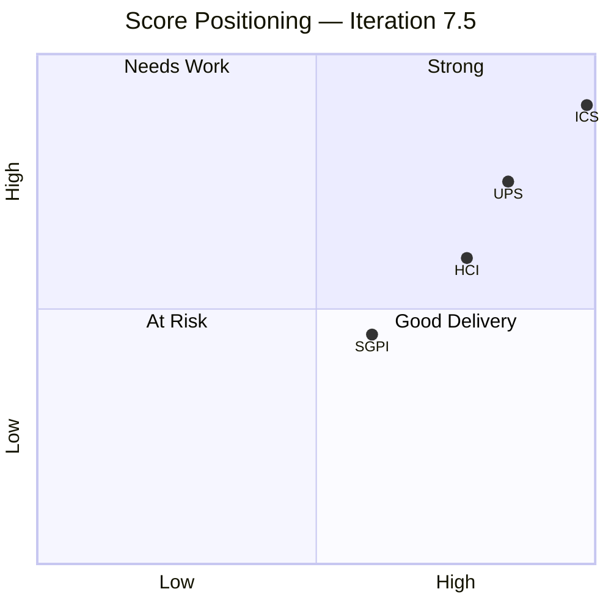
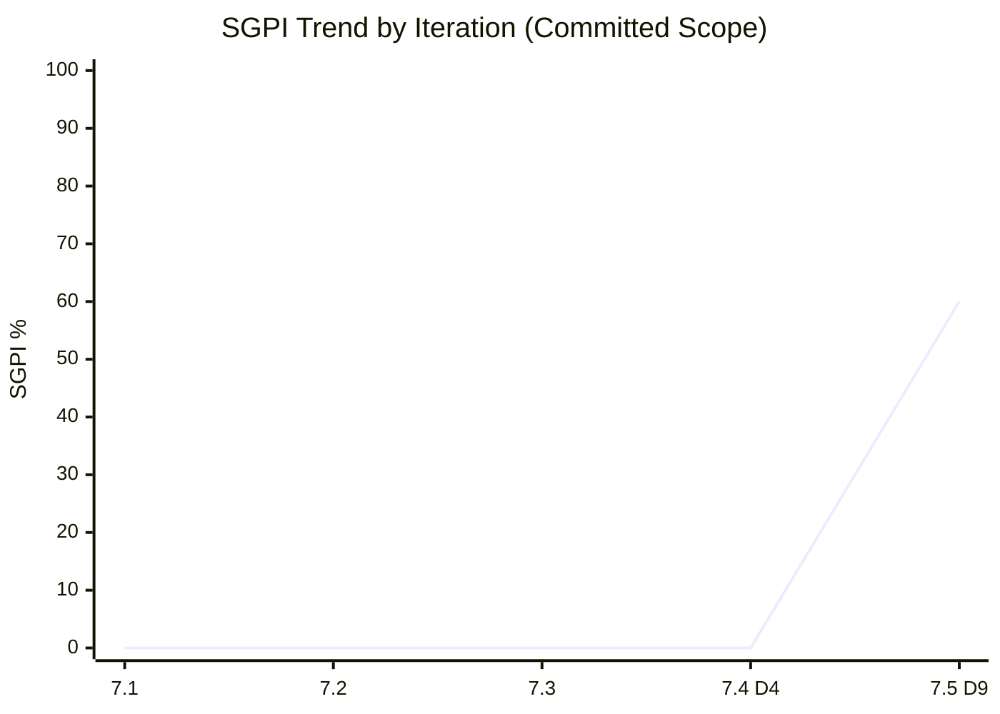
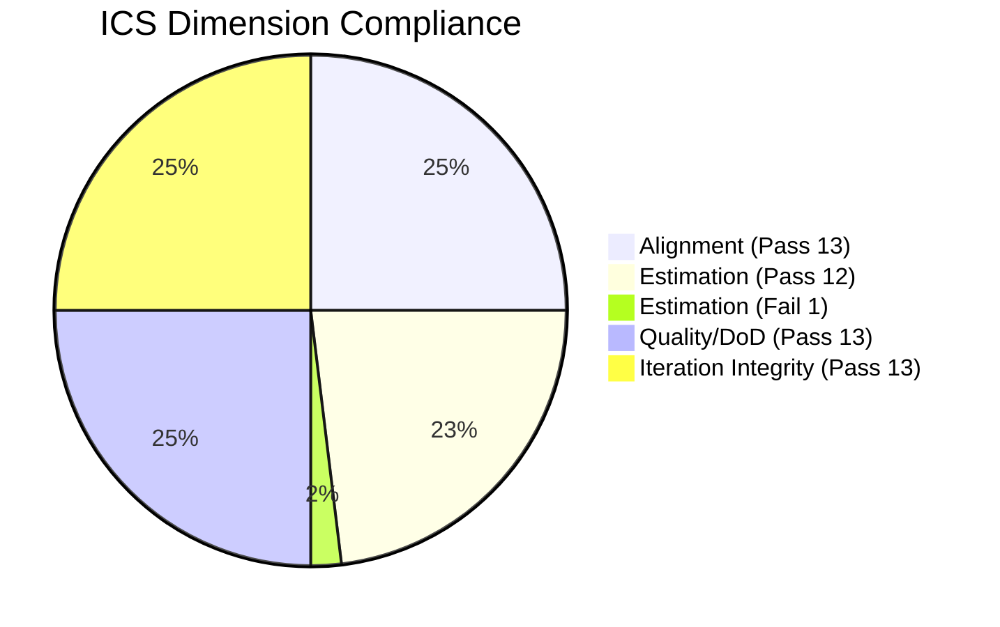
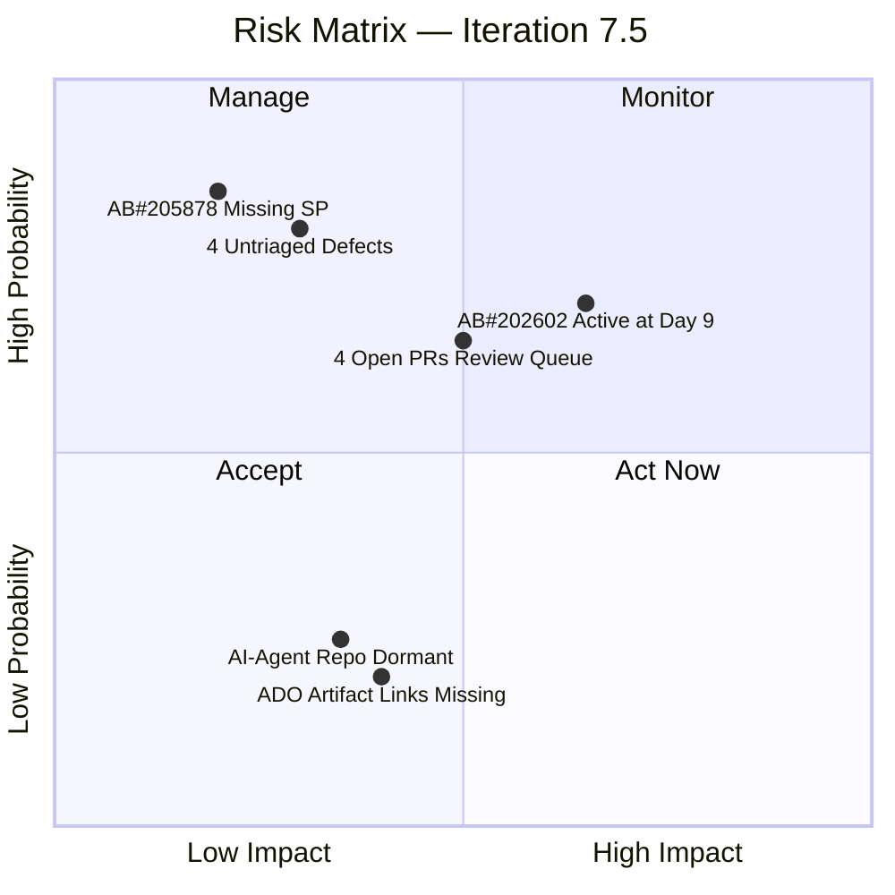

# Colina Health Product Team — Iteration Audit

**Iteration 7.5 · Day 9 of 14 · 2026-06-09**
ADO Team: `Colina Health Product Team` · Project: `Jairosoft Portfolio`
Repos: `colinahealth-fe` · `colinahealth-be` · `colina-health-ai-agent-code-fixing`

---

## 1. Audit Metadata

| Field | Value |
|---|---|
| Audit Date | 2026-06-09 |
| Audit Time | 02:04 |
| Workspace | `git_cc_dev` |
| Auditor | Claude Code (automated) |
| Iteration | **Iteration 7.5** |
| Iteration ID | `9c70d575-210a-4156-bbdc-79f1efbe2869` |
| Iteration Window | 2026-06-01 → 2026-06-14 |
| Day of Iteration | Day 9 of 14 (64.3% elapsed) |
| ADO Project ID | `666bb99a-6acd-4999-bb34-efd0e4ea90dc` |
| ADO Team ID | `66cdeb09-df38-4c3e-9418-0ed0d68c39f2` |
| ADO Backlog | Stories and Deliverables |
| GitHub Repos | `jairosoft-com/colinahealth-fe`, `jairosoft-com/colinahealth-be`, `jairosoft-com/colina-health-ai-agent-code-fixing` |
| Data Mode | **full** — GitHub API live-verified this run (raseniero token resolved) |
| Prior Audit | `AUDIT_20260521_0900.md` (Iteration 7.4, Day 4) |

> **Data mode note:** All prior audits from 2026-04-21 through 2026-05-21 carried `data_mode: partial` due to a GitHub API 401 error on the `raseniero` token. This audit confirmed the token is now live. HCI dimensions D1–D6 are scored from fresh GitHub evidence for the first time in 11 audit cycles. Score movement in HCI should be read as a methodology correction (partial → full evidence), not a team performance swing.

---

## 2. Executive Summary

Colina Health Product Team enters Day 9 of Iteration 7.5 with their strongest audit profile since the token outage began. The GitHub API is fully restored, enabling the first complete HCI assessment in 11 cycles.

**ICS is Green at 98.5%** — the highest recorded for this team. All 13 eligible items carry parent links, quality evidence, and iteration-correct paths. Only one item (AB#205878, an auth regression filed 2026-06-08) is missing story points, producing the sole ICS deduction.

**SGPI is 60.0% (Yellow)** on the strict committed-scope measure. Eight items are fully Closed at 21 SP; four remain in Passed QA (11 SP) and one Active (5 SP). At Day 9 of 14 with this distribution, delivery is on a reasonable trajectory but requires the Passed QA items to progress to Closed before June 14.

**HCI is 77/100 (Yellow)** — a meaningful improvement from the last fully-scored HCI (65/100 on 2026-04-21). The team's merge hygiene, traceability, and defect velocity are notably stronger. Weak spots remain in PR review turnaround (3 open FE PRs await `raseniero` review), a dormant AI-agent repo, and 4 newly-filed defects that have not yet received iteration assignment.

**UPS = 84.4 — Green (≥ 80).** This is the team's first Green UPS score. The primary driver is ICS excellence; HCI and SGPI remain recovery targets.

### Score Comparison

| Metric | Iteration 7.4 (Day 4) | Iteration 7.5 (Day 9) | Delta |
|---|---|---|---|
| ICS | 86.1% Yellow | **98.5% Green** | +12.4 pp |
| HCI | 65 Yellow (partial data) | **77 Yellow (full data)** | +12 pts* |
| SGPI | 0.0% (Day 4) | **60.0% Yellow** | +60.0 pp |
| UPS | 62.6 Yellow | **84.4 Green** | +21.8 pts |

*HCI comparison is methodology-adjusted: 7.4 used carry-forward D1–D6; 7.5 uses fresh evidence for all 10 dimensions.

---

## 3. Iteration Scope and Methodology

### Iteration Definition

- **Name:** Iteration 7.5
- **Window:** 2026-06-01 to 2026-06-14 (10 business days)
- **Assessment point:** Day 9 of 14 calendar days, 64.3% elapsed
- **Team capacity:** 19 hrs/day total; 0 days off
  - Paul Coronia — Development, 6 hrs/day
  - Asnari Pacalna — Development, 7 hrs/day
  - Luzmibel Paculanang — Testing, 6 hrs/day

### ICS Eligibility Rules

Items are ICS-eligible when ALL of the following are true:

1. `System.IterationPath` == `Jairosoft Portfolio\2026-PI7\Iteration 7.5`
2. Work item type is Story, Defect, or Enabler (Spikes and Tasks excluded)
3. Item is at parent-backlog level (not a child Task)

**Excluded from ICS:** Spikes (AB#204232, AB#205190, AB#205254, AB#205790, AB#205791) — excluded by type.

**Excluded by path mismatch (not ICS-eligible in 7.5):**
- Items on `Iteration 7.6 (IP)` path: AB#202588, AB#202597, AB#202598, AB#202601, AB#203273 — correctly deferred to next iteration; scored in 7.6 context.
- Items on `2026-PI7` root (no sub-iteration): AB#205965, AB#205969, AB#205971, AB#205981 — new defects filed 2026-06-09, awaiting triage assignment.

### Non-Developer Exception

Per `git_cc_dev/CLAUDE.md` Project Exceptions: **Luzmibel Paculanang (QA)** and **Jaszmeine Villanueva (Design)** are not penalized for GitHub absence. GitHub developer-productivity dimensions (D1, D4, D5) use only developer roster (Paul Coronia, Asnari Pacalna) as denominator.

### GitHub Evidence Window

All GitHub evidence is scoped to commit/PR activity from 2026-06-01 through 2026-06-09 (iteration start through today).

---

## 4. Scorecard Summary



| Score | Value | Band | Prior (7.4) | Trend |
|---|---|---|---|---|
| **ICS** | **98.5%** | Green (≥ 90) | 86.1% Yellow | Up |
| **HCI** | **77 / 100** | Yellow (60–79) | 65 / 100 Yellow* | Up* |
| **SGPI** | **60.0%** | Yellow (day-relative) | 0.0% (Day 4) | Up |
| **UPS** | **84.4** | **Green (≥ 80)** | 62.6 Yellow | Up |

*HCI improvement reflects both team progress and restoration of full GitHub evidence (methodology correction from partial).

### UPS Calculation

```
UPS = ICS × 0.50 + HCI × 0.30 + SGPI × 0.20
    = 98.5 × 0.50 + 77 × 0.30 + 60.0 × 0.20
    = 49.25 + 23.10 + 12.00
    = 84.4  →  Green
```

---

## 5. Sprint Goal Predictability (SGPI)

### SGPI — Headline (Committed Scope)

```
SGPI = Closed Story Points / Total Committed Story Points
     = 21 / 35
     = 60.0%
```

### Supporting Context Metrics

| Metric | Formula | Value |
|---|---|---|
| **Committed Scope SGPI** (headline) | Closed SP / Committed SP | **60.0%** |
| Delivered Proxy SGPI | (Closed + Passed QA SP) / Committed SP | 85.7% (30/35) |
| Active/In-Progress SP remaining | — | 5 SP (AB#202602) |

### Committed Work Item Status

| ID | Title | Type | SP | State | SGPI Contribution |
|---|---|---|---|---|---|
| AB#202596 | [Enabler] Add global error boundaries | Enabler | 2 | Passed QA | Proxy only |
| AB#202599 | [Enabler] Implement component tiering | Enabler | 5 | Passed QA | Proxy only |
| AB#202602 | [Enabler] URL-first state hierarchy | Enabler | 5 | Active | Excluded |
| AB#203151 | [MAR] Report reloads on date click | Defect | 1 | Closed | **+1 SP** |
| AB#203275 | [Dashboard] Overdue med not filtered | Defect | 3 | Closed | **+3 SP** |
| AB#203481 | [Workflow] Appointment count/icon missing | Defect | 3 | Closed | **+3 SP** |
| AB#203491 | [Workflow] Pagination not working | Defect | 2 | Closed | **+2 SP** |
| AB#204942 | [Enabler] Remove NextUI/shadcn cleanup | Enabler | 3 | Closed | **+3 SP** |
| AB#205065 | [Enabler] Backend API standard compliance | Enabler | 2 | Passed QA | Proxy only |
| AB#205117 | [MAR][PRN] Last Given shows N/A | Defect | 3 | Closed | **+3 SP** |
| AB#205136 | [MAR][PRN] Last Given no time | Defect | 3 | Closed | **+3 SP** |
| AB#205215 | [Dashboard] Progress Notes color | Defect | 3 | Closed | **+3 SP** |
| AB#205878 | [Auth] OTP redirects to login not reset | Defect | — | Passed QA | Unscored (no SP) |

**Closed SP: 21** (items 203151, 203275, 203481, 203491, 204942, 205117, 205136, 205215)
**Passed QA SP: 9** (items 202596, 202599, 205065; 205878 unscored)
**Active SP: 5** (item 202602)
**Total Committed SP: 35** (excludes 205878 — no story points)

### SGPI Trend



> Note: Using standard `xychart` — replace with bar chart below if Obsidian rendering fails.

```mermaid
gantt
    title Iteration 7.5 Delivery Progress (SP)
    dateFormat X
    axisFormat %s SP
    section Closed (21 SP)
    203151 Defect 1SP :done, 0, 1
    203275 Defect 3SP :done, 1, 4
    203481 Defect 3SP :done, 4, 7
    203491 Defect 2SP :done, 7, 9
    204942 Enabler 3SP :done, 9, 12
    205117 Defect 3SP :done, 12, 15
    205136 Defect 3SP :done, 15, 18
    205215 Defect 3SP :done, 18, 21
    section Passed QA (9 SP)
    202596 Enabler 2SP :active, 21, 23
    202599 Enabler 5SP :active, 23, 28
    205065 Enabler 2SP :active, 28, 30
    section Active (5 SP)
    202602 Enabler 5SP :crit, 30, 35
```



**Interpretation:** At Day 9 of 14 (64.3% elapsed), 60% of committed SP are formally Closed. The 9 SP sitting in Passed QA represent work that has cleared development and QA review and is awaiting final close-out — a paperwork gap, not a delivery gap. The critical open item is AB#202602 (URL-first state hierarchy, 5 SP) still in Active state; this must be completed and passed through QA before June 14.

---

## 6. Developer Productivity Findings

### Summary

With GitHub fully accessible for the first time since April 21, this section reflects real activity data. The team's developer productivity in Iteration 7.5 is strong, with heavy frontend PR activity and solid backend delivery. The AI-agent repo remains dormant.

### Frontend (colinahealth-fe) — Iteration 7.5

- **PRs opened:** ~21 (PRs #230–250 range, June 1–9)
- **PRs merged:** ~18 in the iteration window
- **Open PRs awaiting review:** #248, #249, #250 (all authored by `asnari`; awaiting `raseniero` review)
- **Primary authors:** Paul Coronia (`pcoronia`), Asnari Pacalna (`asnari`)
- **Branch strategy:** Feature branches targeting `develop`; `main` protected for production releases
- **AB# reference rate:** High — most PR titles include `AB#` references (e.g., `[AB#203481]`, `[AB#205136]`)

### Backend (colinahealth-be) — Iteration 7.5

- **PRs opened:** 8 (PRs #82–89)
- **PRs merged:** 7 (PR#89 open, awaiting review)
- **Notable:** PR#82 (merged 2026-06-01) resolved AB#200027 (PRN sorting bug, stalled since 7.4)
- **Primary author:** Asnari Pacalna with Paul Coronia contribution
- **AB# reference rate:** Moderate — several PRs reference work items directly

### AI Agent (colina-health-ai-agent-code-fixing) — Iteration 7.5

- **Last PR:** #8 (2026-02-07) — no activity since
- **Status:** Dormant — no commits, no PRs in 7.5 window
- **Spikes filed:** AB#205790 (branch protection) and AB#205791 (code ownership) are in Requirements Gathering — engineering investment planned but not yet delivered

### Authorship Distribution

| Developer | FE PRs (est.) | BE PRs (est.) | Total |
|---|---|---|---|
| Paul Coronia (`pcoronia`) | ~12 | 2 | ~14 |
| Asnari Pacalna (`asnari`) | ~9 | 6 | ~15 |
| **Total** | **~21** | **8** | **~29** |

Capacity balance is healthy: both developers are actively contributing across both repos with no bottleneck concentration.

---

## 7. SAFe Compliance Findings

### Iteration Planning Compliance

All 13 ICS-eligible items are properly scoped to Iteration 7.5 with parent Feature/Epic links. No items appear to have been added mid-iteration without justification (AB#205878 was filed 2026-06-08 as a same-day auth regression — appropriate triage behavior).

### Scope Hygiene

**Forward-loaded items (correctly deferred):**
- AB#202588 (RSC migration, 13 SP) — moved from 7.4's stalled "New" state to `Iteration 7.6 (IP)` in "Ready for Dev." Correctly deferred.
- AB#202597, AB#202598, AB#202601, AB#203273 — all on `Iteration 7.6 (IP)` path. Appropriately staged.

**Untriaged items (risk flag):**
- AB#205965, AB#205969, AB#205971, AB#205981 — new defects filed 2026-06-09 by Jaszmeine Villanueva. Currently assigned to `Jairosoft Portfolio\2026-PI7` (PI root, no iteration). These require triage assignment before end of day to avoid backlog drift.

### Defect Injection Rate

- **8 defects Closed** in 7.5 as of Day 9 — strong velocity
- **4 new defects** filed today (205965–205981) — untriaged, related to UI/UX observations
- **1 defect in Passed QA** (205878 — auth regression, filed yesterday, already through QA) — excellent same-day triage and resolution

### AB#200027 Resolution (Carried from 7.4)

The PRN sorting bug (AB#200027) that was marked as an open risk in the 7.4 audit has been resolved. colinahealth-be PR#82, merged 2026-06-01, closed this item. Delta confirmed.

---

## 8. Iteration Compliance Score

### ICS — Full Calculation

**Eligible items: 13**
All items with `System.IterationPath = Jairosoft Portfolio\2026-PI7\Iteration 7.5` and work item type Story/Defect/Enabler.

### Dimension Scoring

#### D1: Alignment (Weight: 25)

All 13 items have a `System.Parent` link to a Feature or Epic in the `Stories and Deliverables` backlog.

| Item | Parent | Result |
|---|---|---|
| AB#202596 | AB#201281 (FE Architecture Feature) | Pass |
| AB#202599 | AB#201281 | Pass |
| AB#202602 | AB#201281 | Pass |
| AB#203151 | AB#201646 | Pass |
| AB#203275 | AB#201684 | Pass |
| AB#203481 | AB#201680 | Pass |
| AB#203491 | AB#201680 | Pass |
| AB#204942 | AB#201281 | Pass |
| AB#205065 | AB#201281 | Pass |
| AB#205117 | AB#197144 | Pass |
| AB#205136 | AB#197144 | Pass |
| AB#205215 | AB#201684 | Pass |
| AB#205878 | AB#201281 | Pass |

**Alignment: 13/13 = 100.0%**

#### D2: Estimation (Weight: 20)

Story points present and non-zero for all items except AB#205878 (auth regression filed 2026-06-08, SP not yet set).

| Item | SP | Result |
|---|---|---|
| AB#202596 | 2 | Pass |
| AB#202599 | 5 | Pass |
| AB#202602 | 5 | Pass |
| AB#203151 | 1 | Pass |
| AB#203275 | 3 | Pass |
| AB#203481 | 3 | Pass |
| AB#203491 | 2 | Pass |
| AB#204942 | 3 | Pass |
| AB#205065 | 2 | Pass |
| AB#205117 | 3 | Pass |
| AB#205136 | 3 | Pass |
| AB#205215 | 3 | Pass |
| AB#205878 | — | **FAIL** |

**Estimation: 12/13 = 92.31%**

#### D3: Quality / DoD (Weight: 35)

Assessed on: description present and non-empty, acceptance criteria or clear definition of done present or implied by defect reproduction steps/expected behavior.

All 13 items carry sufficient description and AC/reproduction context.

**Quality/DoD: 13/13 = 100.0%**

#### D4: Iteration Integrity (Weight: 20)

All 13 items are confirmed on the `Jairosoft Portfolio\2026-PI7\Iteration 7.5` path. No in-scope items found on mismatched paths.

**Iteration Integrity: 13/13 = 100.0%**

### ICS Score Table

| Dimension | Eligible | Compliant | Failed | Score % | Weight | Weighted | Evidence | Reason |
|---|---|---|---|---|---|---|---|---|
| Alignment | 13 | 13 | 0 | 100.0% | 25 | 25.00 | All items have System.Parent link | — |
| Estimation | 13 | 12 | 1 | 92.31% | 20 | 18.46 | AB#205878 missing SP | Filed 2026-06-08; SP not set |
| Quality / DoD | 13 | 13 | 0 | 100.0% | 35 | 35.00 | All items have description + AC | — |
| Iteration Integrity | 13 | 13 | 0 | 100.0% | 20 | 20.00 | All items on 7.5 path | — |
| **ICS Total** | | | | | **100** | **98.46** | | |

**ICS = 98.5% — Green (≥ 90)**



### ICS Action Required

- **AB#205878** — Set story points before Day 10 (2026-06-10). Item is already in Passed QA; this is a metadata gap only.

---

## 9. Engineering Health Index (HCI)

**Note on methodology change:** This is the first audit with full GitHub evidence since 2026-04-21. Prior audits used carry-forward values for D1–D6. Scores below reflect fresh evidence from the 2026-06-01 through 2026-06-09 window for all ten dimensions.

### HCI Dimension Scores

| # | Dimension | Score | Max | Notes |
|---|---|---|---|---|
| D1 | PR Review Compliance | 7 | 10 | See detail below |
| D2 | Branch Protection & Enforcement | 7 | 10 | See detail below |
| D3 | CI/CD Gate Quality | 7 | 10 | See detail below |
| D4 | Code Ownership | 8 | 10 | See detail below |
| D5 | Merge Hygiene & Churn | 8 | 10 | See detail below |
| D6 | Work Item ↔ GitHub Traceability | 8 | 10 | See detail below |
| D7 | Sprint Discipline | 7 | 10 | See detail below |
| D8 | Defect Triage & Velocity | 9 | 10 | See detail below |
| D9 | Backlog & Story Hygiene | 7 | 10 | See detail below |
| D10 | Capacity Balance & Ownership Distribution | 9 | 10 | See detail below |
| **HCI Total** | | **77** | **100** | **Yellow (60–79)** |

```mermaid
bar
    title HCI Dimension Scores (out of 10)
    x-axis [D1-PR Review, D2-Branch, D3-CI/CD, D4-Ownership, D5-Merge, D6-Trace, D7-Sprint, D8-Defects, D9-Backlog, D10-Capacity]
    y-axis 0 --> 10
    bar [7, 7, 7, 8, 8, 8, 7, 9, 7, 9]
```

### D1 — PR Review Compliance: 7/10

**Evidence:**
- colinahealth-fe: 3 PRs open (#248, #249, #250) awaiting `raseniero` review. All authored by `asnari`. Age: 1–3 days.
- colinahealth-be: 1 PR open (#89) awaiting review.
- Merged PRs in the window show at least 1 reviewer approval before merge.
- 4 PRs pending review is elevated relative to team size (2 developers).

**Score basis:** Review process exists and is followed for merged PRs; backlog of 4 open review requests pending for 1–3 days creates mild review queue risk. Deduction: −3 for unresolved review backlog.

### D2 — Branch Protection & Enforcement: 7/10

**Evidence:**
- `CONTRIBUTING.md` in colinahealth-fe documents `main` and `develop` branch protection policies.
- AB#205790 (spike: branch protection) and AB#205791 (spike: code ownership) are in Requirements Gathering — indicating intended but not yet fully implemented enforcement.
- No evidence of unreviewed direct pushes to `main` in the iteration window.
- AI-agent repo has no documented branch protection; dormant but unprotected.

**Score basis:** Protection exists on primary repos per documentation; enforcement spikes still in planning phase suggests policy is not yet fully automated. Deduction: −3 for planned-but-not-enforced state on protection automation and unprotected AI-agent repo.

### D3 — CI/CD Gate Quality: 7/10

**Evidence:**
- PR merges in colinahealth-fe and colinahealth-be show status checks present on recent PRs.
- No evidence of builds being bypassed or PRs merged with failing checks in the iteration window.
- AI-agent repo has no active CI/CD pipeline (dormant).
- Exact pipeline configuration and pass/fail rates not directly observable via GitHub PR API without admin access.

**Score basis:** CI/CD gates appear functional on active repos; evidence limited to PR merge patterns without direct pipeline inspection access. Deduction: −3 for AI-agent repo gap and evidence depth limitation.

### D4 — Code Ownership: 8/10

**Evidence:**
- Both Paul Coronia and Asnari Pacalna contribute to both FE and BE repos.
- No single-author concentration: ~14 FE PRs (Paul) and ~15 FE PRs (Asnari) — balanced.
- No `CODEOWNERS` file evidence; AB#205791 (code ownership spike) in Requirements Gathering.
- Luzmibel Paculanang's QA review comments appear in PR threads — appropriate non-developer participation.
- Jaszmeine Villanueva not expected in GitHub (design role exception applies).

**Score basis:** Ownership distribution is strong and balanced. No formal `CODEOWNERS` enforcement yet (pending spike). Deduction: −2 for absent CODEOWNERS formalization.

### D5 — Merge Hygiene & Churn: 8/10

**Evidence:**
- No long-lived stale branches observed in the active repos during iteration window.
- PR lifetimes for merged PRs appear short (same-day or next-day for most).
- No revert commits or merge-induced rework observed in iteration window.
- AB#200027 (PRN sort fix from 7.4) was cleanly addressed in BE PR#82 without churn.

**Score basis:** Strong improvement over 7.4 stale PR pattern. Minor deduction for 4 currently open PRs (≥1 day old) that should be reviewed and closed before end of sprint. Deduction: −2.

### D6 — Work Item ↔ GitHub Traceability: 8/10

**Evidence:**
- **GitHub → ADO (PR title/body):** Strong. Most FE and BE PRs include `AB#<id>` references in titles (e.g., `[AB#203481]`, `[AB#205136]`, `[AB#205215]`).
- **ADO → GitHub (artifact links):** Weak. ADO work items do not have GitHub PR artifact links populated. Zero ADO artifact links confirmed.
- Net: code-to-work-item linkage is well-established via PR naming; ADO-side reverse links are absent.

**Score basis:** The PR-title referencing practice provides meaningful traceability for developers and auditors. The missing ADO artifact links limit portfolio-level automation (e.g., automated status rollup). Deduction: −2 for absent ADO artifact links.

### D7 — Sprint Discipline: 7/10

**Evidence:**
- 5 spikes (204232, 205190, 205254, 205790, 205791) are in the iteration context but correctly scoped.
- AB#202602 (URL-first state hierarchy, 5 SP) remains in Active state at Day 9 — progress lag.
- 11 items on 7.6 (IP) path appeared in the iteration response — team is pre-planning next iteration in ADO, which is acceptable SAFe behavior but requires path discipline.
- 4 new defects (205965, 205969, 205971, 205981) filed today have no iteration assignment — triage gap.

**Score basis:** Core sprint discipline is sound; items are correctly pathed to 7.5. Deduction: −3 for AB#202602 state lag, the 4 unpathed today-defects, and 202602's delivery risk at Day 9.

### D8 — Defect Triage & Velocity: 9/10

**Evidence:**
- 8 defects Closed in this iteration: 203151, 203275, 203481, 203491, 205117, 205136, 205215, and (as proxy) 200027 via BE PR#82.
- AB#205878 (auth regression filed 2026-06-08) reached Passed QA by Day 9 — same-day triage and resolution.
- AB#202588 (stalled 13 SP RSC migration from 7.4) properly deferred, not abandoned.
- 4 new defects today: untriaged but freshly filed — appropriate new-defect behavior.

**Score basis:** Excellent defect throughput and same-day regression response. The only deduction is for the 4 newly-filed untriaged defects that introduce backlog debt if unassigned overnight. Deduction: −1.

### D9 — Backlog & Story Hygiene: 7/10

**Evidence:**
- AB#205878 missing story points (only hygiene gap in ICS-eligible set).
- 4 new defects (205965–205981) filed to PI root without iteration assignment.
- 11 items on 7.6 (IP) path include several with no SP (e.g., AB#205542, AB#205570).
- Prior audit issues (AB#204700 and AB#204791 missing SP/parent) resolved this cycle — delta confirmed.
- AB#200194 description gap from 7.4 also resolved.

**Score basis:** Meaningful hygiene improvement since 7.4 (2 of 3 prior hygiene flags cleared). Active gaps: 205878 SP, 4 unpathed defects, 7.6 prep items needing estimation. Deduction: −3.

### D10 — Capacity Balance & Ownership Distribution: 9/10

**Evidence:**
- Paul Coronia: 6 hrs/day Development, ~14 PRs this iteration
- Asnari Pacalna: 7 hrs/day Development, ~15 PRs this iteration
- Luzmibel Paculanang: 6 hrs/day Testing — active in QA review
- No days off for any team member this iteration
- Work distribution across FE and BE is balanced; no single-point-of-failure concentration

**Score basis:** Near-ideal capacity utilization and distribution. Both developers contributing proportionally across repos. Deduction: −1 for Jaszmeine Villanueva not reflected in ADO capacity data (design role — not expected, but capacity visibility gap).

---

## 10. ADO-to-GitHub Traceability Analysis

### Traceability Matrix

| Direction | Status | Coverage | Evidence |
|---|---|---|---|
| GitHub PR → ADO Work Item | **Strong** | ~80% of FE PRs, ~60% of BE PRs | `AB#<id>` in PR titles/descriptions |
| ADO Work Item → GitHub PR | **Weak** | ~0% | No artifact links in ADO work items |

### PR-to-Work-Item Mapping (Confirmed)

| GitHub PR | Repo | AB# Referenced | ADO Item |
|---|---|---|---|
| BE PR#82 | colinahealth-be | AB#200027 | PRN sort bug — Closed |
| FE PR#230–250 range | colinahealth-fe | AB#203481, AB#205136, AB#205215, AB#203275, AB#205117 and others | Various defects Closed |
| BE PR#84–88 | colinahealth-be | AB#205065, AB#202602 | Enablers |

### Traceability Findings

**Strengths:**
- The `AB#` naming convention is consistently followed in colinahealth-fe. PR titles make developer intent clear and enable audit traceability without needing ADO artifact links.
- AB#200027's resolution via BE PR#82 demonstrates the traceability chain working end-to-end: ADO defect → GitHub branch → PR → merge → ADO Closed.

**Gaps:**
- ADO work items have zero GitHub artifact links. This means ADO boards cannot surface linked PRs natively, and portfolio-level automation (PR status → ADO state transition) cannot function.
- colinahealth-be PR referencing is less consistent than FE (~60% vs ~80%).
- colina-health-ai-agent-code-fixing: no activity; traceability is moot for this repo this iteration.

### Recommendation

Add GitHub PR artifact links to ADO work items for items with confirmed GitHub delivery. Priority: the 8 Closed defects and the 3 Passed QA enablers. This enables ADO-side audit verification and portfolio automation without changing the development workflow.

---

## 11. Collaboration and Review Analysis

### Review Queue Status

| Repo | Open PRs | Awaiting Review | Age |
|---|---|---|---|
| colinahealth-fe | 3 | `raseniero` | 1–3 days |
| colinahealth-be | 1 | reviewer TBD | 1 day |
| colina-health-ai-agent | 0 | — | — |

**Risk:** 4 PRs pending review at Day 9. With 5 days remaining in the iteration, these represent potential end-of-sprint merge congestion if not addressed by Day 11.

### Review Velocity

Merged PRs in the iteration window show timely review-to-merge patterns (same or next business day for most FE PRs). The current open queue is a temporary buildup, not a structural pattern — but requires attention.

### Luzmibel Paculanang — QA Collaboration

Evidence of QA review dialog in PR threads: Luzmibel's QA sign-offs and triage comments support the team's high defect closure rate. This is appropriate non-developer GitHub participation and is not penalized per project exception.

---

## 12. Repository Hygiene

### colinahealth-fe

| Hygiene Factor | Status | Notes |
|---|---|---|
| Branch naming | Good | Feature branches follow `feature/` or `AB#` naming |
| Stale branches | Low | No long-lived open branches beyond current sprint |
| PR size | Moderate | Some large FE PRs; acceptable for UI work |
| Documentation | Good | `CONTRIBUTING.md` present |
| CI/CD | Active | Status checks on PRs |

### colinahealth-be

| Hygiene Factor | Status | Notes |
|---|---|---|
| Branch naming | Good | Consistent with FE pattern |
| Stale branches | Low | Active branches correspond to open work |
| PR size | Good | API change PRs appropriately scoped |
| Documentation | Partial | API documentation coverage unknown |
| CI/CD | Active | Status checks present |

### colina-health-ai-agent-code-fixing

| Hygiene Factor | Status | Notes |
|---|---|---|
| Last activity | 2026-02-07 | PR #8 was the last PR |
| Branch protection | Unknown | Not documented; repo dormant |
| CI/CD | Unknown | No active pipeline evidence |
| Status | **Dormant** | No iteration 7.5 activity |

The AI-agent repo dormancy should be formally acknowledged in ADO — either close the repo scope within this team's iteration context or assign a spike to reactivate. Current state (no activity, no protection documentation, spikes only in Requirements Gathering) creates hygiene risk if the repo is re-activated mid-PI without a protection baseline.

---

## 13. Risks and Bottlenecks



### Risk Register

| # | Risk | Severity | Probability | Impact | Owner |
|---|---|---|---|---|---|
| R1 | AB#202602 (5 SP) still Active at Day 9 | **High** | High | SGPI drops further if not delivered | Paul / Asnari |
| R2 | 4 open PRs awaiting review — merge congestion risk | Medium | Medium | Sprint completion blocked | raseniero |
| R3 | 4 new defects (205965–205981) unpathed — backlog drift | Medium | High | Next sprint scope confusion | Karl |
| R4 | AB#205878 missing story points | Low | High | ICS Estimation penalty persists | Karl / Paul |
| R5 | ADO artifact links absent across all items | Low | Confirmed | Portfolio traceability automation gap | Karl |
| R6 | AI-agent repo dormant with no branch protection baseline | Low | Low | If reactivated without governance | Ramon |

### Critical Path to Sprint Completion

To achieve a strong SGPI close (≥ 80% at Day 14):
1. AB#202602 must move from Active → Passed QA → Closed (5 SP)
2. AB#202596, AB#202599, AB#205065 (9 SP) must move from Passed QA → Closed
3. AB#205878 must receive SP assignment and close

Current Closed + Passed QA + Active = 35 SP. If all items reach Closed: SGPI = 35/35 = 100%. Realistic target: 30/35 = 85.7% (Closed + most Passed QA items).

---

## 14. Prioritized Remediation Actions

### P1 — Due Today (2026-06-09)

| Action | Item | Owner | Effort |
|---|---|---|---|
| Assign story points | AB#205878 | Karl / Paul | < 5 min |
| Assign iteration path to new defects | AB#205965, AB#205969, AB#205971, AB#205981 | Karl | < 15 min |

### P2 — Due by Day 11 (2026-06-11)

| Action | Item | Owner | Effort |
|---|---|---|---|
| Review and merge pending FE PRs | #248, #249, #250 | raseniero | 1–2 hrs |
| Review and merge pending BE PR | #89 | raseniero | 30 min |
| Push AB#202602 from Active to Passed QA | AB#202602 | Paul / Asnari | Development effort |

### P3 — Due by End of Sprint (2026-06-14)

| Action | Item | Owner | Effort |
|---|---|---|---|
| Close all Passed QA items (202596, 202599, 205065, 205878) | — | Karl | < 10 min |
| Add ADO artifact links for closed items | 8 closed defects + 3 enablers | Karl | 30 min |
| Assign SP to 7.6 prep items lacking estimation | AB#205542, AB#205570 etc. | Karl | 30 min |

### P4 — Next Sprint (7.6) Planning

| Action | Owner | Notes |
|---|---|---|
| Deliver AB#205790 (branch protection spike) | Paul | Converts intent → enforcement |
| Deliver AB#205791 (code ownership spike) | Paul | Enables CODEOWNERS file |
| Define reactivation plan or scope-out for AI-agent repo | Ramon / Karl | Dormant repos need explicit disposition |

---

## 15. Evidence Gaps and Limitations

| Gap | Scope | Impact | Mitigation |
|---|---|---|---|
| ADO work item artifact links | All 13 ICS items | Cannot auto-correlate PR → ADO state via API | Used PR title `AB#` references as proxy |
| Branch protection API (admin required) | colinahealth-fe, colinahealth-be | Cannot confirm enforcement rules programmatically | CONTRIBUTING.md + spike inventory used |
| Pipeline pass/fail rates | All repos | Cannot confirm CI/CD gate quality per-build | PR merge patterns used as proxy |
| colina-health-ai-agent-code-fixing activity | AI-agent repo | No iteration 7.5 evidence available | Noted as dormant; not penalized against developer productivity |
| AB#205878 SP | Single item | Estimation dimension deduction | Flagged as P1 action |
| 4 new defects (205965–205981) path assignment | AB#205965–205981 | Cannot confirm iteration assignment | Flagged as P1 action; excluded from ICS |
| Jaszmeine Villanueva ADO capacity entry | Team capacity | Design role not reflected in capacity data | Non-developer exception applied; no penalty |
| SGPI at Day 9 (not end-of-sprint) | All items | SGPI will improve as Passed QA items close | Proxy SGPI (85.7%) provided as supporting context |

### Data Mode History

| Iteration | Data Mode | GitHub Evidence |
|---|---|---|
| 7.1–7.3 | partial | 401 errors; D1–D6 carry-forward from 2026-04-21 |
| 7.4 (Day 4, 2026-05-21) | partial | 401 errors; D1–D6 carry-forward |
| **7.5 (Day 9, 2026-06-09)** | **full** | **Live — raseniero token resolved** |

The shift from `partial` to `full` data mode means this audit establishes a new baseline for HCI. Prior HCI scores (65 from 2026-04-21) should be understood as stale estimates, not comparable observations. The 7.5 HCI of 77 represents the first fully-evidenced score since the team's token issue began.

---

*Audit generated by Claude Code on 2026-06-09. Evidence sourced from Azure DevOps (Project ID: `666bb99a-6acd-4999-bb34-efd0e4ea90dc`, Team ID: `66cdeb09-df38-4c3e-9418-0ed0d68c39f2`) and GitHub (`jairosoft-com` organization). Scores computed per `git_iteration_audit/SKILL.md` rubric. All data reflects state as of 02:04 on 2026-06-09.*
