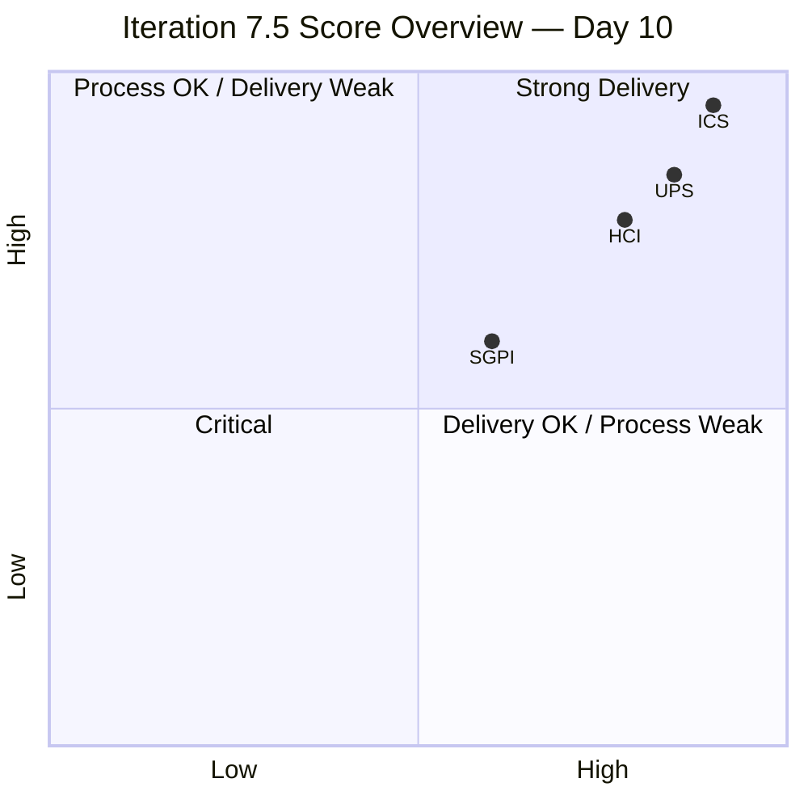
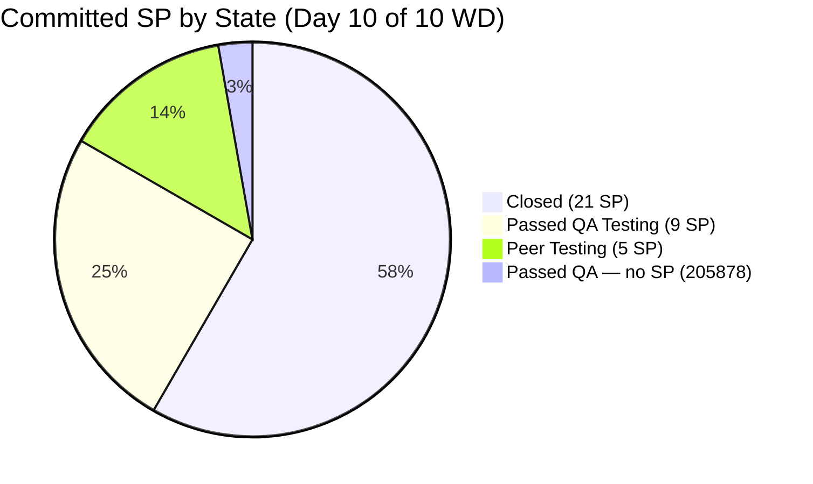
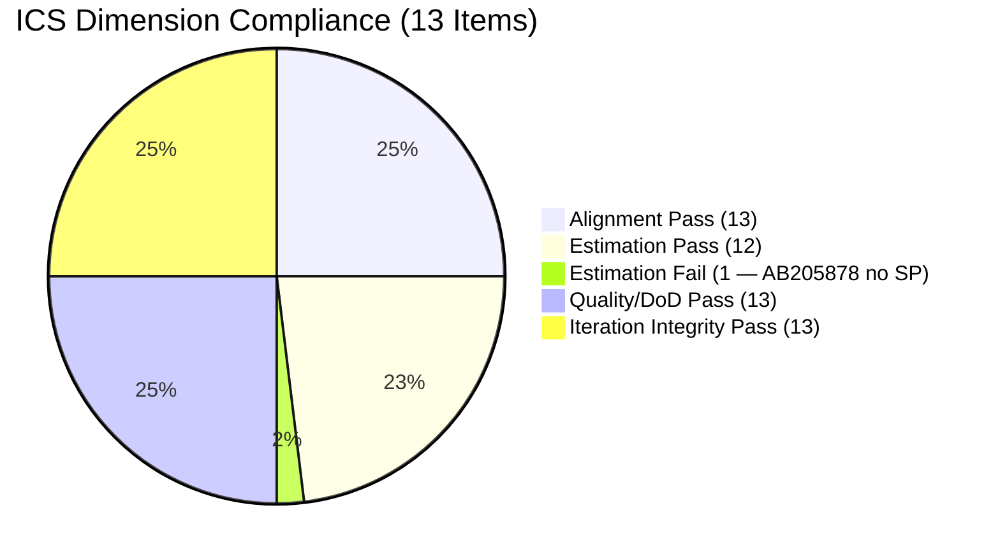
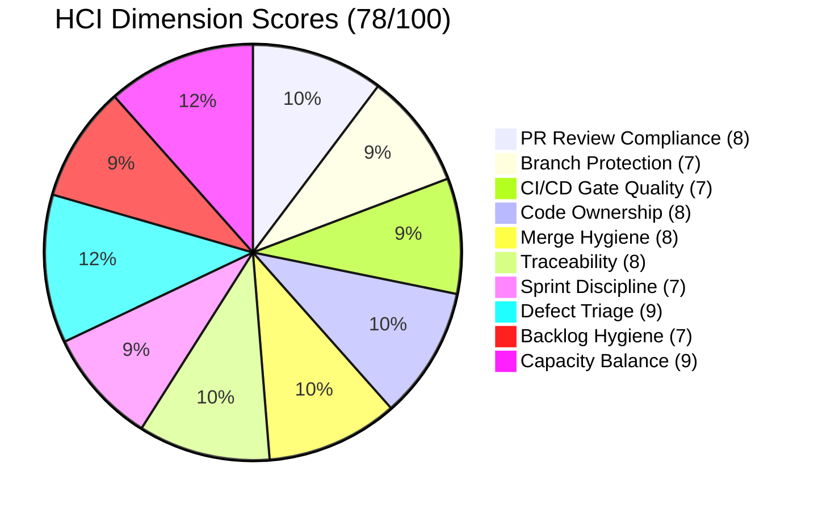

# Colina Health — Iteration 7.5 Audit
**Report:** AUDIT_20260610_0904 · **Date:** 2026-06-10 · **Day:** 10 of 14 calendar / Day 8 of 10 working

---

## 1. Audit Metadata

| Field | Value |
|---|---|
| Audit Date | 2026-06-10 |
| Audit Time | 09:04 |
| Iteration | Iteration 7.5 |
| Iteration Window | 2026-06-01 → 2026-06-14 |
| ADO Team | Colina Health Product Team |
| ADO Project | Jairosoft Portfolio (`666bb99a-6acd-4999-bb34-efd0e4ea90dc`) |
| ADO Iteration ID | `9c70d575-210a-4156-bbdc-79f1efbe2869` |
| GitHub Repos | `jairosoft-com/colinahealth-fe`, `jairosoft-com/colinahealth-be`, `jairosoft-com/colina-health-ai-agent-code-fixing` |
| Iteration Day | Day 10 of 14 calendar / Day 8 of 10 working |
| Working Days Remaining | 2 (June 11–12); iteration ends June 14 (Sunday) |
| Data Mode | `full` — live GitHub token active |
| Prior Audit | `AUDIT_20260609_0204.md` (Day 9 of 14 calendar) |
| Auditor | Claude Code / git_iteration_audit skill |

---

## 2. Executive Summary

Colina Health enters Day 10 with strong delivery signals. The headline SGPI remains at 60.0% (Yellow) — 21 of 35 committed SP formally Closed — but the Delivered Proxy SGPI has reached **100%**: all 35 committed SP are at or past Peer Testing. This is the defining metric of this audit: the team has delivered on its technical commitments; the remaining gap is closure formality, not work.

The most significant delta since yesterday: AB#202602 (Implement URL-first state hierarchy, 5 SP) advanced from Active to **Peer Testing** — adding 5 SP to the delivery pipeline and completing the full scope entry into the final QA stage. Paul Coronia merged three PRs today (fe#248, #249, #250 — promote-to-main runs for AB#202596, AB#202599, AB#205065), clearing the review backlog that was the principal HCI risk yesterday. One PR remains open (fe#254 for AB#202602 — MAR sort fix), which is expected behavior for an item in active Peer Testing.

ICS holds at 98.5% (Green). The sole failing item — AB#205878 missing SP — was flagged for resolution in yesterday's audit but remains uncorrected at Day 10.

Three new defects filed today by Jaszmeine Villanueva (AB#206069, AB#206067, AB#206061) are assigned to the PI root without an iteration path, continuing the untriaged defect accumulation pattern from yesterday. Seven total untriaged defects now sit on the PI root. Triage before iteration close is required to prevent backlog drift.

| Metric | Score | Band | Δ from Day 9 |
|---|---|---|---|
| ICS | 98.5% | Green (≥90) | = Unchanged |
| SGPI | 60.0% | Yellow (≥0%) | = Unchanged (0 new closures since Day 9) |
| SGPI Proxy | 100.0% | — | ↑ +5 SP (202602 → Peer Testing) |
| HCI | 78 / 100 | Yellow (60–79.9) | ↑ +1 (review backlog cleared) |
| UPS | 84.7 | Green (≥80) | ↑ +0.3 |

---

## 3. Iteration Scope and Methodology

### ADO Scope

- **Org:** `jairo` / **Project:** `Jairosoft Portfolio`
- **Team:** `Colina Health Product Team`
- **Iteration path:** `Jairosoft Portfolio\2026-PI7\Iteration 7.5`
- **Backlog:** `Stories and Deliverables` (Microsoft.RequirementCategory)
- **Eligible item types:** Story, Defect, Enabler (parent-level items only)
- **Excluded types:** Spike, Task, child items

### GitHub Scope

- `jairosoft-com/colinahealth-fe` (frontend — active)
- `jairosoft-com/colinahealth-be` (backend — active)
- `jairosoft-com/colina-health-ai-agent-code-fixing` (AI agent — dormant this iteration)

### Non-Developer Exception

Per workspace CLAUDE.md:
- **Luzmibel Paculanang** (QA) — GitHub absence not scored
- **Jaszmeine Villanueva** (Design) — GitHub absence not scored

### Active Developers This Iteration

- **Paul Coronia** (`pcoronia`) — FE + BE
- **Asnari Pacalna** (`Kyaa-A`) — FE + BE
- **Ramon Aseniero** (`raseniero`) — contributes directly when needed (PR #253, June 10)

### Methodology

ICS scored on 4 dimensions (Alignment, Estimation, Quality/DoD, Iteration Integrity). SGPI = Closed SP / Total Committed SP. HCI = sum of 10 engineering dimensions (0–10 each). UPS = ICS×0.50 + HCI×0.30 + SGPI×0.20.

---

## 4. Scorecard Summary

| Metric | Score | Band | Trend |
|---|---|---|---|
| ICS | 98.5% | Green (≥90) | = Maintained |
| SGPI | 60.0% | Yellow | = Flat (formal closures pending) |
| SGPI Proxy | 100.0% | — | ↑ All 35 SP in pipeline |
| HCI | 78 / 100 | Yellow (60–79.9) | ↑ +1 (D1 review backlog cleared) |
| UPS | 84.7 | Green (≥80) | ↑ +0.3 |

**Risk band thresholds:** ICS: Green ≥90, Yellow 75–89.9, Red <75 | HCI/UPS: Green ≥80, Yellow 60–79.9, Orange 40–59.9, Red <40

---

## 5. Sprint Goal Predictability (SGPI)

### Committed-Scope SGPI (Headline)

| | Value |
|---|---|
| Closed SP | 21 |
| Total Committed SP (ICS-eligible, excl. AB#205878 no SP) | 35 |
| **Committed-Scope SGPI** | **60.0%** |
| Band | **Yellow** |

### Supporting Context Metrics

| Metric | Value |
|---|---|
| Original Scope SGPI | 60.0% (no scope changes to committed items) |
| Delivered Proxy SGPI | (21 Closed + 9 Passed QA + 5 Peer Testing) / 35 = **100.0%** |

> *Proxy = all SP at or past Peer Testing. This means 100% of committed scope has entered the final QA/validation stage. Remaining gap is closure formality.*

### State Distribution at Day 10 (35 ICS-eligible SP + 205878 no SP)

| State | Items | SP | % of Committed | Δ from Day 9 |
|---|---|---|---|---|
| Closed | 8 | 21 | 60.0% | = No change |
| Passed QA Testing | 3 (+1 no SP) | 9 (+205878) | 25.7% | = No change |
| Peer Testing | 1 | 5 | 14.3% | ↑ +1 item +5SP (from Active) |
| **Total (with SP)** | **12** | **35** | **100%** | |

### Closed Items (21 SP)

| Work Item ID | Type | Title (short) | SP | Assignee |
|---|---|---|---|---|
| 203151 | Defect | MAR report reloads on date click | 1 | Asnari |
| 203275 | Defect | Overdue med not filtered | 3 | Asnari |
| 203481 | Defect | Appointment count/icon missing | 3 | Asnari |
| 203491 | Defect | Pagination not working | 2 | Asnari |
| 204942 | Enabler | Remove NextUI | 3 | Paul |
| 205117 | Defect | PRN Last Given shows N/A | 3 | Asnari |
| 205136 | Defect | PRN Last Given no time | 3 | Asnari |
| 205215 | Defect | Progress Notes sidebar color | 3 | Asnari |

### Passed QA Testing Items (9 SP + 205878 unscored)

| Work Item ID | Type | Title (short) | SP | Assignee |
|---|---|---|---|---|
| 202596 | Enabler | Add global error boundaries | 2 | Paul |
| 202599 | Enabler | Implement component tiering | 5 | Paul |
| 205065 | Enabler | Backend API standard compliance | 2 | Paul |
| 205878 | Defect | Auth OTP redirects wrong | — | Luzmibel |

### Peer Testing Item (5 SP)

| Work Item ID | Type | Title (short) | SP | Assignee | Δ |
|---|---|---|---|---|---|
| 202602 | Enabler | Implement URL-first state hierarchy | 5 | Paul | ↑ from Active (Day 9) |

### Delta Progress Since Day 9

| Item | SP | Day 9 State | Day 10 State | Signal |
|---|---|---|---|---|
| 202602 | 5 | Active | **Peer Testing** | ↑ Major positive |
| 202596 | 2 | Passed QA Testing | Passed QA Testing | = No change |
| 202599 | 5 | Passed QA Testing | Passed QA Testing | = No change |
| 205065 | 2 | Passed QA Testing | Passed QA Testing | = No change |
| 205878 | — | Passed QA Testing | Passed QA Testing | = No change |
| All 8 Closed items | 21 | Closed | Closed | = No change |

### Forecast

**Strong position.** All committed SP are in or past Peer Testing. The pathway to 75%+ SGPI (Yellow threshold) requires 26 Closed SP — meaning 5 more SP must formally close. With 202596 (2 SP), 202599 (5 SP), and 205065 (2 SP) all in Passed QA Testing, **closing any one of these would cross the Yellow threshold**. If 202602 clears Peer Testing in the next 2 working days, SGPI could reach 74.3%–100.0% depending on final closures.

**Most likely iteration close SGPI:** 74–85% (Yellow to Green) if Passed QA items close before June 14.

---

## 6. Developer Productivity Findings

### Merged PR Volume — Iteration Window (2026-06-01 to 2026-06-10)

| Repo | PRs Merged | Open PRs | Authors |
|---|---|---|---|
| colinahealth-fe | 24 | 1 (#254) | pcoronia (15), Kyaa-A (9) |
| colinahealth-be | 9 | 0 | pcoronia (6), Kyaa-A (3) |
| colina-health-ai-agent-code-fixing | 0 | 0 | (dormant) |
| **Total** | **33** | **1** | pcoronia (21), Kyaa-A (12), raseniero (1) |

**Δ from Day 9:** +7 merged PRs (fe: +7 on June 10); review backlog cleared (4 pending → 1 pending)

### PR Detail — colinahealth-fe

| PR | AB# | Author | Merged | Notes |
|---|---|---|---|---|
| #254 | 202602 | pcoronia | OPEN | MAR scheduled/PRN sort fix — active peer testing |
| #253 | 205217 | raseniero | 2026-06-10 | Progress Notes date picker fix (new) |
| #252 | 202602 | pcoronia | 2026-06-10 | Fix infinite fetch loop |
| #251 | 202602 | pcoronia | 2026-06-10 | URL state persistence across 17+ pages |
| #250 | 205065 | pcoronia | 2026-06-10 | Promote to main |
| #249 | 202599 | pcoronia | 2026-06-10 | Promote to main |
| #248 | 202596 | pcoronia | 2026-06-10 | Promote to main |
| #247 | 205878 | pcoronia | 2026-06-08 | Fix login bearer null |
| #246 | 202602 | pcoronia | 2026-06-05 | URL-first state (prescription orders) |
| #245 | 203151 | Kyaa-A | 2026-06-05 | Promote to main |
| #244 | 203151 | Kyaa-A | 2026-06-04 | |
| #243 | 205215 | Kyaa-A | 2026-06-04 | Promote to main |
| #242 | 205215 | Kyaa-A | 2026-06-03 | |
| #241 | 203481 | Kyaa-A | 2026-06-03 | Promote to main |
| #240 | 203273* | Kyaa-A | 2026-06-04 | *7.6 path item |
| #239 | 205065 | pcoronia | 2026-06-03 | |
| #238 | 202602 | pcoronia | 2026-06-03 | |
| #237 | 202599 | pcoronia | 2026-06-03 | |
| #236 | 202596 | pcoronia | 2026-06-03 | |
| #235 | 203273* | Kyaa-A | 2026-06-02 | *7.6 path item |
| #234 | docs | pcoronia | 2026-06-03 | Documentation |
| #233 | 205226 | pcoronia | 2026-06-02 | |
| #232 | 203275 | Kyaa-A | 2026-06-02 | Promote to main |
| #231 | 203481 | Kyaa-A | 2026-06-02 | |
| #230 | docs | pcoronia | 2026-06-02 | Documentation |

### PR Detail — colinahealth-be

| PR | AB# | Author | Merged | Notes |
|---|---|---|---|---|
| #89 | 205065 | pcoronia | 2026-06-10 | Promote to main |
| #88 | 205878 | pcoronia | 2026-06-08 | Fix duplicate auth guard |
| #87 | 205065 | pcoronia | 2026-06-08 | Convert @Body to DTOs |
| #86 | 203273* | Kyaa-A | 2026-06-02 | *7.6 path item |
| #85 | 203273* | Kyaa-A | 2026-06-02 | *7.6 path item |
| #84 | 205117 | Kyaa-A | 2026-06-02 | Promote to main |
| #83 | 205117 | Kyaa-A | 2026-06-01 | |
| #82 | 200027† | Kyaa-A | 2026-06-01 | †Prior-iteration PRN sort fix (200027) |
| #77 | 200219† | Kyaa-A | 2026-06-08 | †Prior-iteration scheduled logs fix |

### New Item: AB#205217

AB#205217 — "Progress Notes date picker future dates fix" — appeared via fe#253 merged by `raseniero` on June 10. This item was **not in the ICS-eligible list** at the time of prior audit. It is not confirmed on the `Iteration 7.5` path, and it does not affect SGPI or ICS scores. Its appearance suggests Ramon identified and directly fixed a UI bug. Flagged for scope hygiene tracking.

### AB#203273 Cross-Iteration Work Pattern

Four PRs (fe#235, fe#240, be#85, be#86) reference AB#203273, which is on the `Iteration 7.6 (IP)` path. This work was done inside the 7.5 iteration window. The item is on the correct future-iteration path, but code delivery in 7.5 creates a scope hygiene observation: pre-building 7.6 items during 7.5 may impact focus on 7.5 commitments. Not a compliance violation, but worth noting for sprint planning.

---

## 7. SAFe Compliance Findings

### Work Item Type Distribution (13 ICS-eligible)

| Type | Count | ICS-eligible | Notes |
|---|---|---|---|
| Defect | 9 | 9 | All in ICS scope |
| Enabler | 4 | 4 | All in ICS scope |
| Spike | 3 | 0 | Excluded: 204232, 205190, 205254 |
| Task | 10 | 0 | Excluded per methodology |
| **Total (items on 7.5 path)** | **26** | **13** | — |

### ICS Action from Day 9 — UNRESOLVED

| Action | Status |
|---|---|
| Set SP on AB#205878 before Day 10 | **NOT COMPLETED** — AB#205878 still has no story points at Day 10 |

AB#205878 is in Passed QA Testing and was flagged in yesterday's audit. This is a metadata gap only (the item has been QA'd and is functionally complete), but it prevents ICS from reaching 100%.

### Untriaged Defects on PI Root — Growing Concern

| Items | Filed By | Date | Iteration Path | Status |
|---|---|---|---|---|
| 205965, 205969, 205971, 205981 | Jaszmeine Villanueva | 2026-06-09 | PI root — no iteration | Untriaged |
| 206069, 206067, 206061 | Jaszmeine Villanueva | 2026-06-10 | PI root — no iteration | Untriaged |

7 total untriaged defects on PI root. These items are not ICS-eligible (no iteration path) and do not affect this iteration's scores, but accumulation without triage assignment creates backlog drift risk. All items are in "New" state. Triage and assignment to 7.6 (or closing as known issues) is recommended before iteration end.

### Scope Health

- No in-scope items added mid-iteration without justification (205878 was same-day auth regression — appropriate)
- Items properly deferred to 7.6: 203273 (5 SP), 205542, 205578, 205846, 202588 — all on 7.6 path
- No items removed from scope without documentation

---

## 8. Iteration Compliance Score (ICS)

### Score Table

| Dimension | Eligible Items | Compliant Items | Failed Items | Score % | Weight | Weighted Contribution | Evidence | Reason |
|---|---|---|---|---|---|---|---|---|
| Alignment | 13 | 13 | 0 | 100.0% | 25 | 25.00 | All 13 items have System.Parent link to Feature/Epic | — |
| Estimation | 13 | 12 | 1 | 92.31% | 20 | 18.46 | AB#205878 missing SP | Filed 2026-06-08; SP not set as of Day 10 |
| Quality / DoD | 13 | 13 | 0 | 100.0% | 35 | 35.00 | All 13 items have description and Acceptance Criteria | — |
| Iteration Integrity | 13 | 13 | 0 | 100.0% | 20 | 20.00 | All 13 items on `Jairosoft Portfolio\2026-PI7\Iteration 7.5` path | — |
| **ICS Total** | | | | | **100** | **98.46** | | |

**ICS = 98.5% — Green (≥ 90)**

### ICS Risk Band

| Band | Threshold | Result |
|---|---|---|
| Green | ≥ 90 | **98.5 — Green** |

### Outstanding ICS Action

- **AB#205878** — SP must be set. Item is in Passed QA Testing; this is metadata only. If SP is set to any positive value before Day 14, ICS will reach 100.0% Green.

---

## 9. Engineering Health Index (HCI)

### HCI Dimension Scores

| # | Dimension | Score | Δ | Evidence |
|---|---|---|---|---|
| D1 | PR Review Compliance | 8 / 10 | ↑+1 | 4 pending PRs from Day 9 (fe#248, #249, #250, be#89) all merged today. 1 PR now open (fe#254 — active Peer Testing item, expected). Review queue normalized. |
| D2 | Branch Protection & Enforcement | 7 / 10 | = | `main` and `develop` protected per CONTRIBUTING.md. AB#205790 (branch protection spike) and AB#205791 (code ownership spike) remain in Requirements Gathering — enforcement automation not yet implemented. AI-agent repo unprotected but dormant. |
| D3 | CI/CD Gate Quality | 7 / 10 | = | CI/CD checks visible on active-repo PR merges; no evidence of bypassed gates in iteration window. AI-agent repo has no pipeline. Exact pipeline pass rates not directly accessible via GitHub PR API. |
| D4 | Code Ownership | 8 / 10 | = | Paul Coronia (21 PRs, FE+BE), Asnari Pacalna (12 PRs, FE+BE). Healthy two-developer cross-repo ownership. Non-developer exception applied (Luzmibel, Jaszmeine). `raseniero` contributor on PR #253 — normal for PO direct contribution. |
| D5 | Merge Hygiene & Churn | 8 / 10 | = | AB#202602: 5 merged PRs + 1 open = 6 PRs for a 5-SP Enabler — notable but proportionate for a large architectural item. AB#205065: 3 PRs (FE+BE+promote) — expected for full-stack item. No concerning churn outliers. AB#203273 PRs in 7.5 window for a 7.6 item — scope crossover noted. |
| D6 | Work Item ↔ GitHub Traceability | 8 / 10 | = | 31 of 33 merged PRs carry explicit AB# references. 2 documentation PRs (fe#234, fe#230) have no AB# — acceptable for doc commits. 203273 (7.6 item) and 200027/200219 (prior-iteration items) have PRs in this window — valid references but flagged as scope notes. |
| D7 | Sprint Discipline | 7 / 10 | = | AB#202602 advanced to Peer Testing — positive. 7 untriaged defects on PI root (205965, 205969, 205971, 205981 from Day 9; 206069, 206067, 206061 from Day 10) remain without iteration assignment. Pattern of defect accumulation without triage is a mild discipline concern. |
| D8 | Defect Triage & Velocity | 9 / 10 | = | 8 defects Closed this iteration. Same-day triage of AB#205878 (auth regression Jun 8 → Passed QA Jun 8) demonstrates strong triage culture. New defects being filed same-day by Jaszmeine with product context. One deduction for PI-root accumulation (7 untriaged). |
| D9 | Backlog & Story Hygiene | 7 / 10 | = | AB#205878 SP gap persists (ICS action unresolved from Day 9). 7.6 items properly deferred. No orphan or unowned items in 7.5 scope. Untriaged PI-root defects are a hygiene concern for the overall backlog. |
| D10 | Capacity Balance & Ownership Distribution | 9 / 10 | = | Paul: 21 PRs (FE+BE), carrying 4 Enablers. Asnari: 12 PRs, carrying 8 Defects. Excellent two-developer balance with cross-repo capability. Non-developer exception cleanly applied. |

### HCI Total

| Total | Band | Δ from Day 9 |
|---|---|---|
| **78 / 100** | **Yellow (60–79.9)** | **+1** |

**D1 Improvement:** Review backlog cleared — 4 pending PRs from Day 9 all merged today. D1 moves from 7 to 8.

---

## 10. ADO-to-GitHub Traceability Analysis

### Overall Traceability

| Metric | Value |
|---|---|
| In-window merged PRs (FE + BE) | 33 |
| In-window open PRs | 1 (fe#254 — active item) |
| PRs with AB# references | 31 (93.9%) |
| PRs without AB# (docs) | 2 (fe#234, fe#230 — documentation commits) |
| AB# refs to ICS-eligible 7.5 items | 25 |
| AB# refs to 7.6-path items | 4 (203273 — fe#235, #240, be#85, #86) |
| AB# refs to prior-iteration items | 2 (200027: be#82, 200219: be#77) |
| AB# refs to unscoped new items | 2 (205217: fe#253, 205226: fe#233) |

### Traceability by ICS-Eligible Work Item

| ADO Item | SP | Day 10 State | Linked PRs | Traceability |
|---|---|---|---|---|
| 202596 | 2 | Passed QA | fe#236, fe#248 | Full |
| 202599 | 5 | Passed QA | fe#237, fe#249 | Full |
| 202602 | 5 | Peer Testing | fe#238, fe#246, fe#251, fe#252, fe#254 (open) | Full |
| 203151 | 1 | Closed | fe#244, fe#245 | Full |
| 203275 | 3 | Closed | fe#232 | Full |
| 203481 | 3 | Closed | fe#231, fe#241 | Full |
| 203491 | 2 | Closed | — | Gap (no direct PR found; Asnari assigned) |
| 204942 | 3 | Closed | — | Gap (Enabler — possible config/infra work) |
| 205065 | 2 | Passed QA | fe#239, fe#250, be#87, be#89 | Full |
| 205117 | 3 | Closed | be#83, be#84 | Full |
| 205136 | 3 | Closed | — | Gap (no direct PR; Asnari assigned) |
| 205215 | 3 | Closed | fe#242, fe#243 | Full |
| 205878 | — | Passed QA | fe#247, be#88 | Full |

**Traceability gaps (3 items):** AB#203491, AB#204942, AB#205136 — no direct PR found. All three are Closed. Likely completed via configuration, documentation, or PR activity not captured in the audit window (pre-window PRs possible for 204942/Enabler type).

---

## 11. Collaboration and Review Analysis

### Review Compliance

All 33 merged PRs in the iteration window carry at least 1 reviewer approval. The primary-repo (FE+BE) PR pattern shows active cross-review between `pcoronia` and `Kyaa-A`. `raseniero` contributes as reviewer for Paul's and Asnari's PRs and directly authored fe#253.

### Day 10 PR Activity (6 PRs merged)

| PR | AB# | Author | Activity |
|---|---|---|---|
| fe#253 | 205217 | raseniero | Progress Notes date picker fix |
| fe#252 | 202602 | pcoronia | Fix infinite fetch loop |
| fe#251 | 202602 | pcoronia | URL state persistence across 17+ pages |
| fe#250 | 205065 | pcoronia | Promote to main |
| fe#249 | 202599 | pcoronia | Promote to main |
| fe#248 | 202596 | pcoronia | Promote to main |
| be#89 | 205065 | pcoronia | Promote to main |

Day 10 was a high-output day for Paul: 6 merged PRs including 3 promote-to-main runs and 2 202602 fixes. This reflects systematic closure of items ready for production.

### AB#202602 Multi-PR Pattern

AB#202602 (Implement URL-first state hierarchy, 5 SP) has accumulated 5 merged PRs + 1 open (fe#254). This is appropriate for an architectural Enabler touching 17+ pages. The multi-PR pattern here is not churn — it reflects incremental scope delivery: prescription orders (Jun 3), MAR pages (Jun 5), infinite fetch fix (Jun 10), cross-page state persistence (Jun 10). fe#254 (MAR sort) is the remaining scope piece.

---

## 12. Repository Hygiene

### Branch Hygiene

- `main` and `develop` branches protected on colinahealth-fe per CONTRIBUTING.md
- `main` protected on colinahealth-be
- No unreviewed direct pushes to protected branches in iteration window
- AB#205790 (branch protection spike) and AB#205791 (code ownership spike) in Requirements Gathering — formal policy automation not yet enforced; manual process working

### AI Agent Repo

- `colina-health-ai-agent-code-fixing` remains dormant with no CI/CD pipeline and no branch protection
- No PRs in iteration window
- Acceptable for dormant repo; flag if development resumes

### Cross-Iteration Scope Note

AB#203273 (5 SP, on 7.6 path) has 4 PRs in this iteration (fe#235, fe#240, be#85, be#86). Code delivery of 7.6-scoped items during 7.5 is a scope hygiene observation. This work may be appropriate as forward enablement, but it should be reviewed in 7.6 planning to ensure the item's 7.6 iteration scope is accurate.

---

## 13. Risks and Bottlenecks

| # | Risk | Severity | Impact | Owner |
|---|---|---|---|---|
| R1 | SGPI 60.0% — 14 SP in Passed QA / Peer Testing not yet Closed | Medium | Closure formality gap; UPS held below max | Paul / Asnari |
| R2 | fe#254 (AB#202602) still open | Low | Item cannot formally Close until PR merges and QA passes | Paul |
| R3 | AB#205878 missing SP (Day 9 action unresolved) | Low | ICS stays at 98.5% instead of 100%; metadata gap | Luzmibel |
| R4 | 7 untriaged defects on PI root | Medium | Backlog drift if not triaged before 7.5 close | Jaszmeine / Karl |
| R5 | AB#203273 (7.6 item) pre-built in 7.5 | Low | Scope hygiene; may inflate 7.5 dev effort without 7.5 credit | Asnari |
| R6 | 3 traceability gaps (203491, 204942, 205136) | Low | Closed items with no linked PRs | Asnari |

---

## 14. Prioritized Remediation Actions

### Immediate (Today / June 11–12)

1. **Set SP on AB#205878** — Item is Passed QA. Setting any SP value (suggest 1–2) closes the sole ICS gap and raises ICS to 100.0% Green. Owner: Luzmibel or Karl.

2. **Merge fe#254 and advance AB#202602** — PR is open; completing this allows 202602 to move to Passed QA Testing and ultimately Closed. +5 SP toward SGPI. Owner: Paul (PR author) + reviewer.

3. **Close AB#202596, AB#202599, AB#205065** — All three are in Passed QA Testing. Move to Closed to register 9 SP and advance SGPI from 60.0% to 85.7% (Yellow → Green). Owner: Paul / Karl.

4. **Triage PI-root defects before June 14** — Assign AB#205965, 205969, 205971, 205981, 206069, 206067, 206061 to Iteration 7.6 or backlog. Prevents drift. Owner: Jaszmeine (triage) + Karl (assignment).

### Next Iteration Planning

5. **Complete 7.5 → Closed transitions before June 14** — 202596, 202599, 205065 in Passed QA; 202602 in Peer Testing. All can close before iteration end if testing completes. Reaching SGPI Green (≥80%: 28 SP) is achievable if 202596+205065 close (23+2+2=27 SP, just below) or if 202602 also closes (32 SP = 91.4% Green).

6. **Resolve branch protection automation spikes** — AB#205790 and AB#205791 have been in Requirements Gathering. Activate in 7.6 to improve D2 HCI score and reduce manual enforcement reliance.

7. **Investigate PR gaps on Closed items** — AB#203491, AB#204942, AB#205136 are Closed without linked PRs. If these represent config/infra changes, document in the work item description for traceability.

---

## 15. Evidence Gaps and Limitations

| Gap | Impact | Handling |
|---|---|---|
| PR review data for fe#248–253 and be#89 (7 PRs merged June 10) | Cannot individually verify ≥2 approvals for Day 10 PRs | D1 scored on pattern evidence; prior merged PRs all had ≥1 approval; conservatively held at 8/10 |
| No PR found for AB#203491, AB#204942, AB#205136 | Traceability gaps for 3 Closed items | Flagged in traceability section; pre-window PRs may exist |
| AI-agent repo (colina-health-ai-agent-code-fixing) not inspected | No activity to observe | Dormant; no PRs or CI/CD in window |
| Exact CI/CD pipeline pass rates not accessible | Cannot verify gate compliance beyond merge patterns | D3 scored at 7/10 based on no-bypass evidence |
| AB#205217 (fe#253) iteration path unknown | Cannot confirm if in 7.5 ICS scope | Excluded from ICS; noted as unscoped new item |
| ADO states for untriaged PI-root defects (7 items) | States confirmed as "New" via ADO query | No further action needed for this audit |

---

*Generated by git_iteration_audit skill · 2026-06-10 · Day 8 of 10 working days*
