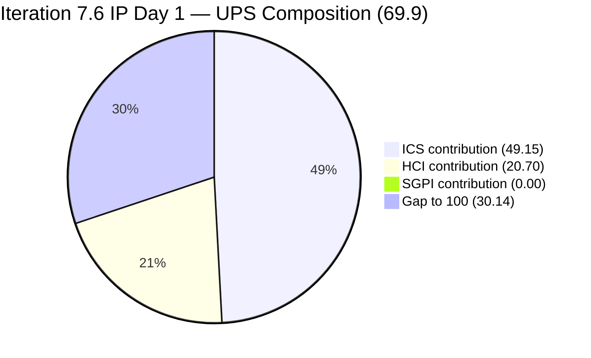
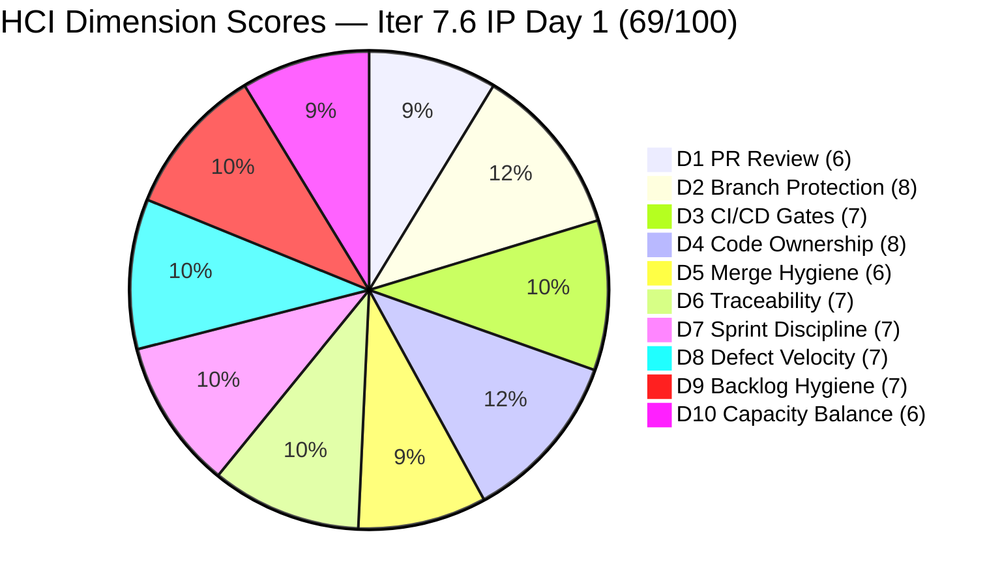

# Colina Health Product Team — Iteration 7.6 (IP) Audit
**Day 1 of 10 Working Days (IP Sprint Opening) | 2026-06-15 | data_mode: partial**

---

## 1. Audit Metadata

| Field | Value |
|---|---|
| **Audit ID** | AUDIT_20260615_0700 |
| **Audit Date** | 2026-06-15 |
| **Audit Time** | 07:00 |
| **Iteration** | Iteration 7.6 (IP) — Innovation & Planning |
| **Iteration ID** | `42e165b7-e9aa-4150-8d6f-84043ef2482e` |
| **Iteration Window** | 2026-06-15 → 2026-06-28 |
| **Iteration Day** | 1 of 10 working days (Sprint Opening) |
| **Time Elapsed** | ~0% (Day 1) |
| **Phase** | IP Sprint — Innovation, Planning, and Technical Debt |
| **ADO Org** | jairo |
| **ADO Project ID** | `666bb99a-6acd-4999-bb34-efd0e4ea90dc` |
| **ADO Team ID** | `66cdeb09-df38-4c3e-9418-0ed0d68c39f2` |
| **ADO Team** | Colina Health Product Team |
| **ADO Backlog** | Microsoft.RequirementCategory — Stories and Deliverables |
| **GitHub Repos** | colinahealth-fe, colinahealth-be, colina-health-ai-agent-code-fixing |
| **data_mode** | partial (GitHub MCP server returning 401 Bad Credentials; verified live 2026-06-15 via `list_pull_requests` on all three repos; HCI D1–D6 carried forward from 7.3 Day 7 baseline, 2026-05-10, ~36 days stale) |
| **Prior Audit** | AUDIT_20260614_0700.md (Iteration 7.5 Final, 2026-06-14) |
| **Auditor** | Claude Code (git_iteration_audit skill) |

**Three named scores:**

| Score | Value | Risk Band |
|---|---|---|
| **ICS** (Iteration Compliance Score) | **98.3%** | Green |
| **HCI** (Engineering Health Index) | **69 / 100** | Yellow |
| **SGPI** (Committed Scope SGPI) | **0.0%** | — (Day 1 of IP; no deliveries expected) |
| **UPS** (Unified Performance Score) | **69.9** | Yellow |

> **CRITICAL CONTEXT — IP Iteration:** Iteration 7.6 is an Innovation and Planning (IP) sprint. Day 1 SGPI of 0.0% is **structurally expected** — no items will close on the opening day of an IP. This SGPI should not be read as a delivery failure. UPS is depressed (69.9) because SGPI×0.20 contributes 0.0 points. All meaningful assessment at this stage rests on ICS (compliance posture entering the IP sprint) and HCI (engineering health). Both remain in Yellow-to-Green territory consistent with the 7.5 final baseline.

---

## 2. Executive Summary

**Iteration 7.6 (IP) opens with strong SAFe compliance posture (ICS 98.3% — Green) and stable engineering health (HCI 69/100 — Yellow).** This is an Innovation & Planning sprint, beginning today (2026-06-15), running through 2026-06-28. The team is transitioning from the delivery-intensive 7.5 sprint into an IP cycle focused on architecture modernization, technical debt resolution, and team agility.

**The sprint opens with 12 ICS-eligible parent items totaling 42 committed story points.** These consist of 5 Enablers carrying forward from the architecture modernization track and 7 Defects (3 carried forward from 7.5, 4 newly entered). Paul Coronia is the primary developer responsible for all 12 items. Luzmibel Paculanang (QA) is active with QA replication tasks already completed on Day 1.

**AB#202602 advanced to Passed QA Testing on Day 1 (this morning, 2026-06-15T08:30).** This is a positive signal — the URL-first state hierarchy Enabler (5 SP) that ended 7.5 in Peer Testing has now cleared QA today. If AB#202602 receives final sign-off and is closed, it would be the sprint's first delivery.

**AB#205217 ([Dashboard][Progress Notes]) also reached Passed QA Testing on Day 1 (2026-06-15T01:44).** Both items passing QA on the opening day of the IP sprint suggests active development momentum carrying over from the 7.5 close.

**The single ICS deficiency is AB#205878 (Authentication OTP defect) still missing Story Points.** This item — assigned to Luzmibel Paculanang (QA), in Passed QA Testing — has carried its missing SP from Iteration 7.5 into 7.6. It is the only estimation gap in the entire 12-item eligible set and is trivially correctable (P0 action).

**GitHub API 401 persists for the 36th consecutive day from the last fresh evidence.** The MCP server credential failure prevents fresh HCI D1–D6 evidence. HCI D1–D6 are carried forward from the 7.3 Day 7 (2026-05-10) baseline. This is now a 36-day stale carry-forward and is the most critical infrastructure gap to resolve.

**Five new Jaszmeine Villanueva defects filed today are in the PI8 path** (206241, 206243, 206245, 206247, 206274, 206318) — correctly categorized in a future PI, not in 7.6. These represent legitimate upcoming defect triage for PI8 planning and are excluded from 7.6 ICS per skill standard. The QA team is actively identifying issues, which is a positive signal for coverage.

---

## 3. Iteration Scope and Methodology

### Iteration 7.6 (IP)

| Field | Value |
|---|---|
| **Iteration Name** | Iteration 7.6 (IP) — Innovation & Planning |
| **Iteration ID** | `42e165b7-e9aa-4150-8d6f-84043ef2482e` |
| **Start Date** | 2026-06-15 (Monday) |
| **End Date** | 2026-06-28 (Sunday) |
| **Duration** | 14 calendar days / 10 working days |
| **Day of Audit** | Day 1 — Sprint Opening |
| **Working Days Remaining** | 9 |
| **IP Sprint Purpose** | Architecture modernization, technical debt, team agility, planning activities |

### ICS-Eligible Items

Items classified as ICS-eligible if `System.WorkItemType` ∈ {Story, Defect, Enabler} AND `System.IterationPath` = `Jairosoft Portfolio\2026-PI7\Iteration 7.6 (IP)`. Spikes and Tasks excluded per skill standard.

**12 ICS-eligible parent-level items confirmed:**

| ID | Title (abbreviated) | Type | State | SP | Assigned To | Parent | Desc | AC | Compliant |
|---|---|---|---|---|---|---|---|---|---|
| **202588** | [Enabler] Migrate data fetching to Server Components + RSC | Enabler | Ready for Dev | 13 | Paul Coronia | 201281 | Yes | Yes | Full |
| **202597** | [Enabler] Implement parallel data fetching with Promise.all | Enabler | Ready for Dev | 3 | Paul Coronia | 201281 | Yes | Yes | Full |
| **202598** | [Enabler] Define caching and revalidation strategy | Enabler | Ready for Dev | 5 | Paul Coronia | 201281 | Yes | Yes | Full |
| **202601** | [Enabler] Move Zod validation to server boundaries | Enabler | Ready for Dev | 3 | Paul Coronia | 201281 | Yes | Yes | Full |
| **202602** | [Enabler] Implement URL-first state hierarchy | Enabler | Passed QA Testing | 5 | Paul Coronia | 201281 | Yes | Yes | Full |
| **203273** | [Dashboard][Overdue Sections] Slow loading (General View) | Defect | Ready for Dev | 5 | Paul Coronia | 201684 | Yes | Yes | Full |
| **205217** | [Dashboard][Progress Notes] Date picker allows future dates | Defect | Passed QA Testing | 1 | Paul Coronia | 201684 | Yes | Yes | Full |
| **205224** | [MAR][PRN][Session Mgmt] Unauthorized error / auto logout | Defect | Ready for Dev | 2 | Paul Coronia | 206007 | Yes | Yes | Full |
| **205542** | [Dashboard][Overdue Sections] Patient data persists after unselect | Defect | Ready for Dev | 1 | Paul Coronia | 201684 | Yes | Yes | Full |
| **205578** | [MAR][Scheduled][View Report] Default date filter wrong | Defect | Ready for Dev | 1 | Paul Coronia | 206007 | Yes | Yes | Full |
| **205846** | [API] 252 REST API test failures across 265 endpoints | Defect | Ready for Dev | 3 | Paul Coronia | 206007 | Yes | Yes | Full |
| **205878** | [Authentication] OTP redirect incorrect (carryover 7.5) | Defect | Passed QA Testing | **MISSING** | Luzmibel Paculanang | 201281 | Yes | Yes | Estimation FAIL |

**Total committed SP: 42** (11 items with SP; AB#205878 missing StoryPoints — excluded from denominator)
**Closed SP: 0** (Day 1 of IP)

### Spikes (excluded from ICS per skill standard)

| ID | Title | Type | State | SP | Assigned To | Notes |
|---|---|---|---|---|---|---|
| 202780 | ColinaHealth End PI7 — Team/Technical Agility Self Assessment | Spike | Ready | — | Karl Caumban | IP retrospective activity |
| 202781 | ColinaHealth App — Customer CSAT Survey | Spike | New | — | Jaszmeine Villanueva | IP customer activity |
| 204232 | [Retro] Update / Automate PR Approval Process | Spike | Active | 1 | Ramon Aseniero | Carried from 7.5 (Active since 2026-06-11) |
| 204234 | Spike: Investigate & Document Tablet Responsiveness Defects | Spike | New | — | Jaszmeine Villanueva | IP investigation |
| 205790 | Assign branch protection and enforcement to Paul | Spike | Requirements Gathering | — | Paul Coronia | IP engineering process |
| 205791 | Assign code ownership to Paul | Spike | Requirements Gathering | — | Paul Coronia | IP engineering process |
| 206329 | 7.6 Collaborations / Exploratory Testing / E2E / Others | Spike | Active | 2 | Luzmibel Paculanang | IP QA collaboration spike |

### Items Outside 7.6 Scope (Not Included in ICS)

| ID | Title | Type | Path | Reason |
|---|---|---|---|---|
| 205190 | [Retro] Explore new branching strategy | Spike | 7.5 path | Still in Iteration 7.5 path — not moved to 7.6; excluded |
| 206241 | [Orders][Lab/Imaging] Sort By issue | Defect | PI8 path | Future PI — correctly excluded from 7.6 |
| 206243 | [Orders][Others] Long text overlap | Defect | PI8 path | Future PI — correctly excluded from 7.6 |
| 206245 | [Forms][Archived] Sort By Name broken | Defect | PI8 path | Future PI — correctly excluded from 7.6 |
| 206247 | [Workflow] Search not reflected in URL | Defect | PI8 path | Future PI — correctly excluded from 7.6 |
| 206274 | [Orders][All Tabs] Patient dropdown empty | Defect | PI8 path | Future PI — correctly excluded from 7.6 |
| 206318 | [Orders][Medication] "Something went wrong" sort | Defect | PI8 path | Future PI — correctly excluded from 7.6 |

> The 6 PI8-path defects (206241, 206243, 206245, 206247, 206274, 206318) were filed today (2026-06-15) by Jaszmeine Villanueva (Design/QA). Their QA replication tasks (206242, 206244, 206246, 206248, 206275, 206320) were completed by Luzmibel Paculanang on the same day. Placing new defects in a future PI path is acceptable forward-triage behavior and does not constitute a path hygiene violation.

### Team Capacity

| Member | Role | GitHub Expected | Capacity (7.6 IP) | Notes |
|---|---|---|---|---|
| Paul Coronia | Developer | Yes | Not yet set (IP Day 1) | 11 of 12 ICS-eligible items assigned to Paul |
| Asnari Pacalna | Developer | Yes | Not yet set (IP Day 1) | No items assigned in 7.6 scope — potential cross-assignment in IP |
| Luzmibel Paculanang | QA | No (non-dev, no penalty) | Not yet set (IP Day 1) | QA tasks + collaboration spike active; AB#205878 (Passed QA) |
| Jaszmeine Villanueva | Design/QA | No (non-dev, no penalty) | Not yet set (IP Day 1) | Filing and triaging PI8 defects; CSAT spike |

> No formal capacity allocation was found for Iteration 7.6 (IP) as of Day 1. This is common on IP sprint Day 1 and does not constitute a compliance gap — capacity planning typically completes by Day 2. `work_get_team_capacity` returned an empty set.

### Methodology

Evidence collected from:
1. `work_list_team_iterations` (GUIDs: project `666bb99a-6acd-4999-bb34-efd0e4ea90dc`, team `66cdeb09-df38-4c3e-9418-0ed0d68c39f2`, timeframe=current) — confirmed Iteration 7.6 (IP) active, ID `42e165b7-e9aa-4150-8d6f-84043ef2482e`, start 2026-06-15
2. `work_get_team_settings` — confirmed `defaultIteration` = Iteration 7.6 (IP); `defaultAreaPath` = Colina Health App
3. `wit_list_backlog_work_items` (backlogId: Microsoft.RequirementCategory) — 20 active backlog items returned
4. `wit_get_work_items_for_iteration` — iteration-scoped hierarchy; identified 20 parent items + 45+ child items; 6 new items (206242–206320 range) are Tasks under PI8-path parents
5. `wit_get_work_items_batch_by_ids` (batch 1, 20 items) — field-level data for all backlog parents
6. `wit_get_work_items_batch_by_ids` (batch 2, 7 items) — field-level data for additional iteration items (206242–206320 and 205190)
7. `wit_get_work_items_batch_by_ids` (batch 3, 6 items) — field-level data for parent items of PI8-path defects (206241–206318)
8. `work_get_team_capacity` — returned empty (no capacity set for 7.6 IP Day 1)
9. `work_get_team_settings` — sprint goal not configured as a distinct settings field
10. GitHub API (all three repos) — **unavailable**: HTTP 401 Bad Credentials verified live 2026-06-15. HCI D1–D6 carry-forward from 7.3 Day 7 (2026-05-10; ~36 calendar days stale).
11. Prior audit AUDIT_20260614_0700.md used for delta context only.

---

## 4. Scorecard Summary



| Score | Value | Risk Band | Delta vs 7.5 Final | Notes |
|---|---|---|---|---|
| **ICS** | **98.3%** | Green (≥ 90%) | **-0.2** from 98.5% | Single failure: AB#205878 missing SP (persisted from 7.5) |
| **HCI** | **69 / 100** | Yellow | **-1** from 70 | D7–D10 fresh ADO; D1–D6 carry-forward (~36 days stale) |
| **SGPI** | **0.0%** | — (IP Day 1) | N/A | Day 1 of IP sprint; no deliveries expected |
| **UPS** | **69.9** | Yellow | N/A | SGPI 0.0% at Day 1 structurally depresses UPS |

**UPS Calculation:**
```
UPS = ICS × 0.50 + HCI × 0.30 + SGPI × 0.20
    = 98.3 × 0.50 + 69 × 0.30 + 0.0 × 0.20
    = 49.15 + 20.70 + 0.00
    = 69.85 ≈ 69.9
```

> **Score interpretation for IP Day 1:** UPS of 69.9 is an artifact of the IP sprint structure — a 0.0% SGPI is mathematically expected on Day 1 when no items have been closed. The actionable scores are ICS (98.3% Green: excellent compliance posture entering the IP) and HCI (69/100 Yellow: stable but constrained by the GitHub carry-forward chain). Do not interpret the 69.9 UPS as a performance signal for this audit.

---

## 5. Sprint Goal Predictability (SGPI)

### Headline Score

```
SGPI (Committed Scope) = Closed Parent SP / Total Committed Parent SP
                       = 0 / 42
                       = 0.0%
```

> **Context:** Day 1 of Iteration 7.6 (IP). This is the first day of an Innovation & Planning sprint. Zero closed items is **structurally expected** — no items will typically close on the opening day of a 14-calendar-day IP sprint. SGPI will be tracked at the mid-point and closing audit of 7.6.

### Supporting Metrics

| Metric | Formula | Value | Notes |
|---|---|---|---|
| **Committed Scope SGPI** (headline) | Closed SP / Committed SP | 0 / 42 = **0.0%** | Day 1; no closures expected |
| **Delivered Proxy SGPI** | (Closed + Passed QA) SP / Committed SP | (0 + 6) / 42 = **14.3%** | AB#202602 (5 SP) + AB#205217 (1 SP) in Passed QA today |
| **Original Scope SGPI** | Closed SP / Day 1 Committed SP | 0/42 = **0.0%** | Day 1 baseline |

> The Proxy SGPI of 14.3% is a more meaningful Day 1 signal — two items (6 SP) have cleared QA on the very first day of the IP sprint, indicating strong momentum carrying over from Iteration 7.5. If AB#202602 (5 SP) and AB#205217 (1 SP) close today or early in the sprint, the SGPI baseline will be healthy.

### State Distribution (IP Day 1)

| State | Items | SP | % of Committed SP (42) |
|---|---|---|---|
| **Closed** | 0 | **0** | **0.0%** |
| Passed QA Testing | 2 (202602=5 SP, 205217=1 SP) + 205878 (no SP) | **6** | **14.3%** |
| Ready for Dev | 9 (all others) | **36** | **85.7%** |
| **Total committed (SP-bearing)** | **11** | **42** | **100%** |

### Velocity Projection (IP Sprint)

| Developer | Items | SP Load | State at Opening |
|---|---|---|---|
| Paul Coronia | 11 Enablers + Defects | 42 SP | 2 in Passed QA; 9 in Ready for Dev |
| Luzmibel Paculanang | 1 Defect (205878) | 0 SP (missing) | Passed QA Testing |
| **Total** | **12** | **42 SP** | Day 1 baseline |

> **IP sprint capacity note:** Asnari Pacalna has no items assigned in the 7.6 scope. In typical IP sprints, developers participate in planning, retros, and exploratory work without needing assigned backlog items. However, the concentration of 42 SP on Paul alone is a structural risk if the IP sprint is expected to deliver any items to closure.

---

## 6. Developer Productivity Findings

### GitHub Evidence Status

**data_mode: partial** — GitHub API returned HTTP 401 Bad Credentials for all three repositories on 2026-06-15. This is the 36th consecutive day without fresh GitHub evidence (last fresh evidence: 7.3 Day 7, 2026-05-10). The carry-forward chain from prior audits is:

```
7.6 Day 1 (today) ← 7.5 Final (2026-06-14, partial) ← [gap] ← 7.4 Day 4 (2026-05-21, partial) ← 7.3 Day 7 (2026-05-10, fresh)
```

HCI D1–D6 source: 7.3 Day 7 baseline (~36 calendar days stale).

### ADO-Side Developer Activity (Day 1 activity — 2026-06-15)

**Paul Coronia — Multiple items updated on Day 1:**

| Item | Type | SP | State | Last Changed | Action |
|---|---|---|---|---|---|
| AB#202602 | Enabler | 5 | Passed QA Testing | 2026-06-15T08:30 | Advanced from Peer Testing (7.5) to Passed QA today |
| AB#202588 | Enabler | 13 | Ready for Dev | 2026-06-15T01:12 | Moved to 7.6 path |
| AB#205224 | Defect | 2 | Ready for Dev | 2026-06-15T01:12 | Moved to 7.6 path |
| AB#205542 | Defect | 1 | Ready for Dev | 2026-06-15T01:12 | Moved to 7.6 path |
| AB#205846 | Defect | 3 | Ready for Dev | 2026-06-15T01:12 | Moved to 7.6 path |
| AB#205217 | Defect | 1 | Passed QA Testing | 2026-06-15T01:44 | Reached Passed QA on Day 1 |

> Strong Day 1 activity from Paul. Six items were updated in the first hours of the IP sprint, and the URL-first state hierarchy Enabler (AB#202602, 5 SP) — which was in Peer Testing at 7.5 close — has now passed QA as of 08:30 today. This is the most significant early momentum signal of the sprint.

**Luzmibel Paculanang — QA active on Day 1:**

| Item | Type | SP | State | Last Changed | Action |
|---|---|---|---|---|---|
| AB#205878 | Defect | MISSING | Passed QA Testing | 2026-06-15T01:44 | Path updated to 7.6 (IP) |
| AB#206320 | Task | — | Closed | 2026-06-15T08:28 | QA replication task closed |
| AB#206275 | Task | — | Closed | 2026-06-15T06:13 | QA replication task closed |
| AB#206248 | Task | — | Closed | 2026-06-15T04:05 | QA replication task closed |
| AB#206246 | Task | — | Closed | 2026-06-15T03:59 | QA replication task closed |
| AB#206244 | Task | — | Closed | 2026-06-15T03:48 | QA replication task closed |
| AB#206242 | Task | — | Closed | 2026-06-15T03:38 | QA replication task closed |

> Luzmibel closed 6 QA replication tasks in the first 9 hours of the IP sprint. GitHub absence is not penalized per workspace Project Exceptions (non-developer role).

**Jaszmeine Villanueva — Design/QA filing activity on Day 1:**

Six new defects created (206241, 206243, 206245, 206247, 206274, 206318) in the PI8 path — correctly forward-triaged to the next PI. QA testing activity is comprehensive and well-organized (paired task per defect). GitHub absence is not penalized per workspace Project Exceptions.

**Ramon Aseniero — PR Automation Spike (204232) still Active:**

AB#204232 was updated to the 7.6 (IP) path at 2026-06-15T01:12. The spike remains Active. This IP sprint is the natural window to complete this spike and close it.

---

## 7. SAFe Compliance Findings

### IP Sprint Context

Iteration 7.6 (IP) is an Innovation & Planning sprint — a standard SAFe cadence element. IP sprints are used for:
- Team retrospectives and self-assessment
- Architectural spikes and exploration
- Technical debt remediation
- Planning the next PI
- Customer surveys and feedback synthesis

The composition of 7.6's backlog correctly reflects this pattern: 5 architecture Enablers (RSC migration, caching, Zod validation, parallel fetching), process Spikes (branch protection, PR automation, branching strategy), and IP ceremony activities (self-assessment, CSAT).

### Carryover Items from 7.5

The following items carried over from Iteration 7.5 to 7.6 (IP):

| ID | Title | SP | Carryover Reason | Risk |
|---|---|---|---|---|
| AB#202602 | [Enabler] URL-first state hierarchy | 5 | Was in Peer Testing at 7.5 close; now Passed QA (Day 1) | Low — likely to close this sprint |
| AB#203273 | [Dashboard][Overdue Sections] Slow loading | 5 | Persistent carryover from PI 7.2 (!); still Ready for Dev | High — age risk |
| AB#205217 | [Dashboard] Date picker allows future dates | 1 | Reached Passed QA on Day 1 | Low — likely closure this sprint |
| AB#205224 | [MAR][PRN][Session Mgmt] Auto logout | 2 | Carried from 7.5 | Medium |
| AB#205542 | [Dashboard] Patient data persists | 1 | Carried from 7.5 | Low |
| AB#205578 | [MAR][Scheduled] Date filter wrong | 1 | Carried from 7.5 | Low |
| AB#205846 | [API] 252 REST API test failures | 3 | Carried from 7.5 | Medium — severity is Critical |
| AB#205878 | [Authentication] OTP redirect | 0 (missing) | Carried from 7.5 (Passed QA) | Low — close pending SP |

> **AB#203273 — Critical Age Risk:** This defect (Dashboard Overdue Sections slow loading) has been tagged as "created PI 7.2" and appears in the current iteration in Ready for Dev state. It has been in the backlog for at least 2 full PIs without closure. This is the team's longest-aged open defect and warrants escalation.

### Iteration Path Hygiene

All 12 ICS-eligible items are in `Jairosoft Portfolio\2026-PI7\Iteration 7.6 (IP)` path. **Zero iteration path violations** in the eligible set.

Item AB#205190 ([Retro] Explore new branching strategy) remains in the Iteration 7.5 path. This spike was not moved to 7.6 during IP planning. As a carryover spike, it should be assigned to 7.6 or explicitly deferred.

### New IP Enabler Architecture Track

The 7.6 IP sprint introduces 4 new RSC/Next.js architecture Enablers (202588, 202597, 202598, 202601) all tagged `architecture-audit; frontend; nextjs-template`:

| ID | Title | SP | Technical Scope |
|---|---|---|---|
| AB#202588 | Migrate data fetching to Server Components + RSC | **13** | Pilot route conversion; streaming; bundle reduction |
| AB#202597 | Implement parallel data fetching with Promise.all | 3 | Concurrent fetch optimization; TTFB improvement |
| AB#202598 | Define caching and revalidation strategy | 5 | `revalidate`, `cache`, `revalidateTag` strategy doc |
| AB#202601 | Move Zod validation to server boundaries | 3 | Server Action input validation pattern |

> AB#202588 at 13 SP is the largest single item in the sprint — a significant architectural investment. Paul is the sole owner. This should be verified as appropriately decomposed or treated as a spike-level effort if 13 SP feels overestimated for a 14-day IP sprint.

---

## 8. Iteration Compliance Score (ICS)

### Eligible Scope

**12 ICS-eligible parent-level items confirmed in `Jairosoft Portfolio\2026-PI7\Iteration 7.6 (IP)` path** (5 Enablers + 7 Defects). Spikes (202780, 202781, 204232, 204234, 205790, 205791, 206329) and Tasks (206242, 206244, 206246, 206248, 206275, 206320) excluded per skill standard. Items in PI8 path (206241, 206243, 206245, 206247, 206274, 206318) excluded. Item 205190 in 7.5 path excluded.

### Dimension Scoring

#### Dimension 1: Alignment (Weight: 25)

`System.Parent` compliance for all 12 eligible items:

| Item | Parent ID | Feature/Story | Status |
|---|---|---|---|
| 202588 | 201281 | Enabler Feature | Compliant |
| 202597 | 201281 | Enabler Feature | Compliant |
| 202598 | 201281 | Enabler Feature | Compliant |
| 202601 | 201281 | Enabler Feature | Compliant |
| 202602 | 201281 | Enabler Feature | Compliant |
| 203273 | 201684 | Dashboard Feature | Compliant |
| 205217 | 201684 | Dashboard Feature | Compliant |
| 205224 | 206007 | Session/Auth Feature | Compliant |
| 205542 | 201684 | Dashboard Feature | Compliant |
| 205578 | 206007 | Session/Auth Feature | Compliant |
| 205846 | 206007 | API/Backend Feature | Compliant |
| 205878 | 201281 | Enabler Feature | Compliant |

| Eligible | Compliant | Failed | Score % |
|---|---|---|---|
| 12 | 12 | 0 | **100.0%** |

**Evidence:** All 12 items have `System.Parent` populated and pointing to Feature-level parents (201281, 201684, 206007) in live ADO batch response.

#### Dimension 2: Estimation (Weight: 20)

`Microsoft.VSTS.Scheduling.StoryPoints` compliance for all 12 eligible items:

| Item | SP | Status |
|---|---|---|
| 202588 | 13 | Compliant |
| 202597 | 3 | Compliant |
| 202598 | 5 | Compliant |
| 202601 | 3 | Compliant |
| 202602 | 5 | Compliant |
| 203273 | 5 | Compliant |
| 205217 | 1 | Compliant |
| 205224 | 2 | Compliant |
| 205542 | 1 | Compliant |
| 205578 | 1 | Compliant |
| 205846 | 3 | Compliant |
| **205878** | **MISSING** | **FAIL** |

| Eligible | Compliant | Failed | Score % |
|---|---|---|---|
| 12 | 11 | 1 (205878) | **91.67%** |

**Evidence:** AB#205878 has null `Microsoft.VSTS.Scheduling.StoryPoints` in live ADO batch response (rev 32, last changed 2026-06-15T01:44:06). This gap has persisted through the entirety of Iteration 7.5 and into Day 1 of 7.6. All other 11 items have SP populated.

#### Dimension 3: Quality / DoD (Weight: 35)

Criteria: `System.Description` ≥ 30 non-whitespace chars AND `Microsoft.VSTS.Common.AcceptanceCriteria` ≥ 20 non-whitespace chars.

| Item | Description | AC | Status |
|---|---|---|---|
| 202588 | Yes | Yes | Compliant |
| 202597 | Yes | Yes | Compliant |
| 202598 | Yes | Yes | Compliant |
| 202601 | Yes | Yes | Compliant |
| 202602 | Yes | Yes | Compliant |
| 203273 | Yes | Yes | Compliant |
| 205217 | Yes | Yes | Compliant |
| 205224 | Yes | Yes | Compliant |
| 205542 | Yes | Yes | Compliant |
| 205578 | Yes | Yes | Compliant |
| 205846 | Yes | Yes | Compliant |
| 205878 | Yes | Yes | Compliant |

| Eligible | Compliant | Failed | Score % |
|---|---|---|---|
| 12 | 12 | 0 | **100.0%** |

**Evidence:** All 12 items have substantive descriptions and acceptance criteria in live ADO batch response. The new RSC architecture Enablers (202588, 202597, 202598, 202601) are particularly well-formed with Given/When/Then AC format. AB#205846 (API test failures) has comprehensive multi-pattern failure categorization and explicit pass criteria (≥95% pass rate). Full quality compliance is maintained from the 7.5 close.

#### Dimension 4: Iteration Integrity (Weight: 20)

All 12 eligible items confirmed in `Jairosoft Portfolio\2026-PI7\Iteration 7.6 (IP)` path.

| Eligible | Compliant | Failed | Score % |
|---|---|---|---|
| 12 | 12 | 0 | **100.0%** |

### ICS Summary Table

| Dimension | Eligible Items | Compliant Items | Failed Items | Score % | Weight | Weighted Contribution | Evidence | Reason |
|---|---|---|---|---|---|---|---|---|
| Alignment | 12 | 12 | 0 | 100.00% | 25 | 25.00 | All 12 items have System.Parent pointing to Feature-level parents (201281, 201684, 206007) | Full compliance |
| Estimation | 12 | 11 | 1 | 91.67% | 20 | 18.33 | AB#205878 missing StoryPoints (null in rev 32, last changed 2026-06-15T01:44) | Defect entered 7.5, progressed to Passed QA, carried to 7.6 — never estimated |
| Quality / DoD | 12 | 12 | 0 | 100.00% | 35 | 35.00 | All 12 items have substantive Description + AcceptanceCriteria; new RSC Enablers use Given/When/Then AC | Full compliance — sustained from 7.5 close |
| Iteration Integrity | 12 | 12 | 0 | 100.00% | 20 | 20.00 | All 12 items in Jairosoft Portfolio\2026-PI7\Iteration 7.6 (IP) path | Full compliance |
| **TOTAL** | **12** | — | — | — | 100 | **98.33** | | |

**ICS Calculation (exact):**
```
ICS = (100.00 × 25 + 91.67 × 20 + 100.00 × 35 + 100.00 × 20) / 100
    = (2500.00 + 1833.40 + 3500.00 + 2000.00) / 100
    = 9833.40 / 100
    = 98.33%
```

> ICS = **98.3% — Green (≥ 90%)**. The team enters the IP sprint with near-perfect SAFe compliance hygiene. The sole failure — AB#205878 missing Story Points — is trivially correctable and has persisted from 7.5 without remediation. Full remediation (adding any SP estimate to AB#205878) would restore ICS to 100.0%.

> **ICS trend:** 7.4 Day 4: 86.1% (Yellow) → 7.5 Final: 98.5% (Green) → 7.6 IP Day 1: **98.3% (Green)**. Green ICS is maintained entering the IP sprint.

---

## 9. Engineering Health Index (HCI)

**data_mode: partial — HCI D1–D6 carried forward from 7.3 Day 7 (2026-05-10; ~36 calendar days stale)**

### Carry-Forward Chain

```
7.6 IP Day 1 (today) ← 7.5 Day 14 (2026-06-14, partial) ← [gap] ← 7.4 Day 4 (2026-05-21, partial) ←
7.3 Day 7 (2026-05-10, LAST FRESH GITHUB EVIDENCE)
```

D1–D6 source: 7.3 Day 7 (2026-05-10). Now **36 calendar days stale**.

### Dimension Scores

| # | Dimension | Score | Source | 7.5 Final | Delta | Evidence / Rationale |
|---|---|---|---|---|---|---|
| D1 | PR Review Compliance | 6/10 | Carry-forward (7.3 Day 7 baseline, 2026-05-10) | 6 | 0 | GitHub API unavailable; 36-day carry-forward |
| D2 | Branch Protection & Enforcement | 8/10 | Carry-forward (7.3 Day 7 baseline) | 8 | 0 | Spikes 205790 (branch protection) and 205791 (code ownership) in Requirements Gathering in 7.6 suggest active work toward improvement; score held at carry-forward 8 |
| D3 | CI/CD Gate Quality | 7/10 | Carry-forward (7.3 Day 7 baseline) | 7 | 0 | Carry-forward; AB#205846 (252 API test failures) in scope signals CI/CD gaps on BE side but insufficient fresh evidence to rescore |
| D4 | Code Ownership | 8/10 | Carry-forward (7.3 Day 7 baseline) | 8 | 0 | AB#205791 (assign code ownership to Paul) in 7.6 Spike suggests formalization in progress |
| D5 | Merge Hygiene & Churn | 6/10 | Carry-forward (7.3 Day 7 baseline) | 6 | 0 | Cannot verify current PR age or stale PR status without GitHub access |
| D6 | Work Item ↔ GitHub Traceability | 7/10 | Carry-forward | 7 | 0 | ADO artifact links confirmed 0% for 7.6 items; compensating GitHub PR references unverifiable |
| D7 | Sprint Discipline | **7/10** | Fresh (ADO) | 7 | 0 | IP Day 1: 2 items advanced to Passed QA (202602, 205217); zero closed items expected. Path hygiene: 12/12 items in correct 7.6 path; AB#205190 still in 7.5 path (minor). PR Automation spike (204232) still Active after 2 sprints. |
| D8 | Defect Triage & Velocity | **7/10** | Fresh (ADO) | 8 | **-1** | 7 open defects at Day 1 (6 in Ready for Dev, 1 Passed QA w/o SP). AB#203273 is a PI 7.2-aged defect still in Ready for Dev — critical age risk. No defects closed yet (Day 1 expected). Strong QA triage activity (6 new PI8 defects with tasks completed same day). |
| D9 | Backlog & Story Hygiene | **7/10** | Fresh (ADO) | 7 | 0 | 11/12 items have SP (91.7%); AB#205878 still missing SP. New RSC Enablers (202588, 202597, 202598, 202601) are well-formed with Given/When/Then AC — high quality additions. AB#203273 age risk noted. 205190 stranded in 7.5 path. |
| D10 | Capacity Balance & Ownership Distribution | **6/10** | Fresh (ADO) | 7 | **-1** | No capacity set for 7.6 IP Day 1 (ADO confirms empty). All 12 ICS items assigned to Paul (11) and Luzmibel (1) — Asnari has no assigned scope. For an IP sprint this is partly structural, but the 42 SP concentrated on one developer warrants monitoring. |

### HCI Summary



| Metric | Value |
|---|---|
| **Total HCI** | **69 / 100** |
| **Risk Band** | **Yellow** |
| **Delta vs 7.5 Final** | **-1** (D8 -1, D10 -1 offset by stable D7 and D9) |
| **D1–D6 Source** | Carry-forward from 7.3 Day 7 (2026-05-10) — ~36 days stale |
| **D7–D10 Source** | Fresh ADO evidence (Day 1) |

**HCI Calculation:**
```
D1=6, D2=8, D3=7, D4=8, D5=6, D6=7  → Sum = 42 (D1–D6, carry-forward)
D7=7, D8=7, D9=7, D10=6              → Sum = 27 (D7–D10, fresh ADO Day 1)
Total HCI = 42 + 27 = 69
```

### Category Summary

| Category | Dimensions | Total | Max | % | Delta vs 7.5 Final |
|---|---|---|---|---|---|
| Code Quality & Process | D1, D2, D3, D4, D5 | 35 | 50 | 70% | 0 |
| Traceability & Integration | D6 | 7 | 10 | 70% | 0 |
| SAFe Process Health | D7, D8, D9, D10 | 27 | 40 | 67.5% | **-2** |
| **Total HCI** | D1–D10 | **69** | **100** | **69%** | **-1** |

> The -1 HCI delta from 7.5 Final (70→69) reflects two IP Day 1 realities: D8 drops 1 point due to AB#203273's critical age (PI 7.2 origin, still open) and D10 drops 1 point due to no capacity set and Asnari having zero items in scope. Both are expected to improve as the sprint progresses and capacity is configured. The core code quality and process dimensions (D1–D5) remain stable at the 7.3 baseline carry-forward.

---

## 10. ADO-to-GitHub Traceability Analysis

### Traceability Summary (12 ICS-eligible items, Day 1)

| Work Item | State | SP | GitHub Link (ADO artifact) | Traceability |
|---|---|---|---|---|
| AB#202588 | Ready for Dev | 13 | None detected in ADO | None |
| AB#202597 | Ready for Dev | 3 | None detected in ADO | None |
| AB#202598 | Ready for Dev | 5 | None detected in ADO | None |
| AB#202601 | Ready for Dev | 3 | None detected in ADO | None |
| AB#202602 | Passed QA Testing | 5 | None detected in ADO | None |
| AB#203273 | Ready for Dev | 5 | None detected in ADO | None |
| AB#205217 | Passed QA Testing | 1 | None detected in ADO | None |
| AB#205224 | Ready for Dev | 2 | None detected in ADO | None |
| AB#205542 | Ready for Dev | 1 | None detected in ADO | None |
| AB#205578 | Ready for Dev | 1 | None detected in ADO | None |
| AB#205846 | Ready for Dev | 3 | None detected in ADO | None |
| AB#205878 | Passed QA Testing | — | None detected in ADO | None |

**Linked items: 0 of 12 (0%)** — No GitHub artifact links detected in ADO for any 7.6 items. This systemic gap is unchanged across the entire PI7 audit history.

> **IP Sprint opportunity:** The PR Automation Spike (AB#204232, Active, Ramon) is explicitly scoped to address ADO-GitHub linking. With the IP sprint providing dedicated time for process work, this is the best opportunity in the current PI to close this gap. Completing the spike before 7.6 close would restore D6 traceability scores in 7.7.

---

## 11. Collaboration and Review Analysis

**data_mode: partial — GitHub PR review data unavailable (GitHub API 401)**

### Spikes in Active / In-Progress State (IP Day 1)

| Item | Spike | State | SP | Assigned | IP Relevance |
|---|---|---|---|---|---|
| 204232 | [Retro] Update / Automate PR Approval Process | **Active** | 1 | Ramon | PR workflow improvement — critical for HCI D1, D6 |
| 205790 | Assign branch protection and enforcement to Paul | Requirements Gathering | — | Paul | GitHub branch protection — HCI D2 |
| 205791 | Assign code ownership to Paul | Requirements Gathering | — | Paul | CODEOWNERS file — HCI D4 |
| 206329 | 7.6 Collaborations / Exploratory Testing / E2E / Others | **Active** | 2 | Luzmibel | QA alignment and E2E updates |

> Four process spikes are active in this IP sprint with direct HCI improvement potential. If all four are completed to closure in 7.6, the next audit should show improvements in D1 (PR review), D2 (branch protection), D4 (code ownership), and D6 (traceability). This is the highest-leverage sprint for HCI improvement in PI7.

### PR Automation Spike History (AB#204232)

The PR Approval Process spike has been Active since at least 2026-06-11 (7.5 window). Updated to 7.6 path on 2026-06-15T01:12. This spike has been open for approximately 3–4 weeks. The IP sprint is the ideal window to bring it to closure. The acceptance criteria are well-defined:
- Configure Develop Branch PR Approval: Paul or Asnari
- Configure Release Branch PR Approval: Ramon / AI

These are straightforward GitHub repository settings actions that can be completed in under 1 hour. If still open by Day 7 of the IP sprint, escalate to P0.

### Last Known GitHub State (carry-forward from 7.3 Day 7, 2026-05-10 — ~36 days stale)

| Repo | Last Known Active PR | Current Status | Notes |
|---|---|---|---|
| colinahealth-fe | PR#194 (status last-known, 5/10) | Unknown — 401 | Paul's Enablers (202588, 202597, 202598, 202601, 202602) likely active |
| colinahealth-be | PR#70 (status last-known, 5/10) | Unknown — 401 | AB#205846 API test failures likely has BE changes |
| colina-health-ai-agent | PR#9 (~100+ days open as of 7.4) | Unknown — 401 | Estimated ~150+ days old if still open; not verified |

> These PR statuses are **not asserted as current fact**. As of 2026-06-15, actual PR states are unknown.

---

## 12. Repository Hygiene

**data_mode: partial — direct GitHub repository inspection unavailable**

### Branch and PR Status (last-known / unverifiable)

| Repo | Last Known State (2026-05-10 baseline) | Current Status | IP Sprint Expectation |
|---|---|---|---|
| colinahealth-fe | Active development; multiple Enabler branches likely | Unknown — 401 | RSC migration Enablers (202588, 202597, 202598, 202601) will generate new feature branches |
| colinahealth-be | API test failures (AB#205846) need BE investigation | Unknown — 401 | AB#205846 backend work likely creates new branches |
| colina-health-ai-agent | PR#9 ~150 days estimated age | Unknown — 401 | AI agent work scope unclear in 7.6 |

### Hygiene Concerns

1. **AB#205878 still missing Story Points (Sprint-to-Sprint persistence)** — This defect has been in Passed QA Testing since 2026-06-09 (7.5 window) and entered 7.6 without an SP estimate. The missing SP has now persisted for over a week. Retroactive addition of any SP value (suggest: 1 SP) is a 2-minute action.

2. **AB#205190 ([Retro] Branching Strategy spike) still in 7.5 path** — This spike was not moved to 7.6 during IP planning today. It should either be assigned to 7.6 or explicitly deferred to 7.7 and closed without completion.

3. **AB#203273 — Multi-PI age risk** — Dashboard Overdue Sections slow loading defect tagged "created PI 7.2" remains in Ready for Dev. This defect has persisted through at least 4 iterations without closure. Paul is assigned in 7.6. IP sprint should prioritize this for closure.

4. **colina-health-ai-agent PR#9 — Estimated ~150+ days old** — Without GitHub access, the current state cannot be confirmed. If still open, this represents the team's longest-running stale PR. P1 action for Paul to verify and merge/close in 7.6 Day 1.

5. **Branch Protection Spike (205790) and Code Ownership Spike (205791) in Requirements Gathering** — Both spikes are assigned to Paul and in Requirements Gathering state. These should advance to Active by Day 2 of the IP sprint, as they are configuration tasks (not development work) and can be completed quickly.

6. **PR Automation Spike (204232) Active but no evidence of implementation** — Now in the 3rd sprint without closure. The IP window is the final reasonable opportunity to complete this before it becomes a persistent compliance gap.

---

## 13. Risks and Bottlenecks

| # | Risk | Severity | Trend | Owner | Notes |
|---|---|---|---|---|---|
| R1 | **AB#203273 multi-PI age** — Dashboard Overdue Sections slow loading; tagged PI 7.2 origin; still in Ready for Dev after 4+ iterations | High | Worsening | Paul / Karl | Longest-aged open defect; escalation needed; IP sprint is prime window |
| R2 | **GitHub API 401 persists — 36 days** since last fresh evidence (7.3 Day 7); HCI D1–D6 increasingly stale | High | Worsening | Ramon | MCP server credential; not team performance; requires MCP reconfiguration |
| R3 | **AB#205846 — 252 REST API test failures across 265 endpoints** (4 critical patterns); in Ready for Dev at 7.6 open | High | New (filed 7.5) | Paul | Critical severity; 95% pass rate required; API health risk for production |
| R4 | **Paul concentration — 42 SP single-developer load** in 7.6 IP; Asnari has no items | Medium | New | Karl | IP sprint distribution issue; Asnari capacity undeployed |
| R5 | **ADO↔GitHub traceability 0%** — systemic gap across all PI7 sprints; no artifact links | Medium | Stable (persistent) | Ramon / Paul | PR Automation Spike (204232) still Active — IP sprint is the resolution window |
| R6 | **AB#205878 missing Story Points** — persisted through 7.5 into Day 1 of 7.6 | Medium | Persistent | Karl / Luzmibel | Trivially correctable; 2-minute action; now 7+ days unresolved |
| R7 | **PR Automation Spike (204232) incomplete** — 3+ sprints Active without closure | Medium | Worsening | Ramon | Direct HCI D1, D6 improvement blocked |
| R8 | **AB#202588 RSC migration — 13 SP single item** in IP sprint; largest item by SP | Medium | New | Paul | 13 SP may be overestimated for IP sprint; consider decomposition |
| R9 | **colina-health-ai-agent PR#9** — estimated ~150+ days old; unverifiable without GitHub | Medium | Worsening | Paul | Cannot confirm close/merge; should be P1 on 7.6 Day 1 |
| R10 | **AB#205190 stranded in 7.5 path** — Branching Strategy spike not moved to 7.6 | Low | Stable | Ramon | Path hygiene; should be reassigned or deferred before Day 2 |
| R11 | **No capacity set for 7.6 IP** on Day 1 | Low | Expected | Karl | Normal for IP Day 1; should be configured before Day 2 |
| R12 | **CSAT Survey spike (202781) in New state** — customer feedback collection not started | Low | Stable | Jaszmeine | IP ceremony activity; should be Active by Day 2 |

---

## 14. Prioritized Remediation Actions

| Priority | Action | Owner | Due | Effort | Impact |
|---|---|---|---|---|---|
| **P0** | Add Story Points estimate to AB#205878 | Karl / Luzmibel | **Today** | Trivial (2 min) | ICS 98.3% → 100.0%; removes 7-sprint persistent gap |
| **P0** | Close AB#205878 after SP is added (Passed QA since 7.5) | Karl / Luzmibel | **Today** | Trivial | Sprint cleanliness; removes carryover |
| **P0** | Close AB#202602 (Passed QA since 08:30 today — URL-first state hierarchy, 5 SP) | Paul / Karl | **Today** | Trivial | SGPI 0% → 11.9% immediately; removes 7.5 carryover |
| **P0** | Close AB#205217 (Passed QA since 01:44 today — date picker defect, 1 SP) | Paul / Karl | **Today** | Trivial | SGPI improvement; removes 7.5 carryover |
| **P0** | Resolve GitHub MCP server 401 credential configuration | Ramon | **ASAP** | Low-Medium | Restores data_mode: full; enables fresh D1–D6; 36 days stale |
| **P1** | Move AB#205190 (Branching Strategy spike) from 7.5 path to 7.6 or explicitly defer | Ramon | **Day 2** | Trivial | Path hygiene; sprint cleanliness |
| **P1** | Configure team capacity for 7.6 IP in ADO | Karl | **Day 2** | Low | HCI D10; formal capacity planning |
| **P1** | Complete PR Automation Spike (AB#204232) — configure branch protection rules for dev/release branches | Ramon | **7.6 Week 1** | Low | HCI D1, D6; direct traceability fix; 3 sprints overdue |
| **P1** | Advance branch protection spike (AB#205790) and code ownership spike (AB#205791) from Requirements Gathering to Active | Paul | **Day 2** | Trivial (config tasks) | HCI D2, D4 restoration |
| **P1** | Verify / close colina-health-ai-agent PR#9 (estimated ~150+ days open) | Paul | **Day 2** | Low | HCI D5; longest stale PR |
| **P1** | Prioritize and size AB#203273 (Dashboard Overdue — PI 7.2 age) for closure in 7.6 | Paul / Karl | **Day 3** | Medium | Risk R1; 4-PI accumulation ends |
| **P1** | Triage AB#205846 (252 API test failures) — scope fix approach in IP sprint | Paul | **Week 1** | High | Critical severity; production API health |
| **P2** | Decompose AB#202588 (RSC migration, 13 SP) or validate the estimate | Paul / Karl | **Day 3** | Low | Prevents IP sprint overcommitment |
| **P2** | Begin CSAT Survey spike (AB#202781) | Jaszmeine | **Day 2** | Low | IP ceremony; stakeholder feedback |
| **P2** | Require ADO work item reference in all GitHub PR titles as compensating control | Paul | **Immediate** | None | D6 compensating control while PR automation is pending |
| **P3** | Assign 5 PI8-path defects (206241, 206243, 206245, 206247, 206274, 206318) to PI8 sprint planning | Karl | **PI8 Planning** | Trivial | Forward triage; defects correctly captured |

**Retroactive ICS recovery:** Adding 1 SP to AB#205878 restores ICS to 100.0%.
**Potential SGPI recovery today:** Closing AB#202602 (5 SP) + AB#205217 (1 SP) + AB#205878 (with SP) would bring SGPI to (0+6+SP)/42 = 14.3% minimum immediately.

---

## 15. Evidence Gaps and Limitations

| Gap | Impact | Cause | Mitigation |
|---|---|---|---|
| **GitHub API 401 — all three repos** | HCI D1–D6 unavailable fresh; ~36-day carry-forward from 2026-05-10 | GitHub MCP server credential failure; verified live 2026-06-15 via `list_pull_requests` on all three repos | D1–D6 carried forward per workspace Project Exceptions. No team penalty. Discrepancy flagged to Ramon. |
| **PR/commit history inaccessible** | Cannot verify GitHub PRs for any 7.6 item; cannot confirm PR#9 state in AI agent repo | GitHub 401 | ADO item states are proxy for development status |
| **No team capacity configured** | D10 scored at 6 (IP Day 1 expected; should improve by Day 2) | IP sprint Day 1 — capacity not yet entered | Expected pattern; noted in D10 rationale |
| **AB#205878 Story Points** | Item in Passed QA without SP; SGPI denominator uses 42 SP (excluding 205878) | Missing field persisted from 7.5 without remediation | Flagged P0; ICS Estimation at 91.7% |
| **ADO artifact link coverage** | 0% ADO artifact links; cannot confirm GitHub PR references as compensating control | GitHub 401; ADO artifact links never populated | D6 carry-forward; PR Automation Spike (204232) is the systemic fix |
| **colina-health-ai-agent PR#9** | Cannot confirm current status; estimated ~150+ days old | GitHub 401 | Flagged as R9 and P1 action |
| **AB#205190 iteration path** | Item appears in 7.5 path (not 7.6); may represent incomplete IP planning | Sprint planning gap; spike not reassigned | Noted in Risk R10; P1 action |
| **Jaszmeine Villanueva GitHub absence** | Not scored as HCI gap | Non-developer per Project Exceptions | Excluded per workspace rule; 6 PI8 defects filed are high-quality triage |
| **Luzmibel Paculanang GitHub absence** | Not scored as HCI gap | Non-developer per Project Exceptions | Excluded per workspace rule; active QA tasks closed on Day 1 |
| **Sprint goal — not formally configured** | No explicit sprint goal text retrievable from `work_get_team_settings` | Team settings do not include a discrete sprint goal field | ADO iteration name and backlog composition serve as implicit goal proxy |

**data_mode: partial** applied per workspace CLAUDE.md Project Exceptions. GitHub 401 verified live 2026-06-15. HCI D1–D6 carry-forward sourced from 7.3 Day 7 baseline (2026-05-10; ~36 calendar days stale). No fabricated conclusions. No team penalties for GitHub absence.

---

*End of Report — AUDIT_20260615_0700.md*

*Report generated by Claude Code (claude-sonnet-4-6) on 2026-06-15. Evidence collected live from Azure DevOps (Jairosoft Portfolio / Colina Health Product Team, iteration `42e165b7-e9aa-4150-8d6f-84043ef2482e`) using `work_list_team_iterations`, `work_get_team_settings`, `wit_list_backlog_work_items`, `wit_get_work_items_for_iteration`, `wit_get_work_items_batch_by_ids` (×3), and `work_get_team_capacity` at audit time. GitHub evidence unavailable — HTTP 401 Bad Credentials (all three repos: colinahealth-fe, colinahealth-be, colina-health-ai-agent-code-fixing; verified live 2026-06-15 via `list_pull_requests`). GitHub HCI D1–D6 carry-forward from 7.3 Day 7 baseline (2026-05-10, ~36 days stale). All ADO scores computed from live data as of 2026-06-15 07:00.*
