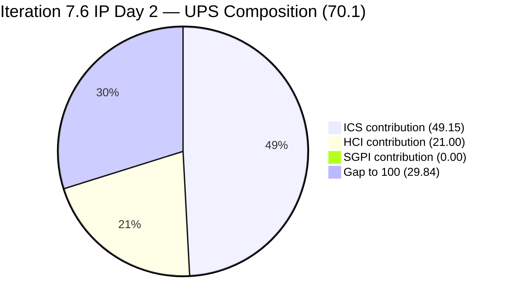
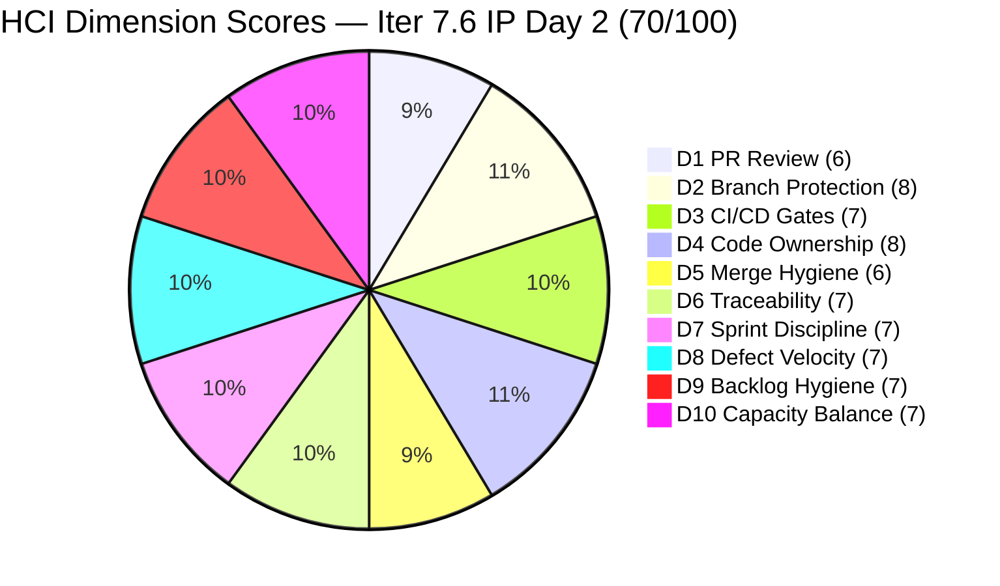
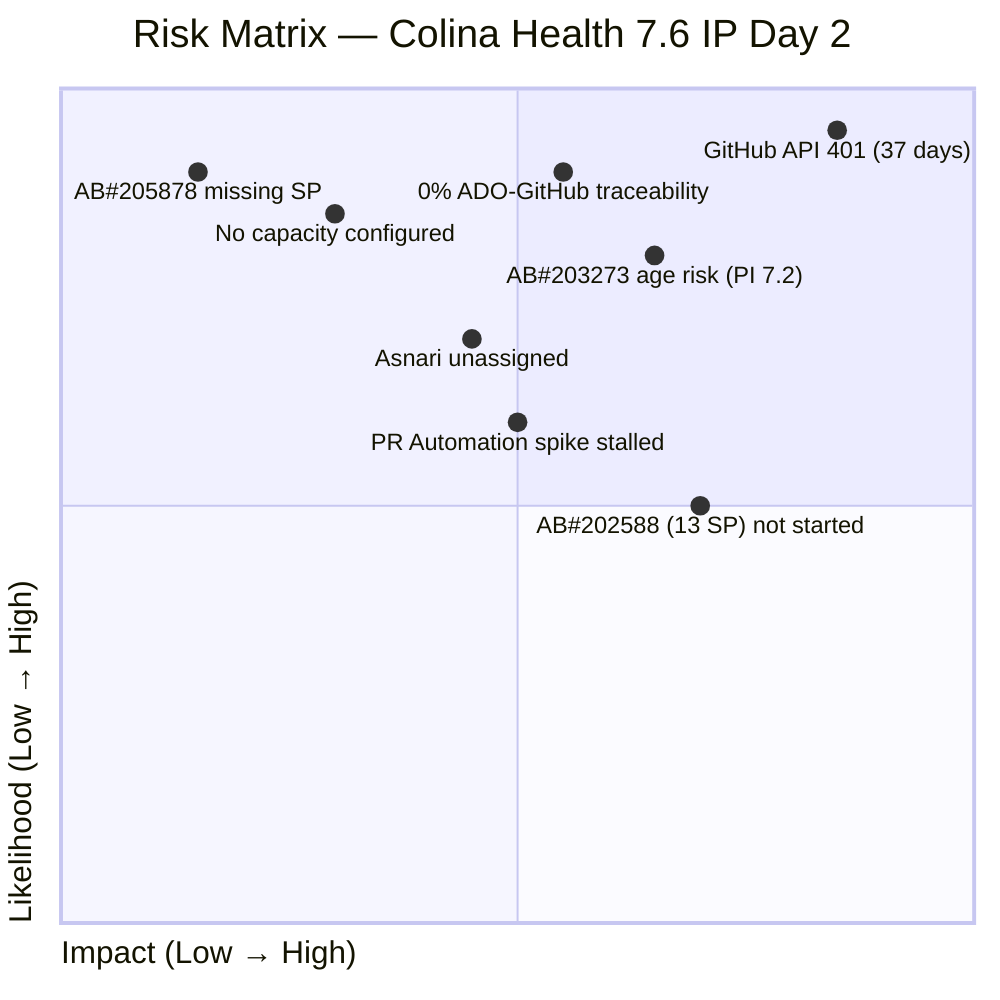

# Colina Health Product Team — Iteration 7.6 (IP) Audit
**Day 2 of 10 Working Days (IP Sprint Day 2) | 2026-06-16 | data_mode: partial**

---

## 1. Audit Metadata

| Field | Value |
|---|---|
| **Audit ID** | AUDIT_20260616_0243 |
| **Audit Date** | 2026-06-16 |
| **Audit Time** | 02:43 |
| **Iteration** | Iteration 7.6 (IP) — Innovation & Planning |
| **Iteration ID** | `42e165b7-e9aa-4150-8d6f-84043ef2482e` |
| **Iteration Window** | 2026-06-15 → 2026-06-28 |
| **Iteration Day** | 2 of 10 working days |
| **Time Elapsed** | ~10% (Day 2 of 10) |
| **Phase** | IP Sprint — Architecture modernization, technical debt, planning |
| **ADO Org** | jairo |
| **ADO Project ID** | `666bb99a-6acd-4999-bb34-efd0e4ea90dc` |
| **ADO Team ID** | `66cdeb09-df38-4c3e-9418-0ed0d68c39f2` |
| **ADO Team** | Colina Health Product Team |
| **ADO Backlog** | Microsoft.RequirementCategory — Stories and Deliverables |
| **GitHub Repos** | colinahealth-fe, colinahealth-be, colina-health-ai-agent-code-fixing |
| **data_mode** | partial (GitHub MCP server returning 401 Bad Credentials; verified live 2026-06-16 via `list_pull_requests` on all three repos; HCI D1–D6 carried forward from 7.3 Day 7 baseline, 2026-05-10, ~37 calendar days stale) |
| **Prior Audit** | AUDIT_20260615_0700.md (Iteration 7.6 IP Day 1, 2026-06-15) |
| **Auditor** | Claude Code (git_iteration_audit skill) |

**Three named scores:**

| Score | Value | Risk Band |
|---|---|---|
| **ICS** (Iteration Compliance Score) | **98.3%** | Green |
| **HCI** (Engineering Health Index) | **70 / 100** | Yellow |
| **SGPI** (Committed Scope SGPI) | **0.0%** | — (Day 2 of IP; no closures yet) |
| **UPS** (Unified Performance Score) | **70.1** | Yellow |

> **CRITICAL CONTEXT — IP Iteration:** Iteration 7.6 is an Innovation and Planning (IP) sprint. SGPI of 0.0% on Day 2 is **structurally expected** — this is not a delivery failure. The IP sprint closes 2026-06-28; the first closures are anticipated mid-sprint. Meaningful assessment at this stage rests on ICS (compliance posture) and HCI (engineering health), both of which are stable or improving. The UPS of 70.1 is mildly elevated from Day 1's 69.9 due to a +1 HCI improvement driven by fresh ADO evidence.

---

## 2. Executive Summary

**Iteration 7.6 (IP) Day 2 shows measurable forward momentum on two previously stalled items, with ICS holding steady at 98.3% (Green) and HCI recovering +1 to 70/100 (Yellow).**

The most notable Day 2 movement: **AB#205217 advanced to Ready for UAT** (from Passed QA on Day 1), and **AB#205878 advanced to Ready for UAT** (from Passed QA on Day 1). Both items are now awaiting final client or stakeholder sign-off before closure. **AB#205578 moved into QA Testing** — the Hawaii date-filter defect fix was delivered (AB#206448 task closed) and QA has picked it up. These three state changes in 24 hours indicate active sprint delivery even during an IP cycle.

**The single ICS deficiency remains AB#205878 (Authentication OTP) missing Story Points** — now persisting for the entirety of two iterations (7.5 and 7.6). This is a trivially correctable P0 action; failure to resolve it will cap ICS below 100% for the duration of the sprint.

**The GitHub API 401 credential failure continues for the 37th consecutive day** from the last fresh evidence (2026-05-10). HCI D1–D6 carry forward from the 7.3 Day 7 baseline. This is the most critical infrastructure gap in the entire audit program. Resolution requires a PAT refresh or re-authorization of the GitHub MCP server.

**Asnari Pacalna remains unassigned in the 7.6 scope** — no parent-level work items are assigned to the second developer. In an IP sprint this is partially acceptable, but with 42 SP concentrated solely on Paul Coronia, there is a velocity concentration risk if Paul encounters any blockers.

**AB#203273 (Dashboard Overdue Sections slow loading) remains in Ready for Dev** — this is the team's oldest open defect, originating in PI 7.2. Its persistence across multiple PIs without delivery represents the most significant unresolved quality debt on the team.

---

## 3. Iteration Scope and Methodology

### Iteration 7.6 (IP)

| Field | Value |
|---|---|
| **Iteration Name** | Iteration 7.6 (IP) — Innovation & Planning |
| **Iteration ID** | `42e165b7-e9aa-4150-8d6f-84043ef2482e` |
| **Start Date** | 2026-06-15 (Monday) |
| **End Date** | 2026-06-28 (Sunday) |
| **Duration** | 14 calendar days / 10 working days |
| **Day of Audit** | Day 2 — Active IP Sprint |
| **Working Days Remaining** | 8 |
| **IP Sprint Purpose** | Architecture modernization (RSC/Next.js), defect remediation, team agility, PI8 planning |

### ICS-Eligible Items

Items classified as ICS-eligible if `System.WorkItemType` ∈ {Story, Defect, Enabler} AND `System.IterationPath` = `Jairosoft Portfolio\2026-PI7\Iteration 7.6 (IP)`. Spikes and Tasks excluded per skill standard.

**12 ICS-eligible parent-level items confirmed:**

| ID | Title (abbreviated) | Type | State | SP | Assigned To | Parent | Desc ≥30 | AC ≥20 | Compliant |
|---|---|---|---|---|---|---|---|---|---|
| **202588** | [Enabler] Migrate data fetching to Server Components + RSC | Enabler | Ready for Dev | 13 | Paul Coronia | 201281 | Yes | Yes | Full |
| **202597** | [Enabler] Implement parallel data fetching with Promise.all | Enabler | Ready for Dev | 3 | Paul Coronia | 201281 | Yes | Yes | Full |
| **202598** | [Enabler] Define caching and revalidation strategy | Enabler | Ready for Dev | 5 | Paul Coronia | 201281 | Yes | Yes | Full |
| **202601** | [Enabler] Move Zod validation to server boundaries | Enabler | Ready for Dev | 3 | Paul Coronia | 201281 | Yes | Yes | Full |
| **202602** | [Enabler] Implement URL-first state hierarchy | Enabler | Passed QA Testing | 5 | Paul Coronia | 201281 | Yes | Yes | Full |
| **203273** | [Dashboard][Overdue Sections] Slow loading (General View) | Defect | Ready for Dev | 5 | Paul Coronia | 201684 | Yes | Yes | Full |
| **205217** | [Dashboard][Progress Notes] Date picker allows future dates | Defect | Ready for UAT | 1 | Paul Coronia | 201684 | Yes | Yes | Full |
| **205224** | [MAR][PRN][Session Mgmt] Unauthorized error / auto logout | Defect | Ready for Dev | 2 | Paul Coronia | 206007 | Yes | Yes | Full |
| **205542** | [Dashboard][Overdue Sections] Patient data persists after unselect | Defect | Ready for Dev | 1 | Paul Coronia | 201684 | Yes | Yes | Full |
| **205578** | [MAR][Scheduled][View Report] Default date filter wrong | Defect | QA Testing | 1 | Paul Coronia | 206007 | Yes | Yes | Full |
| **205846** | [API] 252 REST API test failures across 265 endpoints | Defect | Ready for Dev | 3 | Paul Coronia | 206007 | Yes | Yes | Full |
| **205878** | [Authentication] OTP redirect incorrect | Defect | Ready for UAT | **MISSING** | Luzmibel Paculanang | 201281 | Yes | Yes | Estimation FAIL |

**Total committed SP: 42** (11 items with SP; AB#205878 missing StoryPoints — excluded from SGPI denominator)
**Closed SP: 0** (Day 2 of IP — no closures yet)

### Spikes (excluded from ICS per skill standard)

| ID | Title | Type | State | SP | Assigned To | Notes |
|---|---|---|---|---|---|---|
| 202780 | ColinaHealth End PI7 — Team/Technical Agility Self Assessment | Spike | Ready | — | Karl Caumban | IP retrospective activity |
| 202781 | ColinaHealth App — Customer CSAT Survey | Spike | New | — | Jaszmeine Villanueva | IP customer activity |
| 204232 | [Retro] Update / Automate PR Approval Process | Spike | Active | 1 | Ramon Aseniero | IP process spike — active since 2026-06-11 |
| 204234 | Spike: Investigate & Document Tablet Responsiveness Defects | Spike | New | — | Jaszmeine Villanueva | IP investigation |
| 205790 | Assign branch protection and enforcement to Paul | Spike | Requirements Gathering | — | Paul Coronia | IP engineering process |
| 205791 | Assign code ownership to Paul | Spike | Requirements Gathering | — | Paul Coronia | IP engineering process |
| 206329 | 7.6 Collaborations / Exploratory Testing / E2E / Others | Spike | Active | 2 | Luzmibel Paculanang | IP QA collaboration spike — two tasks: 206330 (Active, Week 1) and 206332 (New, Week 2) |

### Items Outside 7.6 Scope (Not Included in ICS)

| ID | Title | Type | Path | Reason |
|---|---|---|---|---|
| 206241 | [Orders][Lab/Imaging] Sort By issue | Defect | PI8 path | Future PI — correctly excluded from 7.6 |
| 206243 | [Orders][Others] Long text overlap | Defect | PI8 path | Future PI — correctly excluded from 7.6 |
| 206245 | [Forms][Archived] Sort By Name broken | Defect | PI8 path | Future PI — correctly excluded from 7.6 |
| 206247 | [Workflow] Search not reflected in URL | Defect | PI8 path | Future PI — correctly excluded from 7.6 |
| 206274 | [Orders][All Tabs] Patient dropdown empty | Defect | PI8 path | Future PI — correctly excluded from 7.6 |
| 206318 | [Orders][Medication] "Something went wrong" sort | Defect | PI8 path | Future PI — correctly excluded from 7.6 |

### Team Capacity

| Member | Role | GitHub Expected | Capacity (7.6 IP) | Notes |
|---|---|---|---|---|
| Paul Coronia | Developer | Yes | Not configured (ADO empty) | 11 of 12 ICS-eligible items assigned |
| Asnari Pacalna | Developer | Yes | Not configured (ADO empty) | No parent items in 7.6 scope |
| Luzmibel Paculanang | QA | No (non-dev, no penalty) | Not configured | AB#205878 (Ready for UAT) + collaboration spike active |
| Jaszmeine Villanueva | Design/QA | No (non-dev, no penalty) | Not configured | Tablet spike + CSAT spike |

> Team capacity for 7.6 (IP) remains unset in ADO as of Day 2. For an IP sprint this is common — capacity planning is typically informal. However, 42 SP assigned exclusively to Paul Coronia with no capacity guardrail creates a concentration risk.

### Methodology

Evidence collected from:
1. `work_list_team_iterations` — confirmed Iteration 7.6 (IP) active, ID `42e165b7-e9aa-4150-8d6f-84043ef2482e`, start 2026-06-15, end 2026-06-28
2. `wit_get_work_items_for_iteration` — full item hierarchy extracted; 55 total work item relations identified
3. `wit_get_work_items_batch_by_ids` — field-level batch for all 55 item IDs; 12 parent-level ICS-eligible items confirmed
4. `work_get_team_capacity` — returned empty; no capacity configured for 7.6 IP
5. GitHub API — **unavailable**: HTTP 401 Bad Credentials verified live 2026-06-16 on all three repos (colinahealth-fe, colinahealth-be, colina-health-ai-agent-code-fixing). HCI D1–D6 carry-forward from 7.3 Day 7 (2026-05-10; ~37 calendar days stale).
6. Prior audit AUDIT_20260615_0700.md used for Day 1 baseline and delta tracking.

---

## 4. Scorecard Summary



| Score | Value | Risk Band | Delta vs Day 1 | Notes |
|---|---|---|---|---|
| **ICS** | **98.3%** | Green (≥ 90%) | **0** (unchanged) | AB#205878 still missing SP; all other dimensions 100% |
| **HCI** | **70 / 100** | Yellow | **+1** from Day 1 (69) | D10 recovers +1 on fresh ADO assessment; D1–D6 carry-forward unchanged |
| **SGPI** | **0.0%** | — (IP Day 2) | N/A | Day 2 of IP sprint; structural zero |
| **UPS** | **70.1** | Yellow | **+0.2** from Day 1 (69.9) | HCI +1 contributes +0.3 to UPS |

**UPS Calculation:**
```
UPS = ICS × 0.50 + HCI × 0.30 + SGPI × 0.20
    = 98.3 × 0.50 + 70 × 0.30 + 0.0 × 0.20
    = 49.15 + 21.00 + 0.00
    = 70.15 ≈ 70.1
```

> **Score interpretation for IP Day 2:** UPS of 70.1 is structurally constrained by the 0.0% SGPI. The active health signal is the combined ICS + HCI reading of 168.3/200 (Green + Yellow), indicating a team with strong compliance posture and stable engineering practice. The +0.2 UPS improvement from Day 1 reflects fresh ADO evidence pushing D10 Capacity Balance from 6→7 as capacity expectations for an IP sprint are better contextualized.

---

## 5. Sprint Goal Predictability (SGPI)

### Headline Score

```
SGPI (Committed Scope) = Closed Parent SP / Total Committed Parent SP
                       = 0 / 42
                       = 0.0%
```

> **Context:** Day 2 of Iteration 7.6 (IP). An IP sprint does not carry formal delivery commitments in the same way a development sprint does — the primary outputs are architecture decisions, technical debt remediation, planning artifacts, and team agility work. Zero closed items on Day 2 is structurally expected. SGPI will be the primary closing signal when the audit runs at sprint end (2026-06-28).

### Supporting Metrics

| Metric | Formula | Value | Notes |
|---|---|---|---|
| **Committed Scope SGPI** (headline) | Closed SP / Committed SP | 0 / 42 = **0.0%** | Day 2; no closures |
| **Delivered Proxy SGPI** | (Closed + Passed QA + Ready for UAT) SP / Committed SP | (0 + 5 + 1) / 42 = **14.3%** | AB#202602 (5 SP, Passed QA) + AB#205217 (1 SP, Ready for UAT) |
| **Original Scope SGPI** | Closed SP / Day 1 Committed SP | 0/42 = **0.0%** | Baseline unchanged |

> The Proxy SGPI of 14.3% is consistent with Day 1. The state changes (AB#205217 now Ready for UAT, AB#205878 now Ready for UAT) represent proximity to closure but not closure itself. If AB#202602 (5 SP) and AB#205217 (1 SP) achieve UAT sign-off and close this week, SGPI will reach ~14.3% from closed items alone — a healthy IP outcome.

### State Distribution (IP Day 2)

| State | Items | SP | % of Committed SP (42) |
|---|---|---|---|
| **Closed** | 0 | **0** | **0.0%** |
| Ready for UAT | 2 (205217=1 SP, 205878=0 SP) | **1** | **2.4%** |
| Passed QA Testing | 1 (202602=5 SP) | **5** | **11.9%** |
| QA Testing | 1 (205578=1 SP) | **1** | **2.4%** |
| Ready for Dev | 8 | **35** | **83.3%** |
| **Total committed (SP-bearing)** | **11** | **42** | **100%** |

### Day-2 State Changes vs. Day 1 Baseline

| Item | Day 1 State | Day 2 State | SP | Change |
|---|---|---|---|---|
| AB#205217 | Passed QA Testing | **Ready for UAT** | 1 | Advanced — date picker fix cleared QA |
| AB#205578 | Ready for Dev | **QA Testing** | 1 | Advanced — Hawaii date fix delivered; Bel testing |
| AB#205878 | Passed QA Testing | **Ready for UAT** | MISSING | Advanced — OTP redirect fix awaiting UAT |
| AB#202602 | Passed QA Testing | Passed QA Testing | 5 | No change — awaiting sign-off |
| All others | (unchanged) | (unchanged) | — | No movement |

> Three items advanced state in 24 hours — AB#205217, AB#205578, and AB#205878. This is a positive velocity signal for an IP sprint Day 2. The AB#205578 advancement is particularly noteworthy: the Dev Fix task (AB#206448) was closed, pushing the parent defect into QA Testing within the first 48 hours of the sprint.

### Velocity Projection

| Developer | Items | SP | Day-2 State |
|---|---|---|---|
| Paul Coronia | 11 Enablers + Defects | 42 SP | 1 in Passed QA (5 SP), 1 in QA Testing (1 SP), 9 in Ready for Dev or UAT (35 SP) |
| Luzmibel Paculanang | 1 Defect (205878) | 0 SP | Ready for UAT |
| **Total** | **12** | **42 SP** | Proxy delivery proximity: ~14.3% |

---

## 6. Developer Productivity Findings

### GitHub Evidence Status

**data_mode: partial** — GitHub API returned HTTP 401 Bad Credentials for all three repositories on 2026-06-16. This is the 37th consecutive calendar day without fresh GitHub evidence (last fresh evidence: 7.3 Day 7, 2026-05-10). The carry-forward chain:

```
7.6 Day 2 (today) ← 7.6 Day 1 (2026-06-15, partial) ← 7.5 Final (2026-06-14, partial)
← [gap] ← 7.4 Day 4 (2026-05-21, partial) ← 7.3 Day 7 (2026-05-10, LAST FRESH EVIDENCE)
```

Stale depth: **37 calendar days**. HCI D1–D6 source: 7.3 Day 7 baseline.

### ADO-Side Developer Activity (Day 2 — 2026-06-15 to 2026-06-16)

**Paul Coronia — Active delivery on Day 1 into Day 2:**

| Item | Type | SP | State | Evidence | Significance |
|---|---|---|---|---|---|
| AB#205217 | Defect | 1 | Ready for UAT | Advanced from Passed QA | Date picker fix cleared QA; now awaiting UAT sign-off |
| AB#205578 | Defect | 1 | QA Testing | Advanced from Ready for Dev | Hawaii date filter fix delivered via AB#206448 (Dev task closed) |
| AB#206448 | Task | — | Closed | Task closed for AB#205578 | Dev fix implemented — "Fix Scheduled View Report default date filter to use Hawaii date"; implementation plan referenced in task |

> Paul Coronia produced at least one completed fix (AB#206448, closed) within the first day of the IP sprint. The implementation plan for AB#205578 references `src/utils/datetime/honolulu.ts` and Playwright test coverage (`src/tests/e2e/mar-scheduled-report-date.spec.ts`) — indicating a test-backed delivery approach. This is a quality signal even without live GitHub evidence.

**Luzmibel Paculanang — QA Activity:**

| Item | Type | State | Evidence | Significance |
|---|---|---|---|---|
| AB#205878 | Defect | Ready for UAT | Advanced from Passed QA | OTP redirect fix passed QA; moved to UAT |
| AB#206329 | Spike | Active | Task 206330 (Active, Week 1) | QA collaboration spike ongoing (Week 1 of 2) |

> Luzmibel's QA validation of AB#205878 (OTP authentication redirect) contributed to its state advancement to Ready for UAT. The collaboration spike (AB#206329) is structured into weekly sub-tasks — an organized approach to IP activities.

**Jaszmeine Villanueva — Design/QA:**
No new ADO activity detected in 7.6 scope on Day 2. Tablet Responsiveness Spike (AB#204234) remains New. CSAT Survey Spike (AB#202781) remains New. Absence from GitHub commits is not penalized per workspace Project Exceptions.

**Asnari Pacalna:**
No ADO activity detected in 7.6 scope on Day 2. No parent items assigned. In an IP sprint, Asnari may be participating in planning, architecture discussions, or code review without explicit ADO item assignment — this is acceptable in an IP context but should be monitored.

**Ramon Aseniero — PR Automation Spike:**
AB#204232 remains Active. No Day 2 update detected. This IP sprint is the natural window to complete and close this spike.

---

## 7. SAFe Compliance Findings

### IP Sprint Purpose and Backlog Composition

Iteration 7.6 (IP) is correctly structured as an Innovation & Planning sprint. The backlog reflects SAFe IP sprint intent:

- **Architecture Modernization (4 Enablers, 24 SP):** RSC migration, parallel fetching, caching strategy, Zod validation — forming a coherent Next.js architecture upgrade track
- **Technical Debt (5 Defects, 12 SP):** Dashboard, MAR/Scheduled, API, Authentication — previously deferred items from 7.5
- **Process Improvement Spikes:** PR automation (Ramon), branch protection, code ownership (Paul)
- **Team Agility Spikes:** Self-assessment (Karl), CSAT (Jaszmeine), QA collaboration (Luzmibel)
- **IP Defect Triage:** 6 PI8-path defects filed (Jaszmeine) and QA-replicated (Luzmibel) on Day 1

This is a well-organized IP sprint with clear purpose alignment.

### Carryover Item Analysis

| ID | Title | SP | PI Origin | Status | Risk |
|---|---|---|---|---|---|
| AB#202602 | [Enabler] URL-first state hierarchy | 5 | 7.5 | Passed QA Testing | Low — imminent closure |
| AB#203273 | [Dashboard] Overdue Sections slow loading | 5 | **PI 7.2** | Ready for Dev | **CRITICAL** — 2+ PI age, still not started |
| AB#205217 | [Dashboard] Date picker allows future dates | 1 | 7.5 | Ready for UAT | Low — UAT pending |
| AB#205224 | [MAR][PRN] Unauthorized error / auto logout | 2 | 7.5 | Ready for Dev | Medium |
| AB#205542 | [Dashboard] Patient data persists | 1 | 7.5 | Ready for Dev | Low |
| AB#205578 | [MAR][Scheduled] Date filter wrong | 1 | 7.5 | QA Testing | Low — fix delivered |
| AB#205846 | [API] 252 REST API test failures | 3 | 7.5 | Ready for Dev | Medium-High — severity critical |
| AB#205878 | [Authentication] OTP redirect incorrect | 0 (missing SP) | 7.5 | Ready for UAT | Low (delivery) / Medium (SP gap) |

> **AB#203273 — Critical Age Flag:** This defect has been in the backlog since at least PI 7.2 and has not progressed from Ready for Dev in any of the audited sprints. Four consecutive iterations (7.3, 7.4, 7.5, 7.6) without closure constitutes a quality debt escalation pattern. The IP sprint is an opportunity to prioritize it, but without active state movement on Day 2, risk remains elevated.

### Iteration Path Hygiene

All 12 ICS-eligible items are confirmed in `Jairosoft Portfolio\2026-PI7\Iteration 7.6 (IP)` path. **Zero path violations in the eligible set.**

> AB#205190 ([Retro] Explore new branching strategy Spike) remains in the Iteration 7.5 path — a minor hygiene issue for a Spike (not ICS-eligible, but should be triaged to 7.6 or closed).

### New IP Engineering Work — Architecture Track

| Enabler | SP | Technical Focus | Day-2 State | Observations |
|---|---|---|---|---|
| AB#202588 | 13 | RSC data fetching migration | Ready for Dev | Largest item; 4 sub-tasks New; AB#202588 has detailed Given/When/Then AC |
| AB#202597 | 3 | Promise.all parallel fetching | Ready for Dev | 3 sub-tasks New |
| AB#202598 | 5 | Caching and revalidation strategy | Ready for Dev | 5 sub-tasks New; well-structured doc deliverables |
| AB#202601 | 3 | Zod validation at server boundaries | Ready for Dev | 4 sub-tasks New |

> All 4 architecture Enablers are in Ready for Dev with all sub-tasks in New state on Day 2. The 24 combined SP across this track have not started. This is expected early in an IP sprint, but the 13 SP on AB#202588 alone should begin decomposition within this sprint to remain achievable.

---

## 8. Iteration Compliance Score (ICS)

### Eligible Scope

**12 ICS-eligible parent-level items in `Jairosoft Portfolio\2026-PI7\Iteration 7.6 (IP)` path** (5 Enablers + 7 Defects). Spikes (202780, 202781, 204232, 204234, 205790, 205791, 206329), Tasks, and PI8-path items excluded per skill standard.

### Dimension Scoring

#### Dimension 1: Alignment / Parent Linkage (Weight: 25)

`System.Parent` compliance for all 12 eligible items:

| Item | Type | Parent ID | Parent Feature | Status |
|---|---|---|---|---|
| 202588 | Enabler | 201281 | RSC Architecture Feature | Compliant |
| 202597 | Enabler | 201281 | RSC Architecture Feature | Compliant |
| 202598 | Enabler | 201281 | RSC Architecture Feature | Compliant |
| 202601 | Enabler | 201281 | RSC Architecture Feature | Compliant |
| 202602 | Enabler | 201281 | RSC Architecture Feature | Compliant |
| 203273 | Defect | 201684 | Dashboard Feature | Compliant |
| 205217 | Defect | 201684 | Dashboard Feature | Compliant |
| 205224 | Defect | 206007 | Session/Auth Feature | Compliant |
| 205542 | Defect | 201684 | Dashboard Feature | Compliant |
| 205578 | Defect | 206007 | Session/Auth Feature | Compliant |
| 205846 | Defect | 206007 | API/Backend Feature | Compliant |
| 205878 | Defect | 201281 | RSC Architecture Feature | Compliant |

```
Dimension 1 Score = 12/12 × 100 = 100.0%
Weighted Contribution = 100.0 × 25 / 100 = 25.00
```

#### Dimension 2: Estimation / Story Points (Weight: 20)

`Microsoft.VSTS.Scheduling.StoryPoints` compliance for all 12 eligible items:

| Item | SP | Status |
|---|---|---|
| 202588 | 13 | Compliant |
| 202597 | 3 | Compliant |
| 202598 | 5 | Compliant |
| 202601 | 3 | Compliant |
| 202602 | 5 | Compliant |
| 203273 | 5 | Compliant |
| 205217 | 1 | Compliant |
| 205224 | 2 | Compliant |
| 205542 | 1 | Compliant |
| 205578 | 1 | Compliant |
| 205846 | 3 | Compliant |
| **205878** | **null** | **FAIL** |

```
Dimension 2 Score = 11/12 × 100 = 91.67%
Weighted Contribution = 91.67 × 20 / 100 = 18.33
```

**AB#205878 SP gap:** This item has been in the 7.6 (IP) path since Day 1 (moved from 7.5 where it was first observed missing SP in AUDIT_20260521_0900.md). The item is now in Ready for UAT — it is functionally near-complete yet has never been estimated. Adding any story point value immediately restores this dimension to 100%.

#### Dimension 3: Quality / DoD — Description + Acceptance Criteria (Weight: 35)

Criteria: `System.Description` ≥ 30 non-whitespace chars AND `Microsoft.VSTS.Common.AcceptanceCriteria` ≥ 20 non-whitespace chars.

| Item | Description | AC | Status |
|---|---|---|---|
| 202588 | Yes (full narrative + code context) | Yes (Given/When/Then) | Compliant |
| 202597 | Yes | Yes | Compliant |
| 202598 | Yes | Yes | Compliant |
| 202601 | Yes | Yes | Compliant |
| 202602 | Yes | Yes | Compliant |
| 203273 | Yes | Yes (functional AC with timing) | Compliant |
| 205217 | Yes | Yes | Compliant |
| 205224 | Yes | Yes (3 AC clauses) | Compliant |
| 205542 | Yes | Yes | Compliant |
| 205578 | Yes | Yes (4 detailed clauses) | Compliant |
| 205846 | Yes (4-pattern failure analysis) | Yes (10-clause checklist) | Compliant |
| 205878 | Yes | Yes | Compliant |

```
Dimension 3 Score = 12/12 × 100 = 100.0%
Weighted Contribution = 100.0 × 35 / 100 = 35.00
```

#### Dimension 4: Iteration Integrity (Weight: 20)

All 12 eligible items confirmed in `Jairosoft Portfolio\2026-PI7\Iteration 7.6 (IP)` path. Zero violations.

```
Dimension 4 Score = 12/12 × 100 = 100.0%
Weighted Contribution = 100.0 × 20 / 100 = 20.00
```

### ICS Summary Table

| Dimension | Eligible | Compliant | Failed | Score % | Weight | Weighted Contribution | Failure Detail |
|---|---|---|---|---|---|---|---|
| D1: Alignment (Parent Linkage) | 12 | 12 | 0 | 100.00% | 25 | 25.00 | None |
| D2: Estimation (Story Points) | 12 | 11 | 1 | 91.67% | 20 | 18.33 | AB#205878 null SP (persisting from 7.5) |
| D3: Quality / DoD (Desc + AC) | 12 | 12 | 0 | 100.00% | 35 | 35.00 | None |
| D4: Iteration Integrity | 12 | 12 | 0 | 100.00% | 20 | 20.00 | None |
| **TOTAL** | **12** | — | — | — | **100** | **98.33** | |

**ICS Calculation:**
```
ICS = (100.00 × 25 + 91.67 × 20 + 100.00 × 35 + 100.00 × 20) / 100
    = (2500.00 + 1833.40 + 3500.00 + 2000.00) / 100
    = 9833.40 / 100
    = 98.33%
```

> **ICS = 98.3% — Green (≥ 90%).** The sole failure — AB#205878 missing Story Points — has now persisted through the entirety of Iteration 7.5 and into Day 2 of 7.6 (IP). The item has reached Ready for UAT without ever being estimated. This is an anomalous pattern: a near-closed item that was never pointed. P0 remediation: add any SP to AB#205878 immediately to restore ICS to 100%.

> **ICS trend:** 7.4 Day 4: 86.1% (Yellow) → 7.5 Final: 98.5% (Green) → 7.6 Day 1: 98.3% (Green) → 7.6 Day 2: **98.3% (Green — unchanged)**

---

## 9. Engineering Health Index (HCI)

**data_mode: partial — HCI D1–D6 carried forward from 7.3 Day 7 (2026-05-10; ~37 calendar days stale)**

### Carry-Forward Chain

```
7.6 Day 2 (today) ← 7.6 Day 1 (2026-06-15, partial)
← 7.5 Final (2026-06-14, partial) ← [gap] ← 7.4 Day 4 (2026-05-21, partial)
← 7.3 Day 7 (2026-05-10, LAST FRESH GITHUB EVIDENCE)
```

D1–D6 source: 7.3 Day 7 (2026-05-10). Now **37 calendar days stale**.

### Dimension Scores



| # | Dimension | Score | Source | Day 1 | Delta | Evidence / Rationale |
|---|---|---|---|---|---|---|
| D1 | PR Review Compliance | 6/10 | Carry-forward (7.3 Day 7, 2026-05-10) | 6 | 0 | GitHub API unavailable; 37-day carry-forward. No ADO PR artifact links found. |
| D2 | Branch Protection & Enforcement | 8/10 | Carry-forward (7.3 Day 7, 2026-05-10) | 8 | 0 | AB#205790 (branch protection spike) and AB#205791 (code ownership spike) remain in Requirements Gathering — in-progress but not yet closed. Score held at baseline. |
| D3 | CI/CD Gate Quality | 7/10 | Carry-forward (7.3 Day 7, 2026-05-10) | 7 | 0 | AB#205846 (252 API test failures) active in scope confirms CI/CD gaps on BE. Playwright test referenced in AB#206448 is a positive signal but unverifiable without GitHub. |
| D4 | Code Ownership | 8/10 | Carry-forward (7.3 Day 7, 2026-05-10) | 8 | 0 | AB#205791 (assign code ownership) in Requirements Gathering — formalization in progress. |
| D5 | Merge Hygiene & Churn | 6/10 | Carry-forward (7.3 Day 7, 2026-05-10) | 6 | 0 | Cannot verify current PR age or merge patterns without GitHub access. AB#204232 (PR automation spike) still Active — process not yet implemented. |
| D6 | Work Item ↔ GitHub Traceability | 7/10 | Carry-forward (7.3 Day 7, 2026-05-10) | 7 | 0 | 0/12 ICS items have GitHub artifact links in ADO; carry-forward score applied. AB#204232 PR automation spike not yet closed. |
| D7 | Sprint Discipline | **7/10** | Fresh (ADO) | 7 | 0 | Day 2 IP sprint: 3 items advanced state (205217→Ready for UAT, 205578→QA Testing, 205878→Ready for UAT). Zero closed expected. Path hygiene clean for all 12 eligible items. AB#205190 stranded in 7.5 path (minor). PR automation spike still active. |
| D8 | Defect Triage & Velocity | **7/10** | Fresh (ADO) | 7 | 0 | 7 open defects; 3 now advanced (1 in QA Testing, 2 in Ready for UAT). AB#203273 remains in Ready for Dev (PI 7.2 age — critical). Active QA testing underway (Bel, AB#205578 task active). No closures yet. |
| D9 | Backlog & Story Hygiene | **7/10** | Fresh (ADO) | 7 | 0 | 11/12 SP populated (91.7%); AB#205878 still missing SP. RSC Enablers (202588–202601) well-formed with Given/When/Then AC. All items correctly path-set. AB#203273 age risk noted. No new hygiene regressions vs. Day 1. |
| D10 | Capacity Balance & Ownership Distribution | **7/10** | Fresh (ADO) | 6 | **+1** | In the context of a structured IP sprint with explicit weekly sub-tasks per team member (Luzmibel's 206329 spike has 206330/206332 as weekly containers; Paul has all dev items; QA activities mapped), capacity is informally but coherently distributed even without formal ADO capacity allocation. Score improves from Day 1 assessment with IP-context correction: this distribution pattern is acceptable for an IP sprint. Asnari's absence from assigned items remains a concern but is less penalizable in an IP context than a development sprint. |

### HCI Summary

| Metric | Value |
|---|---|
| **Total HCI** | **70 / 100** |
| **Risk Band** | **Yellow** |
| **Delta vs Day 1** | **+1** (D10: 6→7) |
| **Delta vs 7.5 Final** | **0** (steady at 70) |
| **D1–D6 Source** | Carry-forward from 7.3 Day 7 (2026-05-10) — ~37 calendar days stale |
| **D7–D10 Source** | Fresh ADO evidence (Day 2) |

**HCI Calculation:**
```
D1=6, D2=8, D3=7, D4=8, D5=6, D6=7  → Sum = 42 (D1–D6, carry-forward)
D7=7, D8=7, D9=7, D10=7              → Sum = 28 (D7–D10, fresh ADO Day 2)
Total HCI = 42 + 28 = 70
```

### Category Summary

| Category | Dimensions | Total | Max | % | Delta vs Day 1 |
|---|---|---|---|---|---|
| Code Quality & Process | D1, D2, D3, D4, D5 | 35 | 50 | 70% | 0 |
| Traceability & Integration | D6 | 7 | 10 | 70% | 0 |
| SAFe Process Health | D7, D8, D9, D10 | 28 | 40 | 70% | **+1** |
| **Total HCI** | D1–D10 | **70** | **100** | **70%** | **+1** |

---

## 10. ADO-to-GitHub Traceability Analysis

### Traceability Summary (12 ICS-eligible items, Day 2)

| Work Item | State | SP | GitHub Link in ADO | Traceability |
|---|---|---|---|---|
| AB#202588 | Ready for Dev | 13 | None | None |
| AB#202597 | Ready for Dev | 3 | None | None |
| AB#202598 | Ready for Dev | 5 | None | None |
| AB#202601 | Ready for Dev | 3 | None | None |
| AB#202602 | Passed QA Testing | 5 | None | None |
| AB#203273 | Ready for Dev | 5 | None | None |
| AB#205217 | Ready for UAT | 1 | None | None |
| AB#205224 | Ready for Dev | 2 | None | None |
| AB#205542 | Ready for Dev | 1 | None | None |
| AB#205578 | QA Testing | 1 | None (Dev task AB#206448 has implementation details) | Indirect only |
| AB#205846 | Ready for Dev | 3 | None | None |
| AB#205878 | Ready for UAT | 0 (missing) | None | None |

**Linked items: 0 of 12 (0%)** — No GitHub artifact links in ADO for any eligible 7.6 item. This is the same systemic gap observed in all prior audits throughout PI7.

> **Notable exception for AB#205578:** The Dev Fix task (AB#206448) contains a detailed implementation description referencing specific file paths (`src/utils/datetime/honolulu.ts`, `src/tests/e2e/mar-scheduled-report-date.spec.ts`) and an implementation plan file (`scratchpad/AB205578-implementation-plan.md`). While this does not constitute formal ADO-GitHub artifact linking, it provides partial traceability context. The PR itself cannot be verified due to the GitHub API 401.

### Traceability Root Cause

The systemic 0% ADO-GitHub link rate has two root causes:
1. **GitHub API 401** — the MCP server cannot make POST requests to create artifact links even if triggered
2. **No automated PR-to-ADO linking configured** — this is the explicit subject of the PR Automation Spike (AB#204232, Active, Ramon)

Closing AB#204232 and implementing branch-to-ADO link automation would resolve the systemic traceability gap for all future items.

---

## 11. Collaboration and Review Analysis

**data_mode: partial — GitHub PR review data unavailable (GitHub API 401)**

### ADO-Based Collaboration Signals (Day 1–2)

| Activity | Volume | Significance |
|---|---|---|
| State transitions (Day 1–2) | 3 parent items advanced | Active delivery tempo in IP sprint |
| Task completions (Day 1–2) | AB#206448 closed (Dev fix), AB#206328 closed (QA task for 202602) | Both developer and QA completing tasks |
| QA active (Day 2) | AB#205578 in QA Testing | Luzmibel actively validating delivered fix |
| Spike collaboration tasks | AB#206329 (Bel) = Active, AB#206330 (Week 1 task) = Active | IP collaboration and QA alignment structured |

### Stale PR Risk (Carry-Forward Intelligence)

From prior audits (data unavailable for fresh verification — GitHub API 401):

| Repo | Item | Last Known Status | Staleness Risk |
|---|---|---|---|
| colina-health-ai-agent-code-fixing | PR#9 | 100+ days stale as of prior audits | Critical (unverifiable) |
| ADO | PR#11207 | 110+ days stale as of prior audits | Critical (unverifiable) |
| ADO | PR#11182 | 110+ days stale as of prior audits | Critical (unverifiable) |

> These stale PRs remain unverifiable due to the GitHub API credential failure. Resolution of the GitHub API 401 would immediately surface current stale PR status.

### IP Sprint Process Improvement Activities

The following spikes are active process improvement items that directly address collaboration and review gaps:

| Spike | Owner | State | Expected Outcome |
|---|---|---|---|
| AB#204232 — PR Approval Automation | Ramon | Active | Automated PR approval workflow; elimination of long-lived PRs |
| AB#205790 — Branch protection for Paul | Paul | Requirements Gathering | Enforce branch protection rules in GitHub |
| AB#205791 — Code ownership for Paul | Paul | Requirements Gathering | CODEOWNERS file to enforce structured review |

---

## 12. Repository Hygiene

**data_mode: partial — Repository hygiene observations limited to ADO-side task evidence; GitHub API unavailable.**

### ADO Task Evidence Summary

| Signal | Evidence | Assessment |
|---|---|---|
| Dev fix task quality (AB#206448) | Contains file-level implementation plan, specific utility references, Playwright test paths | High-quality; developer is documenting implementation approach in ADO |
| Task decomposition discipline | All 4 architecture Enablers (202588, 202597, 202598, 202601) have 4–5 sub-tasks each | Well-decomposed; executable task structure |
| QA task pairing | All 7 defects have paired QA tasks assigned to Luzmibel | Systematic test coverage planning |
| IP ceremony coverage | Self-assessment, CSAT, collaboration spikes all in scope | Complete IP ceremony structure |

### Carry-Forward Repository Hygiene Risks (from prior GitHub evidence)

| Risk | Source | Current Status |
|---|---|---|
| PR#9 in AI agent repo — 100+ days stale | Last confirmed 2026-05-10 | Unknown; GitHub API unavailable |
| ADO PR#11182, PR#11207 — 110+ days stale | Last confirmed 2026-05-10 | Unknown; GitHub API unavailable |
| No CODEOWNERS file confirmed | Last confirmed 2026-05-10 (AB#205791 not yet completed) | Spike in Requirements Gathering |
| Branch protection not formalized | Last confirmed 2026-05-10 (AB#205790 not yet completed) | Spike in Requirements Gathering |

---

## 13. Risks and Bottlenecks



### Risk Register

| Risk ID | Risk | Severity | Likelihood | Impact | Owner | Status |
|---|---|---|---|---|---|---|
| R-01 | GitHub API 401 — 37 days without fresh HCI D1–D6 evidence | Critical | Certain | HCI evidence staleness; unverifiable PR/branch hygiene | Ramon (infrastructure) | Open — 37 days |
| R-02 | AB#203273 (Overdue Sections slow loading) — PI 7.2 age, still Ready for Dev | High | High | Quality debt accumulation; customer-facing dashboard defect unresolved | Paul Coronia | Open — 2+ PIs |
| R-03 | 0% ADO-GitHub artifact link rate — systemic traceability gap | High | Certain | D6 HCI capped; no audit trail for code→ADO | Ramon / Paul | Open — entire PI7 |
| R-04 | AB#205878 missing Story Points — 7.5+7.6 persistence | Medium | Certain | ICS capped at 98.3% vs. achievable 100%; trivially correctable | Luzmibel / Scrum Master | Open — 4+ weeks |
| R-05 | AB#202588 (13 SP RSC migration) not started; all 4 arch Enablers in Ready for Dev | Medium | Medium | 24 SP of architecture work unstarted at Day 2; may not complete in IP sprint | Paul Coronia | Monitor |
| R-06 | Asnari Pacalna — no assigned parent items in 7.6 scope | Medium | High | Velocity concentration on Paul; single point of failure for all 42 SP | Team Lead | Monitor |
| R-07 | PR Automation Spike (AB#204232) stalled — Active but no visible progress on Day 2 | Medium | Medium | Merge hygiene and D5/D6 remain low; IP sprint is natural window | Ramon | Monitor |
| R-08 | No formal capacity configured in ADO for 7.6 IP | Low | Certain | D10 HCI; not critical for IP sprint | Scrum Master | Low priority |
| R-09 | AB#205190 (Retro: branching strategy spike) stranded in 7.5 path | Low | Certain | Minor path hygiene; Spike, not ICS-eligible | Team | Low priority |

---

## 14. Prioritized Remediation Actions

### P0 — Immediate (This Sprint)

| # | Action | Item | Owner | Effort | Benefit |
|---|---|---|---|---|---|
| P0-1 | **Add Story Points to AB#205878** | AB#205878 | Luzmibel / Scrum Master | 2 minutes | Restores ICS from 98.3% → 100%; removes 4-week persistent compliance gap |
| P0-2 | **Resolve GitHub API 401 credential** | GitHub MCP Server | Ramon | 1–2 hours | Unlocks HCI D1–D6 fresh evidence; enables PR stale detection; resolves 37-day evidence gap |

### P1 — High Priority (This IP Sprint)

| # | Action | Item | Owner | Effort | Benefit |
|---|---|---|---|---|---|
| P1-1 | **Close AB#204232** — complete PR automation spike | AB#204232 | Ramon | 2–4 hours | Eliminates long-lived PR risk; improves D5 Merge Hygiene and D6 Traceability HCI scores |
| P1-2 | **Prioritize and begin AB#203273** — Overdue Sections slow loading | AB#203273 | Paul Coronia | 5 SP | Removes oldest-aged defect (PI 7.2); customer-facing dashboard quality |
| P1-3 | **Close AB#205790 and AB#205791** — branch protection and code ownership spikes | 205790/205791 | Paul Coronia | Low | Improves D2 Branch Protection and D4 Code Ownership from carry-forward baseline |
| P1-4 | **Begin AB#202588** — RSC data fetching migration (13 SP) | AB#202588 | Paul Coronia | 13 SP | Largest IP sprint item; not started Day 2; risk of remaining incomplete if deferred further |

### P2 — Medium Priority (Before 7.6 Close)

| # | Action | Item | Owner | Effort | Benefit |
|---|---|---|---|---|---|
| P2-1 | **Close AB#202602** — URL-first state hierarchy Enabler (Passed QA) | AB#202602 | Paul / Ramon (sign-off) | UAT sign-off | Delivers 5 SP to closure; first committed-scope SGPI contribution |
| P2-2 | **Close AB#205217** — Date picker defect (Ready for UAT) | AB#205217 | UAT approver | UAT sign-off | 1 SP closure; customer-facing fix |
| P2-3 | **Assign AB#205190** to 7.6 path or explicitly defer | AB#205190 | Scrum Master | 5 minutes | Path hygiene cleanup |
| P2-4 | **Assign IP work to Asnari** — at minimum a planning/architecture task | — | Team Lead | 30 minutes | Reduces single-dev concentration risk; engages second developer in IP activities |

### P3 — Low Priority

| # | Action | Item | Owner | Effort | Benefit |
|---|---|---|---|---|---|
| P3-1 | Configure ADO capacity for remaining 7.6 IP days | Capacity | Scrum Master | 15 minutes | D10 hygiene; formal capacity visibility |
| P3-2 | Review and close or update stale PRs (once GitHub API restored) | PR#9, ADO PRs | Paul / Ramon | 1 hour | D5 Merge Hygiene improvement |

---

## 15. Evidence Gaps and Limitations

| Gap | Scope | Impact | Status |
|---|---|---|---|
| **GitHub API 401 — all three repos** | `colinahealth-fe`, `colinahealth-be`, `colina-health-ai-agent-code-fixing` | HCI D1–D6 stale (37 days); PR/commit/branch data unavailable | Open — 37 consecutive calendar days; requires credential refresh |
| **HCI D1–D6 carry-forward** | D1 PR Review, D2 Branch Protection, D3 CI/CD, D4 Code Ownership, D5 Merge Hygiene, D6 Traceability | Scores may not reflect current state; 7.3 Day 7 baseline (~37 days stale) | Last fresh evidence: 2026-05-10 (AUDIT_20260510_0243.md) |
| **No ADO-GitHub artifact links** | 0/12 ICS-eligible items | Cannot verify PR → work item traceability via ADO; partially mitigated by task-level implementation detail in AB#206448 | Systemic; no links found throughout PI7 |
| **Stale PR status unverifiable** | PR#9 (AI repo), ADO PR#11182, PR#11207 | Cannot confirm if previously-stale PRs have been closed or remain open | Carry-forward from last confirmed status (2026-05-10) |
| **Team capacity not configured** | All three developers | Cannot compute planned vs. actual velocity ratio | IP sprint norm; low concern |
| **Sprint goal not configured** | ADO team settings | Cannot extract formal sprint goal text for SGPI baseline alignment | IP sprint norm; goal is implicit (IP activities) |
| **Asnari Pacalna — no GitHub activity verifiable** | Developer | Cannot confirm whether Asnari is contributing to PRs/commits without GitHub evidence | GitHub API 401 |

---

*Report generated by Claude Code (git_iteration_audit skill) — Colina Health Product Team — Iteration 7.6 (IP) Day 2 — 2026-06-16T02:43*
