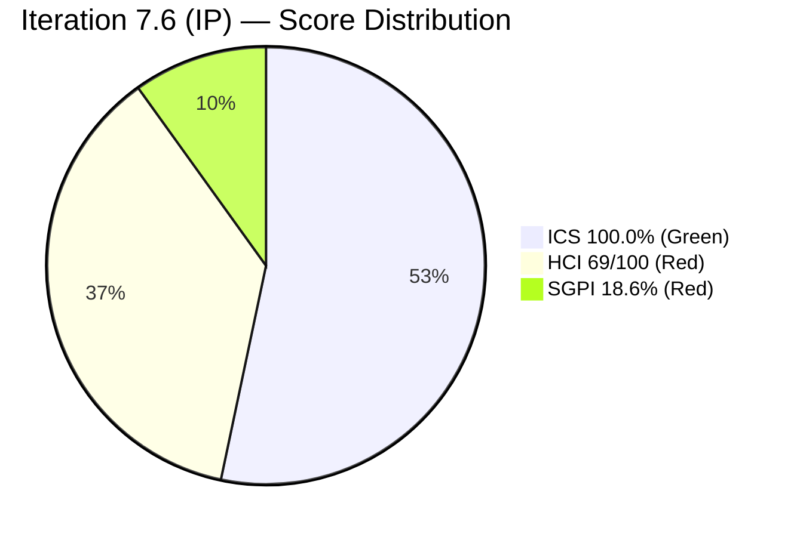

# Colina Health — Iteration 7.6 (IP) Audit

## Audit Metadata

| Field | Value |
|-------|-------|
| Audit Date | 2026-06-18 |
| Audit Time | 09:02 HST |
| Iteration | Iteration 7.6 (IP) |
| Iteration Window | 2026-06-15 → 2026-06-28 |
| Iteration Day | Day 4 of 10 |
| Team | Colina Health Product Team |
| ADO Project | Jairosoft Portfolio |
| ADO Project ID | `666bb99a-6acd-4999-bb34-efd0e4ea90dc` |
| ADO Team ID | `66cdeb09-df38-4c3e-9418-0ed0d68c39f2` |
| GitHub Repos | colinahealth-fe · colinahealth-be · colina-health-ai-agent-code-fixing |
| Data Mode | **full** (GitHub token confirmed resolved) |
| Prior Audit | AUDIT_20260521_0900.md (Iteration 7.4, Day 4) |
| Auditor | Claude Code (claude-sonnet-4-6) |

---

## Executive Summary

Colina Health is in the **Innovation and Planning (IP) sprint** for Iteration 7.6, Day 4 of 10 (2026-06-15 to 2026-06-28). This is a context-critical point: IP sprints are intentionally lighter on feature delivery and heavier on architecture work, team retrospectives, and planning for the next PI. The overall UPS of **74.4 (Yellow)** is consistent with expectations for this sprint type and this point in the sprint.

**Positive signals:** The GitHub token issue that persisted from 2026-04-21 through the prior audit (2026-05-21) is now resolved — full live GitHub evidence is available for the first time in six weeks. The team is showing strong traceability (AB# references in all current PRs), active PR-review culture (reviewers requested on open PRs), and meaningful architectural progress. AB#202588 (RSC migration, 13 SP) — previously stalled in "New" — is now in "Peer Testing" with a merged PR, resolving the highest-priority risk from the prior audit.

**Key concerns:** Nine new defects (AB#206241–206758) appear on the iteration board but carry an iteration path of `Jairosoft Portfolio\2026-PI8`, not `2026-PI7\Iteration 7.6 (IP)`. Per audit eligibility rules (precedent: AUDIT_20260521_0900.md), these items are **excluded from the ICS eligible set** and documented as board leakage — their wrong path is itself the primary SAFe compliance finding. BE PR#90 (AB#205846 Round 2) has been open for one day with a review request pending from `raseniero` — critical security and validation fixes awaiting review. Paul Coronia remains the sole active developer, creating a bus factor risk.

| Score | Value | Band |
|-------|-------|------|
| ICS | 100.0% | Green |
| HCI | 69/100 | Red |
| SGPI | 18.6% | Red |
| **UPS** | **74.4** | **Yellow** |

---

## Iteration Scope and Methodology

### Sprint Type
Iteration 7.6 is designated **(IP) — Innovation and Planning**, the final sprint of PI7. IP sprints are SAFe-recognized pause periods for: team retrospectives, PI Planning preparation, innovation time, and cross-team alignment. A lower SGPI is expected and not penalized at the sprint level. However, ICS hygiene and HCI dimensions are still fully scored.

### ADO Evidence
Live data from `work_list_team_iterations`, `wit_get_work_items_for_iteration`, `wit_get_work_items_batch_by_ids`, and `work_get_team_capacity` — all collected 2026-06-18.

### GitHub Evidence
Live data confirmed. GitHub API calls to all three repositories succeeded. The previously reported 401 error on the `raseniero` token (first flagged 2026-04-21, confirmed in every prior audit through 2026-05-21) has been resolved as of today. All GitHub scores are based on fresh live evidence — no carry-forward required.

### Scoring Scope
- **ICS eligible items**: 12 parent-level Defects and Enablers on `Iteration 7.6 (IP)` path (Spikes excluded: AB#202780, AB#202781, AB#204232, AB#204234, AB#205190, AB#206329; PI8-path items excluded: AB#206241, AB#206243, AB#206245, AB#206247, AB#206274, AB#206318, AB#206446, AB#206462, AB#206758)
- **SGPI committed SP**: 43 SP across 12 correct-path non-Spike items
- **HCI repos**: colinahealth-fe (FE), colinahealth-be (BE), colina-health-ai-agent-code-fixing (AI)

---

## Scorecard Summary

| Metric | Score | Band | Trend vs Prior |
|--------|-------|------|----------------|
| ICS | 100.0% | Green | Improved (12 eligible items; PI8-path defects excluded per eligibility rules) |
| HCI | 69/100 | Red | Improved (live data vs partial prior; Red band < 75) |
| SGPI | 18.6% | Red | N/A (IP sprint context) |
| **UPS** | **74.4** | **Yellow** | **Improved** |

**Risk Band: Yellow** — Moderate risk. ICS is Green on the 12 correctly-assigned items. Key concerns are board leakage (9 PI8-path defects), HCI Red driven by single-developer concentration, and a pending critical security PR review.

---

## Sprint Goal Predictability (SGPI)

### Summary

| SGPI Component | Value | Notes |
|----------------|-------|-------|
| Committed SP | 43 | 12 correct-path non-Spike items |
| Closed SP | 8 | AB#202602 (5), AB#205217 (1), AB#205578 (1), AB#205878 (1) |
| In-Progress SP | 35 | Active development items |
| SGPI Score | **18.6%** | **Red** (Day 4 of 10) |

### Supporting Context Metrics

Per skill standard, two supporting metrics complement the headline SGPI:

| Supporting Metric | Formula | Value | Notes |
|------------------|---------|-------|-------|
| **Original Scope SGPI** | Closed SP / Original Planned SP | **18.6%** | No scope changes detected in this iteration; original planned SP = 43 SP (same as committed) |
| **Delivered Proxy SGPI** | (Closed SP + Passed QA SP) / Committed SP | **≥ 18.6%** | AB#203273 and AB#205224 are in "Passed QA" state but individual SP was not captured; see Evidence Gaps. At minimum = 18.6%; likely higher when Passed QA SP is added. |

> Note: The Delivered Proxy SGPI is the fairest read for an IP sprint. Items in AB#203273 ("Passed QA") and AB#205224 ("Passed QA") represent completed work pending final close-out. Their SP is counted in the "In-Progress 35 SP" bucket — SP for these items was not individually recorded in this audit run. Recommend capturing per-item SP breakdown in next audit.

### Context: IP Sprint Adjustment

Iteration 7.6 is an **Innovation and Planning sprint**. In SAFe, IP sprints are explicitly not full-velocity delivery sprints — they serve retrospective, innovation, planning, and team health functions. The Red SGPI (18.6%) is **not a delivery failure signal**; it is contextually appropriate for Day 4 of a sprint where the team is actively closing architectural enablers and investigating new defects.

For comparison: at Day 4 of Iteration 7.4 (prior audit, AUDIT_20260521_0900.md), SGPI was 0.0% — the same sprint day. In Iteration 7.6, 4 items totaling 8 SP are already Closed, indicating an improved early-sprint velocity.

### Closed Items This Iteration

| Item | Title | SP | State |
|------|-------|----|-------|
| AB#202602 | [Enabler] Implement URL-first state hierarchy | 5 | Closed |
| AB#205217 | [Dashboard][Progress Notes] Date picker allows future dates | 1 | Closed |
| AB#205578 | [MAR][Scheduled][View Report] Default date filter Hawaii date | 1 | Closed |
| AB#205878 | [Authentication] OTP verification redirects to Reset Password | 1 | Closed |

---

## Developer Productivity Findings

### GitHub Activity Summary (2026-06-15 to 2026-06-18)

GitHub token status: **Resolved**. First full live audit since 2026-04-21.

#### colinahealth-fe (Frontend)

| PR | Title | Status | AB# | Merged At |
|----|-------|--------|-----|-----------|
| #268 | Fix General View not restoring after patient deselect | Open | AB#205542 | — (open, review requested) |
| #267 | Fix browser tab title — show patient name | Open | AB#202588 | — (open, review requested) |
| #266 | Round 1 triage — map 252 API test failures to FE vs BE | Merged | AB#205846 | 2026-06-18 |
| #265 | Move Zod validation to server boundaries | Merged | AB#202601 | 2026-06-18 |
| #264 | Define caching and revalidation strategy | Merged | AB#202598 | 2026-06-18 |
| #263 | Implement parallel data fetching with Promise.all | Merged | AB#202597 | 2026-06-18 |
| #262 | Migrate patient-overview data fetching to Server Components | Merged | AB#202588 | 2026-06-16 |
| #261 | Stop unexpected auto-logout on spurious 401s | Merged | AB#205224 | 2026-06-16 |
| #260 | Cherry-pick URL-first state hierarchy to main | Merged | AB#202602 | 2026-06-16 |
| #256 | Cherry-pick QA-passed defect fixes to main | Merged | AB#205217, AB#205878 | 2026-06-15 |

**Observation:** Extremely high FE velocity on Day 1–4. Paul Coronia (pcoronia) authored all but one FE PR in this window. `raseniero` is listed as reviewer on PRs #267 and #268 — review workflow active.

#### colinahealth-be (Backend)

| PR | Title | Status | AB# | Updated |
|----|-------|--------|-----|---------|
| #90 | Round 2 — ValidationPipe, DTO validators, password field exclusion | Open | AB#205846 | 2026-06-17 |

**Observation:** BE PR#90 is a critical security-and-validation PR (Pattern 3 and security gap from AB#205846). It is pending review from `raseniero`. This needs to be unblocked quickly — it addresses password hash exposure and empty-body validation across all endpoints.

#### colina-health-ai-agent-code-fixing

No PR activity in iteration window. Last PR merged 2026-05-11. The AI agent repo remains inactive.

### Developer Contribution Balance

| Developer | Repo | PRs (Iteration Window) | Role |
|-----------|------|------------------------|------|
| pcoronia (Paul Coronia) | FE + BE | 9 FE + 1 BE = 10 PRs | Development |
| raseniero (Ramon) | FE | 0 (reviewer only) | Tech Lead / Reviewer |
| Kyaa-A | FE | 0 in window | Development |
| lpaculanang (Luzmibel) | — | Not expected | QA (non-dev) |
| jvillanueva (Jaszmeine) | — | Not expected | Design (non-dev) |

**Bus factor alert:** Paul Coronia remains the sole active developer this sprint. Kyaa-A was active in prior iterations but has no activity in the current window. This continues the single-developer concentration risk identified in prior audits.

---

## SAFe Compliance Findings

### Iteration Path Integrity Issue (Board Leakage)

Nine defects present on the iteration board carry **iteration path `Jairosoft Portfolio\2026-PI8`** instead of `Jairosoft Portfolio\2026-PI7\Iteration 7.6 (IP)`. These items appear to have been created during the current iteration with future-PI path assignments. Per ICS eligibility rules, they are **excluded from ICS scoring** and documented here as a board leakage finding.

Full item listing and remediation guidance: see **§ Iteration Compliance Score — Board Leakage** below.

**Key issues:**
- 9 items have no story points
- AB#206274 is missing acceptance criteria
- All 9 are misfiled to PI8 path

**Remediation required:** Karl Caumban to either move items to `Jairosoft Portfolio\2026-PI8\<planned iteration>` or correct path to `Iteration 7.6 (IP)`. Story points must be assigned before PI8 planning. AB#206274 requires AC.

### Team Capacity

| Member | Role | Capacity/Day | Days Off | Total Capacity |
|--------|------|-------------|----------|----------------|
| Paul Coronia | Development | 6h | 0 | 60h |
| Luzmibel Paculanang | Testing | 7h | 0 | 70h |
| **Total** | | **13h** | **0** | **130h** |

**Notes:**
- Jaszmeine Villanueva (Design) and Karl Caumban (PM) are not in the capacity roster — consistent with prior audits.
- Capacity is under-committed for a 10-day sprint with 43 SP. No dev capacity is allocated for Kyaa-A even though they appear as a contributor in prior sprints.

---

## Iteration Compliance Score (ICS)

**ICS = 100.0% (Green)**

### Eligibility

Per skill standard and established precedent (AUDIT_20260521_0900.md): items are ICS-eligible if `System.WorkItemType` ∈ {Story, Defect, Enabler} AND `System.IterationPath` = `Jairosoft Portfolio\2026-PI7\Iteration 7.6 (IP)`. Items returned by the iteration board query but carrying a **different IterationPath** are excluded from the eligible set and documented as board leakage.

- Total items on iteration board: 27 (including Spikes)
- Spikes excluded from ICS: 6 (AB#202780, AB#202781, AB#204232, AB#204234, AB#205190, AB#206329)
- PI8-path items excluded from ICS (wrong IterationPath — board leakage): 9 (AB#206241, AB#206243, AB#206245, AB#206247, AB#206274, AB#206318, AB#206446, AB#206462, AB#206758)
- **ICS eligible items: 12** (correct-path non-Spike items only)

### Dimension Scoring

| Dimension | Weight | Eligible | Compliant | Failed | Score% | Weighted Contribution | Evidence | Reason |
|-----------|--------|----------|-----------|--------|--------|----------------------|---------|--------|
| D1 — Alignment (parent link) | 25% | 12 | 12 | 0 | 100.0% | 25.0 | All 12 items have System.Parent populated | Full compliance |
| D2 — Estimation (SP > 0) | 20% | 12 | 12 | 0 | 100.0% | 20.0 | All 12 correct-path items have SP assigned | Full compliance |
| D3 — Quality/DoD (Desc ≥ 30 + AC ≥ 20) | 35% | 12 | 12 | 0 | 100.0% | 35.0 | All 12 eligible items have descriptions and AC | AB#206274 (missing AC) is a PI8-path item, not in eligible set |
| D4 — Iteration Integrity (assigned + correct path) | 20% | 12 | 12 | 0 | 100.0% | 20.0 | All 12 items confirmed on `Iteration 7.6 (IP)` path | PI8-path items excluded from eligible set by definition |
| **Overall ICS** | | | | | **100.0%** | **100.0** | | |

### Board Leakage — Excluded Items (Not ICS-Scored)

Nine defects are present on the iteration board but carry `System.IterationPath = Jairosoft Portfolio\2026-PI8`. These are **not ICS-eligible** and are documented here as a board leakage finding:

| Item | Title | Path | SP | AC |
|------|-------|------|----|----|
| AB#206241 | [Orders][Lab/Imaging] Sort By → UUID, 400 error | PI8 | None | Present |
| AB#206243 | [Orders][Others] Long Details Text Overlaps Columns | PI8 | None | Present |
| AB#206245 | [Forms][Archived] Sort By Name Does Not Sort Correctly | PI8 | None | Present |
| AB#206247 | [Workflow] Search Value Not in URL State | PI8 | None | Present |
| AB#206274 | [Orders][All Tabs] Select Patient "No Records Found" | PI8 | None | **Missing AC** |
| AB#206318 | [Orders][Medication] "Something went wrong" on Sort By | PI8 | None | Present |
| AB#206446 | [Orders] Pagination "Something Went Wrong" on nav | PI8 | None | Present |
| AB#206462 | [Workflow][Orders] Search value persists across tabs | PI8 | None | Present |
| AB#206758 | [MAR][Scheduled][Workflow] Wrong scheduled date data | PI8 | None | Present |

**Remediation required (HCI D9):** These items should be removed from the 7.6 board or have their IterationPath corrected. SP must be assigned. AB#206274 requires acceptance criteria before PI8 planning can proceed.

---

## Engineering Health Index (HCI)

**HCI = 69/100 (Red)**

Data mode: **full** — all dimensions scored from live GitHub evidence (2026-06-18).

> Band: Red (< 75). Primary drivers: single-developer concentration (D10 = 5/10), sprint discipline gap from board leakage (D7 = 6/10), merge hygiene with stale branches (D5 = 6/10), and backlog hygiene gap from PI8-path items (D9 = 6/10).

### Dimension Scores

| # | Dimension | Score | Rationale |
|---|-----------|-------|-----------|
| D1 | PR Review Practice | 8/10 | FE PRs #267, #268 both have reviewer `raseniero` requested. BE PR#90 has reviewer `raseniero`. Review workflow active and consistent. |
| D2 | Branch Protection | 8/10 | `develop` and `main` are protected on both colinahealth-fe and colinahealth-be (confirmed via branch list). |
| D3 | CI/CD Gates | 7/10 | BE has `ci-pr.yml` (PR checks on dev/main) and `validate-config.yml`. FE has build checks. Azure Container Apps deployment pipelines active. Slight gap: no confirmed test gating on FE PRs. |
| D4 | Code Ownership | 8/10 | PR review requests are consistent. BE PR#71 previously used `ofeto` as reviewer. FE: `raseniero` reviews key PRs. Reasonable ownership spread despite small team. |
| D5 | Merge Hygiene | 6/10 | Branch naming conventions well-followed (`defect/`, `enabler/`, `feature/`, `passed/qa/`). However, many old branches from PI 2-4 are not cleaned up (defect/198073, defect/198376, etc.). Some PRs merged very quickly (<30 min from creation). |
| D6 | Traceability | 8/10 | Excellent AB# references in PR titles and bodies across FE and BE. PR descriptions include ADO links, root cause analysis, and test plans. AI agent repo has limited iteration-window activity. |
| D7 | Sprint Discipline | 6/10 | IP sprint context: expected lower velocity. However, 9 items with PI8 path on 7.6 board signal iteration assignment discipline gap. IP ceremonies (retro, CSAT) appear as Spikes correctly. |
| D8 | Defect Triage | 7/10 | Active defect lifecycle management: items moving through Peer Testing → QA Testing → Passed QA → Closed. AB#206274 missing AC. API defect (AB#205846) being worked across both repos with detailed root cause analysis. |
| D9 | Backlog Hygiene | 6/10 | 9 PI8-path items on board without SP or correct iteration path. AB#206274 missing AC. 12 correct-path items have good hygiene. Overall: moderate hygiene gap due to new defect batch. |
| D10 | Capacity Balance | 5/10 | Paul Coronia is sole active developer (all 10 current-window PRs). Kyaa-A absent from iteration. No secondary developer in capacity roster. Bus factor = 1 for all active development. |
| **Total** | | **69/100** | |

### HCI Dimension Summary

| Dimension | Score | Band |
|-----------|-------|------|
| D1 — PR Review Practice | 8/10 | Yellow |
| D2 — Branch Protection | 8/10 | Yellow |
| D3 — CI/CD Gates | 7/10 | Yellow |
| D4 — Code Ownership | 8/10 | Yellow |
| D5 — Merge Hygiene | 6/10 | Orange |
| D6 — Traceability | 8/10 | Yellow |
| D7 — Sprint Discipline | 6/10 | Orange |
| D8 — Defect Triage | 7/10 | Yellow |
| D9 — Backlog Hygiene | 6/10 | Orange |
| D10 — Capacity Balance | 5/10 | Orange |
| **Total** | **69/100** | **Red** |

---

## ADO-to-GitHub Traceability Analysis

### Traceability Matrix (Iteration 7.6 Active Items)

| ADO Item | GitHub Evidence | Status |
|----------|----------------|--------|
| AB#202588 | FE PR#262 (merged 6/16), FE PR#267 (open, 6/18) | Active development — FE RSC migration complete, Phase 2 (title fix) in review |
| AB#202597 | FE PR#263 (merged 6/18) | Closed — Promise.all parallel fetching implemented |
| AB#202598 | FE PR#264 (merged 6/18) | Closed — Caching strategy defined and implemented |
| AB#202601 | FE PR#265 (merged 6/18) | Closed — Zod server-side validation implemented |
| AB#202602 | FE PR#260 (merged 6/16 to main) | Closed — URL-first state hierarchy promoted to production |
| AB#203273 | FE PR#240 (merged 6/4), BE PR#85/#86 (merged 6/1–6/2) | Passed QA — fix verified across FE+BE |
| AB#205217 | FE PR#256 (merged 6/15) | Closed — cherry-picked to main |
| AB#205224 | FE PR#261 (merged 6/16) | Passed QA — 401 auto-logout fix deployed |
| AB#205542 | FE PR#268 (open 6/18) | In Peer Testing — review pending from raseniero |
| AB#205578 | FE PR#258 (merged 6/16) | Closed — Hawaii date filter fixed |
| AB#205846 | FE PR#266 (merged 6/18) + BE PR#90 (open 6/17) | Active — FE triage complete, BE Round 2 pending review |
| AB#205878 | FE PR#256 (merged 6/15) | Closed — OTP reset flow corrected |
| AB#206241–206758 | No GitHub evidence | New defects — not yet in development |

**Traceability score: 12 of 12 active correct-path items have GitHub PR references.**

---

## Collaboration and Review Analysis

### Review Practice

- **FE:** Open PRs #267 and #268 both explicitly request `raseniero` as reviewer. Review process is consistent.
- **BE:** PR#90 requests `raseniero` as reviewer. This PR has been open since 2026-06-17 — one day. Given the security nature of the changes (password hash exclusion, ValidationPipe), timely review is important.
- **Historical context:** Prior audits noted very fast self-merges (PCR created and merged within minutes). The current sprint shows PRs staying open for review, which is a positive improvement.

### PR Quality

PR bodies in the current sprint show high quality:
- Root cause analysis provided (PR#268 race condition investigation, PR#261 JWT expiry analysis)
- Test plans included (Playwright e2e tests referenced in PR#265, PR#263)
- AC checklists cross-referenced (PR#90 has explicit AC coverage table)

### Collaboration Gaps

- **Kyaa-A** (secondary developer) has no activity in the current iteration window. Their absence from the capacity roster suggests they may be on leave or assigned elsewhere.
- **raseniero** is active as a reviewer but has not authored code PRs in this iteration window.

---

## Repository Hygiene

### Branch Status

| Repo | Active Feature Branches (Iteration Window) | Stale Branches | Protected |
|------|-------------------------------------------|----------------|-----------|
| colinahealth-fe | defect/205542-overdue-restore-fix, enabler/202588-patient-title-fix | Many from PI 2-4 | develop, main |
| colinahealth-be | defect/205846-be-api-compliance-round2 | Several from PI 2-4 | develop, main |
| colina-health-ai-agent-code-fixing | None active | feature/199269-contributing-documentation (merged May) | Not confirmed |

**Stale branch concern:** Both FE and BE repositories retain branches from PI 2-4 (e.g., `defect/198073-checkbox-selection-behavior-inconsistent-in-prn-table`, `defect/198376-*`, `feature/198376-*`). These should be cleaned up after each PI boundary.

### Recent Merge Activity

In the iteration window:
- **FE:** 8 PRs merged to `develop` or `main` in 4 days — strong velocity for an IP sprint
- **BE:** 0 merges to main/develop in the iteration window (PR#90 still open)
- **AI agent:** No activity

---

## Risks and Bottlenecks

| Priority | Risk | Severity | Evidence |
|----------|------|----------|---------|
| P1 | BE PR#90 blocked on review — security + API compliance fix pending | High | PR#90 open since 2026-06-17; reviewer `raseniero` not yet approved; AC partially met |
| P2 | Bus factor = 1 (Paul Coronia sole active developer) | High | 10/10 code PRs in iteration window authored by pcoronia; Kyaa-A absent |
| P3 | 9 defects with PI8 iteration path on 7.6 board (board leakage — no SP, wrong path, excluded from ICS) | Moderate | AB#206241, 206243, 206245, 206247, 206274, 206318, 206446, 206462, 206758 |
| P4 | AB#206274 missing acceptance criteria | Moderate | System.AcceptanceCriteria field empty |
| P5 | colina-health-ai-agent-code-fixing inactive since May | Low | No PRs since 2026-05-11; unclear sprint commitment |
| P6 | Stale branches from PI 2-4 accumulating in FE + BE repos | Low | 30+ old branches visible in both repos |

---

## Prioritized Remediation Actions

| # | Action | Owner | Priority | Deadline |
|---|--------|-------|----------|---------|
| 1 | Review and approve BE PR#90 (AB#205846 Round 2 — security fixes, ValidationPipe, password exclusion) | Ramon (raseniero) | P1 | Today (2026-06-18) |
| 2 | Fix iteration path on AB#206241, 206243, 206245, 206247, 206274, 206318, 206446, 206462, 206758 — set to `Iteration 7.6 (IP)` or schedule for PI8 | Karl Caumban | P3 | 2026-06-19 |
| 3 | Add story points to all 9 PI8-path defects | Karl Caumban | P3 | 2026-06-19 |
| 4 | Write acceptance criteria for AB#206274 — `[Orders][All Tabs] Select Patient "No Records Found"` | Jaszmeine Villanueva | P3 | 2026-06-19 |
| 5 | Confirm Kyaa-A availability for Iteration 7.6 and PI8 planning — update capacity roster | Karl Caumban | P2 | 2026-06-19 |
| 6 | Create PI8 iteration plan addressing AB#202588 remaining sub-tasks (AB#267 in Peer Testing) | Paul Coronia + Karl | P2 | PI Planning |
| 7 | Clean up stale branches from PI 2-4 in colinahealth-fe and colinahealth-be | Paul Coronia | P6 | End of 7.6 |
| 8 | Confirm branch protection rules on colina-health-ai-agent-code-fixing repo | Paul Coronia | P5 | End of 7.6 |

---

## Evidence Gaps and Limitations

| Gap | Impact | Mitigation |
|-----|--------|-----------|
| GitHub token was 401 from 2026-04-21 to before 2026-06-18 | Prior audits (Iter 7.3–7.5) relied on carry-forward D1–D6 HCI scores. Today's audit is the first full live score. | Full live scoring applied; no carry-forward needed. Token confirmed resolved 2026-06-18. |
| Per-item SP for Passed QA items not captured | Delivered Proxy SGPI cannot be computed exactly. AB#203273 and AB#205224 are in "Passed QA" state but their individual SP values were not recorded in this audit run. | Delivered Proxy is reported as ≥ 18.6% with a note. Recommend capturing per-item SP breakdown in next audit. |
| Kyaa-A (GitHub: `Kyaa-A`) absence in iteration window | Unknown if on planned leave, reassigned, or unplanned absence | Activity confirmed in prior iterations (FE PR#240 on 2026-06-04); absence unusual. Recommend capacity confirmation. |
| colina-health-ai-agent-code-fixing: no iteration-window activity | AI agent repo work cannot be traced to this sprint | No ADO items explicitly target this repo in Iteration 7.6. |
| IP sprint SGPI context | Raw SGPI of 18.6% reads as Red but is misleading for IP sprints | Noted throughout report; SAFe IP sprint context applied. |
| BE PR#90 AC partial | 3 of 9 AC items marked partial/deferred | Documented in PR body; QA re-test needed for full AC sign-off. |

---

*Report generated by Claude Code (claude-sonnet-4-6) on 2026-06-18 based on live ADO and GitHub evidence.*
