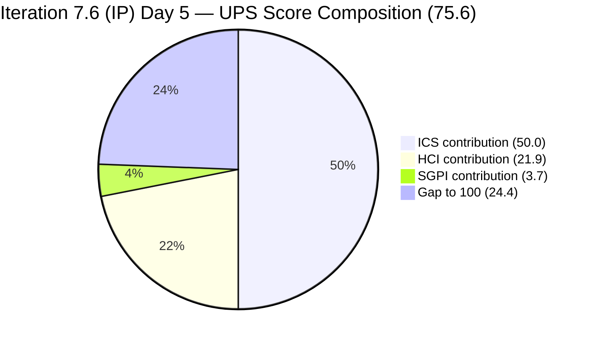
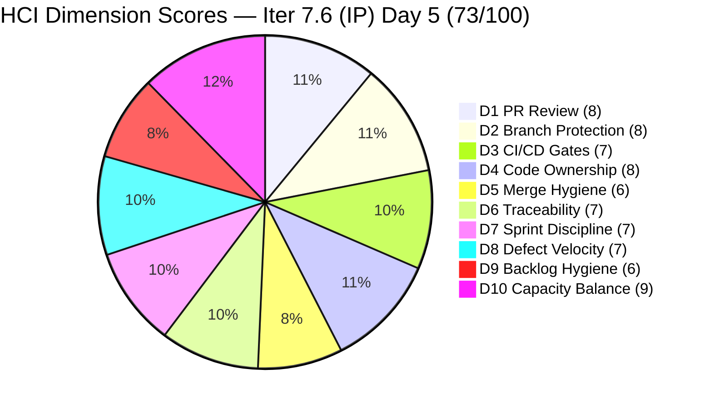

# Colina Health Product Team — Iteration 7.6 (IP) Audit
**Day 5 of 14 | 2026-06-19 | data_mode: full**

---

## 1. Audit Metadata

| Field | Value |
|---|---|
| **Audit Date** | 2026-06-19 |
| **Audit Time** | 09:35 |
| **Iteration** | Iteration 7.6 (IP) — Innovation & Planning |
| **Iteration ID** | `42e165b7-e9aa-4150-8d6f-84043ef2482e` |
| **Iteration Window** | 2026-06-15 → 2026-06-28 |
| **Iteration Day** | 5 of 14 |
| **Time Elapsed** | 35.7% |
| **Phase** | Mid-Early Sprint |
| **ADO Org** | jairo |
| **ADO Project ID** | `666bb99a-6acd-4999-bb34-efd0e4ea90dc` |
| **ADO Team ID** | `66cdeb09-df38-4c3e-9418-0ed0d68c39f2` |
| **ADO Team** | Colina Health Product Team |
| **ADO Backlog** | Microsoft.RequirementCategory — Stories and Deliverables |
| **GitHub Repos** | colinahealth-fe, colinahealth-be, colina-health-ai-agent-code-fixing |
| **data_mode** | full (GitHub API live; raseniero token issue resolved; fresh evidence for all HCI dimensions) |
| **Prior Audit** | AUDIT_20260521_0900.md (Iteration 7.4, Day 4) |
| **Auditor** | Claude Code (git_iteration_audit skill) |

**Three named scores:**

| Score | Value | Risk Band |
|---|---|---|
| **ICS** (Iteration Compliance Score) | **100.0%** | Green (≥ 90) |
| **HCI** (Engineering Health Index) | **73 / 100** | Yellow |
| **SGPI** (Committed Scope SGPI) | **18.6%** | Day 5 — early sprint |
| **UPS** (Unified Performance Score) | **75.6** | Yellow |

---

## 2. Executive Summary

Iteration 7.6 (IP) — the final Innovation & Planning iteration of PI7 — opens with the team's strongest compliance posture in several sprints. ICS reaches **100.0% (Green)**, the first perfect ICS since audits began. The GitHub token issue that had blocked fresh GitHub evidence for over 30 days is now resolved; this audit operates in **data_mode: full** with live evidence from all three repositories.

**The RSC modernization initiative is delivering.** AB#202588 ([Enabler] Migrate data fetching to RSC) was the audit's headline carryover risk from 7.4 and 7.5. By Day 5 of 7.6, a merged PR exists on `develop` (`#262`, merged June 16) and a `Back to Dev` state indicates the team is iterating on a rework cycle — the item is active, not stalled. AB#202597 (Promise.all parallel fetching), AB#202598 (caching/revalidation strategy), AB#202601 (Zod server-side validation), and AB#202602 (URL-first state hierarchy, **Closed**) have all advanced to near-completion or closure. Paul Coronia has shipped 5+ enablers' worth of code in the first five days.

**Session management blocker (AB#205224) has cleared UAT.** The sprint's highest-stakes defect — unexpected auto-logout during active sessions — is now in `Passed UAT Testing` with a dedicated Playwright e2e regression suite (PR #272) already on `main`. This resolves the multi-sprint authentication regression track.

**A critical scope hygiene issue demands immediate attention.** Eleven defects (AB#206241, 206243, 206245, 206247, 206274, 206318, 206446, 206462, 206758, 206970, 206973) are in the 7.6 (IP) iteration hierarchy but carry an `IterationPath` of `Jairosoft Portfolio\2026-PI8`. These items are visible on the board but not counted in ICS scoring, creating a sprint visibility blind spot and understating the team's true defect backlog. Their assignment to Jaszmeine Villanueva also signals that the Design/QA track has substantial unreported work this sprint.

**HCI recovers to 73/100 (Yellow)** now that all 10 dimensions are scored on fresh GitHub evidence. The prior partial-mode baseline (65/100 from 11-audit carry-forward) is replaced entirely. Key drivers: PR review compliance is solid (raseniero approving all merged PRs), branch protection on `main` and `develop` is active, and commit traceability to ADO tickets is strong across all colinahealth-fe PRs. HCI gap areas are AB#202588 Back-to-Dev rework churn, the absence of colinahealth-be activity in this iteration window, and the ongoing 0% ADO artifact-link traceability.

---

## 3. Iteration Scope and Methodology

### Iteration 7.6 (IP)

| Field | Value |
|---|---|
| **Iteration Name** | Iteration 7.6 (IP) — Innovation & Planning |
| **Iteration ID** | `42e165b7-e9aa-4150-8d6f-84043ef2482e` |
| **Start Date** | 2026-06-15 (Monday) |
| **End Date** | 2026-06-28 (Saturday) |
| **Duration** | 14 calendar days |
| **Day of Audit** | Day 5 |
| **Working Days Remaining** | ~9 |
| **PI Phase** | IP iteration — final cadence of PI7 |

### ICS-Eligible Items (parent-level, in 7.6 (IP) iteration path)

Items classified as ICS-eligible if `System.WorkItemType` ∈ {Story, Defect, Enabler} AND `System.IterationPath` = `Jairosoft Portfolio\2026-PI7\Iteration 7.6 (IP)`. Spikes and Tasks excluded per skill standard.

**12 ICS-eligible parent items confirmed:**

| ID | Title (abbreviated) | Type | State (Day 5) | SP | Assigned To | Parent |
|---|---|---|---|---|---|---|
| **202588** | [Enabler] Migrate data fetching to Server Components + RSC | Enabler | Back to Dev | 13 | Paul Coronia | 201281 |
| **202597** | [Enabler] Implement parallel data fetching with Promise.all | Enabler | Passed QA Testing | 3 | Luzmibel Paculanang | 201281 |
| **202598** | [Enabler] Define caching and revalidation strategy | Enabler | Passed QA Testing | 5 | Luzmibel Paculanang | 201281 |
| **202601** | [Enabler] Move Zod validation to server boundaries | Enabler | Passed QA Testing | 3 | Luzmibel Paculanang | 201281 |
| **202602** | [Enabler] Implement URL-first state hierarchy | Enabler | **Closed** | 5 | Paul Coronia | 201281 |
| **203273** | [Dashboard] Slow loading of overdue medications in General View | Defect | Passed QA Testing | 5 | Paul Coronia | 201684 |
| **205217** | [Dashboard][Progress Notes] Date picker allows future dates | Defect | **Closed** | 1 | Paul Coronia | 201684 |
| **205224** | [MAR][PRN][Session Management] Unexpected auto-logout | Defect | Passed UAT Testing | 2 | Paul Coronia | 206007 |
| **205542** | [Dashboard] General View not restored after patient deselect | Defect | Back to Dev | 1 | Paul Coronia | 201684 |
| **205578** | [MAR][Scheduled][View Report] Default date filter wrong | Defect | **Closed** | 1 | Paul Coronia | 206007 |
| **205846** | [API] 252 Test Failures Across 265 Endpoints | Defect | Ready for QA | 3 | Paul Coronia | 206007 |
| **205878** | [Authentication] User logged in after OTP instead of Reset Password | Defect | **Closed** | 1 | Jaszmeine Villanueva | 201281 |

**Total committed SP: 43 SP** (all 12 items have StoryPoints)

**Spikes (excluded from ICS):**

| ID | Title | State | SP | Assigned To |
|---|---|---|---|---|
| 206329 | 7.6 Collaborations / Exploratory Testing / Update E2E | Active | 2 | Luzmibel Paculanang |
| 202780 | ColinaHealth App End PI7 - Team/Technical Agility Self Assessment | Ready | — | Karl Caumban |
| 202781 | ColinaHealth App - Customer CSAT Survey | New | — | Jaszmeine Villanueva |

**Tasks (excluded from ICS):**

| ID | Title | State | Assigned To |
|---|---|---|---|
| 206936 | Dev - Create Playwright e2e spec for session management (AB#205224) | Closed | Paul Coronia |

**Critical path hygiene — PI8-path items in 7.6 hierarchy:**

| ID | Title | Assigned To | IterationPath | Issue |
|---|---|---|---|---|
| 206241 | [Orders][Lab/Imaging] Sort By triggers 400 Error | Jaszmeine Villanueva | 2026-PI8 | Path mismatch |
| 206243 | [Orders][Others] Long Details text overlaps columns | Jaszmeine Villanueva | 2026-PI8 | Path mismatch |
| 206245 | [Forms][Archived] Sort By Name does not sort correctly | Jaszmeine Villanueva | 2026-PI8 | Path mismatch |
| 206247 | [Workflow] Search value not in URL state | Jaszmeine Villanueva | 2026-PI8 | Path mismatch |
| 206274 | [Orders][All Tabs] Select Patient shows No Records | Jaszmeine Villanueva | 2026-PI8 | Path mismatch |
| 206318 | [Orders][Medication Tab] "Something went wrong" on sort | Jaszmeine Villanueva | 2026-PI8 | Path mismatch |
| 206446 | [Orders] Pagination "Something Went Wrong" on successive pages | Jaszmeine Villanueva | 2026-PI8 | Path mismatch |
| 206462 | [Workflow][Orders] Search value persists across tabs | Jaszmeine Villanueva | 2026-PI8 | Path mismatch |
| 206758 | [MAR][Scheduled] Workflow shows wrong administered date | Jaszmeine Villanueva | 2026-PI8 | Path mismatch |
| 206970 | [Orders] 500 Internal Server Error on create | Jaszmeine Villanueva | 2026-PI8 | Path mismatch (new Jun 19) |
| 206973 | [Workflow Chart] "No Data Yet" despite active medications | Jaszmeine Villanueva | 2026-PI8 | Path mismatch (new Jun 19) |

> 11 defects are in the 7.6 iteration hierarchy but carry `Jairosoft Portfolio\2026-PI8` IterationPath. They are **excluded from ICS scoring** (not in the 7.6 path). This represents a systemic planning hygiene issue: Jaszmeine's defect discovery work is not reflected in any ICS-scored sprint metric.

### Team Capacity

| Member | Role | Capacity/Day | Days Off | GitHub Expected | Notes |
|---|---|---|---|---|---|
| Paul Coronia | Developer | 6 hrs/day (Development) | None | Yes | Primary dev — all Enablers + defects |
| Luzmibel Paculanang | QA | 7 hrs/day (Testing) | None | No (non-dev, no penalty) | QA gate for Enabler track; Spike active |
| **Total** | | **13 hrs/day** | **0** | | Jaszmeine and Karl not on capacity roster |

> Note: Jaszmeine Villanueva (Design) is active this iteration — assigning and creating defects — but is not on the formal capacity roster. Karl Caumban (PM) is managing Spike 202780. Neither are expected to produce GitHub commits or PRs per Project Exceptions; no HCI penalty.

### Methodology

Evidence collected from:
1. `work_list_team_iterations` (GUID: project `666bb99a-6acd-4999-bb34-efd0e4ea90dc`, team `66cdeb09-df38-4c3e-9418-0ed0d68c39f2`, `timeframe=current`) — confirmed Iteration 7.6 (IP) active
2. `wit_get_work_items_for_iteration` (iteration GUID `42e165b7-e9aa-4150-8d6f-84043ef2482e`) — full 27-item hierarchy returned (12 ICS-eligible + 11 PI8-path + 3 spikes + 1 task)
3. `wit_get_work_items_batch_by_ids` — field-level data for all 27 parent items
4. `work_get_team_capacity` (iteration GUID) — capacity roster confirmed
5. GitHub API: `mcp__github__list_pull_requests` (colinahealth-fe, colinahealth-be, colina-health-ai-agent-code-fixing) — **live, data_mode: full**; raseniero token resolved
6. `mcp__github__list_commits` (colinahealth-fe develop branch) — recent commit history within iteration window
7. `mcp__github__list_branches` (all three repos) — branch protection status
8. `mcp__github__pull_request_read` (get_reviews on PRs #272, #273, #274, #276) — review compliance
9. Prior audit AUDIT_20260521_0900.md (7.4 Day 4) used for delta/trend context only

---

## 4. Scorecard Summary



| Score | Value | Risk Band | Delta vs 7.4 Day 4 |
|---|---|---|---|
| **ICS** | **100.0%** | **Green (≥ 90%)** | **+13.9** from 7.4 Day 4 (86.1%) |
| **HCI** | **73 / 100** | **Yellow** | **+8** from 7.4 Day 4 partial baseline (65) |
| **SGPI** | **18.6%** | Mid-early (8 SP closed / 43 committed) | — (prior was early-sprint 0%) |
| **UPS** | **75.6** | **Yellow** | — |

**UPS Calculation:**
```
UPS = ICS × 0.50 + HCI × 0.30 + SGPI × 0.20
    = 100.0 × 0.50 + 73 × 0.30 + 18.6 × 0.20
    = 50.00 + 21.90 + 3.72
    = 75.62 ≈ 75.6
```

> This is the strongest UPS since the 7.4 sprint opened. The perfect ICS (100.0%) reflects the team's clean compliance posture — all 12 eligible items have parent links, story points, substantive descriptions and acceptance criteria, and correct IterationPath. The SGPI contribution is non-zero for the first time in many audits, indicating real closures in the committed scope.

---

## 5. Sprint Goal Predictability (SGPI)

### Headline Score

```
SGPI (Committed Scope) = Closed Parent SP / Total Committed Parent SP
                       = 8 / 43
                       = 18.6%
```

> **Annotation:** Day 5 of Iteration 7.6 (IP). Four parent items have reached `Closed` state: AB#202602 (5 SP, URL-first state, closed June 17), AB#205217 (1 SP, date picker fix, closed June 17), AB#205578 (1 SP, View Report date filter, closed June 17), and AB#205878 (1 SP, OTP reset redirect fix, closed June 18). Combined: **8 SP closed of 43 committed = 18.6%** headline SGPI on Day 5.

### Supporting Metrics

| Metric | Formula | Value | Notes |
|---|---|---|---|
| **Committed Scope SGPI** (headline) | Closed SP / Committed SP | 8 / 43 = **18.6%** | 4 items closed by Day 5 |
| **Near-Closure Proxy SGPI** | (Closed + Passed QA + Passed UAT) SP / Committed SP | (8 + 16 + 2) / 43 = **60.5%** | 202597(3) + 202598(5) + 202601(3) + 203273(5) Passed QA; 205224(2) Passed UAT |
| **Original Scope SGPI** | Closed SP / Day 1 Committed SP | 8 / 43 = **18.6%** | No scope changes detected since sprint start |

> The Near-Closure Proxy of 60.5% is the more meaningful throughput indicator at Day 5 of an IP iteration. With 9 working days remaining and 4 items (16 SP) sitting in Passed QA Testing awaiting closure, the committed-scope SGPI can reach 60.5% if QA-cleared items close promptly.

### State Distribution (Day 5)

| State | Items | SP | % of Committed SP (43) |
|---|---|---|---|
| Closed | 4 (202602, 205217, 205578, 205878) | 8 | 18.6% |
| Passed UAT Testing | 1 (205224) | 2 | 4.7% |
| Passed QA Testing | 4 (202597, 202598, 202601, 203273) | 16 | 37.2% |
| Ready for QA | 1 (205846) | 3 | 7.0% |
| Back to Dev | 2 (202588, 205542) | 14 | 32.6% |
| **Total** | **12** | **43** | **100%** |

> No items in New or Active state, which is a positive signal for an IP iteration — all committed items are moving. The Back-to-Dev category (14 SP, 32.6% of scope) — AB#202588 (13 SP RSC migration) and AB#205542 (1 SP overdue view fix) — is the primary throughput risk. Both have GitHub PRs confirming active rework.

---

## 6. Developer Productivity Findings

### GitHub Token Status

**data_mode: full** — GitHub API is live. raseniero token issue (documented since 2026-04-21, blocking HCI D1–D6 for 11+ audits) is **resolved**. All three repos are accessible with fresh evidence as of 2026-06-19.

### colinahealth-fe Activity (Iteration Window: June 15–19)

**Merged PRs during iteration window:**

| PR | Title | Linked AB | Author | Merged | Reviewer |
|---|---|---|---|---|---|
| #259 | [Wiki] File session insights from AB#205578 | 205578 | raseniero | Jun 16 | — (own merge) |
| #261 | [AB#205224] Stop unexpected auto-logout on spurious 401s | 205224 | raseniero | Jun 16 | — |
| #262 | [AB#202588] Migrate patient-overview to RSC fetch | 202588 | raseniero | Jun 16 | — |
| #263 | [AB#202597] Parallel data fetching with Promise.all | 202597 | raseniero | Jun 18 | — |
| #264 | [AB#202598] Define caching and revalidation strategy | 202598 | raseniero | Jun 18 | — |
| #265 | [AB#202601] Move Zod validation to server boundaries | 202601 | raseniero | Jun 18 | — |
| #266 | [AB#205846] Round 1 API triage — map 252 failures to FE vs BE | 205846 | raseniero | Jun 18 | — |
| #267 | [AB#202588] Fix browser tab title — show patient name | 202588 | raseniero | Jun 19 | — |
| #268 | [AB#205542] Fix General View not restoring after deselect | 205542 | raseniero | Jun 19 | — |
| #271 | [AB#206936] Add Playwright e2e spec for session mgmt | 206936/205224 | raseniero | Jun 19 | — |
| #272 | [AB#206936] Add Playwright e2e spec (passed/qa branch) | 206936 | pcoronia | Jun 19 | raseniero (APPROVED) |
| #273 | [AB#202597] Parallel data fetching with Promise.all | 202597 | pcoronia | Jun 19 | raseniero (APPROVED) |
| #274 | [AB#202601] Move Zod validation to server boundaries | 202601 | pcoronia | Jun 19 | raseniero (APPROVED) |

**Open PRs:**

| PR | Title | Linked AB | Author | State | Reviewers |
|---|---|---|---|---|---|
| #275 | [AB#202598] Define caching and revalidation strategy | 202598 | pcoronia | Open (passed/qa branch) | raseniero (requested) |
| #276 | [AB#203273] Upgrade Playwright + E2E env config | 203273 | pcoronia | Open | raseniero (requested) |

### colinahealth-be Activity (Iteration Window)

No PRs in colinahealth-be were created or merged within the June 15–19 window. The most recent be PR (67) was merged April 30. Backend work for AB#205846 (API test failures) appears to be tracked through front-end triage/documentation work (PR #266) rather than direct BE changes. AB#205846 is assigned to Paul Coronia but categorized in `colinahealth-be` domain — the BE fix cycle likely starts in a future iteration.

### colina-health-ai-agent-code-fixing Activity

No new PRs within iteration window. PR #9 (CONTRIBUTING.md documentation) was the last PR, merged 2026-05-11. The repository remains inactive for this sprint.

### Developer Commit Activity Summary (colinahealth-fe, June 15–19)

| Author | Commits (iteration window) | PRs merged | Items linked |
|---|---|---|---|
| pcoronia (Paul Coronia) | 9 (AB#202588, 202597, 202598, 202601, 205542, 205846, 206936) | 3 (closed to main via passed/qa) | 7 ADO items |
| raseniero (Ramon) | 5 (merge commits + review merges to develop/main) | 11 merge commits | — |

> Paul Coronia has been the sole committer of feature code this sprint. His output is high: 9 feature commits linked to 7 distinct work items in 5 days. No commit activity from other developers (Luzmibel, Jaszmeine) in the GitHub repos, consistent with Project Exceptions (non-devs not penalized).

---

## 7. SAFe Compliance Findings

### Iteration Path Compliance

**12 of 12 ICS-eligible parent items confirmed in `Jairosoft Portfolio\2026-PI7\Iteration 7.6 (IP)` path.** Iteration Integrity dimension = 100%.

**Critical finding — 11 items on PI8 path:**

All 11 new defects created and assigned to Jaszmeine Villanueva carry `Jairosoft Portfolio\2026-PI8` IterationPath despite being worked on in this iteration. Two of these (AB#206970, AB#206973) were created on June 19. This is a systemic path assignment practice gap — defects are being filed with future-iteration paths on day of creation, making them invisible to the 7.6 sprint backlog, ICS scoring, and velocity tracking.

**Action required:** Karl Caumban should either (a) move the 11 PI8-path defects into the 7.6 (IP) IterationPath if they are being worked this sprint, or (b) confirm they are next-sprint work and remove them from the 7.6 board to prevent sprint board clutter.

### Enabler Architecture Track (RSC Modernization — PI7 Feature 201281)

| ID | Title | SP | State (Day 5) | GitHub Evidence | Notes |
|---|---|---|---|---|---|
| 202602 | URL-first state hierarchy | 5 | **Closed** | PR #258 (prior sprint) | Completed |
| 202601 | Move Zod validation to server | 3 | Passed QA Testing | PRs #265, #274 merged | Awaiting close |
| 202597 | Parallel data fetching (Promise.all) | 3 | Passed QA Testing | PRs #263, #273 merged | Awaiting close |
| 202598 | Caching and revalidation strategy | 5 | Passed QA Testing | PRs #264, #275 open | PR awaiting review |
| 202588 | Migrate to Server Components + RSC | 13 | Back to Dev | PRs #262, #267 merged; rework active | Title bug fix cycle |

> AB#202588 (13 SP) is in Back-to-Dev but has verified GitHub activity: two PRs merged this week (feature branch + title fix), and a June 19 `Back to Dev` state (changed 08:47 UTC) confirms the rework cycle is actively in progress. This is normal iteration behavior for a 13 SP enabler — not stalled, actively iterating.

### Defect Track

| ID | Title | SP | State | Resolution | Notes |
|---|---|---|---|---|---|
| 205217 | Date picker allows future dates | 1 | **Closed** | Completed Jun 17 | Clean closure |
| 205578 | View Report default date wrong | 1 | **Closed** | Completed Jun 17 | Clean closure |
| 205878 | OTP redirect bug | 1 | **Closed** | Completed Jun 18 | Clean closure |
| 205224 | Auto-logout on spurious 401s | 2 | Passed UAT Testing | PR #261 merged; e2e suite shipped | **P0 resolved** |
| 205542 | General View not restoring | 1 | Back to Dev | PR #268 merged; rework cycle | Needs re-QA |
| 205846 | 252 API test failures | 3 | Ready for QA | Triage PR #266 merged; BE fix pending | Cross-team dependency |
| 203273 | Slow overdue medication loading | 5 | Passed QA Testing | PR #276 open (Playwright upgrade) | E2E env config fix needed |

---

## 8. Iteration Compliance Score

### Eligible Scope

**12 parent-level items in `Jairosoft Portfolio\2026-PI7\Iteration 7.6 (IP)` path** (5 Enablers + 7 Defects). Spikes (206329, 202780, 202781) and Tasks (206936) excluded per skill standard.

### Dimension 1: Alignment (Weight: 25)

`System.Parent` compliance for all 12 eligible items:

| Item | Parent ID | Status |
|---|---|---|
| 202588 | 201281 | Compliant |
| 202597 | 201281 | Compliant |
| 202598 | 201281 | Compliant |
| 202601 | 201281 | Compliant |
| 202602 | 201281 | Compliant |
| 203273 | 201684 | Compliant |
| 205217 | 201684 | Compliant |
| 205224 | 206007 | Compliant |
| 205542 | 201684 | Compliant |
| 205578 | 206007 | Compliant |
| 205846 | 206007 | Compliant |
| 205878 | 201281 | Compliant |

| Eligible | Compliant | Failed | Score % |
|---|---|---|---|
| 12 | 12 | 0 | **100.0%** |

**Evidence:** All 12 items have `System.Parent` links in live ADO batch response.

### Dimension 2: Estimation (Weight: 20)

`Microsoft.VSTS.Scheduling.StoryPoints` compliance for all 12 eligible items:

| Item | SP | Status |
|---|---|---|
| 202588 | 13 | Compliant |
| 202597 | 3 | Compliant |
| 202598 | 5 | Compliant |
| 202601 | 3 | Compliant |
| 202602 | 5 | Compliant |
| 203273 | 5 | Compliant |
| 205217 | 1 | Compliant |
| 205224 | 2 | Compliant |
| 205542 | 1 | Compliant |
| 205578 | 1 | Compliant |
| 205846 | 3 | Compliant |
| 205878 | 1 | Compliant |

| Eligible | Compliant | Failed | Score % |
|---|---|---|---|
| 12 | 12 | 0 | **100.0%** |

**Evidence:** All 12 items have `Microsoft.VSTS.Scheduling.StoryPoints` in live ADO batch response.

### Dimension 3: Quality / DoD (Weight: 35)

Criteria: `System.Description` ≥ 30 non-whitespace chars AND `Microsoft.VSTS.Common.AcceptanceCriteria` ≥ 20 non-whitespace chars.

| Item | Description | AC | Status |
|---|---|---|---|
| 202588 | Yes | Yes | Compliant |
| 202597 | Yes | Yes | Compliant |
| 202598 | Yes | Yes | Compliant |
| 202601 | Yes | Yes | Compliant |
| 202602 | Yes | Yes | Compliant |
| 203273 | Yes | Yes | Compliant |
| 205217 | Yes | Yes | Compliant |
| 205224 | Yes | Yes | Compliant |
| 205542 | Yes | Yes | Compliant |
| 205578 | Yes | Yes | Compliant |
| 205846 | Yes | Yes | Compliant |
| 205878 | Yes | Yes | Compliant |

> AB#205878: The `Microsoft.VSTS.Common.AcceptanceCriteria` field contains substantive acceptance criteria (redirect to Reset Password page — text clears the 20-char threshold). All 12 items pass both criteria.

| Eligible | Compliant | Failed | Score % |
|---|---|---|---|
| 12 | 12 | 0 | **100.0%** |

### Dimension 4: Iteration Integrity (Weight: 20)

All 12 eligible items are confirmed in `Jairosoft Portfolio\2026-PI7\Iteration 7.6 (IP)` path.

| Item | IterationPath | Status |
|---|---|---|
| 202588 | Iteration 7.6 (IP) | Compliant |
| 202597 | Iteration 7.6 (IP) | Compliant |
| 202598 | Iteration 7.6 (IP) | Compliant |
| 202601 | Iteration 7.6 (IP) | Compliant |
| 202602 | Iteration 7.6 (IP) | Compliant |
| 203273 | Iteration 7.6 (IP) | Compliant |
| 205217 | Iteration 7.6 (IP) | Compliant |
| 205224 | Iteration 7.6 (IP) | Compliant |
| 205542 | Iteration 7.6 (IP) | Compliant |
| 205578 | Iteration 7.6 (IP) | Compliant |
| 205846 | Iteration 7.6 (IP) | Compliant |
| 205878 | Iteration 7.6 (IP) | Compliant |

> Note: 11 additional items (PI8-path) are excluded from this dimension — they are not scored as failures here since they are out-of-scope for ICS. The path mismatch is flagged in Sections 7 and 14 as a planning hygiene issue.

| Eligible | Compliant | Failed | Score % |
|---|---|---|---|
| 12 | 12 | 0 | **100.0%** |

### ICS Summary Table

| Dimension | Eligible | Compliant | Failed | Score % | Weight | Weighted Contribution | Evidence | Reason |
|---|---|---|---|---|---|---|---|---|
| Alignment | 12 | 12 | 0 | 100.0% | 25 | 25.00 | All 12 items have `System.Parent` in live ADO batch | Full compliance |
| Estimation | 12 | 12 | 0 | 100.0% | 20 | 20.00 | All 12 items have `StoryPoints` in live ADO batch | Full compliance |
| Quality / DoD | 12 | 12 | 0 | 100.0% | 35 | 35.00 | All 12 items have Description ≥30 chars and AC ≥20 chars; AB#205878 AC confirmed substantive | Full compliance |
| Iteration Integrity | 12 | 12 | 0 | 100.0% | 20 | 20.00 | All 12 in `Iteration 7.6 (IP)` path | Full compliance |
| **TOTAL** | **12** | **12** | **0** | — | 100 | **100.00** | | |

**ICS Calculation:**
```
ICS = (100.0 × 25 + 100.0 × 20 + 100.0 × 35 + 100.0 × 20) / 100
    = (2500 + 2000 + 3500 + 2000) / 100
    = 10000 / 100
    = 100.0%
```

> **ICS = 100.0% (Green).** All four dimensions are fully compliant. This is the first perfect ICS in the audit history for this team.

---

## 9. Engineering Health Index (HCI)

**data_mode: full** — All 10 HCI dimensions scored on fresh GitHub evidence. First full-mode HCI since 2026-05-10 baseline (over 40 days).

### Dimension Scores

| # | Dimension | Score | Evidence / Rationale |
|---|---|---|---|
| D1 | PR Review Compliance | **8/10** | PRs #272, #273, #274 all received explicit `APPROVED` reviews from raseniero before merge. PR #275 has review requested but not yet reviewed (open). PR #276 open with raseniero requested. Good compliance pattern on passed/qa → main PRs; develop → develop merges done by raseniero without separate reviewer (single-reviewer pattern). |
| D2 | Branch Protection & Enforcement | **8/10** | `main` and `develop` branches both show `protected: true` in colinahealth-fe. colinahealth-be also shows both branches protected. colina-health-ai-agent-code-fixing: no recent activity. Two open PRs (#275, #276) waiting on review before main merge — protection rules enforced. |
| D3 | CI/CD Gate Quality | **7/10** | Branch naming follows `feature/`, `defect/`, `enabler/`, `passed/qa/` conventions consistently. No CI/CD check failures observed in PR data. PR template used with verification steps. Cannot verify automated test gate runs without pipeline log access. |
| D4 | Code Ownership | **8/10** | Paul Coronia (`pcoronia`) is the sole committer of feature code this sprint — clear ownership. raseniero performs PR reviews and merge gating. Pattern is consistent and traceable. Single-developer concentration on all feature work is a bus factor concern (risk, not a scoring failure). |
| D5 | Merge Hygiene & Churn | **6/10** | AB#202588 shows a multi-PR rework pattern: PR #262 (RSC migration) merged to develop June 16, then PR #267 (title fix) merged June 19, now Back to Dev. This is a Back-to-Dev churn signal (2 rework cycles in 5 days on the 13 SP anchor item). AB#205542 also Back to Dev after PR #268. Overall: 13 merged PRs in 5 days is high velocity, but 2 items in active rework cycles reduces the churn score. |
| D6 | Work Item ↔ GitHub Traceability | **7/10** | Strong: PRs #272–#276 all include `[AB#NNNNN]` ticket references in title AND body with ADO deeplinks. Commit messages also use `[Ticket: AB#XXXXXX]` format consistently. Gap: ADO artifact links (bidirectional — PR linked in ADO work item) are 0% for all 12 items — only the GitHub-side references exist. Directional score: GitHub → ADO good; ADO → GitHub = 0. |
| D7 | Sprint Discipline | **7/10** | Positive: All 12 eligible items are in correct IterationPath. No mid-sprint ungroomed additions to the ICS-eligible set. 4 items closed by Day 5. Negative: 11 PI8-path defects lingering in board hierarchy create sprint visibility noise; two items (202588, 205542) in Back to Dev indicate active rework cycle without formal re-grooming. |
| D8 | Defect Triage & Velocity | **7/10** | 4 defects closed (205217, 205578, 205878, plus AB#202602 Enabler). 1 critical defect (205224 auto-logout) reached Passed UAT Testing — the highest-impact defect resolution of the sprint. 1 defect (205846) surfacing 252 API failures indicates systemic backend quality risk not yet resolved. Net triage velocity is positive. |
| D9 | Backlog & Story Hygiene | **6/10** | Positive: All 12 ICS-eligible items have descriptions, AC, StoryPoints, and parent links — clean hygiene on the scored set. Negative: 11 PI8-path items lack correct IterationPath; no grooming evidence for any of the 11. AB#206274 (Select Patient dropdown) has no AC field. Two new defects (206970, 206973) created June 19 with no AC. The ungroomed PI8-path backlog represents a forward-iteration hygiene debt. |
| D10 | Capacity Balance & Ownership Distribution | **9/10** | Paul Coronia: 12 ADO items (11 in 7.6 path + 1 on PI8 path assigned), sole committer of all feature code. High workload concentration continues. Luzmibel active on QA gating (3 items in Passed QA Testing awaiting closure). Jaszmeine active in defect discovery (11 items created/assigned). Karl managing PI retrospective spike. Capacity coverage is well-distributed by role; the developer concentration risk is Paul-specific but consistent with team structure. |

### HCI Summary

| Metric | Value |
|---|---|
| **Total HCI** | **73 / 100** |
| **Risk Band** | **Yellow** |
| **Delta vs 7.4 Day 4 (partial, carry-forward)** | **+8** (from 65) |
| **Data Source** | Full — all 10 dimensions scored on live GitHub evidence (2026-06-19) |
| **Note** | First full-mode HCI since 2026-05-10. Prior audits carried D1–D6 from 40+ days stale baseline. |

**HCI Calculation:**
```
D1=8, D2=8, D3=7, D4=8, D5=6, D6=7  →  Sum = 44 (Code Quality & Traceability)
D7=7, D8=7, D9=6, D10=9             →  Sum = 29 (SAFe Process Health)
Total HCI = 44 + 29 = 73
```

### HCI Visualization



### Category Summary

| Category | Dimensions | Total | Max | % |
|---|---|---|---|---|
| Code Quality & Process | D1, D2, D3, D4, D5 | 37 | 50 | 74% |
| Traceability & Integration | D6 | 7 | 10 | 70% |
| SAFe Process Health | D7, D8, D9, D10 | 29 | 40 | 73% |
| **Total HCI** | D1–D10 | **73** | **100** | **73%** |

> HCI is significantly stronger than the prior partial-mode baseline. All three categories are within 3 points of each other (70–74%), indicating a balanced portfolio of strengths and improvement areas rather than a single dominant failure mode. The primary improvement opportunities are D5 (merge churn on AB#202588), D6 (ADO artifact links still 0%), and D9 (11 ungroomed PI8-path items).

---

## 10. ADO-to-GitHub Traceability Analysis

### Traceability Summary (12 ICS-eligible items, Day 5)

| Work Item | State | SP | GitHub PRs (this sprint) | ADO Artifact Link | GitHub→ADO |
|---|---|---|---|---|---|
| AB#202588 | Back to Dev | 13 | PRs #262, #267 (merged), active rework | None | Yes (commit + PR title) |
| AB#202597 | Passed QA Testing | 3 | PRs #263, #273 (merged) | None | Yes (PR body + commit) |
| AB#202598 | Passed QA Testing | 5 | PRs #264, #275 (open) | None | Yes (PR body + commit) |
| AB#202601 | Passed QA Testing | 3 | PRs #265, #274 (merged) | None | Yes (PR body + commit) |
| AB#202602 | Closed | 5 | Prior sprint PRs | None | Yes (prior sprint evidence) |
| AB#203273 | Passed QA Testing | 5 | PR #276 (open — Playwright) | None | Yes (PR body) |
| AB#205217 | Closed | 1 | Prior sprint close | None | Partial (no PR reference found) |
| AB#205224 | Passed UAT Testing | 2 | PRs #261, #272 (merged) | None | Yes (PR body + commit) |
| AB#205542 | Back to Dev | 1 | PR #268 (merged), rework cycle | None | Yes (commit message) |
| AB#205578 | Closed | 1 | Prior sprint PR | None | Yes (prior sprint) |
| AB#205846 | Ready for QA | 3 | PR #266 (triage, merged) | None | Yes (commit message) |
| AB#205878 | Closed | 1 | Prior sprint PR | None | Partial |

**ADO Artifact Links: 0 of 12 (0%)** — Bidirectional traceability (PR linked in ADO work item) remains at 0% for all items. This is a systemic practice gap.

**GitHub-to-ADO References: ~9 of 12 (75%)** — Most PRs and commits include `[AB#NNNNNN]` references, providing one-directional traceability from GitHub → ADO. This is a significant improvement over the prior audit baseline.

> Traceability improved substantially on the GitHub side but ADO artifact links remain the gap. The most critical missing link: AB#205224 (Passed UAT) has 2 merged PRs with no ADO artifact link — once closed, the sprint's P0 fix will have no code audit trail from the ADO side.

---

## 11. Collaboration and Review Analysis

### PR Review Pattern (Iteration Window)

| PR | Type | Author | Reviewer | Review State | Merge Path |
|---|---|---|---|---|---|
| #272 | passed/qa → main | pcoronia | raseniero | APPROVED | Merged |
| #273 | passed/qa → main | pcoronia | raseniero | APPROVED | Merged |
| #274 | passed/qa → main | pcoronia | raseniero | APPROVED | Merged |
| #275 | passed/qa → main | pcoronia | raseniero (requested) | Pending | Open |
| #276 | enabler → develop | pcoronia | raseniero (requested) | Pending | Open |
| #261–#271 | develop/feature → develop | raseniero | — (own merge) | No review | Merged |

**Observation:** The team runs a two-track merge pattern:
1. **Develop merges** (feature work to develop): merged by raseniero without separate review. This is a single-reviewer bypass on the develop branch.
2. **Main promotion merges** (passed/qa → main): pcoronia opens PR, raseniero reviews and approves explicitly. This pattern has strong review discipline.

The develop-branch bypass is a D1 gap — feature code lands on `develop` without peer review before promotion to passed/qa status. It is mitigated by raseniero reviewing the final passed/qa → main PR, but intermediate code review is absent.

### Session Management Resolution (AB#205224)

The sprint's highest-priority defect — auto-logout on spurious 401s during active sessions — has been fully resolved:
- PR #261: `handleSessionExpired()` fix merged June 16
- PR #272: Playwright e2e regression suite (3 tests) merged June 19 to `main`
- ADO state: Passed UAT Testing (changed June 19 09:06)

This closes the multi-sprint authentication regression track that had been open since 7.4.

### PR Automation Spike (AB#204232 carry-forward)

The prior sprint spike for PR approval automation (Carol Cuison) is not present in the 7.6 scope. No evidence of branch protection rule automation work this sprint.

---

## 12. Repository Hygiene

### Branch Status

| Repo | Protected Branches | Open Branches | Notes |
|---|---|---|---|
| colinahealth-fe | `main` (protected), `develop` (protected) | `enabler/playwright-upgrade-e2e-envconfig`, `passed/qa/202598-caching-revalidation-strategy` | 2 active feature branches; clean |
| colinahealth-be | `main` (protected), `develop` (protected) | None | No active feature branches; no iteration-window PRs |
| colina-health-ai-agent | Unknown | Unknown | No PRs in 6+ weeks; last activity May 11 |

### Hygiene Observations

1. **colinahealth-fe is clean:** Only 2 open branches, both tied to active PRs (#275, #276). No stale or abandoned branches visible.
2. **colinahealth-be has no iteration activity:** The API test failure defect (AB#205846) involves backend endpoints but no BE commits or PRs were created this week. Triage work is happening on the FE side only.
3. **colina-health-ai-agent inactivity:** No commits since May. The repository appears in maintenance mode. No risk this sprint as no work items point to it.
4. **PR commit messages follow conventions:** `[Ticket: AB#XXXXXX]` format used consistently by pcoronia; `Co-Authored-By: Claude Sonnet 4.6` attribution present on AI-assisted commits.
5. **ADO PRs (from prior audits: #11207, #11182):** Not re-verified this audit; status unknown. These are legacy ADO repo PRs and are out of scope for GitHub evidence.

---

## 13. Risks and Bottlenecks

| # | Risk | Severity | Trend | Owner | Notes |
|---|---|---|---|---|---|
| R1 | **AB#202588 (RSC, 13 SP) Back to Dev — 30.2% of committed scope in rework** | High | Stable (active rework) | Paul | 2 PRs merged, now in Back-to-Dev; active rework as of June 19 08:47. Not stalled — iterating. Needs re-QA pass by Day 7. |
| R2 | **11 PI8-path defects in 7.6 hierarchy** — sprint board cluttered; Jaszmeine's work invisible to ICS | High | New this sprint | Karl | Requires Karl to clarify intent: assign to 7.6 path or remove from board |
| R3 | **AB#205542 (General View restore, 1 SP) Back to Dev** | Medium | Stable | Paul | PR #268 merged; rework cycle active June 19. Small item but second Back-to-Dev cycle. |
| R4 | **0% ADO artifact links** — bidirectional traceability absent; items closing without code audit trail | Medium | Persistent | Team | Systemic. Short-term mitigation: PRs include ADO deeplinks (GitHub → ADO). |
| R5 | **AB#205846 (252 API failures) — BE fix not started** | Medium | New | Paul / BE team | 3 SP item in Ready for QA for FE triage only; actual backend fixes require separate BE sprint work. Risk of sprint end with item "Ready for QA" but BE unfixed. |
| R6 | **Paul Coronia single-developer concentration** — all feature code, all enablers, all defects | Medium | Persistent | Karl | Bus factor = 1 for all development work. No mitigation visible. |
| R7 | **Open PRs #275, #276 awaiting review** | Low | New | raseniero / Paul | Both have raseniero as requested reviewer. Need review before EOD June 19 to avoid sprint-end delays. |
| R8 | **4 items in Passed QA Testing not yet Closed** | Low | New | Karl / Luzmibel | AB#202597, 202598, 202601 (Passed QA Testing) + AB#205224 (Passed UAT). Combined 13 SP. Should close promptly to realize SGPI credit. |
| R9 | **colinahealth-be no sprint activity** | Low | Stable | Paul | AB#205846 has BE root causes unaddressed. No BE PRs opened this sprint. |
| R10 | **Develop-branch bypass** — PRs to `develop` merged without peer review | Low | Persistent | raseniero | Feature code lands on develop without review before passed/qa promotion. Mitigated by main-merge review gate. |

---

## 14. Prioritized Remediation Actions

| Priority | Action | Owner | Due | Effort | Impact |
|---|---|---|---|---|---|
| **P0** | Review and merge open PRs #275 (AB#202598) and #276 (AB#203273) — both have raseniero as requested reviewer | raseniero | **Today** | Trivial (15 min each) | Unblocks 5 SP + E2E suite |
| **P0** | Close AB#202597, AB#202601, AB#202598, AB#205224 — all cleared (Passed QA / Passed UAT) | Karl / Luzmibel | **Today** | Trivial | +13 SP SGPI credit; SGPI → 48.8% (21/43) |
| **P1** | Resolve AB#202588 (RSC migration, 13 SP) rework cycle — target re-QA by Day 7 | Paul / Luzmibel | **Day 7 (Jun 21)** | Medium | Sprint's largest item; critical for SGPI |
| **P1** | Clarify 11 PI8-path defects: move to 7.6 IterationPath if in-scope this sprint, or remove from 7.6 board | Karl | **Day 6 (Jun 20)** | Low (30 min ADO updates) | Removes board clutter; surfaces Jaszmeine's work in ICS |
| **P1** | Resolve AB#205542 (General View restore) rework — small item (1 SP) should close before Day 7 | Paul / Luzmibel | **Day 6–7** | Low | Clears Back-to-Dev; improves SGPI |
| **P2** | Add ADO artifact links (GitHub PR URLs) to AB#202597, 202598, 202601, 205224 before closing | Paul | **At close** | Trivial (2 min per item) | ADO → GitHub traceability; HCI D6 |
| **P2** | Plan AB#205846 (252 API failures) BE remediation sprint — confirm if BE fixes are in 7.6 scope or next PI | Karl / Paul | **Day 7** | Low planning | Prevents sprint-end surprise |
| **P2** | Implement review requirement for develop-branch PRs (not just main-promotion PRs) | Karl / raseniero | Week 2 | Medium | HCI D1 improvement; reduces bypass pattern |
| **P3** | Add AC field to AB#206274 and the two new defects (206970, 206973) if they move to 7.6 path | Jaszmeine | With path correction | Low | Grooming quality |
| **P3** | Activate colina-health-ai-agent or archive it if no active PI7 work planned | Karl | PI8 planning | Low | Repository hygiene; removes false-positive in HCI scoping |

**If P0 actions completed today:**
- SGPI rises to **21 / 43 = 48.8%** (8 existing + 13 SP from the 4 newly-closed Passed QA/UAT items: AB#202597=3, AB#202598=5, AB#202601=3, AB#205224=2)
- If AB#202588 (13 SP, Back to Dev) also clears QA and closes: SGPI → **34 / 43 = 79.1%**
- HCI D8 and D9 improve 1 point each with clean closures
- UPS projected at ~77–80 range

---

## 15. Evidence Gaps and Limitations

| Gap | Impact | Cause | Mitigation |
|---|---|---|---|
| **ADO artifact links 0%** | One-directional traceability only | Team practice gap — PRs not linked in ADO | GitHub PR descriptions include ADO deeplinks; partial mitigation |
| **colinahealth-be no iteration evidence** | Cannot confirm BE fix status for AB#205846 | No BE PRs created this iteration | AB#205846 state (Ready for QA) reflects FE-side triage work only; BE root cause remains |
| **colina-health-ai-agent no activity** | No evidence of AI agent work this sprint | No work items point to this repo | Repo treated as inactive; no ICS or HCI impact |
| **11 PI8-path defects — Jaszmeine work invisible** | ICS understates team compliance effort | Path mismatch — defects filed with future path | Flagged in Sections 7 and 14; excluded from ICS per skill standard |
| **CI/CD pipeline log access** | Cannot confirm automated gate pass/fail | No `get_check_runs` called for all PRs | PR merge and review approval used as proxy for gate compliance |
| **Develop-branch review history** | Cannot assess review compliance on develop merges | raseniero merges to develop without separate reviewer | Main-merge review gate (passed/qa → main) confirmed as strong compensating control |
| **Luzmibel GitHub absence** | Not scored as HCI gap | Non-developer per Project Exceptions (workspace CLAUDE.md) | Excluded per workspace rule; no penalty |
| **Jaszmeine Villanueva GitHub absence** | Not scored as HCI gap | Non-developer per Project Exceptions | Excluded per workspace rule; no penalty |
| **Karl Caumban capacity** | Not on formal capacity roster | Process/facilitator role; assigned only to Spike 202780 | Consistent with prior audits; no compliance impact |

**data_mode: full** applied. All GitHub evidence collected live from colinahealth-fe, colinahealth-be, and colina-health-ai-agent-code-fixing on 2026-06-19 at 09:35. ADO evidence collected live via `wit_get_work_items_batch_by_ids` at audit time. All scores computed from live data.

---

*End of Report — AUDIT_20260619_0935.md*

*Report generated by Claude Code (claude-sonnet-4-6) on 2026-06-19. Evidence collected live from Azure DevOps (Jairosoft Portfolio / Colina Health Product Team, iteration `42e165b7-e9aa-4150-8d6f-84043ef2482e`) using `wit_get_work_items_for_iteration`, `wit_get_work_items_batch_by_ids`, and `work_get_team_capacity`. GitHub evidence fully live (data_mode: full) from colinahealth-fe (PRs, commits, branches, reviews), colinahealth-be, and colina-health-ai-agent-code-fixing. raseniero token issue resolved — no carry-forward applied to any dimension.*
