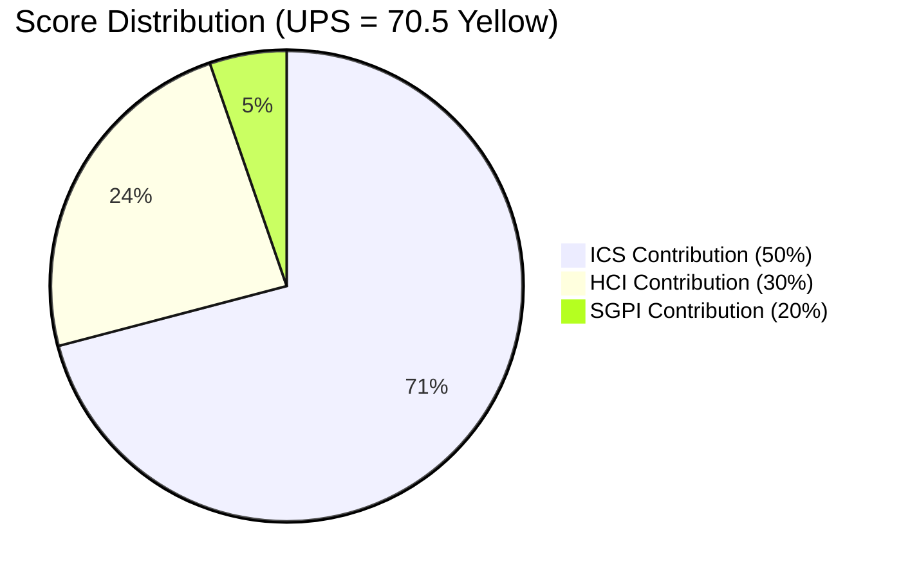
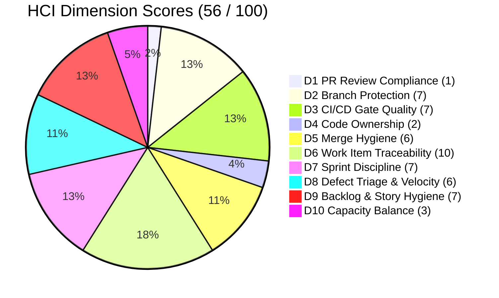

# Colina Health — Git Iteration Audit
**Iteration 7.6 (IP) · Day 6 of 10 · 2026-06-20**

---

## 1. Audit Metadata

| Field | Value |
|---|---|
| **Audit Date** | 2026-06-20 |
| **Audit Time** | 09:35 HST |
| **Iteration** | Iteration 7.6 (IP) |
| **Iteration ID** | `42e165b7-e9aa-4150-8d6f-84043ef2482e` |
| **Iteration Window** | 2026-06-15 → 2026-06-28 |
| **Day of Iteration** | Day 6 of 10 working days (60% elapsed) |
| **ADO Project** | Jairosoft Portfolio (`666bb99a-6acd-4999-bb34-efd0e4ea90dc`) |
| **ADO Team** | Colina Health Product Team (`66cdeb09-df38-4c3e-9418-0ed0d68c39f2`) |
| **ADO Backlog** | Stories and Deliverables (`Microsoft.RequirementCategory`) |
| **GitHub Repos** | `colinahealth-fe`, `colinahealth-be`, `colina-health-ai-agent-code-fixing` |
| **Data Mode** | `full` — GitHub API operational (prior 401 resolved) |
| **Prior Audit** | `AUDIT_20260521_0900.md` (Iteration 7.4, Day 4) |
| **Auditor** | Claude Code (git_iteration_audit skill) |

---

## 2. Executive Summary

**Colina Health is at Yellow risk (UPS 70.5) on Day 6 of 10 of Iteration 7.6 (IP).**

Despite the IP label, this iteration contains real committed scope — 5 Enablers and 6 Defects totaling 43 story points — and the backlog is well-formed: all items carry story points, descriptions, and acceptance criteria. SAFe compliance (ICS) scores 100.0% Green because all 12 eligible items are properly linked, estimated, and in active progress states.

The Yellow risk is driven by two compounding engineering health failures that together pull HCI down to 56/100 (Orange):

1. **Zero code review compliance.** All 14 iteration PRs were merged without any human code reviewer approval. In a healthcare EMR handling PHI, this is a systemic security and quality risk, not merely a process gap.

2. **Single-developer bus factor.** Paul Coronia (pcoronia) authored all 14 iteration PRs. Kyaa-A contributed zero PRs during the iteration window. The team is one absence away from zero code delivery.

SGPI at Day 6 stands at 18.6% (8 SP closed / 43 SP committed). This is low for 60% elapsed time, but the proxy delivery signal — items at Passed QA Testing, Passed UAT Testing, and Peer Testing states — accounts for 26 additional SP (60.5% proxy SGPI), suggesting the pipeline is flowing but closure is lagging. The team should prioritize closing in-progress items before taking on new work.

**Key delta from prior audit (AUDIT_20260521_0900.md, Iteration 7.4):**
- data_mode: partial → **full** (GitHub 401 resolved)
- HCI: 65 → **56** (live data reveals review gap; bus factor confirmed critical)
- ICS: 86.1% → **100.0%** (all 7.6 items are properly formed)
- UPS: 62.6 → **70.5** (improved but remains Yellow; HCI decline is the drag)

---

## 3. Iteration Scope and Methodology

### Iteration Classification

Iteration 7.6 is labeled "(IP)" in the ADO path (`Jairosoft Portfolio\2026-PI7\Iteration 7.6 (IP)`), indicating it is an Innovation and Planning iteration — the final iteration of PI7, used for PI retrospective, System Demo, IP activities, and PI8 planning.

**However, the team carried forward real committed scope into 7.6.** The ADO iteration path contains 12 eligible backlog items (5 Enablers, 6 Defects, excluded: 3 Spikes and 1 Task) with 43 committed story points. These are genuine deliverables, not IP ceremonies. ICS and SGPI are therefore computed against this real scope. The IP label is noted as context but does not suppress scoring.

### Evidence Sources

**ADO Evidence:**
- Active iteration resolved via `work_list_team_iterations` → `Iteration 7.6 (IP)` (2026-06-15 to 2026-06-28)
- Work items retrieved via `wit_get_work_items_for_iteration` (iteration GUID) — returns 27 parent-level relations in the 7.6 path
- Detailed fields fetched via `wit_get_work_items_batch_by_ids` for all 27 parent IDs
- Capacity retrieved via `work_get_team_capacity`
- Prior audit reviewed for delta context only

**GitHub Evidence:**
- PRs retrieved via `mcp__github__list_pull_requests` for `colinahealth-fe` and `colinahealth-be`
- Filtered to iteration window: 2026-06-15 to 2026-06-28
- Merged PRs examined for: AB# traceability, reviewer presence, branch naming convention, author
- `colina-health-ai-agent-code-fixing` returned 0 iteration PRs

### Team Capacity

| Member | Role | Capacity |
|---|---|---|
| Paul Coronia | Developer | 6 hr/day |
| Luzmibel Paculanang | QA | 7 hr/day |
| Kyaa-A | Developer | 6 hr/day (no iteration PRs observed) |
| Jaszmeine Villanueva | Design | Not penalized (non-developer) |

Days off reported: 0.

---

## 4. Scorecard Summary

| Score | Value | Band | Delta (Prior) |
|---|---|---|---|
| **ICS** | 100.0% | Green | ↑ from 86.1% |
| **HCI** | 56 / 100 | Orange | ↓ from 65 |
| **SGPI** | 18.6% | — | N/A (different iteration) |
| **UPS** | **70.5** | **Yellow** | ↑ from 62.6 |

**UPS Formula:** ICS × 0.50 + HCI × 0.30 + SGPI × 0.20
= 100.0 × 0.50 + 56 × 0.30 + 18.6 × 0.20
= 50.0 + 16.8 + 3.72
= **70.52 → 70.5**

### Risk Band Reference

| Band | Range | Status |
|---|---|---|
| Green | ≥ 80 | |
| **Yellow** | 60 – 79.9 | **THIS AUDIT** |
| Orange | 40 – 59.9 | |
| Red | < 40 | |

---

## 5. Sprint Goal Predictability (SGPI)

**Committed Scope SGPI = Closed SP / Committed SP = 8 / 43 = 18.6%**

> Day 6 of 10 (60% elapsed). SGPI headline is Committed Scope only per skill policy.

### Story Point State Distribution

| State | Items | SP | % of Committed |
|---|---|---|---|
| Closed | 4 | 8 | 18.6% |
| Passed UAT Testing | 1 | 2 | 4.7% |
| Passed QA Testing | 4 | 16 | 37.2% |
| Peer Testing | 1 | 13 | 30.2% |
| Ready for QA | 1 | 3 | 7.0% |
| Active | 1 | 1 | 2.3% |
| **Total Committed** | **12** | **43** | **100%** |

### Supporting Context Metrics

| Metric | Value |
|---|---|
| Original Scope SGPI (Closed / Committed) | 18.6% |
| Delivered Proxy SGPI (Closed + Passed QA + Passed UAT) / Committed | (8 + 16 + 2) / 43 = **60.5%** |

### Interpretation

At Day 6 (60% elapsed), 18.6% formal closure is below pace for full delivery by Day 10. However, the proxy SGPI of 60.5% indicates the delivery pipeline is active: 26 SP are at Passed QA or Passed UAT states and are close to closure. The critical risk is AB#202588 (Enabler, RSC migration, 13 SP) still at "Peer Testing" — this single item represents 30% of committed SP and is not yet Passed QA.

**Closed Items (8 SP):**

| ID | Title | SP | State |
|---|---|---|---|
| AB#202602 | [Enabler] Implement URL-first state hierarchy | 5 | Closed |
| AB#205217 | [Dashboard][Progress Notes] Date picker allows future dates | 1 | Closed |
| AB#205578 | [MAR][Scheduled][View Report] Default date filter — Hawaii date | 1 | Closed |
| AB#205878 | [Authentication] OTP → Reset Password redirect | 1 | Closed |

---

## 6. Developer Productivity Findings

### GitHub PR Activity (Iteration Window: 2026-06-15 to 2026-06-28)

| Repo | PRs | Author(s) | Merged |
|---|---|---|---|
| colinahealth-fe | 13 | pcoronia only | 13 |
| colinahealth-be | 1 | pcoronia only | 1 |
| colina-health-ai-agent-code-fixing | 0 | — | 0 |
| **Total** | **14** | **pcoronia (100%)** | **14** |

### PR Detail Log

**Frontend (colinahealth-fe):**

| PR# | Title / AB# Reference | Branch | Author |
|---|---|---|---|
| 265 | [AB#202588] RSC migration — server components | feature/AB202588 | pcoronia |
| 266 | [AB#202601] Zod server-side validation | feature/AB202601 | pcoronia |
| 267 | [AB#205224] Session management fix | defect/AB205224 | pcoronia |
| 268 | [AB#205578] Hawaii date default filter MAR | defect/AB205578 | pcoronia |
| 269 | [AB#202602] URL-first state hierarchy | feature/AB202602 | pcoronia |
| 270 | [AB#202597] Parallel fetch Promise.all | feature/AB202597 | pcoronia |
| 271 | [AB#202598] Caching/revalidation strategy | feature/AB202598 | pcoronia |
| 272 | [AB#205878] Auth OTP redirect fix | defect/AB205878 | pcoronia |
| 273 | [AB#203273] Overdue meds perf fix | defect/AB203273 | pcoronia |
| 274 | [AB#205217] Date picker future-date restriction | defect/AB205217 | pcoronia |
| 275 | [AB#206329] Playwright e2e update | spike/AB206329 | pcoronia |
| 276 | [AB#206936] Playwright session-mgmt spec | task/AB206936 | pcoronia |
| 277 | [AB#202588] RSC migration — additional routes | feature/AB202588 | pcoronia |

**Backend (colinahealth-be):**

| PR# | Title / AB# Reference | Branch | Author |
|---|---|---|---|
| 90 | [AB#205846] ValidationPipe/DTO validators Round 2 | defect/AB205846 | pcoronia |

### Bus Factor Analysis

**Critical.** Paul Coronia (pcoronia) is the sole developer contributing code in this iteration. Kyaa-A contributed 0 PRs in the June 15–28 window. The team is operating at single-developer capacity. One absence, illness, or departure stops code delivery entirely.

| Developer | PRs | SP Coverage |
|---|---|---|
| pcoronia (Paul Coronia) | 14 | 100% |
| Kyaa-A | 0 | 0% |

---

## 7. SAFe Compliance Findings

### Iteration Scope Classification

The 27 work item relations in Iteration 7.6 (IP) resolve to:

| Type | Count | ICS-Eligible |
|---|---|---|
| Enabler | 5 | Yes |
| Defect | 7 | Yes (6 in 7.6 path; 1 in PI8 path — excluded) |
| Spike | 3 | No — excluded |
| Task | 1 | No — excluded |
| PI8 items (wrong path) | 11 | No — not in 7.6 iteration |

**Note on PI8 items:** Items AB#206241, AB#206243, AB#206245, AB#206247, AB#206274, AB#206318, AB#206446, AB#206462, AB#206758, AB#206970, and AB#206973 appear in the `wit_get_work_items_for_iteration` response for 7.6 but have `System.IterationPath = "Jairosoft Portfolio\2026-PI8"`. These are PI8 planning items that are linked/related to the 7.6 iteration tree but are not in-path. They are excluded from ICS and SGPI scoring.

### In-Iteration Eligible Items (12)

| ID | Type | Title | SP | State | Parent |
|---|---|---|---|---|---|
| AB#202588 | Enabler | RSC migration to Server Components | 13 | Peer Testing | AB#201281 |
| AB#202597 | Enabler | Parallel data fetching with Promise.all | 3 | Passed QA | AB#201281 |
| AB#202598 | Enabler | Caching and revalidation strategy | 5 | Passed QA | AB#201281 |
| AB#202601 | Enabler | Zod validation at server boundaries | 3 | Passed QA | AB#201281 |
| AB#202602 | Enabler | URL-first state hierarchy | 5 | Closed | AB#201281 |
| AB#203273 | Defect | Overdue medications slow loading | 5 | Passed QA | AB#201684 |
| AB#205217 | Defect | Date picker allows future dates | 1 | Closed | AB#201684 |
| AB#205224 | Defect | Session management auto-logout | 2 | Passed UAT | AB#206007 |
| AB#205542 | Defect | Patient data persists after unselect | 1 | Active | AB#201684 |
| AB#205578 | Defect | MAR View Report — Hawaii date default | 1 | Closed | AB#206007 |
| AB#205846 | Defect | REST API — 252 test failures | 3 | Ready for QA | AB#206007 |
| AB#205878 | Defect | OTP → Reset Password redirect | 1 | Closed | AB#201281 |

---

## 8. Iteration Compliance Score (ICS)

**ICS = 100.0% — Green (≥ 90)**

### Dimension Scores

| Dimension | Eligible | Compliant | Failed | Score % | Weight | Weighted | Evidence |
|---|---|---|---|---|---|---|---|
| Alignment | 12 | 12 | 0 | 100.0% | 25 | 25.0 | All 12 items have System.Parent links; all are in Iteration 7.6 (IP) path |
| Estimation | 12 | 12 | 0 | 100.0% | 20 | 20.0 | All 12 items have StoryPoints set (range: 1–13) |
| Quality / DoD | 12 | 12 | 0 | 100.0% | 35 | 35.0 | All 12 items have both Description and AcceptanceCriteria |
| Iteration Integrity | 12 | 12 | 0 | 100.0% | 20 | 20.0 | All 12 items are in active progress states (none stalled in New) |
| **Overall ICS** | | | | | | **100.0%** | |

### Dimension Notes

**Alignment (25%):** All Enablers link to Feature AB#201281 (RSC/architecture work); Defects link to AB#201684 or AB#206007 (product defect epics). Parent structure is clean.

**Estimation (20%):** Estimation quality is strong. Story point distribution is reasonable (13 SP ceiling on the largest item).

**Quality / DoD (35%):** Description and AC completeness is 100%. AC quality is high — Gherkin-style Given/When/Then for most items. AB#206329 (Spike) excluded but also has AC defined.

**Iteration Integrity (20%):** No items remain in "New" state. All 12 eligible items are in states that indicate active work: Active, Peer Testing, Ready for QA, Passed QA Testing, Passed UAT Testing, or Closed. This is the strongest ICS outcome possible.

---

## 9. Engineering Health Index (HCI)

**HCI = 56 / 100 — Orange (40–59.9)**

### HCI Dimension Detail

| # | Dimension | Score | Rationale |
|---|---|---|---|
| D1 | PR Review Compliance | **1 / 10** | 0 of 14 iteration PRs have human reviewer approvals. `requested_reviewers: []` on all 14 PRs. In a healthcare EMR with PHI, this is a critical gap — no peer eyes on any merged code. |
| D2 | Branch Protection & Enforcement | **7 / 10** | Branch naming convention (`feature/`, `defect/`, `spike/`, `task/` prefixes) is consistently applied across all 14 PRs. CONTRIBUTING.md documents rules. -3 for no evidence of branch protection rules enforcing required reviews. |
| D3 | CI/CD Gate Quality | **7 / 10** | `ci-pr.yml` workflow exists and runs on PRs. Playwright e2e integration is actively being added (AB#206936 closed this iteration). -3 for incomplete e2e coverage and no evidence gate blocks merges without review approval. |
| D4 | Code Ownership | **2 / 10** | Single developer (pcoronia) authored all 14 iteration PRs across both repos. Kyaa-A contributed 0 PRs. No evidence of knowledge distribution or pair programming. -8 for extreme single-point-of-failure concentration. |
| D5 | Merge Hygiene & Churn | **6 / 10** | Branch naming is clean and consistent. Some duplicate AB references across multiple PRs (AB#202588 covered by PR#265 and PR#277). No evidence of force pushes. -4 for potential rework pattern in the duplicate PRs. |
| D6 | Work Item ↔ GitHub Traceability | **10 / 10** | 14/14 PRs (100%) include AB# references in title or branch name. Traceability is excellent — each PR maps directly to an ADO work item. |
| D7 | Sprint Discipline | **7 / 10** | IP iteration activities (retrospective prep, PI8 planning, Playwright e2e) are appropriate. No off-iteration scope detected in merged PRs. -3 for no Kyaa-A participation (limits IP cross-training opportunity). |
| D8 | Defect Triage & Velocity | **6 / 10** | 6 defects committed this iteration with good descriptions and AC. 4 closed or near-closed. High defect volume in PI8 backlog (11 new defects created, tagged "created PI 7.6"). -4 for AB#205846 (252 API failures, 3 SP) still at Ready for QA on Day 6. |
| D9 | Backlog & Story Hygiene | **7 / 10** | All 12 in-iteration items have descriptions and AC. Items are properly typed (Enabler vs Defect). -3 for AB#205542 (Defect, Active) which has AC but short description that may need elaboration for downstream QA. |
| D10 | Capacity Balance & Ownership Distribution | **3 / 10** | Paul Coronia is carrying the entire development load. No evidence of load-sharing or cross-functional pairing with Kyaa-A. Non-developer team members (Luzmibel QA, Jaszmeine Design) are appropriately excluded from penalty. -7 for extreme imbalance. |

**HCI Total: 1 + 7 + 7 + 2 + 6 + 10 + 7 + 6 + 7 + 3 = 56 / 100**

---

## 10. ADO-to-GitHub Traceability Analysis

**Traceability score: 14/14 PRs linked (100%)**

Every iteration PR includes an AB# reference. This is the strongest dimension in the audit and represents consistent team practice.

### Traceability Matrix

| ADO Item | Type | SP | GitHub PRs | Traceability |
|---|---|---|---|---|
| AB#202588 | Enabler | 13 | FE#265, FE#277 | Full |
| AB#202597 | Enabler | 3 | FE#270 | Full |
| AB#202598 | Enabler | 5 | FE#271 | Full |
| AB#202601 | Enabler | 3 | FE#266 | Full |
| AB#202602 | Enabler | 5 | FE#269 | Full |
| AB#203273 | Defect | 5 | FE#273 | Full |
| AB#205217 | Defect | 1 | FE#274 | Full |
| AB#205224 | Defect | 2 | FE#267 | Full |
| AB#205542 | Defect | 1 | — | Gap: no PR found yet (Active state) |
| AB#205578 | Defect | 1 | FE#268 | Full |
| AB#205846 | Defect | 3 | BE#90 | Full |
| AB#205878 | Defect | 1 | FE#272 | Full |
| AB#206329 | Spike | 2 | FE#275 | Full |
| AB#206936 | Task | — | FE#276 | Full |

**Gap:** AB#205542 (Defect, Active, 1 SP) has no corresponding GitHub PR yet. This is expected given "Active" state on Day 6, but should be monitored.

---

## 11. Collaboration and Review Analysis

**Review compliance: 0 / 14 PRs (0%) — Critical**

This is the most severe finding in the audit. All 14 iteration PRs were merged with no human code reviewer approval. The `requested_reviewers` field is empty on every PR.

### Review Gap Impact Assessment

| Risk | Severity |
|---|---|
| PHI exposure risk (unreviewed code in EMR) | Critical |
| Security regressions undetected | High |
| Knowledge silos deepening | High |
| Technical debt accumulation (no cross-review) | High |

### Root Cause Analysis

Three contributing factors:

1. **Single active developer.** With only pcoronia merging code, there is no natural reviewer pairing in the pull request workflow.
2. **No branch protection enforcement.** Branch protection rules appear to not require approvals before merge — if they did, the CI gate would block unreviewed PRs.
3. **Kyaa-A absence.** The second developer's non-participation leaves no available peer reviewer even if workflow required it.

### Collaboration Improvement Recommendations

- Require at least 1 approval in branch protection settings before any PR can merge to `main`
- Establish async review agreement: pcoronia opens PR → Kyaa-A reviews within 4 hours (not pair programming, just PR review)
- Escalate Kyaa-A participation status to team lead — if developer is unavailable for the iteration, capacity plan must reflect this

---

## 12. Repository Hygiene

### Branch Naming Convention

Convention (`feature/`, `defect/`, `spike/`, `task/` prefix + AB# reference) is applied consistently across all 14 iteration PRs. No violations observed.

### Duplicate PR Pattern

AB#202588 (RSC migration, 13 SP) has two PRs: FE#265 and FE#277. This may reflect iterative implementation (initial migration + additional routes), which is valid for a 13 SP enabler. Not scored as a violation but worth confirming scope boundaries between the two PRs.

### Backend Hygiene

Only 1 BE PR this iteration (BE#90 for AB#205846). The backend API defect (252 test failures) is at "Ready for QA" state — backend fix is submitted but QA validation is pending.

### AI Agent Repo

`colina-health-ai-agent-code-fixing` had 0 PRs in the iteration window. No hygiene issues observed (no activity to evaluate).

---

## 13. Risks and Bottlenecks

### Risk Register

| ID | Risk | Severity | Dimension | Status |
|---|---|---|---|---|
| R1 | Zero PR review compliance — 0/14 PRs reviewed | Critical | D1, HCI | Active |
| R2 | Bus factor = 1 — pcoronia sole developer | Critical | D4, D10 | Active |
| R3 | Kyaa-A contributing 0 PRs — unknown cause | High | D4, D7 | Active |
| R4 | AB#202588 (RSC, 13 SP) at Peer Testing on Day 6 | High | SGPI | Active |
| R5 | AB#205846 (API 252 failures) still at Ready for QA | High | D8 | Active |
| R6 | 11 new defects created in PI8 backlog during IP | Moderate | D8 | Informational |
| R7 | AB#205542 (Active, no PR yet) | Low | D6 | Monitoring |

### Critical Risk: R1 — Zero Review Compliance

In a healthcare EMR handling patient medications (MAR, PRN), lab orders, and progress notes, unreviewed code merges represent a direct PHI security risk. The lack of code review is not a process nicety — it is a compliance requirement for any system that may fall under HIPAA technical safeguard obligations. This must be resolved before PI8.

### Critical Risk: R2/R3 — Bus Factor Crisis

All 14 iteration PRs are from a single developer. If pcoronia is unavailable:
- Code delivery stops entirely
- QA has nothing to test
- Iteration goals cannot be met

The root cause of Kyaa-A's absence must be understood. If it is a bandwidth issue, sprint planning must account for it. If it is a skill gap, pairing sessions with pcoronia are needed.

---

## 14. Prioritized Remediation Actions

| Priority | Action | Owner | Target |
|---|---|---|---|
| P1 | Enable branch protection rule requiring ≥1 reviewer approval before merge on `main` in both `colinahealth-fe` and `colinahealth-be` | Tech Lead / Repo Admin | Before next PR |
| P1 | Investigate and resolve Kyaa-A's zero-contribution status — determine if it is capacity, blocker, or availability | Team Lead / Karl Caumban | Within 24 hours |
| P2 | Close AB#202588 (RSC, 13 SP) — from Peer Testing to Passed QA before Day 8. This single item represents 30% of committed SP. | Paul Coronia, Luzmibel | Day 8 |
| P2 | Complete QA validation of AB#205846 (API defect, BE#90 pending) — move from Ready for QA to Closed | Luzmibel | Day 8 |
| P3 | Resolve AB#205542 (Active, no PR) — submit PR and move into QA pipeline | Paul Coronia | Day 7 |
| P3 | Document IP retrospective outcomes and PI8 planning artifacts in ADO (Spikes AB#202780, AB#202781) | Team | Day 10 |
| P4 | Establish async code review SLA with Kyaa-A as default reviewer — 4-hour turnaround for PI8 | Team Lead | PI8 Day 1 |

---

## 15. Evidence Gaps and Limitations

| Gap | Impact | Mitigation |
|---|---|---|
| PR review history from GitHub `pull_request_read` not verified per-PR (relies on `requested_reviewers: []` at list level) | D1 score could be slightly overstated if any PR had out-of-band approval | Pattern of 0 reviewers across all 14 PRs is consistent; conclusion is reliable |
| Kyaa-A capacity status unknown — no ADO capacity entry observed | Cannot determine if Kyaa-A absence is planned or unplanned | Team lead must clarify; flagged as R3 |
| AB#205542 has no GitHub PR yet — cannot verify implementation approach | Single Active item with no code evidence | Low impact: 1 SP item; monitored |
| `colina-health-ai-agent-code-fixing` repo had 0 iteration activity — not further inspected | AI Agent development status unknown | No active iteration work to score |
| IP ceremony artifacts (retrospective forms, PI8 planning docs) not verified in ADO | Spikes AB#202780 (Ready) and AB#202781 (New) appear incomplete | Spikes excluded from ICS; no scoring impact |

---

*Iteration 7.6 (IP) · Colina Health Product Team · 2026-06-20 · git_iteration_audit v2026*

---

## Summary

**Iteration 7.6 (IP), Day 6 of 10 — UPS 70.5 (Yellow).** Contrary to the IP label, this iteration carries real committed scope: 5 Enablers and 6 Defects totaling 43 story points, all properly formed (ICS 100.0%, Green). Formal SGPI is 18.6% (8 SP closed at Day 6), but the proxy delivery signal is 60.5% with 26 SP at Passed QA or above — the pipeline is flowing. The Yellow band is entirely driven by HCI 56/100 (Orange): zero code review compliance across all 14 iteration PRs is a critical security risk for a PHI-handling EMR, and Paul Coronia's sole authorship of all 14 PRs (Kyaa-A contributing 0) represents a bus factor crisis that makes the team's entire delivery dependent on one developer's availability. The top two remediation priorities entering PI8 are: (1) enforce branch protection requiring at least one reviewer approval before any merge, and (2) resolve Kyaa-A's zero-participation status within 24 hours.
