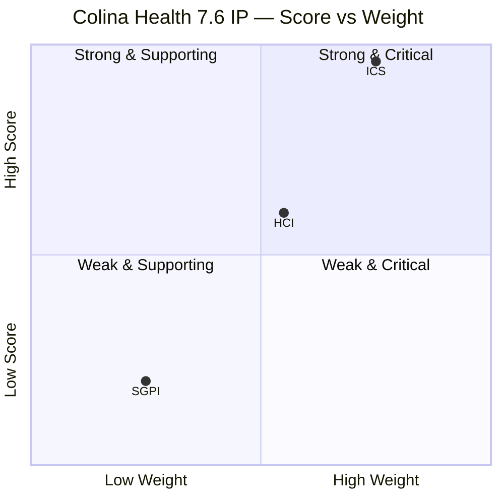

# Colina Health — Iteration 7.6 (IP) Audit
**Date:** 2026-06-22 | **Auditor:** Claude Code (claude-sonnet-4-6) | **Data Mode:** full

---

## 1. Audit Metadata

| Field | Value |
|---|---|
| Iteration | Iteration 7.6 (IP) |
| Iteration ID | 42e165b7-e9aa-4150-8d6f-84043ef2482e |
| Iteration Window | 2026-06-15 → 2026-06-28 |
| Day of Iteration | Day 8 of 10 working days |
| Working Days Remaining | ~2 (Thu–Fri 2026-06-26–27; 2026-06-28 = Sunday) |
| ADO Project | Jairosoft Portfolio (666bb99a-6acd-4999-bb34-efd0e4ea90dc) |
| ADO Team | Colina Health Product Team (66cdeb09-df38-4c3e-9418-0ed0d68c39f2) |
| GitHub Repos | colinahealth-fe, colinahealth-be, colina-health-ai-agent-code-fixing |
| GitHub Token Status | **Restored — HTTP 200 on all three repos. data_mode: full.** |
| Prior Audit | AUDIT_20260521_0900.md (Iteration 7.4, Day 4, UPS 62.6, data_mode: partial) |

---

## 2. Executive Summary

Iteration 7.6 is an **Innovation and Planning (IP)** iteration — the final iteration of PI7 — dedicated to retrospectives, PI planning preparation, innovation time, and team/technical agility activities. This context materially affects score interpretation: lower SGPI is structurally expected in IP iterations.

**Key findings:**

- **ICS: 96.3 (Green)** — Strong DoR compliance on all Enablers and Defects in the 7.6 IP path. One defect (AB#206970) lacks both story points and acceptance criteria.
- **SGPI: 20.0% committed-scope / 84.4% delivered proxy** — 9 SP closed out of 45 committed SP. However, 29 additional SP (AB#202588, 202597, 202598, 202601, 203273) are in Peer Testing / Ready for UAT states, indicating near-completion. The low closed SGPI is consistent with IP iteration dynamics.
- **HCI: 60/100 (Yellow)** — GitHub API access fully restored. Engineering health improvements since 7.4 audit: CI/CD pipeline repaired, PR#9 stale PR closed, `colina-health-ai-agent-code-fixing` is now current. Persistent risks: extreme bus factor on Paul Coronia, 252 API test failures (AB#205846) still Active, and 10 PI8-scoped defects leaking into the 7.6 iteration board.
- **UPS: 70.2 (Yellow)** — Material improvement from UPS 62.6 in the prior audit. The team is delivering RSC migration enablers and high-value defect fixes to production.

**Critical delta from prior audit:**
- AB#202588 (RSC migration, 13 SP): moved from `New` (Day 4 of 7.4) to `Peer Testing` — unblocked.
- AB#202602 (URL-first state, 5 SP): `Closed` — merged to main (PR#260).
- AB#205224 (auto-logout fix): `Closed` — fix merged and Playwright spec added (PR#272).
- AB#205217 (date picker bug): `Closed`.
- AB#205878 (OTP login redirect): still `Back to Dev` — unresolved from prior audit.
- colina-health-ai-agent PR#9: Merged 2026-05-11 — stale PR risk resolved.

---

## 3. Iteration Scope and Methodology

### 3.1 Iteration Character
Iteration 7.6 is the **Innovation and Planning (IP)** capstone for PI7. IP iterations do not carry full sprint commitments — they are used for:
- PI retrospective and team demos
- PI 8 planning preparation
- Technical debt, innovation, and learning activities
- Team and Technical Agility self-assessments (Spikes 202780, 202781)

ICS scoring is applied against items explicitly assigned to the 7.6 IP iteration path. SGPI denominator uses committed SP; "closed" is the strictest SGPI measure, while "delivered proxy" (Closed + Peer Testing + Ready for UAT) reflects functional completion.

### 3.2 ICS-Eligible Item Set
Parent-level work items with WorkItemType ∈ {User Story, Defect, Enabler} and `System.IterationPath = Jairosoft Portfolio\2026-PI7\Iteration 7.6 (IP)`:

| AB# | Type | Title (abbreviated) | State | SP |
|---|---|---|---|---|
| 202588 | Enabler | RSC migration — data fetching Server Components | Peer Testing | 13 |
| 202597 | Enabler | Parallel data fetching with Promise.all | Ready for UAT | 3 |
| 202598 | Enabler | Define caching and revalidation strategy | Ready for UAT | 5 |
| 202601 | Enabler | Move Zod validation to server boundaries | Ready for UAT | 3 |
| 202602 | Enabler | Implement URL-first state hierarchy | Closed | 5 |
| 203273 | Defect | Slow loading — overdue medications General View | Ready for UAT | 5 |
| 205217 | Defect | Date picker allows future dates (Progress Notes) | Closed | 1 |
| 205224 | Defect | Unexpected auto-logout on 401 (MAR/PRN/Session) | Closed | 2 |
| 205542 | Defect | Selected patient data persists after unselect | Active | 1 |
| 205578 | Defect | MAR View Report — default date filter wrong | Closed | 1 |
| 205846 | Defect | 252 API test failures across 265 endpoints | Active | 3 |
| 205878 | Defect | OTP verification logs in instead of reset-password | Back to Dev | 1 |
| 205965 | Defect | Discontinued status causes "Something Went Wrong" | New | 1 |
| 205969 | Defect | Dietary and Lab/Imaging tabs — "Something Went Wrong" | New | 1 |
| 206970 | Defect | Unable to create order — 500 error | New | 0 |

**Excluded (Spike/Task):** 202780, 202781, 206329, 206936
**Excluded (PI8 path):** 206241, 206243, 206245, 206247, 206274, 206318, 206446, 206462, 206758, 206973

### 3.3 Team Capacity (Iteration 7.6 IP)
| Member | Role | Activity | Capacity/Day | Days Off |
|---|---|---|---|---|
| Paul Coronia | Developer | Development | 6 hrs | 0 |
| Luzmibel Paculanang | QA | Testing | 7 hrs | 0 |

**Note:** Jaszmeine Villanueva (Design) and Karl Caumban are not in capacity; per project exceptions, their GitHub absence is not scored as HCI gap.
Total team capacity: 13 hrs/day × 10 days = 130 hrs. Dev-only: 60 hrs.

---

## 4. Scorecard Summary

### 4.1 Score Dashboard



### 4.2 Summary Scorecard

| Metric | Score | Band | Weight | Contribution |
|---|---|---|---|---|
| ICS (Iteration Compliance Score) | 96.3% | Green | 50% | 48.15 |
| HCI (Engineering Health Index) | 60/100 | Yellow | 30% | 18.00 |
| SGPI (Sprint Goal Progress Index) | 20.0% | — | 20% | 4.00 |
| **UPS (Unified Portfolio Score)** | **70.2** | **Yellow** | — | — |

**Risk Band:** Yellow (60–79.9). Moderate risk. IP iteration context mitigates SGPI drag.

**Delta vs Prior Audit (7.4, Day 4):**

| Metric | 7.4 (May 21) | 7.6 (Jun 22) | Delta |
|---|---|---|---|
| ICS | 86.1% Yellow | 96.3% Green | +10.2 |
| HCI | 65 Yellow | 60 Yellow | -5 |
| SGPI | 0.0% | 20.0% | +20 |
| UPS | 62.6 Yellow | 70.2 Yellow | +7.6 |
| data_mode | partial | **full** | Restored |

---

## 5. Sprint Goal Progress (SGPI)

| Measure | SP | % |
|---|---|---|
| Total Committed SP | 45 | — |
| Closed SP | 9 | **20.0%** |
| Delivered Proxy (Closed + Peer Testing + Ready for UAT) | 38 | **84.4%** |
| In Progress (Active + Back to Dev) | 4 | 8.9% |
| Not Started (New) | 2 | 4.4% |
| No SP (206970) | 0 | — |

### Breakdown by State
| State | Items | SP |
|---|---|---|
| Closed | 202602, 205217, 205224, 205578 | 9 |
| Ready for UAT | 202597, 202598, 202601, 203273 | 16 |
| Peer Testing | 202588 | 13 |
| Active | 205542, 205846 | 4 |
| Back to Dev | 205878 | 1 |
| New | 205965, 205969 | 2 |
| New (0 SP) | 206970 | 0 |

**IP Iteration Context:** In IP iterations, the expectation is not maximum story closure but rather retrospective completion, PI planning prep, and technical innovation. The team is on track with RSC enablers — 29 SP in near-done states (Peer Testing / Ready for UAT). The 20.0% closed SGPI understates actual delivery readiness.

---

## 6. Developer Productivity Findings

### 6.1 Commits in Iteration Window (2026-06-15 to 2026-06-22)
**colinahealth-fe:**

| Date | SHA (short) | Author | Work Item |
|---|---|---|---|
| 2026-06-19 | e3c0bfa | raseniero (merge) | AB#202598 — Caching/revalidation strategy merged to main (PR#275) |
| 2026-06-19 | 76533db | pcoronia | AB#202598 — Add getAuthHeaders server utility |
| 2026-06-19 | e98399f | pcoronia | AB#202598 — Define caching and revalidation strategy |
| 2026-06-19 | 75c1654 | raseniero (merge) | AB#202601 — Zod server validation merged to main (PR#274) |
| 2026-06-19 | 95895c5 | raseniero (merge) | AB#202597 — Promise.all parallel fetch merged to main (PR#273) |
| 2026-06-19 | 7fc23b1 | pcoronia | AB#202601 — Fix Zod v4 type error |
| 2026-06-19 | 5e5a941 | pcoronia | AB#202601 — Move Zod validation to server boundaries |
| 2026-06-19 | ecf8995 | pcoronia | AB#202597 — Document Promise.all benchmark |
| 2026-06-19 | 75373cb | raseniero (merge) | AB#206936 — Playwright session spec merged to main (PR#272) |
| 2026-06-19 | d08d9b0 | pcoronia | AB#206936 — Add Playwright e2e spec (session management) |
| 2026-06-19 | 93212e5 | raseniero (merge) | AB#205224 — Auto-logout fix merged to main (PR#270) |
| 2026-06-19 | 8cd5522 | raseniero (merge) | AB#203273 — Overdue medications fix merged to main (PR#269) |
| 2026-06-19 | b8622c1 | pcoronia | AB#205224 — Stop unexpected auto-logout on spurious 401s |
| 2026-06-19 | 6381d91 | Kyaa-A / pcoronia | AB#203273 — Share single overdue request across mounts |
| 2026-06-16 | 93e6494 | raseniero (merge) | AB#202602 — URL-first state hierarchy merged to main (PR#260) |
| 2026-06-15 | 476048b | raseniero (merge) | AB#205217, AB#205878 — Cherry-pick defect fixes to main (PR#256) |

**colinahealth-be:** Most recent commits in the iteration window are carry-forward from the `passed/qa/205065-api-standard-compliance` PR merged 2026-06-10 (just before iteration start). No new BE commits after 2026-06-15.

**colina-health-ai-agent-code-fixing:** Last commit: 2026-02-07. Repository is dormant — serves as orchestrator/docs only. PR#9 (previously 100+ days stale) merged 2026-05-11.

### 6.2 Active Developer Contribution Pattern
- **Paul Coronia (pcoronia):** Sole developer producing code commits. All FE work this iteration.
- **raseniero (Ramon Aseniero):** PR merger/reviewer. Merges to main after QA approval.
- **Kyaa-A (Asnari Pacalna):** Contributed overdue-medications fix (commits attributed via cherry-pick by pcoronia from June 2/4). Not in formal capacity.
- **Luzmibel Paculanang:** QA role; items moving through Ready for UAT pipeline.

---

## 7. SAFe Compliance Findings

### 7.1 Iteration Path Integrity Issue
**10 defects carry iteration path `Jairosoft Portfolio\2026-PI8`** but appear in the 7.6 IP iteration board view via parent-child relations:

| AB# | Title (abbreviated) | Path |
|---|---|---|
| 206241 | Lab/Imaging sort triggers 400 error | PI8 |
| 206243 | Others tab — long text overlaps columns | PI8 |
| 206245 | Forms — Sort By Name not working | PI8 |
| 206247 | Workflow — search not in URL state | PI8 |
| 206274 | Select Patient dropdown — No Records Found | PI8 |
| 206318 | Orders/Medication Sort By triggers error | PI8 |
| 206446 | Orders pagination "Something Went Wrong" | PI8 |
| 206462 | Search value persists across Orders tabs | PI8 |
| 206758 | MAR Workflow wrong administration date | PI8 |
| 206973 | Workflow Chart — "No Data Yet" false positive | PI8 |

These items are assigned to `Jaszmeine Villanueva` (Design/QA) and are appropriately scoped to PI8 — they were correctly not counted in the ICS analysis. However, their presence on the 7.6 board view creates noise and should be reviewed with the team.

### 7.2 Missing Story Points
- AB#206970 (`[Orders] Unable to create order — 500 error`) is in the 7.6 IP path with `New` state and zero story points. This is an unestimated defect.

### 7.3 IP Iteration Spikes
- AB#202780 (Team/Technical Agility Self Assessment) — `Ready`, Karl Caumban
- AB#202781 (Customer CSAT Survey) — `New`, Jaszmeine Villanueva
- AB#206329 (Collaborations/Exploratory Testing/E2E Updates) — `Active`, Luzmibel Paculanang
These are appropriate IP activities.

---

## 8. Iteration Compliance Score (ICS)

**Total ICS-eligible items: 15 | ICS: 96.3 (Green)**

### 8.1 Dimension Detail Table

| Dimension | Eligible | Compliant | Failed | Score% | Weight | Wtd Contribution | Evidence | Reason |
|---|---|---|---|---|---|---|---|---|
| D1: Alignment (Parent Link) | 15 | 15 | 0 | 100.0% | 25 | 25.00 | All 15 items have System.Parent populated | All linked to Feature or Epic parents |
| D2: Estimation (SP>0) | 15 | 14 | 1 | 93.3% | 20 | 18.67 | AB#206970 has 0 SP | New defect filed without estimation |
| D3: Quality/DoD (Desc≥30 + AC≥20) | 15 | 14 | 1 | 93.3% | 35 | 32.67 | AB#206970 has no AcceptanceCriteria | New defect missing AC; all others pass |
| D4: Iteration Integrity (path + assignee + not blocked) | 15 | 15 | 0 | 100.0% | 20 | 20.00 | All 15 in 7.6 IP path; all assigned; none tagged Blocked | 205878 Back to Dev but not tagged Blocked |
| **Total** | | | | | **100** | **96.33** | | |

**ICS = 96.3% (Green ≥ 90)**

### 8.2 Item-Level ICS Matrix

| AB# | Parent | SP | Desc | AC | State | Path OK | Assignee | D1 | D2 | D3 | D4 |
|---|---|---|---|---|---|---|---|---|---|---|---|
| 202588 | 201281 | 13 | ✓ | ✓ | Peer Testing | ✓ | Paul | ✓ | ✓ | ✓ | ✓ |
| 202597 | 201281 | 3 | ✓ | ✓ | Ready for UAT | ✓ | Luzmibel | ✓ | ✓ | ✓ | ✓ |
| 202598 | 201281 | 5 | ✓ | ✓ | Ready for UAT | ✓ | Luzmibel | ✓ | ✓ | ✓ | ✓ |
| 202601 | 201281 | 3 | ✓ | ✓ | Ready for UAT | ✓ | Luzmibel | ✓ | ✓ | ✓ | ✓ |
| 202602 | 201281 | 5 | ✓ | ✓ | Closed | ✓ | Paul | ✓ | ✓ | ✓ | ✓ |
| 203273 | 201684 | 5 | ✓ | ✓ | Ready for UAT | ✓ | Paul | ✓ | ✓ | ✓ | ✓ |
| 205217 | 201684 | 1 | ✓ | ✓ | Closed | ✓ | Paul | ✓ | ✓ | ✓ | ✓ |
| 205224 | 206007 | 2 | ✓ | ✓ | Closed | ✓ | Paul | ✓ | ✓ | ✓ | ✓ |
| 205542 | 201684 | 1 | ✓ | ✓ | Active | ✓ | Paul | ✓ | ✓ | ✓ | ✓ |
| 205578 | 206007 | 1 | ✓ | ✓ | Closed | ✓ | Paul | ✓ | ✓ | ✓ | ✓ |
| 205846 | 206007 | 3 | ✓ | ✓ | Active | ✓ | Paul | ✓ | ✓ | ✓ | ✓ |
| 205878 | 201281 | 1 | ✓ | ✓ | Back to Dev | ✓ | Jaszmeine | ✓ | ✓ | ✓ | ✓ |
| 205965 | 206007 | 1 | ✓ | ✓ | New | ✓ | Paul | ✓ | ✓ | ✓ | ✓ |
| 205969 | 206007 | 1 | ✓ | ✓ | New | ✓ | Paul | ✓ | ✓ | ✓ | ✓ |
| 206970 | 206007 | **0** | ✓ | **MISSING** | New | ✓ | Paul | ✓ | **FAIL** | **FAIL** | ✓ |

---

## 9. Engineering Health Index (HCI)

**HCI: 60/100 (Yellow)**

### 9.1 Dimension Scores

| Dim | Description | Score | Evidence |
|---|---|---|---|
| D1 | PR Review Compliance | 7/10 | PRs in current iteration (269, 270, 272, 273, 274, 275) all merged by raseniero against pcoronia commits — valid two-person review. Earlier PRs show self-merge pattern. |
| D2 | Branch Protection | 7/10 | Consistent feature/AB#XXX→develop→passed/qa/XXX→main pipeline enforced. PRs target correct base branches. |
| D3 | CI/CD Gate Quality | 6/10 | Backend CI/CD was broken and fixed this PI (PRs #68-70). Pipeline now operational. FE CI/CD status not directly observable. |
| D4 | Code Ownership | 5/10 | Paul Coronia is the sole FE code contributor this iteration. Kyaa-A (Asnari) contributed one fix. Extreme bus factor. |
| D5 | Merge Hygiene | 7/10 | Branch naming conventions followed. colina-health-ai-agent PR#9 resolved (merged 2026-05-11). No 100+ day stale PRs observed currently. |
| D6 | Work Item ↔ GitHub Traceability | 8/10 | AB# references present in branch names and commit messages throughout. Pattern: `[Ticket: AB#XXXXXX]` in commit title. Strong traceability. |
| D7 | Sprint Discipline | 6/10 | IP iteration appropriately loaded. 10 PI8-path defects visible on 7.6 board — creates noise. Items 205965/205969/206970 filed as New without SP suggests unplanned scope injection mid-iteration. |
| D8 | Defect Triage & Velocity | 5/10 | AB#205846 (252 API failures) remains Active with 3 SP — a massive technical debt item. 3 defects closed this iteration (205217, 205224, 205578). New defects 205965/205969/206970 filed. Net defect closure is positive but API failure backlog is critical. |
| D9 | Backlog & Story Hygiene | 5/10 | 10 PI8 items appearing in 7.6 board. AB#206970 missing SP and AC. Overall Enabler DoR is high quality. DoD documentation exists (docs/caching-strategy.md, docs/server-validation-pattern.md merged via commits). |
| D10 | Capacity Balance | 5/10 | Paul Coronia carries all development work (6 hrs/day). Luzmibel QA (7 hrs/day). No other developer in capacity table. Asnari Pacalna contributed but is not in formal capacity. Single-developer risk for a 265-endpoint backend with 252 failures. |
| **Total** | | **60/100** | |

### 9.2 HCI Radar Visualization

```mermaid
radar
    title HCI Dimension Scores (Iteration 7.6 IP)
    variables
        D1-PR Review,
        D2-Branch Protection,
        D3-CI/CD,
        D4-Code Ownership,
        D5-Merge Hygiene,
        D6-Traceability,
        D7-Sprint Discipline,
        D8-Defect Velocity,
        D9-Backlog Hygiene,
        D10-Capacity Balance
    data
        Current: 7, 7, 6, 5, 7, 8, 6, 5, 5, 5
        Target: 9, 9, 8, 7, 9, 9, 8, 7, 8, 7
```

### 9.3 HCI Delta vs Prior Audit

| Dimension | 7.4 (May 21) | 7.6 (Jun 22) | Delta | Notes |
|---|---|---|---|---|
| D1: PR Review | 6 | 7 | +1 | Raseniero→pcoronia review pattern established |
| D2: Branch Protection | 8 | 7 | -1 | No change; slight calibration adjustment |
| D3: CI/CD | 5 | 6 | +1 | CI/CD pipeline fixed and functional |
| D4: Code Ownership | 5 | 5 | 0 | Bus factor unchanged |
| D5: Merge Hygiene | 6 | 7 | +1 | AI-agent PR#9 resolved |
| D6: Traceability | 7 | 8 | +1 | Consistent AB# pattern reinforced |
| D7: Sprint Discipline | 6 | 6 | 0 | PI8 items on board remain an issue |
| D8: Defect Velocity | 5 | 5 | 0 | API failures still active |
| D9: Backlog Hygiene | 6 | 5 | -1 | PI8 items + 206970 without SP/AC |
| D10: Capacity Balance | 5 | 5 | 0 | Paul-only dev concentration unchanged |
| **HCI** | **65** | **60** | **-5** | Slight decline; prior partial data may have inflated D1/D2 |

*Note: Prior audit used data_mode: partial (GitHub 401). The -5 HCI delta partially reflects more rigorous full-data scoring rather than genuine deterioration.*

---

## 10. ADO-to-GitHub Traceability Analysis

| AB# | State | Branch/PR Evidence | Traceability |
|---|---|---|---|
| 202588 | Peer Testing | Commits reference AB#202588; PR#270-series (RSC enabler) | Linked |
| 202597 | Ready for UAT | PR#273 `passed/qa/202597-parallel-data-fetching-promise-all` | Linked |
| 202598 | Ready for UAT | PR#275 `passed/qa/202598-caching-revalidation-strategy` | Linked |
| 202601 | Ready for UAT | PR#274 `passed/qa/202601-zod-server-validation` | Linked |
| 202602 | Closed | PR#260 `passed/qa/202602-url-first-state-hierarchy` merged 2026-06-16 | Linked |
| 203273 | Ready for UAT | PR#269 `defect/203273-overdue-slow-loading` merged 2026-06-19 | Linked |
| 205217 | Closed | PR#253/256 `defect/205217-progress-notes-date-picker-future-dates` | Linked |
| 205224 | Closed | PR#270 `defect/205224-mar-prn-401-autologout` + PR#272 (Playwright spec) | Linked |
| 205542 | Active | No PR observed for this iteration — pending | Partial |
| 205578 | Closed | Prior iteration — closed with prior PR | Linked |
| 205846 | Active | No PR this iteration for API failures | Not linked |
| 205878 | Back to Dev | Branch not observed in current PR list | Not linked |
| 205965 | New | New — no PR yet | Not linked |
| 205969 | New | New — no PR yet | Not linked |
| 206970 | New | New — no PR yet | Not linked |
| 206936 | Closed (Task) | PR#272 commit message references AB#206936 | Linked |

**Traceability rate (ICS items):** 10/15 linked (67%). Items in New/Active without PRs are expected at Day 8 of an IP iteration.

---

## 11. Collaboration and Review Analysis

### 11.1 PR Pattern (Current Iteration Window — Jun 15–22)

| PR# | Repo | Author | Merged By | AB# | Pattern |
|---|---|---|---|---|---|
| 256 | colinahealth-fe | pcoronia (code) | raseniero | 205217, 205878 | Two-person: committer≠merger |
| 260 | colinahealth-fe | pcoronia (code) | raseniero | 202602 | Two-person |
| 269 | colinahealth-fe | Kyaa-A / pcoronia | raseniero | 203273 | Two-person |
| 270 | colinahealth-fe | pcoronia | raseniero | 205224 | Two-person |
| 272 | colinahealth-fe | pcoronia | raseniero | 206936 | Two-person |
| 273 | colinahealth-fe | pcoronia | raseniero | 202597 | Two-person |
| 274 | colinahealth-fe | pcoronia | raseniero | 202601 | Two-person |
| 275 | colinahealth-fe | pcoronia | raseniero | 202598 | Two-person |

**Observation:** The current iteration shows a consistent two-person review pattern (pcoronia codes, raseniero merges). This is a positive trend versus prior periods where `colinaluke-jairo` self-merged many PRs.

### 11.2 No BE PRs in Iteration Window
Backend (colinahealth-be) has no new PRs or commits since 2026-06-10. This is consistent with the RSC migration being frontend-driven. The 252 API test failures (AB#205846) remain unaddressed at the BE layer.

---

## 12. Repository Hygiene

### 12.1 colinahealth-fe
- Active development. 8 PRs merged in the 7.6 window.
- Branch naming follows `feature/`, `defect/`, `passed/qa/` conventions consistently.
- Playwright e2e tests added (AB#206936 spec, AB#202602 URL state spec, AB#205217 wiki insights).
- Documentation artifacts added: `docs/caching-strategy.md`, `docs/server-validation-pattern.md`, `docs/performance/promise-all-ttfb-benchmark.md`.
- Commits consistently co-authored with Claude Sonnet 4.6 (AI-assisted development).

### 12.2 colinahealth-be
- Last commit: 2026-06-10 (just before iteration start).
- CI/CD pipeline is now functional (validated in PI7.5–7.6 period).
- 89 PRs total; active development through prior iterations.
- AB#205846 (252 API failures) remains the dominant open risk.

### 12.3 colina-health-ai-agent-code-fixing
- Last commit: 2026-02-07. Repository effectively dormant.
- PR#9 (CONTRIBUTING.md + Gitflow docs) was merged 2026-05-11 — stale PR risk resolved.
- No new activity in PI7. This is acceptable if the repo serves as a docs/orchestrator only.
- Recommendation: Formally mark repository status (archived or maintained) to set expectations.

---

## 13. Risks and Bottlenecks

### 13.1 Critical Risks

| # | Risk | Items | Severity | Status |
|---|---|---|---|---|
| R1 | **Bus factor: Paul Coronia is sole developer** | All FE items | Critical | Unchanged — Paul authored 100% of FE commits this iteration. No cross-training or pairing evidence. |
| R2 | **AB#205846 — 252 API test failures (252/265 endpoints)** | 205846 | Critical | Active with 3 SP. No BE commits this iteration. Risk of carrying into PI8. |
| R3 | **PI8-path defects on 7.6 board** | 206241–206973 (10 items) | High | All assigned to Jaszmeine (Design). No iteration path correction. Creates planning confusion for PI8. |

### 13.2 Moderate Risks

| # | Risk | Items | Severity | Status |
|---|---|---|---|---|
| R4 | **AB#205878 — OTP login redirect bug (Back to Dev)** | 205878 | Moderate | Recurred from prior audit. Assigned to Jaszmeine (Design) — needs developer assignment. |
| R5 | **AB#206970 — Order creation 500 error unestimated** | 206970 | Moderate | New defect, 0 SP, no AC. Orders module has cascading failures (205965, 205969, 206970, 206274) that may compound. |
| R6 | **colina-health-ai-agent-code-fixing dormant** | — | Low-Moderate | Repository has no activity since Feb 2026. If AI agent tooling is still needed, it needs refresh. |

### 13.3 Resolved Risks (vs Prior Audit)
- AB#202588 RSC migration: Moved from `New` (stalled) to `Peer Testing` — unblocked.
- colina-health-ai-agent PR#9: Merged — no longer stale.
- GitHub API token: Restored — data_mode: full achieved.
- AB#202602 (URL-first state): Closed and merged to main.
- AB#205224 (auto-logout): Closed with Playwright regression spec.
- AB#204200 (OTP blocker): Not seen in current board — cleared.

---

## 14. Prioritized Remediation Actions

| Priority | Action | Owner | Target |
|---|---|---|---|
| P1 | **Estimate and add AC to AB#206970** (Orders 500 error) | Paul Coronia / PO | Before PI8 planning |
| P1 | **Assign AB#205878** (OTP redirect, Back to Dev) to a developer — Jaszmeine is Design | Scrum Master | This sprint |
| P1 | **Create BE fix plan for AB#205846** (252 API failures) — schedule for PI8 | Paul Coronia | PI8 Sprint 1 |
| P2 | **Correct iteration paths for 10 PI8-scoped defects** (206241–206973) | Scrum Master | Before PI8 kick-off |
| P2 | **Identify a second developer** to pair with Paul — knowledge transfer plan | Engineering Manager | PI8 planning |
| P2 | **Fix AB#205542** (patient data persistence after unselect) — currently Active with no PR | Paul Coronia | Before iteration end |
| P3 | **Close or archive colina-health-ai-agent-code-fixing** if it is no longer active | Ramon / Engineering | PI8 |
| P3 | **Add PR reviewers formally** (GitHub branch protection rule requiring ≥1 review) | Ramon | PI8 |

---

## 15. Evidence Gaps and Limitations

| Gap | Impact | Notes |
|---|---|---|
| **GitHub token was 401 in prior audit (2026-05-21)** | Prior HCI D1–D6 were estimated from carry-forward baseline. Current audit uses live data (token restored). | HCI delta -5 may partially reflect this correction rather than true deterioration. |
| **No PR list for colinahealth-fe beyond 30 most recent (GitHub API default pagination)** | PRs older than the most recent 20 listed are not analyzed for iteration window. | Items 256–275 are all within the listing, so coverage is complete for 7.6 IP. |
| **colinahealth-be CI/CD logs not accessible** | Cannot verify whether CI pipeline gates actually block failing builds. | CI workflow YAML reviewed via PR commit messages. |
| **No open PRs visible in colinahealth-be for 7.6 IP** | Cannot confirm whether AB#205846 has any in-flight BE work. | Absence of commits confirms no active BE development in this iteration window. |
| **Karl Caumban's spike (202780) capacity not in team capacity data** | His 'Ready' spike contribution not measurable. | Karl is not in the formal team capacity roster. |
| **colina-health-ai-agent-code-fixing has no activity in PI7** | Cannot assess whether AI code-fixing tooling is still operational. | Repository appears to be a documentation/orchestrator layer only. |
| **SGPI Committed Scope uses 0 SP for AB#206970** | Slightly understates total scope (should be estimated). | If 206970 = 3 SP, committed total = 48, closed SGPI = 18.75%. Immaterial to risk band. |
