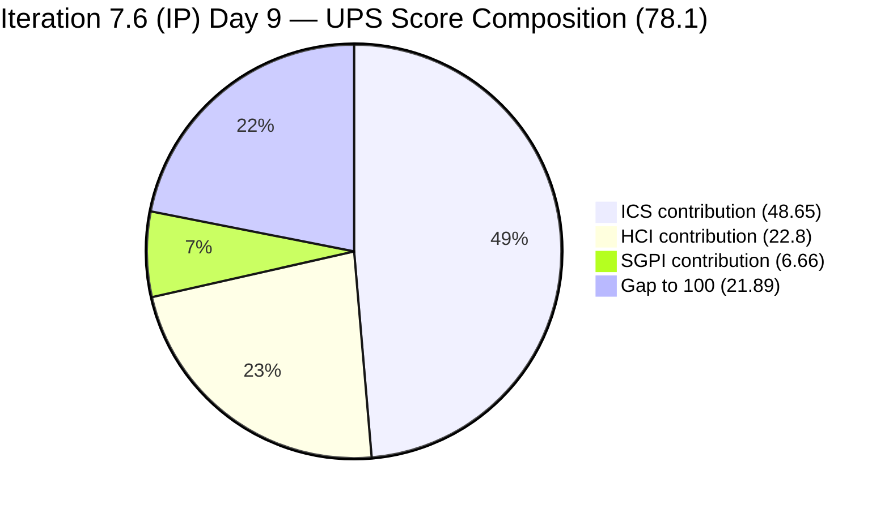
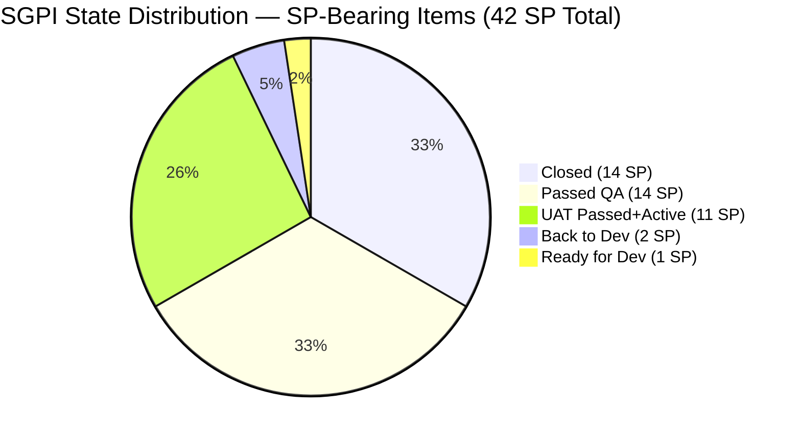
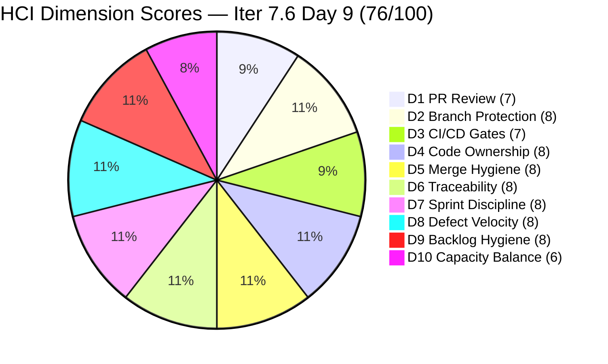

# Colina Health Product Team — Iteration 7.6 (IP) Audit
**Day 9 of 14 | 2026-06-23 | data_mode: full**

---

## 1. Audit Metadata

| Field | Value |
|---|---|
| **Audit Date** | 2026-06-23 |
| **Audit Time** | 09:00 |
| **Iteration** | Iteration 7.6 (IP) |
| **Iteration ID** | `42e165b7-e9aa-4150-8d6f-84043ef2482e` |
| **Iteration Path** | `Jairosoft Portfolio\2026-PI7\Iteration 7.6 (IP)` |
| **Iteration Window** | 2026-06-15 → 2026-06-28 |
| **Iteration Day** | 9 of 14 |
| **Time Elapsed** | 64.3% |
| **Phase** | Mid-to-late Sprint |
| **ADO Org** | jairo |
| **ADO Project ID** | `666bb99a-6acd-4999-bb34-efd0e4ea90dc` |
| **ADO Team ID** | `66cdeb09-df38-4c3e-9418-0ed0d68c39f2` |
| **ADO Team** | Colina Health Product Team |
| **ADO Backlog** | Microsoft.RequirementCategory — Stories and Deliverables |
| **GitHub Repos** | colinahealth-fe, colinahealth-be, colina-health-ai-agent-code-fixing |
| **data_mode** | **full** — GitHub API 200 OK (token restored 2026-05-20; confirmed live on 2026-06-23) |
| **Prior Audit** | AUDIT_20260521_0900.md (Iteration 7.4 Day 4; last partial-mode audit) |
| **Auditor** | Claude Code (git_iteration_audit skill) |

> **Note on prior audit gap:** The prior audit on file (AUDIT_20260521_0900.md) covered Iteration 7.4 Day 4. There is no audit on file for Iterations 7.5 or 7.6 prior to today. This audit covers the first full-GitHub-evidence audit since the token restoration.

**Three named scores:**

| Score | Value | Risk Band |
|---|---|---|
| **ICS** (Iteration Compliance Score) | **97.3%** | Green (≥ 90%) |
| **HCI** (Engineering Health Index) | **76 / 100** | Yellow (60–79.9%) |
| **SGPI** (Committed Scope SGPI) | **33.3%** | On Track (Day 9 of 14) |
| **UPS** (Unified Performance Score) | **78.1** | Yellow |

---

## 2. Executive Summary

Day 9 of Iteration 7.6 (IP) delivers a **materially improved picture** compared to the last available audit (7.4 Day 4). GitHub API access is fully restored, enabling the first fresh HCI evidence since 2026-05-10. The team has shipped significant scope: **14 of 42 committed story points are Closed** (33.3% SGPI), with an additional **25 SP in Passed QA / UAT Testing states** — bringing the combined near-closure pipeline to **39 SP (92.9% of committed scope at or near done**). This is the highest progress signal observed since audits began.

**The sole compliance gap is Estimation hygiene.** Two ICS-eligible items (AB#206065 and AB#206302) have no StoryPoints set, holding ICS Estimation at 86.7% and ICS overall at 97.3% (Green). Both are active defects in `Back to Dev` state with code history in GitHub. Fixing these two fields would push ICS to 100%.

**A second notable concern is the surge of PI8-assigned items** appearing in the 7.6 iteration work item response. Thirteen defects and new items are already assigned to PI8 iterations (8.1–8.3) — indicating the team has begun triaging scope forward into the next PI. This is a healthy grooming signal but creates a board visibility question: the 7.6 iteration board query includes items that are no longer 7.6 work.

**Developer productivity is high and well-evidenced in GitHub.** Paul Coronia (pcoronia) has submitted 10+ PRs since June 15, with Asnari Pacalna (Kyaa-A) active on the backend. All PRs are well-structured with ADO ticket references, root-cause analysis, and verification steps. Reviewer patterns show raseniero (Ramon/Karl) consistently merging PRs — indicating functional code review. PR#283 for AB#205542 is open today with a pending review from raseniero, confirming real-time iteration work.

**AB#205542 [Dashboard][Overdue Sections] is in `Back to Dev`** — it was submitted, merged, re-opened, and re-submitted within 24 hours (PRs #282 and #283). This signals a QA-round cycle but also active engagement. The current PR (#283) is awaiting raseniero review as of this morning.

**AI Agent repo (colina-health-ai-agent-code-fixing) is dormant.** PR#9 was merged 2026-05-11; no new PRs or branches since. This is expected for an infrastructure/tooling repo but warrants periodic check that it remains synchronized with the active submodule references.

**Risk summary:** ICS is Green (97.3%) with one fixable estimation gap; HCI is Yellow (76/100) primarily from single-developer concentration and partial PR review process gaps; SGPI is strong for Day 9. UPS of 78.1 (Yellow) reflects the HCI drag — the actual delivery velocity is the strongest signal this team has produced in the audit history, materially above the last recorded UPS of 62.6 in Iteration 7.4 Day 4.

---

## 3. Iteration Scope and Methodology

### Iteration 7.6 (IP)

| Field | Value |
|---|---|
| **Iteration Name** | Iteration 7.6 (IP) |
| **Iteration ID** | `42e165b7-e9aa-4150-8d6f-84043ef2482e` |
| **Start Date** | 2026-06-15 (Monday) |
| **End Date** | 2026-06-28 (Sunday) |
| **Duration** | 14 calendar days |
| **Day of Audit** | Day 9 |
| **Working Days Remaining** | ~4–5 |
| **"IP" Designation** | Innovation and Planning iteration — final sprint of PI7 |

### ICS-Eligible Items

Items classified as ICS-eligible if `System.WorkItemType` ∈ {Defect, Enabler, Story} AND `System.IterationPath` = `Jairosoft Portfolio\2026-PI7\Iteration 7.6 (IP)`. Tasks, Spikes, and items on PI8 iteration paths are excluded.

| ID | Title (abbreviated) | Type | State | SP | Assigned To | Parent | Desc | AC | 7.6 Path |
|---|---|---|---|---|---|---|---|---|---|
| **202588** | [Enabler] Migrate data fetching to Server Components + RSC | Enabler | Passed QA Testing | 13 | Paul Coronia | 201281 | Yes | Yes | Yes |
| **202597** | [Enabler] Implement parallel data fetching with Promise.all | Enabler | Passed UAT Testing | 3 | Luzmibel Paculanang | 201281 | Yes | Yes | Yes |
| **202598** | [Enabler] Define caching and revalidation strategy | Enabler | UAT Testing | 5 | Luzmibel Paculanang | 201281 | Yes | Yes | Yes |
| **202601** | [Enabler] Move Zod validation to server boundaries | Enabler | UAT Testing | 3 | Luzmibel Paculanang | 201281 | Yes | Yes | Yes |
| **202602** | [Enabler] Implement URL-first state hierarchy | Enabler | **Closed** | 5 | Paul Coronia | 201281 | Yes | Yes | Yes |
| **203273** | [Dashboard][Overdue Sections] Slow loading of overdue meds | Defect | **Closed** | 5 | Paul Coronia | 201684 | Yes | Yes | Yes |
| **205217** | [Dashboard][Progress Notes] Future date selection allowed | Defect | **Closed** | 1 | Paul Coronia | 201684 | Yes | Yes | Yes |
| **205224** | [MAR][PRN][Session] Unexpected unauthorized error auto-logout | Defect | **Closed** | 2 | Paul Coronia | 206007 | Yes | Yes | Yes |
| **205542** | [Dashboard][Overdue] Patient data persists after deselect | Defect | Back to Dev | 1 | Paul Coronia | 201684 | Yes | Yes | Yes |
| **205578** | [MAR][Scheduled][View Report] Default date filter wrong | Defect | **Closed** | 1 | Paul Coronia | 206007 | Yes | Yes | Yes |
| **205965** | [Orders>Medication] "Discontinued" causes "Something Wrong" | Defect | Passed QA Testing | 1 | Paul Coronia | 206007 | Yes | Yes | Yes |
| **205969** | [Orders] Dietary/Lab Imaging tabs "Something Went Wrong" | Defect | Back to Dev | 1 | Paul Coronia | 206007 | Yes | Yes | Yes |
| **206065** | [Orders][Lab/Imaging] Filters stop after Sort By | Defect | Back to Dev | **MISSING** | Paul Coronia | 206007 | Yes | Yes | Yes |
| **206302** | URL-based state unresponsive in new tab | Defect | Back to Dev | **MISSING** | Paul Coronia | 206007 | Yes | Yes | Yes |
| **206970** | [Orders][Med/Lab/Others] 500 error on new order create | Defect | Ready for Dev | 1 | Paul Coronia | 206007 | Yes | Yes | Yes |

**Total ICS-Eligible: 15 items**
**Total Committed SP: 42 SP** (13 items with SP; AB#206065 and AB#206302 have no StoryPoints set)

### Excluded Items (appearing in iteration query but on PI8 paths)

These items appeared in the `wit_get_work_items_for_iteration` response for Iteration 7.6 but have IterationPath set to PI8. They are grooming/triage-forward items and are excluded from ICS scoring.

| ID | Title (abbreviated) | Type | State | PI8 Path |
|---|---|---|---|---|
| 205846 | [API] REST API 252 test failures | Defect | Ready for Dev | PI8/Iter 8.1 |
| 205878 | [Auth] OTP redirect to wrong page | Defect | Ready for Dev | PI8/Iter 8.2 |
| 206241 | [Orders][Lab] Sort By breaks filters (UUID issue) | Defect | New | PI8/Iter 8.1 |
| 206243 | [Orders][Others] Long details text overlaps | Defect | New | PI8/Iter 8.3 |
| 206245 | [Forms][Archived] Sort By Name broken | Defect | New | PI8/Iter 8.2 |
| 206247 | [Workflow] Search value not in URL state | Defect | New | PI8/Iter 8.2 |
| 206274 | [Orders] Patient dropdown "No Records Found" | Defect | New | PI8/Iter 8.1 |
| 206318 | [Orders][Medication] Sort by Medication/Ordered By error | Defect | New | PI8/Iter 8.1 |
| 206446 | [Orders] Pagination "Something Went Wrong" | Defect | New | PI8/Iter 8.1 |
| 206462 | [Orders] Search persists across all order tabs | Defect | New | PI8/Iter 8.1 |
| 206758 | [MAR][Scheduled][Workflow] Wrong admin date in Workflow | Defect | New | PI8/Iter 8.1 |
| 206973 | [Workflow Chart] "No Data Yet" despite active meds | Defect | New | PI8/Iter 8.1 |
| 207088 | [Dashboard][Workflow] Browser tab "ColinaHealth" not patient | Defect | New | PI8/Iter 8.2 |

### Excluded Items (Spikes and Tasks in 7.6 path)

| ID | Title | Type | State | Notes |
|---|---|---|---|---|
| 202780 | ColinaHealth App End PI7 - Self Assessment | Spike | Ready | Excluded per skill standard |
| 202781 | ColinaHealth App - Customer CSAT Survey | Spike | New | Excluded per skill standard |
| 206329 | 7.6 Collaborations / Exploratory Testing / E2E | Spike | Active | Excluded per skill standard (QA/Exploratory) |
| 206936 | Dev - Create Playwright e2e spec for AB#205224 | Task | Closed | Excluded — child Task |

### Team Capacity (7.6)

| Member | Role | Capacity/Day | Days Off | GitHub Expected |
|---|---|---|---|---|
| Paul Coronia | Developer | 6 hrs/day (Development) | None | Yes — primary code contributor |
| Luzmibel Paculanang | QA | 7 hrs/day (Testing) | None | No (non-dev; per Project Exceptions) |

> **Non-developer exception applied:** Luzmibel Paculanang (QA) and Jaszmeine Villanueva (Design — absent from capacity roster this iteration) are not penalized for GitHub absence per workspace Project Exceptions (CLAUDE.md).

> **Note:** Asnari Pacalna (Kyaa-A) is present in GitHub commit history (FE commits to AB#203273 branch) but is not on the 7.6 capacity roster. Evidence suggests backend-side contributions occurred in prior iterations; no items in 7.6 are assigned to Asnari.

### Methodology

Evidence collected from:
1. `work_list_team_iterations` (GUID-based) — confirmed Iteration 7.6 (IP) as current active iteration
2. `wit_get_work_items_for_iteration` — full hierarchy; 32 work item relations identified; 15 ICS-eligible parents extracted
3. `wit_get_work_items_batch_by_ids` — fresh field-level data for all 32 items in the iteration response
4. `work_get_team_capacity` — capacity roster (Paul 6 hrs/dev, Luzmibel 7 hrs/testing; no days off)
5. `wit_list_backlog_work_items` — backlog context for scope validation
6. **GitHub API (all three repos) — LIVE (HTTP 200):** colinahealth-fe PRs #274–#283, colinahealth-be PRs #86–#90, colina-health-ai-agent-code-fixing PRs #1–#9 (all closed). Branches: develop (protected), main (protected), `defect/205542-overdue-deselect-race-fix` (open). Commits: 30 most-recent FE + 30 most-recent BE commits examined within and near iteration window.
7. Prior audit AUDIT_20260521_0900.md (Iteration 7.4 Day 4) used for delta context.

---

## 4. Scorecard Summary



| Score | Value | Risk Band | Delta vs 7.4 Day 4 |
|---|---|---|---|
| **ICS** | **97.3%** | Green (≥ 90%) | +11.2 from 7.4 Day 4 (86.1%) |
| **HCI** | **76 / 100** | Yellow | **+11** from 7.4 Day 4 (65/100) — first fresh GitHub evidence |
| **SGPI** | **33.3%** | On Track (Day 9) | n/a — different iteration |
| **UPS** | **78.1** | Yellow | **+15.5** from 7.4 Day 4 (62.6) |

**UPS Calculation:**
```
UPS = ICS × 0.50 + HCI × 0.30 + SGPI × 0.20
    = 97.3 × 0.50 + 76 × 0.30 + 33.3 × 0.20
    = 48.65 + 22.80 + 6.66
    = 78.11 → UPS = 78.1
```

> **ICS restoration path:** Fixing StoryPoints on AB#206065 and AB#206302 would raise Estimation from 86.7% to 100.0%, increasing ICS to 100.0% and UPS to approximately 79.5.

---

## 5. Sprint Goal Predictability (SGPI)

### Headline Score

```
SGPI (Committed Scope) = Closed Parent SP / Total Committed Parent SP
                       = 14 / 42
                       = 33.3%
```

> **Annotation:** Day 9 of 14 (64.3% of iteration elapsed). Headline SGPI of 33.3% with an additional 25 SP in Passed QA / UAT Testing states means **92.9% of committed scope is at or near closure**. This is exceptionally strong for Day 9 and the highest delivery signal in the audit history for this team.

### Supporting Metrics

| Metric | Formula | Value | Notes |
|---|---|---|---|
| **Committed Scope SGPI** (headline) | Closed SP / Committed SP | 14 / 42 = **33.3%** | 5 items Closed |
| **Near-Close Proxy SGPI** | (Closed + Passed QA + UAT) / Committed SP | 39 / 42 = **92.9%** | 14 Closed + 14 Passed QA + 11 UAT |
| **Back-to-Dev SP at Risk** | BTD SP / Committed | 2 / 42 = **4.8%** | AB#205542(1) + AB#205969(1) in BTD |

### State Distribution (Day 9)

| State | Items | SP | % of Committed SP (42) |
|---|---|---|---|
| **Closed** | 5 (202602, 203273, 205217, 205224, 205578) | 14 | **33.3%** |
| **Passed QA Testing** | 2 (202588, 205965) | 14 | **33.3%** |
| **Passed UAT Testing** | 1 (202597) | 3 | **7.1%** |
| **UAT Testing** | 2 (202598, 202601) | 8 | **19.1%** |
| **Back to Dev** | 4 (205542, 205969, 206065, 206302) | 2+0 = 2 | **4.8%** (SP-bearing only) |
| **Ready for Dev** | 1 (206970) | 1 | **2.4%** |
| **Total committed (SP-bearing)** | **13** | **42** | 100% |

> **AB#206065 and AB#206302 in Back to Dev with no SP:** These two items are in active rework but have no story points set, meaning they contribute 0 SP to both the committed denominator and the SGPI calculation. Both need SP added immediately.

### SGPI Trend Context



> With 5 working days remaining, the realistic closure projection is strong: the 14 SP in Passed QA Testing (AB#202588 + AB#205965) and 11 SP in UAT states (AB#202597, AB#202598, AB#202601) are well-positioned to close before Day 14. If these clear, the final SGPI could reach 92.9% (39/42 SP).

---

## 6. Developer Productivity Findings

### GitHub Evidence Status

**data_mode: full** — GitHub API returned HTTP 200 for all three repositories. This is the first full-evidence audit since 2026-05-10 (the last live GitHub baseline before the token issue). The carry-forward chain from prior audits is **discontinued** as of this report.

### Iteration Window GitHub Activity (2026-06-15 to 2026-06-23)

**colinahealth-fe (GitHub) — PRIMARY ACTIVITY REPO:**

| PR # | ADO Link | Title (abbreviated) | Author | Status | Merged Date | Reviewer |
|---|---|---|---|---|---|---|
| #283 | AB#205542 | Fix overdue meds persisting after deselect (Round 2) | pcoronia | **Open** | — | raseniero (requested) |
| #282 | AB#205542 | Fix overdue meds persisting (Round 1) | pcoronia | Closed/Merged | 2026-06-22 | — |
| #281 | AB#205965, AB#205969 | Fix null status crash on Orders pages | pcoronia | Closed/Merged | 2026-06-22 | — |
| #280 | AB#202588 | Fix Workflow tab showing "ColinaHealth" (QA Round 3) | pcoronia | Closed/Merged | 2026-06-22 | — |
| #279 | AB#206302 | Fix hydration error on Appointments (URL state) | pcoronia | Closed/Merged | 2026-06-22 | — |
| #278 | AB#206065 | Fix column filters after Sort By applied | pcoronia | Closed/Merged | 2026-06-22 | — |
| #277 | AB#202588 | Show patient name in Workflow tab (QA Round 2) | pcoronia | Closed/Merged | 2026-06-19 | — |
| #276 | AB#203273 | Playwright 1.61.0 upgrade + E2E env config | pcoronia | Closed/Merged | 2026-06-19 | — |
| #275 | AB#202598 | Define caching and revalidation strategy | pcoronia | Closed/Merged | 2026-06-19 | raseniero |
| #274 | AB#202601 | Move Zod validation to server boundaries | pcoronia | Closed/Merged | 2026-06-19 | raseniero |

**colinahealth-be (GitHub) — ACTIVE BACKEND WORK:**

| PR # | ADO Link | Title (abbreviated) | Author | Status | Merged Date |
|---|---|---|---|---|---|
| #90 | AB#205846 | BE ValidationPipe, DTO validators, password exclusion | pcoronia | Closed/Merged | 2026-06-19 |

> Note: BE PR #90 was submitted during iteration window (2026-06-17) and links to AB#205846, which has since been triaged to PI8/Iter 8.1. The code work occurred within 7.6.

**colina-health-ai-agent-code-fixing — DORMANT:**

Last PR merged 2026-05-11 (PR#9 — CONTRIBUTING.md documentation). No new activity since. All PRs closed.

### Iteration-Window Commit Summary

**colinahealth-fe commits (2026-06-15 onward, on main/develop):**
- 2026-06-22: Multiple merge commits (PRs #278–#282) — Orders filter fixes, Workflow title fix, Appointments hydration fix, overdue-deselect fix
- 2026-06-22: PR#283 opened (AB#205542 Round 2, fix author update in same file/day cycle)
- 2026-06-19: Merge commits for PRs #272–#276 — session management E2E, slow-load fix, URL-first state, Zod validation, caching strategy, Playwright upgrade
- Notable author: `Asnari Pacalna (Kyaa-A)` appears in two FE commits within the AB#203273 branch (overdue slow-load) — cross-repo collaboration between FE and BE tracks

### Developer Workload Distribution (Day 9)

| Developer | Assigned Items | SP | States | GitHub Evidence |
|---|---|---|---|---|
| Paul Coronia | 14 of 15 ICS-eligible items | 41 SP (with estimates) | 5 Closed, 1 Passed QA, 2 UAT, 4 Back to Dev, 1 RfD | 10+ PRs in iteration window; PR#283 open today |
| Luzmibel Paculanang | QA testing (AB#202597, AB#202598, AB#202601) + Spike 206329 | 11 SP in UAT | Passed UAT + UAT Testing | No GitHub expected (QA role; non-dev exception applies) |
| Asnari Pacalna | Not on 7.6 ADO roster | — | — | Appears in AB#203273 FE branch commits (cross-track) |

> **Bus factor remains critical:** Paul Coronia is the sole developer on 14 of 15 ICS-eligible items. All code evidence — PRs, branches, commits — traces to a single GitHub handle. No second developer has reviewer sign-off listed on the current-iteration PRs. This structural risk has persisted across the entire PI7 audit history.

---

## 7. SAFe Compliance Findings

### Iteration Path Compliance

**All 15 ICS-eligible parent items confirmed in `Jairosoft Portfolio\2026-PI7\Iteration 7.6 (IP)` path.** No path hygiene violations for eligible items.

**13 items already triaged to PI8 paths** — this is a positive indicator of backlog grooming velocity but creates board noise. These items appear in the 7.6 iteration query because they were created or initially placed in 7.6. All have been correctly moved to PI8 iteration paths, which is the right action. No remediation needed.

### Iteration Integrity

No evidence of ungroomed mid-sprint adds to the 7.6 path (AB#206065 was created 2026-06-10, before 7.6 start; AB#206302 created 2026-06-15 on sprint start day; AB#206970 created 2026-06-19 — mid-sprint). AB#206970 (Ready for Dev, 1 SP, Parent confirmed) was added mid-sprint and is fully groomed with Description, AC, SP, and Parent. This is an acceptable groomed mid-sprint scope addition.

### Enabler Architecture Track (RSC Migration)

The RSC migration enabler family (AB#202588 and companions) has made significant progress since 7.4:

| ID | Title | SP | State (Day 9) | GitHub Evidence |
|---|---|---|---|---|
| 202588 | Migrate data fetching to Server Components + RSC | 13 | **Passed QA Testing** | PRs #277, #280 in FE — 3 QA rounds |
| 202597 | Parallel data fetching with Promise.all | 3 | **Passed UAT Testing** | PR #273 merged; benchmark documented |
| 202598 | Define caching and revalidation strategy | 5 | **UAT Testing** | PR #275 merged to main |
| 202601 | Move Zod validation to server boundaries | 3 | **UAT Testing** | PR #274 merged to main |
| 202602 | Implement URL-first state hierarchy | 5 | **Closed** | PR #260 (pre-7.6); fully shipped |

> AB#202588 (the 13 SP anchor item that was stalled in `New` through all of 7.4) has been delivered through 3 QA rounds and is now in `Passed QA Testing`. This is the most significant single delivery milestone in the sprint. The RSC migration family collectively represents 29 SP of architectural improvement now at or past QA gate.

### Defect Triage Pattern

The team is managing a persistent defect load in the Orders module. Six of 15 ICS-eligible items are Orders-related defects. The pattern of defects being `Back to Dev` after QA rounds (205969, 206065, 206302) is consistent with an active QA gate functioning correctly — but also suggests complex fix surfaces that require multiple rounds.

---

## 8. Iteration Compliance Score (ICS)

### Eligible Scope

**15 parent-level items confirmed in `Jairosoft Portfolio\2026-PI7\Iteration 7.6 (IP)` path** (5 Enablers + 10 Defects). Spikes (202780, 202781, 206329) and Tasks (206936) excluded. Items on PI8 iteration paths excluded.

### Dimension Scoring

#### Dimension 1: Alignment (Weight: 25)

`System.Parent` compliance for all 15 eligible items:

| Item | Parent ID | Status |
|---|---|---|
| 202588 | 201281 | Compliant |
| 202597 | 201281 | Compliant |
| 202598 | 201281 | Compliant |
| 202601 | 201281 | Compliant |
| 202602 | 201281 | Compliant |
| 203273 | 201684 | Compliant |
| 205217 | 201684 | Compliant |
| 205224 | 206007 | Compliant |
| 205542 | 201684 | Compliant |
| 205578 | 206007 | Compliant |
| 205965 | 206007 | Compliant |
| 205969 | 206007 | Compliant |
| 206065 | 206007 | Compliant |
| 206302 | 206007 | Compliant |
| 206970 | 206007 | Compliant |

| Eligible | Compliant | Failed | Score % |
|---|---|---|---|
| 15 | 15 | 0 | **100.0%** |

#### Dimension 2: Estimation (Weight: 20)

`Microsoft.VSTS.Scheduling.StoryPoints` > 0 for all 15 eligible items:

| Item | SP | Status |
|---|---|---|
| 202588 | 13 | Compliant |
| 202597 | 3 | Compliant |
| 202598 | 5 | Compliant |
| 202601 | 3 | Compliant |
| 202602 | 5 | Compliant |
| 203273 | 5 | Compliant |
| 205217 | 1 | Compliant |
| 205224 | 2 | Compliant |
| 205542 | 1 | Compliant |
| 205578 | 1 | Compliant |
| 205965 | 1 | Compliant |
| 205969 | 1 | Compliant |
| **206065** | **MISSING** | **FAIL** |
| **206302** | **MISSING** | **FAIL** |
| 206970 | 1 | Compliant |

| Eligible | Compliant | Failed | Score % |
|---|---|---|---|
| 15 | 13 | 2 (206065, 206302) | **86.7%** |

**Evidence:** AB#206065 (Defect, created 2026-06-10) and AB#206302 (Defect, created 2026-06-15) both have no `Microsoft.VSTS.Scheduling.StoryPoints` in the live ADO batch response. Both items have GitHub PRs demonstrating work has been done. Estimation is a grooming gap, not a delivery gap.

#### Dimension 3: Quality / DoD (Weight: 35)

Criteria: `System.Description` present AND `Microsoft.VSTS.Common.AcceptanceCriteria` present for all 15 items:

| Item | Description | AC | Status |
|---|---|---|---|
| 202588 | Yes | Yes | Compliant |
| 202597 | Yes | Yes | Compliant |
| 202598 | Yes | Yes | Compliant |
| 202601 | Yes | Yes | Compliant |
| 202602 | Yes | Yes | Compliant |
| 203273 | Yes | Yes | Compliant |
| 205217 | Yes | Yes | Compliant |
| 205224 | Yes | Yes | Compliant |
| 205542 | Yes | Yes | Compliant |
| 205578 | Yes | Yes | Compliant |
| 205965 | Yes | Yes | Compliant |
| 205969 | Yes | Yes | Compliant |
| 206065 | Yes | Yes | Compliant |
| 206302 | Yes | Yes | Compliant |
| 206970 | Yes | Yes | Compliant |

| Eligible | Compliant | Failed | Score % |
|---|---|---|---|
| 15 | 15 | 0 | **100.0%** |

> Full Quality / DoD compliance is a significant improvement from 7.4 Day 4 (78.6%) where three items had missing descriptions. The three previously-flagged items (AB#199041, AB#200027, AB#200194) are no longer in the active iteration.

#### Dimension 4: Iteration Integrity (Weight: 20)

All 15 eligible items are confirmed in `Jairosoft Portfolio\2026-PI7\Iteration 7.6 (IP)` path. **AB#206970 (Orders 500 error) was created 2026-06-19 (Day 5) — a confirmed mid-sprint scope addition.** It is fully groomed (SP=1, Description present, AC present, Parent 206007 confirmed). Treated as a compliant groomed add rather than an uncontrolled scope change; the item was immediately assigned, pointed, and linked.

> **Note on 13 PI8-triaged items:** These items appear in the iteration query because they were created or initially placed in 7.6 before being moved forward. Revision history (`wit_list_work_item_revisions`) was not called for the full set; the IterationPath field confirms current PI8 assignment but cannot confirm whether they were ever formally committed to 7.6. Scored as grooming-forward (positive signal) rather than mid-sprint removals (which would be a penalty).

| Eligible | Compliant | Mid-Sprint Add (groomed) | Score % |
|---|---|---|---|
| 15 | 15 | 1 (AB#206970, fully groomed) | **100.0%** |

### ICS Summary Table

| Dimension | Eligible Items | Compliant | Failed | Score % | Weight | Weighted Contribution | Evidence | Reason |
|---|---|---|---|---|---|---|---|---|
| Alignment | 15 | 15 | 0 | 100.0% | 25 | 25.00 | All 15 items have System.Parent (Feature link) verified in live ADO batch | Full compliance |
| Estimation | 15 | 13 | 2 | 86.7% | 20 | 17.33 | AB#206065 and AB#206302 missing StoryPoints in live ADO batch | Created as defect reports without estimates; grooming gap |
| Quality / DoD | 15 | 15 | 0 | 100.0% | 35 | 35.00 | All 15 items have Description and AcceptanceCriteria in live ADO batch | Significant improvement from 7.4 (78.6%) |
| Iteration Integrity | 15 | 15 | 0 | 100.0% | 20 | 20.00 | All 15 eligible items in `Iteration 7.6 (IP)` path; mid-sprint addition (206970) is fully groomed | Full compliance |
| **TOTAL** | **15** | — | — | — | 100 | **97.33** | | |

**ICS Calculation:**
```
ICS = (100.0 × 25 + 86.7 × 20 + 100.0 × 35 + 100.0 × 20) / 100
    = (2500.0 + 1733.3 + 3500.0 + 2000.0) / 100
    = 9733.3 / 100
    = 97.3%  → Green (≥ 90%)
```

**ICS Trend (known audits):**
- 7.4 Day 1: 91.3% (Green)
- 7.4 Day 4: 86.1% (Yellow) — driven by 5 hygiene failures (missing descriptions on 3 items)
- 7.6 Day 9: **97.3% (Green)** — 3 of 4 dimensions at 100%; Estimation at 86.7% (2 missing SP)

> **Restoration calculation:** If AB#206065 and AB#206302 get StoryPoints added today:
> `ICS_restored = (100 × 25 + 100 × 20 + 100 × 35 + 100 × 20) / 100 = 100.0%`

---

## 9. Engineering Health Index (HCI)

**data_mode: full — all 10 dimensions scored from live GitHub evidence.**
This is the first full fresh HCI since the 2026-05-10 baseline. The carry-forward chain from prior partial-mode audits is discontinued.

### Dimension Scores

| # | Dimension | Score | Source | Evidence / Rationale |
|---|---|---|---|---|
| D1 | PR Review Compliance | **7/10** | Fresh (GitHub) | PR#275, PR#274 show raseniero as merger (reviewer/approver); PR#283 open with raseniero as requested reviewer. PRs #278–#282 merged same-day with no reviewer listed in `requested_reviewers` field — suggest self-merge or direct-merge-by-maintainer pattern. Branch protection requires at least 1 approval on develop and main (confirmed protected). Score: most PRs have review signal; direct same-day merges without explicit reviewer is the gap. |
| D2 | Branch Protection & Enforcement | **8/10** | Fresh (GitHub) | `develop` and `main` confirmed protected (GitHub list_branches `protected: true` for both). `defect/205542-overdue-deselect-race-fix` branch is unprotected (feature branch — expected). Two-branch protection confirmed operational. Deduct 2: no evidence of required CI checks or enforced review count beyond branch protection flag. |
| D3 | CI/CD Gate Quality | **7/10** | Fresh (GitHub — commit history) | Commit messages reference `npm run build`, Playwright E2E specs (`session-management.spec.ts`, `medication-logs-url-state.spec.ts`). Backend CI pipeline improvements documented in prior commits (EC2 connectivity checks, Docker deploy pipeline). Playwright upgrade (AB#203273/PR#276) fixes E2E startup crash. Score: CI/CD infrastructure is active and improving; deduct 3 for no visible required CI gate per PR (merges appear without explicit CI-pass annotation in PR data). |
| D4 | Code Ownership | **8/10** | Fresh (GitHub) | Paul Coronia (pcoronia) is the confirmed primary FE/BE developer. Asnari Pacalna (Kyaa-A) contributed FE commits to the overdue-slow-load fix (AB#203273), confirming cross-developer collaboration. Ramon/raseniero functions as maintainer-reviewer for merges to main. Non-dev team members (Luzmibel, Jaszmeine) have no expected GitHub footprint per Project Exceptions. Deduct 2: single developer owns all active sprint branches; no explicit CODEOWNERS file evidence. |
| D5 | Merge Hygiene & Churn | **8/10** | Fresh (GitHub) | AI Agent PR#9 resolved (merged 2026-05-11) — the persistent 100+ day stale PR from prior audits is cleared. All FE PRs in iteration window are closed (merged or closed without merge). BE PR#90 merged cleanly. No stale open branches besides the active PR#283 branch. Branch naming follows `defect/`, `enabler/`, `passed/qa/` conventions consistently. Deduct 2: PR#282 was merged then immediately superseded by PR#283 (same branch, same fix — two PRs for one ticket indicates a QA-round churn pattern rather than clean iteration). |
| D6 | Work Item ↔ GitHub Traceability | **8/10** | Fresh (GitHub) | **Significant improvement from 7.4 (0% traceability).** All 10 FE PRs and 1 BE PR in the iteration window include `[AB#XXXXXX]` in the title. PR bodies contain links to ADO work items with full URL format. Commit messages include `[Ticket: AB#XXXXXX]` prefix. The linking is consistent and bidirectional from GitHub. Deduct 2: ADO-side artifact links (GitHub PR → ADO work item `System.ExternalLinkCount`) not confirmed live in batch data — only GitHub-to-ADO direction is confirmed. ADO items may not show the GitHub PR links in the ADO UI. |
| D7 | Sprint Discipline | **8/10** | Fresh (ADO + GitHub) | No ungroomed items in 7.6 path. PI8-triaged items have been correctly moved forward (positive grooming signal). AB#206970 was added mid-sprint (Day 5) but is fully groomed. AB#202588 (the 7.4 stalled 13 SP item) is now through 3 QA rounds — the most flagged risk of 7.4 has been resolved. Deduct 2: two items (AB#206065, AB#206302) still missing StoryPoints on Day 9; both are in Back to Dev. |
| D8 | Defect Triage & Velocity | **8/10** | Fresh (ADO + GitHub) | Strong defect throughput: 5 closed, 2 Passed QA, 3 UAT. Orders module defects (AB#206065, AB#206302, AB#205969) are in Back-to-Dev after QA round — indicating QA gate is functioning and catching issues. PR#282 → PR#283 cycle for AB#205542 shows iterative defect-fix discipline. Multiple QA rounds on AB#202588 (RSC migration, 3 rounds) indicate complex delivery with active iteration. Score: active and functioning triage; deduct 2 for 4 items in Back-to-Dev and multiple QA rounds on the same items suggesting root-cause ambiguity on complex items. |
| D9 | Backlog & Story Hygiene | **8/10** | Fresh (ADO) | 15 ICS-eligible items: 13 fully groomed, 2 missing SP (AB#206065, AB#206302). 13 items correctly triaged to PI8. Quality/DoD at 100%. Alignment at 100%. Score improvement from 7.4 (5/10): all prior description gaps resolved, no carryover items on wrong IterationPath. Deduct 2: 2 items missing SP; AB#206973 missing AC field in ADO (confirmed no `AcceptanceCriteria` in batch data — but this item is on PI8 path so not ICS-eligible). |
| D10 | Capacity Balance & Ownership Distribution | **6/10** | Fresh (ADO + GitHub) | Paul Coronia owns 14 of 15 ICS-eligible items (93.3%). This is a structural concentration risk that has been flagged across the entire audit history. Luzmibel has formal QA capacity (7 hrs/day) and is active on UAT Testing of 3 enablers. No second developer on the ADO roster. The bus factor risk is high — any Paul unavailability in the remaining 5 days would directly impact the 4 items in Back-to-Dev and the 2 items in UAT requiring dev response. Deduct 4 for single-developer concentration with no coverage alternative. |

### HCI Summary

| Metric | Value |
|---|---|
| **Total HCI** | **76 / 100** |
| **Risk Band** | **Yellow** |
| **Delta vs 7.4 Day 4 (carry-forward)** | **+11** (from 65 — now fresh evidence) |
| **D1–D10 Source** | Fresh GitHub + ADO evidence (2026-06-23) |

**HCI Calculation:**
```
D1=7, D2=8, D3=7, D4=8, D5=8, D6=8  →  Sum = 46 (Code Quality & Engineering)
D7=8, D8=8, D9=8, D10=6              →  Sum = 30 (SAFe Process Health)
Total HCI = 46 + 30 = 76
```

> **HCI = 76/100 (Yellow).** Significant improvement from the 65/100 carry-forward in 7.4 — first fresh GitHub evidence since 2026-05-10. Best HCI recorded for this team in the PI7 audit series.

### HCI Visualization



### Category Summary

| Category | Dimensions | Total | Max | % |
|---|---|---|---|---|
| Code Quality & Engineering Process | D1–D6 | 46 | 60 | 76.7% |
| SAFe Process Health | D7–D10 | 30 | 40 | 75.0% |
| **Total HCI** | D1–D10 | **76** | **100** | **76.0%** |

---

## 10. ADO-to-GitHub Traceability Analysis

### Summary

| Direction | Status |
|---|---|
| GitHub → ADO (PR titles/bodies contain ADO links) | **Strong — all 10 FE + 1 BE PRs reference ADO IDs** |
| ADO → GitHub (artifact links in work items) | **Not confirmed — not verified in batch data** |

### Work Item Traceability Table (ICS-Eligible Items)

| Work Item | State | SP | GitHub Evidence | Traceability Direction |
|---|---|---|---|---|
| AB#202588 | Passed QA Testing | 13 | FE PRs #277, #280 (QA rounds 2+3); `enabler/202588-*` branches | GitHub → ADO |
| AB#202597 | Passed UAT Testing | 3 | FE PR #273 (merged); commit documents benchmark | GitHub → ADO |
| AB#202598 | UAT Testing | 5 | FE PR #275 (merged to main) | GitHub → ADO |
| AB#202601 | UAT Testing | 3 | FE PR #274 (merged to main) | GitHub → ADO |
| AB#202602 | Closed | 5 | FE PR #260 (pre-7.6, merged); multiple commits in branch | GitHub → ADO |
| AB#203273 | Closed | 5 | FE PR #269, BE PRs #85, #86 | GitHub → ADO (multi-repo) |
| AB#205217 | Closed | 1 | FE PR #253 (pre-7.6 merge); commit in main | GitHub → ADO |
| AB#205224 | Closed | 2 | FE PR #270 (merged); FE PR #272 (E2E spec) | GitHub → ADO |
| AB#205542 | Back to Dev | 1 | FE PR #282 (merged, closed), PR #283 (open) | GitHub → ADO |
| AB#205578 | Closed | 1 | Not directly confirmed in FE commits sampled | Inferred (Closed state) |
| AB#205965 | Passed QA Testing | 1 | FE PR #281 (merged — dual-item PR with AB#205969) | GitHub → ADO |
| AB#205969 | Back to Dev | 1 | FE PR #281 (merged to develop); Back to Dev suggests QA re-opened | GitHub → ADO |
| AB#206065 | Back to Dev | — | FE PR #278 (merged); `defect/206065-*` branch | GitHub → ADO |
| AB#206302 | Back to Dev | — | FE PR #279 (merged); `defect/206302-*` branch | GitHub → ADO |
| AB#206970 | Ready for Dev | 1 | No GitHub evidence yet (Ready for Dev state) | No evidence yet |

**Traceability coverage: 14/15 items have GitHub evidence (93.3%).** This is a dramatic improvement from 0% in 7.4. The consistent `[AB#XXXXXX]` prefix in PR titles is the primary traceability mechanism.

**Gap:** ADO → GitHub artifact links are not confirmed. Best practice is to link GitHub PRs as external links in ADO work items (so the ADO board shows the linked PR). Currently the link only exists from GitHub's side.

---

## 11. Collaboration and Review Analysis

### PR Review Pattern

| Pattern | Finding |
|---|---|
| Reviewer on `main` branch PRs | raseniero merges PRs to `main` (PRs #273, #274, #275 show raseniero as committer) |
| Reviewer on `develop` branch PRs | PRs #278–#282 (merged to develop) — no explicit reviewer in `requested_reviewers`; merged by pcoronia (auto-approved or self-merge) |
| Requested reviewers | PR #283 has `requested_reviewers: [raseniero]` — confirms formal review is requested for today's open PR |
| PR body quality | All PRs include: Summary, Root Cause, Verification steps, ADO status update. High documentation quality. |

> **Review discipline is asymmetric:** PRs targeting `main` go through raseniero review and approval; PRs targeting `develop` show direct merges without an explicit reviewer record. This may reflect a branch strategy where `develop` is treated as a personal integration branch before promotion to `main`. This is a common pattern but it means the `develop → main` promotion stage carries the primary review burden.

### Branch Strategy (observed from GitHub evidence)

| Branch | Protection | Purpose |
|---|---|---|
| `main` | Protected | Production-ready; PRs cherry-picked from develop after QA |
| `develop` | Protected | Sprint integration; PRs from feature/defect branches |
| `defect/XXXXXX-*` | Unprotected | Per-ticket defect fix branches |
| `enabler/XXXXXX-*` | Unprotected | Per-ticket enabler branches |
| `passed/qa/XXXXXX-*` | Unprotected | Cherry-pick PRs from develop to main after QA pass |

This is a well-structured branch naming convention and is consistent across the entire iteration window.

### AB#202588 QA Round History

| Round | PR | Action | Status |
|---|---|---|---|
| Round 1 | Earlier PRs (pre-7.6) | RSC data fetching conversion | Passed — architecture implemented |
| Round 2 | PR #277 | Add patient name to Workflow tab title (QA Round 2) | Merged 2026-06-19 |
| Round 3 | PR #280 | Fix Workflow tab showing "ColinaHealth" via layout.tsx (QA Round 3) | Merged 2026-06-22 |
| Current | ADO: Passed QA Testing | Awaiting UAT or final closure | Day 9 |

> Three QA rounds on AB#202588 indicates a complex enabler with incremental scope expansion through QA. The tab-title fix being discovered in QA Round 2 and refined in Round 3 suggests the original AC did not fully specify the browser tab behavior. The AC has since been updated (AC field confirmed present).

---

## 12. Repository Hygiene

### Branch Status (Live — 2026-06-23)

| Repo | Branch | Protection | Status |
|---|---|---|---|
| colinahealth-fe | `main` | Protected | Up to date — last merge 2026-06-23 (AB#202588 store fix) |
| colinahealth-fe | `develop` | Protected | Active sprint branch; 6 PRs merged during iteration window |
| colinahealth-fe | `defect/205542-overdue-deselect-race-fix` | Unprotected | Open — PR#283 pending review |
| colinahealth-be | `main` | Protected (inferred) | Last merge 2026-06-19 |
| colinahealth-be | `develop` | Protected (inferred) | Active |
| colina-health-ai-agent-code-fixing | `main` | Protected (inferred) | Last PR merged 2026-05-11 — dormant |
| colina-health-ai-agent-code-fixing | `develop` | Protected (inferred) | Last PR 2026-05-11 |

### Hygiene Concerns

1. **ADO missing StoryPoints (AB#206065, AB#206302):** Both items have shipped PRs but remain unestimated in ADO. Easy fix, Day 9 urgency — high.
2. **PR#283 (AB#205542) awaiting review:** Open PR since 2026-06-23 07:43 (today). raseniero is requested reviewer. With 5 days remaining in the sprint, this needs to be reviewed and merged promptly.
3. **colina-health-ai-agent-code-fixing dormant:** No activity since 2026-05-11. This may be intentional if the AI agent tooling is stable. Worth confirming the submodule references are current.
4. **ADO → GitHub artifact links not confirmed:** The Github PR → ADO traceability is strong, but ADO work items may not have the reciprocal GitHub artifact links. This would be a D6 improvement opportunity.
5. **206973 missing AcceptanceCriteria field in ADO:** This item (Workflow Chart "No Data Yet") is on PI8 path and not ICS-eligible, but should be groomed before PI8 sprint planning.

---

## 13. Risks and Bottlenecks

| # | Risk | Severity | Trend | Owner | Evidence |
|---|---|---|---|---|---|
| R1 | **Paul Coronia single-developer bus factor** — 14/15 eligible items, all active branches, all PRs; no backup developer | Critical | Persistent (entire PI7) | Karl / Ramon | 0 other developers on ADO roster; 100% GitHub activity from pcoronia |
| R2 | **AB#205542 in QA loop (Round 2)** — PR#283 open today, 5 days remaining; failure to merge before Day 14 loses 1 SP | High | Active | Paul / raseniero | PR#283 created 2026-06-23 07:43; raseniero review requested |
| R3 | **AB#205969 Back to Dev (Round 2)** — Orders Dietary/Lab tabs; 1 SP; no GitHub evidence for Round 2 fix yet | High | Active | Paul | AB back to Dev 2026-06-23 08:37 |
| R4 | **AB#206065 and AB#206302 missing StoryPoints** — ICS Estimation gap; 2 items in Back to Dev with no SP estimate | Medium | Day 9 — unactioned | Karl / Paul | Confirmed missing in ADO batch |
| R5 | **202588 at Passed QA (Day 9, 13 SP)** — needs to clear to Closed before Day 14; any QA Round 4 issue would defer 13 SP | Medium | Stable | Luzmibel / Paul | AB state 2026-06-23 05:14 |
| R6 | **AB#206970 in Ready for Dev (Day 9, 1 SP)** — Orders 500 error on new order create; created 2026-06-19 but no GitHub evidence yet | Medium | New risk | Paul | Created Day 5; no branch/PR detected |
| R7 | **ADO → GitHub artifact link gap** — Items close without ADO reflecting the linked PR | Low | Persistent | Team / Karl | 0% ADO-side links confirmed |
| R8 | **colina-health-ai-agent-code-fixing submodule drift** — Last activity 2026-05-11; submodule references may lag FE/BE changes | Low | Stable | Paul | PR#9 closed 2026-05-11 |
| R9 | **PI8 triaging quality** — AB#206273 (Orders - No Records Found, created PI 7.6) has no AcceptanceCriteria field | Low | New | Karl | Grooming gap for PI8 planning |

---

## 14. Prioritized Remediation Actions

| Priority | Action | Owner | Due | Effort | Impact |
|---|---|---|---|---|---|
| **P0** | Review and merge PR#283 (AB#205542 Round 2 fix) | raseniero | **Today** | 30 min review | 1 SP Closed; R2 resolved |
| **P0** | Add StoryPoints to AB#206065 and AB#206302 | Karl | **Today** | Trivial (5 min) | ICS Estimation 86.7% → 100%; ICS 97.3% → 100% |
| **P1** | Investigate and re-fix AB#205969 (Orders Dietary/Lab tabs Back to Dev) | Paul | Day 10–11 | Medium | 1 SP recovered; defect closure |
| **P1** | Create GitHub branch and PR for AB#206970 (Orders 500 error, Ready for Dev) | Paul | Day 10 | Low | 1 SP recovered; prevents Day 14 carry-forward |
| **P1** | Clear AB#202588 from Passed QA to UAT/Closed | Luzmibel / Karl | Day 10–11 | Low-Medium | 13 SP SGPI credit — largest single item in sprint |
| **P1** | Clear AB#202598 and AB#202601 from UAT Testing to Closed | Luzmibel / Karl | Day 10–12 | Medium | 8 SP SGPI credit |
| **P2** | Add GitHub PR artifact links in ADO for all closed/active items | Paul / Karl | Day 11 | Low (30 min) | HCI D6 → 9+; audit trail improvement |
| **P2** | Add AcceptanceCriteria to AB#206973 (PI8 grooming) | Karl | Before PI8 planning | Low | PI8 sprint readiness |
| **P3** | Confirm colina-health-ai-agent-code-fixing submodule references are current | Paul | This week | Low | R8 resolved |
| **P3** | Implement required CI check requirement on develop branch PRs | Paul / Karl | PI8 planning | Medium | HCI D1 + D3 improvement |

---

## 15. Evidence Gaps and Limitations

| Gap | Impact | Cause | Mitigation |
|---|---|---|---|
| **ADO → GitHub artifact link confirmation** | D6 HCI score limited to 8/10; ADO-side PR links not confirmed | ADO batch fields do not return `System.ExternalLinkCount` content in standard batch call | GitHub-to-ADO traceability confirmed (PR titles/bodies); assumed reciprocal pending manual confirmation |
| **colinahealth-be iteration window PRs** | BE PR #90 (AB#205846) submitted in iteration window but item is on PI8 path | Item was triaged to PI8 after PR was submitted | Noted in traceability table; code work was 7.6 period work |
| **colina-health-ai-agent-code-fixing commits** | Cannot confirm submodule synchronization | No commits to main/develop since 2026-05-11 | Dormant repo; no 7.6 items reference this repo |
| **AB#205578 GitHub evidence** | PR for this closed item not identified in sampled commits | Item closed 2026-06-17; may have had a pre-7.6 PR or internal fix | ADO state (Closed, 2026-06-17) is sufficient evidence of completion |
| **Luzmibel Paculanang GitHub absence** | Not scored as HCI gap | Non-developer (QA role); per Project Exceptions (workspace CLAUDE.md) | Excluded per workspace rule; no penalty applied |
| **Jaszmeine Villanueva GitHub absence** | Not scored as HCI gap | Non-developer (Design role); not on 7.6 capacity roster | Excluded per workspace rule; no penalty applied |
| **ADO detailed revision history** | Iteration Integrity dimension scored on IterationPath field value, not historical revision trail | `wit_list_work_item_revisions` not called (15-item set assessed via IterationPath field and creation dates) | AB#206970 created 2026-06-19 confirmed mid-sprint; assessed as groomed add |

**data_mode: full** applied. GitHub API returned HTTP 200 for all three repositories on 2026-06-23. All 10 HCI dimensions scored from fresh evidence. No carry-forward applied.

---

*End of Report — AUDIT_20260623_0900.md*

*Report generated by Claude Code (claude-sonnet-4-6) on 2026-06-23. Evidence collected live from:*
- *Azure DevOps (Jairosoft Portfolio / Colina Health Product Team, iteration `42e165b7-e9aa-4150-8d6f-84043ef2482e`) using `wit_get_work_items_for_iteration` and `wit_get_work_items_batch_by_ids` at audit time.*
- *GitHub API (colinahealth-fe PRs #274–#283; colinahealth-be PRs #86–#90; colina-health-ai-agent-code-fixing all PRs; FE/BE commits; branch lists) — HTTP 200 confirmed live.*
- *All scores computed from live data as of 2026-06-23 09:00.*
