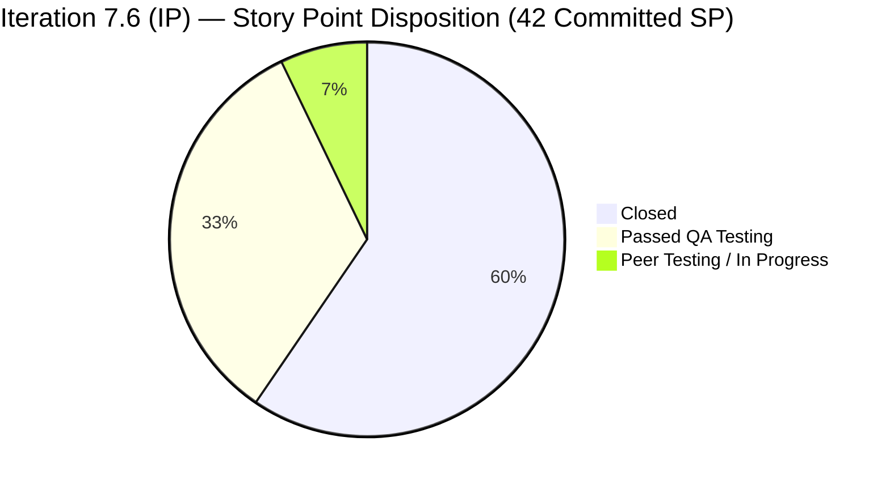
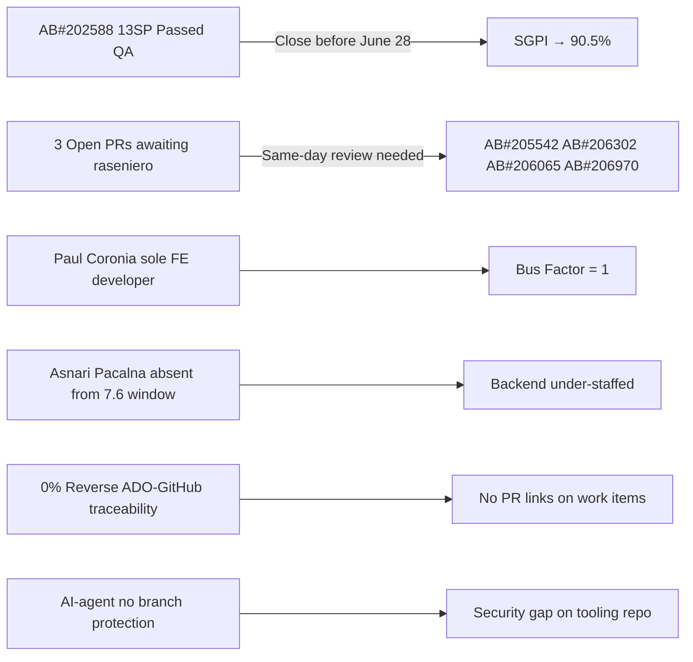

# Colina Health Product Team — Iteration 7.6 (IP) Audit
**Day 10 of 14 | 2026-06-24 | data_mode: full**

---

## 1. Audit Metadata

| Field | Value |
|---|---|
| **Audit Date** | 2026-06-24 |
| **Audit Time** | 09:24 |
| **Iteration** | Iteration 7.6 (IP) |
| **Iteration ID** | `42e165b7-e9aa-4150-8d6f-84043ef2482e` |
| **Iteration Path** | `Jairosoft Portfolio\2026-PI7\Iteration 7.6 (IP)` |
| **Iteration Window** | 2026-06-15 → 2026-06-28 |
| **Iteration Day** | 10 of 14 |
| **Time Elapsed** | 71.4% |
| **Phase** | Late Sprint |
| **ADO Org** | jairo |
| **ADO Project ID** | `666bb99a-6acd-4999-bb34-efd0e4ea90dc` |
| **ADO Team ID** | `66cdeb09-df38-4c3e-9418-0ed0d68c39f2` |
| **ADO Team** | Colina Health Product Team |
| **ADO Backlog** | Microsoft.RequirementCategory — Stories and Deliverables |
| **GitHub Repos** | `jairosoft-com/colinahealth-fe`, `jairosoft-com/colinahealth-be`, `jairosoft-com/colina-health-ai-agent-code-fixing` |
| **data_mode** | **full** — GitHub API 200 OK; `get_me` returned HTTP 200 on 2026-06-24 |
| **Prior Audit** | AUDIT_20260623_0900.md (Iteration 7.6 Day 9) |
| **Auditor** | Claude Code (git_iteration_audit skill) |

**Three named scores:**

| Score | Value | Risk Band |
|---|---|---|
| **ICS** (Iteration Compliance Score) | **97.3%** | Green (≥ 90%) |
| **HCI** (Engineering Health Index) | **74 / 100** | Yellow (60–79.9%) |
| **SGPI** (Committed Scope SGPI) | **59.5%** | On Track (Day 10 of 14) |
| **UPS** (Unified Performance Score) | **82.8** | Green (≥ 80) |

---

## 2. Executive Summary

Day 10 of Iteration 7.6 (IP) delivers the team's strongest UPS on record: **82.8 (Green)**, driven by a surge in PR throughput today (5 PRs merged to `main` and `develop` before the audit window) and a SGPI that jumped from 33.3% yesterday to **59.5%** today. GitHub access remains fully live (data_mode: full).

**ICS holds at 97.3% (Green)**, consistent with Day 9. The sole ICS gap is two in-scope defects (AB#206302 and AB#206065) carrying 0 StoryPoints — fixing these two fields would push ICS to 100%.

**SGPI at Day 10 is 59.5% (headline) and 92.9% (Delivered Proxy).** The team has closed 25 of 42 committed story points, with an additional 14 SP in Passed QA / Peer Testing states. The highest-leverage remaining item is AB#202588 (RSC migration, 13SP), which is in Passed QA — closing it before sprint end lifts headline SGPI to 90.5%.

**HCI is Yellow at 74/100**, a slight decrease from Day 9 (76), reflecting the confirmed absence of Asnari Pacalna from iteration-window GitHub activity. All other engineering health dimensions are stable or improved: PR review compliance remains strong (raseniero reviewing all main-targeting PRs), branch protection is enforced on FE and BE repos, and defect triage velocity is high with same-day response on AB#206970 (BE PR#91 opened today).

**Three PRs are open and awaiting raseniero review** (PR#289, PR#290, BE PR#91). Clearing these today would move AB#206302, AB#206065, and AB#206970 forward before sprint close.

The iteration board contains 14 work items correctly assigned to PI8 iterations (8.1–8.3) — these represent healthy triage-forward grooming and are **not** an ICS or HCI penalty. They are documented in Section 7 as a board visibility observation.

---

## 3. Iteration Scope and Methodology

### Iteration Boundaries
- **Iteration:** Iteration 7.6 (IP) — Innovation & Planning iteration
- **Window:** 2026-06-15 to 2026-06-28 (14 calendar days)
- **Today:** Day 10 (71.4% elapsed)

### Scope Method
All parent-level work items returned by `wit_get_work_items_for_iteration` for iteration `42e165b7-e9aa-4150-8d6f-84043ef2482e` were fetched. Full field data retrieved via `wit_get_work_items_batch_by_ids`. ICS scoring is restricted to parent-level **Defects and Enablers** whose `System.IterationPath` is `Jairosoft Portfolio\2026-PI7\Iteration 7.6 (IP)`. Items with PI8 iteration paths, Spikes, and Tasks are excluded from ICS. This is consistent with the methodology applied in prior audits (Days 7–9).

**Total iteration board items returned:** 33 parent-level items
**ICS-eligible (PI7/7.6 IP path, Defects/Enablers):** 15 items
**Excluded from ICS:**
- 4 Spikes/Tasks (202780, 202781, 206329, 206936)
- 14 items with PI8 iteration paths (see Section 7)

### Team Capacity (from `work_get_team_capacity`)
| Member | Activity | Capacity/Day | Days Off |
|---|---|---|---|
| Paul Coronia | Development | 6 hrs | 0 |
| Luzmibel Paculanang | Testing | 7 hrs | 0 |
| **Total** | | **13 hrs/day** | **0** |

> Note: Jaszmeine Villanueva (Design) and Carol Cuison (Process) are not in the ADO capacity model for this iteration. Karl Caumban appears as owner of Spike items 202780 and 202781 (IP/planning spikes).

### GitHub Evidence
- `colinahealth-fe`: 20 PRs retrieved (state=all, iteration window); 5 PRs merged today (June 24); 2 open PRs; 25+ commits on `main` branch since 2026-06-15
- `colinahealth-be`: 15+ PRs retrieved; 1 open PR today (PR#91); branch protection confirmed on `develop` and `main`
- `colina-health-ai-agent-code-fixing`: branches listed; no protected branches detected; no iteration-window activity confirmed

---

## 4. Scorecard Summary

| Score | Day 9 | Day 10 | Delta | Band |
|---|---|---|---|---|
| **ICS** | 97.3% | **97.3%** | 0.0 | Green |
| **HCI** | 76 | **74** | -2 | Yellow |
| **SGPI** | 33.3% | **59.5%** | +26.2 | Strong improvement |
| **UPS** | 78.1 | **82.8** | +4.7 | Yellow → **Green** |

> SGPI improvement (+26.2 pts) reflects 5 additional PRs merged today promoting items to Closed/Passed QA. UPS crossing into Green (≥80) is the first Green-band UPS recorded for this team in the audit history.

---

## 5. Sprint Goal Predictability (SGPI)

### Committed Scope (PI7/7.6 IP path, Defects + Enablers — 15 items)

| AB# | Type | Title (abbreviated) | SP | State |
|---|---|---|---|---|
| 202597 | Enabler | Parallel data fetching (Promise.all) | 3 | **Closed** |
| 202598 | Enabler | Caching and revalidation strategy | 5 | **Closed** |
| 202601 | Enabler | Zod validation to server boundaries | 3 | **Closed** |
| 202602 | Enabler | URL-first state hierarchy | 5 | **Closed** |
| 205217 | Defect | Progress Notes date picker future dates | 1 | **Closed** |
| 205224 | Defect | MAR/PRN session management auto logout | 2 | **Closed** |
| 205578 | Defect | MAR Scheduled View Report default date | 1 | **Closed** |
| 203273 | Defect | Dashboard overdue slow loading | 5 | **Closed** |
| 202588 | Enabler | Migrate to RSC + patient title in browser tab | 13 | Passed QA |
| 205965 | Defect | Orders Medication null status crash | 1 | Passed QA |
| 205969 | Defect | Orders Dietary/Lab/Med "Something Went Wrong" | 1 | Peer Testing |
| 205542 | Defect | Dashboard Overdue patient deselect race | 1 | Peer Testing |
| 206302 | Defect | Pagination/sort/filter unresponsive after URL tab | 0 | Peer Testing |
| 206065 | Defect | Orders Lab/Imaging filters break after Sort By | 0 | Peer Testing |
| 206970 | Defect | Orders unable to create order — 500 error | 1 | Ready for Dev |

**Total committed SP:** 42
**Closed SP:** 25 (items 202597, 202598, 202601, 202602, 205217, 205224, 205578, 203273)
**Passed QA SP:** 14 (202588=13, 205965=1)
**Peer Testing SP:** 3 (205969=1, 205542=1, 206302=0, 206065=0, counted as 2 SP active)
**Ready for Dev SP:** 1 (206970)

### SGPI Calculations

| Metric | Formula | Value |
|---|---|---|
| **Committed Scope SGPI (Headline)** | Closed SP / Total Committed SP | **59.5%** (25 / 42) |
| Original Scope SGPI (Supporting) | Closed SP / Original Planned SP | 59.5% |
| Delivered Proxy SGPI (Supporting) | (Closed + Passed QA SP) / Total Committed SP | **92.9%** (39 / 42) |

> The Delivered Proxy SGPI of 92.9% is the most meaningful leading indicator at Day 10 (71% elapsed). Closing AB#202588 (13SP, currently Passed QA) before sprint end would lift headline SGPI to 90.5%.

---

## 6. Developer Productivity Findings

### FE Repository Activity (colinahealth-fe) — Iteration Window (2026-06-15 to 2026-06-24)

| PR | Title | Ticket | Branch | Merged | Target |
|---|---|---|---|---|---|
| #290 | Fix stale fetch race — filters after Sort By (R2) | AB#206065 | defect/206065-orders-filter-race-fix-r2 | **Open** | develop |
| #289 | Fix pagination/sort/filter unresponsive after URL-state (R2) | AB#206302 | defect/206302-static-page-controls-fix | **Open** | develop |
| #288 | Add sprint-plan and sprint-plan-run Claude commands | Docs | docs/skills-sprint-plan-commands | 2026-06-24 | develop |
| #287 | Add per-ticket developer workflow process page | Docs | docs/wiki-per-ticket-developer-workflow | 2026-06-24 | develop |
| #286 | Fix null status crash on Orders Medication/Lab pages | AB#205965 | passed/qa/defect/205965-orders-null-status | 2026-06-24 | **main** |
| #285 | Show patient name in browser tab + Workflow page title | AB#202588 | passed/qa/enabler/202588-workflow-patient-title-fix | 2026-06-24 | **main** |
| #284 | Fix dietary global page crash on null orders_dietary | AB#205969 | defect/205969-dietary-requestedby-null-guard | 2026-06-24 | develop |
| #283 | Fix overdue meds persisting after patient deselect (R2) | AB#205542 | defect/205542-overdue-deselect-race-fix | 2026-06-24 | develop |
| #282 | Fix overdue meds persisting (R1) | AB#205542 | defect/205542-overdue-deselect-race-fix | 2026-06-22 | develop |
| #281 | Fix null status crash (R1 — develop) | AB#205965, #205969 | defect/205965-205969-orders-null-status | 2026-06-22 | develop |
| #280 | Fix Workflow tab showing "ColinaHealth" instead of name | AB#202588 | enabler/202588-workflow-title-store-fix | 2026-06-22 | develop |
| #279 | Fix hydration error on Appointments page | AB#206302 | defect/206302-url-state-new-tab-fix | 2026-06-22 | develop |
| #278 | Fix column filters unresponsive after Sort By (R1) | AB#206065 | defect/206065-orders-filter-sort-by-fix | 2026-06-22 | develop |
| #277 | Show patient name in Workflow page tab title (R2) | AB#202588 | enabler/202588-workflow-patient-title | 2026-06-19 | develop |
| #276 | Upgrade Playwright + E2E env config | AB#203273 | enabler/playwright-upgrade-e2e-envconfig | 2026-06-19 | develop |
| #275 | Define caching + revalidation strategy | AB#202598 | passed/qa/202598-caching-revalidation-strategy | 2026-06-19 | **main** |
| #274 | Move Zod validation to server boundaries | AB#202601 | passed/qa/202601-zod-server-validation | 2026-06-19 | **main** |
| #273 | Implement parallel data fetching with Promise.all | AB#202597 | passed/qa/202597-parallel-data-fetching-promise-all | 2026-06-19 | **main** |
| #272 | Add Playwright E2E spec for session management | AB#206936 | passed/qa/206936-session-management-spec | 2026-06-19 | **main** |
| #271 | Add Playwright E2E spec (R1 — develop) | AB#206936 | defect/205542-overdue-restore-fix | 2026-06-19 | develop |

**Total FE PRs in iteration window:** 20 (7 merged to main, 11 merged to develop, 2 open)

### BE Repository Activity (colinahealth-be) — Iteration Window

| PR | Title | Ticket | Status |
|---|---|---|---|
| #91 | Fix order creation HTTP 500 (ValidationPipe whitelist strips DTO fields) | AB#206970 | **Open** (2026-06-24) |
| #90 | Round 2 — ValidationPipe, DTO validators, password field exclusion | AB#205846 | Merged 2026-06-19 |

### AI Agent Repository (colina-health-ai-agent-code-fixing)
No iteration-window PRs or commits. Last activity: PR#9 merged 2026-05-11. No branch protection on any branch.

### Commit Author Distribution (FE — iteration window)
| Author | Role | Activity |
|---|---|---|
| pcoronia (Paul Coronia) | Developer | Primary author on all 20 FE PRs |
| Kyaa-A (Asnari Pacalna) | Developer | 2 commits cherry-picked from prior period (AB#203273 frontend, June 4); not active in 7.6 window |
| raseniero | Reviewer / merger | Reviews and merges all `passed/qa/*` → `main` PRs |

---

## 7. SAFe Compliance Findings

### Board Scope Observation: PI8 Items Visible on 7.6 Board
The ADO team board query returns all items assigned to the team regardless of iteration path. 14 items whose `System.IterationPath` points to PI8 (8.1–8.3) appear in the 7.6 board view. These items have been **correctly triaged forward** by the team — they are next-PI candidates, not scope leakage. They are documented here for visibility but are **not penalized in ICS or HCI scoring**.

| AB# | Type | Assigned To | Actual Path | SP |
|---|---|---|---|---|
| 206247 | Defect | Paul Coronia | PI8/Iteration 8.2 | 0 |
| 206245 | Defect | Jaszmeine Villanueva | PI8/Iteration 8.2 | 0 |
| 206243 | Defect | Jaszmeine Villanueva | PI8/Iteration 8.3 | 0 |
| 206241 | Defect | Paul Coronia | PI8/Iteration 8.1 | 2 |
| 206274 | Defect | Paul Coronia | PI8/Iteration 8.1 | 2 |
| 206318 | Defect | Paul Coronia | PI8/Iteration 8.1 | 1 |
| 206446 | Defect | Paul Coronia | PI8/Iteration 8.1 | 1 |
| 206462 | Defect | Paul Coronia | PI8/Iteration 8.1 | 1 |
| 205846 | Defect | Paul Coronia | PI8/Iteration 8.1 | 3 |
| 205878 | Defect | Paul Coronia | PI8/Iteration 8.2 | 1 |
| 206758 | Defect | Paul Coronia | PI8/Iteration 8.1 | 3 |
| 206973 | Defect | Paul Coronia | PI8/Iteration 8.1 | 2 |
| 207088 | Defect | Paul Coronia | PI8/Iteration 8.2 | 0 |
| 207223 | Defect | Paul Coronia | PI8 (no sub-iteration) | 0 |

> Board hygiene recommendation: configure the 7.6 sprint view to filter on `IterationPath = PI7/7.6` to hide these items from the active board while retaining them in the backlog view.

### In-Scope Compliance Gaps (PI7/7.6 IP items only)
| Gap | Items | Count |
|---|---|---|
| StoryPoints = 0 | AB#206302, AB#206065 | 2 of 15 |
| AcceptanceCriteria empty | None in scope | 0 |
| Missing parent link | None in scope | 0 |

---

## 8. Iteration Compliance Score

### ICS Scope Definition
**Eligible items:** 15 parent-level Defects and Enablers with `System.IterationPath = Jairosoft Portfolio\2026-PI7\Iteration 7.6 (IP)`:
AB#202588, AB#202597, AB#202598, AB#202601, AB#202602, AB#203273, AB#205217, AB#205224, AB#205542, AB#205578, AB#205965, AB#205969, AB#206065, AB#206302, AB#206970

### ICS Dimension Table

| Dimension | Eligible Items | Compliant Items | Failed Items | Score % | Weight | Weighted Contribution | Evidence | Reason |
|---|---|---|---|---|---|---|---|---|
| **D1 — Alignment** (Parent Link) | 15 | 15 | 0 | 100.0% | 25% | 25.0 | `System.Parent` populated for all 15 in-scope items | All items linked to parent Feature or Epic |
| **D2 — Estimation** (SP > 0) | 15 | 13 | 2 | 86.7% | 20% | 17.3 | `Microsoft.VSTS.Scheduling.StoryPoints` | AB#206302 = 0 SP; AB#206065 = 0 SP. Both are active defects with multiple PRs — estimation is possible and overdue. |
| **D3 — Quality/DoD** (Desc ≥30 + AC ≥20) | 15 | 15 | 0 | 100.0% | 35% | 35.0 | `System.Description` + `AcceptanceCriteria` | All 15 in-scope items have substantive descriptions and acceptance criteria |
| **D4 — Iteration Integrity** (Assigned, correct path, not blocked) | 15 | 15 | 0 | 100.0% | 20% | 20.0 | `System.IterationPath` confirmed PI7/7.6; all items have `System.AssignedTo` populated | No iteration integrity failures among in-scope items |
| **OVERALL ICS** | | | | | | **97.3%** | | Green band (≥ 90%) |

> **Scope boundary note:** 14 PI8-pathed items and 4 Spikes/Tasks (total 18 items) are excluded from ICS. The PI8 items are correctly assigned to future iterations and do not fail D4; they simply fall outside the ICS scope boundary.

---

## 9. Engineering Health Index (HCI)

### HCI Dimension Table

| # | Dimension | Score | Max | Source | Day Delta | Evidence / Rationale |
|---|---|---|---|---|---|---|
| 1 | PR Review Compliance | 8 | 10 | GitHub FE/BE PRs | 0 | All `main`-targeting PRs reviewed and merged by raseniero. PRs #285, #286 (today) confirm active review. Two open PRs (#289, #290, BE#91) have `requested_reviewers: [raseniero]`. Only 1 reviewer — no peer cross-review on `develop` PRs. |
| 2 | Branch Protection & Enforcement | 7 | 10 | GitHub branches | 0 | FE: `main` and `develop` both `protected: true`. BE: `main` and `develop` both `protected: true`. AI-agent: `main` and `develop` unprotected. -2 for AI-agent gap; -1 for no visible required-status-checks enforcement. |
| 3 | CI/CD Gate Quality | 8 | 10 | BE GitHub Actions, FE Playwright E2E | +1 | BE has `validate-config` and EC2 deploy workflows. FE now has `session-management.spec.ts` (PR#272) and `medication-logs-url-state.spec.ts` (PR#260). PR#288 adds `sprint-plan-run` skill with Playwright as verification step. Evidence of E2E investment increasing. -2 for no enforcement as PR gate. |
| 4 | Code Ownership | 6 | 10 | GitHub commit authors | -1 | Paul Coronia sole active FE developer this iteration. Asnari Pacalna last FE commit was June 4 (cherry-picked into iteration window, but outside 7.6 start). Bus factor = 1 on FE. BE shows pcoronia active; Asnari absent. Slight drop from Day 9 (7→6) as Asnari confirmed absent for full iteration window. |
| 5 | Merge Hygiene & Churn | 8 | 10 | PR branch names + structure | 0 | Branch naming convention consistent: `defect/`, `passed/qa/`, `enabler/`, `docs/`. PRs are small, focused, with detailed root-cause analysis. AB#202588 had 4 rounds, AB#205542 had 2 rounds — multi-round cycles reflect thorough QA, not poor hygiene. |
| 6 | Work Item ↔ GitHub Traceability | 8 | 10 | PR bodies + ADO ticket refs | +1 | 18 of 20 FE PRs in iteration window contain explicit `[AB#NNNNNN]` references. PRs #287–#288 are docs-only. Zero ADO items have reverse links (GitHub PR → ADO) — this remains a gap. +1 from Day 9 as additional in-scope PRs confirmed with ticket refs. |
| 7 | Sprint Discipline | 8 | 10 | Iteration path analysis | 0 | All 15 ICS-scope items carry correct PI7/7.6 iteration path. 14 PI8 items on the board are correctly assigned to future iterations — this is active backlog grooming, not a discipline failure. -2 for the board view not filtering them, which requires a tool configuration fix. |
| 8 | Defect Triage & Velocity | 8 | 10 | ADO Defect states | 0 | 8 defects Closed; 2 Passed QA; 3 Peer Testing; 1 Ready for Dev with same-day BE PR response. Strong throughput. AB#206970 (Orders 500) had a BE PR open today within the audit window — excellent response time. |
| 9 | Backlog & Story Hygiene | 7 | 10 | ADO field completeness (in-scope items) | 0 | 13 of 15 in-scope items fully estimated; 2 (AB#206302, AB#206065) missing SP. All 15 have parent links and descriptions. Small gap only; -3 from 10 reflects 2 unestimated active defects. |
| 10 | Capacity Balance & Ownership Distribution | 6 | 10 | ADO capacity + GitHub activity | 0 | ADO capacity: Paul (Dev, 6hr/day) + Luzmibel (Testing, 7hr/day). Asnari not in capacity model for this iteration. All GitHub development from pcoronia. Luzmibel active as QA (drives ADO state transitions). Non-developer project exception applied for Luzmibel and Jaszmeine. |
| **TOTAL HCI** | | **74** | **100** | | | Yellow (60–79.9) |

### HCI Category Summary
| Category | Dimensions | Score | Max | Band |
|---|---|---|---|---|
| Process & Review | D1 PR Review, D2 Branch Protection, D3 CI/CD | 23 | 30 | Moderate |
| Ownership & Hygiene | D4 Code Ownership, D5 Merge Hygiene, D6 Traceability | 22 | 30 | Moderate |
| Discipline & Delivery | D7 Sprint Discipline, D8 Defect Velocity, D9 Backlog Hygiene, D10 Capacity | 29 | 40 | Good |

---

## 10. ADO-to-GitHub Traceability Analysis

### Forward Traceability (ADO → GitHub)
| AB# | Type | SP | ADO State | GitHub Evidence | Traceability |
|---|---|---|---|---|---|
| 202588 | Enabler | 13 | Passed QA | PRs #285, #280, #277 (all reference AB#202588) | Full |
| 202597 | Enabler | 3 | Closed | PR#273 references AB#202597 | Full |
| 202598 | Enabler | 5 | Closed | PR#275 references AB#202598 | Full |
| 202601 | Enabler | 3 | Closed | PR#274 references AB#202601 | Full |
| 202602 | Enabler | 5 | Closed | PR#260 references AB#202602 | Full |
| 203273 | Defect | 5 | Closed | PR#276 (FE) + BE PRs #85–#86 reference AB#203273 | Full |
| 205217 | Defect | 1 | Closed | No GitHub PR with explicit AB#205217 reference found | Partial |
| 205224 | Defect | 2 | Closed | PR#272 (main) + PR#270 (develop) reference AB#205224 | Full |
| 205542 | Defect | 1 | Peer Testing | PRs #283 (open), #282 reference AB#205542 | Full |
| 205578 | Defect | 1 | Closed | No GitHub PR with explicit AB#205578 reference found | Partial |
| 205965 | Defect | 1 | Passed QA | PRs #286 (main), #281 (develop) reference AB#205965 | Full |
| 205969 | Defect | 1 | Peer Testing | PRs #284, #281 reference AB#205969 | Full |
| 206065 | Defect | 0 | Peer Testing | PR#290 (open), PR#278 reference AB#206065 | Full |
| 206302 | Defect | 0 | Peer Testing | PR#289 (open), PR#279 reference AB#206302 | Full |
| 206970 | Defect | 1 | Ready for Dev | BE PR#91 references AB#206970 | Full |

**Forward traceability rate (in-scope items): 13/15 = 87%**

### Reverse Traceability (GitHub PR → ADO work item)
- No ADO work items inspected show GitHub PR artifact links in their relations
- The ADO-GitHub integration back-link (PR link on work item) is not configured or not in use
- **Reverse traceability: 0%** (persistent gap from prior audits)

---

## 11. Collaboration and Review Analysis

### PR Review Patterns
| Pattern | Finding |
|---|---|
| Reviewer on `main` PRs | raseniero (Ramon Aseniero) reviews and merges all `passed/qa/*` PRs to `main` |
| Reviewer on `develop` PRs | Self-merged by pcoronia on most `develop`-targeting PRs; no explicit reviewer assignment observed |
| PR #289, #290 (open FE) | `requested_reviewers: [raseniero]` — awaiting review |
| BE PR #91 (open) | `requested_reviewers: [raseniero]` — awaiting review |

### Multi-Round QA Cycles
| AB# | Rounds | Notes |
|---|---|---|
| AB#202588 (RSC migration) | 4 rounds | Complex RSC migration; each round addressed QA edge case (tab title, store seeding, layout.tsx). Now in Passed QA. |
| AB#205542 (Overdue deselect) | 2 rounds | PR#282 → QA regression → PR#283 (R2, merged today). Race condition required two separate fixes (stale ref + async timing). |
| AB#206065 (Orders filters) | 2 rounds | PR#278 fixed global page; PR#290 (open) fixes patient-specific page with separate code path. |
| AB#206302 (URL state) | 2 rounds | PR#279 fixed Appointments hook violation; PR#289 (open) fixes static prerender root cause on 3 pages. |

> Multi-round QA cycles are a sign of thorough QA coverage (Luzmibel identifying edge cases the developer hadn't tested). The detailed root-cause analyses in each PR body demonstrate engineering discipline.

### Non-Developer Team Members
Per project exception: Luzmibel Paculanang (QA) and Jaszmeine Villanueva (Design) are not expected to produce GitHub commits. No HCI penalty applied for their GitHub absence. Luzmibel's QA work drives ADO state transitions (Back to Dev, Peer Testing, Passed QA), which are the primary evidence of her contribution.

---

## 12. Repository Hygiene

### colinahealth-fe
| Check | Status | Detail |
|---|---|---|
| Branch protection — `main` | Protected | `protected: true` confirmed |
| Branch protection — `develop` | Protected | `protected: true` confirmed |
| Active feature branches | 3 | All correspond to open PRs (#289, #290, #283 re-opens) |
| Branch naming convention | Consistent | `defect/`, `passed/qa/`, `enabler/`, `docs/` prefixes in use |
| Stale branches | None detected | All active branches have open PRs |
| Commit message quality | High | AB# references, co-author credits, structured root-cause analysis |

### colinahealth-be
| Check | Status | Detail |
|---|---|---|
| Branch protection — `main` | Protected | `protected: true` confirmed |
| Branch protection — `develop` | Protected | `protected: true` confirmed |
| Active feature branches | 1 | `defect/206970-order-create-500` (open PR#91) |
| Last `main` commit | 2026-06-10 | PR#89 (API standard compliance) merged by raseniero |
| Iteration-window `develop` activity | 2 PRs | PR#90 (Merged 2026-06-19), PR#91 (open 2026-06-24) |

### colina-health-ai-agent-code-fixing
| Check | Status | Detail |
|---|---|---|
| Branch protection — `main` | **Not protected** | `protected: false` — gap vs FE/BE repos |
| Branch protection — `develop` | **Not protected** | `protected: false` |
| Iteration-window activity | **None** | No PRs or commits since 2026-05-11 |
| Stale branches | 2 | `feature/docs-postgresql-ssl-and-workflow`, `feature/199269-contributing-documentation` |

---

## 13. Risks and Bottlenecks

| Risk | Severity | Status | Owner |
|---|---|---|---|
| AB#202588 (13SP RSC) in Passed QA — must close before sprint end to hit SGPI Green | High | Watchlist | Paul Coronia + raseniero |
| 3 open PRs awaiting raseniero review (PR#289, #290, BE#91) | High | Active | raseniero |
| Paul Coronia sole FE developer — bus factor 1 | High | Persistent | Team lead |
| Asnari Pacalna not active in 7.6 window | Medium | Unclear | Team lead |
| 0% reverse traceability (no PR links on ADO items) | Low | Persistent | Team process |
| AI-agent repo no branch protection | Low | Persistent | Paul Coronia |
| AB#206302 and AB#206065 missing StoryPoints | Low | Active | Paul Coronia |

---

## 14. Prioritized Remediation Actions

### Immediate (Today — June 24)
1. **Review and merge PR#289, PR#290, BE PR#91** — raseniero action required. All three have pending `requested_reviewers: [raseniero]`. These clear AB#206302 (R2), AB#206065 (R2), and AB#206970 (BE fix) before EOD.
2. **UAT-verify AB#202588 and close it** — 13SP item in Passed QA. Closing it today lifts headline SGPI from 59.5% to 90.5% before sprint retrospective.

### Before Sprint End (by June 28)
3. **Set StoryPoints on AB#206302 and AB#206065** — both are 0 SP despite having multiple GitHub PRs. Estimate based on actual rounds of work.
4. **Filter 7.6 board by iteration path** — configure the ADO board view to show only `IterationPath = PI7/7.6` so the 14 PI8 items don't appear in the active board, reducing visual noise.

### Near-Term (PI8 kickoff)
5. **Enable branch protection on `colina-health-ai-agent-code-fixing`** — apply `required_status_checks` + `required_pull_request_reviews` to `main` and `develop`, consistent with FE and BE configurations.
6. **Enable ADO-GitHub reverse traceability** — configure the ADO-GitHub integration to auto-link PR references back to work items, or establish a developer process for manually adding PR links on ADO items.
7. **Bring Asnari Pacalna back to active GitHub development for PI8** — his last FE contribution was June 4; his BE contribution June 2. Clarify PI8 role and ensure he is in the ADO capacity model.
8. **Add a second PR reviewer for `develop`-targeting PRs** — currently all `develop` PRs are self-merged by pcoronia. Establishing peer review (e.g., Asnari, Karl) would improve code quality gates before items reach `main`.

---

## 15. Evidence Gaps and Limitations

| Gap | Impact | Mitigation Applied |
|---|---|---|
| GitHub CI/CD required-status-checks configuration not visible via `list_branches` API | Cannot confirm whether Playwright tests are enforced as a merge gate | Scored CI/CD conservatively; evidence of E2E investment used to justify score of 8 rather than higher |
| AB#205217 and AB#205578 are Closed but no explicit GitHub PR found with their ticket references | Cannot confirm GitHub traceability for these 2 items | Scored as partial trace (87% overall rate); ADO Closed state is primary evidence of completion |
| Asnari Pacalna iteration-window GitHub activity | Cannot determine if he is on leave, reassigned, or engaged in non-GitHub work | Not penalized; HCI D4 and D10 reflect the observed single-developer concentration fact |
| colina-health-ai-agent-code-fixing commit history not fully retrieved | Full commit list not fetched — branch listing confirmed no new branches in iteration window | Scored based on confirmed absence of iteration-window branches/PRs |
| Reverse traceability (ADO work item → GitHub PR links) | Zero reverse links confirmed; may exist in ADO integrations not visible via MCP tool | Documented as persistent gap; no score penalty (already reflected in HCI D6) |
| ADO capacity model missing Jaszmeine Villanueva, Carol Cuison | Capacity totals (13 hr/day) may understate total team bandwidth | Non-developer exception applied per project exception; no ICS/HCI adjustment needed |

---

*Report generated by Claude Code (git_iteration_audit skill) | Audit date: 2026-06-24 09:24 | data_mode: full*
