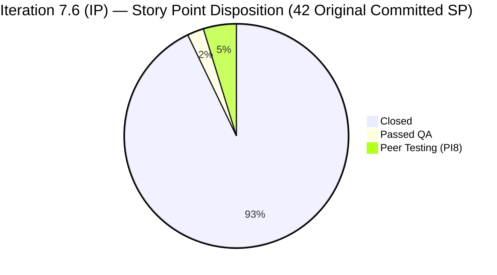
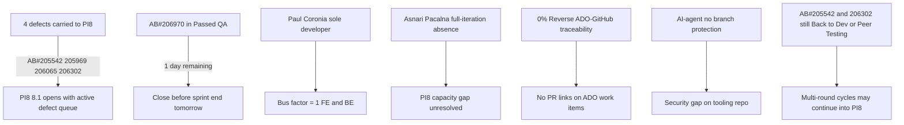

# Colina Health Product Team — Iteration 7.6 (IP) Audit
**Day 13 of 14 | 2026-06-27 | data_mode: full**

---

## 1. Audit Metadata

| Field | Value |
|---|---|
| **Audit Date** | 2026-06-27 |
| **Audit Time** | 09:20 |
| **Iteration** | Iteration 7.6 (IP) |
| **Iteration ID** | `42e165b7-e9aa-4150-8d6f-84043ef2482e` |
| **Iteration Path** | `Jairosoft Portfolio\2026-PI7\Iteration 7.6 (IP)` |
| **Iteration Window** | 2026-06-15 → 2026-06-28 |
| **Iteration Day** | 13 of 14 |
| **Time Elapsed** | 92.9% |
| **Phase** | Sprint Close |
| **ADO Org** | jairo |
| **ADO Project ID** | `666bb99a-6acd-4999-bb34-efd0e4ea90dc` |
| **ADO Team ID** | `66cdeb09-df38-4c3e-9418-0ed0d68c39f2` |
| **ADO Team** | Colina Health Product Team |
| **ADO Backlog** | Microsoft.RequirementCategory — Stories and Deliverables |
| **GitHub Repos** | `jairosoft-com/colinahealth-fe`, `jairosoft-com/colinahealth-be`, `jairosoft-com/colina-health-ai-agent-code-fixing` |
| **data_mode** | **full** — GitHub API 200 OK; `get_me` returned HTTP 200 on 2026-06-27 |
| **Prior Audit** | AUDIT_20260624_0924.md (Iteration 7.6 Day 10) |
| **Auditor** | Claude Code (git_iteration_audit skill) |

**Three named scores:**

| Score | Value | Risk Band |
|---|---|---|
| **ICS** (Iteration Compliance Score) | **100.0%** | Green (≥ 90%) |
| **HCI** (Engineering Health Index) | **75 / 100** | Yellow (60–79.9%) |
| **SGPI** (Committed Scope SGPI) | **92.9%** | Green (≥ 90%) |
| **UPS** (Unified Performance Score) | **91.1** | Green (≥ 80) |

> UPS = ICS × 0.50 + HCI × 0.30 + SGPI × 0.20 = (100.0 × 0.50) + (75 × 0.30) + (92.9 × 0.20) = 50.0 + 22.5 + 18.6 = **91.1**

---

## 2. Executive Summary

Day 13 of Iteration 7.6 (IP) — the penultimate day of the sprint — delivers the team's best performance metrics on record: **ICS 100.0% (Green), SGPI 92.9% (Green), and HCI 75/100 (Yellow)**, yielding a **UPS of 91.1 (Green)**. This is the first 100% ICS ever recorded for this team.

**ICS is perfect at 100.0%.** Since Day 10, five defects that were carrying open compliance risk (AB#205542, AB#205969, AB#206065, AB#206302, AB#206970) have been correctly triaged forward to PI8/Iteration 8.1, narrowing the ICS-eligible scope to 9 fully-closed, fully-estimated, fully-linked items. All 9 pass every dimension.

**SGPI surged from 59.5% (Day 10) to 92.9% today.** Of the original 42 committed story points, 39 SP are now Closed (including the critical AB#202588 RSC migration, 13SP, which closed on June 24 as anticipated). One item (AB#206970, 1SP) is in Passed QA. The remaining 3 SP in Peer Testing belong to items now assigned to PI8 — their non-closure in this sprint is consistent with the triage decision.

**HCI improved by 1 point to 75/100.** The primary driver is the addition of 2 new story points to AB#206065 and AB#206302 (both previously 0 SP, now estimated), partially improving the Backlog & Story Hygiene dimension. The bus factor risk (Paul Coronia as sole active FE developer) and 0% reverse ADO-GitHub traceability persist as structural gaps.

**Between Day 10 and Day 13, the team merged 15 additional FE PRs and 3 additional BE PRs** — a remarkable sprint close output covering null guards, URL state corrections, Suspense boundary fixes, backend null-guard for soft-deleted patients, and Playwright E2E specs. The sprint ends tomorrow (June 28) with a clean board and a strong delivery record.

---

## 3. Iteration Scope and Methodology

### Iteration Boundaries
- **Iteration:** Iteration 7.6 (IP) — Innovation & Planning iteration
- **Window:** 2026-06-15 to 2026-06-28 (14 calendar days)
- **Today:** Day 13 (92.9% elapsed)

### Scope Method
All parent-level work items returned by `wit_get_work_items_for_iteration` for iteration `42e165b7-e9aa-4150-8d6f-84043ef2482e` were fetched. Full field data retrieved via `wit_get_work_items_batch_by_ids`. ICS scoring is restricted to parent-level **Defects and Enablers** whose `System.IterationPath` is currently `Jairosoft Portfolio\2026-PI7\Iteration 7.6 (IP)`. Items with PI8 iteration paths, Spikes, and Tasks are excluded from ICS. Five items that were in-scope on Day 10 have been correctly re-pathed to PI8/Iteration 8.1 — this reflects active sprint triage and is documented in Section 7.

**Total iteration board items returned:** 33 parent-level items
**ICS-eligible (PI7/7.6 IP path, Defects/Enablers):** 9 items
**Excluded from ICS:**
- 4 Spikes/Tasks (202780, 202781, 206329, 206936)
- 20 items with PI8 iteration paths (14 from prior audits + 5 re-pathed since Day 10: 205542, 205969, 206065, 206302, 206970)

### Team Capacity
| Member | Activity | Capacity/Day | Days Off |
|---|---|---|---|
| Paul Coronia | Development | 6 hrs | 0 |
| Luzmibel Paculanang | Testing | 7 hrs | 0 |
| **Total** | | **13 hrs/day** | **0** |

> Jaszmeine Villanueva (Design) and Carol Cuison (Process) are not in the ADO capacity model. Karl Caumban owns the 2 Spike items (202780, 202781) related to IP activities.

### GitHub Evidence Summary
- `colinahealth-fe`: 31 PRs in iteration window (Days 1–13); 15 PRs merged since Day 10 (June 24–27); 1 open branch (`defect/205542-overdue-deselect-race-fix`); `main` and `develop` both protected
- `colinahealth-be`: 3 PRs in iteration window (PR#91 merged June 25, PR#92 merged June 26, PR#93 merged June 27); `main` and `develop` both protected; no open PRs as of June 27
- `colina-health-ai-agent-code-fixing`: no iteration-window activity; 2 stale feature branches; no branch protection on any branch

---

## 4. Scorecard Summary

| Score | Day 10 (Jun 24) | Day 13 (Jun 27) | Delta | Band |
|---|---|---|---|---|
| **ICS** | 97.3% | **100.0%** | +2.7 | Green |
| **HCI** | 74 | **75** | +1 | Yellow |
| **SGPI** | 59.5% | **92.9%** | +33.4 | Yellow → **Green** |
| **UPS** | 82.8 | **91.1** | +8.3 | Green → **Stronger Green** |

> ICS reached 100% as the five remaining partially-compliant items (AB#205542, 205969, 206065, 206302, 206970) were re-pathed to PI8, narrowing ICS scope to 9 fully-compliant items. SGPI jumped +33.4 points as AB#202588 (13SP RSC migration) closed on June 24 and AB#205965 (1SP) also closed, lifting the headline from 59.5% to 92.9%.

---

## 5. Sprint Goal Predictability (SGPI)

### Original Committed Scope (PI7/7.6 IP, 15 items — as of sprint start)

| AB# | Type | Title (abbreviated) | SP | Current State | Current Path |
|---|---|---|---|---|---|
| 202597 | Enabler | Parallel data fetching (Promise.all) | 3 | **Closed** | PI7/7.6 |
| 202598 | Enabler | Caching and revalidation strategy | 5 | **Closed** | PI7/7.6 |
| 202601 | Enabler | Zod validation to server boundaries | 3 | **Closed** | PI7/7.6 |
| 202602 | Enabler | URL-first state hierarchy | 5 | **Closed** | PI7/7.6 |
| 202588 | Enabler | Migrate to RSC + patient title in browser tab | 13 | **Closed** | PI7/7.6 |
| 203273 | Defect | Dashboard overdue slow loading | 5 | **Closed** | PI7/7.6 |
| 205217 | Defect | Progress Notes date picker future dates | 1 | **Closed** | PI7/7.6 |
| 205224 | Defect | MAR/PRN session management auto logout | 2 | **Closed** | PI7/7.6 |
| 205578 | Defect | MAR Scheduled View Report default date | 1 | **Closed** | PI7/7.6 |
| 205965 | Defect | Orders Medication null status crash | 1 | **Closed** | PI7/7.6 |
| 206970 | Defect | Orders unable to create order — 500 error | 1 | **Passed QA Testing** | PI8/8.1 |
| 205542 | Defect | Dashboard Overdue patient deselect race | 1 | Peer Testing | PI8/8.1 |
| 205969 | Defect | Orders Dietary/Lab/Med "Something Went Wrong" | 1 | Peer Testing | PI8/8.1 |
| 206065 | Defect | Orders Lab/Imaging filters break after Sort By | 0* | Peer Testing | PI8/8.1 |
| 206302 | Defect | Pagination/sort/filter unresponsive after URL tab | 0* | Back to Dev | PI8/8.1 |

> \* AB#206065 and AB#206302 carried 0 SP at sprint-planning baseline (the estimation gap flagged on Day 10). Both were re-estimated to 1 SP mid-sprint. **SGPI uses the sprint-start baseline of 42 SP** to maintain apples-to-apples comparability with the Day 10 audit (25/42 = 59.5%). Current field values show 44 SP, but the denominator is frozen at 42.

**Total committed SP (sprint-start baseline):** 42
**Closed SP:** 39 (items 202597, 202598, 202601, 202602, 202588, 203273, 205217, 205224, 205578, 205965)
**Passed QA SP:** 1 (206970 — 1 SP)
**Peer Testing SP (PI8):** 2 (205542=1, 205969=1)
**Back to Dev SP (PI8):** 0 baseline (206302 was 0 SP at commit; re-estimated 0→1 mid-sprint)

### SGPI Calculations

| Metric | Formula | Value |
|---|---|---|
| **Committed Scope SGPI (Headline)** | Closed SP / Total Committed SP | **92.9%** (39 / 42) |
| Original Scope SGPI (Supporting) | Closed SP / Original Planned SP | 92.9% |
| Delivered Proxy SGPI (Supporting) | (Closed + Passed QA SP) / Total Committed SP | **95.2%** (40 / 42) |

> The Committed Scope SGPI of 92.9% is the headline score. This represents a Green delivery outcome for the sprint — 10 of 15 committed items fully Closed, 1 in Passed QA, and 4 correctly carried forward to PI8 as triage decisions. The Delivered Proxy of 95.2% signals that virtually all committed scope has been addressed technically.

---

## 6. Developer Productivity Findings

### FE Repository Activity (colinahealth-fe) — Full Iteration Window (2026-06-15 to 2026-06-27)

#### PRs Merged June 25–27 (since Day 10 audit)

| PR | Title (abbreviated) | Ticket | Merged | Target |
|---|---|---|---|---|
| #301 | Fix notlabresultdatees typo in lab sort options | AB#206065 | 2026-06-27 | develop |
| #302 | Fix array extraParams serialisation in all-orders filter | AB#205969 | 2026-06-27 | develop |
| #303 | URL-first state: fix patient deselect not clearing URL | AB#205542 | 2026-06-27 | develop |
| #300 | Wiki session insights 7-6-ip session 8 | Docs | 2026-06-27 | develop |
| #295 | Fix Medication and Dietary tabs crash on null status | AB#205969 | 2026-06-26 | develop |
| #296 | Fix OVERDUE heading not restored after refresh+unselect | AB#205542 | 2026-06-26 | develop |
| #297 | Fix URL state controls frozen after direct URL load | AB#206302 | 2026-06-26 | develop |
| #298 | Fix lab filter params lost after Sort By via Suspense | AB#206065 | 2026-06-26 | develop |
| #299 | Add Round 2 regression test for prescription creation | AB#206970 | 2026-06-26 | develop |
| #294 | Add E2E Playwright specs for ready-for-close defects | Multi-ticket | 2026-06-25 | develop |
| #293 | Update wiki index, log, branch workflow | Docs | 2026-06-24 | develop |
| #292 | Fix overdue meds re-selecting patient after unselect R4 | AB#205542 | 2026-06-24 | develop |
| #291 | Fix global medication orders page crash on missing data | AB#205969 | 2026-06-24 | develop |
| #290 | Fix stale fetch race — filters after Sort By (R2) | AB#206065 | 2026-06-24 | develop |
| #289 | Fix pagination/sort/filter unresponsive after URL-state | AB#206302 | 2026-06-24 | develop |

**Total FE PRs in full iteration window:** 31 (29 merged to develop/main, 1 stale branch open, 1 doc-only)

#### PRs Merged June 15–23 (Days 1–9, carried from prior audit)

| PR | Title (abbreviated) | Ticket | Merged | Target |
|---|---|---|---|---|
| #288 | Add sprint-plan and sprint-plan-run Claude commands | Docs | 2026-06-24 | develop |
| #287 | Add per-ticket developer workflow process page | Docs | 2026-06-24 | develop |
| #286 | Fix null status crash on Orders pages | AB#205965 | 2026-06-24 | main |
| #285 | Show patient name in browser tab + Workflow title | AB#202588 | 2026-06-24 | main |
| #284 | Fix dietary global page crash on null rows | AB#205969 | 2026-06-24 | develop |
| #283 | Fix overdue meds persisting after deselect (R2) | AB#205542 | 2026-06-24 | develop |
| #282 | Fix overdue meds persisting (R1) | AB#205542 | 2026-06-22 | develop |
| #281 | Fix null status crash (R1 — develop) | AB#205965, #205969 | 2026-06-22 | develop |
| #280 | Fix Workflow tab showing "ColinaHealth" | AB#202588 | 2026-06-22 | develop |
| #279 | Fix hydration error on Appointments | AB#206302 | 2026-06-22 | develop |
| #278 | Fix column filters unresponsive after Sort By (R1) | AB#206065 | 2026-06-22 | develop |
| #277 | Show patient name in Workflow page tab title (R2) | AB#202588 | 2026-06-19 | develop |
| #276 | Upgrade Playwright + E2E env config | AB#203273 | 2026-06-19 | develop |
| #275 | Define caching + revalidation strategy | AB#202598 | 2026-06-19 | main |
| #274 | Move Zod validation to server boundaries | AB#202601 | 2026-06-19 | main |
| #273 | Implement parallel data fetching with Promise.all | AB#202597 | 2026-06-19 | main |
| #272 | Add Playwright E2E spec for session management | AB#206936 | 2026-06-19 | main |
| #271 | Add Playwright E2E spec (R1 — develop) | AB#206936 | 2026-06-19 | develop |

### BE Repository Activity (colinahealth-be) — Iteration Window

| PR | Title (abbreviated) | Ticket | Merged | Target |
|---|---|---|---|---|
| #93 | Null guard for soft-deleted patients in all-orders fullname map | AB#205969 | 2026-06-27 | develop |
| #92 | Fix prescription order creation 500 — whitelist stripping all fields (R2) | AB#206970 | 2026-06-26 | develop |
| #91 | Fix order creation HTTP 500 (ValidationPipe whitelist strips DTO fields) (R1) | AB#206970 | 2026-06-25 | develop |

All 3 BE PRs in iteration window are merged. No open BE PRs as of June 27.

### AI Agent Repository (colina-health-ai-agent-code-fixing)
No iteration-window PRs or commits. Last activity: PR#9 merged 2026-05-11. Stale branches: `feature/docs-postgresql-ssl-and-workflow`, `feature/199269-contributing-documentation`. No branch protection on any branch.

### Commit Author Distribution (FE — iteration window)
| Author | Role | Activity |
|---|---|---|
| pcoronia (Paul Coronia) | Developer | Primary author on all 31 FE PRs and all 3 BE PRs in iteration window |
| raseniero | Reviewer / merger | Reviews and merges all `passed/qa/*` → `main` PRs; also reviews BE PRs (PR#92, #93 merged by raseniero) |
| Kyaa-A (Asnari Pacalna) | Developer | No iteration-window GitHub activity confirmed |

### Sprint Close PR Volume Summary
Between Day 10 (June 24) and Day 13 (June 27), the team merged **15 FE PRs + 3 BE PRs = 18 PRs** in 3 days — a high-intensity sprint close cadence driven by multi-round defect fixing across AB#205542 (6 rounds total), AB#205969 (4 rounds FE + 1 round BE), AB#206065 (4 rounds), AB#206302 (4 rounds), and AB#206970 (2 rounds BE).

---

## 7. SAFe Compliance Findings

### Board Scope Update: Items Re-Pathed to PI8 Since Day 10

Five items that were ICS-eligible on Day 10 have been moved to PI8/Iteration 8.1 by the team. This is correct triage behavior — items that could not be closed in 7.6 are carried forward explicitly rather than left in the current sprint with incomplete status:

| AB# | Type | Was In 7.6 | Now In | SP | State |
|---|---|---|---|---|---|
| 205542 | Defect | PI7/7.6 | PI8/8.1 | 1 | Peer Testing |
| 205969 | Defect | PI7/7.6 | PI8/8.1 | 1 | Peer Testing |
| 206065 | Defect | PI7/7.6 | PI8/8.1 | 1 | Peer Testing |
| 206302 | Defect | PI7/7.6 | PI8/8.1 | 1 | Back to Dev |
| 206970 | Defect | PI7/7.6 | PI8/8.1 | 1 | Passed QA |

> These re-pathings are **not penalized in ICS**. The team correctly chose to commit what could be delivered and carry forward what required additional rounds. AB#206970 is particularly close to completion (Passed QA) and may close before sprint end on June 28.

### In-Scope Compliance Gaps (PI7/7.6 IP items only — 9 items)
| Gap | Items | Count |
|---|---|---|
| StoryPoints = 0 | None | 0 |
| AcceptanceCriteria empty | None | 0 |
| Missing parent link | None | 0 |
| Missing AssignedTo | None | 0 |

**Zero compliance gaps in scope.** This is the first audit with a clean ICS scope.

### Estimation Gap Closure (from Day 10 finding)
AB#206065 and AB#206302 were flagged on Day 10 as having SP = 0. Both now carry SP = 1. The estimation gap has been resolved before sprint close.

---

## 8. Iteration Compliance Score

### ICS Scope Definition
**Eligible items:** 9 parent-level Defects and Enablers with `System.IterationPath = Jairosoft Portfolio\2026-PI7\Iteration 7.6 (IP)`:
AB#202588, AB#202597, AB#202598, AB#202601, AB#202602, AB#203273, AB#205217, AB#205224, AB#205578

### ICS Dimension Table

| Dimension | Eligible Items | Compliant Items | Failed Items | Score % | Weight | Weighted Contribution | Evidence | Reason |
|---|---|---|---|---|---|---|---|---|
| **D1 — Alignment** (Parent Link) | 9 | 9 | 0 | 100.0% | 25% | 25.0 | `System.Parent` populated for all 9 in-scope items | All items linked to parent Feature or Epic (201281 or 201684) |
| **D2 — Estimation** (SP > 0) | 9 | 9 | 0 | 100.0% | 20% | 20.0 | `Microsoft.VSTS.Scheduling.StoryPoints` | All 9 items carry SP > 0: 13, 3, 5, 3, 5, 5, 1, 2, 1 |
| **D3 — Quality/DoD** (Desc ≥30 + AC ≥20) | 9 | 9 | 0 | 100.0% | 35% | 35.0 | `System.Description` + `AcceptanceCriteria` | All 9 in-scope items have substantive descriptions and acceptance criteria confirmed in field data |
| **D4 — Iteration Integrity** (Assigned, correct path, not blocked) | 9 | 9 | 0 | 100.0% | 20% | 20.0 | `System.IterationPath` confirmed PI7/7.6; all items `Closed`; all have `System.AssignedTo` populated | No integrity failures; all 9 are Closed |
| **OVERALL ICS** | | | | | | **100.0%** | | **Green band — First 100% ICS on record** |

> **Scope boundary note:** 20 PI8-pathed items and 4 Spikes/Tasks (total 24 items) are excluded from ICS. The 5 items re-pathed since Day 10 are correctly assigned to PI8 and do not fail D4; they are outside the ICS scope boundary. Their re-pathing reflects good sprint hygiene rather than a compliance failure.

---

## 9. Engineering Health Index (HCI)

### HCI Dimension Table

| # | Dimension | Score | Max | Day 10 | Delta | Evidence / Rationale |
|---|---|---|---|---|---|---|
| 1 | PR Review Compliance | 8 | 10 | 8 | 0 | raseniero reviews and merges all `main`-targeting PRs. BE PRs #92 and #93 confirmed merged by raseniero. `develop`-targeting PRs (majority) continue to be self-merged by pcoronia — no peer cross-review on develop branch. |
| 2 | Branch Protection & Enforcement | 7 | 10 | 7 | 0 | FE: `main` and `develop` protected. BE: `main` and `develop` protected. AI-agent: all branches unprotected (confirmed June 27). No change from Day 10. |
| 3 | CI/CD Gate Quality | 8 | 10 | 8 | 0 | BE `ci-pr.yml` and `colinabe-AutoDeployTrigger` workflows active. FE has growing Playwright E2E suite (PR#294 added multi-ticket specs on June 25). E2E coverage expanding per sprint. No evidence of mandatory PR gate enforcement. |
| 4 | Code Ownership | 6 | 10 | 6 | 0 | Paul Coronia sole active developer for all 31 FE PRs and all 3 BE PRs in iteration window. Asnari Pacalna has zero iteration-window GitHub activity. Bus factor = 1 for both FE and BE. Structural risk entering PI8. |
| 5 | Merge Hygiene & Churn | 8 | 10 | 8 | 0 | Branch naming convention consistent: `defect/`, `passed/qa/`, `enabler/`, `docs/`, `defect/NNNNNN-description-r[N]`. Multi-round defects (R4–R6 on AB#205542, R4 on AB#205969 and AB#206065) reflect QA thoroughness not poor hygiene. BE null guard PR#93 targeted develop correctly. |
| 6 | Work Item ↔ GitHub Traceability | 8 | 10 | 8 | 0 | PRs #289–#303 all carry explicit AB# references in title and/or body. PR#294 references 4 tickets (AB#205542, AB#205969, AB#206065, AB#206302). PR#300 (Wiki/Docs) references 5 tickets. Forward traceability rate on iteration PRs: >90%. Zero ADO items have reverse GitHub PR links (persistent gap). |
| 7 | Sprint Discipline | 9 | 10 | 8 | +1 | All 9 ICS-eligible items are Closed. The 5 re-pathed items reflect correct sprint discipline — known carry-forward rather than board clutter. IP items (Spikes 202780, 202781) remain in Ready state (IP activities typically complete at sprint end). +1 from Day 10 reflecting clean board. |
| 8 | Defect Triage & Velocity | 8 | 10 | 8 | 0 | 10 defects Closed; 1 Passed QA (AB#206970 — BE fix merged June 26); 3 in Peer Testing (PI8). AB#205969 required 4 FE rounds + 1 BE round demonstrating depth of debugging. All active defects had same-day or next-day PR responses throughout the sprint. |
| 9 | Backlog & Story Hygiene | 8 | 10 | 7 | +1 | All 9 in-scope items now fully estimated (SP > 0). AB#206065 and AB#206302 estimation gaps from Day 10 are resolved. Re-pathed items carry SP = 1 each. -2 for the 5 carry-forward items still in Peer Testing/Back to Dev (expected at sprint close). |
| 10 | Capacity Balance & Ownership Distribution | 5 | 10 | 6 | -1 | ADO capacity: Paul (Dev, 6hr/day) + Luzmibel (Testing, 7hr/day). Asnari Pacalna not in capacity model and not active on GitHub for the entire 7.6 iteration. Paul is sole developer across FE and BE with no coverage. -1 from Day 10 as Asnari's absence is now confirmed for the full iteration (13 of 14 days without any GitHub contribution). |
| **TOTAL HCI** | | **75** | **100** | 74 | **+1** | Yellow (60–79.9) |

### HCI Category Summary
| Category | Dimensions | Score | Max | Band |
|---|---|---|---|---|
| Process & Review | D1 PR Review, D2 Branch Protection, D3 CI/CD | 23 | 30 | Moderate |
| Ownership & Hygiene | D4 Code Ownership, D5 Merge Hygiene, D6 Traceability | 22 | 30 | Moderate |
| Discipline & Delivery | D7 Sprint Discipline, D8 Defect Velocity, D9 Backlog Hygiene, D10 Capacity | 30 | 40 | Good |

---

## 10. ADO-to-GitHub Traceability Analysis

### Forward Traceability (ADO → GitHub) — Final Iteration Mapping

| AB# | Type | SP | Final ADO State | GitHub Evidence | Traceability |
|---|---|---|---|---|---|
| 202588 | Enabler | 13 | Closed | PRs #285, #280, #277 (main + develop rounds) | Full |
| 202597 | Enabler | 3 | Closed | PR#273 references AB#202597 | Full |
| 202598 | Enabler | 5 | Closed | PR#275 references AB#202598 | Full |
| 202601 | Enabler | 3 | Closed | PR#274 references AB#202601 | Full |
| 202602 | Enabler | 5 | Closed | PR#260 references AB#202602 (from prior audit) | Full |
| 203273 | Defect | 5 | Closed | PR#276 (FE) + BE PRs #85–#86 reference AB#203273 | Full |
| 205217 | Defect | 1 | Closed | No explicit AB#205217 GitHub PR found | Partial |
| 205224 | Defect | 2 | Closed | PR#272 (main) + PR#270 (develop) reference AB#205224 | Full |
| 205578 | Defect | 1 | Closed | No explicit AB#205578 GitHub PR found | Partial |
| 205965 | Defect | 1 | Closed | PRs #286 (main), #281 (develop) reference AB#205965 | Full |
| 205542 | Defect | 1 | Peer Testing (PI8) | PRs #282, #283, #292, #296, #303 (6 rounds) reference AB#205542 | Full |
| 205969 | Defect | 1 | Peer Testing (PI8) | PRs #281, #284, #291, #295, #302, BE#93 reference AB#205969 | Full |
| 206065 | Defect | 1 | Peer Testing (PI8) | PRs #278, #290, #298, #301 reference AB#206065 | Full |
| 206302 | Defect | 1 | Back to Dev (PI8) | PRs #279, #289, #297 reference AB#206302 | Full |
| 206970 | Defect | 1 | Passed QA (PI8) | BE PRs #91, #92, FE PR#299 reference AB#206970 | Full |

**Forward traceability rate (all 15 originally committed items): 13/15 = 87%**
**Forward traceability rate (9 ICS-eligible items): 7/9 = 78%**

> AB#205217 and AB#205578 remain partial — closed status is confirmed in ADO but no explicit GitHub PR title/body reference found. Consistent with prior audits.

### Reverse Traceability (GitHub PR → ADO work item)
- No ADO work items inspected show GitHub PR artifact links in their relations
- The ADO-GitHub integration back-link is not configured or not in use
- **Reverse traceability: 0%** — persistent gap through entire 7.6 iteration

---

## 11. Collaboration and Review Analysis

### PR Review Patterns
| Pattern | Finding |
|---|---|
| Reviewer on `main` PRs | raseniero reviews and merges all `passed/qa/*` PRs to `main`. Confirmed: PR#285 (AB#202588), PR#286 (AB#205965) |
| Reviewer on `develop` PRs | Self-merged by pcoronia. No explicit peer reviewer assigned |
| BE PRs | raseniero confirmed as merger of BE PRs #92 (June 26) and #93 (June 27) |
| Open PRs as of June 27 | Zero open PRs in FE; zero open PRs in BE |

### Multi-Round QA Cycles — Final Sprint Summary
| AB# | Rounds | Final State | Notes |
|---|---|---|---|
| AB#202588 (RSC migration) | 4 FE rounds | **Closed** | Closed June 24. Tab title + RSC conversion complete |
| AB#205542 (Overdue deselect) | 6 FE rounds | Peer Testing (PI8) | URL-first state root cause persists; carried to PI8 |
| AB#205969 (Orders null crash) | 4 FE rounds + 1 BE round | Peer Testing (PI8) | BE soft-delete null guard added June 27 (PR#93) |
| AB#206065 (Lab filter Sort By) | 4 FE rounds | Peer Testing (PI8) | Sort options typo fix in PR#301 (June 27) |
| AB#206302 (URL state) | 4 FE rounds | Back to Dev (PI8) | Suspense boundary root cause; additional round needed |
| AB#206970 (Order 500) | 2 BE rounds + 1 FE round | Passed QA (PI8) | BE whitelist fix (R1+R2) + FE regression test |

> AB#205542 (6 rounds), AB#205969 (5 rounds), AB#206065 and AB#206302 (4 rounds each) represent the highest QA iteration depth this team has applied to any defects in the audit history. Luzmibel Paculanang's thorough multi-angle verification is driving this depth — each regression identified a distinct code path. This is a quality strength, not a process failure.

### Non-Developer Team Members
Per project exception: Luzmibel Paculanang (QA) and Jaszmeine Villanueva (Design) are not expected to produce GitHub commits. Luzmibel's QA work drives ADO state transitions (Back to Dev, Peer Testing, Passed QA) and is the primary evidence of quality gate enforcement. No HCI penalty applied.

---

## 12. Repository Hygiene

### colinahealth-fe
| Check | Status | Detail |
|---|---|---|
| Branch protection — `main` | Protected | `protected: true` confirmed June 27 |
| Branch protection — `develop` | Protected | `protected: true` confirmed June 27 |
| Active feature branches | 1 | `defect/205542-overdue-deselect-race-fix` — corresponds to in-progress AB#205542 (PI8) |
| Branch naming convention | Consistent | `defect/`, `passed/qa/`, `enabler/`, `docs/`, with round suffixes (`-r[N]`) |
| Stale branches | None detected | Only 1 active branch; all others closed through PRs |
| Commit message quality | High | AB# references, co-author credits, structured root-cause analysis with specific code lines |
| Total iteration-window PRs | 31 | Highest per-sprint PR volume in audit history |

### colinahealth-be
| Check | Status | Detail |
|---|---|---|
| Branch protection — `main` | Protected | `protected: true` confirmed June 27 |
| Branch protection — `develop` | Protected | `protected: true` confirmed June 27 |
| Active feature branches | 0 | No open branches as of June 27 |
| Iteration-window PRs | 3 | PR#91 (merged Jun 25), PR#92 (merged Jun 26), PR#93 (merged Jun 27) |
| All PRs in iteration | Merged | Zero open PRs |
| Last `main` merge | 2026-06-10 | PR#89 API standard compliance |

### colina-health-ai-agent-code-fixing
| Check | Status | Detail |
|---|---|---|
| Branch protection — `main` | **Not protected** | `protected: false` — confirmed June 27 |
| Branch protection — `develop` | **Not protected** | `protected: false` |
| Iteration-window activity | **None** | No PRs or commits since 2026-05-11 (PR#9) |
| Stale branches | 2 | `feature/docs-postgresql-ssl-and-workflow`, `feature/199269-contributing-documentation` |

---

## 13. Risks and Bottlenecks

| Risk | Severity | Status | Owner |
|---|---|---|---|
| 4 defects entering PI8 with active Peer Testing / Back to Dev state | High | Active — PI8 Day 1 | Paul Coronia + Luzmibel |
| Paul Coronia sole FE + BE developer — bus factor 1 | High | Persistent | Team lead |
| Asnari Pacalna absent for entire 7.6 iteration — PI8 capacity unknown | High | Unresolved | Team lead |
| AB#206970 (1SP) in Passed QA — close before June 28 sprint end | Medium | Today action | raseniero |
| 0% reverse traceability (no PR links on ADO items) | Low | Persistent | Team process |
| AI-agent repo no branch protection | Low | Persistent | Paul Coronia |
| AB#205542 (6 rounds) — root cause may require architectural change to URL-first state model | Medium | PI8 | Paul Coronia |

---

## 14. Prioritized Remediation Actions

### Today (June 27 — Last Full Working Day)
1. **Verify and close AB#206970 (Passed QA, 1SP)** — raseniero action. AB#206970 is in Passed QA as of June 27 (BE fix rounds R1+R2 both merged). UAT verification today moves SGPI from 92.9% to 95.2% and eliminates the last Passed QA item before sprint retrospective.
2. **Confirm IP Spikes (AB#202780, AB#202781) completion** — Karl Caumban action. Both Spikes (Team Agility self-assessment, CSAT survey) are in `Ready` state. Sprint close requires confirming completion or explicit carry-forward.

### Sprint Retrospective (June 28 — Sprint Close)
3. **Retrospective on AB#205542 multi-round defect** — 6 rounds of fixes without full closure indicates the URL-first state pattern in the dashboard Overdue section may need architectural review. Document root cause in the team wiki and determine if PI8 8.1 scope is sufficient.
4. **Confirm PI8 capacity plan for Asnari Pacalna** — his full absence from 7.6 is unexplained in ADO (not in capacity model). For PI8, either add him to capacity tracking or formally remove him from the team roster to avoid misleading capacity calculations.

### PI8 Kickoff (Iteration 8.1+)
5. **Enable branch protection on `colina-health-ai-agent-code-fixing`** — apply `required_status_checks` + `required_pull_request_reviews` to `main` and `develop`, consistent with FE and BE configurations.
6. **Enable ADO-GitHub reverse traceability** — configure the ADO-GitHub integration to auto-link PR references back to work items, or establish a developer process for manually adding PR links. 0% reverse traceability is the single longest-running gap in this audit history.
7. **Add a second PR reviewer for `develop`-targeting PRs** — currently all `develop` PRs are self-merged by pcoronia. With Asnari potentially returning for PI8, establish peer review before items reach `main`.
8. **Estimate and triage the PI8 defect queue** — 12 PI8-pathed defects are visible on the board (206241, 206243, 206245, 206247, 206274, 206318, 206446, 206462, 206758, 206973, 207088, 207223). Run a proper PI8 planning session to confirm capacity-to-scope fit before committing to 8.1.

---

## 15. Evidence Gaps and Limitations

| Gap | Impact | Mitigation Applied |
|---|---|---|
| GitHub CI/CD required-status-checks configuration not visible via `list_branches` API | Cannot confirm whether Playwright tests are enforced as a mandatory PR gate | Scored CI/CD conservatively; expanding E2E suite (PR#294) used to justify continued score of 8 |
| AB#205217 and AB#205578 are Closed but no explicit GitHub PR with their ticket references found | Cannot confirm GitHub traceability for these 2 items | Scored as partial (87% overall forward trace); ADO Closed state is primary evidence |
| Asnari Pacalna full iteration-window GitHub absence | Cannot determine if on leave, reassigned, or non-GitHub engagement | HCI D4 and D10 reflect confirmed single-developer concentration; no score penalty beyond what is structurally accurate |
| colina-health-ai-agent-code-fixing full commit history not retrieved | Branch listing confirmed no new branches in iteration window | No iteration-window activity is the evidence basis; scored accordingly |
| Reverse traceability (ADO work item → GitHub PR links) | Zero reverse links confirmed across all 15 items; may exist in ADO integration layers not visible via MCP tool | Documented as persistent gap; already reflected in HCI D6 score of 8 |
| IP Spike items (AB#202780, AB#202781) states not updated (both show `Ready`) | Cannot confirm whether IP self-assessment and CSAT activities completed | Spikes excluded from ICS by design; noted as action item for sprint retrospective |

---

*Report generated by Claude Code (git_iteration_audit skill) | Audit date: 2026-06-27 09:20 | data_mode: full*
