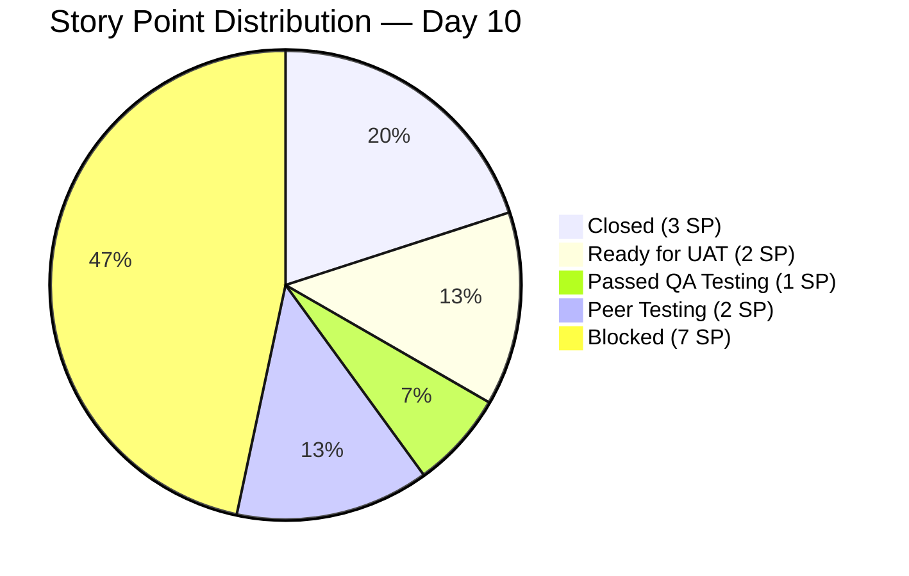
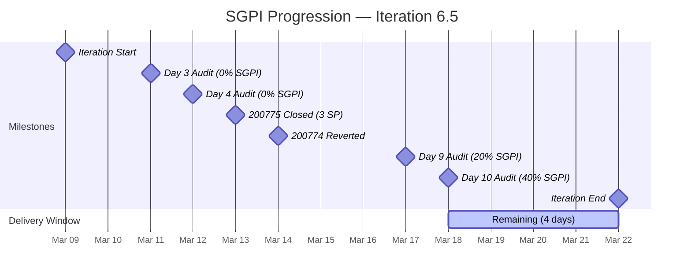
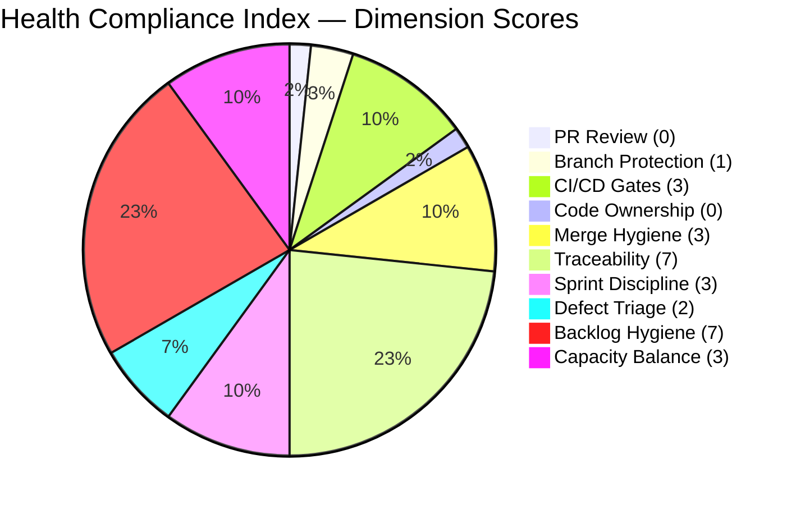
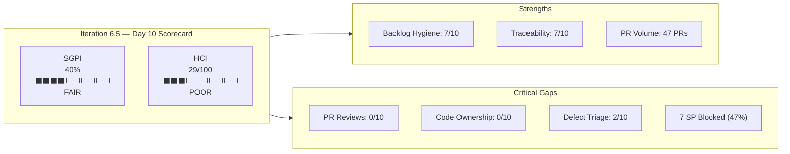

# Colina Health — Iteration 6.5 Scorecard

**Report Date:** March 18, 2026 (Day 10 of 14)
**Team:** Colina Health Product Team
**Iteration:** 6.5 (March 9–22, 2026)
**Companion Audit:** `AUDIT_20260318_1030.md`

---

## 1. Sprint Goal Predictability Index (SGPI)

### Definition

The Sprint Goal Predictability Index measures the ratio of **delivered story points** to **planned story points** for the iteration. It is the primary SAFe metric for assessing whether the team is on track to meet its sprint commitment.

$$
\text{SGPI} = \frac{\text{Delivered SP (Closed + Accepted)}}{\text{Total Planned SP}} \times 100
$$

### Planned Story Point Commitment

| ID | Story | SP | State (Day 10) | Delivery Status |
|----|-------|----|-----------------|-----------------|
| 200775 | Sort Scheduled Medications | 3 | **Closed** | Delivered |
| 200186 | PT Belongings — Access & Manage | 2 | **Ready for UAT** | Delivered (pending acceptance) |
| 201134 | Change Overdue to OVERDUE | 1 | **Passed QA Testing** | Delivered (pending acceptance) |
| 200370 | PT Belongings — Edit Forms | 2 | **Peer Testing** | In Progress |
| 200364 | PT Belongings — Add Forms | 2 | **Blocked** | At Risk (3 child bugs) |
| 200774 | Generate 7-Day Medication Window | 5 | **Blocked** | At Risk (reverted Day 6) |
| **Total** | | **15 SP** | | |

### SGPI Calculation

| Measure | SP | % of Plan |
|---------|----|-----------:|
| **Closed (Done)** | 3 | **20.0%** |
| **Delivered (Closed + Ready for UAT + Passed QA)** | 6 | **40.0%** |
| **In Progress (Peer Testing)** | 2 | 13.3% |
| **Blocked / At Risk** | 7 | 46.7% |

### Forecast Scenarios (4 days remaining)

| Scenario | Stories Closing | Forecasted SP Delivered | SGPI |
|----------|----------------|------------------------:|-----:|
| **Optimistic** | 200775 + 200186 + 201134 + 200370 | 8 / 15 | **53%** |
| **Likely** | 200775 + 200186 + 201134 | 6 / 15 | **40%** |
| **Pessimistic** | 200775 only | 3 / 15 | **20%** |

> **Current SGPI (Closed only): 20%**
> **Current SGPI (Delivered): 40%**
> **Forecasted SGPI (Likely): 40%**

### SGPI Trend Across Audits

| Audit Day | Closed SP | Delivered SP | SGPI (Closed) | SGPI (Delivered) |
|-----------|-----------|--------------|---------------:|------------------:|
| Day 3 (Mar 11) | 0 | 0 | 0% | 0% |
| Day 4 (Mar 12) | 0 | 0 | 0% | 0% |
| Day 9 (Mar 17) | 3 | 3 | 20% | 20% |
| **Day 10 (Mar 18)** | **3** | **6** | **20%** | **40%** |

### SGPI Interpretation

| SGPI Range | Rating | Assessment |
|------------|--------|------------|
| 80–100% | Excellent | On track or ahead of plan |
| 60–79% | Good | Minor risks, likely achievable |
| 40–59% | **Fair** | Significant risks, partial delivery expected |
| 20–39% | Poor | Major blockers, sprint goal unlikely |
| 0–19% | Critical | Sprint goal will not be met |

**Day 10 Rating: FAIR (40% delivered)** — The team has delivered 6 of 15 SP with 4 days remaining. However, 7 SP (47%) are Blocked, making it unlikely the team exceeds 53% even in the best case.

---

## 2. Health Compliance Index (HCI)

### Definition

The Health Compliance Index measures adherence to engineering process standards and ADO governance practices. Each dimension is scored 0–10, yielding a composite score out of 100.

$$
\text{HCI} = \frac{\sum \text{Dimension Scores}}{100} \times 100
$$

### Engineering Process Dimensions (5 dimensions, 50 points max)

#### 2.1 PR Review Compliance — Score: 0 / 10

| Metric | Value | Evidence |
|--------|-------|----------|
| PRs with independent reviewer | 0 / 47 | All PRs self-merged |
| PRs with ≥1 approval before merge | 0 / 47 | No review gates |
| Average review turnaround | N/A | No reviews requested |

**Finding `[GitHub]`:** 100% of pull requests across both repos were merged by the PR author without any independent review. This is the most critical compliance gap.

**Score Rationale:** 0/10 — complete absence of peer review.

#### 2.2 Branch Protection Enforcement — Score: 1 / 10

| Control | Status | Evidence |
|---------|--------|----------|
| Required reviewers on `main` | Not enforced | Self-merges to main observed |
| Required reviewers on `develop` | Not enforced | Self-merges to develop observed |
| Status checks required | Not observed | No CI check gates on PRs |
| Force push protection | Unknown | Not verifiable from PR data |

**Finding `[GitHub]`:** Gitflow branch naming conventions (`feature/`, `passed/qa/`, `defect/`) are followed, indicating structural awareness, but no branch protection rules enforce the process.

**Score Rationale:** 1/10 — naming conventions present but no enforcement.

#### 2.3 CI/CD Gate Quality — Score: 3 / 10

| Metric | Value | Evidence |
|--------|-------|----------|
| Build failures post-merge | 3 | FE PRs #82, #83, #84 (build fixes on Mar 19) |
| Pre-merge CI checks | Not observed | No status checks on PRs |
| Automated test gates | Not observed | No test reports linked to PRs |

**Finding `[GitHub]`:** Three consecutive build-fix PRs (#82–84) were required after merging 200186 to `passed/qa`, indicating code reached main-line branches without adequate pre-merge validation.

**Score Rationale:** 3/10 — CI exists but doesn't gate merges; post-merge breakage detected.

#### 2.4 Code Ownership (CODEOWNERS) — Score: 0 / 10

| Control | Status | Evidence |
|---------|--------|----------|
| CODEOWNERS file in FE repo | Not present | No auto-assignment of reviewers |
| CODEOWNERS file in BE repo | Not present | No auto-assignment of reviewers |
| CODEOWNERS file in AI repo | Not present | No auto-assignment of reviewers |

**Finding `[GitHub]`:** No CODEOWNERS files exist in any of the 3 scoped repositories. Without CODEOWNERS, there is no automated reviewer assignment and no ownership-based merge protection.

**Score Rationale:** 0/10 — complete absence.

#### 2.5 Merge Hygiene — Score: 3 / 10

| Signal | Count | Evidence |
|--------|-------|----------|
| Revert PRs | 2 | FE #57 (200774), BE #28 (200774) |
| High-churn stories (>5 PRs) | 1 | 199600: 12+ incremental FE PRs |
| Build-break fixes | 3 | FE #82, #83, #84 |
| Merge-to-main without QA | Observed | 200774 promoted then reverted within 24h |

**Finding `[Cross-system]`:** Story 200774 was merged to main (BE #27 `passed/qa`, FE #56 `passed/qa`) and then reverted the next day (FE #57, BE #28). Defect 199600 required 12+ incremental PRs over 2 days, indicating incomplete initial implementation.

**Score Rationale:** 3/10 — active rework signals and escaped defects.

### ADO Governance Dimensions (5 dimensions, 50 points max)

#### 2.6 Work Item ↔ GitHub Traceability — Score: 7 / 10

| Metric | Value |
|--------|-------|
| PRs linked to ADO work item IDs | ~40 / 47 (85%) |
| PRs with no traceable ADO link | ~7 / 47 (15%) |
| Linking method | Branch names, PR titles |

**Finding `[Cross-system]`:** The team consistently uses ADO work item IDs in branch names (`feature/200364-*`, `defect/199600-*`) and PR titles. ~85% of PRs are traceable. The unlinked PRs are primarily build fixes and infrastructure changes.

**Score Rationale:** 7/10 — strong traceability with minor gaps.

#### 2.7 Sprint Discipline — Score: 3 / 10

| Metric | Value | Evidence |
|--------|-------|----------|
| Items started during iteration | 11 / 21 | 10 defects untouched in "New" |
| Items with state progression | 9 / 21 | Only stories + 2 defects moved |
| Mid-sprint scope additions | 8 | Defects 201198, 201200, 201223, 201234, 201284 added post-Day 9 |

**Finding `[ADO]`:** 10 of 12 defects remain in "New" state with no development attention. Five new defects were added between Day 9 and Day 10 (mid-sprint scope creep). The sprint backlog expanded without corresponding capacity adjustment.

**Score Rationale:** 3/10 — nearly half the backlog is untouched; mid-sprint scope additions unmanaged.

#### 2.8 Defect Triage & Resolution — Score: 2 / 10

| Metric | Value |
|--------|-------|
| Total defects in iteration | 12 |
| Defects triaged (assigned + prioritized) | 5 / 12 |
| Defects in "New" (untriaged) | 7 / 12 |
| Defects resolved (Closed/Fixed) | 0 / 12 |
| Defects with active development | 2 / 12 (199600, 201142) |

**Finding `[ADO]`:** No defects have been resolved (Closed) during the iteration. Seven defects have no assignee. The team's defect resolution rate is 0%.

**Score Rationale:** 2/10 — minimal triage, zero resolution.

#### 2.9 Backlog Hygiene — Score: 7 / 10

| Metric | Value | Evidence |
|--------|-------|----------|
| Stories with story points | 6 / 6 (100%) | All stories have SP assigned |
| Stories with child tasks | 6 / 6 (100%) | All stories decomposed |
| Items with descriptions | Majority | Spot-checked |
| Acceptance criteria documented | Partial | Not consistently verified |
| Tags/labels used | Yes | "PT Belongings", "Prio", "Scheduled Medications" |

**Finding `[ADO]`:** Story decomposition and point estimation are strong. All 6 stories have both story points and child tasks. Tagging is used for thematic grouping.

**Score Rationale:** 7/10 — solid fundamentals; acceptance criteria consistency unverified.

#### 2.10 Capacity Balance & Utilization — Score: 3 / 10

| Developer | PRs | Stories Owned | Role |
|-----------|-----|---------------|------|
| pcoronia (Paul Coronia) | 26 | 5 of 6 stories | Primary dev (FE + BE) |
| Kyaa-A (Asnari Pacalna) | 21 | 1 story + 2 defects | Secondary dev (FE-heavy) |
| colinaluke-jairo (Luke Colina) | 0 | 0 | Inactive |
| sante8jairo (Vicsante Aseniero) | 0 | 0 | Inactive (pre-iteration only) |
| Jaszmeine Villanueva | 0 PRs | 3 defects assigned | QA only |
| Luzmibel Paculanang | 0 PRs | 1 spike + 1 defect | QA only |
| Muriel Angelo Yaco | 0 PRs | 1 spike | QA intern |

**Finding `[Cross-system]`:** 83% of story points (5 of 6 stories, 12 of 15 SP) are concentrated on a single developer (pcoronia). Two team members with GitHub access show zero iteration activity. This creates a single point of failure.

**Score Rationale:** 3/10 — extreme concentration risk; 2 developers inactive.

---

### HCI Composite Score

| # | Dimension | Category | Score | Max |
|---|-----------|----------|------:|----:|
| 1 | PR Review Compliance | Engineering | 0 | 10 |
| 2 | Branch Protection Enforcement | Engineering | 1 | 10 |
| 3 | CI/CD Gate Quality | Engineering | 3 | 10 |
| 4 | Code Ownership (CODEOWNERS) | Engineering | 0 | 10 |
| 5 | Merge Hygiene | Engineering | 3 | 10 |
| 6 | Work Item ↔ GitHub Traceability | ADO Governance | 7 | 10 |
| 7 | Sprint Discipline | ADO Governance | 3 | 10 |
| 8 | Defect Triage & Resolution | ADO Governance | 2 | 10 |
| 9 | Backlog Hygiene | ADO Governance | 7 | 10 |
| 10 | Capacity Balance & Utilization | ADO Governance | 3 | 10 |
| | **TOTAL** | | **29** | **100** |

### HCI Interpretation

| HCI Range | Rating | Assessment |
|-----------|--------|------------|
| 80–100 | Excellent | Mature engineering practices, strong governance |
| 60–79 | Good | Solid foundations with minor gaps |
| 40–59 | Fair | Noticeable process gaps requiring attention |
| 20–39 | **Poor** | Significant compliance failures |
| 0–19 | Critical | Engineering and governance controls absent |

**Day 10 HCI Rating: POOR (29/100)** — The team demonstrates strong fundamentals in backlog hygiene (7/10) and work item traceability (7/10) but has critical failures in peer review (0/10), code ownership (0/10), and defect management (2/10).

---

## Combined Scorecard Summary

| Metric | Value | Rating | Trend |
|--------|-------|--------|-------|
| **Sprint Goal Predictability Index** | 40% (6/15 SP delivered) | **FAIR** | ↑ from 20% on Day 9 |
| **Health Compliance Index** | 29/100 | **POOR** | First measurement |

### Top 3 Actions to Improve Both Indices

1. **Enable branch protection with required reviews** on `main` and `develop` across all 3 repos → directly impacts HCI dimensions 1, 2, 4 (potential +20 pts)
2. **Triage and assign the 10 unworked defects by Day 11** → directly impacts HCI dimensions 7, 8 (+5 pts) and removes sprint ambiguity for SGPI forecast
3. **Unblock 200774 (5 SP)** with root cause analysis and remediation plan → directly impacts SGPI (could move from 40% to 73% if resolved)

---

> **Audit Boundary Disclosure:** This scorecard exclusively analyzed the `Colina Health Product Team` board in the `Jairosoft Portfolio` project and GitHub repositories `colinahealth-fe`, `colinahealth-be`, and `colina-health-ai-agent-code-fixing`. No other boards, teams, projects, or repositories were inspected.
