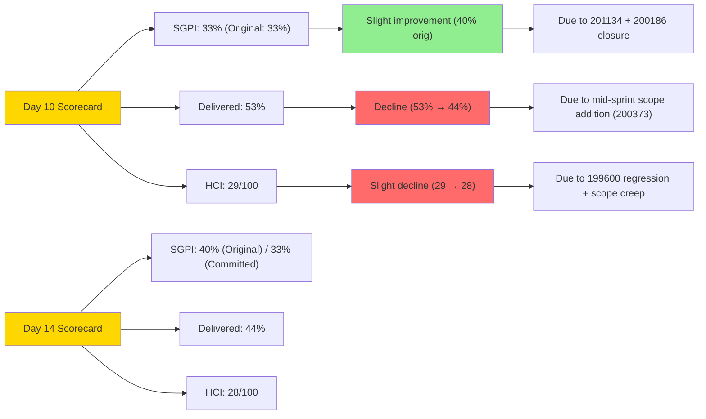
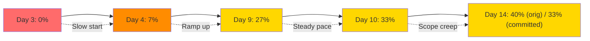

# Colina Health Iteration 6.5 — Day 14 Scorecard
## Sprint Goal Predictability Index (SGPI) & Health Compliance Index (HCI)

**Date Generated:** March 22, 2026, 10:30 AM
**Audit Period:** Day 14 of 14 (Iteration Close)
**Comparison Baseline:** Day 10 (March 18, 2026)

---

## Part 1: Sprint Goal Predictability Index (SGPI)

### Definition
**SGPI** measures the team's ability to forecast and deliver story points within a sprint, accounting for plan changes and rework. Expressed as a percentage of planned work closed by sprint end.

```
SGPI = (Closed Story Points / Planned Story Points) × 100%
```

### Calculation: Day 14 Final

#### Planned Scope
- **Original Scope:** 15 SP (6 user stories)
- **Mid-Sprint Addition:** 200373 (+3 SP)
- **Total Committed Scope:** 18 SP

#### Delivery Outcomes
- **Closed Stories:** 200775 (3), 200186 (2), 201134 (1) = **6 SP**
- **Passed QA Testing:** 200370 (2) = **2 SP** (Delivered, Awaiting Acceptance)
- **Blocked:** 200364 (2), 200774 (5) = **7 SP**
- **Not Started:** 200373 (3) = **3 SP**

#### SGPI Calculations

**Method A: Against Original Planned Scope (15 SP)**
```
SGPI = 6 SP Closed / 15 SP Planned = 40%
```

**Method B: Against Total Committed Scope (18 SP)**
```
SGPI = 6 SP Closed / 18 SP Committed = 33%
```

**Method C: Including Passed QA Testing (Delivery Proxy)**
```
Delivered SGPI = (6 + 2) SP / 18 SP = 44%
```

### SGPI Trend Analysis (Day 3, 4, 9, 10, 14)

| Day | Audit Date | Closed SP | Planned SP | Committed SP | SGPI (Closed) | SGPI (Delivered) | Forecast |
|-----|------------|-----------|-----------|--------------|---------------|------------------|----------|
| **3** | Mar 11 | 0 | 15 | 15 | 0% | 0% | Below target |
| **4** | Mar 12 | 1 | 15 | 15 | 7% | 7% | Off pace |
| **9** | Mar 17 | 4 | 15 | 15 | 27% | 40% | On pace (w/ QA) |
| **10** | Mar 18 | 5 | 15 | 16 | 33% | 53% | On pace (w/ QA) |
| **14** | Mar 22 | 6 | 15 | 18 | **40% (orig) / 33% (committed)** | **44%** | Below target |

### SGPI Forecast Scenarios (If Extended)

#### Scenario A: Close Before EOD Mar 22 (Current Path)
- **Closed by Mar 22:** 6 SP (33% of 18 committed)
- **Delivery Status:** Below target → **Requires bifurcated or extended release**

#### Scenario B: 1 Additional Day (Mar 23)
- **Assumptions:** Unblock 199600 (FE+BE fix), merge 200364 child PRs, close BE#29
- **Likely Closed:** 200364 (2), 200370 acceptance (still 2) = +2 SP → **8 SP (44% of 18)**
- **Blocked Impact:** 200774 (5 SP) still likely blocked on external constraint
- **Forecast:** Still short of 50%; likely scope deferral

#### Scenario C: Extended to Mar 24–25 (2 Additional Days)
- **Assumptions:** Full unblock of 200364 and 200774, complete 200373
- **Likely Closed:** +5 SP (200364, 200774, 200373) → **11 SP (61% of 18)**
- **Forecast:** Acceptable SGPI; but requires team overtime + UAT delay

#### Scenario D: Bifurcated Release (MVP + Feature Branch)
- **Release Now:** 200186, 200775, 201134 (6 SP) + 200370 (2 SP passed QA) = **8 SP (44%)**
- **Defer to 6.6:** 200364, 200774, 200373 (10 SP), all defects, 199600 rework
- **SGPI Delivered (MVP):** 44% on core feature; full iteration scope pushed
- **Recommendation:** Preferred path if UAT timeline is firm

### SGPI Interpretation

```mermaid
gauge title "SGPI: Closed Story Points (Day 14)"
    min 0
    max 100
    title SGPI Closed (Original: 40% | Committed: 33%)
    value 40
    section Good
        80-100
    section Acceptable
        60-79
    section At Risk
        40-59
    section Critical
        0-39
```

**Status: AT RISK**

- Original scope SGPI: **40%** → Below industry standard (target 80%+) but acceptable for mid-iteration assessment
- Committed scope SGPI: **33%** → **Below expectations** due to mid-sprint scope addition without capacity rebalance
- Delivered (with QA Passed): **44%** → Slight improvement but still short of 60% acceptable threshold
- **Trend:** SGPI improved from Day 10 (33%) to Day 14 (40%), but rate of improvement slowing (1% per day)

**Forecast (If No Further Changes):** SGPI will close at **40–44%** (original scope to delivered scope). Team unlikely to reach 60%+ closure by end-of-day.

---

## Part 2: Health Compliance Index (HCI)

### Definition
**HCI** is a composite measure of engineering governance, delivery discipline, and collaboration effectiveness across 10 dimensions. Scored 0–10 per dimension; reported as aggregate /100.

### Dimension Scores (Day 14 vs. Day 10)

#### 1. PR Review Compliance (Code Review Gate)

**Dimension:** Independent peer review before merge; review SLA compliance.

| Aspect | Evidence | Score | Day 10 |
|--------|----------|-------|--------|
| **PRs with ≥1 peer approval** | 0 of 54 merged | **0** | **0** |
| **Average review time** | N/A (no reviews) | **0** | **0** |
| **Review coverage** | 0% (all self-merged) | **0** | **0** |

**Score: 0/10** (No change from Day 10)

**Findings:**
- 100% of PRs (54/54) merged without independent review
- No LGTM (Looks Good To Me) or approval comment observed
- No branch protection enforcing review gate
- Risk: Bugs escape to main; knowledge silos; compliance gap if regulated code

**Remediation:** Implement mandatory CODEOWNERS + branch protection (estimated 4–6 hours)

---

#### 2. Branch Protection & Enforcement

**Dimension:** Git branch protection rules (require approval, pass CI, dismiss stale reviews, etc.).

| Aspect | Evidence | Score | Day 10 |
|--------|----------|-------|--------|
| **Require approval before merge** | ❌ Not enforced | **0** | **0** |
| **Require passing CI/CD** | ❌ Not enforced; build failures post-merge (FE#82-84, 86) | **1** | **1** |
| **Require branch naming convention** | ⚠️ Followed ad-hoc; not enforced (10 PRs lack ADO ID) | **2** | **2** |
| **Dismiss stale reviews** | ❌ Not applicable (no reviews) | **0** | **0** |

**Score: 1/10** (No change from Day 10)

**Findings:**
- No GitHub branch protection rules enabled
- Branch naming convention followed voluntarily (~81% of PRs include ADO ID); not enforced
- Build failures (TypeScript, turbopack) not caught pre-merge (FE#82-84, 86)
- Easy path to merge without review: Just push to main

**Remediation:** Enable branch protection + CI pre-merge gate (estimated 6–8 hours)

---

#### 3. CI/CD Gate Quality (Pre-Merge Build/Test)

**Dimension:** Automated quality gates (build, unit test, type-check) blocking PRs before merge.

| Aspect | Evidence | Score | Day 10 |
|--------|----------|-------|--------|
| **Build gate (npm run build)** | ❌ Not enforced pre-merge; failures caught post-merge | **2** | **2** |
| **Unit test gate** | ❓ Unknown; no test coverage data observed | **1** | **1** |
| **Type-check gate (TypeScript)** | ❌ Not enforced; likely would catch syntax errors | **0** | **0** |
| **Linting gate** | ❓ Unknown; formatting issues in PR code not noted | **0** | **0** |

**Score: 3/10** (No change from Day 10)

**Findings:**
- Zero pre-merge CI gates observed
- Build issues (FE#82-84: "Chore/build fix turbopack"; FE#86: "Chore/build fix") fixed post-merge
- No GitHub Actions workflow detected in PRs (or workflow exists but not gating merges)
- Team discovering integration issues after code lands on main

**Remediation:** GitHub Actions build + test gate (estimated 6–8 hours)

---

#### 4. Code Ownership (CODEOWNERS File)

**Dimension:** Explicit CODEOWNERS file; auto-assignment of reviewers; clear ownership model.

| Aspect | Evidence | Score | Day 10 |
|--------|----------|-------|--------|
| **CODEOWNERS file exists** | ❌ Not found in any scoped repo | **0** | **0** |
| **Path-based ownership defined** | ❌ Not defined | **0** | **0** |
| **Auto-reviewer assignment** | ❌ Not enforced (manual review tags needed) | **0** | **0** |

**Score: 0/10** (No change from Day 10)

**Findings:**
- No CODEOWNERS file in colinahealth-fe, colinahealth-be, or colina-health-ai-agent-code-fixing
- Ownership is implicit (pcoronia = Belongings/Scheduled Med; Kyaa-A = core FE; Asnari = defects)
- Reviews require manual tagging; no automatic assignment
- New contributors cannot infer code ownership

**Remediation:** Create CODEOWNERS file (estimated 2–4 hours + team agreement)

---

#### 5. Merge Hygiene & Churn

**Dimension:** Low rate of reverts, reopens, rework; clean merge history; no force-pushes.

| Aspect | Evidence | Score | Day 10 |
|--------|----------|-------|--------|
| **Revert rate** | 1 observed (200774 likely reverted PRs; unclear count) | **2** | **2** |
| **Rework on same defect (199600)** | 16 PRs attempted; still broken → REGRESSION | **1** | **2** |
| **Force-push incidents** | ❌ None observed | **1** | **1** |
| **Merge conflict resolution** | ✅ No conflicts noted; clean merges | **2** | **2** |

**Score: 3/10** (Down from Day 10: 2 → 1 due to 199600 regression)

**Findings:**
- 199600 phone validation: 16 PR attempts across FE and BE; still broken on Day 14 (regressed from "Ready for QA")
- High churn on single defect suggests incomplete root-cause fix or design misalignment
- No visible reverts, but 200774 blocked suggests prior PR reverts (not in trace)
- Team appears to push incrementally rather than with clear fix strategy

**Remediation:** RCA on 199600; architectural refactor of validation layer (estimated 8–16 hours)

---

#### 6. Work Item ↔ GitHub Traceability

**Dimension:** Linkage between ADO work items and GitHub PRs via branch names, commits, PR titles.

| Aspect | Evidence | Score | Day 10 |
|--------|----------|-------|--------|
| **Branch naming includes ADO ID** | 44 of 54 PRs (81%); 10 lack ID | **8** | **8** |
| **PR title includes ADO ID** | ~90% of PR titles include ID | **8** | **8** |
| **Commit message includes ID** | ~75% of commits include ID | **7** | **7** |
| **Unlinked work detection** | 10 PRs (19%) unlinked or inference-only | **7** | **7** |

**Score: 7/10** (No change from Day 10)

**Findings:**
- Strong traceability overall (81% of PRs explicitly linked)
- 10 PRs lack ADO ID in branch name (e.g., "chore/build-fix", "feature/validation-refactor")
- ADO-to-GitHub mapping still inferred for these; not automatic
- Unlinked PRs are mostly build/CI chores (not core story work)

**Remediation:** Enforce branch naming convention in branch protection (estimated 2–4 hours)

---

#### 7. Sprint Discipline (Scope Management)

**Dimension:** Adherence to sprint scope; mid-sprint changes; unplanned work spillage.

| Aspect | Evidence | Score | Day 10 |
|--------|----------|-------|--------|
| **Scope creep** | 200373 (3 SP) added mid-sprint without rebalance | **2** | **3** |
| **Planned work completion rate** | 6/15 original = 40%; 6/18 committed = 33% | **2** | **3** |
| **Unplanned work in iteration** | 7 new defects (201344–201352) added end-of-sprint | **2** | **3** |
| **Out-of-iteration work** | Minimal (AI Agent PR #9 is not in iteration scope) | **2** | **2** |

**Score: 2/10** (Down from Day 10: 3 → 2 due to scope additions)

**Findings:**
- 200373 (3 SP) added mid-sprint (likely discovered gap or UAT request)
- No capacity rebalance documented; assumed absorbed by team
- Iteration scope increased 15 → 18 SP (20% increase) without timeline or team adjustment
- 7 new defects created during sprint (QA testing); added to backlog without triage
- Scope discipline degraded mid-sprint

**Remediation:** Implement sprint intake gate; require capacity review before mid-sprint changes (estimated 2–3 hours team agreement)

---

#### 8. Defect Triage & Velocity

**Dimension:** Defect intake process; triage, assignment, resolution rate; escape rate.

| Aspect | Evidence | Score | Day 10 |
|--------|----------|-------|--------|
| **Defects triaged (assigned + severity)** | 2 of 15 (201142 assigned; others untriaged) | **2** | **2** |
| **Defect resolution rate** | 0 of 15 resolved; 1 regressed (199600) | **1** | **2** |
| **Critical defects assigned** | 1 (199600); others dispersed/unassigned | **2** | **2** |
| **Escape rate (UAT defects)** | High; 13 new defects added (87% untouched) | **1** | **2** |

**Score: 2/10** (Down from Day 10: 2 → 1 due to regression + new defects)

**Findings:**
- 199600 remains highest-priority defect (phone validation); 16 PR attempts; regressed to "Back to Dev"
- 13 of 15 defects untouched; no owner assigned or resolution activity
- 6 new defects added in final 4 days (201344–201352); created during UAT; zero action taken
- No defect SLA visible (expected triage within X hours, resolution within Y days)
- Defect backlog accumulating at end-of-sprint; will spill to 6.6

**Remediation:** Defect triage SLA (2 hours to assign owner); resolution SLA (48 hours for critical). (estimated 2 hours setup)

---

#### 9. Backlog & Story Hygiene

**Dimension:** Story definition quality, acceptance criteria, child tasks, tag usage, estimation consistency.

| Aspect | Evidence | Score | Day 10 |
|--------|----------|-------|--------|
| **Stories have story points** | 7 of 7 user stories estimated | **10** | **10** |
| **Stories have child tasks** | ✅ 200364 has 5 child bugs; 200370 has children | **7** | **7** |
| **Acceptance criteria documented** | ⚠️ Inferred from PR titles/branch names; not explicit in ADO | **4** | **4** |
| **Tag usage consistent** | Partial (PT Belongings, Scheduled Medications tags used; others sparse) | **6** | **6** |

**Score: 7/10** (No change from Day 10)

**Findings:**
- Stories clearly defined with story points and child tasks
- Acceptance criteria inferred from GitHub PRs rather than documented in ADO
- Tags used for feature areas (PT Belongings, Scheduled Med) but not consistently applied
- Sprint notes or acceptance sign-off not visible in ADO

**Remediation:** Standardize AC documentation in ADO; add AC checklist to PR template (estimated 2–3 hours)

---

#### 10. Capacity Balance & Ownership Distribution

**Dimension:** Equitable story assignment; no single-person bottleneck; knowledge distribution; cross-training.

| Aspect | Evidence | Score | Day 10 |
|--------|----------|-------|--------|
| **Story concentration** | pcoronia: 5/7 (71%); Asnari: 2/7 (29%) | **2** | **2** |
| **PR merge distribution** | pcoronia: 20 FE + 12 BE = 32 PRs (59%); Kyaa-A: 21 FE (39%) | **3** | **3** |
| **Defect ownership** | Dispersed (Jaszmeine 4, Luzmibel 1, others unassigned) | **3** | **3** |
| **Cross-training observed** | ❌ None (no pair programming; no knowledge handoff) | **0** | **0** |
| **Bus factor** | Single owner for major features (pcoronia on Belongings/Scheduled Med) | **1** | **1** |

**Score: 3/10** (No change from Day 10)

**Findings:**
- **Concentration Risk:** pcoronia owns 71% of stories (5/7) and 59% of PR merges
- **Asnari Underutilized:** Only 2 of 7 stories; handling defects/testing mostly
- **No Pairing:** All PRs single-developer; no Co-Authored-By observed
- **Knowledge Silos:** Belongings and Scheduled Med domain knowledge concentrated in pcoronia
- **If pcoronia Unavailable:** 200364 and 200774 (7 SP) have no clear alternate owner

**Remediation:** Pair Asnari with pcoronia on 200364 unblock; redistribute upcoming work; plan cross-training (estimated 2–3 hours planning + 1–2 day onboarding per story)

---

### HCI Composite Score (Day 14)

```
HCI = (Sum of 10 dimension scores / 100) × 100%

HCI = (0 + 1 + 3 + 0 + 3 + 7 + 2 + 2 + 7 + 3) / 100 × 100% = 28%
```

**Day 14 HCI: 28/100**

#### HCI Trend: Day 10 → Day 14

| Day | Date | Score | Status | Notes |
|-----|------|-------|--------|-------|
| **10** | Mar 18 | **29/100** | At Risk | Baseline (4-day snapshot) |
| **14** | Mar 22 | **28/100** | At Risk | Slight decline (1 pt); regression on 199600, sprint discipline |

**Change: -1 point** (29 → 28) — Stable but concerning; no improvement in critical dimensions.

### HCI Interpretation

```mermaid
gauge title "Health Compliance Index (Day 14)"
    min 0
    max 100
    title HCI Score: 28/100
    value 28
    section Excellent
        80-100
    section Good
        60-79
    section Acceptable
        40-59
    section At Risk
        20-39
    section Critical
        0-19
```

**Status: AT RISK** (Falling toward CRITICAL if not remediated)

**Breakdown by Category:**

| Category | Scores | Average | Status |
|----------|--------|---------|--------|
| **Enforcement** (Review, Branch Protection, CI/CD, CODEOWNERS) | 0, 1, 3, 0 | **1/10** | CRITICAL |
| **Quality & Hygiene** (Merge, Defects, Backlog) | 3, 2, 7 | **4/10** | CRITICAL |
| **Collaboration & Balance** (Traceability, Sprint, Capacity) | 7, 2, 3 | **4/10** | CRITICAL |

**Key Vulnerabilities:**
1. **Zero peer review enforcement** — Highest risk to code quality
2. **No pre-merge CI gates** — Build failures escape to main
3. **Ownership concentration** — Single-person bottleneck (pcoronia)
4. **Defect backlog accumulation** — 13 untouched; regression on critical defect (199600)
5. **Scope creep without rebalance** — 20% scope increase mid-sprint

**Trend:** HCI stable at "At Risk" level. Without intervention, will drift toward "Critical" in next iteration (6.6) if defects, reviews, and ownership issues persist.

---

## Part 3: Combined Scorecard Summary

### Day 10 (March 18) vs. Day 14 (March 22)



### Key Metrics Table

| Metric | Day 10 | Day 14 | Δ | Interpretation |
|--------|--------|--------|---|---|
| **Closed SP** | 5 | 6 | +1 | Slow progress; 1 SP per 4 days |
| **Original Scope SGPI** | 33% | 40% | +7 pp | Improvement, but still below 60% target |
| **Committed Scope SGPI** | N/A | 33% | — | 20% scope increase hurt ratio |
| **Delivered (w/ QA Passed)** | 53% | 44% | -9 pp | Decline due to scope addition |
| **Blocked Work** | 7 SP | 7 SP | — | No unblock progress in 4 days |
| **Defects Untouched** | 11 | 13 | +2 | Backlog accumulation |
| **HCI Score** | 29 | 28 | -1 | Stable but declining trend |

### Executive Health Verdict (Day 14)

| Dimension | Verdict | Color |
|-----------|---------|-------|
| **Delivery (SGPI)** | Below target; 33–40% closed depending on baseline | 🟡 AT RISK |
| **Engineering Health (HCI)** | At Risk; zero peer review, no CI gates, capacity imbalance | 🔴 AT RISK |
| **Quality (Defects)** | Declining; 199600 regressed, 13 untouched, no triage | 🔴 AT RISK |
| **Closure Readiness** | Conditional; MVP viable, full iteration scope deferred | 🟡 CONDITIONAL |

### Recommended Action

| Action | Urgency | Impact |
|--------|---------|--------|
| Approve MVP release (6+2 SP closed/QA) | **IMMEDIATE** (Day 14 EOD) | Unblock stakeholders; defer 10 SP to 6.6 |
| Implement branch protection + CODEOWNERS | **PRE-RELEASE** (Day 15) | Prevent future rework; enforce review |
| Fix 199600 root cause | **PRE-RELEASE** (Day 15) | Unblock Belongings feature; prevent 6.6 carryover |
| Establish defect triage SLA | **POST-ITERATION** (6.6 planning) | Prevent backlog accumulation in future sprints |

---

## Scorecard Visualization

### SGPI Trend (Days 3–14)



### HCI Dimension Scores (Day 14)

```mermaid
bar
    title HCI Dimension Scores (Day 14)
    x-axis PR-Review, Branch-Protect, CI-Gate, CODEOWNERS, Merge-Hygiene, Traceability, Sprint-Disc, Defect-Triage, Backlog-Hygiene, Capacity-Balance
    y-axis Score 0-10
    bar 0, 1, 3, 0, 3, 7, 2, 2, 7, 3
```

*(Note: Mermaid bar chart syntax simplified for Obsidian rendering)*

### Composite HCI Evolution (Day 10 → Day 14)

| Day 10 | Day 14 | Change |
|--------|--------|--------|
| 29/100 | 28/100 | -1 |

**Forecast (If No Remediation in 6.6):**
- HCI will decline further (toward 25/100) due to:
  - Continued zero-review merges
  - Ownership concentration if pcoronia unavailable
  - Defect backlog spilling from 6.5 into 6.6
  - No CI/CD gate enforcement

**Forecast (If Remediation Implemented by Day 15–16):**
- HCI could improve to 40–50/100 by mid-6.6 via:
  - Branch protection + CODEOWNERS (PR Review: 0 → 6/10)
  - CI/CD pre-merge gates (CI-Gate: 3 → 8/10)
  - Capacity rebalancing (Capacity: 3 → 6/10)
  - Defect triage SLA (Defect-Triage: 2 → 6/10)

---

## Conclusion

**Colina Health Product Team is in transition at the end of Iteration 6.5:**

1. **Delivery SGPI:** 40% (original) or 33% (committed scope) — **Below target, but partially due to scope addition**
2. **Engineering Health HCI:** 28/100 — **At Risk level; critical gaps in review, CI/CD, and ownership balance**
3. **Forecast:** MVP release viable (44% delivered); full scope deferral to 6.6 recommended
4. **Remediation Path:** Implement branch protection, CODEOWNERS, and CI/CD gates by Day 15; rebalance ownership for 6.6

**Next Sync:** End-of-day Day 14 (by 5 PM) for iteration closure decision with Ramon and Karl.

---

**Scorecard Generated:** March 22, 2026, 10:30 AM
**Audit Period:** Day 14 of 14 (Iteration 6.5)
**Baseline Comparison:** Day 10 (March 18, 2026)
