---
title: "Audit Automation Roadmap — From Synthesis Proposals to Skill Rules"
type: synthesis
tags: [automation, roadmap, skill, ado-safe-audit, git_iteration_audit, portfolio-health]
sources:
  - "../synthesis/dor-leakage.md"
  - "../synthesis/capacity-planning.md"
  - "../synthesis/ups-masking-pattern.md"
  - "../synthesis/scoring-artifacts.md"
  - "../synthesis/stale-work-items.md"
  - "../synthesis/compliance-misalignment.md"
  - "../synthesis/service-model-scoring.md"
  - "../synthesis/github-compliance-issues.md"
  - "../synthesis/iteration-7.1-close.md"
  - "../synthesis/top-compliance-issues.md"
  - "../synthesis/pi7-plan.md"
  - "../../.claude/skills/ado-safe-audit/SKILL.md"
  - "../../.claude/skills/git_iteration_audit/SKILL.md"
created: 2026-04-20

## updated: 2026-04-20

# Audit Automation Roadmap — From Synthesis Proposals to Skill Rules

## Headline

**22 automation proposals are scattered across 9 synthesis pages**; this page consolidates them into **4 execution layers** (planning-time gates, per-audit computed flags, repository-level enforcement, portfolio dashboard additions) and prioritizes 10 quick wins. Convention owner [[entities/person-ramon]], engineering owner [[entities/person-bomar]], portfolio-delivery owner [[entities/person-karl]].

## Layer 1 — Planning-time gates (block iteration start if failed)

Run before Day 1 of the next iteration. Blocking unless overridden in writing. Targets the `ado-safe-audit` skill's pre-iteration hook and a new `portfolio-health --preflight` mode.

| # | Rule | Detection | Source |
|---|------|-----------|--------|
| L1.1 | **Capacity configured** per team (every active contributor, hours/day, days off) | `work_get_team_capacity` returns empty → fail | [[synthesis/capacity-planning]] Mode 1 |
| L1.2 | **Capacity-vs-commitment ratio ≤ 1.0** for next iteration | `committed_SP / (capacity_hours × historical_SP_per_hour)`; >1.10 Red, 1.00–1.10 Yellow | [[synthesis/capacity-planning]] Mode 2 |
| L1.3 | **DoR gate on every committed item** — Description ≥30 nws, AC ≥20 nws, SP non-null for point-eligible types | items failing → auto-tag `provisional`; eject at kickoff+2d if not groomed | [[synthesis/dor-leakage]] §Proposed DoR Gate |
| L1.4 | **Iteration goal required** — non-empty iteration goal / PI objective before start | ADO iteration field blank → fail | [[synthesis/top-compliance-issues]] #7 |
| L1.5 | **Bus-factor concentration flag** — no single assignee >40% of committed SP (warn) / >75% (fail) | sum SP grouped by `AssignedTo`; compare to total | [[synthesis/capacity-planning]] §Proposed #4; bus-factor synthesis (pending) |

## Layer 2 — Per-audit computed flags (run during evidence gathering)

Augments the existing 7-dimension ADO rubric and Git UPS computation. Lives inside `ado-safe-audit` and `git_iteration_audit` SKILL.md evidence-gathering steps.

| # | Rule | Detection | Source |
|---|------|-----------|--------|
| L2.1 | **UPS component-breakdown surfacing** — render ICS/HCI/SGPI next to UPS; second pill = min-component band | every Git audit row | [[synthesis/ups-masking-pattern]] options (A)+(C) |
| L2.2 | **Perfect-sprint hold** — if `closed_items == committed_items` AND next audit `active_items == 0`, freeze Overall at close-day value | pre-overall-compute check | [[synthesis/scoring-artifacts]] carve-out 1 |
| L2.3 | **Day-14 T-1 fallback** — if Day≥12 AND `active_items==0` AND ≥3 dims at 0.0 AND prior Overall ≥60, substitute T-1 with `close-window` flag | close-day board-state detector | [[synthesis/scoring-artifacts]] carve-out 3 |
| L2.4 | **Rubric-version baseline** — on `dimension_count` change, label first post-change audit `baseline`; suppress cross-boundary deltas | compare rubric header across audits | [[synthesis/scoring-artifacts]] carve-out 2 |
| L2.5 | **Stale-item detector** — `ChangedDate > 90 days` flagged; `>180 days` penalty doubled; list surfaced as `stale_chronic` block | ADO work-item revision query | [[synthesis/stale-work-items]] §Proposed amnesty |
| L2.6 | **Compliance-decoupled detection** — items with `compliance` tag scored on attached regulatory receipt (Transaction Number / eAFS ref / FRN) not `System.State` | parse comments + attachments for receipt signature | [[synthesis/compliance-misalignment]] §Proposed policy |
| L2.7 | **Tier-aware scoring** — apply `team_type: product | service | hybrid` from workspace CLAUDE.md; service teams drop User-Story-share penalty, gain Cross-Team Delivery dim, Critical-floor rule | workspace CLAUDE.md read | [[synthesis/service-model-scoring]] §2 |
| L2.8 | **Silent-contributor detection** — 0 commits + 0 PR reviews for 14 days on Git teams | GitHub API per-member artifact count | [[synthesis/github-compliance-issues]] P4 |
| L2.9 | **Closed-with-debt marker** — items closed with DoR still below threshold tagged `closed-with-debt` (delivery credited, debt tracked) | state transition to Closed + post-hoc DoR check | [[synthesis/dor-leakage]] §Proposed #4 |
| L2.10 | **Composite-masks-component override** — if any UPS component Critical while composite Moderate, display band downgraded to worst component | numeric UPS unchanged | [[synthesis/scoring-artifacts]] rule 5; [[synthesis/ups-masking-pattern]] option (B) |
| L2.11 | **Review bus-factor flag** — single reviewer handles ≥75% of PR approvals (CC's `pcoronia` pattern) | GitHub PR-review authorship aggregation | [[synthesis/github-compliance-issues]] §CC root cause |

## Layer 3 — Repository-level enforcement (GitHub side)

Executed via `gh api` / branch-protection config. One-time set-up; skill verifies on each audit.

| # | Rule | Target | Source |
|---|------|--------|--------|
| L3.1 | **Required-reviewer branch protection** on 5 Git repos (≥1 reviewer, passing CI, no force push on `main`) | `autoallies-version2`, `autoallies-api-core`, `colinahealth-fe`, `colinahealth-be`, `colina-health-ai-agent-code-fixing` | [[synthesis/github-compliance-issues]] P0 |
| L3.2 | **`hipaa` label + 2-reviewer gate** on Colina repos; auto-apply label when PR touches patient-data-handling files | `colinahealth-fe/be` + ai-agent repo | [[synthesis/github-compliance-issues]] P1 |
| L3.3 | **AB# prefix pre-commit hook** on Auto Allies repos; PR template mirror | `autoallies-*` | [[synthesis/github-compliance-issues]] P2 |
| L3.4 | **SGPI linking in PR descriptions** — must reference iteration goal keyword | all Git repos | [[synthesis/github-compliance-issues]] P3 |
| L3.5 | **CODEOWNERS for compliance-sensitive areas** — auto-request review from designated owners | Colina patient-data paths; AA billing paths | [[synthesis/github-compliance-issues]] §Remediation |

## Layer 4 — Portfolio dashboard additions

Ship via `portfolio-health` skill template. Additive columns/widgets on `portfolio_report/PORTFOLIO_*.html`.

| # | Widget | Data source | Source |
|---|--------|-------------|--------|
| L4.1 | **Component-breakdown row** next to UPS (ICS/HCI/SGPI with band pills) | Git audit per-component scores | [[synthesis/ups-masking-pattern]] |
| L4.2 | **Capacity-configured Y/N indicator** + **overbook ratio column** per team | L1.1 + L1.2 outputs | [[synthesis/capacity-planning]] §Dashboard |
| L4.3 | **Bus-factor risk widget** — top-assignee SP share; >75% Yellow, >90% Red | L1.5 output | [[synthesis/capacity-planning]]; bus-factor synthesis (pending) |
| L4.4 | **Compliance-at-risk widget** — count of `compliance`-tagged items past deadline with no receipt | L2.6 output | [[synthesis/compliance-misalignment]] §Dashboard |
| L4.5 | **Silent-contributor widget** — Git roster members with 0 artifacts in current iteration | L2.8 output | [[synthesis/github-compliance-issues]] §Dashboard |
| L4.6 | **Top-10 stalest items widget** — sorted descending by age | L2.5 output | [[synthesis/stale-work-items]] §Dashboard |
| L4.7 | **DoR compliance % column** + **DoR-failing count badge** per team | L1.3 + L2.9 outputs | [[synthesis/dor-leakage]] §Dashboard |
| L4.8 | **Deadline timeline strip** on each ADO team panel (30-day regulatory lookahead) | `compliance`+`deadline` query | [[synthesis/compliance-misalignment]] §Dashboard |

## Priority ordering (if only N this quarter)

Ranked by **impact × inverse effort**, biased toward rules that resolve currently-recurring audit noise.

1. **L2.1 UPS component-breakdown** — kills 9-audit Auto Allies masking streak; already hand-hacked in 3 portfolio snapshots. Cheapest durable fix.
2. **L1.1 Capacity-configured gate** — Shared Services' deterministic 0.0 is the archetype; single pre-planning check eliminates it.
3. **L2.7 Tier-aware scoring** — reclassifies Shared Services 32.2 Critical → ~55–60 High on real issues only. Requires L1/L4 of dependency graph first (`team_type` in workspace CLAUDE.md).
4. **L1.3 DoR gate** — addresses #1 compliance issue by mention count (257 mentions across wiki).
5. **L2.5 Stale-item detector** — LS Dev #187240 at 244 days is a single-item +11 Overall on fix.
6. **L2.2 Perfect-sprint hold** + **L2.3 Day-14 T-1 fallback** — eliminates HR 04-01 and LS Dev 04-17 artifact patterns that recur each sprint close.
7. **L3.1 Branch protection P0** — one-time config across 5 repos; forcing function for L2.8 / L2.11.
8. **L1.2 Capacity-vs-commitment guardrail** — would have flagged HR 1.36, Admin 1.19 at 7.1 close.
9. **L2.6 Compliance-decoupled detection** — Finance eAFS pattern is high-risk/low-visibility; policy change cheaper than one regulatory incident.
10. **L4.1–L4.3 Dashboard additions** — one dashboard revision batches the 3 highest-value widgets.

Deferred: L2.4 (rubric-version baseline — only fires at version changes), L3.3–L3.5 (AA-specific; low portfolio blast radius), L4.6–L4.8 (incremental dashboard work), L2.11 (review bus-factor — Colina-only symptom).

## Dependency graph

```mermaid
graph TD
    A[team_type attribute in workspace CLAUDE.md] --> B[L2.7 tier-aware scoring]
    A --> L41[L4.2 capacity widget]
    C[compliance tag + deadline field in ADO] --> D[L2.6 compliance detection]
    D --> E[L4.4 compliance-at-risk widget]
    D --> F[L4.8 deadline timeline]
    G[rubric-version field in audit headers] --> H[L2.4 rubric-version baseline]
    I[L1.1 capacity gate] --> J[L1.2 overbook guardrail]
    I --> L41
    K[L1.3 DoR gate] --> M[L2.9 closed-with-debt marker]
    K --> N[L4.7 DoR dashboard column]
    O[L3.1 branch protection] --> P[L2.8 silent-contributor]
    O --> Q[L2.11 review bus-factor]
    O --> R[L3.2 HIPAA label gate]
    S[L2.1 component breakdown] --> T[L2.10 composite-mask override]
    S --> U[L4.1 dashboard component row]
    V[L1.5 bus-factor flag] --> W[L4.3 bus-factor widget]
    X[L2.5 stale detector] --> Y[L4.6 stalest-items widget]
```

Key dependencies: **L2.7 blocks on `team_type` convention** being added to workspace CLAUDE.md first; **L2.6 blocks on `compliance` tag + `deadline` custom field** existing in ADO; **L3.2–L3.5 block on L3.1** (branch protection is the forcing function); **L4.x widgets block on their source L2 rule** being implemented.

## Effort estimate

| Size | Rules | Rationale |
|------|-------|-----------|
| **Small** (≤1 day) | L1.1, L1.2, L1.4, L2.1, L2.2, L2.3, L2.4, L2.5, L2.10, L3.1, L3.3, L4.1, L4.2 | Pure logic or config; data already in hand |
| **Medium** (2–5 days) | L1.3, L1.5, L2.8, L2.9, L2.11, L3.2, L3.4, L4.3, L4.5, L4.6, L4.7 | Requires new query or state tracking; coordination with a team |
| **Large** (>5 days) | L2.6, L2.7, L3.5, L4.4, L4.8 | Requires schema change (ADO custom fields, workspace attribute) + migration + auditor training |

Total: **13 small · 11 medium · 5 large** → ~40 engineering-days at sequential pace; 3 quarters at 1-rule-per-sprint. With priority-10 focus and dependency batching: ~6 weeks for top-10 + supporting widgets.

## Related

- [[synthesis/dor-leakage]] · [[synthesis/capacity-planning]] · [[synthesis/ups-masking-pattern]] · [[synthesis/scoring-artifacts]] · [[synthesis/stale-work-items]] · [[synthesis/compliance-misalignment]] · [[synthesis/service-model-scoring]] · [[synthesis/github-compliance-issues]]
- [[synthesis/iteration-7.1-close]] · [[synthesis/top-compliance-issues]] · [[synthesis/pi7-plan]]
- [[concepts/scoring-ado-rubric]] · [[concepts/scoring-git-ups]] · [[concepts/risk-bands]]
- [[entities/person-ramon]] (convention owner) · [[entities/person-bomar]] (engineering owner) · [[entities/person-karl]] (portfolio-delivery owner)
- Skills: `.claude/skills/ado-safe-audit/SKILL.md` · `.claude/skills/git_iteration_audit/SKILL.md` · `.claude/skills/portfolio-health/SKILL.md`
